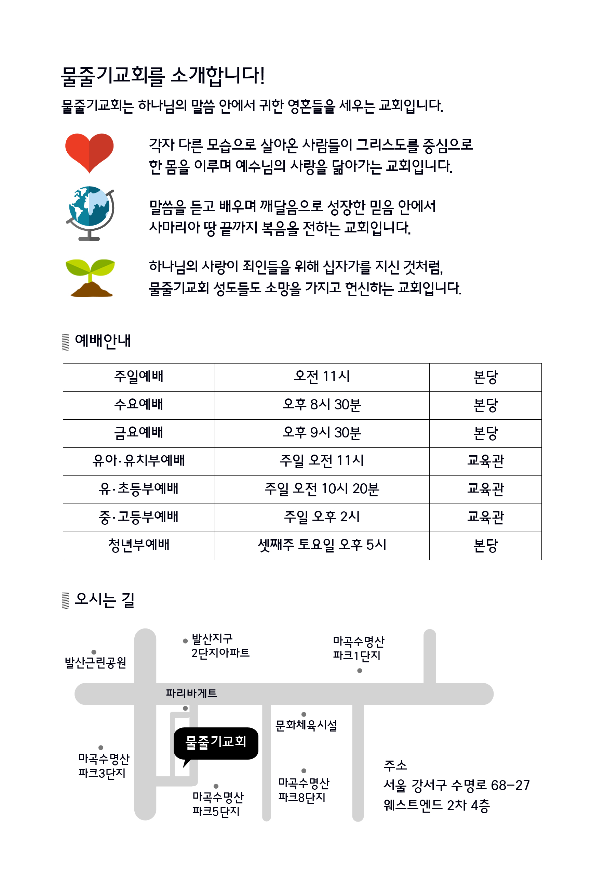

사무엘상

사무엘상 강해

조춘숙 목사

물줄기교회 출판부

동영상 설교는 https://vimeo.com/watercourse 또는 YouTube에서 “물줄기교회”를 검색해 주세요.

# 이 책을 읽는 분들께

『사무엘상』을 통해 우리는 이 사실을 더욱 확실하게 알 수 있는데 사무엘과 다윗 그리고 아비가일처럼 오직 하나님만 바라보는 자가 있는가 하면, 사울이나 도엑처럼 세상과 자신을 위해서 살아가는 자가 있습니다.

하나님께서는 성도들이 험한 세상에서 살아갈지라도 자신의 인생을 여호와께 맡기고 사무엘과 다윗처럼 늘 평안한 마음과 안식을 누리며 복된 인생을 살아가기를 원하고 계십니다.

여러분은 순종이 제사보다 낫다는 사무엘의 믿음으로 어떤 상황에서도 하나님께서 역사하실 것을 믿기 바랍니다. 그리고 하나님께서 역사하

시기 전에는 다윗처럼 인내해야 할 것입니다. 사울의 끝없는 공격을 받으면서도 하나님의 말씀에 순종하며 마음을 다하여 여호와를 섬기겠다는 다윗의 믿음을 본받는다면 틀림없이 하나님의 보호를 받으며 은혜로 살 것입니다.

하늘에서 내리는 눈이 온 세상을 하얗게 덮는 것처럼 하나님의 은혜는 모든 사람을 차별하지 않고 채워주십니다. 그 은혜를 다윗처럼 감사하는 마음으로 간직할 것인지 사울처럼 가치 없게 쏟아버릴 것인지 그 선택은 여러분에게 달려있습니다.

마음을 다하여 여호와를 섬기고 하나님을 바라보는 사람들처럼 여러분은 오직 하나님만 인생의 주인이라는 것을 믿고 순종하시기 바랍니다. 분명히 하나님의 사랑이 다윗의 인생을 영화롭게 하신 것처럼 여러분의 인생을 아름답게 하실 것입니다.

1에브라임 산지 라마다임소빔에 에브라임 사람 엘가나라 하는 사람이 있었으니 그는 여로함의 아들이요 엘리후의 손자요 도후의 증손이요 숩의 현손이더라 2그에게 두 아내가 있었으니 한 사람의 이름은 한나요 한 사람의 이름은 브닌나라 브닌나에게는 자식이 있고 한나에게는 자식이 없었더라 3이 사람이 매년 자기 성읍에서 나와서 실로에 올라가서 만군의 여호와께 예배하며 제사를 드렸는데 엘리의 두 아들 홉니와 비느하스가 여호와의 제사장으로 거기에 있었더라 4엘가나가 제사를 드리는 날에는 제물의 분깃을 그의 아내 브닌나와 그의 모든 자녀에게 주고 5한나에게는 갑절을 주니 이는 그를 사랑함이라 그러나 여호와께서 그에게 임신하지 못하게 하시니 6여호와께서 그에게 임신하지 못하게 하시므로 그의 적수인 브닌나가 그를 심히 격분하게 하여 괴롭게 하더라 7매년 한나가 여호와의 집에 올라갈 때마다 남편이 그같이 하매 브닌나가 그를 격분시키므로 그가 울고 먹지 아니하니 8그의 남편 엘가나가 그에게 이르되 한나여 어찌하여 울며 어찌하여 먹지 아니하며 어찌하여 그대의 마음이 슬프냐 내가 그대에게 열 아들보다 낫지 아니하냐 하니라 9그들이 실로에서 먹고 마신 후에 한나가 일어나니 그 때에 제사장 엘리는 여호와의 전 문설주 곁 의자에 앉아 있었더라 10한나가 마음이 괴로워서 여호와께 기도하고 통곡하며 11서원하여 이르되 만군의 여호와여 만일 주의 여종의 고통을 돌보시고 나를 기억하사 주의 여종을 잊지 아니하시고 주의 여종에게 아들을 주시면 내가 그의 평생에 그를 여호와께 드리고 삭도를 그의 머리에 대지 아니하겠나이다

2015년 11월 물줄기교회 목사 조춘숙

# 1. 두 분깃을 받은 한나

이스라엘은 그들의 왕이신 하나님을 버리고 눈에 보이는 사람을 왕으로 세우길 원했습니다. 그래서 하나님은 그들이 바라는 대로 사울을 왕으로 세우셨습니다. 그러나 하나님이 경고하셨던 대로 그들은 도리어 왕으로 인해 고통을 당하였습니다. 이처럼 하나님의 뜻을 어긴 인간의 욕심에서 비롯된 선택은 어리석은 결과를 초래합니다.

태초의 인간이었던 아담이 에덴 동산에서 스스로 하나님과 같이 되고자 했던 것처럼 이스라엘은 자신의 유익을 위해 하나님을 버리고 말았습니다. 인류의 조상인 아담의 죄로부터 브닌나와 한나, 엘리와 사무엘, 사울과 다윗으로 이어지는 영적인 흐름을 살펴보면 인류의 역사는 끊임없는 선과 악의 대립으로 이어져 있음을 알 수 있습니다. 지금도 이 대립은 계속되고 있는데 우리가 하나님께서 어떤 사람을 선한 자로 택하시는지 알아야만 진리의 길을 갈 수 있습니다. 그 길을 사무엘의 가르침을 통해 알아보고자 합니다.

B.C. 1105년에 태어난 사무엘은 사사시대가 쇠퇴하면서 왕정시대를 여는 큰일을 감당한 선지자입니다. 사무엘은 이스라엘의 초대 왕으로 사울에게 기름을 부어 왕으로 세웠지만, 사울은 자신을 택해 주신 하나님을 배신했습니다. 하나님께서는 그런 사울을 버리고 다윗에게 기름을 부어 왕으로 세우셨습니다. 이것을 보면 인간의 모든 역사는 인간의 판단과 결정으로 만들어지는 것이 아니라 하나님께서 이끌어가고 계신 결과임을 알 수 있습니다. 당장은 악이 승리하는 것처럼 보이지만, 그 안에서 선을 붙들고 세우시는 하나님이 계시기 때문에 성도들은 믿음을 이어갈 수 있습니다. 타락한 엘리 제사장 앞에 사무엘을 세우심으로 죄 가운데서도 말씀을 세우셔서 역사의 주체자가 하나님이라는 것을 알려주셨습니다. 하나님은 죄가 관영한 세상에 방주를 세우셨습니다. 그리고 출애굽한 이스라엘 백성 가운데 성막을 세우셨습니다. 불뱀 가운데 놋뱀을 세우셨고, 죄인들 가운데 예수님을 보내셨습니다. 이것은 악한 죄를 지어 죽을 수밖에 없는 죄인들에게 생명을 주시기를 간절히 원하고 계시는 하나님의 마음을 알 수 있는 귀한 대목입니다.

하지만 생명을 주시는 선은 악에 비해 언제나 미약하게 보입니다. 주님이 육신을 입고 세상에 오셨을 때, 그분의 모습은 연한 순 같고 마른 땅에서 나온 줄기 같아서 고운 모양도 없고 풍채도 없었습니다. 그런 모습을 본 세상은 흠모할 만한 아름다운 것이 없었기 때문에 주님을 멸시했고 싫어했습니다. 그로 인해 주님은 간고와 질고를 많이 겪었습니다. 이런 고통은 세상과 타협하지 않았기 때문에 받은 핍박입니다. 세상에서는 욕심과 정욕의 열매를 많이 맺은 사람이 높임을 받습니다. 세상의 열매가 많을수록 존경을 받고 권세를 얻기 때문에 세상 사람들은 세상의 열매를 얻기 위해 최선을 다해 노력하고 있습니다. 하지만 하나님께서는 성도에게 성령의 열매 외에는 그 어떤 열매도 잉태하지 말라고 말씀하시는 분입니다.

하나님께서 악의 열매를 맺지 않도록 일방적인 은혜로 막아주셨던 사람이 바로 오늘 본문에 등장하는 한나입니다. ‘한나’라는 이름의 뜻은 ‘자비와 은총’입니다. 한나는 그 이름처럼 하나님과 남편 엘가나에게 많은 사랑을 받았습니다. 그러나 아쉽게도 그녀가 진정으로 원하는 세상의 열매인 자녀가 없었습니다. 그녀가 잉태하지 못한 것은 사무엘상 1장 5절의 말씀처럼 여호와께서 그 여인에게 임신하지 못하게 하셨기 때문입니다. 이렇게 세상적인 약점을 갖고 있던 한나는 엘가나의 또 다른 아내인 브닌나의 핍박 때문에 많은 고통을 당했습니다. ‘브닌나’의 이름은 ‘산호와 보석’이라는 뜻을 가지고 있습니다. 그만큼 브닌나는 세상에서는 빛이 나는 아름다운 여인이었습니다. 세상 사람들이 그토록 원하는 세상의 열매인 자녀들을 생산한 당당한 세상의 어미였습니다.

브닌나는 남편이 자신보다 한나를 더 사랑하는 것이 늘 불만이었습니다. 그래서 한나의 약점인 자식이 없는 것을 빌미로 그녀를 괴롭히며 고통을 주었습니다. 이처럼 힘을 가진 자가 갖지 못한 자를 지배하는 곳이 바로 세상입니다. 세상에서는 갖지 못한 자가 가진 자에게 조롱을 받을 수밖에 없습니다. 그것이 재물이든 건강이든 자녀이든 가진 자가 힘을 얻는 것이 세상입니다.

갈라디아서 4장 23-24절

> 여종에게서는 육체를 따라 났고 자유 있는 여자에게서는 약속으로 말미암았느니라 이것은 비유니 이 여자들은 두 언약이라 하나는 시내 산으로부터 종을 낳은 자니 곧 하갈이라

아브라함에게는 두 아내인 사라와 하갈이 있었습니다. 여기에서도 사라는 하갈보다 남편의 사랑을 더 많이 받았지만 자식이 없었고, 하갈은 세상의 열매인 이스마엘을 낳았습니다. 하갈은 자식이 없는 사라를 조롱했지만, 하나님께서는 믿음을 지키는 사라에게 이삭이라는 성령의 열매를 허락하셨습니다. 헌데 사도 바울은 이삭과 이스마엘을 낳은 사라와 하갈을 두고 ‘두 언약’이라고 말하고 있습니다. 사라는 하나님의 약속을 받은 은혜이고, 하갈은 육체를 따라 행해야 하는 율법에 비유하고 있는 것입니다. 그는 사라가 낳은 이삭을 하나님의 약속 아래에서 받는 그리스도인의 자유라고 하였습니다. 반면에 하갈은 육체를 따라 세상의 아들 이스마엘을 낳았지만 약속의 아들이 아니었기 때문에 하나님의 유업을 받지 못했다고 말합니다.

덧붙여 사도 바울은 갈라디아서 4장 29절에서 ‘그때에 육체를 따라 난 자가 성령을 따라 난 자를 핍박한 것 같이 이제도 그러하다’라는 말씀을 통해 하나님의 은혜 아래 사는 자들은 세상의 힘을 가진 자들에게 핍박을 당할 수밖에 없다고 말합니다. 세상의 힘과 자랑인 아들을 낳은 하갈과 브닌나가 아들을 낳지 못한 사라와 한나를 보며 비웃은 것처럼 세상은 눈에 보이는 열매를 요구합니다. 세상의 요구와는 반대로 하나님의 약속은 당장 눈에 보이는 것이 아니기에 믿음으로 받아야만 진리 안에서 자유할 수 있습니다. 하지만 많은 사람들은 당장 눈에 보이는 세상의 열매인 아들을 원하므로 하나님의 영원한 약속을 기다리지 못하고 있습니다.

브닌나는 세상의 열매를 갖지 못한 한나를 핍박하며 자신의 힘을 과시하였으나, 실상 한나가 잉태하지 못한 것은 하나님께서 한나가 세상을 품는 것을 원치 않으셨기 때문에 잠깐의 고난을 허락하셨던 것입니다. 성도들이 간절히 원하는데도 하나님께서 응답하시지 않는 때가 있는데, 그것은 바로 성령의 충만함을 먼저 채워주고 싶은 하나님의 사랑 때문입니다. 그런데 이것을 알 리 없는 브닌나가 하나님의 사람인 한나를 조롱한 것입니다.

사무엘상 1장 11절

> 서원하여 이르되 만군의 여호와여 만일 주의 여종의 고통을 돌아보시고 나를 기억하사 주의 여종을 잊지 아니하시고 주의 여종에게 아들을 주시면 내가 그의 평생에 그를 여호와께 드리고 삭도를 그의 머리에 대지 아니하겠나이다

한나는 엎드려 통곡하며 하나님께서 아들을 주시면 그 아들을 영원히 하나님을 섬기는 종인 나실인으로 드리겠다고 서원하였습니다. 지금 그녀가 아들을 하나님께 드리겠다고 하는 것은 당장 아들을 갖고 싶은 욕심에 무작정 서원한 것이 아닙니다. 이것은 생명의 주인이 하나님이라는 것을 인정하는 믿음이며, 하나님의 은혜가 충만한 지혜로운 아들을 주시면 그 아들이 하나님을 위해서 일하도록 다시 하나님께 드리겠다는 진실된 마음입니다.

간혹 한나의 이 말을 오해한 교인들 중에 아들을 낳으면 하나님께 드리겠다고 서원한 뒤, 아들을 얻으면 그 아들에게 신학을 강요하는 부모를 볼 수 있습니다. 물론 하나님께서 부르시고 세우신 종이라면 부모가 강요하지 않아도 목회의 길로 갈 것입니다. 하지만 진리를 올바로 깨닫지 못한 부모가 아들을 가질 욕심으로 서원해 놓고, 아이가 목회의 길로 가지 않으면 하나님께 벌을 받을까 봐 두려워 아이의 재능이나 꿈과 상관없이 신학교에 보내는 모습을 보면 안타깝기만 합니다. 왜냐하면 이런 행동은 영적 무지에서 비롯된 것이며, 결코 옳지 않은 신앙의 모습이기 때문입니다. 자기 혼자 서원해 놓고 서원을 해서 얻은 아들이니 그의 인생을 마음대로 하겠다는 것은 하나님을 기만하는 죄이며 어리석은 행동입니다.

한나가 잉태하지 못했던 것은 하나님의 의도에서 비롯된 것입니다. 하나님께서는 한나가 자발적인 신앙을 갖기 원하셨기 때문에 잠깐의 육적 고난을 통해 성숙한 신앙을 가질 수 있도록 훈련시키셨던 것입니다. 이것은 단지 육의 아들을 주기 위한 차원이 아닙니다. 사무엘은 사사시대를 끝내고 왕정시대로 넘어가는 아주 중요한 다리 역할을 감당해야 하는 선지자입니다. 하나님의 크신 계획에 사용될 선지자이기 때문에 그 어미가 먼저 옥토가 되어야만 사무엘이 온전히 성장할 수 있는 것입니다.

하나님의 계획대로 한나는 브닌나를 통해 서서히 옥토로 변해갔습니다. 세상의 열매를 갖지 못해서 그 마음이 자갈밭과 같았던 한나는 브닌나의 핍박으로 인해 하나님만 의지하는 옥토로 변한 것입니다. 브닌나의 자식들을 보면서 자신이 얼마나 연약하고 보잘 것 없는 존재인지 깨닫게 되었고, 생명의 주인이신 하나님께서 주시지 않으면 그 무엇도 가질 수 없는 약한 존재라는 것을 깨닫게 되었습니다. 고난의 시간이 길어질수록 인간의 유한성을 느끼고, 자신의 한계를 느끼면서 하나님을 더욱 신뢰하고 자비와 은총을 바라게 된 것입니다. 한나가 예수님을 잉태한 마리아처럼 목숨을 다하여 하나님만 의지하는 믿음을 갖게 되자 하나님께서는 그제야 사무엘을 허락하셨습니다. 지금도 하나님께서는 사무엘과 같은 온전한 열매를 원하고 계십니다. 브닌나가 낳은 아들처럼 세상 모두가 원하는 욕심의 열매가 아니라 사무엘과 같이 하나님의 기업을 받을 수 있는 자비와 은총으로 잉태한 성령의 열매를 원하고 계시는 것입니다.

사람들은 다른 사람보다 자신의 소유가 많을 때 복을 받았다고 합니다. 소유가 많으면 그래도 자신이 하나님께 무언가 잘했기 때문에 복을 받았다는 생각에 우월감을 갖기도 합니다. 하지만 우리는 소유가 사라졌을 때도 하나님께 복을 받은 자라고 자랑할 수 있는지 자신의 신앙을 살펴보아야 합니다. 만약 성도들이 소유를 기준으로 복과 믿음을 논한다면 하나님께서 은혜를 주셔도 감사하지 못할 것이므로 책망을 받게 될 것입니다.

사무엘상 1장 4-5절

> 엘가나가 제사를 드리는 날에는 제물의 분깃을 그의 아내인 브닌나와 그의 모든 자녀에게 주고 한나에게는 갑절을 주니 이는 그를 사랑함이라 그러나 여호와께서 그에게 임신하지 못하게 하시니

모세가 받은 율법에 의하여 히브리 남자는 일 년에 세 번, 절기마다 법궤가 있는 실로에 올라갔습니다. 법궤는 처음에 광야를 거쳐 가나안 땅인 길갈에 보관되었지만 가나안을 정복한 후에 땅을 분배할 동안 실로로 옮겨졌습니다. 훗날 이 실로는 블레셋과의 전쟁에서 법궤를 빼앗긴 뒤 파괴되어 영원히 역사 속으로 사라진 곳입니다.

이스라엘 백성들이 지킨 절기는 무교절(유월절), 맥추절(오순절, 칠칠절), 수장절(장막절, 초막절)입니다. 지금 온 가족이 함께 올라가는 것으로 보아 무교절 때로 추정해 볼 수 있습니다. 엘가나는 하나님께 드릴 제물을 브닌나와 그의 자녀들에게도 주었지만, 한나에게는 그들의 갑절을 더 주었습니다. 그만큼 엘가나는 그 누구보다 아내인 한나를 사랑한 것입니다. 이것만 봐도 한나를 향한 브닌나의 질투가 얼마나 심했을지 짐작할 수 있습니다. 남편의 온전한 사랑을 받았던 한나와 같이 세상의 열매가 없는 성도들은 남편이신 하나님의 사랑을 받고 있습니다.

이사야 54장 5절

> 이는 너를 지으신 이가 네 남편이시라 그의 이름은 만군의 여호와이시며 네 구속자는 이스라엘의 거룩한 이시라 그는 온 땅의 하나님이라 일컬음을 받으실 것이라

성도는 남편되신 하나님의 사랑을 받고 있습니다. 이것을 사랑을 받고 있는 성도보다 사탄과 세상이 더 잘 알고 있으므로 성도를 핍박하고 있습니다. 성도를 괴롭히는 그들이 바로 브닌나입니다. 브닌나가 어떻게 하면 한나를 더 괴롭힐 수 있을까 궁리한 것처럼 사탄은 어떻게 하면 성도의 믿음을 빼앗을까 고민하고 있습니다. 세상의 브닌나는 물질이 없는 여러분에게 돈 때문에 겪어야 하는 아픔을 주어 여러분을 부끄럽게 만들기 위해서 노력할 것입니다. 또한 브닌나는 건강이 좋지 않은 여러분이 좌절하도록 여러분 앞에 어려운 환경을 만들어 놓을 것입니다. 세상 곳곳에 숨어 있는 브닌나는 성도들을 격분시킬 수만 있다면 물불 가리지 않고 공격할 것입니다.

이처럼 세상의 브닌나는 최선을 다해 성도들의 믿음을 빼앗기 위해 노력하고 있는데, 정작 성도들은 이에 대한 준비를 하고 있지 않습니다. 성도들은 세상의 공격을 받으면 자신의 무능함을 탄식하지만 하나님께 의지해야 한다는 생각은 하지 않습니다. 한나처럼 도저히 해결할 수 없는 지경까지 몰려야만 그제야 하나님을 생각하며 억지로 무릎을 꿇고 기도합니다. 그런데 더 이상 방법이 없어서 억지로 기도할지라도 기도해야 합니다.

만약 브닌나가 없었다면, 그리고 쉽게 잉태했다면 한나는 자신의 무능을 깨닫지 못했을 뿐 아니라 하나님을 의지하지 않았을 것입니다. 그러나 한나가 하나님의 마음을 깨닫고 성장하여 사무엘을 성령의 열매로 받고 나면, 브닌나는 한나를 다듬는 채찍으로써 사명을 다 했기 때문에 꺾이고 말 것입니다. 다윗이 성장했을 때 사울이 꺾였고, 이스라엘이 바로 섰을 때 블레셋이 꺾였습니다. 그러므로 한나는 브닌나가 왜 자신을 괴롭히느냐고 울기보다는 하나님께서 왜 브닌나를 허락하셨는지 자신을 살펴보는 것이 먼저입니다.

실로에 올라가 하나님께 드릴 두 배의 분깃을 받았음에도 불구하고 한나는 감사하지 않고 오히려 자신에게 없는 것 하나를 놓고 슬퍼했습니다. 만약 자식이 없는 한나가 남편인 엘가나의 사랑도 받지 못하는 처지라면 한나에게는 아무런 희망도 없었을 것입니다. 그러나 비록 아들은 없을지라도 자신을 사랑하는 남편에게 감사하며 남편을 더욱 사랑한다면, 남편의 사랑으로 인해 아들을 낳을 수 있는 여지가 있는 것입니다.

본문에 한나가 브닌나보다 두 분깃을 더 받았다는 것은 세상 사람들은 세상이라는 한 분깃을 받아서 살아가지만, 하나님의 백성은 세상이라는 한 분깃과 하나님의 나라인 한 분깃을 더 받아서 살아가고 있는 것을 의미합니다. 세상의 분깃은 육체의 생명이 끝나면 사라지지만 하늘의 분깃은 영원하기 때문에 성도들은 큰 축복을 받은 사람들입니다. 브닌나는 남편의 사랑이 전부라는 것을 알았기 때문에 한나를 질투하고 있는데도 한나는 도리어 브닌나가 가진 세상의 열매에 주눅이 들었습니다. 자기가 받은 은혜를 제대로 보지 못하니까 세상보다 더 큰 하나님의 사랑을 갖고 있으면서도 부끄러운 삶을 사는 것입니다.

성도들은 구원 하나만으로 감사하는 삶을 살아야합니다. 하나님께서는 성도들에게 이미 축복을 주셔서 이 땅에서 하나님의 자녀로 살게 하셨습니다. 그 위에 천국의 백성으로 살 수 있는 권한을 더해 주신 것은 세상 사람들이 받은 육의 축복과는 비교할 수 없는 엄청난 은혜입니다. 그런데 이미 큰 축복을 받은 성도들이 세상이 가진 물질과 권세를 보면서 힘없이 무너지는 모습을 보면 너무나 안타깝습니다. 이런 신앙은 브닌나가 격분시킬 때마다 울면서 먹지 않던 한나의 연약한 믿음과 동일한 모습입니다. 가만히 살펴보면 한나에게 부족한 것은 오직 한 가지, 자식이 없다는 것뿐이었습니다. 하나님의 크신 사랑을 받는 성도들이 물질이 부족하다는 이유 한 가지만으로 괴로워하며 감사가 없는 인생을 사는 것도 이와 전혀 다르지 않습니다.

하지만 한나가 자녀를 잉태하지 못하게 하신 것이 하나님이라고 한 것을 볼 때, 인간의 생각과 욕심으로 만들어진 헌 부대를 버리고 온전한 믿음으로 새 부대를 준비했다면 그녀는 자연스럽게 잉태했을 것입니다. 문제는 이런 사실을 한나가 언제 깨닫느냐 하는 것입니다. 하나님께서는 자녀에게 필요한 것을 채워주시기 위해서 준비하고 계십니다. 그러나 하나님의 백성은 권세와 많은 재물을 주지 않는다고 늘 불평하면서 영적 양식인 말씀조차 먹지 않는 어리석음을 범하고 있습니다.

브닌나가 많은 자식들을 거느리고도 남편의 사랑을 갈급해 하는 것을 보면 한나는 남편의 사랑 하나만으로 만족할 수 있어야 마땅합니다. 세상 사람들이 많은 소유와 상관없이 늘 갈급해 하며 더 큰 욕심을 내는 것을 보면, 하나님의 사랑이 채워지지 않은 심령에는 만족이 없음을 알 수 있습니다. 결국 자식도 남편의 사랑이 있어야만 잉태할 수 있는 것입니다. 그 남편이 한나를 사랑하고 있는데도 남편으로 만족하지 못하고 눈에 보이는 욕심만 원한다면 남편도 그녀의 곁을 떠나게 될 것입니다. 한나가 깨닫지 못하고 있을 때에도 하나님께서는 그녀가 성령의 열매를 맺도록 하기 위해서 일하고 계셨습니다. 적당한 때와 시간이 필요했을 뿐 한나가 온전히 순종만 한다면 아버지께서 세상에 부끄럽지 않은 삶을 살 수 있도록 도와주실 것입니다.

사무엘상 1장 3절

> 이 사람이 매년 자기 성읍에서 나와서 실로에 올라가서 만군의 여호와께 예배하며 제사를 드렸는데 엘리의 두 아들 홉니와 비느하스가 여호와의 제사장으로 거기에 있었더라

한나가 실로에 올라가 제사를 드릴 당시에 제사장으로 있던 사람은 엘리와 그의 두 아들인 홉니와 비느하스였습니다. 엘리는 사사시대 말기의 대제사장으로 사무엘을 맡아 기르는 데는 성공하였지만, 자신의 두 아들인 홉니와 비느하스를 믿음으로 교육하는 데는 실패한 사람입니다. 블레셋과의 전쟁에서 언약궤를 빼앗긴 후 두 아들이 전사했다는 소식을 듣고 의자에서 넘어져 목이 부러져 죽은 것을 보면 그가 얼마나 타락했는지 알 수 있습니다. 나라가 전쟁을 하고 있는데도 영적으로 둔하여 기도의 자리에 앉아 있지 않았기 때문입니다. 또한 엘리의 아들인 홉니와 비느하스는 제사장으로서 해서는 안 되는 죄를 지었습니다. 제사장은 백성의 죄를 살피고 하나님께 죄 사함을 받도록 피의 제사를 드려야 하는데 이들은 제사장직을 이용하여 육적인 이익을 취하는 죄를 지었습니다.

레위기 3장 3-5절을 보면 제사장들은 제물인 동물의 머리에 안수하여 제물을 가지고 온 사람의 죄를 전가합니다. 그리고 그 피를 제단 사방에 뿌리고 내장에 덮인 기름과 내장에 붙은 모든 기름을 떼어 내어 번제단위에서 태워야 합니다. 이 번제물의 향기를 여호와께서 흠향하시는 것입니다. 따라서 하나님께 제사를 드릴 때 제사장이 자기의 몫을 가져가기 전에 반드시 번제단에서 먼저 기름을 태워야 하는 것이 법입니다.

홉니와 비느하스는 죄인이 자기의 생명을 대신하여 제물에게 죄를 전가하고 새 생명을 얻는 귀한 제사를 드릴 때조차 자신들의 이익을 위해 하나님께 드리기 전에 먼저 고기를 날것으로 가져갔을 만큼 타락했던 것입니다. 거룩해야 하는 제사장이 백성들이 가지고 온 제물을 탐한다는 것은 하나님을 멸시한 행위이며, 거룩한 곳에 가증한 것이 선 것과 같습니다. 홉니와 비느하스의 이런 모습은 인간의 탐욕을 넘어서 하나님께서 이스라엘과 맺은 언약과 구속을 파괴하는 엄청난 죄입니다. 그런데 대제사장인 엘리는 그런 두 아들을 책망하지 않고 그대로 두었습니다. 그들에게 하나님의 이름을 모독한 죄를 물어 제사장의 자리에서 쫓아내어 죽여야 했음에도 불구하고, 하나님보다 자식들을 더 사랑했기 때문에 그들의 죄를 묻지 못한 것입니다.

이렇게 악하고 타락한 제사장들이 있는 실로에 성막이 있었기 때문에 한나는 하나님께 예배를 드리기 위해 실로로 올라가고 있습니다. 당시에는 성막에서 제사를 드려야 하는 공간적 제한성이 있었지만 지금은 성전이 성도 안에 있기 때문에 어디서나 예배를 드릴 수 있습니다. 이것 또한 지금 성도들이 받은 놀라운 축복입니다. 이제 세상은 더욱 죄가 관영할 것이므로 성도들은 더욱 영적으로 어두운 밤길을 걷게 될 것입니다. 그렇기 때문에 성도들이 들고 있는 등불은 더욱 빛을 발할 것이며 어둠에서 길을 잃은 영혼들을 이끌어 내기가 오히려 더 쉬울 수도 있습니다. 이제 성도들에게는 세상의 열매가 없다고 울며 먹지 않던 한나처럼 연약한 모습을 보일 시간이 없습니다. 지금은 하나님의 뜻을 깊이 생각하며 성도가 해야 할 일이 무엇인가 찾아서 움직여야 할 때입니다.

여러분은 하나님께 두 분깃의 축복과 사랑을 받은 성도입니다. 비록 세상의 열매가 적더라도 하늘의 분깃을 받았다는 것을 잊지 말고 감사하는 삶을 산다면, 하나님께서 사무엘처럼 귀한 열매를 맡기실 것입니다.

여러분 스스로 등불을 등경 위에 두는 지혜를 갖는 성도가 되시기를

예수그리스도의 이름으로 축원을 드립니다.

사무엘상 2장 1-11절

> 1한나가 기도하여 이르되 내 마음이 여호와로 말미암아 즐거워하며 내 뿔이 여호와로 말미암아 높아졌으며 내 입이 내 원수들을 향하여 크게 열렸으니 이는 내가 주의 구원으로 말미암아 기뻐함이니이다 2여호와와 같이 거룩하신 이가 없으시니 이는 주 밖에 다른 이가 없고 우리 하나님 같은 반석도 없으심이니이다 3심히 교만한 말을 다시 하지 말것이며 오만한 말을 너희의 입에서 내지 말지어다 여호와는 지식의 하나님이시라 행동을 달아 보시느니라 4용사의 활은 꺾이고 넘어진 자는 힘으로 띠를 띠도다 5풍족하던 자들은 양식을 위하여 품을 팔고 주리던 자들은 다시 주리지 아니하도다 전에 임신하지 못하던 자는 일곱을 낳았고 많은 자녀를 둔 자는 쇠약하도다 6여호와는 죽이기도 하시고 살리기도 하시며 스올에 내리게도 하시고 거기에서 올리기도 하시는도다 7여호와는 가난하게도 하시고 부하게도 하시며 낮추시기도 하시고 높이시기도 하시는도다 8가난한 자를 진토에서 일으키시며 빈궁한 자를 거름더미에서 올리사 귀족들과 함께 앉게 하시며 영광의 자리를 차지하게 하시는도다 땅의 기둥들은 여호와의 것이라 여호와께서 세계를 그것들 위에 세우셨도다 9그가 그의 거룩한 자들의 발을 지키실 것이요 악인들을 흑암 중에서 잠잠하게 하시리니 힘으로는 이길 사람이 없음이로다 10여호와를 대적하는 자는 산산이 깨어질 것이라 하늘에서 우레로 그들을 치시리로다 여호와께서 땅 끝까지 심판을 내리시고 자기 왕에게 힘을 주시며 자기의 기름 부음을 받은 자의 뿔을 높이시리로다 하니라 11엘가나는 라마의 자기 집으로 돌아가고 그 아이는 제사장 엘리 앞에서 여호와를 섬기니라

# 2. 성숙한 한나의 기도

성도들은 신령과 진정으로 예배를 드려야 합니다. 신령과 진정은 다른 말로 ‘성령과 진리’인데, 성령과 진리로 예배를 드리기 위해서는 보이는 세상보다 보이지 않는 하나님의 나라를 소중히 여기는 믿음이 있어야 합니다. 하나님께서는 성도들이 이런 믿음으로 죄를 이겨주기를 원하고 계십니다. 아담과 하와에게 선악과를 먹지 말라고 명령하신 것은 사탄의 유혹을 말씀으로 담대히 이겨주기를 바라는 아버지의 마음에서 비롯된 것이었습니다. 세상은 죄가 관영한 곳이기 때문에 성도는 믿음으로 이겨내야 합니다. 연어가 흘러가는 강물을 역류하여 자기가 태어난 고향을 향해 올라가는 것처럼 죄의 바다인 세상을 역류하여 영원한 안식처를 향해 달려가는 성도만이 구원을 받을 수 있습니다.

이스라엘 백성과 제사장이 타락했지만 한나는 모든 욕심을 내려놓고 하나님께만 집중하며 진심을 다해 회개하기 시작했습니다. 브닌나의 핍박을 핑계하며 기도하지 않았던 시간과 사랑을 주는 남편에게 감사하지 못했던 자신을 돌이켜보며 죄송한 마음으로 기도했습니다. 하나님께 넘치는 사랑을 받고 있음을 깨달은 한나는 더 이상 아들이 없다는 사실이 부끄럽지 않았고, 자신을 핍박하는 브닌나가 밉지도 않았습니다. 한나는 자신에게 직접 역사하시는 하나님을 만났기 때문에 사람이나 환경은 그녀가 하나님께 예배를 드리는데 아무런 방해가 되지 않았습니다.

흔히 교인들은 사람이나 환경 때문에 예배에 집중할 수 없다고 말합니다. 그러나 그런 말 자체가 이미 자신은 하나님과 멀어져 있음을 스스로 고백하는 것과 같습니다. 하나님을 진심으로 만난 성도에게는 사람과 환경의 방해가 심해도 그것이 보이지 않습니다. 자신의 주변을 탓하는 사람은 실상은 환경 때문에 예배를 드리지 못하는 것이 아니라 하나님께 집중하지 않기 때문에 온전한 예배를 드리지 못하는 것입니다.

이사야 1장 11-12절

> 여호와께서 말씀하시되 너희의 무수한 제물이 내게 무엇이 유익하뇨 나는 숫양의 번제와 살진 짐승의 기름에 배불렀고 나는 수송아지나 어린 양이나 숫염소의 피를 기뻐하지 아니하노라 너희가 내 앞에 보이러 오니 이것을 누가 너희에게 요구하였느냐 내 마당만 밟을 뿐이니라

하나님께서 백성들이 바치는 숫양의 번제와 살진 짐승의 기름이 조금도 기쁘지 않다고 말씀하신 이유는 그것이 자신들의 죄를 용서받기 위해 가져 오는 제물이기 때문입니다. 백성들이 제물을 많이 가지고 온다는 것은 그들이 죄를 많이 지었다는 것을 의미합니다. 그러므로 하나님께서는 더 이상 진실한 믿음이 없는 헛된 제물을 가져 오지 말라고 하신 것입니다. 하나님께 드리는 제물까지도 사실은 자신의 죄를 사함받기 위한 목적이었으므로, 하나님께서는 형식적인 제사에 앞서 하나님의 백성으로서 거룩한 삶을 살기 원하셨던 것입니다. 이처럼 성도는 자신을 위해 헌물을 드려서는 안 됩니다. 그저 주신 은혜에 감사해서 드리는 예물을 하나님께서는 기쁘게 받으시고 더 큰 상급을 주실 것입니다.

한나가 겸손할 수 있었던 것은 세상의 열매가 없었기 때문입니다. 자신은 아무것도 할 수 없다는 것을 깨달았기 때문에 하나님만이 구원자라는 고백과 함께 성령과 진리로 예배를 드릴 수 있었던 것입니다. 고난도 축복도 모두 하나님께서 허락하시는 것이기에 고난의 칼로 인생의 모난 부분을 잘라낸다면 성숙한 성도의 모습으로 살아갈 수 있을 것입니다. 그리고 하나님께서는 이런 성숙한 성도를 축복하실 것입니다.

사무엘상 1장 20절

> 한나가 임신하고 때가 이르매 아들을 낳아 사무엘이라 이름하였으니 이는 내가 여호와께 그를 구하였다 함이더라

‘사무엘’이라는 이름의 뜻은 ‘내가 여호와께 그를 구하였다’는 것으로 하나님께 간절히 구하여 응답을 받았다는 뜻입니다. 브닌나에게 핍박과 조롱을 받은 한나는 죽을 힘을 다하여 기도했습니다. 아들을 주시면 나실인으로 드리겠다는 서원을 한 것을 보면 한나가 어떤 심정으로 하나님께 부르짖었을지 알 수 있습니다. 이렇게 마음을 찢는 성도의 진실한 기도는 반드시 열납될 것입니다.

나실인은 하나님의 명령대로 살아야 하므로 자신의 인생이 없는 사람입니다. 머리에 삭도를 대지 않고 포도주를 마시지 않아야 하며 시체를 가까이 해서는 안 됩니다. 이렇게 살기 위해서는 세상과 철저히 구별된 삶을 살아야만 합니다. 머리에 삭도를 대지 않는 이유는 하나님은 나의 왕이며 하나님께서 주신 약속을 훼손하지 않는 종으로 살아가겠다는 결단을 보여드리는 것입니다. 포도주를 마시지 않는 이유는, 나실인은 하나님의 형상을 닮은 거룩한 육체와 정신을 보존해야 하기 때문입니다. 세상의 술을 마시면 정신과 육체 모두 세상적으로 변하게 되므로 나실인은 포도주를 마시면 안 됩니다. 사람은 술을 먹으면 자기중심적이 됩니다. 술에 갇혀 자신의 생각 안에서 판단하고 행동하게 되므로 하나님의 명령을 거역하고도 그것이 죄인 줄 모르게 됩니다. 결국 하나님의 생각을 읽지 못하는 자가 되는 것입니다.

예수님께서 아비가 죽어 장사를 치르러 가겠다는 제자에게 ‘죽은 자는 죽은 자에게 맡기라’고 말씀하신 것은 성도는 새 생명을 받은 산 자이기 때문에 흙으로 돌아간 죽은 자는 영원한 생명을 받지 못한 죽은 자에게 장사하도록 하신 것입니다. 이러한 이유로 나실인은 생명이 없는 죽은 자를 만져서는 안됩니다. 한나는 이렇게 세상과 철저하게 격리된 길을 가야 하는 나실인으로 사무엘을 키우겠다고 서원한 것입니다.

여러분은 하나님께 어떤 믿음을 드렸습니까? 하나님께서 받으실만한 성령의 열매가 있습니까? 한나는 사무엘을 달라고 기도했고, 그 기도의 열매를 하나님의 나라와 의를 위해 믿음으로 기꺼이 드렸습니다.

한나의 기도를 살펴보면 한나의 세상적인 욕심은 고난의 터널을 통과하면서 영적인 믿음으로 거듭났음을 알 수 있습니다. 자신이 맺어야 하는 열매는 브닌나처럼 세상이 원하는 보석이 아니라 사무엘과 같은 성령의 열매임을 거듭난 후에 알게 된 것입니다.

사무엘상 2장 1절

> 한나가 기도하여 이르되 내 마음이 여호와로 말미암아 즐거워하며 내 뿔이 여호와로 말미암아 높아졌으며 내 입이 내 원수들을 향하여 크게 열렸으니 이는 내가 주의 구원으로 말미암아 기뻐함이니이다

한나는 아들을 주신 하나님을 찬양하였습니다. 자신의 생명보다 더 귀한 아들을 하나님께 드리면서 그녀는 그리스도의 승리를 찬양하는 예언적이고 구속사적인 고백을 하였습니다. 하나님의 은혜는 하늘의 기적과 죽은 자가 살아나는 그런 기적이라기보다는 성도가 개인의 삶 속에서 작은 응답을 통해 느끼는 감사일 것입니다. 한나가 기도를 통해 아들을 받은 것은 지극히 개인적인 일입니다. 하지만 그녀가 사무엘을 얻고 그것이 하나님께서 주신 은혜라는 것을 깨닫고 감사했을 때 하나님은 살아서 역사하시는 분이 되는 것입니다. 성도가 영적으로 은혜를 분별하지 못하면 하나님의 은혜도 없는 것입니다. 한나는 사무엘을 하나님께 드릴 수 있을 정도로 성숙했습니다. 여호와로 말미암아 내 뿔이 높아졌다고 고백했기 때문입니다. 이제 한나는 브닌나로 인해 하나님을 더 의지하게 되자 그동안 자녀가 없는 것이 하나님께서 자신을 축복하지 않은 것이라며 원망했던 시간이 후회되었습니다. 하나님의 깊은 사랑을 깨닫지 못하여 하나님을 원망하며 믿음으로 살아드리지 못한 그 시간이 죄스러웠습니다. 여호와께서 어떤 마음으로 자신을 훈련시키셨는지 깨닫게 되자 하나님을 온전히 높여드리지 못한 자신의 부족함을 후회하게 된 것입니다.

성도들도 자신의 소유가 적으면 스스로 부끄러워하며 하나님을 마음껏 높이지 못합니다. 하지만 한나처럼 영적인 믿음이 성숙해지면 소유의 많고 적음으로 자신의 인생을 판단하는 것이 얼마나 부끄러운 것인지 알게 될 것입니다. 그래서 세상보다 더 크신 하나님을 온전히 만나는 것이 무엇보다 중요한 것입니다.

사무엘상 3장 19-20절

> 사무엘이 자라매 여호와께서 그와 함께 계셔서 그의 말이 하나도 땅에 떨어지지 않게 하시니 단에서부터 브엘세바까지의 온 이스라엘이 사무엘은 여호와의 선지자로 세우심을 입은 줄을 알았더라

사무엘은 하나님께서 주신 말씀을 정직하게 전했고 하나님께서는 그 의 예언이 하나도 빠짐없이 이루어지도록 도우셨습니다. 사무엘의 말이 항상 이루어지자 이스라엘 백성은 사무엘이 하나님께서 택하신 선지자라는 것을 인정하였습니다. 한나라는 한 사람의 거듭난 믿음이 믿음의 사람 사무엘을 낳게 하였고, 단에서 브엘세바까지 온 이스라엘을 구원의 반열에 놓은 것입니다.

사무엘상 2장 2절

> 여호와와 같이 거룩하신 이가 없으시니 이는 주 밖에 다른 이가 없고 우리 하나님 같은 반석도 없으심이니이다

이런 고백은 신앙으로 살아낸 경험이 있는 사람만이 할 수 있는 것입니다. 구원의 역사가 그리스도로 말미암아 온 인류의 구원까지 이어져 있다는 놀라운 고백이기 때문입니다. 인간의 모든 지식과 이해와 상식을 뛰어넘어 영원하신 그리스도를 만난 자만이 할 수 있는 기도를 한나가 그 입술을 통해 고백하고 있는 것입니다. 육적인 자녀를 낳지 못해 당했던 수모의 고통은 한나가 오직 하나님만 바라보도록 도왔고, 조롱을 당하며 수없이 흘린 눈물은 사람을 의지하던 마음을 버리게 했습니다. 고난이 한나를 더 단단한 하나님의 자녀로 만들어 준 것입니다. 고난은 지나가는 태풍과 같지만 그 거센 바람은 사람과 환경을 모두 바꾸는 힘이 있습니다. 강한 태풍과 같은 고난을 이겨낸 성도는 사탄이 재물로 유혹하면 도리어 세상을 향한 욕심을 버릴 것이고, 권세로 핍박하면 믿음으로 기도할 것입니다.

한나가 바라보는 하나님은 그녀의 영원한 안식처이자 피난처였습니다. 지금 그녀에게는 사무엘이라는 아들이 있지만, 만약 자식이 없었다 할지라도 반석 되시는 하나님을 만났기에 그것 하나만으로 감사의 찬양을 할 수 있었을 것입니다. 여러분에게도 구원만으로 크게 찬양하고 감사할 수 있는 믿음이 있기를 바랍니다.

사무엘상 2장 3절

> 심히 교만한 말을 다시 하지 말 것이며 오만한 말을 너희의 입에서 내지 말지어다 여호와는 지식의 하나님이시라 행동을 달아 보시느니라

사람이 교만한 말과 오만한 말을 하는 것은 자신이 죄인이라는 사실을 인정하지 않을 때 하는 행동입니다. 전지전능하신 하나님 앞에서 살아가고 있다는 것을 아는 사람은 절대로 다른 사람을 판단하거나 정죄하는 교만함과 오만함을 갖지 않습니다. 그래서 예수님께서도 비판을 받지 않으려거든 비판하지 말라고 하셨고, 남을 헤아리는 자는 헤아림을 받게 될 것이라고 하셨던 것입니다.

사람들은 한나가 자식이 없어 괴로움을 겪는 것을 보면서 아마도 한나가 하나님께 죄를 지었기 때문에 어려움을 겪는 것이라고 생각했을 것입니다. 한술 더 떠서 그에게 하나님께 지은 죄가 없는지 한번 깊이 생각해보고 회개하라고 충고하는 사람들도 있었을 것입니다. 사람들이 이렇게 행동할 수 있는 이유는 자신은 상대보다 의롭고 정직하다는 생각을 버리지 않기 때문입니다. 고난당하는 사람을 보면서 그 사람보다는 자신이 낫다는 생각에 자신의 장점을 찾게 되고, 자신도 모르는 사이 그를 비판하고 책망하려 합니다. 쉽게 타인을 판단하고 정죄하는 사람들을 보면, 자신이 고난을 당할 때는 하나님께 진심으로 회개하기 보다는 자신의 죄를 축소하여 하나님과 해결하려고 노력합니다. 죄를 찾아서 하나님과 해결하면 그만이라는 생각을 하기 때문입니다.

그러나 하나님께서 주시는 고난은 복잡하고 미묘합니다. 사무엘을 주시기 위해 한나를 연단하셨으며, 욥의 온전한 믿음을 세상에 드러내고 싶으셔서 연단하셨기 때문입니다. 그래서 영적으로 분별하지 못하면 하나님께 교만하고 오만한 말을 하는 죄를 범하는 자리에 앉게 되는 것입니다. 그러므로 여러분은 인생에서 만나는 문제와 사건을 볼 때 단순히 눈에 보이는 것만 보지 말고 영적으로 판단하는 지혜를 갖길 바랍니다.

마태복음 12장 37절

> 네 말로 의롭다 함을 받고 네 말로 정죄함을 받으리라

하나님께서는 브닌나가 어떤 마음으로 한나를 비판하고 판단했는지 알고 계셨습니다. 그런데 한나가 당하는 고난은 하나님 나라를 위해 필요한 일이었기 때문에 브닌나가 하나님의 뜻을 모른 채 함부로 판단하고 비판한 것은 하나님께 죄를 짓는 것이었습니다. 브닌나는 세상의 자랑인 아들만 믿고 한나에게 오만한 말과 조롱을 쏟아 놓았지만 한나가 하나님의 인정을 받게 되자 도리어 하나님께 책망을 받게 되었습니다. 한나가 하나님의 놀라운 축복 가운데 사무엘을 낳았기 때문에 브닌나는 더 이상 한나의 상대가 되지 못했습니다. 브닌나는 한나가 영원히 아들을 낳을 수 없다고 판단했기 때문에 온갖 악한 말을 쏟았지만, 이제 그 말들이 그녀를 부끄럽게 할 것입니다. 말이라는 것은 바로 그 사람을 나타내기 때문에 그 입에서 나온 말로 그가 의로운 사람인지 비겁하고 악한 사람인지 알 수 있습니다. 그래서 항상 말과 행동을 조심해야 하는 것이며 깊이 생각하고 행동해야 하는 것입니다.

본문 4절에 보면, ‘용사의 활은 꺾이고 넘어진 자는 힘으로 띠를 띤다’고 하였습니다. 가난한 사람들을 핍박하고 자신의 의를 바벨탑처럼 세우는데 사용했던 용사의 활은 브닌나의 활처럼 꺾이고 부러질 것입니다. 그러나 한나처럼 하나님을 신뢰하는 사람은 잠시 넘어진 것 같지만 고난의 바람이 지나가고 나면 진리로 띠를 띠고 다시 일어날 것입니다. 세상은 모래 위에 지은 집처럼 중심을 잡지 못하고 좌우로 흔들리지만 하나님의 말씀을 중심에 놓은 성도는 허리에 띠를 띤 것처럼 흔들리지 않을 것입니다.

사무엘상 2장 5절

> 풍족하던 자들은 양식을 위하여 품을 팔고 주리던 자들은 다시 주리지 아니하도다 전에 임신하지 못하던 자는 일곱을 낳았고 많은 자녀를 둔 자는 쇠약하도다

하나님의 개입으로 전세가 완전히 역전되었습니다. 세상의 열매로 만족하던 사람들은 결국 멸망하게 될 것이며, 세상을 금식하며 믿음을 지킨 성도들은 하나님의 나라에서 영원히 주리지 않고 풍요롭게 살 것입니다. ‘일곱’은 완전수를 뜻합니다. 즉, 한나처럼 욕심과 정욕을 임신하지 않은 믿음의 자녀가 받는 온전한 축복을 의미합니다. 반면 인간의 의와 자존심과 정욕을 위해 살아온 자들은 하나님께서 영원히 쇠하게 하실 것입니다.

이 말씀을 쉽게 이해하기 위해서 부자와 나사로의 이야기를 살펴보겠습니다. 하나님의 것을 받았으나 날마다 자신을 위해 왕의 잔치를 벌이며 호의호식하던 부자는 사후에 물 한 방울 조차도 먹을 수 없는 지옥에서 고통을 당했습니다. 그는 생전에 자신에게 구걸하던 거지 나사로에게 한 방울의 물을 구걸하는 처지가 되고 말았습니다. 세상에서 아무리 많은 것을 누려도 그것이 성령의 열매가 아니라면 결국 지옥에 떨어져 고통을 당할 조건에 지나지 않는 것입니다. 당장 눈에 보이는 것을 보기보다 사후를 생각하며 살아간다면 지금의 삶을 보다 신중하게 판단하며 살 수 있을 것입니다.

한나처럼 세상을 초월한 믿음을 갖게 되면 고통과 조롱 가운데서 힘겹게 얻은 아들 사무엘을 하나님께 드리는 것이 아깝지 않습니다. 왜냐하면 욥처럼 하나님을 직접 눈으로 뵈는 높은 신앙을 갖게 돼 사무엘이 하나님의 아들이라는 것을 깨달았기 때문입니다. 어둠의 세상에서 하나님의 품이 가장 안전하다는 것을 안 것입니다. 영원한 언약을 받은 한나는 여호와는 죽이기도 하시고 살리기도 하시며 음부에 내리게도 하시고 올리기도 하시는 분이라는 것을 믿게 되었습니다. 자신의 노력으로 아들을 지킬 수 있는 것이 아니라 그 모든 것이 하나님께 달렸다는 전적인 믿음을 갖게 된 것입니다. 자신과 아들의 생명이 하나님께 달려 있음을 깨달은 그녀는 이제 두려울 것도 없고 세상의 욕심도 없었습니다. 사무엘을 하나님께 드린 후 더 많은 자녀를 두게 되자 이제는 하나님을 의지하지 않는 브닌나를 불쌍히 여기는 마음도 생겼습니다.

사무엘상 2장 8절

> 가난한 자를 진토에서 일으키시며 빈궁한 자를 거름더미에서 올리사 귀족들과 함께 앉게 하시며 영광의 자리를 차지하게 하시는도다 땅의 기둥들은 여호와의 것이라 여호와께서 세계를 그것들 위에 세우셨도다

심령이 가난한 자를 진토에서 일으키신 하나님은 빈궁했던 그들을 축복받은 귀족과 함께 앉게 하셨고 영광의 자리를 차지하게 하셨습니다. 심령이 가난하다는 것은 세상적인 물질이 없어서 가난한 것이 아니라 세상의 욕심을 내려놓았기에 심령의 그릇이 비어있음을 뜻합니다. 심령이 가난해야 그 빈자리를 성령의 충만함으로 채울 수 있으며 하나님께서는 성령으로 충만해진 자녀를 축복하십니다. 마음이 온통 하나님의 은혜로 채워진 자녀들은 이제 인간의 본질인 흙으로 만들어진 육체에서 벗어나 하나님의 백성으로 자유롭게 살아가게 됩니다.

구원받은 성도는 세상과 더불어 자신을 더럽히지 않은 자이고, 심령이 가난한 자이며, 어린 양이 어디로 인도하든지 순종하는 자녀들입니다. 하나님과 어린 양에게 속한 이들은 그 입에 거짓말이 없고 흠이 없으므로 하나님께서 그 거룩한 자들의 발을 지켜 주실 것입니다.

세상은 이런 하나님의 자녀들을 어둠 속에서 세상의 권세를 가지고 지금까지 괴롭히고 있지만, 성령의 불로 역사하시는 날 어둠은 물러갈 것이며 성도에게 오만한 말을 했던 사람들의 입은 잠잠해질 것입니다. 주님께서 하나님의 언약을 이루시기 위해 십자가를 지기까지 어둠이 득세하는 것처럼 보였으나 죽음을 이기고 부활하셨을 때, 그 누구도 입을 열지 못했고 감히 대적하지 못했습니다. 이처럼 주님께서 재림하시는 그날에도 세상의 권세는 산산이 깨어질 것입니다.

사무엘상 2장 10절

> 여호와를 대적하는 자는 산산이 깨어질 것이라 하늘에서 우레로 그들을 치시리로다 여호와께서 땅끝까지 심판을 내리시고 자기 왕에게 힘을 주시며 자기의 기름 부음을 받은 자의 뿔을 높이시리로다 하니라

그리스도의 능력을 대적했던 자들은 산산이 깨어질 것입니다. 주님께서는 재림하시는 날 주님의 뿔을 높이 들어 심판 받는 세상이 볼 수 있도록 심판주로 높이 서실 것입니다. 이 마지막 날에 예수님께서 전하신 복음을 거부했던 세상은 심판을 받게 될 것입니다. 그날에 세상은 심판을 받지만 그리스도의 권세와 영광을 높여드린 자녀들은 구원을 얻고 영광의 찬양을 할 것입니다. 한나는 이 모든 사실을 깨닫고 온 마음을 다하여 주님을 찬양하며 구원의 하나님께 감사를 드렸습니다. 믿음으로 거듭나야만 하나님께 사무엘과 같은 아들을 드릴 수 있습니다. 기도하며 찬양하는 어머니의 기도는 위대합니다. 사무엘을 위해서 기도한 어머니의 기도는 그가 사명을 감당하는데 큰 힘이 될 것이며, 한나의 기도를 받으신 하나님께서는 사무엘의 인생을 사람과 영으로 도우실 것입니다.

진정과 신령으로 하나님을 경배하는 성도는 특별히 보호하시며 그의 기도는 무엇이든 들어주시는 분이 바로 하나님이십니다. 이 사실을 믿으시고 세상이 여러분의 믿음을 멸시하고 조롱하여도 하나님만 바라보시기 바랍니다. 비록 가진 것이 없고 세상의 권세가 없어도 하나님만으로 기뻐하시길 바랍니다. 그러면 여러분을 진토에서 일으키셔서 하나님의 은혜를 받은 귀족들과 함께 앉게 하실 것이며 영광의 자리를 차지하게 하실 것입니다.

세상은 온 땅이 자기의 것이라고 굳게 믿고 있지만 땅의 기둥들은 여호와의 것이며 그 기둥 위에 이 세상을 세우셨습니다. 세상은 하나님의 것이며 온 우주만물의 주인은 하나님이십니다. 이 사실을 의심하지 마시고 믿음으로 사시길 바랍니다. 언제나 영원한 생명과 만물의 주인이신 하나님의 축복 안에서 평안을 누리는 성도가 되시기를 예수그리스도의 이름으로 축원을 드립니다.

사무엘상 2장 27-36절

> 27하나님의 사람이 엘리에게 와서 그에게 이르되 여호와의 말씀에 너희 조상의 집이 애굽에서 바로의 집에 속하였을 때에 내가 그들에게 나타나지 아니하였느냐 28이스라엘 모든 지파 중에서 내가 그를 택하여 내 제사장으로 삼아 그가 내 제단에 올라 분향하며 내 앞에서 에봇을 입게 하지 아니하였느냐 이스라엘 자손이 드리는 모든 화제를 내가 네 조상의 집에 주지 아니하였느냐 29너희는 어찌하여 내가 내 처소에서 명령한 내 제물과 예물을 밟으며 네 아들들을 나보다 더 중히 여겨 내 백성 이스라엘이 드리는 가장 좋은 것으로 너희들을 살지게 하느냐 30그러므로 이스라엘의 하나님 나 여호와가 말하노라 내가 전에 네 집과 네 조상의 집이 내 앞에 영원히 행하리라 하였으나 이제 나 여호와가 말하노니 결단코 그렇게 하지 아니하리라 나를 존중히 여기는 자를 내가 존중히 여기고 나를 멸시하는 자를 내가 경멸하리라 31보라 내가 네 팔과 네 조상의 집 팔을 끊어 네 집에 노인이 하나도 없게 하는 날이 이를지라 32이스라엘에게 모든 복을 내리는 중에 너는 내 처소의 환난을 볼 것이요 네 집에 영원토록 노인이 없을 것이며 33내 제단에서 내가 끊어 버리지 아니할 네 사람이 네 눈을 쇠잔하게 하고 네 마음을 슬프게 할 것이요 네 집에서 출산되는 모든 자가 젊어서 죽으리라 34네 두 아들 홉니와 비느하스가 한 날에 죽으리니 그 둘이 당할 그 일이 네게 표징이 되리라 35내가 나를 위하여 충실한 제사장을 일으키리니 그 사람은 내 마음, 내 뜻대로 행할 것이라 내가

그를 위하여 견고한 집을 세우리니 그가 나의 기름 부음을 받은 자 앞에서 영구히 행하리라 36그리고 네 집에 남은 사람이 각기 와서 은 한 조각과 떡 한 덩이를 위하여 그에게 엎드려 이르되 청하노니 내게 제사장의 직분 하나를 맡겨 내게 떡 조각을 먹게 하소서 하리라 하셨다 하니라

# 3. 하나님을 존중히 여기는 자

사람들은 상대를 존경할 때 먼저 태도가 달라집니다. 존경하는 사람을 대할 때면 상대의 성별과 나이 고하를 막론하고 공손한 말씨와 겸손한 태도를 자연스럽게 취하게 됩니다. 말로는 존경한다고 하면서도 그 태도에는 변함이 없다면 거짓말을 하는 것입니다. 이와 마찬가지로 성도들이 하나님을 대하는 태도를 보면 그들이 어떤 신앙을 가졌는지 판단할 수 있습니다.

목회자가 성도의 믿음을 판단하는 기준 역시 말과 행동입니다. 믿음은 결국 행동으로 드러나기 때문에 성도가 어떻게 행동하느냐에 따라 그의 믿음의 단계가 어디인지 쉽게 알 수 있습니다. 성숙한 성도는 예배를 드리는 태도부터 세상의 삶을 살아가는 방식까지 모든 행동이 잘 정돈돼 있습니다. 하나님께 사랑을 표현하기 위해 노력하고, 하나님을 더 많이 알고 싶어서 노력하며, 하나님께 인정받기 위해 노력합니다. 이런 노력이 곧 그의 믿음을 나타내는 척도가 됩니다. 성도는 세상의 잣대를 버리고 질서의 하나님이 원하는 대로 살기 때문에 겸손하고 사랑이 넘치는 선한 행동을 할 것입니다. 그래서 성도가 남을 비하하거나 비판하고 판단하는 것은 하나님을 존중하지 않는 어리석은 행동에서 비롯된 것으로 볼 수 있습니다.

사람이 악한 죄를 짓도록 조정하는 사탄은 무질서하고 난폭하며 혈기로 모든 일을 처리하도록 하기 때문에 사탄의 지배를 받는 사람이 있는 곳은 언제나 그 주변이 요란합니다. 사탄은 문제를 만들고 모든 관계를 해치게 하며 하나님의 말씀이 땅에 떨어지도록 하기 위해 사람들을 충동하며 거짓말로 속이는 일을 합니다. 그렇게 하는 이유는 오직 하나, 하나님의 영광을 가려 영혼들이 구원의 길로 가는 것을 막기 위함입니다. 현대를 살아가는 많은 사람들이 이런 사탄에게 속아 판단력을 잃고 있습니다. 많은 사람들의 기준이 자기 자신이며, 자신의 생각이 옳다고 주장하는 모습이 바로 그 증거입니다. 이런 사람들은 사탄이 하나님의 뜻을 깨닫지 못하게 막고 있으므로 영적으로 점점 어두워지게 됩니다.

하나님의 말씀을 전하는 것 역시 마찬가지입니다. 아무리 하나님의 말씀을 깊이 있게 전한다고 해도 전하는 사람의 말과 행동이 온전치 못하다면 그 말씀까지도 거짓으로 만드는 것입니다. 하나님의 말씀은 어떤 그릇에 담기든 생명을 살리는 거룩한 일을 감당하지만, 심령의 그릇이 더러우면 그 속에 담긴 거룩한 생명을 온전히 전할 수 없게 됩니다. 그래서 생명을 살릴 말씀을 준비하기에 앞서 귀한 말씀을 담을 심령의 그릇을 깨끗하게 하는 것이 중요합니다.

세상에도 성숙한 인격과 온화한 성품을 가지고 올바르게 사는 사람이 있습니다. 또 하나님을 몰라도 인내하며 지혜롭게 일을 처리하는 사람도 있습니다. 이런 사람들은 세상의 존경을 받고 섬김을 받습니다. 그러나 명심해야 할 것은 그 속에는 영원한 생명이 없다는 사실입니다. 세상을 살아가는데 있어 바른 인격은 매우 중요하지만, 세상에만 국한된 삶이기 때문에 성도들은 더욱 전도에 힘써야 하는 것입니다. 그런데 세상 사람들도 좋은 인품을 가지고 인내하며 살아가고 있기 때문에 말씀을 전하는 성도의 말과 행동이 바르지 않다면 그 자체로 복음을 방해하는 행위이므로 조심해야만 합니다.

여러분이 하나님의 말씀을 존중하고 사랑하시거든 하나님의 자녀답게 올바른 말과 행동을 통해 믿음을 보여주시기 바랍니다. 여러분이 지금 알고 깨닫고 있는 말씀은 귀한 진리입니다. 진리를 가진 성도이기 때문에 예수그리스도의 성품을 닮아야 하고, 그리스도의 길을 밝히는 등불을 높이 들어야 합니다. 등불을 들고 있는 자들이 길을 잃고, 절벽으로 사람들을 인도한다면 모두 생명을 잃고 말 것입니다. 그래서 성도의 사명이 중요합니다. 하나님의 깊은 뜻을 깨닫고 어둠의 노예인 세상 사람들을 그리스도의 길로 바르게 인도하는 성도들은 하나님께서 그를 높이시고 사랑하며 품어주실 것입니다.

엘리의 아들인 홉니와 비느하스는 하나님을 존중하고 높이지 않았기 때문에 여호와의 제사를 멸시하는 죄를 짓고 말았습니다. 그러나 어린 사무엘은 세마포 에봇을 입고 언제나 거룩하신 여호와를 섬겼습니다. 홉니와 비느하스가 제사를 멸시했기 때문에 악한 말과 행동을 한 것이고, 사무엘은 하나님께 드리는 제사를 귀하게 여겼기 때문에 늘 여호와 앞에서 제사장의 직분을 성실하게 감당할 수 있었던 것입니다. 하나님을 섬기는 믿음과 인격에 따라 그들이 드러낸 행동은 아주 달랐습니다. 사람은 마음에 있는 것을 행동으로 옮기기 때문에 마음은 눈에 보이지 않지만 그것을 감출 수는 없습니다.

레위기 10장 9-10절

> 너와 네 자손들이 회막에 들어갈 때에는 포도주나 독주를 마시지 말라 그리하여 너희 죽음을 면하라 이는 너희 대대로 지킬 영영한 규례라 그리하여야 너희가 거룩하고 속된 것을 분별하며 부정하고 정한 것을 분별하고

성도들은 반드시 영으로 선과 악을 분별할 수 있어야 합니다. 영적으로 거룩한 것과 부정한 것을 분별하지 못하면, 그 인생은 좌로나 우로나 치우치며 온전한 진리의 길을 걷기 힘들 것입니다. 그래서 하나님께서는 제사장들이 영적인 분별력을 갖도록 세상의 포도주나 독주를 마시지 못하도록 금하셨습니다. 세상의 포도주나 독주를 마시지 않았던 제사장들과 마찬가지로 성도들은 정욕의 포도주와 독주를 마시지 말아야 하고, 사탄이 쑥물로 만든 거짓복음의 포도주와 독주를 마시지 말아야 합니다. 그래야만 거룩하고 속된 것을 분별할 수 있는 영안이 열려 부정하고 정한 것을 올바로 분별할 수 있을 것입니다.

지금 여러분이 마시고 있는 것이 생명의 포도주인지 아니면 쑥물로 만든 세상의 포도주인지 확인해 보시기 바랍니다. 하나님이 금하신 포도주와 독주와 같은 거짓복음에 속게 되면 절대로 영을 분별할 수 없습니다. 눈과 귀가 가려져 말씀을 온전히 분별하지 못하면 거짓 영으로 인해 그리스도를 섬기지 못하고 사람을 믿고 높이는 행동을 하게 됩니다. 이단에 빠져 있는 사람들을 보면 믿음이 매우 충만해 보이지만, 믿고 있는 대상이 모두 사람이라는 사실을 알 수 있습니다. 세상이 주는 포도주와 사탄이 주는 독주를 마시고 있는데도 자신이 그것을 마셨다는 사실 조차 알지 못하므로 분별할 능력이 없습니다.

사탄의 영에 사로잡힌 자는 진리의 길로 영혼을 인도할 수 없기에 자신을 높이고 물질을 착취하며 사람들의 구원을 막고 있습니다. 홉니와 비느하스가 제사장의 직분을 이용하여 백성들이 하나님께 바친 제물을 착취했던 것처럼 이단들은 목사라는 직분을 이용하여 신도들의 재산을 착취하고 있습니다. 이때 신도들이 하나님의 사랑을 조금이라도 알고 있다면 절대로 속지 않을 것입니다. 그러나 그들의 눈과 귀가 가려져 있기 때문에 사람의 노예로 살아가는 것입니다. 이런 잘못된 신앙을 잘못 전한 목회자만의 탓이라고는 할 수 없습니다. 말씀을 받고도 영적 소경이 된 사람들의 무지가 잘못된 신앙의 길을 선택하도록 했기 때문입니다.

예수님께서도 서기관과 바리새인을 외식하는 자라고 책망하시며 그들을 향해 ‘천국 문을 사람들 앞에서 닫아버리고, 자신도 들어가지 않고 들어가려는 자도 들어가지 못하게 하는 악한 자’라고 하셨습니다. 지금도 얼마나 많은 목회자와 교인들이 하나님의 이름을 팔아 스스로 높은 자리에 앉아 섬김을 받고 있는지 모릅니다. 그들은 자신들도 깨닫지 못한 말씀을 전하면서 말씀을 이용해 세상에서 날마다 잔치하듯 살아가고 있습니다. 우리가 분명히 알아야 할 것은 사탄도 광명한 천사의 흉내를 낸다는 사실입니다.

요한일서 4장 1절에는 ‘많은 거짓 선지자가 세상에 나왔으므로 영을 다 믿지 말고 오직 영들이 하나님께 속하였는지 분별하라’는 말씀이 있습니다. 하나님의 영은 예수그리스도께서 육체로 세상에 오신 것을 시인하도록 도와주십니다. 따라서 예수그리스도가 육체로 오신 것을 시인하지 않는다면 그 영은 하나님께 속한 것이 아니라 적그리스도의 영에 속한 것입니다. 지금 세상에는 악한 사탄의 영을 받은 사람들이 많은데 그들은 자신을 예수라 자처하고 그들에게 속는 사람들도 있습니다. 그들이 아무리 천사의 말을 하고 하나님의 말씀을 인용하여 말씀을 전한다 해도 그 영은 종국에 영혼들을 멸망으로 이끌고 가는 적그리스도의 영이기 때문에 속지 말아야 합니다.

영을 분별하는 방법으로는 첫째, 그가 선한 믿음 안에서 말과 행동을 하는지 봐야 합니다. 둘째, 거듭난 것처럼 보이는 사람일지라도 그가 진정 예수그리스도를 위해 살고 있는지 말씀을 기준으로 판단해야 합니다. 여러분이 말씀으로 거듭났다면 이 두 가지를 동시에 행하고 판단할 수 있는 능력이 있는 것이므로 크게 염려하지 않아도 됩니다. 세상이 아무리 악하다 할지라도 하나님의 자녀들은 반드시 사무엘처럼 세마포 에봇을 입고 여호와의 말씀대로 행하며 진리에 순종해야 합니다.

에덴 동산에서 사탄이 하와를 유혹한 것을 볼 때 지금 우리들이 사는 이 세상에도 사탄이 역사하고 있다는 사실은 전혀 새로울 것이 없습니다. 간교한 사탄은 여전히 성도들을 죽음의 길로 인도할 수만 있다면 최선을 다할 것입니다. 사탄은 언제나 하나님을 비슷하게 흉내 내며 사람들에게 접근합니다. 하지만 말씀을 중심에 두고 있으면 그것이 실상인지 아니면 그럴싸하게 흉내만 내고 있는 허상인지를 쉽게 구분할 수 있습니다. 실상을 명확하게 알고 있으면 절대로 허상에 속지 않습니다.

사탄도 하늘에서 불을 내릴 능력이 있고, 광명한 천사처럼 보이기 때문에 사람의 육적인 판단으로는 절대로 분별할 수 없습니다. 하나님을 믿는다고 해도 주변의 많은 사람들이 기적을 좇고, 그 기적을 행한 자를 높이고 있다면 마음이 흔들릴 수 있습니다. 하지만 하나님의 말씀으로 마음이 새롭게 변한다면 무엇이 하나님께서 기뻐하시는 일인지, 누가 하나님께서 인정하는 사람인지 분별할 수 있을 것입니다.

지금 세상을 보면 사탄은 매우 지혜롭게 악의 수위를 높여가고 있습니다. 환경을 조금씩 바꾸어 사람들에게 거부감을 일으키지 않도록 상황을 변화시켜 갑니다. 동성연애, 노래의 가사와 영상, 신체를 이용한 퍼포먼스 등 처음 시작은 매우 조심스러웠습니다. 하지만 사람들이 인식하지 못할 정도로 조금씩 수위를 높여가기 때문에 이제 사람들은 거부감 없이 모든 것을 받아들이고 있습니다.

여러분은 말씀 안에서 사탄의 움직임을 민감하게 볼 수 있어야 합니다. 사탄이 절대 서두르지 않고 꾸준히 일한 결과 사탄을 숭배하는 행위가 예술 공연이라는 이름으로 무대에 올려져 많은 영혼들을 뒤흔들고 있습니다. 하나님께서 악하다고 하신 생각과 행동양식들이 이미 사람들의 생활 깊숙이 침투해 있지만 사람들은 아무런 경각심 없이 이 모든 것들을 받아들이고 있습니다. 어린 아이들을 공략하기 위해 영화, 옷이나 소품, 장난감, 애니메이션 등으로 접근하고 있지만 성도들조차 이를 거부감 없이 받아들이고 있는 지경입니다. 깨어 있지 않으면 홉니와 비느하스가 타락했던 것처럼 여러분도 그 자리에 얼마든지 앉을 수 있다는 사실을 유념하시기 바랍니다.

사무엘상 2장 22절

> 엘리가 매우 늙었더니 그의 아들들이 온 이스라엘에게 행한 모든 일과 회막 문에서 수종 드는 여인들과 동침하였음을 듣고

엘리의 아들들은 그 행위가 너무 악하여 하나님의 진노를 샀습니다. 하나님을 멸시하는 마음이 있기 때문에 백성들이 드리는 예물을 취했을 뿐 아니라 회막 문에서 수종을 드는 여인들과 동침하는 죄까지 지었습니다. 이런 죄악은 모두 하나님을 사랑하지 않는 마음에서 기인한 행동입니다. 하나님을 살아서 역사하시는 분으로 믿었다면 절대로 할 수 없는 행동입니다. 하나님의 성소에서 제사를 드리는 제사장과 회막 문에서 봉사하는 여인들의 동침은 그들이 얼마나 타락했는지 보여주는 단적인 예입니다. 그런데 오늘날 하나님을 믿는다고 하는 교회의 모습은 어떠합니까? 입으로는 말씀을 선포하고 하나님을 믿는다고 고백하면서 마음으로는 세상의 욕심을 사랑하고 사모하고 있지는 않습니까? 세상처럼 성적으로 문란하고 재물을 탐하고 있지는 않은지 심각하게 돌아봐야 할 때입니다.

제사장과 수종 드는 여인들의 동침은 이방 민족들의 음란한 제의풍습이었습니다. 그 풍습이 지금 철저히 세상과 분리되어야 하는 하나님의 제사까지 깊숙이 침투해 있는 것입니다. 인간이 성적으로 타락했을 때 어둠의 세력은 가장 강하게 역사합니다. 제사장의 타락이 이 정도였다면 백성들의 타락은 굳이 말하지 않아도 대단했을 것입니다. 제단에 올라 하나님께 분향을 드리고 에봇을 입는 특별한 은총을 받은 그들이 감사를 잊고 이방신을 섬기는 것과 같은 방법으로 하나님께 드리는 제물과 예물을 더럽히고 말았습니다. 하나님을 섬기라고 택함 받은 제사장들이 하나님을 배신한 것입니다.

타락한 이스라엘을 바라보며 선지자 예레미야는 ‘높은 산 위에서와 푸른 나무 아래에서 몸을 굽혀 행음하는 너희들은 하나님께 참 종자인 귀한 포도나무로 심었거늘 어떻게 이방 포도나무처럼 악한 가지가 되었느냐’고 한탄하였습니다. 이스라엘은 하나님의 보호 속에 편안한 삶을 살게 되자 그 은혜를 잊고 말았습니다. 하나님의 백성으로서 올바른 길을 걷지 않고 자신들보다 재물이 많고, 성적으로 타락한 이방인들의 길을 따라갔던 것입니다.

엘리 제사장은 아버지로서 뿐만 아니라 제사장으로서 자식의 죄를 책망했어야 했습니다. 그러나 그는 자식을 하나님보다 더 귀하게 여겼기 때문에 자식들을 책망하기는커녕 도리어 하나님을 버렸습니다. 아비의 어리석은 판단은 아들들을 죽음으로 몰아넣었습니다. 지금 교회에서 일어나는 문제들을 가만히 살펴보면 자녀의 죄를 묵인했던 엘리 제사장과 죄의 길에서 돌이키지 못했던 홉니와 비느하스가 했던 것과 별반 다를 바가 없습니다. 오늘날 성도들의 말과 행동 역시 이스라엘이 하나님을 배신했던 것과 크게 다르지 않음을 여러분도 느끼고 계실 것입니다.

목회자는 하나님의 말씀을 전하는 사명을 위해 특별히 부름 받아 세워진 사람들입니다. 그렇게 막중한 사명을 받은 목회자는 무엇보다 먼저 거룩한 말씀을 담을 수 있는 깨끗한 그릇을 준비해야 합니다. 혹시라도 하나님의 이름을 팔아 세상에서의 먹고 사는 문제를 해결하는 직업쯤으로 목회자라는 사명을 생각하고 있지는 않은지 항상 두려운 마음으로 임해야 할 것입니다. 그런 행위는 제사장인 홉니와 비느하스가 회막에서 수종 드는 여인과 동침을 했던 것처럼 더러운 신앙이기 때문입니다. 목회자가 먹고 사는 문제를 해결하기 위한 방편으로 목회자의 길을 선택했다면 그는 분명히 하나님과 계산하는 날을 만나게 될 것입니다. 하나님께서 영혼을 위해 자신을 버린 놀라운 사랑을 주심으로 영원한 생명을 얻게 하신 십자가의 도를 가치 없게 만들어 버렸기 때문입니다.

엘리의 두 아들은 하나님을 멸시하면서도 양심의 가책도 느끼지 않을 정도로 화인 맞은 심령이 되어 제사를 드리는 직분을 행했습니다. 이처럼 거짓된 신앙을 속이고 거룩한 것처럼 말씀을 전하는 자리에 선다면 사탄과 행음하는 것이고, 그 마지막은 홉니와 비느하스처럼 영원한 죽음일 것입니다. 사람과 사람 사이에서 벌어지는 다툼과 범죄는 회개할 수 있는 기회가 얼마든지 있습니다. 그러나 홉니와 비느하스 그리고 엘리처럼 하나님께 짓는 죄는 바로 회개하지 않으면 사탄에게 매이게 되므로 용서받을 기회를 얻지 못하게 됩니다.

본문 32절에 ‘이스라엘에게 모든 복을 내리는 중에 너는 내 처소의 환난을 볼 것이요 네 집에 영원토록 노인이 없을 것이라’는 말씀은 그 집에 속한 사람들이 장수하지 못함을 뜻합니다. 이 저주의 말씀대로 엘리의 자녀들은 젊은 나이에 전쟁터에서 죽고, 며느리는 아기를 낳다가 죽는 등 엄청난 일을 겪게 되었습니다. 하나님께서 진노하셨다는 응답이 엘리의 두 아들과 그 후손을 통해 이루어진 것입니다. 하나님의 말씀은 그 입에서 나온 그대로 이루어집니다. 그 말씀이 곧 하나님이시기 때문에 그렇습니다.

엘리가 저주의 말씀을 받기까지 돌이키지 않은 것처럼 지금 세상은 하나님이 얼마나 두려운 분인지 모르고 타락의 길을 걷고 있습니다. 그런데 세상이 무섭게 타락하고 있는 지금, 하나님의 자녀인 여러분은 지금 어디에 계십니까? 하나님께서 진노의 채찍을 드시는 순간까지도 돌이키지 못했던 엘리 곁에 있다면 함께 심판을 받을 수밖에 없다는 사실을 명심하시기 바랍니다.

엘리의 아들들이 죽는 것이 곧 응답이라는 말씀은 참으로 무서운 말씀입니다. 하나님께서 책망을 하시는 이유는 책망의 말씀이 이루어지기 전에 회개할 기회를 한번 더 주시는 것입니다. 그러므로 저주의 말씀이 그대로 임하기 전에 돌이켜 용서를 구해야 살 수 있습니다. 하나님의 말씀대로 사는 것이 하나님을 존중히 여기는 것이며, 말씀을 존중히 여기는 자를 하나님께서도 존중히 여기시고 축복하십니다. 여러분은 하나님께서 존중히 여겨주시고 높여주시는 귀한 자녀들이 되시기 바랍니다.

홉니와 비느하스는 블레셋과의 전쟁에서 같은 날 죽음을 당했습니다. 이처럼 세상의 일은 하나님의 말씀 안에서 움직이고 이루어집니다. 하나님께서 엘리에게 말씀하셨던 대로 저주가 임했듯이 말씀대로 살아가는 자녀에게는 약속대로 축복이 임할 것입니다. 하나님께서 말씀대로 역사하시는 분이라는 것을 믿는다면 하나님을 존중히 여기고 높이시는 성도가 되시기 바랍니다.

사무엘상 2장 35절

> 내가 나를 위하여 충실한 제사장을 일으키리니 그 사람은 내 마음, 내 뜻대로 행할 것이라 내가 그를 위하여 견고한 집을 세우리니 그가 나의 기름부음을 받은 자 앞에서 영구히 행하리라

하나님께서 하나님의 마음과 뜻대로 행한 자를 위해 견고한 집을 세우시겠다고 하신 이 말씀은 하나님을 위해 최선을 다하는 사무엘을 끝까지 도와주시겠다는 약속입니다. 은혜를 받은 사무엘은 옥토에 뿌리를 내린 참포도나무처럼 하나님께서 원하시는 열매를 맺었습니다. 하나님께서는 엘리의 집안도 제사장의 직분을 감당할 수 있도록 은혜를 내리시고 도우셨습니다. 그러나 엘리를 비롯한 홉니와 비느하스는 자갈밭에 뿌리를 내린 들포도나무처럼 온전한 열매를 맺지 못하였습니다.

하나님께서 사무엘을 붙드셨기 때문에 그가 충실한 제사장이 될 수 있었던 것은 분명한 사실입니다. 그런데 그에 앞서 그의 어머니인 한나의 기도와 신앙의 훈련 덕분에 사무엘의 심령이 옥토가 되었으므로 하나님께서 그를 택하신 것을 볼 수 있어야 합니다. 이처럼 여러분이 마음을 옥토로 만들기 위해 최선을 다하면 하나님께서는 여러분을 부르시고 택하셔서 영적인 열매를 맺을 수 있도록 도우실 것입니다.

여러분이 하나님의 마음을 알고 그 뜻대로 행하기 위해서는 먼저 옥토가 된 심령 안에 말씀이 뿌리가 내리는 것이 매우 중요합니다. 마음의 땅을 고르지 않고 하나님의 말씀의 씨앗을 심게 되면, 홉니와 비느하스처럼 인간의 생각대로 행동할 것입니다. 이는 하나님을 존중하지 않는 행위이며 그 결과 하나님의 제사와 예배와 예물을 멸시하는 악행을 낳게 되는 것입니다.

하나님께서는 사무엘이 기름을 부어 세운 자 앞에서 영구히 행할 것이라고 하셨습니다. 하나님께서 기름을 부어 세우신 영원한 왕인 예수그리스도를 영구히 섬기는 자가 되도록 축복하셨습니다. 사무엘이 받은 이 놀라운 축복은 본래 엘리와 그의 아들들이 받은 것이었습니다. 그러나 아들들의 죄와 그들의 악행을 책망하지 않은 엘리의 죄로 인해 그의 집안은 모두 단명하는 저주를 받았습니다.

부모가 현명한 판단을 할 수 있다는 것은 축복입니다. 하나님의 말씀에 순종하고 기도하는 부모를 둔 자녀는 하나님의 축복을 받은 것입니다. 부모가 오직 하나님의 살아계심을 믿고 자녀를 믿음으로 훈련시킨다는 것은 그 가정에서 태어날 후손들이 받을 축복입니다. 하나님의 사람으로 자녀를 키우기 위해서는 말씀을 마음에 담도록 지혜롭게 키워야 하고 세상에서 그 지혜를 잘 사용할 수 있도록 명철하게 키워야 합니다. 엘리와 같이 자녀를 책망하지 않고 자녀들의 죄를 덮는데 급급하다면 홉니와 비느하스처럼 하나님의 심판을 피할 수 없을 것입니다. 반면 사무엘을 위해 기도한 한나처럼 자녀를 위해 기도한다면 하나님께서 그 자녀를 현명하고 지혜로운 하나님의 제사장으로 키워주실 것입니다.

한나처럼 자녀를 사무엘이란 귀한 열매로 키울 것인지 아니면 엘리처럼 홉니와 비느하스라는 악한 열매로 키울 것인지 그것은 각자의 신앙에 달린 문제입니다. 그 신앙의 선택은 마지막 날에 하나님의 축복과 저주로 결실을 맺을 것입니다.

여러분은 지혜롭고 명철한 신앙으로 하나님께 큰 축복을 받으시길 예수그리스도의 이름으로 축원을 드립니다.

사무엘상 3장 1-9절

> 1아이 사무엘이 엘리 앞에서 여호와를 섬길 때에는 여호와의 말씀이 희귀하여 이상이 흔히 보이지 않았더라 2엘리의 눈이 점점 어두워 가서 잘 보지 못하는 그때에 그가 자기 처소에 누웠고 3하나님의 등불은 아직 꺼지지 아니하였으며 사무엘은 하나님의 궤 있는 여호와의 전 안에 누웠더니 4여호와께서 사무엘을 부르시는지라 그가 대답하되 내가 여기 있나이다 하고 5엘리에게로 달려가서 이르되 당신이 나를 부르셨기로 내가 여기 있나이다 하니 그가 이르되 나는 부르지 아니하였으니 다시 가서 누우라 하는지라 그가 가서 누웠더니 6여호와께서 다시 사무엘을 부르시는지라 사무엘이 일어나 엘리에게로 가서 이르되 당신이 나를 부르셨기로 내가 여기 있나이다 하니 그가 대답하되 내 아들아 내가 부르지 아니하였으니 다시 누우라 하는지라 7사무엘이 아직 여호와를 알지 못하고 여호와의 말씀도 아직 그에게 나타나지 아니한 때라 8여호와께서 세 번째 사무엘을 부르시는지라 그가 일어나 엘리에게로 가서 이르되 당신이 나를 부르셨기로 내가 여기 있나이다 하니 엘리가 여호와께서 이 아이를 부르신 줄을 깨닫고 9엘리가 사무엘에게 이르되 가서 누웠다가 그가 너를 부르시거든 네가 말하기를 여호와여 말씀하옵소서 주의 종이 듣겠나이다 하라 하니 이에 사무엘이 가서 자기 처소에 누우니라

# 4. 사무엘을 부르시는 하나님

사람과 사람의 대화는 상대를 부르는 것으로 시작됩니다. 친구가 친구의 이름을 부르고 부모가 자녀의 이름을 부르면서 대화는 시작됩니다. 그 중에 세미한 음성으로 자녀를 부르시는 하나님의 음성도 있습니다. 그러나 사람이 부르면 즉시 대답할 수 있지만 하나님의 세미한 음성은 영으로 들어야만 들을 수 있기에 영적으로 늘 깨어 있어야 합니다. 하나님께서는 노아와 아브라함과 모세를 비롯해 많은 선지자들과 제자들을 부르셨습니다. 선지자들을 비롯한 믿음의 조상들은 하나님의 세미한 음성을 통해 하나님의 뜻을 깨닫고 믿음으로 살 수 있었으며, 당당히 순교의 길을 걸어갈 수 있었습니다. 그러나 하나님의 세미한 음성은 인간의 귀로 들을 수 있는 소리가 아니며 듣고 싶다고 원해서 들을 수 있는 것도 아닙니다. 하나님께서 영적인 귀를 열어주셔야만 들을 수 있습니다. 하나님께서는 그 세미한 음성으로 사무엘을 부르신 것입니다.

본문 1절에 사무엘을 ‘아이’라고 표현하고 있는데, 유대 역사가인 요세푸스는 하나님의 부르심을 받을 때의 사무엘이 12세라고 기록하고 있습니다. 엘리 앞에서 여호와를 섬긴다는 것은 엘리의 감독 하에 본격적으로 제사장의 직무에 참여하며 성전 봉사를 하고 있음을 뜻합니다. 사무엘이 제사에 참여했다고 해도 그는 아직 어린 아이였고, 제사장인 엘리는 타락했기 때문에 그동안 하나님의 세미한 음성을 들을 사람이 없었습니다. 그래서 하나님의 말씀이 희귀하며 이상이 흔히 보이지 않는 때였습니다. 지금 건물마다 교회가 들어서 있고 목회자와 성도는 넘치도록 많지만 진리를 온전히 깨닫는 사람이 적기 때문에 하나님의 말씀이 귀한 것과 동일합니다. 성도의 수가 아무리 많아도 하나님의 뜻대로 살지 않으면 하나님께서 하시는 말씀을 들을 귀가 없기 때문입니다.

본문 2절에는 ‘엘리가 눈이 점점 어두워져서 잘 보지 못했고 하나님의 전에 있기 보다는 비둔하여 자리에 누워있었다’고 기록하고 있습니다. 엘리의 눈이 어둡다는 것은 그가 늙었으므로 육의 눈이 나빠졌다는 뜻도 있겠지만, 영적으로 빛 가운데 있지 못하고 어둠 가운데 있었다는 것을 뜻하기도 합니다. ‘여기가 좋사오니’하며 하나님께 열심을 내지 못하는 육의 사람들은 모두 엘리와 같이 영적으로 눈이 어둡고 비둔한 자들입니다.

반면 신명기 34장 7절에는 ‘모세가 죽을 때 나이 백이십 세였으나 그의 눈이 흐리지 않았고 기력이 쇠하지 않았다’고 기록하고 있습니다. 율법을 받은 모세는 천국을 예표하는 가나안에 들어갈 수 없기 때문에 하나님의 명령에 따라 느보 산에 올라 비스가 산 꼭대기에서 가나안 땅을 바라보며 죽어야 했습니다. 그러나 모세는 그때까지 눈이 흐리지 않았고 몸이 강건했습니다. 그럼에도 불구하고 하나님께서 이제 그의 사명이 끝났다고 하셨기 때문에 말씀에 순종하여 세상에서의 죽음을 맞이했습니다. 모세가 죽어야 하는 이유는 가나안 땅에 백성들을 이끌고 들어가야 하는 사람은 오직 예수님을 예표하는 여호수아이기 때문입니다. 그 안에는 모세가 받은 율법으로는 천국에 들어갈 수 없고, 오직 예수그리스도를 통해 생명의 문으로 들어갈 수 있다는 깊은 뜻이 감추어져 있습니다. 모세는 이런 하나님의 뜻을 알았기에 인생의 목적지였던 가나안을 눈앞에 두고도 하나님의 명령에 순종할 수 있었습니다.

하나님의 일을 감당하는 목회자와 성도는 모세처럼 살아야 합니다. 세상을 떠나는 그 순간까지 믿음으로 살아야만 영혼들을 가나안으로 인도할 수 있습니다. 모세는 마지막 순간까지 이스라엘 백성에게 하나님이 어떤 분인지 알려주었고 하나님의 뜻이 무엇인지 전했습니다. 그가 이스라엘 백성이 가나안에 들어가서 어떻게 살아야 하는지 최선을 다해 가르쳐준 말씀은 ｢신명기｣에 모두 기록되어 있습니다.

그러나 엘리는 모세와 같이 최선을 다하지 않았습니다. 어린 사무엘이 하나님의 등불이 켜져 있는 여호와의 전에 있었던 반면 그 직분을 행해야 하는 제사장임에도 불구하고 엘리는 자기의 처소에 누워있었습니다. 이것이 바로 엘리와 사무엘이 가진 신앙의 차이입니다. 어린 사무엘에게 꺼트리면 안되는 등불을 맡겨두고 제사장인 엘리와 홉니와 비느하스는 자신들의 직무를 소홀히 하였습니다.

레위기 24장 3절

> 아론은 회막안 증거궤 휘장 밖에서 저녁부터 아침까지 여호와 앞에 항상 등잔불을 정리할지니 이는 너희 대대로 지킬 영원한 규례라

이 말씀을 보면 엘리가 하나님의 명령에 순종하지 않았음을 알 수 있습니다. 등잔불을 정리하는 것은 제사장이 매일 저녁마다 성소 안이 어두워지지 않도록 일곱 가지로 뻗은 촛대에 불을 밝히는 직무입니다. 하나님께서는 분명하게 제사장 아론이 저녁부터 아침까지 등잔불이 꺼지지 않도록 정리하고 지키도록 명령하셨습니다. 하지만 엘리와 홉니와 비느하스는 아직 하나님의 등불이 꺼지지 않았는데도 어린 사무엘을 홀로 그곳에 두고 각자 자기들의 처소에 누워있었습니다. 혹시라도 기름이 떨어지지는 않았는지 등불이 꺼지지는 않았는지 살펴야 함에도 불구하고 그들은 육적인 이익을 위해 잠을 자고 있었습니다. 먼저 된 자로서 본을 보이지 못하고 게으른 자리에 누워 있었던 것입니다.

마태복음 25장에 나오는 ‘열 처녀의 비유’를 보면, 하나님의 자녀가 왜 깨어 있어야 하는지 그 이유를 알 수 있습니다. 열 처녀는 신랑을 맞이해야 결혼을 할 수 있었기 때문에 모두 등잔불을 밝히고 신랑을 기다리고 있었습니다. 지혜로운 다섯 처녀는 신랑이 혹시 늦게 오면 등불을 밝힐 기름이 모자랄 수도 있다는 생각을 하고 다른 그릇에 기름을 더 준비해 두었습니다. 만약을 대비해 미리 준비한 것입니다. 하지만 미련한 다섯 처녀는 이미 등에 기름을 가득 넣었다는 생각에 여분의 기름을 따로 준비할 생각을 미처 하지 못했습니다. 충분히 기름을 채워 놓았다고 생각한 그들은 신랑이 오는 시간이 늦어지자 등불을 켜 두고 잠이 들고 말았습니다. 한밤중에 신랑을 맞이하라는 소리가 들려 깨어보니 열 처녀가 들고 있는 등불에 기름이 떨어지면서 밝게 빛나던 등불이 꺼져가고 있었습니다. 여분의 기름을 준비해 둔 슬기로운 다섯 처녀는 등불이 꺼지지 않도록 다시 기름을 채워 불을 밝혔지만, 미련한 다섯 처녀는 안일한 생각으로 인해 신랑을 맞이할 수 없었습니다. 신랑이 올 때까지 어떻게 해야만 기쁘게 신랑을 맞이할 수 있을지 미리 세심하게 살폈더라면 열 처녀 모두 신랑을 맞이하는 기쁨을 누렸을 것입니다.

신랑을 기다리는 처녀들이 해야 하는 일은 신랑을 만나는 순간까지 등불을 밝히는 일에 집중하고 최선을 다하는 일입니다. 자기 생각대로 적당히, 대충 준비하다가는 신랑이 와도 결국 신랑을 맞이할 수 없는 불행을 겪게 될 것입니다. 이처럼 엘리도 제사장의 직분에 최선을 다해 충성했어야 했습니다. 그러나 그는 자신이 감당하고 있는 그 직분이 얼마나 귀한 것인지 잊고 말았습니다. 그로 인해 그의 영혼은 메말랐고 영안이 어두워져 더 이상 하나님의 세미한 음성을 듣지 못하는 지경에 이르렀습니다.

감람나무 잎사귀를 찧어서 얻는 순결한 기름은 그리스도께서 대속의 역사를 이루시고 승천하시면서 보내신 성령을 예표하는 것입니다. 성도들은 성령님의 도움을 받아야만 선악을 분별할 수 있고, 재림하시는 주님을 만날 준비를 완벽하게 할 수 있습니다. 여호와께서 순결한 기름으로 등잔불이 꺼지지 않도록 불을 켜 놓으라고 말씀하신 것은 성령의 불로 세상을 밝혀 모든 영혼이 그리스도를 영접할 수 있도록 도우라는 말씀입니다. 성도들이 그리스도의 영광을 드러낼 수 있는 방법은 오직 성령을 통해서만 할 수 있기 때문에 성령님의 인도하심에 순종하기 위해 노력해야 합니다. 하나님의 영이신 성령님만이 하나님의 뜻을 온전히 알고 계시기 때문입니다.

창세기 8장 11절

> 저녁때에 비둘기가 그에게로 돌아왔는데 그 입에 감람나무 새 잎사귀가 있는지라 이에 노아가 땅에 물이 줄어든 줄을 알았으며

노아는 방주 안에서 세상을 덮은 물이 얼마나 줄었는지 알 수 없어 창문을 열고 까마귀를 날려 보냈습니다. 까마귀는 세상에 사체가 많아 먹고 살 것이 풍족한 것을 보고 세상을 날아다니며 방주로 돌아오지 않았습니다. 이처럼 까마귀와 같이 세상을 좋아하는 영혼은 그리스도의 방주를 떠나 세상으로 나가면 다시는 돌아오지 않습니다. 까마귀를 기다리던 노아는 까마귀가 돌아오지 않자 이번에는 비둘기를 날려 보냈습니다. 온 지면이 물과 사체로 가득한 세상에서 머물 곳이 없는 것을 본 비둘기는 다시 방주로 돌아왔고, 노아는 다시 칠 일 후에 비둘기를 날려 보냈습니다. 이번에는 비둘기가 그 입에 감람나무 새 잎사귀를 물고 돌아왔습니다. 죽음의 물로 덮였던 세상에서 감람나무 새 잎사귀를 물고 돌아온 것은 죽음의 세상에 새 생명을 주실 그리스도가 오실 것을 예표하는 것입니다.

죽음을 향해 날아간 까마귀와는 달리 생명의 잎을 물고 돌아온 비둘기처럼 성도들은 홍수에 잠겨 있는 세상에 머물 곳이 없음을 깨닫고 구원의 방주로 돌아와야만 합니다. 하나님의 순전한 자녀라면 비둘기처럼 죽음만 가득한 세상에서 머물 곳이 없기 때문입니다. 노아에게 방주 외에는 안전한 곳이 없었던 것처럼 성도들에게 세상은 안전한 곳이 아님을 알고 오직 예수그리스도 안에 거해야만 합니다.

그 감람나무 잎을 찧어 기름을 얻은 것처럼 예수님의 대속을 통해 성령께서 오셨습니다. 이렇게 귀한 성령의 불이 꺼지지 않도록 지켜내야 하는 사명을 받은 엘리가 하나님 앞에 보인 불충성은 절대로 성도들이 해서는 안되는 행동입니다. 엘리가 하나님의 뜻과 말씀을 아는 제사장이었듯 여러분도 하나님의 뜻이 무엇인지 진리가 무엇인지 잘 아는 성도입니다. 말씀을 아는 성도이기에 성령의 충만함을 위해 헌신해야만 합니다. 여러분 스스로 자신의 한계를 뛰어넘기 위해 성령께 의지해야 하고, 어둠을 분별할 수 있는 믿음을 가져야만 하나님의 세미한 음성을 들을 수 있습니다.

사무엘은 하나님의 음성을 처음 들었을 때 분별하지 못했습니다. 어린 사무엘은 하나님이 자신을 부르신다는 사실을 꿈에도 생각하지 못하고 엘리가 시킬 일이 있어 부른 줄 알고 엘리에게 달려갔습니다. 성도들도 처음 말씀을 들을 때는 잘 분별하지 못할 수도 있습니다. 성경을 처음 읽는 사람이 진리를 깊이 깨닫기는 어렵습니다. 그래서 말씀을 통해 하나님의 뜻을 알려줄 사람이 필요합니다. 엘리와 같이 영적으로 먼저 된 자들이 아직 말씀을 잘 분별하지 못하는 어린 사무엘에게 진리의 길을 쉽게 갈 수 있도록 가르쳐줘야 합니다.

만약 엘리가 충만한 상태였다면 이렇게 하나님의 임재가 있을 때, 하나님의 세미한 음성을 사무엘과 함께 들으면서 하나님의 뜻을 더 확실하게 가르쳐 줄 수 있었을 것입니다. 하지만 엘리는 사무엘이 세 번이나 달려와 부르셨냐고 물을 정도로 영적으로 어두운 상태였습니다. 영적으로 앞서 있는 자가 세미한 하나님의 음성에 더 민감해야 함에도 불구하고, 그는 사무엘이 듣는 음성을 듣지 못했습니다. 세미한 음성은 기도 중에, 말씀을 묵상하는 중에, 설교를 듣는 중에, 몸으로 헌신하는 중에, 전도하는 중에 들을 수 있습니다. 진리를 깨닫고 하나님의 뜻대로 삶을 살아가는 자가 바로 세미한 음성을 듣고 순종한 성도이기 때문입니다. 사람 간에 대화를 하듯 귀로 들어야만 음성을 듣는 것이 아니라 헌신하는 가운데 하나님께서 원하시는 방향과 계획을 깨닫는 것이 바로 하나님의 음성을 듣는 것입니다.

마태복음 16장에는 예수님께서 제자들에게 예루살렘에 올라가 장로들과 대제사장들과 서기관들에게 많은 고난을 받고 죽임을 당하게 될 것을 알려주시는 장면이 나옵니다. 죽임을 당한 후 삼 일 만에 다시 사실 것이라는 하늘의 비밀을 알려주시지만, 들을 귀가 없던 베드로가 예수님을 붙들고 오히려 예수님을 말립니다. 그는 주님께서 그러시지 않기를 바라며 그런 일이 절대로 주님께 미치지 않을 것이라며 항변하였습니다. 이런 베드로의 반응은 스승을 사랑하는 마음에서 나온 것이지만 예수님께서는 베드로를 꾸짖으십니다. 예수님을 걱정하는 베드로에게 ‘사탄아, 내 뒤로 물러가라. 너는 나를 넘어지게 하는 자이며, 네가 하나님의 일을 생각하지 않고 도리어 사람의 일을 생각한다’고 책망하신 것을 보면, 깨달음이 없는 믿음이 곧 사탄의 생각임을 알 수 있습니다.

엘리는 사무엘이 세 번이나 와서 자신을 불렀느냐고 물었을 때 하나님께서 사무엘을 부르시는 것을 깨달았습니다. 그러나 그는 여전히 자리에 누워 사무엘에게 하나님께 대답할 바를 알려주었습니다. 전능하신 하나님의 말씀이 임했는데 그대로 자리에 누워 사무엘을 가르치는 엘리의 모습을 보면 그의 신앙이 얼마나 타락했는지 알 수 있습니다. 지금 너무나 많은 사람들이 이런 신앙을 갖고 살아갑니다. 온 마음을 다해 충성하지 않고 말씀을 적당히 아는 선에서 하나님의 일을 적당히 감당하고 있습니다. 그러나 마음과 뜻을 다하지 않는 신앙은 하나님께서 원하시는 온전한 믿음이 아닙니다.

요즘 교인들은 말씀대로 살기 위해 애쓰고 진리만 바라보기 위해 노력하는 성도들을 향해 오히려 맹목적인 신앙이라고 조롱하고 그런 신앙은 문제가 있다며 거부감을 드러내기도 합니다. 이런 말을 하는 사람은 하나님을 두려워하지 않았던 엘리처럼 자리에 누워 있는 자입니다. 엘리도 한때는 하나님을 위해 충성했을 때가 있었고, 최선을 다해 제사장 직분을 감당하기도 했을 것입니다. 그런 때가 있었기 때문에 사무엘에게 하나님께서 부르시는 것이라고 알려줄 수 있었던 것입니다.

모든 것을 경험한 엘리가 영적으로 우둔해진 모습이 얼마나 안타까운지 모릅니다. 세미한 음성을 들었던 경험과 하나님께 충성했던 때가 있었다는 것은 그가 하나님의 은혜와 진노가 어떤 것인지 다 알고 있음을 뜻합니다. 매일 습관적으로 하나님의 일을 감당하지 않았다면 엘리는 교만해지지 않았을 것이고, 하나님께서는 사무엘보다 엘리를 통해 하늘의 비밀을 더 많이 말씀해 주실 수 있었을 것입니다. 사람들은 하나님의 일을 하면서 자신을 인정하기 때문에 교만해집니다. 적당히 말씀도 알고, 하나님의 일이 어떤 것인지 경험하게 되면서 그 지식으로 자신을 높이기 때문에 엘리처럼 되는 것입니다. 그 경험을 믿음으로 착각하고 사람들이 자신의 믿음을 인정해주지 않으면 불평을 하고 상대를 가르치려 들기 때문에 결국 넘어지고 맙니다.

여러분은 하나님의 일을 감당하더라도 교만해지지 않기를 바랍니다. 헌신하는 가운데 권면을 받아들일 줄 아는 겸손한 자가 되시기 바랍니다. 하나님을 만나는 그날까지 겸손한 자리에서 변함없이 충성한다면 하나님께서 친히 여러분을 높여주실 것입니다. 그 믿음이 아까워서라도 사명을 맡기시고 사람들을 가르치는 자리를 허락하실 것입니다.

사무엘상 3장 15절에 보면, 사무엘은 하나님께서 엘리의 집을 심판하시겠다는 말씀이 너무 두려워 차마 엘리에게 그 말씀을 전하지 못했습니다. 엘리는 사무엘이 하나님의 말씀을 전하지 못한다는 것을 알면서도 너무나 태연하게도 모든 것을 말해 주지 않으면 하나님께서 사무엘에게 벌을 내리시기를 원한다고 협박과 같은 말을 하고 있습니다. 자신과 후손이 모두 심판을 받는다는 말씀을 받는다는 것을 알면서도 두려워하지 않는 그의 태도는 이미 신앙을 버렸기에 가능한 일입니다. 아들들이 비록 악한 행동을 하고 있지만, 제사장인 자신의 품에 있는데 설마 무슨 일이 있을까 하는 마음이 엘리에게 있었을 것입니다. 엘리가 취하는 태도를 보면, 그의 두 아들이 왜 믿음이 없는지 그리고 죄를 짓고도 두려워하지 않았던 그들의 태도가 설명이 됩니다. 엘리는 홉니와 비느하스가 백성들에게 거짓을 행하고 하나님 앞에서 회막 여인과 간음을 해도 책망할 생각이 없었습니다. 다른 사람들의 죄를 감당하며 제사를 지내야하는 사람이 자기 아들들의 죄는 덮어주기에 급급했습니다. 이렇게 하나님보다 아들을 더 사랑하는 것은 우상숭배와 같습니다.

디모데전서 4장 1-2절

> 그러나 성령이 밝히 말씀하시기를 후일에 어떤 사람들이 믿음에서 떠나 미혹하는 영과 귀신의 가르침을 따르리라 하셨으니 자기 양심이 화인을 맞아서 외식함으로 거짓말하는 자들이라

화인을 맞으면 그 자리는 아무런 감각이 없습니다. 양심에 화인을 맞으면 자기가 지금 무엇을 잘못하고 있는지 어떤 말과 행동이 잘못된 것인지 조차 알지 못하게 됩니다. 양심에 화인을 맞으면 엘리처럼 하나님을 두려워하지 않게 되지만, 말씀 안에 거하면 사무엘처럼 그가 전한 말씀은 모두 열매를 맺게 됩니다. 하나님께서 사무엘과 함께 하신다는 증거로 말씀이 그의 삶 속에서 그대로 이루어지는 것입니다. 여러분이 말씀대로 살기 위해 노력할 때, 구원받을 영혼들이 여러분을 신뢰할 것이고 그 신뢰를 넘어 하나님을 영접할 것입니다.

사무엘상 3장 21절을 보면 여호와께서 실로에서 말씀으로 사무엘에게 자기를 나타내셨다고 하였습니다. 하나님은 말씀으로 역사하시고 말씀으로 자신을 나타내시는 분입니다. 또 요한복음 1장 14절에는 ‘말씀이 육신이 되어 우리 가운데 거하시매 우리가 그의 영광을 보니 아버지의 독생자의 영광이요 은혜와 진리가 충만하다’고 기록하였습니다. 사무엘에게 말씀으로 자신을 나타내셨던 그 말씀이 육신이 되어 세상에 오신 분이 바로 예수님입니다. 예수그리스도는 육신에 죄를 담고 십자가에서 다 씻어주셨고 이제 승천하셔서 재림을 기다리고 계십니다.

그러므로 눈으로 예수님을 보려 하지 말고 말씀으로 만나기 위해 노력해야 합니다. 말씀이 곧 능력이고 생명이며 창조주이십니다. 엘리의 가정을 심판하시기도 하고 사무엘을 축복하시기도 했던 그 말씀이 지금 여러분과 함께 계십니다. 진리의 말씀을 통해, 성령의 역사하심을 통해 주시는 세미한 음성에 귀를 기울인다면 하나님께서는 하늘의 비밀을 알려주실 것입니다. 사무엘처럼 말씀대로 산다면 놀라운 축복을 받겠으나, 말씀을 받고도 엘리와 같이 안일하게 살아간다면 하나님의 심판을 피할 수 없을 것입니다.

하나님의 은혜는 동일하게 모든 심령에 부어지지만, 그 은혜를 받을 그릇이 준비돼 있어야 온전한 은혜를 받을 수 있습니다. 여러분이 늘 영적으로 깨어 있다면 그분의 세미한 음성이 들릴 것입니다.

언제나 사무엘처럼 깨어 말씀대로 순종하시는 성도가 되시기를 예수그리스도의 이름으로 축원을 드립니다.

사무엘상 4장 17-22절

> 17소식을 전하는 자가 대답하여 이르되 이스라엘이 블레셋 사람들 앞에서 도망하였고 백성 중에는 큰 살육이 있었고 당신의 두 아들 홉니와 비느하스도 죽임을 당하였고 하나님의 궤는 빼앗겼나이다 18하나님의 궤를 말할 때에 엘리가 자기 의자에서 뒤로 넘어져 문 곁에서 목이 부러져 죽었으니 나이가 많고 비대한 까닭이라 그가 이스라엘의 사사가 된 지 사십 년이 되었더라 19그의 며느리인 비느하스의 아내가 임신하여 해산 때가 가까웠더니 하나님의 궤를 빼앗긴 것과 그의 시아버지와 남편이 죽은 소식을 듣고 갑자기 아파서 몸을 구푸려 해산하고 20죽어갈 때에 곁에 서 있던 여인들이 그에게 이르되 두려워하지 말라 네가 아들을 낳았다 하되 그가 대답하지도 아니하며 관념하지도 아니하고 21이르기를 영광이 이스라엘에서 떠났다 하고 아이 이름을 이가봇이라 하였으니 하나님의 궤가 빼앗겼고 그의 시아버지와 남편이 죽었기 때문이며 22또 이르기를 하나님의 궤를 빼앗겼으므로 영광이 이스라엘에서 떠났다 하였더라

# 5. 이가봇

엘리의 며느리는 아들을 낳고 죽어가면서 아들에게 ‘이가봇’이라는 이름을 남겼습니다. 그녀는 하나님의 궤를 빼앗겼다는 소식과 시아버지와 남편과 그의 형제가 모두 죽었다는 말을 듣고, 충격을 받아 갑자기 아기를 낳게 되었고 아기를 낳자마자 죽고 말았습니다. 사무엘이 심판의 말씀을 전했지만 엘리와 그의 아들들은 믿지 않았습니다. 사무엘에 앞서 이름 없는 하나님의 사람이 와서 심판의 말씀을 전했고, 그 이후에 사무엘이 하나님의 음성을 직접 듣고 들은 바를 그대로 전해주었습니다. 그러나 그들은 당장 누리고 있던 삶에 만족했기 때문에 하나님의 말씀조차도 상관하지 않았습니다.

비느하스의 아내는 사무엘의 예언이 결국 임했고, ‘하나님의 영광이 이스라엘을 떠났다’는 뜻으로 아들의 이름을 ‘이가봇’이라고 지었습니다. 지금 이 사건을 살펴보면, 법궤를 블레셋에게 빼앗겼기 때문에 하나님의 영광이 떠난 것이 아닙니다. 가장 가까이에서 하나님을 존중하고 섬겨야할 제사장들이 하나님의 말씀을 온전히 믿고 따르지 않았기 때문에 하나님의 영광이 떠날 수밖에 없었던 것입니다. 아마도 여인은 하나님의 진노를 알았기 때문에 교만한 엘리와 홉니와 비느하스에게 돌이켜야 한다고 설득했을 것입니다. 그러나 그녀의 설득은 아무런 힘을 갖지 못했기에 그들에게 어떤 영향도 미치지 못했습니다. 세상의 힘을 가진 대제사장과 서기관과 장로들에게 복음을 전했던 예수님의 말씀이 그들에게 아무런 영향을 미치지 못한 것과 같습니다. 악한 자에게 진리는 그저 듣기 싫은 소리일 뿐입니다.

그런데 성경은 오늘날 우리에게 아들을 낳은 것에 관념치 않고 하나님의 영광이 떠난 이스라엘을 염려하며 죽어간 그녀의 신앙을 잊지 않고 전해주고 있습니다. 성경이 어디에 초점을 맞추고 있느냐 하는 것은 무척 중요한 문제입니다. 하나님의 영광이 떠난 이스라엘은 이미 하나님의 백성이 아닙니다. 홉니와 비느하스는 블레셋과의 전쟁에서 죽었지만, 세상에서 아무런 힘도 갖지 못했던 여인의 기도와 신앙은 귀한 후손을 남겼습니다.

사무엘상 14장 3절

> 아히야는 에봇을 입고 거기 있었으니 그는 이가봇의 형제 아히둡의 아들이요 비느하스의 손자요 실로에서 여호와의 제사장이 되었던 엘리의 증손이었더라 백성은 요나단이 간 줄을 알지 못하니라

성경은 사무엘의 허락 없이 하나님께 제사를 드린 사울의 사건과 요나단이 블레셋을 습격하는 사건 중간에 갑자기 한 사람을 소개하고 있습니다. 지금 에봇을 입고 하나님을 섬기고 있는 제사장 아히야는 아히둡의 아들이고, 아히둡은 비느하스의 아내가 낳은 아들입니다. 아히둡에게는 또 다른 아들이 있었는데 그는 사무엘상 22장 9절에 등장하는 아히멜렉입니다. 아히멜렉은 다윗에게 골리앗의 칼과 떡을 준 죄로 사울에게 85명의 제사장들과 함께 몰살당한 제사장입니다. 이가봇을 낳은 여인의 후손들은 정직한 제사장으로서의 맥을 이어왔고, 사울의 협박에도 불구하고 정직한 죽음을 선택한 것을 보면, 그녀가 믿음으로 자녀를 키웠음을 알 수 있습니다. 어머니가 믿음으로 바로 살며 자녀들을 양육하는 것이 얼마나 중요한지 알 수 있는 대목입니다.

열왕기상 2장 26-27절에는 아버지 아히멜렉과 제사장들의 거룩한 죽음을 보고도 출세를 위해 솔로몬을 따르지 않고 아도니야를 선택한 아비아달이 등장합니다. 비록 그는 잘못된 선택을 하였으나, 솔로몬은 그에게 고향 아나돗으로 돌아가라고 하며 그를 용서해주었습니다. 연약한 여인의 믿음이 후손들로 하여금 끝없는 용서를 받도록 한 것입니다.

아모스 9장 7절에 보면 이스라엘과 전쟁하고 있는 블레셋이 갑돌에서 올라왔다고 기록되어 있습니다. 갑돌은 그레데 섬 지역을 뜻합니다. 블레셋 사람들은 B.C. 2000년경 아브라함의 시대에는 그레데 섬에 살았지만, 사사시대에 들어와 가나안 땅의 남서쪽을 완전히 장악했습니다. 그 이후 이스라엘을 끊임없이 괴롭혀왔습니다. 그들은 제철기술이 발달한 뛰어난 문명을 가진 민족이었기 때문에 타락한 이스라엘이 상대하기에 역부족이었습니다.

이스라엘은 블레셋과의 첫 번째 전투에서 군사 사천 명이 죽는 참패를 당했습니다. 전쟁은 하나님께 속한 것이므로 전쟁에 패한 그들은 자신들의 죄를 돌아보고 회개하기 보다는 하나님께서 그들을 패하게 하셨다는 생각을 하게 되었습니다. 전쟁에서 참패를 당했다면 하나님께서 도와주시지 않았다고 원망하기 전에 자신들의 신앙을 되짚어 봐야 하는 것입니다.

이스라엘이 패하자 장로들은 여호와의 언약궤를 전쟁터로 가져가면 하나님께서 원수들을 물리쳐 주실 것이라고 생각했습니다. 이런 그들의 생각은 굉장한 믿음으로 보일 수도 있을 것입니다. 그러나 언약궤를 전쟁터로 가져가면 반드시 승리할 것이라는 장로들의 생각은 언약궤가 무엇인지 모르기 때문에 가능한 생각입니다. 실제로 이스라엘은 자신들을 위해 늘 기적을 베풀었던 언약궤가 전장으로 들어오자 자신들의 무조건적인 승리를 확신하며 기뻐했습니다. 반면 블레셋은 전능하신 하나님의 능력을 알았기에 자신들이 질 것이라는 두려움에 휩싸였습니다.

이와 같은 생각은 모두 인간 편에서 언약궤를 본 결과입니다. 언약궤나 구원은 인간의 입장에서만 보면 언약궤가 있음에도 불구하고 처참한 패배를 경험한 이스라엘과 같이 구원을 얻었다고 확신하면서도 영생을 얻지 못하는 결과를 초래할 수 있습니다. 쉽게 말씀드리자면, 십자가 목걸이를 걸고 있으면 하나님께서 나를 지켜주실 것이라는 안일한 생각을 하는 것과 동일한 신앙의 상태입니다. 자동차를 구입하고 나서 차에서 예배를 드린다든지 읽지도 않는 성경책을 차에 놓고 다니거나 십자가를 걸어 두고 다니는 것은 그가 어떤 종교를 가졌는지 보여줄 수는 있지만, 그것이 곧 믿음의 척도가 되는 것은 아닙니다.

세상의 전쟁은 무기나 군사의 수로 승패가 결정되는 것이 아닙니다. 하나님을 온전히 믿고 있는 믿음과 믿음대로 살아가는 삶이 곧, 하나님의 도우심이란 결과를 이끌어 내고 그것이 세상의 전쟁에서 승리로 이어지는 것입니다. 결국 성도의 온전한 믿음에 기인한 하나님의 도우심이 세상에서 일어나는 모든 전쟁의 승패를 가르는 것입니다. 여러분은 끝까지 죄인의 자리에 서서 하나님을 바라보시기 바랍니다. 그래야만 여러분의 죄가 주홍 같을지라도 눈과 같이 희어지는 역사를 경험할 것이며, 진홍같이 붉은 죄를 갖고 있을지라도 하나님께서는 여러분을 용서하시고 축복하실 것입니다.

홉니와 비느하스의 행위를 보면 알 수 있듯이, 제사장과 백성들은 하나님을 이용해 세상의 삶을 풍요롭게 살길 원했습니다. 자신들의 죄를 깨닫지 못한 그들은 전쟁터에 하나님의 궤만 있으면 승리할 것이라 생각했지만 오히려 크게 실패하고 말았습니다. 언약궤가 함께 했음에도 불구하고 삼만 명의 병사가 또 죽었던 것입니다. 블레셋 군사들은 궤를 빼앗은 것은 물론 실로까지 들어와 크게 살육하였습니다. 이 와중에 홉니와 비느하스도 죽임을 당하고 말았습니다.

모세가 언약궤를 제작한 후부터 궤는 하나님께서 친히 이스라엘의 왕으로 통치하고 계심을 확인시켜 주는 거룩한 상징물이었습니다. 그곳에 하나님의 임재가 있었기 때문에 수많은 기적이 일어났습니다. 그러나 하나님의 임재가 떠난 언약궤는 한낱 나무상자에 지나지 않습니다. 오늘날 수많은 교인들 역시 하나님을 우상처럼 믿고 있는데 그것은 신앙이 아니라 미신입니다. 자신이 무엇을 드리지 않으면 화를 당한다는 생각으로 하는 모든 신앙의 형식들은 하나님과 상관없는 매우 잘못된 신앙입니다.

물론 교회에 빠지는 사람을 보면 말씀에 관심이 없는 것이 사실이고, 헌금을 할 때마다 고민하는 것은 하나님보다 돈을 더 사랑하기 때문에 아까워하는 것도 사실입니다. 그러나 주일성수와 헌금의 이유가 육적인 복을 받는데 있다면 그것은 기복신앙입니다. 세상을 살아갈 수 있도록 모든 것을 채워주신 하나님께 감사를 표현하는 것이 참된 헌금이고, 영원한 나라를 소망하기에 그의 백성으로서 왕에게 드리는 예배가 진정한 예배입니다.

히브리서 9장 4절

> 금 향로와 사면을 금으로 싼 언약궤가 있고 그 안에 만나를 담은 금 항아리와 아론의 싹난 지팡이와 언약의 돌판들이 있고

금으로 싼 언약궤 안에는 만나를 담은 금항아리와 아론의 싹난 지팡이와 두 개의 돌판이 있었습니다. 이 세 가지는 모두 이스라엘 백성이 하나님을 향해 불평하고 원망하며 대적했을 때 주셨던 것들입니다. 하나님의 언약궤 안에 들어 있던 것들이 하나님께 드리는 믿음의 고백이 아니라 인간의 철저한 죄악을 상징하는 것들이었습니다.

신명기 4장 13절에 보면, 두 돌판은 ‘여호와께서 그의 언약을 반포하시고 백성에게 지키라고 명령하신 십계명’으로 하나님께서 친히 쓰신 것이었습니다. 십계명에 하나님 외에 다른 신을 만들지도 섬기지도 말라고 하셨는데, 하나님께서 십계명을 주시는 그 은혜의 순간에 조차 이스라엘 백성은 금송아지를 만들어 놓고 섬기는 죄를 짓고 있었습니다. 하나님께서 영원한 길을 알려주고 계시는 그 순간에 인간은 철저한 죄의 자리에 앉아 있었던 것입니다. 이것을 본 모세는 화를 내며 그 자리에서 첫 번째 돌판을 던져서 깨버립니다. 이후 두 번째 돌판을 만들어 다시 하나님께 올라갔는데, 언약궤 안에 있던 것이 바로 이 돌판입니다.

신명기 8장 3절에는 ‘너도 알지 못하고 네 열조도 알지 못하던 만나를 네게 먹인 것은 사람이 떡으로만 사는 것이 아니요 여호와의 입에서 나오는 모든 말씀으로 사는 줄을 알게 하려고 만나를 주셨다’고 기록하고 있습니다. 하나님은 애굽에서 이스라엘 백성을 이끌어 내시기 위해 초자연적인 사건을 일으키시며 역사하셨음에도 불구하고, 이스라엘 백성은 하나님을 원망하며 먹을 것을 구하는 죄를 지었습니다. 광야에서 먹을 것이 없다고 하나님을 향해 불평과 원망을 하는 백성에게 하나님은 만나를 내려 주셨습니다.

‘만나’의 뜻은 ‘이것이 무엇이냐’는 것입니다. 일반적인 방법으로 사람이 씨를 심고 거두어들인 양식이 아니라 아침에 들에 나가면 하늘에서 내린 이슬이 먹을 수 있는 만나로 맺혀 있었습니다. 하나님께서는 만나를 내려주심으로써 하나님의 백성은 세상에 국한되어 있는 삶을 사는 것이 아님을 보여주시길 원하셨습니다. 금식을 하신 예수님께 사탄은 하나님의 아들임을 증명하기 위해 ‘돌들을 떡 덩이가 되게 하라’고 유혹하였습니다. 그러자 예수님께서는 ‘사람이 떡으로만 사는 것이 아니요 여호와의 입에서 나오는 모든 말씀으로 산다’고 답하셨습니다. 물론 사람은 먹어야만 살 수 있습니다. 그러나 사람이 육적인 양식에만 초점을 맞추고 살다 보면 사탄의 유혹에 넘어가 영적 사망 가운데 빠질 수 있음을 명심해야 합니다. 오직 여호와의 입에서 나오는 말씀으로 살 때, 하나님의 뜻대로 살 수 있고 영적인 능력과 생명도 얻을 수 있습니다. 믿음으로 살아야만 하늘의 기적을 보는 영광을 누릴 수 있습니다.

민수기 17장 8절

> 이튿날 모세가 증거의 장막에 들어가 본즉 레위 집을 위하여 낸 아론의 지팡이에 움이 돋고 순이 나고 꽃이 피어서 살구 열매가 열렸더라

고라와 다단과 아비람과 총회 가운데 택함을 받은 자 이백오십 명이 모세와 아론의 권위에 도전하며 반란을 일으킨 사건이 있었습니다. 이들의 행동을 보신 하나님의 영광이 나타나 모세와 아론에게 이 회중을 모두 멸하시겠다며 진노하셨습니다. 그러자 모세와 아론은 진노를 거두시기를 간절히 기도했고, 그들에게 대적한 고라와 다단과 아비람과 그의 집과 속한 모든 사람과 재물은 산 채로 갈라진 땅속에 빠져 죽고 말았습니다. 하나님께서 세우신 지도자가 하는 일을 막고 권위에 도전하는 것은 하나님의 일을 막는 것과 동일하며 성령을 거역하는 죄와 같습니다. 물론 지도자가 하나님의 말씀대로 살아야 한다는 전제조건이 있을 때 그렇습니다. 하나님께서 세우신 모세와 아론에게 순종하지 않은 사람들에게 하나님께서는 열두 지파의 지팡이를 가져다가 회막 안에 두라고 명하셨습니다. 하나님께서 택한 자의 지팡이에서 싹이 날 것이며, 이것으로 그들이 하나님께서 택한 자인줄 알고 대적하지 말라고 하셨습니다. 지팡이 열두 개를 하나님의 궤 앞에 놓았을 때, 레위 지파의 지팡이에만 살구꽃이 피고 열매가 달렸습니다.

이렇게 언약궤 속에는 이스라엘의 죄를 대표하는 세 가지 상징물이 들어 있었습니다. 이런 피 뿌림의 용서를 잊은 채, 이스라엘 백성은 그들의 욕심의 도구로 언약궤를 이용하였습니다. 성도들도 이스라엘처럼 하나님을 이용하려고 한다면 그 자체로 이미 하나님의 백성이 아닐 것입니다. 하나님의 사랑과 그리스도의 희생에 감사하는 믿음은 놀라운 기적과 이적을 경험할 수 있는 능력이 되지만, 신앙을 이용하여 세상의 편안함을 추구한다면 하나님께 보호를 받지 못할 것입니다.

하나님께서 블레셋을 공격하지 않고 하나님의 백성이 패하도록 하셨습니다. 그렇다면 이스라엘 백성은 하나님의 뜻이 무엇인지 목숨 걸고 구해야 하며 그에 합당한 회개의 열매를 맺었어야 합니다. 하나님을 한낱 이방신과 동일하게 취급한 그 죄를 회개하였다면 사랑의 하나님은 그들을 용서하시고 보호하셨을 것입니다. 여러분은 절대로 이스라엘 백성처럼 하나님을 가볍게 생각하지 않기를 바랍니다. 하나님은 세상을 창조하신 창조주이시기 때문입니다.

히브리서 10장 19-20절

> 그러므로 형제들아 우리가 예수의 피를 힘입어 성소에 들어갈 담력을 얻었나니 그 길은 우리를 위하여 휘장 가운데로 열어 놓으신 새로운 살 길이요 휘장은 곧 그의 육체니라

예수님께서는 자신을 많은 사람의 대속물로 주기 위해 이 땅에 오셨습니다. 죄인은 절대로 들어갈 수 없는 성소를 그리스도의 보혈로 열어주셨기 때문에 우리는 이제 성소에 담대히 들어갈 수 있는 축복을 받게 되었습니다. 하나님께 드리는 제사의 핵심은 ‘죄 사함을 받는 것’에 있습니다. 지금은 물론 예수그리스도께서 인류의 죄를 단번에 속죄하셨기 때문에 더 이상 피의 제사를 드리지 않습니다. 이 사실을 믿는 성도들은 영원히 심판을 받지 않을 것입니다. 그러므로 이제 하나님의 은총을 입은 자녀들이 해야 할 일은 자신이 죄인이라는 사실을 잊지 않기 위해 끊임없이 말씀을 중심에 세우는 일입니다. 소아시아 사람들이 사도 바울의 설교를 듣고 믿은 것처럼, 에티오피아 내시가 빌립의 설교를 듣고 믿은 것처럼 확실하게 믿어야 합니다. 그런 믿음은 말씀을 깨닫고 돌이킬 때 주어지는 하늘의 축복입니다.

본문 18절에 보면, 하나님의 궤를 빼앗겼다는 것을 들었을 때, 엘리는 자신의 의자에서 넘어져 목이 부러져 죽고 말았습니다. 사십 년이라는 긴 세월 동안 제사장직을 수행하고도 결국 목이 부러져 비참하게 죽는 엘리를 보면서 우리도 믿음이 비대해지지 않도록 조심해야 합니다. 하나님의 궤가 전쟁터에 나가 있는 급박한 상황 속에서도 제사장이 기도하지 않고 의자에 앉아서 소식만 기다리는 것을 보면서 우리 역시 치열한 세상의 전쟁터에서 기도 없이 요행만 바라며 살아가고 있는 것은 아닌지 돌아봐야 합니다.

성도들이 기도의 자리를 떠나서 세상 사람들과 똑같이 행동하고 있다면 엘리와 다를 것이 무엇이겠습니까? 엘리는 자신은 하나님의 백성이고 제사장이니까 하나님께서 모든 것을 알아서 해결해 주실 것이라는 안일한 생각을 했습니다. 하나님께 제사를 드리기 위해 백성들은 제물을 계속 가지고 올 것이고, 제사 드리는 방법은 이미 알고 있으니 두려움 없이 형식만 갖추어 직분을 감당하였습니다. 이는 하나님의 이름을 팔아 살아갈 수 있다는 생각이며 선악과를 먹은 아담과 동일한 죄를 짓는 것입니다. 형식적으로 교회에 나가서 예배를 드리고 적당히 헌금을 드리면서 천국을 보장 받으면 된다는 생각은 날마다 선악과를 먹는 죄를 범하는 것입니다. 하나님께서는 전능하신 분이므로 사람의 깊은 생각을 모두 읽고 계신다는 것을 알아야 죄를 멀리할 수 있습니다.

시아버지 엘리와 남편 비느하스가 자신의 말을 듣지 않음에도 불구하고 끊임없이 심판을 전했던 며느리가 되어야만 후손들이 하나님 앞에 바로 설 수 있습니다. 엘리와 비느하스를 보면 저주를 내릴 수밖에 없지만, 간절히 기도하던 엘리의 며느리가 드렸던 기도가 있었기에 하나님은 마음을 움직이셨습니다. 멸망과 심판을 받을 엘리의 집안에서 다윗을 돕는 아히멜렉과 같은 거룩한 후손을 세워주셨습니다. 여러분이 엘리의 며느리와 같은 신앙을 갖는다면 생명의 물줄기는 여러분을 통해 태어나는 모든 영육간의 열매들에게로 이어질 것입니다. 한 사람의 온전한 신앙이 하나님의 은혜를 자손들과 주위에 있는 사람들에게 전하는 능력이 되므로 구원의 열매를 맺는 것입니다. 하지만 엘리처럼 온전한 신앙을 갖지 못하면 그의 곁에 있던 아들들은 물론 백성들까지도 고난을 함께 당하게 됩니다.

여러분이 지금 가지고 있는 신앙이 죽어가면서도 하나님의 영광이 이스라엘을 떠난 것을 안타까워하던 이 여인의 신앙이기를 바랍니다. 하나님의 영광이 떠난다는 것은 곧 심판이며 멸망이라는 것을 아는 신앙을 가졌을 때 온전한 믿음을 지킬 수 있습니다.

언제나 하나님의 영광을 보는 귀한 성도가 되시기를 예수 그리스도의 이름으로 축원을 드립니다.

사무엘상5장 1-5절

> 1블레셋 사람들이 하나님의 궤를 빼앗아 가지고 에벤에셀에서부터 아스돗에 이르니라 2블레셋 사람들이 하나님의 궤를 가지고 다곤의 신전에 들어가서 다곤 곁에 두었더니 3아스돗 사람들이 이튿날 일찍이 일어나 본즉 다곤이 여호와의 궤 앞에서 엎드러져 그 얼굴이 땅에 닿았는지라 그들이 다곤을 일으켜 다시 그 자리에 세웠더니 4그 이튿날 아침에 그들이 일찍이 일어나 본즉 다곤이 여호와의 궤 앞에서 또다시 엎드러져 얼굴이 땅에 닿았고 그 머리와 두 손목은 끊어져 문지방에 있고 다곤의 몸뚱이만 남았더라 5그러므로 다곤의 제사장들이나 다곤의 신전에 들어가는 자는 오늘까지 아스돗에 있는 다곤의 문지방을 밟지 아니하더라

# 6. 위대하신 하나님

하나님께서 나 외에는 그 어떤 신도 네게 두지 말라고 하셨습니다. 너를 위하여 새긴 우상을 만들지 말고 그 어떤 것도 섬기지 말라고 명령하신 것입니다. 그런데 하나님의 택함을 받은 이스라엘조차 이방인들이 믿는 신을 믿으며 미신에 빠져 있었습니다. 사람들이 미신을 믿는 이유는 그것이 형상이든 사람이든 눈에 보여야만 안심이 되기 때문입니다. 미국은 13일의 금요일이 불길하다고 하여 그날은 특별히 조심하고, 스코틀랜드에서는 사다리나 삼각형 모양의 밑으로 지나가면 재수가 없다고 믿기도 합니다. 일본에서는 거울이 깨지면 7년간 불행이 닥칠 징조라는 미신이 있다고 합니다.

그렇다면 우리나라는 어떻습니까? 길을 가다가 빗을 주우면 재수가 없고 밤에 손톱을 깎으면 어머니의 수명이 짧아지며 문지방에 앉으면 건강이 나빠진다고 하여 문지방을 밟거나 앉지 못하도록 합니다. 이 모든 것들이 미신입니다. 저도 어린 시절에 어머니께서 문지방을 밟지 말라거나 앉지 말라는 말씀을 하실 때마다 무슨 이유일까 궁금할 때가 있었습니다. 성경을 읽다가 다곤 신상이 여호와의 궤 앞에서 머리와 두 손목이 끊어져 문지방에 놓여 있다는 말씀을 읽고 혹시 이 사건이 전해진 것이 아닌지 혼자 생각해보기도 했습니다.

사람들은 복을 맹목적으로 좋아하기 때문에 자기에게 화가 된다는 말은 무조건 들으려는 습성이 있습니다. 당신이 굿을 하지 않으면 혹은 부적을 갖지 않으면 혹은 주일을 지키지 않으면 나쁜 일이 생길 수 있다는 말을 전해 주면 불안하고 두려운 마음에 그 말대로 하려고 노력을 합니다. 왜 그 일이 발생할 것인지 근본적으로 어떻게 문제를 해결해야 하는지 알려주지 않고 불안하게 만드는 것입니다. 그러나 주일은 복을 받기 위해서 지키는 날이 아니라 하나님의 말씀이 선포되는 날이고, 성도들과 함께 모여 하나님을 경배할 수 있는 귀한 날이므로 교회에 와서 하나님의 일을 감당해야 합니다.

하나님께서는 왜 해서는 안 되는지 말씀해주시고 그 명령을 거역했을 때에는 반드시 징계하십니다. 인생의 주인이신 하나님의 말씀은 바로 순종하는 것이 지혜이고, 하나님의 말씀대로 순종하면 영원한 복을 허락하시는 것이 사실입니다. 그러나 복에만 관심을 가질 것이 아니라 그 복을 허락하시는 분이 하나님이라는 것을 인정하면 복술자의 탐욕스러운 마음에 속지 않을 수 있을 것입니다. 하나님께서는 성도가 진심으로 회개하고 돌이키면 채찍을 바로 거두시는 분이십니다. 그러나 복을 주시겠다고 말씀하셨는데도 악한 생각과 행동을 거두지 않는다면 축복의 약속을 거두시고 연단을 도구로 훈련하시는 분이시기도 합니다. 그렇다고 상벌이 성도의 행위에 달린 것은 아닙니다. 하지만 하나님의 말씀을 아는 성도는 행위로 믿음을 드러내기 때문에 하나님의 뜻을 바로 아는 것이 그 무엇보다 중요합니다.

우리가 믿는 하나님은 스스로 존재하시는 분입니다. 하나님의 존재 자체가 복이고 영광이므로 사람이 드리는 정성은 필요 없습니다. 하지만 성도들은 기도로, 헌금으로, 봉사로 정성을 드려야만 세상의 복을 받을 수 있다는 계산을 하며 세상적인 생각을 버리지 못하므로 기복적인 신앙을 갖게 됩니다. 하나님께 무엇인가를 드려야만 복을 받을 수 있는 것이 아니라 이미 복을 받았기 때문에 감사하는 마음으로 기꺼이 드릴 수 있어야 합니다. 일용할 양식을 주셨기 때문에 그에 합당한 감사로 헌금을 드리는 것이고, 십자가의 대속으로 구원해주신 은혜에 감사하여 헌신할 수 있는 것입니다. 여러분은 하나님과 구원받은 성도의 관계를 잘 정립해 놓아야만 사탄의 미혹에 빠지지 않을 것입니다.

창세기 1장 3절에서 4절 말씀에 보면, 빛이 있으라는 말씀에 빛이 생겨났고 빛과 어둠을 나누고 빛을 낮이라 부르시고 어둠을 밤이라 부르셨다고 기록되어 있습니다. 이것이 하나님께서 창조하신 이 세상의 첫날입니다. 창세기 1장 16절에 가서야 두 큰 광명체를 만드셔서 해는 낮을 주관하게 하시고 달은 밤을 주관하게 하셨으며 많은 별들을 만드셨습니다. 하나님께서는 그것들을 하늘의 궁창에 두어 땅을 비추게 하시면서 낮과 밤을 주관하게 하셨는데, 그날이 세상을 만드신 넷째 날입니다.

그렇다면 첫째 날 비추었던 빛은 무엇일까요? 성경은 광명체를 만드셨기 때문에 빛과 어둠이 있는 것이 아니라 먼저 빛과 어둠을 나누셨다고 분명히 기록하고 있습니다. 첫날에 어둠을 비춘 빛은 말씀이며 생명이며 하나님의 영광입니다. 해와 달처럼 광명체가 세상을 비추기 시작하면서 낮이 생긴 것이 아니라 하나님의 빛이 만물보다 먼저 세상을 비추었고 그 빛이 세상에 임한 곳을 낮이라고 명하셨습니다. 빛과 함께 있는 사람들은 낮에 활동하는 사람과 같아서 온전하게 판단할 수 있기 때문에 영원한 생명을 잘 간직할 수 있습니다. 하지만 어둠에 있는 사람들은 깜깜한 밤길을 걷는 사람처럼 휘청거리며 죽은 자와 같이 아무런 계획도 판단도 할 수 없습니다.

하나님께서 빛을 먼저 만드시고 그 빛으로 하여금 하나님을 온전하게 볼 수 있도록 축복하신 은혜는 피조물인 사람들에게 놀라운 축복입니다. 하지만 사람들은 영원하신 빛을 따라 사는 것이 아니라 눈에 보이는 광명체를 믿고 섬기는 어리석은 죄를 범하고 있습니다. 예수님께서 맹인의 눈을 치료하시며 때가 아직 낮이므로 나를 보내신 이의 일을 해야 하며, 곧 밤이 오면 그때는 아무도 일할 수 없다고 하셨습니다. 그러시면서 예수님께서 세상에 계신 동안은 세상의 빛이라고 하셨습니다. 이 말씀은 하나님께서 빛과 어둠을 만드신 것에 대해 설명하신 것이며 예수님께서 말씀이며 빛이라는 사실을 알려주고 계신 것입니다.

요한복음 1장 14절

> 말씀이 육신이 되어 우리 가운데 거하시매 우리가 그의 영광을 보니 아버지의 독생자의 영광이요 은혜와 진리가 충만하더라

이렇게 만물을 창조하신 말씀이 육신을 입고 이 땅에 오신 분이 바로 예수님입니다. 천지만물이 창조되기 이전에 이미 하나님께서는 스스로 영광을 받으셨기 때문에 하나님의 거룩한 영광을 높일 존재가 따로 필요하지 않았습니다. 그 영광 가운데 독생자이신 예수님이 계셨습니다. 하나님께서는 자신의 형상을 닮은 사람을 창조하신 후에 사랑을 나눠줄 대상이 생겼기 때문에 기뻐하시며 보기에 좋았다고 말씀하셨습니다. 그래서 피조물인 사람은 오직 창조주이시며 절대자이신 하나님만 믿고 의지해야 합니다. 이 말은 사람들이 두려워하는 세상의 그 어떤 우상이라도 하나님 앞에서는 그저 무의미한 피조물에 불과하다는 것입니다. 이렇게 놀라운 사랑을 받은 이스라엘의 타락은 지금 우리에게 많은 것을 생각하게 합니다.

세상과의 전쟁에서 승리하기 위해 거룩한 하나님의 언약궤를 전쟁터에 가지고 나가는 그들의 신앙을 비추어 보며, 과연 지금의 성도들은 그와 같은 잘못을 하고 있지 않은지 깊이 생각해 봐야 할 것입니다. 이스라엘은 언약궤가 있는 성막에서 절기를 지켰고, 형식적으로 드리는 제사라 할지라도 하나님께 셀 수 없이 많은 제사와 제물을 드렸습니다. 하지만 신령과 진정으로 드리지 않는 제사는 하나님께 열납될 수 없습니다. 지금 우리들 역시 셀 수 없이 많은 예배와 헌금을 드리고 있습니다. 새벽예배, 수요예배, 금요예배, 주일예배 외에도 구역예배, 헌신예배, 부흥회 등 수없이 많은 예배의 이름과 형식을 빌어 예배를 드리고 있습니다. 헌금 역시도 그 종류가 너무 많아 셀 수조차 없을 정도입니다.

이처럼 넘쳐나는 예배를 드리고 있음에도 불구하고 성도들의 믿음이 성장하지 못하고 말씀으로 거듭나지 못하는 이유는 무엇입니까? TV와 라디오를 켜기만 하면 설교가 쏟아져 내릴 정도로 말씀이 흔한 시대에 살고 있습니다. 홍수와 같이 많은 설교집 외에도 지금도 끊임없이 쏟아져 나오는 수많은 목회자들의 설교들이 넘쳐나는 시대입니다. 그런데 손만 뻗으면 볼 수 있는 성경책이 눈앞에 있음에도 왜 성도들은 여전히 말씀에 무지한 걸까요? 수많은 예배를 드리며 설교를 듣고 있음에도 불구하고 왜 하나님의 마음을 모르고 있는 것입니까? 그것은 시간만 채우는 형식적인 예배를 드리기 때문입니다. 우상을 숭배하고 부적을 붙이듯이 예배 시간만 채우며 스스로 만족감을 느끼기 때문입니다. 그러나 그런 예배는 평생의 시간을 드려도 열매가 없습니다.

이스라엘 백성은 언약궤를 전쟁터로 가져갔음에도 불구하고 전쟁에 대패하였고, 법궤마저 빼앗기는 수치를 당하고 말았습니다. 이렇게 거듭나지 못한 신앙을 가지고 세상의 전쟁터에 나가면 믿음을 빼앗기고 길을 잃고 마는 것입니다. 그러므로 물줄기교회 성도들은 형식적인 예배를 드리지 않길 바랍니다. 날마다 예배를 드리는 것도 중요하고 봉사하는 것도 중요하지만 성령과 진리로 드리는 예배가 가장 중요함을 알아야 합니다. 왜냐하면 하나님께서 열납하셔야만 영적으로 성장할 수 있기 때문입니다.

전쟁터에서 언약궤를 빼앗긴 이스라엘이나 하나님의 궤를 빼앗았다고 승리를 자축하며 하나님의 궤를 다곤 신전으로 가져간 블레셋이나 모두 똑같이 잘못된 신앙을 가지고 있습니다. 블레셋의 입장에서 보면 위대한 하나님의 궤를 전리품으로 빼앗았으니 그 기쁨이 얼마나 컸겠습니까? 이처럼 성도가 성화되지 못한 것 자체가 사탄에게 승리를 안겨주는 것임을 기억해야 합니다.

여호수아 15장 47절에 보면, 아스돗은 여호수아가 유다 지파에게 분배해 준 기업이었습니다. 유다 지파는 아스돗을 분배 받았음에도 불구하고 정복하지 못했습니다. 하나님께서 그 땅을 분배해 주신 것은 유다가 최선을 다해 노력하기만 하면 그 땅을 정복할 수 있도록 도우시겠다는 약속과 같습니다. 유다 지파가 아스돗을 기업으로 받았음에도 불구하고 정복하지 못하자 도리어 그곳에 다곤 신전이 세워지고 블레셋이 애굽과 교역하기 위한 관문으로 사용하고 있습니다. 하나님께서 주신 은사나 재물 그리고 능력을 온전히 믿음으로 정복하지 못하면 사탄이 도리어 그것을 이용하여 공격하는 도구가 됩니다. 자신을 높이는데 은사를 사용하도록 하여 교만해지게 할 것이고, 재물을 이용하여 세상의 쾌락을 즐기도록 만들 것입니다. 아스돗을 기업으로 분배 받은 유다 지파는 하나님을 믿고 목숨을 다해 정복했어야 합니다. 하지만 유다 지파는 자신들보다 더 강한 무기를 가지고 있던 블레셋을 보았기에 정복하지 못했습니다.

블레셋이 믿고 있는 다곤이라는 우상은 메소보다미아, 앗수르 지역에서 널리 숭배해 온 신입니다. 다곤은 두 가지의 뜻을 가지고 있는데, 첫째는 해양민족의 특성대로 물고기같은 ‘무수한 번식력’을 상징합니다. 또 하나의 뜻은, 그들이 육지에 정착하면서 땅의 비옥함과 땅의 열매를 상징하는 ‘풍요의 농경신’입니다. 이렇게 사람들은 모두 자신을 돕는 신을 만들어 숭배하고 있습니다. 인간의 삶의 풍요를 위해 만들어진 신들은 결국 사탄의 조종을 받습니다.

다곤 신당은 성막처럼 성소와 지성소로 구성되어 있습니다. 지성소의 중앙 부분에 단이 만들어져 있고 그 단 위에 제단과 신상이 배치돼 있습니다. 블레셋이 아벡 전투에서 탈취한 여호와의 궤를 이 다곤 신당으로 가지고 가서 다곤 신상 곁에 두었습니다. 블레셋이 볼 때 하나님의 궤는 이스라엘 백성을 위해 요단강을 가르고 철옹성과 같은 여리고도 무너뜨린 전능하신 하나님이었습니다. 그렇게 두려웠던 하나님의 궤를 한낱 쓸모없는 나무상자처럼 자기들이 탈취하자 아마도 다곤 신이 하나님보다 더 크다고 생각했을 것입니다.

하지만 이 전쟁의 승리는 하나님이 약해서 그들이 승리한 것이 아니었습니다. 이스라엘 백성의 죄를 묻기 위해 하나님께서 택하신 방법이었습니다. 그것을 알 수 없었던 블레셋은 지금 전쟁의 승리에 도취해 하나님의 궤를 하찮게 여기며 이스라엘을 조롱하는 것을 너머 하나님까지도 조롱하고 있습니다. 이처럼 성도들이 믿음으로 살지 않은 것은, 곧 세상으로 하여금 하나님을 조롱하도록 만드는 빌미를 줍니다. 그러나 하나님은 영혼을 구원하시는 것이 더 중요하시기 때문에 하나님이 조롱받을 수 있음에도 불구하고 성도들을 연단하시고 고난을 허락하시는 것입니다.

이스라엘의 죄를 책망하시는 방법으로 블레셋 진영으로 들어가셨지만, 하나님의 영광이 임재하신 궤는 블레셋 안에서 스스로 역사하셨습니다. 다곤 신상은 하나님의 궤 앞에서 엎드러져 얼굴은 땅에 닿았고 머리와 두 손목은 끊어진 채로 문지방에 있었습니다. 다곤의 몸만 남아 있었습니다. 인간들이 자신의 복을 위해 섬긴 다곤 신상이 하나님 앞에서 산산이 부서진 것은 당연한 일입니다. 지금 여호와의 궤가 다곤 신상을 부순 사건은 스스로 죄인의 형상으로 어둠의 세상으로 오셨지만, 그것은 죽음이 아니라 새로운 생명의 시작이었던 예수님의 행보와 같습니다. 다곤이 여호와의 궤 앞에 서 있을 수 없는 것처럼 다시 오실 주님 앞에 세상은 다곤처럼 부서지고 말 것입니다. 왕권을 가지고 오시는 그리스도 앞에 온전히 서 있을 수 있는 존재는 아무도 없기 때문입니다.

여러분은 이렇게 위대하신 하나님을 아버지로 모시고 살아가는 하나님의 자녀입니다. 조금 모자라도, 조금 부족하더라도, 하나님의 뜻대로 살기 위해 노력하신다면 하나님께서는 성도가 세상의 조롱을 받지 않도록 도와주실 것입니다. 그것을 믿지 못하면 여러분도 여호와의 궤를 전쟁터로 가지고 나가게 될 것입니다. 믿음으로 살지 않다가 세상이 두려워 여호와의 궤를 세상의 전쟁터로 가지고 나간다면 하나님께서는 절대로 도와주시지 않으실 것입니다. 오직 믿음 하나만 가지고 세상의 전쟁터에서 싸워보시기 바랍니다. 그 믿음 안에 하나님의 영광과 생명과 능력이 함께 하실 것입니다. 눈에 보이는 법궤가 중요한 것이 아니라 하나님을 믿어드리는 믿음이 더 귀하고 중요하기 때문입니다.

자신들이 신으로 모시고 의지하던 다곤 신상이 넘어져 있는 것을 본 블레셋 사람들은 무척이나 놀랐을 것입니다. 사람의 전쟁은 곧 신의 전쟁이라는 생각이 있었기에 다곤 신상이 여호와의 궤 앞에 엎드러져 있는 것을 본 그들은 매우 혼란스러웠을 것입니다. 다곤이 여호와의 궤 앞에서 부서졌다는 놀라운 소식을 들은 이스라엘 역시 그렇게 전능하신 하나님을 온전히 믿어드리지 못한 자신들이 한심스러웠을 것입니다. 블레셋의 신 다곤을 한 번에 무너뜨리신 하나님의 백성이 전능하신 하나님의 도움을 받지 못하고 도리어 궤를 빼앗겼으니 두려움이 컸을 것입니다.

믿음을 버리면 모든 것을 잃어버리게 됩니다. 여러분은 실패할지라도, 하나님은 스스로 하나님의 역사를 행하시고 기적을 만드시며 적들을 심판하시는 분입니다. 그런 하나님의 도움을 받지 못한다면 문제는 바로 우리에게 있는 것입니다. 여러분을 무조건 도우시는 성령께서 여러분의 심령에 거하시는데도 도움을 받지 못하고 있다면, 성령의 능력을 믿어드리지 못한 불신앙 때문입니다. 성도가 의지하기만 하면 최선을 다해 도우시는 하나님을 믿어드린다면 험한 세상을 능히 이겨낼 수 있습니다.

어둠의 세상에서 죄의 길로 인도하는 사탄을 혼자 대적하지 마시고, 구원으로 인도하시는 주님과 함께 사탄을 대적해 보십시오. 하나님의 영광을 높이는 것은 물론 세상의 삶에서 승리하며 평안한 삶을 살 수 있을 것입니다. 다곤 신상도 감히 서 있을 수 없는 거룩한 하나님의 백성으로 살아가면서 믿음으로 승리하시기를 예수그리스도의 이름으로 축원을 드립니다.

사무엘상 6장 1-9절

> 1여호와의 궤가 블레셋 사람들의 지방에 있은 지 일곱 달이라 2블레셋 사람들이 제사장들과 복술자들을 불러서 이르되 우리가 여호와의 궤를 어떻게 할까 그것을 어떻게 그 있던 곳으로 보낼 것인지 우리에게 가르치라 3그들이 이르되 이스라엘 신의 궤를 보내려거든 거저 보내지 말고 그에게 속건제를 드려야 할지니라 그리하면 병도 낫고 그의 손을 너희에게서 옮기지 아니하는 이유도 알리라 하니 4그들이 이르되 무엇으로 그에게 드릴 속건제를 삼을까 하니 이르되 블레셋 사람의 방백의 수효대로 금 독종 다섯과 금 쥐 다섯 마리라야 하리니 너희와 너희 통치자에게 내린 재앙이 같음이니라 5그러므로 너희는 독한 종기의 형상과 땅을 해롭게 하는 쥐의 형상을 만들어 이스라엘 신께 영광을 돌리라 그가 혹 그의 손을 너희와 너희의 신들과 너희 땅에서 가볍게 하실까 하노라 6애굽인과 바로가 그들의 마음을 완악하게 한 것 같이 어찌하여 너희가 너희의 마음을 완악하게 하겠느냐 그가 그들 중에서 재앙을 내린 후에 그들이 백성을 가게 하므로 백성이 떠나지 아니하였느냐 7그러므로 새 수레를 하나 만들고 멍에를 메어 보지 아니한 젖 나는 소 두 마리를 끌어다가 소에 수레를 메우고 그 송아지들은 떼어 집으로 돌려보내고 8여호와의 궤를 가져다가 수레에 싣고 속건제로 드릴 금으로 만든 물건들은 상자에 담아 궤 곁에 두고 그것을 보내어 가게 하고 9보고 있다가 만일 궤가 그 본 지역 길로 올라가서 벧세메스로 가면 이 큰 재앙은 그가 우리에게 내린 것이요 그렇지 아니하면 우리를 친 것이 그의 손이 아니요 우연히 당한 것인 줄 알리라 하니라

# 7. 속건제

하나님의 언약궤를 빼앗고 큰 승리감에 취해 있던 블레셋 사람들은 이제 그 궤로 인해 고통을 당하게 됐습니다. 블레셋으로 들어가셔서 스스로 일하시는 하나님의 능력을 감당하지 못한 그들은 다시 궤를 이스라엘로 보내기 위해 고민을 하게 되었습니다. 인간이 하나님을 상대한다는 것은 있을 수 없는 일이고 하나님을 상대로 전쟁을 할 수도 없습니다. 세상을 창조하신 분이 하나님이시기 때문에 어떤 상황에서도 인간이 승리할 수는 없습니다.

지금 블레셋이 이스라엘을 이기고 하나님의 궤를 빼앗은 것으로 보이지만, 하나님을 멸시하는 블레셋의 승리는 이미 그 자체로 패배입니다. 세상에 속한 블레셋은 그것을 알지 못했고, 이스라엘의 실패를 하나님의 실패로 여겨 하나님을 조롱하며 하나님마저도 쉽게 여기다가 심판을 받고 말았습니다. 위대하신 하나님을 인간의 작은 생각에 가두고 자신들이 원하는 대로 이용하려던 이스라엘도, 이스라엘을 이긴 승리에 도취되어 하나님을 멸시한 블레셋도 모두 심판의 대상일 뿐입니다.

오늘날 성도와 세상 역시 이들과 동일한 죄를 짓고 있습니다. 성도들이 마음에서 욕심을 버리지 못하고, 자신의 유익을 위해 세상의 우상과 동일한 방식으로 하나님을 이용하려다가 도리어 심판의 자리에 앉고 있습니다. 블레셋에게 언약궤를 빼앗긴 이스라엘과 거룩한 언약궤를 다곤 신상 앞에 모셔 놓고도 두려워하지 않던 블레셋을 보면서 이제 성도들은 어떤 길을 선택할 것인지 지혜롭게 판단할 수 있어야 합니다. 하나님께서 성경에 이 사건을 기록하신 이유는 그들의 삶을 보면서 그들과 동일한 죄를 짓지 않길 바라시는 사랑의 마음입니다. 조상들의 실패를 보고도 그들과 동일한 선택을 한다면 하나님 앞에서 핑계할 수 없을 것이며 용서받지 못할 것입니다.

블레셋은 하나님께서 다곤 신상을 무너뜨리시고 독한 종기로 재앙을 내리시자 그제야 두려운 마음이 생겨 언약궤를 가드로 옮겼습니다. 가드의 백성들이 또 고통을 당하게 되자 이번에는 언약궤를 에그론으로 옮겼습니다. 가드에서 태어난 골리앗을 생각해 보면 그곳 사람들이 육적으로 얼마나 뛰어난 사람들이었는지 짐작할 수 있고 문명이 발달했던 곳임을 알 수 있습니다. 그러나 하나님께서 보시는 가드 사람들은 그저 말씀에 무지한 세상 사람들에 불과합니다. 여러분이 하나님 안에 있다면 세상에서 힘 있는 자를 만날지라도 염려할 것이 없습니다. 그들은 이미 하나님께 심판을 받은 자이기 때문입니다. 하나님께서 자녀를 부르실 때 세상을 뛰어넘어 그 위에서 부르신다는 것을 성도가 알아야만 비로소 세상을 두려워하지 않을 것입니다.

에그론 사람들은 다른 지역 사람들이 독종으로 고통당했다는 소식을 듣고는 하나님의 궤가 자기들에게 오는 그 자체로 죽음이라고 생각했습니다. 그래서 그들은 하나님의 궤가 그들의 진영에 들어오지 못하도록 최선을 다해 막았을 것입니다. 궤가 승리의 전리품일 때는 기뻐하던 그들이 이제 재앙을 주는 두려운 대상이 되자 버리려고 합니다. 여호와의 궤가 블레셋 진영으로 들어간 지 일곱 달이라는 시간이 지났을 뿐인데 골칫거리가 되었습니다.

본문 2절에 블레셋 사람들은 승리의 전리품이던 궤가 저주를 내리자 사람들이 없는 곳으로 멀리 내다 버리려고 하였습니다. 언약궤를 사람들이 있는 곳에 두기가 두려웠던 것입니다. 이처럼 성도들도 하나님께서 복을 주실 것이라고 기대했는데 소원이 빨리 이루어지지 않으면 마음을 닫고는 합니다. 사람들은 대개 자기 자신을 기준으로 생각하고 무엇이든 자신에게 이익이 되는 것을 추구하기 때문입니다. 그러나 블레셋과 같이 자기에게 좋은 일이 생기면 하나님을 가까이 하고, 어려움이 닥치면 하나님을 멀리하는 그 자체가 바로 악입니다. 세상의 삶과 상관없이 하나님을 섬기는 것이 거듭난 성도의 모습이며 영적으로 성숙한 성도의 모습입니다.

다곤을 섬기는 제사장과 복술자들은 골칫거리가 된 하나님의 궤를 어떻게 하면 이스라엘로 무사히 보낼 것인지 고민하기 시작했습니다. 이들은 예수님을 어떻게 죽일지 고민하던 대제사장들과 장로들과 서기관들의 모습과 참 많이 닮아 있습니다. 그들은 메시아로 오신 예수님이 다윗처럼 세상의 권세를 가진 왕의 모습으로 오셔서 자신들의 삶을 풍요롭게 해주길 기대했습니다. 그러나 예수님의 행보가 그들의 기대에 부응하지 않자 세상의 잣대로 예수님을 죽이려 최선을 다했습니다. 예수님을 죽이려 했던 유대의 지도자들과 같이 하나님의 궤가 세상의 삶을 방해하자 블레셋은 하나님의 궤를 버리기 위해 애를 쓰고 있습니다.

다곤을 섬기던 제사장과 예수님을 죽이기 위해 고민하던 유대의 지도자들은 마치 회칠한 무덤과 같았습니다. 겉으로는 깨끗해 보이지만 속은 생명이 없는 것처럼 바른 판단을 할 지혜도, 영적으로 분별할 능력도 없었습니다. 그런 어둠 가운데 있었기 때문에 하나님의 궤가 곧 하나님이라는 사실을 깨닫지 못했으며, 예수님께서 곧 하나님이라는 사실을 깨닫지 못하고 그분을 십자가에 달아 죽인 것입니다.

성도들은 말씀 안에서 올바로 판단하고 결정하면서 삶을 믿음의 향기로 채워 나가야만 합니다. 세상의 문제를 사람의 입장에서 보지 않고, 항상 하나님 편에서 바라보면 어려운 문제도 쉽게 답을 찾을 수 있습니다. 영적인 소경이기 때문에 거룩한 하나님의 궤를 들판에 버릴 수 있는 것이고, 메시아이신 예수님께 십자가를 지우고 조롱할 수 있는 것입니다.

본문 3절에는 제사장과 복술자들이 언약궤는 그냥 보내면 안 되고 배상하는 의미에서 속건제를 드려야한다고 상의하는 장면이 나옵니다. 어떤 사람의 권리를 침해했을 때 그에 상응하는 손해배상을 하는 것처럼 하나님께도 손해배상을 해야 한다는 생각입니다. 그러나 배상하는 자가 진심어린 사과를 하기 보다는 더 큰 손해를 입지 않기 위해 꾀를 낸 것이라면 그 배상은 별 의미가 없습니다. 진심으로 죄를 뉘우치는 마음으로 배상을 할 때 받는 자가 도리어 감사하는 마음을 갖게 될 것이고 좋은 관계로 거듭날 수 있는 것입니다. 하지만 블레셋 사람들은 하나님의 백성을 죽이고 빼앗은 언약궤를 이제는 하나님께 더 큰 재앙을 받지 않기 위한 방편으로 속건제를 생각해 낸 것입니다.

그들은 속건제의 제물로 블레셋 방백의 수효대로 독종 다섯과 금 쥐 다섯 마리를 만들었습니다. 고대 이방인들은 자신이 섬기는 신에게 어떤 소망을 빌거나 감사의 표시를 할 때 그 내용을 형상화하여 바치는 관습이 있었다고 합니다. 질병의 치료를 원하면 그 질병의 모습을 금이나 은으로 형상화하여 신에게 바쳤고, 해방된 노예는 쇠고랑을 신전에 바쳤으며, 승리의 검투사는 자신의 검을 신에게 바쳤습니다. 지금 이들이 쥐 모양으로 제물을 만드는 것을 보면 그들에게 고통을 주고 있는 것은 쥐로 인해 전염되는 페스트로 볼 수 있습니다.

하나님께서 이스라엘에게 명령하신 속건제는 반드시 피의 제사를 드려야 했습니다. 성물이나 사람에게 해를 깨치는 죄를 범했을 경우에 그 죄를 사함 받기 위해 하나님께 속건제를 드린 것입니다. 죄를 범한 사람은 하나님께 제사를 드리기 전에 먼저 피해자에게 피해를 당한 물품의 보상 외에 별도로 1/5에 해당하는 금액을 배상금으로 주어야 합니다. 그 다음에 하나님께 제물을 드려 죄를 사함 받을 수 있습니다.

지금 블레셋 사람들은 진노하신 하나님의 마음을 달래기 위해서 이 속건제를 생각해 냈습니다. 본문 6절을 보면, 이들은 애굽 사람들과 바로가 마음을 완악하게 하여 더 큰 재앙을 받았다는 것을 생각해 내고는 자기들이 더 큰 재앙을 받기 전에 언약궤를 보내는 데 합의하고 있습니다. 애굽 사람들이 하나님께 마음을 강퍅하게 하여 큰 재앙을 받았다는 것을 알고 있었다면, 재앙만 보고 하나님을 멀리할 것이 아니라 그 재앙을 내리신 하나님의 권능에 굴복했어야 합니다. 드러난 현상만 보고 얕은꾀를 내어 피하려고 하기보다 그 재앙을 내리신 분이 하나님이라는 사실을 인정하고 하나님을 경배해야 한다는 것입니다.

그들이 속건제를 생각한 것을 보면 하나님께 자신들이 죄를 지었다는 두려움보다는 궤와 예물을 보내 하나님의 진노를 달래겠다는 생각 외에는 아무 판단도 없었음을 알 수 있습니다. 그러므로 하나님께서 이스라엘의 죄를 용서하시기 위해 명령하신 속건제와 지금 블레셋 사람들이 드리는 이 속건제는 근본적으로 다릅니다. 성도들이 알아야 하는 것은 자신의 필요에 의해 드리는 예배와 기도 그리고 봉사는 하나님께서 명하신 예배와 기도와 헌신과는 전혀 다르다는 것입니다.

다곤 신상을 무너뜨리고 다섯 방백을 독종으로 치시며 쥐로 인해 많은 인명이 죽음을 당하는 고통을 경험했다면, 그런 역사를 일으키신 하나님이 얼마나 위대한 분인지 깨닫고 돌이켰어야 합니다. 하지만 블레셋처럼 당면한 문제만 해결하기 위해 가식적인 믿음을 보이는 것은 그 자체로 죄입니다. 당장 눈앞에 있는 문제만 보는 사람은 결국 또 다른 문제를 만날 수밖에 없고 또 다른 재앙을 만날 수밖에 없습니다. 그러니까 그런 인생은 재앙을 만날 때마다 속건제를 드려도 그 속건제가 형식적인 것이므로 또다시 재앙을 만나고 속건제를 드리는 일상을 반복하게 될 뿐입니다.

재앙을 만나야만 하나님께 제사를 드리고 재앙을 피하기 위해 궤를 멀리 보내기에 급급할 것이 아니라, 세상이 숭배하는 다곤 신을 치는 위대한 하나님 앞에 온전히 무릎 꿇고 자신의 죄를 회개하고 돌이켜야 합니다. 자신이 섬기는 신을 심판하시는 하나님의 능력을 보지 못하고 궤를 멀리 보내는 사람들을 보면서 말씀을 모르는 사람은 결국 하나님의 자녀가 될 수 없음을 알 수 있습니다.

본문 7절을 보면 블레셋 사람들은 새 수레를 만들고 멍에를 메어 보지 않은 젖 나는 암소 두 마리에게 그 수레를 메었습니다. 그리고 태어난 송아지들은 어미에게서 강제로 떼어 집으로 돌려보냈습니다. 어린 송아지에게 젖을 먹이는 암소는 절대로 송아지 곁을 떠나지 않으려 합니다. 블레셋 사람들은 이런 어미 소의 마음을 이용하여 하나님을 시험하였습니다. 만약 암소가 송아지를 버리고 벧세메스로 가면 자신들이 당한 모든 재앙이 하나님께서 내린 것이 맞지만, 암소가 그 본능대로 송아지를 떠나지 못한다면 전염병이 우연히 생긴 것으로 여기겠다는 생각을 하였습니다. 그들이 이런 잔인한 행동을 할 수 있는 것은 자신들의 기준과 생각으로 재앙이 하나님으로부터 임한 것인지 우연히 일어난 것인지를 판단해 보겠다는 어리석은 마음에서 비롯된 것입니다. 이와 같은 행동은 하나님을 믿지 않는 어리석은 인간들만이 할 수 있는 행동입니다. 블레셋 사람들은 하나님의 역사 앞에서 무릎 꿇지 못하고 오히려 하나님의 역사인지 우연인지를 판가름하기 위해 자신들의 운명을 한낱 암소에게 맡기는 것입니다.

인간에겐 불행이나 재난이 일어나면 그 일이 하나님의 심판이 아니라 우연히 일어난 일이기를 바라는 마음이 있습니다. 이는 어떤 일을 판단함에 있어 손에 침을 뱉고 손바닥을 치면서 좌로 튀면 하나님의 재앙이고, 우로 튀면 우연이라고 혼자 정하는 것과 전혀 다를 바가 없는 행동입니다. 그들은 분명히 모든 재앙이 하나님으로부터 비롯된 것임을 처음부터 알고 있었습니다. 하지만 그럼에도 불구하고 끝까지 우연이기를 바라는 마음을 버리지 못했습니다.

성도들도 자신이 믿음으로 온전한 삶의 예배를 드리지 못했기 때문에 책망을 받고 있다는 사실을 잘 알고 있을 것입니다. 그러나 종종 ‘누구 때문에, 상황이 좋지 않아서, 경제가 어려우니까’라는 핑계거리를 찾는 모습을 보입니다. 이런 모습은 짐승에게 자신의 운명을 맡기는 블레셋 사람들의 어리석음과 전혀 다르지 않은 신앙입니다. 지금도 세상 사람들은 우연을 바라며 자신들의 인생을 짐승인 암소에게 맡기는 어리석음을 범하고 있습니다. 그러나 성도들은 하나님을 믿는 지혜로운 자녀들이므로 어리석은 인간적인 판단에 인생을 맡겨서는 안 됩니다.

잠언 16장 9절

> 사람이 마음으로 자기의 길을 계획할지라도 그의 걸음을 인도하시는 이는 여호와시니라

성경은 사람이 아무리 자기의 행위를 스스로 모두 깨끗하다 할지라도 하나님은 심령을 감찰하시는 분이라고 하였습니다. 거짓된 마음을 가졌을 때, 사람은 속일 수 있지만 하나님께서는 그 깊은 마음까지 살피시는 분이시므로 절대로 하나님을 속일 수 없습니다. 여러분은 하나님 앞에 정직하고 솔직한 성도가 되기를 바랍니다. 하나님께서는 죄를 짓는 자녀를 책망하시는 분이지만, 정직하게 죄를 고백하는 성도를 은혜로 감싸주시며 그가 부끄럽지 않은 길을 가도록 인도하시는 사랑의 하나님이기도 합니다.

블레셋이 아무리 겉으로는 속건제의 형식을 빌어 재앙을 막아보려 노력해도 하나님께서는 그들의 마음을 감찰하시기 때문에 속지 않으십니다. 하나님은 스스로 판단하시고 역사하시는 분이기 때문입니다. 만약 블레셋이 하나님의 심판의 재앙이 두려워서라도 하나님 앞에 굴복했다면, 그들을 용서하셨을 것이며 그들에게도 은혜를 주셨을 것입니다. 하나님께 자신의 죄를 드러내는 자만이 하나님의 은혜를 받을 수 있으며, 사람의 연약함을 강함으로 바꾸어 주시는 역사를 체험할 수 있습니다. 전능하신 하나님을 만나고도 은혜를 받지 못했던 블레셋 사람들과 하나님의 택함을 받고도 온전한 믿음을 드리지 못해 실패한 이스라엘 사람들은 하나님 앞에 모두 동일한 죄인들입니다. 그 죄가 결국 그들을 사망으로 몰아넣었고, 죄로 인해 그들은 영원한 생명의 안식을 얻지 못했습니다.

믿음은 영원한 생명을 담는 그릇입니다. 말씀은 천국에서 받아 누릴 축복으로 연결돼 있는 구원의 길입니다. 그러므로 여러분은 언제나 자신의 죄를 자복함으로 믿음을 벗어나지 않는 성도가 되기를 예수그리스도의 이름으로 축원을 드립니다.

네 길을 여호와께 맡기라

사무엘상 6장 10절-7장 2절

> 10그 사람들이 그같이 하여 젖 나는 소 둘을 끌어다가 수레를 메우고 송아지들은 집에 가두고 11여호와의 궤와 및 금 쥐와 그들의 독종의 형상을 담은 상자를 수레 위에 실으니 12암소가 벧세메스 길로 바로 행하여 대로로 가며 갈 때에 울고 좌우로 치우치지 아니하였고 블레셋 방백들은 벧세메스 경계선까지 따라 가니라 13벧세메스 사람들이 골짜기에서 밀을 베다가 눈을 들어 궤를 보고 그 본 것을 기뻐하더니 14수레가 벧세메스 사람 여호수아의 밭 큰 돌 있는 곳에 이르러 선지라 무리가 수레의 나무를 패고 그 암소들을 번제물로 여호와께 드리고 15레위인은 여호와의 궤와 그 궤와 함께 있는 금 보물 담긴 상자를 내려다가 큰 돌 위에 두매 그 날에 벧세메스 사람들이 여호와께 번제와 다른 제사를 드리니라 16블레셋 다섯 방백이 이것을 보고 그 날에 에그론으로 돌아갔더라 17블레셋 사람이 여호와께 속건제물로 드린 금 독종은 이러하니 아스돗을 위하여 하나요 가사를 위하여 하나요 아스글론을 위하여 하나요 가드를 위하여 하나요 에그론을 위하여 하나이며 18드린 바 금 쥐들은 견고한 성읍에서부터 시골의 마을에까지 그리고 사람들이 여호와의 궤를 놓은 큰 돌에 이르기까지 다섯 방백들에게 속한 블레셋 사람들의 모든 성읍들의 수대로였더라 그 돌은 벧세메스 사람 여호수아의 밭에 오늘까지 있더라 19벧세메스 사람들이 여호와의 궤를 들여다 본 까닭에 그들을 치사 (오만) 칠십 명을 죽이신지라 여호와께서 백성을 쳐서 크게 살육하셨으므로 백성이 슬피 울었더라 20벧세메스 사람들이 이르되 이 거룩하신 하나님 여호와 앞에 누가 능히 서리요 그를 우리에게서 누구에게로 올라가시게 할까 하고 21전령들을 기럇여아림 주민에게 보내어 이르되 블레셋 사람들이 여호와의 궤를 도로 가져왔으니 너희는 내려와서 그것을 너희에게로 옮겨 가라 7:1기럇여아림 사람들이 와서 여호와의 궤를 옮겨 산에 사는 아비나답의 집에 들여놓고 그의 아들 엘리아살을 거룩하게 구별하여 여호와의 궤를 지키게 하였더니 2궤가 기럇여아림에 들어간 날부터 이십 년 동안 오래 있은지라 이스라엘 온 족속이 여호와를 사모하니라

# 8. 네 길을 여호화께 맡기라

누구든지 세상을 살아갈 때 늘 두 갈래의 길을 만날 것이고, 반드시 두 길 중에 한 길을 선택해야만 합니다. 한번 선택하고 나면 돌이키는데 많은 시간이 걸리기 때문에 언제나 신중을 기하면서 살아야만 합니다.

다윗은 시편 37편 4-9절에 성도가 어떻게 살아야 하는지 그 방법을 알려주고 있습니다. 첫째는 여호와를 기뻐하면 하나님께서 소원을 이루어 주실 것이며, 둘째는 네 길을 여호와께 맡기고 의지하면 하나님의 권능과 능력으로 믿음과 공의를 정오의 빛 같이 나타내 주실 것이라고 약속 하셨습니다. 셋째는 여호와 앞에서 잠잠하며 참고 기다리면서, 악한 자가 꾀를 내어 혹시 여러분보다 더 잘 사는 것을 보더라도 하박국처럼 하나님을 원망하거나 불평하지 말라고 하셨습니다. 잠시라도 그런 생각에 마음을 빼앗기는 것은 결국 하나님의 능력을 멸시하는 것이며, 사탄을 도와 악을 행하는 것이기 때문입니다. 믿음으로 성도들이 바로 서 있어야만 악을 행하는 자들이 끊어지는 것을 볼 것이며 영원한 기업을 축복으로 받게 될 것입니다.

다윗의 고백을 들으면서 우리는 축복의 언약궤를 다시 이스라엘로 돌려보낸 블레셋이 얼마나 어리석은 선택을 했는지 알 수 있습니다. 블레셋 사람들은 하나님께서 재앙을 내리신 것인지 아니면 우연히 재앙을 만난 것인지 알고 싶어서 암소를 이용했습니다. 암소가 벧세메스로 가면 하나님께서 징계를 내리신 것이고, 젖을 먹는 송아지에게로 가면 우연한 재앙이라고 생각하기로 했습니다. 네 길을 여호와께 맡기고 의지하면 하나님께서 이루실 것이라는 다윗의 고백과 너무나 다른 선택을 하고 있습니다. 하나님께 인생을 맡긴다는 것은 믿음이 필요하기 때문에 결코 쉽지 않지만, 새 생명을 받은 성도라면 하나님께 온전히 인생을 맡겨야 합니다. 그러나 땅만 바라보는 블레셋 사람들은 당장 눈앞에 벌어진 재앙만 보았기 때문에 자신의 인생을 짐승인 암소에게 맡겼습니다.

암소가 어미를 찾는 송아지를 떼어 놓고 울면서 벧세메스로 곧장 가자 그들은 그제야 하나님께서 주신 재앙이라는 것을 인정했습니다. 하지만 그들이 하나님을 두려워했던 마음은 거기까지입니다. 골칫거리였던 언약궤를 이스라엘로 보냈기 때문에 그들은 모든 고난이 다 끝났다고 생각했습니다. 마치 고난이 지나고 나면 다시 교만해지는 우리들과 같습니다. 아이들은 시험이 끝나고 나면 점수에 상관없이 즐거워합니다. 성적이 좋지 않으면 그때부터 감당해야 하는 일이 너무나 많은데도 웃고 떠드는 아이들처럼, 블레셋 사람들은 골치 아팠던 언약궤를 이스라엘로 보내자 기쁜 마음으로 다곤 신에게 돌아가고 말았습니다.

재앙을 블레셋에 내리신 것은 그들이 이방인이어서가 아닙니다. 그보다는 고난을 통해 자신의 죄를 깨닫기를 원하시는 하나님의 사랑이었습니다. 이처럼 여러분이 하나님 외에 다른 것을 의지한다면 하나님께서는 그것을 무너뜨리기 위해서 고난과 재앙을 허락하실 것입니다.

블레셋에 계셨던 언약궤는 죄로 가득한 세상에 오신 예수님처럼 사람들에게 멸시를 받아 버려졌습니다. 자신의 죄를 보지 못하는 인간들 때문에 간고와 질고를 당하신 것입니다. 블레셋 사람들은 결코 우리와 무관한 사람들이 아닙니다. 그들이 바로 우리들이고, 그들이 짓고 있는 죄가 지금도 우리가 짓고 있는 죄입니다. 블레셋 사람의 행동을 통해 우리의 죄를 봐야만 동일한 죄를 짓지 않게 될 것이고, 우리의 죄를 진리의 말씀 안에서 회개할 때 그 믿음을 보시고 의롭다고 칭해 주실 것입니다.

민수기 10장 35-36절

> 궤가 떠날 때에는 모세가 말하되 여호와여 일어나사 주의 대적들을 흩으시고 주를 미워하는 자가 주 앞에서 도망하게 하소서 하였고, 궤가 쉴 때에는 말하되 여호와여 이스라엘 종족들에게로 돌아오소서 하였더라

언약궤는 하나님의 임재와 통치를 상징하는 것이기 때문에 이스라엘 백성이 하나님께 순종하기만 한다면 세상을 두려워할 필요가 없었습니다. 모세는 언약궤와 함께 행진할 때 늘 이렇게 기도한 것입니다. ‘여호와여 일어나사’ 이 말은 단순히 앉았던 자리에서 일어나는 동작을 말하는 것이 아니라 대적을 만났을 때 급하게 자리를 박차고 일어나는 모습을 말하는 것입니다. 하나님께서 우리보다 먼저 대적과 싸워달라는 기도입니다. 모세는 자신을 여호와께 전적으로 맡긴 사람이었습니다. 그는 여호와 앞에 잠잠하고 참고 기다릴 줄 아는 사람이었으며 세상 사람들의 부귀영화를 보고도 하나님께 불평하지 않은 사람입니다. 오직 하나님께 이 백성들을 보호해 달라고 기도했을 뿐입니다. 주를 미워하는 자를 주 앞에서 도망하게 해 달라는 기도는 결국 하나님의 능력 뒤에 내가 숨을 것이니 보호해 달라는 간절한 기도입니다. 하나님과 모세가 하나가 되었을 때 모세처럼 기도할 수 있는 것이고 보호를 받을 수 있는 것입니다.

하나님과 하나가 된 여러분이 만약 세상에서 패한다면 여러분의 실패를 두고 세상은 기뻐하겠지만, 그것은 곧 하나님의 패배로 보일 수 있기 때문에 여러분이 부끄럽지 않도록 그들을 대적하실 것입니다. 그래서 여러분이 믿음으로 사는 것이 이렇게 중요한 것입니다. 여러분은 하나님과 같은 편이 되시기 바랍니다. 그러기 위해서는 인생을 여호와께 맡기고 자족할 줄 알아야 하며, 불평하지 말고 노를 버려야 할 것입니다. 믿음으로 살기만 하면 도와달라고 떼를 쓰지 않아도 하나님께서 세상을 적으로 간주하시고 대신 싸워주실 것입니다. 블레셋처럼 언약궤를 보낼 것이 아니라 모세처럼 이스라엘에게 돌아와 함께해 달라고 기도해야만 보호하실 것입니다.

여호와께서 이스라엘에게 오신 것처럼 이사야 7장 14절에, 그러므로 주께서 친히 징조를 너희에게 주실 것이라 보라 처녀가 잉태하여 아들을 낳을 것이요 그의 이름은 임마누엘이라고 말씀하셨습니다. ‘임마누엘’을 번역하면 ‘하나님께서 우리와 함께 계신다’는 뜻입니다. 임마누엘은 예수그리스도이며 우리와 함께 계시는 하나님이십니다. 모세가 그토록 돌아오셔서 우리와 함께해 달라고 기도했던 여호와는 영원토록 함께 계시는 예수그리스도로 우리에게 오신 것입니다. 인간이 간절히 원해서 오신 것이 아니라 스스로 오신 주님을 맞이하지 못한다면 우리도 블레셋처럼 짐승에 태워서 멀리 보내게 될 것입니다. 늘 영적으로 깨어 있어 주님의 뜻을 깨닫는 성도로 살아가기 바랍니다.

신명기 28장 13-14절

> 여호와께서 너를 머리가 되고 꼬리가 되지 않게 하시며 위에만 있고 아래에 있지 않게 하시리니 오직 너는 내가 오늘날 네게 명령하는 네 하나님 여호와의 명령을 듣고 지켜 행하며 내가 오늘 너희에게 명령하는 그 말씀을 떠나 좌로나 우로나 치우치지 아니하고 다른 신을 따라 섬기지 아니하면 이와 같으리라

암소는 사랑하는 송아지를 떼어놓고 울면서 벧세메스로 향했습니다. 짐승은 새끼를 낳으면 태를 모두 먹어 버리는데, 그것은 피 냄새를 맡고 다른 짐승들이 올까 봐 새끼를 보호하는 차원에서 그렇게 한다고 합니다. 산고도 잊은 채 새끼를 보호하는 데만 마음을 쏟고 있는 것입니다. 그들은 이렇게 새끼를 사랑하는 어미를 송아지와 강제로 떼어 놓았습니다. 보통 아기에게 젖을 먹이는 어머니는 아기를 생각만 해도 젖이 돌면서 젖이 그냥 흐르는데 이것이 모성입니다. 하나님께서는 아기를 키우도록 무조건적인 사랑을 어미에게 주신 것입니다. 만약 이런 사랑이 없다면 많은 아기들과 새끼들은 버림을 받아 생명을 유지할 수 없을 것입니다. 암소는 젖이 불었을 때 새끼에게 가고파서 마음이 급했을 것이고, 송아지는 어미를 애타게 찾았을 것입니다.

여러분은 하나님께 붙들려서 벧세메스로 가고 있는 어미소를 성도로 보고, 가지 말라고 우는 송아지를 세상으로 보기 바랍니다. 암소는 하나님의 손에 붙잡혀 사명을 감당해야 하기 때문에 송아지를 떠나는 것이 힘들면서도 좌우로 치우치지 않고 벧세메스로 곧장 갔습니다. 말씀으로 거듭난 믿음의 성도들은 세상을 버리고 하나님께 가는 길이 힘들고 고통스럽더라도 반드시 가야만 합니다. 하나님을 만났다고 해서 세상을 쉽게 버리고 갈 수 있는 길이 아니라는 것입니다. 세상에서 사랑했던 재물과 권세와 내 의와 자존심과 자녀들까지 모두 두고 떠나는 것이 힘겨워 뒤를 돌아보기도 하고, 소리 내어 울기도 하며, 기도로 부르짖기도 하는 것입니다.

그러나 하나님께 붙들린 암소처럼 갈 수밖에 없는 길이고, 세상의 유혹이 강해도 좌로나 우로나 치우치지 말고 곧장 가야 하는 것이 믿음으로 결단한 성도들이 해야 하는 일입니다. 믿음으로 산다는 것이 얼마나 힘든 것인지 아시겠습니까? 하나님께 붙들려 믿음으로 걸음을 떼는 것이 결코 쉬운 일이 아니라는 것입니다. 그러나 어미가 송아지를 떼어 놓고 하나님의 인도하심 대로 곧장 걸어간 것처럼 여러분도 뒤를 돌아보지 말고 곧장 가야만 합니다.

순종한 암소는 벧세메스에 도착해서 번제와 화목제의 제물로 드려졌습니다. 이것이 하나님의 일을 감당하는 성도들의 삶입니다. 번제의 제물이 된 암소는 완전히 불태워졌습니다. 그 피는 제단 위에 뿌려졌으며 가죽은 제사장의 옷으로 사용되었습니다. 암소는 자신을 모두 하나님께 드린 것입니다. 여러분은 지금 이 암소보다 하나님을 더 잘 섬기고 계십니까? 새끼를 떼어놓고 걸음을 떼던 암소처럼 여러분의 생명까지 모두 하나님께 드리려고 노력하신 적이 있으십니까?

예수님께서는 자신을 기꺼이 화목제물로 드리셨습니다. 자신의 목숨과 물과 피까지 모두 죄인을 위해서 주셨으며 하나님의 말씀을 성취하고자 자신을 버리셨습니다. 암소가 인간의 죄가 무엇인지 드러내는 언약궤를 싣고 간 것처럼, 예수님께서는 인류의 죄를 대신하여 기꺼이 화목제물이 되신 것입니다. 그런 주님께 아직도 내가 세상을 놓고 하나님을 믿어드리고 있으니까 대신 복으로 채워달라고 거래하고 있지는 않습니까? 물줄기교회 성도들은 절대로 그러지 않기를 바랍니다.

하나님께서 주신 사명을 감당하기 위해서 암소처럼 말씀을 놓지 말고 앞만 보고 가시기 바랍니다. 좌로나 우로나 잠깐 세상으로 치우치는 순간 사탄은 기회를 놓치지 않고 낚아챌 것입니다. 여러분은 절대로 사탄을 이길 수 없으며, 사탄이 우는 송아지처럼 유혹할 때 그 송아지를 보는 순간 영원한 사망을 만나게 될 것입니다. 육적인 열매를 놓는 것이 아파서 소리 내어 울지라도 앞으로 가야 하며 절대로 뒤를 돌아봐서는 안 될 것입니다.

사무엘상 6장 19절

> 벧세메스 사람들이 여호와의 궤를 들여다 본 까닭에 그들을 치사 [오만] 칠십 명을 죽이신지라 여호와께서 백성을 쳐서 크게 살륙하셨으므로 백성이 슬피 울었더라

하나님께서는 출애굽기 25장 22절에, 언약궤에서 내가 너와 만나고 속죄소 위 곧 증거궤 위에 있는 두 그룹 사이에서 내가 이스라엘 자손을 위하여 네게 명령할 모든 일을 네게 이르겠다고 하셨습니다. 그룹들은 속죄소와 함께 언약궤를 구성하는 아주 중요한 요소입니다. 속죄소는 언약궤를 덮는 덮개이고, 그룹들은 금으로 만들어져서 두 날개로 속죄소를 덮고 있습니다. 인간의 죄를 속죄하시고 용서하시며 감싸주고 계신 것입니다.

그러나 하나님께서 언약궤를 통해 역사하신 것은 사실이지만 언약궤 그 자체가 신은 아닙니다. 이스라엘의 죄를 사하기 위해서 만드신 언약궤를 백성들은 자신들을 지켜주는 신처럼 생각하고 전쟁터로 가지고 갔지만 그것은 잘못된 신앙입니다. 율법은 다만 죄를 드러낼 뿐 죄를 대속하지는 못합니다. 그것을 모르는 성도들이 율법을 행위로 지키기 위해서 정성을 다하며, 그 행위를 자랑하고 자신의 의로 삼기 때문에 오랜 세월 신앙생활을 해도 성장하지 못하는 것입니다. 그런 그들에게 언약궤가 다시 돌아왔을 때 언약궤를 들여다보고 수많은 사람이 죽은 이 사건은 그들이 하나님을 어떻게 생각하고 대했는지 보여주는 예입니다.

언약궤를 암소가 새 수레에 싣고 오는 것이 보이자 벧세메스 사람들은 크게 기뻐하며 암소들을 번제물로 드렸습니다. 레위인들은 여호와의 궤와 그 궤와 함께 블레셋 사람들이 금으로 형상을 만들어 담은 보물 상자를 큰 돌 위에 같이 두었습니다. 레위인이라면 하나님께서 세운 제사장일 것입니다. 그런 사람들이 언약궤와 블레셋이 보낸 금 보물이 담긴 상자를 같은 자리에 함께 놓는 죄를 범한 것입니다. 지금까지 언약궤는 지성소에 모시고 대제사장도 일 년에 몇 번 밖에 볼 수 없는 거룩한 궤입니다. 지금 성막이 없어서 지성소에 모시지 못한다고 해도 블레셋 사람들이 보낸 상자를 언약궤 곁에 두었다는 것은 그들이 아직도 하나님을 두려워하지 않는 신앙이라는 것을 알 수 있습니다. 하나님을 섬기는 레위 제사장이라면 블레셋 사람들이 보낸 금 독종 다섯 개와 금 쥐들은 멀리 버렸어야 합니다. 만약 그것들이 금이 아니라 돌이나 나무로 깎은 형상이었다면 언약궤 곁에 두었을까 생각해 보았습니다. 금을 보는 순간 그 가치를 생각한 것입니다.

블레셋이 재앙이 두려워 금으로 만든 형상을 언약궤 곁에 놓았다는 것은 이스라엘의 신앙이 언약궤를 빼앗길 때와 전혀 변함이 없다는 것입니다. 제사장들의 신앙이 이 정도라면 백성들은 말할 것도 없을 것입니다. 백성들 앞에서 하나님을 섬기는 사람들의 이런 행동은 신앙이 성숙하지 못한 사람들의 영혼을 죽이는 행동이므로 조심해야 합니다. 제사장들이 언약궤를 함부로 다루는 것을 본 수많은 백성들은 언약궤를 들여다보다가 그 자리에서 죽은 것입니다. 이 재앙은 이미 예견된 것이었습니다.

레위기 16장 2절을 보면, 여호와께서 모세에게 말씀하시길 아론에게 이르라 성소의 휘장 안 법궤 위 속죄소 앞에 무시로 들어오지 말아서 사망을 면하라 왜냐하면 내가 구름 가운데서 속죄소 위에 나타나기 때문이라고 하셨습니다. 하나님은 경고 없이 일방적으로 죽이거나 징계하시지 않습니다. 언제나 말씀해 주시고 기다려주시며 인도하신 후 그래도 말을 듣지 않으면 징계하시거나 책망하시는 것입니다. 하나님의 명령이 있었음에도 불구하고 백성들은 궤를 들여다보았습니다. 속죄소 앞에 무시로 들어오면 죽는다고 하셨는데도 그들은 말씀을 무시했고, 언약궤가 돌아와서 기쁜 마음에 들여다 본 것인데 설마 무슨 일이 있겠나 하는 인간의 생각을 가지고 들여다 본 것입니다.

성경은 그 앞에 휘장이 있다고 분명하게 말씀하셨습니다. 그 휘장이 예수님의 대속을 통해 찢어지지 않았으므로 절대로 하나님을 직접 만날 수 없는 죄인들이었습니다. 그럼에도 불구하고 그들은 자기 생각대로 행동하다 죽은 것입니다. 지금 우리 역시 마찬가지인데, 내 재물과 내 자존심과 내 자녀와 권세를 하나님과 동등한 자리에 놓고 함께 섬기고 있습니다. 사람들은 하나님의 말씀에 순종하기 보다는 하나님께서 내 모든 소유를 지켜주셔야 한다는 생각을 하기 때문입니다. 자신이 원하는 대로 응답을 받으면 그것을 축복과 형통이라고 합니다. 하나님께서 축복하셨기 때문에 금덩이가 나에게 있는 것이고, 자녀들이 성공한 것이라고 자랑하며 그 모든 공을 자신에게 돌리고 있습니다. 하나님께서 이런 자들을 어떻게 품어 주시겠습니까?

언약궤를 들여다 본 사람들은 제사장으로부터 법을 배우지 않았거나, 말씀을 배웠더라도 쉽게 생각했기 때문에 들여다 봤을 것입니다. 그런데 문제는 그들이 알든 모르든 하나님께서 이미 법을 선포하셨고, 그 법은 생과 사를 결정하고 있으므로 사람들은 하나님의 법을 올바로 알고 지키기 위해서 노력해야 하는 것입니다. 그 법을 지키면 축복이고 지키지 않으면 죽음이기 때문입니다.

우리의 구원자는 자기 백성을 저희 죄에서 구원하는 분으로 오셨습니다. 죽음의 그늘에 앉은 자에게 생명을 비추고 평강의 길로 인도하시기 위해서 오신 예수님입니다. 주님이 이 땅에 오신 것은 지극히 높은 곳에서는 하나님께 영광이고, 땅에서는 기뻐하심을 입은 사람들 중에 평화입니다. 주님만이 천국으로 가는 길이고 생명이며 진리이기 때문에 예수님만 의지하고 믿어야 합니다. 이제 여러분은 어떻게 하시겠습니까? 모든 말씀을 들었는데도 세상을 놓지 못해서 블레셋에 남으시겠습니까? 아니면 말씀을 무시하다가 성령을 범하는 죄를 짓겠습니까?

사무엘상 7장 1절에 기럇여아림 사람들은 여호와의 궤를 블레셋처럼 멀리 버리지 않고, 아비나답의 집에 모시고 그의 아들을 거룩하게 구별하여 여호와의 궤를 지키게 하였습니다. 궤를 거룩하게 섬긴 기럇여아림 사람들은 이십 년 동안 궤를 잘 모셨고, 그로 인해 하나님께서 주시는 평안을 누렸습니다. 아무 것도 없는 들판과 같은 신앙이 아니라 산과 같은 믿음을 가진 아비나답은 자신의 아들 엘리아살을 세상과 구별하고, 말씀으로 거룩하게 한 다음 궤를 모시도록 한 것입니다. 성경은 언약궤를 어떻게 모셔야 하는지 자세하게 설명하고 있습니다.

설교를 마치며 여러분에게 간곡하게 부탁하는 것은 아비나답과 같은 신앙으로 엘리아살처럼 구별된 성도로 살아달라는 것입니다. 저는 여러분 앞에 블레셋의 신앙과 언약궤를 들여다보던 이스라엘의 신앙과, 아들 엘리아살을 거룩하게 구별하여 여호와의 궤를 지키게 했던 아비나답의 신앙을 놓고 마치고자 합니다. 어떤 신앙을 선택할 것인지 그것은 여러분의 몫일 것입니다.

그러나 한 가지 잊지 말아야 할 것이 있습니다. 아비나답과 엘리아살의 신앙은 재앙을 내렸던 언약궤가 이십 년 동안 함께 있었음에도 불구하고 도리어 평안한 영적 축복을 받았다는 것입니다.

이스라엘과 블레셋처럼 살 것인지 아니면 아비나답과 엘리아살처럼 살 것인지 그것은 이제 여러분의 마음에 달렸습니다. 이 갈림길에서 선택은 여러분이 하셔야 합니다. 부디 올바른 선택을 하셔서 하나님의 자녀로 축복받기를 예수그리스도의 이름으로 축원을 드립니다.

사무엘상 7장 5-14절

> 5사무엘이 이르되 온 이스라엘은 미스바로 모이라 내가 너희를 위하여 여호와께 기도하리라 하매 6그들이 미스바에 모여 물을 길어 여호와 앞에 붓고 그 날 종일 금식하고 거기에서 이르되 우리가 여호와께 범죄하였나이다 하니라 사무엘이 미스바에서 이스라엘 자손을 다스리니라 7이스라엘 자손이 미스바에 모였다 함을 블레셋 사람들이 듣고 그들의 방백들이 이스라엘을 치러 올라온지라 이스라엘 자손들이 듣고 블레셋 사람들을 두려워하여 8이스라엘 자손이 사무엘에게 이르되 당신은 우리를 위하여 우리 하나님 여호와께 쉬지 말고 부르짖어 우리를 블레셋 사람들의 손에서 구원하시게 하소서 하니 9사무엘이 젖 먹는 어린 양 하나를 가져다가 온전한 번제를 여호와께 드리고 이스라엘을 위하여 여호와께 부르짖으매 여호와께서 응답하셨더라 10사무엘이 번제를 드릴 때에 블레셋 사람이 이스라엘과 싸우려고 가까이 오매 그 날에 여호와께서 블레셋 사람에게 큰 우레를 발하여 그들을 어지럽게 하시니 그들이 이스라엘 앞에 패한지라 11이스라엘 사람들이 미스바에서 나가서 블레셋 사람들을 추격하여 벧갈 아래에 이르기까지 쳤더라 12사무엘이 돌을 취하여 미스바와 센 사이에 세워 이르되 여호와께서 여기까지 우리를 도우셨다 하고 그 이름을 에벤에셀이라 하니라 13이에 블레셋 사람들이 굴복하여 다시는 이스라엘 지역 안에 들어오지 못하였으며 여호와의 손이 사무엘이 사는 날 동안에 블레셋 사람을 막으시매 14블레셋 사람들이 이스라엘에게서 빼앗았던 성읍이 에그론부터 가드까지 이스라엘에게 회복되니 이스라엘이 그 사방 지역을 블레셋 사람들의 손에서 도로 찾았고 또 이스라엘과 아모리 사람 사이에 평화가 있었더라

# 9. 온전한 번제

‘고르반’이라는 제도는 유대인들이 하나님께 드린 헌물을 말하는 것입니다. 고르반은 부모봉양에 필요한 것일지라도 헌물을 중단해서는 안된다는 법이었는데 나중에는 유대인들이 이 법을 악용했습니다.

마가복음 7장 11절에, 예수님께서 너희는 부모를 섬기기 싫으면 나는 고르반 했으므로 부모님께 드릴 것이 없다는 핑계를 대지만 그것은 옳지 않다고 하셨습니다. 누구든지 하나님께 헌물을 드렸다고 하면 부모에 대한 책임을 면제 받은 것처럼 생각하지만, 그런 행위는 하나님의 뜻과 일치하지 않는 악한 죄라는 것입니다. 하나님의 법을 악용하는 그들의 마음을 책망하신 것입니다. 율법의 의미를 온전히 깨닫지 못한 그들은 하나님과 사람 그리고 사람과 사람 간의 관계를 더욱 풍성하게 하고 생명을 살리기 위해서 만드신 법을 악용하여 부모도 섬기지 않는 욕심을 드러낸 것입니다.

지금 교인들 중에도 하나님께 복을 받기 위해서 헌금을 하는 사람들이 있습니다. 그런 사람들은 나눌 여유가 있으면서도 하나님께 헌금을 드렸기 때문에 가난한 사람들에게 나누어 줄 것이 없다는 말을 합니다. 나눔은 자신이 필요한 것을 아껴서 나누어 줄 때 진정한 사랑을 베푸는 것입니다. 진정한 사랑은 받은 사람이 감사하는 마음이 생겨야 하고, 받은 사람이 성장해야만 내가 준 사랑이 진짜 사랑인 것입니다.

그러나 내 것 말고 하나님께 드리는 예물 중에서 나누려는 생각을 하기 때문에 나누어 줄 여유가 없는 것입니다. 이들은 선한 일을 하고 싶을 때, 하나님께 드려야 하는 헌금이나 십일조를 사용하려고 하기 때문에 어떤 일을 해도 기쁨이 없는 것입니다. 나와 내 가족이 쓸 돈을 절약해서 나누는 것이 진정한 하나님의 사랑을 실천하는 것이며 그것이 하나님의 깊은 뜻입니다.

하나님의 진정한 의미를 깨닫고 행하는 사람과 종교적인 습관에 젖어서 행하는 사람의 신앙은 형식적인 예배와 의식일지라도 열심히 참여하고 있기 때문에 외적으로 보면 전혀 구분할 수 없습니다. 하지만 진리를 깨닫고 말씀대로 살기 위해서 노력하는 사람과 말씀 없이 열심만 내는 사람들의 결과는 각각 생명과 사망입니다. 바리새인들은 외식적인 면만 추구하다가 결국 예수님을 버리는 죄를 지었기 때문에 진리를 알고 믿음으로 사는 것은 아주 중요한 것입니다.

지금까지 교회들은 말씀보다 예배 형식에만 매달리게 하여 외식적인 신앙에 중점을 두고 이끌어 왔습니다. 이렇게 신앙생활을 해온 사람들은 진리에 무관심하며 말씀을 모르는 무지한 자리에 앉고 말았습니다. 외식적인 신앙은 시간이 지날수록 사람들을 강퍅하게 만들었고, 진리로 누리는 영적 자유가 무엇인지도 모르게 된 것입니다. 그리고 자기가 지금까지 배워서 알고 있는 신앙의 틀을 벗어나지 않기 위해서 진리대로 사는 성도를 핍박하는 죄를 짓고 있는 것입니다. 그런 사람들은 열심을 낼수록 마음이 허탈하고 공허할 것입니다.

진리 안에서 하나님의 뜻을 온전히 깨달으면 진정한 자유를 느낄 수 있고 어떤 고난을 만나도 말씀으로 견뎌낼 수 있습니다. 하나님의 법과 말씀을 인간의 생각에 가두고 형식적인 행위로 바꾼다면 결국 그에게 돌아올 것은 사망 밖에 없다는 것을 알아야 합니다.

세상을 살아가면서 자의든 타의든 고난과 형통을 만나지만 똑같이 고난을 받고 형통한 삶을 살더라도 성숙한 믿음을 가진 사람은 고난을 만나면 믿음으로 쉽게 뛰어 넘고, 형통을 만나면 더욱 겸손해지기 때문에 그 성도의 삶은 항상 변함이 없는 것입니다. 아비나답이 언약궤를 만들게 하신 하나님의 깊은 뜻을 깨닫고, 엘리아살을 거룩하게 구별한 것처럼 하나님의 뜻을 아는 자만이 생명을 받을 수 있습니다. 모두가 가까이 하기를 두려워했던 언약궤를 이십 년 동안 모시면서 그들은 하나님의 진노가 아니라 은혜를 누렸던 것입니다.

사무엘상 7장 3절에 사무엘은 이스라엘 온 족속에게 너희가 진심으로 여호와께 돌아오고 싶거든 먼저 이방신을 너희 중에서 제하고 하나님 한 분만 섬긴다면 블레셋의 손에서 건져 주실 것이라고 하였습니다. 사무엘은 하나님께서 어떤 자녀를 사랑하시는지 확실하게 알고 있었습니다. 제일 먼저 이방신을 너희 중에서 제하고 마음을 여호와께 향한 다음 여호와만 섬기면 하나님의 도움을 받을 수 있다는 것입니다. 이스라엘이 이 말씀대로 살기만 하면 하나님께서는 그들을 괴롭히는 블레셋을 적으로 삼고 물리쳐 주실 것이라고 가르쳐준 것입니다. 여러분도 결단하기 힘들더라도 알게 모르게 섬기던 우상을 믿음으로 버리고 하나님만 섬기시기 바랍니다. 오직 믿음으로 세상을 본다면 쇠빗장처럼 잠겨 있던 문제와 괴롭히던 사람들을 이길 힘이 생길 것입니다.

사무엘이 이스라엘에게 우상을 버리라고 말한 것을 보면 그는 하나님을 떠나 세상을 향해 가고 있는 백성들에게 믿음의 길을 알려주기 위해서 무던히도 애쓰고 노력한 것 같습니다. 하지만 백성들은 사무엘의 말에 관심이 없었고 자기들이 추구하는 것과 다르자 사무엘을 따르지 않았습니다. 사람이 자기의 생각과 자존심과 의를 버린다는 것이 이렇게 힘든 일입니다. 사무엘이 하나님께 직접 듣고 전해주는 말씀인데도 자기의 필요에 의해서 움직일 뿐 온전히 순종하지 않기 때문입니다.

이스라엘은 아비나답의 집에 이십 년 동안 언약궤가 있었지만, 그들이 재앙은커녕 축복을 받는 것을 보자 그제야 여호와께 돌아가고 싶었습니다. 사무엘은 그런 이스라엘에게 모두 미스바로 모이라고 하였습니다. 미스바로 모인 백성들은 물을 길어 여호와 앞에 붓고는 금식하며 우리가 여호와께 범죄하였다고 회개하였습니다. 이스라엘이 회개한 후에야 그들은 사무엘의 말에 순종하게 되었고, 사무엘은 그들을 다스릴 수 있었습니다. 아무리 하나님의 뜻을 온전히 아는 사무엘이라 할지라도 말씀을 들어야 하는 백성들이 귀를 닫으면 말씀을 전해도 소용이 없습니다. 그래서 말씀은 전하는 사람도 중요하지만 듣는 사람도 중요한 것입니다.

요한복음 7장 37-38절

> 명절 끝날 곧 큰 날에 예수께서 서서 외쳐 이르시되 누구든지 목마르거든 내게로 와서 마시라 나를 믿는 자는 성경에 이름과 같이 그 배에서 생수의 강이 흘러나오리라 하시니

생수의 강은 예수님을 영접한 성도들이 받을 성령입니다. 초막절에 실로암 못에 가서 물을 길어다가 성전에 붓는 것을 보시면서 예수님께서 이 말씀을 하신 것을 보면 행위로 절기를 지키는 것은 아무 의미가 없다는 것입니다. 초막절을 주신 의미와 그 깨달음을 통해서 그리스도께서 완성하실 왕국에 대한 소망을 가지고 성령의 충만함을 받아야만 죄 사함의 권세가 누구에게 있는지 깨달을 수 있다는 말씀입니다.

성령님께서는 하나님의 깊은 곳까지 아시는 영이기 때문에 말씀대로 살려고 노력하기만 하면 성령님의 크신 도움을 받을 수 있는 것입니다. 이스라엘이 금식하고 회개하면서 돌이키려고 했지만 성령께 의지하지 않으면 올바른 길을 갈 수 없습니다.

마태복음 9장 14-15절

> 그때에 요한의 제자들이 예수께 나아와 이르되 우리와 바리새인들은 금식을 하는데 어찌하여 당신의 제자들은 금식하지 아니하나이까 예수께서 그들에게 이르시되 혼인집 손님들이 신랑과 함께 있을 동안에 슬퍼할 수 있느냐 그러나 신랑을 빼앗길 날이 이르리니 그때에는 금식을 할 것이니라

요한의 제자들이 예수님께 와서 우리와 바리새인들은 금식을 하는데 어찌하여 당신의 제자들은 금식하지 않느냐고 물었습니다. 그러자 예수님은 혼인집에 온 손님들이 신랑과 함께 있을 때는 즐거운 자리이기 때문에 금식할 필요가 없지만 신랑을 빼앗기면 자연스럽게 금식할 것이라고 하셨습니다. 이 말씀은 오직 육에만 관심이 있는 그들에게 영적으로 대답하신 것입니다. 신랑인 예수님께서 선포하시는 말씀은 영의 양식이기 때문에 지금은 열심히 먹어야 하는 때이므로 금식할 수 없다는 것입니다. 하지만 예수님께서 십자가를 지고 나면 그때는 승천하셔서 진리의 말씀을 직접 들을 수 없기 때문에 자연히 금식할 것이라고 하셨습니다. 진정한 금식의 의미를 알려 주신 것입니다.

그러나 이스라엘 백성은 하나님과 상관없는 세상의 부귀영화를 갖기 원해서 금식을 했고, 진리가 없는 금식을 했기 때문에 예수님께서 그들의 금식이 얼마나 잘못된 것인지 말씀하신 것입니다. 성도들이 세상의 소유를 위해서 금식을 한다면 영적으로 약해질 것이며, 그로 인해 자신의 의가 강해지기 때문에 진리의 말씀이 마음판에 새겨지지 않아서 지혜롭게 살 수 없을 것입니다. 성도가 반석 위에 서지 못하는 것은 불행한 일이며, 화인 맞은 심령이 된 사람은 결국 육을 위한 금식을 자랑할 것이므로 이런 금식은 아무리 많이 한다고 해도 하나님께서 받지 않을 것입니다.

예수님과 함께 있을 때 세상을 금식하며 진리의 말씀을 먹었던 제자들과 육의 양식을 먹고 진리를 금식했던 요한의 제자들은 영적으로 극과 극의 상태였습니다. 정작 누구에게 금식을 드리는지조차 모르면서, 요한의 제자들이 예수님께 왜 당신의 제자들은 금식하지 않느냐고 따지는 이 장면은 인간이 얼마나 어리석은지 잘 보여주고 있습니다. 지금 예수님께서 혼인잔치를 비유해서 말씀하셨지만 영적인 눈과 귀가 닫힌 사람은 진리를 들어도 깨닫지 못하는 것입니다. 여러분은 육이 영을 지배하려고 할 때 금식하시기 바랍니다. 올바른 금식을 해야만 하나님께서 영권으로 채워주시기 때문입니다.

백성들이 사무엘과 함께 미스바에 모여 있다는 소식을 들은 블레셋은 미스바를 공격했습니다. 블레셋이 쳐들어온다는 소식을 듣자, 백성들은 사무엘에게 우리 하나님 여호와께 쉬지 말고 부르짖어 블레셋의 손에서 구원해 달라고 하였습니다. 그때 사무엘이 가장 먼저 취한 행동은 어린 양을 온전한 번제로 여호와께 드리고 간절히 기도한 것입니다. 어린 양을 번제로 받으신 하나님께서는 블레셋을 크게 패하게 하셨습니다. 하나님께서는 분명히 성도들의 회개와 기도를 받으십니다. 하지만 회개나 기도는 어린 양의 희생을 통해서만 받으십니다. 죄인이 아무리 회개하고 기도한다고 해도 그 모든 것은 허공을 치는 헛된 행위일 뿐이므로 우리 모두는 주님의 이름으로 기도하는 것입니다.

하나님께서 블레셋을 물리치시는 것을 본 이스라엘은 돌을 취하여 미스바와 센 사이에 세우고, 하나님께서 여기까지 우리를 도우셨다고 하고는 ‘에벤에셀’이라고 하였습니다. 이스라엘이 믿음으로 바로 서자 블레셋은 다시는 이스라엘을 공격하지 않았으며, 여호와의 손이 사무엘이 사는 날 동안 모든 성읍을 평안하게 하셨습니다. 이 전쟁을 보면 이스라엘 백성이 승리할 조건은 아무것도 없었지만 여호와께서는 물을 붓고 금식하며 회개하는 그들의 마음을 받으셨고, 또 사무엘이 드린 어린 양을 받으셨기 때문에 승리할 수 있었던 것입니다. 이것이 바로 여러분이 붙들어야 하는 신앙입니다. 세상의 전쟁은 여호와께서 역사하셔야만 이길 수 있으며, 어린 양을 먼저 드려야만 하나님의 도움을 받을 수 있습니다. 여러분이 하나님께 드릴 어린 양은 바로 예수그리스도입니다.

이스라엘은 하나님을 떠나 세상을 위해서 사는 것이 얼마나 헛되고 헛된 것인지 알게 되었을 것입니다. 우상을 버리고 여호와만을 섬기는 것은 지금까지 하나님보다 내 생각과 자존심과 능력으로 살아온 인간의 의를 버리는 것입니다. 사람들은 물론 성도들조차 하나님을 전적으로 믿지 않습니다. 물론 어려움이 있을 때는 이스라엘 백성처럼 무조건 굴복하지만 조금 숨통이 트이면 다시 자신의 의를 드러내는 것입니다. 언제나 내 인생에 보조역할만 감당하게 할 뿐 주인의 자리를 절대로 내어 주지 않는 것이 인간의 악한 마음입니다. 이런 악한 생각이 우상이므로 다 버리고 전적인 믿음을 가지고 하나님께 순종해야 하는 것입니다. 성령의 충만함으로 하나님께 붙들려서 세상의 모든 의를 금식하며 진리를 먹어야 합니다.

사무엘은 이렇게 세상을 버리기 위해서 애쓰는 백성들을 위해 어린 양을 취하여 번제를 드리고 간절히 기도드렸습니다. 이제 이스라엘의 적은 모두 하나님의 적이 되었습니다. 블레셋처럼 감당할 수 없는 거대한 적은 모두 하나님께서 맡으실 것이고, 하나님께서 친히 전쟁을 선포하실 것입니다. 하나님은 이스라엘이 회개하자 빼앗겼던 땅을 모두 찾아 다시 이스라엘에게 주셨습니다. 그리고 아모리 사람과 평화를 맺고 평안히 살게 하셨고, 사무엘은 벧엘과 길갈과 미스바를 순회하면서 이스라엘 전체를 다스렸습니다.

어떤 믿음이 하나님께 도움을 받는 신앙인지 확실하게 보이십니까? ‘여기까지 우리를 도와주셨다’는 ‘에벤에셀’처럼 여호와께서 함께 해 주셨기 때문에 블레셋과 같은 적을 물리칠 수 있었습니다. 하나님은 여러분의 에벤에셀이십니다. 이스라엘이 법대로 살았다면 블레셋이라는 나라는 어쩌면 그들에게 존재하지 않았을 것입니다. 악한 인간의 욕심과 교만이 하나님을 떠나게 했으며 메마른 땅처럼 갈증나게 한 것입니다.

여러분은 사무엘이 권면한 것처럼 온전히 주님만 섬기시기 바랍니다. 여러분이 걷는 걸음마다 자녀들이 믿음으로 따라올 수 있도록 최선을 다해 하나님을 의지하시기 바랍니다.

언제나 하나님의 은혜 가운데 회개하며 기도하고 찬양하는 성도로 살아가기를 예수그리스도의 이름으로 축원을 드립니다.

사무엘상 8장 1-3절, 18-22절

> 1사무엘이 늙으매 그의 아들들을 이스라엘 사사로 삼으니 2장자의 이름은 요엘이요 차자의 이름은 아비야라 그들이 브엘세바에서 사사가 되니라 3그의 아들들이 자기 아버지의 행위를 따르지 아니하고 이익을 따라 뇌물을 받고 판결을 굽게 하니라 18그 날에 너희는 너희가 택한 왕으로 말미암아 부르짖되 그 날에 여호와께서 너희에게 응답하지 아니하시리라 하니 19백성이 사무엘의 말 듣기를 거절하여 이르되 아니로소이다 우리도 우리 왕이 있어야 하리니 20우리도 다른 나라들 같이 되어 우리의 왕이 우리를 다스리며 우리 앞에 나가서 우리의 싸움을 싸워야 할 것이니이다 하는지라 21사무엘이 백성의 말을 다 듣고 여호와께 아뢰매 22여호와께서 사무엘에게 이르시되 그들의 말을 들어 왕을 세우라 하시니 사무엘이 이스라엘 사람들에게 이르되 너희는 각기 성읍으로 돌아가라 하니라

# 10. 하나님을 버리고 사람을 택한 이스라엘

8장에는 아버지를 버린 두 번의 사건이 기록되어 있습니다. 한 번은 사무엘을 버린 그의 아들들이고, 또 한 번은 하나님을 버린 이스라엘입니다. 육의 아버지와 영의 아버지를 버리는 것은 본인에게 아주 불행한 일입니다. 엘리의 아들이 타락한 것은 사무엘의 아들이 타락한 것과는 다릅니다. 엘리는 아비로서 믿음의 본을 보이지 못했고 하나님보다 자녀를 더 사랑했기 때문에 하나님께서는 엘리를 책망하시며 책임을 물었습니다.

그러나 사무엘은 삶으로 살아내는 믿음을 보였지만 그의 아들들은 아버지의 행위를 따르지 않았기 때문에 사무엘에게 책임을 묻지 않은 것입니다. 사무엘은 장자 이름을 요엘, 즉 ‘여호와는 하나님이시다’ 라는 뜻으로 지었고, 차자 아비야는, ‘여호와는 아버지’라는 뜻으로 지었습니다. 사무엘의 신앙이 아들들의 이름에 그대로 드러나 있습니다. 아들들이 여호와를 섬기며 잘 성장하기를 바랐던 것입니다.

하지만 요엘과 아비야는 아버지 사무엘의 뜻과는 반대로 세상의 이익을 따라서 뇌물을 받고 판결을 굽게 하며 백성에게 신뢰를 얻지 못했습니다. 백성들이 아들들의 악행을 사무엘의 책임으로 돌리는 것을 보면, 세상은 자녀의 행실로 부모의 인격을 판단한다는 것을 알 수 있습니다. 하나님의 자녀는 성도라는 이름이 붙여졌습니다. 그 이름대로 살지 못하면 세상은 성도들을 불신하는 것을 넘어 하나님을 신뢰하지 않는 것입니다. 엘리의 아들들이 죽는 것을 직접 본 사무엘은 자신의 아들들은 올바로 키워야 한다는 마음이 있었을 것입니다. 그 영혼을 위해서 눈물로 기도한 사무엘의 마음을 아시기에 요엘과 아비야의 타락에 대해서 하나님은 사무엘을 책망하지 않았습니다.

옛말에 아들을 가진 부모는 도둑놈을 욕하지 말고, 딸 가진 부모는 창녀를 욕하지 말라는 말이 있습니다. 그만큼 자녀를 올바로 키우는 것이 힘이 든다는 말일 것입니다. 부모는 자녀들에게 믿음의 본을 보여주기 위해서 노력해야 하지만, 그럼에도 불구하고 자녀들이 신앙으로 성장하지 못할 수도 있습니다. 그럴 때 낙심하여 자기 신앙까지 버리는 어리석음을 범해서는 안 됩니다. 성도들이 명심해야 할 것은 하나님께서는 자녀를 위해 열심히 기도한 것을 결코 헛되지 않게 하신다는 것입니다. 보이는 것만 가지고 기뻐하고 낙심하기 보다는 더 멀리 보면서 인내하며 사는 것이 성도들에게 필요합니다.

사무엘의 아들들 때문에 분노한 백성들은 당신의 아들들이 바르지 못해서 우리에게 희망이 없으니까 이방나라처럼 사람으로 왕을 세워달라고 요구했습니다. 자신의 부족함 때문에 하나님을 버리는 그들을 보면서 사무엘의 마음은 많이 아팠을 것입니다. 가정을 잘 다스리지 못해서 사람들로 하여금 전능하신 하나님을 밀어내고, 왕의 자리에 인간을 세우는 빌미를 제공한 것 같아서 하나님께 죄송했을 것입니다. 이스라엘의 왕은 하나님이십니다. 절대자이신 하나님께서 왕으로 계심에도 불구하고 이스라엘은 세상을 향한 욕망 때문에 하나님을 끌어내리고 있는 것입니다.

창세기 12장 2절에 아브라함에게 내가 너로 큰 민족을 이루고 네게 복을 주어 네 이름을 창대하게 하리니 너로 말미암아 모든 족속이 복을 얻게 될 것이라고 축복하셨습니다. ‘내가 너로 인해 큰 민족을 이루게 하고, 모든 족속이 너 때문에 복을 받게 될 것’이라는 것은 복의 주체자가 하나님이시기 때문에 가능한 것입니다. 아브라함을 부르신 분도 하나님이고, 그로 하여금 큰 민족을 이루게 하시는 분도 하나님이며, 영육간의 복을 주셔서 아브라함의 이름을 창대하게 하시고 그의 후손들이 축복을 받는 것 역시 하나님께서 복을 주시기 때문에 가능한 일입니다. 아브라함을 통해 나라를 세우신 하나님께서 그들의 왕이 되어 다른 나라와 구별시키겠다는 것이 하나님의 약속이었습니다.

출애굽 한 후에 하나님께서는 이스라엘 백성을 가나안으로 인도하시기 위해서 많은 나라를 멸망시켰습니다. 죽음의 문턱에서 철저하게 보호를 받으며 그들은 생명을 얻었고 많은 전쟁에서 승리하며 하나님의 위대함을 직접 눈으로 보았습니다. 그런 그들이 지금 하나님께서 능력이 없다고 사무엘의 아들들을 핑계로 하나님을 왕의 자리에서 밀어내려는 것입니다.

이들의 모습이 지금 우리의 모습과 너무 닮아 있지 않습니까? 하나님께서는 여러분이 기도하지 않은 문제도 해결해 주셨고, 여기저기 죽음이 널려 있는 전쟁터와 같은 세상에서 성령의 울타리로 생명을 지켜 주고 계십니다. 아쉬울 때는 나의 아버지라고 부르며 위대하다고 찬양했다가, 자신의 욕심대로 되지 않으면 당신은 무능하다고 당신은 나의 왕이 될 자격이 없다고 쉽게 버리고 마는 것입니다. 하지만 어두운 세상 가운데서 은혜를 입은 성도들은 그 감사를 영원히 간직해야만 올바른 신앙을 가진 것입니다. 이런 사랑을 받은 이스라엘이 하나님을 왕으로 섬기길 거절하고 있습니다. 본질을 잊고 자신들의 감정에 따라 하나님을 상대하고 있는 것입니다.

지금 여러분의 마음에 자리 잡고 있는 왕은 누구입니까? 하나님입니까? 아니면 세상입니까? 혹시 하나님을 한 번도 왕의 자리에 모시지 않은 것은 아닙니까? 늘 습관적으로 교회를 다니니까 자신이 하나님의 자녀라는 생각을 하고 있는 것은 아닌지 살펴보시기 바랍니다. 내가 왕의 자리에서 하나님을 거느리고 있는 것은 아닌지 살펴야만 마지막 날에 왕으로 오신 그리스도를 알아볼 수 있을 것입니다.

백성들은 의지하던 사무엘이 아들들을 잘 키워내지 못한 것을 보고 하나님까지 버리고 말았습니다. 자신의 잘못으로 돌아선 백성을 보면서 사무엘이 고통스러워하자 하나님께서는 백성들이 네 탓을 하고 있지만 실제로 나를 버린 것이라고 위로해 주셨습니다. 백성의 본심을 아시는 하나님께서는 지금까지 자신들의 필요에 의해서 하나님을 찾고 버렸음을 알고 계셨던 것입니다. 고난을 만난 것을 자신의 죄로 돌리지 않고, 최선을 다해 사명을 감당해 준 사무엘과 같은 지도자를 원망하는 것이 옳지 않기에 하나님은 사무엘을 위로하신 것입니다.

사무엘은 하나님의 말씀을 대변하는 사사일 뿐입니다. 사사가 전하는 말씀을 받은 백성들이 어떻게 살아가느냐에 따라서 하나님의 도움을 받을 수도 있고, 고난을 당할 수도 있는 것입니다. 말씀은 누구나 들을 수 있지만 그 진리의 말씀대로 누가 살아내느냐에 따라서 축복과 저주가 임하는 것입니다. 어떤 이유이든 그들이 하나님을 왕으로 섬기지 않는 것은 인간의 욕심이 앞선 까닭이며 이방인들처럼 눈에 보이는 풍요로움을 원한 것입니다. 그런 생각 자체가 바로 죄이며 불신앙입니다.

마태복음 27장 29절

> 가시관을 엮어 그 머리에 씌우고 갈대를 그 오른손에 들리고 그 앞에서 무릎을 꿇고 희롱하여 이르되 유대인의 왕이여 평안할지어다 하며

자신들의 죄를 대속하기 위해서 이 땅에 오신 왕을 온전히 알아보지 못하고, 세상의 힘을 갖지 않은 예수님을 죽이라고 소리치고 있습니다. 분명 예수님이 죄가 없다는 것을 알고 있기에 놓아주고 싶었지만 빌라도에게는 사람들의 분노를 이길 힘이 없었습니다. 네가 유대인의 왕이냐고 묻자 예수님은 빌라도와 백성들을 향해 내가 유대인의 왕이라고 시인하셨습니다. 자기 백성들의 죄를 대속하기 위해서 어린 양처럼 유월절에 죽어야 하기 때문에 유대인들의 왕이라는 것을 시인하신 것입니다. 예수님께서 믿음으로 그리스도를 믿는 모든 성도들의 왕이신 것을 성경은 이렇게 증거하고 있는 것입니다.

히브리서 8장 1절에 지금 우리가 하는 말의 요점은 이러한 대제사장이 우리에게 있는 것이라 그가 하늘에서 위엄의 보좌 우편에 앉으셨다고 기록하고 있습니다. 그리스도께서 영원한 왕이 되셨기 때문에 이제는 표면적 유대인이 유대인이 아니고 이면적 유대인이 유대인이며, 육신의 할례가 할례가 아니라 마음에 한 할례가 할례라는 것입니다. 이제 이스라엘이 하나님의 선민이 아니라 그리스도를 영접한 참 이스라엘이 하나님의 택한 백성이 된다는 것입니다. 그런 하늘의 왕을 알아보지 못해서 세상적으로 판단하고 있습니다. 우리의 왕이신 예수님은 지금 하나님의 보좌 우편에 앉아 계십니다. 인생이 끝나면 죽는 대제사장이 아니라 영원히 죽지 않는 우리의 대제사장으로 보좌에 계시므로 성도의 축복 역시 영원한 것입니다.

사백 년이 넘는 동안 종살이를 하던 자신들을 구해주시고 홍해와 반석을 가르며 가나안을 정복하도록 도와주셔도 그들의 눈에는 호화롭게 사는 이방인들만 보였습니다. 문제에 응답하시고 평안의 길로 인도해 주시지만, 당장 힘들면 왜 저들처럼 편안한 길을 주지 않느냐고 하나님을 멀리하고 있는 것입니다. 그 마음이 바로 인간을 왕으로 세워 달라고 소리치는 저들입니다.

여러분은 인간의 왕을 달라고 소리치는 이스라엘에게 어떻게 당신들이 하나님을 버릴 수 있느냐고 책망하는 자리에 있기를 바랍니다. 그들에게 하나님을 버리는 것이 곧 사망이라고 책망하면 어쩌면 그들은 여러분의 목소리가 듣기 싫어서 귀를 막을 것입니다. 생명을 전하던 사도 바울에게 돌을 던진 것처럼, 온전한 복음을 전하는 여러분에게 세상은 핍박과 불이익을 줄지도 모릅니다. 그래도 외쳐야만 그들도 여러분도 함께 살 수 있습니다.

지금 세상은 계시록의 예언을 성취하기 위해서 빨리 달려가고 있습니다. 거룩한 곳에 가증한 것을 세우기 위해서 모든 종교는 ‘사랑’이라는 이름 아래 하나로 묶이고 있습니다. 세상은 ‘연합’이라는 이름 아래 같은 지폐를 쓰고, 같은 법을 만들고, 한 지도자를 세우기 위해서 점점 세력을 키워가고 있습니다. 이제 세상이 하나로 묶이게 되면 종교탄압이 있을 것입니다. 여러분은 그때를 위해 지금부터 믿음을 지켜야만 합니다. 요한이 계시를 받은 대로 세상은 실제로 움직이고 있고, 그 다음에는 그리스도인들이 자유롭게 신앙생활을 할 수 없는 날들로 이어질 텐데 그때는 어떤 믿음을 보여주시겠습니까?

지금 자유롭게 기도할 수 있고, 성경을 볼 수 있고, 마음껏 큰 소리로 찬양하며 예배드릴 수 있는데도 성도들은 그날을 준비하지 않습니다. 마지막 심판의 날은 성경에 문자로만 기록되어 있는 날이 아닙니다. 심판주이신 그리스도께서 반드시 그날을 성취하실 것입니다. 소돔과 고모라가 멸망을 당한 것처럼 세상의 바벨론이 무너지는 엄청난 재앙이 있을 것입니다. 모든 믿음의 성도들은 그날을 위해서 말씀의 반석 위에 서야 하며, 성령의 충만함으로 이웃을 믿음으로 인도해야 합니다.

이스라엘이 회개하고 금식했을 때 하나님께서 블레셋을 물리쳐 주셨습니다. 그 은혜를 모두 잊고 이스라엘이 다시 세상으로 눈을 돌렸다는 것은 하나님의 약속을 믿지 못한 것이며, 하나님께서 창조주이며 절대자라는 것을 인정하지 않은 것입니다. 이스라엘을 거울삼아 세상이 사람을 왕으로 선포하기 전에 우리 모두는 하나님을 왕으로 섬기는 믿음을 가져야 할 것입니다.

요한복음 16장 1-2절

> 내가 이것을 너희에게 이름은 너희로 실족하지 않게 하려 함이니 사람들이 너희를 출교할 뿐 아니라 때가 이르면 무릇 너희를 죽이는 자가 생각하기를 이것이 하나님을 섬기는 일이라 하리라

사람들이 그리스도인을 출교하고 죽이는 것은 하나님과 그리스도를 제대로 알지 못하기 때문에 이런 행동을 하는 것이라고 하셨습니다. 종교가 사랑과 평화라는 이름 아래 모여들고 있지만, 그 사랑이 누구를 위한 사랑인지 정말 그리스도를 향한 사랑인지 판단할 능력이 없습니다. 세상 사람이 자기의 이름을 높이기 위해서 혈안이 되어 있는 것처럼 이름만 하나님, 교회, 목회자이지 세상 사람과 전혀 다를 바 없는 것입니다. 그저 내가 아는 말씀, 내 교회, 내 성도, 내 것, 나만을 섬기며 세상의 사고방식을 벗어나지 못하고 있을 뿐입니다.

저는 그런 모습을 보면서 두려움을 느낍니다. 교회들이 빠르게 하나님을 버리고 있는 것을 과연 우리 성도들이 알고 있을까 염려가 됩니다. 지금도 고난이 오면 교회를 멀리하고 하나님을 원망하는데, 출교를 당하고 핍박을 받게 되었을 때 세상을 뛰어넘는 신앙을 갖지 못하면 결국 둘째 사망에 동참할 수밖에 없다는 것을 성도들은 알까 걱정스러운 것입니다. 이것은 영혼을 책임지고 있는 목회자로서의 두려움입니다.

그리스도인을 죽이고 핍박하면서도 하나님을 더 열심히 섬기기 위해서 하는 것이라고 말했던 바울은 하나님의 약속과 그 약속대로 오신 초림예수님과 재림예수님에 대해서 바로 알지 못하기 때문에 죄를 지은 것입니다. 교회를 다닌다고 해서 하나님의 약속을 올바로 아는 것이 아닙니다. 성도들이 진리를 붙들고 세상에서 살아봐야만 그 언약을 믿을 수 있고 확신을 가질 수 있는 것이므로, 더욱 말씀 안에서 예수님을 만나기 위해서 최선을 다해야 할 것입니다.

사무엘상 8장 9절

> 그러므로 그들의 말을 듣되 너는 그들에게 엄히 경고하고 그들을 다스릴 왕의 제도를 가르치라

이스라엘 백성은 하나님의 맹목적인 사랑과 절대적인 보호 아래 여기까지 왔으면서도 욕심을 버리지 못하고 인간의 왕을 선택하고 말았습니다. 인간의 좁은 판단으로 전능의 왕을 버린 것입니다. 전적인 믿음이 없이는 하나님을 왕으로 인정할 수 없습니다. 하나님께서는 자유의지로 스스로 하나님을 선택하기를 원하고 계십니다. 자유의지로 하나님을 왕으로 선택하기 위해서는 하나님께서 구원을 위해 어떤 희생을 치르고 계신지 알아야 합니다.

영적으로 무지한 백성을 막기 위해서 노력하는 사무엘에게 하나님께서는 사람 중에 왕을 택하여 세우라고 하셨습니다. 지금까지 하나님께서는 사랑과 은혜로 다스리셨습니다. 하지만 세상의 왕은 백성의 뜻과 상관없이 강제로 다스릴 것입니다. 왕은 권력을 위해서 백성들의 아들과 딸을 강제로 징집할 것이며, 왕을 위해서 백성들은 자신의 인생을 바쳐야 할 것입니다. 고통 가운데 부르짖으면 언제든지 응답하시던 하나님과는 달리 왕은 백성들의 고통을 무시하고 채찍으로 다스릴 것입니다. 이런 사실을 모두 말해 주었음에도 불구하고 그들은 사람을 택한 것입니다.

모세의 장인 이드로가 만든 천부장과 오십부장의 제도는 이스라엘을 안전하게 통솔하고 보호하던 제도였습니다. 또한 모세를 보호하고 백성들의 편안함을 위해서 만들어진 제도이지만, 왕은 자신의 권력을 유지하기 위해서 이 제도를 사용할 것입니다. 하나님의 자녀로 존중 받고 영화롭게 살던 이스라엘은 이제 자신들의 손으로 모든 평화를 무너뜨리고 말았습니다. 하나님의 말을 듣지 않는 그들을 이제 하나님께서 놓아 버리신 것입니다.

18절에 하나님께서는 앞으로 너희가 택한 왕에게 고통을 당하더라도 나는 너희에게 응답하지 않겠다고 하셨습니다. ‘너희가 택한 왕’이라고 말씀하시며 마음 아파하고 계시는 하나님의 마음이 느껴지십니까? 바른 길로 인도하는 부모를 버린 자녀에게 지금 집을 나가면 절대로 도움을 줄 수 없다고 말하는 부모의 심정과 같은 것입니다. 이스라엘을 구별된 민족으로 세우기를 원하셨던 하나님께서는 그들에게 철저하게 버림을 받고 말았습니다.

세상의 왕에게 고통을 당해도 응답하지 않겠다는 하나님의 말씀은 그 자체로 심판입니다. 잘못했을 때마다 책망하고 채찍을 드시는 것은 사랑입니다. 책망보다 더 두려운 것이 무관심입니다. 하나님은 이제 이스라엘의 고통에 무관심하겠다는 것입니다. 여러분이 죄를 지었을 때 그 즉시 책망을 받는다면 그것은 하나님께서 관심을 갖고 계신다는 증거이므로 감사해야 할 일입니다. 그러나 믿음을 버려도 책망이 없다면 하나님께 버림을 받은 것이므로 두려운 마음으로 돌이켜야 합니다.

아직 우리에게는 하나님을 왕으로 다시 모실 수 있는 기회가 많이 남아 있습니다. 여러분이 삶의 기준으로 세워 놓은 그 말씀이 여러분을 영원한 축복의 길로 인도하시기 때문입니다.

그리스도 안에서 평안을 누리기 바랍니다. 언제나 하나님을 왕으로 섬기며 믿음을 끝까지 지켜내는 성도가 되시기를 예수그리스도의 이름으로 축원을 드립니다.

사무엘상 9장 15절-24절

> 15사울이 오기 전날에 여호와께서 사무엘에게 알게 하여 이르시되 16내일 이맘 때에 내가 베냐민 땅에서 한 사람을 네게로 보내리니 너는 그에게 기름을 부어 내 백성 이스라엘의 지도자로 삼으라 그가 내 백성을 블레셋 사람들의 손에서 구원하리라 내 백성의 부르짖음이 내게 상달되었으므로 내가 그들을 돌보았노라 하셨더니 17사무엘이 사울을 볼 때에 여호와께서 그에게 이르시되 보라 이는 내가 네게 말한 사람이니 이가 내 백성을 다스리리라 하시니라 18사울이 성문 안 사무엘에게 나아가 이르되 선견자의 집이 어디인지 청하건대 내게 가르치소서 하니 19사무엘이 사울에게 대답하여 이르되 내가 선견자니라 너는 내 앞서 산당으로 올라가라 너희가 오늘 나와 함께 먹을 것이요 아침에는 내가 너를 보내되 네 마음에 있는 것을 다 네게 말하리라 20사흘 전에 잃은 네 암나귀들을 염려하지 말라 찾았느니라 온 이스라엘이 사모하는 자가 누구냐 너와 네 아버지의 온 집이 아니냐 하는지라 21사울이 대답하여 이르되 나는 이스라엘 지파의 가장 작은 지파 베냐민 사람이 아니니이까 또 나의 가족은 베냐민 지파 모든 가족 중에 가장 미약하지 아니하나이까 당신이 어찌하여 내게 이같이 말씀하시나이까 하니 22사무엘이 사울과 그의 사환을 인도하여 객실로 들어가서 청한 자 중 상석에 앉게 하였는데 객은 삼십 명 가량이었더라 23사무엘이 요리인에게 이르되 내가 네게 주며 네게 두라고 말한 그 부분을 가져오라 24요리인이 넓적다리와 그것에 붙은 것을 가져다가 사울 앞에 놓는지라 이르되 보라 이는 두었던 것이니 네 앞에 놓고 먹으라 내가 백성을 청할 때부터 너를 위하여 이것을 두고 이때를 기다리게 하였느니라 그날에 사울이 사무엘과 함께 먹으니라

# 11. 겸손한 사무엘

하나님께서는 사무엘에게 세상의 왕이 앞으로 자신의 권력을 유지하기 위해서 백성들을 어떻게 다룰 것인지 자세하게 말씀해 주셨습니다. 사울이 왕이 되기도 전에 이런 말씀을 먼저 해주시는 것은 이 세상 역시 하나님의 역사하심으로 인해 움직인다는 것을 알려주신 것입니다. 이제부터는 하나님께서 사랑으로 통치하신 것과는 전혀 다른 방식으로 세상의 왕이 이스라엘 백성을 함부로 다스리게 될 것입니다.

성경이 세상이라고 말하는 것은 하나님 밖에 있는 사람의 생각과 행동과 장소와 사건 전체를 말하는 것입니다. 하나님께서는 언약 안에서 백성을 다스리며, 언약을 성취하기 위한 도구로 세상을 사용하고 계십니다. 그렇기 때문에 여러분이 언약 안에서 하나님을 만날 것인지 아니면 언약 밖에서 언약을 성취하는 도구로 사용될 것인지 깊이 생각해 봐야 합니다.

이스라엘 백성은 언약 안에서 하나님의 인도하심을 받았던 민족이지만 그들 스스로 언약 밖으로 나가고 말았습니다. 하늘과 땅을 다스리고 계시는 하나님을 왕의 자리에서 끌어내고 이제 사람이 왕이 되어 자신들을 다스려야 한다고 변질되고 말았습니다. 하나님께서는 이스라엘을 선민으로 택하시고 그들로 하여금 하나님의 백성으로 살도록 축복하셨습니다. 하지만 그들이 끝까지 세상을 버리지 못하고 이방인들처럼 힘 있는 세상의 왕을 원하자 그들의 손을 놓아 버리신 것입니다. 선택하신 자녀들이 믿음으로 감사의 삶을 살기만 한다면 그리스도 안에서 하늘의 축복을 받고 누리도록 영원까지 보호해 주십니다. 그러나 성도들이 사랑을 받고도 끝까지 말씀에 순종하지 않으면 손을 놓아버리시는 분이 하나님입니다. 사람이 하나님을 붙잡고 있던 것이 아니라 하나님께서 먼저 믿음과 사랑을 부어주시고 붙들고 계셨기 때문에 험한 세상 가운데서 살아갈 수 있었던 것입니다.

하나님께서 손을 놓는 순간 세상의 급한 물살에 휩쓸려가기 때문에 내 뜻과 상관없이 정처 없이 흘러갈 수밖에 없습니다. 세상의 급류에 휘말리면 스스로 나올 수 없기 때문에 원치 않아도 더러운 물을 먹어야 하고 힘없이 돌에 부딪히게 되어 꿈도 희망도 모두 잃고 결국 사망을 만나게 될 것입니다. 인간이 왕이 되면 백성이 당하는 고통은 이루 말할 수 없습니다. 그것을 아시기에 끝까지 말리셨지만, 포기하지 않는 그들을 위해 하나님께서는 사람을 왕으로 세우는 일을 시작하셨습니다.

사무엘상 9장 1-2절에 보면, 베냐민 지파에 기스라는 유력한 사람이 있는데 그의 아들의 이름이 사울이고, 그는 준수한 소년이며 키는 모든 백성보다 어깨 위만큼 크다고 소개하고 있습니다. 이처럼 세상의 왕이 되는 조건은 유력한 사람, 즉 다른 사람보다 부유하거나 용사처럼 강한 힘을 가지고 있어야 합니다. 사울은 세상이 원하는 조건을 다 갖춘 사람입니다. 부유한 가정에서 태어나 아버지의 재산을 물려받을 상속자이고, 외모도 출중하여 모든 사람들이 흠모할 만한 풍채를 가진 사람이었습니다.

히브리서 1장 2절

> 이 모든 날 마지막에는 아들을 통하여 우리게 말씀하셨으니 이 아들을 만유의 상속자로 세우시고 또 그로 말미암아 모든 세계를 지으셨느니라

하나님께서는 말세에 그리스도를 하나님의 상속자로 세우셨습니다. 세상을 말씀이신 그리스도와 더불어 창조하셨고, 창조주이신 그리스도께서 하나님의 상속자가 되신 것입니다. 하지만 주님은 흠모할 만한 것이 없고, 풍채도 아름답지 못하였으며 연한 순 같아서 아무도 알아주지 않았습니다. 모든 인류의 죄를 대속할 왕으로서 부족하게 보였던 것입니다.

세상의 왕이 되기 위해서는 보이는 것이 아주 중요합니다. 그래서 사람들은 세상의 왕이 되기 위해서 먼저 사람들의 인정을 받아야 하기 때문에 보이는 것에 치중합니다. 거짓 공약일지라도 사람들의 환심을 사기 위해서 감당하지 못할 계획을 발표하고, 자기가 왕이 되고 나면 금방 무엇인가 다 가질 수 있을 것처럼 약속을 하는 것입니다. 사람들은 그가 왕이 되고 나면 공약대로 움직이지 않을 것을 알면서도 당장 듣기에 좋으면 그를 선택해서 왕으로 세워주고 있습니다. 하지만 하나님의 아들이신 만유의 상속자는 세상의 부유함보다는 오직 어두운 세상에 생명을 주는 것이 목적이기 때문에 보이는 것으로 사람들에게 인정을 받으려고 하지 않으셨습니다.

사람들이 원하는 것은 보이지 않는 생명을 주시는 그리스도보다 세상에서 잘 살게 해 줄 것 같은 사울과 같은 힘 있는 사람입니다. 지금도 좋은 조건을 가진 결혼상대를 찾을 때 물질이 많거나 최고의 학벌을 갖추고 있거나 외모가 출중한 사람을 원하고 있습니다. 그의 인격이 어떠하든 외적인 조건이 좋으면 인정하는 것입니다. 이런 세상의 기준에 맞추어 왕이 되고 싶은 사람들은 이 기준에 맞지 않으면 실망하여 스스로 생명을 버리기도 합니다. 그대로의 모습이 얼마나 아름다운지 모르고 자신을 무시하고 멸시하며 스스로 나락으로 떨어지고 있습니다.

성경에 보면, 사울 왕을 소개하는 것처럼 하나님의 나라를 위해서 일하는 지도자의 외모나 권세, 혹은 재산에 대해서 논한 곳이 한 군데도 없습니다. 도리어 사도 바울과 열두 제자는 좋은 가문과 학벌과 재산을 모두 버리고 좁은 길을 선택하고 있습니다. 바라보는 가치관이 다르기 때문에 이런 현상이 일어나는 것입니다. 하나님의 나라를 바라보는 성도는 세상의 화려함과 부요함이 결국 내 것이 아니라는 것을 알기에 하나님을 사랑할 수 있는 것입니다.

고린도전서 1장 27-28절

> 그러나 하나님께서 세상의 미련한 것들을 택하사 지혜 있는 자들을 부끄럽게 하려 하시고 세상의 약한 것들을 택하사 강한 것들을 부끄럽게 하려 하시며 하나님께서 세상의 천한 것들과 멸시 받는 것들과 없는 것들을 택하사 있는 것들을 폐하려 하시나니

이것이 바로 하나님께 선택된 사람들의 모습입니다. 하나님께서는 세상의 지혜나 강함과 부함을 통해 하나님의 나라를 확장하지 않으십니다. 조금 지혜가 없어도, 권력이 없어도, 가난하고 평범해도, 하나님께서 그들을 붙드시면 하나님의 지혜를 받게 되고 하늘의 영권을 갖게 되며 물질적으로 부할 수 있기 때문에 성도들이 가진 것에 연연하지 않으십니다. 그래서 성도가 온전한 믿음을 가지면 세상의 왕이 부럽지 않습니다. 여러분이 진실한 믿음을 갖기만 한다면 그저 유리창 밖에 펼쳐져 있는 풍경처럼 세상을 담담하게 볼 수 있습니다. 여러분은 어떤 고난이 있을지라도 하나님을 꼭 붙들기를 바랍니다. 하나님께서 주시는 하늘의 생명과 축복은 이 세상이 줄 수 없는 것이며 영원한 것이기 때문입니다.

사울을 이스라엘의 초대 왕으로 세우기 위한 시작은 사울의 아버지가 암나귀를 잃어버리는 것부터 시작합니다. 아버지는 잃어버린 암나귀를 아들에게 찾아오라고 하였습니다. 사울은 사환을 데리고 나귀를 찾기 위해서 베냐민 땅인 자기의 집 기브아에서부터 에브라임 산지와 살리사 땅으로 두루 찾아 다녔습니다. 그는 꾀를 부리지 않고 열심히 암나귀를 찾아 다녔지만 찾지 못하고 시간만 보내자 아버지가 걱정하실 것을 염려했습니다. 자신을 기다리는 아버지를 걱정하는 효심으로 봐서 사울은 부모에게 효도하고 맡겨진 일에 성실했던 인물인 것 같습니다.

3일이 지나도록 암나귀를 찾지 못해서 집으로 돌아가려고 하자 사환이 말하길 이 성에 하나님의 사람이 있는데, 존중히 여김을 받는 사람이니 그에게 물어보자고 건의를 했습니다. 여러분은 사울의 인생을 객관적으로 들여다보면서 삶 속에 일어나는 사건과 인간관계를 통해서 하나님께서 어떻게 역사하시는지 잘 보시기 바랍니다. 사환은 사무엘이 하나님의 능력을 받은 선지자라는 것을 알고 있었기 때문에 사울을 데리고 가면 틀림없이 나귀를 찾아줄 것이라고 생각했습니다. 지금 사울을 사무엘에게 보내는 방법으로 나귀를 잃어버린 사건과 사무엘을 알고 있는 사환을 이용하고 계신 하나님이 보이실 것입니다.

이제 선지자인 사무엘을 만나러 갈 것인지 아니면 아버지가 염려돼 집으로 돌아갈 것인지 선택해야 하는 것은 사울입니다. 하나님께서는 사울을 바로 사무엘에게 보내는 것이 아니라 세상의 문제를 통해 그를 움직이셨고, 시간을 들여 사울이 사무엘에게 갈 수밖에 없도록 만드셨습니다. 이것이 바로 인생입니다.

여러분은 하나님께서 사울을 왕으로 세우고 싶으면 사무엘을 사울에게 직접 보내면 될 것 아닌가 생각하실 것입니다. 그러나 하나님께서는 절대로 인생을 일방적으로 이끌어가지 않으십니다. 모든 상황을 만들어 놓고 이제 사울에게 선택하도록 하셨습니다. 순간순간 만나는 모든 사건과 사람들 속에서 어떤 길로 가야 하는지 선택해야 하는 것은 온전히 개인의 몫이기 때문입니다.

여러분에게 말씀을 읽고 자녀를 믿음으로 키워야 한다고 말씀을 드립니다. 그 이유는 사울이 가지고 있는 지식과 신앙 그리고 판단의 능력에 따라 선택이 달라지고 그의 인생이 달라지듯이, 우리 역시 그러하기 때문입니다. 하나님께서 기회를 주셨을 때 올바른 판단을 하기 위해서 매사에 자신을 성장시키기 위해서 준비하는 노력이 있어야 하는 것입니다.

여러분은 목적지로 안내해 주는 네비게이션을 아실 것입니다. 최종 목적지를 천국으로 입력하고 출발했을 때, 네비게이션이 인도하는 대로 갈 것인지 아니면 내가 아는 길로 갈 것인지 선택은 여러분이 합니다. 가는 도중 조금이라도 아는 길이 나오면 네비게이션이 알려주는 대로 가지 않다가 길을 잃을 때도 있었을 것입니다. 그러나 네비게이션은 길을 잃은 그 자리에서부터 최종 목적지를 향해 다시 길을 찾아 줍니다. 최종 목적지가 변경되지 않는 한 여러분을 그곳으로 인도합니다. 여러분이 네비게이션을 종료하지만 않는다면, 최선을 다해 알려주면서 목적지까지 인도할 것입니다.

성도들의 최종 목적지는 천국입니다. 그러나 옳은 진리의 길을 알려줘도 온전히 믿지 않거나 세상을 마음에 채우고 있으면 올바른 선택을 할 수 없을 것이고 그로 인해 인생을 돌아가게 될 것입니다. 여러분이 갈 본향이 천국이라면, 여러분은 세상에서 믿음을 지키기 위해서 많은 고난을 만나긴 하겠지만 결국 천국 길에 들어서게 될 것입니다. 보기에 좁고 협착한 길일지라도 그리스도의 길을 선택할 것이냐 아니면 사람들이 많이 가는 넓은 길을 선택할 것이냐 하는 것은 결국 여러분의 선택이라는 것입니다. 영적으로 올바른 결정을 빠르게 해야 하는 이유는 헛된 시간을 버리지 않기 위해서입니다. 그래서 늘 쉬지 않고 기도해야 하며 충만해야만 하나님께서 두 갈래의 길을 보여주셨을 때 지혜롭게 선택할 수 있는 것입니다.

16절에 하나님께서는 사무엘에게 내일 이맘 때에 내가 베냐민 땅에서 한 사람을 네게로 보내리니 너는 그에게 기름을 부어 내 백성 이스라엘의 지도자로 삼으라고 하셨습니다. 이스라엘을 사울의 백성이 아니라 내 백성이라고 말씀하시며, 사울을 내 백성의 지도자로 삼으라고 하셨습니다. 비록 이스라엘이 원하는 대로 사람을 왕으로 허락하셨지만, 이 결정이 하나님께 얼마나 큰 아픔을 드리는 죄인지 말씀을 통해 잘 알 수 있습니다. 하나님께서는 사울을 왕으로 세우신 목적도 말씀하셨는데, 그것은 그가 내 백성을 블레셋 사람들의 손에서 구원하도록 세우셨다는 것입니다.

사울은 가장 작은 베냐민 지파에서 태어났지만 창세기 49장 27절에 야곱이 한 축복을 보면 베냐민 지파가 전쟁에 능했다는 것을 알 수 있습니다. 야곱이 말하길, 베냐민은 물어뜯는 이리라 아침에는 빼앗은 것을 먹고 저녁에는 움킨 것을 나눌 것이라고 예언한 것은 사나운 이리처럼 전쟁을 승리로 이끄는 용기가 있다는 것입니다. 이 예언대로 베냐민 지파에서 나라를 지킬 왕이 나왔고, 사울은 왕이 돼 실제로 많은 전쟁을 승리로 이끌었습니다.

사울은 사무엘을 먼저 만나기로 결정하고 가는 도중에 물을 길러 나오는 소녀에게 선견자가 여기 있느냐고 물었습니다. 그러자 소녀는 사무엘이 하는 일과 그가 얼마나 사람들에게 존경을 받고 있는지 자세하게 설명해 주었습니다. 우리는 보통 누가 어디에 있느냐고 물으면 있다 없다 혹은 어디에 있다고 말을 해 주는 것이 상식입니다. 그런데 이 소녀는 그가 제사를 드리러 산당에 올라갈 것과 백성들이 사무엘이 오기 전에는 절대로 먹지 않으며, 사무엘이 축사를 한 다음에야 청함을 받은 자가 먹을 것이라는 말까지 상세하게 해 주었습니다.

하나님께서 사울에게 자세하게 말해 주도록 하신 것은 소녀를 통해 사무엘의 말에 힘을 실어주기 위해서 역사하신 것입니다. 사무엘이 감당하는 사역에 대해서 먼저 듣고 그를 만나게 된다면, 사무엘이 어떤 말을 해도 사울 스스로 쉽게 판단하지 않기 때문입니다. 이렇게 작은 것까지 신경을 쓰는 하나님의 세심한 마음이 느껴지십니까? 이 모든 과정을 거치면서 사울은 사무엘을 만나기도 전에 그를 선견자로 인정하게 되었고 그의 말에 순종할 마음이 생겼을 것입니다.

하나님께서는 사울이 사무엘을 찾아올 것을 사무엘에게 미리 알려주셨습니다. 사울은 이 사실을 모르고 사무엘을 찾아왔지만, 사무엘은 이미 하나님께 듣고 있었기 때문에 사울을 어떻게 상대해야 하는지 알고 있었습니다. 모든 부분에서 사무엘이 사명을 더 잘 감당하도록 도와주고 계신 것입니다.

19-20절을 보면, 사무엘은 내가 선견자인데 너는 오늘 나와 함께 산당에 올라가서 먹을 것이고 아침에 내가 모든 말을 자세하게 해 주겠다고 하면서 사흘 전에 잃은 암나귀는 찾았으니까 염려하지 말라고 하였습니다. 온 이스라엘이 사모하는 자가 너와 네 아버지의 온 집이라고 전해주면서 사울이 왕으로 택함 받은 자라고 알려주었습니다.

사울이 찾고 있는 암나귀를 찾았다고 하자 사울은 사무엘을 전적으로 신뢰하게 되었습니다. 일을 진행하면서 한 군데도 놓치지 않고 세심하게 역사하시는 하나님처럼, 여러분도 어떤 일을 계획하고 진행할 때 작은 부분까지 관심을 가져야만 놓치지 않고 일을 처리할 수 있습니다. 관심을 가진 만큼 보이는 것이고, 보이는 만큼 처리할 수 있는 것입니다.

하나님의 말씀을 전하는 사람들은 먼저 사람의 신뢰를 받아야 합니다. 말씀을 전하면서 그의 삶이 올바르지 않다면 그 자체로 하나님의 말씀의 권위가 떨어지기 때문입니다. 성도들이 세상 사람보다 더 인격적이고 도덕적으로 살아야 하는 이유가 바로 이것입니다. 하나님을 믿으라고 말은 하면서도 그의 삶이 본이 되지 않는다면, 아무리 전도를 해도 절대로 복음을 받아들이지 않기 때문입니다.

사울을 왕으로 세우는 일이 진행되면서 우리가 놓치지 말아야 할 부분은 하나님을 향한 사무엘의 희생적인 순종입니다. 그는 지금까지 사사로서 왕의 자리에서 백성들을 다스린 사람입니다. 하지만 하나님께서 사울을 왕으로 지목하시자 그는 자기의 모든 능력을 동원하여 사울이 왕이 될 수 있도록 최선을 다해 돕고 있습니다. 시기나 질투하는 마음 없이 하나님의 명령대로 행하고 있는 것입니다. 사무엘의 이런 모습은 세상의 욕심이 조금이라도 있다면 절대로 할 수 없는 행동이며, 사울을 상석에 앉게 하여 모든 사람들로 하여금 사울이 택함을 받은 왕이라는 것을 알리는 겸손한 행동은 결코 쉬운 것이 아닙니다. 이런 자세는 자신은 하나님의 종이라는 것과 이 사명까지도 하나님께서 주신 은혜로 감당하고 있다는 인격을 갖추지 않으면 할 수 없는 진정한 선지자의 모습입니다.

하나님께서는 지금도 사무엘처럼 겸손한 자를 찾고 계십니다. 비록 세상에는 많은 왕이 있을지라도 하나님의 나라는 사무엘처럼 영적으로 바로 서서 순종하는 자들과 함께 만들어가고 계시기 때문입니다. 여러분은 사무엘처럼 순종하는 마음을 갖기 바랍니다. 사무엘처럼 낮은 자리에서 하나님을 위해 충성하면서 겸손한 마음으로 하나님과 성도를 섬긴다면 하나님께서 사무엘을 높이신 것처럼 여러분을 높여주실 것입니다.

하나님께서 여러분을 높여주시거나 낮추시거나 모두 영혼구원을 위해서 일하신다는 것을 믿고 언제나 순종하는 성도가 되시기를 예수그리스도의 이름으로 축원을 드립니다.

# 12. 예언을 성취하시는 하나님

사무엘상 10장 1절-13절

> 1이에 사무엘이 기름병을 가져다가 사울의 머리에 붓고 입맞추며 이르되 여호와께서 네게 기름을 부으사 그의 기업의 지도자로 삼지 아니하셨느냐 2네가 오늘 나를 떠나가다가 베냐민 경계 셀사에 있는 라헬의 묘실 곁에서 두 사람을 만나리니 그들이 네게 이르기를 네가 찾으러 갔던 암나귀들을 찾은지라 네 아버지가 암나귀들의 염려는 놓았으나 너희로 말미암아 걱정하여 이르되 내 아들을 위하여 어찌하리요 하더라 할 것이요 3네가 거기서 더 나아가서 다볼 상수리나무에 이르면 거기서 하나님을 뵈오려고 벧엘로 올라가는 세 사람을 만나리니 한 사람은 염소 새끼 셋을 이끌었고 한 사람은 떡 세 덩이를 가졌고 한 사람은 포도주 한 가죽부대를 가진지라 4그들이 네게 문안하고 떡 두 덩이를 주겠고 너는 그의 손에서 받으리라 5그 후에 네가 하나님의 산에 이르리니 그 곳에는 블레셋 사람들의 영문이 있느니라 네가 그리로 가서 그 성읍으로 들어갈 때에 선지자의 무리가 산당에서부터 비파와 소고와 저와 수금을 앞세우고 예언하며 내려오는 것을 만날 것이요 6네게는 여호와의 영이 크게 임하리니 너도 그들과 함께 예언을 하고 변하여 새 사람이 되리라 7이 징조가 네게 임하거든 너는 기회를 따라 행하라 하나님이 너와 함께 하시느니라 8너는 나보다 앞서 길갈로 내려가라 내가 네게로 내려가서 번제와 화목제를 드리리니 내가 네게 가서 네가 행할 것을 가르칠 때까지 칠 일 동안 기다리라 9그가 사무엘에게서 떠나려고 몸을 돌이킬 때에 하나님이 새 마음을 주셨고 그날 그 징조도 다 응하니라 10그들이 산에 이를 때에 선지자의 무리가 그를 영접하고 하나님의 영이 사울에게 크게 임하므로 그가 그들 중에서 예언을 하니 11전에 사울을 알던 모든 사람들이 사울이 선지자들과 함께 예언함을 보고 서로 이르되 기스의 아들에게 무슨 일이 일어났느냐 사울도 선지자들 중에 있느냐 하고 12그 곳의 어떤 사람은 말하여 이르되 그들의 아버지가 누구냐 한지라 그러므로 속담이 되어 이르되 사울도 선지자들 중에 있느냐 하더라 13사울이 예언하기를 마치고 산당으로 가니라

사울은 암나귀를 찾아 나섰다가 사무엘을 만나게 되었고, 그곳에서 하나님의 놀라운 섭리를 듣게 되었습니다. 이스라엘 백성이 그토록 원하던 왕이 자신이라고는 전혀 생각지 못했기 때문에 사울은 많이 혼란스러웠을 것입니다. 그는 잃어버린 암나귀를 아버지께 데려가기 위해서 노력한 것처럼 잃어버린 이스라엘을 하나님께 인도하기 위해서 노력해야 합니다. 수가 적은 베냐민 지파의 사울에게는 부담이 되는 일일 것입니다.

사무엘은 기름병을 가져다가 사울의 머리에 부으며 여호와께서 너를 하나님 기업의 지도자로 삼았다고 전해 주었습니다. 이제 그는 이스라엘의 왕으로 살아가게 될 것입니다. 사울에게 기름을 붓는 것은 하나님께서 허락하신 직무를 감당하기 위해서 성별(聖別)된 사람에게 하는 종교적인 의식입니다.

사무엘이 지금 사울에게는 병에 든 기름을 붓고 있지만, 하나님께서 다윗에게 가라고 하셨을 때는 뿔에 기름을 채워서 부으라고 명령하셨습니다. 그리고 사울에게는 ‘지도자’라는 단어를 사용했지만, 다윗에게는 ‘이새의 아들 중에서 한 왕을 보았다’고 말씀하시므로 사울과 다윗을 바라보시는 하나님의 마음이 다르다는 것을 알 수 있습니다. 다윗을 통해 예수님께서 세상에 오실 것을 이미 아셨기 때문일 것입니다. 그러니까 사울의 사명은 세례요한이 자신은 그리스도의 길을 예비하기 위해서 광야에 외치는 자의 소리일 뿐이라고 소개한 것과 비슷한 것입니다. 자신은 주의 길을 예비하기 위해서 사명을 받았을 뿐 죄를 사해 줄 수 있는 메시아가 아니라는 것입니다. 누구나 세례요한처럼 자신의 본분을 잘 아는 것이 중요합니다. 만약 많은 사람들이 자신을 따른다고 해서 세례요한이 예수님의 자리를 탐했다면 그는 영원히 버림받고 말았을 것입니다. 사울 역시 하나님께서 왕으로 세워주셨을 때 온전히 순종하며 사명을 감당했다면 위대한 왕으로 남았을 것입니다. 그러나 타락했기 때문에 하나님께서 사울의 타락한 마음을 사용하셔서 다윗을 왕으로 세우셨고 다윗의 뿌리로 예수님께서 오신 것입니다.

사울은 왕에 오르자 하나님께서 자신을 세워주셨다는 것과 이스라엘의 영원한 왕은 하나님이라는 사실도 모두 잊은 채 하나님의 자리를 탐하다가 버림을 받고 말았습니다. 인간의 욕심을 버리지 않으면 축복을 받아도 누리지 못하는 것입니다.

사무엘은 사울에게 기름을 붓고 난 후, 세 가지 예언을 했습니다.

첫 번째 예언은, [2절] 베냐민 경계 셀사에 있는 라헬의 묘실 곁에서 두 사람을 만날 것인데 사울의 아버지가 암나귀는 찾아서 안심하고 있지만 이번에는 아들이 돌아오지 않아서 염려하고 있다는 것을 듣는 것입니다.

사울은 예언대로 그 자리에서 아버지에 대한 소식을 전해 들었습니다. 하나님께서 아버지의 마음을 라헬의 묘실 곁에서 듣게 한 이유가 분명히 있을 것입니다. 라헬은 야곱의 네 명의 아내 중에서 가장 사랑 받았으며, 요셉과 베냐민의 어머니입니다. 야곱의 사랑을 가장 많이 받았기 때문에 남편의 절대적인 믿음을 알고 있었지만 라헬은 야곱이 고향으로 돌아갈 때 아버지 라반의 드라빔을 훔쳐서 떠났습니다. 남편의 신앙을 알면서도 온전한 신앙을 갖지 못한 것입니다. 그런 라헬이 낳은 베냐민의 후손이 바로 사울입니다. 하나님께서 사울에게 하시고 싶은 말씀은 바로 라헬이 야곱에게 극진한 사랑을 받았지만, 온전한 믿음을 갖지 못하고 우상을 섬긴 부분입니다.

야곱이 벧엘에서 아버지 이삭이 있는 헤브론으로 올라가던 중에 라헬은 베냐민을 낳게 되었습니다. 산고가 너무 심하여 자신이 죽을지도 모른다고 생각한 라헬은 아기 이름을 ‘고통과 슬픔의 아들’이란 뜻으로 ‘베노니’라고 불렀습니다. 하지만 야곱은 아기를 ‘베노니’라고 부르지 않고 ‘오른손의 아들’이란 뜻으로, 총애와 탁월함을 의미하는 ‘베냐민’이라고 불렀습니다. 베냐민은 희망적이고 긍적적인 이름입니다. 한 아이를 보는 어미와 아비의 마음이 이렇게 달랐던 것입니다. 어미의 마음은 슬픔의 베노니였고, 아비의 마음은 희망의 베냐민이었습니다.

나귀를 찾은 기쁨과 아들인 사울이 돌아오지 않아서 염려하던 사울의 아버지처럼, 온전한 신앙으로 돌아오지 못하는 백성을 염려하는 하나님의 마음을 첫 번째 예언을 통해 사울이 깨달아야 하는 것입니다. 하나님께서는 사울이 왕의 사명을 감당하여, 베노니의 이스라엘을 베냐민이라는 온전한 이스라엘로 세워주기를 원하셨던 것입니다. 진정한 오른손의 아들, 즉 하나님께서 총애하는 아들로 이스라엘이 돌아오기를 원하시는 마음이 이 예언에 담겨 있었습니다.

두 번째 예언은 라헬의 묘지에서 조금 더 가면 상수리나무가 있는데 그곳에서 벧엘로 올라가는 세 사람을 만날 것이라고 하였습니다. 한 사람은 염소 새끼 셋을 이끌고 있고, 한 사람은 떡 세 덩이를 가졌으며, 한 사람은 포도주 한 가죽부대를 가졌습니다. 그들은 아무 상관없는 사울에게 문안하면서 떡 두 덩이를 줄 것인데 이런 행동은 하나님께 바쳐지는 제물들 중 얼마를 왕인 사울에게 주시겠다는 뜻일 것입니다. 하나님께서는 백성이 떡을 주는 것은 그가 백성의 재산을 강제로 빼앗지 않아도 왕으로서 살아갈 충분한 몫을 주시겠다는 것을 가르친 것입니다.

하지만 사울은 하나님의 마음을 깨닫지 못하고 백성의 것을 착취했고, 다윗과 영광을 나누지 않기 위해서 악행을 저지르고 말았습니다. 하나님께서 택하시고 부르시고 세워주셨다는 것을 잊어버렸기 때문에 미련한 행동을 한 것입니다. 성도들 역시 하나님께서 택하시고 세우셨다는 것을 잊게 되면, 욕심을 갖게 되고 시기와 질투로 인해 실패하는 삶을 살게 될 것입니다. 성도는 끊임없이 자신을 부인하고 말씀으로 세상을 버리지 않으면 본능적인 삶을 살 수밖에 없습니다. 말씀을 영접하게 되면 인간은 자신을 가치 있는 존재로 만들 수 없다는 것을 깨닫게 됩니다. 사울은 하나님의 뜻을 듣고도 깨닫지 못하여 멸망한 것입니다.

세 번째 예언은 하나님의 산, 즉 그의 고향인 기브아에 도착했을 때 선지자들이 산당에서 비파와 소고와 저와 수금을 앞세우고 예언하며 내려오는 것을 만나게 될 것이라고 하였습니다. 기브아에는 그 당시까지만 해도 블레셋이 이스라엘의 경내에 영문을 설치하고 행정을 관리하면서 이스라엘을 감시하고 통제하기 위하여 수비대를 두었습니다. 블레셋 사람들이 세운 영문을 지나 예언하는 선지자 무리를 만나게 하신 뜻은 블레셋을 물리쳐서 이스라엘을 구하고 선지자들과 같이 하나님을 찬양하며 나라를 다스리는 지도자가 되라는 것입니다.

사무엘상 10장 6절

> 네게는 여호와의 영이 크게 임하리니 너도 그들과 함께 예언을 하고 변하여 새 사람이 되리라

선지자들이 각종 악기로 찬양하며 말씀을 전한 것처럼 사울도 하나님의 영이 임하면 충만한 가운데 찬양하며 말씀을 전하는 새 사람이 될 것입니다. 하나님의 영, 즉 성령이 임하시면 하나님의 말씀을 대언하게 되고 하나님의 영광을 자연스럽게 찬양할 것입니다.

비파는 현이 열 개인 하프 모양의 현악기이고, 소고는 탬버린과 유사한 악기이며, 저라는 악기는 갈대나 뿔로 만든 플루트 같은 피리입니다. 수금은 비파와 같은 현악기로서 걸어가면서 연주할 수 있도록 만든 오늘날의 기타와 비슷한 악기입니다. 이처럼 하나님을 찬양할 때 모든 악기를 동원할 수 있습니다. 그러나 성령이 임하시면 자신의 흥에 겨워 악기를 두드리고 노래하는 것과는 다르게 예언 즉 하나님의 말씀을 전하는 능력을 받는 것입니다.

사울은 세 가지 예언을 사무엘에게 받았습니다. 라헬의 묘실 앞에서 아비의 마음을 들을 것이고, 제사를 드리러 가는 사람들을 만나서 떡을 받을 것이며, 충만한 선지자들을 만나 여호와의 영을 받고 그들과 함께 찬양하고 예언을 할 것이라고 하였습니다. 사무엘의 이 예언은 9절에 보면 모두 응답을 받았습니다. 이제 사울은 모든 징조가 하나씩 이루어지는 것을 보면서 하나님의 말씀은 반드시 이루어진다는 것을 믿고 나라를 믿음으로 다스려야 할 것입니다.

히브리서 11장 1-2절

> 믿음은 바라는 것들의 실상이요 보이지 않는 것들의 증거니 선진들이 이로써 증거를 얻었느니라

믿음의 능력은 성도들로 하여금 미래를 향해 담대하게 나아가게 하는 힘이 있습니다. 사울이 세 가지 예언이 모두 이루어져 가는 것을 보고 확실한 믿음을 가졌다면 하나님께서는 사울이 위대한 왕이 되도록 높이셨을 것입니다. 미래를 미리 알려주셨음에도 불구하고 그는 하나님을 끝까지 믿어드리지 못해서 사망에 빠지고 말았습니다.

7절에 이 징조가 네게 임하거든 하나님이 너와 함께 하실 것이니 너는 기회를 따라 행하라고 분명히 알려 주셨습니다. 말씀대로 징조는 임했고, 이제 사울은 올바른 판단을 하여 기회를 따라 행할 때 하나님께서 끝까지 도와주실 것입니다. 징조를 보이시는 분은 하나님이고, 그것을 기회로 삼고 하나님의 뜻대로 순종하기만 하면 복을 받고 누리는 것은 사울입니다. 이 말씀은 지금 여러분에게도 적용되는 말씀인데 하나님께서 삶을 통해 보여주시는 징조는 곧 기회이며, 순종한다면 축복으로 이어질 것입니다.

마태복음 24장에 보면 제자들이 주의 임하심과 세상 끝에는 무슨 징조가 있겠느냐고 예수님께 물었습니다. 예수님의 대답은 많은 사람들이 나는 그리스도라고 하면서 미혹할 것이니 조심하고, 난리와 난리의 소문과 민족이 민족을, 나라가 나라를 대적하여 일어날 것이라고 하시며, 기근과 지진이 있겠지만 이 모든 것은 재난의 시작일 뿐이라고 하셨습니다. 이런 일들이 시작되면서 죄가 관영하면 사람들이 너희를, 즉 성도들을 환난에 넘겨주겠고 죽일 것이며 예수님을 믿는다는 이유 하나만으로 모든 민족들에게 미움을 받을 것이라고 하셨습니다. 성도들이 핍박을 받는 상황이 되면 성도들 중에 많은 사람들이 실족하고 배교하여 성도들을 잡아서 넘겨주고 서로 불신하면서 사랑이 식을 것이라고 하셨습니다.

그러나 끝까지 견디는 자는 구원을 얻을 것이라는 약속도 주셨습니다. 성도들이 구원을 받기 위해서 반드시 해야 하는 일은 끝까지 인내를 가지고 유혹에 흔들리지 말고 견뎌야 한다는 것입니다. 지금 세상은 예수님께서 말씀하신 대로 징조를 보이고 있습니다. 예수님께서 예언하신 대로 모두 이루어지고 있는 것입니다. 그렇다면 이제 사울이 예언이 성취되는 것을 보면서 새 사람으로 살아야 하는 것처럼, 예수님께서 말씀하신 모든 징조가 보이고 있는 지금 성도들은 구원을 위해서 믿음으로 끝까지 견디며 인내해야 할 것입니다.

마태복음 24장 15절

> 그러므로 너희가 선지자 다니엘이 말한 바 멸망의 가증한 것이 거룩한 곳에 선 것을 보거든 (읽는 자는 깨달을진저)

예수님께서 말씀하시길 멸망의 때에 유대에 있는 자들은 산으로 도망하라고 하셨는데, 그것은 믿음의 산으로 도망가야만 살 수 있다고 말씀하신 것입니다. 지붕 위에 있는 자는 집안에 물건을 가지러 내려가지 말라고 하신 것은 기도의 자리에 있는 성도는 세상에 마음을 빼앗겨 기도의 자리에서 일어나지 말라고 하신 것입니다. 그리고 밭에 있는 자는 겉옷을 가지러 뒤로 돌이키지 말라고 하신 것은 하나님께서 맡겨주신 사명을 감당하다가 그래도 세상의 힘을 가져야만 안전할 것 같은 두려운 마음에 세상으로 돌이키지 말라는 말씀입니다. 그날에는 아이 밴 자들과 젖 먹이는 자들에게 화가 있을 것이라고 하신 것은 생명을 잉태한 임산부를 말하는 것이 아닙니다. 욕심을 잉태하여 죄를 낳고, 그 죄를 장성하게 키우기 위해서 악의 젖을 먹이는 자들에게 화가 있을 것이라는 말씀입니다.

여기저기에서 자신이 그리스도라고 말할 것이라고 말씀하신 것처럼 지금 많은 사람들이 자신이 하나님이라고 주장하고, 재림주라고 하면서 많은 영혼들을 지옥으로 이끌고 있습니다. 큰 표적과 기사로 택하신 자를 실족시키기 위해서 노력하고 있는 것입니다. 사탄은 교활하기 때문에 말씀 전체를 바꾸지 않고 말씀의 끝만 살짝 바꾸어 자신을 그 자리에 끼워 넣기 때문에 성경을 모르면 절대로 분별할 수 없습니다.

주님은 성경을 통해 미리 말씀하시며, 마지막 때에 멸망의 가증한 것이 거룩한 곳에 서는 날이 올 것이라고 모두 알려주셨습니다. 그 말씀이 현실로 드러나고 있는 것을 보는 성도들은 말씀을 더 자세히 깨달아야 하며, 속지 말고 끝까지 믿음을 지켜야 합니다.

사울에게 확신을 주기 위해서 여호와의 영을 크게 부어주시고 징조가 임하는 것을 보게 하신 것처럼, 하나님께서는 여러분에게 믿음의 확신을 주시기 위해서 성령을 부어주셨습니다. 이렇게까지 하나님과 그리스도와 성령께서 도와주시는데 믿음을 지키지 못한다면 그 책임은 본인이 져야 할 것입니다. 좌우로 치우치지 말고 오직 한 길 예수그리스도만 바라본다면 믿음은 자연스럽게 여러분을 구원의 길로 인도할 것입니다.

10절에 사울은 선지자의 무리를 만나서 함께 예언을 하였습니다. 전에 사울을 알던 사람들은 사울이 선지자들과 함께 예언하는 것을 보면서 사울이 언제부터 선지자였느냐고 수군거렸습니다. 여호와의 영이 임하시면 새 사람이 되어 새 마음으로 변화 받습니다. 성도의 신앙과 상관없이 하나님의 일방적인 선물이기 때문에 은혜가 임했을 때 은혜를 쏟지 않기 위해서 말씀과 기도로 노력해야 하는 것입니다.

그러나 사울은 충만했을 때에는 예언하고 찬양했지만, 다시 강퍅해지자 그 믿음을 유지하지 못했습니다. 성숙한 신앙을 갖지 못한 사람은 충만한 성도와 같이 있거나 자신이 좋아하는 교회 일을 하게 되면 충만한 믿음으로 살겠다고 다짐하게 됩니다. 그러나 믿음의 사람들과 멀어지거나 집으로 돌아가 혼자 있게 되면 사울처럼 믿음을 지키지 못하는 사람들이 많이 있습니다. 분위기에 따라 충만한 것보다 혼자서 충만함을 유지하는 것이 중요합니다. 하나님께서 원하시는 것은 성도들이 세상에 혼자 있을 때에도 믿음을 지키고 하나님의 영광을 위한 삶을 사는 것입니다. 그래서 성경을 보면 하나님의 부름을 받은 선지자들이 모두 고립되어 홀로 신앙을 지키는 훈련을 받는 것을 볼 수 있습니다.

하나님께서 부르시고 깎으시는 방법이 바로 고난과 고립입니다. 그것은 홀로 있는 시간까지도 하나님의 신실하심을 믿고 충만할 수 있어야만 어떤 유혹이나 공격도 이겨낼 수 있기 때문입니다. 홀로 있는 시간에 기쁨과 감사로 찬양할 수 있는 사람만이 자신의 의를 과감하게 버릴 수 있는 것이고 하나님을 높여 드릴 수 있는 것입니다. 사울은 선지자와 함께 있을 때에는 자기가 어떤 사명을 받았고, 또 이스라엘의 왕으로서 어떻게 살아야 하는지 분명히 알았습니다. 그러나 막상 왕이 되자 그는 하나님을 가장 먼저 버렸고, 하나님의 마음에 합한 다윗을 죽이려다가 도리어 멸망을 당하고 말았습니다. 말씀 안에서 진실한 믿음을 갖지 못하면 잠시 충만하다고 해도 은혜를 지키지 못하고 쏟아버리는 것입니다.

24절에 사울이 드디어 왕이 되었습니다. 사무엘이 백성들에게 여호와께서 택한 왕이 사울이라고 하자 하나님을 버린 백성들은 만세를 부르며 기뻐했습니다. 사울은 자신을 기뻐하는 백성들을 위해서 나라도 구하고, 또 하나님의 뜻대로 백성들을 통치했다면 큰 축복을 받았을 것입니다. 만왕의 왕이신 예수님께서 하나님의 영광을 위해 자신을 희생하여 구원의 역사를 완성하신 것처럼 사울도 하나님의 영광을 위해 살아야 했지만 그는 자신의 영광을 위해서 살았습니다.

여러분은 하나님께서 높여주실 때 겸손하기 바랍니다. 교회에서 직분을 받을수록 낮아지고, 세상에서 부와 권세가 쌓일수록 하나님께 순종하시기 바랍니다. 그것이 축복을 지키는 지혜입니다. 생명을 주신 그리스도를 위해 사명을 감당하는 성도가 되시기를 예수그리스도의 이름으로 축원을 드립니다.

사무엘상 11장 1절-12절

> 1암몬 사람 나하스가 올라와서 길르앗 야베스에 맞서 진 치매 야베스 모든 사람들이 나하스에게 이르되 우리와 언약하자 그리하면 우리가 너를 섬기리라 하니 2암몬 사람 나하스가 그들에게 이르되 내가 너희 오른 눈을 다 빼야 너희와 언약하리라 내가 온 이스라엘을 이같이 모욕하리라 3야베스 장로들이 그에게 이르되 우리에게 이레 동안 말미를 주어 우리가 이스라엘 온 지역에 전령들을 보내게 하라 만일 우리를 구원할 자가 없으면 네게 나아가리라 하니라 4이에 전령들이 사울이 사는 기브아에 이르러 이 말을 백성에게 전하매 모든 백성이 소리를 높여 울더니 5마침 사울이 밭에서 소를 몰고 오다가 이르되 백성이 무슨 일로 우느냐 하니 그들이 야베스 사람의 말을 전하니라 6사울이 이 말을 들을 때에 하나님의 영에게 크게 감동되매 그의 노가 크게 일어나 7한 겨리의 소를 잡아 각을 뜨고 전령들의 손으로 그것을 이스라엘 모든 지역에 두루 보내어 이르되 누구든지 나와서 사울과 사무엘을 따르지 아니하면 그의 소들도 이와 같이 하리라 하였더니 여호와의 두려움이 백성에게 임하매 그들이 한 사람 같이 나온지라 8사울이 베섹에서 그들의 수를 세어 보니 이스라엘 자손이 삼십만 명이요 유다 사람이 삼만 명이더라 9무리가 와 있는 전령들에게 이르되 너희는 길르앗 야베스 사람에게 이같이 이르기를 내일 해가 더울 때에 너희가 구원을 받으리라 하라 전령들이 돌아가서 야베스 사람들에게 전하매 그들이 기뻐하니라 10야베스 사람들이 이에 이르되 우리가 내일 너희에게 나아가리니 너희 생각에 좋을 대로 우리에게 다 행하라 하니라 11이튿날 사울이 백성을 삼 대로 나누고 새벽에 적진 한가운데로 들어가서 날이 더울 때까지 암몬 사람들을 치매 남은 자가 다 흩어져서 둘도 함께 한 자가 없었더라 12백성이 사무엘에게 이르되 사울이 어찌 우리를 다스리겠느냐 한 자가 누구니이까 그들을 끌어내소서 우리가 죽이겠나이다

# 13. 능력으로 인정받은 사울

모든 부모는 가족을 위해서 쉬지 않고 일을 합니다. 부모의 노고가 있기 때문에 따뜻한 가정을 유지할 수 있는 것이고 행복한 웃음이 있는 것입니다. 부모는 힘들게 일을 하면서도 자녀들을 생각하며 행복해 합니다. 자녀들의 장래를 위해서 최선의 삶을 살겠다는 다짐도 하고, 적은 재산이라 할지라도 자녀들이 고생하지 않도록 물려주고 싶은 마음도 있습니다. 세상이 얼마나 힘든지 알기 때문에 사회에 잘 적응해서 인생을 펼칠 수 있도록 능력을 키워주기 위해서 최선을 다하는 것입니다.

물론 자녀들이 고생하지 않도록 무엇이든 다 사 주기도 하지만, 자녀들이 살아가야 할 세상이 녹록치 않다는 것을 가르치기 위해서 험한 세상에서 부딪혀 보도록 길을 열어주는 것도 지혜입니다. 스스로 용돈을 벌기 위해서 일을 해보고 여러 사람을 만나다 보면, 자신의 부족한 부분을 깨닫기도 하고 억울해서 울기도 하고 야단도 맞으면서 많은 것을 배우며 성장할 것입니다. 세상에서 어려움을 겪으면 겪을수록 부모의 보호를 받고 사는 것이 얼마나 감사한 것인지 깨닫게 될 것입니다.

세상을 지식으로 배운 사람은 사람과의 관계나 상대방의 마음을 사는 것이나 돌발상황을 처리할 능력이 부족합니다. 인간관계나 일을 처리하는 능력은 현장에서 배워야 하기 때문에 사회 경험이 없는 사람은 절대로 알 수 없는 것입니다. 세상은 고난과 연단을 통과하면서 직접 배우지 않으면 사람들의 마음을 읽을 수 없고, 폭 넓게 판단하는 능력이 없어서 미래를 위해서 인내하는 지혜가 없습니다. 그렇기 때문에 자녀를 세상에 나가지 못하게 하는 것 보다는 고난과 연단을 잘 통과할 수 있도록 부모 품에 있을 때 도와주는 것이 자녀에게 큰 도움이 될 것입니다.

여러분께서는 자녀를 어떻게 키우고 계십니까? 자녀의 말이 떨어지기 무섭게 모든 일을 다 처리해주고 자녀들이 직접 할 수 있는 일조차도 내가 해 줘야만 직성이 풀리는 것은 아닙니까? 그것은 자녀를 아무 일도 할 수 없는 어리석은 자로 만드는 것이며 세상을 넓게 바라보지 못하도록 막는 것입니다. 자녀를 사랑하는 마음에서 그런 행동을 할 수도 있겠지만 자녀들을 사회 부적응자로 만들고 있다는 것을 알아야 합니다.

하나님께서는 사울을 택하셔서 왕으로 세우셨지만, 그가 백성들에게 능력을 인정받지 못하면 자신 있게 일할 수 없다는 것을 아시기 때문에 왕으로서 인정받도록 도와주셨습니다.

사무엘상 10장 26-27절에 보면 사울이 자기 집 기브아로 돌아갈 때 하나님께 감동을 받은 자들은 그가 왕이라는 것을 인정하고 함께 동행했습니다. 그러나 비류들 중에는 이 사람이 어떻게 우리를 구원 하겠느냐고 멸시하며 조롱하는 사람들도 있었습니다. 사울은 백성들에게 왕으로서 능력을 보여준 적이 없기 때문에 불량배들이 조롱하고 비웃어도 잠자코 있을 수밖에 없었습니다.

자녀들이 부모님에게 자신이 열심히 공부하고 있다는 것을 인정받기 위해서는 높은 점수가 기록된 성적표를 가지고 와야 합니다. 보여주는 어떤 결실이 없이는 인정받을 수 없기 때문입니다. 예수님께서 십자가를 지신 이유는 성자하나님이시고, 구세주이신 것은 맞지만 사람들에게 부활의 능력을 보여줌으로써 절대자의 능력을 인정받으셨고, 성도들로 하여금 절대적인 믿음을 갖게 하신 것입니다. 사울은 자신이 왕으로 기름 부음 받은 것은 맞지만, 백성들에게 아무것도 보여준 것이 없기 때문에 조롱을 당해도 참을 수밖에 없었습니다.

사울을 위해서 하나님께서는 한 사건을 이용하셨습니다. 그때 마침 요단 동편의 므낫세 반지파의 거처인 길르앗 야베스를 암몬 족속이 침공하였습니다. 암몬 사람 나하스는 마음이 강퍅하여 야베스 사람들이 항복해도 받아주지 않았고, 기어이 이스라엘 사람들의 오른 눈을 다 빼야만 항복을 받아주겠다는 협박을 했습니다. 위급한 이 사건이 사울을 왕으로 인정받게 한 계기가 된 것입니다.

전에 모세가 애굽에 내려가서 바로에게 백성들을 데리고 나가겠다고 했을 때 바로가 마음을 강퍅하게 했기 때문에 결국 장자가 죽는 고통을 당했습니다. 하지만 그 사건으로 인해 이스라엘 백성이 출애굽 하게 되었습니다. 하나님께서 바로가 불순종하는 그 마음을 이용하셔서 모세를 이스라엘 백성의 지도자로 자리매김을 하신 것처럼, 나하스의 강퍅한 마음을 이용하셔서 사울을 왕으로 인정받도록 역사하신 것입니다.

암몬 사람은 아브라함의 조카 롯이 소돔 성을 탈출한 뒤에 롯과 작은 딸 사이에서 태어난 후손입니다. 롯의 후예이기 때문에 하나님께서는 이스라엘에게 암몬 족속의 땅을 기업으로 주시지 않았습니다. 그럼에도 하나님의 깊은 사랑을 깨닫지 못한 그들은 이스라엘이 가나안에 정착한 후에도 계속 괴롭히며 싸움을 걸어오다가 훗날 다윗에 의해 정복당하고 만 것입니다.

세상의 왕을 세우시는데 강퍅한 나하스를 도구로 사용하시는 것처럼, 여러분이 강퍅한 마음으로 하나님의 일을 방해하면 그 누군가를 하나님의 백성으로 온전히 세우는 도구로 사용하실 것입니다. 다윗을 세우기 위해서 사울을 사용하신 것과 사울을 왕으로 세우기 위해서 나하스의 욕심을 사용하시는 하나님께서 지금 여러분을 어떻게 사용하고 계시는지 자신의 믿음을 돌아보시기 바랍니다. 여러분이 어떤 삶을 살고 있는지 돌아본다면 자신이 다른 사람을 세우는 도구가 되어 있는지 아니면 다른 사람을 통해 자신이 세워지고 있는지 알 수 있을 것입니다.

야베스 장로들은 나하스에게 이레 동안 말미를 받았습니다. 칠일 후면 원하든 원치 않든 암몬 족속과 전쟁을 치러야 하는 것입니다. 헌데 야베스 장로들은 하나님의 뜻을 벗어난 선택을 하고 있었습니다. 야베스 장로들은 전쟁이 났으면 하나님께서 세우신 사무엘이나 사울을 찾아서 도움을 청해야 하는데, 그들은 온 이스라엘 지역에 전령들을 보내어 당장 자신들을 도와줄 구원자를 찾았습니다. 기도하는 사람이 그들 앞에 있고, 기름부음을 받은 왕이 있음에도 불구하고 이스라엘 백성들의 신앙은 거기서 멈춰 있었던 것입니다.

전령들을 통해 야베스의 전쟁 소식을 들은 기브아 사람들은 야베스에 도움을 주기는커녕 두려운 마음에 더 크게 통곡하였습니다. 이스라엘이 이런 모습을 보이는 것은 믿음이 없기 때문입니다. 이 백성을 이끌어 오셨던 하나님을 버렸기 때문에 이방나라가 두려운 것이고, 전능하신 하나님이 계시는데도 의지하지 않은 것입니다. 자신들을 도울 사람이 없다는 생각에 통곡하는 것입니다. 사무엘이 왕을 세우겠다는 하나님의 말씀과 법을 선포하였고, 자신들은 왕을 향해 만세를 외쳐 불렀음에도 불구하고 그들은 진심으로 사울을 왕으로 인정하지 않았습니다. 이유는 하나님을 믿지 않았기에 사울 역시 인정하지 않은 것입니다.

사사기 19-20장에 보면 베냐민 사람들은 과거에 동족인 이스라엘과의 전쟁에서 육백 명만 살아남는 고통을 당한 적이 있었습니다. 다른 지파에게 몰살을 당했기 때문에 결혼조차 할 수 없었습니다. 그때 길르앗 야베스 사람들이 총회에 참석하지 않았다는 이유로 남자와 부녀자들을 죽이고, 처녀 사백 명을 데려다가 기브아에 있는 베냐민 사람들의 아내로 삼았습니다. 그러니까 베냐민 사람의 아내들 고향이 모두 길르앗 야베스인 것입니다. 지금 암몬 족속이 길르앗 야베스를 공격했다는 전갈은 베냐민 지파로 시집온 그들의 아내들에게는 감당하기 힘든 고통이었을 것입니다.

이때 마침 밭에서 소를 몰고 오던 사울이 이 전쟁 소식을 들은 것입니다. 암몬이 공격했다는 말을 들은 사울은 자신이 나라와 백성을 위해서 본격적으로 활동할 때가 왔다는 것을 깨달았습니다. 사람은 이렇게 적당한 기회를 볼 줄 아는 지혜가 있어야 합니다. 기회를 기회로 알고 행동에 옮길 줄 아는 지혜는 하나님께서 주시기 때문에 기회를 볼 줄 아는 영안이 열릴 때까지 잠잠히 기다리며 잘 준비해야 할 것입니다.

6-7절에 하나님께 크게 감동을 받은 사울은 하나님을 의지하지 않고 사람을 찾고 있는 이스라엘 백성에게 한 겨리의 소를 잡아 각을 떠서 보냈습니다. 사울이 받은 감동은 인간의 감정이 아니라 하나님께서 주신 은혜이기 때문에 사람이 감당하지 못할 충만함이 있는 것입니다.

사울이 백성들에게 누구든지 나와 사무엘을 따르지 아니하면 너희 소들도 이와 같이 될 것이라고 하자 왕의 권위에 눌린 백성들은 모두 사울 앞으로 나왔습니다. 우리는 여기서 하나님께서 사울이 백성들에게 왕으로서 능력을 인정받도록 사울의 편에서 모든 것을 도와주시는 것을 볼 수 있습니다. 하나님께서 사울이 온전히 왕의 역할을 감당할 수 있도록 역사하신 것이지만, 결국 하나님의 일을 하시기 위해서 사울이 힘 있는 왕이 되게 하신 것이고 백성들이 사울을 섬기도록 하신 것입니다. 이런 하나님의 역사를 다윗처럼 깨달았다면 사울은 왕의 권력을 가졌을 때 자신의 의를 위해서 교만하게 살지 않았을 것입니다. 결국 왕이 되어 권세를 얻는 것도, 하나님께 죄를 지어 버림을 받는 것도 모두 하나님의 권한이라는 것을 알아야 합니다.

전쟁의 소식을 들은 사울에게 하나님의 영이 크게 임하셔서 그의 마음이 담대해지자 암몬 사람과 그를 조롱하던 이스라엘 백성이 두렵지 않았습니다. 이것은 하나님의 은혜를 입은 사람만이 가질 수 있는 담대함입니다. 우리가 이런 사실을 보면서 알 수 있는 것은 사울이 가진 담대함이나 백성들이 가진 두려운 감정 모두 하나님께서 허락하셨다는 것입니다. 그러므로 여러분이 세상을 살아가면서 갖는 담대함이나 두려움이 모두 하나님께서 사용하시는 감정이라는 것을 아셨다면 더욱 충만한 믿음을 가져야 할 것입니다. 충만한 믿음이 사명을 감당하며 영적으로 살아가도록 도울 것입니다.

사울이 하나님을 믿고 담대해지자 이스라엘 자손 삼십만 명과 유다 사람 삼만 명이 한 사람같이 사울 앞에 나와서 그의 명령을 기다리는 놀라운 일이 벌어졌습니다. 만약 사울이 하나님께서 주신 때를 기다리지 않고, 왕으로 인정받기 위해서 백성들을 찾아 다녔다면 지금처럼 쉽게 존경 받지 못했을 것입니다. 하나님께서 돕기 위해서 일하시면 이렇게 쉬운 것입니다. 단 한 번의 사건으로 하나님은 사울을 그들 위에 세우셨고, 사울은 왕으로서 갖추어야 할 담대함과 용맹함을 보임으로써 권세를 얻었습니다. 이것은 하나님만 하실 수 있는 일입니다. 하나님께서 여러분에게 관심만 가지신다면 세우시는 일도, 사람들에게 존경을 받고 도움을 받는 일도 모두 직접 하실 것입니다. 어떤 일이든 스스로 해결하기 보다는 하나님께 도움을 받는 것이 훨씬 쉬운 방법인 것입니다. 하나님께서는 언제나 사람이 해결 할 수 없는 방법으로 아주 쉽고 간단하게 축복을 허락하시기 때문입니다.

로마서 1장 3-4절

> 그의 아들에 관하여 말하면 육신으로는 다윗의 혈통에서 나셨고 성결의 영으로는 죽은 자들 가운데서 부활하사 능력으로 하나님의 아들로 선포되셨으니 곧 우리 주 예수그리스도시니라

예수님께서 다윗의 혈통으로 오신다는 것은 하나님께서 선지자들을 통하여 미리 약속을 하신 것입니다. 예수님께서 이 땅에 오신 것은 구원 받아야 할 영혼들이 죄에 묶여 있기 때문에 하나님의 명령대로 자신의 생명을 버리고 사망을 이기기 위해서 오신 것입니다. 원래 예수님은 하나님의 아들이기 때문에 자신이 하나님의 아들이라는 것을 증명하기 위해서 능력을 보이지 않아도 되는 분이었습니다. 그러나 예수님께서 육신을 입고 대속의 역사를 이루시고, 사망 가운데서 부활하셨기 때문에 아들의 자리를 능력으로 쟁취하신 것입니다.

사도 바울은 로마서 8장 34절에 누가 정죄하리요 죽으실 뿐 아니라 다시 살아나신 이는 그리스도 예수시니 그는 하나님 우편에 계신자요 우리를 위하여 간구하시는 자라고 말했습니다. 예수님께서는 승천하셔서 하나님 우편에 앉아 계시며, 오직 순종하는 마음으로 하나님의 언약을 성취해 드렸기 때문에 훗날 심판주가 되실 것입니다. 예수님의 대속을 믿고 믿음으로 거듭난 성도들은 성령을 통해 온전히 변화를 받았기 때문에 예수님의 대속과 부활이 성도의 삶에 직접적인 영향을 끼치고 있습니다. 성령의 충만이 성도로 하여금 삶을 변화시키고 복음을 확장하는 것입니다.

만약 예수님께서 십자가를 거부했거나 부활하지 않으셨다면 지금 우리가 믿고 있는 이 믿음이 세상의 종교와 전혀 다를 바 없을 것입니다. 하지만 예수님께서 죽음을 이기시고 부활하셨기 때문에 부활의 삶을 살아가는 성도들은 구원에 대한 소망과 확신을 가지고 살아가고 있는 것입니다. 하늘에 대한 소망과 영원한 생명에 대한 확신을 가지고 살아가는 성도들을 하나님께서 전적으로 도와주고 계십니다.

예수님께서 우편에 계신 것을 여러분이 믿음으로 확신한다면 더이상 육에 속해 살던 사람이 아닙니다. 그러나 주님을 영접하고도 육의 사람에서 벗어나지 못한다면, 하늘의 축복을 기대할 수 없을 것입니다. 세상은 예수님께서 죽어주시고 부활하셔도 전혀 변한 것이 없지만, 그리스도와 하나가 되어 살아가는 성도는 세상이 전혀 두렵지 않고, 언제나 세상을 향해 승리하는 삶을 살고 있을 것입니다.

이제 믿음 안에서 승리하는 삶을 살아가는 성도는 하나님께 도움을 청할 수 있는 특권을 가지게 되었습니다. 하나님께 기도하는 성도는 어떤 어려움을 당할지라도 하나님께서 자신을 돕기 위해서 역사하신다는 것을 알 수 있습니다. 예수님의 부활을 기뻐하는 삶을 살아간다면 하나님께서는 아낌없이 은혜를 부어주실 것이며, 담대한 마음을 주셔서 복음을 선포할 수 있도록 인도하실 것입니다. 하나님께서 예수님을 십자가와 부활의 능력으로 아들로 인정받게 하셨기 때문에 천사도 사단도 인간도 감히 주님을 향해 입을 열지 못하는 것입니다.

사울 왕은 하나님의 도움을 받아 백성들을 이끌고 새벽에 적진 한 가운데로 들어가서 암몬 사람들을 진멸하였습니다. 이제 사울은 사람들 뒤에 숨던 연약한 사람이 아니었습니다. 살아계신 하나님을 믿고 행하는 자에게는 실패가 없습니다. 하나님께서 부어주시는 은혜는 세상을 능히 이기고도 남는 능력이기 때문에 말씀에 순종하기만 한다면 두려울 것이 없을 것입니다.

여러분이 세상의 힘이 두려워 스스로 무너지지만 않는다면, 하나님께서는 절대로 여러분을 버리지 않으실 것입니다. 결국 사울이 하나님을 배신할 것을 아시면서도 크게 승리하도록 도와주시는 분이기 때문입니다. 여러분이 하늘의 소망과 확신을 가지고 살아간다면 세상의 모든 전쟁에서 승리하는 큰 기쁨을 허락하실 것입니다.

언제나 믿음으로 하나님만 의지하여 인정받는 성도가 되시기를 예수그리스도의 이름으로 축원을 드립니다.

# 14. 마음을 다하여 여호와를 섬기라

사무엘상 12장 13절-25절

> 13이제 너희가 구한 왕, 너희가 택한 왕을 보라 여호와께서 너희 위에 왕을 세우셨느니라 14너희가 만일 여호와를 경외하여 그를 섬기며 그의 목소리를 듣고 여호와의 명령을 거역하지 아니하며 또 너희와 너희를 다스리는 왕이 너희의 하나님 여호와를 따르면 좋겠지마는 15너희가 만일 여호와의 목소리를 듣지 아니하고 여호와의 명령을 거역하면 여호와의 손이 너희의 조상들을 치신 것 같이 너희를 치실 것이라 16너희는 이제 가만히 서서 여호와께서 너희 목전에서 행하시는 이 큰 일을 보라 17오늘은 밀 베는 때가 아니냐 내가 여호와께 아뢰리니 여호와께서 우레와 비를 보내사 너희가 왕을 구한 일 곧 여호와의 목전에서 범한 죄악이 큼을 너희에게 밝히 알게 하시리라 18이에 사무엘이 여호와께 아뢰매 여호와께서 그날에 우레와 비를 보내시니 모든 백성이 여호와와 사무엘을 크게 두려워하니라 19모든 백성이 사무엘에게 이르되 당신의 종들을 위하여 당신의 하나님 여호와께 기도하여 우리가 죽지 않게 하소서 우리가 우리의 모든 죄에 왕을 구하는 악을 더하였나이다 20사무엘이 백성에게 이르되 두려워하지 말라 너희가 과연 이 모든 악을 행하였으나 여호와를 따르는 데에서 돌아서지 말고 오직 저희의 마음을 다하여 여호와를 섬기라 21돌아서서 유익하게도 못하며 구원하지도 못하는 헛된 것을 따르지 말라 그들은 헛되니라 22여호와께서는 너희를 자기 백성으로 삼으신 것을 기뻐하셨으므로 여호와께서는 그의 크신 이름을 위해서라도 자기 백성을 버리지 아니하실 것이요 23나는 너희를 위하여 기도하기를 쉬는 죄를 여호와 앞에 결단코 범하지 아니하고 선하고 의로운 길을 너희에게 가르칠 것인즉 24너희는 여호와께서 너희를 위하여 행하신 그 큰일을 생각하여 오직 그를 경외하며 너희의 마음을 다하여 진실히 섬기라 25만일 너희가 여전히 악을 행하면 너희와 너희 왕이 다 멸망하리라

당장 마실 물도 갖지 못한 사람에게 시원한 물을 주면 처음에는 물을 마실 수 있다는 것에 진심으로 감사합니다. 그러나 시간이 조금 지나면 사람이 어떻게 물로만 살 수 있느냐고 불평할 것이며, 양식이 해결되고 나면 여유로운 삶을 원할 것이고, 힘과 권력으로 세상의 왕이 되려는 것이 인간의 악한 본성입니다.

인간의 마음은 혼돈과 공허와 흑암입니다. 어떤 것으로도 채울 수 없는 것이 바로 인간의 마음입니다. 여러분이 지금 하나님께 간절히 기도하고 있는 제목은 무엇입니까? 정말 하나님께서 그 소원만 이루어 주시면 만족하며 살 수 있겠습니까? 하나님 안에서 자족할 줄 아는 신앙이 올바른 믿음인 것입니다.

사무엘상 11장 14절에 사무엘은 백성들에게 이제 우리가 길갈로 가서 나라를 새롭게 하자고 말했는데, 사무엘이 굳이 백성들을 데리고 길갈로 가서 나라를 새롭게 세우자고 한 것은 분명한 이유가 있습니다. ‘길갈’은 ‘애굽의 수치가 굴러갔다’는 뜻을 가지고 있는데, 하나님께서 400년간 애굽에서 당했던 수치를 물러가게 하셨다는 뜻입니다. 여호수아는 이스라엘 백성들과 함께 가나안 정복을 눈앞에 두고 요단을 건너가 길갈에서 열두 개의 돌을 기념비로 세웠습니다. 길갈은 이처럼 이스라엘 백성에게 특별한 장소입니다.

그리고 가나안과의 전쟁을 앞두고 있는 상황에서 백성들은 생명을 걸고 그곳에서 할례를 행했습니다. 적을 앞에 두고 할례를 행한다는 것은 무방비 상태가 되는 것이므로 하나님을 전적으로 의지하지 않으면 불가능한 일입니다. 하나님께서 이스라엘 백성이 길갈에서 할례를 행하게 하신 것은 자신들의 생명을 하나님께서 지켜주지 않으면 살 수 없다는 것을 알려주신 것입니다. 길갈이라는 이름처럼 하나님의 선민이 노예로 살면서 조롱과 수치와 멸시를 당했던 부끄러움은 이제 모두 굴러가고 사라졌습니다. 이제 그들은 하나님의 백성으로 은혜 안에 거하면 되는 것입니다.

사무엘은 조상들이 자신의 생명을 하나님께 맡기고 할례를 행했던 자리에 백성들을 다시 데리고 가서 그들의 왕이 누구인지 다시 깨닫게 하려는 의도를 가지고 있었습니다. 자신의 생명을 맡길 정도로 하나님을 신뢰했던 조상의 믿음을 다시 한 번 돌아보면서 신앙을 회복하기 위해서 길갈로 모였습니다.

믿음의 조상을 지켜주신 하나님과 지금 자신들을 지켜주고 계신 하나님은 천 년이 하루 같은 분이기 때문에 변함이 없습니다. 그런데 이스라엘이 하나님을 의지하지 못한 것입니다. 지금도 하나님께서는 그들을 보호하시고 모든 공격을 막아주시지만, 그것으로 만족하지 못하고 세상에서 더 잘 살기를 원했습니다. 그들이 원하는 것은 눈에 보이는 세상의 열매입니다. 세상의 왕보다 더 강력한 지도력으로 이방인보다 더 잘 살기를 원했지만 하나님께서는 그들의 욕심을 채워주지 않으신 것입니다. 지금 우리들이 세상 사람들이 잘 사는 것을 보면서 그 힘은 하나님이 아니라 돈으로부터 나온다고 생각하는 것과 같습니다.

그러나 세상은 잠시 왔다가는 나그네길이기 때문에 영원한 왕이신 하나님께서는 성도들이 영생의 복을 누리기를 원하셨던 것입니다. 성도들은 하나님께서 도와주시지 않는다고 생각하지만 하나님께서는 언제나 어려움을 당하기 전에 먼저 도와주시고 막아주셨기 때문에 그 감사를 미처 깨닫지 못하고 있는 것입니다.

여러분은 어려움 없이 편안한 삶이 계속되면 어떤 생각을 하십니까?

좋은 일도 나쁜 일도 일어나지 않으니까 하나님께서 함께 하시지 않는 것 같고 축복을 받지 못하는 것 같은 마음이 들 것입니다. 그런 마음은 하나님 보시기에 정말로 악한 마음입니다. 인생은 처음부터 가시밭길인데 주님께서 먼저 가시밭길을 걸어가시며 날카로운 가시를 부러뜨려 주셨기 때문에 여러분이 편안한 길을 갈 수 있다는 생각을 해 본적은 없습니까? 아무 일도 일어나지 않는 무료한 일상이 불만이거든 여러분이 걷고 있는 길을 내려다보시기 바랍니다. 주님의 핏자국이 가시를 부러뜨린 흔적으로 남아있을 것이며, 지금까지 주님의 보혈 위를 걸어왔다는 것을 알게 될 것입니다. 병이 들어야만 건강했던 시간을 감사하고, 고난을 받아야만 하나님의 은혜를 깨닫는다면 그 사람은 평생 행복이 무엇인지 모를 것입니다.

감사를 아는 자는 절대로 세상의 왕을 선택하지 않습니다. 전능하신 왕을 버리고 세상의 왕을 원했던 그들이었기에 사무엘은 길갈에서 다시 그들의 믿음을 세우고자 하였습니다.

사무엘상 12장 15-16절

> 너희가 만일 여호와의 목소리를 듣지 아니하고 여호와의 명령을 거역하면 여호와의 손이 너희의 조상들을 치신 것 같이 너희를 치실 것이라 너희는 이제 가만히 서서 여호와께서 너희 목전에서 행하시는 이 큰 일을 보라

사무엘은 하나님을 버린 백성들의 불신앙을 책망하기 시작하였습니다. 물론 백성들은 사무엘의 아들들이 타락했기 때문에 더 이상 사사를 원치 않는다는 핑계를 댔지만, 사무엘은 그것은 정당한 것이 아니라는 것을 하나씩 밝히고 있습니다. 사사가 타락하여 백성들이 고통을 당하면 하나님께서는 새로운 사사를 세워 백성들을 모든 고난에서 구원하셨습니다. 그럼에도 불구하고 사무엘의 아들들이 타락했다는 이유로 하나님을 버리는 것은 이유가 될 수 없는 것입니다. 이스라엘의 사사는 그 아들들이 아니라 사무엘이기 때문입니다. 하나님의 말씀을 온전히 전하고 있는 사무엘을 두고 자신들의 미래를 걱정하며, 사무엘은 물론 하나님까지 버리는 그들의 솔직한 마음은 사무엘보다 하나님을 더 믿지 않는 불신앙인 것입니다.

3절에 사무엘은 백성들에게 하나님을 버릴 만큼 자기가 사사로서 잘못 행한 것이 있는지 물어보았습니다. 내가 누구의 소와 나귀를 빼앗았으며 내가 누구를 속였으며 내가 누구에게 뇌물을 받아서 불공평하게 판결을 했느냐고 물었지만, 백성들은 사무엘이 정직한 믿음으로 통치했기 때문에 그런 일이 없었다고 대답하였습니다. 백성들은 지금 자신의 정욕을 위해서 하나님과 사무엘을 버리고 있다고 시인하고 있는 것입니다. 사무엘이 백성들에게 물어보았던 질문, 즉 농사를 짓는 소와 나귀를 빼앗고 뇌물을 받아 판결을 굽게 하며 힘으로 사람들을 압제하는 이런 행동은 훗날 세상의 왕이 그들에게 행할 것입니다. 이런 사실을 실감하지 못하는 백성은 세상의 왕을 원하고 있는 것입니다.

성경은 이스라엘 백성이 타락할 때마다 출애굽 사건을 상기시키고 있습니다. 그만큼 출애굽 사건은 이스라엘 백성에게 있어서 하나님께서 왕이라는 것을 인정할 수밖에 없는 사실이기 때문입니다. 홍해를 가르시고 하늘에서 만나와 메추라기를 주실 수 있는 분은 하나님뿐이라는 것을 상기시키기 위해서 17절에 밀 베는 때에 우레와 비를 내리신 것입니다. 밀을 베는 때에는 보통 4월 셋째 주부터 6월 둘째 주까지입니다. 이때는 추수해야 하기 때문에 비가 내리지 않는 것을 사람들은 당연하게 생각하고 있었습니다. 이런 건조기에 우레와 비를 쏟아 부을 것이라고 먼저 말씀하시고, 말씀대로 우레와 비를 내리시므로 모든 것이 하나님의 역사라는 것을 알려주신 것입니다.

혹시 여러분은 이 사건과 사무엘을 통해 하나님께서 백성들에게 내가 너희들의 왕이라고 구걸하고 계시는 모습을 보셨습니까? 사망으로 걸어가는 백성들이 안타까워 돕고 계시는데도 말씀보다 세상을 선택하고 있는 어리석은 백성들이 보여야만 합니다. 영생을 주겠다고 구걸하고 계신 하나님도, 하나님을 배신하는 이스라엘 백성도 보이지 않는다면 여러분도 그 자리에 앉을 수 있기 때문입니다.

마태복음 27장 28-29절

> 그의 옷을 벗기고 홍포를 입히며 가시관을 엮어 그 머리에 씌우고 갈대를 그 오른손에 들리고 그 앞에서 무릎을 꿇고 희롱하여 이르되 유대인의 왕이여 평안할지어다 하며

지금 죄인들이 만왕의 왕에게 왕의 자격이 없다고 조롱하고 있습니다. 만약 예수님을 조롱하고 있는 죄인들이 예수님께서 보좌를 유보하시고 세상에 오신 것을 믿었다면 절대로 이런 악한 행동을 하지 않았을 것입니다. 예를 들어 그룹 회장이 회장실 의자에 앉아 있다면 그가 허름한 잠바를 입었더라도 절대로 함부로 대하지 않을 것입니다. 그러나 허름한 옷을 입은 회장을 길에서 마주쳤다면 아마도 구걸하는 사람으로 알고 피했을지도 모릅니다. 힘이 없는 노인인줄 알고 하대하며 함부로 대했는데, 회사 면접에서 그분이 회장이라는 것을 알았다면 어떤 일이 벌어졌을 것 같습니까?

아버지께서는 아무도 심판하지 않으시고 심판을 아들에게 다 맡기셨습니다. 이는 모든 사람으로 아버지를 공경한 것 같이 아들을 공경하게 하려는 아버지의 사랑입니다. 흠모할 만한 것이 없는 육신을 가지고 오신 예수님이 성자하나님인 줄 모르고 공경하지 않는 자는 그를 보내신 아버지도 공경하지 않는 것이라고 예수님께서 말씀하셨습니다. 하나님을 왕의 자리에서 밀어내고 사울을 세운 백성들이나 예수님을 조롱하던 로마병사나 똑같은 죄인입니다. 죄에는 경중이 없기 때문에 하나님께서 보실 때는 모두가 죄인입니다.

요한계시록 22장 3-4절

> 다시 저주가 없으며 하나님과 그 어린 양의 보좌가 그 가운데 있으리니 그의 종들이 그를 섬기며 그의 얼굴을 볼 터이요 그의 이름도 그들의 이마에 있으리라

부자가 아브라함의 품에 안겨 있던 나사로를 볼 수 있었던 것처럼, 지옥 불에 떨어진 자들이 만약 천국에 계신 하나님과 어린 양의 보좌를 보았다면 보는 그 자체로 고통스러울 것입니다. 눈에 보이지 않는다고 해서 없는 것이 아니며 눈에 보이는 것이 전부가 아닙니다. 인간의 눈으로 볼 수 있는 것은 한계가 있다는 것입니다.

하나님께서는 보이는 것보다 보이지 않는 것에 더 관심을 가지고 창조하신 분입니다. 그것을 알지 못하면 보이는 것을 붙들기 위해서 하나님을 왕의 자리에서 쫓아내는 죄를 짓게 될 것입니다. 이 사실을 아는 사무엘은 백성들에게 하나님께서 우레와 비를 내리실 것이라고 미리 알렸습니다. 지금 하나님께서 백성들 앞에서 이적을 보이시는 것은 백성들 마음 속에 있는 불신앙과 싸우고 계신 것입니다. 하나님께서 그들의 심령에 있는 불신앙을 몰아내시기 위해서 노력하고 계실 때, 백성들은 빨리 회개해야 하는 것입니다.

사탄은 우는 사자와 같이 넘어뜨릴 자를 찾아다니며 사람들을 분주하고 초조하게 만들어서 가만히 있으면 안될 것 같은 급한 마음을 넣어줍니다. 내가 가만히 있는 동안 다른 사람이 먼저 앞서 갈 것 같고, 다 차지할 것 같은 마음에 결국 요동하고 마는 것입니다. 홍해를 가르기 전에도 모세가 백성들에게 너희는 두려워하지 말고 가만히 서서 여호와께서 오늘 너희를 위하여 행하시는 구원을 보라고 하였습니다. 뒤에서 쫓아오는 애굽 군사를 두려워하는 마음까지 모두 하나님께 맡기고 가만히 서서 하나님께서 행하시는 구원을 본다면 놀라운 기적을 함께 누릴 수 있다는 것입니다.

사무엘도 모세처럼 가만히 서서 여호와께서 너희 목전에서 행하시는 큰일을 보라고 하였습니다. 가만히 있으라는 것은 게을러도 좋다는 말이 아닙니다. 기적을 보면서 내 안에 자리 잡고 있는 불신앙을 몰아내고 철저하게 하나님을 왕으로 모시라는 것입니다. 백성들이 지켜야 할 믿음은 ‘보이는 사울 왕’ 위에서 역사하시는 ‘보이지 않는 하나님’을 마음을 다하여 왕으로 섬기는 것입니다.

사무엘은 백성들 앞에서 기적을 베풀었지만 그 마음은 무거웠을 것입니다. 그는 백성들의 진정한 깨달음을 위해서 기도를 쉬는 죄를 결단코 범하지 않을 것이며 선하고 의로운 길을 가르치겠다고 약속하였습니다. 비록 이방인들처럼 사울이 왕의 자리에서 통치할지라도 진정한 왕은 하나님이라는 것을 알고 오직 하나님만을 경외하며 섬겨야만 축복을 받기 때문입니다. 사람들이 생각하기에 세상의 권세를 가져야만 행복을 누릴 수 있고, 세상으로 깊이 들어가야만 살아남을 것 같지만 그것은 결국 모두가 죽는 길입니다. 보이는 세상보다 보이지 않는 하나님의 나라가 영원하기 때문입니다.

하나님을 경외하는 삶을 살지 않으면 여러분이 왕으로 섬기고 있는 모든 것이 멸망당할 것입니다. 이것은 제가 협박하는 것이 아니라 하나님의 말씀입니다. 그리고 말씀대로 하나님을 섬기지 않은 모든 자는 멸망을 당했습니다. 하나님을 왕으로 섬기지 않고 물질과 자녀와 권세와 자신의 의를 왕의 자리에 놓는 것이 악이기 때문에 죄를 공격하시는 하나님께서는 여러분의 축복을 위해서 고난을 허락하실 것입니다.

사무엘이 백성들에게 간청했던 것처럼 저도 여러분에게 간절히 부탁을 드리겠습니다. 오직 하나님만 섬기고 그리스도의 말씀대로 살며 성령의 인도하심에 순종하시기 바랍니다. 그랬을 때 보이는 열매보다 보이지 않던 축복의 열매를 직접 눈으로 보고 손으로 만져볼 수 있는 기적을 볼 것입니다. 이것이 하나님께서 믿음을 가진 자녀들에게 주시는 축복입니다. 보이지 않는 축복을 보는 것처럼 누린다는 것은 하나님의 은혜가 온전히 여러분에게 임했다는 증거이므로 하나님께 받은 복을 절대로 빼앗기지 않을 것입니다.

여러분이 하나님을 왕의 자리에 모시고 진정과 신령으로 섬긴다면 하나님께서는 하늘과 땅을 동원하여 도우실 것이며 영원히 동행해 주실 것입니다. 언제나 보이는 것보다 보이지 않는 것을 사랑하는 성도가 되시기를 예수그리스도의 이름으로 축원을 드립니다.

사무엘상 13장 8절-15절

> 8사울은 사무엘이 정한 기한대로 이레 동안을 기다렸으나 사무엘이 길갈로 오지 아니하매 백성이 사울에게서 흩어지는지라 9사울이 이르되 번제와 화목제물을 이리로 가져오라 하여 번제를 드렸더니 10번제 드리기를 마치자 사무엘이 온지라 사울이 나가 맞으며 문안하매 11사무엘이 이르되 왕이 행하신 것이 무엇이냐 하니 사울이 이르되 백성은 내게서 흩어지고 당신은 정한 날 안에 오지 아니하고 블레셋 사람은 믹마스에 모였음을 내가 보았으므로 12이에 내가 이르기를 블레셋 사람들이 나를 치러 길갈로 내려오겠거늘 내가 여호와께 은혜를 간구하지 못하였다 하고 부득이하여 번제를 드렸나이다 하니라 13사무엘이 사울에게 이르되 왕이 망령되이 행하였도다 왕이 왕의 하나님 여호와께서 왕에게 내리신 명령을 지키지 아니하였도다 그리하였더라면 여호와께서 이스라엘 위에 왕의 나라를 영원히 세우셨을 것이거늘 14지금은 왕의 나라가 길지 못할 것이라 여호와께서 왕에게 명령하신 바를 왕이 지키지 아니하였으므로 여호와께서 그의 마음에 맞는 사람을 구하여 여호와께서 그를 그의 백성의 지도자로 삼으셨느니라 하고 15사무엘이 일어나 길갈에서 떠나 베냐민 기브아로 올라가니라 사울이 자기와 함께 한 백성의 수를 세어 보니 육백 명 가량이라

# 15. 제사를 드린 사울의 교만

잠언 20장 11절에 보면 비록 어린 아이라도 자기의 동작으로 자기 품행이 청결한 여부와 정직한 여부를 나타낸다고 기록하고 있습니다. 아이의 행동을 보면 어떤 성품을 가졌는지 알 수 있다는 것입니다. 어른들도 마음에 품은 생각을 잘 감추지 못합니다. 얼굴에 감정이 고스란히 담겨 있고, 그 감정을 행동으로 드러내면서 사람들은 자신의 인생을 만들어가는 것입니다. 잘못된 행동이나 선행은 숨기려고 해도 결국 모든 사실은 드러나게 됩니다. 그 사람이 보여준 행동은 곧 그 사람의 인격이므로 감출 수 없기 때문입니다. 어린 자녀가 밖에서 놀다 오면 어머니는 놀이터에서 잘 놀았는지 아니면 싸우고 왔는지 금방 알 수 있습니다. 아무리 어머니를 속이려고 해도 어머니는 자녀를 잘 알고 있기 때문에 정확하게 판단할 수 있는 것처럼, 하나님께서는 성도들의 심령을 보시기 때문에 절대로 속지 않는 것입니다. 훗날 하나님 앞에 섰을 때 자신의 인생이 증거이기 때문에 거짓을 고할 수 없습니다. 그래서 하루하루를 잘 살아야 하며, 매순간 자신의 감정을 다스리는 귀한 인격을 갖추어야만 인생이 아름다울 것입니다.

잠언 16장 1-2절에 보면 마음의 경영은 사람에게 있어도 말의 응답은 여호와께로부터 나온다고 하였습니다. 사람의 행위가 자기 보기에는 모두 깨끗하게 보일지라도 여호와는 심령을 감찰하시는 분이기 때문에 선악을 판단하시는 것입니다.

성도는 하나님이 없이는 그 무엇도 이룰 수 없으므로 모든 행사를 여호와께 맡긴다면 경영하고자 하는 것을 이룰 수 있을 것입니다. 자신이 계획한 일을 하나님께 맡긴다는 것은 하나님의 지혜와 능력을 인정하는 믿음이기 때문입니다. 만약 자녀들이 어떤 일을 처리함에 있어 부모와 상의 없이 마음대로 처리했다면 그것은 부모를 무시하거나 혹은 불신하기 때문입니다. 부모에게 상의하면 쉽게 풀 수 있는 문제를, 앞을 내다보지 못하는 자녀들이 도리어 일을 어렵게 만드는 경우가 있습니다.

부모님을 존경한다고 말하면서도 행동이 따라주지 않는다면 그 말은 자신의 이익을 위해 만들어진 거짓입니다. 성도들 역시 하나님을 경외한다고 말은 하면서 말씀대로 살지 않으면 그 고백은 거짓말이기 때문에 말과 행동이 일치해야 하는 것입니다. 그래야만 사람에게도 세상에서도 하나님께도 신뢰를 받을 수 있으며, 더 많은 사명을 감당하며 축복을 누릴 수 있는 것입니다. 행동으로 옮기지 못하고 늘 결심만 하는 사람, 감정이 쉽게 변하는 사람은 인정을 받을 수 없으며, 그런 사람과 함께 하는 삶은 고단하기 때문에 여러분은 일관성 있는 사람이 되기 위해서 항상 노력해야 할 것입니다.

사울은 처음에는 성실하고 겸손하고 순종하는 모습을 보였습니다. 하나님께서 자신의 이름을 부를 때에도 행구 사이에 숨는 겸손함을 보였고, 사무엘이 기름을 부을 때도 순종하였습니다. 그러나 암몬과의 전쟁에서 하나님의 도움을 받아 승리해 놓고도 백성들로부터 신임을 받게 되자 그 승리가 자신의 능력인 것처럼 교만하였습니다. 그런 왕과 백성을 보면서 사무엘은 마음을 다해 하나님을 진실히 섬기라고 책망하였습니다. 누구나 하나님께 은혜를 받고 응답을 받을 때는 믿음으로 살겠다고 결단하지만, 시간이 가면서 감사를 잊는 것이 너무 안타깝습니다. 하나님께서 부르셨고, 세워주셨고, 능력을 주셔서 승리했음에도 불구하고 그 모든 사실을 잊을 때 악의 길로 갈 수밖에 없는 것입니다. 사울이 암몬에게 크게 승리한 것은 그를 왕으로 온전히 세워주기 위한 하나님의 마음이었습니다. 그런 하나님의 사랑을 잊고 교만해진다면 책망을 받게 될 것입니다.

사울이 왕이 된 지 이 년이 되었을 때 그는 자기를 위하여 이스라엘 백성 중에 삼천 명을 택하여 그 중에 이천 명은 자신을 호위하도록 하였고, 천 명은 요나단과 함께 기브아에 있게 하였습니다. 사울이 왕으로 부름을 받았을 때, 세 번째 예언에 블레셋 사람의 수비대가 기브아에 있었다는 것을 기억하실 것입니다. 사울에게 천 명의 군사를 받은 요나단이 블레셋 수비대를 공격하면서 전쟁이 시작된 것입니다.

전쟁소식에 백성들은 두려워했지만, 사울은 요나단이 블레셋을 공격한 것을 기회로 삼아 히브리 사람들에게 빨리 모이라고 명령을 내렸습니다. 여기서 사울이 이스라엘을 향해 ‘히브리 사람’이라고 말한 것은, 아브람이 유브라데 강을 건너 약속의 땅인 가나안에 들어간 사실에서 기인된 말입니다. ‘히브리’라는 뜻은 ‘강을 건너다’라는 뜻을 가지고 있습니다. 이스라엘 백성이 얍복강과 홍해와 요단을 건너므로 히브리인의 역사에서 실현시킨 것입니다.

4절에 이스라엘 백성은 블레셋과의 전쟁이 불가피하게 되었음을 알게 되자 사울을 따르기 위해서 모두 길갈로 모였습니다. 블레셋은 전쟁을 하기 위해서 병거를 삼만, 마병 육천을 준비했고, 군사들은 해변의 모래처럼 많았습니다. 그들은 벧아웬 동쪽 믹마스에 진을 쳤는데, 여기서 ‘벧아웬’은 ‘사악한 집’이라는 뜻을 가지고 있습니다. 블레셋의 병거와 마병과 군사들을 본 이스라엘은 두려운 마음에 굴과 수풀과 바위틈에 숨고 말았습니다.

호세아 10장 5절

> 사마리아 주민이 벧아웬의 송아지로 말미암아 두려워할 것이라 그 백성이 슬퍼하며 그것을 기뻐하던 제사장들도 슬퍼하리니 이는 그의 영광이 떠나감이며

이 말씀은 하나님의 집인 ‘벧엘’이 우상숭배의 장소로 타락하게 되자, 그들의 신앙을 경멸하는 뜻으로 ‘벧아웬’이라고 불리게 된 것입니다. 하나님의 집이었던 ‘벧엘’이 ‘벧아웬’이 되는 것은 성도들의 신앙에 의해서 결정되는 것입니다. 여러분의 심령에 성령께서 임하시면 그리스도인이고, 사탄의 지배를 받으면 짐승이 되는 것과 같습니다. ‘벧엘’이 될 것인지 아니면 ‘벧아웬’이 될 것인지, 그것은 곧 하나님의 은혜를 받은 여러분의 삶이 결정해 줄 것입니다.

블레셋은 넓은 지역을 차지하고 많은 무기와 군사로 무장하고 있었지만 이스라엘은 무기도 없고 훈련 받은 군사도 없었습니다. 이 전쟁은 처음부터 상대가 되지 않는 전쟁이었습니다. 블레셋의 엄청난 군사력을 보고 이스라엘 백성이 전의를 상실하고 숨기에 바빴던 이때, 사울은 하나님께 제사를 드리기 위해서 길갈에서 사무엘을 기다리며 초조한 시간을 보내고 있었습니다.

8절에 사울은 사무엘을 정해진 기간 동안 기다렸지만 오지 않자 번제와 화목제물을 가져 오라고 해서 자기가 직접 번제를 드렸습니다. 그런데 사울이 제사를 막 마쳤을 때 사무엘이 도착한 것입니다. 사무엘은 왕에게 지금 당신이 행한 것이 무엇이냐고 물었습니다. 그러자 사울이 대답하길, 백성들은 블레셋이 무서워서 흩어지고 당신은 정한 날 안에 오지 않고 블레셋과 전쟁이 시작되는 급박한 상황이었기 때문에 내가 제사를 드릴 수밖에 없었다고 말했습니다. 이 두 사람의 대화를 들어보면 사울은 사무엘에게 길갈로 와서 하나님께 제사를 드려줄 것을 부탁한 것 같습니다.

흩어지는 백성에게 믿음을 주기 위해서 하나님께 번제와 화목제를 드려야 하는데, 약속한 시간에 사무엘이 오지 않자 왕이 제사를 드린 것입니다. 사울의 말을 들어보면 모든 잘못이 사무엘에게 있는 것처럼 들립니다. 물론 백성들은 흩어지고, 블레셋 군대는 올라오고 있는 상황 속에서 그의 마음이 얼마나 조급했는지 충분히 이해가 됩니다. 사울의 말처럼 나라는 위기에 처했고 어쩌면 많은 백성이 죽임을 당할지도 모르는 존폐 위기에 놓여 있는 이런 상황이라면 누구라도 사울과 같은 행동을 했을지도 모릅니다.

만약 여러분이 사울이라면 어떤 결정을 하시겠습니까? 인간은 누구나 자기가 정한 때가 있습니다. 내가 정한 이 기한까지, 혹은 이 정도까지는 도와주셔야 한다고 정해 놓고 응답해 달라고 기도합니다. 만약 내가 정한 때에 허락하지 않는다면 내 마음대로 해도 된다는 어이없는 결정을 스스로 내리고 있는 것입니다. 지금 사울 역시 내가 정한 시간에 제사를 드리지 않는다면, 하나님께서 도와주시지 않을 것 같은 조급한 마음에 제사장이 드려야 하는 제사를 왕이 드린 것입니다.

문제를 만났을 때 늘 핑계를 대는 사람은 계속 죄를 짓게 됩니다. 그처럼 사무엘 때문에 일어난 일이라고 핑계를 대며, 자신은 죄가 없다고 사울은 계속 책임을 사무엘에게 전가시켰습니다. 사울이 차라리 하나님과 사무엘에게 자신의 잘못된 판단을 솔직하게 고백하고 회개했다면 하나님과 사무엘은 사울을 도와주었을 것입니다. 언제나 사울이 정한 때보다 하나님께서 정하신 법이 우선입니다. 사울은 그것을 범했고, 절대로 해서는 안 되는 일을 행한 것입니다. 사람을 돕고 응답하시는 것은 하나님께서 결정하시는 것입니다. 사람이 결정했다고 해서 하나님께서 역사하시는 것이 아닙니다. 하나님을 온전히 의지하는 것이 참된 믿음이고, 인간적인 판단에 의해 잘못 결정했다면 곧바로 회개하는 것이 지혜입니다.

13절에 사무엘이 왕이 망령되이 행했다고 말한 것은 하나님을 진심으로 경외하지 않았기 때문에 어리석은 행동을 했다는 것입니다. 하나님께서 왕에게 내리신 명령을 지키려고 노력했다면, 왕은 직무의 한계를 넘어서는 죄를 범하지 않았을 것이라고 책망한 것입니다. 제사는 사무엘의 절대적인 권한이라는 것을 사울도 알고 있었지만 세상의 두려움을 이기지 못하여 죄를 지은 것입니다

사무엘은 너희가 하나님을 경외하며 마음을 다하여 진실히 섬기지 않으면 너희와 너희 왕이 다 멸망할 것이라고 분명히 예언했습니다. 그런 예언을 들었음에도 불구하고 사울은 하나님을 경외하지 않았기 때문에 그의 나라가 길지 못했던 것입니다. 이 사건을 세상의 입장에서 보면, 사울이 나라를 지키기 위해서 하나님께 제사를 드린 것으로 이해할 수도 있습니다. 이방나라에게 도움을 청한 것도 아니고 우상에게 제사를 지낸 것도 아니며, 사무엘이 오지 않아서 어쩔 수 없이 제사를 지낸 것뿐인데 그의 나라가 길지 못할 것이라는 저주는 너무 심하다는 생각을 할 수도 있습니다. 하지만 중요한 것은 사울이 하나님의 법을 준행했느냐 하는 것입니다. 하나님을 올바로 알지 못하면 제사를 드리고도 버림을 받을 수 있다는 것을 알아야 합니다. 하나님께서 제사장을 통해서만 제사를 받는다고 법으로 정하셨다면, 사무엘이 오지 않았더라도 이스라엘을 지켜주셨을 것입니다. 꼭 제사를 받아야만 이스라엘을 지켜주시는 하나님이 아니기 때문입니다. 이스라엘이 하나님을 끝까지 믿었다면 결과는 달라졌을 것입니다.

하지만 사울이 제사를 지내는 것을 본 백성들은 사무엘이 오지 않았기 때문에 왕이 제사를 지내는 것은 당연하다고 생각했고, 이제 제사를 드렸으니까 하나님께서 도와주실 것이라고 생각했을 것입니다. 그러나 사람들이 인정해도 하나님께서 인정하시지 않으면 소용이 없는 것입니다. 내 생각대로 행한 것인지 아니면 하나님의 말씀대로 행한 것인지 판단하지 못한다면 결국에는 진리의 길로 갈 수 없기 때문입니다. 지금 사울이 드린 제사를 누가 받는 것인지 조금만 생각한다면, 사울이 어떤 죄를 졌는지 쉽게 알 수 있을 것입니다.

22절 당장 블레셋과 전쟁을 해야 하는데 무기를 사울과 요나단만 가지고 있었습니다. 이것은 이스라엘이 무기를 갖지 못하도록 철을 독점하는 정책을 블레셋이 썼기 때문입니다. 이렇게 백성들이 무기가 없다면 싸울 필요도 없이 패한 전쟁입니다. 이스라엘이 어떤 노력을 해도 사울과 요나단만 무기를 가지고 있는 상황에서 블레셋을 이길 방법은 없습니다.

이스라엘이 가나안을 정복할 때 하나님께서는 신명기 20장 20절에, 과목이 아닌 수목은 찍어내어 너희와 싸우는 그 성읍을 함락시킬 때까지 무기로 사용하라고 말씀하셨습니다. 가나안에는 이미 철병거가 있다는 것을 아시는 하나님께서 나무로 무기를 만들어 전쟁을 하라고 명령하신 것입니다. 여러분은 이런 하나님이 이해가 되십니까? 상대가 어떤 무기를 가졌든 상대가 수적으로 많아도 상관하지 말고, 나무칼을 가지고 그들과 전쟁을 하라는 것입니다. 이런 하나님을 보면서 성도들의 믿음은 흔들릴 것입니다. 세상에서 잘 살아야만 힘이라고 생각하는 교인들의 신앙으로는 나무칼을 만들라는 하나님이 이해가 되지 않을 것입니다. 이런 하나님이라면 믿지 않겠다는 것이 솔직한 마음일 것입니다.

그러나 아무것도 갖지 않았음에도 불구하게 승리하게 하시는 하나님을 믿는다면, 나무칼을 어디에 사용하실지 모르기 때문에 열심히 만들면서 자신의 생명을 하나님께 맡길 것입니다. 지금 성도들은 하나님의 말씀이라 할지라도 세상을 살아가는데 도움이 되지 않으면 듣지 않습니다. 하나님이라면 나를 높여줘야 한다는 세상적인 생각이 있기 때문입니다. 그러나 하나님께서는 이런 사람은 택하시지 않는다는 것을 알아야 합니다.

사울은 하나님을 향한 절대적인 믿음을 갖지 못했습니다. 모든 지파 중에서 가장 작은 베냐민 지파에 속한 자신을 왕으로 세워주신 그 하나님을 믿어드리지 못했기 때문에 철저하게 회개해야 합니다. 그래야만 하나님의 용서와 은혜를 받을 수 있기 때문입니다. 가장 작은 자신을 불러 가장 높은 곳에 세워주신 하나님을 버리고, 자신의 능력으로 왕이 된 것처럼 행동한다면 하나님께 받은 그 모든 은혜와 능력을 빼앗기고 말 것입니다. 사울의 이런 어리석은 행동이 결국 아들들을 죽음으로 몰아넣었습니다.

사울을 거울삼아 여러분은 진실 되고 정직한 믿음을 갖기를 바랍니다. 상대가 병거와 마병으로 무장했을지라도 그들의 능력 위에 계신 하나님을 믿어드리는 믿음만이 축복을 받을 수 있습니다. 언제나 말씀에 순종하며 하나님께서 역사하실 때까지 인내하는 성도가 되시기를 예수그리스도의 이름으로 축원을 드립니다.

사무엘상 14장 6-15절

> 6요나단이 자기의 무기를 든 소년에게 이르되 우리가 이 할례 받지 않은 자들에게로 건너가자 여호와께서 우리를 위하여 일하실까 하노라 여호와의 구원은 사람이 많고 적음에 달리지 아니하였느니라 7무기를 든 자가 그에게 이르되 당신의 마음에 있는 대로 다 행하여 앞서 가소서 내가 당신과 마음을 같이 하여 따르리이다 8요나단이 이르되 보라 우리가 그 사람들에게로 건너가서 그들에게 보이리니 9그들이 만일 우리에게 이르기를 우리가 너희에게로 가기를 기다리라 하면 우리는 우리가 있는 곳에 가만히 서서 그들에게로 올라가지 말 것이요 10그들이 만일 말하기를 우리에게로 올라오라 하면 우리가 올라갈 것은 여호와께서 그들을 우리 손에 넘기셨음이니 이것이 우리에게 표징이 되리라 하고 11둘이 다 블레셋 사람들에게 보이매 블레셋 사람이 이르되 보라 히브리 사람이 그들이 숨었던 구멍에서 나온다 하고 12그 부대 사람들이 요나단과 그의 무기를 든 자에게 이르되 우리에게로 올라오라 너희에게 보여 줄 것이 있느니라 한지라 요나단이 자기의 무기를 든 자에게 이르되 나를 따라 올라오라 여호와께서 그들을 이스라엘의 손에 넘기셨느니라 하고 13요나단이 손 발로 기어 올라갔고 그 무기를 든 자도 따랐더라 블레셋 사람들이 요나단 앞에서 엎드러지매 무기를 든 자가 따라가며 죽였으니 14요나단과 그 무기를 든 자가 반나절 갈이 땅 안에서 처음으로 쳐죽인 자가 이십 명 가량이라 15들에 있는 진영과 모든 백성들이 공포에 떨었고 부대와 노략꾼들도 떨었으며 땅도 진동하였으니 이는 큰 떨림이었더라

# 16. 상반된 두 사람의 신앙

사람들은 수가 많은 곳에 힘이 있다고 생각하지만 하나님께서는 인간의 판단과 전혀 상관없이 진실하고 정직한 믿음을 도와주십니다. 이런 사실은 세상의 힘을 가진 바리새인과 세상에서 무시당하는 세리의 기도를 들어보면 더 확실하게 알 수 있습니다. 바리새인은 사람들과 따로 서서 기도하기를 나는 토색과 불의, 간음하는 자들과 같지 않고 또 세리와 같지 않은 것에 감사드린다고 하면서 자기는 이레에 두 번씩 금식하고 소득의 십일조를 정확하게 드리고 있다고 자신 있게 기도하였습니다. 우리는 지금 바리새인이 책망을 받았다는 것을 알고 있기 때문에 그의 기도가 잘못 되었다고 생각할 것입니다.

그렇다면 여러분은 바리새인의 교만을 탓하기 전에 나도 그 사람처럼 하나님의 법을 정직하게 준행했다고 하나님께 말씀드릴 수 있겠습니까? 바리새인보다 법을 지키지 못했다면 그를 판단할 자격이 없을 것입니다. 바리새인은 그 모든 행위를 자신의 의로 삼았기 때문에 책망을 들었지만, 그래도 그 사람은 최선을 다해 법을 지키기 위해서 노력한 것입니다. 예수님께서 바리새인에게 ‘자신의 의를 버리지 못한 자’라고 말씀 하시지 않았다면 어쩌면 우리는 바리새인의 신앙을 부러워했을 것입니다.

이런 바리새인과 멀리 떨어져서 기도하고 있는 세리가 있었습니다. 세리는 감히 하나님을 향해 눈을 들지도 못하고, 가슴을 치며 하는 말이 하나님이여 나는 죄인이오니 불쌍히 여겨달라고 부르짖었습니다. 예수님께서 두 사람의 기도를 들으시고 세리가 바리새인보다 의롭다고 말씀하신 것을 보면 세리가 바리새인처럼 헌신하지 않았기 때문에 회개한 것은 분명 아닐 것입니다. 세리는 바리새인처럼 재산이 많은 사람이었지만, 세상의 삶과 상관없이 자신은 언제나 하나님께는 죄인이라고 표현한 것입니다. 세상에서 받은 모든 것을 자신의 의로 여기지 않고, 하나님께 빚진 자로 살아갈 때 하나님께서는 그 성도를 높이시고 품으시는 것입니다.

바리새인과 세리처럼 사울과 다윗을 바라보는 하나님께서는 인간의 의를 드러내는 사울보다는 순종의 믿음을 가진 다윗을 높여주셨습니다. 다윗은 어린 목동이었지만 사나운 짐승이 양을 물어가려고 할 때, 자신의 생명을 걸고 양을 구했으며 최선을 다해 맡은 일에 충실했습니다. 이렇게 성실한 다윗을 하나님께서 보고 계셨던 것입니다. 누구의 인정을 받기보다는 생명을 살리기 위한 그의 노력은 돌을 잘 던질 수 있도록 훈련되었으며, 그 기술은 훗날 하나님께 쓰임 받았습니다.

여러분이 주어진 일과 시간에 충실해야만 하나님께서 주시는 능력과 기술을 자신도 모르게 습득할 수 있는 것입니다. 하나님께서는 필요 없는 환경과 사람과 시간을 주시지 않기 때문입니다. 고난의 훈련을 받은 다음 다시 어려운 문제를 만났을 때, 하나님께서 전에 그 환경과 사람을 왜 만나게 하셨는지 알 수 있습니다. 다윗처럼 골리앗을 만났을 때 평상시 배웠던 돌팔매를 자신 있게 사용할 수 있기 때문입니다.

사무엘상 14장 6절

> 요나단이 자기의 무기를 든 소년에게 이르되 우리가 이 할례 받지 않은 자들에게로 건너가자 여호와께서 우리를 위하여 일하실까 하노라 여호와의 구원은 사람이 많고 적음에 달리지 아니하였느니라

요나단은 나라와 민족을 구하기 위해서 블레셋 진영으로 건너갔습니다. 그때 사울은 육백 명의 군사를 데리고 미그론에 머물렀고, 아히야는 대제사장으로서 에봇을 입고 사울과 함께 있었습니다. 아히야는 엘리 제사장의 증손자이고, 비느하스의 손자입니다. 지금 성경이 사울 곁에 육백 명의 군사와 아히야가 에봇을 입고 있다고 굳이 기록한 것은 말씀을 거역하고, 사무엘까지 버린 사울이 마치 신앙이 있는 것처럼 보이려는 행동이 가증하다는 말을 하는 것입니다. 지금 너무나 많은 교인들이 사울과 같은 신앙을 갖고 있습니다. 마음에는 하나님께서 계실 자리가 없음에도 불구하고 언제나 형식적인 신앙생활을 하고 있습니다. 사람들이 칭찬하지 않으면 일하지 않고, 목회자가 권면하면 기분 나빠하고, 자기가 듣기 좋은 말만 들으려고 한다면 사울과 바리새인과 전혀 다를 바 없는 것입니다. 하나님께서는 중심을 보시기 때문에 성도들은 늘 진실해야 합니다.

요나단이 할례 받지 않은 블레셋 사람에게 가자고 자신 있게 말한 것은 하나님께서 자신을 위해 일하실 것을 확신하기 때문입니다. 할례 받지 않은 자라는 말속에 하나님을 향한 요나단의 절대적인 신뢰가 숨겨있는 것을 알 수 있습니다. 요나단은 블레셋 진영으로 가기 전에 하나님께 표징을 보여 달라고 간절히 기도했는데 그 이유는 모든 전쟁은 하나님께 속해 있기 때문입니다. 하나님께서 요나단에게, 블레셋 사람이 너를 보고 자기가 내려오겠다고 하면 피하고, 너에게 올라오라고 하면 승리할 것이니 가라고 하셨습니다. 그런데 요나단을 본 블레셋 사람이 하나님께서 승리하게 해 주겠다는 말씀을 들은 것처럼 그에게 올라오라고 한 것입니다.

하지만 문제는 요나단에게는 무기가 하나밖에 없다는 것입니다. 무기가 없는 상태에서 하나님의 응답을 받았다고 해서, 요나단처럼 블레셋 진영으로 올라간다는 것은 결코 쉬운 일이 아닙니다. 적진으로 가기 위해서는 절대적인 믿음과 용기가 필요하기 때문입니다. 그러나 요나단은 말씀에 의지하여 올라갔고 그 믿음은 승리를 이끌어 내었습니다.

15절에 들에 있는 진영과 모든 백성이 공포에 떨 정도로 큰 진동이 있었다는 것을 보면 하나님의 능력이 함께 하셨음을 알 수 있습니다. 모든 사람들이 원하는 기적이 요나단의 믿음을 통해 일어난 것입니다. 여러분도 응답 받기 위해서는 먼저 죽으면 죽으리라는 진실한 믿음을 가지고, 블레셋 진영까지 가는 용기를 가져야 할 것입니다. 행동으로 옮기지 않는 자는 하나님께서 도우실 수가 없기 때문입니다.

베냐민 기브아에서 파수꾼이 적진을 바라보니까 블레셋 사람들이 이리저리 흩어지며 우왕좌왕 하는 것이 보였습니다. 사울은 요나단이 없어진 것을 알고, 아히야에게 언약궤를 가져와서 요나단을 위해서 기도하라고 하였습니다. 아히야가 기도하고 있는 동안 사울이 블레셋 진영을 보니까 소동이 더욱 심해졌기 때문에 요나단이 승리하고 있다는 확신이 들었습니다. 지금 사울이 보는 이 상황은 요나단이 하나님의 큰 도움을 받으며 승리하고 있는 모습입니다.

하지만 사울은 요나단이 승리하는 것처럼 보이자 아히야에게 기도를 멈추라고 했는데, 더 이상 하나님의 도움이 필요 없다고 판단했기 때문입니다. 사울은 하나님 없이도 승리할 것 같자 바로 하나님을 버리고 말았습니다. 지금 성도들도 어려울 때는 하나님께 기도하고 봉사하고 헌신하다가 문제가 해결되어 편안해지면 교회도 멀리하고 봉사도 하지 않습니다. 그러나 사울이 욕심을 갖고 감사를 잊었을 때, 하나님께서 주신 모든 은혜의 축복을 잃었다는 것을 명심해야 합니다. 사울은 요나단이 하나님께 자신의 생명을 맡기고 헌신하는 것을 알지 못했기 때문에 도리어 요나단의 충성을 자신의 교만으로 바꾸고 말았습니다. 그는 요나단이 싸우고 있는 전장에 갔을 때 블레셋 사람들이 자기들끼리 서로 죽이는 어처구니없는 광경을 보게 되었습니다. 그 광경을 본 사울은 이스라엘 사람들과 합류하여 큰 승리를 거두게 되었습니다.

블레셋의 패배는 사람의 힘으로 도저히 이룰 수 없는 것입니다. 왜냐하면 13장을 보면, 블레셋은 전쟁을 위해서 병거 삼만, 마병 육천, 해변의 모래 같이 많은 백성들이 벧아웬 동쪽 믹마스에 진을 쳤다고 했는데, 믹마스에서 20km 떨어진 블레셋 국경인 아얄론까지 후퇴한 것입니다. 사울과 요나단만 무기를 가졌던 열악한 이스라엘이 엄청난 무기를 소유한 블레셋 군대를 물리친 것입니다. 이렇게 하나님의 전쟁은 수적인 싸움이 아니며 인간의 머리로 계산하고 책략을 세워서 이길 수 있는 전쟁이 아닙니다. 여러분이 지금 하고 있는 세상의 전쟁 역시 수적인 싸움이 아니라는 것을 알아야만 요나단처럼 하나님께 온전히 인생을 맡길 수 있는 것입니다. 믿음으로 맡길 때 하나님께서 상상할 수 없는 방법으로 응답하실 것입니다.

아무것도 한 것이 없는 사울은 블레셋을 물리치고 나자 욕심이 생겼습니다. 요나단처럼 목숨을 걸고 싸워야만 하나님께 겸손할 수 있는데, 사울처럼 은혜로 쉽게 얻으면 모든 공을 자신에게 돌리는 것입니다. 24절에 보면 백성들은 무기도 없이 전쟁을 하느라 지쳐 있는데, 사울은 내가 내 원수를 모두 물리칠 때까지 음식을 먹는 사람들은 하나님께 저주를 받을 것이라고 하였는데 왜 이 전쟁이 사울의 전쟁입니까?

하나님께서는 요나단의 믿음 위에서 하나님의 전쟁을 하신 것인데 사울이 그 영광을 가로채고 있습니다. 이것 역시 성도들이 흔히 행하는 잘못입니다. 하나님께서 어려운 문제를 해결해 주시고 나면, 그때부터는 내가 맡아서 잘 할 수 있다며 자신의 인생에서 하나님을 배제시켜 버리기 때문입니다. 그러나 사람들이 모르는 것이 있는데 당장 주어진 세상의 힘은 모래처럼 쉽게 손가락 사이로 사라질 수 있다는 것입니다. 건강을 믿고 있을 때 건강을 잃으면 모든 것을 잃게 될 것이고, 사람을 믿고 있는데 그 사람이 배신하면 모든 것을 잃게 될 것입니다. 그래서 변하지 않는 하나님을 의지해야 하는 것입니다. 세상은 무엇이든 변하지만 하나님은 영원토록 변하지 않기 때문입니다.

사울은 내 전쟁을 위해서 수풀에 꿀이 흐르고 있어도 먹지 말라고 금식을 선포하였습니다. 백성들의 고통은 안중에 없고 오직 욕심을 채우기 위한 명령이었습니다. 이런 사람 곁에 있으면 피곤한 인생을 살 수밖에 없습니다. 헌신은 요나단이 했는데, 그 영광을 차지하려는 욕심 때문에 결국 피해는 곁에 있는 백성들이 당하기 때문입니다. 저녁까지 양식을 먹으면 저주를 받는다고 세상의 왕이 정했기 때문에 백성들은 흐르는 꿀을 보고도 먹을 수 없었습니다. 사울의 욕심은 모두 하나님과 상관없는 결정인 것입니다. 여러분이 정말 하나님을 사랑하거든 하나님께서 어떤 뜻을 가지고 여러분을 인도하시는지, 여러분에게 원하시는 것이 무엇인지 먼저 알고 신앙생활을 하시기 바랍니다. 그러면 여러분이 생각하지 못한 것까지 모두 응답하실 것입니다.

레위기 17장 11절

> 육체의 생명은 피에 있음이라 내가 이 피를 너희에게 주어 제단에 뿌려 너희의 생명을 위하여 속죄하게 하였나니 생명이 피에 있으므로 피가 죄를 속하느니라

욕심은 죄를 잉태하게 하고 죄는 사망을 부릅니다. 규례에 고기를 먹을 때 피까지 먹어서는 안된다고 정해져 있지만, 배가 너무 고픈 백성들은 양과 소와 송아지를 잡아서 피까지 먹고 말았습니다. 사울의 욕심이 백성들의 죄로 이어진 것입니다. 피를 먹지 말라고 하신 것은 생명의 근원이 하나님께 있고, 더 나아가 예수그리스도의 피가 구원받는 모든 영혼들의 생명의 근원임을 나타내시기 위해 법으로 정하신 것입니다.

전쟁 중이었던 요나단은 아버지의 명령을 듣지 못했기 때문에 피곤을 달래기 위해서 꿀을 찍어서 먹었는데 눈이 밝아졌습니다. 나중에 사울의 명령을 들은 요나단은 자신이 꿀을 조금 먹고 힘을 얻은 경험이 있기 때문에 아버지의 명령이 잘못된 것이라고 말했습니다. 성도들은 영적 전쟁터인 세상에서 늘 흐르고 있는 말씀의 꿀을 먹지 않는다면 영적으로 피곤하여 큰 죄를 범할 수 있습니다. 사탄과 전쟁을 하면서 지칠 때마다 말씀의 꿀을 먹어야만 이겨낼 수 있고, 영적인 눈이 밝아져 패하지 않는 것입니다.

44절에 명령을 어기고 요나단이 꿀을 먹었다는 것을 안 사울은 분노하며 자신이 정한 법대로 요나단이라 할지라도 죽을 수밖에 없다고 하였습니다. 그렇지 않으면 하나님께서 내게 벌을 내리시고 또 내리실 것이라고 말하며 이 모든 것을 하나님의 명령처럼 말하고 있습니다.

그러나 이 모든 것은 사울이 인간적인 감정으로 정한 것입니다. 사울의 악함을 아시는 하나님께서 37절에 사울이 블레셋을 추격하면 이스라엘이 승리하겠냐고 물었을 때 대답하지 않으셨습니다. 지금까지 하나님의 응답을 자신의 능력으로 만들었던 사울의 기도를 응답하시지 않은 것인데, 만약 대답을 하셨다면 그것마저도 자신의 능력인 것처럼 교만했을 것입니다. 사울은 하나님께서 응답하시지 않자 응답을 받지 못한 이유를 꿀을 먹은 요나단 때문이라고 그에게 죄를 전가했습니다. 사울은 자신의 잘못을 시인하지 않고, 늘 다른 사람에게서 핑계를 찾았기 때문에 하나님과 점점 더 멀어졌습니다. 혹시 여러분도 자신의 잘못을 덮기 위해서 핑계거리를 찾지는 않는지 자신을 돌아보시기 바랍니다. 죄를 바로 시인하고 잘못을 회개하는 것이 하나님의 사랑을 받는 방법이며 사람들에게 신뢰를 받을 수 있는 길입니다.

데살로니가전서 5장 22-23절에 악은 모든 모양이라도 버리고, 평강의 하나님이 친히 너희를 온전히 거룩하게 하시고, 또 너희 온 영과 혼과 몸이 우리 주 예수그리스도께서 강림하실 때에 흠 없게 보전되기를 원한다고 기록하고 있습니다.

이 세상의 공중권세를 사탄이 잡고 있기 때문에 태어나는 모든 인간들은 사탄의 자녀가 되는 것입니다. 그 어둠의 권세 아래서 예수님을 믿는 믿음으로 세상을 향해 죽은 자로, 그리스도의 보혈로 산 자로 거듭난 사람이 바로 성도입니다. 성도는 이제 사탄을 아버지로 혹은 남편으로 섬기던 죄인이 아니라 그리스도를 남편으로 섬기는 의인이 된 것입니다. 그렇기 때문에 성도는 사울처럼 죄를 덮기 위해 여러 가지 핑계를 대지 말고 말씀으로 정직한 삶을 살아야 할 것입니다.

요나단처럼 여호와의 구원은 사람의 많고 적음에 달리지 않았다고 고백을 할 때, 지금 여러분이 하나님께 받은 것이 비록 칼 한 자루일지라도 세상에서 크게 승리할 수 있으며 자족할 수 있습니다. 요나단에게 육백 명의 군사가 없어도, 에봇을 입은 제사장과 함께 있지 않아도, 세상의 왕의 명령을 듣지 않고 꿀을 먹었어도, 하나님은 요나단과 함께 하셨으며 그가 어디에 있든지 그의 편이 되어 주셨습니다. 모든 승리는 요나단의 것이었으며 하나님의 것이기 때문입니다. 지금 여러분이 치르고 있는 전쟁은 누구의 전쟁입니까? 욕심으로 치르는 전쟁이라면 결국엔 패배할 것이며, 하나님의 뜻과 일치하는 하나님의 전쟁이라면 반드시 승리할 것입니다.

사울과 요나단의 상반된 신앙을 보며 여러분의 믿음이 어디에 속했는지 스스로 자신의 믿음을 판단하시고 요나단의 편에 서기를 바랍니다. 하나님께 인정을 받아야만 승리하는 방법을 알려주실 것이고, 그 방법대로 하나님께서 직접 역사하실 것이며 여러분이 승리의 기쁨을 맛보게 하실 것입니다. 언제나 정직하고 신실한 믿음으로 하나님께 인정받는 성도가 되시기를 예수그리스도 이름으로 축원을 드립니다.

# 17. 순종이 제사보다 낫다

자신의 이름을 높이려는 사울의 거짓된 열심은 많은 사람들을 죄로 몰아넣었지만 그는 회개하지 않았습니다. 요나단의 정직한 신앙을 자신의 공으로 돌리고도 회개하지 않는 사울의 행동은 그가 얼마나 가식적인 인간인지 드러낸 것입니다. 그럼에도 하나님께서는 사울이 계속해서 전쟁에서 승리하게 하셨습니다. 왜냐하면 그의 승리는 다윗이 왕이 되었을 때 갖게될 힘이기 때문입니다. 사울이 전쟁에서 승리하는 것을 보면 하나님께서 악인을 돕는 것처럼 생각할 수 있지만, 하나님께서는 사울이 쌓아 놓은 왕국을 다윗에게 주시기 위해서 준비하고 계신 것입니다. 그렇기 때문에 악인이 성공하는 것은 의인을 위한 준비이므로 현실을 불평하고 낙심해서는 안 될 것입니다.

사울은 블레셋과의 전쟁에서 대승을 거두고, 모압, 암몬, 에돔과 소바의 왕들, 아말렉을 쳐서 크게 승리하였습니다. 승리가 계속되자 사울의 왕권은 더욱 견고해져 갔고, 아말렉과의 전쟁 때 군사가 십삼만 명이나 되었습니다. 하나님께서는 사울에게 아말렉과의 전쟁을 명령하시면서, 아말렉의 모든 소유를 남기지 말고 진멸하되 남녀와 소아와 젖 먹는 아이와 우양과 약대와 나귀를 모두 죽이라고 하셨습니다. 하나님께서 이렇게 명령하신 것은 그들이 다시는 이스라엘을 공격하지 못하도록 진멸하려는 것입니다. 인간적으로 보면 잔인하지만, 하나님께서 아말렉을 이토록 잔인하게 죽이라고 하신 것은 이스라엘이 애굽에서 나올 때 백성을 괴롭힌 죄를 물으시기 위함입니다.

신명기 25장 17-19절에 보면, 아말렉은 출애굽 하는 백성 중에 뒤쳐져서 걷고 있던 약한 사람들을 공격했는데 약한 백성을 죽인 것은 이스라엘의 왕이신 하나님을 대적한 죄와 같은 것입니다. 하나님께서는 이 일로 진노하셨고, 훗날 이스라엘이 가나안 땅에 정착하게 되면 아말렉의 이름을 도말하겠다는 약속을 지금 지키고 계신 것입니다. 하나님은 그 약속을 잊지 않고 사울을 통해 성취하고 계신 것입니다. 하나님께서는 출애굽을 위해 많은 시간을 들여 계획을 세우셨고 모세를 키워내셨으며 마침내 바로를 굴복시켰습니다. 그런 하나님의 백성을 공격한 아말렉은 하나님의 영원한 적이었습니다. 이처럼 세상은 힘없는 성도들을 절대로 괴롭혀서는 안되는 것입니다. 믿음으로 살고 있는 그들의 아버지가 바로 하나님이시기 때문에 그들을 멸시하는 것은 곧 하나님을 대적하는 행위입니다.

사무엘상 30장 1-2절에 다윗과 그의 사람들이 사흘 만에 시글락에 도착해 보니까 아말렉 사람들이 마을을 습격하여 집을 불사르고 거기에 있던 모든 여인들을 다 사로잡아 갔다고 했습니다. 하나님의 명령이 잔인한 것 같지만 아말렉을 진멸하라고 하신 것은, 작은 불씨라도 남겨둔다면 이렇게 다시 큰 불이 되어 이스라엘을 괴롭히기 때문에 젖 먹는 어린 아이까지 모두 죽이라고 명령하신 것입니다.

그러나 사울은 하나님의 명령을 들었음에도 불구하고 순종하지 않았기 때문에 훗날 이스라엘은 끊임없이 공격을 당하게 됐습니다. 아말렉이 다윗과 그의 백성을 끌고간 이 사건은 다윗이 사울에게 쫓겨 다니며 블레셋 땅 시글락에서 살던 때에 일어났습니다. 블레셋 왕 아기스는 사울과의 전쟁을 위해서, 마침 사울을 피해 블레셋에 거주하고 있는 다윗을 불러서 사울을 공격하자고 하였습니다. 그러나 다행히 블레셋 사람들이 말하기를 다윗이 아무리 사울을 피해 블레셋에서 살고 있지만 전쟁 중에 배신할 수도 있다고 반대하였습니다. 그래서 다윗은 이스라엘과의 전쟁을 겨우 피하게 되었고, 머물고 있던 시글락으로 돌아왔습니다.

다윗이 아기스를 만나러 자리를 비운 사이 아말렉이 공격하여 아무런 저항도 할 수 없는 다윗의 아내와 병사들의 아내와 자녀들을 잡아간 것입니다. 다윗과 군사들은 분노하여 아말렉을 공격했습니다. 전쟁에서 승리한 아말렉 사람들은 승리의 기쁨에 취해 있었습니다. 다윗과 군사들은 아말렉을 총 공격하여 도망친 소년 사백 명 외에는 남녀와 소아와 젖 먹는 아이와 우양과 낙타와 나귀를 모두 죽여 버렸습니다. 다윗이 아말렉을 철저하게 진멸한 것과 사울이 자기가 보기에 좋은 것을 가지고 온 것을 비교하면 두 사람의 신앙이 얼마나 다른지 알 수 있을 것입니다.

죄는 어떤 모양이든 반드시 버려야 하는 것입니다. 하나님께 죄라는 것을 알면서도 사울처럼 이것은 쓸모 있으니까 나중에 버려도 늦지 않을 것이라는 욕심을 버리지 않는다면 그것이 장성해서 믿음을 무너뜨리고 말 것입니다.

15장 7절에 사울이 하윌라에서부터 애굽 앞 술에 이르기까지 아말렉 사람들을 쳤다는 것은, 그 당시 강력한 아말렉이 모든 지역을 점령하고 있었다는 뜻입니다. 이렇게 넓은 지역에 흩어져 있는 아말렉에게 대승을 거둔 것은 사울의 능력이 아니라 아말렉을 심판하시겠다는 하나님의 의지였습니다. 그러나 사울이 아말렉을 철저하게 진멸하는 것이 하나님의 뜻임에도 불구하고 사울이 하나님의 명령을 거역한 것입니다. 아무리 하나님의 뜻이 아말렉을 진멸하는 것이라고 해도, 사울 즉 사람들이 순종하지 않으면 아말렉은 살아남을 것이고, 하나님의 계획은 더 뒤로 미루어질 수 있는 것입니다. 그래서 말씀대로 순종하는 것이 얼마나 중요한지 모릅니다.

사울은 자신의 공을 높이기 위해서 아말렉 왕 아각을 살려두었고 짐승 중에 좋은 것은 남기고, 자기가 보기에 가치 없고 하찮은 것은 죽였습니다. 사울은 자신의 이름을 남기기 위해 갈멜에 기념비까지 세웠습니다. 하나님 덕분에, 하나님의 도움으로, 하나님의 희생으로 지금의 자신이 있음에도 불구하고 자기의 이름을 하나님보다 높이고 있는 것입니다.

사람은 누구나 어려움이 사라지면 감사를 잊고 자기의 이름과 명예를 높이기 위해서 노력하는데, 이때 하나님을 가장 큰 걸림돌이라 여길 것입니다. 은혜를 많이 받은 사람일수록 그 사랑을 잊기 위해서 하나님을 떠나 세상으로 더 멀리 달아나고, 하나님을 더 많이 비방하는 것을 볼 수 있습니다. 그래야만 하나님의 은혜를 악으로 덮을 수 있다고 생각하기 때문입니다. 그러나 반드시 알아야 하는 것은 하나님의 사랑과 은혜는 인간의 얄팍한 말과 행동으로 덮을 수 없다는 것입니다. 어둠이 빛을 감출 수 없는 것처럼 사울은 하나님을 이길 수 없습니다.

사무엘상 15장 15절

> 사울이 이르되 그것은 무리가 아말렉 사람에게서 끌어 온 것인데 백성이 당신의 하나님 여호와께 제사하려 하여 양들과 소들 중에서 가장 좋은 것을 남김이요 그 외의 것은 우리가 진멸하였나이다 하는지라

사무엘은 사울이 기념비를 세우고 나서 길갈로 돌아왔다는 말을 듣고는 사울을 만나기 위해서 길갈로 왔습니다. 사울은 사무엘을 반갑게 맞이하면서 내가 여호와의 명령을 준행했다고 자랑했습니다. 그러나 자기의 이름을 높이기 위해서 기념비를 세운 사울이기 때문에 그가 어떤 말을 한다고 해도 사무엘을 설득할 수 없을 것입니다.

하나님과 사무엘이 사울에게 원하는 것은 대승을 거두는 것이 아닙니다. 하나님께서 도와주시면 누구나 대승을 거둘 수 있으므로, 하나님의 뜻을 깨닫고 순종하는 사울을 원하신 것입니다. 성도들이 알아야 하는 것은 하나님께서는 언제든지 언약성취와 영혼구원을 목적으로 삼고 일하고 계신다는 것입니다. 이것을 알고 신앙생활을 해야만 하나님의 뜻대로 살 수 있는데, 자기의 뜻을 먼저 관철시키려고 하기 때문에 신앙생활에 실패하는 것입니다. 사울이 세상에서 만족할 때 하나님과 상관없는 삶을 산 것처럼 자신의 만족을 원하는 사람은 하나님의 뜻을 깨달을 수도 없고 말씀대로 살 수도 없기 때문에 늘 방황하는 삶을 살 수밖에 없는 것입니다.

하나님께서는 아말렉에서 어떤 전리품도 가지고 오지 말라고 명령하셨지만, 사울은 아말렉 왕을 포로로 잡았고 좋은 짐승들은 살려서 데리고 왔습니다. 하나님의 명령을 듣지 않은 사울을 사무엘이 책망했지만, 그는 도리어 하나님께 좋은 제물로 제사를 드리기 위해서 살려두었다고 변명했습니다. 변명을 들은 사무엘이 화를 내자 사울은 이 모든 일을 행한 것은 내가 아니라 백성이라고 하면서 모든 죄를 백성에게 떠넘겼습니다. 사울이 갈멜에 기념비를 세웠다는 말을 듣고 밤새 눈물로 기도한 사무엘의 책망은 사울의 영혼을 사랑하는 마음이었지만 그는 듣지 않았습니다.

하나님께서 사울이 진정한 왕이 될 수 있도록 높이셨지만 그는 하나님의 명령에 단 한 가지도 순종하지 않았습니다. 사울은 명령을 어기더라도 좋은 짐승으로 제사를 드려주면, 하나님께서 모든 것을 용납하실 것이라는 어리석은 생각까지 하고 있었던 것입니다. 성도들은 신령과 진정으로 예배를 드리지 않으면서 봉사나 헌금으로 정성을 드리면 하나님께서 좋아하실 것이라고 생각을 합니다. 이것은 인간의 잘못된 판단이며, 하나님을 전혀 모르는 죄입니다.

이사야 1장 11절

> 여호와께서 말씀하시되 너희의 무수한 제물이 내게 무엇이 유익하뇨 나는 숫양의 번제와 살진 짐승의 기름에 배불렀고 나는 수송아지나 어린 양이나 숫염소의 피를 기뻐하지 아니하노라

진심이 없이 마당만 밟는 신앙은 거절하시겠다는 것입니다. 법대로 드리지 않는 제물은 모두 헛된 것이며 가증한 것입니다. 하나님께서 제물을 받으시는 것은 믿음을 드리는 성도의 마음을 받으시는 것이므로 마음이 온전하지 않다면 그 제물 역시 받지 않으시는 것입니다. 이런 하나님의 마음을 알고 있는 사무엘이 책망했다면, 책망은 곧 사무엘의 사랑이므로 사울에게는 다시 기회가 주어지는 것입니다. 사울이 두 번 다시 올 수 없는 기회를 붙들고 회개했다면 분명 하나님께 용서를 받았을 것입니다.

22절에 끝까지 변명만 하는 사울에게 여호와께서는 번제와 다른 제사보다 말씀을 청종하는 것을 좋아하신다고 사무엘은 말해주었습니다. 순종이 제사보다 낫고 듣는 것이 숫양의 기름보다 낫다고 하면서 사울의 회개를 촉구했습니다. 하나님의 말씀을 거역하는 것은 점치는 죄와 같고, 교만과 거짓에 싸여 완고한 것은 우상에게 절하는 죄와 같은 것입니다.

사울이 여호와의 말씀을 버렸기 때문에 이제 그는 여호와의 도움을 받지 못하고 왕의 자리에서 물러나게 될 것입니다. 하나님께서 세워주셨기 때문에 하나님께서 은혜를 거두신 것입니다. 사람들이 어리석은 것은 고난 가운데 응답하신 분이 하나님이라면, 그 응답을 거두실 수 있는 분도 하나님이라는 것을 잊어버린다는 것입니다. 그렇다면 하나님께서 명하신 법대로 제사를 드려야 하고, 하나님께서 원하시는 대로 살아야 하는 것이 지혜인데 원하는 것을 얻고 나면 하나님을 버리는 어리석음을 범하여 모두 잃고 마는 것입니다.

하나님께서 가난하고 부족해서 제물을 받으시는 것이 아닙니다. 그 제물이 사랑하는 자녀의 죄를 대신해 죽었기 때문에 받으시는 것이고, 하나님을 믿고 의지하는 믿음을 담았기 때문에 받으시는 것입니다. 이 모든 죄는 사울이 사탄에게 속아서 하나님을 거역한 것이므로 그에게 주어진 모든 기회는 이제 지나가고 말았습니다.

스스로 작게 여길 때에 그를 왕으로 삼으셨다는 하나님의 마음을 듣고도, 자신의 필요에 의해 아각을 죽일 생각을 하지 않는 사울을 보면서 인간의 의가 얼마나 무서운지 알 수 있습니다. 지금 내가 누리고 있는 명예와 권력을 지킬 수만 있다면 얼마든지 하나님을 버릴 수 있기 때문입니다.

사울을 왕으로 세우신 분은 하나님입니다. 그리고 그를 폐하실 수 있는 분도 하나님입니다. 그렇다면 사울은 누구를 주인으로 섬겨야 하겠습니까? 세우시고 폐하시며 인간의 역사를 주관하시는 하나님께서 계심에도 불구하고 끊임없이 세상을 자기 마음대로 살아가려는 것이 인간의 본질입니다. 하나님께서 아말렉을 진멸하라고 명령하셨을 때 만약 사울이 말씀대로 아말렉을 완전히 진멸했다면 그는 더욱 큰 축복을 받았을 것입니다. 하나님의 말씀에 순종하는 것이 곧 능력이기 때문입니다.

사울이 백성들에게 죄를 전가한 것은 백성의 수가 많기 때문에 그 수를 의지하여 힘으로 삼으려고 했기 때문입니다. 하지만 세상 사람들은 기름을 움켜쥐는 것처럼 손가락 사이로 빠져나가기 때문에 결국 사울에게 남는 것은 하나도 없습니다. 사울이 백성을 잡지 않고 하나님께 의지했다면 왕으로 살아가도록 도와주셨을 것입니다. 그는 돌아가려는 사무엘을 붙들며 백성들에게 함께 가서 성대하게 제사를 지내고 내 체면과 내 위상을 세워달라고 매달렸습니다. 인간은 자기의 것을 지키기 위해서라면 이렇게 무너질 수 있는 것입니다. 하나님께 온전히 행하지도 않으면서 자신의 체면을 세워 사람들로 하여금 칭찬받게 해 달라고 매달리는 사울은 하나님 나라에 필요 없는 사람입니다.

분노한 사무엘은 포로로 잡혀온 아말렉 왕 아각을 불렀습니다. 그러자 아각은 제사장인 사무엘이 살려줄 것이라는 생각에 즐거워하며 사망의 괴로움이 지났다고 기뻐했습니다. 웃으면서 나오는 아각을 향해 사무엘은 그가 얼마나 많은 악행을 저질렀는지 책망하며 죽이고 말았습니다. 하나님의 사람이 너무 잔인한 것처럼 보이겠지만, 하나님의 뜻이 아말렉을 진멸하는 것이라면 사무엘처럼 단호해야 합니다.

연약한 백성을 무참하게 죽였던 아말렉의 악행을 사무엘이 끊어버렸습니다. 하나님의 백성을 괴롭히는 아말렉을 용서하지 않겠다는 하나님의 마음을 알기에 사무엘은 말씀대로 순종한 것입니다. 사무엘이 잔인하게 아각을 죽이는 것처럼 여러분도 마음 한구석에 자리 잡고 있는 아말렉을 잘라내야 합니다. 그렇지 않으면 에스더와 유다인을 죽이려고 했던 아말렉 사람 하만처럼 또 다시 여러분의 믿음을 공격할 것이기 때문입니다.

사무엘상 15장 6절

> 사울이 겐 사람에게 이르되 아말렉 사람 중에서 떠나가라 그들과 함께 너희를 멸하게 될까 하노라 이스라엘 모든 자손이 애굽에서 올라올 때에 너희가 그들을 선대하였느니라 이에 겐 사람이 아말렉 사람 중에서 떠나니라

하나님께서 아말렉처럼 잔인하게 멸하라고 명령하시는 족속도 있지만, 멸망을 당할까 봐 빨리 떠나라고 은혜를 주시는 족속도 있습니다. 겐 족속은 출애굽 할 때 지쳐있는 이스라엘을 선대했습니다.

사사기 1장 16절에 모세의 장인이 겐 사람이라고 기록하고 있습니다. 장인 이드로는 모세에게 호의적이었고, 그가 출애굽을 위해서 떠날 때에도 흔쾌히 허락했으며, 훗날 천부장 백부장으로 백성들을 효율적으로 다스리도록 지혜를 낸 사람이기도 합니다. 하나님께서는 그 겐 족속이 이스라엘이 고난 가운데 있을 때 베풀어준 사랑을 잊지 않으시고, 후손들에게 은혜를 주신 것입니다. 이렇게 이스라엘에게 작은 사랑만 베풀어도 갚아주시는 하나님인데 하물며 하나님을 위해서 자신을 희생하는 성도의 공로를 잊으시겠습니까?

하나님께서는 숨어서 헌신하는 성도의 믿음을 잊지 않고 그 후손들에게 축복하시는 분입니다. 하나님의 이름을 높이기 위해서 자신을 낮추는 성도들의 행실을 상급으로 갚아주시는 분이므로, 하나님의 목소리를 청종하고 순종한다면 감당하지 못할 은혜와 축복을 주실 것입니다. 하나님의 말씀대로 살기 위해서 범사에 노력할 때 하나님께서는 그 중심을 보시기 때문에 평생을 은혜 안에서 살아갈 수 있는 것입니다.

언제나 말씀대로 삶을 살아가기 위해서 노력하는 성도가 되시기를 예수그리스도의 이름으로 축원을 드립니다.

사무엘상 16장 11절-23절

> 11또 사무엘이 이새에게 이르되 네 아들들이 다 여기 있느냐 이새가 이르되 아직 막내가 남았는데 그는 양을 지키나이다 사무엘이 이새에게 이르되 사람을 보내어 그를 데려오라 그가 여기 오기까지는 우리가 식사 자리에 앉지 아니하겠노라 12이에 사람을 보내어 그를 데려오매 그의 빛이 붉고 눈이 빼어나고 얼굴이 아름답더라 여호와께서 이르시되 이는 그니 일어나 기름을 부으라 하시는지라 13사무엘이 기름 뿔병을 가져다가 그의 형제 중에서 그에게 부었더니 이날 이후로 다윗이 여호와의 영에게 크게 감동되니라 사무엘이 떠나서 라마로 가니라 14여호와의 영이 사울에게서 떠나고 여호와께서 부리시는 악령이 그를 번뇌하게 한지라 15사울의 신하들이 그에게 이르되 보소서 하나님께서 부리시는 악령이 왕을 번뇌하게 하온즉 16원하건대 우리 주께서는 당신 앞에서 모시는 신하들에게 명령하여 수금을 잘 타는 사람을 구하게 하소서 하나님께서 부리시는 악령이 왕에게 이를 때에 그가 손으로 타면 왕이 나으시리이다 하는지라 17사울이 신하에게 이르되 나를 위하여 잘 타는 사람을 구하여 내게로 데려오라 하니 18소년 중 한 사람이 대답하여 이르되 내가 베들레헴 사람 이새의 아들을 본즉 수금을 탈 줄 알고 용기와 무용과 구변이 있는 준수한 자라 여호와께서 그와 함께 계시더이다 하더라 19사울이 이에 전령들을 이새에게 보내어 이르되 양 치는 네 아들 다윗을 내게로 보내라 하매 20이새가 떡과 한 가죽부대의 포도주와 염소 새끼를 나귀에 실리고 그의 아들 다윗을 시켜 사울에게 보내니 21다윗이 사울에게 이르러 그 앞에 모셔 서매 사울이 그를 크게 사랑하여 자기의 무기를 드는 자로 삼고 22또 사울이 이새에게 사람을 보내어 이르되 원하건대 다윗을 내 앞에 모셔 서게 하라 그가 내게 은총을 얻었느니라 하니라 23하나님께서 부리시는 악령이 사울에게 이를 때에 다윗이 수금을 들고 와서 손으로 탄즉 사울이 상쾌하여 낫고 악령이 그에게서 떠나더라

# 18. 하나님께서 관심을 갖는 자

여러분은 자녀가 친구를 데리고 왔을 때 가장 먼저 관심을 갖는 것은 무엇입니까? 얼마나 넓은 아파트에 사는지 부모님의 직업이 무엇인지 그것이 궁금하십니까? 아니면 그 친구의 심성을 보시기 위해서 대화를 시도 하십니까? 어쩌면 잘 살고 못 사는 것에 관심을 가질 수도 있을 것입니다. 그리고 행동은 마음에 들지 않지만 부자라는 말을 듣고 가깝게 지내라고 말할 수 있을 것입니다. 이런 세상적인 마음을 잘못 오해해서, 내 자녀에게 좋은 친구를 만나도록 돕는 부모의 사랑이라고 스스로 생각할 수도 있습니다. 그러나 그런 마음은 사랑으로 포장한 인간의 악한 마음입니다. 부모는 자녀가 올바른 친구를 만나고 있는지 늘 관심을 가져야 하지만, 세상의 기준으로 친구를 사귀도록 권유하는 것은 자녀에게 독을 먹이는 행위이고 하나님께서 자녀를 돕지 못하도록 막는 것입니다.

교회를 다녀도 마음 깊이 깔려 있는 인간의 본성을 이기지 못한다면 세상 사람과 동일한 선택을 할 수밖에 없습니다. 성도는 세상의 삶이 영적인 신앙에 큰 영향을 주기 때문에 욕심과 정욕을 날마다 버리는 노력을 해야 할 것입니다. 그래서 잘 판단하여 신앙에 방해가 되는 환경이나 사람은 거리를 두고 살아야 하지만, 그 영혼도 성도로 만들기 위해서 최선을 다해야 합니다.

제가 말씀 드리고 싶은 것은 잠깐의 잘못된 판단이 여러분의 믿음을 무너뜨릴 수도 있고 친구 때문에 원치 않는 불순종의 길을 갈 수도 있으므로 인간관계도 중요하지만 말씀의 지혜를 가져야 한다는 것입니다. 성도는 마음이 악한 사람도 조심해야 하지만, 심성은 착한데 그리스도를 절대로 영접하지 않는 사람도 조심해야 합니다. 냉정하게 거리를 두지 못하면 여러분의 믿음이 무너질 수 있기 때문입니다. 그들과 다투라는 말이 아니라 좋은 관계는 유지하되 그들이 여러분의 신앙과 믿음을 흔들지 못하도록 경계하라는 것입니다. 여러분 곁에 있는 사람은 외모보다는 그 심령을 봐야 하며 말과 행동이 일치하는지 봐야만 흔들림 없는 믿음으로 신앙을 지킬 수 있습니다.

사무엘상 16장에 하나님께서 사무엘에게 이새의 아들 중에 기름 부을 자를 세웠으니 가서 찾으라고 하셨을 때, 하나님의 일을 오랫동안 감당해 온 사무엘조차도 결국 사람의 외모로 왕을 찾았습니다. 하나님의 마음을 아는 사무엘이 이새의 아들들의 외모를 보며, ‘이 사람이 왕이 아닐까?’ 고민하는 모습은 인간이 거듭나는 것이 얼마나 어려운지 알 수 있습니다. 그리고 고난의 훈련 없이 왕으로 세워진 사울이 하나님의 뜻대로 살지 못하고, 결국 인간의 욕심과 정욕에 무너지는 모습도 그려져 있습니다. 16장 한 장에 이 두 사건이 함께 기록되어 있는 것은 사무엘의 잘못된 판단이나 사울의 교만한 행동과 상관없이 하나님께서는 하나님의 일을 하고 계신다는 것을 알려주는 것입니다.

1절에 여호와께서 날마다 슬퍼하는 사무엘에게 내가 이미 사울을 버렸는데 언제까지 그를 위해 낙심하고 있겠느냐고 책망하셨습니다. 사람과 사람은 이해관계보다는 정으로 맺어집니다. 여러분이 마음을 다해 기도해주고 보살펴주었던 사람이 하나님과 여러분을 떠났을 때 사랑했던 시간 때문에 쉽게 마음에서 버리지 못하는 것입니다. 저도 사랑했던 성도가 매몰차게 돌아서면 같이 마음을 닫아 버리고 싶은 마음이 들 때도 있지만, 그의 영혼을 위해 기도한 시간이 있기 때문에 마음에서 버리기 쉽지 않고 상처도 아주 큽니다. 사무엘이 사울의 죄를 알면서도 그를 위해서 눈물로 기도한 것처럼, 마음에서 버리지 못하고 기도하는 저에게 하나님께서는 신앙과 세상을 반복해서 오고 가는 사람은 고난을 당하는 것이 그에게 축복이라는 말씀을 하시며 냉정하게 버리라고 말씀하실 때도 있습니다.

지금 사무엘이 사울의 영혼을 붙들고 슬퍼하며 눈물을 흘리는 것은, 아마도 이스라엘의 첫 번째 왕이 바로서기를 간절히 바라는 마음일 것입니다. 하지만 더 멀리 보시는 하나님께서는 다윗을 통해 일을 하셔야 하기 때문에 사무엘에게 그만 슬퍼하라고 하신 것입니다. 네가 사울을 위해서 눈물을 흘려도 나는 듣지 않을 것이고, 사울 또한 네가 권면해도 돌이키지 않을 것이니 마음을 정리하고 하나님의 나라를 위해서 다윗을 왕으로 세우라고 명령하신 것입니다.

하나님께서는 베들레헴 사람 이새의 아들 중에서 한 왕을 보았다고 하셨습니다. 하나님의 특별한 축복을 받은 사울이 세상으로 마음을 돌리자, 이새의 아들 중에 믿음으로 살고 있는 다윗에게 관심을 가지신 것입니다. 여러분은 여기서 하나님의 섭리를 봐야 합니다. 말라기 선지자를 끝으로 사백 년간의 어둠이 이스라엘을 덮었을 때, 하나님께서는 그 어둠의 끝에 메시아이신 예수님의 탄생을 준비하셨습니다. 이렇게 어둠이 짙을수록 빛은 더 밝게 빛나는 것입니다.

사울이 왕의 자리를 믿음으로 지키지 못하고 타락했을 때 이스라엘을 일으킬 다윗을 준비하고 계셨던 것입니다. 사울이 분명히 왕의 자리에 있음에도 불구하고 하나님께서는 그를 버리셨다고 말씀하셨고, 당장 왕으로 세울 순 없지만 이미 다른 곳에 왕을 세워 놓으신 것입니다. 하나님의 이런 섭리는 아무리 영성이 깊은 사람이라 할지라도 전부 알 수는 없으므로 말씀을 깊이 묵상하며 삶으로 살아내야 하는 것입니다.

엘리가 타락했을 때 그가 제사장임에도 불구하고 하나님께서 사무엘 자신을 세우셨던 것처럼, 사울이 타락했을 때 또 누군가 세우실 것이라는 것을 잊지 않고 있었다면 사무엘은 다윗을 바로 알아보았을 것입니다. 하나님께서는 사사들이 타락했을 때 다른 사사를 바로 준비하셔서 그로 하여금 나라를 구하도록 하셨습니다. 만약 목회자인 제가 진리의 말씀을 전하지 않고 거짓진리를 전한다면 하나님께서는 물줄기교회와 성도의 영혼을 위해서 저를 버리실 것입니다. 그러나 제가 목회를 그만두지 않는 한, 여전히 물줄기교회 목사로 있기 때문에 다른 사람들이 볼 때는 변한 것이 없습니다. 하지만 하나님께서는 목사로 인정하지 않는 것입니다. 하나님의 인정이 없는 목회는 의미가 없습니다. 사울이 이스라엘 왕인 것은 분명하지만 하나님의 인정을 받지 못했습니다. 사울이 왕의 자리에 있지만 하나님과 상관없이 누리는 세상의 부귀영화는 쓰레기와 같은 것입니다.

사무엘은 왕을 세우기 위해서 이새의 집으로 찾아갔습니다. 이새가 베들레헴에 살고 있었는데 그 ‘베들레헴’은 ‘떡집’이란 뜻입니다. 이곳에서 모압 여인 룻과 보아스 사이에서 태어난 오벳의 아들로 이새가 태어났으며 그는 아들 여덟 명을 낳았습니다. 여덟 명의 아들 중에 막내 아들이 다윗입니다. 하나님께서는 다윗을 왕으로 택하셨지만 사무엘에게 이름을 말해 주시지 않았기 때문에 사무엘은 아들들을 모두 만나야 했습니다. 지금 우리가 살아가는 세상도 이런 것입니다. 하나님께서 택하시고 인도하시고 계획 가운데 있지만 우리에게 말씀해 주시지 않기 때문에 가야하고, 봐야 하고, 견뎌야 하는 것입니다. 그러나 하나님께서 이미 주셨기 때문에 순종하는 사람만이 받는 것입니다.

하나님께서 사울에게 기름을 부으라고 하실 때는 지도자라고 하셨지만, 다윗에게 기름을 부을 때는 왕, 즉 ‘멜렉’이라고 말씀하셨으므로 사울과 다윗을 대하는 하나님의 마음이 아주 달랐습니다. 사울과 다윗은 자신들의 인생을 살아가고 있지만, 그 삶을 보신 하나님께서 그들을 대하시는 것은 이렇게 다릅니다. 사람이 볼 때는 똑같은 왕이지만 어떤 신앙을 가지고 있느냐에 따라서 버림받은 왕이 되기도 하고 예수님의 조상이 되기도 하는 것입니다.

6절에 사무엘은 엘리압을 보자 사울처럼 용모가 준수하고 출중했기 때문에 하나님께서 택하신 자가 아닌가 생각했습니다. 평생을 하나님 일을 감당한 사무엘이지만 그 역시 온전하지 못했습니다. 사람의 생각을 버리지 못하면, 예수님께서 기적을 행할 때는 호산나 찬양했다가 십자가를 지시자 버리는 죄인의 자리에 앉을 수밖에 없는 것입니다.

고린도후서 5장 16절

> 그러므로 우리가 이제부터는 어떤 사람도 육신을 따라 알지 아니하노라 비록 우리가 그리스도도 육신을 따라 알았으나 이제부터는 그같이 알지 아니하노라

사도 바울을 비롯해 모든 사람들은 초라한 예수님께서 나는 하나님의 아들이고 안식일의 주인이며 성전이라고 말씀하셨을 때 믿지 않았습니다. 그러나 예수님께서 십자가를 지고 부활하여 사망을 이기시고 승천하신 것을 보고 그리스도라는 것을 믿은 것입니다. 메시아라고 하기에는 목수의 아들로 태어나 너무 가난했고 배움도 없었으며 보잘 것 없이 초라했습니다. 그러나 예수님께서 죽음을 이기고 부활하셨을 때, 모든 성도들은 예수님을 세상의 기준으로 판단하지 않게 된 것입니다.

사무엘이 엘리압의 용모와 키를 보고 이 사람은 분명히 하나님께서 선택한 왕일 것이라고 생각하자, 그 생각을 읽으신 하나님께서 그의 외모를 보지 말라고 하시며 나는 중심을 보는 하나님이라고 말씀하셨습니다. 바리새인과 세리의 기도를 보더라도 사람들은 자기의 믿음을 자랑하는 바리새인을 칭찬을 하지만, 주님께서는 자신의 연약함을 고백하고 성령의 인도하심에 감사하는 세리의 믿음을 칭찬하셨습니다. 여러분은 사람을 대할 때 외모와 중심 중에 어떤 것에 더 관심을 두십니까? 사람을 학벌과 재산과 외모로만 판단한다면, 하나님께서 외모는 얼마든지 속일 수 있으니까 너도 나처럼 중심을 보라고 말씀하실 것입니다.

이새의 아들 일곱 명이 모두 사무엘의 앞을 지나갔지만 하나님께서는 그들을 택하지 않으셨습니다. 하나님을 잘 아는 사무엘은 직감적으로 왕으로 택함 받은 사람이 여기에 없다는 것을 깨닫고, 이새에게 당신의 아들들이 모두 여기에 있느냐고 묻자 이새는 막내아들이 있는데 그는 양을 지키고 있다고 하였습니다. 이렇게 중요한 일에 아버지가 막내인 다윗을 뺀 이유가 무엇이겠습니까? 그것은 이새가 판단하기에 다윗이 왕이 되기에는 너무 어리고 연약하다는 판단을 했기 때문에 이런 행동을 한 것입니다.

하나님께서 16장에 사무엘과 이새의 실수를 모두 기록하게 하신 이유는 그들의 실수를 통하여 우리의 실수를 막아주시려는 것입니다. 네가 보기에 어리고, 네가 보기에 능력이 없고, 네가 보기에 절대로 그 사람은 할 수 없다는 생각 때문에 배제되고 있는 사람은 없는지 잘 살피라고 말씀하시는 것입니다. 아버지조차 다윗이 어리기 때문에 절대로 왕이 될 수 없다고 제외시켜 버렸지만 하나님께서는 믿음의 사람 다윗을 택하신 것입니다. 하나님께서는 영적인 상태만 보시므로, 훈련을 받은 후에 변화 받을 다윗을 아시기에 그를 통일왕국을 이룰 위대한 왕으로 택하신 것입니다. 혹시 여러분의 세상적인 판단으로 인해 기회조차 주지 않은 사람은 없습니까? 당장 지금의 모습보다는 말씀을 가르치고 훈련을 시킨 후에 거듭날 그의 영혼을 보신다면 그 누구도 함부로 버릴 수 없을 것입니다.

13절 사무엘이 뿔병을 가져다가 다윗에게 기름을 부은 날 이후로 다윗은 여호와의 영에게 크게 감동을 받아 능력과 지혜를 갖게 되었습니다. 하찮은 떨기나무에 하나님께서 임하시면 그 나무가 모세에게 두려움의 대상이 되는 것처럼 양을 치고 형들의 심부름만 하던 다윗에게 성령께서 임하시자 세상을 보는 눈이 달라졌고 지혜와 충만함이 넘쳤습니다.

사무엘상 16장 14절

> 여호와의 영이 사울에게서 떠나고 여호와께서는 부리시는 악령이 그를 번뇌하게 한지라

사람은 처음부터 악령의 지배를 받았지만 여호와께서 성령을 부어주시면 악령의 영향을 받지 않게 됩니다. 그러나 사울은 자신의 죄로 여호와의 보호를 받지 못하게 되자 악령이 다시 그를 지배하게 되었습니다.

이제 하나님의 보호를 벗어나 악령으로 고통을 받고 있는 사울과 하나님의 택함을 받은 다윗의 만남이 시작될 것입니다. 영적으로 보면 이렇게 심각한 상황이지만 세상적으로 보면 세상의 왕인 사울과 목동인 다윗의 만남입니다. 사무엘이 다윗을 빛이 붉고 눈이 빼어나 얼굴이 아름답다고 하였고, 사울의 신하가 소개할 때 수금을 잘 타고 용기와 무용과 구변이 있는 준수한 자라고 말한 것으로 보면 다윗이 뛰어난 자임에는 틀림없는 것 같습니다.

사울은 악령 때문에 너무 고통스럽자 하나님께서 함께 하시는 다윗을 불러 수금을 타게 하였습니다. 이런 날을 기대하고 다윗이 준비한 것은 아니지만 언제나 성실하게 노력했기 때문에 그 노력이 준비된 자로 만들어준 것입니다. 여러분도 다윗처럼 늘 성실한 삶으로 준비된 자가 되기를 바랍니다.

양치기는 절대로 왕을 만날 수 없음에도 불구하고 하나님께서 직접 사울 왕에게 보내시는 것을 보면 모든 것을 하나님께서 주관하고 계신다는 것을 알 수 있습니다. 사람이 다윗을 높여준 것이 아니라 하나님께서 다윗의 준비됨을 보시고 계획하신 대로 이끌어 가신 것입니다. 하나님께서는 반드시 사람과 환경을 사용하여 일하시기 때문에 여러분도 늘 준비하는 마음으로 성실하고 정직한 삶을 살아야 할 것입니다.

다윗이 수금을 탔다고 해서 사울에게 고통을 주는 악령이 떠나는 것이 아니지만 여호와의 영이 다윗을 도와주시자 악령이 떠났습니다. 이것이 바로 성도들이 세상을 상대로 영적 전쟁을 할 때 승리할 수 있는 이유입니다. 다윗이 능력을 받아 사탄을 물리친 것처럼 성도가 담대하게 말씀을 전할 때 영혼을 괴롭히는 사탄이 불쌍한 영혼을 놓고 물러갈 것입니다.

말씀에 순종하는 믿음의 성도를 성령께서 도와주고 계십니다. 상대가 세상의 왕이라 할지라도 하나님의 도우심을 받는 성도는 두려워할 것 없으며, 사탄의 영 또한 얼마든지 물리칠 수 있는 것입니다. 여러분도 말씀을 중심에 세우고 영육간의 높은 인격을 갖춘 귀한 다윗처럼 하나님의 인정을 받는 성도가 되시기 바랍니다.

언제나 성실함으로 하나님의 보호를 받는 귀한 인생이 되기를 예수그리스도의 이름으로 축원을 드립니다.

사무엘상 17장 37절-49절

> 37또 다윗이 이르되 여호와께서 나를 사자의 발톱과 곰의 발톱에서 건져내셨은즉 나를 이 블레셋 사람의 손에서도 건져내시리이다 사울이 다윗에게 이르되 가라 여호와께서 너와 함께 계시기를 원하노라 38이에 사울이 자기 군복을 다윗에게 입히고 놋 투구를 그의 머리에 씌우고 또 그에게 갑옷을 입히매 39다윗이 칼을 군복 위에 차고는 익숙하지 못하므로 시험적으로 걸어 보다가 사울에게 말하되 익숙하지 못하니 이것을 입고 가지 못하겠나이다 하고 곧 벗고 40손에 막대기를 가지고 시내에서 매끄러운 돌 다섯을 골라서 자기 목자의 제구 곧 주머니에 넣고 손에 물매를 가지고 블레셋 사람에게로 나아가니라 41블레셋 사람이 방패 든 사람을 앞세우고 다윗에게로 점점 가까이 나아가니라 42그 블레셋 사람이 둘러보다가 다윗을 보고 업신여기니 이는 그가 젊고 붉고 용모가 아름다움이라 43블레셋 사람이 다윗에게 이르되 네가 나를 개로 여기고 막대기를 가지고 내게 나아왔느냐 하고 그의 신들의 이름으로 다윗을 저주하고 44그 블레셋 사람이 또 다윗에게 이르되 내게로 오라 내가 네 살을 공중의 새들과 들짐승들에게 주리라 하는지라 45다윗이 블레셋 사람에게 이르되 너는 칼과 창과 단창으로 내게 나아 오거니와 나는 만군의 여호와의 이름 곧 네가 모욕하는 이스라엘 군대의 하나님의 이름으로 네게 나아가노라 46오늘 여호와께서 너를 내 손에 넘기시리니 내가 너를 쳐서 네 목을 베고 블레셋 군대의 시체를 오늘 공중의 새와 땅의 들짐승에게 주어 온 땅으로 이스라엘에 하나님이 계신 줄 알게 하겠고 47또 여호와의 구원하심이 칼과 창에 있지 아니함을 이 무리에게 알게 하리라 전쟁은 여호와께 속한 것인즉 그가 너희를 우리 손에 넘기시리라 48블레셋 사람이 일어나 다윗에게로 마주 가까이 올 때에 다윗이 블레셋 사람을 향하여 빨리 달리며 49손을 주머니에 넣어 돌을 가지고 물매로 던져 블레셋 사람의 이마를 치매 돌이 그의 이마에 박히니 땅에 엎드러지니라

# 19. 믿음이 없을 때 보이는 골리앗

다윗은 자기의 자리에서 성실하게 양을 치고 있었을 뿐인데 하나님께서 그의 삶을 보시고 사무엘을 보내셔서 왕으로 세워주셨습니다. 하나님의 뜻대로 사는 다윗의 행보는 사울과는 확실히 달랐습니다. 다윗이 하나님께 받은 첫 번째 사명은 악령을 쫓아내는 것인데, 그 이유는 이제부터 다윗이 싸워야 할 대상이 누구인지 가르치시기 위해서입니다. 다윗은 순종하는 믿음으로 사울을 괴롭히던 악령을 쫓아냈고, 세상이 우러러보는 골리앗을 물맷돌로 죽이는 기적을 행했습니다. 어린 다윗이 골리앗을 상대하는 것은 쉽지 않았지만, 하나님의 이름으로 나아갈 때 상대가 어떤 힘을 가졌든 이길 수 있다는 것을 배우게 됐습니다.

물론 밧세바를 취하기 위해서 그녀의 남편인 우리아를 죽이는 죄를 지었지만 다윗의 전 생애를 돌아볼 때 그가 하나님께 헌신한 것은 사실입니다. 분명한 것은 다윗이 사무엘에게 기름부음을 받을 때 하나님께서 자기에게 무엇을 원하고 계신지 바르게 인식하고 있었다는 것입니다. 하나님을 온전히 만난 성도는 세상 사람과 구별된 삶을 살 수 있습니다.

블레셋은 사울이 악신이 들었다는 소식을 듣자 곧바로 공격하였습니다. 나라에 어려움이 있고 교회와 가정에 위기가 오는 것은 모두 하나님을 믿는 성도들이 제 역할을 감당하지 못했기 때문입니다. 믿음으로 살아내지 못했기 때문에 성도가 있는 자리가 어두워진 것입니다. 성도가 하나님 백성이라는 것을 알면서도 사탄은 끊임없이 성도를 타락시켜서 세상 사람으로 만들기 위해 노력하고 있습니다. 사탄은 하나님께 반역을 한 순간부터 지금까지 쉬지 않고, 한 영혼이라도 실족시키기 위해서 우는 사자처럼 돌아다니고 있습니다. 하나님을 믿지 못하도록 강요하는 것이 아니라 하나님을 우상처럼 풍요의 신으로 만들어, 거짓으로 만들어진 하나님을 믿도록 하고 있는 것입니다. 그렇게 하면 성도들이 하나님의 뜻보다는 세상을 쫓기 위해서 변질되기 때문에 사탄은 목적을 달성할 수 있습니다.

요즘 성도들은 진리를 지키기 위해 핍박을 받은 선조들의 신앙을 잊어버리고 현실에 안주하면서 참 믿음이 무엇인지 모르고 있습니다. 진리를 알려고 노력하기보다는 교회 건물과 직분과 재물을 자신의 믿음에 비례하여 축복을 받았다고 생각하고 있습니다. 진리로 바로 서지 못한 교회와 세상을 좋아하는 성도의 잘못된 행실이 세상 사람들의 눈에 보이자 그들은 교회를 공격하고 조롱하고 있습니다. 이것이 바로 사탄의 목적입니다. 교회의 이런 모습을 세상에 드러내어 진리의 말씀을 들어볼 기회를 처음부터 막아버리는 것입니다. 목회자와 교인들이 교회 건물의 크기와 사람의 수를 힘으로 삼기 위해서 이권 다툼을 하자 세상은 이 소식을 더 큰 소리로 전하고 있습니다.

교회가 그리스도의 몸이라고 하면서 왜 싸우는 것입니까? 이 세상은 나그네의 삶이라고 설교하면서 왜 목사와 교인들이 서로 편을 갈라 교회를 차지하겠다고 싸우고 있는 것입니까? 사탄은 자기의 뜻대로 움직이는 교회를 보면서 더 많은 세상 사람들이 교회의 잘못된 면을 보고, 교회에 가지 못하도록 큰 문제로 만들고 있습니다. 하나님의 일을 하려고 지은 건물과 성도가 선악과가 되고만 것입니다. 예수님의 생명으로 죄를 대속하신 교회가 썩을 양식을 위해서 살아가고 있기 때문에 그 죄의 대가로 교회와 나라가 혼란스러워지고 있는 것입니다. 영혼을 구원하기 위해서는 교회가 책임을 지고 회개해야만 합니다.

사탄은 성도들을 어떻게 공격하면 이기는지 잘 알고 있습니다. 교회들이 세상을 닮고 싶어 하는 것을 알기 때문에, 성도들이 품은 욕심을 도구로 사용하고 있는 것입니다. 정말 여러분이 사탄은 냉정하게 대응하고 하나님께는 성령의 충만함으로 순종한다면, 사탄은 분명히 스스로 무너질 것입니다. 신앙을 지키기 위해서는 말씀을 깊이 알아야 하고, 세찬 바람이 불더라도 뿌리가 뽑히지 않도록 진리에 뿌리를 내려야 할 것입니다.

여러분이 하나님 안에 있으면 세상과 사탄이 같은 목적을 가지고 맞물려 돌아가고 있다는 것을 보게 될 것입니다. 세상은 영적인 세계를 볼 수 있는 그림자이기 때문에 그리스도와 함께 있으면 사탄이 어떻게 움직이는지 알 수 있으므로 대응할 수 있습니다. 사탄은 성도들을 넘어뜨리기 위해서 어떤 일도 할 수 있다는 것을 꼭 명심하시고 담대한 믿음으로 주님을 붙드시기 바랍니다.

마태복음 10장 16절

> 보라 내가 너희를 보냄이 양을 이리 가운데로 보냄과 같도다 그러므로 너희는 뱀 같이 지혜롭고 비둘기 같이 순결하라

예수님께서 제자들을 세상으로 보내실 때 하신 말씀입니다. 주님께서는 세상이 이리와 같이 위험하다는 것을 알고 계셨지만, 영혼을 구원하기 위해서 제자들을 세상에 보낼 수밖에 없었습니다. 세상은 진리에 대해서 한없이 냉정하고 무관심하며 잔인한 곳입니다. 그렇게 위험한 세상에서 복음을 전하려면 뱀처럼 빠르게 판단하고 원하는 것을 얻을 때까지 인내하며, 비둘기처럼 순결한 믿음을 가지라고 말씀하신 것입니다. 영적으로 뱀은 사람들을 유혹하여 하나님의 진노를 받게 하는 사탄입니다. 그렇게 악한 동물처럼 지혜로워야 한다고 하신 것은, 뱀과 같이 신중하고 분별력이 있어야 한다는 속담을 인용하신 것입니다.

뱀은 하와를 유혹하여 하나님의 말씀을 들어서 알고 있는 아담조차 하나님의 말씀을 거역하도록 만들었습니다. 그래서 성도는 넓고 깊고 멀리 보는 눈을 가져야 하는 것입니다. 하와를 유혹할 때 뱀은 직접 선악과를 따 먹으라 말하지 않았습니다. 하와가 눈치 채지 못하도록 서서히 접근하면서 결국 원하는 것을 이루었습니다. 말씀을 알아도 방심하면 하와처럼 사탄의 꾀에 넘어가는 것입니다.

예수님께서 제자들에게 세상에 나가서 복음을 전할 때, 지혜와 분별력을 가지고 순간순간 당하는 위기를 신중하게 잘 피하라고 말씀해 주셨습니다. 사람은 지혜만 가지고 있으면 교만해지기 쉽기 때문에, 비둘기와 같은 순결함 즉 솔직하고 정직하고 순진한 믿음을 가지라고 하신 것입니다. 여러분도 세상에서 뱀이 가진 지혜로움과 비둘기의 순결함을 가지고 살아가야만 사탄의 공격을 막을 수 있습니다.

사무엘상 17장 4-5절

> 블레셋 사람들의 진영에서 싸움을 돋우는 자가 왔는데 그 이름은 골리앗이요 가드 사람이라 그의 키는 여섯 규빗 한 뼘이요 머리에는 놋 투구를 썼고 몸에는 비늘 갑옷을 입었으니 그 갑옷의 무게가 놋 오천 세겔이며

이스라엘을 공격한 블레셋 장수 중에 골리앗이 있었습니다. 사무엘이 골리앗을 굳이 이렇게 자세하게 설명하는 것은 그만큼 이스라엘에게 힘겨운 상대라는 것을 알리기 위해서입니다.

고대 측량법에 한 규빗은 약 45㎝, 한 뼘은 약 13㎝로 계산합니다. 골리앗의 키가 여섯 규빗 한 뼘이면, 그의 키는 283㎝일 것입니다. 그리고 머리에 놋 투구와 갑옷의 무게가 놋 오천 세겔이므로, 한 세겔이 11.5ｇ인 것을 계산하면 갑옷의 무게만도 57.5㎏이 되는 것입니다. 여기에 골리앗은 무게가 7㎏이나 되는 칼까지 들고 있었습니다. 한마디로 블레셋 군대의 선봉장 골리앗은 신장이나 무기가 보통 사람과는 비교할 수 없을 정도로 크고 강하다는 것입니다. 이런 사람이 일대 일로 싸우자고 한다면 선뜻 나설 사람이 있겠습니까? 지금 사무엘이 골리앗을 자세하게 설명하는 것은 이렇게 큰 사건을 하나님의 사람 다윗이 어떻게 풀어나가는지 배우라는 것입니다.

골리앗이 자기와 상대할 사람이 있으면 나오라고 소리를 치자 이스라엘 군사들은 두려워서 숨을 죽이고 있었습니다. 지금 이 상황은 이스라엘이 어떤 전략을 짤 수 있는 여유도 없고, 다음에 하자고 피할 수 있는 상황도 아닙니다. 그 누군가는 골리앗과 싸울 수밖에 없는 상황이기 때문에 진퇴양난에 빠진 이스라엘의 두려움은 더 컸을 것입니다. 이스라엘이 약할 때 그 틈을 타서 블레셋이 쳐들어온 것처럼, 성도들이 영적으로 약해지면 갑자기 골리앗을 만날 수 있습니다. 사탄은 성도들이 영적으로 충만하지 않을 때를 노리고 있기 때문입니다.

골리앗이 큰 소리로 조롱하는데도 이스라엘은 한 명도 나서지 못했습니다. 하나님께서 왕으로 계실 때는 모든 전쟁에서 이길 수 있도록 친히 역사하셨지만, 하나님을 버리고 사람을 택한 이스라엘은 골리앗의 호령에 숨죽이고 있는 것입니다. 자기의 이름을 내기 위해서 하나님의 영광을 가로챈 사울은 하나님의 영이 떠나자 아무 것도 할 수 없었습니다.

아무리 체격이 큰 골리앗이라고 해도 하나님께는 피조물일 뿐입니다. 하나님의 이름을 믿으면 이기지 못할 골리앗이 없는데, 그 앞에서 하나님의 백성이 숨는 것을 보시는 하나님께서는 답답하셨을 것입니다. 여러분도 세상에서 많은 골리앗을 만나셨을 것입니다. 상대하기 힘겨운 사람과 벅찬 세상일과 감당하기 힘든 경쟁이라는 골리앗이 있을 것입니다. 마음을 나누지 못하는 가족과 가난이라는 골리앗이 있을 것이며, 내 힘으로 해결할 수 없는 많은 문제와 병마가 골리앗이기도 할 것입니다. 그 골리앗을 이길 수 없어서 낙심하고 눈물도 흘리겠지만 아무리 울어도 골리앗은 사라지지 않습니다. 하나님의 영이 떠난 사울 왕과 믿음이 없는 군사는 그 수가 아무리 많아도 짐승처럼 포효하는 골리앗을 이길 수 없는 것입니다. 이처럼 하나님을 떠난 사람은 길 되신 그리스도를 벗어났기 때문에 절대로 골리앗을 피할 수 없습니다.

사무엘상 17장 45절

> 다윗이 블레셋 사람에게 이르되 너는 칼과 창과 단창으로 내게 나아 오거니와 나는 만군의 여호와의 이름 곧 네가 모욕하는 이스라엘 군대의 하나님의 이름으로 네게 나아가노라

하나님을 전적으로 의지하는 사람이 골리앗을 어떻게 상대하는지 잘 보여주고 있는 장면입니다. 성도는 말씀의 검이 있으면 어떤 골리앗을 만나도 이길 수 있습니다. 사탄은 성도들이 두려워할만한 문제를 가지고 갑자기 나타나지만, 믿음으로 충만한 성도는 하나님께 모든 것을 맡기기 때문에 절대로 당황하거나 낙심하지 않습니다.

다윗은 골리앗에게 너는 세상의 힘을 가지고 큰소리 치지만, 나는 네가 모욕하고 있는 여호와의 이름으로 싸울 것이라고 담대하게 말했습니다. 자기의 상대가 없을 것이라고 생각했던 골리앗은 싸우겠다고 나온 다윗을 보니 너무나 어리고 잘생긴 소년이었습니다. 건장한 군사들이 그렇게 많은데도 어린 아이가 무기도 갖지 않고, 여호와의 이름으로 나온 것을 보고는 기가 찼을 것입니다. 만약 다윗이 약 올리지 않았다면 골리앗은 자기를 대항하는 사람이 한 명도 없는 그 자체로 승리하는 것이기 때문에 싸우는 것을 포기 했을 것입니다.

하나님의 전쟁은 항상 사람의 상식을 뛰어 넘는 하나님만의 특별한 방법으로 진행하시는 것을 볼 수 있습니다. 그 누구도 해결할 수 없는 이스라엘의 위기를 작고 보잘 것 없는 어린 다윗을 세워서 너무나 쉽게 해결하셨기 때문입니다. 사람이 볼 때 해결이 될까 싶어도 하나님께서 하시면 어이없을 정도로 쉽게 해결 되는 것을 볼 수 있습니다. 절대로 방법이 없다고 생각하고 있을 때, 하나님께서 생각지도 못한 방법으로 해결하시는 것을 보면 하나님을 믿는 것이 감사하고 얼마나 즐거운지 모릅니다.

누구나 골리앗을 갑자기 만날 수 있는 것처럼, 다윗 역시 이렇게 덩치가 큰 블레셋 장수를 만나는 날이 올 것이라고 생각을 하지 못했습니다. 다윗은 양을 치는 일에 최선을 다했을 뿐이고 곰과 사자가 양을 물어갈 때 자기의 생명을 아끼지 않고 지켰을 뿐인데, 하나님께서 그 사랑의 마음과 책임감과 능력을 사용하신 것입니다. 다윗은 짐승처럼 보이는 골리앗을 상대하는데 전혀 두렵지 않았습니다. 그를 양의 생명을 노리는 짐승으로 보면 되기 때문입니다. 믿음의 삶을 살고 있으면 하나님께서 그 선한 행위를 기억하시고, 가장 적절한 때에 드러내셔서 모든 사람에게 인정받게 하시는 것입니다. 인간 쪽에서 보면 이 사건은 분명 이스라엘이나 다윗에게 위기입니다. 그러나 하나님 쪽에서 보면, 다윗이라는 준비된 자를 드러낼 수 있는 가장 좋은 기회인 것입니다. 여러분도 작은 일에 최선을 다하신다면 하나님께서는 모든 사람들이 인정하도록 한순간에 높이 세우실 것입니다.

다윗은 아버지의 심부름으로 전장에 왔다가 우연히 골리앗을 보았고, 그와 싸우겠다고 하자 형들은 그를 무시하며 심하게 책망하였습니다. 나라가 전쟁하는 이런 큰일에 너처럼 보잘 것 없는 아이가 나서는 것은 네 마음이 완악하기 때문이라고 화를 내었습니다. 세상은 겉으로 드러나는 외형적인 조건을 보기 때문에 세상이 원하는 조건이 충족되지 않으면 절대로 인정하지 않습니다. 만약 다윗이 골리앗처럼 큰 체격을 가지고 있었다면 이스라엘 백성이 먼저 다윗을 찾아왔을 것입니다. 하나님께서는 일꾼을 부르실 때, 외적인 조건보다 믿음으로 준비된 사람을 부르셔서 높여주시고 영화롭게 하십니다. 믿음이 믿음 되게 하시기 위해서 합당한 자리에 앉게 하시고, 그 자리를 통해 믿음을 품은 성도가 빛이 나게 하시는 것입니다.

다윗은 돌 다섯 개를 가지고 골리앗 앞에 섰습니다. 그는 골리앗을 향해 하나님의 구원하심이 칼과 창에 있지 않고, 여호와께 속했다는 것을 보여주겠다고 하였습니다. 말이 끝나자 화가 난 골리앗은 쏜살같이 다윗을 향해 달려왔습니다. 그러나 다윗이 던지는 물맷돌이 더 빨랐고 그 돌은 골리앗의 이마에 박히고 말았습니다. 늘 생명을 구하기 위해서 짐승과 싸웠던 다윗은 자기를 향해 달려오는 골리앗의 이마에 돌을 명중시켰습니다. 아무리 골리앗이 세상의 힘과 사탄의 계획을 등에 업고 달려올지라도 성도가 믿음으로 던지는 돌은 짐승인 골리앗을 막아낼 수 있습니다.

여러분을 괴롭히는 골리앗은 무엇입니까? 공부를 잘하는 옆집 자녀인지 아니면 돈이 많은 친구인지 아니면 늘 세상에 목말라하며 하나님께 가지 못하는 자신인지 돌아보시기 바랍니다. 하늘에 떠 있는 팽팽한 에드벌룬이 아무리 커도 작은 송곳으로 찌르면 순식간에 그 형체를 잃고 마는 것처럼 믿음의 자녀들 앞에 서 있는 골리앗은 거대한 풍선과 같은 존재입니다.

다윗을 향해 달려오던 골리앗은 돌에 맞자 순식간에 사라졌습니다. 그가 달려올 때는 죽을 것처럼 두려웠지만, 용기를 내어 믿음의 돌을 던지자 골리앗이 죽고만 것입니다. 여러분에게 보이는 골리앗은 믿음이 없을 때, 여러분이 상대를 두려워할 때, 자신이 없을 때, 지금 환경에 불만이 있을 때 더욱 크게 보이는 풍선과 같은 존재이므로 믿음으로 용기를 내면 골리앗은 사라지고 말 것입니다.

어떤 골리앗도 그리스도라는 흰 돌을 가지고 나아가는 성도를 이길 수 없습니다. 각자의 자리에서 하나님을 경외하며 최선을 다해 살아갈 때 하나님께서는 여러분을 다윗처럼 높이시고 영화롭게 하실 것입니다. 여러분은 언제나 뱀처럼 지혜롭고 비둘기처럼 순결한 믿음을 가지고 살아가시기를 예수그리스도의 이름으로 축원을 드립니다.

사무엘상 18장 1절-12절

> 1다윗이 사울에게 말하기를 마치매 요나단의 마음이 다윗의 마음과 하나가 되어 요나단이 그를 자기 생명 같이 사랑하니라 2그날에 사울은 다윗을 머무르게 하고 그의 아버지의 집으로 다시 돌아가기를 허락지 아니하였고 3요나단은 다윗을 자기 생명 같이 사랑하여 더불어 언약을 맺었으며 4요나단이 자기가 입었던 겉옷을 벗어 다윗에게 주었고 자기의 군복과 칼과 활과 띠도 그리하였더라 5다윗은 사울이 보내는 곳마다 가서 지혜롭게 행하매 사울이 그를 군대의 장으로 삼았더니 온 백성이 합당히 여겼고 사울의 신하들도 합당히 여겼더라 6무리가 돌아올 때 곧 다윗이 블레셋 사람을 죽이고 돌아올 때에 여인들이 이스라엘 모든 성읍에서 나와서 노래하며 춤추며 소고와 경쇠를 가지고 왕 사울을 환영하는데 7여인들이 뛰놀며 노래하여 이르되 사울이 죽인 자는 천천이요 다윗은 만만이로다 한지라 8사울이 그 말에 불쾌하여 심히 노하여 이르되 다윗에게는 만만을 돌리고 내게는 천천만 돌리니 그가 더 얻을 것이 나라 말고 무엇이냐 하고 9그날 후로 사울이 다윗을 주목하였더라 10그 이튿날 하나님께서 부리시는 악령이 사울에게 힘 있게 내리매 그가 집 안에서 정신 없이 떠들어대므로 다윗이 평일과 같이 손으로 수금을 타는데 그때에 사울의 손에 창이 있는지라 11그가 스스로 이르기를 내가 다윗을 벽에 박으리라 하고 사울이 그 창을 던졌으나 다윗이 그의 앞에서 두 번 피하였더라 12여호와께서 사울을 떠나 다윗과 함께 계시므로 사울이 그를 두려워한지라

# 20. 진실한 사랑과 거짓된 사랑

사랑에는 대가를 바라는 사랑과 무조건적인 사랑이 있습니다. 대가를 바라고 사랑을 주는 사람은 자기에게 이익이 있을 때만 사랑을 베풀기 때문에 기대한 만큼의 대가를 받지 못하면 그 사랑은 점점 빛을 잃어갑니다. 대가를 바라는 사람은 자기만족이 없기 때문에 행복할 수 없고 불행한 감정이 결국 상대방까지 힘들게 하므로 시간이 지날수록 그 사람 주위에는 돕는 사람이 없는 것입니다. 자신의 이익을 위해서 사랑을 베풀게 되면 강물에 작은 조약돌을 던지는 심정이기 때문에 보람이 없으므로 사랑을 오래 지속하지 못하고 관계까지도 멀어지게 됩니다. 이런 사람은 사랑뿐 아니라 무엇을 해도 만족하지 못하기 때문에 그의 인생이 공허할 것입니다. 진정한 사랑은 예수님께서 자신을 희생하여 우리를 구원하신 것처럼 내가 주는 사랑을 받고 상대방이 하나님께 돌이키는 것이 목적이어야 합니다. 그런데 인간적인 계산이 앞서기 때문에 도리어 상대방의 인생과 믿음까지 방해하는 것입니다.

하지만 진심으로 사랑을 베푸는 사람은 상대방에게 도움을 주고 싶은 마음으로 다가가기 때문에 상대가 배신하지 않는 한, 항상 그 결과가 좋습니다. 자신이 베푸는 사랑으로 상대방이 성장하기를 바라고 안정되기를 바라며, 준 것을 다시 되돌려 받을 생각이 없으므로 진정한 사랑을 줄 수 있는 것입니다.

하나님께 받은 사랑을 이웃에게 베푸는 마음으로 사랑을 주는 것인지 아니면 인간적인 계산으로 사랑을 흉내 내는 것인지 결과가 말해 줄 것입니다. 사람들을 보면 별로 베푸는 것이 없는데도 그 사람 주위에는 늘 많은 사람들이 있는 사람이 있는가 하면, 어떤 사람은 늘 사랑을 베푸는 것 같은데 혼자인 사람이 있습니다. 이것을 보면 사람들은 자신이 받고 있는 사랑이 진심에서 나온 사랑인지 아니면 무엇인가 바라는 사랑인지 알고 있는 것입니다.

부모와 자녀, 형제와 친구의 관계에 있어서도 내가 준 것만큼 반드시 보답을 받아야겠다는 생각을 가지고 있으면 마음이 조급하고 공허합니다. 내가 베푼 만큼 상대방이 답하지 않으면 힘들어하고, 내가 베푼 횟수만큼 상대가 보답하지 않으면 화가 난다면 그것은 이미 사랑이 아닙니다. 하나님께 거저 받은 선물을 사랑하는 이웃에게 나누어 줄 때, 하나님께서 넘치도록 채워주실 것이고, 샘솟는 샘물처럼 나누어도 또 나눌 것이 있는 것입니다. 하나님께서는 만족하는 심령에 더 많은 복을 내려 주시기 때문입니다.

저는 이런 분을 본 적이 있는데, 내가 전에 두 번 선물을 줬는데 왜 한번 밖에 주지 않느냐고 불평하고, 내가 얼마짜리를 줬는데 자신은 그보다 싼 것을 받았다면서 투덜거리는 것입니다. 이런 사람은 멀리하는 것이 좋습니다. 그는 제가 볼 때 자신이 받은 사랑과 선물은 까맣게 잊어버리고 자기가 준 것만 생각하는 것 같습니다. 상대방이 은혜에 보답하지 않는다는 생각에 사로잡히게 되면, 그때부터 지옥과 같은 마음을 갖게 되는 것입니다. 이렇게 되면 좋은 관계를 유지할 수 없게 되는데, 그것은 상대가 변한 것이 아니라 자신의 마음이 변했기 때문입니다. 물론 선물을 너무 자기만족으로 해서는 안 될 것입니다. 상대가 선물을 받았을 때 기분이 상하거나 서운하다면 그것은 이미 선물이 아닙니다. 자기에게도 충분히 소중한 것 그리고 상대방을 생각하며 준비하는 것이 좋습니다. 자기에게 필요 없는 것을 주거나 유통기한이 지난 것을 주거나 버리기 아까운 것을 주는 것은 그 자체로 인격이 올바르지 못한 것입니다.

그리고 특이한 성품을 가진 사람도 있는데, 상대방이 자신보다 가난하거나 어려움을 당하면 진심으로 잘해주지만, 상대가 자신보다 더 잘 되거나 좋은 일이 있으면 화를 내고 관계를 끊어 버리는 것입니다. 관계가 이제 끊어졌나 생각하고 어려운 일이 생겨서 다시 연락을 하면 진심으로 다시 도와주고 감싸주는 것입니다. 그러니까 상대방이 항상 자신보다 아래 있어야 하고 어려움을 당해야만 기쁜 마음으로 돕는 사람입니다. 하나님처럼 계산 없이 무조건 사랑을 베푸는 사람이 있는가 하면, 자신에게 이익이 있어야만 관계를 맺고, 또 자기보다 못해야만 관계를 맺는 것은 스스로 자신이 부족하다는 것을 인정하는 것입니다. 좀 더 넓은 마음으로 인간관계를 맺을 때 그 관계가 지속될 것입니다.

사무엘상 18장에 보면, 사울이 바로 지금까지 말씀 드린 그런 성품을 가졌습니다. 사울은 상대방보다 자신이 더 인정을 받지 못하면 시기하고 질투하는 마음 때문에 불행했습니다. 하지만 다윗은 사람들에게 상관하지 않고 모든 것을 하나님께서 어떻게 인도하실지 관심을 갖고 그 말씀에 순종하였습니다. 사울은 자기를 희생하고 나누고 상대가 높아지는 것을 근본적으로 싫어하는 성격입니다. 이런 사람과 일을 하게 되면 처음에는 필요에 의해 좋게 시작하지만 결국 서로 마음이 상해서 헤어질 것입니다. 그는 언제나 자기중심적인 사람이기 때문에 자신이 왕인데도 불구하고 다윗이 백성들에게 인정을 받는 것을 용납하지 않았습니다.

인간은 자신이 우월하다는 것을 보여주고 싶은 본능이 있습니다. 하지만 다른 사람들이 높여주는 것이 아니라 스스로 우월감을 드러낸다는 것은 그 자체로 그릇이 작다는 증거입니다. 이런 사람은 칭찬에 약하며 주는 것보다 받는 것을 더 좋아하고 자신이 잘 되면 교만하고 상대가 잘 되면 힘들어 합니다. 이런 태도는 열등감이 있을 때 하는 행동입니다. 열등의식이 있는 사람은 상대방보다 인정을 받지 못하면 불편해하고, 말을 들어주기 보다는 기회만 있으면 상대방을 가르치려고 하는 태도를 취하기 때문에 관계를 지속하기 힘듭니다.

풍선에 바람을 불어 넣으면 자연스럽게 떠오르는 것처럼, 사울은 하나님께서 맡겨주신 왕의 역할만 잘 감당하면 백성에게 존경을 받았을 것입니다. 백성이 다윗을 따른다고 해도 이미 사울이 왕이기 때문에 염려할 것 없음에도 불구하고 그는 늘 좌불안석이었던 것입니다. 사울의 이런 태도는 높은 자리에 있으면서도 자기가 그릇이 작다는 것을 알기 때문에 자신보다 더 큰 그릇인 다윗을 용납하지 못하는 것입니다. 차라리 사울이 자신의 그릇이 작다는 것을 인정하고 다윗에게 도움을 청했다면, 그는 영원히 이스라엘의 왕으로 남았을 것입니다. 왕은 겸손해도 왕이며, 왕은 왕인 체하지 않아도 왕입니다. 왕이 민심을 살피기 위해서 미복잠행을 할 때 평상복을 입어도 그는 왕인 것입니다. 그래서 만약 사울이 모두가 모인 자리에서 낮은 자리에 앉을지라도 사람들은 그를 높은 자리에 앉도록 권했을 것입니다. 사람들이 사울이 왕이라는 것을 인정했기 때문입니다. 하지만 그릇이 작은 사람은 자신을 스스로 높이려고 하기 때문에 상대방이 능력 있고 재능이 있으면 포용하지 못하고 자신의 부족함을 드러내는 것입니다. 그런 사람에게는 정해진 법처럼 실패가 따라옵니다.

상대방의 재능과 능력을 인정하는 마음의 여유를 가지면 상대방을 경계하지 않게 되고 도리어 상대의 능력을 사용하는 지혜를 갖게 됩니다. 상대가 유능할수록 그의 완전한 능력을 자신이 성공할 수 있는 발판으로 삼을 수 있다는 것입니다. 그러나 사울처럼 자기보다 앞서가는 사람을 인정하지 않으면 어느 누구에게도 인정받을 수 없으며 특히 하나님의 은혜를 받지 못해서 실패할 것입니다. 하지만 다윗처럼 곁에 있는 사람을 세워주는 사람은 하나님께서 주신 아가페 사랑을 받아 봤기 때문에 똑같은 사랑을 줄 수 있는 것입니다. 그 사랑이 함박눈처럼 포근하고 감사하고 기쁘다는 것을 알기에 싸라기눈처럼 사랑을 흩날리는 것이 아니라 감당할 수 없을 정도로 부어주는 것입니다.

하나님의 사랑은 인간에게 대가를 바라고 주시는 사랑이 아니라 자신의 생명을 주시는 절대적인 사랑이기 때문에 고귀하고 영원한 것입니다. 여러분도 그런 사랑을 하기를 바랍니다. 상대가 누구이든 여러분이 먼저 사랑을 주되 대가를 바라지 말고, 여러분이 베풀어준 사랑은 잊어버리기 바랍니다. 그러나 받은 사랑이 있거든 죽는 그 순간까지 은혜를 잊지 말아야 합니다. 받은 은혜와 사랑을 잊지 않는 사람은 사랑이 영혼을 살릴 수 있다는 것을 알기 때문에 큰일을 할 수 있는 것입니다.

요한복음 14장 12절

> 내가 진실로 진실로 너희에게 이르노니 나를 믿는 자는 내가 하는 일을 그도 할 것이요 또한 그보다 큰일도 하리니 이는 내가 아버지께로 감이라

예수님께서는 너희들이 나를 믿으면 내가 내 능력으로 너희들을 도울 것이기 때문에 나보다 더 큰 일을 감당할 수 있다고 하셨습니다. 이것이 진정한 사랑입니다. 누군가를 도와주면서도 나보다 더 잘 되면 안 되고, 세워주면서도 나보다 더 크면 안 된다는 마음은 이미 사랑이 아닙니다. 여러분이 누군가에게 도움을 줬다면 그가 나보다 더 성장할 수 있도록 진심으로 도와줘야 합니다. 그런 마음이 하나님의 사랑을 품은 마음이고 진정한 사랑을 아는 성숙한 신앙인의 모습입니다. 부모가 자녀들이 크게 성공해도 시기하지 않는 것처럼, 믿음의 형제들이 영적으로 성장할 수 있도록 돕는 것은 협력하여 선을 이루는 것이므로 하나님 나라가 확장될 수 있는 것입니다. 그랬을 때 하나님께서 여러분을 더 높이시고 영화롭게 하실 것이며 부끄럽지 않은 인생을 살도록 도와주실 것입니다.

다윗은 골리앗과의 대결에서 승리하였기 때문에 사울을 비롯한 모든 이스라엘 사람들에게 관심의 대상이 되었습니다. 온 백성은 다윗을 칭찬했고 높여주었습니다. 하지만 이스라엘을 죽음에서 건져주었음에도 불구하고 사울은 사람들에게 사랑을 받는 다윗을 시기하고 있었던 것입니다.

1절에 다윗이 사울에게 나는 베들레헴 사람 이새의 아들이라고 말할 때 곁에서 듣고 있던 요나단은 다윗을 자기의 생명처럼 사랑하게 되었습니다. 요나단이 다윗과 특별한 친분을 쌓을 기회가 없었음에도 불구하고 다윗을 자기 목숨처럼 사랑하게 된 것은 하나님께서 그 마음을 주셨기 때문입니다. 사울이 미워하는 상황에서 다윗의 생명을 보호할 수 있는 사람은 오직 한 사람, 사울의 아들인 요나단이기 때문입니다. 왕의 계획을 알고 막을 수 있는 것은 오직 왕자인 요나단뿐이므로 하나님께서는 다윗 곁에 그를 두신 것입니다. 그래서 성도들이 하나님의 뜻대로 살고 있으면 사람이나 환경을 두려워할 필요가 없습니다. 하나님의 뜻대로 어떻게 살까 고민하는 것이 성도들이 인생을 잘 살 수 있는 방법이며, 언제나 지금의 삶을 만족하는 것이 장수할 수 있는 비결입니다.

나라를 구한 다윗을 칭찬하고 감사해야 할 사람은 사울입니다. 그러나 사울은 다윗을 경계의 대상으로 볼 뿐 나라를 구한 그의 충성에 감사하지 않았습니다. 사울이라는 작은 그릇에 다윗이라는 큰 그릇을 담을 수 없기 때문입니다. 그래서 지도자나 윗사람의 그릇이 작으면, 즉 지혜가 없고 사랑이 없으면 곁에 있는 사람들이 성장할 수 없고 삶이 피곤한 것입니다.

요나단의 마음이 다윗의 마음과 연락되었다는 것은 절대로 끊어지지 않는 사슬로 단단하게 묶인 상태를 말하는 것입니다. 그만큼 하나님의 택함을 받은 사람을 영적으로 알아보고 신뢰와 사랑을 바탕으로 관계를 유지한 것입니다. 백성들에게 칭송을 받을수록 사울은 다윗을 죽이려 했지만, 요나단은 다윗을 더 사랑하고 아꼈습니다. 사울의 후계자이기 때문에 다윗을 경계해야 할 사람은 요나단이었지만, 하나님께서 다윗을 택하셨다는 것을 알기 때문에 그를 도운 것입니다. 요나단처럼 행동하는 것은 결코 쉬운 일이 아닙니다. 만약 여러분이 왕자인데 나보다 더 뛰어난 사람이 나타났다고 해서 왕의 자리를 그에게 넘겨주겠습니까? 다윗의 능력을 이용하여 더 큰 권력을 가지려고 할 것입니다. 하지만 요나단은 진심으로 다윗을 보호했습니다.

다윗이 블레셋 전쟁에서 승리하고 돌아올 때 여인들은 사울을 환영하면서 춤을 추고 노래를 부르기 시작했습니다. 골리앗을 이길 장수가 없기 때문에 나라를 빼앗길 위기에서 생명을 건져준 다윗이 얼마나 고마웠겠습니까?

7절에 그들은 사울이 죽인 자는 천천이요 다윗은 만만이라고 노래했습니다. 이 노래를 들은 사울은 불쾌해하며 다윗을 주목하기 시작하였습니다. 왕인 자신은 천천이고, 다윗이 만만이라면 왕으로서 불쾌한 것은 당연한 것입니다. 나라의 주인인 왕보다 신하인 다윗을 더 높여주는데 기분 나쁘지 않을 사람이 어디에 있겠습니까? 하지만 사울이 지혜로운 사람이라면 다윗이 더 힘써 일할 수 있도록 백성 앞에서 다윗의 공을 더욱 더 높여 주었을 것입니다. 하나님께서 이스라엘의 왕이라면 왕인 사울이나 신하인 다윗이나 모두 하나님의 영광을 위해서 일했기 때문에 누리는 축복은 같을 것입니다. 그리고 다윗이 승리한 모든 전쟁을 통해 넓어지는 지경과 전리품은 사울과 이스라엘의 것입니다. 그렇기 때문에 사울은 사람들의 말에 분노할 것이 아니라, 다윗을 높여주었다면 도리어 백성들은 사울을 높이고 존경했을 것입니다.

그러나 사람은 이성보다는 감정이 먼저입니다. 다윗은 만만이고 자신은 천천이라는 말이 그를 분노케 했고, 그 분노가 결국 자신과 아들들의 죽음으로 이어진 것입니다. 이런 모습이 거듭나지 못한 세상 사람의 모습입니다. 만약 여러분도 아랫사람과 같이 일을 했는데 아랫사람이 여러분보다 더 칭찬을 듣고 인정을 받는다면 어떤 기분이 들 것 같습니까?그러나 지혜가 있다면 지금 하는 일이 어떤 목적을 가지고 진행하고 있는지 왜 이 사람과 동역하는지 한번만 더 생각을 해 본다면, 마지막 선택은 하지 않을 것입니다. 이처럼 성도들이 하는 일은 하나님의 일이기 때문에 서로 돕기 위해서 애쓰고 힘쓴다면 하나님께서는 모두를 높이시고 영화롭게 하실 것입니다.

사울은 질투 때문에 마음이 편치 않았고, 사탄은 그 악한 마음을 이용하여 더욱 그를 괴롭혔습니다. 어떻게 보면 악신이 괴롭혔다기보다는 다윗을 향한 질투와 시기하는 마음이 그의 판단을 흐렸고 살의를 품게 했을 것입니다. 정신적으로 고통을 당하는 사람들을 보면 자기 안에 있는 것을 버리지 못하기 때문에 어려움을 당하는 것입니다. 욕심과 시기와 질투 혹은 낙심을 버리지 못해서 자기를 괴롭히고 또 그 마음을 사탄의 도구로 내어주고 있습니다.

12절에 사울은 다윗을 죽이려고 두 번이나 창을 던졌지만 하나님께서 그와 함께 계시는 것을 보고 두려웠습니다. 사울은 다윗을 죽이려고 했지만 다윗은 하나님께서 돕고 계시기 때문에 마음대로 되지 않았습니다. 세상의 왕일지라도 하나님께서 도와주시는 다윗을 절대로 해칠 수 없으며, 하나님께 받은 지혜가 있으므로 사울의 행동을 예견하여 피할 수 있는 것입니다.

다윗을 죽이는데 실패한 사울은 맏딸 메랍을 다윗에게 주겠다고 하면서 대신 블레셋과 전쟁을 하라고 하였습니다. 그는 자기가 직접 죽이지 않더라도 강한 블레셋과의 전쟁에서 다윗이 죽을 것이라는 계산을 한 것입니다. 다윗이 사울의 제안을 거절하자 큰딸 메랍은 아드리엘에게 시집을 갔고, 작은 딸 미갈이 다윗을 사랑한다는 말을 들은 사울은 또 꾀를 냈습니다. 블레셋 사람의 포피 백 개를 가져오면 미갈과 결혼시켜서 사위로 받아들이겠다는 것입니다. 다윗이 미갈과 결혼하기 위해서는 블레셋 사람 백 명을 죽여야 하기 때문에 어쩌면 다윗이 그들에게 죽을 수 있다는 생각을 또 한 것입니다. 사울의 질투는 계속 다윗이 죽을 자리를 만들고 있습니다. 이렇게 세상은 성도들이 하나님의 사랑을 받고, 구원받는 것을 두려워하기 때문에 영적으로 죽이려고 합니다. 생명의 주인이신 하나님과 관계를 끊어 놓으면 영혼이 죽어서 사탄의 자녀가 되기 때문에 끊임없이 죽이려고 하는 것입니다.

다윗이 왕의 딸과 결혼한다는 것은 세상에서 편히 살 수 있는 삶이 보장되기 때문에 세상 사람들에게는 부러움의 대상입니다. 하지만 하나님의 자녀가 세상 왕의 사위가 되는 것은 하나님을 배신할 수 있는 기회가 더 주어지는 것이기 때문에 안심해서는 안 되는 것입니다. 그러나 요셉이 총리가 된 것처럼 성도가 왕의 딸과 결혼을 하더라도 그 믿음만 변치 않는다면 그 악조건이 선한 도구가 될 수 있습니다.

사울이 다윗을 죽이기 위해서 블레셋 사람 포피 백 개를 가지고 오라고 했지만, 다윗은 이백 개를 가지고 왔습니다. 믿음의 자녀인 다윗은 사탄이 시키는 대로 움직이는 사울의 입을 막아버린 것입니다. 성도의 지혜로움은 곧 사탄의 계획을 무너뜨리는 도구이며 죽음으로 몰아가는 사울을 스스로 부끄럽게 만들 수 있습니다.

성도들은 다윗처럼 사탄이 하나님의 영광을 가리기 위해서 일한다는 것을 알고 행동해야 하며, 사탄의 조종을 받는 사울이 어떤 계획을 가지고 움직이는지 알고 대처해야만 부끄럽지 않은 인생을 살 수 있는 것입니다. 다윗은 위험에 처할 때나 평안할 때나 하나님께 길을 물었습니다. 자신의 인생이 어떤 길로 가야 하나님의 영광을 드러낼 수 있는지 기도했고 명령대로 순종했습니다. 그렇기 때문에 통일왕국을 이룬 위대한 왕이 될 수 있었던 것입니다.

사울이 괴롭힌 시간은 다윗의 인생에 도리어 큰 도움이 되었습니다.

고난을 통해 하나님을 더 깊이 만났고, 사울의 계획을 막기 위해서 지혜로워졌으며, 곁에 있는 사람들을 더욱 사랑하게 되었습니다. 어떤 사람과 함께 인생을 사느냐 하는 것이 중요한 것이 아니라, 여러분의 마음이 어디를 향하고 있느냐 하는 것이 중요한 것입니다. 곁에 있는 사람의 행동은 여러분 인생에 영향을 미치지 못합니다. 떨어진 낙엽이 물을 따라 흘러가는 것이지, 나무에 붙어 있는 나뭇잎은 절대로 날아다니지 않습니다. 다윗처럼 하나님 곁에 있는 사람은 사울이 아무리 흔든다고 해도 떨어지지 않으며 사탄이 부는 바람을 따라 날아다니지 않습니다.

여러분도 다윗처럼 고난을 당하더라도 하나님의 뜻을 묻고 행하는 귀한 믿음을 갖기 바랍니다. 그러면 하나님께서는 여러분이 갈 영원한 천국과 영을 분별할 수 있는 지혜와 요나단처럼 도와줄 동역자를 보내주실 것입니다. 하나님을 사랑하는 자가 사랑을 받으며 하나님을 의지하는 자가 지혜를 받습니다.

언제나 믿음의 횃불을 높이 드는 귀한 성도가 되시기를 예수그리스도의 이름으로 축원을 드립니다.

사무엘상 19장 17-24절

> 17사울이 미갈에게 이르되 너는 어찌하여 이처럼 나를 속여 내 대적을 놓아 피하게 하였느냐 미갈이 사울에게 대답하되 그가 내게 이르기를 나를 놓아 가게 하라 어찌하여 나로 너를 죽이게 하겠느냐 하더이다 하니라 18다윗이 도피하여 라마로 가서 사무엘에게로 나아가서 사울이 자기에게 행한 일을 다 전하였고 다윗과 사무엘이 나욧으로 가서 살았더라 19어떤 사람이 사울에게 전하여 이르되 다윗이 라마 나욧에 있더이다 하매 20사울이 다윗을 잡으러 전령들을 보냈더니 그들이 선지자 무리가 예언하는 것과 사무엘이 그들의 수령으로 선 것을 볼 때에 하나님의 영이 사울의 전령들에게 임하매 그들도 예언을 한지라 21어떤 사람이 그것을 사울에게 알리매 사울이 다른 전령들을 보냈더니 그들도 예언을 했으므로 사울이 세 번째 다시 전령들을 보냈더니 그들도 예언을 한지라 22이에 사울도 라마로 가서 세구에 있는 큰 우물에 도착하여 물어 이르되 사무엘과 다윗이 어디 있느냐 어떤 사람이 이르되 라마 나욧에 있나이다 23사울이 라마 나욧으로 가니라 하나님의 영이 그에게도 임하시니 그가 라마 나욧에 이르기까지 걸어가며 예언을 하였으며 24그가 또 그의 옷을 벗고 사무엘 앞에서 예언을 하며 하루 밤낮을 벗은 몸으로 누웠더라 그러므로 속담에 이르기를 사울도 선지자 중에 있느냐 하니라

# 21. 하나님과 인간

모든 사람에게 동일하게 부어주시는 하나님의 은혜를 간직하지 못하는 인간들의 약한 의지와 강한 의지가 선과 악의 자리를 결정합니다. 하나님의 말씀대로 살겠다는 결단과 그 결단을 지키지 못하는 차이가 선한 길과 악한 길로 갈라진다는 것입니다. 물론 인간은 악한 본성 때문에 넘어지기도 하지만 성도들은 선한 삶을 살기 위해서 노력해야 합니다. 만약 믿음의 삶을 살기로 결단을 했다면 하나님의 은혜가 더 충만할 수 있도록 간구하는 것이 지혜입니다.

사울은 다윗이 있어 나라를 구했음에도 불구하고 여인들의 칭찬 한마디에 다윗을 죽이겠다는 결심을 했습니다. 딸 미갈이 다윗을 사랑하는 것을 알면서도 죽이려는 시도는 계속 됐고, 블레셋에 가서 포피 이백 개를 가지고 오는 전공을 다시 세우자 모든 신하에게 다윗을 반드시 죽이라고 명령을 내렸습니다. 인간이 감정을 다스리지 못하면 결국 귀중한 생명을 죽이는 자리까지 가기 때문에 항상 조심해야 합니다. 사울은 자신을 왕으로 세워주신 하나님께서 계신다는 것을 잊고 자기 위에 누구도 서지 못하도록 했습니다.

아버지 사울이 다윗을 죽이라는 명령을 내리자 요나단은 다윗에게 은밀한 곳에 숨어 있으라고 알려 주었습니다. 여러분은 감정의 변화가 심한 사울과 한결같은 요나단을 보면서 어떤 사람이 하나님께 죄를 짓는지 판단할 수 있을 것입니다. 감정의 변화가 심하면 혈기로 이어지므로, 세상을 하나님의 눈으로 보는 훈련이 늘 필요한 것입니다. 요나단처럼 침착한 사람은 전후 사정을 살핀 뒤 행동으로 옮기기 때문에 쉽게 죄를 짓지 않습니다. 요나단은 아버지께 살인하는 죄를 짓지 말라고 설득했습니다. 다윗은 생명을 다해 여호와께서 이스라엘에 큰 구원을 이루시도록 헌신하였으므로 다윗을 죽여서는 안 된다고 간청한 것입니다. 만약 다윗을 죽인다면 그것은 곧 하나님의 원수가 되는 길이기 때문입니다.

신명기 19장 10절

> 네 하나님 여호와께서 네게 기업으로 주시는 땅에서 무죄한 피를 흘리지 말라 이같이 하면 그의 피가 네게로 돌아가지 아니하리라

요나단이 사울에게 무죄한 자의 피를 흘리지 말라고 한 것은 다윗을 죽이면 하나님께서 아버지를 용서하지 않으실 것을 알기 때문입니다. 하나님께서는 무죄한 자를 모함하거나 살인하는 것을 용서하지 않으시고, 그 죄를 반드시 묻는다는 것을 요나단은 알고 있었습니다. 여러분도 문제를 만났을 때 혈기가 난다면, 그 마음이 감정을 조절하지 못해서 나온 것인지 아니면 상대의 악함을 책망하기 위한 마음인지 잘 판단해야 합니다. 그리고 아무리 억울한 문제를 만나더라도 아픔까지 하나님께 맡긴다면, 하나님께서는 그 선한 마음을 지켜주시기 위해서 대신 싸워 주실 것입니다.

요나단의 간곡한 말을 들은 사울은 여호와의 이름으로 맹세하며 절대로 다윗을 죽이지 않겠다고 약속했습니다. 사울은 자신이 하나님과 다윗에게 얼마나 큰 잘못을 저지르고 있는지 깨닫게 되었고 진심으로 뉘우쳤습니다. 하지만 온전히 변화 받지 못한 심령에서 나오는 인간의 약속은 무덤 속에서 나오는 썩은 냄새와 같습니다. 아무리 무덤을 회칠 할지라도 무덤 안을 변화시킬 수 없는 것처럼, 말씀으로 거듭나지 못한 자가 하는 약속은 결국 변질되는 것입니다.

10절에 사울은 단창으로 다윗을 또 죽이려고 했지만, 다윗이 피하는 바람에 벽에 창이 박혔고 다윗은 도망하였습니다. 하나님의 이름을 걸고 맹세까지 했던 사울은 결국 혈기를 이기지 못한 것입니다.

혹시 여러분도 문제를 만날 때마다 하나님 이름으로 맹세하지 않습니까? 절대로 죄를 짓지 않겠다고 하나님의 이름을 걸고 직접 맹세해 놓고 쉽게 어기지는 않았습니까? 육신이 연약해서 어쩔 수 없었다는 말로 핑계를 대지만 하나님께서는 반드시 죄를 물으실 것입니다. 우리는 살아가면서 사람뿐 아니라 하나님께도 수없이 약속을 하고, 그 약속을 지키지 않는 것을 아무렇지 않게 생각하며 살아가고 있습니다. 이것이 얼마나 하나님께 두려운 죄를 짓는 것인지 관심이 없기 때문에 이런 행동을 하는 것입니다.

그리고 사람들은 행복의 기준이 항상 나 아닌 다른 사람입니다. 다른 사람의 성공을 자기의 불행으로 받아들이기 때문에 지금까지 누리던 감사와 기쁨과 행복이 한순간에 무너지는 것입니다. 심한 경우에는 아무 상관도 없는 그 사람을 공격의 대상으로 생각하고 미움을 주체하지 못하는 것입니다. 삐뚤어진 마음이 그의 성공을 함께 축하하지 못하고, 성공을 향한 강박관념과 피해의식이 자신을 괴롭히고 있는 것입니다. 여러분은 곁에 있는 믿음의 형제를 축하해 줄 일이 있으면 마음껏 축하하고, 위로해야 할 일이 있으면 진심을 다해 위로하시기 바랍니다. 이런 심령을 가진 자는 하나님께서 보호하실 것입니다.

사울은 다윗을 죽이고 싶어서 창을 던졌습니다. 물론 다윗이 피해서 사울의 창에 맞지는 않았지만 그 행동은 분명 살인입니다. 하나님께서 주신 십계명 중 육계명에 살인하지 말라는 말씀이 있습니다. 사람의 생명을 빼앗는 것도 살인이지만, 사울처럼 다윗을 죽이려는 마음 역시 살인입니다. 다윗의 생존과는 상관없이 하나님께서 보실 때 사울은 이미 살인죄를 지은 것입니다.

마태복음 5장 28절에 나는 너희에게 이르노니 음욕을 품고 여자를 보는 자마다 마음에 이미 간음한 것이라고 하셨습니다. 행동과는 상관없이 마음에 음욕을 품는 그 자체로 이미 간음했다는 주님의 말씀은 하나님의 법이 인간의 법 위에 있음을 알 수 있습니다.

여러분의 마음에 만약 미움이 있다면 그 미움이 성장하여 살인죄를 지을 수 있기 때문에 하나님께서는 그 미움을 처음부터 버리라고 하신 것입니다. 예수님 때문에 거듭난 마음을 새 부대라고 말씀하신 것이고, 그곳에 진리의 말씀인 새 포도주로 채우라고 하신 것입니다. 새 포도주가 아구까지 차게 되면 세상의 생각이 비집고 들어올 틈이 없으므로 그 심령은 하나님의 도구가 되는 것입니다. 사울처럼 세상의 권세를 가진 왕이라 할지라도 하나님의 뜻대로 살지 못하면 결국 하나님의 심판을 받게 됩니다. 그를 도구로 사용하실 수 없기 때문에 버리실 수밖에 없는 것입니다.

시편 59편은, 다윗이 사울의 창을 피해 미갈과 함께 집에 있을 때 사울이 다윗을 죽이려고 사람을 보낸 위급한 상황에서 다윗이 하나님께 간절히 기도한 것을 기록한 것입니다. 그때 아내 미갈이 창에 줄을 내려 다윗을 도망치도록 도왔습니다. 긴박하게 돌아가는 이런 상황에서 다윗은 사람을 의지하지 않고 하나님의 은혜를 간절히 바라며 기도를 드린 것입니다.

시편 59편 1-2절

> 나의 하나님이여 내 원수에게서 나를 건지시고 일어나 치려는 자에게서 나를 높이 드소서 악을 행하는 자에게서 나를 건지시고 피 흘리기를 즐기는 자에게서 나를 구원하소서

다윗은 자신을 보호해 주실 분은 오직 하나님 밖에 없다는 것을 알고 있었습니다. 사방을 둘러보아도 길이 보이지 않던 다윗은 원수를 긍휼히 여기지 말아달라고 하나님께 간절히 기도드린 것입니다.

시편 59편 4절

> 내가 허물이 없으나 그들이 달려와서 스스로 준비하오니 주여 나를 도우시기 위하여 깨어 살펴주소서

다윗은 자신을 허물이 없는 무죄한 자라고 하였습니다. 자신은 죄가 없다고 하나님께 당당하게 말하는 것을 보면 그가 지금까지 어떤 삶을 살아왔는지 알 수 있습니다. 하나님의 뜻대로 살기 위해서 다윗이 얼마나 노력했는지 하나님께서 아시기 때문에, 다윗은 원수는 용서하지 마시고 자신은 건져달라고 기도할 수 있는 것입니다. 그래서 늘 믿음의 삶을 사는 것이 중요한 것입니다. 하나님께 간절한 기도를 드린 다윗은 긍휼하심을 받았습니다. 이처럼 세상의 모든 문제는 거대한 파도와 같이 갑자기 덮치지만, 긍휼하심을 받은 자는 하나님의 크신 손으로 언제나 건짐을 받는 것입니다.

시편 59편 16절

> 나는 주의 힘을 노래하며 아침에 주의 인자하심을 높이 부르오리니 주는 나의 요새이시며 나의 환난 날에 피난처심이니이다

이 고백이 바로 다윗의 신앙입니다. 현실은 자기를 죽이려는 왕의 신하들이 둘러싸고 있지만, 그는 하나님의 은혜로 건짐을 받을 것을 믿기에 내일 아침에는 자기가 주님을 찬양하며 하나님의 능력을 찬송할 것이라고 한 것입니다. 하나님께서는 분명히 자기에게 피할 산성이 되어 주시고, 피난처가 되어 주실 것을 확신하기 때문에 피할 길이 없는 현실을 보면서도 그는 감사기도를 드릴 수 있었던 것입니다.

다윗은 미갈의 도움으로 집을 빠져 나와 사무엘에게 갔습니다. 사무엘은 라마 나욧에 있었는데, 이곳은 사무엘이 선지생도들과 함께 있는 기숙사와 같은 곳입니다. 사울은 다윗이 사무엘에게 간 것을 알고 나욧으로 사람을 보냈습니다. 이곳 생도들은 사무엘과 함께 기도하며 말씀을 상고하고 있었기 때문에 늘 충만했습니다. 사울이 보낸 부하들이 나욧에 도착했을 때 생도들이 충만했던 것처럼, 사울의 부하들도 생도들과 함께 예언하는 기적이 일어났습니다. 이 일을 전해들은 사울은 다른 부하를 보냈지만 그들 역시 예언했고, 세 번째 보낸 부하들도 동일하게 예언을 하느라 다윗을 잡아오지 못했습니다. 분노한 사울은 직접 라마 나욧으로 왔지만, 그 역시 사무엘 앞에서 예언하는 사람 중 하나가 되었습니다. 사울은 입고 있던 옷까지 벗고 종일 벌거벗은 몸으로 예언하였습니다.

성경은 무엇을 말하고 싶어서 사울이 보낸 부하들과 사울까지도 다윗에게 말 한마디 못하고 예언만 했다고 말하고 있는 것입니까? 그것은 하나님의 능력이 그들을 덮자, 악한 자들이 선한 자에게 아무 것도 할 수 없었다는 것을 보여주시는 것입니다. 사울이 왕의 자리에 있는 것은 역시 하나님의 은혜인 것입니다. 우리는 여기서 아주 중요한 하나님의 섭리를 발견하게 됩니다. 하나님께서 허락하시면, 악한 자이든 선한 자이든 상관없이 하나님께 찬양하고 기도하며 예언을 할 수 있다는 것입니다. 사울과 부하들은 하나님의 은혜를 덧입어 예언했으므로 그 놀라운 하늘의 섭리를 깨닫고 하나님의 뜻대로 살기 위해서 노력한다면, 하나님께서는 그들에게 더 큰 은혜로 역사하셨을 것이며 다윗은 동역자가 되었을 것입니다.

하나님의 은혜가 임하자 사울은 스스로 왕의 옷을 벗었고 하나님의 뜻을 예언했으며 다윗을 향한 증오도 내려놓았습니다. 하나님의 은혜를 덧입으면 세상을 향한 욕심을 자신도 모르게 놓을 수 있는 것이며, 은혜를 입지 못하고 세상의 욕심을 놓지 못한 자는 살의를 버리지 못하므로 사망에 빠지는 것입니다. 여러분께서는 지금 어떤 옷을 입고 계십니까? 하나님의 은혜로 덧입은 긍휼하심인지 아니면 세상을 향한 욕심인지 살펴보시고, 긍휼하심이라면 더 많이 간구하시고 욕심이라면 스스로 벗기를 바랍니다.

세상의 왕인 사울도 하나님을 섬기는 사무엘 앞에서는 악을 행하지 못했고, 다윗에게 저주의 말이나 행동을 하지 못했습니다. 하나님께 은혜를 받은 사무엘의 능력이 악한 자의 행동을 막은 것입니다. 그렇다면 여러분이 만나는 사람들은 여러분과 함께 있을 때 어떤 행동을 합니까? 사무엘을 만난 사울처럼 변하고 있습니까? 아니면 그들을 따라 여러분이 세상 사람처럼 변하고 있습니까?

하나님께서는 사울이 예언하는 상황을 만드시면서까지 다윗이 드렸던 시편 59편의 기도에 응답하셨습니다. 다윗을 죽이겠다고 찾아온 사울이 하나님의 강권적인 역사로 잠시 변했다고 해도 그 믿음은 참 믿음이 아닐 것입니다. 하나님께서는 사울이 은혜에 사로잡혀 있는 한, 다윗이 안전하기 때문에 사울에게 일시적인 은혜를 주신 것입니다. 이 사건을 통해 하나님께서 성도를 지키시기 위해서 얼마나 다양한 방법으로 역사하시는지 알 수 있습니다. 성도들이 쉽게 말하는 은혜, 성령, 믿음, 영생, 구원이 얼마나 귀한 것인지 우리는 알아야 할 것입니다.

여러분의 믿음이 다윗을 구하기 위해서 사울처럼 잠시 입은 은혜가 아니라는 것이 얼마나 감사합니까? 이 사랑을 영원히 보존하기 위해서 늘 선한 자리에서 믿음으로 사시기를 예수그리스도의 이름으로 축원을 드립니다.

사무엘상 20장 12-23절

> 12요나단이 다윗에게 이르되 이스라엘의 하나님 여호와께서 증언하시거니와 내가 내일이나 모레 이맘때에 내 아버지를 살펴서 너 다윗에게 대한 의향이 선하면 내가 사람을 보내어 네게 알리지 않겠느냐 13그러나 만일 내 아버지께서 너를 해치려 하는데도 내가 이 일을 네게 알려 주어 너를 보내어 평안히 가게 하지 아니하면 여호와께서 나 요나단에게 벌을 내리시고 또 내리시기를 원하노라 여호와께서 내 아버지와 함께 하신 것 같이 너와 함께 하시기를 원하노니 14너는 내가 사는 날 동안에 여호와의 인자하심을 내게 베풀어서 나를 죽지 않게 할 뿐 아니라 15여호와께서 너 다윗의 대적들을 지면에서 다 끊어 버리신 때에도 너는 네 인자함을 내 집에서 영원히 끊어 버리지 말라 하고 16이에 요나단이 다윗의 집과 언약하기를 여호와께서는 다윗의 대적들을 치실지어다 하니라 17다윗에 대한 요나단의 사랑이 그를 다시 맹세하게 하였으니 이는 자기 생명을 사랑함 같이 그를 사랑함이었더라 18요나단이 다윗에게 이르되 내일은 초하루인즉 네 자리가 비므로 네가 없음을 자세히 물으실 것이라 19너는 사흘 동안 있다가 빨리 내려가서 그 일이 있던 날에 숨었던 곳에 이르러 에셀 바위 곁에 있으라 20내가 과녁을 쏘려 함 같이 화살 셋을 그 바위 곁에 쏘고 21아이를 보내어 가서 화살을 찾으라 하며 내가 짐짓 아이에게 이르기를 보라 화살이 네 이쪽에 있으니 가져오라 하거든 너는 돌아올지니 여호와께서 살아 계심을 두고 맹세하노니 네가 평안 무사할 것이요 22만일 아이에게 이르기를 보라 화살이 네 앞쪽에 있다 하거든 네 길을 가라 여호와께서 너를 보내셨음이니라 23너와 내가 말한 일에 대하여는 여호와께서 너와 나 사이에 영원토록 계시느니라 하니라

# 22. 요나단의 진정한 헌신

목련은 나무들이 추위가 매서워 모두 웅크리고 있을 때 활짝 꽃을 피우며 가장 먼저 봄을 알립니다. 추운 날씨인데도 꽃을 피우는 목련을 보면서 사람들은 언 마음을 열고 곧 따뜻한 봄날이 올 것을 기대합니다. 목련은 하나님께서 정하신 날에 꽃을 피운 것입니다. 동일한 조건에서 가장 먼저 단단한 나무를 뚫고 나오는 목련처럼, 어둠인 세상에서 생명의 빛을 보고 나오는 성도들이 있습니다. 하나님께서 정하셨기 때문에 목련이 제때 꽃을 피우는 것처럼, 그리스도의 빛을 통해 생명을 얻는 것이 하나님의 약속이기 때문에 반드시 이루어질 것입니다.

사울은 사무엘에게 기름부음을 받고 예언도 하며 하나님의 능력을 직접 경험한 후에 왕이 된 사람입니다. 그럼에도 불구하고 그는 하나님의 말씀대로 사는 다윗을 왕의 자리를 노리는 적으로만 보고 계속해서 죽이려고 한 것입니다. 하지만 요나단은 다윗이 골리앗을 이긴 것을, 여호와께서 다윗을 통해 이스라엘을 구원하신 것으로 보았습니다. 그래서 하나님의 택함을 받은 다윗을 구하기 위해서 최선을 다했습니다.

성도들은 예수님께서 사탄과의 전쟁에서 승리하셨기 때문에 영혼을 구원하셨다는 것을 알고 있습니다. 성령님을 통해서 그리스도라는 것도 알고 있고, 마지막 날 성도들과 어린 양의 혼인잔치를 하시기 위해서 오실 것도 믿고 있습니다. 그래서 요나단이 다윗을 위해 자신의 생명을 내 놓은 것처럼 성도들 역시 그리스도를 위해 죽는 자리에 앉아야 하는 것입니다. 요나단은 왕의 자리를 물려받을 유일한 왕자인데도 욕심을 버리자 하나님의 눈으로 세상을 보게 되었습니다. 하나님의 섭리를 깨달은 자만이 요나단처럼 세상을 초월한 판단과 행동을 할 수 있는 것입니다. 아버지인 사울이 다윗을 죽이려고 할 때마다 그런 악한 행동은 하나님을 대적하는 행위라는 것을 알았기 때문에 사망으로 달려가는 아버지를 막아보려고 노력했지만, 자신밖에 모르는 사울이 멸망으로 치닫는 것을 막지 못했습니다. 사울의 욕심은 하나님의 뜻을 방해하는 것이기 때문에 요나단은 아버지를 살리기 위해서 최선을 다하고 있는 것입니다.

하지만 사울은 자신의 생각을 버리지 않았기 때문에 자신을 살리기 위한 아들의 권면을 듣지 않았습니다. 이렇게 사람들은 자신의 판단이 옳다고 생각을 하면 생명의 말씀임에도 불구하고 그 권면을 듣지 않습니다. 성경에 나오는 인물 중에 하나님의 택함을 받았지만, 결국 하나님의 역사에 반하는 자리에 앉는 사람들을 보면 공통적으로 자신의 생각을 고집했습니다. 영적인 세계는 세상과 다르고 하나님의 법은 세상의 법과 다르기 때문에 성도의 판단은 세상 사람들의 판단과 달라야 합니다. 만약 사울이 아들의 권면을 들었다면, 그 왕권은 요나단으로 이어졌을 것이고 하나님의 은혜는 지속됐을 겁니다.

다윗을 죽이기 위해서 사울은 부하들을 사무엘이 있는 라마 나욧으로 보냈지만, 부하들이 사무엘과 생도들과 함께 예언하며 찬양하는 은혜를 입었기 때문에 사울은 분노하며 직접 라마 나욧으로 왔습니다. 하지만 하나님의 은혜는 사람을 가리지 않기 때문에 사울도 큰 은혜를 입게 되어 하나님의 강권적인 역사로 사무엘 앞에서 예언하게 되었습니다. 은혜를 입어도 돌이키지 않을 것을 아시면서도 사울에게 은혜를 주신 이유는 선한 사람 다윗을 해치지 못하도록 막기 위해서입니다.

하나님께서 사울이 다윗을 해치지 못하도록 은혜를 주신 사이 다윗은 나욧에서 도망을 쳤고 다시 요나단를 만났습니다. 하나님의 놀라운 은혜로 살아난 다윗은 하나님께서 살아서 역사하시는 분이라는 것을 확신했을 것입니다. 그리고 아버지 사울과 부하들이 다윗에게 악한 말 한마디 못하고 사무엘 앞에서 예언하는 것을 본 요나단은 하나님께서 얼마나 두려운 분인지 확실히 보았을 것이고, 다윗이 하나님의 택함을 받은 사람이라 확신했을 것입니다.

사울을 피해 도망 나온 다윗은 요나단을 만났습니다. 그때 요나단은 12-15절에 다윗에게 이런 말을 합니다. “내가 아버지의 의향을 살펴서 너를 죽일 마음이 없는 것이 확인되면 사람을 보내어 알려줄 것이며, 만약 내가 아버지의 의중을 알고도 너에게 알리지 않으면 여호와께서 나에게 벌을 내리실 것”이라고 하였습니다. 그러면서 “내가 당신을 이처럼 도와주는 것은 여호와께서 당신의 대적을 지면에서 다 끊어버리신 때에 나와 내 집을 살려주겠다는 약속을 받기 위해서”라고 하였습니다.

요나단은 결국 다윗이 왕이 될 것을 알았기 때문에 목숨을 구걸하지만, 성도들은 이미 약속을 받고 이루셨기 때문에 믿음만 있으면 영원한 생명을 받는 것입니다. 아마도 세상 사람들은 요나단을 보면서 어리석다고 말할 것입니다. 다윗을 죽여 버리면 사울에 이어 자신이 왕이 될 수 있는데 왜 다윗에게 자기의 후손을 맡기느냐고 할 것입니다. 지금 세상이 초라한 예수를 믿는 것보다 세상에서 힘을 갖는 것이 더 지혜로운 선택이라고 말하는 것과 같습니다. 인간적인 생각으로는 사울을 도와 다윗을 죽이고, 요나단이 왕에 오르면 훨씬 더 편안한 삶이 보장될 것입니다. 굳이 성난 아버지를 막고 다윗에게 비굴하게 자손을 맡길 것이 아니라 자신이 권력을 갖는다면 걱정이 없어지기 때문입니다. 확실하지도 않은 천국과 예수에게 자신의 인생을 맡길 것이 아니라 죄를 짓더라도 세상에서 잘 사는 것이 축복이라고 말하는 것과 같은 것입니다.

하지만 요나단은 하나님께서 사울과 다윗과 자신을 어떻게 판단하고 계시는지 알고 있기에 욕심을 부리지 않았습니다. 그는 이스라엘에 필요한 왕은 사울보다 다윗이라는 것을 알았고, 하나님의 백성을 이끌어가는 지도자로 다윗을 택하셨다는 것을 알고 있었습니다. 요나단은 지금 초라한 다윗을 본 것이 아니라, 하나님께서 이스라엘을 어떻게 이끌어 가시는지 그 뜻에 관심을 가지고 더 멀리 본 것입니다. 인간적인 연약함으로 쫓겨 다니는 다윗을 보지 않고, 다윗을 통해 큰 구원을 이루신 하나님을 보았다는 것입니다. 그리고 아버지가 왕임에도 불구하고, 다윗이 왕이 될 것이라는 것을 예감하고 돕는다는 것은 하나님을 만나지 않고는 할 수 없는 선한 행동인 것입니다. 세상만 바라보는 인간적인 판단이 아니라 하나님의 살아계심과 전능하심을 믿는 사람은 하나님의 택함을 입고 은혜를 입은 사람을 알아보는 것입니다. 그리고 하나님의 일을 감당하도록 최선을 다해 그를 보호하는 것입니다.

아버지가 악을 행할 때마다 요나단이 얼마나 고통스러웠을지 안타까운 마음이 듭니다. 아버지가 아니라면 다윗에게 자신의 생명까지 맡기고 큰일을 도모할 수 있었을 것입니다. 하지만 큰일을 도모한다는 것은 결국 아버지를 죽여야 하는 것이기 때문에 요나단은 그렇게 하지도 못하고 다윗에게 모든 것을 부탁한 것입니다. 하나님의 역사도 알고 있고, 다윗이 앞으로 얼마나 위대한 왕이 될지도 알고 있으면서도, 사울이 아버지이기에 다윗을 따르지 못하는 요나단은 결국 아버지와 함께 죽음을 맞게 됩니다. 사울의 어리석은 선택이 아들을 죽음까지 내몬 것입니다. 요나단의 부탁을 받은 다윗은 요나단에게 그의 후손을 살려주겠다고 맹세하였습니다.

사무엘상 20장 16절

> 이에 요나단이 다윗의 집과 언약하기를 여호와께서는 다윗의 대적들을 치실지어다 하니라

지금 요나단이 걱정하는 것은 무엇이며, 대적이라고 말하는 것은 누구를 지칭하는 겁니까? 그것은 바로 자신의 아버지 사울이며, 그로 인해 집안이 멸망당할 수 있을지도 모른다는 아주 슬픈 생각을 하고 있는 것입니다. 다윗의 집은 다윗뿐 아니라 다윗의 후손인 예수님까지 이어집니다. 다윗의 생명을 살리고 도왔던 요나단이 자신의 후손을 살린 것처럼 그리스도의 약속을 믿고 믿음을 지킨 성도들은 영원한 생명을 얻게 될 것입니다. 다윗이 요나단과 맺은 약속은 여호와의 이름으로 맹세한 것이기 때문에 변함이 없는 것처럼, 구원의 약속은 그리스도께서 직접 말씀하신 약속이기 때문에 변하지 않는 것입니다.

이스라엘은 매월 첫날 월삭에 상번제와 속죄제를 드립니다. 이때 한 달 동안 지은 죄를 하나님께 용서받고 새로운 마음으로 살기로 다짐하며 삼 일 동안 가족들이 함께 식사를 하는데, 이런 자리에 다윗이 참석하지 않은 것입니다. 첫날에 다윗이 참석하지 않자 사울은 그에게 무슨 부정한 일이 생겨서 월삭에 참여하지 못한 것으로 생각했습니다. 다음날에도 여전히 다윗이 보이지 않자 요나단에게 이유를 물었습니다. 요나단은 다윗이 제사하기 위해서 베들레헴에 가기를 청했기 때문에 다녀오라 허락했다고 대답했습니다. 요나단은 지금 다윗을 위해서 아버지께 거짓말을 하고 있는데, 그것은 다윗을 보호하는 것만이 아버지를 살리는 길이라고 생각했기 때문입니다. 그러니까 다윗이라는 한 사람을 살리기 위해서 노력한다기보다는 하나님의 마음을 알기 때문에 사울의 죄를 막으려고 노력하는 것입니다.

여러분은 하나님의 말씀보다 혈육의 정 때문에 신앙의 제약을 받기도 하고 믿음을 지키는데 어려움을 겪기도 할 것입니다. 저는 언제나 여러분에게 가족을 버리고 달리라고 말씀을 드립니다. 신앙을 방해하는 가족을 그 자리에 두고 여러분이 먼저 말씀 위에 서라고 말씀을 드리는 것은, 혈육을 버리라는 것이 아니라 요나단처럼 온전한 믿음을 먼저 가지라는 것입니다. 그래야만 어둠에서 헤매는 혈육을 담대하게 하나님께 인도할 수 있으며, 그 영혼을 구원할 수 있기 때문입니다. 요나단이 이런 선택을 했기 때문에 그의 아들을 살릴 수 있었던 것입니다. 다윗에게 사울의 반응을 살펴서 알려주겠다고 약속한 요나단은 마음이 힘들었을 것입니다. 사울도 구하고, 다윗도 살리고 싶었기 때문에 지혜롭게 처리하려는 그의 마음이 혈육을 구원하고 싶은 우리들의 마음과 같기 때문입니다. 여러분도 가족을 구원하고 싶거든 요나단이 다윗을 위해서 최선을 다한 것처럼 예수님을 위해서 최선을 다하시기 바랍니다.

다윗을 집으로 보냈다는 요나단의 말을 들은 사울은 분노하면서 패역무도한 계집의 소생아 네가 이새의 아들을 택한 것이 네 수치와 네 어미의 벌거벗은 수치 됨을 내가 어찌 알지 못하겠느냐고 호통을 쳤습니다. 지금 사울이 요나단의 어머니까지 들먹이며 책망하는 것을 보면, 다윗을 향한 적개심과 증오심이 얼마나 큰지 알 수 있습니다. 사울의 이런 상태를 볼 때, 하나님께서 굳이 왕자인 요나단을 다윗의 보호자로 세우신 이유를 알 수 있습니다. 사울은 요나단을 왕에 앉히기 위해서라도 다윗을 반드시 죽여야만 하는데, 아버지의 마음도 모르고 다윗을 감싸는 것을 보면서 극도의 분노를 표출한 것입니다.

분노를 참지 못한 사울은 요나단을 향해 창을 던지고 말았습니다. 인간은 이렇게 혈기를 다스리지 못하면, 인격이 파괴돼 자신을 통제하지 못하고 아들에게까지 창을 던지는 것입니다. 아마 사울은 요나단을 사랑하기 때문이라고 말할 것입니다. 아들을 왕좌에 앉혀야 하기 때문에 다윗을 미워하는 것이라고 할 것입니다. 하지만 자신의 욕심을 요나단을 사랑하는 마음으로 포장한 것이며, 매사에 뛰어난 다윗을 경계하는 마음이 살인까지 이른 것입니다. 여러분은 욕심과 분노를 다스리지 못하면 사울처럼 혈기를 주체하지 못해서 살인을 저지를 수 있다는 것을 아시고 반드시 혈기를 다스려야 합니다.

요나단이 다윗을 살리기 위해서 노력할 때 위험이 따르는 것처럼, 주님의 약속을 믿고 사명을 감당하는 성도에게는 사탄의 공격이 있을 것입니다. 다윗을 돕는 것은 곧 하나님의 일이기 때문에 사탄이 방해할 것이므로 믿음으로 온전히 서 있지 못하면 실족할 수 있습니다. 하나님의 사람을 돕는 것은 사람을 돕는 것이 아니라 하나님의 영광을 위해서 동역하는 것이므로 하나님께서는 요나단의 헌신을 보시고 그의 아들을 축복하신 것입니다.

요나단은 아버지의 결심이 확고하다는 것을 알고는 아이 하나를 데려다가 다윗이 숨어 있는 곳을 향해 활을 쏘며 화살이 네 앞에 있다고 소리쳤습니다. 요나단과 다윗의 약속은, 다윗이 숨어 있는 에셀 바위를 향해 활을 쏘고는 활을 주우러 간 아이에게 화살이 네 앞에 있다고 말하면 사울이 죽이려는 마음을 가진 것이므로 다윗에게 도망가라는 신호였습니다. 지금 전체적인 상황을 본다면 요나단은 다윗을 살리기 위해서 활을 쏘았고, 다윗은 요나단의 말대로 생명을 구하기 위해서 도망해야 합니다.

그러나 중간에서 심부름을 한 아이는 자기가 어떤 상황에서 어떤 일을 하고 있는지 전혀 알지 못하고 있습니다. 지금 다윗에게 위험성을 알리는 큰일을 감당하고 있음에도 불구하고, 자신이 무슨 일을 하고 있는지 전혀 모르고 있는 것입니다. 요나단과 다윗 사이에 아이가 없다면 직접 만나야 하는 복잡함이 있지만 아이가 심부름을 잘해줌으로써 쉽게 해결된 것입니다. 성도는 이 아이의 역할을 감당하는 것입니다. 하나님께서 한 영혼을 사탄의 손에서 구원하시기 위해서 일하실 때, 이 아이처럼 하나님의 명령에 순종하면 되는 것입니다. 가라고 하시면 가면 되고, 서라고 하시면 서면 됩니다. 하지만 하나님의 명령에 불평하며 서라고 하시는데 나는 가고 싶다고 한다면, 하나님의 역사는 또 다른 사람을 통해 일하셔야 하기 때문에 늦어질 것입니다.

하나님께서는 사울을 통해 일하기를 원하셨습니다. 평범하게 살던 사울을 부르신 것은 그에게 왕으로 살 기회를 주신 것입니다. 사울을 힘 있고 인정받는 왕으로 만드시기 위해서 많은 역사를 이루셨으며, 하나님이 원하시는 대로 사울은 힘 있고 인정받는 왕이 되었습니다. 하지만 사울은 그 축복을 감당할 그릇이 되지 못한 것입니다. 하나님의 축복을 자신의 것으로 만드는 어리석음을 갖자 아들인 요나단이 돌이킬 것을 권면했지만 그것 역시 듣지 않았던 것입니다. 사울은 인생을 멋지게 만들 수 있는 기회를 모두 놓치고 말았습니다. 하나님께서 왕으로 부르신 것도 기회이고, 요나단이 권면한 것도 기회이며, 다윗이 악한 영을 쫓아준 것 역시 기회입니다. 그러나 자신의 의를 버리지 못하면 결국 사랑하는 아들을 죽이는 자리까지 가고 마는 것입니다.

여러분은 하나님께서 기회를 주실 때 돌이키기 바랍니다. 그래야만 하나님께서 주신 축복을 모두 누릴 수 있습니다. 하나님께서 다윗을 세우기 위해서 사울을 처음부터 이용하신 것이 아니라 사울이 악한 욕심을 버리지 못하고 하나님의 영광을 가렸기 때문에 하나님께서 사울을 왕의 자리에서 내리신 것입니다.

요한복음 6장 29절

> 예수께서 대답하여 이르시되 하나님께서 보내신 이를 믿는 것이 하나님의 일이니라 하시니

하나님께서 보내신 자는 예수님이고, 그분을 믿는 것이 바로 하나님의 일을 감당하는 것입니다. 하나님께서 보내신 예수님을 믿는다는 것은 예수님께서 원하시는 뜻대로 삶을 살아드리는 것이고, 하나님의 역사가 이 땅에서 이루어지도록 자신을 드리는 삶을 사는 것입니다. 성도들은 그 약속을 믿고 말씀대로 살면 되지만, 하나님께서는 그 약속을 성취하시기 위해서 독생자 아들을 십자가에서 죽이시고, 또 성령님을 보내셔서 성도들이 말씀대로 살아갈 수 있도록 모든 환경과 시간과 사람을 통해 끊임없이 역사하고 계신 것입니다.

다윗은 에셀 바위 뒤에 숨어 있었는데, 에셀 바위는 ‘도움의 바위’라는 뜻을 가지고 있습니다. 활을 주워왔던 아이를 돌려보낸 요나단은 다윗에게 "당신을 왕으로 세우실 하나님의 의중을 알기 때문에 도와준 것이며, 왕이 되더라도 자신의 가문을 멸족하지 않겠다는 약속을 해 달라"고 하였습니다. 이 약속으로 요나단은 비록 사울과 함께 죽었지만 그의 아들은 살았습니다. 사무엘하 9장 1절에 다윗은 왕이 되고 난 후, 사울의 집에 아직도 남은 사람이 있으면 내가 요나단과 한 약속을 지키기 위해서 그 사람에게 은총을 베풀겠다고 하며 요나단의 아들 므비보셋을 찾아 보호해 주었습니다.

요나단처럼 생명을 걸고 하나님의 일을 감당하여 생명의 열매를 남기는 신앙이 진정한 믿음입니다. 여러분도 혈육을 사랑하시거든 그리스도의 약속을 붙드시고 진심으로 다윗을 사랑한 요나단처럼 거짓 없이 그리스도를 사랑하시기 바랍니다. 이처럼 그리스도께서는 여러분이 믿음으로 충성한다면 여러분의 후손을 잊지 않고 축복하시고 구원하실 것입니다.

하나님께서는 여러분에게 이 한 편의 설교를 통해 다시 기회를 주고 계십니다. 아니 어쩌면 날마다 매순간마다 여러분에게 자신의 의를 버리고 돌이킬 기회를 주고 계시는지도 모릅니다. 하나님을 사랑하셔서 요나단과 같은 동역자를 만나시고, 그들과 함께 그리스도 길로 달려가시는 성도가 되시기를 예수그리스도의 이름으로 축원을 드립니다.

사무엘상 21장 1-6절

> 1다윗이 놉에 가서 제사장 아히멜렉에게 이르니 아히멜렉이 떨며 다윗을 영접하여 그에게 이르되 어찌하여 네가 홀로 있고 함께 하는 자가 아무도 없느냐 하니 2다윗이 제사장 아히멜렉에게 이르되 왕이 내게 일을 명령하고 이르시기를 내가 너를 보내는 것과 네게 명령한 일은 아무것도 사람에게 알리지 말라 하시기로 내가 나의 소년들을 이러이러한 곳으로 오라고 말하였나이다 3이제 당신의 수중에 무엇이 있나이까 떡 다섯 덩이나 무엇이나 있는 대로 내 손에 주소서 하니 4제사장이 다윗에게 대답하여 이르되 보통 떡은 내 수중에 없으나 거룩한 떡은 있나니 그 소년들이 여자를 가까이만 하지 아니하였으면 주리라 하는지라 5다윗이 제사장에게 대답하여 이르되 우리가 참으로 삼 일 동안이나 여자를 가까이 하지 아니하였나이다 내가 떠난 길이 보통 여행이라도 소년들의 그릇이 성결하겠거든 하물며 오늘 그들의 그릇이 성결하지 아니하겠나이까 하매 6제사장이 그 거룩한 떡을 주었으니 거기는 진설병 곧 여호와 앞에서 물려 낸 떡밖에 없었음이라 이 떡은 더운 떡을 드리는 날에 물려 낸 것이더라

# 23. 거짓말하는 다윗

하나님께서는 모세에게 법을 주시며 너는 허망한 풍설을 전파하지 말고, 악인과 연합하여 무함하는 증인이 되지 말며, 송사에 다수를 따라 부당한 증거를 대는 악을 행하지 말라고 명령하셨습니다. 허망한 풍설을 전파하지 말라고 하신 말씀은 자기의 이익을 위해서 거짓말을 하지 말라는 뜻을 가지고 있습니다. 사람은 자신의 이익이나 생명을 지키기 위해서는 어떤 거짓말이라도 쉽게 할 수 있기 때문입니다.

출애굽기 23장 7절에 보면 거짓 일을 멀리하며 무죄한 자와 의로운 자를 죽이지 말라고 하셨습니다. 자신의 이기심 때문에 의로운 사람을 거짓말로 죽이는 자를 심판하시겠다는 뜻을 강하게 전하고 계신 것입니다.

사울을 피해서 놉 땅에 도착한 다윗은 그곳에서 제사장 직분을 수행하고 있는 아히멜렉을 만났습니다. 아히멜렉은 아히둡의 아들이며 비느하스의 손자입니다. 그러니까 엘리 대제사장의 증손인 것입니다. 아히멜렉은 다윗이 용맹스러운 사람이라는 것을 알고 있었기 때문에 갑자기 부하 몇 명만 데리고 온 것을 이상히 여겼지만 정중하게 영접하였습니다. 다윗은 이런 아히멜렉의 반응을 눈치채고 자기는 왕의 밀명을 받고 수행 중이기 때문에 다른 부하들은 나중에 만날 것이라고 거짓말을 했습니다. 그는 지금 왕을 피해서 더 이상 갈 곳이 없는 처지에 놓여 있었지만, 당황하는 아히멜렉을 보자 임무를 수행 중이라고 거짓말을 하고만 것입니다. 하지만 아히멜렉은 떡과 무기를 달라는 다윗을 보면서 그에게 일이 생겼다는 것을 알았을 것입니다. 제사장은 배고파하는 다윗에게 제사장들만 먹는 거룩한 떡을 주었습니다. 이 거룩한 떡은 성소 안 떡상에 놓여 있던 진설병입니다.

레위기 24장 9절에 이 떡은 아론과 그 자손에게 돌리고 그들은 그것을 거룩한 곳에서 먹을지니 이는 여호와의 화제 중 그에게 돌리는 것으로서 지극히 거룩함이니라 이는 영원한 규례라고 기록하고 있습니다. 진설병은 12개로써 6개씩 두 줄로 떡상 위에 놓았는데 매주 새것으로 교체해야 하며, 성전에서 나온 떡은 오직 제사장만 먹을 수 있도록 율법으로 정해져 있습니다. 하나님 앞에 두었던 떡을 성소에서 제사장들만 먹게 하신 것은, 거룩한 떡을 부정하게 만들지 않기 위해서 명령하신 것입니다. 이렇게 거룩한 떡을 지금 아히멜렉이 다윗에게 준 것입니다. 이 사건은 아히멜렉이 하나님의 말씀을 범하고, 사울 왕의 명령을 거역하는 대역죄처럼 보일 것입니다. 그래서 이 장면을 보고 사울 왕에게 아히멜렉이 명령을 거역하고 다윗을 도와주었다고 고자질한 사람이 바로 사울의 목자장인 도엑입니다.

아히멜렉이 다윗을 도운 이 사건을 통해 율법을 문자적으로 해석할 것인지 아니면 율법을 주신 하나님의 뜻을 깨닫고 사랑과 믿음으로 행해야 할 것인지 생각해 봐야 할 것입니다. 헌법을 만들 때도 사람을 죄인으로 만들기 위해서 법을 만들지는 않습니다. 법을 통해 의로운 사람을 보호하기 위해서 만드는 것처럼 율법을 만드신 하나님 역시 그런 마음이셨습니다. 저는 가끔 안타까운 질문을 받는데, 그것은 주일에 시장에 가도 되느냐 혹은 고난주간에 고기를 먹어도 되느냐고 묻는 교인들을 만날 때입니다. 이것은 하나님께서 어떤 목적을 가지고 구원을 완성하고 계시는지 전혀 깨닫지 못하기 때문에 하는 질문입니다.

마태복음 12장에 보면, 안식일에 밀밭을 지나면서 시장했던 제자들이 이삭을 잘라 먹는 것을 보고 안식일을 범했다고 비난하는 바리새인들에게 예수님께서는 다윗이 진설병을 먹은 이 사건을 비유로 들어 말씀하셨습니다. 안식일에는 제사장들이 성전에서 안식을 범해도 죄가 없음을 너희가 율법에서 읽지 못하였느냐고 책망하셨습니다. 그러니까 아히멜렉이 다윗에게 떡을 준 것은 너희들이 생각하는 것처럼 율법을 범한 것이 아니라 자비를 베푼 것이라고 말씀하신 것입니다. 내가 너희에게 이르노니 성전보다 더 큰 이가 여기에 있다고 하시며, 나는 자비를 원하고 제사를 원치 않는다는 뜻을 너희가 알았더라면 무죄한 자를 정죄하지 않았을 것이라고 하셨습니다. 다윗에게 진설병을 준 아히멜렉의 행동은 율법을 범한 것이 아니라 하나님의 뜻대로 자비를 베푼 것이라고 말씀하신 것입니다.

사랑이 많은 아히멜렉은 다윗을 도와주었다는 이유로 제사장 팔십오 명과 함께 죽임을 당하고 말았습니다. 하나님의 마음으로 하나님의 사람 다윗에게 자비를 베풀어준 것밖에 없는데 도엑이 사울에게 고자질하는 바람에 죽임을 당한 것입니다. 세상은 사울과 도엑 같은 악한 자들이 지배하는 곳이기 때문에, 다윗과 아히멜렉과 같이 선한 자들이 고통을 당하는 것처럼 성도들도 어려움을 당할 수 있다는 것을 알아야 합니다. 나는 하나님을 믿기 때문에 세상에서 잘 살아야 하고 열심히 헌신했기 때문에 고난을 당하지 않을 것이라는 생각은 어린 아이와 같은 신앙입니다.

세상에서는 누구든 도엑과 같은 자를 만나서 고난을 당할 수 있습니다. 그럼에도 불구하고 믿음을 지켰던 아히멜렉과 다윗처럼 선한 마음으로 살아야만 하나님께 영원한 생명을 상급으로 받을 수 있는 것입니다. 그래서 여러분은 악한 자와 악한 영으로부터 보호해 달라고 하나님께 기도해야 하는 것입니다.

다윗은 세상 사람들이 볼 때 분명히 거짓말을 했습니다. 아히멜렉을 속였기 때문에 의도하지 않았지만 제사장 팔십오 명을 죽음으로 몰아넣었습니다. 그렇다면 하나님께서는 다윗을 책망하셔야만 합니다. 그러나 성경은 요나단이 다윗을 위해서 사울에게 거짓말을 했을 때도, 다윗이 지금 아히멜렉에게 거짓말을 할 때도 침묵하고 있습니다. 다윗이 거짓말을 했기 때문에 제사장이 죽었음에도 불구하고, 하나님께서 왜 침묵하고 계시는지 알아보고자 합니다.

요한복음 8장 44절

> 너희는 너희 아비 마귀에게서 났으니 너희 아비의 욕심대로 너희도 행하고자 하느니라 그는 처음부터 살인한 자요 진리가 그 속에 없으므로 진리에 서지 못하고 거짓을 말할 때마다 제 것으로 말하나니 이는 그가 거짓말쟁이요 거짓의 아비가 되었음이라

거짓말은 사탄의 것이며 사탄은 처음부터 살인한 자이고, 진리가 없으므로 진리에 서지 못한 자입니다. 진리가 없는 사탄이 진리로 살아가는 성도들을 넘어뜨리기 위해서 사용하는 것이 바로 거짓말입니다. 성도들이 진리의 말씀을 지키기 위해서 취하는 임기응변은 세상의 거짓말과 다른 것입니다. 하나님 일을 방해하고, 성도를 곤경에 처하게 하며, 세상의 이익을 위해서 진리를 왜곡하는 것이 바로 하나님께 책망 받는 거짓말이기 때문입니다.

잠언 30장 6절에, 너는 그의 말씀에 더하지 말라 그가 너를 책망하시겠고 너는 거짓말 하는 자가 될까 두렵다고 기록하고 있습니다. 진리의 말씀을 그대로 전하지 않고, 말씀에 인간의 생각이나 세상의 도덕과 윤리와 상식을 보태어 사람들로 하여금 진리를 버리도록 하는 것이 바로 거짓말입니다. 그래서 여러분은 말씀과 세상을 잘 분별하고 판단하셔야 합니다.

사탄은 처음부터 거짓말로 선악과를 먹게 했으며, 거짓말로 가인의 마음을 충동하여 살인하도록 만들었습니다. 종려나무 가지를 흔들며 예수님을 환영했던 사람들은 사탄이 주는 욕심과 정욕에 속아 예수님이 죄인이라며 거짓을 외쳤습니다. 지금도 많은 사람들이 인간의 생각과 욕심으로 다른 복음을 만들어 사람들을 속이고 있으며, 분별력이 없는 사람들은 사망에 빠지고 있습니다. 사탄은 처음부터 살인자였고 그 속에 진리가 없었으며 자기 것으로 거짓을 말하던 자였습니다. 그 사탄이 거룩한 곳에 멸망 받을 가증한 것을 세우기 위해서 진리에 거짓말을 섞어 영 분별을 못하는 영혼들에게 전한 것입니다. 마지막 날 오시겠다는 주님의 약속이 성취될 것을 알고 있기에 사탄은 영혼들이 구원받지 못하도록 더욱 열심히 일할 것이며, 진리에 거짓말을 섞어서 비슷하게 전할 것입니다.

그래서 요한사도는 우리가 하나님을 안다고 말하면서 어둠에 행하면 거짓말을 하는 것이고, 하나님을 안다고 하면서 그의 계명을 지키지 않는 것은 그 속에 진리가 없기 때문에 거짓말 하는 자라고 거짓말에 대한 정의를 내렸습니다. 그 일을 도엑처럼 영 분별을 못하는 미련한 자들이 감당할 것입니다.

여호수아가 여리고 성을 정복하기 위해서 도착했을 때, 공격할 정예부대도 없었고 무기도 없었기 때문에 여리고를 점령한다는 것은 인간의 상식으로 거의 불가능한 일이었습니다. 그러나 이스라엘의 왕이신 하나님께서는 여리고 안에 믿음의 사람 라합을 세워 놓으셨습니다. 밖에서 공격을 해도 무너지기 힘든 성이었지만, 성안에서 믿음의 빛을 들고 있는 라합 때문에 이스라엘이 승리할 수 있었습니다. 여호수아가 여리고 성으로 보낸 두 명의 정탐군은 기생 라합의 집에 유숙하게 되었습니다. 정탐군이 여리고로 들어왔다는 소식을 들은 군사들은 두 사람을 체포하기 위해서 라합의 집으로 왔습니다. 이스라엘 정탐군을 숨겨주면 라합은 물론 가족들까지 모두 죽을 수도 있는 상황이었지만, 라합은 정탐군을 자신의 집 지붕에 숨겨두고, 군사들에게 정탐군이 떠났다는 거짓말까지 하면서 이스라엘을 도왔던 것입니다. 이처럼 하나님께서는 하나님의 백성을 살리기 위해서 세상을 상대로 거짓말을 했을지라도 책망하시지 않습니다. 그러나 하나님의 나라와 영혼구원을 위한 목적이 있어야 하는 것입니다.

아히멜렉이 준 떡과 칼을 얻은 다윗은 가드 왕 아기스에게로 도망쳤습니다. 가드는 골리앗의 나라이기 때문에 골리앗을 죽인 다윗이 그곳으로 피하는 것은 사울을 만나는 것만큼 위험한데도 불구하고 가드로 도망친 것입니다. 다윗이 골리앗의 고향으로 간 것은 아마도 이 세상에 다윗과 성도들은 숨을 곳이 없다는 것을 보여주기 위함인 것 같습니다. 다윗을 본 아기스의 신하들은 사울이 죽인 자는 천천이요, 다윗은 만만이라고 이스라엘 백성이 말했다며 다윗을 경계하기 시작했습니다. 이 말을 들은 다윗은 사람들 앞에서 믿을 수 없는 황당한 행동을 했습니다. 아기스 왕 앞에서 갑자기 수염에 침을 흘리며 미친 척을 한 것입니다. 성경에서 이 사건을 보는 사람들은 아마도 다윗이 얼마나 살고 싶으면 그런 행동까지 했을까 생각할 것입니다. 다윗 정도라면 가드 왕 앞에서 목숨을 구걸하느니 당당하게 사울과 맞서는 것이 훨씬 믿음이 있는 것 아닐까 싶을 것입니다.

하지만 하나님께서는 다윗을 통해 그리스도를 보내실 계획을 가지고 계셨고, 다윗은 하나님께서 자기에게 기름을 부어 왕으로 세워주신 뜻을 알고 있었습니다. 다윗이 지금 할 수 있는 일은 하나님의 때를 기다리는 것밖에 없습니다. 하나님을 배신하는 것이 아니라면 무엇이든 할 수 있었던 다윗은 미친 척을 하며 위기를 모면하기로 한 것입니다. 미친 다윗을 본 아기스 왕은 화를 내며 그를 쫓아내 버렸습니다.

지금은 비록 미친 척을 하고 있지만, 다윗이 훗날 하나님의 은혜로 이스라엘 왕이 되었을 때 역대상 18장 1절에 보면, 블레셋 사람들의 손에서 가드와 그 동네를 빼앗았다고 기록되어 있습니다. 이 사실로 보아 다윗이 왜 미친 척을 했는지 알 수 있는 것입니다. 하나님께서 허락하신 때가 될 때까지 다윗은 고난의 세월을 믿음과 지혜로 견뎌내고 있는 것입니다. 힘이 없어서 사울을 공격하지 못하는 것이 아니라, 하나님께서 왕의 자리를 허락하시는 그때까지 인내하고 있는 것입니다. 여러분은 하나님께서 역사하실 그 순간까지 인내하며 때를 기다리는 다윗의 지혜를 배워야 합니다. 하나님의 나라와 영혼구원을 위한 목적이 있다면 하나님께서는 미친 척을 하는 다윗을 향해 믿음을 보이지 않았다고 책망하시지 않을 것입니다.

아기스 왕의 손아귀에서 벗어나기 위해 미친 척 하는 것은 비굴한 것이 아니라 성도가 세상에서 인내하는 것으로 보면 됩니다. 다윗이 미친 척을 했기 때문에 아기스 왕의 관심 밖으로 밀려난 것입니다. 아기스가 다윗에게 하나님을 부인하라고 했다면 그는 당연히 목숨을 걸고 믿음을 지켰을 것입니다. 그러나 거처할 곳과 시간이 필요했던 다윗은 미친 척 하는 꾀를 내었으므로 내일을 기약할 수 있게 된 것입니다. 여러분도 다윗처럼 성도로서 인내하며 성령 충만한 삶을 살아야 합니다. 하나님께 지혜와 명철을 달라고 기도하고 인내하는 믿음을 달라고 기도하시기 바랍니다. 성도들이 잘 분별해야 하는 것이 있는데 하나님의 때를 기다리기 위한 고난은 분명 하나님께 간절히 기도해서 응답을 받아야 하지만, 자신의 실수나 잘못으로 받는 고난은 회개해야 하는 것입니다. 이것을 잘 분별하며 살아야만 밝은 미래를 만날 수 있습니다. 자신의 잘못을 세상이 핍박한다고 생각한다면 삶을 실패할 것입니다.

성도들은 세상을 상대로 정욕과 욕심으로 경쟁해서는 안 됩니다. 성도들은 세상을 이겨도 얻을 것이 없기 때문에, 다윗처럼 위기의 순간에는 나는 세상의 적수가 되지 않는다는 것을 보여주는 것도 지혜입니다. 그들의 관심 밖으로 밀려나는 것도 보호를 받는 것이기 때문입니다. 다윗이 아기스 왕에게 잘 보이기 위해서 아부했다면, 다윗은 이스라엘과 전쟁을 치러야 했을 것입니다. 그렇게 된다면 다윗이 아기스에게 아부해서 목숨은 건졌겠지만, 하나님의 백성과 전쟁을 하는 것이기 때문에 하나님의 뜻은 아닌 것입니다. 그러나 미친 척을 해서 시간을 벌었을 때 다윗은 기도하는 시간을 벌었고, 누구든 상대할 수 있는 힘을 길렀습니다. 지혜가 충만하고 지식과 실력이 쌓이면, 하나님께서는 성도들을 부끄럽게 하시지 않기 때문에 승리의 삶을 살 수 있는 것입니다.

여러분도 다윗처럼 때를 기다릴 줄 아는 지혜를 갖기를 바랍니다. 미친 척하는 수모를 당했지만 귀중한 생명을 보존하여 통일왕국을 이룬 다윗처럼, 세상이 믿음을 조롱할지라도 주님의 십자가를 지는 인내를 갖기 바랍니다. 믿음으로 살아내는 성도의 상급은 세상이 상상할 수 없는 축복입니다. 하나님께서는 여러분이 믿음을 지키기 위해서 한 거짓말을 모두 상급으로 바꾸어 주실 것입니다. 하나님께서 일하실 때까지 믿음으로 성장하는 지혜를 갖기 바랍니다.

언제나 하나님과 마음이 하나가 된 다윗처럼 승리만 하는 삶을 살아가시기를 예수그리스도의 이름으로 축원을 드립니다.

사무엘상 22장 13-23절

> 13사울이 그에게 이르되 네가 어찌하여 이새의 아들과 공모하여 나를 대적하여 그에게 떡과 칼을 주고 그를 위하여 하나님께 물어서 그에게 오늘이라도 매복하였다가 나를 치게 하려 하였느냐 하니 14아히멜렉이 왕에게 대답하여 이르되 왕의 모든 신하 중에 다윗 같이 충실한 자가 누구인지요 그는 왕의 사위도 되고 왕의 호위대장도 되고 왕실에서 존귀한 자가 아니니이까 15내가 그를 위하여 하나님께 물은 것이 오늘이 처음이니이까 결단코 아니니이다 원하건대 왕은 종과 종의 아비의 온 집에 아무것도 돌리지 마옵소서 왕의 종은 이 모든 크고 작은 일에 관하여 아는 것이 없나이다 하니라 16왕이 이르되 아히멜렉아 네가 반드시 죽을 것이요 너와 네 아비의 온 집도 그러하리라 하고 17왕이 좌우의 호위병에게 이르되 돌아가서 여호와의 제사장들을 죽이라 그들도 다윗과 합력하였고 또 그들이 다윗이 도망한 것을 알고도 내게 알리지 아니하였음이니라 하나 왕의 신하들이 손을 들어 여호와의 제사장들 죽이기를 싫어한지라 18왕이 도엑에게 이르되 너는 돌아가서 제사장들을 죽이라 하매 에돔 사람 도엑이 돌아가서 제사장들을 쳐서 그 날에 세마포 에봇 입은 자 팔십오 명을 죽였고 19제사장들의 성읍 놉의 남녀와 아이들과 젖 먹는 자들과 소와 나귀와 양을 칼로 쳤더라 20아히둡의 아들 아히멜렉의 아들 중 하나가 피하였으니 그의 이름은 아비아달이라 그가 도망하여 다윗에게로 가서 21사울이 여호와의 제사장들 죽인 일을 다윗에게 알리매 22다윗이 아비아달에게 이르되 그 날에 에돔 사람 도엑이 거기 있기로 그가 반드시 사울에게 말할 줄 내가 알았노라 네 아버지 집의 모든 사람 죽은 것이 나의 탓이로다 23두려워하지 말고 내게 있으라 내 생명을 찾는 자가 네 생명도 찾는 자니 네가 나와 함께 있으면 안전하리라 하니라

# 24. 아히멜렉의 죽음

예수님께서 말씀하시길 나는 세상에 참 생명을 주는 빛이라고 하셨습니다. 빛이 세상에 왔지만 사람들은 빛보다 어둠을 더 사랑했습니다. 그들은 빛으로 나오면 어둠 속에서 행한 자신의 더럽고 추한 행위가 드러날까봐 두려워서 예수님께 나오지 못한 것입니다. 하지만 진리를 쫓는 하나님의 자녀들은 부끄럽지 않은 선한 삶을 살았기 때문에 예수님을 믿는 것이 두렵지 않았습니다. 이처럼 빛과 어둠은 분명하게 갈라져 있기 때문에 빛 되신 그리스도를 따르는 성도는 어둠인 세상으로부터 미움을 받을 수밖에 없는 것입니다.

요한복음 15장 18-19절에 예수님께서 말씀하시길 세상이 너희를 미워하면 너희보다 먼저 나를 미워한 줄 알라고 하셨습니다. 성도가 세상의 미움을 받는 것은 세상에 속하지 않고 세상에 복종하지 않기 때문입니다. 사람은 육체가 있는 동안에는 세상에서 살 수밖에 없습니다. 육체가 흙으로 돌아가는 날까지 세상의 미움을 받는다는 것은 곧 죽음과 같은 고통을 의미하는 것입니다.

여러분은 죽음에 대해서 어떻게 생각하고 있습니까? 또 어떤 인생을 살다가 어떤 죽음을 맞고 싶습니까? 한번이라도 자신의 종말에 대해서 생각해 보신 적이 있습니까? 여러분이 세상에서 하나님과 관계를 잘 유지하기 위해서는 먼저 빛과 어둠 그리고 영과 육, 그리스도와 사탄의 관계에 대해서 이해해야 합니다.

하나님을 대적했던 천사가 하나님의 진노로 하늘에서 쫓겨났습니다.

그 후 타락한 천사에게 아담이 미혹을 당해 선악과를 먹는 죄를 지었고, 에덴에서 쫓겨나는 불행한 일이 일어난 것입니다. 사탄은 공중권세를 잡고 세상과 인간을 지배하기 시작하였습니다. 사탄이 권세를 잡고 있는 이 세상에 태어난 모든 사람들은 어둠의 주인인 사탄의 자녀로 태어나 생명이 없는 자로 살고 있는 것입니다.

참 생명을 받지 못하고 사망에 빠진 영혼을 구원하기 위해서 이 땅에 빛으로 오신 분이 예수님입니다. 예수님은 영혼들에게 어둠에 있지 말고 빛으로 나오라고 말씀하셨습니다. 그것은 지금까지 가지고 있던 세상적인 사고나 습관, 개념을 버리고 하나님을 만나라는 말씀입니다.

로마서 8장 13절에 너희가 육신대로 살면 반드시 죽을 것이로되 영으로써 몸의 행실을 죽이면 산다고 하였습니다. 여러분이 하나님과 사탄 중 누구를 믿느냐에 따라서 육신의 정욕대로 살 수도 있고, 영적으로 성화하여 몸의 행실을 죽일 수도 있습니다. 육신대로 사는 것은 사탄의 지배를 받고 있다는 증거이며, 영으로 세상적인 행실을 죽이는 것은 하나님을 만나 거듭났다는 증거일 것입니다. 이것이 확실하게 중심에 세워져야만 죽음을 바라보는 관점 또한 달라질 것입니다. 세상보다 영적인 구원이 얼마나 중요한 것인지 깨달아야만 예수님의 말씀이 이해가 되고, 영혼을 구원 받은 것이 얼마나 감사한지 알 것입니다.

마가복음 8장 35절

> 누구든지 자기 목숨을 구원코자 하면 잃을 것이요 누구든지 나와 복음을 위하여 자기 목숨을 잃으면 구원하리라

사람이 육체대로 사는 것이 중요한 것이 아니라 누구를 위해서 인생을 살고 있느냐 하는 것이 중요하다는 말씀입니다. 누구든지 자기 목숨을 구원코자 하면 잃을 것이라는 말씀은 숨을 쉬고 있다고 해서 살아 있는 것이 아니라는 것입니다. 그리고 그리스도와 진리를 위하여 순교하는 사람을 다시 살리겠다는 말씀은 육의 생명은 잃었지만, 육의 생명보다 더 귀하고 축복된 또 다른 생명이 있다는 새로운 소식을 알려 주신 것입니다. 새로운 생명을 받기 위해서는 몸은 죽여도 영혼은 능히 죽이지 못하는 자들을 두려워하지 말고, 오직 몸과 영혼을 능히 지옥에 멸하시는 하나님을 두려워하라고 하셨습니다. 성도들에게는 두 가지의 죽음이 있는데, 몸과 영혼의 죽음입니다. 사탄은 몸은 죽여도 영혼은 죽일 수 없으며, 하나님은 몸과 영혼까지 죽이는 창조주이기 때문에 성도는 몸이 죽는 것을 두려워할 필요가 없습니다.

제가 이렇게 죽음에 대해서 자세하게 말씀 드리는 것은 인간의 생각으로 도저히 이해할 수 없는 아히멜렉의 죽음을 전하기 위해서입니다. 이제 여러분은 동일한 죽음임에도 불구하고 몸과 영이 죽는 것이 다르다는 것과, 육적인 생명을 빼앗는 사탄과, 육신은 물론 영혼까지 지옥불에 던지는 하나님께서 계신다는 것을 아셨을 것입니다. 그리고 하나님을 위해 헌신한 성도들은 하나님과 함께 천국에서 영원히 산다는 것도 아셨을 것입니다. 이것을 기억하고 아히멜렉의 죽음을 봐야만 그 죽음을 이해할 수 있습니다.

아히멜렉은 사울에게 쫓겨 다니는 다윗을 도와주었고, 사울 왕에게 다윗은 충실한 자라고 자신 있게 변호해 주었습니다. 다윗은 왕의 사위이며 왕의 호위대장이고 왕실에서 존귀한 자인데, 내가 다윗을 도운 것이 무엇이 잘못인지 모르겠다고 하였습니다. 그는 어쩌면 자기의 죽음은 예감했지만 후회하지는 않았을 것입니다. 다윗이 거짓말을 했고, 왕의 사위이기 때문에 그를 도와준 것뿐인데, 사울 왕은 제사장 팔십오 명과 제사장들의 성읍 놉의 남녀와 아이들과 젖 먹는 자들과 소와 나귀와 양을 모두 칼로 죽이고 말았습니다. 비록 생명일지라도 이익이 없으면 바로 버리는 게 세상입니다.

예수님께서 세상이 너희를 미워하는 것은 나를 미워하기 때문이라고 하신 것처럼 하나님을 대적하는 사탄은 하나님의 사람을 죽이는데 조금의 주저함도 없이 육의 생명을 빼앗는 것입니다. 여러분이 하나님을 믿는 것은 바로 사탄의 대적이 되는 것이기 때문에, 어쩌면 아히멜렉처럼 생명을 빼앗기는 고난을 당할 수도 있습니다. 그래도 영혼을 구원하시는 하나님만 믿고 빛 가운데서 당당하게 살아간다면 어둠은 스스로 물러갈 것입니다.

사울에게 아히멜렉의 선행을 고자질한 도엑은 세상의 권세를 갖기 위해 스스로 깊은 어둠으로 걸어 들어간 사람입니다. 사울의 인정을 받는 지금은 그가 승리한 것처럼 보일 것입니다. 하지만 문제는, 인생은 정해진 시간이 있다는 것입니다. 인생이 끝나면, 도엑은 몸뿐만 아니라 영혼을 능히 죽이시는 하나님의 심판을 받게 될 것이고 뜨거운 지옥 불에 떨어지게 될 것입니다.

사무엘상 22장 5절

> 선지자 갓이 다윗에게 이르되 너는 이 요새에 있지 말고 떠나 유다 땅으로 들어가라 다윗이 떠나 헤렛 수풀에 이르니라

선지자 갓이 다윗에게 은신처를 이스라엘 밖에서 찾지 말고 유다 땅으로 가라고 했을 때, 다윗은 생명을 위협받을 수 있는 유다로 들어갔습니다. 창세기 12장에 아브라함이 하나님의 뜻을 무시하고 애굽 땅으로 내려갔을 때 그를 다시 가나안 땅으로 불러내셨던 것처럼, 다윗에게 유다 즉 언약의 땅과 그의 백성에게 돌아가라고 하신 것입니다. 하나님의 땅이 성도들에게는 안식처입니다. 유다를 벗어나면 살아남기 위해서 아기스 왕 앞에서 미친 척을 해야 하고, 가족을 위해 모압 왕에게 땅을 구걸해야 합니다. 다윗이 생각할 때 사울 때문에 유다 땅이 위험할 것 같아도 하나님께서 명령하신 유다 땅에 있어야 하나님의 도움을 받을 수 있는 것입니다.

갓 선지자의 명령이 인간적으로 이해할 수 없었지만, 그것이 하나님의 뜻이라면 하나님께서 고난 속에 오래 두지 않으실 것을 믿고 다윗은 유다로 향했습니다. 하나님께서는 다윗이 자기의 땅과 백성을 떠나는 것을 원치 않으셨습니다. 왜냐하면 이스라엘의 왕이 될 다윗이었기 때문에 그가 자신을 희생하면서 백성을 사랑하고 보호하고 있다는 믿음을 줘야 하기 때문입니다. 다윗은 하나님께서 훗날 백성들에게 신뢰를 받도록 자신을 고난의 땅 유다로 인도하고 계신다는 것을 알았기에 순종했습니다.

다윗이 유다 땅으로 들어왔다는 소식을 들은 사울은 마음이 급해졌고, 도엑에게 아히멜렉은 물론 팔십오 명의 제사장과 그들의 가족을 모두 죽이라고 명령했습니다. 선을 베푼 아히멜렉과 그의 가족들은 영문도 모른 채 모두 몰살을 당하고만 것입니다. 사람들은 하나님께서는 사랑만 주시는 분이며 선을 사랑하고 악을 싫어하시는 분이라고 알고 있습니다. 그래서 사울과 같은 자는 당장 죽어야 하고, 아히멜렉처럼 착한 사람은 다치지 않도록 하나님께서 보호해 주셔야 한다고 믿고 있습니다. 아히멜렉처럼 평생 제사장으로 살면서 충성하고, 악한 사울에게 당당하게 다윗을 변호했던 그가 처참하게 죽는데도 돕지 않는 하나님을 이해하지 못할 것입니다. 선한 사람이 악인에게 죽임을 당하는데 왜 돕지 않느냐는 생각 때문입니다.

여러분은 몸은 죽더라도 영혼을 살리는 하나님을 기억해야 합니다. 성경에는 이스라엘을 보호하기 위해서 수십만 명의 적들이 하루아침에 죽는 기록이 많이 있습니다. 하나님의 백성을 살리기 위해서 수십만 명의 생명을 한 순간에 죽이시는 하나님의 목적이 무엇인지 안다면, 아히멜렉의 육신의 죽음이 헛되지 않다는 것을 알 수 있을 것입니다. 아히멜렉의 몸은 비록 죽었을지라도 말씀대로 산 상급은 영원한 생명과 하나님의 영광을 누리는 축복이기 때문입니다. 성경은 육이 죽는 것을 죽음으로 보지 않습니다. 그래서 숨을 거두었을 때, 왔던 곳으로 돌아갔다는 표현과 영원히 잠들었다는 표현을 사용하기도 하는 것입니다. 이 세상이 끝이 아니라 영원한 사후세계가 있다는 것을 알기 때문입니다. 그래서 예수님께서는 아버지를 장사하러 가겠다는 제자에게 죽은 자는 죽은 자가 장사하도록 맡기라고 말씀하신 것입니다.

사무엘상 22장 23절

> 두려워말고 내게 있으라 내 생명을 찾는 자가 네 생명도 찾는 자니 네가 나와 함께 있으면 안전하리라 하니라

23절에 아히멜렉을 비롯한 모든 사람들이 죽는 가운데, 아히멜렉의 아들 중 하나인 아비아달이 다윗에게 도망쳐 왔습니다. 이제 아비아달과 다윗의 생명은 하나로 묶여진 것입니다. 다윗의 품에 안긴 아비아달은 사울로부터 벗어났고 안전해졌습니다. 주님을 대적하던 사탄은 이제 믿음을 지키는 성도들을 대적합니다. 하지만 다윗과 아비아달이 하나가 된 것처럼, 그리스도와 성도가 하나가 되었기 때문에 성도들이 안전한 것입니다. 그리스도께서 생명의 주인이기 때문에 사탄이 아무리 공격해도 주님 안에 있는 성도를 해할 수 없는 것입니다.

세상을 살다 보면 고난도 기쁨도 맞게 될 겁니다. 그러나 그리스도 안에 있기만 한다면 그 모든 것은 성도를 성숙시키는 도구일 뿐입니다. 초라한 다윗에게 도망친 아비아달은 다윗이 통일왕국을 이루었을 때 더 큰 축복을 받았습니다. 이처럼 세상이 볼 때 십자가에 달리신 예수님이 초라하게 보일지라도 큰 호령 소리와 함께 주님께서 마지막 날에 오실 때 믿음을 지킨 성도들은 큰 축복을 받을 것입니다. 세상의 종말보다 개인의 종말이 먼저 올 수도 있겠지만 여러분의 믿음은 영원한 나라에서 영원한 생명을 축복으로 받게 하는 증표입니다.

언제나 믿음 안에서 하나님의 사랑과 은혜를 받으시기를 예수그리스도의 이름으로 축원을 합니다.

사무엘상 23장 19-29절

> 19그때에 십 사람들이 기브아에 이르러 사울에게 나아와 이르되 다윗이 우리와 함께 광야 남쪽 하길라 산 수풀 요새에 숨지 아니하였나이까 20그러하온즉 왕은 내려오시기를 원하시는 대로 내려오소서 그를 왕의 손에 넘길 것이 우리의 의무니이다 하니 21사울이 이르되 너희가 나를 긍휼히 여겼으니 여호와께 복 받기를 원하노라 22어떤 사람이 내게 말하기를 그는 심히 지혜롭게 행동한다 하나니 너희는 가서 더 자세히 살펴서 그가 어디에 숨었으며 누가 거기서 그를 보았는지 알아보고 23그가 숨어 있는 모든 곳을 정탐하고 실상을 내게 보고하라 내가 너희와 함께 가리니 그가 이 땅에 있으면 유다 몇 천 명 중에서라도 그를 찾아내리라 하더라 24그들이 일어나 사울보다 먼저 십으로 가니라 다윗과 그의 사람들이 광야 남쪽 마온 광야 아라바에 있더니 25사울과 그의 사람들이 찾으러 온 것을 어떤 사람이 다윗에게 아뢰매 이에 다윗이 바위로 내려가 마온 황무지에 있더니 사울이 듣고 마온 황무지로 다윗을 따라가서는 26사울이 산 이쪽으로 가매 다윗과 그의 사람들은 산 저쪽으로 가며 다윗이 사울을 두려워하여 급히 피하려 하였으니 이는 사울과 그의 사람들이 다윗과 그의 사람들을 에워싸고 잡으려 함이었더라 27전령이 사울에게 와서 이르되 급히 오소서 블레셋 사람들이 땅을 침노하나이다 28이에 사울이 다윗 뒤쫓기를 그치고 돌아와 블레셋 사람들을 치러 갔으므로 그 곳을 셀라하마느곳이라 칭하니라 29다윗이 거기서 올라가서 엔게디 요새에 머무니라

# 25. 분리하는 바위(셀라하마느곳)

사람들은 복이라는 말을 아주 좋아합니다. 자녀가 복이 많게 생겼다고 말해주면 부모는 크게 기뻐하면서 그 복이 육적인 복이든 영적인 복이든 많이 받기를 원합니다. 사람들은 복을 받으려고 돌과 나무와 물에 복을 빌고, 하늘에 떠 있는 달과 해를 향해 복을 빌기도 합니다. 돼지머리를 놓고 복을 달라고 비는 사람들도 있고, 사람을 신의 자리에 놓고 섬기는 것도 종종 보고는 합니다. 과학이 발달하여 우주선을 타고 우주를 탐험하는 시대에 살면서도 영적으로 성숙한 판단을 하지 못하고 있는 것입니다.

사람들은 풍족하게 누리고 있으면서도 다른 사람과 비교해서 내것이 적다는 생각이 들면 복이 없다는 말을 서슴없이 하고는 합니다. 복에는 영적인 복과 육적인 복이 있는데, 육적인 것은 자신의 노력으로 어느 정도 채울 수 있습니다. 그러나 영적인 복은 인간의 뜻보다는 하나님의 뜻에 따라 주어지는 것이기 때문에 말씀대로 살아야만 받을 수 있는 것입니다. 인간이 원하는 복은 재물이기 때문에 쌓이는 재물을 보면 스스로 복을 받았다는 생각을 하게 됩니다. 그러나 하나님께서 주시는 복은 눈에 보이지 않기 때문에 복을 받았다는 말을 하기가 쉽지 않습니다. 하지만 하나님께서 주시는 복이 없으면 인생의 복도 누릴 수 없다는 것을 세월이 지나고 나면 깨닫게 될 것입니다.

하나님께서는 성도들이 인생길을 잘못 선택했을 때 방향을 틀어주시고, 감당하지 못할 시험을 만났을 때 악함을 막아주시며, 우리가 알지 못하는 일까지 모두 역사하고 계십니다. 이것이 얼마나 큰 축복인지 사람들은 모르고 있습니다. 사탄은 영이기 때문에 인간은 절대로 이길 수 없습니다. 하지만 사탄도 하나님께서 부리시는 종이므로, 그들의 움직임을 미리 아시고 성도들이 시험에 들지 않도록 막아주시며 보호해 주시는 것입니다. 그래서 세상은 험하고 위험하지만, 하나님께서 성도의 필요에 따라 채워주시고 인도하시므로 그리스도를 믿는 성도들은 안전한 것입니다.

28절에 나오는 ‘셀라하마느곳’은 ‘분리하는 바위’라는 뜻을 가지고 있습니다. 다윗이 사울에게 잡힐 수 있는 위급한 상황에 처했을 때, 하나님께서는 사울이 돌아갈 수밖에 없는 급한 일을 만들어 그를 다윗으로부터 분리시키셨습니다. 사울은 다윗의 힘으로 막을 수 없는 고난과도 같은 존재입니다. 사울을 충분히 죽일 수 있는 힘이 다윗에게는 있지만, 살인죄를 짓고 하나님을 실망시켜 드릴 수 없기 때문에 그는 때가 될 때까지 도망을 다니고 있는 것입니다.

성도들은 세상을 살면서 왕의 권세를 가진 사울을 만날 수밖에 없습니다. 하지만 성도가 하나님을 의지하는 믿음만 가지고 있으면, 그 성도를 사랑하시는 하나님께서는 성도와 세상을 분리시켜 주실 것입니다. 일방적으로 사탄에게 고난을 당하지 않도록 도우실 것이고, 죽음으로부터 분리시켜 주실 것이며, 가난과 병으로부터 분리시켜 주실 것입니다. 성도들은 사탄의 역사를 눈으로 볼 수 없기 때문에 하나님께서 반드시 보호해주실 것을 믿어야 합니다. 믿음으로 보이지 않는 것을 마치 보는 것처럼 지혜를 가지고 살아야만, 사탄이 주는 고난과 사망을 피해갈 수 있습니다.

다윗은 사울을 피해 도망 다니던 중에 블레셋이 헤브론 북서쪽에 위치한 그일라 성을 공격하고 있다는 것을 알게 되었습니다. 그일라는 유대의 중요한 성읍이기 때문에, 다윗은 자기와 함께 있는 군사 육백 명을 데리고 가서 블레셋을 물리쳤습니다. 그 당시 다윗은 사울에게 쫓겨 다니고 있었기 때문에 그일라 성을 구해 준 대가로 그 성에서 살 수 있게 되었습니다. 그러나 편안한 삶도 잠시, 누군가 다윗이 지금 그일라 성에서 지내고 있다고 사울에게 알려준 것입니다. 다윗을 잡는 것이 소원인 사울에게는 희소식이었습니다. 이처럼 성도들이 머무는 세상에는 도엑과 같은 자들이 많기 때문에 세상에 편히 머물 곳이 없습니다. 우는 사자와 같이 사탄은 성도를 넘어뜨리기 위해서 찾아다니기 때문에 언제나 문제는 생길 수 있는 것입니다. 성도는 세상에 안주할 곳이 없다는 것을 알고 살아가야만 하나님을 더 의지할 것이며 보호하심을 받을 수 있습니다.

사울이 그일라 성을 향해 오고 있다는 소식을 들은 다윗은 하나님께 정말 사울이 그일라로 오느냐고 간절한 마음으로 기도했습니다. 그가 온다면 다윗은 전쟁을 하든지 아니면 떠나야 하기 때문입니다. 하나님께서는 사울은 그일라로 올 것이고, 그일라 사람들은 두려워서 너를 사울에게 내어줄 것이라 응답하셨습니다. 하나님의 응답이 떨어지자 다윗은 미련 없이 그일라 성을 떠났습니다. 다윗은 자신을 배신한 그일라 사람들과 그들의 악행을 아시면서도 징계하시지 않는 하나님을 원망할 수도 있었습니다. 그러나 그일라 사람들의 마음을 알려주신 하나님의 응답이 은혜라는 것을 알고 있기 때문에 다윗은 조용히 그일라를 떠난 것입니다. 그일라 사람들이 자신을 배신한다는 것을 하나님께서 알려주지 않았다면, 다윗은 사울을 만났을 것입니다. 이처럼 악한 자를 피할 수 있는 기회를 주신 하나님께 감사한 것입니다.

하나님께서 응답하셨을 때, 응답대로 살 것인지 아니면 자신의 생각대로 행동할 것인지 판단하는 것과 결정은 모두 다윗의 몫입니다. 다윗이 그일라를 떠나는 바른 결정을 했을 때 하나님께서는 다윗의 생명을 보호하기 위해서 더 많은 일을 하시겠지만, 하나님의 역사보다 먼저 해야 할 일은 바로 성도들의 순종입니다. 물론 다윗의 입장에서는 그일라 사람들이 괘씸할 것입니다. 열악한 환경에서 블레셋을 물리쳐 주었음에도 불구하고 배신하는 그들에게 화가 나겠지만, 그것보다 먼저 생각해야 하는 것은 하나님의 응답대로 분명 사울이 올 것이기 때문에 그 자리를 떠나는 것이 우선입니다. 성도들이 선행을 베풀면서 언제나 잊지 말아야 하는 것은 사람들은 도움을 받을 때는 감사하지만, 시간이 지나고 그 감사가 흐려지면 배신하는 마음을 가질 수 있다는 것입니다. 이때 서운하고 분한 감정에 흔들리지 말고 하나님께서 말씀해 주신대로 일어날 일을 대비해야 고난을 막을 수 있고, 배신한 그 사람도 도울 수 있는 힘과 여유가 생기는 것입니다.

지금 다윗이 감정을 억누르고 순종한다면 하나님께서 그를 왕위에 앉히실 때 그일라 사람들에게 죄를 물을 수 있는 기회를 갖게 될 것입니다. 다윗처럼 당장은 억울하더라도 순간의 혈기만 참으면 더 큰 권세와 힘으로 그들을 책망할 수 있는 기회가 반드시 올 것입니다. 원망하는 마음을 가지면 용서해야 하는 번거로운 일을 해야 하지만, 처음부터 원망하지 않으면 용서할 필요도 없고 미운 마음을 정리하지 않아도 될 것입니다. 원수는 하나님께 맡기고 자신의 인생을 사는 것이 승리하는 지혜입니다. 다윗은 그들의 생명을 해하지 않고 조용히 성을 떠났습니다. 하나님께서 다윗을 사랑하고 인정하는 것 중에 하나가 바로 다윗이 믿음으로 인내하고 순종하는 모습입니다.

다윗을 향해 열심히 달려오던 사울은 다윗이 그일라를 떠났다는 소식을 듣자 오는 것을 멈추고 자기 성으로 돌아갔습니다. 다윗이 없는 그일라에 갈 필요가 없기 때문입니다. 누구나 인생을 살아가면서 고난을 만날 수 있지만, 말씀에 의지하여 올바른 판단과 결정을 한다면 다윗처럼 사울과 마주치지 않을 것입니다. 하나님의 말씀은 반드시 성취되기 때문에 말씀대로 순종해야 합니다.

그런데 이상한 것은 하나님의 말씀은 반드시 이루어져야 하는데, 사울이 올 것이라는 하나님의 응답과 다르게 사울은 그일라에 오지 않았다는 것입니다. 하나님께서는 거짓말도 악도 없으신 분이기 때문에 반드시 말씀대로 현실에서 일어나야 하지만, 성도들이 어떤 판단과 결정을 했느냐에 따라서 하나님께서 진정으로 원하시는 깊은 뜻이 무엇인지 드러나는 것입니다. 하나님께서 그일라 사람들이 배신할 것이라고 말씀하셨을 때 다윗이 그냥 성에 남아 있었다면 사울은 하나님의 말씀대로 정말로 왔을 것입니다.

그러나 다윗이 아직 일어나지 않은 말씀을 실제로 본 것처럼 믿을 때 은혜를 모르는 그일라를 향한 분노까지 다 버리고 떠날 수 있는 믿음이 생겼고, 사울은 다윗이 없는 그일라에 올 필요가 없어진 것입니다. 블레셋을 이긴다는 듣기 좋은 말은 순종하고, 사울이 올 것이라는 말은 순종하지 않는다면 다윗은 목숨을 보존하지 못했을 것입니다. 블레셋을 이긴다는 듣기 좋은 말씀이 성취되었다면, 사울이 올 것이라는 듣기 힘든 말씀도 성취된다는 것을 알아야 합니다. 하지만 사람들은 자신이 기준이기 때문에 자기가 듣기 좋은 말씀은 순종하고, 듣기 싫은 말씀은 순종하지 않습니다. 그래서 인생 중에 사울을 만나는 고난을 당하게 되는 것입니다. 여러분에게 그일라에 있으면 사울을 만날 것이라고 하셨다면, 자리를 옮기는 순종을 해야만 사탄이 볼 때 죄의 자리에 여러분이 없기 때문에 공격하는 것을 포기하는 것입니다.

다윗은 자기가 듣기 좋은 말씀이든 책망과 진노의 말씀이든 하나님의 말씀은 무엇이든 믿고 순종했습니다. 목숨을 걸고 얻은 성이기 때문에 떠나기 싫고, 은혜를 저버리고 배신한 사람들이 괘씸해도 하나님께서 그곳을 떠나야 한다고 말씀하셨기 때문에 생각할 것도 없이 순종하는 믿음을 행동으로 옮긴 것입니다. 이처럼 사탄은 하나님의 자녀들이 순종하느냐 불순종하느냐에 따라서 불행을 몰고 오기도 하고 악한 계획을 포기하기도 하는 것입니다. 하나님께서 순종이 제사보다 낫다고 하신 것이 바로 이런 이유 때문입니다.

16-17절에 요나단이 일어나 십 황무지 수풀에 들어가서 다윗을 만나 하나님을 더욱 의지하도록 위로하며 힘을 주었습니다. 사울을 피해 도망 나온 다윗을 요나단이 만난 것입니다. 하나님께서 너를 보호하시기 때문에 사울의 손이 미치지 못할 것이며, 너는 이스라엘 왕이 되고, 나는 네 다음이 될 것을 내 부친 사울도 알고 있다고 위로하였습니다.

세상의 왕에게 쫓겨 다니는 다윗을 찾아와서, 네가 이스라엘 왕이 될 것이니까 두려워하지 말라는 요나단은 보이지 않는 하나님의 역사를 보는 것처럼 믿고 있는 것입니다. 하나님께서 원하시는 성도의 사랑과 믿음이 바로 이런 것입니다. 예수님께서 비참한 모습으로 십자가를 지는 희생 안에서 재림하실 만왕의 왕을 보는 성도만이 왕과 같은 복을 누릴 것입니다. 요나단과 같은 행동은 거듭나지 않고는 절대로 할 수 없습니다. 세상을 향한 욕심을 버려야만 할 수 있는 행동이고, 하나님께서 살아서 역사하시는 분이라는 확신이 있어야만 다윗과 같은 믿음의 사람을 볼 수 있는 것입니다. 이 후로 이들의 만남은 없었지만 이 두 사람은 하나님 안에서 영원히 사는 귀한 축복을 받을 것입니다.

19절에 십 사람들은 다윗이 자신들이 있는 하길라 산 수풀 요새에 숨어 있다고 사울에게 전하면서, 다윗은 매우 지혜로운 사람이기 때문에 잡기 쉽지 않을 것이라고 보고했습니다. 그러자 사울은 자기가 잡으러 갈 때까지 다윗의 동태를 더 자세히 살펴서 보고하라고 명령하였습니다. 십 사람들이 사울에게 다윗의 은신처를 알려준 것처럼, 다윗에게도 사울이 온다는 것을 알려준 사람이 있었습니다. 하나님의 사람이 불시에 불행을 당하지 않도록 하나님께서는 신기할 정도로 모든 것을 다 알게 하십니다. 사람의 생각과 계획 그리고 결정까지 모두 다 알고 계시는 하나님께서 믿음의 사람을 보호하시기 때문에, 다윗처럼 믿음을 지키기만 하면 하나님께서 안전한 길로 인도하시는 것입니다. 사울이 온다는 소식을 들은 다윗은 사울과 반대되는 쪽으로 도망하였습니다.

그렇다면 하나님께서는 그토록 사랑하는 다윗이 이렇게 끊임없이 도망하는 처지에 놓였는데도 왜 편안한 왕의 자리에 빨리 세워주시지 않을까요? 그것은 고난을 통과할 때 인간의 진심이 드러나기 때문입니다. 지혜로운 사람은 고난을 당할 때 하나님께서 무엇을 원하시는지, 또 자신은 어떤 판단을 해야 하는지 배울 수 있으며, 사건을 만날 때마다 자신의 악한 부분과 부족한 부분을 깰 수 있으므로 고난은 꼭 필요한 것입니다.

만약 다윗이 왕의 자리에 바로 올랐다면 하나님께서 자신에게 세심한 부분까지 역사하시는 사랑과 지혜를 배우지 못했을 것입니다. 다윗의 생명을 보호해주시기 위해서 순간순간 그가 알 수 없는 사탄의 공격을 막아주고 계신다는 것도 알지 못했을 것입니다. 아마도 순조롭게 왕이 되었다면 다윗은 자기가 지혜로워서 왕이 되었다고 생각할 것이며, 하나님과 백성을 두려워하지 않고 교만의 자리에 앉았을 것입니다.

여러분도 고난이 없이 편안한 삶이 지속된다면 굳이 하나님이 필요 없다는 생각을 할 것입니다. 그래서 성도가 믿음을 갖는 방법으로 하나님께서는 세상의 고난을 허락하시는 것입니다. 고난이 없는 사람들은 하나님의 깊은 은혜를 모르기 때문에 사탄의 꾐에 빠져 그들의 종이 되기 쉽습니다. 다윗도 삶 속에서 하나님을 만나지 못했다면 자신이 왕으로 기름부음을 받았다는 교만한 생각에 사울을 공격했을 것입니다. 하지만 고난을 믿음으로 인내하면서 역사하시는 하나님의 세심한 은혜를 깨닫게 되었고, 안개와 같은 인생은 영원한 것이 아니라는 것을 알았기 때문에 세상과 분리되어 살 수 있었던 것입니다. 이런 다윗을 보호하는 방법으로 하나님께서는 다윗을 잡으러 온 사울을 돌려보내기 위해 블레셋을 이용하셨습니다. 예루살렘이 블레셋에게 공격을 당했다는 소식을 듣고 사울이 급하게 돌아간 그 자리가 바로, ‘셀라하마느곳’, 즉 ‘분리하는 바위’입니다.

다윗이 생명의 위협을 받을 수도 있는 고난을 하나님께서 막아주셨기 때문에 다윗은 훗날 통일 왕국을 이루는 위대한 왕이 될 수 있었던 것입니다. 그래서 성도들은 하나님께서 세워주시고 이루어주시는 그날까지 인내하고 감사하는 믿음을 가지고 하루하루를 살아가면 되는 것입니다. 하나님께서는 성도와 세상을 분리하시고, 고난을 통과할 때도 사탄의 일방적인 공격을 막아주시며, 믿음으로 사는 성도가 하나님의 온전하신 뜻을 깨닫고 천국에 소망을 두고 살아가도록 도와주시는 것입니다.

다윗이 받는 하나님의 사랑과 은혜를 여러분은 이미 받으셨습니다. 그 사랑과 은혜를 삶을 통해 드러내는 것이 여러분의 사명입니다. 그러면 하나님께서는 여러분의 삶을 풍요롭게 하실 것입니다.

하나님을 온전히 섬기고 순종하는 성도를 세상과 분리시키고 그 성도가 사울과 같은 자를 만나지 않도록 보호하시는 하나님의 사랑을 영원히 누리시기를 바랍니다.

사무엘상 24장 8-15절

> 8그 후에 다윗도 일어나 굴에서 나가 사울의 뒤에서 외쳐 이르되 내 주 왕이여 하매 사울이 돌아보는지라 다윗이 땅에 엎드려 절하고 9다윗이 사울에게 이르되 보소서 다윗이 왕을 해하려 한다고 하는 사람들의 말을 왕은 어찌하여 들으시나이까 10오늘 여호와께서 굴에서 왕을 내 손에 넘기신 것을 왕이 아셨을 것이니이다 어떤 사람이 나를 권하여 왕을 죽이라 하였으나 내가 왕을 아껴 말하기를 나는 내 손을 들어 내 주를 해하지 아니하리니 그는 여호와의 기름부음을 받은 자이기 때문이라 하였나이다 11내 아버지여 보소서 내 손에 있는 왕의 옷자락을 보소서 내가 왕을 죽이지 아니하고 겉옷 자락만 베었은즉 내 손에 악이나 죄과가 없는 줄을 오늘 아실지니이다 왕은 내 생명을 찾아 해하려 하시나 나는 왕에게 범죄한 일이 없나이다 12여호와께서는 나와 왕 사이를 판단하사 여호와께서 나를 위하여 왕에게 보복하시려니와 내 손으로는 왕을 해하지 않겠나이다 13옛 속담에 말하기를 악은 악인에게서 난다 하였으니 내 손이 왕을 해하지 아니하리이다 14이스라엘 왕이 누구를 따라 나왔으며 누구의 뒤를 쫓나이까 죽은 개나 벼룩을 쫓음이니이다 15그런즉 여호와께서 재판장이 되어 나와 왕 사이에 심판하사 나의 사정을 살펴 억울함을 풀어 주시고 나를 왕의 손에서 건지시기를 원하나이다 하니라

# 26. 감사를 잊어버린 사울

사람은 태어나면서부터 사람에게 관심을 갖고, 사람과 관계를 맺으며 성장합니다. 세상을 살아가는 동안 사람들과 섞여서 살 수밖에 없기 때문에 우리는 좋은 인격을 갖춘 사람들을 만나기를 기도하고 있습니다. 상대가 자신을 희생하는 사람인지 아니면 상대방의 희생만 강요하는 사람인지에 따라서 관계를 유지하는 기간이나 교제의 깊이가 다를 것입니다. 인간관계는 사랑으로 감싸고 이해하고 나눌 때 더 오래 지속되는 것입니다. 일방적인 희생을 강요하거나 자기의 필요만 채우려고 한다면 그 관계는 오래 지속되지 못할 것입니다.

사울 왕은 다윗에게 나는 너를 학대하되 너는 나를 선대하니 너는 나보다 의롭다고 말했습니다. 우리가 알고 있는 사울은 다윗을 시기하여 끊임없이 괴롭히고 있었기 때문에 이런 관계는 분명 오래 유지하기 힘든 관계입니다. 물론 좋은 관계를 유지하기 위해서 한 개를 받으면 반드시 나도 한 개를 줘야 한다는 말이 아닙니다. 사랑을 받았을 때 감사할 줄 아는 사람은 받은 만큼 돌려주기 위해서 노력하므로 이런 관계는 오래 지속될 수 있습니다.

한 사람의 노력으로 관계가 좋아지지는 않습니다. 부부나 부모와 자식, 친구와 형제, 성도들처럼 만나야만 하는 관계는 서로 노력하지 않으면 불화가 생길 것입니다. 세상에서 계산적인 관계는 감정이 상하면 상관하지 않으면 되지만, 감정이 상해도 버릴 수 없는 관계는 서로 노력하면서 맞춰가지 않으면 더 큰 어려움이 있을 것입니다. 하나님과 성도의 관계도 노력 없이는 절대로 가까워질 수 없습니다. 물론 우리가 아무리 노력을 해도 하나님의 사랑에 보답할 수 없지만, 그래도 늘 감사하는 마음으로 산다면 세상을 향해 하나님의 사랑을 조금은 드러낼 수 있을 것입니다.

사울과 다윗의 관계를 보면 사울에게 다윗이 쫓겨 다니는 형편임에도 불구하고, 다윗은 늘 악한 사울에게 선을 베푸는 것을 볼 수 있습니다. 사울은 인정사정 보지 않고 다윗을 공격하지만, 다윗은 맞서기 보다는 피해 다녔습니다. 사울은 모든 것을 다 가진 세상의 왕이고, 다윗은 그 왕에게 쫓겨 다니는 형편임에도 불구하고 왜 다윗은 사울을 공격하지 않는 것일까요? 그 답은 로마서 12장 19절에 있습니다.

로마서 12장 19절

> 내 사랑하는 자들아 너희가 친히 원수를 갚지 말고 하나님의 진노하심에 맡기라 기록되었으되 원수 갚는 것이 내게 있으니 내가 갚으리라고 주께서 말씀하시니라

원수를 향해 복수하는 것은 하나님께 맡기고, 그가 주리면 먹이고 목말라 하면 물을 준다면 원수의 머리에 숯불을 쌓아 놓는 것처럼 고통을 줄 수 있다고 하셨습니다. 이것이 바로 악에게 지지 않고 선으로 악을 이기는 방법입니다. 예수님은 십자가를 지실 것을 아시면서도 죄인들이 사망에 빠지지 않도록 쉬지 않고 복음을 전하셨습니다. 이런 그리스도의 사랑을 믿음으로 볼 수 있어야만 자신의 죄가 보입니다. 여러분이 자신의 죄를 보는 영안이 열리면 예수님의 사랑을 감당할 길이 없어서 울게 될 것입니다.

누군가에게 사랑을 줄 때는 예수님처럼 감당하지 못하는 사랑을 주어야 하고, 받을 때는 겨자씨만한 사랑만 받아도 감사할 줄 알아야 합니다. 이런 인격과 지혜를 갖춘 사람들이 큰 그릇인 것입니다. 다윗은 하나님의 사랑을 보았고 깨달았기 때문에 사울을 공격하지 않은 것입니다.

선을 베푸는 다윗을 끊임없이 죽이려 쫓아다니는 사울은 블레셋이 예루살렘을 공격했다는 소식을 듣고 돌아갔지만, 블레셋이 떠나자 다시 다윗이 숨어 있는 곳으로 돌아왔습니다. 이번에는 이스라엘의 최고 정예병 삼천 명을 데리고 와서 다윗과 그의 군사 육백 명을 단번에 섬멸하려고 하였습니다. 다윗이 엔게디에 숨어있다는 것도 알고 있고, 삼천의 군사도 있기 때문에 사울이 마음만 먹으면 다윗은 죽을 수도 있습니다. 이 상황이 얼마나 급박했는지 다윗은 시편 35편 1-3절에 간절한 기도를 드렸습니다.

시편 35편 1-3편

여호와여 나와 다투는 자와 다투시고 나와 싸우는 자와 싸우소서 방패와 손 방패를 잡으시고 일어나 나를 도우소서 창을 빼사 나를 쫓는 자의 길을 막으시고 또 내 영혼에게 나는 네 구원이라 이르소서

사울과 직접 싸우기보다는 하나님께 원수를 맡기는 기도를 드린 것입니다. 다윗은 사울과 얼마든지 싸울 수 있음에도 불구하고, 하나님께 도와달라는 간절한 기도를 드리고 있습니다. 다윗도 인간인데 왜 직접 사울을 상대하고 싶지 않겠습니까? 하지만 하나님을 만난 성도는 모든 것을 하나님께 맡기고 현실을 그대로 받아들이는 지혜가 필요한 것입니다.

만약 다윗이 분을 이기지 못하고 사울을 죽였다면 살인죄를 진 상태로 하나님을 어떻게 섬길 수 있으며, 억지로 빼앗은 이스라엘 왕의 자리를 어떻게 유지할 수 있겠습니까? 악한 방법으로 왕에 오른 다윗을 하나님께서는 보호하지 않으실 것입니다. 다윗은 하나님께서 세워주실 때까지 인내하고 견뎌야 하기 때문에 위험을 미리 알려주시고 피할 길을 주시는 하나님께 늘 기도했습니다. 이런 믿음의 훈련을 통해 얻은 경험들이 다윗을 성숙시킨 것입니다.

3절에 사울은 다윗을 잡으러 왔다가 그 발을 가리우러 굴로 들어갔는데, 마침 다윗과 그의 사람들이 그 굴속에 숨어 있었습니다. 여기서 ‘발을 가리운다’는 것은 ‘용변을 보다’라는 뜻입니다. 지금 사울은 다윗과 육백 명의 사람들 앞에서 무방비 상태로 용변을 보고 있는 것입니다.

인간적인 생각으로 본다면 다윗에게 절호의 기회가 찾아온 것입니다. 부하가 다윗에게 여호와께서 "내가 원수를 네 손에 붙이리니 네 소견에 선한대로 그에게 행하라"고 하신 그날이 바로 지금 아니냐고 말한 것으로 봐서 하나님께서 다윗에게 이런 상황이 벌어질 것을 미리 알려 주신 것 같습니다. 하나님께서 이런 상황을 알려주셨고 또 사울이 무방비로 눈앞에 있습니다. 이제 사울을 죽이고 그는 왕위에 오르기만 하면 되는 것입니다. 하지만 다윗은 사울의 겉옷자락만 살짝 베었고, 죄를 짓지 않았습니다.

시편 35편 4절에 그는 내 생명을 찾는 자로 부끄러워 수치를 당케 하시며, 나를 상해하려 하는 자로 물러가 낭패케 해 달라고 간절한 기도를 할 정도로 위급한 상황인데도 이 기회를 잡지 않았습니다. 만약 다윗이 마음만 먹는다면 지금 용변을 보는 사울을 죽이는 것처럼 좋은 기회는 없습니다. 하지만 다윗은 사울을 죽이기는커녕 옷자락을 벤 것도 회개했습니다. 자신을 죽이려는 사울의 옷자락을 벤 것 가지고 하나님께 회개하는 다윗을 이해하지 않고는 우리는 올바른 신앙생활을 할 수 없습니다.

하나님께서 다윗에게 사울을 네 손에 붙이리니 네 소견에 선한 대로 그에게 행하라고 하신 말씀은, 내가[하나님] 너에게[다윗] 무엇을 원하는지 깨닫고, 이렇게 복수하기 좋은 상황에서조차 잘 판단해서 행동하라는 것입니다. 인간적인 판단으로 사울을 죽이면 원수는 사라지겠지만, 하나님과는 원수가 되는 큰 시험인 것입니다. 성도에게는 고난도 시험이지만 이런 기회도 시험이 되는 것입니다.

하나님께서는 여러분의 믿음도 달아보십니다. 여러분에게 더 큰 것을 맡기고 싶을 때, 정말 내 자녀가 나를 사랑하고 있는지 그 진심을 알아보기 위해서 여러 문제를 주십니다. 이런 하나님의 마음을 모르면 사람들은 복수할 수 있는 환경이 주어지거나, 죄를 지을 수 있는 상황인데도 하나님의 뜻을 묻지도 않고 자신이 좋은 대로 행동을 합니다. 그런 신앙은 하나님께서 도구로 사용하실 수 없는 믿음입니다. 여러분이 살아가다가 혹시 욕심을 채울 수 있는 기회나 복수를 할 수 있는 기회가 찾아온다면 다윗과 같이 신중하게 생각하기 바랍니다. 사울을 죽이면 당장은 편하겠지만, 하나님께서는 절대로 다윗을 용서하지 않을 것이기 때문입니다. 하나님을 믿고 섬기는 여러분은 이제 다윗처럼 살아가기 바랍니다. 그래야 하나님께서 고난을 믿음으로 이겨내기 위해서 인내하는 여러분을 높이 드실 것입니다.

엄청난 일이 굴에서 벌어진 줄도 모르고 사울이 굴 밖으로 나왔을 때 다윗은 그를 불러 세웠습니다. 그리고 절을 한 후, 내가 왕을 죽일 것이라는 사람들의 거짓말을 듣고 왜 나를 쫓아다니느냐고 하였습니다. 다윗은 사울의 옷자락을 보여주며 왕을 죽일 수 있는 기회가 충분히 있었지만, 죽이지 않았으니까 내가 왕을 죽일 것이라는 거짓말을 듣지 말라고 하였습니다.

그리고 12절에 여호와께서 나와 왕 사이를 판단하실 것이고, 하나님께서 왕에게 보복하실지언정 나는 내 손으로 당신을 해하지 않을 것을 맹세한다고 말했습니다. 다윗은 자기의 생명을 노리는 사울을 직접 심판하고 싶었을 것입니다. 그러나 언제나 중심에 하나님께서 계시기 때문에 죄를 짓지 않은 것입니다. 그는 시편 35편에서 하나님께 간구하기를, 사울을 친구와 형제처럼 대했지만, 그는 선행을 악으로 갚으며 불량배처럼 자신을 치고 찢기를 그치지 않고 있으니 하나님께서 대신 수치와 욕을 당하게 해 달라고 하였습니다. 원수를 눈앞에 두고도 죽이지 못하는 다윗은 생각이 참 많았을 것입니다. 죽일 기회가 있어도 죽이지 않는 다윗과 죽이고 싶어도 기회가 주어지지 않는 사울은 달라도 아주 달랐습니다. 이처럼 기회는 하나님께서 주시는 것입니다. 노력하지 않아도 기회가 주어지는 다윗이 있는가 하면, 아무리 노력을 해도 기회를 잡지 못하는 사울을 보면서 하나님께서 누구와 동행하시느냐 하는 것이 얼마나 중요한지 알 수 있습니다.

19-20절에 내가 반역하지도 않았는데 왜 나를 죽이려고 하느냐는 다윗의 말을 들은 사울은, 사람이 원수를 만나면 그를 죽이는 것이 일반적인 행동인데 나를 죽이지 않은 너의 선한 행위를 여호와께서 선으로 갚으시기를 원한다고 하였습니다. 그러면서 나는 네가 반드시 왕이 될 것을 알고 있고, 이스라엘이 네 손에 견고히 설 것을 안다고 하면서 내 후손을 끊지 말아달라고 부탁까지 하고 돌아갔습니다. 사울은 다윗이 선하다는 것을 모르는 것이 아니라, 그 사실을 알기 때문에 죽여서 왕이 되지 못하게 하려는 어이없는 행동을 하고 있는 것입니다. 하나님의 뜻도 알고 후손도 부탁하는 사울의 말을 들어보면, 그가 다시는 다윗을 괴롭히지 않을 것 같이 보입니다.

그러나 26장에 다시 다윗을 쫓는 사울을 만날 수 있습니다. 다시는 쫓지 않겠다고 약속했던 사울이 삼천 명의 군사를 데리고 다윗을 잡으러 온 것을 보면 사람은 절대로 바뀌지 않는다는 것을 알 수 있습니다. 하나님의 말씀으로 거듭나지 않는 한 사람은 본성이 바뀌지 않기 때문에 다윗에게 네가 선한 것을 알고 내 후손을 부탁한다고 말을 하며 변한 것처럼 보이지만, 다시 악한 자리에서 같은 행동을 하는 것입니다.

이스라엘이 큰 위기를 맞이했을 때 사울은 다윗에게 큰 도움을 받았습니다. 솔직하게 말한다면 사울이 지금 왕의 자리를 지킬 수 있는 것은 바로 다윗이 생명을 걸고 골리앗과 대결했기 때문에 가능한 것이었습니다. 다윗이 전쟁마다 승리했고 악신으로 고통 받는 자신을 구해주었지만 나라가 안정되어 이제 다윗이 필요가 없다는 생각이 들자 다윗의 헌신이 도리어 부담이 된 것입니다. 사울처럼 받은 은혜를 잊는 그 자체가 바로 인간이 악하다는 증거입니다.

사람은 자기의 필요를 채우면, 그 상대가 하나님이든 믿음의 사람이든 가장 큰 도움을 준 순서부터 자르는 것을 봅니다. 그런 모습이 바로 인간이 태어날 때부터 죄인이라는 증거입니다. 사울은 자신이 힘들고 어려울 때 다윗이 큰 도움을 주었지만, 백성들이 만만이라고 칭송하고 자신의 권세와 능력을 나누어 줄 때가 되니까 다윗을 죽이려고 한 것입니다. 사울이 어리석은 것이 바로 이것입니다. 다윗을 자신의 곁에 두신 분도 하나님이고, 다윗을 통해 왕권을 유지하는 것도 하나님의 은혜인데, 그것을 보는 영안이 어두우니까 원하는 것을 취하자 다윗을 죽이려고 한 것입니다.

그러나 잘 생각해보면 믿음의 사람 다윗을 통해 나라를 구했다면, 사울은 다윗과 함께 있는 그 자체가 큰 축복을 받은 것입니다. 자신의 이득을 취한 후에 그것을 자신의 것으로 착각하여 하나님과 믿음의 사람을 버리는 것처럼 어리석은 사람은 없습니다. 그런데 문제는 사람들이 모두 사울과 같은 마음을 가지고 있다는 것입니다. 욕심과 질투로 마음을 닫아버린 사울은 아무리 노력을 해도 다윗을 쉽게 죽일 수 없었습니다. 군사를 동원해도 다윗은 안개 속에 감춰진 것처럼 보이지 않았습니다. 하나님께서 다윗을 보호하고 계시는 한 사울은 절대로 다윗을 잡을 수 없을 것입니다. 하나님께서 살아계시는 한 왕자 요나단을 왕위에 올릴 수 없을 것입니다. 다윗은 하나님의 이런 뜻을 깨닫고 선하게 살았던 것이고, 사울은 하나님의 이런 뜻을 알고 있으면서도 자기의 뜻을 관철시키려고 했던 것입니다.

저는 이런 사울이 너무 안타까웠습니다. 만약 사울이 지혜가 조금이라도 있었다면, 다윗과 같은 믿음의 사람을 동역자로 만들었을 것입니다. 하나님께서 다윗과 함께 계시기 때문에 골리앗을 물리쳤고, 모든 전쟁에서 승리했으며, 자신에게 든 악령도 쫓아내어 준 사람입니다. 그런 사람을 죽이겠다고 쫓아다니지만, 세상은 하나님께서 통치하시는 곳이기 때문에 하나님의 사람을 악인이 해할 수 없다는 것을 알아야 하는 것입니다. 그래서 여러분께 선한 마음과 행실로 살아야 한다고 말씀 드리는 것입니다. 여러분이 하나님의 뜻대로 하나님의 말씀을 지키기 위해서 살아간다면 악한 영과 악한 사람은 절대로 여러분을 해하지 못할 것입니다.

그러나 어리석은 사람은 어려운 상황을 벗어나기만 하면 자신을 도와준 하나님도 다윗도 쉽게 버리는 것입니다. 지금 자신이 누리는 그 평안함은 하나님과 그 누군가 자신을 위해서 기도했기 때문에 받은 축복인데도, 절대로 나누려고 하지 않기 때문에 그 욕심이 더 넓은 세계를 보지 못하도록 막은 것입니다.

여러분은 하나님과 믿음의 사람에게 은혜를 받았거든 마음에 간직하시고 하나님께 죽도록 충성하시기 바랍니다. 감사를 모르는 사울은 자신이 파놓은 파멸의 구덩이에 빠졌고, 자기는 물론 아들들까지 모두 죽음으로 몰아넣고 말았습니다. 은혜를 모르는 사람은 결국 자기도 그런 사람을 만나게 돼 있습니다. 자신이 했던 말과 행동을 그대로 듣게 되어 있으므로, 사울처럼 하고 싶은 말과 행동을 함부로 해서는 안 될 것입니다.

하나님께서 여러분을 한번 도와주셨다면, 하나님은 열번 백번을 도와주실 수 있는 능력을 가지신 분이므로 그 은혜를 잊어서는 안 될 것입니다. 그런 하나님을 배신해서는 안 되며 다윗처럼 여러분을 위해서 헌신한 사람이 있거든 쉽게 버리고 대적해서는 안 될 것입니다.

언제나 하나님과 믿음의 사람들이 베풀어준 사랑을 기억하고 갚을 줄 아는 귀한 성도가 되시기를 예수그리스도의 이름으로 축원을 드립니다.

사무엘상 25장 14-22절

> 14하인들 가운데 하나가 나발의 아내 아비가일에게 말하여 이르되 다윗이 우리 주인에게 문안하러 광야에서 전령들을 보냈거늘 주인이 그들을 모욕하였나이다 15우리가 들에 있어 그들과 상종할 동안에 그 사람들이 우리를 매우 선대하였으므로 우리가 다치거나 잃은 것이 없었으니 16우리가 양을 지키는 동안에 그들이 우리와 함께 있어 밤낮 우리에게 담이 되었음이라 17그런즉 이제 당신은 어떻게 할지를 알아 생각하실지니 이는 다윗이 우리 주인과 주인의 온 집을 해하기로 결정하였음이니이다 주인은 불량한 사람이라 더불어 말할 수 없나이다 하는지라 18아비가일이 급히 떡 이백 덩이와 포도주 두 가죽 부대와 잡아서 요리한 양 다섯 마리와 볶은 곡식 다섯 세아와 건포도 백 송이와 무화과 뭉치 이백 개를 가져다가 나귀들에게 싣고 19소년들에게 이르되 나를 앞서 가라 나는 너희 뒤에 가리라 하고 그의 남편 나발에게는 말하지 아니하니라 20아비가일이 나귀를 타고 산 호젓한 곳을 따라 내려가더니 다윗과 그의 사람들이 자기에게로 마주 내려오는 것을 만나니라 21다윗이 이미 말하기를 내가 이 자의 소유물을 광야에서 지켜 그 모든 것을 하나도 손실이 없게 한 것이 진실로 허사라 그가 악으로 나의 선을 갚는도다 22내가 그에게 속한 모든 남자 가운데 한 사람이라도 아침까지 남겨 두면 하나님은 다윗에게 벌을 내리시고 또 내리시기를 원하노라 하였더라

# 27. 다윗과 아비가일

25장을 시작하면서 1절에 사무엘의 죽음을 알립니다. 하나님의 명령대로 사울과 다윗을 왕으로 기름 부어 세웠고, 게으르고 나태했던 엘리를 대신하여 백성들을 하나님께 인도했던 사무엘이 하나님의 부름을 받고 세상을 떠난 것입니다. 사무엘은 이스라엘 백성에게 아버지와 같은 위대한 선지자였습니다. 하나님께 직접 말씀을 듣고 순종했던 위대한 선지자들도 인간이기 때문에 사무엘처럼 모두 세상을 떠난 것입니다. 사는 동안 어떤 선택을 하고, 그 결과로 어떤 인생을 살았느냐 하는 것이 다른 것이지 인간은 세상에서 영원히 살 수 없기 때문에 육을 벗는 순간 바로 인생이 끝난 것입니다.

요즘도 사람들에게 존경을 받던 사람들이 세상을 떠나고 있고, 또 많은 사람들이 그들의 죽음을 애도하고 있습니다. 세월의 쳇바퀴가 아무리 많이 돌아도 사는 모습은 변함이 없는 것입니다. 사무엘이 죽자 이스라엘 사람들이 한자리에 모여 그를 애곡하는 것과 별로 다르지 않습니다. 인생은 이렇게 하나님 안에서 믿음으로 살든, 세상에서 자신을 위해서 살든 모두 죽는 것입니다.

누구나 죽음을 향해 달려가면서 사후에 어떤 삶을 살 것인가 관심을 가진 사람만이 이생에서 사후를 준비하며 살 수 있을 것입니다. 사후에 어떤 곳이 기다리고 있는지 알고 있는 성도들은 그래서 더욱 믿음으로 인내하며 범사에 감사하는 삶을 살아야 합니다. 그리스도만이 길이요 진리요 생명이라는 것을 세상이 믿지 않아도, 그 진리를 알고 있는 성도들은 오직 그리스도를 위해서 살아야만 사무엘처럼 그 죽음이 아름다울 것입니다. 사무엘을 통해 천국의 소망을 가진 사람들은 사무엘의 죽음을 보며 많은 눈물을 흘렸을 것이고, 천국에 대한 소망을 갖도록 헌신한 사무엘이 하나님의 품을 향해 달려오는 것을 보시고 하나님은 두 팔 벌려 안아주셨을 것입니다. 이런 축복을 받는 사무엘은 죽음이 두렵지 않았을 것입니다. 사명을 감당했기에 세상에 대한 미련도 없을 것이고, 하나님의 환한 얼굴을 보고 있기에 천국을 향해 달려가는 발걸음이 가벼웠을 것입니다. 성도들은 마지막 모습이 이렇게 아름답기를 기도해야 할 것입니다.

그러나 우리는 사무엘처럼 헌신하기 보다는 핑계가 너무 많습니다. 세상 일이 바빠서 헌신할 시간이 없고, 자신을 희생하면서까지 충성할 필요를 느끼지 않기 때문에 헌신하지 않습니다. 적당히 말씀을 알고 교회에 다니고 있으면 하나님을 믿고 있다는 생각이 강하기 때문에 그 벽을 허물지 못하는 것입니다. 자신이 정해 놓은 선에서 신앙생활을 하기 때문에 시간도 더 드리지 않고, 물질도 더 드리지 못하며 힘에 지나도록 충성하지도 않는 것입니다. 물론 이런 행동은 어떻게 보면 이성적이고 냉철하게 보이는 것 같지만, 하나님께서는 이런 사람들을 위해서 아들을 죽이셨기 때문에 자신을 중심에 놓고 헌신하지 못하는 사람에게는 은혜를 허락하시지 않습니다.

여러분, 실력과 기술로 잘 만든 배와 실력도 기술도 없이 대충 만든 배의 성능은 바다가 평온할 때는 그 차이를 확실하게 알 수 없습니다. 하지만 큰 폭풍을 만나면 잘 만든 배는 그때 진가를 드러냅니다. 세상의 폭풍이 심하게 몰아칠 때 하나님의 말씀과 믿음으로 잘 성장한 성도는 반드시 보석과 같이 빛이 날 것입니다. 하나님께서 노아에게 방주를 만들게 하신 것처럼, 우리는 믿음의 배에 많은 영혼들을 태우기 위해서는 날마다 석청을 바르는 노력을 해야 합니다.

지혜는 세상의 지식으로 가질 수 없는 것입니다. 명철은 세상 지식으로 드러낼 수 없으며, 하나님께서 주신 지혜를 믿음과 인내를 가지고 삶으로 드러내려고 노력할 때 비로소 빛을 내는 것입니다. 지혜를 받아도 명철하지 못한 사람은 지혜가 없는 자와 똑같습니다. 여러분은 하나님께 지혜를 받으셨을 것입니다. 그렇다면 그 지혜를 명철하게 사용할 줄 알아야만 하나님께서 여러분을 통해 영광을 받으실 것이며, 여러분의 삶도 편안할 것입니다.

남편의 어리석은 행동으로 가정이 몰락하게 되었을 때, 폭풍을 이겨낸 잘 만들어진 배처럼 지혜롭고 명철하게 가정을 구한 여인이 있습니다. 그 여인은 훗날 다윗의 아내가 된, 아비가일입니다.

14절에 보면 소년 중 하나가 나발의 아내 아비가일에게 급하게 왔습니다. 다윗이 아비가일의 남편인 나발에게 사자를 보내서 문안했는데 나발이 그들을 모욕하고 쫓아냈다는 것입니다. 나발은 양 삼천 마리와 염소 천 마리를 치는 당대의 대부호였습니다. 이스라엘은 양의 털을 깎는 날을 축제의 날로 정하여, 많은 사람들이 모여 술과 고기와 떡을 나누며 즐기는 풍습이 있었습니다. 나발도 양털을 깎는 날 많은 떡과 고기를 준비하여 잔치를 벌였습니다. 그 당시에 양을 치는 사람들은 악한 자들에게 양과 염소를 빼앗기는 수난을 당하기도 하고 곡식을 빼앗기기도 했습니다. 하지만 나발은 이상하리만치 평온한 나날 속에서 양 한 마리의 손실도 없이 계속 부를 축적해 나갔습니다.

이 잔칫날 다윗이 보낸 사람들이 나발을 찾아온 것입니다. 그들이 나발에게 떡과 고기를 나눠 달라고 청하자, 나발은 크게 진노하면서 다윗이 누구인데 나에게 떡과 고기를 달라고 하느냐고 호통을 쳐서 돌려보냈습니다. 사울에게 쫓겨 다니던 다윗이 나발의 곁에서 진을 치고 있었기에 블레셋이 나발을 공격하고 싶어도 하지 못한 것입니다. 분명 나발은 다윗이 곁에서 진을 치고 있기 때문에 자신이 안전하다는 것을 알고 있었음에도 불구하고 다윗의 청을 거절한 것입니다. 나발이 생각하길 다윗이 곁에서 진을 치고 있는 것은 사울에게 쫓겨 도망했기 때문이며, 그로 인해 자신이 얻은 이익은 다윗이 일부러 도움을 준 것이 아니기 때문에 감사할 이유가 없었던 것입니다.

나발의 이런 판단이 그가 얼마나 지혜가 없는지 여실히 보여주고 있습니다. 세상에는 나발과 같이 어리석은 자가 얼마나 많은지 모릅니다. 은혜를 몰라서 감사하지 않는 것이 아니라, 감사를 하게 되면 내 것을 나누어줘야 하기 때문에 감사하지 않는 사람이 너무나 많이 있습니다. 다윗에게 양식을 나누어주면 자신이 받을 복이 훨씬 많은데도 불구하고 당장 나눠주어야 하는 그 작은 것만 보기 때문에 모두 잃고 마는 것입니다. 흉악한 블레셋으로부터 평안한 삶을 보장받았다면 당연히 다윗에게 보답을 해야 하지만, 나발은 다윗이 블레셋을 막아준 것은 당연한 일이고 자신의 소유는 자신만의 것이기에 단호하게 거절한 것입니다. 이런 나발의 모습이 바로 우리의 모습입니다. 주님께서 우리를 위하여 물과 피를 다 쏟기까지 희생하시고 흉악한 사탄에게서 보호하시며 성령으로 지키시고 인도하시지만, 우리는 나발과 같이 감사하지 않습니다. 만약 주님께서 우리와 함께 계시지 않는다면 블레셋이 나발을 공격하는 것처럼 사탄은 당장 우리를 공격했을 것입니다.

나발이 다윗을 향하여 내 떡과 내 물과 내 양을 절대로 줄 수 없다고 말했던 것처럼, 우리도 주님께 내 능력과 내 시간과 내 물질을 드릴 수 없다고 말하고 있습니다. 다윗 덕분에 자기의 소유가 많아졌다고 인정하고 싶지 않은 것처럼, 주님께서 나를 축복하셨기 때문에 지금의 삶이 평안하다는 것을 인정하고 싶지 않은 것입니다. 그리고 예수님의 공을 인정하지 않는 것은 아니지만, 내가 노력했고 내가 능력이 있기 때문에 잘 살고 있는 것이라며 헌신하기를 거절하고 있습니다. 우리의 거듭나지 못한 신앙이 바로 나발의 모습입니다. 자신의 재산을 안전하게 지켜 줄 때는 다윗이 곁에 있어도 불편하지 않았는데, 도움을 요청하니까 갑자기 다윗이 부담스러워지면서 그를 도망 다니는 종으로 비하하며 조롱하고 있는 것입니다.

우리도 예수님께서 자녀들이 거할 처소를 마련하신 후에 다시 오셔서 하나님과 영원히 살도록 복을 주겠다는 말씀에는 아주 감격하며 기뻐합니다. 그러나 하나님을 위해서 시간과 헌신과 물질을 달라고 하시면, 단호하게 언제 주님께서 저를 도우셨느냐고 말하며 절대로 주님께 나누어 드릴 수 없다고 거절하는 것입니다. 하나님께 드리는 것을 아까워하지 마시기 바랍니다. 성경에는 성도들이 헌신했을 때, 그의 인생 전체는 물론 사후의 삶까지도 축복하고 계신 것을 기록하고 있기 때문입니다.

잠언 3장 5-10절에, 마음을 다하여 여호와를 의뢰하고 인간의 명철을 의지하지 않고 범사에 여호와를 인정하면 어두운 세상길에서 안전한 길로 인도하실 것이라고 하였습니다. 스스로 지혜롭게 여기지 말고 여호와를 경외하며 악에서 떠나는 믿음을 가지면 여러분을 윤택하게 하실 것입니다. 재물과 소산물의 처음 익은 열매로 여호와를 공경하시기 바랍니다. 그러면 창고가 가득히 차고 넘칠 것입니다. 이것은 제가 드리는 말씀이 아니라 하나님의 약속입니다. 여러분이 감사하는 마음으로 드리면 넘치도록 채워주신다는 약속을 하나님께서 하셨기 때문입니다. 사람은 간절히 원하던 것을 얻으면 그것을 다 갖고 싶은 욕심이 생깁니다. 문제가 있을 때는 이것만 해결해 주시면 하나님께 잘하겠다고 서원하다가 막상 응답을 받으면 자기 스스로 약속을 저버리는 것입니다. 그래서 진정한 감사를 드리는 자만이 하나님께 첫 열매를 드릴 수 있기 때문에 범사에 감사하라고 말씀 드리고 있습니다.

만약 나발이 다윗의 보호 때문에 블레셋의 공격을 받지 않았다고 인정하면서 다윗이 살아갈 수 있도록 도왔다면, 훗날 다윗이 왕이 되었을 때 더 많은 도움을 받았을 것입니다. 사람은 이렇게 앞에 있는 것만 보기 때문에 더 큰 고난을 당하는 것입니다. 도망 다니는 종이라고 조롱하고 멸시했던 다윗이 훗날 위대한 왕이 될 것을 알았다면 아마 나발은 이런 행동을 하지 않았을 것입니다. 하나님께서 나발을 죽이지 않았다면 그는 비굴한 시므이처럼 왕궁으로 향하는 다윗에게 무릎을 꿇고 살려달라고 했을 것입니다.

다윗은 나발이 자신을 조롱하며 양식을 나누어 줄 수 없다는 말을 전해 듣고 분노했습니다. 분노한 그는 인색한 나발을 공격하기 위해서 부하 사백 명을 칼로 무장시키고 출발하였습니다. 이제 다윗이 도착하기만 하면 나발의 가정은 한 사람도 살아남지 못하고 모두 죽을 것입니다. 나발이 감사하는 마음을 가졌다면 다윗은 그 작은 감사를 더 큰 감사로 보답했을 것이며, 그의 재산은 물론 온 가족을 지켜주었을 것입니다. 나발처럼 강퍅한 사람은 작은 것을 나누지 못해서 심판을 받는 것입니다. 여러분은 하나님께서 주신 복을 세어보신 적이 있으십니까? 돈으로 살 수 없는 엄청난 은혜가 여러분의 인생을 가득 채우고 있음을 알게 될 것입니다. 늘 감사의 조건을 찾아 하나님께 여러분의 마음을 드리시기 바랍니다.

나발이 저지른 실수를 아비가일은 영적 지혜로 가정을 구했습니다. 그 여인은 집안에 닥친 어려움을 지혜롭게 막아 위기를 모면했고, 훗날 다윗 왕의 아내가 된 것입니다. 우리는 아비가일이 하는 말을 통해 진정한 감사를 아는 사람들의 말 한마디가 그의 인생을 얼마나 큰 축복으로 채우는지 배우게 됩니다. 아비가일은 나발이 어리석은 행동을 한 것을 모르고 있었습니다. 때마침 종에게 다윗이 진노하여 나발을 죽이러 오고 있다는 소식을 듣고는 서둘러 남편 몰래 양식을 마련해 즉시 나귀에 실어 다윗에게 보냈습니다. 그녀는 다윗이 이방인들이 공격하지 못하도록 울타리가 돼 준 것을 알고 있었기에 정성껏 준비했습니다. 그리고 분을 품고 달려오는 다윗 앞에 겸손하게 무릎을 꿇고, 남편의 잘못과 자신이 얼마나 감사하고 있는지에 대해서 말하며 다윗에게 은혜를 구했습니다.

사무엘상 25장 28절

> 주의 여종의 허물을 용서하여 주옵소서 여호와께서 반드시 내 주를 위하여 든든한 집을 세우시리니 이는 내 주께서 여호와의 싸움을 싸우심이요 내 주의 일생에 내 주에게서 악한 일을 찾을 수 없음이니이다

다윗이 보낸 사람을 만나지 못한 죄가 자신에게 있다고 하였습니다. 아비가일은 다윗이 반박할 수 없는 신앙적인 논리를 가지고 다윗의 마음을 감동시킨 것입니다. 그녀는 하나님께서 보시는 다윗을 잘 조명하여 다윗의 분노를 가라앉히게 한 지혜로운 여인이었습니다. 아비가일은 온 가족이 몰살당할 수 있는 위급한 상황을 잘 대처하는 기지를 발휘했고, 그녀의 지혜가 온 가족의 생명을 살린 것입니다.

아비가일은 28-30절에 아주 중요한 말을 했는데, 하나님께서 다윗의 집을 든든히 세우시리니 절대로 망하지 않을 것이며, 하나님께서 다윗을 생명싸개에 싸서 보호하시므로 원수들이 해하지 못할 뿐 아니라 이스라엘의 지도자가 될 것이라는 예언을 했습니다. 아비가일은 먼 훗날 하나님께서 하실 일을 영적인 능력으로 보고 말함으로써 다윗의 마음을 감동시켰습니다. 이것은 분명 아비가일이 기도하는 사람이라는 증거이며, 늘 성령의 충만함과 하나님의 말씀을 바로 깨닫고 있다는 증거입니다. 성령으로 충만한 사람은 평상시에는 잘 드러나지 않지만, 가정과 교회와 나라에 어려움이 닥칠 때 문제를 해결하는 중심에 서 있습니다. 여러분도 아비가일처럼 겸손한 가운데 하나님의 역사를 영적인 눈으로 살핀다면 하나님께서 더 많은 지혜로 생명을 구하게 하실 것입니다.

다윗은 아비가일의 말을 다 듣고 오늘날 너를 보내어 나를 영접하도록 하신 이스라엘의 하나님 여호와를 찬송한다고 하였습니다. 하나님의 자녀들이 아비가일처럼 지혜롭게 살아갈 때, 사람들은 하나님을 높이며 영광을 돌릴 것입니다. 지금까지 나발의 아내로 살아온 그녀는 영적으로 고통스러웠을 것입니다. 남편이 하나님의 은혜를 버리고, 세상의 이익만 쫓고 살아가는 것을 보면서 아비가일은 많이 아팠을 것입니다. 그러나 하나님께서 아비가일을 나발의 가정에 보내신 것은 바로 이런 날을 위해서입니다. 만약 아비가일이 없었다면 나발의 가정은 몰살당했을 것이기 때문입니다. 그녀가 기도하면서 가정을 지켰기 때문에, 하나님께서 위급한 상황을 지혜롭게 대처할 수 있도록 도와주신 것입니다. 아비가일처럼 하나님만 의지하며 기도하는 한 사람만 있다면, 그 가정과 교회와 나라는 얼마든지 축복의 기회를 얻을 수 있습니다.

저는 성도들에게 꼭 해 주고 싶은 말이 있습니다. 가정과 교회와 나라가 염려된다면 여러분이 먼저 믿음으로 바로 서 있어야 한다는 것입니다. 여러분 한 사람이 바로 서면 하나님께서는 여러분이 속한 가정과 교회와 나라를 버리지 않으실 것이며, 여러분의 기도로 가정과 교회와 나라를 보호하실 것입니다. 이런 막중한 사명을 받은 성도가 기도하지 않고 걱정과 불평을 하며 영적으로 게으르다면 그 가정과 교회와 나라는 어려움을 당할 것입니다.

모세 한 사람이 바로 섰을 때 이스라엘이 구원을 받았고, 예수님 한 분이 십자가를 지셨을 때 온 인류가 구원의 길에 설 수 있었습니다. 여러분 한 분이 하나님 앞에 바로 선다면, 여러분이 염려하는 가정과 교회와 나라가 축복을 받게 될 것입니다. 하나님께서 아비가일과 같은 문제를 여러분에게 맡기셨을 때, 그 여인처럼 영적으로 지혜롭게 해결을 할 수 있는지 자신을 돌아보기 바랍니다.

아비가일은 다윗의 마음을 진정시킨 후 나발에게로 돌아왔습니다. 이때 나발은 왕처럼 잔치를 크게 배설하고 술에 취해 있었습니다. 취해 있는 남편을 보면서 아무 말도 하지 않고 아침까지 기다렸습니다. 독주를 마시고 취해 있던 나발은 아침에서야 모든 상황을 알게 되었습니다. 그는 언제나 왕처럼 살 줄 알았겠지만 하나님께서 생명을 거두시자 그의 모든 소유는 남의 것이 된 것입니다. 육에 속한 자의 마지막은 사망이라는 것을 명심해야 합니다. 나발이 죽고 나자 다윗은 지혜롭고 슬기로운 아비가일을 불러서 자기의 아내로 삼았습니다. 그녀는 이제 교만하고 탐욕스러운 나발의 아내가 아니라, 어엿한 다윗 왕의 아내로 왕비가 된 것입니다. 아비가일은 다윗의 아내가 되어 온 백성으로부터 존경받게 되었고 하나님을 공경하는 남편과 함께 온전한 가정을 이루게 된 것입니다.

성도들도 남편 노릇을 했던 사탄이 마음에서 죽고 그리스도를 신랑으로 섬기면서 아비가일이 왕비가 된 것처럼 만왕의 왕이신 그리스도의 아내가 된 것입니다. 주님께서는 지금 이 시간 모든 영혼들에게 다윗이 아비가일에게 청혼한 것처럼 신부가 되어달라고 청혼하고 계십니다. 영원히 변치 않을 사랑을 주고받으며 천국에서 함께 살자고 말입니다. 왕의 혼인 잔치가 얼마나 성대하겠습니까? 주 예수그리스도를 믿는 성도들은 재림하시는 주님과 천군천사가 수종을 드는 가운데 혼인 잔치를 하게 될 것입니다.

여기서 잠깐 생각해보는 것은, 24장에 사울이 다윗을 죽이려는 것이 기록돼 있고, 26장에 또 사울이 다윗을 쫓는 기록이 있습니다. 그런데 그 사이인 25장에 갑자기 왜 아비가일을 기록했는가 하는 것입니다. 이것은 사울처럼 성도를 쫓고 죽이려는 험한 세상에도 아비가일처럼 하나님의 뜻을 알고 삶으로 살아내는 믿음의 자녀들이 곳곳에 있다는 것을 알려주고 있는 것입니다. 다윗을 무시하고 멸시했던 나발과 같은 자들이 가득한 세상에, 귀한 믿음을 가지고 돕는 동역자가 있다는 것을 잊지 마시기 바랍니다. 충성하는 성도 곁에 아비가일과 같은 믿음의 형제를 두셔서 협력하여 선을 이루게 하시므로 여러분의 충성이 상급으로 이어지도록 하신 것입니다.

우리 모두는 주님께서 부르시는 그날까지 인내하며 살아가야 합니다. 주님은 여러분이 마음을 다 드릴 때까지 청혼하실 것이며, 영원한 축복과 처소를 준비하고 기다리고 계실 것입니다.

언제나 신실한 믿음으로 나라와 교회와 가정을 위해 기도하는 성도가 되시기를 예수그리스도의 이름으로 축원합니다.

# 28. 하나님만 바라보는 자

사무엘상 26장 6-12절

> 6이에 다윗이 헷 사람 아히멜렉과 스루야의 아들 요압의 아우 아비새에게 물어 이르되 누가 나와 더불어 진영에 내려가서 사울에게 이르겠느냐 하니 아비새가 이르되 내가 함께 가겠나이다 7다윗과 아비새가 밤에 그 백성에게 나아가 본즉 사울이 진영 가운데 누워 자고 창은 머리 곁 땅에 꽂혀 있고 아브넬과 백성들은 그를 둘러 누웠는지라 8아비새가 다윗에게 이르되 하나님이 오늘 당신의 원수를 당신의 손에 넘기셨나이다 그러므로 청하오니 내가 창으로 그를 찔러서 단번에 땅에 꽂게 하소서 내가 그를 두 번 찌를 것이 없으리이다 하니 9다윗이 아비새에게 이르되 죽이지 말라 누구든지 손을 들어 여호와의 기름부음 받은 자를 치면 죄가 없겠느냐 하고 10다윗이 또 이르되 여호와께서 살아 계심을 두고 맹세하노니 여호와께서 그를 치시리니 혹은 죽을 날이 이르거나 또는 전장에 나가서 망하리라 11내가 손을 들어 여호와의 기름부음 받은 자를 치는 것을 여호와께서 금하시나니 너는 그의 머리 곁에 있는 창과 물병만 가지고 가자 하고 12다윗이 사울의 머리 곁에서 창과 물병을 가지고 떠나가되 아무도 보거나 눈치 채지 못하고 깨어 있는 사람도 없었으니 이는 여호와께서 그들을 깊이 잠들게 하셨으므로 그들이 다 잠들어 있었기 때문이었더라

다윗에게 사울을 죽일 수 있는 두 번째 기회가 찾아왔습니다. 그러나 다윗은 첫 번째처럼 생명은 하나님께 달린 것이라는 믿음이 있었기 때문에 사울을 죽일 생각이 없었습니다. 자신의 생명을 노리고 있는 원수를 죽일 기회를 잡고도 죽이지 않는 다윗의 신앙을 이해하기 위해서 야곱의 아들 요셉을 먼저 살펴보고자 합니다.

요셉은 야곱의 열한 번째 아들로 태어났지만, 형들의 질투 때문에 애굽으로 팔려갔습니다. 그는 애굽에서 종살이를 하면서도 하나님의 뜻대로 살기 위해서 최선을 다했습니다. 그는 바로의 신하인 보디발에게 인정을 받아 그 집 모든 소유를 관리하게 되었고, 주인의 소유를 정직한 믿음으로 늘려주었습니다. 보디발은 요셉을 믿었기에 그가 하는 일에 참견하지 않았습니다. 그러던 어느 날 보디발의 아내가 요셉에게 동침을 요구했습니다. 그녀의 입장에서는 요셉이 노예이기 때문에 쉽게 생각했을 것입니다. 그러나 요셉은 하나님을 바라보는 자였고, 하나님께 죄가 되는 일은 행할 수 없어 거절하였습니다. 그녀의 유혹을 거절하면 핍박을 받는다는 것을 알고 있지만, 그것보다 하나님께 음란죄를 짓는다는 것이 더 두려웠던 것입니다. 만약 보디발의 아내가 요셉의 보호자가 되어 준다면, 그는 세상을 쉽게 살 수도 있었을 것입니다. 하지만 요셉은 인생의 주인이 하나님인 것을 알기에 거절한 것입니다. 보디발의 아내는 요셉이 거절하자 괘씸한 마음에 요셉이 자신을 겁탈하려고 했다는 누명을 씌워 옥에 가두고 말았습니다. 요셉은 편한 길을 두고 고난의 길을 선택한 것입니다.

지금부터 여러분은 요셉의 인생을 따라서 걸어보시기 바랍니다. 그렇게 하면 요셉의 인생 전체를 아는 우리는 하나님께서 요셉에게 무엇을 원하시는지 쉽게 알 수 있을 것입니다. 야곱의 아들로 태어나 형제들에게 미움을 받고, 애굽으로 팔려가서 총리가 되어 하나님의 뜻대로 아버지와 형제들을 구하는 것이 그의 사명입니다. 물론 그 고난이 얼마나 고통스러웠을지 성경을 통해 알 수 있지만, 요셉이 인내하고 순종만 한다면 온 가족을 살릴 수 있는 것입니다. 요셉의 인생을 보면서 우리가 알 수 있는 것은 요셉이 고난의 길이라 할지라도 하나님께 순종하는 것이 큰 축복을 빠르게 받는 길이라는 것입니다.

여러분은 고난을 당할지라도 그것이 하나님의 뜻이라면 가시겠습니까? 요셉의 인생을 보는 것처럼 자신의 인생을 보면서 간다면 할 수 있을 것입니다. 하나님께서는 축복의 길이라 할지라도 절대로 사람들을 강제로 이끌어 가시지 않습니다. 자유의지를 가지고 스스로 결단하도록 하시기 때문에 스스로 결단하고 그리스도의 길을 가는 사람에게만 영육 간의 축복을 주시는 것입니다. 하지만 사람들은 하나님께서 인도하신 길보다는 더 넓고 화려한 세상길로 가기를 원하고 있습니다. 많은 사람들이 넓은 길로 가고 있고, 그곳에서 성공할 것 같은 유혹을 받기 때문에 좁은 길로 가려고 하지 않는 것입니다.

그러나 요셉은 하나님께서 자신이 어떤 길로 가기를 원하시는지 너무나 잘 알고 있었습니다. 형들이 자신을 팔았을 때도 하나님께서 이미 미래를 꿈으로 보여주셨기 때문에 불평하거나 낙심하지 않았고, 자신을 통해 가족을 살리기 위해서 먼저 애굽으로 보내셨기 때문에 인내하는 마음으로 견딘 것입니다. 요셉도 사람이기에 억울했을 것이고 형들이 원망스러웠을 것입니다. 하지만 하나님의 역사하심과 인생을 통해 주어진 사명과 하늘의 소망을 위해서 요셉은 어려운 환경을 만나도 믿음으로 이겨낸 것입니다.

요셉이 순종했을 때, 하나님께서 요셉을 인도하실 마지막 자리는 가족과 백성을 가뭄에서 살려내는 총리의 자리였습니다. 세상 사람들이 최선을 다해도 오를 수 없는 총리의 자리가 하나님께서 요셉을 세우실 자리였던 것입니다. 물론 요셉이 총리가 될 것을 알고 순종한 것은 아니지만, 그의 믿음이 하나님께서 준비하신 열매를 받게 한 것입니다. 요셉은 사명을 감당하기 위해서 최선을 다한 것이지만, 하나님께서는 세상에서도 부끄럽지 않은 축복을 주셨습니다. 요셉처럼 세상을 다스리시는 하나님을 볼 줄 아는 자가 축복을 받는 것이며, 자신의 감정대로 원수에게 복수의 칼을 들지 않는 사람이 축복을 받는 것입니다. 가뭄 때문에 애굽으로 양식을 사러 온 형들을 만났을 때도 요셉은 복수를 생각하기 보다는 두려움에 떠는 형들을 위로했습니다.

창세기 50장 19-20절

> 요셉이 그들에게 이르되 두려워하지 마소서 내가 하나님을 대신하리이까 당신들은 나를 해하려 하였으나 하나님은 그것을 선으로 바꾸사 오늘과 같이 많은 백성의 생명을 구원하게 하시려 하셨나니

당신들은 나를 해하려 하였지만 하나님께서는 형들의 악한 생각을 이용해서 오늘처럼 만민의 생명을 구하신 것이라고 말하며, 형들과 자신은 하나님의 도구일 뿐이라고 하였습니다. 하나님의 뜻을 정확하게 아는 자만이 요셉처럼 혈기를 내지 않고 복수와 배신을 하지 않으며, 자기 마음대로 살지 않습니다. 요셉처럼 자신을 죽이려 했던 형들에게 이런 말을 할 수 있는 것은, 하나님을 믿고 살아가는 인생과 세상을 바라보는 인생이 얼마나 다른지 알고 있어야만 할 수 있는 말입니다. 형들은 아버지의 사랑을 자신들보다 더 받는다는 이유로 요셉을 죽이려고 했지만, 요셉은 버림받고 팔려가면서 하나님께서 왜 이런 고난을 주시는지 생각했고 미리 꿈을 꾸게 하신 하나님을 떠올렸습니다. 그리고 자신이 이 상황에서 해야 할 일이 무엇인지 깨달았던 것입니다. 여러분도 자기가 잘못해서 받는 고난이 아니라면, 반드시 그 문제에는 하나님의 뜻이 담겨져 있다는 것을 잊지 않기 바랍니다. 그래서 고난을 만났을 때 불평과 걱정과 낙심보다는 하나님께서 나를 어떻게 사용하실 것인지 기도하고 판단하는 것이 먼저입니다.

요셉도 사람인데 왜 억울하지 않겠습니까? 그러나 자신을 노예로 팔아버린 형들의 행동까지도 하나님의 섭리 가운데 있을 수 있는 일로 판단하는 지혜가 있었기 때문에, 노예생활을 하는 가운데서도 인내하며 하나님의 뜻을 펼칠 수 있었던 것입니다. 인생의 주인이 자신이라고 생각하는 사람은 만나는 모든 문제를 인간의 뜻과 생각대로 풀어 가려고 할 것입니다. 그러나 인생의 주인이 하나님이라고 믿는 사람은 문제를 만날 때마다 먼저 하나님께 뜻을 묻고, 그 뜻대로 살기 위해서 노력하는 것입니다.

사무엘상 26장 2절에, 다윗이 하길라 산에 숨어 있다는 소식을 들은 사울은 다윗을 잡기 위해 군사 삼천 명을 데리고 십 황무지로 내려갔습니다. 삼천 명을 데리고 갔다는 것을 통해 그의 결심이 얼마나 굳은지 알 수 있습니다. 사울은 자신을 죽일 수 있는 기회가 있는데도 옷자락만 자른 다윗에게 다시는 너를 쫓지 않겠다고 맹세까지 했지만, 질투의 감정을 버리지 못하고 다시 다윗을 잡으러 온 것입니다. 다윗을 죽이는 것은 하나님께서 원하시는 일이 아니라는 것을 알면서도 사울은 자신의 손으로 다윗을 죽여야만 마음이 편해질 것 같아서 죽이기로 마음먹은 것입니다. 복수는 인간의 악한 이기심 때문에 중단하지 못하는 것입니다. 하나님께 죄가 되는 것을 알지만 분노를 잠재우지 못해서 다윗을 살려둘 수 없었던 것입니다.

이번에도 다윗에게 사울을 죽일 수 있는 기회가 찾아왔습니다. 다윗이 아비새만 데리고 사울의 진으로 들어갔을 때, 사울을 비롯해 모든 군사들이 잠들어 있었습니다. 이것을 본 아비새는 다윗에게 하나님께서 주신 절호의 기회라고 하면서 자기가 사울을 창으로 찔러 죽이겠다고 하였습니다. 그러나 다윗은 지난번과 동일하게 여호와의 기름부음을 받은 자를 치는 것은 하나님께 죄가 되므로 절대로 하지 말라고 말렸습니다. 다윗이 원수를 죽일 수 있는 좋은 기회가 계속 생기는 것을 보면 전력이 우세할 때만 기회가 오는 것은 아닌 것 같습니다. 다윗은 아무것도 모르고 아비새와 둘이 적진에 들어갔지만, 사울을 비롯한 군사들을 모두 잠재우신 하나님께서 계시기 때문에 다윗에게는 늘 기회가 있는 것입니다. 여러분이 하나님의 뜻을 살피고 그 뜻대로 기도하며 살아가기만 한다면 기회는 하나님께서 만들어주실 것입니다.

10절에 다윗이 말하길 사울은 분명 여호와께서 심판하셔서 죽거나 아니면 전쟁터에서 죽을 것이라고 예언했습니다. 다윗이 원수를 갚으려고 노력하지 않아도 이렇게 절호의 기회를 만나는 것처럼, 다윗이 직접 죽이지 않아도 하나님께서 사울을 심판하실 것을 알고 있었던 것입니다. 이 예언대로 사무엘상 31장에 보면, 사울은 아들들과 블레셋과의 전쟁 중에 화살에 맞아 죽고 말았습니다. 그토록 집요하게 다윗을 쫓던 사울은 결국 블레셋과의 전쟁에서 아들인 요나단과 아비나답과 말기수아와 함께 죽은 것입니다.

사울의 죽음을 보면 참으로 인생이 덧없다는 것을 알 수 있습니다. 왕의 자리를 지키기 위해서 하나님의 사람인 다윗을 죽이려고 한 것인데, 정작 자신은 왕의 자리를 허락하신 하나님께 버림받아 블레셋 군사가 쏜 화살에 죽었기 때문입니다. 블레셋과의 전쟁 때 하나님께서 보호하시는 다윗이 선봉장이었다면, 이스라엘과 사울은 패배하지 않았을 것입니다. 이처럼 한치 앞도 보지 못하는 것이 바로 인생입니다. 다윗이 사울의 죽음을 예견할 수 있었던 것은, 그만큼 다윗이 하나님의 마음을 잘 알고 있었기 때문이며 어떤 방법으로 역사하시는지 잘 알고 있었기 때문입니다.

아비새가 사울을 죽이자고 했던 이 상황처럼 사울을 죽일 수 있는 기회가 계속해서 생기는 것은, 어쩌면 하나님께서 좋은 기회를 주셨다기 보다는 살인죄를 짓도록 유도하는 사탄의 시험을 잘 판단하여 더 큰 그릇이 되기를 바라시는 하나님의 마음이 컸을 것입니다. 사람은 재물이나 권세를 가질 기회가 오면, 신중하게 다시 생각하기 보다는 하나님께서 축복하셨다고 생각합니다. 하지만 좀 더 깊이 생각해보면 이 문제를 통해 내가 하나님을 떠나게 될 것인지 아니면 하나님께 더 가까이 갈 기회가 될 것인지 알 수 있습니다.

지금 다윗의 손으로 복수할 기회가 자꾸 주어지는 것은, 축복이기 보다는 하나님의 뜻을 거역하고 죄를 짓게 하여 하나님과 멀어지게 하려는 사탄의 계략일 수 있습니다. 권세와 재물을 많이 소유한 사람들이 하나님을 찾지 못하는 이유와 같은 것입니다. 예수님께서 낙타가 바늘귀로 나가는 것이 부자가 하나님의 나라에 들어가는 것보다 쉽다고 하신 것처럼, 소유가 많으면 간절함이 사라지기 때문에 하나님의 은혜를 간구하지 않습니다. 하지만 편안할 때 더 겸손하게 섬긴다면 그 축복은 영원할 것입니다.

다윗처럼 왕임에도 불구하고 하나님을 잘 섬기는 사람도 있지만, 대개는 재산을 지키기 위해서 하나님을 이용하려고 할 것입니다. 아비새의 행동만 보아도 알 수 있듯이 하나님의 깊은 뜻을 모르면 복수하기 좋은 기회가 주어질 때마다 어리석은 판단을 행동으로 옮길 것입니다. 굴에서 사울을 죽일 기회를 하나님께서 주셨다고 말했던 사람과 지금 당장 사울을 죽이자고 제안한 아비새를 보면, 그들은 하나님의 뜻보다는 당장 문제를 해결하고 싶은 인간의 생각이 앞선 자들입니다. 하지만 다윗은 하나님께서 자신을 이끌어 가시는 그 길에서 벗어나지 않기 위해서 끊임없이 인내하고 자제하고 있습니다.

성경은 지금 사울을 중간에 놓고, 다윗과 아비새의 행동을 통해 여러분에게 어떤 선택이 지혜로운 것인지 알려주고 있는 것입니다. 아비새는 세상에서 잘 살 수 있는 기회를 모두 하나님의 축복이라고 생각하는 신앙을 가졌습니다. 그렇기 때문에 하나님께서 사울을 죽일 기회를 주셨는데도 행동으로 옮기지 않는 다윗을 보면서, 어쩌면 무능하거나 기회를 볼 줄 모르는 사람이라고 생각했을 지도 모릅니다. 아비새와 같은 사람은 영적으로 성장하기 힘든 사람입니다. 기회를 보는 눈이 있을지라도 그 기회 뒤에 선과 악으로 갈라져 있는 길을 보는 영적인 눈이 없기 때문입니다.

만약 다윗이 말리지 않았다면 아비새는 사울을 죽였을 것입니다. 이 사건만 보더라도 다윗처럼 인격적으로 잘 성장한 믿음의 형제와 함께 있는 것 자체로 아비새는 하나님의 심판을 면하는 축복을 받은 것입니다. 여러분도 내 판단과 결정이 옳다고 생각하겠지만 좀 더 신중하게 하나님의 뜻을 묵상한다면, 인간의 생각이 얼마나 하나님의 뜻과 다른지 알 수 있을 것입니다.

다윗과 아비새는 사울의 물병과 창만 가지고 돌아왔습니다. 사울의 물병과 창을 가지고 왔다는 것은 충분히 그를 죽일 수 있었다는 것을 알리는 것이기 때문에 사울은 그 자체로 패배한 것입니다. 다윗은 창과 물병을 가지고 나온 후 사울을 향해 외쳤습니다. 당신이 나를 쫓는 것이 만약 내가 죄가 있어서 하나님께서 허락하신 것이면 그 죄를 위해서 자신이 제물이 되겠다고 하였습니다. 그는 사울이 악한 마음으로 자신을 쫓고 있다는 것을 알지만, 만약 하나님께서 허락하신 것이라면 당연히 자신이 제물이 되겠다는 것입니다. 다윗은 그만큼 하나님을 잘 알고 있는 사람입니다.

반역한 압살롬을 피해 성을 나갔을 때 시므이가 다윗에게 입에 담지 못할 말을 했지만, 다윗은 저 말을 듣게 하시는 분도 하나님이라고 하면서 시므이를 용서한 일이 있었습니다. 그는 자신이 만나는 사람과 듣는 모든 말을 하나님께서 만나게 하시고 듣게 하셨다는 믿음을 갖고 있었기 때문에, 원수인 사울을 죽이지 않고 하나님께 맡길 수 있었던 것입니다. 훗날 시므이는 다윗을 배신한 죄로 솔로몬에게 죽임을 당하고 말았습니다.

24절에 다윗은 사울에게 내가 왕의 생명을 살려준 것처럼, 내 생명을 여호와께서 중히 여겨 모든 환난에서 나를 구해 주시기를 바란다고 하였습니다. 이것이 바로 다윗의 신앙입니다. 얼마든지 힘으로 사울을 죽일 수 있지만, 하나님 때문에 고난을 당하면서도 선한 삶을 사는 자신을 보시고 하나님께서 직접 사울을 심판하시기를 간절히 바라는 것입니다.

여러분은 주어진 시간을 어떻게 사용하고 계십니까? 그리고 매일 주어지는 기회를 어떻게 판단하고 결정하십니까? 그 판단과 결정은 하나님의 뜻을 알고 정하신 것입니까? 하나님의 뜻을 모르겠거든 다윗처럼 기도하시기 바랍니다. 혹시 하나님보다 내 감정이 더 소중해서 자신의 생각대로 행동하고 말하는 것은 아닌지 생각해 보시기 바랍니다. 그런 행동은 아비새처럼 옛사람을 벗어버리지 못하고, 과거의 나쁜 습관대로 산다는 증거이기 때문입니다. 인생은 선을 행하든 악을 행하든 정해진 시간을 살아갑니다. 짧은 인생만 바라보지 말고 사후에 만날 영원한 세계를 바라본다면 당면한 문제를 어떻게 처리해야 할지 그 답을 아실 것입니다.

여러분은 요셉이나 다윗처럼 당장 눈앞에 일어난 일보다는, 하나님처럼 넓고 높고 깊게 인생을 바라볼 수 있기를 바랍니다. 그런 지혜를 가지고 살아가는 사람은 비록 배신하고 핍박하는 원수가 곁에 있을지라도 하나님의 절대적인 보호를 받고 있기 때문에 두려워할 것이 없습니다. 하나님의 은혜가 높은 성벽처럼 여러분을 감싸주시기 때문입니다.

언제나 천국에 소망을 둔 자처럼 세상을 밝은 빛 가운데 보고 살아가시기를 예수그리스도의 이름으로 축원을 드립니다.

사무엘상 27장 1-7절, 28장1-2절

> 27:1다윗이 그 마음에 생각하기를 내가 후일에는 사울의 손에 붙잡히리니 블레셋 사람들의 땅으로 피하여 들어가는 것이 좋으리로다 사울이 이스라엘 온 영토 내에서 다시 나를 찾다가 단념하리니 내가 그의 손에서 벗어나리라 하고 2다윗이 일어나 함께 있는 사람 육백 명과 더불어 가드 왕 마옥의 아들 아기스에게로 건너가니라 3다윗과 그의 사람들이 저마다 가족을 거느리고 가드에서 아기스와 동거하였는데 다윗이 그의 두 아내 이스르엘 여자 아히노암과 나발의 아내였던 갈멜 여자 아비가일과 함께 하였더니 4다윗이 가드에 도망한 것을 어떤 사람이 사울에게 전하매 사울이 다시는 그를 수색하지 아니하니라 5다윗이 아기스에게 이르되 바라건대 내가 당신께 은혜를 입었다면 지방 성읍 가운데 한 곳을 내게 주어 내가 살게 하소서 당신의 종이 어찌 당신과 함께 왕도에 살리이까 하니 6아기스가 그날에 시글락을 그에게 주었으므로 시글락이 오늘까지 유다 왕에게 속하니라 7다윗이 블레셋 사람들의 지방에 산 날 수는 일 년 사 개월이었더라 28:1그때에 블레셋 사람들이 이스라엘과 싸우려고 군대를 모집한지라 아기스가 다윗에게 이르되 너는 밝히 알라 너와 네 사람들이 나와 함께 나가서 군대에 참가할 것이니라 2다윗이 아기스에게 이르되 그러면 당신의 종이 행할 바를 아시리이다 하니 아기스가 다윗에게 이르되 그러면 내가 너를 영원히 내 머리 지키는 자를 삼으리라 하니라

# 29. 인간의 한계

오늘 우리는 지극히 인간적인 다윗을 만나게 됩니다. 어쩌면 오늘 만나는 다윗이 지금 우리의 모습인지도 모르겠습니다. 믿음으로 살려고 노력하면서도, 결국 세상의 생각을 버리지 못해 도리어 자신의 믿음을 허무는 다윗과 같기 때문입니다. 이런 인간의 연약함 때문에 하나님의 절대적인 도움이 필요한 것입니다. 우리가 아는 다윗은 하나님의 음성을 듣고, 그분의 뜻을 이루어 드리기 위해서 최선을 다하는 선지자이며 이스라엘의 왕입니다. 이런 다윗이 어려움을 이기지 못해서 하나님을 거역하는 것을 보면서, 우리들이 핑계를 대며 순종하지 못하는 것과 같다는 생각을 했습니다.

믿음을 온전히 지키지 못하면 사람은 연약하기 때문에 결국 마음이 흔들리는 것이고 두려움이 생기는 것이며 하나님을 배신하는 것입니다. 누가 얼마만큼 마음을 강하고 담대하게 믿음을 붙드느냐 하는 문제일 뿐, 그 어떤 사람도 끝까지 믿음이 흔들리지 않는 사람은 없는 것 같습니다.

사람들은 인간관계와 사건과 환경이 어우러진 세상에서 자신만의 공간을 만들어가며 살아가고 있습니다. 그 공간에서 외로운 사람도 있을 것이고 힘들고 아픈 사람도 있을 것이며 천국처럼 행복하다고 느끼는 사람도 있을 것입니다. 이 모든 삶은 내가 결정했기 때문에 주어진 것일 수도 있고, 자신의 선택과 상관없이 주어진 것일 수도 있습니다. 이렇게 복잡한 세상에서 사람들은 자신의 길을 가고 있는 것입니다. 그 안에서 성도들은 믿음을 지켜야 하는 커다란 숙제를 안고 있습니다.

사람들은 하나님께서 정하신 길로 우리들이 가고 있다고 생각하지만, 예레미야의 말을 들어보면 그렇지 않다는 것을 알 수 있습니다.

예레미야 32장 19절

> 주는 책략에 크시며 하시는 일에 능하시며 인류의 모든 길을 주목하시며 그의 길과 그의 행위의 열매대로 보응하시나이다

하나님께서 강제로 인생을 끌어가시는 것이 아니라 사람이 어떤 길을 선택하는지 그리고 어떤 행위를 하는지 그것에 따라 보응하신다는 것입니다. 선한 자가 맺는 선한 열매를 보시고, 그에게 더 많은 은혜와 축복을 주시는 것입니다. 그리고 악한 자는 악한 길을 선택하여 악한 행동을 하기 때문에 하나님께서 그를 징계하시는 것입니다. 여러분의 인생은 하나님께서 정하신 대로 끌려가는 것이 아니라, 여러분이 맺은 열매의 종류에 따라 하나님께서 도와주시기도 하고 책망하시기도 하는 것입니다. 자기의 인생의 모습은 곧 자신이 만든 것입니다. 영적으로 선하게 산다면 하나님께서는 많은 축복을 허락하실 것입니다. 여러분은 어떤 환경과 사람을 만나든지 선한 열매를 맺기 위해서 노력하시기 바랍니다.

오늘 우리가 만나는 다윗을 통해서, 하나님의 도움이 없으면 인간은 결국 죄와 사망의 길로 갈 수밖에 없는 존재라는 것을 알 수 있습니다. 다윗은 지금까지 자신을 죽이려는 사울을 피해 도망을 다녔지만 하나님의 절대적인 보호가 있었기 때문에 살아남았습니다. 절박한 순간마다 하나님께서 다윗을 쫓지 못하도록 사울에게 더 급한 사건을 만들어 돌아가도록 도와주셨기 때문입니다. 이렇게 보호하시는 하나님을 믿었기 때문에 다윗은 사울에게 복수하지 않기 위해 무던히도 인내하였습니다. 그리고 사울에게 다시는 쫓아다니지 않겠다는 약속도 받아냈습니다.

그러나 다윗에게는 사울보다 더 큰 문제가 있었습니다. 바로 다윗을 따르는 삼천 명의 사람들입니다. 그들에게 의식주를 제공해줘야 하는 다윗의 입장에서는 도망 다니는데 한계를 느꼈을 것입니다. 또한 다윗을 믿고 함께 고난을 택한 사람들은 사울을 죽일 수 있는 기회가 있음에도 불구하고, 그를 죽이지 않는 다윗을 보면서 자신들이 처한 도피생활이 언제 끝날지 몰라 답답하다는 생각도 했을 것입니다. 다윗은 사울을 죽이면 끝날 일을 하나님의 명령이라고 하면서 사울을 번번이 살려주었고, 그럼에도 사울은 감사도 잊은 채 또 죽이려고 쫓아다니는 현실을 보면서 실망하기도 했을 것입니다.

약속을 어기고 사울이 삼천 명의 정예부대를 이끌고 왔을 때, 얼마나 두려웠을까 생각을 해보면 이들이 불평하는 것이 이해가 됩니다. 그러나 군사들에게 가족이 없었다면 다윗이 어떤 결정을 해도 그들은 다윗의 결정에 순종했을 것입니다. 하지만 자신의 가족을 지켜내야 한다는 강박감이 다윗을 향한 믿음까지 흔들어 놓았던 것입니다.

하나님께서 이스라엘을 떠나지 말라고 명령하셨다는 말로 삼천 명의 사람을 설득하기에는 다윗이 감당하기 힘든 인원이었습니다. 삼천 명이 다윗에게 언제까지 이런 도피생활을 계속 하겠느냐고 아우성을 친다면, 다윗 역시 지금 자신이 하는 행동에 대한 확신이 약해질 것입니다. 아무리 지도자라 할지라도 곁에 있는 사람들이 자신의 의견을 강하게 주장하면 무시할 수 없는 것입니다. 더구나 그 수가 많다면 더욱 상대하기 힘들 것입니다. 그러나 다윗은 사람보다 하나님의 약속을 믿어야 했습니다.

어쩌면 사울도 다윗이 살려줄 때마다 그만하고 싶었을지도 모릅니다. 하지만 곁에 있는 사람들이 계속 다윗이 숨어 있는 곳을 알려주기도 하고, 다윗을 죽여야만 아들인 요나단이 왕이 될 수 있을 것이라고 부추겼다면 그들이 두려워서라도 다윗을 쫓았을 것입니다. 그렇기 때문에 현재 어떤 사람과 함께 있느냐에 따라서 믿음을 지킬 수도 있고, 자신의 신념과 하나님과의 약속을 버릴 수도 있는 것입니다. 지금 여러분 곁에는 누가 있습니까? 그들은 여러분의 믿음이 성장할 수 있도록 돕는 사람들입니까? 그리고 여러분은 곁에 있는 사람의 믿음을 돕는 삶을 살고 있습니까? 이것은 너무나 중요한 일입니다. 인생을 여러분의 의지로 살 수도 있지만, 살다 보면 지금 다윗처럼 의지와 상관없이 사람들에 의해 무너질 수 있기 때문입니다.

하나님께서 사무엘상 22장 5절에 선지자 갓을 통해 유다에 있으라고 명령하셨음에도 불구하고, 다윗은 이들의 두려움을 잠재우기 위해서는 블레셋으로 피하는 것이 상책이라는 결정을 내렸습니다. 다윗처럼 하나님의 말씀에 절대적으로 순종하여 원수인 사울조차 죽이지 않던 사람이 왜 불순종하면서 블레셋으로 갔을까 저는 다윗의 마음을 이해해 보려고 노력했습니다. 다윗은 하나님의 명령을 준행하겠다는 믿음보다는 이 어려운 상황을 어떻게 벗어날 것인가 인간적인 생각이 더 컸기 때문에 하나님의 명령이 있었음에도 불구하고 거역한 것입니다.

아기스 왕 앞에서 침을 흘리며 미친 행동을 해서 겨우 빠져 나온 블레셋이 이제는 더 안전하다는 생각을 할 정도로, 다윗은 곁에 있는 사람들에게 영향을 받고 있습니다. 다윗이 혼자였다면 절대로 그런 결정을 하지 않았을 것입니다. 믿음을 지키기 위해서 자기의 생명을 다해 말씀대로 살아온 다윗도 결국 곁에 있는 사람들 때문에 불순종을 선택한 것입니다. 얼마나 안타까운 현실인지 모릅니다.

만약 다윗이 예수님처럼 사람들을 모두 돌려보냈다면 어땠을까 생각해 보았습니다. 하나님의 명령에 순종해야 하기 때문에 자신의 뜻을 거역할 사람들은 모두 돌아가도 좋다고 했다면 다윗은 유다에 남았을 것입니다. 그러나 다윗은 이들을 돌려보낸다면 어떻게 살까 사울이 괴롭히지는 않을까 내가 없으면 이들은 살 수 없다는 생각에 하나님을 버렸을 것입니다. 결국 하나님께 모든 인생을 맡기지 못하고 때를 기다리지 못한 것입니다.

여러분도 곁에 있는 사람들 때문에 이런 결정을 하게 될지도 모릅니다. 여러분 때문에 목사인 제가 잘못 판단하는 일이 생길 수도 있고, 저 때문에 여러분이 진리의 길을 벗어날 수도 있습니다. 그래서 하나님만 의지하고 살아야 하는 것입니다. 군사들처럼 가족들의 안위 때문에 믿음의 가장이 하나님을 버리는 일이 생길 수 있다는 것을 명심하시기 바랍니다. 사람이 자기 가족을 스스로 지키는 것은 한계가 있기 때문에 보이지 않는 곳까지 지켜주시는 하나님께 의지하는 것이 현명합니다.

다윗은 사람들 때문에 어쩔 수 없이 자기의 믿음을 스스로 공격했습니다. 사탄 때문에 아담이 자신의 믿음을 공격하여 무너진 것처럼 다윗은 믿음과 불순종 사이에서 갈등했지만 결국 어둠으로 빛을 덮었던 것입니다. 하나님의 명령을 거역하면 사탄이 넘어오지 못했던 그 방어선이 무너지는 것처럼 그에게 쏟아질 사탄의 공격을 막아낼 힘이 없다는 것을 다윗은 아마도 알고 있었을 것입니다. 영적으로 뛰어난 사람이기에 다윗의 갈등은 무척 심했을 것입니다.

보통은 한번 믿음의 불을 끄게 되면 그 다음부터 자신의 행동을 스스로 통제하지 못할 뿐더러, 또 자신이 무슨 잘못을 저지르고 있는지 깨닫지 못하는 것이 사람입니다. 그래서 하나님을 거역하는 행동은 절대로 해서는 안되는 것입니다. 한번의 잘못된 판단으로 다윗은 자신의 백성인 이스라엘을 공격해야 하는 위태로운 자리까지 내몰리게 되었습니다. 이것은 다윗이 스스로 자신의 믿음을 무너뜨렸기 때문에 일어난 일입니다.

하지만 죄를 지은 다윗임에도 불구하고 하나님께서는 다윗이 돌이킬 수 없는 자리까지 가지 않도록 도와주시는 것을 볼 수 있습니다. 아기스 왕이 자기에게 피신해 있던 다윗을 불러 이스라엘과의 전쟁에 동참하라고 했을 때, 하나님께서 그 신하들의 마음을 움직이셨고 그들은 다윗이 배신할 수도 있으니 출정시킬 수 없다고 반대했습니다. 참으로 급박한 상황에서 다윗을 건져주신 것입니다. 인간은 현재만 보기 때문에 어리석은 결정을 내릴 수 있습니다. 하나님의 은혜를 그렇게 받고도 결국 자신의 안일을 위해서 하나님의 명령을 거역하는 것을 보면 누구나 하나님을 배신할 수 있다는 것을 알아야 합니다.

다윗의 결정과는 다르게, 사도 바울은 고린도전서 15장 31절에 자기가 어떤 믿음을 가지고 살아가는지 고백하고 있습니다.

고린도전서 15장 31절

> 형제들아 내가 그리스도 예수 우리 주 안에서 가진 바 너희에 대한 나의 자랑을 두고 단언하노니 나는 날마다 죽노라

여러분은 사도 바울이 얼마나 열악한 환경에서 복음을 전했는지 알고 계실 것입니다. 그가 날마다 죽는다고 고백한 것은 그만큼 믿음을 지키며 사는 것이 힘들다는 말입니다. 매번 만나는 사람과 환경이 다르기 때문에 순간의 판단과 결정이 지금까지 힘겹게 쌓아놓은 자신의 믿음을 무너뜨릴 수 있습니다. 그래서 바울은 십자가에서 예수님과 함께 죽은 자로 살아가면서, 세상의 욕심과 정욕을 버리고 말씀으로만 판단했을 것입니다. 사도 바울도 사람이기 때문에 내가 왜 좋은 가문과 학벌과 가족을 버리고 이런 고생을 하고 있는지 후회하는 순간도 분명 있었을 것입니다. 데마처럼 그의 구원을 위해서 노력했지만 배신하는 사람을 보면서 마음이 흔들리고 낙심도 했을 것입니다.

바울은 자신이 부활과 천국에 대한 소망이 없었다면 인내하기 힘들었을 것이라고 말하고 있습니다. 그리고 성도들에게 악한 마음을 가진 사람들은 자신과 타인의 신앙을 더럽히기 때문에 늘 깨어 의를 행하고 죄를 짓지 말라고 당부하였습니다. 사도 바울이 이렇게 부탁하는 것은 동행하는 사람이 어떤 믿음과 인격을 가졌느냐에 따라서 인생이 바뀔 수 있기 때문에 그들에게 속지 말라고 당부한 것입니다.

사도 바울의 믿음과 다윗의 믿음은 분명 차이가 있습니다. 하나님께서 살아계시기 때문에 진리는 변함이 없고 말씀에 순종하면 분명히 역사하신다는 것을 두 사람 모두 알고 있었지만, 바울은 순종했고 다윗은 순종하지 못했습니다. 그러나 아이러니하게도 하나님을 버렸던 다윗은 하나님의 은혜로 궁으로 돌아와 왕으로서 화려한 인생을 마쳤고, 사도 바울은 하나님의 말씀대로 살았음에도 불구하고 로마로 끌려가 사형을 당하게 되었습니다. 결국 인생은 어떤 믿음으로 살았느냐 하는 것이 정말 중요한 것입니다. 세상에서 맺은 열매로 하나님께 심판과 축복을 받기 때문입니다. 그렇다고 해서 다윗이 지옥에 갔다는 것은 아닙니다. 한 사건을 두고 믿음을 지키는 것이 얼마나 어려운지 말씀드리는 것입니다.

그래서 여러분은 곁에 있는 사람의 믿음과 행복을 무너뜨리는 말과 행동을 하지 않도록 날마다 신중하게 행동해야 합니다. 무심코 던진 말과 행동이 그 사람에게는 죽음과 같은 고통일 수 있기 때문입니다. 사람들의 댓글을 보고 자살하는 사람들을 봅니다. 그 사람의 마음이 얼마나 힘들었을지 이해하지만, 자살을 선택한 사람의 선택이 얼마나 불행한 것인지 안타까운 마음입니다. 냉정하게 생각을 하면 그 선택의 결과는 그의 책임이기 때문입니다. 죽음으로 몰고 간 사람들은 결국 하나님께서 그 말에 대한 책임을 지우실 것입니다. 하지만 그 상황을 이겨내지 못하고 자살한 사람은 어떤 이유이든 하나님께서 주신 생명을 자기 마음대로 끊었기 때문에 심판을 받았을 것입니다. 그래서 자살은 절대로 해서는 안되는 죄악입니다.

지금 제가 이런 말씀을 드리는 것은 곁에 있는 사람에 의해서 스스로 자신의 믿음을 공격하고 불행에 빠지는 것은 결국 자기의 책임이라는 것입니다. 공격한 사람이 불행해지는 것이 아니라 그 공격을 받아들이고 스스로를 무너뜨린 자신이 불행해지는 것이기 때문입니다. 다윗처럼 하나님을 거역하고 나라를 떠날 것인지 아니면 사도 바울처럼 끝까지 믿음으로 복음을 전할 것인지 그 책임은 본인이 져야 하는 것입니다. 여러분은 어떤 상황에 처하더라도 믿음을 지키시기를 바랍니다. 그리고 그 믿음이 선한 행실로 이어져 본인은 물론 곁에 있는 사람들이 진리의 길을 가도록 돕기를 바랍니다. 믿음을 버리면 다윗처럼 자신의 죄를 자신이 알기 때문에 어둠으로 들어가는 것이 안전하다는 생각을 하기 때문입니다.

다윗을 쫓던 사울이 블레셋으로 도망간 다윗을 보면서 쫓는 것을 포기하자 이것을 본 세상 사람들은 다윗의 결정이 옳았다고 말할 것입니다. 하지만 세상의 모든 기준은 하나님 말씀입니다. 다윗에게 이스라엘 땅에 있어야 한다고 말씀하신 하나님의 명령은 분명 이유가 있었습니다. 그는 이스라엘 왕이 될 것이고, 그 땅에서 백성과 함께 있는 것이 왕이 될 사람에게는 아주 중요하기 때문에 이스라엘에 머물라고 하신 것입니다. 그러나 다윗은 당장 육신의 편함을 위해서 사람들을 이끌고 블레셋 땅으로 피신하고만 것입니다.

다윗이 블레셋 지방에 정착하여 거한 날 수는 일 년 사 개월이었습니다. 그동안 다윗은 이스라엘을 괴롭히는 이방 사람들을 공격하여 물리쳤습니다. 그리고 아기스 왕에게는 이스라엘을 공격했다고 거짓말을 하였습니다. 이스라엘을 위해서 적들을 공격했다는 것이 아기스에게 알려진다면 문제는 아주 복잡해질 것이기에 거짓말을 한 것입니다. 다윗의 지금 행동을 보면 이스라엘을 사랑해서 나라밖에 있으면서도 적을 물리치는 것처럼 보입니다.

그러나 원수를 공격하고도 이스라엘을 공격했다고 말해야 하는 현실과 그 거짓말로 인해 결국 블레셋과 함께 이스라엘을 공격해야 하는 선택의 기로에 선 것을 보면 처음 선택이 얼마나 중요한지 알 수 있습니다. 이스라엘을 위해서 적을 공격했지만, 그보다 먼저 하나님의 말씀을 거역했기 때문에 계속해서 생기는 문제를 해결할 능력이 없었던 것입니다. 하나님의 보호를 받을 때는 다음에 일어날 모든 문제를 하나님께서 막아주시지만, 그 울타리가 사라지면 한 문제를 해결하면 또 다른 문제가 생기는 것입니다. 이것이 바로 지혜 없는 자가 사는 힘겨운 세상입니다. 하나님께 늘 기도하면서 하나님의 뜻을 묻고 행동에 옮겼던 다윗이었지만, 곁에 있는 사람들의 불평과 비위를 맞추기 위해 한 선택이 그를 더 큰 궁지로 몰아넣고 만 것입니다.

다윗은 28장에 아기스 왕으로부터 함께 이스라엘을 공격하자는 제의를 받았지만, 다행스럽게도 블레셋 장관들이 다윗을 믿지 못해 반대하는 바람에 이스라엘과의 전쟁을 겨우 피하게 되었습니다. 하나님께서 불순종한 다윗이지만 큰 죄를 짓지 않도록 막아주신 것입니다. 이스라엘과의 전쟁을 겨우 넘기고 왔는데, 이번에는 아내와 백성들을 아말렉이 모두 포로로 데리고 갔습니다. 아말렉에게 빼앗기는 고통을 당하고 나서야 다윗은 하나님의 도움 없이는 살 수 없는 연약한 존재라는 것을 깨닫게 되었습니다. 하나님 품으로 돌아온 다윗은 통일왕국을 이루는 위대한 왕이 되었지만 그에게도 이렇게 인간적인 어리석음이 있었습니다. 다윗을 보면서 우리는 더욱 조심하고 신중한 삶을 살아야 할 것입니다.

10,000m 스피드스케이팅을 할 때, 인생처럼 죽을 만큼 힘든 고비가 몇 번 있다는 말을 들었습니다. 하지만 선수가 하는 말이 그것은 누구에게나 있는 고통이기 때문에 누가 그 사점을 더 잘 견디느냐에 따라서 금메달이 결정된다고 합니다. 그 사점을 넘기기 위해 누가 더 훈련을 했느냐에 따라서 경기가 끝난 후에 웃을 것인지 울 것인지 결정이 된다는 말입니다. 믿음을 지켜야 하는 성도들이나 세상 사람들의 인생과 너무 똑같다는 생각을 했습니다. 누구에게나 다가오는 믿음의 시험이 있고, 세상의 어려움이 있습니다. 그것은 누구에게나 똑같이 겪는 사점이기 때문에 누가 더 큰 믿음을 가지고 슬기롭게 넘기느냐에 따라서 하나님을 만났을 때 웃을 수도 있고 울 수도 있는 것입니다.

여러분은 어떤 선택을 하시겠습니까? 하나님을 만난 이상 또 세상을 사는 동안 누구나 만나는 문제들을 슬기롭고 지혜롭게 이겨낸다면 하나님께서 축복의 길을 열어 주실 것입니다. 이 세상에서 지혜롭고 명철하게 살아낸 성도들에게는 세상에서 받는 축복 외에 영원한 천국이 기다리고 있습니다.

여러분은 더욱 지혜롭게 살아서 선한 열매를 맺어 하나님께 축복을 받아 누리기를 예수그리스도의 이름으로 축원을 드립니다.

사무엘상 28장 8-19절

> 8사울이 다른 옷을 입어 변장하고 두 사람과 함께 갈새 그들이 밤에 그 여인에게 이르러서는 사울이 이르되 청하노니 나를 위하여 신접한 술법으로 내가 네게 말하는 사람을 불러 올리라 하니 9여인이 그에게 이르되 네가 사울이 행한 일 곧 그가 신접한 자와 박수를 이 땅에서 멸절시켰음을 아나니 네가 어찌하여 내 생명에 올무를 놓아 나를 죽게 하려느냐 하는지라 10사울이 여호와의 이름으로 그에게 맹세하여 이르되 여호와께서 살아 계심을 두고 맹세하노니 네가 이 일로는 벌을 당하지 아니하리라 하니 11여인이 이르되 내가 누구를 네게로 불러 올리랴 하니 사울이 이르되 사무엘을 불러 올리라 하는지라 12여인이 사무엘을 보고 큰 소리로 외치며 사울에게 말하여 이르되 당신이 어찌하여 나를 속이셨나이까 당신이 사울이시니이다 13왕이 그에게 이르되 두려워하지 말라 네가 무엇을 보았느냐 하니 여인이 사울에게 이르되 내가 영이 땅에서 올라오는 것을 보았나이다 하는지라 14사울이 그에게 이르되 그의 모양이 어떠하냐 하니 그가 이르되 한 노인이 올라오는데 그가 겉옷을 입었나이다 하더라 사울이 그가 사무엘인 줄 알고 그의 얼굴을 땅에 대고 절하니라 15사무엘이 사울에게 이르되 네가 어찌하여 나를 불러 올려서 나를 성가시게 하느냐 하니 사울이 대답하되 나는 심히 다급하니이다 블레셋 사람들은 나를 향하여 군대를 일으켰고 하나님은 나를 떠나서 다시는 선지자로도, 꿈으로도 내게 대답하지 아니하시기로 내가 행할 일을 알아보려고 당신을 불러 올렸나이다 하더라 16사무엘이 이르되 여호와께서 너를 떠나 네 대적이 되셨거늘 네가 어찌하여 내게 묻느냐 17여호와께서 나를 통하여 말씀하신 대로 네게 행하사 나라를 네 손에서 떼어 네 이웃 다윗에게 주셨느니라 18네가 여호와의 목소리를 순종하지 아니하고 그의 진노를 아말렉에게 쏟지 아니하였으므로 여호와께서 오늘 이 일을 네게 행하셨고 19여호와께서 이스라엘을 너와 함께 블레셋 사람들의 손에 넘기시리니 내일 너와 네 아들들이 나와 함께 있으리라 여호와께서 또 이스라엘 군대를 블레셋 사람들의 손에 넘기시리라 하는지라

# 30. 땅에서 올라온 사무엘

인간은 누구나 나약함을 가지고 있습니다. 아무리 재산이 많은 사람도, 권세를 가진 사람도, 유명한 사람도 모두 인간이라는 나약함을 가지고 있기에 절망하고 낙심하는 것입니다. 사람들은 이 고난을 어떻게 극복할 것인가 고민하고 있습니다. 고민을 해결하기 위해서 자신의 의지로 극복하는 사람도 있고, 신을 찾아가 자신의 고통을 전가하는 사람도 있습니다. 세상은 이렇게 연약한 인간 때문에 많은 신들이 생겨났습니다.

그러나 인간의 연약함은 하나님을 떠나면서 시작됐습니다. 그들은 자신이 원하는 대로 만든 신에게 엎드려 세상의 복을 구하고 장수를 기원하고 있습니다. 무당과 점쟁이를 찾아가 복을 받을 것이라는 보장을 받으려 하고, 그들의 힘을 빌려 자신의 인생을 바꾸려고 노력하고 있습니다. 흔들리는 인간의 연약함을 이용하여 사탄은 죽은 조상부터 시작해서 나무와 돌과 물까지 모두 이용하여 사람들을 속이고 있고, 사람들은 거짓 신들의 종으로 살아가고 있습니다. 신을 등에 업고 조금 강압적인 태도를 취하면 사람들은 자신의 미래를 신접한 자에게 맡기며 신보다 사람을 붙들려고 합니다.

뉴스를 보면 무당들에게 사기를 당하고 고통을 당하는 많은 사람들을 볼 수 있습니다. 이것은 인간이 얼마나 영적으로 무지한 존재인지 보여주는 것입니다. 사람은 그것이 무당이나 돈이나 명예나 상관하지 않고 자신의 나약함을 가릴 수 있는 존재라고 생각하면 맹목적으로 붙들려고 합니다. 이것은 하나님과 멀어진 인간은 그 무엇인가를 붙들지 않고는 살아갈 수 없는 나약한 존재가 되었기 때문에 그렇습니다. 즉, 전능하신 하나님을 알지 못하는 영적무지에서 나온 것입니다.

세상 사람이 볼 때 하나님을 믿는 것 역시 신을 믿는 것이라고 비웃을 수도 있습니다. 그러나 하나님은 신이 아니라 창조주이십니다. 여러분도 하나님을 신으로 믿으면 세상의 종교와 전혀 다를 바 없습니다. 성도들이 하나님께서 모든 것의 근본이라는 것을 잊는다면, 무당이 사탄을 숭배하는 것과 전혀 다를 바 없습니다. 자신이 원하는 것을 취하기 위해서 하나님께 헌금을 드린다면 무당에게 복채를 주고 굿을 하는 것과 다를 바 없기 때문입니다.

세상의 복을 위해서 하나님을 믿는다면 우상을 숭배하는 것과 다를 것이 무엇이 있겠습니까? 세상의 신은 오직 세상에서 잘 살기 위해 만들어진 것입니다. 신을 믿어주는 대가로 잘 사는 것이 그들의 종교를 만든 이유이기 때문입니다. 물론 그들도 자기가 믿는 종교에 진리가 있다고 말을 할 것입니다. 하지만 그리스도만이 실상이므로 다른 모든 것은 허상입니다. 이렇게 그리스도만 강조하기 때문에 편협하다는 말도 듣지만, 천지를 창조하시고 영혼을 구원하신 분이 예수님이기 때문에 강조할 수밖에 없습니다.

지금 기독교는 어떻습니까? 하나님을 아버지로 섬기는 많은 성도들이 있는 반면, 하나님께 원하는 것을 얻기 위해서 하나님을 믿는 사람들이 있는 것도 사실입니다. 그들도 하나님께 예배를 드리고 구원을 말하며 교회에서 정한 법에 따라 헌금과 봉사와 구제를 하고 있습니다. 하지만 자신이 원하는 것이 따로 있기 때문에 하나님을 아버지로 섬기지 않습니다. 하나님께 어떻게 하면 세상 복을 받을 수 있는지 고민하지 말고, 하나님께서 어떤 사랑을 가지고 나에게 오셨는지 생각한다면 하나님을 복을 주는 신으로 전락시키지 않을 것입니다.

어떤 뉴스에서 로또 1등 번호를 알려준다는 무당의 말에 속아 14억을 빼앗긴 여인들의 어처구니없는 사건을 본 적이 있습니다. 아마도 14억이라는 돈을 한꺼번에 빼앗기지는 않았을 것입니다. 무당에게 수차례 돈을 빼앗긴 여인들은 쉽게 손을 떼지 못하고, 거짓말에 속고 또 돈을 빼앗기기를 반복하면서 결국 14억을 빼앗기는 웃지 못할 상황이 만들어졌을 것입니다. 결과적으로 14억이 로또 1등의 상금에 버금가는 것을 감안한다면 그들이 얼마나 어리석은지 알 수 있습니다. 돈을 잃은 여인들 때문에 이 사건이 세상에 드러났지만, 만약 무당이 불러준 번호가 1등에 당첨되었다면 여인들은 점쟁이를 경찰에 고발하지 않았을 것이고 그 무당을 더욱 섬겼을 것입니다.

제가 말씀 드리고 싶은 것은 여인들이 가진 욕심이 무당으로 하여금 거짓 신을 만들게 했고, 그 신이 존재하게 되었다는 것입니다. 지금도 인간의 불안과 욕심이 곳곳에 우상을 세우고 있습니다. 하지만 하나님께서는 스스로 계신 분이며 말씀을 통해 세상도 인간도 창조되었다는 것을 믿으면 인간의 욕심은 사라질 것입니다.

지금까지 사탄의 종인 무당이나 점쟁이나 우상을 숭배하는 자들에 대해서 말씀을 드린 것은 사울 왕이 죽은 사무엘을 부르는 과정에서 신접한 여인이 등장하기 때문입니다. 사울은 자신의 안위를 위해서 신접한 여인을 찾아갔고, 그 여인은 땅속에서 사무엘이 올라오는 것을 보았다고 말했습니다. 땅속에서 올라온 사무엘이 정말 신접한 여인이 불러서 온 진짜 사무엘인지 아니면 사탄의 장난인지 알기 위해서 긴 설명을 드린 것입니다.

히브리서 1장 2절에, 하나님께서 아들을 사랑하셔서 모든 만유의 후사로 세워주셨고, 모든 세계를 아들의 말씀으로 지으셨습니다. 천사들은 물론 천지와 우주와 사람을 말씀으로 창조하신 것입니다. 그러나 유다서 6절에 자기 지위를 지키지 않고 자기 처소를 떠난 천사들이 있었는데 그들이 하나님 형상으로 지음을 받은 사람을 타락시킨 것입니다. 하나님은 하늘의 영광을 함께 나누기 위해서 사람을 만드셨고, 그들에게 자유의지를 주시며 스스로 하나님께 나아오도록 하셨습니다. 인간은 하나님의 영광을 누릴 수 있는 특별한 축복을 받은 것입니다. 그런 인간을 창조하시기 전에 적은 무리의 천사가 타락하여 하나님을 대적하다가 쫓겨나는 사건이 일어났습니다. 이들이 바로 자신의 지위를 지키지 않고 처소를 떠난 사탄입니다. 타락한 천사들은 심판의 날에 영원한 불못에 떨어지게 될 것입니다.

사탄은 하나님을 대적하는 또 다른 방법으로 사람들이 말씀을 거역하도록 유혹했고, 영적으로 무지한 인간들은 그들의 속임에 넘어가 큰 죄악에 빠진 것입니다. 아담이 하나님의 말씀을 거역한 죄로 그의 자손들은 모두 사망에 빠지게 되었고 스스로 벗어날 수 없는 어둠에 갇혀 버리고 말았습니다. 그 죄를 대신하여 화목제물이 되어 주시기 위해서 예수님께서 육신을 입고 오신 것이며, 죄인들을 어둠에서 빛으로 인도하셨습니다. 아담이 지은 원죄를 사함 받는 길은 하나님의 의가 되시는 예수그리스도를 믿는 것만이 유일한 길입니다. 예수님께서는 하나님께서 만인의 구주로 높여주시고 심판주로 세워주셨음에도 불구하고 언제나 겸손하셨습니다.

빌립보서 2장 6-8절의 기록을 보면, 아들은 근본 하나님의 본체시지만 아버지와 동등된 자리에 앉지 않고, 자기를 종의 형체로 만들어 죄인의 모습으로 화목제물이 되기까지 복종하셨다고 하였습니다. 기꺼이 십자가를 진 아들을 사랑하신 하나님께서는 아들을 지극히 높여 모든 이름 위에 뛰어난 이름을 주셨습니다. 하늘에 있는 자들과 땅에 있는 자들과 땅 아래 있는 자들로 예수의 이름에 모두 무릎을 꿇게 하시고, 모든 입으로 예수그리스도를 주라 시인하도록 하셔서 그로 인해 아버지께 영광을 돌리게 하신 것입니다. 이렇게 인간을 사랑하시는 하나님을 버리고, 화려한 세상과 풍요를 원하는 인간의 악한 본성이 세상 신들을 만들어내기 시작한 것입니다.

사탄은 그런 마음을 이용하여 사람을 종으로 만들었으며, 우상을 숭배하는 일에 종사하는 신접한 사람들을 세운 것입니다. 세상 신을 믿는 어리석은 자들이 있기 때문에 사탄의 종들이 생겨나고 있는 것입니다. 그러니까 무당들이 굿을 하면서 죽은 조상을 부르는 것은 조상이 아니라 사탄의 술수인 것입니다. 사람이 죽으면 육은 흙으로 돌아가고, 영혼은 천국이나 지옥 중에 한 곳으로 가기 때문에 부른다고 해서 오는 존재가 아니기 때문입니다. 천국과 지옥 둘 중에 한 곳에 가는 것이 사실이므로, 지금 무당들이 굿을 하면서 혼을 부른다고 하는 것은 모두 사탄의 장난일 것입니다.

이사야 8장 19절에 보면, 하나님께서 이사야에게 말씀하시길 신접한 자와 마술사는 죽은 자라고 하셨습니다. 그러니까 신접한 자, 즉 죽은 자가 하나님께서 이미 결정하셔서 천국과 지옥으로 갈라져 들어가 있는 영혼을 불러낼 수 없는 것입니다. 물론 사람들은 그들이 조상을 불러 과거를 정확하게 맞히는 것을 보면서, 조상이 맞다며 흥분하고 그 믿음을 굳건히 할 것입니다.

하지만 사탄은 처음에 하나님의 일을 시키기 위해서 하나님께서 창조하신 영이기 때문에 하나님의 의중을 정확하게 파악하고 그대로 실행할 정도의 능력을 갖춘 천사였습니다. 그런 천사가 타락하여 악한 영적인 존재가 되었지만, 영이기 때문에 하늘에서 불도 내리고 기적도 베풀 수 있는 능력을 가졌다는 것을 잊지 말아야 할 것입니다. 과거를 정확하게 말하든 아니면 조상들의 목소리를 들려주든 모든 것이 사탄이 영혼을 지옥 불에 떨어뜨리기 위해서 만들어 놓은 덫이기 때문에, 아마도 무당들조차 사탄에게 속고 있는 것일 수도 있습니다. 조상의 목소리를 듣고 현혹된 사람들은 점쟁이를 통해 조상들이 자신의 미래가 잘 되도록 도와줄 것이라는 말을 듣고 싶을 것입니다. 그런 마음은 사탄이 쉽게 지옥으로 끌고 갈 수 있는 빌미를 주는 것이고, 그로 인해 사람들은 더욱 어둠에 갇히게 되는 것입니다.

흙으로 만들어진 사람들은 영적 존재인 사탄을 이길 수 없으므로 만유의 주인이 누구인지 확실하게 알고 속지 말아야 할 것입니다. 전능하신 하나님을 의지하지 못하고 점쟁이들을 찾아간다면 그들의 올무에 걸려 빛에서 더욱 멀어진 삶을 살게 될 것입니다. 여러분은 하나님께서 인생과 사후까지 인도하실 것을 믿고 믿음을 지키기 바랍니다.

사울 왕은 지금까지 자신과 나라를 구해주시는 하나님의 역사를 경험했고 하나님의 절대적인 도움을 받은 사람입니다. 그런 사람이 사탄의 유혹을 이겨내지 못하고 사탄의 종이 되어 큰 죄를 짓고 있는 것입니다. 자기가 쫓아낸 접신한 사람을 찾아가 고개를 숙이고 미래에 대해서 듣기를 원하고 있습니다. 사울은 블레셋의 공격을 받아 전세가 불리하게 되었는데도, 하나님께서 꿈이나 우림이나 선지자로도 대답하시지 않자 불안했습니다. 하나님께서 응답하시지 않을 때는 죄가 있다는 것을 깨닫고 회개해야 함에도 불구하고 그는 회개하기 보다는 신접한 여인을 찾아간 것입니다. 자기가 왕이라는 것이 밝혀지면 블레셋의 공격을 받을 수도 있고, 또 왕이 신접한 자를 만난다는 것이 밝혀지면 곤란하기도 해서 그는 변장을 하고 여인을 만났습니다.

교인 중에 하나님께 기도하며 인내하기 보다는 어려움을 만났을 때, 미래를 알고 싶다는 생각에 신접한 자들을 찾아가 그 앞에 무릎을 꿇고 죽은 자의 말을 듣는 교인들이 있다는 말을 들은 적이 있습니다. 이런 행동은 교회를 다닌다 해도 하나님을 믿지 않는다는 증거입니다. 꼭 신접한 자를 찾지 않더라도 힘을 갖고 싶은 욕심에 성도로서 해서는 안 되는 말과 행동을 하는 것은 변장한 사울과 같은 것입니다.

신접한 여인은 큰 소리로 땅에서 신이 올라오는 것을 보았다고 하였습니다. 그녀가 사무엘이라고 하자 사울은 얼굴을 땅에 대고 절을 했습니다. 땅에서 올라온 사무엘은 진노하며 왜 귀찮게 하느냐고 사울을 책망하였고, 여호와께서 나로 말씀하신 대로 네게 행하사 나라를 네 손에서 떼어 네 이웃 다윗에게 주셨다고 말했습니다. 그 이유는 네가 여호와의 목소리를 순종치 않았기 때문에 여호와께서 일을 행하셨다는 것입니다. 그러면서 내일 너와 네 아들들이 블레셋 사람들의 손에 붙여져 나와 함께 있을 것이라는 예언을 했는데, 이 예언은 적중했고 사울과 그의 아들들이 함께 죽고 말았습니다.

여러분은 땅에서 올라온 이 사람이 사무엘이라고 생각하십니까? 사무엘은 천국에 있는데, 땅에서 올라온 사무엘이 사울에게 말하길 너는 내일 나와 함께 있을 것이라고 예언했다면 사무엘이 지옥에 있다는 말이 될 것입니다. 그리스도를 중심으로 천국과 지옥으로 가는 것을 믿지 않으면, 성도들조차 세상에서 일어나는 일들을 보면서 혼란스러울 수 있습니다. 천국과 지옥을, 그리고 예수님을 중심에 두고 모든 사건을 본다면 명확하게 답을 알 수 있을 것입니다. 신접한 자가 불러서 땅으로 올라온 사무엘이라는 자의 말이 맞았다는 것에 중점을 두면, 우리의 신앙은 흔들릴 것입니다.

그러나 하나님을 중심으로 생각하면 답은 쉽게 나올 것입니다. 사람의 영혼은 하나님께서 정하신 법대로 영생과 영벌뿐이기 때문입니다. 그렇다면 땅에서 올라온 사무엘은 사탄이 사무엘의 흉내를 낸 것일 뿐, 진짜 사무엘이 아니라는 답이 나옵니다. 하나님께서는 사울과 같이 악한 자가 원할 때마다 신접한 자를 통해 사무엘을 보내시는 분이 아니기 때문입니다. 물론 예수님께서 변화산에 계실 때 엘리야와 모세가 하늘에서 내려와 예수님과 함께 대속에 대해서 논의한 일이 있었습니다. 그러나 그것은 하나님께서 예수님의 대속을 완벽하게 돕기 위해서 하신 하늘의 역사이고, 이스라엘을 위한 구원의 역사였습니다. 땅속에서 올라왔다는 것은 하나님의 방법이 아니며, 세상에 존재하는 땅은 육에 속해 있는 것입니다.

사탄은 하나님의 피조물이기 때문에 하나님의 명령에 순종하는 영입니다. 그러나 사탄은 하나님을 대적할 정도로 하나님께서 영적인 존재로 만드셨기 때문에 그들이 계획하면 연약한 사람은 속을 수밖에 없고, 유혹하면 하나님을 버리는 자리까지 갈 수밖에 없습니다. 그래서 하나님께서 부리시는 사탄에게 공격을 받지 않기 위해서는 반드시 하나님 안에 있어야 하는 것입니다. 사울 왕처럼 하나님 밖으로 나가면 그때부터는 사탄의 공격을 받게 되며 스스로 신접한 자를 찾아갈 수밖에 없습니다. 땅에서 올라온 사무엘의 예언이 모두 적중했지만, 그것은 하나님께서 사울을 책망하기 위해 사탄을 사용하신 것입니다.

욥기 1장 6절

> 하루는 하나님의 아들들이 와서 여호와 앞에 섰고 사탄도 그들 가운데에 온지라

열왕기상 22장 19-22절에 보면, 미가야가 환상을 보았는데 여호와께서 보좌에 앉으셨고 하늘의 만군이 그의 좌우편에 모시고 서 있는데 아합 왕을 누가 꾀어서 죽게 하겠느냐고 물으셨습니다. 그때 한 영이 나아와 자기가 거짓말 하는 영이 되어 모든 선지자들이 거짓말을 하게 만들어서 아합을 속여 죽이겠다고 하였습니다. 사탄은 이렇게 하나님의 마음을 잘 알고 있습니다. 다윗이 성령의 감동으로 사울이 전쟁터에서 죽을 것이라는 예언을 한 것처럼, 사탄은 하나님 앞에서 하나님의 말씀을 듣기 때문에 충분히 할 수 있는 예언이었습니다. 사탄은 하나님께서 정하신 심판 때까지 부지런히 영혼들을 타락시켜서 지옥에 던지기 위해 일할 것입니다. 신접한 여인이 부른 사무엘을 만나고 온 사울은, 신접한 여인을 무조건 의지하는 믿음을 갖게 되었을 것입니다.

여러분은 깊은 진리의 말씀을 깨달아 알기를 바랍니다. 말씀을 모르면 작은 유혹에도 흔들리며, 말씀의 기준이 없으면 세상에서 배운 지식과 경험으로 일을 처리하려고 하기 때문에 하나님과 멀어질 수밖에 없는 것입니다. 사탄이 사탕처럼 달콤한 말로 유혹할지라도 사탄이 가지고 있는 것은 어둠밖에 없기 때문에 결국 둘째 사망을 만나게 될 것입니다.

사울 왕의 이런 행동은 열등의식에서 나온 것입니다. 다윗을 이길 수 없다는 것을 알면서도, 다윗 때문에 자신이 불행하다는 생각을 버리지 못해서 나온 행동이기 때문입니다. 열등감을 가진 사람들은 행동을 보면 알 수 있는데, 그것은 일관성이 없다는 것입니다. 감정기복이 심하기 때문에 늘 일관성 있게 잘하는 것이 아니라 순간적인 감정의 변화로 행동이 변하기 때문에 여러분이 판단할 수 있을 것입니다. 다윗은 다윗의 길을 갈 수 있도록 도와주고, 사울은 자신의 길을 갔다면 하나님께서는 다윗과 사울, 두 사람 모두에게 상급을 주셨을 것입니다.

그러나 사울처럼 열등의식을 버리지 못하면 왕으로서 충분히 행복한 삶을 살 수 있음에도 불구하고 불행한 삶을 살게 될 것입니다. 열등의식은 상대가 자신보다 뛰어나든 자신이 뛰어나든 상관없이 상대가 하는 모든 말과 행동에 대해 포용하지 못하는 것입니다. 그래서 다윗이 사울을 위해서 헌신했음에도 불구하고 다윗이 하는 모든 말과 행동이 마음에 들지 않았고 급기야 죽이려고 했던 것입니다. 다윗을 높여주고 동행했다면 사울의 삶은 평안했을 것이며 더욱 큰 힘을 가졌을 것입니다. 그리고 아들들이 죽는 비참한 일도 당하지 않았을 것입니다. 열등의식이 만들어내는 현실은 사울에게 비참 그 자체였습니다. 그것은 사울이 선택한 길이며 불행한 삶이었습니다.

여러분은 진리를 중심에 세우고 사탄의 유혹에 넘어가지 않는 성도가 되어 하나님의 은혜로 복된 삶을 살기를 예수그리스도의 이름으로 축원을 드립니다.

사무엘상 29장 6-11절

> 6아기스가 다윗을 불러 그에게 이르되 여호와께서 살아 계심을 두고 맹세하노니 네가 정직하여 내게 온 날부터 오늘까지 네게 악이 있음을 보지 못하였으니 나와 함께 진중에 출입하는 것이 내 생각에는 좋으나 수령들이 너를 좋아하지 아니하니 7그러므로 이제 너는 평안히 돌아가서 블레셋 사람들의 수령들에게 거슬러 보이게 하지 말라 하니라 8다윗이 아기스에게 이르되 내가 무엇을 하였나이까 내가 당신 앞에 오늘까지 있는 동안에 당신이 종에게서 무엇을 보셨기에 내가 가서 내 주 왕의 원수와 싸우지 못하게 하시나이까 하니 9아기스가 다윗에게 대답하여 이르되 네가 내 목전에 하나님의 전령같이 선한 것을 내가 아나 블레셋 사람들의 방백들은 말하기를 그가 우리와 함께 전장에 올라가지 못하리라 하니 10그런즉 너는 너와 함께 온 네 주의 신하들과 더불어 새벽에 일어나라 너희는 새벽에 일어나서 밝거든 곧 떠나라 하니라 11이에 다윗이 자기 사람들과 더불어 아침에 일찍이 일어나서 떠나 블레셋 사람들의 땅으로 돌아가고 블레셋 사람들은 이스르엘로 올라가니라

# 31. 어리석은 다윗

속담에 낫 놓고 기역자도 모른다는 말이 있습니다. 한글 자체를 모르면 낫이 기역자 모양이라고 말해줘도 모른다는 뜻입니다. 이런 사람은 처음부터 차근차근 한글을 배우는 수밖에 없습니다. 그러나 자존심과 의가 강한 사람은 잘 알지 못하면서도, 자존심 때문에 배우지 않는 미련한 행동을 하는 것입니다. 모르는 것은 모른다고 말하고 가르쳐 달라고 도움을 청하면, 훨씬 많은 것을 얻을 수 있는데도 겸손하게 배우려고 하지 않습니다. 세상의 지식이 부족하면 무식하다는 말만 들으면 되지만, 영적인 무지는 둘째 사망에 이르기 때문에 잘 모르는 것은 자존심과 고집을 버리고 배워야만 구원에 이를 수 있는 것입니다. 하나님께서는 사람들에게 인생을 통해 하나님을 발견할 수 있도록 여러 사람과 사건을 만나게 하시고 답을 찾도록 도와주셨습니다. 하지만 사람들은 하나님의 마음에는 관심이 없고, 세상에만 관심이 두기 때문에 문제를 만날 때마다 매번 하나님의 의도를 파악하지 못하고 올바른 답도 찾지 못하고 있는 것입니다.

여러분은 인간이 어디까지 어리석어질 수 있다고 생각하십니까? 세상에서 어리석은 사람은 행동으로 드러내기 때문에 바로 알 수 있지만, 영적으로 어리석은 사람은 세상적으로 볼 때 별 문제가 없기 때문에 구별하기가 쉽지 않습니다. 그래서 영적으로 예민해야만 올바른 판단을 할 수 있는 것입니다.

지혜로운 사람들을 권면해 보면 하나님께서 전능하신 분이라는 것을 믿기 때문에 어떤 말이든 순종합니다. 반면 자신의 생각이 옳다고 믿는 사람들은 안타까울 정도로 냉담해지는 것을 보게 됩니다. 그것은 본인이 영적으로 성장할 기회를 놓치는 아주 안타까운 일입니다. 영적으로 앞선 사람들은 보이지 않는 것을 믿음으로 보는 것이고, 영적으로 어린 사람들은 보고 나서 믿겠다는 신앙이기 때문에 보이지 않는 것을 미리 알려주면서 설득하는 것은 결코 쉽지 않습니다. 여러분에게 늘 말씀을 드리지만 사탄은 여러분이 영육간에 성장하는 것을 원치 않습니다. 그렇기 때문에 사탄이 늘 방해하고 있다는 것을 잊어서는 안 될 것입니다.

제가 신앙생활을 하면서 느끼는 것은 하나님께서는 어느 정도 성장하게 되면 더 큰 축복을 주시기 위해서 작은 문제를 던지십니다. 그 문제를 삶에 어떻게 적용하느냐에 따라서 위기도 될 수 있고, 넘치는 축복을 받을 수도 있는 것입니다. 항아리 아구까지 물이 채워졌을 때 한 방울의 물을 떨어뜨리면 바로 넘치는 것처럼 하나님께서 여러분에게 넘치는 축복을 주시고 싶어서 문제를 주시지만, 그 깊은 뜻을 모르기 때문에 불평하거나 실족하는 것입니다. 불평, 분노, 낙심보다는 감당할 힘을 달라고 기도하는 것이 지혜입니다.

그러나 명심해야 하는 것은 하나님께서 여러분을 축복하실 때 사탄도 함께 움직인다는 것입니다. 물론 고난을 통해 책망하실 때도 있는데, 그것은 항아리에 담겨 있던 믿음의 물이 줄어들 때입니다. 믿음의 물이 줄어들면 사탄은 더 바쁘게 움직이는데, 세상으로 관심을 돌려서 분주하게 만들고 혈기를 부려서 항아리에 있는 믿음을 쏟도록 합니다. 그래서 사람들은 인내하지 못해서 축복은커녕 믿음의 물을 쏟고 다시 채우는 헛수고를 평생 하는 것입니다.

사탄이 유혹하면 성도들은 처음에는 죄의식도 갖고 세상으로 가지 않겠다는 다짐도 하지만, 유혹이 점점 강해지면 화인 맞은 심령이 되어 결국 스스로 사탄이 준 욕심에 사로잡히고 말 것입니다. 이런 모습을 보면 얼마나 마음이 아픈지 모릅니다. 세상 사람이 모두 그렇게 살기 때문에 혹은 세상이 그렇게 돌아가기 때문에 나도 세상에서 자유로울 수 없다는 생각에 사탄에게 굴복하게 되는 것입니다.

여러분에게 하나님은 어떤 존재입니까? 천지를 창조하신 하나님께서는 세상과 경쟁하는 여러분을 위해서 아무것도 하실 일이 없으신 분입니까? 사람들은 하나님을 자기의 사업을 도와주고, 내 자녀를 공부 잘하게 도와주고, 잘 살게 해 주는 것밖에 할 일이 없는 신으로 보는 것 같습니다. 어려움이 오고 자녀들이 원하는 대로 성장하지 못하면, 하나님께서 사명을 잘 감당하지 못한 것처럼 하나님을 버리고 맙니다. 이런 사람에게는 하나님께서도 아무 일도 하실 수 없습니다.

여러분이 만약 세상과 비슷한 색깔의 믿음을 가지고 있다면, 하나님께서 항아리를 깨시기 전에 빨리 그 더러운 물을 쏟아버리기 바랍니다. 그래야만 마르지 않는 축복을 받을 수 있습니다. 여러분은 하나님과 세상 사이에서 타협하지 않기를 바랍니다. 하나님의 은혜를 경험하고도 하나님과 세상 사이에서 계속 갈등한다면 사탄은 계속 시험을 줄 것이고, 하나님께서는 그 믿음에 은혜를 주실 수 없기 때문에 영적으로 갈할 것입니다.

다윗은 하나님께서 모든 것을 알려주시고 인도하시며 보호하심에도 불구하고, 자기의 생각을 버리지 못해서 어리석은 행동을 하고 있습니다. 그는 하나님께서 유다를 떠나지 말라고 하셨는데도, 사울을 피해 블레셋 왕 아기스에게 가서 그의 보호를 받고 편안히 살았습니다. 블레셋 땅에 거하기 위해서 아기스 왕에게 굽실거리고 거짓말까지 하면서 생명을 부지했습니다. 아마도 삼천 명의 백성은 자기들의 의견을 들어준 다윗에게 감사했을 것이고, 그에게 사랑이 많고 지혜롭다고 칭찬했을 것입니다. 이것이 바로 하나님과 세상 사이에서 타협하는 사람의 모습입니다.

어떤 이는 사람들의 생명을 살린 다윗이 지혜로운 것이지, 이스라엘에 있다가 많은 사람들을 죽이는 것이 옳으냐고 물을 것입니다. 세상의 기준으로 본다면 다윗처럼 처신하는 것이 옳게 보일 것입니다. 하지만 다윗은 하나님의 명령대로 살아온 믿음의 사람이며, 생명은 하나님께 달렸다는 것을 아는 사람입니다. 그런 다윗이 자신과 백성들의 생명을 하나님께 맡겼다면 하나님께서는 다윗은 물론 삼천 명의 사람들에게 더 편안한 삶을 주셨을 것입니다. 그래서 하나님께서 보실 때 다윗의 판단은 죽은 결정이었습니다. 진리를 버린 다윗은 이미 어둠에 싸여 있기 때문에 지혜롭게 판단할 수 있는 명철함이 없었던 것입니다.

다윗이 하나님만 의지했을 때 한 행동은 무모하게 보였을지라도 골리앗을 향해 달려갔던 믿음이었고, 도망칠지언정 원수에게 직접 복수하지 않는 믿음이었습니다. 그런 다윗이 삼천 명이라는 사람의 수를 보자 판단력을 잃고만 것입니다. 이런 불신앙이 다윗과 그의 군사들이 이스라엘과의 전쟁을 할 수밖에 없는 상황을 만들고 말았습니다. 만약 다윗이 나는 하나님께 모든 것을 맡기겠다는 믿음으로 유다에 남았다면 이런 일은 처음부터 일어나지 않았을 것입니다. 하나님보다 사람의 말을 듣고 좋게 해 주려던 것이, 자기의 백성들과 대적해야 하는 슬픈 현실을 만들고만 것입니다.

아기스 왕이 이스라엘과의 전쟁에 다윗을 동참시키겠다고 하자 블레셋 장관과 방백들은 다윗을 못마땅하게 생각했습니다. 그들의 생각은 만약 다윗이 우리와 함께 전장에 나갔다가 이스라엘의 편에 서서 도리어 공격할 수 있기 때문에 믿지 못하겠다고 한 것입니다. 저는 블레셋 장관들의 말을 들으면서, 그들이 그런 말을 하는 것 자체가 바로 하나님의 놀라운 은혜라는 생각을 했습니다. 만약 그 사람들이 사울은 천천이고 다윗은 만만일 정도로 능력 있는 자이니, 그를 선봉장으로 세우자고 했다면 꼼짝없이 다윗은 선봉장이 되어 이스라엘을 공격해야 했을 것입니다. 삼천 명의 백성이 블레셋에 볼모로 잡혀 있는 것과 같기 때문입니다.

하지만 하나님께서는 다윗을 이스라엘의 왕으로 세워야 하고, 또 그의 후손을 통해 구원의 역사를 이루셔야 하기 때문에 다윗이 맞이할 최악의 사태를 장관들의 불신을 이용해서 막아주신 것입니다. 이것이 어리석은 선택을 한 다윗을 끝까지 사랑하시는 하나님의 마음입니다. 성도들이 고난과 위기를 만나는 것은 하나님께서 믿음의 무게를 달아보시는 것입니다. 그것을 이기지 못하고 세상과 타협한다면, 다윗처럼 더 큰 어려움을 만나게 될 것이므로, 믿음으로 지혜롭게 인내하시기 바랍니다.

아기스 왕은 방백들의 간언을 듣고 조심스럽게 다윗을 불렀습니다. 나는 너를 좋아하고 믿지만 우리 장관들이 너를 믿을 수 없다니까 너는 네 처소로 평안히 가라고 하였습니다. 다윗에게는 정말 기적과 같은 일이 일어난 것입니다. 그런데 하나님의 지혜가 가려진 다윗은 세상을 멀리 보지 못하게 되었고, 하나님께서 도와주고 계심에도 불구하고 계속 어리석게 행동했습니다. 영적으로 예민하지 못하면 하나님께서 도와주셔도 깨닫지 못하는 것입니다.

8절에 아기스가 돌아가라고 말하자 다윗은 내가 무엇을 잘못했기에 나를 불신하느냐고 따지는 어이없는 일을 저지른 것입니다. 나는 오늘까지 당신의 종으로 최선을 다해 충성했는데, 왜 내 주 왕의 원수와 싸우지 못하게 하느냐고 물었습니다. 물론 다윗은 속마음과 달리 아기스에게 과잉 충성하는 척을 했을 것입니다. 그러나 하나님의 뜻을 아는 다윗이 아기스에게 잘 보이려고 이 말을 하는 순간, 그는 하나님께 가장 어리석은 자가 되었고 하나님의 종으로서 큰 죄를 지은 것이며 믿음의 사람으로서 실패한 것입니다. 나도 가겠다고 말한 것이 진심이 아닐지라도 그것은 이미 다윗의 입에서 나온 말이기 때문에, 하나님께서는 명령을 거역한 후 계속 거짓말을 하는 다윗을 보시며 진노하셨을 것입니다.

위기를 넘겨준 하나님께 감사기도를 드리기는커녕 아기스에게 충성을 맹세하며 이스라엘과의 전쟁에 참여하지 못해서 아쉽다고 말하는 것은 자기 스스로 고난을 불러오는 어리석은 행동입니다. 만약 아기스 왕이 다윗이 전쟁에 참여하지 못하는 것을 무척 아쉬워한다고 오해했다면, 다음 전쟁에는 다윗을 반드시 참여시킬 것이기 때문입니다.

지금 우리도 이런 잘못을 저지르고 있습니다. 한 가지 예로, 신사참배를 강요하던 일제강점기에 지금은 시기가 좋지 않으니까 일단 신사참배를 하고 기회를 보자고 했던 목사나 교인들이 있었습니다. 그들은 훗날 자신들은 하나님을 배신한 적이 없다고 말했습니다. 신사참배를 하지 않아서 목회자들이 다 죽으면 누가 복음을 전하겠느냐고 말하는 목사들도 있었습니다. 이들의 말에 의하면 순교한 목사와 성도는 어리석은 사람이 되는 것입니다. 하나님께서 명령하셨음에도 불구하고 생명을 부지하기 위해서 혹은 고난을 당하지 않기 위해서 다윗과 같은 선택을 했기 때문입니다.

다윗은 지금까지 하나님께 충성하고 헌신했음에도 불구하고 하나님과 멀어지자 자기가 쌓아 놓은 믿음을 스스로 무너뜨리고 말았습니다. 하나님께서 전쟁에 나가지 못하도록 막아주신 것이 은혜임에도 불구하고 다윗은 당장 아기스에게 신뢰를 받는 것이 더 중요했던 것입니다. 만약 다윗이 자신의 충성을 알아달라고 아기스에게 한 이 말을 장관들이 듣고, 지금 네가 한 말이 진심이라는 것을 보여 달라고 했다면 다윗은 어떤 선택을 했을까요? 사람이 지혜를 버리면 이렇게 다음 일을 생각하지 않는 것입니다.

하나님의 명령을 거역한 다윗이지만 그의 생명을 보호하시기 위해서 장관들의 미움을 받게 한 것인데, 그런 하나님의 뜻을 깨닫지 못하고 어리석은 말과 행동을 계속하고 있는 것입니다. 영혼을 사랑하시는 하나님께서는 끊임없이 기회를 주시지만, 하나님을 떠난 사람은 축복의 기회를 주셔도 받지 못하는 것입니다. 그래서 어리석은 사람들이 말하길 하나님의 말씀대로 살지 않아도 또 기회가 오기 때문에 지금은 내 마음대로 적당히 살아도 된다고 합니다. 물론 자녀들이 돌이키도록 늘 기회를 주시는 하나님이지만, 영적으로 어둡게 되면 기회를 기회로 받지 못하는 것입니다.

블레셋 방백들은 다윗을 하나님의 사람, 또는 이스라엘의 지도자로 보았기 때문에 전장에 함께 나가기를 주저하고 있습니다. 그런데 정작 다윗은 하나님의 자녀로서 해서는 안 되는 행동을 하고 있었던 것입니다. 여러분이 세상에 나가서 아무리 그들과 섞이려고 해도 그들은 여러분을 세상 사람으로 인정하지 않습니다. 왜냐하면 영은 영을 보기 때문에 여러분을 안고 계시는 하나님이 먼저 보이기 때문입니다. 다윗처럼 하나님의 사랑과 보호를 받고 있음에도 불구하고 그 사랑을 깨닫지 못하면, 하나님의 대적인 블레셋 앞에서 나락으로 떨어지게 될 것입니다. 여러분이 흔들리지 않는 믿음으로 하나님의 은혜를 소망해야만 사탄의 시험을 쉽게 이겨낼 수 있는 것입니다.

하나님께서 이스라엘과의 전쟁을 막아주셨는데도 계속 어리석은 행동을 하자 하나님께서는 다윗에게 닥친 고난, 즉 아말렉의 공격을 막아주시지 않았습니다. 아기스 왕의 환심을 산 다윗은 지혜롭게 일을 처리했다는 기쁜 마음으로 집에 돌아와 보니 아이들과 여인들이 모두 아말렉으로 끌려가고 없었습니다. 그가 지금까지 연약한 백성들과 평안히 살 수 있었던 것은 다윗과 육백 명의 용사들이 그들을 지켰기 때문이 아니라는 것을 하나님께서 보여 주신 것입니다. 가족을 잃고 난 후에 다윗은 자신이 어리석었다는 것을 깨달았을 것입니다. 내 능력으로 돈을 벌어서 내 가정을 지키고 내 자녀를 키우는 것 같지만, 하나님의 은혜가 보호하시기 때문에 가능한 것입니다. 그것을 잊고 교만해진다면 다윗처럼 보호의 울타리를 걷으시므로 고난이 물밀듯 들어올 것입니다.

다윗은 사무엘에게, 그리고 기도하면서 성령님을 통해 하나님의 말씀을 들었고 지금까지 인도하심을 받았습니다. 하지만 자신의 생각에 붙들리자 사무엘이 해 주었던 말도, 하나님께 직접 들었던 말씀도 모두 잊어버리고만 것입니다. 사무엘은 하나님의 음성을 직접 듣고 다윗에게 알려준 것이고, 성령님은 하나님이시기 때문에 다윗이 들은 모든 말은 하나님의 뜻입니다. 그렇게 들었는데도 다윗 같은 사람이 실족하는 것을 보면 우리는 더욱 조심하면서 살아야 할 것입니다. 세상이 주는 고난은 하나님의 은혜로 감당할 수 있지만, 하나님께서 주시는 징계는 그 무엇으로도 감당할 수 없기 때문입니다.

작은 일까지도 하나님께 기도하고 회개하며 날마다 돌이키는 사람이 영원한 축복을 받을 것입니다. 넓은 길이 안전하게 보이지만 가시밭길일 수 있다는 것을 기억하시고, 하나님의 뜻대로 순종하는 성도가 되시기를 예수그리스도의 이름으로 축원합니다.

사무엘상 30장 1-10절

> 1다윗과 그의 사람들이 사흘 만에 시글락에 이른 때에 아말렉 사람들이 이미 네겝과 시글락을 침노하였는데 그들이 시글락을 쳐서 불사르고 2거기에 있는 젊거나 늙은 여인들은 한 사람도 죽이지 아니하고 다 사로잡아 끌고 자기 길을 갔더라 3다윗과 그의 사람들이 성읍에 이르러 본즉 성읍이 불탔고 자기들의 아내와 자녀들이 사로잡혔는지라 4다윗과 그와 함께 한 백성이 울 기력이 없도록 소리를 높여 울었더라 5（다윗의 두 아내 이스르엘 여인 아히노암과 갈멜 사람 나발의 아내였던 아비가일도 사로잡혔더라 6백성들이 자녀들 때문에 마음이 슬퍼서 다윗을 돌로 치자 하니 다윗이 크게 다급하였으나 그의 하나님 여호와를 힘입고 용기를 얻었더라 7다윗이 아히멜렉의 아들 제사장 아비아달에게 이르되 원하건대 에봇을 내게로 가져오라 아비아달이 에봇을 다윗에게로 가져가매 8다윗이 여호와께 묻자와 이르되 내가 이 군대를 추격하면 따라잡겠나이까 하니 여호와께서 그에게 대답하시되 그를 쫓아가라 네가 반드시 따라잡고 도로 찾으리라 9이에 다윗과 또 그와 함께 한 육백 명이 가서 브솔 시내에 이르러 뒤떨어진 자를 거기 머물게 했으되 10곧 피곤하여 브솔 시내를 건너지 못하는 이백 명을 머물게 했고 다윗은 사백 명을 거느리고 쫓아가니라

# 32. 판단이 빠른 다윗

사람들은 누구나 잘못된 판단을 할 수 있고 실수할 수 있습니다. 하지만 하나님께서는 죄로 가득한 이 세상에서 성도들이 올바른 판단을 할 수 있도록 진리로 밝혀주시고 고난을 통해 채찍질 하시며 죄를 이길 수 있는 힘과 지혜를 허락하고 계십니다. 많은 사건과 사람들을 통해서 하나님의 깊은 사랑을 계속 알려주시기 때문에 여러분께서 영적으로 조금만 민감하다면 쉽게 알 수 있습니다. 영적으로 예민하게 살아가는 사람들은 하나님께서 왜 이 사건을 나에게 허락하셨는지, 왜 저 말을 듣게 하셨는지 그리고 내가 어떻게 해야 지혜롭게 처리할 것인지 고민하며 살아가고 있습니다.

다윗은 하나님께 칭찬받을 일도 많이 했지만 실수도 많이 했습니다. 하나님께 마음을 닫고 살아갈 때는 아기스 왕에게 이스라엘을 함께 공격하고 싶다고 말할 정도로 돌이킬 수 없는 지경까지 가기도 했습니다. 다윗이 자기의 인생을 돌아볼 때 지우고 싶은 순간이었을 것입니다. 전에 하나님께서 보시는 다윗은, 죄라고 생각되면 그것을 쳐다보지도 않던 믿음의 사람이었습니다. 하나님을 늘 마음에 품고 있었기 때문에 잘못된 길을 갔을 때 멈추는 것도 빨랐고, 돌이켜 하나님의 품으로 달려오는 것도 빨랐습니다. 하나님께서 원하시는 성도는 다윗과 같은 사람일 것입니다. 자신이 결정하고 판단한 일이라도 잘못이라고 깨닫는 즉시 돌이키는 다윗을 보면서 성도가 어떻게 살아야 하는지 배우게 됩니다. 인간적인 사람은 무엇이든 자신이 판단하고 결정하는 것이 옳다고 생각하기 때문에 절대로 자신의 잘못을 인정하지 않습니다.

하지만 잘못을 잘못이라고 인정하는 것이 좋은 인격입니다. 잘못을 인정하고 회개한 다윗은 여호와께 "내가 아말렉을 쫓아가면 그들에게 빼앗긴 모든 것을 찾을 수 있겠습니까"라고 기도했습니다. 여호와께서 응답하시기를 "쫓아가라 네가 반드시 그들에게 미치고 정녕 도로 찾을 것"이라고 하셨습니다. 세상의 길로 가던 다윗이 다시 성도의 자리로 돌아와 하나님께 기도하자 아주 기뻐하시며 축복하신 것입니다.

아말렉 군사들이 백성을 끌고 간 이 시점은 다윗에게 있어서 인생의 방향을 결정해야 하는 가장 큰 기로입니다. 그 기로에 서서 다윗은 가족을 잃고 분노한 사람들의 비위를 맞춰야 할 것인지 아니면 이 사람들을 마음에서 버리고 하나님께 돌아가야 할 것인지 결정해야만 합니다. 이 자리까지 온 것은 백성들 때문인데, 그들은 어려움을 당하자 감사를 잊었습니다. 만약 이들의 분노가 두려워서 또다시 이 사람들에게 굴복한다면, 다시는 하나님께 돌아갈 기회가 없을 것입니다.

위기라는 것을 깨달은 다윗은 하나님밖에 없다는 것을 깨달았습니다. 죄를 회개하자 하나님께서는 다시 용서하시며 아말렉을 쫓아가라고 하셨습니다. 하나님께서 허락하셨다는 것은, 이제부터 다윗이 아말렉을 상대하는 것이 아니라 하나님께서 직접 아말렉을 상대하시겠다는 말씀이라는 것을 다윗은 잘 알고 있었습니다. 다윗은 그동안 하나님께 기도하고 응답 받았던 그 기쁨의 시간을 많이 그리워하고 있었을 것입니다. 믿음으로 충만했던 성도가 하나님과 멀어졌을 때 그 허탈감과 상실감은 아주 큰 것입니다. 그것은 하나님과 멀어지는 두려움이 생각보다 크기 때문입니다. 그렇기 때문에 이제 하나님과의 관계를 회복하게 된 다윗의 기쁨은 이루 말할 수 없었을 것입니다

2절에 보면 다행스럽게도 아말렉 사람들은 성읍에 불은 질렀지만 여인들과 아이들은 한 사람도 죽이지 않고 포로로 끌고 갔습니다. 하나님께서는 다윗이 자신의 죄를 깨닫고 돌이키도록 아말렉을 사용하셨지만 백성들의 생명을 보존하고 계셨던 것입니다. 지금 다윗과 백성들이 있던 시글락이 불타고, 여인들이 아말렉으로 끌려갔다는 것은 다윗의 인간적인 판단이 잘못되었다는 증거입니다. 다윗은 백성들의 생명을 구하기 위해서 블레셋에 간 것인데, 정작 시글락은 불타고 여인들과 아이들이 모두 끌려갔기 때문에 그가 세상적으로 판단하고 결정한 것이 얼마나 잘못된 것인지 잘 보여주고 있습니다.

사람이 자신의 소유를 지키기 위해서 세상과 타협하고 하나님을 떠나는 것은 이처럼 안개를 잡는 것과 같습니다. 자신의 문패를 달고 아이들에게 자기의 성을 물려주었기 때문에 내것 같지만, 하나님께서 손을 놓아버리면 아말렉에게 빼앗기듯 다 잃고 마는 것입니다. 여러분은 세상의 소유를 내것이라고 말하지 않기를 바랍니다. 모든 것이 하나님의 것이며, 하나님께서 지켜주시지 않으면 재산은 물론 자녀들과 생명까지 보존할 수 없기 때문입니다.

가족이 끌려가고 없자 군사들은 다윗을 돌로 치려고 하였습니다. 그제야 다윗은 사람을 좋게 하기 위해서 하나님의 뜻을 거역하는 것이 얼마나 어리석은 것인지 깨닫게 되었습니다. 이 사람들의 생명을 구하기 위해서 하나님께 불순종한 것인데, 자기에게 불이익이 돌아오자 분노하는 것을 보면서 자신의 모든 판단이 잘못되었다는 생각을 했고 하나님께 통회 자복하며 회개했습니다.

다윗은 하나님과 관계를 회복하자 성숙한 믿음과 훌륭한 인격을 보이는 지도자로 돌아왔습니다. 하나님의 응답을 받고 아말렉을 향해 가는 도중에 이백 명의 사람이 너무 지치고 피곤하여 같이 가지 못하겠다고 말하자, 다윗은 그들을 쉬게 하고는 사백 명의 군사만 데리고 아말렉으로 향했습니다. 이런 결정은 사람보다 하나님을 의지했기 때문에 가능했던 것입니다. 기드온이 삼백 명을 데리고 전쟁한 것처럼, 다윗은 하나님께서 함께 하신다면 사백 명도 결코 적지 않다는 생각을 한 것입니다. 아기스가 두려워 그의 비위를 맞추려고 했던 다윗이 하나님을 의지하자 담대해진 것입니다.

다윗의 믿음을 보신 하나님께서는, 아말렉을 잘 알고 있는 길잡이를 만나게 하셨습니다. 다윗이 만난 이 애굽 소년은 아말렉 사람의 종이었는데 병이 들자 버림을 받고 말았습니다. 다윗은 병든 아이를 데려다가 먹을 것도 주고 치료도 해주었습니다. 아말렉을 찾고 있던 다윗에게는 더할 나위 없이 좋은 길잡이였습니다. 아말렉을 너무나 잘 알고 있는 소년의 도움을 받아 다윗은 쉽게 그들을 공격할 수 있었습니다.

다윗은 아말렉이 빼앗아 갔던 모든 것을 도로 찾았고 그의 두 아내를 구했으며 전리품으로 그들의 양 떼와 소 떼까지 다 빼앗았습니다. 사람들은 즐거워하며 이 모든 것은 다윗의 전리품이라고 칭찬했습니다. 사백 명의 적은 인원으로 올린 놀라운 성과였습니다. 하나님을 온전히 의지하면 세상의 전쟁은 이렇게 쉬운 것입니다. 믿지 못해서 받지 못하는 것이지, 믿고 의지한다면 하나님께서 길잡이를 준비하시듯 다 준비해 놓고 여러분이 결정하기만 기다리고 계신 것입니다.

다윗은 돌아오는 길에 그들을 영접하러 나온 이백 명의 군사를 만났습니다. 그들은 함께 전쟁에 참여하지는 못했지만, 아마도 가족을 빼앗겼기 때문에 무척이나 애가 탔을 것입니다.

사무엘상 30장 22절

> 다윗과 함께 갔던 자들 가운데 악한 자와 불량배들이 다 이르되 그들이 우리와 함께 가지 아니하였은즉 우리가 도로 찾은 물건은 무엇이든지 그들에게 주지 말고 각자의 처자만 데리고 떠나가게 하라 하는지라

다윗과 함께 전쟁에 참여한 사람이 말하길, 전쟁에 참여하지 않은 이백 명에게 전리품은 나누어 주지 말고 그들의 처자는 우리가 구해주었으니까 가족만 데리고 가게 하자는 의견을 냈습니다. 목숨을 걸고 전쟁에 나간 사람만 전리품을 가져야 한다는 말이기 때문에 어찌 보면 이 의견은 아주 당연한 것입니다.

그런데 성경은 이렇게 당연한 말을 하고 있는 사람들을 악한 자와 불량배라고 기록했다는 것에 주목해야 합니다. 성경이 나눌 수 없다고 말하는 사람을 불량배나 악한 자라고 말하는 것은 이스라엘이 하나님 안에서 모두 지체이기 때문입니다. 지체는 필요한 것과 필요하지 않은 것이 없다는 것입니다. 그들은 비록 전쟁에는 참여하지 못했을지라도 전쟁터에 나간 사람들을 위해서 간절히 기도했을 것이며 시글락을 지키고 있었을 것입니다. 이렇게 몸이 건강한 사람은 몸으로 헌신하고 몸이 약한 사람은 기도로 돕는다면, 하나님께서 보실 때 모두 협력하여 일한 것입니다.

악한 자들의 말을 들은 다윗은 지금까지 자신이 그런 마음으로 하나님을 멀리 한 것이기 때문에 그들의 마음을 충분히 이해했습니다. 하지만 "나의 형제들아 여호와께서 우리를 보호하시고 적을 우리 손에 붙이셨기 때문에 승리한 것이므로 너희 말대로 할 수 없다"고 하였습니다. 전장에 나갔던 자나 남아서 기도로 돕고 남은 소유물을 지킨 자나 모두가 일한 것이기 때문에 똑같이 분배해야 한다고 했습니다. 다윗은 그날부터 이 법을 이스라엘의 율례와 규례로 삼았습니다. 바로 이런 선한 판단과 결정이 하나님께서 원하시는 믿음의 행함입니다. 소유물을 지키는 작은 일을 했을지라도 그것 역시 하나님을 위해서 한 일이라고 인정하며, 모두 똑같이 나누도록 한 것이 바로 다윗이 하나님의 사람이라는 증거입니다.

이런 문제는 교회에서 자주 일어나는 일입니다. 모두가 동일한 시간과 물질로 헌신할 수는 없습니다. 믿음의 분량대로 일하다 보면, 분명히 성숙한 성도들이 다른 성도보다 더 많은 일을 감당하는 것은 사실입니다. 다윗처럼 하나님께서 축복하셨으므로 내가 일할 수 있다는 생각을 가져야 합니다. 그런데 건강과 물질이 연약한 사람들을 보면서 불평한다면, 그것은 나누지 않겠다는 군사와 전혀 다를 바 없는 것입니다. 하나님께 많이 받은 사람이 일해야 하는 것은 당연한 것입니다. 물론 헌신하지 않은 사람들이 동일하게 은혜를 받는다면 일한 사람들이 조금은 억울할 것입니다. 그러나 하나님께서는 모든 헌신을 기억하고 계신다는 것을 믿으면, 불평보다는 자신의 헌신을 통해 누군가 은혜를 받고 있음에 감사할 것입니다.

지금 사백 명의 군사들은 자신들이 고생했다는 생각이 더 컸습니다. 내가 내 생명을 바쳐 아말렉과 전쟁을 했고, 내 가족을 구해내는 와중에 그들의 가족까지 구해주었기 때문에 자기가 더 큰 보상을 받아야 한다는 마음이 컸던 것입니다. 이런 것은 직분을 계급으로 생각하고 대접을 받으려고 한다든지, 일을 했을 때 칭찬받지 못하면 실망하는 것과 같은 모습입니다. 작은 헌신을 크게 인정받아야 일한 것 같고, 교회의 성장을 자신의 노력으로 생각하기 때문에 목회자나 성도에게 겸손함을 보이지 않습니다. 이런 교만한 모습은 일을 하고도 하나님께 칭찬받지 못하는 행동입니다.

다윗은 불평하는 악한 자들에게 하나님께서 인도하셨기 때문에 승리할 수 있었다는 것을 분명하게 말했습니다. 하나님의 은혜로 승리한 만큼 그 어떤 것도 공평하게 나누어 하나님의 능력과 은혜를 드러내야 한다는 것입니다. 성도들의 믿음이 여기까지 성숙해야 합니다. 내가 물질로 헌신했기 때문에 교회가 성장한 것이 아니라 하나님의 은혜로 성장하는 교회에 내가 일할 수 있는 축복을 받은 것입니다. 이렇게 접근하는 방법이 다른 것이며 전능하신 하나님의 역사에 동참했다는 감사가 있어야 합니다. 집을 지을 때 보면 큰 못도 필요하지만 작은 못도 필요합니다. 기둥을 세울 큰 나무도 필요하지만 창문을 만들 작은 나무도 필요한 것입니다. 이 모든 것들이 어우러져서 아름다운 집이라는 칭찬을 받게 되는 것처럼, 교회는 성도들의 달란트와 사명과 헌신으로 그 누가 봐도 칭찬하고 인정할 만한 그리스도의 몸이 되는 것입니다.

26절에 다윗은 사울에게 쫓겨 다니던 시절에 도움을 준 사람들을 기억하고 은혜를 갚기 위해서 전리품을 선물했다고 기록하고 있습니다. 지금까지 자신을 도와준 유다 장로들에게 전리품을 나누어 주는 것을 보면 그는 은혜를 갚을 줄 아는 귀한 인격을 가졌다는 것을 알 수 있습니다. 사울의 공격을 받을 때마다 자신을 도와주었던 장로들을 모두 잊지 않고 다윗은 그들에게 선물을 보낸 것입니다. 다윗은 자신이 받은 은혜를 갚을 줄 아는 사람이었습니다. 감사를 아는 인격을 갖춘 사람은 하나님의 은혜도 잊지 않습니다. 구원에 감사하며 하나님의 나라를 위해서 헌신할 것이며 늘 하나님의 말씀대로 살기 위해서 노력할 것입니다.

물론 다윗은 실수를 많이 했습니다. 하지만 지혜롭기에 잘못된 길이라는 것을 깨달았을 때 돌이키는 것 역시 빨랐습니다. 하나님께서는 지금 여러분에게도 네가 가고 있는 길이 옳은 길이냐고 묻고 계실 것입니다. 말씀에 비추어 다윗처럼 돌이켜야 하는 길이라면 하나님께서 기회를 주실 때 돌이키기 바랍니다. 다윗은 비록 하나님께 책망을 받았지만 죽도록 회개했고 하나님의 뜻대로 돌이키기 위해서 사람의 말에 귀를 닫았습니다. 삼천 명이 두려워 여기까지 왔지만 다시 하나님께 의지한 것입니다. 사람은 누구나 실수를 할 수 있고 잘못된 판단을 할 수 있습니다. 하지만 그것이 죄라는 것을 알아야만 돌이킬 수 있기에, 늘 하나님의 말씀에서 벗어나지 않도록 노력해야 할 것입니다.

우리는 그 누구도 판단할 수 없고 정죄할 수 없습니다. 누구나 다윗처럼 실수할 수 있고 세상길을 걸을 수 있기 때문입니다. 하지만 그 길이 넓은 길이고 어두운 길이며 예수님께서 가시지 않은 길이라는 것을 깨달았다면 죽도록 회개하고 돌이켜야 하는 것입니다. 하나님께서는 돌이키는 사람을 절대로 책망하시지 않습니다. 그 죄도 모두 깨끗하게 씻어주시기 때문에 두려워할 것 없습니다. 여러분도 사람보다 하나님을 의지하시고, 세상보다 하나님을 더 두려워하시기 바랍니다.

하나님께서 함께 하시면 인생이 힘들지 않도록 길잡이 소년도 보내주시고 모든 것을 빼앗아 간 아말렉이 모래성처럼 무너진 것처럼 세상은 여러분에게 아무런 위협이 될 수 없는 것입니다. 다윗이 회개하고 돌이켜서 하나님의 은혜를 다시 덧입은 것처럼, 여러분이 하나님의 귀한 은혜를 잊지 않고 살아간다면 하나님께서는 더 큰 사랑으로 덮어주실 것입니다.

언제나 하나님께 감사하는 헌신으로 하늘의 복을 받는 성도가 되시기를 예수그리스도의 이름으로 축원을 드립니다.

사무엘상 31장 1-6절

> 1블레셋 사람들이 이스라엘을 치매 이스라엘 사람들이 블레셋 사람들 앞에서 도망하여 길보아 산에서 엎드러져 죽으니라 2블레셋 사람들이 사울과 그의 아들들을 추격하여 사울의 아들 요나단과 아비나답과 말기수아를 죽이니라 3사울이 패전하매 활 쏘는 자가 따라잡으니 사울이 그 활 쏘는 자에게 중상을 입은지라 4그가 무기를 든 자에게 이르되 네 칼을 빼어 그것으로 나를 찌르라 할례 받지 않은 자들이 와서 나를 찌르고 모욕할까 두려워하노라 하나 무기를 든 자가 심히 두려워하여 감히 행하지 아니하는지라 이에 사울이 자기의 칼을 뽑아서 그 위에 엎드러지매 5무기를 든 자가 사울이 죽음을 보고 자기도 자기 칼 위에 엎드러져 그와 함께 죽으니라 6사울과 그의 세 아들과 무기를 든 자와 그의 모든 사람이 다 그날에 함께 죽었더라

# 33. 생명이 없는 자의 선택

오늘은 사무엘상 마지막 설교입니다. 서른세 번에 걸친 사무엘상 강해를 통해 성경에 있는 사건들을 세상으로 꺼내어, 하나님의 충만하신 은혜가 무엇인지 그리고 믿음의 사람들이 어떤 판단과 결정을 하는지 배웠습니다. 성경말씀은 세상에서 일어났던 사실을 기록한 것이기 때문에 지금도 동일한 사건이 일어날 수 있다는 것을 명심하시고 믿음의 사람들이 행한 대로 하시면 되는 것입니다. 옛날이야기가 아니라 이 말씀을 중심으로 세상이 흘러가고 있기 때문에 응답을 받는 방법과 책망을 받는 이유가 모두 기록되어 있다는 것입니다.

사람들은 너무 많은 세상 지식을 가지고 있지만 중요한 것은 그리스도를 믿는 참된 지식이 있어야 하는 것입니다. 참된 지식을 가지고 있어야만 새 생명을 받을 수 있는 것이며, 생명이 주는 영원한 밝은 빛으로 올바른 삶을 선택할 수 있는 것입니다. 올바른 선택이 중요한 이유는 영생과 영벌로 갈라지는 무서운 결과가 기다리고 있기 때문입니다. 그래서 하나님의 말씀인 참된 지식을 알고 믿음으로 올바른 선택을 하라고 말씀 드리는 것입니다.

사무엘상을 처음 시작했을 때, 다윗보다는 사울을 위해서 이스라엘이 준비되어 있었던 것처럼 사울을 중심으로 모든 사건들이 전개되는 것을 보았습니다. 하나님을 버린 이스라엘이 이방인들처럼 자기들도 사람을 왕으로 세워달라고 했을 때 하나님께서는 직접 사울을 세워주셨습니다. 하나님께 택함을 받고 왕이 된 사울은 처음에는 겸손하고 부끄러움이 많은 사람이었으며, 사무엘이 원하는 대로 모든 비밀을 지킬 정도로 순종도 잘한 사람이었습니다. 부모에게는 효도하는 아들이었고, 선지자인 사무엘을 전적으로 의지하고 순종했으며, 하나님의 뜻대로 나라를 다스리기 위해서 노력도 했습니다. 좋은 가문에 외모도 출중한 사람이었습니다. 세상은 이런 사람들을 존경하며 그들처럼 되기를 원하고 있습니다. 그러나 하나님의 뜻을 알고도 거듭나지 않았기 때문에 축복을 받고도 작은 고난에 쉽게 무너지고 만 것입니다.

사울은 하나님의 부름을 받고 왕이 되기 전까지는 자신감이 없었기 때문에 사람들 앞에 나서지도 못했습니다. 그런 사울을 격려하고 하나님의 뜻을 알려주면서 왕으로 만들어간 사람이 바로 사무엘입니다. 하지만 다윗을 만나면서 질투의 감정이 생기자 사무엘의 권면도 듣지 않았고 혈기를 이기지 못하여 악인으로 변하기 시작하였습니다. 하나님께서 부족한 자신을 왕으로 세워주셨다는 것도 잊어버렸고, 사무엘이 왕으로서 바르게 살도록 도와주었던 노력과 사랑까지도 다 잊어버리고 말았습니다. 자신이 왕이라는 교만한 마음으로 다윗을 죽이려고 쫓아다닌 것입니다.

물론 교만과 질투가 그를 변하게 만든 것은 아닙니다. 사울은 처음부터 그의 내면에 성장하지 못한 인격이 있었을 것입니다. 그래서 사무엘이 도와줄 때는 변한 듯 했지만, 결국 처음 자리로 다시 돌아간 것입니다. 하나님께서 백성들이 잘 섬기는 왕이 되도록 많은 전쟁에서 승리하게 하셨고 권세와 물질로 채워주셨음에도 불구하고, 사울은 하나님은 물론 사무엘까지 모두 버리고 말았습니다. 자신이 원하던 것을 모두 갖게 되자 하나님도 사무엘도 필요 없어진 것입니다.

자기의 생각과 조금 맞지 않으면 미련 없이 하나님과 은혜와 믿음 그리고 하나님의 사람을 버리는 사람들이 바로 그릇이 작은 사람입니다. 그릇이 작은 사람도 믿음의 사람과 함께 할 때는 성령의 도우심으로 세상을 보고 판단하며 처리할 수 있지만, 사울처럼 자신을 위해서 살아가게 되면 감정에 치우치거나 문제가 커 보이므로 실족하고 마는 것입니다. 사울은 성숙하지 못한 상태에서 다윗이 자신보다 더 인정을 받는 것처럼 보이자 숨겨져 있던 악한 육성이 드러났습니다. 사람은 육이 연약하기 때문에 중심을 잡고 믿음을 지키는 것이 쉽지 않지만 하나님의 자녀라면 흔들리지 말아야 합니다.

예수님이 보좌에 계시든 죄인의 육신을 가지고 세상에 오시든 상관없이 일관된 목적을 가지고 사신 것처럼 우리도 선한 목적의식을 가지고 살아간다면 결코 변하지 않을 것입니다. 선한 목적이 없으면 환경 때문에 좌절하고, 다른 사람들의 감정이나 판단에 따라 믿음까지 흔들리게 되는 것입니다. 이런 사람은 믿음보다는 감정에 따라 문제를 판단하고 결정하기 때문에 하나님께서 큰일에 동참시킬 수 없게 되는 것입니다.

사울이 바로 그런 사람이었습니다. 왕으로 부름 받았을 때는 두려움도 있었고 겸손했지만, 점차 그 힘을 자신의 것으로 인식하자 교만해져서 하나님을 두려워하지 않게 되었습니다. 백성들이 사울은 천천이요, 다윗은 만만이라고 칭송하자 그에게 잠재되어 있던 악한 인간성이 드러나기 시작한 것입니다. 사람의 근본은 이렇게 변하기 힘든 것입니다. 사무엘이 곁에서 아무리 가르치고 이끌어줘도, 인간의 의가 죽어야만 버릴 수 있는 악한 인간의 본성을 그대로 가지고 있기 때문에 변하지 않는 것입니다. 자신이 죄인이며 나약한 인간이라는 것을 인정하는 사람만이 인간의 의를 버리고 말씀대로 살려고 날마다 죽는 자리에 앉는 것입니다.

사람들은 누구나 반드시 버려야 하는 것이 있습니다. 자신의 능력보다 남의 눈을 의식해서 불행하게 사는 사람도 있고, 모든 것은 뛰어남에도 불구하고 감정을 통제하지 못해서 장점까지도 사용할 수 없게 만드는 사람도 있습니다. 혹은 자기의 능력 이상으로 자신을 과대평가 하는 사람도 있습니다. 이런 것은 모두 하나님께 나아가는 것을 방해하는 요인들입니다. 자기 십자가를 지고 그리스도의 고난에 동참하기 위해서 자신을 버릴 때 하나님께서 여러분이 생각하지 못한 더 많은 것으로 축복하실 것입니다.

사울은 사무엘이 하나님의 뜻을 알려줄 때마다, 자신의 의와 생각과 감정과 혈기를 버리려고 노력했기 때문에 영적으로 성장하는 많은 변화가 있었을 것입니다. 그러나 욕심과 질투와 혈기를 버리지 않자 실패한 것입니다. 제가 사무엘상을 강해하면서 재차 강조했지만, 생명과 그리스도와 영혼구원을 중심에 두고 삶을 살아야만 평안을 얻을 수 있다는 것입니다. 어떤 문제를 만나도 생명과 그리스도와 영혼구원을 중심에 풀어간다면, 그 문제를 던진 세상보다 훨씬 더 지혜롭게 해결할 수 있는 것입니다.

백성들이 다윗을 만만이라고 높여주었을 때, 감정적으로 대처할 것이 아니라 왕이 베풀 수 있는 너그러운 마음으로 다윗뿐만 아니라 다른 신하들까지 모두 칭찬했다면 사울은 더 많은 것을 얻었을 것입니다. 하지만 사울 왕은 자신의 권력과 자존심과 의를 감싼 미련함을 삶의 중심에 두었기 때문에 결국 실패할 수밖에 없었습니다. 내가 왕인데 왜 다윗이 더 칭송을 받느냐는 어리석은 생각이 그를 괴롭혔고, 결국 죽음에 이른 것입니다. 사울을 봐도 알 수 있는 것처럼 인간은 자기 그릇만큼 생각하고 행동하는 것 같습니다. 사무엘이 영적인 세계를 알려주었을 때 인간의 의를 버렸다면, 하나님의 지혜와 은혜로 큰 그릇이 되는 놀라운 축복을 받았을 것입니다. 하지만 사울은 자기의 감정에 충실했기 때문에 결국 무너졌습니다. 절대 권력을 가졌던 왕이 슬퍼해주는 사람도 없이 아들들과 쓸쓸하게 죽어간 것입니다.

하나님께서 처음부터 다윗을 왕으로 세우시기 위해서 사울을 악하게 만드신 것이 아닙니다. 사울은 왕으로 부름을 받았기 때문에 생명이 끝나는 날까지 왕으로 살 수 있었으며, 왕으로서 많은 영광을 하나님께 드릴 수 있었습니다. 그러나 그의 욕심과 아집과 혈기가 그를 무너뜨리고만 것입니다. 다윗 때문에 어려움을 당한다고 말을 하지만, 그것은 스스로 자초한 일이라는 것입니다. 여러분의 믿음의 그릇의 크기는 어떻습니까? 자신은 물론 타인까지 품을 수 있는 크기입니까? 욕심은 많아서 모두 갖고 싶고 모두 품고 싶은데 잘 되지 않아서 불평만 하고 힘겨워하고 있지는 않습니까?

세상은 망망한 바다와 같기 때문에 하나님을 믿는 성도들은 잔잔한 바다 위에 있고 세상 사람들은 거친 바다에 있는 것이 아닙니다. 누구나 거친 파도를 만날 수 있고, 잔잔한 바다를 만날 수 있기 때문에 여러분은 어려운 환경이나 평안한 환경을 만나든 오직 하나님만 바라보셔야 합니다. 그렇게 하나님의 말씀을 중심에 두고 본다면 세상에서 만나는 문제들이 축복인지 아니면 성장시키기 위한 훈련인지 알 수 있을 것입니다. 사울은 자신을 극복하지 못해서 하나님께 축복을 받았음에도 불구하고 영원한 사망에 빠지고 말았습니다.

3-4절에 보면 사울은 블레셋 사람이 쏜 화살에 중상을 입었습니다. 너무 고통스러운 사울은 무기를 가진 부하에게 할례 받지 않은 자들이 죽일 수도 있으니 자신을 죽여 달라고 하였습니다. 사울은 부하가 듣지 않자 자신의 칼로 자살하고 말았습니다. 그의 말을 잘 들어보면 믿음이 있는 것처럼 보일 것입니다. 할례 받지 않은 자들이 와서 나를 찌르고 모욕할까 두렵다고 한 것은 하나님의 이름을 더럽힐까 두려워하는 것처럼 보이기 때문입니다.

하지만 사울이 믿음이 있다면 중상을 입은 이 상태에서 할례 받지 않는 블레셋을 염려할 것이 아니라, 생명의 주인이신 하나님께 회개하며 도와달라고 기도해야 하는 것입니다. 다시는 하나님께 죄를 짓는 어리석은 자가 되지 않겠다고 한번만 용서해 달라고 기도했다면 그토록 비참한 죽음을 맞지는 않았을 것입니다. 그러나 사울은 생명의 주인인 하나님을 버렸기 때문에 자살을 선택한 것입니다. 심령에 그리스도를 모셨는지 아니면 세상의 영을 가지고 있는지에 따라서 그리스도인이 되기도 하고 짐승이 되기도 하는 것입니다. 그래서 그리스도를 중심에 모시면 어떤 문제를 만나든 바로 답이 나올 것입니다.

6절에 사울과 그의 세 아들이 함께 죽었다고 기록하고 있습니다. 그렇다면 요나단도 함께 죽임을 당했다는 말이 됩니다. 요나단은 하나님의 뜻을 깨닫고 다윗의 생명을 구하기 위해서 친형제처럼 사랑하고 돕던 사람이었습니다. 여러분은 이렇게 선한 사람이 악한 사울과 함께 죽는다는 것이 어쩌면 이해가 되지 않을 것입니다. 하나님과 생명과 영혼구원을 중심에 두지 않고 성경을 읽게 되면, 이 사건처럼 혼란스러운 부분이 많이 있을 것입니다. 요나단처럼 선한 사람이 허무하게 세상을 떠나는 것은 너무 안타까운 일이지만, 세상을 살아가면서 악인이 부하게 살고 건강하게 장수하는 것을 우리는 주위에서 흔히 보고는 합니다.

요나단은 아버지가 죄 없는 다윗을 괴롭힐 때 언젠가는 하나님께 크게 책망을 받을지도 모른다는 생각을 했습니다. 아버지를 버릴 수 없는 아들이기에 다윗에게 자신의 후손을 부탁한 것입니다. 요나단은 비록 아버지와 함께 죽음을 맞이했지만, 그가 사는 동안 하나님의 말씀대로 살았기 때문에 사울의 죽음과는 많이 다른 것입니다. 물론 사람이 생각할 때 악인과 한 자리에서 비참하게 죽었기 때문에 요나단의 죽음이 억울해 보일 수도 있고, 혹시 심판을 받은 것은 아닐까 생각할 수도 있습니다. 이런 생각은 착한 사람은 잘 살아야 한다는 생각에서 시작된 것입니다. 하지만 세상은 모든 사람들이 나그네처럼 지나가는 길이기 때문에 어떤 일도 당할 수 있다는 것을 아셔야 합니다. 믿음으로 살면 천국에 간다는 믿음만 가지고 살아간다면 세상의 문제로 혼란스러울 것이 없다는 것입니다.

세상은 영웅의 죽음을 아쉬워하며 애도합니다. 요즘도 존경 받던 사람들이 죽는 것을 보면서 많은 사람들이 애도하고 그들의 뒤를 따라 죽는 사람까지 있습니다. 그것은 전적으로 이생만 보기 때문에 그런 행동을 하는 것입니다. 11절에 길르앗 야베스 주민들이 블레셋 사람들이 사울을 죽이고, 그와 세 아들을 성벽에 박아 놓았다는 악행을 들었습니다. 그들은 죽을 각오로 밤새 달려가서 사울의 시체와 그의 아들들의 시체를 벧산 성벽에서 가지고 왔습니다. 사울과 세 아들을 화장한 다음 그의 뼈를 가져다가 야베스 에셀 나무 아래에 장사하고 칠 일 동안 금식하며, 왕과 왕자들의 죽음을 애도했습니다. 한 나라의 왕과 왕자들이 한꺼번에 죽임을 당하고, 또 그들의 시체를 훼손하는 블레셋의 악행이 괘씸하여 죽을 각오로 밤새 달렸던 길르앗 사람들의 충성은 칭찬 할만 합니다.

하지만 그들이 생명을 걸고 시신을 모셔왔다 할지라도 사울의 영혼과 그의 아들의 영혼을 구원할 수 없다는 것입니다. 야베스 사람들이 사울과 왕자들의 시신을 가지고 와서 칠 일 동안 금식하며 애도했지만, 그저 슬퍼하는 것 외에는 왕과 왕자들을 위해서 살아있는 사람들이 해 줄 것이 아무것도 없는 것입니다. 이것이 바로 살아있는 자들의 한계입니다. 아무리 슬프고 억울해도 죽은 사람들을 다시 살릴 수 없으며, 그 영혼이 천국에 들어가도록 할 수 없기 때문입니다.

그러나 동일한 장소에서 동일하게 비참한 죽음을 맞이했지만 요나단의 죽음은 달랐습니다. 그는 아버지가 원하는데도 왕이 되지 못했고 다윗에게 자신의 후손을 맡기는 연약한 모습을 보이기도 했지만, 요나단은 진심으로 하나님을 영접했기 때문에 구원을 받았을 것입니다. 성도라면 이제 세상과 동일한 눈으로 사람들의 죽음을 보지 말고, 성도의 눈으로 생명을 중심에 두고 생명이 있는 자와 없는 자를 구별할 줄 알아야 합니다.

새 생명이 있는 자가 이사야처럼 톱으로 죽임을 당하고 스데반처럼 돌에 맞아 죽고 베드로처럼 십자가에서 거꾸로 매달려 죽었다고 해도 그들은 불행하지도 비참하지도 않았습니다. 그들 모두는 죽음 이후에 하나님의 품에서 영원한 삶을 살 것을 알았기 때문입니다. 믿음을 위해서 죽은 그들은 지금 천국에서 하나님의 영광을 함께 누리고 있을 것입니다. 이렇게 냉정하게 세상을 보는 것은 쉽지 않을 것입니다. 어쩌면 이런 신앙이 세상 사람에게 비난을 받을지도 모릅니다. 그들은 모두 눈에 보이는 대로 판단하고 행동하기 때문입니다. 하지만 생명이 있는 것과 없는 것은 하늘과 땅처럼 엄청난 차이가 있는 것이므로 성도들은 냉정하게 판단하고 신앙을 지켜야 할 것입니다.

세상은 사울처럼 자기의 죄로 죽을 수 있습니다. 그리고 요나단처럼 아버지가 악인일지라도 자식된 도리로 함께 나라를 지키다가 생명을 잃을 수도 있습니다. 아버지를 지켜드려야 하기 때문에 요나단은 아버지 곁을 떠날 수 없었을 것입니다. 이처럼 우리가 사는 세상에서는 예기치 않은 일이 일어날 수 있으므로 성도일지라도 허무하게 세상을 떠날 수 있는 것입니다. 그래서 어떻게 살다가 죽었느냐 하는 것이 중요한 것입니다. 이 땅에서 호흡하는 동안 믿음을 가지고 살았다면, 죽음 이후에 하나님을 만났을 것이며 다시는 사망이 없는 영생을 누리고 있을 것입니다. 사울이 처음 신앙을 잘 간직하고 있었다면 그는 하나님께 인정받는 성도로 살면서 많은 복을 누렸을 것이고 비참한 죽음을 맞이하지 않았을 것입니다. 하지만 세상에 마음을 빼앗기게 되자 사무엘의 충고도 들리지 않았고 하나님의 은혜에도 감사하지 않았습니다. 사울이 사무엘을 대신하여 제사를 지낸 것을 보면 사무엘조차 자신의 백성으로 보고 가볍게 여긴 것입니다.

지금 여러분의 마음은 어떻습니까? 여러분의 영혼을 위해서 권면하는 목사나 성도나 가족이 나를 진심으로 사랑하기 때문에 권면하는 것이라고 믿고 가던 길을 돌이키고 계십니까? 아니면 내 감정대로 내 혈기대로 생각하고 판단하고 계십니까? 아니면 내 뜻과 다르기 때문에 혈기를 내고 계십니까? 누구나 사울이 될 수 있으며 누구나 다윗이 될 수 있기 때문에 늘 조심해야만 합니다. 여러분께서 제가 드린 말씀이 충분히 이해가 되셨다면 요나단의 죽음이 비참한 것이 아니며, 침상에서 편안하게 죽는다고 해서 축복받은 것이 아니라는 것을 아셨을 것입니다. 지금 여러분의 삶이 사후를 결정할 것입니다. 이 세상을 사는 모든 사람에게 너무나 중요한 문제입니다. 여러분은 그리스도를 모시고 믿음으로 진리의 길을 가시기 바랍니다.

이제 사무엘상 강해를 마치고자 합니다. 설교를 듣고 다윗의 길로 돌이킨 성도도 있을 것이고 사울의 길로 가면서도 고집을 피우는 분도 있을 것입니다. 하지만 하나님께서는 모두 돌이켜서 축복 받기를 원하고 계실 것입니다. 사무엘상 강해를 듣고도 사울의 자리에 그대로 있다면 하나님께서 안타까워하실 것입니다.

여러분, 다윗이 비록 많은 실수를 했지만 돌이켰기 때문에 하나님의 사랑을 받았고 세상의 축복도 넘치도록 받았습니다. 이제 여러분은 다윗의 길도 사울의 길도 모두 알고 있습니다. 살아가는 동안 바른 판단과 결정은 여러분이 선택하는 것이며, 그 선택으로 구원과 심판을 받게 될 것입니다. 저는 하나님의 목적과 일치하는 삶을 살고 있는 여러분이 하나님께서 부어주시는 하늘의 축복을 받고 누리는 성도라고 믿고 있습니다.

언제나 다윗처럼 지혜롭게 그리고 정직하게 믿음을 지키는 성도가 되시기를 예수그리스도의 이름으로 축원을 드립니다.

# 판권

사무엘상

사무엘상 강해

제1판 발행  2015년 11월

지은이  조춘숙 목사

제작·편집  물줄기교회 출판부

주소  서울 강서구 수명로 68-27 웨스트엔드 2차 문화센터 4층

전화  02-6403-3221

홈페이지  https://vimeo.com/watercourse

전자책 버전 1.0.0

# 교회 안내

