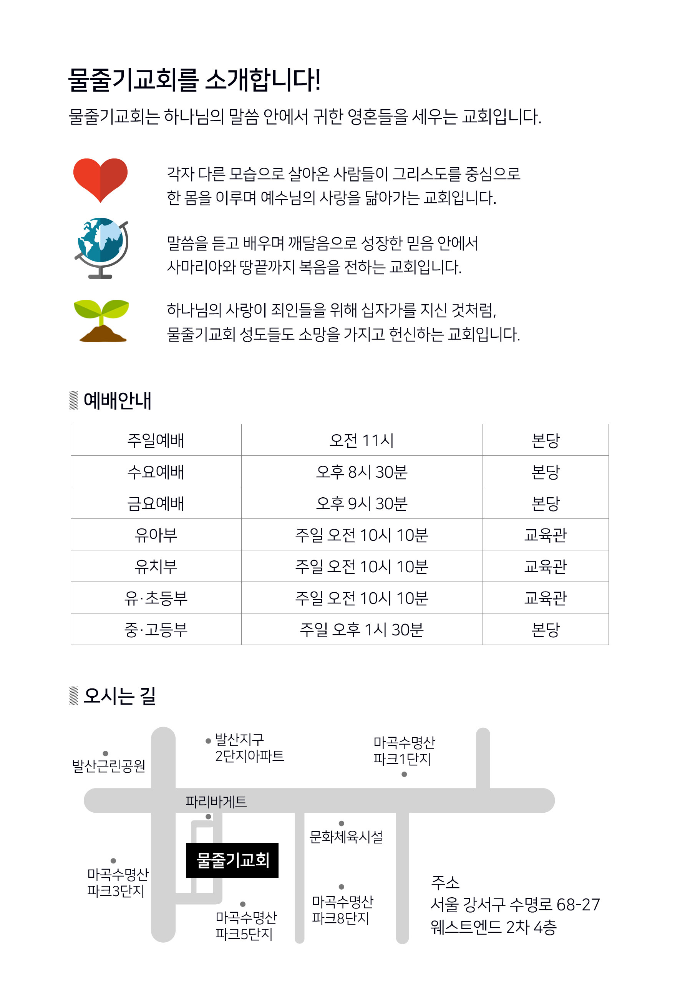

내가 사랑하는 자야

조춘숙 목사

물줄기교회 출판부

동영상 설교는 https://vimeo.com/watercourse 또는 YouTube에서 “물줄기교회”를 검색해 주세요.

# 이 책을 읽는 분들께

‘내가 사랑하는 자야’라는 제목으로 기도집을 내면서, 저는 개인적으로 참 기뻤습니다. 하나님께서 얼마나 사랑이 많으신 분인지 여러분에게 전할 수 있기 때문입니다. 설교집으로는 하나님의 너그럽고 솔직하고 바다처럼 넘치는 사랑을 다 전하는 데 한계가 있습니다.

여러분처럼 저도 하나님께 날마다 기도를 드리면서, 하나님께서 이런 문제는 어떻게 생각하실까? 하나님께서는 내가 어떤 신앙을 가지고 살아가기를 원하실까? 이 고난을 어떻게 이겨내야 하나, 늘 궁금해하며 기도하던 중에 잔잔하게 퍼지는 하나님의 사랑을 느끼게 되었습니다. 그 사랑을 잊어버릴까 봐 기록해둔 것이 바로 ‘내가 사랑하는 자야’입니다.

여러분, 하나님께서는 무조건적인 사랑을 가지신 분이며, 자녀들이 하나님의 영광을 덧입기 원하시는 아버지이십니다. 그런 아버지의 마음을 조금 더 살펴서, 여러분도 아버지의 뜻대로 살아가시기를 원합니다. 자녀가 웃으면 함께 따라 웃는 부모처럼, 여러분이 하나님께 찬양을 드리면 덩실덩실 춤을 추실 것이며, 여러분의 목소리로 아버지를 부르면 여러분의 목소리보다 더 크게 내가 여기 있다고, 너를 사랑한다고 대답하시는 분이 바로 우리의 아버지이십니다.

‘내가 사랑하는 자야’ 기도문을 읽고, 여러분의 마음이 평안과 안식을 얻으면 좋겠습니다. 우리는 이렇게 멋진 하나님을 섬기는 자녀들이며, 하늘과 땅과 천사를 움직여 여러분을 보호하고 계시는 하나님께서 계신다는 것을 잊지 말고, 험한 세상에 더욱 굳건히 서서 믿음으로 살아내기를 바랍니다.

하나님께서는 이렇게 말씀하실 것입니다.

너희들이 천국에 와보면 얼마나 많은 사람들이 지옥에 갔는지, 얼마나 적은 사람들이 천국에 있는지 놀라고 놀랄 것이라고 말입니다. 너희들은 내가 예수를 믿었으니까, 내가 교회를 다녔으니까, 나는 천국에 갈 수 있다고 말을 하지만, 그렇게 쉬우면 내가 왜 십자가를 졌겠느냐고 말씀하실 것입니다.

저는 스물아홉 살에 하나님을 영접했습니다. 늦게 하나님을 만난만큼 하나님을 더 많이 알고 싶어서 성경을 읽기 시작했습니다. 하루에 40장씩 10년을 하루같이 읽다 보니 하나님이 바늘 끝만큼 보이기 시작했습니다. 물론 지금은 설교를 쓰느라 처음 사랑을 지키지 못하고 있는 것 아닌가 죄송한 마음이 들 때도 있습니다.

여러분은 성경을 얼마나 읽고 있습니까? 성경을 40 독쯤 했을 때, 제 마음에 잔잔하게 들리는 음성이 있었습니다. 사건마다, 인물마다 깨달음이 있었습니다. 성령께서 지혜를 주시는 것 아닌가 싶어서 더 열심히 성경을 읽었고, 기도를 드렸습니다. 성도들이 쉽게 하나님을 만날 수 있도록, 설교를 쓰고 싶은 욕심에 기도를 오래 하는 훈련을 하게 되었습니다.

여러분은 하루에 얼마나 성경을 읽고, 기도를 하고 있습니까? 정말 하나님을 만나고 싶다면 성경을 읽어야 합니다. 하나님께서 무엇을 원하고 계신지 어떤 삶을 살기 원하시는지 얼마나 여러분을 사랑하고 계신지 알고 싶다면 기도드려야 합니다. 그러면 하나님께서 충만한 심령을 보시고, 직접 하나님의 마음을 알려주실 것입니다.

여러분, 사탄은 영혼 구원을 방해하기 위해서 열심히 일하고 있는데, 그 사탄을 어떻게 대적하겠습니까? 사나운 개를 두려워하는 아이가 아버지의 품에 안기는 것처럼 하나님의 품에 안기지 않는다면 사탄을 이기지 못할 것입니다. 하나님의 품으로 빨리 도망치기 위해서는 성경을 읽고 기도해야 합니다. 그러면 사탄이 공격할 때, 말씀으로 늘 충만한 여러분을 위해서 하나님께서 직접 울타리가 되어 막아주실 것이므로, 사탄은 스스로 물러갈 것입니다.

사랑이 많으신 하나님을 더욱 찬양하는 성도가 되시기 바랍니다. 은혜를 주시는 하나님을 더욱 의지하는 성도가 되시기 바랍니다. 그러면 하나님의 사랑과 은혜가 여러분의 삶에 차고 넘칠 것입니다.

제가 받은 은혜이지만, 하나님께서 성도를 얼마나 사랑하시는지 기도문을 읽어보시고, 하나님을 더욱 사랑하는 성도가 되기를 간절히 바랍니다. 하나님께서 ‘내가 사랑하는 자야’를 읽는 모든 성도들의 마음을 따뜻하게 해 주시기를 바라는 마음으로 이 책을 여러분께 드립니다.

마지막으로 2017년에 출판한 책을 많은 분들께 나눠 드리고, 저희 교회는 2019년에도 다시 ‘내가 사랑하는 자야’ 2쇄를 내게 되었습니다. 더 많은 분들과 함께 하나님의 마음을 느낄 수 있어서 기쁜 마음입니다.

물줄기교회 목사 조춘숙

# 가시면류관

사탄들은 큰 가시면류관을 나에게 씌우면 더 수치스러우리라 더 고통스러우리라 그런 생각으로 나에게 가시면류관을 씌웠지만 영광의 부활을 하였을 때 가시면류관은 영원토록 큰 영광의 상징이 되었단다. 나의 구원의 역사를 방해하는 것처럼 성장하는 교회나 내 자녀를 사탄이 그냥 두겠느냐? 이 시험이 지나고 나면 모두가 기쁨으로 성숙하며 성장하게 되리라.

내가 십자가를 묵묵히 짊어지었던 것처럼 너도 잠잠히 순종하라. 사탄들의 사명은 내 자녀들이 분을 내게 하는 것이니라.

# 겉과 속이 같아야 한단다

너는 인형을 만들 때 먼저 튼튼한 기둥을 세우고 철사로 묶고 흙을 바르고 아름답게 꾸며 놓겠지. 그렇게 하면 누가 만져도 염려할 것이 없을 거야. 그런데 어떤 사람들은 흙을 뭉쳐서 이쑤시개로 기둥을 세워 놓고는 빨리 만든 자신을 자랑한단다. 그런데 말이다. 두 인형은 겉모습이 똑같기 때문에 아무도 구별할 수 없지만 그것을 구별하는 방법은 어린아이에게 줘보면 금방 알 수 있단다. 아이의 손에 쥐어지는 순간 금방 툭 하고 부러지니까. 겉이 똑같다고 속일 수 있는 것이 아니란다. 너는 겉과 속이 똑같이 튼튼해야 한단다. 그래야만 네 믿음을 사탄이 건드리지 못할테니까. 사람은 속일 수 있어도 나와 사탄은 절대로 속일 수 없다는 것을 잊지 마라. 먼저 믿음의 기둥을 세워라. 그리고 그 기둥 위에 네 삶으로 믿음을 두텁게 바른다면 내 사랑이 그곳에 머무르지 않겠느냐.

# 겸손하신 예수님

나는 길이고 진리이고 생명입니다. 나는 처음부터 길이었고 진리였고 생명이었습니다. 그리고 앞으로도 길이고 진리이고 생명일 것입니다. 당신은 나를 믿으십니까? 그렇다면 내가 길이기에 나를 통해서만 아버지께 갈 수 있을 것입니다. 내가 진리이기 때문에 당신은 나를 통하지 않으면 영원한 사망에 들어가게 될 것입니다. 나는 당신과 영원히 함께하고픈 생명이기에 당신이 나를 믿어야만 하나님의 영광을 함께 누리며 살 수 있을 것입니다. 당신은 정말 나를 믿으십니까?

# 고난은 지나가는 바람이란다

너는 뿌리를 깊이 내린 나무란다. 그런 네가 나뭇가지를 흔들고 지나가는 바람을 두려워할 필요는 없는 것이란다. 그 바람이 귀찮다고 불평하지 말아라. 고난은 그저 지나가는 바람과 같기 때문이란다. 지나가는 바람의 뒷모습을 보면서 불평하는 자가 없는 것처럼 지나가는 고난의 뒷모습을 보면서 불평하는 자는 어리석은 자니라. 그 바람이 있어야 네가 성장할 수 있으며 네가 성장하는 데 꼭 필요한 것은 비를 몰고 오는 세찬 바람인 것을 잊지 말아라.

# 고생은 이런 것이란다

지금 네가 하는 일은 싫으면 그만두겠지. 그런 것은 경험을 쌓는 것일 뿐 고생이라고 말할 수는 없단다. 고생은 그만두고 싶어도 네 맘대로 그만둘 수 없을 때 도망가고 싶어도 도저히 피할 길이 없을 때 그때 고생이라고 말하는 거란다. 하지만 그 모든 것이 이제는 끝이 났으니 두려워하지 말아라.

# 굵은 아름드리가 되어라

굵은 아름드리가 되어라. 사탄은 도끼를 잘 갈아서 예수와 함께하는 성도를 단 한 번에 쓰러지게 한단다. 하지만 굵은 아름드리는 상처만 날 뿐 절대로 넘어지지 않는단다. 그 상처는 예수의 상처, 영광의 상처로 남을 뿐 사탄에겐 승리하리라. 늘 예수와 함께하는 자는 굵은 아름드리로 자랄 수 있으리라. 늘 예수와 함께하여라.

# 그날 그때에 심판을 받으리라

세움을 입었다는 것은 내 영광을 드러내도록 쓰임을 받았다는 것이다. 이런 자가 바늘 끝만 한 교만의 어두움으로 내 영광을 가렸다면 그날에 심판을 받으리라. 세움을 입은 자는 겸손해야 한단다. 나를 두려워해야 한단다. 세움을 입은 자가 믿음의 그릇을 엎어 놓는다면 갈한 영혼이 와서 어찌 물을 마실 수 있겠으며 더러운 영혼이 와서 어찌 씻을 수 있겠느냐. 정결하여라 정직하여라. 나는 오직 정직한 자를 사용하며 정결한 자를 사용하기 때문이란다. 바늘 끝만 한 어두움이라도 있다면 그날 그때에 심판을 받으리라.

# 기대

나는 너를 너무나 사랑한단다. 네가 봉오리였을 때에는 필 것이라는 기대 때문에 기쁨이 있었고 네가 조금 피었을 때에는 활짝 필 것이라는 기대 때문에 너무 기뻤단다. 네가 활짝 피었을 때에는 사람들이 너를 보고 즐거워해서 기뻤고 네가 꽃잎이 떨어질 때에는 씨를 맺을 것을 알기 때문에 기뻤단다. 그런데 너는 왜 근심하느냐. 너는 봉오리였을 때에는 언제 피나 답답해서 슬퍼했고 너는 조금 피었을 때에는 활짝 피지 않는다고 슬퍼했고 너는 활짝 피었을 때에는 질까 봐 슬퍼했단다. 어떠냐? 너와 내가 생각이 정말 다르다는 것을 알겠느냐.

# 기도의 그릇

기도하는데 정말 깨끗하고 아름다운 그릇 하나가 눈에 보였다. 그 그릇은 정금처럼 빛이 나고 있었고 누군가 열심히 닦고 있었다.

"나는 네가 하나님께 드리는 기도를 담기 위해 천사에게 그릇을 깨끗하게 닦아 놓으라고 말했단다. 헌데 네가 기도하지 않으니 그릇이 텅 비어있구나. 그릇만 깨끗하면 무엇하겠느냐. 네가 기도로 그릇을 채워야 갈한 영혼들에게 나누어 줄 것이 아니냐. 기도하여라, 영혼을 불쌍히 여기는 마음으로 사람들에게 손해를 입어도 너는 그 영혼을 불쌍히 여기는 마음으로 기도해야 한단다. 네가 기도하고 그릇을 채우면 그 나머지는 내가 다 역사해 주리라."

# 하나님께서 원하시는 것은

하나님의 나라와 구원받을 영혼을 위해서 성도가 최선을 다해 기도하는 것이리라. 기도만 하면 하나님께서 역사하시는데 성도들은 기도를 드리지 못하고 있다. ‘손해를 보더라도...’ 이 말씀이 마음에 와닿는다. 기도의 그릇이 넘치고 넘치도록 성도들은 기도해야 하리라.

# 기도란 시냇물과 같단다

흐르던 물이 끊어지면 그것을 어찌 시냇물이라 하겠는가? 이어지는 기도를 하여라. 기도가 끊어지면 곧 웅덩이가 되느니라. 웅덩이는 크든 작든 썩게 되어 있단다. 남들에게 겉으로만 존경을 받지 말아라. 사람의 칭찬을 즐기면 심령은 곧 썩고 말 것이니라. 영혼의 기도가 이어져 흐르게 되면 생명의 물이 흐르니 너도 살고 주위에 있는 사람도 사는 역사가 있으리라.

# 기도 없이

기도 없이 주의 일을 하는 자는 교만의 잎이 붙으며 기도 없이 주의 일을 하는 자는 끊임없는 불평으로 악한 영의 도구가 되어 불충성의 열매를 맺느니라.

# 깨어진 믿음의 그릇

커다랗고 큰 그릇을 깨어진 상태로 보이시며 너는 깨어진 그릇을 본드로 붙여 놓고 무엇이라고 부르느냐. 그릇이라고 부르겠지. 교회에 다니는 사람을 무엇이라고 부르느냐. 역시 성도라고 부르겠지. 너는 깨어진 그릇에다 소중한 것을 담느냐. 나 역시 믿음이 없는 성도는 귀하게 사용하지 않는단다. 그 그릇에다 무엇을 담겠느냐. 능력, 물질, 지혜, 사랑, 말씀 어떤 것을 담으랴. 축복의 기회는 너희가 원한다고 해서 언제든지 오는 것이 아니란다. 나 예수를 붙들지 않는 자는 회개도 마음대로 할 수 없는 것이란다. 너는 깨어진 큰 그릇이 더 지저분하고 버리기가 더 힘들다는 것을 알고 있느냐.

# 끝이 있느냐

사람들은 인생이 끝이 있다고 생각한단다. 너는 어찌 생각하느냐. 기차를 타고 굽이굽이 산자락을 돌 때 한없이 산만 있을 것 같지만 그 자락을 끼고 돌았을 때 한쪽에는 바다가 한쪽에는 꽃밭이 있다면 그 인생은 얼마나 멋있고 행복하겠는가. 굴속에 들어갔을 때 두려웠던 것처럼 인생의 그림은 결코 한 가지만 있지 않단다. 인간은 육을 벗어도 결코 끝이 아니란다. 그러니 교만하지도 말고 좌절하지도 말아라.

# 나는 그때의 너를 더 사랑한단다

기도 중에 내가 지나온 과거의 아픔을 하나씩 보여주신다. 정말 힘들었던 순간마다 기도하며 눈물 흘리던 내 모습 난 목이 터져라 찬양을 불렀다. 그리고 그때마다 불렀던 찬양들... "내가 왜 네가 가장 힘들어했던 그 시간들을 보여주었는지 아니?" "하나님 저는 그 시간을 되돌아보기 정말 힘이 듭니다." "그래도 나는 힘들 때마다 나에게 전적으로 의지하던 너를 가장 사랑한단다. 나는 지금의 너보다는 온전히 나를 의지하며 눈물로 기도하던 그때의 너를 사랑한단다."

아무 말씀도 드릴 수 없었다.

"내가 끊임없이 이스라엘 백성에게 출애굽 할 때, 또 홍해를 건널 때 그때의 일을 잊지 않도록 반복해서 말해 주는 것은 바로 전적으로 나를 의지하던 그들의 모습을 사랑하기 때문이란다. 그때를 잊지 마라. 그 시절이 있었기 때문에 지금의 네가 있는 거란다. 믿음으로 살던 그 시간이 있었기 때문에 이스라엘이 있는 것처럼..."

하나님의 마음이 따뜻하게 전해져 온다. 고난과 고통 가운데 부르짖는 자녀의 아픔을 아시면서도 자녀들의 사랑을 받기를 원하시는 하나님 하나님은 변함이 없는데... 인간은 항상 변한다. 삶이 힘들어 눈물로 간구하던 나 내일을 알 수 없어 하나님께만 매달리던 나 그때 눈물로 부르던 찬송을 부르게 하시며 잊지 말라고 하신다. 그렇게 온전히 하나님만을 바라보던 내 모습을 사랑하신다고 하시며... 하나님께 너무 죄송하고 감사해서 눈물로 기도한다. 나도 하나님처럼 변치 않는 사랑을 달라고...

# 나는 길이요 진리요 생명이니

진리도 하나요 생명도 하나라. 진리가 변하면 이단이 되고 생명이 변하면 사망이 되느니라. 진리와 생명을 소유한 나를 네가 품으면 하나님께서 영생과 육의 복을 주시는데 그 복을 받는 자가 바로 너희니라. 사랑이신 하나님 진리이신 예수님 생명으로 인도하실 성령님께서 너희를 보호하시리라.

# 나를 잃기 전에

사랑하는 자야 너는 땅을 뚫고 나온 죽순이었을 때 왜 나는 저 대나무처럼 자라지 않느냐고 불평하는구나. 대나무처럼 자랐을 때 왜 바람이 불어 시원케 하지 않느냐고 불평하는구나. 바람을 불어 시원케 해 주자 왜 비를 내려 주지 않느냐고 불평하는구나. 네가 원하는 모든 것을 채워주지만 너는 결국 다시 불평하고 있구나. 나는 너에게 더 해 줄 것이 없어서 너를 떠나려고 한단다. 나를 잃기 전에 불평만 하고 있는 네 자신을 돌아보아라.

# 낙타의 발목은 가늘지만

낙타의 발목은 참으로 가늘답니다. 저는 제 자신이 낙타의 발목처럼 가늘고 연약해서 아무것도 할 수 없다고 생각하곤 했습니다. 그런데 어느 날 아버지는 조용히 저를 부르십니다. “얘야, 너는 낙타의 발목이 어떻다고 생각하니?” “아버지, 너무 가늘다고 생각합니다. 저는 제 자신이 낙타의 발목처럼 가늘고 힘이 없다고 생각합니다.” 아버지는 다시 한 번 말씀하십니다. “얘야, 낙타의 발목은 가늘지만 낙타 발목 위에 거대한 그의 몸집을 생각해 보렴. 이것이 내가 네게 주는 복이란다. 발목은 거대한 몸집과 더불어 얼마나 많은 짐들을 감당하고 있느냐. 바로 그것이란다. 내가 주는 복은 사람이 생각하는 낙타의 발목처럼 연약한 것이 아니라 그 네 개의 발목은 연약해 보이지만 거대한 몸이 어디든 갈 수 있도록 돕는 엄청난 능력을 갖고 있는 것이란다.

# 남을 대접하려거든

주님께서 빈 항아리를 보이시며 “속에 무엇이 있지?” “예. 주님 빈 항아리입니다.” “그래, 충만하지 못한 네가 무엇으로 갈급한 심령에게 도움을 줄 수 있겠니.” 빈 상을 보이시며 “무엇이 보이지?” “예. 빈 밥상입니다.” “그래, 상을 차리고야 손님을 초대하고 대접할 수 있지 않겠니?” “그렇습니다.” “자, 말씀을 깨닫지 않고 충만하지 않고는 누구도 대접할 수 없는 것이란다.”

# 내 고립은 너를 위해서란다

나는 이 땅에서 아주 철저하게 고립되었단다. 아무리 내가 세상 사람의 죄를 위해서 왔다고 외치며 내가 하나님의 아들이고 성전이며 안식일의 주인이라고 외쳤지만 그 누구도 내 말에 귀를 기울이는 사람은 없었단다. 악인을 죽일 때도 두세 사람의 증거를 받는데 나를 십자가에 못 박을 때 한 사람도 나를 위해서 증거하지 않았지. 내가 철저하게 고립된 것은 바로 너를 위해서란다.

# 내 사랑을 아직도 모르겠느냐

내 사랑을 아직도 모르느냐. 너희들은 선을 그어 놓고 그것을 결승점이라고 한단다. 하지만 그것은 참다운 결승점이 아니란다. 나는 내 자녀들이 다 들어올 수 있도록 내 자녀들에게 맞는 선을 그어 놓았단다. 약한 자는 10미터 건강한 자는 50미터 더 뛸 수 있는 자는 100미터. 내 사랑을 아직도 모르겠느냐. 너희들의 생각과 내 생각은 다르단다. 내 자녀들이 다 들어올 수 있도록 모두 승리의 면류관을 쓸 수 있도록 내 사랑을 그어 놓았단다. 아직도 내 사랑을 모르겠느냐.

# 내 사랑하는 자야

네가 건너는 바다의 색이 너무 푸르고 깊어서 내 사랑하는 자가 무서워할까 봐 바다 위에 꽃잎을 띄워 놓았단다. 파도를 타고 밀려오는 꽃잎의 향기를 맡아 보았느냐. 그 꽃잎 하나하나가 모두 나의 사랑이란다.

# 내 손 위를 걸었던 것이란다

너는 네가 걸어온 길이 너무나 험난하다고 눈물을 흘리며 힘들어했지. 가시밭길이라고 투정을 부리고 자갈밭이라 걷기가 힘들다고 고통스러워했었지. 그런데 사랑하는 딸아 네가 걷고 있는 길을 한번 내려다보렴. 너는 한 번도 가시밭길을 걸은 적이 없으며 너는 한 번도 자갈밭을 걸은 적이 없단다. 너는 오직 내 손 위를 걸었던 것이란다. 네가 밟고 갈 때마다 나에게 전해지는 고통은 너무 컸지만 나는 너를 위해 기도하며 내 손 위를 걷도록 참고 또 참으며 너를 사랑했단다.

# 내 십자가는 가볍단다

사람들은 자기 십자가가 무거워 내 십자가까지 질 수 없다고 말한단다. 그러나 그것은 잘 모르고 하는 말이지. 내 십자가는 지면 질수록 네 십자가가 가벼워지는 것이란다. 이것은 비밀이기에 그들은 알지 못해서 자기 십자가만을 바라보며 내 십자가를 지지 않겠다고 하는 것이란다. 네 십자가를 감당하기 힘들어도 내 십자가를 진다면 어느새 가벼워진 것을 알게 되리라. 정직한 믿음과 온전한 믿음으로 확신을 가지고 나아갈 때 네 인생의 무게를 느끼지 못하리라.

# 내 안에 있는 평안

산은 높고 강은 넓고 바다는 깊단다. 이 세상의 산은 한없이 높고 강은 건널 수 없이 넓으며 세상의 바다는 왜 그리 깊은지 그렇게 높고 넓고 깊은 곳을 지나온 너를 축복하노라. 아무리 높고 아무리 넓고 아무리 깊어도 그것은 세상의 일일 뿐이란다. 뒤를 돌아보아라. 내 안에 있는 너와는 아무런 상관이 없지 않으냐. 이제는 화산이 폭발해도 강이 흙탕물이 되어도 바다가 폭풍으로 뒤집어져도 너와는 아무런 상관이 없단다. 너는 내 안에 있기 때문에.

# 내가 길이라면

내가 길이라면 나에게 와야 하고 내가 진리라면 내 말을 들어야 하고 내가 생명이라면 나에게 안겨야 하지 않겠느냐. 내가 빛인데 어둠에서 나오지 않는 너를 어떻게 감싸주겠느냐.

# 내가 어찌 바다라도 움직이지 않겠느냐

사람들이 너를 들어 불속에 던진다면 내가 어찌 바다라도 움직이지 않겠느냐. 사람들이 너를 들어 가시덤불에 던진다면 내가 어찌 지옥의 불이라도 움직이지 않겠느냐. 이제 내가 너의 멍에를 꺾어 주리라. 너에게 박혀 있는 작은 가시 하나라도 내가 빼어 주리라. 내 손에 있는 진리와 영생이 보이지 않느냐. 내가 이것을 너에게 주노니 다 받아 누려라. 네가 사랑하는 영혼들이 어려움을 당할 때 네가 나에게 부르짖는다면 내가 바다라도 움직이지 않겠느냐.

# 내가 주는 구원은 사랑이란다

사랑이라는 것은 하늘을 채우고 땅을 채우는 공기와 같은 것이란다. 내가 준 사랑을 네가 가지고 행복해하는 것을 보면서 도리어 기쁨을 느끼는 것이 사랑이란다. 내가 너에게 주는 구원도 이와 같단다. 나는 구원을 위해 목숨까지 주었지만 그것이 아깝지 않았고 네가 누리고 있는 것이 나에게 큰 기쁨이 되니 그것이 사랑이 아니고 무엇이겠느냐.

# 내리지 말아라

네 생각에 인생의 기차가 너무 천천히 달리는 것 같아서 답답하고 한심스럽지만 그래도 기차를 타고 있어야 한단다. 속도가 붙은 기차를 누가 세울 수 있으며 빨리 달리는 기차를 누가 잡을 수 있겠느냐. 기차가 천천히 달리든지 기차가 빨리 달리든지 꼭 기차 안에 있어야만 목적지에 갈 수 있단다.

# 너는 나를 믿었으리라

- 사탄에게 시험을 받으시는 장면을 보이시며 “너는 그곳이 아니라 지금 이 시간 이 장소에서 나와 함께 있었더라도 내가 사탄의 유혹을 물리치고 승리할 것을 믿어 주었을 것이라. 그렇지? 왜냐하면 넌 나를 믿고 사랑하니까. 나도 네가 잘할 것을 믿고 있단다. 그 많던 무리들은 모두 나를 믿는다고 하였지만 정말 내가 그들을 원할 때는 나를 버렸지. 자신들의 십자가까지도 다 나에게 넘겨주고서 떠나 버리고 말았단다.” - 주여, 제 믿음 없음을 용서하소서.

# 너는 나의 사랑을 가졌느니라

너는 사랑을 본 적이 있느냐. 공기가 보이지 않는 것처럼 사랑도 보이지 않는단다. 그러나 공기를 마신 자들만이 사는 것처럼 사랑을 가져 본 자들만이 그 사랑을 볼 수가 있는 것이니라. 너는 나의 사랑을 만졌으며 너는 나의 사랑을 품었으며 너는 나의 사랑을 아느니라. 네가 나의 사랑을 알고 있기에 나는 나의 사랑을 네 품에 그대로 두려고 하느니라.

# 너는 노아의 슬픔을 아느냐

방주 안에 있는 노아의 슬픔을 너는 아느냐. 자기를 바라보며 조롱하는 사람들을 살리기 위해 방주를 열심히 짓고 있는 노아의 슬픔을 너는 아느냐. 방주의 문을 사이에 두고 서 있는 노아의 슬픔을 너는 아느냐. 아무리 들어오라고 소리를 질러도 듣지 않는 형제와 친구들을 보면서 아파하던 슬픔을 너는 아느냐. 방주의 문이 닫히고 비가 오는 소리가 들릴 때 통곡을 하던 노아의 슬픔을 너는 아느냐. 이제는 영원히 기회가 없어진 그들을 생각하면서 얼마나 통곡하며 외로워했는지 너는 아느냐. 방주의 문이 열렸을 때 노아의 두려움을 너는 아느냐. 방주 밖으로 한 발을 내디뎠을 때 혹시 누가 있을까 얼마나 두리번거렸는지 너는 알고 있느냐. 동물들도 살았는데 그 귀한 영혼들이 한 명도 없음을 보고 노아가 얼마나 슬퍼했는지 너는 아느냐. 이런 상황에서 자신의 구원만 즐거워하고 기뻐하는 하나님의 자녀는 없으리라. 자신의 구원보다 영혼을 구원하지 못한 자신을 보며 아파하고 후회하는 것이 바로 구원받은 자의 모습이니라. 외로움과 괴로움과 두려움과 자신을 질책하는 마음으로 술에 취한 노아의 아픔을 너는 아느냐. 나는 그의 아픔을 알기에 깊이 잠든 노아를 깨우지 않았노라. 다만 내 자녀의 아픔을 조롱하는 자를 심판했을 뿐이니라.

# 너는 어느 쪽에 속해 있느냐

너무 풍부하거나 갈할 때 사람들이 두 가지 행동을 한단다. 큰 바가지로 물을 떠서 몇 모금 마시지 않고 버리는 사람과 작은 바가지로 물을 떠서 자신이 먹을 만큼 먹고 남도 먹게 하는 사람. 많다고 버리거나 갈할 때 자신만 챙기면 자신의 영혼이 비워져 간다는 것을 모르는 자니라. 오직 이 땅에서 몇 모금 더 마시고자 욕심을 내는 사람들의 행위를 보고 내가 진노하리라. 내가 오늘 밤 너의 영혼을 찾으면 그 모든 것이 누구의 것이 되겠는가? 너는 늘 나누고 베풀며 사랑을 가두지 말아라.

# 너희가 나를 어떻게 증거하겠느냐

너희들이 나에 대하여 무엇을 증거해 줄 수 있느냐. 내가 너희 죄를 지고 십자가에 매달릴 때 나는 아무 증거도 받지 않았단다. 나를 위해서 증거해 줄 수도 없지만 내가 사람의 증거를 받아서 무엇하겠느냐. 나는 십자가를 지기 위해서 스스로 온 자이며 누가 십자가를 지라고 해서 지는 것이 아니라 내 스스로 기뻐서 내 십자가를 지는 것이란다. 사람들이 무엇이라 나를 증거할 것이며 내 몸을 의탁한다면 너희가 감당할 수 있겠느냐. 표적을 보고 믿은 자를 내가 무엇으로 의지할 수 있으며 믿음을 가지고 있다는 자도 생명의 위협을 받으면 배신할 것을 아는데 그런 자들에게 어찌 내가 나의 몸을 의탁하며 그의 증거를 받겠느냐.

# 네가 기도하고 있구나

나는 네가 기도하는 모습이 제일 좋단다. 너의 목소리로 기도하는구나. 나는 네가 아름다운 목소리로 기도할 때가 제일 좋단다. 네가 나를 아버지라고 부르고 있구나. 나는 네가 아버지라고 부를 때가 제일 좋단다. 네가 눈물을 흘리며 간구하는구나. 나는 네가 눈물을 흘리며 나를 찾을 때가 제일 좋단다. 네가 영혼을 사랑하고 있구나. 나는 네가 나처럼 영혼을 사랑할 때가 제일 좋단다.

# 네가 지금 보고 있는 것이 무엇이냐

사랑하는 자야 가시를 보고 있느냐 네 앞에 가시나무가 많이 있다면 너는 그 가시에 찔리게 되리라. 네 앞에 활짝 피어있는 꽃들을 보고 있느냐 너는 열매를 맺게 되리라. 네 앞에 지금 무엇이 많이 있는지 그것부터 언제나 관심을 가져라. 사람을 보지 말고 네 능력이 되는 나를 보아라. 사람을 보면 반드시 넘어지고 말 것이니라.

# 네가 진심으로 자녀를 사랑한다면

어미닭을 보아라. 어미닭은 병아리에게 먹이를 먹이기 위해서 꼬꼬 소리를 내며 앞으로 걷는단다. 어미닭이 병아리가 걱정이 되어 품고만 있다면 병아리는 모두 죽고 말리라. 그 자리에 두고 네가 먼저 앞서 걸어야 한단다. 그래야만 병아리들이 엄마를 따라올 테니까. 넌 지금 왜 걷지 않느냐 자녀만 보고 있다면 결국 너도 자녀들도 그 자리에서 성장하지 못하리라. 네가 나를 보고 앞서 걷는다면 네 자녀들도 네 뒤를 따라 걸으며 성장하게 되리라.

# 네가 판단하지 말아라

나는 착한 사람과 나쁜 사람들을 구분하지 않는단다. 난 모든 인간들을 위해서 죽으러 온 것뿐이란다. 만약 내가 착한 사람과 나쁜 사람들을 구분해서 구원하였다면 이 세상에는 한 명의 영혼도 구원받을 영혼이 없었을 것이라. 그래서 난 우편 강도도 믿음의 고백만 듣고 구원하였고 날 떠난 제자들도 용서하였단다. 내가 착한 사람과 나쁜 사람을 구분하지 않는데 왜 네가 선한 자와 악한 자로 구분하느냐. 구원은 네가 하는 것이 아니라 내가 하는 것이란다. 너는 단지 맡겨준 영혼들을 위해 기도하고 전하는 것뿐 그 이상도 그 이하도 아니라는 것을 기억해라. 네가 보기에 악한 자라 할지라도 그도 구원을 받아야 하리라. 내가 너를 용서함 같이 너도 용서하여라. 그리고 그들이 구원받도록 기도해야 하느니라. 명심하거라. 내가 판단하지 않은 인간의 선과 악을 절대로 네가 판단할 수 없다는 것을. 전하고 기도해도 돌아오지 않는 영혼은 너에게 책임을 묻지 않겠지만 영혼을 맡겨 주었는데도 기도하지 않고 전하지 않는다면 반드시 너에게 내가 책임을 물을 것이니라.

# 네가 하는 것이 아니야

몸이 약할 때나 환경이 좋지 않으면 난 성도들에게 덕이 되지 않는다는 생각을 한다. 이 생각을 교만이라고 하나님께서는 말씀하신다. “성도들을 마주 보니까 그들에게 덕을 세워야 한다는 생각을 하는 것이란다. 너는 그냥 앞에 서 있는 나를 향해 달려오기만 하면 네 발자국을 그대로 밟고 그들이 스스로 올 것인데 왜 그들을 마주 보고 인정받으려고 하느냐.” 난 앞에 서 계신 하나님을 향하여 달렸다. 그리고 하나님의 품에 안겼다. 어린아이가 엄마의 품에 그대로 안기는 것처럼 말이다. 품에 안긴 나는 세상이 보이지 않았다. 아니, 볼 필요도 없었고 포근했다. 나를 안고 계신 하나님께서 직접 그들을 보시면서 말씀하시기 시작하셨다. 내가 빠진 그 자리를 하나님께서 메워주셨다. 그리고 더 정확하고 온유하게 그들을 이끄신다. 내가 하나님을 향해 달릴 때 찍힌 발자국을 그들도 힘차게 밟으며 달리고 있다. 내 교만의 발자국은 지워지고 하나님의 은혜의 자리만 남았다. 그래, 내가 하는 것이 아닌 것을...

# 누구의 열매이냐

한 영혼이 천국을 향해 사뿐히 걸어가고 있다. 그 영혼은 하나님을 만났고 성숙한 믿음을 가졌는데 얼마나 아름다운지 보기만 해도 웃음이 나온다. 그는 눈이 부시는 빛 가운데로 걸어갔다. 아마도 하나님의 품으로 깊이 들어가는 것이리라. 황홀한 마음에 눈을 돌리지 못하고 있을 때 “저 영혼이 누구의 열매냐?” - 하나님의 열매입니다. “너도 많은 영혼을 위해 목숨을 다해 충성하여 나와 네 열매가 되게 하여라.” - 아멘

# 당신의 빛이 너무 귀해서

그분이 주시는 빛이 너무 귀하고 고와서 전 그 빛을 온몸에 받을 수가 없었습니다. 그분이 입고 계신 흰옷이 너무 희고 고와서 전 그분 흰옷에 손을 댈 수가 없었습니다. 그 빛을 가릴까 봐 그 옷을 더럽힐까 봐 저를 바라보는 그분의 눈은 너무 겸손해서 전 그분을 자세히 볼 수가 없었습니다. 그분 옆에 서 있는 저는 너무 얼룩져 있었습니다. 선하신 그분의 눈빛을 닮겠다고 굳게 결심했습니다. 그분이 입으신 흰옷이 저로 인해 더럽혀지지 않도록 말씀으로 살기로 결심했습니다. 선한 눈빛을 닮고 말씀으로 산다면 저도 그분이 비추시는 그 빛을 따라 복음을 전할 수 있을 것입니다.

# 두려워하지 마라

세상을 두려워하지 마라. 사람을 두려워하지 마라. 사탄을 두려워하지 마라. 네 눈에 보이는 모든 것들은 너를 두렵게 하려고 위협하지만 그들이 채찍을 내리칠 때 내가 등을 대어 주리라. 사탄이 너를 찍어 넘어뜨리려고 도끼를 내리칠 때 내가 대신 찍혀 주리라. 너는 두려워하지 마라. 네 곁에는 언제나 내가 있으니까

# 등불은 등경 위에

등불을 너만을 위해서 바닥에 두면 너의 발등 밖에 비출 수 없단다. 네 등불을 등경 위에 둔다면 네 주위만 비추게 될 것이란다. 하지만 등불을 든 모든 사람이 등경 위에 둔다면 너희들은 대낮과 같이 밝은 곳에서 서로 협력하여 선을 이룰 수 있으며 어둠을 헤매던 자들이 그 밝은 빛을 보고 너희들에게 감사하며 달려오리라.

# 목사의 사명

목사는 땅이란다. 주룩주룩 내리는 은혜의 단비를 나무들이 한꺼번에 먹을 수 없기에 땅인 너희가 흡수해 두었다가 나무가 갈급하고 목마를 때 다시 모두 내어 주는 것이 목사의 사명이란다.

# 마른 낙엽과 같은 자

미련한 자는 마른 낙엽과 같다. 아무리 조심을 해도 밟기만 하면 큰소리를 내는 낙엽

미련한 자는 마른 낙엽과 같다. 책갈피에 넣어 보관하고 싶어도 바스러지고 마는 낙엽

미련한 자는 마른 낙엽과 같다. 한자리에 있지 못하고 바람 부는 대로 날아다니니 이렇게 미련하고 메마른 자는 지혜로 인도하려고 해도 스스로 부서지고 말 것이니라.

# 말씀 전하는 목자들

너의 가시를 보이지 말라. 밤송이가 있다고 해 보아라. 신앙이 어린 자들은 가시만 보고 만지지도 않지만 지혜가 있는 자는 그 속에 있는 싱그러운 밤알을 먼저 본단다. 네가 밤송이라면 언제까지 나무에 달려있겠느냐. 성숙해야만 밤송이가 터지고 그 아름다운 자태를 드러내지 않겠느냐. 어서 성숙하여라. 더 많은 시간을 나와 대화를 나누자꾸나. 말씀을 전하는 목자들을 위하여 기도하여라. 그들이 얼마나 막중한 사명자인지 그들의 손끝 하나 움직임조차도 내가 보고 있다는 것을 그들은 알아야 할 것이니라. 그들을 위하여 심령 깊은 곳에서 기도하라.

# 말씀은 새겨지는 것이다

하나님의 말씀은 머리에 기억되어지는 것이 아니라 마음에 새겨지므로 영원히 한길로 가게 하는 것이다.

# 먼저 믿음을 가져라

믿음이 칼이며 믿음이 횃불이며 믿음이 능력이란다. 믿음이 없는 자들이 더 큰 소리로 믿음이 없는 자들이 더 활동적으로 자신을 드러내려고 한단다. 하지만 진실한 믿음을 가지면 남을 밟고 일어서는 것도 남을 다스리려 하는 것도 부끄러운 일인 줄 알게 되리라. 진실한 믿음을 가진 자들만이 땅속에 흐르는 물줄기를 발견하는 것과 같이 그 심령에 말씀의 씨앗을 뿌릴 수 있단다. 능력을 달라고 하기 전에 믿음을 가져라. 말씀을 깨닫게 해달라고 하기 전에 믿음을 가져라. 그것이 그리스도를 사랑하는 자이고 하나님의 자녀이니라.

# 모과에서 나는 향기

너는 모과를 한번 생각해 보아라. 모양도 밉고 단단하기까지 하여 아끼고 싶은 생각이 나지 않는 것이 모과란다. 모과를 소중하게 여기지 않던 엄마가 못생긴 모과를 땅에다 아무렇게나 버렸지. 땅에 내팽개친 모과를 가만히 보던 아이가 작은 돌멩이를 가지고 와서 모과를 잘랐단다. 벌레가 나올 것이라고 생각했던 엄마는 놀라면서 아이에게서 모과를 빼앗았단다. 그 순간 엄마의 얼굴에는 환한 미소가 피어올랐는데 모과에서 나는 향기를 맡았기 때문이란다. 사람들은 너를 모과처럼 대했단다. 저런 모양을 가진 것에서 무슨 기대할 것이 있을까 정말 저렇게 생긴 것이 향기가 있을까 그런데 사람들이 소중하게 생각지 않고 버렸던 너를 내가 갈랐단다. 정말 향기로운 믿음의 향기는 나를 취하게 하였고 나는 너를 사랑하게 되었단다. 아무도 소중하게 생각하지 않았던 너에게서 피어나는 믿음의 향내가 너무나 귀해서 높은 곳에 올려놓고 많은 사람들이 맡게 하려고 한단다. 너는 모과를 오래 저장하고 싶으면 어떻게 하느냐 모과를 자르고 설탕에 재어서 공기조차 통하지 않게 하지 않느냐 내가 너를 자르고 설탕에 재는 것과 같이 힘들게 연단을 하는 것은 너를 오래 저장하여 깊은 맛을 많은 사람들에게 보여주기 위함이란다. 모과와 같이 믿음의 향기를 영원히 지속하도록 기도하여라.

# 물줄기

말씀을 전하는 자들이 가장 기쁜 것은 마음에 흐르는 말씀의 물줄기를 발견했을 때이며 물줄기를 발견했을 때보다 더 큰 기쁨은 없으리라. 말씀을 선포하는 자들에게 사람들의 마음속에 흐르고 있는 하나님의 말씀을 확인하는 것보다 더 기쁘고 보람을 느끼는 일은 없으리라.

# 물고기 비유

물고기를 잘 보아라. 물고기 새끼를 보면 지금은 어떤 종류인지 어떤 모양인지 잘 모르겠지만 시간이 지나면 아름다운 색, 아름다운 선, 아름다운 무늬, 아름다운 자태가 나타나 사람들 앞에 가만히 있기만 해도 사랑을 받게 되지. 그와 같이 성경 한 독, 두 독 땐 무엇인지 잘 모르지만 그것이 반복되면 너는 지혜로울 것이고 나를 확실히 만나게 될 것이란다. 너도 언젠가는 물고기처럼 아름다움을 드러내는 날이 오리니 끊임없이 성장하도록 성령께 의지하여라.

# 민들레 이야기

빼앗기지 않으려고 더 안으로 더 안으로 끌어안았습니다. 벗어버리면 초라하고 부끄러울 것 같아서 더 안으로 더 안으로 끌어안았습니다. 그런데 따뜻한 바람이 작고 포근하게 속삭입니다. 놓아주렴... 그러면 멀리멀리 날아가서 닿는 곳마다 생명이 움틀 것이란다. 민들레는 아주 오래오래 생각했습니다. 그래, 마음을 활짝 열고 바람에 날려 보내자. 마음을 먹는 순간 민들레를 감싸고 있던 민들레 씨들은 바람을 타고 멀리멀리 날아가 버렸습니다. 그러나 보이지 않는 씨들은 생명을 가졌기에 자기처럼 예쁘게 움틀 것을 민들레는 이미 알고 있었습니다.

# 믿음은

모양을 만들어 가는 것이란다. 깎고 다듬어 완전한 네 것으로 만들어라. 고통이 따르더라도 내 모양으로 깎아나가는 것이 믿음이란다.

# 믿음으로 살아라

믿음을 가지고 살고 있느냐 믿음은 능치 못할 일이 없느니라. 안개가 자욱하게 끼었을 때 너는 한 치 앞도 바라볼 수 없지만 해가 들면 그렇게 두텁게 끼어있던 안개는 정말 신기할 정도로 한순간에 없어진단다. 내가 너에게 그리할 것이라. 눈앞에 안개가 자욱하다고 아무것도 없는 것이 아니란다.

# 믿음은 예수의 향기

믿음을 금으로 입혀 화려함을 보여서도 안 되고 믿음을 은으로 입혀 자랑해서도 안 되며 오직 믿음은 예수를 입혀 안과 밖이 모두 그리스도의 향기를 내야 한단다.

# 믿음을 지켜라

믿음은 그 누가 지켜주고 만들어 주는 것이 아니란다. 너는 하나님이 내 믿음을 지켜주시겠지 그 누가 나를 위해 기도해 주겠지 나를 믿음으로 인도해 줄 것이라고 생각하지만 목숨을 걸고 지켜야 하는 것이 믿음이란다. 만약 내가 십자가를 질 때 나는 하나님의 아들이니까 피하게 하시겠지 못이 박힐 때 아프지 않게 하시겠지 이렇게 안일한 생각으로 임했다면 과연 구원을 이룰 수 있었겠느냐 결코 아니라. 하나님의 명령과 계획을 무산시킬까 봐 얼마나 많은 기도를 했는지 아느냐 기도하라. 믿음을 지키기 위하여 성령께 의지하여라.

# 반만 주어라

구제할 때 네게 있는 사과를 한입 베어 물고 나머지를 주겠느냐 아니면 반만 주겠느냐 아니면 하나를 다 주고 너는 시험에 들어서 어려움을 당하겠느냐 한입 베어 물고 남에게 주면 상대가 불쾌해 너를 저주할 것이라. 그러니 기쁜 마음으로 반으로 잘라 너도 있게 하고 남도 있게 하여 기쁜 마음으로 구제하여라.

# 범사에 감사하라

비가 내리기 시작할 때 너는 나에게 뭐라 했느냐 빗물이 고이지 않는다고 불평했느냐 빗물이 강물이 되어 거대한 바다로 흐르는 것을 보면 너는 나에게 뭐라고 대답하겠느냐 조금만 더 인내해라. 그리고 비가 내릴 때에도 빗물이 강이 되어 흐를 때에도 너는 범사에 감사하는 신앙을 가져라.

# 보이지 않는 약속

보이지 않는 약속을 믿는다는 것은 용기와 인내가 필요한 것이니라. 하나님의 약속이 이루어질 때까지 무던히 인내하며 자신이 만들어 놓은 세상의 틀을 부수어야 하기 때문이니라.

# 순종과 맹종

너희는 하나님께 헌신하겠다며 맹종하다가 갈등하는데 이것은 참된 순종이 절대로 아니란다. 맹종은 불의한 것이나 의로운 것에 다 열심을 내지만 순종은 의로운 것에만 열심을 내므로 예수 그리스도의 말씀에 헌신하는 것이 순종의 열매요 성령의 열매란다. 너희는 자신의 열심을 순종으로 착각하지만 인간적인 충성과 성화된 충성이 다르다는 것을 알아야 하리라.

# 사다리를 올라가는 믿음

하나님께서 두 사람에게 누가 먼저 하나님께 올 수 있는지 시합해 보라고 말씀하셨습니다. 한 사람은 사다리로 높이 올라가 하나님을 찾기로 하였고 한 사람은 자동차로 달리며 하나님을 찾기로 하였습니다. 사다리를 택한 사람은 하늘로 세워져 있는 사다리를 한 계단 그리고 한 계단 올라가며 넓은 땅을 빠르게 질주하는 자동차를 보면서 한없이 부러워하며 힘들게 올라가는 자신을 원망하였습니다. 자동차로 달리면 금방 하나님을 만날 수 있을 것이라고 생각했던 사람은 아무리 달려도 땅만 보이자 두려운 마음이 생기기 시작하였습니다. 그 두려움을 이기고자 더 빨리 달렸습니다. 천천히 그리고 떨어질까 두려워하며 오르던 사람은 자신의 이마에 흐르는 땀방울을 보면서 자신의 무능을 탓해 봅니다. ‘저 사람처럼 자동차를 타고 달린다면 훨씬 쉽게 갈 것을’ 한 사람은 빨리 달리고 한 사람은 두려움에 오르기를 얼마나 했을까 끝없이 달리기만 하던 사람은 땅끝에서 바다를 만났지만 그 어느 곳에도 하나님은 계시지 않았습니다. 사다리를 타고 한없이 오르던 사람은 자신을 기다리고 계신 하나님을 만나게 되었습니다. 그를 반갑게 맞아주시면서, “땅의 것을 보고 아무리 달린다고 해도 결국 만나게 되는 것은 땅이란다. 그렇지만 믿음의 사다리는 오르기 힘들고 시간도 많이 걸리긴 하지만 절대로 내려가는 길이 없기에 이렇게 나를 만나게 되는 거란다. 적은 것에 충성하였으니 이제는 내가 준비한 안식을 누리거라.” - 자동차를 타고 있는 세상이 믿음을 볼 때 어리석어 보이겠지만 넓은 세상에는 하나님께서 계시지 않는다는 것을 깨닫고 그리스도이신 사다리를 오르는 것이 성도의 지혜입니다.

# 사탄의 도구

사탄의 도구는 세상이고 미혹에 넘어간 인간의 마음이니라.

# 사람들은 나를 무지개로 본단다

사람들은 나를 하늘에 떠 있는 무지개로 본단다. 비가 온 뒤에 떠 있는 무지개처럼 자기 마음이 상쾌할 때만 나를 생각한단다. 너도 그렇게 생각하느냐 아니라. 해가 나면 없어지는 무지개가 아니라 태양이 뜨거울 때에나 엄청나게 비가 쏟아질 때나 망망대해에 떠 있을 때에도 늘 네 곁에 있는 예수니라. 사람들은 자신들이 응답받고 난 후에나 무지개 색깔처럼 자신의 꿈을 얘기할 때 나를 바라보며 즐거워하고 기뻐한단다. 하지만 망망대해에서 뱃머리를 뭍으로 돌려주는 것이 나라는 것을 그들은 모르고 있단다. 그저 자신들의 고통만 들여다볼 뿐 뱃머리를 잡고 응답하고 있는 나를 바라보지 않는단다. 뜨거운 태양 아래 오아시스로 인도하고 폭우 속에서 피할 곳으로 인도하는 나를 찾기보다는 꼭 무지개가 떠야만 내가 있는 줄로 생각한단다. 고통 가운데 있는 사람들은 평안의 길로 안내하는 내 말을 잘 듣지 않지 마음에 우상을 숭배하는 자들은 더욱 그러하단다. 그러나 너는 고난과 연단 가운데서도 언제나 귀를 열어 내 말을 들어야 하리라.

# 사랑엔 아픔이 있는 거란다

영혼을 사랑한다는 것은 희생이란다. 희생 없이 영혼을 사랑한다는 것은 이기적인 사랑이지. 그러나 아픔 뒤에 오는 사랑은 나를 크게 웃게 한단다. 나도 너를 보면서 아파했고 너를 보면서 크게 웃었단다.

# 사랑은

너는 사랑이 무엇이라고 생각하느냐? 사랑은 내 것을 거저 주되 나에게서 나간 사랑이 상대에게 득이 되는 것이 바로 사랑이란다.

# 사랑의 무게

사랑하는 자야 너를 위해 지는 십자가는 하나도 무겁지 않아.

# 사탄을 얕보지 마라

사랑하는 자야 사탄과 전쟁을 하는데 그렇게 연약해서야 어찌 이기겠는가 사탄을 얕보지 마라. 권세가 없고 영권 없이는 사탄을 이기지 못하느니라. 언제나 말씀으로 행해야 한다는 것을 기억해라. 진리의 말씀이 없이는 절대로 사탄을 이길 수 없느니라.

# 사탄의 생각

깨달음 없는 믿음은 곧 사탄의 생각이니라

# 사탄의 질투

사랑하는 자야 너에게 오는 고난은 너를 사랑하는 내 마음을 사탄이 질투하기 때문이란다. 사탄의 질투보다 더 큰 내 사랑을 보아라. 너를 향한 내 마음을 볼 수만 있다면 너는 웃을 수 있으리라. 너는 능히 고난을 즐길 수 있으리라.

# 사탄이 알지 못하는 것이 있단다

내가 항상 너와 함께하는 것을 믿어라. 사탄이 내 자녀들을 옥에 가두는 일이 반드시 일어나는데 말씀을 선포하지 못하도록 옥에 가두고 하나님 나라에 관심이 멀어지도록 병마에 가두며 가난으로 자신의 삶의 무게 때문에 하나님께 감사할 수 없도록 가두기도 할 것이란다. 모든 사람들이 존경하고 따르는 명예를 주어 교만이라는 옥에 가두고 물질이 풍요로워 자랑이라는 옥에 가두기도 할 것이란다. 하지만 사탄이 알지 못하는 것이 하나 있는데 하나님께서 택하신 자녀들의 마음속에 성령께서 계신다는 것이란다. 성령께서는 자녀들의 심령에 등불을 두어 아름다운 빛을 내도록 축복하므로 내 자녀가 어떤 상황에 있든지 내가 자녀들을 잘 볼 수 있도록 돕는다는 것을 사탄은 언제나 잊고 있단다. 그래서 너희들은 결코 사탄에게 지지 않을 것이라.

# 산에 올라와야 볼 수 있단다

산에 오르면 네가 가고 싶은 길을 더 멀리 그리고 정확하게 볼 수 있는데 왜 산에 오르지 않고 계속 산 밑에서 돌고 있느냐. 말씀과 기도로 준비하고 인내하면서 산에 오른다면 너는 틀림없이 돌밭이나 가시밭길도 먼저 보고 피해 갈 수 있으며 하나님의 축복과 계획까지 보면서 갈 수 있단다. 자, 이제 힘을 내어 올라오너라. 산에 올라와야만 볼 수 있단다.

# 상급을 받으려면 인내하라

어떤 사람이 도토리 하나를 땅에서 주웠습니다. 그 사람은 도토리를 많이 갖고 싶었지만 도토리가 어디서 어떻게 열매를 맺는지 알 수 없었습니다. 마침 도토리나무를 심어서 큰 수확으로 기쁨을 누리고 있는 도토리 주인이 지나가자 도토리를 주운 사람이 물었습니다. “이 도토리를 어떻게 하면 많이 주울 수가 있겠습니까?” 그러자 주인은, “기다리십시오.” 너무나 마음이 급한 사람은, “어디에 가야 더 많이 주울 수 있습니까?” “당신은 많이 기다리셔야 합니다. 기다리면 틀림없이 많은 도토리를 가질 수 있습니다.” 그렇게 말하는 주인이 답답한 듯이 “난 지금 많은 도토리가 필요합니다.” 그러자 주인은 인내하지 않는 그에게 이렇게 말합니다. “당신은 땅에 있는 도토리만 생각하기 때문에 기다려도 절대로 많은 것을 가질 수는 없을 것입니다. 도토리는 자기의 시간이 되면 땅보다는 하늘에서 더 많이 열리기 때문입니다. 도토리나무도 인내하며 열심히 도토리를 만들어 내는데 가만히 있는 당신이 그것을 기다려주지도 못합니까? 당신과 같이 기다리지 못하고 당장 가지려는 사람은 도토리를 한 개도 가질 자격이 없습니다. 당장 내 땅에서 나가십시오.” * 이 말씀은 인내하지 못하는 저를 꾸중하신 것입니다. 하늘의 열매는 하나님께서 이루시기까지 인내하는 자만이 가질 수 있는 축복입니다.

# 성도가 가는 길

성도들이 이 세상을 어떻게 살아가야 하는지 아느냐 그것을 안다면 절대로 세상을 바라보지 않으리라. 한걸음도 떼기 힘든 높은 절벽 위를 조심스럽게 걸어가고 있는 자들이 바로 성도란다. 절벽 밑으로 떨어질까 두려워 조심하면서 걷고 있는 성도들을 향해 사탄이 세상의 유혹의 피리를 불기 시작하자 많은 사람들이 그 피리에 맞추어 춤을 추다가 그만 절벽 밑으로 떨어지고 말았단다. 앞에 있는 나만 바라보고 와야 하는데 눈과 귀가 세상을 향해 열려 있으니까 유혹에 속아 춤을 춘 것이란다. 온전한 마음과 믿음을 가지지 않으면 그 누구도 살아남기 힘들 것이니라.

# 성찬식은 이런 마음으로 하는 거란다

조용히 그리고 조심스럽게 여쭈어봅니다. - 저와 성도들이 성찬식을 어떤 마음으로 임하기 원하시나요. “성찬식은 이런 마음으로 하는 거란다. 조그만 방에 너와 내가 둘이 있다고 생각해 보아라. 나는 너를 위해 내일 죽으러 가는데 너를 보면서 사랑한다고 고백을 하고 너를 용서한다고 고백을 하였지. 그리고 너를 위해서 기꺼이 죽을 것이라고 기쁘게 말하고 있단다. 그때 너의 마음은 어떻겠니? 그렇게 미안하고 감사한 마음으로 성찬에 임해 주기를 바란단다. 그런 마음으로 성찬에 임하면 그날 밤 나의 마음을 깊이 느낄 수 있을 테니까.”

# 세상을 이긴 증거

영원한 생명을 얻은 자의 축복이 무엇인 줄 아느냐 그것은 세상을 이겼다는 것이란다. 노아가 망망대해에 방주를 타고 떠 있는 것 같아도 그것이 바로 세상을 이겼다는 증거이니라. 모두가 비웃는 십자가 위에서 피를 흘리며 실패한 것 같아도 그것이 바로 세상을 이겼다는 증거이니라. 믿음을 지키려고 믿음의 싸움을 하는 너희들의 모습 그것이 바로 세상을 이겼다는 증거이니라. 신발끈을 묶어라 자, 이제 신발끈을 묶어라. 그리고 달리자꾸나! 좌로나 우로나 바라보지 말고 오직 앞에 선 나를 향해 뛰어라. 베드로가 그물망을 꿰매는 것과 같이 구원받은 백성이 세상으로 빠져나가지 못하도록 함께 열심히 뛰어 보자꾸나.

# 십자가를 진 그 사람

한 줄기의 빛이 그를 비추고 있습니다. 어쩌면 빛을 가졌기에 더 잘 보였을 것입니다. 사람들은 그의 빛과 기적을 보고 열광하지만 그는 더욱 겸손한 모습으로 담담히 서 있습니다. 그들이 원하는 것이 세상이었기에 언제 돌을 던질지 모르기 때문입니다. 그들에게 줄 것은 진리의 말씀뿐이기에 그들을 향해 생명의 말씀을 던졌습니다. 하지만 그들은 그 진리를 버렸고 세상의 복을 주지 않는 그를 십자가에 못 박아버렸습니다.

# 어린 묘목

그는 아주 어린 묘목이란다. 그 어린나무가 뿌리가 내렸을까 하는 마음에 자꾸 뽑아보고 뿌리가 자라지 않았으면 다시 땅에 심고 또 궁금하면 뽑아보고 뿌리가 자라지 않았다고 다시 땅에 심는다면 그 나무가 말라죽지 않겠느냐. 네가 그를 위해서 해야 할 일이 그것밖에 없느냐. 바람이 불면 바람막이가 되어 주고 큰비가 오면 고랑을 파주며 벌레가 끼지 않도록 기도하고 북을 돋아 주어야 하는데 그 연약한 심령에 무심코 하는 그 모든 말들이 그에겐 아주 깊은 상처가 되는 것이란다. 더 잠잠히 참아 기다리라. 네 기도의 양이 차서 때가 되면 그가 스스로 뿌리를 내리고 꽃을 피우게 될 것이니까.

# 언제나 한결같은 믿음

사랑하는 자야 너는 키위를 잘라 보았느냐. 어느 부분을 잘라도 동일한 모양을 하고 있단다. 내가 보는 너의 믿음이 그렇단다. 연단의 칼로 가운데 부분을 잘라도 작은 칼로 고난을 주어도 너는 항상 동일한 모습으로 나를 닮아 있구나. 너의 그런 믿음을 축복하노라. 백부장과 문둥병자의 믿음을 보고 내가 축복한 것처럼 너의 믿음이 너를 구원하였느니라.

# 영의 강건함으로

네가 찾아도 너와 싸우던 자들을 만나지 못할 것이요 너를 치던 자들이 아무것도 아닌 것 같이 허무한 것 같이 될 것인데 하나님께서 그들을 저주하고 멸망시키신 것이 아니라 네가 먼저 말씀으로 거듭나고 성장했기에 하나님의 자녀를 괴롭히는 원수들이 스스로 자기의 죄로 넘어진 것이란다. 그래서 성도는 말씀으로 굳세게 서서 원수를 육으로 치는 것이 아니라 영의 강건함으로 사탄을 이겨야 하는 것이란다.

# 영혼을 돕는 나무

사람들의 달란트 열매를 달고 있는 거대한 나무가 있었습니다. 그 나무는 사람들이 하나님께 칭찬을 받고, 아름답게 성장하도록 돕는 나무입니다. 사람들이 버린 달란트를 나무가 보호하고 있다가 달란트의 소중함을 깨달은 사람들이 자기 것을 달라고 하면 나를 밟고 올라가서 자기 열매를 가져가라고 합니다. 사람들은 이 나무를 그리스도라고 부르기도 합니다. 저도 이제 올라가서 제 달란트 열매를 가져오려고 합니다. 하지만 너무 굵고 커서 올라가다가 미끄러질까 두렵습니다. 그런데 너무나 신기한 일이 일어났습니다. 두려워하던 제가 용기를 내어 나무를 붙잡자 도리어 나무가 쉽게 올라갈 수 있도록 굽혀 주는 것이었습니다. 올라가 보니 정말 많은 모양의 달란트 열매들이 있었습니다. 그러나 걱정할 것 없습니다. 나무가 제 달란트 열매를 제 손에 쥐여 주었으니까요. 저도 이제 이 나무와 같이 다른 영혼을 돕는 나무가 되고자 합니다. 제 뿌리를 내리게 해 준 반석에게 먼저 감사해야겠습니다. 그리고 많은 영혼들이 아름다운 영혼의 열매를 쉽게 맺을 수 있도록 기쁜 마음으로 도와야겠습니다. 그리고 먼저 그분께 감사해야겠습니다.

# 옥토가 되어야 하는 목사

목사는 땅이고 성도는 나무란다. 목사에게 맡긴 성도를 양이라고 하면 양들이 말을 듣지 않고 다른 곳으로 갔다고 핑계대기 때문에 나는 나무로 보고 있단다. 땅이 마르면 나무들 역시 말라버리는 것처럼 목사가 옥토가 되지 못하면 말라가는 나무를 살리기 위해서 옥토로 옮기는 작업을 시작할 것이라.

# 온 힘을 쏟으라

성장하기 위해선 무성했던 나뭇잎이 떨어지듯 세상에서 즐겨했던 오락과 즐거움이 하나하나씩 떨어져야 한단다. 잎이 떨어질 때마다 나무와 잎이 분리되는 아픔이 있겠지만 잎으로 소모되었던 양분이 땅속 깊이깊이 뻗어 있는 뿌리를 향해 간다면 그 나무는 더욱 굵어지면서 성장해 가리라. 나무가 무성해졌다 떨어지기를 거듭하면서 성숙해 가듯 네 영혼의 깊은 곳을 향해 온 힘을 쏟아라. 나에게 깊이깊이 뻗을 때 네 영혼의 고갈은 없으리라. 외식하는 자와 같이 행하지 말라 외식하는 자와 같이 행하지 마라. 외식하는 자는 물동이를 이고 누가 날 보고 수고한다고 말하지 않나 누가 날 보고 충성한다고 하지 않나 돌아보고 또 돌아보다가 돌에 넘어지고 중심이 흔들려 물을 쏟고 나면 주인은 반밖에 차지 않은 물동이를 보고 책망하며 다시 떠오라고 하지 않겠는가? 주인만 생각하며 앞만 보고 행하면 주인의 칭찬 한마디를 들은 충성된 종을 모든 사람들이 함께 칭송하는 것이니 지혜롭게 행하기를 원한단다. 외식하는 자와 같이 행하면 안 되리라. 용서하여라 핍박으로 고통스러우냐 아직 멀었단다. 그들이 무엇을 알아서 핍박하는 것이 아니란다. 그들은 아무런 생각도 없단다. 악한 영이 생각을 넣어 주는 대로 그냥 말할 뿐이란다. 네가 나에게 물었지 가룟 유다를 어떻게 사랑할 수 있었냐고 나는 그를 사랑한 것이 아니란다. 내가 귀히 쓰는 그릇도 있고 천히 쓰는 그릇이 있는 것처럼 언젠가 때가 되면 쓰려고 버리지 않았을 뿐이란다. 그를 버리지 말아라. 반드시 쓸 데가 있으며 꼭 필요할 때가 있단다. 그러나 사람들은 자신이 귀하게 쓰이는 그릇인지 천하게 쓰이는 그릇인지도 모르면서 자신의 생각대로 움직인단다. 네가 귀히 쓰는 그릇으로 사용되는 것을 감사해라. 어찌 그들을 비방하고 비판하겠느냐 그가 배우기를 원하면 버리지 말아라. 그 말씀으로 그가 스스로 넘어질 것이며 또 그 말씀을 통하여 그가 깨어질 것이란다. 네가 어찌 알겠느냐 그리스도 안으로 들어오는 모든 사람을 절대로 네가 먼저 판단하고 버리지 말아라. 버리든 고쳐서 쓰든 내가 하리니 너는 사랑만 하여라. 언제나 날카로운 칼로 스스로 너를 연단하며 기도로 연단하며 말씀으로 연단할 때 더 많은 열매를 맺게 되리라.

# 용기는

믿음의 경험이 곧 용기입니다.

# 용서란 고통이 따르는 거야

용서하는 것이 고통스러운 이유는 네 몸에 있는 가시를 빼내는 것이 아니라 네 몸에 가시를 찌르는 것이기 때문이란다. 사람이 사람을 용서할 때 어찌 고통이 따르지 않겠느냐. 하지만 그 고통은 승리의 고통임을 잊지 말아라. 용서의 고통을 아는 자만이 승리의 웃음을 웃을 수 있는 것이란다.

# 용암같이 보게 되리라

굽이굽이 시련과 시험이 없이 어찌 성장하겠느냐 네가 단호하게 물리치면 지금처럼 이길 수 있는 거란다. 죄의 담이 있고야 어찌 우리가 만날 수 있겠느냐 유혹에 넘어가지 말고 단호하게 물리쳐라. 너에게 유익이 있어도 죄는 이겨내야 한단다. 땅속에 용암이 꿈틀거리는 것처럼 너의 승리가 지금은 모든 자들의 눈에는 보이지 않지만 그것이 밖으로 분출되면 누가 막겠느냐 거대한 산을 이루리라. 만져보고 싶은 자는 만져볼 것이요 그 열기를 느낄 수 있는 자는 느낄 것이니라. 그 뜨거움에 쓸려갈 자는 쓸려 가리라. 좌우를 보지 말고 귀를 막고 성령께 의지하여라. 사탄이 노리고 틈타려고 하니 기도하여라. 내가 항상 곁에 있으니 아무것도 염려하지 말고 늘 깨어 기쁨으로 충만하거라.

# 응답

네가 흘러가다가 큰 웅덩이에 갇혔느냐 어찌하겠느냐 흘러가는 나뭇가지를 보고 부럽다고 소리치겠느냐 어찌하겠느냐 네가 흘러가다가 작은 웅덩이에 갇혔느냐 어찌하겠느냐 흘러가는 잎을 보고 구해달라고 소리치겠느냐 어찌하겠느냐 나를 바라보아라! 내가 큰비를 내려 너를 큰 웅덩이와 작은 웅덩이에서 구해 주리니 흘러가는 나뭇가지와 나뭇잎과 재미있는 이야기를 나누며 그들과 함께 강으로 흘러 흘러가거라.

# 인내는

사랑하는 자야 너는 인내가 무엇이라고 생각하느냐 인내는 상대가 열매를 맺을 때까지 내가 너에게 준 사랑을 붙들고 기다리며 견뎌주는 것이란다.

# 인내하는 사랑

어둠의 세력 속에서 방황하는 영혼들 너희들은 잠시 정전만 되어도 더듬으면서 걷지 않느냐 어디에 무엇이 있으며 어떤 용도에 쓰이는 것까지도 알지만 마음대로 움직여지지 않는단다. 이와 같이 흑암의 세력에 있는 자들은 이것이 더러운 행위이며 벗어나야 한다는 것을 알지만 자신이 너무 더러워 빛으로 나올 수가 없는 것이란다. 이때 너희는 물 한 방울이라도 먹고 싶은 그들의 갈한 심령을 보아야 하리라. 자신이 너무 더러워 너희들과 섞이기 싫어하는 그들을 찾아가 말씀으로 씻기고 또 씻기어 그들이 확신이 생겼을 때 연이어 흐르는 시냇가로 이끌고 나와라. 그것이 빛으로 인도하는 길이며 갈하지 않은 생명수로 인도하는 길이란다. 그러므로 어떤 영혼도 너희가 판단해서도 안 되며 네가 포기해서도 안 되는 것이란다.

# 잃어버린 기회

무화과나무는 두 번의 기회를 얻지 못했단다. 잎이 무성하여 많은 사람들을 시원케 했으나 두 번의 기회를 얻지 못했단다. 그 뿌리는 그 잎을 위해서 얼마나 열심을 다했겠는가? 허나 육만을 추구하던 무화과나무는 예수님께서 진리의 열매를 원하셨을 때 드릴 것이 없었단다. 예수님께서 믿음의 열매를 찾기 위해 너를 찾는 그 소중한 기회는 두 번 오지 않으리라. 그러니 너는 언제나 나를 만날 준비를 하여라.

# 자녀를 지켜 줄 것이니라

바벨론은 무너지게 되어 있단다. 하지만 내가 너의 자녀를 지켜줄 것이니라. 이 세상은 내 발아래 있기 때문에 아무리 산이 높아도 아무리 바다가 넓어도 그것 역시 내 발아래 있다는 것을 잊지 마라.

산이 아무리 높아도 넘지 못할 산이 없고 바다가 아무리 넓어도 건너지 못할 바다는 없단다. 산과 바다는 내 발아래 있고 너희들은 내 손에 있으니 어떤 것이 더 높으냐. 간절히 기도하는 너희들의 간절함이 자녀들의 울타리가 될 것이며 나를 믿고 자녀를 맡겨 주는 너희들의 믿음이 나로 하여금 너의 자녀를 지키게 하는 것이니라.

# 자만하지 마라

네가 사탄을 이기겠는가 나무에 사과가 많이 달려있다고 해 보자. 사탄에게 하나만 따라고 한다면 어느 것을 따겠는가 가장 크고 가장 예쁘며 가장 색이 좋은 사과를 따지 않겠느냐 설사 큰 사과를 가지에서 따지 못한다고 해도 한 입 베어 문다면 아니 작은 흠집이라도 낸다면 그 사과는 가치를 잃고 마는 것이란다. 상처 난 사과가 아무리 다른 면을 자랑하며 뽐낸다고 해도 그 누가 아끼겠는가

너는 깊은 지혜를 얻기 원하노라. 사탄은 깊은 상처보다는 작은 흠집을 통하여 실족케 한 다음 하나님과 영원히 멀어지게 한단다. 허나 농부도 역시 신실한 사과를 지키고 있단다. 그러니 늘 겸손하기를 잘 익은 벼와 같게 하며 사탄에게서 네 영혼 간직하기를 사막 한가운데서 물 한 방울 간직하듯 하여라.

# 작은 그릇의 행복

큰 그릇을 가진 자는 자만할 것 없단다. 큰 그릇에 물을 가득 담고 퍼주지 않거나 공급을 받지 못하면 그 물은 썩어 버리기 때문이지. 작은 그릇은 물은 금방 말라 버리고 말지만 욕심만 갖지 않으면 적은 비에도 늘 깨끗하고 신선한 물을 담을 수 있단다. 그릇만 크고 썩은 물이 있는 그릇과 작지만 항상 깨끗한 그릇이 있다면 사람들은 어느 그릇으로 모이겠는가? 물이 철철 넘치는 크고 깨끗한 그릇보다 더 귀한 것은 없지만 하나님께 늘 공급받고 사는 작은 그릇도 귀하다는 것을 잊지 말아라.

# 적은 것에 충성하는 자

하루 일당을 받고 일하는 두 사람이 있었지. 주인이 보고 있는 줄 모르는 악한 종은 언제나 시간만 때우면 된다는 생각에 작은 물동이를 가지고도 게으름을 피우면서 열심히 일하지 않았단다. 선한 종은 누가 보든 안 보든 힘에 지나도록 큰 물동이를 가지고 열심히 일을 했단다. 해가 지면 똑같이 일당을 받으면서 그들은 세월을 보냈는데 하루는 악한 종이 선한 종에게, “무엇하러 그리도 열심히 일을 하느냐 어차피 시간을 보내는 것인데” 하면서 핀잔을 주었단다. 어느 날 주인이 선한 종과 악한 종을 불러 놓고 선한 종을 모든 종들의 책임자로 세웠단다. 그 순간부터 선한 종은 물동이를 들지 않아도 되었지. 선한 종이 악한 종에게, “너는 지금까지 주인을 속이고 일당을 받았으니 더 큰 물동이로 일을 하라” 명령하였단다. 성도들은 똑같은 은사와 사랑을 부여받는단다. 그러나 게으른 자는 받았음에도 불구하고 자랑만 할 뿐 죽도록 충성하지 않기에 주인에게 책망을 받을 것이라. 힘에 지나도록 충성하는 종은 하늘의 상급은 물론 땅에서도 사랑의 능력과 사탄을 쫓는 권세와 넘치는 물질과 영혼을 다스리는 은사를 주인으로부터 받아서 언제나 인정받는 상좌에 앉게 되는 것이란다.

# 정상에 오르거든

사람들은 산을 바라보면서 다 정상에 오르기를 소망한단다. 최선을 다해 정상에 오르고 나면 모두가 하는 일이 산 밑을 내려다보면서 누가 이 정상에 올라오나 누가 이 정상에서 저 밑으로 내려가나 그것만을 마음에 두고 있기에 정상에 있는데도 불행하단다. 하지만 너는 정상에 오르거든 아주 낮게 몸을 구부리고 고개를 들지 말아라. 몸을 낮추고 겸손한 마음으로 정상으로 올라오는 길을 사람들에게 알려 준다면 어찌 네가 정상에 있다고 시기하는 자가 있겠는가. 언제나 몸을 낮추고 겸손해야 한단다.

# 조건 없는 감사 기도

감사하므로 궁정에 들어오는 것이란다. 지금 네가 나에게 드리는 아무 조건 없는 감사가 나를 기쁘게 한단다. 내가 더 귀한 것으로 채워 주마. 감사하는 너를 그 무엇과 바꾸랴.

# 좁은 길에 서 계신 주님을 보라

세상의 힘을 가진 자의 뒷모습을 보고 따라 하려고 그 발자국만 보고 가다가는 앞에 서 계신 주를 보지 못할 것이라. 좁은 길에 서 계신 주님만을 바라보고 걷다 보면 믿음으로 승리한 사람이 밟았던 그 발자국을 자연스럽게 밟게 될 것이며 큰 믿음과 복된 자리에서 주님을 항상 뵈올 수 있으리라.

# 주님께서 진정으로 사랑하는 자

주님은 순종하는 자를 사랑하시고 자신을 드러내지 않는 자를 사랑하시며 화려하지 않은 믿음을 사랑하십니다. 사람들은 예수님께서 많은 것을 바라는 줄로 생각하지만 예수님께서는 순전하고 명랑하며 기뻐하고 즐거워하는 자를 좋아하십니다. 왜냐하면 그런 자들은 절대로 예수의 반석 외에 다른 곳에 뿌리를 내리지 않기 때문입니다.

# 주여, 하루를 이렇게 살게 하소서

성령께서 하시는 말씀을 막지 않게 하소서. 예수께서 문을 두드리시기 전에 언제나 열어 놓게 하소서. 십자가 앞에 모든 짐을 내려놓고 쉬게 하소서. 하나님의 빛을 기쁨으로 받게 하소서. 성령의 음성을 날마다 듣게 하소서. 얼굴의 세포 하나하나에 웃음을 주게 하소서. 입에서 나오는 모든 말을 성령으로 걸러서 내보내게 하소서. 말씀을 언제나 기억하게 하시고 마음에 새겨 행동으로 나타내게 하소서. 주님을 언제나 입으로 시인하고 고백하게 하소서.

# 준비된 자

바다가 잔잔할 때는 어떤 배가 튼튼하게 만들어진 배인지 알 수가 없단다. 그러나 잔잔하던 바다가 큰 파도를 만들고 배들을 향해 달려오면 그때야 잘 만들어진 배는 진가를 발휘하는 것이란다. 말씀으로 준비된 자는 세상이 평안하고 삶이 편안할 때는 드러나지 않는단다. 그러나 세상에 파도가 휘몰아치고 환하던 빛이 가려지면 말씀은 그때부터 움직이기 시작하리라. 준비된 자는 세상의 파도가 몰아쳐도 흑암이 몰려와 그의 신앙을 무너뜨리려 하여도 절대로 부술 수 없는 것이며 그 거대한 능력을 가릴 수 없는 것이란다. 준비된 자만이 하나님의 뜻을 알며 준비된 자만이 나를 보면서 실과 같이 좁은 길이라 할지라도 찬양하며 가리라. 내가 언제든지 네 배에 탈 수 있도록 너는 준비된 자가 되어라.

# 줄 것은 내 몸뿐이니라

나는 너를 보면 한 고개를 넘을 때마다 떡을 주면 안 잡아먹겠다고 말하던 호랑이가 생각나는구나. 떡 하나 주면 안 잡아먹지 그래, 나는 네가 이번 한 번만 도와주면 다시는 이렇게 살지 않겠다고 할 때마다 떡을 주고는 했단다. 그런데 이것이 몇 번째이냐 이제는 너에게 줄 떡이 모두 떨어지고 말았구나. 네가 아무리 애원해도 네가 아무리 간청해도 나는 너에게 줄 떡이 없단다. 이제 마지막으로 남은 떡은 나를 너에게 주는 것뿐이란다. 내 몸을 주고, 내 피를 너에게 주어 내가 너를 얼마나 사랑하는지 보여주고자 한단다.

너에게 줄 것은 내 몸이란다. 너를 위하여 흘리는 나의 피는 하나님께서 너를 얼마나 사랑하시는지 알려주는 언약의 피니라.

# 진리의 칼을 넣지 말아라

사랑하는 자야 사탄들도 무딘 칼을 가지고 마음껏 휘두르며 영혼들을 베고 있는데 날카로운 진리의 칼을 가지고 영혼들을 구하지 못한다면 어찌하겠느냐. 진리의 칼을 칼집에 넣지 말아라. 칼을 가진 자는 반드시 전쟁에 나아가야 하는 것이니 날카로운 진리가 승리로 이끌리라.

# 진실한 마음만이

뱀의 혀는 둘로 갈라져 있기에 아무리 좋은 말을 하고 아무리 따뜻한 말을 해 주어도 뱀의 혀는 둘로 갈라져 있기에 진실이 없단다. 뱀의 혀는 둘로 갈라져 있기에 너를 위로하는 말을 하고 네 편인 것처럼 말을 해 주어도 뱀의 혀는 둘로 갈라져 있기에 진실이 없단다. 한곳에서 나와서 하나로 말하는 진실한 혀가 되어야 한단다. 어떠한 일이 있어도 진실한 마음에서 시작해서 진실하게 말하는 혀를 가져야 진리를 전할 수 있다는 것을 잊지 말아라.

# 진실한 사랑

하나님께서 날 향한 사랑이 식을까 봐 난 언제나 두렵다. 하나님께서 나에 대해서 실망하실까 봐 난 언제나 두렵다. 하지만 나에게 이렇게 말씀하신다. 난 너를 한 번도 사랑하지 않은 적이 없다고 난 너를 한 번도 밀어내 본 적이 없다고 언제나 널 마음에 품고 사랑했으며 나도 네 사랑이 식을까 봐 늘 두려웠다고.

# 진정한 사랑이란

너는 보석을 닦아 본 적이 있느냐. 세상의 보석은 닦으면 빛을 낸단다. 네가 나를 사랑한다고 고백을 하면 보석처럼 내가 빛이 나야 하는데 참으로 이상하지 고백은 내가 받는데 빛은 네가 나니 말이다. 이것이 진정한 사랑이요. 목숨을 준 사랑이 아니겠느냐.

# 참 믿음

하나님은 어떤 사람도 그 사람의 눈높이에 맞추지 않으신다. 사람의 막대기와 인생의 채찍을 통해서라도 아버지의 눈높이까지 끌어올리신다. 그것이 참 믿음이요 능력이기 때문이다.

# 코스모스 향기

코스모스가 네 키만큼 자라 있는 것을 보았느냐. 코스모스의 꽃을 보고 사람들이 기뻐하는 것을 보았느냐. 이렇게 하찮은 꽃도 내가 키워서 사람들의 칭찬을 받게 하거늘 내가 택하고 세운 너는 꽃보다 더 귀한 나의 자녀이니라. 너는 공기를 본 적이 있느냐. 너는 구원을 본 적이 있느냐. 없는 것을 있는 것 같이 보여주는 것이 나의 능력이란다. 오직 네가 할 일은 나를 믿고 네 자리에서 최선을 다하는 것이란다. 그럼 사람들이 너에게서 풍겨 나는 그리스도의 향기를 맡고 나를 칭찬하리라.

# 택한 재목

내가 택한 재목은 조금 틀어졌을지라도 자르고 조각해서라도 쓰리라. 쓸데없는 것은 아낌없이 불속에 넣지만 내가 택한 재목은 틀어진 위에 금을 칠해서라도 내가 소중하게 여길 물건으로 만들 것이니라.

# 풍랑 위에 조각배로다

너의 믿음은 풍랑 위에 떠 있는 조각배로구나. 파도가 너보다 낮으면 낮다고 두려워하고 파도가 너보다 높으면 높다고 두려워하는 너의 믿음은 풍랑 위에 떠 있는 조각배로구나. 그 조그만 조각배가 뒤집히지 않는 것은 바로 내가 붙들고 있기 때문이란다.

# 하나님께서 생각하시는 용서

사람은 하나님께 회개하며 용서해 달라고 기도한다. 물론 하나님께 용서를 빌며 기도하는 것은 매우 중요하다. 하지만 하나님께서 생각하시는 용서는 용서받은 자로 살아가는 모습을 보여드리는 것이다. 아이가 엄마에게 용서했다는 말을 하라고 매달려 울기만 하면 엄마는 아이를 더 책망하며 용서하지 않을 것이다. 하지만 아이가 엄마의 말씀대로 행동을 한다면 엄마는 아이를 용서할 것이다. 엄마에게 올바른 모습을 보여드리는 것이 중요하다. 이처럼 성도는 하나님께 용서해 달라고 기도하는 것도 중요하지만 마음을 모두 비우고 용서받은 자로 살아드리는 것이 더 중요하다. 하나님께 용서를 받고 싶거든 죄를 용서받은 자로 살아가야 한다. 그리고 하나님께서 용서뿐 아니라 은혜를 이미 주셨음을 믿고 살아간다면 성도의 미래는 더욱 은혜 가운데 빛이 날 것이다. 인내와 믿음을 실행에 옮길 수 있는 용기입니다.

# 하나님의 능력은 측량할 수 없다

육십이라는 인생의 한가운데서 잠시 멈춰 서 본다. 엮이고 싶지 않은 끈들과 엮이기도 하고 말을 섞고 싶지 않은 끈들과 섞이기도 하면서 자신이 원하든 원치 않든 휩쓸고 가는 어떤 힘 앞에 난 망연자실하며 서 있다. 사람이 바가지만도 못한 머리로 어떻게 하나님의 섭리를 이해할 수 있으며 날마다 마시는 컵만도 못한 크기로 어찌 은혜를 다 측량할 수 있을까. 그러나 사람들은 자신 있게 말하고 있다. 내가 배운 책 속에 없기 때문에 하나님은 능력이 없고 내가 아는 지식 속에 없기 때문에 하나님도 결코 할 수 없다고 말이다. 어리석은 인간들. 자신의 상식으로 알 수 있는 하나님이라면 그분은 이미 하나님이 아닌 것을... 흙 속에서 인간이 나온 것을 정말 믿고 있는가 6일 만에 천지를 창조하신 것을 정말 믿고 있는가 한 사나이가 나타나서 내가 구세주인데 너를 위해서 십자가에서 죽을 터이니 나를 믿으면 천국에 올 수 있다고 말한 것이 정말 믿어지는가 그런 인간의 상식으로 도저히 이해할 수 없는 것을 믿는 정신 나간 인간들이 어찌 성도마다 맞게 주신 하늘의 은사가 있다는 것을 믿지 못하는가 자신이 받지 않았다고 해서 없는 것이 아니며 자신이 믿어져야만 존재하는 것도 아닌 것을... 하나님께서 나에게 주신 시간이 얼마인지 모르기에 그들을 설득하고 지체할 시간이 없다. 모르는 자들은 그냥 모르는 채로 두고 가자. 자갈만한 상식에 묶여 허덕이는 자는 허덕이도록 그대로 두고 가자. 그들이 하나님의 능력을 어찌 측량할 수 있으랴. 인생의 걸림돌도 되지 못하는 널린 돌들은 모두 전능하신 하나님께 맡기고 그냥 남은 시간을 채우기 위해서 발걸음을 떼어 본다.

# 하나님의 책망

네가 성도들을 책망할 자격이 있느냐 내가 보는 너도 그리하느니라 내가 너를 불렀거늘 너는 세상을 불렀느니라 내가 너를 보았거늘 너는 세상을 보았느니라 내가 너를 붙잡았거늘 너는 세상을 붙잡았느니라 어찌하겠느냐 내가 너를 버린들 네가 나를 원망할 수 있겠느냐 내가 너를 미워한들 네가 그리하지 말라고 말할 수 있겠느냐 이 어리석은 자야 내가 너를 사랑하고 품는 것이 얼마나 힘든 일인데 사랑을 받고도 그리하느냐 내가 너를 자녀라고 부르는 것이 얼마나 힘든 일인데 어찌하여 붙들리고도 그리하느냐 그리하지 말라 나는 너를 놓아버릴 것이니 나는 너를 미워할 것이니 그리하지 말라 나의 사랑을 받기 위해서 나를 붙들고 애걸하는 자들이 얼마나 많은데 내가 사랑하거늘 어찌 교만할 수가 있겠느냐 회개하라 회개하라 내가 너를 사랑하는 것만큼 너는 회개해야 할 것이니라 시간이 있다고 생각하느냐 너에게 시간이 있다고 생각하느냐 너에게 시간이 있다고 생각하느냐 너에게 남은 시간이 얼마이냐 이제 나는 너를 바라보다가 지쳐버렸는데 너는 무엇을 하겠느냐 사랑하는 자야 어찌하여 세상을 바라보느냐 사랑하는 자야 어찌하여 내 목소리를 듣지 아니하느냐 내 마음은 아파서 내 마음은 아파서 너에게 다 보여줄 수가 없는데 어찌하겠느냐 이제는 어찌하겠느냐 왜 내 마음을 헤아리지 아니하고 왜 내 눈물을 바라보지 아니하며 왜 너에게 내민 내 손을 붙잡지 아니하느냐 나를 붙들고 나와 함께하자꾸나

# 하나님이 보낸 사랑의 편지

씨가 땅속에 있을 때에는 정말 땅을 뚫고 나갈 수 있을까 이렇게 어둡고 답답한데 정말 밖에는 햇빛이 있을까 내가 이렇게 딱딱한 땅을 정말 뚫고 나갈 수 있을까 씨는 많은 생각을 한단다. 하지만 정작 뿌리를 내리고 땅을 뚫고 밖으로 나와 보면 햇빛도 있고 비도 있으며 자신을 반기는 많은 것이 있다는 것을 알게 되지 싹이 틀 수 있도록 땅을 부드럽게 해 주는 것이 기도이며 나가면 분명히 말씀대로 햇빛도 있고 큰 나무가 될 수 있을 것이라는 확신을 가지고 뿌리를 내려보는 것이 바로, 믿음이란다. 너는 어디까지 왔느냐 너는 밖에 햇빛이 있다고 믿고 뿌리를 내리고 있느냐 아니면 밝은 곳은 없을 것이라고 네 처지와 네 시간과 환경을 탓하며 그대로 썩지 않고 껍질째 있느냐 사랑하는 자야 내가 너를 사랑한단다. 내가 너에게 말씀을 많이 읽으라고 하는 것도 기도를 하라고 하는 것도 이렇게 성장할 수 있기 때문이란다. 땅을 뚫고 나왔을 때에 허리를 펴야 하지 않겠느냐 땅을 뚫고 나왔으면 새들이 깃드는 나무로 성장해야 하지 않겠느냐 뿌리를 내리고 크게 키우는 것은 내가 하리라 너는 나를 믿고 결단만 하면 되는 것이란다. 사람들은 이렇게 말을 한단다. 전혀 내 미래는 없어 나는 아무런 소망이 없어 정말 나에게 그런 일이 일어날까 하지만 뿌리를 내려 보면 그런 일이 분명히 일어난다는 것을 그때는 깨닫게 되리라 믿고 기도하는 자에게 일어나는 것이지 의심하는 자에게는 아무런 일도 일어나지 않으리라. 의심이 많은 자들은 또 이렇게 이야기한단다. 그것 봐, 내가 그렇다고 했지? 그는 자신의 말 때문에 그대로 죽으리라. 사랑하는 자야 여기까지 왔지 않느냐 그럼 내가 너를 사랑하고 있는 줄도 알지 않겠느냐 힘을 내서 할 수 있겠느냐 그러면 일어나라 그리고 가자꾸나 여기까지 왔는데 왜 더 못 가겠느냐 노아의 여덟 식구가 지금의 민족이 된 것처럼 지금 네 눈에는 적어 보이지만 내 눈에는 엄청나게 많은 구원받은 영혼이 보인단다. 사랑하는 자야 일어나자꾸나 너는 할 수 있느니라 내가 반드시 너에게 해를 보여주리라 사람들은 그 나무에 앉을 때에 이렇게 말하겠지 이 나무를 누가 심은 거야 이 나무가 언제부터 여기 있었던 거야 지금은 네 자신이 보잘것없다고 생각하지만 네가 내 이름을 두려움 없이 외칠 때 내가 그 가운데 항상 함께한다는 것을 잊지 마라. 내가 너를 선택한 것은 네가 뛰어나게 잘할 것이라고 생각한 것이 아니라 네가 많은 지식을 가지고 있어서 너를 택한 것이 아니라 너무 연약하기 때문에 너무나 연약한데 그 연약함 가운데 나를 너무도 사랑하기에 내가 너를 부른 것이란다. 나를 잘 표현해 줄 수 있겠지 나에 대해서 잘 말해 줄 수 있겠지 너를 사랑하며 또 사랑하며 영원히 사랑하리라.

# 함박눈과 싸라기눈

너는 내리는 싸라기눈을 보면서 뭐라고 하느냐 에이, 싸라기네. 금방 녹아 눈 같지도 않다고 하겠지 하늘이 보이지도 않는 함박눈이 오면 어떻게 말하겠느냐 야! 눈이다. 나가서 밟아보자. 그렇단다. 사랑도 이와 똑같단다. 너는 사랑을 준다고 하지만 받는 상대가 그 사랑이 싸라기눈처럼 감질나고 안타까워 너를 향해 짜증 부리고 신경질을 내며 억울한 소리를 할 때 너는 이렇게 생각하겠지. 왜 나만 이렇게 당하나 나는 싸라기라도 사랑을 주었는데... 사랑하는 자야 이왕 눈을 주는 것, 함박눈을 주어야 하지 않겠니 더럽고 추한 것 모든 쓰레기를 덮으려면 무던히도 쏟아부어야 할 것이니라. 그냥 주어라. 내가 너의 모든 허물을 무조건 덮어 주는 것처럼 너도 함박눈과 같은 사랑을 쏟다 보면 상대가 그 속에서 안식과 포근함을 느낄 것이란다. 싸라기눈이 녹는다면 그 물이 얼마나 되겠느냐 하지만 함박눈이 녹으면 강물도 되는 것이며 빙산이 녹으면 마을도 덮는 것이란다. 내가 허락한 그 사랑을 가지고 갈급한 자에게 나누어 주어라.

# 해바라기

내가 할 수 있다는데 왜 할 수 없다고 하느냐 내가 도와주겠다는데 왜 도울 자가 없다고 하느냐 내가 힘인데 왜 네가 의지할 곳이 없다고 하느냐 내가 이미 세워 주었는데 왜 주저앉아 있느냐 지금까지 네 힘으로 고개를 든 것이 아닌데 어찌하여 고개가 무겁다고 하느냐 나를 따라 돌 때는 그렇게 힘차 보였던 네가 네 생각에 붙들리니 너무 초라하구나

고개를 들어라 그리고 나를 따라 돌아라 너는 그때가 가장 귀하고 사랑스러우니라

# 협력하여 선을 이루는

어떤 사람이 일찍 일어나 골목을 쓸었다고 해 보자. 지나다니는 사람이 그 길을 더럽히지 말아야 일한 사람이 빛이 난단다. 성도가 한 심령 한 심령을 위해서 많은 봉사와 기도를 했을지라도 함께한 자의 인격이나 의지가 따라 주지 않는다면 중보 기도한 자는 기도와 봉사의 열매는 남겠지만 응답받는 기쁨이나 협력하여 선을 이루는 기쁨은 맛보지 못할 것이라. 주는 자와 받는 자가 하나가 되었을 때 협력하여 선을 이루는 기쁨을 누리게 될 것이니라.

# 혼자 있을 때 진실해진다

사람을 변화시키기 위해서 제일 먼저 내가 하는 일이 무엇인지 아느냐? 그것은 홀로 있게 하는 것이란다. 사람은 홀로 있을 때 두려움이 생기고 홀로 있을 때 진실해지기 시작한단다. 홀로 있는 시간은 가면을 쓸 필요가 없으며 더구나 고통과 고난 속에서 홀로 있을 때 인간은 허세를 부리거나 자존심이 필요 없기 때문이란다. 그 진실이 바로 내가 너에게 원하는 솔직함이란다.

# 회오리바람

사랑하는 자야 회오리바람이 집과 양식을 다 가지고 하늘로 올라갈 때 너는 그리 멀지 않은 곳에 떨어져 있기만 해도 그 두렵고 무서운 회오리바람에 휩쓸리지 않을 것이며 바람을 따라 올라가는 모든 것을 여유 있게 바라보면서 그 상황을 냉정하게 대처할 수 있는 것이란다. 언제나 평안한 마음으로 세상의 회오리바람에 휩쓸리지 마라. 한걸음 떨어져 세상을 보며 대처하는 지혜로 살아야 한단다.

# 흐르는 강이 되어라

맑은 강과 같은 사람이 되어라. 맑은 강은 속이 훤하게 보여서 어찌 보면 자신이 감추고 싶은 것까지 들킬 것 같아 부끄럽다고 생각할 수도 있지만 결코 걱정하지 말아라. 참 빛인 내가 그 강을 비추었을 때 그 안을 누구도 볼 수 없으며 오로지 밝게 빛나는 강물만 보게 될 것이란다. 그게 바로 내가 원하는 자녀란다. 나의 빛을 더욱 반사해 주는 그런 자녀를 나는 원한단다. 만약 그 물이 상하고 썩은 물이라면 나의 빛을 제대로 비추지 못하겠지 너는 항상 말씀으로 흐르는 강이 되거라. 그렇다면 결코 썩지 않을 것이며 나의 빛을 멋지게 드러내는 맑은 강이 될 수 있을 것이란다.

# 흔들리지 않는 나무

저는 한 마리의 매미입니다. 조금만 바람이 불어도 흔들리는 풀 때문에 내 친구 무당벌레는 큰 고통을 당하고 있습니다. 그러나 저는 잘 성장한 나무에 붙어서 아무리 바람이 불어도 절대로 흔들리지 않습니다. 아니, 저뿐 아니라 이 나무에 붙어 있는 내 친구들도 폭풍 속에서도 평안한 잠을 자고 있습니다. 정말 하나님께서는 사랑하시는 자에게 평안한 잠을 주시는가 봅니다. 저는 제 친구들이 이 나무를 만나기를 원하고 있습니다. 그래야만 더 많은 친구들이 평안을 누릴 수 있기 때문입니다.

[부록] 내가 사랑하는 자여

# 판권

내가 사랑하는 자야

제2판 발행  2019년 3월

지은이  조춘숙 목사

제작·편집  물줄기교회 출판부

주소  서울 강서구 수명로 68-27 웨스트엔드 2차 문화센터 4층

전화  02-6403-3221

홈페이지  https://vimeo.com/watercourse

전자책 버전 1.0.0

# 교회 안내

