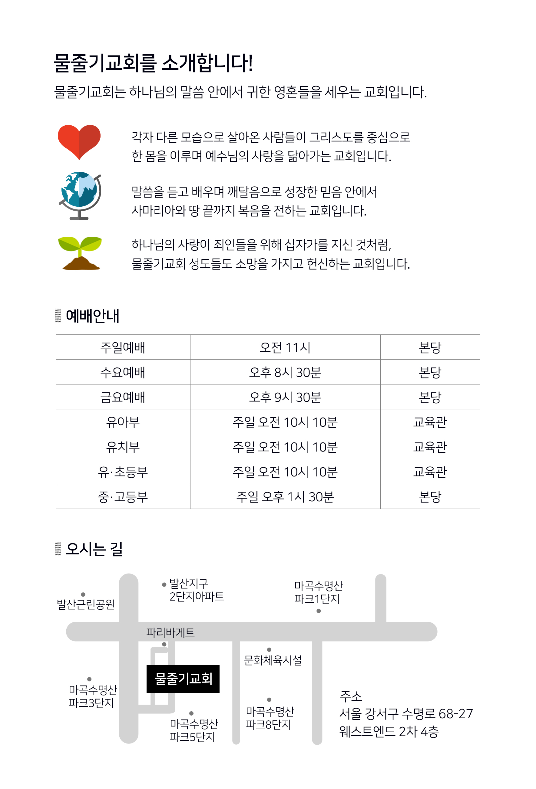

골로새서

골로새서 강해

조춘숙 목사

물줄기교회 출판부

동영상 설교는 https://vimeo.com/watercourse 또는 YouTube에서 “물줄기교회”를 검색해 주세요.

# 이 책을 읽는 분들께

2022년 11월 물줄기교회 목사 조춘숙

# 1. 그리스도의 나라로 옮겨진 성도들

골로새서 1장 1~14절

<blockquote class="scripture-lead">
1하나님의 뜻으로 말미암아 그리스도 예수의 사도 된 바울과 형제 디모데는 2골로새에 있는 성도들 곧 그리스도 안에서 신실한 형제들에게 편지하노니 우리 아버지 하나님으로부터 은혜와 평강이 너희에게 있을지어다 3우리가 너희를 위하여 기도할 때마다 하나님 곧 우리 주 예수 그리스도의 아버지께 감사하노라 4이는 그리스도 예수 안에 너희의 믿음과 모든 성도에 대한 사랑을 들었음이요 5너희를 위하여 하늘에 쌓아 둔 소망으로 말미암음이니 곧 너희가 전에 복음 진리의 말씀을 들은 것이라 6이 복음이 이미 너희에게 이르매 너희가 듣고 참으로 하나님의 은혜를 깨달은 날부터 너희 중에서와 같이 또한 온 천하에서도 열매를 맺어 자라는도다 7이와 같이 우리와 함께 종 된 사랑하는 에바브라에게 너희가 배웠나니 그는 너희를 위한 그리스도의 신실한 일꾼이요 8성령 안에서 너희 사랑을 우리에게 알린 자니라 9이로써 우리도 듣던 날부터 너희를 위하여 기도하기를 그치지 아니하고 구하노니 너희로 하여금 모든 신령한 지혜와 총명에 하나님의 뜻을 아는 것으로 채우게 하시고 10주께 합당하게 행하여 범사에 기쁘시게 하고 모든 선한 일에 열매를 맺게 하시며 하나님을 아는 것에 자라게 하시고 11그의 영광의 힘을 따라 모든 능력으로 능하게 하시며 기쁨으로 모든 견딤과 오래 참음에 이르게 하시고 12우리로 하여금 빛 가운데서 성도의 기업의 부분을 얻기에 합당하게 하신 아버지께 감사하게 하시기를 원하노라 13그가 우리를 흑암의 권세에서 건져내사 그의 사랑의 아들의 나라로 옮기셨으니 14그 아들 안에서 우리가 속량 곧 죄 사함을 얻었도다
</blockquote>

골로새서는 사도 바울이 골로새에 있는 성도들에게 주후 62년경에 보낸 편지입니다. 사도 바울은 그들을 만난 적은 없지만 편지를 통해 예수 그리스도의 우월성을 드러냄으로 교회를 바로 세우려고 노력했습니다. 골로새는 ‘버림’이라는 뜻이며, 로마의 속주인 소아시아 지방의 성읍이고 브루기아 서남쪽에 위치한 도시로서 라오디게아와 수리아로 가는 동서 교통의 요지이기도 합니다.

골로새는 이교와 우상숭배가 보편화 되어 있었고 철학과 종교사상이 팽배했기 때문에 복음이 변질될 위험이 있어서 그들에게 편지를 보낸 것입니다. 교인중에는 그리스도만 믿는 것이 부족하다는 생각에 천사를 숭배하는 사람과 금욕주의와 율법주의에 빠져 믿음보다는 행위를 중요하게 여기는 사람들이 늘어나고 있었습니다. 참 된 진리를 희석하는 자들에 의해 혼합주의 사상이 팽배했던 것입니다. 바울이 예수님의 십자가에 대해서 전하자 그들은 십자가 사건을 지나간 사건으로 치부하였습니다. 자신들이 전하는 거짓 복음이 깊은 깨달음을 통해 알게 된 새로운 말씀처럼 포장을 해서 성도들이 가진 진리를 희석시켰습니다. 하지만, 바울은 이 편지를 통해 성도들이 이단에 속지 않도록 확실한 진리의 말씀을 전한 것입니다.

골로새교회로 보낸 이 서신은 에베소서, 빌립보서, 빌레몬서와 함께 옥중 서신으로 분류되어 있습니다. 옥중 서신은 바울이 로마 감옥에 2년 동안 연금되어 있을 당시 로마황제의 재판을 기다리며 기록한 서신을 일컫는 말입니다. 바울이 3차 선교여행 때, 에베소에 약 2년간 체류한 적이 있는데 그 때 바울에게 말씀을 배운 에바브라가 개척한 교회가 골로새교회입니다. 바울은 골로새교회를 방문하기를 원했지만 실제로 방문하지 못했습니다.

골로새서 1장 1절

> 하나님의 뜻으로 말미암아 그리스도 예수의 사도 된 바울과 형제 디모데는

골로새교회가 이단들에 의해 문제가 생기자 바울은 하나님의 뜻으로 인해 사도가 되었다는 말로 성도들에게 자신을 소개하고 있습니다. 하나님의 뜻은 하나님의 선택과 의지를 포함하고 있기 때문에 자신이 사도가 된 것은 전적인 하나님의 선택과 결정이라고 주장했습니다. 이 서신은 사도 바울 한 개인의 뜻이 아니라 하나님의 강한 의지가 포함되어 있음을 전하고 있는 것입니다. 사도 바울은 율법주의자였고 그리스도인을 핍박한 사람이었습니다. 그래서 그리스도를 영접한 후 올바른 복음을 전했지만 그는 성도들에게 당당할 수 없었습니다. 그렇기 때문에 그가 성도들에게 진리를 가르치기 위해서는 모든 편지에 자신이 사도가 된 것은 하나님의 결정이고 선택이며 의지라고 말할 수밖에 없었습니다. 그는 워낙 성도들의 신뢰를 받지 못했기 때문에 서신서마다 하나님께서 이방인의 구원을 위해서 자기를 택하셨다는 것을 강조해야만 했습니다. 하지만 그리스도를 직접 만난 바울은 이미 거듭난 사람이었고 많은 영혼들을 하나님 앞에 온전하게 세운 사람이었습니다.

복음은 그리스도 자체입니다. 성도들이 그리스도의 사랑과 말씀으로 하나가 되지 못한다면 어둠의 세력과 싸워 이길 수 없기 때문에 그리스도안에서 거듭나야 합니다. 성도들이 받은 죄사함의 은혜는 세상 무엇과도 바꿀 수 없는 복이며 은혜안에서 누리는 평안은 구원의 확신과 천국에 대한 소망입니다.

골로새서 1장 3절

> 우리가 너희를 위하여 기도할 때마다 하나님 곧 우리 주 예수 그리스도의 아버지께 감사하노라

바울이 하나님을 그리스도의 아버지라고 소개한 것은 하나님이 그리스도의 아버지일 뿐 아니라 그리스도안에 있는 우리 모두의 아버지라고 가르쳐 준 것입니다. 하나님께서 예수님을 화목제물이 되게 하신 대속의 사건은 그리스도를 통해 모든 영혼을 사망에서 건진 은혜입니다. 죄의 값을 치룬 예수안에서 새 생명을 받은 우리는 그리스도를 통해 하나님의 자녀가 되었으므로 하나님을 아버지로 부르게 되었습니다. 예수님은 시작과 끝이며 알파와 오메가인 전능 자입니다. 이 사실을 깨달은 바울은 성도들이 자기의 능력에 의지하지 않고 하나님의 아들인 독생자를 의존하기를 간절히 바랬습니다. 그리스도의 희생으로 하나님을 아버지로 부르며 은혜안에서 누리는 평강은 세상이 절대로 줄 수도 없고 누릴 수도 없는 특권이며 축복입니다. 바울은 골로새교회 성도들이 이런 복을 누리기를 항상 기도했습니다. 기도는 성도의 의무이며 당연한 사명입니다. 영혼 구원을 위해서 드리는 기도는 하나님과 교통하는 통로이며 지혜와 은혜를 받을 수 있는 방법이기도 합니다. 바울이 선교활동을 하던 당시에는 목숨을 담보로 하지 않으면 절대로 복음을 전할 수 없었습니다. 이렇게 죽음을 무릅쓰고 구원한 성도들이 이단에게 흔들린다는 소식을 들은 바울은 그들을 지키기 위해서 힘껏 기도했습니다. 그는 성도들이 영분별을 하여 선을 가장한 사탄의 유혹을 물리칠 수 있기를 간절히 바라는 마음뿐이었습니다.

골로새서 1장 5절

> 너희를 위하여 하늘에 쌓아 둔 소망으로 말미암음이니 곧 너희가 전에 복음 진리의 말씀을 들은 것이라

하늘에 쌓아 둔 소망이라는 것은, 예수 그리스도를 근본적으로 믿지 않으면 절대로 가질 수 없는 소망을 말합니다. 이런 소망은 그리스도는 만세 전부터 감추었던 비밀이지만 이제 때가 되어서 십자가를 지셨다는 굳건한 믿음으로 가질 수 있는 지혜입니다. 그래서 성도들은 예수님께서 화목제물이 되어 주셨다는 것을 믿어야만 세상의 유혹과 이단의 사설에 흔들리지 않습니다. 이렇게 복음을 위해서 최선을 다해 헌신한 성도들은 훗날 낙원에 있는 생명나무의 열매를 받게 될 것입니다. 이런 사실을 굳게 믿는 성도들은 이 땅에서도 그리스도와 함께 천국의 삶을 사는 행복을 누릴 수 있습니다. 사도 바울은 하나님께 받은 은혜를 말로 다 전할 수 없었지만 골로새에 있는 성도들이 끝까지 믿음을 지켜 주기를 간절히 바랬습니다. 사람들이 신앙을 조롱하고 핍박하더라도 인내해줄 것을 당부했고 거짓 복음으로 유혹해도 모두 떨쳐버리고 그리스도안에 있기를 원했습니다. 바울도 잘 알고 있는 것처럼 사탄의 유혹과 사람들의 핍박은 직접 몸으로 감당해야 하기 때문에 두려움을 이겨 내는 것은 결코 쉽지 않습니다. 하지만 하늘을 향한 소망안에서 그리스도를 의지한다면 틀림없이 하나님의 얼굴을 직접 뵙고 위로 받는 날이 올 것입니다. 성도들이 바울의 지혜를 이해하기 위해서는 먼저 참 된 진리를 깨달아야 하고 참된 지식을 가져야 합니다. 하나님의 뜻대로 살기 위해서 노력하다 보면 바울이 지금까지 전해 준 말을 언젠가는 깨닫게 될 것입니다.

골로새서 1장 7~8절

> 7이와 같이 우리와 함께 종 된 사랑하는 에바브라에게 너희가 배웠나니 그는 너희를 위한 그리스도의 신실한 일꾼이요 8성령안에서 너희 사랑을 우리에게 알린 자니라

에바브라는 에베소에서 바울에게 배운 대로 골로새교회 성도들에게 소중한 복음을 가르쳤습니다. 이렇게 성경은 먼저 된 성도가 가르치고 그 말씀을 배운 성도는 또 다른 성도를 가르치는 방식으로 전해집니다. 말씀을 먼저 배웠다고 해서 나중 배운 성도보다 믿음이 충만하다고 말할 수는 없지만 하나님께서는 사람을 통해서 복음이 전해지도록 하셨습니다. 하나님께서는 성도들이 말씀을 배우고 가르치는 과정을 통해 지혜를 갖게 하셨고 또한 믿음이 성장하도록 하셨습니다. 그래서 성도들은 말씀을 가르칠 때 정직하게 진리만 전해야 하고 성도의 본이 되는 올바른 삶을 살아야 합니다. 말씀을 가르치는 것은 결코 쉽지 않습니다. 자신이 전한 복음이 은혜가 되기 위해서는 삶이 먼저 정결해야 합니다. 그리고 믿음을 보여야만 말씀을 들은 사람이 하나님을 만날 수 있습니다. 물론 하나님의 은혜로운 말씀이기 때문에 듣는 즉시 믿음을 가질 수도 있겠지만 전도자의 믿음이 절대적으로 필요한 것입니다.

가룟 유다는 예수님의 제자였지만 말씀대로 살지 못하자 그가 가지고 있던 거룩한 말씀을 사용할 수 없게 되었습니다. 하지만, 가룟 유다가 전했던 말씀은 처음부터 하나님의 것이었으므로 말씀을 들은 사람들 중에 믿음을 가진 사람도 있었을 것이고 구원받은 사람들도 있었을 것입니다. 말씀이 영혼을 구원한다는 것을 안다면 말씀을 전할 기회가 있을 때 가장 겸손하고 두려운 마음으로 복음을 전해야 합니다. 그래야만, 하나님께서 말씀을 가진 자를 더 지혜롭게 하실 것이며 선교할 수 있는 힘과 능력을 주실 것입니다.

에바브라를 그리스도의 신실한 일꾼이라고 칭찬한 것은 그가 진리 되신 예수 그리스도만 전했기 때문에 하나님의 나라를 확장하는 귀한 종으로 인정받은 것입니다. 골로새는 교통과 무역의 중심도시였으므로 풍요로운 삶을 살 수 있었지만 반면에 이단사상과 철학이 성행했기 때문에 에바브라가 교회를 개척하기에는 악 조건이었을 것입니다. 그곳은 수리아의 아티오쿠스 3세가 유대인 이천명을 강제 이주시킨 적이 있었기 때문에 유대인들의 영향력이 강한 도시였습니다. 그래서 율법적인 사상을 가진 그들에게 기독교를 전파한다는 것은 결코 쉽지 않았습니다. 에바브라는 바울에게 자기 교회 성도들의 신앙에 대해서 상담하며 기도를 요청했습니다. 이것을 보면, 에바브라가 골로새교회와 성도들을 얼마나 사랑하고 있는지 알 수 있습니다. 에바브라는 로마 감옥에 갇힌 바울을 수종 들면서 함께 어려움을 견뎌낸 신실한 동역자이기도 합니다. 감옥에 갇힌 바울을 돕는다는 것은 자신이 위험에 처할 수 있는 상황이지만 바울을 위해서 목숨을 걸고 사역을 감당했습니다. 이런 성도가 있었기 때문에 기독교가 성장한 것입니다.

골로새서 1장 9절

> 이로써 우리도 듣던 날부터 너희를 위하여 기도하기를 그치지 아니하고 구하노니 너희로 하여금 모든 신령한 지혜와 총명에 하나님의 뜻을 아는 것으로 채우게 하시고

바울은 에바브라를 통해 골로새교회 성도들에 관해 잘 알고 있었으므로 기도를 쉬지 않았습니다. 그들이 그리스도 안에서 평안하게 살기를 바라는 마음도 있었지만 영적 지혜와 총명으로 말씀을 정확하게 알기를 바라는 마음이 더 컸습니다. 교회에서 귀로만 듣는 신앙이 아니라 진리를 깨닫고 말씀대로 살면서 성화되는 성도가 되게 해 달라고 기도하였습니다. 이단이 극성을 부리는 골로새에서 하나님의 자녀가 되기 위해서는 먼저 성경 말씀으로 지혜를 가져야 합니다.

여러분은 물건을 사면 먼저 설명서를 꼼꼼히 읽을 것입니다. 이처럼 하나님의 일도 성경을 알고 나서 해야 하는 것입니다. 하나님께서 왜 나를 부르셨으며 그리스도가 나와 무슨 연관성이 있는지 내가 무엇을 해야 하나님을 위해서 헌신할 수 있는지 정확하게 아는 성도가 선한 뜻을 드러낼 수 있습니다. 성경에는 하나님의 뜻과 지혜 그리고 악한 유혹을 피할 길이 모두 기록되어 있기 때문에 성도들은 성경을 반드시 읽어야 합니다. 교만은 패망의 선봉이라고 했습니다. 수많은 세월동안 역사하신 하나님의 창조의 목적과 그리스도의 희생을 나와 연결하지 못하면 교만해질 수밖에 없습니다. 하나님께서는 성도들이 믿음을 갖도록 성경에 명확하게 알려주셨습니다.

사도행전 20장 17~20절

> 17바울이 밀레도에서 사람을 에베소로 보내어 교회 장로들을 청하니 18오매 그들에게 말하되 아시아에 들어온 첫날부터 지금까지 내가 항상 여러분 가운데서 어떻게 행하였는지를 여러분도 아는 바니 19곧 모든 겸손과 눈물이며 유대인의 간계로 말미암아 당한 시험을 참고 주를 섬긴 것과 20유익한 것은 무엇이든지 공중앞에서나 각 집에서나 거리낌이 없이 여러분에게 전하여 가르치고

바울은 밀레도항구에 내리자마자 약 50킬로 떨어진 에베소에 사람을 보내어 장로들을 오라고 청했습니다.

그는 에베소교회에 특별한 관심과 사랑을 가지고 있었기 때문에, 그들에게 마지막으로 해 주고 싶은 말이 많았습니다. 성령께서 바울에게 말씀하시길, 이제 예루살렘으로 가면 지금 당한 어려움보다 훨씬 심한 상황이 기다리고 있을 것이라고 하셨기 때문에 자신에게 환난이 닥칠 것을 알고 있었습니다. 다시는 그들을 볼 수 없을 것이므로 에베소 장로들에게 마지막으로 진리를 전하면서 그들의 믿음을 세워주고 싶었던 것입니다.

바울은 에베소 장로들에게 말하길 하나님께서 자신을 사도로 불러 주셨기 때문에 끝까지 눈물로 인내했다고 하였습니다. 유대인의 간계를 인하여 시험을 당해도 참으며 성도들에게 하나님의 영광과 예수님의 대속하심과 성령님의 역사하심을 가감없이 전했다고 하였습니다. 이제 앞으로 사는 동안 다시는 여러분을 볼 수 없겠지만 자신이 믿음을 지키며 살았던 것처럼 살아 주기를 원한다고 간절히 부탁했습니다. 만약 그 자리에서 여러분이 장로들과 함께 사도 바울의 말을 들었다면 어떤 결심을 하겠습니까? 에베소교회 장로들처럼 예수님께서 성육신 하신 것과 십자가를 지고 죄를 대속하신 것과 부활하고 승천하신 것을 믿고 있으니까 염려하지 말라고 자신 있게 말할 수 있겠습니까?

여러분이 진리를 알고 있다면 바울처럼 변함없는 말씀을 전해야 합니다. 사도 바울은 말씀을 끝내면서 자신은 모든 사람들의 피에 대하여 깨끗하다는 정말 충격적인 고백을 하였습니다. 사람들의 피에 대해 깨끗하다는 것은, 자신은 참된 진리만 전했기 때문에 하나님을 언제 만나도 부끄럽지 않다는 것입니다. 이렇게 진리만 전했는데도 만약 여러분이 하나님과 멀어진다면 그것은 여러분의 책임이라는 말을 하고 있습니다. 이것을 보면, 바울은 복음을 영접한 후에 자기의 사명을 책임감 있게 수행하며 진리의 길을 벗어나지 않았다는 것을 알 수 있습니다. 바울이 복음을 올바로 선포했다면 진리를 듣고도 받아들이지 않는 사람들의 죄까지 책임질 필요가 없는 것입니다.

골로새서 1장 10절

> 주께 합당하게 행하여 범사에 기쁘시게 하고 모든 선한 일에 열매를 맺게 하시며 하나님을 아는 것에 자라게 하시고

성도는 세상의 복을 받기 위해서 신앙생활을 하는 것이 아닙니다. 하나님을 알고 그리스도를 믿고 성령의 인도하심을 받는 성도의 삶 자체가 축복입니다. 이렇게 선한 삶을 사는 성도는 하나님께서 주시는 평안과 안식을 누리게 되며 범사에 감사하는 믿음을 갖게 됩니다. 바울은 골로새교회 성도들이 이렇게 깊은 영적경험을 하며 성화되는 성도가 되기를 간절히 원했습니다.

골로새서 1장 13~14절

> 13그가 우리를 흑암의 권세에서 건져내사 그의 사랑의 아들의 나라로 옮기셨으니 14그 아들 안에서 우리가 속량 곧 죄 사함을 얻었도다

흑암의 권세란 죄와 죽음 그리고 사탄의 권세를 말하는 것입니다. 사탄은 성도들과 사람들의 마음을 혼미하게 하여 그리스도의 영광의 광채가 비치지 못하도록 방해하고 있지만 흑암은 빛을 막을 수 없습니다. 사탄은 하나님을 대적한 죄로 쫓겨난 후 공중 권세를 잡고 불순종하는 사람들에게 역사하고 있습니다. 하나님께서 아들을 사망에 던지면서까지 죄를 용서하셨지만 그리스도를 믿지 않는다면 영원히 사탄의 종으로 살 수밖에 없는 것입니다.

에베소서 2장 1~2절

> 1그는 허물과 죄로 죽었던 너희를 살리셨도다 2그 때에 너희는 그 가운데서 행하여 이 세상 풍조를 따르고 공중의 권세 잡은 자를 따랐으니 곧 지금 불순종의 아들들 가운데서 역사하는 영이라

이스라엘 백성이 바로에게 고통 당하는 것을 보신 하나님께서 모세로 하여금 출애굽 하도록 하셨습니다. 이스라엘 백성을 가나안 땅으로 인도하신 것처럼 사탄의 권세에서 우리를 건져내어 사랑하시는 아들의 나라로 옮겨 주신 것입니다.

그리스도의 나라는 흑암의 권세가 공격할 바늘구멍만 한 틈조차 없는 빛의 나라이며 영원한 나라입니다. 그 나라에 들어갈 수 있는 열쇠가 바로 복음입니다. 성육신 하신 예수님이 죄와 사망을 이기고 부활하신 것을 믿는 것이 복음이며 처소를 예비한 후에 다시 재림하실 것을 믿는 것이 복음입니다. 이렇게 좋은 소식을 믿지 않는다면 복음을 듣고도 믿지 않은 사람들이 그 책임을 지게 될 것입니다.

여러분 예수 그리스도께서 주신 구원보다 더 감사할 수 있는 것은 이 세상에 없습니다. 당연한 것을 당연하게 감사하지 못한다면 성숙한 성도가 아닙니다. 감사하지 않는 사람은 지혜와 총명과 믿음을 가질 수 없으므로 하나님의 영광도 볼 수 없게 될 것입니다. 하나님께서는 이기셨고 그 승리를 우리에게 주셨습니다. 그 승리를 여러분의 것으로 믿고 살아갈 때 선한 삶을 살 수 있으며 여러분의 구원은 물론 곁에 있는 사람들을 구원하는 사명도 감당할 수 있습니다. 사도 바울은 골로새교회 성도들이 그리스도 안에서 충만한 믿음으로 은혜와 평강이 넘치기를 원했습니다. 그런 믿음은 이단을 분별할 수 있으며 진리의 말씀을 떠나지 않습니다.

여러분도 골로새교회 성도들이 누리는 은혜와 평강이 항상 넘치기를 바라며 그리스도께 받은 구원을 지켜 내고 더 나아가 복음을 전하는 성도의 사명을 감당하기 바랍니다.

# 2. 우리를 위해 화목제물이 되신 예수 그리스도

골로새서 1장 14~29절

<blockquote class="scripture-lead">
14그 아들 안에서 우리가 속량 곧 죄 사함을 얻었도다 15그는 보이지 아니하는 하나님의 형상이시요 모든 피조물보다 먼저 나신 이시니 16만물이 그에게서 창조되되 하늘과 땅에서 보이는 것들과 보이지 않는 것들과 혹은 왕권들이나 주권들이나 통치자들이나 권세들이나 만물이 다 그로 말미암고 그를 위하여 창조되었고 17또한 그가 만물보다 먼저 계시고 만물이 그 안에 함께 섰느니라 18그는 몸인 교회의 머리시라 그가 근본이시요 죽은 자들 가운데서 먼저 나신 이시니 이는 친히 만물의 으뜸이 되려 하심이요 19아버지께서는 모든 충만으로 예수 안에 거하게 하시고 20그의 십자가의 피로 화평을 이루사 만물 곧 땅에 있는 것들이나 하늘에 있는 것들이 그로 말미암아 자기와 화목하게 되기를 기뻐하심이라 21전에 악한 행실로 멀리 떠나 마음으로 원수가 되었던 너희를 22이제는 그의 육체의 죽음으로 말미암아 화목하게 하사 너희를 거룩하고 흠 없고 책망할 것이 없는 자로 그 앞에 세우고자 하셨으니 23만일 너희가 믿음에 거하고 터 위에 굳게 서서 너희 들은 바 복음의 소망에서 흔들리지 아니하면 그리하리라 이 복음은 천하 만민에게 전파된 바요 나 바울은 이 복음의 일꾼이 되었노라 24나는 이제 너희를 위하여 받는 괴로움을 기뻐하고 그리스도의 남은 고난을 그의 몸된 교회를 위하여 내 육체에 채우노라 25내가 교회의 일꾼 된 것은 하나님이 너희를 위하여 내게 주신 직분을 따라 하나님의 말씀을 이루려 함이니라 26이 비밀은 만세와 만대로부터 감추어졌던 것인데 이제는 그의 성도들에게 나타났고 27하나님이 그들로 하여금 이 비밀의 영광이 이방인 가운데 얼마나 풍성한지를 알게 하려 하심이라 이 비밀은 너희 안에 계신 그리스도시니 곧 영광의 소망이니라 28우리가 그를 전파하여 각 사람을 권하고 모든 지혜로 각 사람을 가르침은 각 사람을 그리스도 안에서 완전한 자로 세우려 함이니 29이를 위하여 나도 내 속에서 능력으로 역사하시는 이의 역사를 따라 힘을 다하여 수고하노라
</blockquote>

사람들은 누구나 하나님께 동일한 사랑과 은혜를 받았습니다. 그럼에도 불구하고 시간이 지날수록 다른 사람들이 받은 은혜와 사랑의 크기를 비교하며 감사와 순종보다는 불평과 교만을 드러내고 있습니다.

예수님께서는 다른 제자보다 어쩌면 가룟 유다를 더 의지했을 것입니다. 그는 재정을 맡았기 때문에 예수님과 제자들이 얼마나 큰 어려움을 당하고 있는지 보았기 때문입니다. 그러나 예수님의 능력이 자기가 세상을 살아가는데 큰 도움이 되지 않는다는 생각이 들자 절대적인 예수님의 사랑을 판단하는 죄를 지었습니다. 처음에는 예수님의 소유와 상관없이 무조건 따르고 섬겼습니다. 하지만 시간이 지날수록 열심히 일을 하는 자신에게 세상의 재물이 주어지지 않는다는 생각이 들자 보상을 받고 싶었습니다. 자신의 판단이 옳다는 생각에 사로잡히자 예수님을 판 것입니다. 이런 행동은 예수님을 무시하는 처사입니다. 예수님을 판다는 것은 말씀이 소중하지 않다는 증거이기 때문입니다. 예수님이 기적을 행하시는 것을 보면서 자기는 제자이기 때문에 천국에 들어갈 수 있다는 교만을 갖게 되었습니다. 그런 인간의 의가 선한 판단력을 흐리게 했고 결국 자신의 영혼을 지옥에 떨어뜨리는 불행을 자초하고 말았습니다.

가룟 유다가 첫 사랑을 간직했다면 그는 어쩌면 가장 먼저 수제자로 세움을 받았을 것입니다. 이런 교만이 앞서서 일하는 사람들이 빠지기 쉬운 함정입니다. 그토록 많은 일을 감당하고도 결국 지옥에 떨어지는 그를 보면서 혹시 지금 우리가 하나님의 은혜보다 자신을 앞세우고 있는 것은 아닌지 생각해야 합니다. 성도들이 목숨을 걸고 헌신하는 것은 영벌을 받을 뻔했던 죄인들이 영원한 나라에서 사는 축복을 받았으므로 당연한 일입니다. 그런 우리가 하나님의 은혜를 세상의 가치로 판단한다면 우리도 가룟 유다와 동일한 결말을 맞이할 수 있습니다. 예수님께서 죄인의 몸을 입고 이 땅에 오신 것을 믿는다면 목숨을 드리는 충성을 보여 드려야 합니다.

사도 바울은 로마교회 성도들에게 내가 하나님의 자비하심으로 너희에게 부탁하는데 너희 몸을 하나님이 기뻐하시는 거룩한 산 제물로 드리라고 하였습니다. 이것이 성도들이 드릴 영적 예배이기 때문입니다. [롬 12:1]

골로새서 1장 14절

> 그 아들 안에서 우리가 속량 곧 죄 사함을 얻었도다

구속은 값을 지불하고 어떤 대상을 획득한다는 의미를 가지고 있습니다. 예수님이 십자가에서 자신의 목숨으로 죄의 값을 치르고 죄인을 사망에서 건져낸 것도 구속이라고 말하는 것입니다. 모든 인류의 죄를 구속하시기 위해서 자신의 몸을 사용하신 육체라는 단어와 성소에서 사람들의 죄값으로 제물이 된 동물의 고기라는 단어가 동일합니다. 죄인의 죄를 전가하고 제물이 되어 죽어가던 동물들의 고통이 예수님께서 인류의 죄를 구속하시기 위해서 십자가에서 받은 육체의 고통과 동일한 것입니다. 자신의 죄가 아닌 죄인의 죄를 지고 죽어야 하는 제물이기 때문입니다. 성소에서 제물이 된 동물들을 보면 예수님께서 왜 인간의 몸을 입고 이 땅에 오셨는지 알 수 있습니다. 동물들은 사람들이 죄를 지을 때마다 반복적으로 제물이 되어야 했지만 예수님은 단번에 죄를 사해 주셨고 그 효과는 영원하기 때문에 예수님이 반드시 이 땅에 와야만 했습니다.

창세기 2장 17절

> 선악을 알게 하는 나무의 열매는 먹지 말라 네가 먹는 날에는 반드시 죽으리라 하시니라

말씀으로 창조하신 죄가 없는 세상 만물을 보시며 하나님께서는 보기에 좋았다고 하셨습니다. 그러나 아담과 하와는 선악과를 먹지 말라는 하나님의 말씀을 듣고도 사탄의 유혹에 넘어가 선악과를 먹고 말았습니다. 하나님은 언제나 심판하시기 전에 경고를 하십니다. 네가 선악과를 먹는 날에는 반드시 죽을 것이라고 하신 하나님의 말씀은 변하지 않기 때문에 사람들은 변명을 했지만 모두 영적인 죽음과 육적인 죽음을 맞이하고 말았습니다. 물론 아담과 하와는 선악과를 먹었지만 그 자리에서 죽지는 않았기 때문에 보기에 죽은 것처럼 보이지 않을 것입니다. 그러나 에덴동산에서 원할 때마다 하나님을 만났던 그들이 에덴을 쫓겨난 것이 영적인 죽음이며 하나님께서 정하신 시간이 되면 육이 흙으로 돌아가는 죽음을 맞이하게 됩니다.

하나님의 말씀은 변치 않기 때문에 그들은 죄로 인해 하나님을 영원히 만날 수 없게 되었습니다. 하나님은 아담이 선으로 살아갈 수 있도록 모든 것을 창조하셨습니다. 그러나 아담과 하와는 하나님보다 자신의 생각과 의를 고집하므로 사탄의 동역자가 되고 만 것입니다. 지금 우리가 천국에 들어갈 수 있는 방법은 그리스도를 믿는 것입니다. 예수 그리스도를 믿음으로 죄를 용서받고 하나님과 화목한 성도가 될 때 천국에 들어갈 수 있다는 것을 잊지 않기 바랍니다.

하나님을 거역한 사람들은 자신의 의지대로 선과 악을 선택할 수 있게 되었고 세상에서 일어나는 일들을 판단할 수 있게 되었습니다. 하나님 말씀보다 자신의 의가 강해질 때 판단하는 죄를 짓는 것입니다. 성도들은 세상사람들이 지옥에 간다고 생각하지만 성경은 교회 안에 들어온 사람들의 믿음이 변질되었을 때 받는 심판을 알려주고 있습니다.

요한복음 10장 11절

> 나는 선한 목자라 선한 목자는 양들을 위하여 목숨을 버리거니와

이 세상에 선하신 분은 오직 예수 그리스도 한 분뿐입니다. 인간이 만든 윤리로 선과 악을 판단하는 사람들은 전지전능하신 하나님의 선하신 말씀을 절대로 이해할 수 없습니다. 선악과를 먹은 사람들은 사탄이 조종하는 대로 모든 것을 판단하는 교만에 빠졌기 때문에 말씀을 들어도 이해할 수도 없고 돌이킬 수도 없는 강퍅한 인생을 살게 되었습니다. 그런데 불행하게도 교만한 사람은 자신이 교만하다는 것을 알지 못합니다. 늘 이유가 있고 변명이 있기 때문에 돌이키기 어렵습니다. 진리를 벗어났을 때 변명을 하지 말고 즉시 돌이킨다면 하나님께 용서받을 뿐 아니라 이 일을 계기로 성장할 수 있습니다.

사탄의 목적은 사람들이 죄인으로 사는 것입니다. 사탄 역시 하나님의 피조물이지만 하나님처럼 눈이 밝기를 원했고 하나님 자리에서 자신이 기준이 되기를 바랬습니다. 그러나 그들은 하나님의 상대가 되지 않기 때문에 뜻을 이룰 수 없게 되자 하나님께서 사랑하는 사람을 타락시켜서 구원을 방해한 것입니다. 어리석게도 하나님의 사랑을 받고도 깊은 은혜를 감사하지 못했던 사람들은 말씀을 거역한 죄로 인해 하나님과 단절되고 말았습니다. 하나님께서는 사탄의 동역자가 되어 썩은 냄새가 진동해서 빛으로 나올 수 없는 사람들을 더 이상 품어 줄 수 없었습니다. 선악과를 먹으면 죽는다고 말씀하신 대로 사람들의 육체와 영혼은 모두 사탄의 권세 아래에서 죽고 말았습니다. 이제 그들을 다시 살려서 천국으로 인도하기 위해서는 특단의 조치가 필요했습니다.

로마서에 보면 죄의 삯은 사망이요 하나님의 은사는 그리스도 예수 우리 주안에 있는 영생이라고 기록되어 있습니다. [롬 6:23] 영혼을 살리고 영생을 주는 방법은 선악과를 먹으면 죽는다고 말씀하신 그 예수님이 사람들을 사망에서 건져주는 것뿐입니다. 그래서 성자 하나님이 이 땅에 오신 것이며 자신의 몸에 인류의 죄를 지고 십자가에서 육신이 찢기는 고통을 감당하는 화목제물이 된 것입니다. 물론 예수님이 오시기 전까지는 동물들에게 안수하여 죄를 전가한 후 동물을 죽이는 것으로 죄 사함을 받았습니다. 하지만 번제를 드린다고 해서 영원히 죄 사함을 받는 것이 아니라 죄를 지을 때마다 반복해서 제사를 지내야 했기 때문에 그리스도께서 제물의 본체가 되어 주신 것입니다.

예수님은 성자 하나님이며 성령으로 잉태하셨기 때문에 죄가 없지만 인간의 모든 죄를 지고 기꺼이 대속의 사역을 완성하셨습니다. 마지막 숨을 거두면서 다 이루었다는 말씀으로 둘째 사망에 묶인 사람들을 해방시켰고 믿음을 가진 사람들에게 새 생명을 주셨습니다. 사망을 갑옷처럼 입고 다니며 벗을 능력이 없었던 죄인들은 이제 사망을 벗어버리고 자유롭게 되었습니다. 이것이 바로 하나님께서 처음부터 우리에게 주고 싶었던 은혜입니다. 이런 사랑을 받은 자녀들이 감사하지 않고 교만하며 부정적인 시각으로 모든 것을 판단한다면 결국 사탄의 권세에 굴복할 것입니다. 하나님의 절대적인 사랑을 받은 성도들은 영원한 세계를 소망하며 하나님의 간절한 뜻인 복음을 전하기 위해서 자신의 의를 버리는 훈련을 반드시 해야 합니다.

고린도후서 5장 19절

> 곧 하나님께서 그리스도안에 계시사 세상을 자기와 화목하게 하시며 그들의 죄를 그들에게 돌리지 아니하시고 화목하게 하는 말씀을 우리에게 부탁하셨느니라

하나님께서는 그리스도께 대속의 사역을 맡기신 것처럼 이제는 우리에게 저 영혼들을 구원해 달라는 거룩한 말씀을 맡겨 주셨습니다. 예수 그리스도안에서 자유를 누리게 된 성도들은 세상 사람들이 하나님과 화목할 수 있도록 전도의 사명을 받았습니다. 우리는 하나님께서 죄인들을 구원하기 위해 얼마나 많은 고통을 감내하셨는지 잘 알고 있습니다. 이런 사랑을 받은 성도들이 작은 일에 분노하고 불평하며 인내하지 않는다면 하나님께서 맡겨 주신 사명을 감당하지 못할 것입니다. 구원의 큰 틀에서 보면 세상의 일은 너무 하찮은데도 감사를 잃고 교만해지면 판단력이 흐려지므로 사탄의 말을 따를 수밖에 없습니다. 그리스도처럼 하나님의 뜻을 아는 성도들은 헛되고 헛된 세상과 자신을 믿지 말고 그리스도께서 어떤 말씀을 하셨는지 살펴야 합니다.

요한복음 1장 3~4절

> 3만물이 그로 말미암아 지은 바 되었으니 지은 것이 하나도 그가 없이는 된 것이 없느니라 4그 안에 생명이 있었으니 이 생명은 사람들의 빛이라

하늘과 땅 그리고 땅에 있는 모든 식물과 동물들과 사람까지 모두 그리스도께서 말씀으로 창조하셨기에 그 안에 생명이 흐르고 있습니다. 예수 그리스도는 생명 그 자체이기 때문에 피조물들이 생명을 가지고 있는 것입니다. 또한 보이지 않는 것들 그러니까 영의 세계와 천사의 세계 그리고 보좌와 정사들과 권세들까지 모두 주관하고 계십니다. 사도 바울은 하나님께서 이 모든 것을 창조하신 이유는 바로 하나님 자신을 위해서 창조하셨다고 하였습니다. 이사야서에도 하나님께서 이 백성은 내가 나를 위하여 지었나니 나를 찬송하게 하기 위해서 지었다고 말씀하셨습니다. [사 43:21]

아이들은 신이 나면 시키지 않아도 노래를 흥얼거리는 것처럼 하나님이 얼마나 좋으신 분인지 하나님을 섬기는 것이 얼마나 귀한 일인지 아는 성도는 세상을 떠나는 날까지 찬양할 것입니다. 창조의 목적이 성도들의 찬송을 듣기 위한 것이라면 우리는 하나님께 영광을 돌리며 소리 높여 찬양해야 합니다. 우리의 목소리로 찬송을 드리는 것도 귀하지만 선한 삶을 살아내는 것도 찬송을 드리는 것이므로 성도 답게 살아야 합니다.

골로새서 1장 18절

> 그는 몸인 교회의 머리시라 그가 근본 이시요 죽은 자들 가운데서 먼저 나신이시니 이는 친히 만물의 으뜸이 되려 하심이요

교회는 예수님의 몸이며 예수님은 교회의 머리입니다. 그래서 성도들은 각 지체가 되어 서로 밀접하게 관련되어 있기 때문에 자기의 생각대로 행동하고 판단해서는 안 됩니다. 지체인 성도들이 자신의 자리에서 맡은 일을 묵묵히 감당할 때 교회는 세상을 향해 복음을 전하는 능력을 발휘할 수 있습니다. 그리스도의 명령에 절대적인 순종과 충성을 드려야만 하나님의 나라를 확장할 수 있기 때문에 성령의 인도하심을 받아야 합니다. 한 성도라도 성숙한 믿음을 갖기 위해서 노력한다면 교회는 더 강해질 것이며 지혜로운 말씀으로 악한 영을 대적할 수 있습니다.

빌립보서 3장 21절

> 그는 만물을 자기에게 복종하게 하실 수 있는 자의 역사로 우리의 낮은 몸을 자기 영광의 몸의 형체와 같이 변하게 하시리라

예수님께서 죽은 나사로를 살리셨습니다. 나사로는 예수님의 능력으로 살아났지만 그는 육체의 생명이 다하자 다시 무덤으로 돌아갔기 때문에 우리는 나사로가 부활했다고 말하지 않습니다. 예수님께서 천사들의 호위를 받고 승천하셔서 보좌에 앉으신 것처럼 성도들도 변화 받은 몸으로 영광의 부활을 하게 되면 하나님의 나라에 입성하게 될 것입니다. 예수님께서 화목제물이 되어 주신 것은 이렇게 창조의 역사와 부활과 그리고 마지막 심판까지 연결되어 있습니다. 예수님의 부활이 없었다면 기독교는 끝까지 이어지지 못했을 것입니다. 기독교는 하루아침에 만들어진 종교가 아니라 스스로 계신 하나님께서 계획하고 실행하신 역사이기 때문에 절대로 변질되거나 실패하지 않고 모두 성취될 것입니다.

온 인류는 하나님의 이름을 높이고 경배하며 받은 생명에 감사하면서 찬양을 드리는 성도가 되어야 합니다. 날마다 자신을 쳐서 복종하며 믿음을 지키기 위해서 최선을 다하는 사도 바울은 골로새교회 성도들이 자기처럼 그리스도만 의지하고 감사하는 삶을 살기를 바랬습니다. 여러분도 하나님의 형상대로 지음을 받았으므로 하나님을 찬송하고 높이며 영광을 돌리는 성도가 되기 바랍니다. 전도하고 봉사하는 것을 희생이라고 하겠지만 그것은 하나님과 화목해지는 방법이며 결국 자신의 구원을 이루는 감사의 모습입니다. 우리가 전에는 세상을 위해서 살았지만 이제는 예수님이 왜 십자가에서 모진 고통을 당했는지 알았으므로 천국 백성 답게 경건하고 의롭고 거룩하게 살아야 합니다.

골로새서 1장 24절

> 나는 이제 너희를 위하여 받는 괴로움을 기뻐하고 그리스도의 남은 고난을 그의 몸 된 교회를 위하여 내 육체에 채우노라

바울은 복음때문에 핍박을 받고 있지만 그것은 스스로 선택한 고난입니다. 많은 사람들이 부러워했던 좋은 가문과 학벌 그리고 부귀영화를 누렸던 그가 예수님을 영접하고 난 후에 그 모든 것을 버렸기 때문입니다. 그는 이방인의 사도가 되었을 때 그리스도께서 세상에서 하시고 싶었던 일들을 자신의 육체를 통해 충성하겠다는 결심을 하였습니다. 이 말을 하는 것을 보면 복음을 전하는 사역이 얼마나 힘든 지 충분히 알 수 있지만 바울은 그것을 알면서도 고난의 길을 택한 것입니다.

고린도후서 11장에 보면 바울은 사십에서 하나 감한 매를 다섯번이나 맞았고 세번 태장을 맞았으며 수많은 고난과 환난을 당했습니다. 로마에서 맞은 태장은 채찍 끝에 납이 달려 있기 때문에 그는 치명상을 입었을 것입니다. 로마인에게는 태장이 금지된 법이므로 바울은 매를 맞지 않아도 되었지만 그는 자신이 로마인이라고 밝히지 않았습니다. 하나님께서 이방인의 구원을 위해서 자신을 이방인의 사도로 세워 주신 뜻을 알기 때문에 묵묵히 견딘 것입니다.

그리스도안에 세운다는 말씀 중에 ‘세운다’의 뜻은 ‘드린다’라는 의미를 가지고 있습니다. 목회자가 성도를 말씀으로 하나님 앞에 세우는 것과 성도가 전도하는 것은 곧 구원의 열매를 하나님께 드리는 것입니다. 말씀을 전하는 사람은 온전한 구원의 열매를 드릴 수 있도록 최선을 다해 사람들을 진리로 세워야 합니다. 하나님을 영접한 사람들은 법적으로 완전히 사망에서 해방되었습니다. 바울은 하나님의 자녀가 된 골로새교회 성도들이 낙심하지 않고 힘과 위로가 되시는 하나님을 의지하며 하나님께서 받으실 만한 귀한 열매가 되기를 원했습니다.

하나님의 자녀가 되신 여러분, 우리를 위해서 죽으시고 부활하시고 승천하셔서 지금 하나님 우편에 앉아 계신 예수 그리스도께서는 때가 되면 영광 중에 다시 오실 것입니다. 그 때 우리는 모두 큰 은혜 가운데 부활할 것이며 변화되어 새 하늘과 새 땅에 들어가 영원히 복된 삶을 누릴 것입니다.

이것이 하나님께서 우리에게 주고 싶은 창조의 목적이고 축복입니다.

사도 바울은 목숨이 다하는 날까지 헌신했는데 그 헌신까지도 그리스도께서 능력을 주셨기 때문에 할 수 있었다는 겸손한 말을 했습니다. 자신의 생명을 드리며 헌신했던 사도 바울의 믿음은 우리가 하나님께 드려야 하는 신앙입니다. 우리도 바울처럼 하나님의 살아 계심과 예수 그리스도의 희생과 성령의 은혜를 알고 있으므로 선교사역을 위해서 헌신해야 합니다. 하나님을 높여 드리는 겸손한 성도는 사도 바울과 같이 악한 영으로부터 영혼을 구원할 것이며 하나님께 생명의 면류관을 받게 될 것입니다. 그 영광은 인간의 말로 표현할 수 없는 거룩한 상급이므로 세상의 욕심을 버리고 살아간다면 하나님과 함께 영원히 살 수 있습니다.

여러분은 가룟 유다처럼 죽도록 일하고 버림을 받는 어리석은 자가 되지 말고 사도 바울처럼 진리의 말씀으로 거듭나 사랑받는 성도가 되기 바랍니다. 하나님의 의를 위해서 자신의 의를 버리는 명철한 성도가 되어 하나님의 자녀로 당당히 천국의 삶을 누리기를 바랍니다.

# 3. 하나님의 비밀인 그리스도

골로새서 2장 1~5절

<blockquote class="scripture-lead">
1내가 너희와 라오디게아에 있는 자들과 무릇 내 육신의 얼굴을 보지 못한 자들을 위하여 얼마나 힘쓰는지를 너희가 알기를 원하노니 2이는 그들로 마음에 위안을 받고 사랑 안에서 연합하여 확실한 이해의 모든 풍성함과 하나님의 비밀인 그리스도를 깨닫게 하려 함이니 3그 안에는 지혜와 지식의 모든 보화가 감추어져 있느니라 4내가 이것을 말함은 아무도 교묘한 말로 너희를 속이지 못하게 하려 함이니 5이는 내가 육신으로는 떠나 있으나 심령으로는 너희와 함께 있어 너희가 질서 있게 행함과 그리스도를 믿는 너희 믿음이 굳건한 것을 기쁘게 봄이라
</blockquote>

여러분도 기부를 하고 있겠지만 저희 교회가 우크라이나를 돕기 위해서 기부한 것은 그 분들이 끼니를 해결하고 약품을 구입 하면서 삶의 의지를 갖기를 바라는 마음에서 기부 한 것입니다. 기부금을 받는 분들의 마음을 자세히 이해할 수는 없지만 그들의 삶이 조금이라도 편해지기를 바랄 뿐입니다. 저도 가끔 기부하는 단체에서 아이들의 사진을 보내며 학교에 입학하고 졸업했다는 소식을 전해주기도 합니다. 만난 적은 없지만 아이들이 잘 성장하고 있다는 소식만 들어도 마음이 뿌듯하고 감사한 마음이 생깁니다. 그들은 기부자가 어떤 일을 하는지 어떤 마음으로 자기들을 도와주는지 잘 모르겠지만 도움을 받는 그 자체로 감사할 것입니다. 서로 돕고 사는 것은 하나님께서 원하시는 일이기 때문에 기부했다고 자랑할 것도 없고 도움을 받았다고 부끄러워할 것도 없습니다. 도움을 받았다면 감사하는 마음으로 더 열심히 살면서 또 다른 누군가를 돕는다면 그것으로 성숙한 세상을 만들 수 있기 때문입니다.

신앙도 마찬가지라고 생각합니다. 하나님의 사랑과 은혜에 감사해서 열심히 믿음으로 살다 보면 자신도 모르는 사이에 성숙한 신앙인이 되어 있을 것입니다. 사도 바울은 자신을 구원해 주신 하나님의 은혜를 깨닫자 많은 사람들의 영혼 구원을 위해서 복음을 전하는데 힘썼습니다. 자신이 가진 말씀과 은혜를 나누는 것도 구제이며 헌신입니다. 그 당시에는 지금처럼 교통편이 좋지 않았기 때문에 넓은 지역을 찾아다니며 복음을 전할 수 없었습니다. 그래서 한 장의 편지에 온 마음을 담았고 앞으로는 편지조차 보낼 수 없다는 마음으로 최선을 다해 진리를 정확하게 기록했습니다.

바울은 옥에 갇힌 상태에서 한번도 본 적이 없는 골로새교회 성도들에게 서신을 보내며 그들을 위해서 자신이 기도를 얼마나 열심히 하고 있는지 알려주고 싶었습니다. 그들 혼자 믿음을 지키기 위해서 노력하는 것이 아니라 그들 곁에는 바울처럼 기도로 돕는 형제들이 있다는 위로를 전하고 싶었기 때문입니다. 어느 곳에 있든지 그리스도안에서 한 형제라는 것을 알려주고 싶었고 불신자들을 위해서 성도들이 어떤 일을 해야 하는지 알려주고 싶었습니다. 사도 바울은 교회를 파괴하기 위해서 거짓 교훈을 전하는 자들을 물리칠 수 있도록 말씀을 정확하게 전하려고 노력했습니다. 골로새교회 성도들이 하나가 되면 능히 이길 수 있기 때문입니다. 바울은 언제든지 하나님의 나라를 확장하는데 목적을 두고 중보기도로 영적 투쟁을 하고 있었던 것입니다.

여러분도 어려움을 당할 때 그 누군가 여러분을 위해서 기도하고 있다는 것을 알면 큰 위로가 될 것입니다. 이 고난을 혼자 감당하는 것이 아니라 믿음의 형제들이 함께 돕고 기도한다는 것을 알면 낙심하지 않으며 용기를 낼 수 있기 때문입니다. 실제로 중보기도는 하나님의 역사하심에 큰 비중을 차지하고 있습니다. 그래서 성도들은 다른 사람을 위해서 기도해야 하며 사탄이 간사한 꾀를 내지 못하도록 울타리가 되어 주어야 합니다. 이것이 바로 협력해서 선을 이루는 것인데 하나님께서는 성도들이 연합하여 교회를 지키는 것을 아주 기뻐하고 계십니다. 그러므로, 자신을 위해 중보기도하고 있는 믿음의 형제를 대적하거나 실망을 주어서는 안되며 진리를 버리는 어리석은 행동을 해서도 안됩니다. 형제들의 중보기도가 얼마나 귀한지 모르기 때문에 그 기도를 가치 없게 생각하며 세상에 마음을 빼앗기는 것입니다. 물론 자신의 믿음과 인생과 사명을 위해서 본인이 열심히 기도해야 합니다. 그러나 중보기도는 사탄의 계략을 무산시키는 능력과 하나님의 영광을 크게 드러낼 수 있는 힘이 있습니다. 형제의 고난을 함께 감당하는 마음으로 혼신의 힘을 다해서 돕고 섬기며 기도하는 것은 하나님께 복을 받는 방법이기도 합니다.

우리 교회는 성탄절에 구역끼리 선물과 기도제목을 주고 받고 있습니다. 일년 동안 기도해 줄 중보기도자에게 자신을 부탁하는 마음으로 선물을 고르고 간절한 마음으로 기도제목을 쓰는 것은 아주 중요합니다. 생각하고 고민하는 이 모습을 하나님께서 보고 계시기 때문입니다. 기도제목을 쓰기 위해서 수없이 입으로 되뇌이는 그 말들은 기도입니다. 형제에게 줄 선물을 고르기 위해서 마음을 쓰는 자체가 감사이고 헌금이기 때문에 하나님께서 그 마음을 받으셨고 응답하셨다고 저는 생각을 합니다. 그래서 저는 이 행사를 아주 소중하게 생각하고 있습니다.

선물을 고르고 기도제목을 쓰는 마음이 진심인지 형식적인 것인지 그것은 하나님께서 모두 알고 계시므로 최선을 다하는 선택은 여러분 몫입니다. 선물과 기도제목을 준비하는 자체로 하나님께 자신의 믿음을 보여드리는 것이므로 여러분이 지혜롭다면 진심을 다할 것이라고 생각합니다. 내 문제를 다른 사람에게 부탁하지 않고 내가 하면 된다는 생각으로 쉽게 생각할 수 있지만 그런 이기적인 생각은 축복의 기회를 놓치게 됩니다. 중보기도자로 뽑힌 상대가 약한 신앙을 가졌을지라도 기도를 부탁한다면 그 마음이 얼마나 간절한지 하나님이 이미 받으셨기 때문에 여러분의 소원보다 훨씬 더 큰 복으로 채워주실 것입니다. 여러분은 사람을 보지 말고 하나님께서 보고 계신다는 것을 믿어야 합니다.

중보기도가 큰 힘이라는 것을 알고 있는 바울은 한번도 만난 적이 없는 성도들을 위해서 감옥에서도 열심히 기도를 드렸습니다. 복음을 전하다 옥에 갇힌 자신의 고난이 그들에게 힘이 될 수 있으며 감옥에서 드리는 기도일지라도 응답하실 것을 믿었기 때문입니다.

골로새서 2장 2~3절

> 2이는 그들로 마음에 위안을 받고 사랑안에서 연합하여 확실한 이해의 모든 풍성함과 하나님의 비밀인 그리스도를 깨닫게 하려 함이니 3그 안에는 지혜와 지식의 모든 보화가 감추어져 있느니라

성도들이 전도하는 목적은 하나님의 비밀인 그리스도를 다른 사람들이 이해하도록 하기 위해서입니다. 사랑안에서 연합할 때 하나님의 비밀인 그리스도를 깨닫게 된다고 한 것을 보면 협력해서 선을 이루는 것이 바로 참된 교회를 만드는 힘이라는 것을 알 수 있습니다. 다른 사람에게 진실한 사랑을 주기 위해서는 자신의 성격과 감정과 이성을 모두 내려 놓고 해야 하기 때문에 많은 인내가 필요합니다.

교회를 교회답게 가정을 가정답게 그리고 성도를 성도답게 만들기 위해서는 끝없는 노력과 자기 성찰이 필요합니다. 자신의 판단을 믿기 보다는 자신의 행동을 돌아보고 반성하며 어떤 부분에서 하나님의 뜻과 어긋났는지 생각하는 성도가 지혜로운 것입니다. 성도들이 지혜로워야만 그리스도를 대적하는 이단들의 사상을 무너뜨릴 수 있습니다. 그리스도의 섭리를 온전히 이해하지 못하기 때문에 진리와 비슷하게 전하는 이단 사상을 받아들이는 것이며 믿음이 흔들리는 것입니다. 저는 지금 이단이 보내는 메일을 계속해서 받고 있습니다. 어떨 때는 간절한 어조로 어떨 때는 협박과 조롱이 섞인 말로 자신들의 의견을 주장하는 것을 보면서 진리를 벗어난 그들의 말에 현혹되는 성도들이 있다는 것에 마음이 아팠습니다.

여러분, 이단을 판단하는 기준은 이 세상에 있는 사람은 절대로 하나님이 될 수 없다는 것입니다. 성육신 하신 예수님이 죄를 대속하기 위해 십자가를 지고 완전히 죽었으며 사망을 이기고 부활하고 승천하셔서 재림하실 날을 기다리고 있습니다. 그렇다면 재림하실 날을 기다리시는 그리스도께서 계시는데 세상에 있는 사람이 자신이 하나님이며 구세주이고 그리스도라는 말은 거짓말입니다. 이 사실만 알아도 이단에 속지 않습니다. 그들은 종교라는 명목하에 사람들을 속이고 복음을 방해하고 있지만 그들 자체가 그리스도를 알지 못하기 때문에 그들의 말은 진리가 아닙니다. 그리스도는 사람의 노력으로 이해할 수 있는 분이 아닙니다. 세상을 말씀으로 창조하신 그리스도를 만나기 위해서는 성령께서 주시는 지혜와 지식이 있어야만 만날 수 있습니다.

이단의 활동을 보면 바울이 활동했던 당시나 현재나 동일하다는 것을 알 수 있는데 그것은 악한 영이 마지막 날까지 일하기 때문에 그렇습니다. 가인의 영적인 흐름과 셋의 영적인 흐름은 마지막 날까지 대적할 것이므로 진리의 말씀을 알지 못하면 가인과 같은 영을 갖게 됩니다. 성도들은 사도 바울처럼 영혼구원을 위해서 끊임없이 기도해야 합니다. 지금 우리 곁에서 일어나고 있는 현 상황을 보면 사도 바울이 왜 그토록 기도했는지 알 수 있고 중보기도가 얼마나 중요한지 알 수 있습니다. 성도들은 구원이 얼마나 귀한 축복인지 알고 믿음의 형제와 나라와 민족을 위해서 중보기도 해야 합니다.

에베소서 1장 9절, 11절

9그 뜻의 비밀을 우리에게 알리신 것이요 그의 기뻐하심을 따라 그리스도안에서 때가 찬 경륜을 위하여 예정하신 것이니

11모든 일을 그의 뜻의 결정대로 일하시는 이의 계획을 따라 우리가 예정을 입어 그 안에서 기업이 되었으니

그리스도는 하나님의 지혜와 높은 지식을 통해서만 만날 수 있습니다. 하나님께서는 이렇게 신비스러운 계획을 십자가를 통해 세상에 드러내셨고 창세 전부터 비밀이었던 그리스도를 대속을 통해 밝히 보여주셨습니다. 이런 사실을 성령의 인도하심으로 모두 알게 된 바울은 사람들이 그리스도를 만나기를 원했습니다. 이렇게 놀랍고 신비한 비밀을 아는 성도들이 하나님의 군사가 되어 이단의 사상에 맞선다면 골로새교회는 승리를 거둘 수 있습니다. 그러기 위해서는 반드시 말씀을 알아야 합니다. 성도들이 말씀으로 영적 전쟁을 한다면 이단은 절대로 교회에 뿌리를 내리지 못할 것입니다. 성경말씀을 확실하게 알면 거짓말로 유혹하는 사탄과 이단들을 분별할 수 있으며 교회를 지켜낼 수 있습니다.

믿음이 흔들리지 않기 위해서는 교회가 먼저 회개해야 하며 하나님의 자녀답게 진리의 말씀으로 삶을 살아내야 합니다. 그리스도안에서 때가 찬 경륜을 위하여 예정하신 것이니 라는 말씀에서 경륜이라는 말은 집안 관리자를 뜻합니다. 하나님께서 자기 백성과 만물을 위해서 그리스도안에서 모든 일을 계획하고 지배하며 관리하셨다는 뜻입니다. 이런 하나님의 계획과 섭리 그리고 성취하심을 통해서 성도들은 하나님의 소유가 되었습니다. 하나님께서는 한 영혼을 천국으로 인도하시기 위해서 이렇게 많은 일을 하셨을 뿐 아니라 지금도 귀한 영혼들이 실족할까봐 사탄의 계략을 무산시키고 계십니다. 이런 은혜를 입었기 때문에 우리가 성도라는 이름으로 살아갈 수 있는 것이므로 그 사랑을 잊지 말고 전도해야 합니다.

지금 교회는 변질되어 진리의 말씀을 온전히 전하지 않고 있습니다. 하나님께서 만세전부터 계획하시고 성취하신 영혼구원을 위해 성도들이 노력하지 않는다면 교회를 다니고 있어도 하나님과 전혀 상관없는 사람입니다. 놀라운 하나님의 은혜를 받은 성도들이 진심으로 찬송을 드리지 못한다면 어떻게 천국으로 인도해 달라는 기도를 드릴 수 있겠습니까? 하늘과 땅 그리고 인간의 역사를 도구로 사용하시며 복음을 전하게 하신 하나님께 자발적으로 찬양과 영광을 돌려야 합니다.

골로새서 2장 3절

> 그 안에는 지혜와 지식의 모든 보화가 감추어져 있느니라

예수 그리스도안에는 세상이 감당하지 못할 지혜와 지식이 있습니다. 이렇게 뛰어난 지혜와 지식의 근본이신 하나님께 세상은 어리석고 미련하고 악한 초등학문을 자랑하고 있습니다. 어리석은 인간은 성령께서 알려주시는 지혜와 하나님의 섭리를 이해해야만 영적인 부분을 깨달을 수 있습니다. 복음은 사람이 믿고 싶다고 믿어지는 것이 아니라 성령께서 깊은 진리의 문을 열어 주셔야만 믿을 수 있기 때문에 말씀을 알아야 합니다. 그럼에도 불구하고 사람들은 얕은 생각과 지식으로 하나님을 판단하며 하나님의 역사를 왜곡하기 위해서 자신의 생각을 주장하고 있습니다. 그래서 바울은 깊도다 하나님의 지혜와 지식의 풍성함이여 그의 판단은 헤아리지 못할 것이며 그의 길은 찾지 못한다고 하였습니다. [롬 11:33] 인간은 절대로 하나님의 깊고 깊으신 지혜와 지식을 헤아릴 수 없으며 그 누구도 하나님의 사랑과 은혜를 짐작할 수 없다는 것입니다.

이사야는 전하기를 예수님 위에 여호와의 영 곧 지혜와 총명의 영이요 모략과 재능의 영이요 지식과 여호와를 경외하는 영이 강림했다고 하였습니다. 예수님은 여호와를 경외함으로 즐거움을 삼을 것이며 그는 눈에 보이는 대로 심판하지 아니하며 귀에 들리는 대로 판단하지 않는다고 하였습니다. 공의로 가난한 자를 심판하며 정직으로 세상의 겸손한 자를 판단할 것이며 그의 입의 막대기로 세상을 치며 그의 입술의 기운으로 악인을 죽일 것이며 공의로 그의 허리띠를 삼으며 성실로 그의 몸의 띠를 삼는다고 하였습니다. [사 11:2~5] 이사야는 메시야가 어떤 분인지 자세하게 소개하면서 가장 중요한 것은 메시야에게 전능하신 여호와의 영이 강림 하신 것이라고 전했습니다. 여호와의 영이 강림하신 메시야는 모든 일을 처리함에 있어서 오로지 여호와께서 만족하시도록 일한다고 하였습니다. 사람은 상대에 따라서 보이는 대로 판단하고 정죄하기도 합니다. 그러나, 메시야는 절대로 그런 악한 행동을 하지 않는다고 하였습니다. 예수님께서는 하나님을 기쁘시게 하는데 초점이 맞추어져 있는데 우리는 예수님께 임하신 영이 임했는데 전혀 영광을 드리지 않고 있습니다. 예수님께서는 보이고 들리는 것에 현혹되지 않고 오직 여호와에 대한 경외함으로 모든 원칙을 삼아 사물을 분별하십니다. 늘 한결 같이 하나님을 경외하고 하나님의 거룩하심에 흠을 내지 않기 위해서 자신을 희생하고 낮추는 겸손함을 잃지 않았습니다.

은혜를 입은 사람들은 인생의 처음과 끝을 인도하시는 하나님 앞에서 타락하다 못해 하나님의 자리에 자신을 앉히고 자기가 하나님이라고 공공연하게 말하고 있습니다. 사탄은 거짓말로 사람을 속이고 그들의 인생을 암흑에 가두고 있습니다. 하지만 언젠가 하나님의 마지막 심판이 시작되면 그 때는 속은 것을 후회해도 돌이킬 수 없으며 사탄과 함께 영원히 불속에 떨어질 것입니다. 그래서, 사도 바울은 철학과 헛된 속임수 그리고 악한 영과 종교적 지식은 미숙한 것이므로 세상의 초등 학문을 좇지 말라고 한 것입니다. 차원이 높은 진리를 버리고 초등학문을 좇는 미숙한 자들은 진리를 가르쳐줘도 듣지 않으며 초보적인 원리에 매여 빛으로 나오지 않습니다. 이렇게 이단의 공격을 받고 있는 골로새교회 성도들이 잘못된 사상을 말씀으로 물리칠 수 있도록 편지를 보낸 것입니다. 복음을 위하여 옥에 갇혀 있는 자신을 보면서 그들도 두려움을 이기고 말씀으로 믿음을 지켜주기를 바랬던 것입니다. 성도들은 어떤 일이 있어도 그리스도 외에 다른 것과 절대로 연합해서는 안되며 우상을 마음에 담으면 안 됩니다. 요즘 교인들을 보면 성경에 관심이 없기 때문에 거짓 복음을 들어도 그것을 판단할 능력이 없어서 세상의 복을 쫓는 것입니다. 여러분이 하나님께서 천지를 창조하신 목적과 예수 그리스도께서 주신 구원의 은혜를 잊지 않는다면 사람이 자기가 하나님이라고 주장하는 말이 얼마나 허무맹랑한 것인지 알 수 있습니다. 지금 세상은 이단과 거짓 복음이 판치고 있으며 사탄은 세상의 권력과 물질을 앞세워서 진리를 선포하지 못하도록 막고 있습니다. 평화와 화합 그리고 종교의 자유라는 말로 온 세상을 하나로 묶어 교회를 탄압하려는 계획을 차근차근 실행해 나가고 있습니다. 그런 악한 영과 대적해야 할 성도들이 도리어 세상에 마음을 빼앗겨 앞장 서서 일하고 있는 실정이기 때문에 하나님을 사랑하는 성도들은 영을 분별하기 위해서 기도해야 합니다.

여러분 세상은 쫓아가기 힘들 정도로 빨리 돌아가고 있으며 환경은 점점 나빠지고 있습니다. 예수 그리스도를 믿고 세상의 마지막 심판이 있다는 것을 알고 있는 성도들은 그 날이 가까이 다가오고 있다는 것을 느낄 것입니다. 진리의 말씀대로 살아가기 힘든 세상에 살고 있지만 거짓 복음에 속지 말고 사람의 말에 현혹되지 말며 거룩하신 하나님만 의지하기 바랍니다. 세상이 어두워지는 것은 불행한 일이지만 그것 또한 계획하신 일이기 때문에 심판이 임하기 전에 한 영혼이라도 더 구원하기 위해서 노력해야 합니다. 교회와 성도가 타락하면 더 이상 희망이 없습니다. 영혼들을 구원하는데 동참해 달라고 부탁하신 교회가 타락한다면 하나님께서는 세상을 그대로 두실 이유가 없습니다. 교회가 타락하면 하나님께서 정하신 마지막 심판은 시작 될 것입니다.

여러분, 성도의 자리에서 하나님을 찬송하고 성도로서 정직하게 살아주기를 부탁드립니다. 타락하는 세상에 동조하지 말고 사람들의 말에 현혹되지 말며 초등학문을 버리고 하나님의 귀한 지혜와 지식으로 사명을 끝까지 감당하기 바랍니다. 말씀을 사랑하는 여러분이 사람을 낚는 어부가 되어 하나님의 뜻대로 충성한다면 하나님께서 사명을 감당해줘서 고맙다고 칭찬하실 것입니다. 마지막 날 예수 그리스도를 만날 수 있도록 거짓 복음에 빠지지 않도록 기도하는 성도가 되기를 간절히 부탁드립니다.

# 4. 누구든지 너희를 비판하지 못하게 하라

골로새서 2장 16~23절

<blockquote class="scripture-lead">
16그러므로 먹고 마시는 것과 절기나 초하루나 안식일을 이유로 누구든지 너희를 비판하지 못하게 하라 17이것들은 장래 일의 그림자이나 몸은 그리스도의 것이니라 18아무도 꾸며낸 겸손과 천사 숭배를 이유로 너희를 정죄하지 못하게 하라 그가 그 본 것에 의지하여 그 육신의 생각을 따라 헛되이 과장하고 19머리를 붙들지 아니하는지라 온 몸이 머리로 말미암아 마디와 힘줄로 공급함을 받고 연합하여 하나님이 자라게 하시므로 자라느니라 20너희가 세상의 초등학문에서 그리스도와 함께 죽었거든 어찌하여 세상에 사는 것과 같이 규례에 순종하느냐 21곧 붙잡지도 말고 맛보지도 말고 만지지도 말라 하는 것이니 22이 모든 것은 한때 쓰이고는 없어지리라 사람의 명령과 가르침을 따르느냐 23이런 것들은 자의적 숭배와 겸손과 몸을 괴롭게 하는 데는 지혜 있는 모양이나 오직 육체 따르는 것을 금하는 데는 조금도 유익이 없느니라
</blockquote>

뉴스를 보면 유명한 상표를 도용한 모조품 가방과 신발 등을 만들어서 파는 사람들이 적발되었다는 소식을 듣고는 합니다. 요즘은 너무나 다양한 모조품을 만들기 때문에 전문가도 구별하기 어려울 정도로 진품과 비슷하다고 합니다. 이것을 구매하는 사람들은 몰라서 속기도 하지만 알면서도 허영심에 모조품을 구매하기도 합니다. 구매자가 있기 때문에 이런 일을 하는 사람들이 절멸되지 않는 것입니다.

내면을 채운 사람은 자신을 과시하기 위해서 모조품을 구입하지 않습니다. 유행에 민감한 사람들은 심적인 열등의식과 자기 확신이 없기 때문에 유행을 따라 해야 앞서 가는 것 같고 자신이 돋보인다는 생각을 합니다. 외적인 것으로 자신을 드러내고 싶어하거나 다른 사람들의 인정이 필요한 사람들은 가짜 인줄 알면서도 그 집단에 들어가기 위해서 노력합니다. 이것을 양떼 효과라고 부르는데 이런 결정은 반드시 후회를 남깁니다. 주관이 전혀 없는 행동이기 때문에 그가 살아가면서 만나는 문제들에 대한 판단과 결정에 도움이 되지 않을 뿐더러 스스로 나약해지기 때문입니다. 이런 심리는 작정하고 속이려는 사람들을 분별할 수 없습니다. 허무맹랑한 이야기를 들어도 이미 많은 사람들이 인정하고 선택했다고 하면 무조건 믿으려는 심리 때문에 속을 수밖에 없습니다. 이런 사람들은 이유없이 잘해 주는 사람을 만나면 아무 생각없이 그들의 결정을 받아들입니다. 한 걸음 더 나아가 유행을 따라 하는 것이 멋이고 따라하지 않는 것은 뒤쳐졌다는 생각까지 가지고 있습니다. 욕망에 사로잡힌 마음은 이성적인 판단을 하기 쉽지 않습니다. 그래서 지혜를 가지고 지금 자신이 원하는 것이 정말 자기에게 필요한 것인지 그리고 선한 것인지 한번 더 생각해야 합니다.

다른 사람들이 만들어 놓은 틀에 갇혀서 자신의 행동을 판단하지 못한다면 인생의 모든 부분까지도 다른 사람들이 결정해줘야 하므로 불행해질 수밖에 없습니다. 더구나 그것이 진리일 때는 구원이 달려있기 때문에 더욱 불행해집니다. 속지 않는 인생을 살기 위해서는 인생의 목표가 무엇인지 어떤 목적을 위해서 살고 있는지 우선 순위가 무엇인지 잊지 않는 것이 중요합니다. 여러분이 만약 뒤쳐진 것 같아서 불안하고 다른 사람보다 소유가 적을 때 불안하다면 거짓에 속을 준비가 되어 있다는 것을 알아야 합니다. 그래서 사탄과 악한 자들이 사람들에게 불안을 조장하는 것입니다.

속이는 사람들은 속는 사람들이 원하는 말을 확신 있게 해주는 것 같지만 실제로 진실이 핵심이 아니기 때문에 결과적으로 모든 것을 잃을 것입니다. 상대가 희망을 갖도록 헛된 말로 마음을 흔들어 놓고 속으면 다행이고 만약 거짓이 드러나면 애매하게 던졌던 말로 전체를 부인하는 것입니다. 그런데 여러분이 올바른 기준을 가지고 있으면 속이는 사람들의 의도를 분명하게 알 수 있기 때문에 옳은 판단과 결정을 할 수 있습니다. 모든 것을 욕심과 감정으로 처리하면서 거짓말을 판단하는 능력이 없기 때문에 속는 것입니다.

사탄도 이런 수법을 사용합니다. 진리는 영혼을 구원하는 능력이기 때문에 사탄은 진리의 핵심인 그리스도를 빼고 성경을 비슷하게 전합니다. 속이는 사람을 보면 실제로 그 누군가 했던 말과 실제로 있는 사업 아이템을 교묘하게 섞어서 큰 사업을 진행하는 것처럼 속입니다. 만약 상대가 의심하더라도 정말 그런 말을 한 사람이 있고 그런 사업이 실제로 있기 때문에 쉽게 속일 수 있습니다. 사탄도 사람들을 속이기 위해서 말씀을 조금씩 바꾸기 때문에 성경말씀을 정확하게 모르면 그들이 조금씩 바꾸는 거짓말을 판단할 능력이 없어서 자신의 영혼을 파는 것입니다.

성경에 실제로 그 말씀이 기록되어 있기 때문에 속이는 사람이 그 구절을 자기 뜻대로 살짝 바꾸어 해석해도 그대로 믿어버립니다. 성경 전체를 알아야 판단할 수 있는데 그리스도를 모르기 때문에 자신의 영혼을 파는 어리석은 결정을 하는 것입니다. 사람이 자신을 그리스도라고 하는데도 속고 있습니다. 거짓되고 가증한 사람이 자신이 성경에 기록되어 있는 예수라고 하면서 자기를 믿으면 구원받는다고 하는데도 속고 있습니다. 이것은 그리스도의 대속하심과 하나님 언약을 믿기보다는 자신이 천국에서 잘 살고 싶은 욕심 때문에 스스로 속아주는 것입니다. 어떤 이유이든 사기를 당하면 당한 사람이 고통을 받는 것처럼 거짓 복음에 속은 사람이 영원한 벌을 받게 됩니다.

여러분 이 세상에서 다른 사람들과 경쟁하는 것이 얼마나 힘이 듭니까? 그런데 수많은 사람 중에 특별히 여러분을 택하시고 부르셔서 말씀을 듣게 하셨는데도 둘째 사망에 빠진다면 그것보다 불행한 일은 없을 것입니다. 사후의 세계는 바로 지금 육신을 가지고 이 세상에 살고 있을 때 결정되므로 악한 영에게 속지 않기 위해서 노력해야 합니다. 사탄도 이 사실을 알기 때문에 수단과 방법을 가리지 않고 사람들을 속이는 것이고 하나님께서는 사탄에게 속지 않도록 끊임없이 성령으로 인도해 주시는 것입니다. 여러분은 하나님과 사탄 중간에 서 있는데 어떤 쪽을 선택하겠습니까?

골로새서 2장 13~15절

> 13또 범죄와 육체의 무할례로 죽었던 너희를 하나님이 그와 함께 살리시고 우리의 모든 죄를 사하시고 14우리를 거스르고 불리하게 하는 법조문으로 쓴 증서를 지우시고 제하여 버리사 십자가에 못 박으시고 15통치자들과 권세들을 무력화하여 드러내어 구경거리로 삼으시고 십자가로 그들을 이기셨느니라

이스라엘백성은 율법대로 할례를 받았고 율법을 지키며 살았습니다. 그 법을 어기는 것은 곧 죽음을 의미하기 때문에 법대로 살기 위해서 자신의 생명도 내 놓았습니다. 하지만 안타깝게도 율법은 죄를 사해줄 능력이 없습니다. 그래서 예수님께서 십자가를 지심으로 죄를 대속하신 것입니다.

사람들은 예수 그리스도를 믿는 참 된 믿음으로 세례를 받았고 그리스도의 부활에 동참하는 거룩한 백성이 되었습니다. 예수님께서 십자가에서 죽으시고 부활하시고 승천하신 사건으로 인해 영적으로 죽었던 죄인들이 하나님의 백성이 된 것입니다. 이렇게 거룩한 백성이 어리석게도 진품을 모조품과 바꾼다면 그것처럼 불행한 일은 없을 것입니다. 죄를 사함 받을 수 있는 길은 오직 피 밖에 없다고 율법에 기록된 조항을 자신의 몸에 정하시고 십자가에서 피를 흘리므로 그 법을 폐하셨습니다.

이처럼 골로새교회 성도들은 믿음으로 속죄의 대상이 되었고 그리스도로 인해 하나님께 모든 죄를 용서받았습니다.

그리스도를 영접하기 전 모든 죄를 용서받았기 때문에 이제부터 그리스도안에서 믿음으로 선하게 살면 됩니다. 정사와 권세를 벗어버렸다는 것은 악한 천사들이 영혼을 사망으로 이끌던 그 모든 권세를 예수님이 십자가에서 무너뜨렸다는 것입니다. 이 말을 쉽게 하면 우리 나라가 일본의 통치를 받을 때 강제로 이름을 일본이름으로 바꾸어야 했고 일본이 정한 법대로 살아야 했습니다. 그러나 해방이 된 후에는 자유를 얻었고 한국사람으로 살게 되었습니다.

‘대한민국 헌법 제 1조 1항은 대한민국은 민주공화국이다. 2항은 대한민국의 주권은 국민에게 있고 모든 권력은 국민으로부터 나온다’고 정했으므로 모두 대한민국 헌법대로 자유를 누리며 살게 되었습니다. 예수님께서는 악한 권세를 가진 사탄이 사람들을 지배하자 죄인들에게 자유를 주시기 위해서 십자가를 지심으로 사탄이 완전히 패배했음을 온 천하에 드러내셨습니다. 그리고 그들이 가지고 있는 세력과 정사와 권세를 완전히 패배시켰고 더 이상 그리스도와 연합한 성도들을 괴롭히지 못하도록 하셨습니다. 일본이 패하자 더 이상 한국을 괴롭히지 못하는 것과 같습니다. 이 모든 사실을 성도들이 깨달아야 하나님의 계획을 확실하게 알 수 있으며 사탄의 계략에 속지 않고 거짓을 전하는 이단에 속지 않습니다. 그들이 아무리 성경을 비슷하게 전하고 자기들의 사상을 받아들여야 구원을 받는 것처럼 협박해도 진리를 알면 흔들리지 않습니다. 성경을 모르기 때문에 진리와 비슷한 것 같으면 사람을 하나님으로 섬기는 죄를 짓는 것이며 율법과 절기를 지켜야만 구원받을 것 같은 거짓 복음에 흔들리는 것입니다. 이것은 믿음으로만 구원을 받는다는 진리보다 정성과 행위로 열심을 내야만 구원을 받는다는 악한 사상이 인간의 의를 더 드러낼 수 있다고 생각하기 때문에 받아들인 것입니다. 하나님처럼 눈이 밝아진다는 사탄의 말이 인간의 악한 본성과 같으므로 사람들은 선악과를 쉽게 먹었습니다. 보이지 않는 하나님보다 보이는 사람이 하나님이라는 말이 무엇인가 더 있는 것처럼 솔깃하게 들려서 흔들린 것입니다.

골로새서 2장 16~17, 20절

16그러므로 먹고 마시는 것과 절기나 초하루나 안식일을 이유로 누구든지 너희를 비판하지 못하게 하라 17이것들은 장래 일의 그림자이나 몸은 그리스도의 것이니라

20너희가 세상의 초등학문에서 그리스도와 함께 죽었거든 어찌하여 세상에 사는 것과 같이 규례에 순종하느냐

그리스도의 완전한 승리를 믿는 성도들은 믿음으로 신실하게 살아갈 뿐 율법을 지키는 신앙을 갖지 않습니다. 십자가에서 다 이루었다고 말씀하신 예수님의 외침속에는 율법을 완성하셨다는 것도 포함되어 있습니다. 그래서 예수 그리스도안에 있는 자에게는 결코 정죄함이 없는 것입니다.

유대인들은 자신들만 선택 받은 백성이라는 자부심이 있기 때문에 절기나 초하루나 안식일을 지키는 것이 하나님을 경외하는 것이라는 믿음이 있었습니다. 그래서 절기나 안식일을 지키지 않는 그리스도인들에게 하나님의 법을 어기고 있다고 공격한 것입니다. 하지만 모든 절기는 예수님을 드러내는 그림자이므로 자신이 안식일의 주인이라고 말씀하신 그리스도를 믿는 것이 율법을 모두 지키는 것입니다.

히브리서 10장 8~9절

> 8위에 말씀하시기를 주께서는 제사와 예물과 번제와 속죄제는 원하지도 아니하고 기뻐 하지도 아니하신다고 하셨고 (이는 다 율법을 따라 드리는 것이라) 9그 후에 말씀하시기를 보시옵소서 내가 하나님의 뜻을 행하러 왔나이다 하셨으니 그 첫째 것을 폐하심은 둘째 것을 세우려 하심이라

첫째 것 즉 제사와 예물과 번제와 속죄제는 원하시지도 기뻐 하시지도 않는다고 하였습니다. 이런 모든 것을 폐하신 이유는 둘째 것 즉 그리스도를 통해서 실현된 하나님의 뜻을 세우기 위함이라고 말씀하셨습니다. 하나님의 새 언약은 영원한 효력이 있습니다. 그래서 그 누구도 하나님께서 세우신 새 언약을 폐지할 수 없습니다. 새 언약은 예수님의 피로 세운 것으로써 그리스도안에서 믿음으로 구원을 받는다는 약속을 어느 누구도 변경하거나 폐하지 못합니다. 이렇게 전능하신 예수그리스도의 희생으로 구원받은 성도들이 거짓 복음에 속아서 진리를 떠난다면 그것처럼 불행한 일은 없습니다. 훗날 모든 사람들이 심판대에서 자신의 죄를 변명하지 못하는 것은 지금 우리에게 성경으로 하나님의 언약을 전부 알려주셨기 때문입니다. 거짓교사들이 가르치는 금욕주의는 자신들이 만든 것이며 유대인의 절기는 모두 그리스도의 구속 사역을 상징하는 그림자입니다. 그림자로는 그 사람을 확실하게 알 수 없는 것처럼 그림자인 세상과 절기와 거짓복음으로는 본질인 예수님을 절대로 알 수 없습니다. 성도들은 예수님께서 승천하시며 재림하시겠다는 약속을 믿으면 됩니다. 처소를 예비한 후에 반드시 데리러 오시겠다는 약속을 믿는 것이 진리인데 자신이 하나님이라고 주장하는 사람들의 말을 듣고 구원을 맡기는 것은 너무나 어리석은 일입니다.

예수 그리스도께서 언제 오시는지 그 시기는 알 수 없지만 여러분은 천국을 소망하며 오늘을 살면 됩니다. 예수님께서 알려주지 않은 것을 알려고 하는 것도 어리석은 신앙이지만 이미 모든 것을 완성하신 율법을 지키려는 것도 어리석은 것입니다. 장인이 만든 제품을 보면 그 자체로 깔끔합니다. 그러나 모조품은 비슷하기는 하지만 정품과 다르기 때문에 그것을 팔기 위해서는 더 많은 부연설명이 필요 합니다. 사람들의 마음을 현혹해야 하기 때문에 더 많은 말을 해야 하는 것입니다. 이처럼 골로새교회에는 거짓 교사들이 들어와 의식법을 강조했고 금욕주의와 천사 숭배를 가르쳤으며 신앙생활을 더 잘하기 위해서는 자신의 몸을 학대하고 금욕과 고행을 해야 한다고 가르쳤습니다. 이런 가르침을 따르는 것은 곧 하나님을 배신하는 행동이므로 사도 바울은 성도들에게 영을 잘 분별하라고 한 것입니다.

골로새교회 성도들은 그리스도의 말씀을 알고 있으면서도 거짓교사들이 금욕주의와 천사 숭배를 자신 있게 전하는데도 쫓아내지 못했습니다. 거짓교사들은 죄가 많은 사람이 하나님께 직접 경배하는 것보다 천사에게 먼저 경배하는 것이 겸손한 믿음이라고 가르쳤기 때문입니다. 듣기에는 죄인이 전능하신 하나님께 직접 경배 드리는 것이 교만하다는 말이 옳은 것처럼 들릴 수도 있습니다. 하지만 그것은 성령을 통해 하나님과 직접 교통하고 있는 성도들을 넘어뜨리기 위한 술수이며 사탄의 계략입니다. 그들의 말대로 한다면 예수님이 십자가에서 죽으신 사건이 아무런 의미가 없다는 말이 되기 때문입니다.

거짓교사들은 이 교훈을 따르지 않는 성도들이 교만하다고 하였고 다른 성도들에게 교만한 사람들을 정죄하고 멀리하라고 가르쳤습니다. 교회를 파괴하기 위해서 예수님을 부인하는 지식을 가르치고 있는데도 성도들은 그들의 확신 있는 말에 흔들린 것입니다. 성도들이 믿음이 확고하면 악한 권세를 대적하는 영적 군사로 성장할 수 있습니다. 믿음으로 그리스도의 지체가 되면 보호를 받는 거룩한 백성이 되는데 사탄의 계략에 넘어가 스스로 모조품과 같은 인생을 산다면 이미 받은 정품과 같은 진리를 스스로 버린 갸룟 유다의 길을 걷게 될 것입니다. 거짓교사들은 금욕을 통해 스스로 거룩 해져야 한다고 말하지만 성도들은 그리스도와 더불어 연합하면 그 자체로 거룩해진 것입니다.

성도들이 그리스도의 반석에 굳건히 서 있으면 세상과 사탄 그리고 사람들이 아무리 유혹해도 믿음은 흔들리지 않습니다. 성경을 통해 모든 답을 알고 있는 여러분이 사탄의 유혹을 받는다고 해도 그들은 어둠이므로 그리스도의 빛으로 물리치면 승리할 수 있습니다. 여러분은 이미 예수 그리스도안에서 자유를 얻었으며 새 생명을 얻은 하나님의 자녀입니다. 사도 바울은 너희가 육신대로 살면 반드시 죽을 것이로되 영으로써 몸의 행실을 죽이면 살리니 무릇 하나님의 영으로 인도함을 받는 사람은 곧 하나님의 아들이라고 하였습니다. [롬 8:13~14]

우리는 아버지가 어떤 마음으로 자녀를 사랑하시는지 모두 알고 있기 때문에 아버지와 아들의 사이를 갈라 놓으려는 사탄의 계획과 움직임을 단호하게 차단해야 합니다. 성도들은 하나님께서 얼마나 좋으신 분인지 알기 때문에 거짓교사들이 아무리 진리를 왜곡해도 흔들리지 않습니다. 이렇게 사랑을 받는 자녀들이 사탄의 꾀임에 빠져 육신대로 산다면 죽을 수밖에 없지만 몸의 행실과 욕심을 버리면 천국에서 영원한 생명을 누릴 수 있습니다.

우리 안에 계신 성령께서는 우리의 연약함을 아십니다. 위험한 순간마다 건져 주시며 간사한 사람에게 속지 않도록 지혜를 주시고 천국문을 열고 들어가는 그 날까지 곁에서 떠나시지 않습니다. 사도 바울은 골로새교회 성도들에게 너희는 세상의 초등학문에서 그리스도와 함께 죽은 하나님의 아들이기 때문에 세상을 다시 붙잡 지도 만지지도 말라고 하였습니다. 성도들은 새 생명을 받은 자들이므로 이제는 천국에 들어가기 위해서 천국시민이 되는 준비를 해야 합니다. 시민권이 세상에서 하나님의 나라로 옮겨진 거룩한 백성이 되었으므로 범사에 감사하는 신앙으로 하나님을 찬송하는 삶을 살아야 합니다. 성도들이 욕심과 허영 그리고 교만과 불평을 가지면 하나님의 나라에 들어갈 수 없습니다. 그런 속된 것에 흔들리지 말고 여러분을 영원한 생명으로 인도할 믿음과 거룩한 삶과 믿음의 형제를 위해서 살기 바랍니다.

위선적인 겸손은 교만이므로 그런 거짓 된 겸손을 갖지 말고 진실 된 겸손함으로 하나님과 믿음의 형제를 섬긴다면 그 믿음이 여러분을 영원한 나라로 인도할 것입니다. 어둠의 세력은 모든 수단과 방법을 다 동원하여 성도들을 넘어뜨리기 위해서 노력하고 있지만 여러분이 진실 된 믿음을 가지고 있다면 교회를 단단하게 세워 나갈 수 있습니다.

우리는 모두 세례로 예수 그리스도와 함께 장사 되었고 함께 부활한 하나님의 자녀입니다. 하나님께서 벗겨 주신 죄의 짐을 다시 지지 말고 조금도 유익이 없는 초등학문을 붙들지 말며 예수 그리스도와 함께 위의 것을 찾는 지혜로운 자녀가 되기 바랍니다. 언제나 믿음을 굳건히 세워서 평안과 안식을 누리는 성도가 되어 하나님께 사랑을 받고 소중히 여김을 받는 성도로 살기 바랍니다.

# 5. 산 자는 위에 것을 생각하라

골로새서 3장 1~11절

<blockquote class="scripture-lead">
1그러므로 너희가 그리스도와 함께 다시 살리심을 받았으면 위의 것을 찾으라 거기는 그리스도께서 하나님 우편에 앉아 계시느니라 2위의 것을 생각하고 땅의 것을 생각하지 말라 3이는 너희가 죽었고 너희 생명이 그리스도와 함께 하나님 안에 감추어졌음이라 4우리 생명이신 그리스도께서 나타나실 그 때에 너희도 그와 함께 영광 중에 나타나리라 5그러므로 땅에 있는 지체를 죽이라 곧 음란과 부정과 사욕과 악한 정욕과 탐심이니 탐심은 우상 숭배니라 6이것들로 말미암아 하나님의 진노가 임하느니라 7너희도 전에 그 가운데 살 때에는 그 가운데서 행하였으나 8이제는 너희가 이 모든 것을 벗어 버리라 곧 분함과 노여움과 악의와 비방과 너희 입의 부끄러운 말이라 9너희가 서로 거짓말을 하지 말라 옛 사람과 그 행위를 벗어 버리고 10새 사람을 입었으니 이는 자기를 창조하신 이의 형상을 따라 지식에까지 새롭게 하심을 입은 자니라 11거기에는 헬라인이나 유대인이나 할례파나 무할례파나 야만인이나 스구디아인이나 종이나 자유인이 차별이 있을 수 없나니 오직 그리스도는 만유시요 만유 안에 계시니라
</blockquote>

여러분은 모과라는 열매를 잘 알고 계실 것입니다. 장미과 식물인 모과나무의 열매인데 꽃은 아름답지만 열매가 너무 못생긴 것에 비해 향이 매우 좋습니다.

생김새에 비해 좋은 향을 가졌기 때문에 ‘탱자는 매끈해도 거지의 손에서 놀고 모과는 얽어도 선비의 방에서 겨울을 난다’ 는 속담이 생겼다고 합니다. 사람들은 모과가 모양도 밉고 단단하기까지 하기 때문에 별로 쓸모 없다는 생각을 하지만 관심을 갖고 모과를 연구하면서 기관지와 소화작용에 많은 도움을 준다는 효능에 대해서 알게 되었습니다. 세상은 예수님을 초라하고 못생긴 모과를 대하듯 합니다. 못생긴 모과를 자르면 좋은 향기가 나는 것처럼 하나님께서 초라한 예수님을 십자가에 매달자 온 세상의 더러운 죄의 냄새를 밀어낼 정도로 좋은 향이 퍼졌습니다. 그리스도를 믿는 성도들에게 예수님의 좋은 향이 나므로 하나님께서는 예수님을 아끼듯 성도들을 아끼셨으며 그리스도의 향기를 땅끝까지 전할 수 있도록 영적 권세와 능력을 주셨습니다. 진한 향을 가진 과일일수록 썩으면 고약한 냄새가 납니다. 좋은 향을 가진 성도가 세상과 섞여서 썩어버린다면 사람들은 악취나는 성도들 곁에 가까이 오지 않을 것입니다. 그래서 성도들은 좋은 향을 간직하기 위해서 노력해야 합니다.

모과를 오래 저장하고 싶은 사람들은 모과를 자르고 설탕에 재어서 더 깊은 맛을 냅니다. 모과처럼 향을 오래 간직하기 위해서 성도들은 고난의 길을 걷기도 합니다. 고난을 받는 것은 죽을 만큼 힘들고 고통스럽습니다. 하지만 고난을 받는 과정에서 깊고 넓은 지혜를 배울 수 있습니다. 세상은 항상 악한 영이 개입하기 때문에 인생 자체가 고난인 것입니다. 그러나 하나님의 은혜를 깨닫게 되면 고난을 이겨낼 수 있습니다. 하나님의 자녀들은 세상과 가는 길이 다르며 생각하는 차원이 다르다는 것을 알아야 합니다. 이것을 성도들 스스로 인정하지 않는다면 결국 땅의 것만 생각하게 될 것입니다. 물론 세상이 성도들을 바라보는 눈은 온전하지 않습니다. 하나님처럼 품어 주지도 않으며 무조건 편을 들어 주지도 않습니다. 긍휼을 베푸시며 용서하시는 하나님과는 달리 조금의 잘못도 질책하고 정죄하는 곳이 바로 세상입니다. 하지만 하나님의 사랑을 받은 성도들은 한 영혼이라도 천국으로 인도하기 위해서 모과처럼 자신을 희생하여 향기를 내는 삶을 살아야 합니다. 예수님처럼 영혼을 사랑하는 마음으로 땅끝까지 복음을 전하기 바랍니다.

성도들은 비록 세상에 살고 있지만 위의 것을 소망해야 합니다. 거룩하게 산다면 하나님께서는 더 많은 일을 감당할 수 있도록 땅의 복을 주시며 영적 능력을 주실 것입니다. 여러분은 물질과 능력과 편안함을 위해서 기도하기 바랍니다.

땅의 모든 것을 만드신 분이 하나님이기 때문에 원하는 목적이 분명하다면 하나님께서 응답해 주실 것입니다. 우리가 원하는 것들은 곧 썩어 없어질 가치 없는 것들이지만 하나님은 성도들의 간구를 들으시고 응답하시며 기쁨을 주고 계십니다. 예를 들어 아이들이 장난감을 사 달라고 조를 때 부모는 금방 부서질 것을 알기에 더 좋은 장난감을 주려고 하지만 아이는 지금 갖겠다고 고집을 부리며 말을 듣지 않습니다. 무조건 자기가 원하는 장난감을 사달라고 눈을 감고 귀를 닫고 울기 때문에 부모는 금방 망가질 것을 알면서도 사주는 것입니다. 하지만 조금 시간이 지나면 아이는 그 장난감을 쳐다보지도 않습니다.

하나님께서도 땅의 것만 바라보며 간구하는 우리들에게 그것보다 훨씬 좋은 것이 많이 있다고 알려주고 계십니다. 지금은 땅만 바라보며 흙으로 돌아갈 가치 없는 것을 달라고 매달리지만 너희들이 위의 것을 간구한다면 지금 원하는 땅의 것이 얼마나 가치 없는 것인지 깨닫게 될 것이라고 말씀하셨습니다. 그럼에도 하나님께서 세상의 복을 주시는 것은 그 모든 것이 위의 것을 빛나게 하는 도구이기 때문입니다. 하늘에 소망을 둔 성도는 세상의 것을 가치 없고 쓸모 없는 것으로 생각하는 것이 아니라 땅의 것을 도구로 위의 것을 드러내기 위해서 헌신해야 합니다. 성도가 아낌없이 하나님의 나라를 확장하기 위해서 세상의 것을 사용한다면 하나님은 그 성도의 모든 기도를 응답하실 것입니다. 넓은 바다가 앞에 있는데도 땅만 보며 돌을 줍는 자녀에게 저 넓은 바다와 드넓은 하늘을 보라고 말하는 부모처럼 성도들에게 하늘의 소망을 가지라고 말씀하고 계십니다. 자녀들이 하나님의 심판을 받을 안타까운 세상이 아니라 영원히 존재할 천국을 소망하라고 말씀하신 것입니다.

골로새서 3장 2~3절

> 2위의 것을 생각하고 땅의 것을 생각하지 말라 3이는 너희가 죽었고 너희 생명이 그리스도와 함께 하나님안에 감추어 졌음이라

성도들은 이제 죄에 대하여 죽은 자들이고 그리스도를 믿는 믿음안에서 율법에 대해 죽은 자이므로 세상과 땅의 것에 애착을 갖지 말아야 합니다. 하늘의 소망을 가진 성도에게 땅의 것은 액세서리에 불과하기 때문입니다. 하나님께서 보실 때 세상은 쓰러져 가는 작은 초가집입니다. 자녀에게 주시기 위해서 크고 아름다운 집을 지어 놓았는데 보잘것없는 초가집을 떠나지 않겠다고 운다면 그것처럼 난감한 일은 없을 것입니다. 위의 것을 찾으라는 말에서 ‘찾는다’는 말은 ‘얻기 위해서 애쓴다’ ‘열망한다’는 뜻을 가지고 있습니다. 그리고 땅의 것을 생각하지 말라는 말에서 생각한다는 것은 ‘마음에 둔다’는 뜻을 가지고 있습니다.

여러분은 지금까지 무엇을 얻기 위해서 노력했으며 어떤 것을 마음에 두고 살았습니까? 성도들이 하나님 나라를 확장하기 위해 열망을 가지는 것은 전쟁할 때처럼 목숨을 다해 쟁취해야 하는 것입니다. 성도들이 이 땅에서 어떤 것에 관심을 두느냐에 따라서 구원받는 백성의 수가 달라지기 때문에 사는 목적이 정말 중요합니다. 성도들이 땅의 것을 생각하면 세상은 죄가 관영 하며 더 이상 희망이 없는 소돔과 같으므로 하나님께서 심판의 채찍을 드실 것입니다. 그리스도께 새 생명을 받은 성도들이 썩은 것을 갈구한다면 다시 사망이 왕 노릇 할 것이므로 돌이킬 기회를 받는 것이 쉽지 않습니다. 그래서 골로새서 2장 21절에 보면 세상을 붙잡 지도 말고 맛보지도 말고 만지지도 말라고 하였습니다. 흙으로 만들어진 사람은 세상과 본질이 같기 때문에 한번 붙잡고 맛보고 만지면 쉽게 놓지 못하기 때문입니다. 성도들은 예수님의 희생으로 영원한 생명을 받은 사람들입니다. 예수님께서 십자가를 지실 때 믿음을 가진 우리도 십자가에서 함께 죽었고 예수님께서 부활하실 때 우리도 그 안에서 부활했습니다.

빌립보서 3장 19~20절

> 19그들의 마침은 멸망이요 그들의 신은 배요 그 영광은 그들의 부끄러움에 있고 땅의 일을 생각하는 자라 20그러나 우리의 시민권은 하늘에 있는지라 거기로부터 구원하는 자 곧 주 예수 그리스도를 기다리노니

땅의 일만 생각하는 자들은 그리스도의 원수이며 그들의 끝은 멸망입니다. 성도들의 시민권은 땅에서 하늘로 옮겨졌기 때문에 마지막 날 재림하실 예수 그리스도를 기다리며 살고 있습니다. 하늘과 땅이 하나가 되어 일하므로 구원받은 성도들이 천국에 소망을 두지 않고 헛되고 헛된 땅의 것만 생각한다면 하나님의 위로를 받을 수 없을 것입니다. 세상은 일시적이고 허무하며 많은 죄악으로 덮여 있습니다. 그래서 땅의 것은 아무리 많이 가져도 육을 벗으면 모두 두고 가야 하기 때문에 영원히 소유할 수 있는 위의 것을 찾아야 합니다. 성도들이 해야 하는 일은 말씀에 순종하여 믿음을 갖고 자신을 쳐서 복종하므로 성화되는 것입니다. 이것이 바로 가치 있는 일이며 선한 열매입니다. 이 열매는 하나님께서 받으실 거룩한 열매이므로 반드시 맺어야 합니다. 여러분도 기도하고 말씀을 읽으며 진리를 깨닫고 헌신했을 때 여러분의 생각보다 훨씬 더 큰 기쁨과 충만함을 주신다는 것을 느꼈을 것입니다. 이것이 성령께서 주신 영적인 축복입니다. 하지만 이런 기쁨을 알면서도 기도하고 말씀을 읽고 헌신하는 것이 생각처럼 쉽게 행동으로 옮겨지지 않는다는 것도 알고 있을 것입니다. 이처럼 위의 것은 죽도록 자신을 쳐서 복종해야 받을 수 있지만 땅의 것은 노력하지 않아도 쉽게 가질 수 있습니다. 그래서 땅에 있는 지체를 죽이라고 한 것입니다. 땅의 지체는 곧 음란과 부정과 사욕과 악한 정욕과 탐심인데 그런 탐심을 우상숭배라고 합니다. [골 3:5]

이 세상은 비정상적인 성적 관계를 묵인하는 음란한 풍조가 만연하고 있습니다. 이미 가진 것을 만족하지 않고 더 많은 것을 원하기 때문에 탐심은 세상의 선악과를 먹도록 부추기고 있습니다. 욕심을 감당하지 못하는 지경에 이르자 사람들은 그것이 하나님의 법을 어기는 죄라 할지라도 상관하지 않고 소유와 권력과 쾌락에 집착하고 있습니다. 그러나 성도들은 생명 이신 그리스도께서 영광 중에 재림하실 때 그 자리에 함께 있기 위해서는 지체를 반드시 죽여야 합니다. 우리도 전에는 음란과 탐심 가운데 있었고 하나님의 말씀을 거역했으며 사망이 왕 노릇할 때 그것을 판단할 능력조차 없었습니다. 하지만 예수님의 대속하심으로 죄를 씻음 받은 우리가 다시 육신의 죄악을 죽이지 못하고 그 죄를 덧입는다면 하나님께 나아갈 수 없을 것입니다. 사도 바울은 탐심과 분함과 노여움과 분함과 노여움을 버리라는 명령과 함께 너희 입에서 나오는 악의와 비방과 부끄러운 말과 거짓말까지 모두 버리라고 하였습니다. 예수 그리스도의 희생을 통해 새 사람을 입은 성도들이 다시 옛 사람과 그 행위를 덧입지 않도록 부탁한 것입니다. 타락한 인간의 본질은 남을 해치고 비방하는 마음을 가지고 있습니다. 사람들이 가진 수많은 악한 마음 중에 가장 많이 사용하는 것은 마귀가 하와를 속일 때 사용한 것으로서 자신의 뜻을 관철시키기 위해서 수단과 방법을 가리지 않고 사용하는 거짓말입니다.

하나님께서는 예수 그리스도를 믿는 성도들이 새 사람이 되게 하셨고 성령을 통해 하나님의 지혜와 지식을 주시며 그들이 가진 초등지식을 버리게 하셨습니다. 하나님의 형상대로 사람을 만드셨다는 것은 사람을 얼마나 사랑하셨는지 알 수 있는 대목입니다. 이렇게 하나님의 형상대로 진리와 거룩함으로 지으심을 받은 사람들이 하나님을 배신하고 사탄의 유혹과 거짓말에 넘어간 것입니다. 형상에 따라 새롭게 하신 높은 지식이라는 것은 그리스도와 연합해야만 받을 수 있는 신앙적 지식 곧 영적 통찰력을 말하는 것입니다. 성도들이 위의 것을 찾아야 하는 이유는 바로 거룩하고 전능하신 하나님을 알고 깨닫고 높여 드리기 위해서 입니다.

요한계시록 1장 7절

> 볼지 어다 그가 구름을 타고 오시리라 각 사람의 눈이 그를 보겠고 그를 찌른 자들도 볼 것이요 땅에 있는 모든 족속이 그로 말미암아 애곡하리니 그러하리라 아멘

그리스도께서 구름을 타고 오신다는 것은 재림을 말하는 것입니다. 예수님께서 인류의 죄를 대속하기 위해 이 땅에 오실 때는 완벽한 사람으로 와야 했습니다. 하지만 재림하실 때는 구름을 타고 천군천사의 호위를 받으며 능력과 큰 영광을 가지고 심판주로 오실 것입니다. 예수님께서 말씀하시길 내가 그니라 인자가 권능 자의 우편에 앉은 것과 하늘 구름을 타고 오는 것을 너희가 볼 것이라고 말씀하셨습니다. [막 14:62] 재림하실 때는 도적처럼 예고없이 오시기 때문에 그 시기를 알 수 없지만 재림하시는 모습은 세상 사람 모두 볼 것이라고 하셨습니다. 그 놀라운 사건이 일어날 때 성도들은 예수 그리스도의 곁에 있을 것이며 그리스도를 핍박하던 자들은 성도들이 그리스도와 함께 있는 모습을 보게 될 것입니다. 예수님을 찌른 자들이 재림을 본다는 것은 예수님을 죽인 악한 자 들뿐만 아니라 현재 그리스도인을 핍박하는 사람들도 그 날의 심판과 구원을 본다는 것입니다. 이 때 생명 책에 녹명 되지 못한 자들은 큰 심판을 받습니다. 초림과 재림 예수로 오시는 것은 예수님께서 재림하실 것을 믿는 성도들을 위한 단 하나의 목적 때문입니다.

여러분이 이 사실을 믿고 있다면 여러분은 천국에서 영원히 살아갈 하나님의 백성이므로 지금 죄를 끊어버려야 합니다. 절대로 땅의 것이 여러분의 삶의 목표가 되어서는 안 될 것입니다. 세상은 마지막 날 심판을 받아 멸망할 것이므로 헛되고 헛된 땅의 소유보다는 위에 것을 위해서 살아야만 영원한 생명과 영원한 기쁨과 안식을 누릴 수 있습니다. 거짓교사들이 가르치는 금욕과 고행은 성화를 위한 바른 방법이 아닙니다. 이 땅의 것을 위해 사는 사람들은 거룩이 무엇인지 모르기 때문에 자해하거나 고행의 길을 떠나는 것을 보게 됩니다. 하지만 여러분은 그리스도의 지체이기 때문에 몸을 거룩한 곳에 사용하기 위해서 자해하거나 고행하는 것은 옳지 않습니다. 고행이 정성이라는 생각을 하는 것은 하나님이 어떤 분인지 모르기 때문이므로 세월을 헛되게 보내는 것입니다. 자신은 믿음을 위해서 죽도록 고생했지만 결국 아무 것도 하지 않은 사람들과 다를 바 없이 심판을 받습니다. 성도들은 예수님께서 재림하실 때 함께 영광스러운 존재가 될 터인데 썩어질 땅의 것을 버리지 못하고 음란하고 부정하며 악한 정욕과 탐심을 갖는다면 하나님께 크게 책망을 받을 것입니다. 하나님께서는 이런 모든 죄를 우상숭배라고 말씀하셨습니다.

하나님께서 금지하는 법들은 사람들로 하여금 하나님을 떠나게 만들며 사탄의 계획에 속는 것이기 때문에 절대로 하지 말라고 하셨습니다. 예를 들어 자신의 목숨을 던져가며 물에 빠진 사람을 겨우 건져 놨더니 겉옷을 가져와야 한다며 물에 뛰어든다면 여러분은 그를 위해서 다시 물에 뛰어들고 싶습니까? 천국 백성 답게 살지 않는다면 다시는 그에게 기회가 없습니다. 자신의 목숨을 내 놓고 겨우 지옥 불에서 건져 주셨는데 불에 타고 있는 땅의 것이 아깝다며 다시 죄의 자리로 돌아간다면 건져줄 이유가 없기 때문입니다.

로마서 1장 31~32절

> 31우매한 자요 배약하는 자요 무정한 자요 무자비한 자라 32그들이 이 같은 일을 행하는 자는 사형에 해당한다고 하나님께서 정하심을 알고도 자기들만 행할 뿐 아니라 또한 그런 일을 행하는 자들을 옳다 하느니라

하나님을 마음에 두기를 싫어하는 사람들은 부정한 일과 탐욕을 보입니다. 이런 죄는 사형에 해당하기 때문에 용서받기가 쉽지 않습니다. 사형은 결국 용서받지 못할 죄를 지었다는 증거이므로 믿음을 버린 자들을 다시는 건져주지 않을 것입니다. 그래서, 그들은 결국 마지막 날 심판을 받게 될 것이며 둘째 사망을 받게 될 것이므로 그것이 하나님께서 말씀하신 사형입니다.

어둠의 자녀로 태어나 빛의 자녀가 되고 영벌을 받을 사람들이 영생을 얻는 것은 하나님의 특별한 은혜이지만 그 축복을 지켜내는 것은 바로 우리들의 몫입니다. 이제 여러분은 헛되고 헛된 세상을 벗어 버리기 바랍니다. 하나님께서 맡겨주신 땅의 것으로 위의 것을 지키기 위해서 사용한다면 불의 한 재물로 헌신한 사람처럼 크게 칭찬을 받을 것입니다. 하나님께서는 헬라인이나 유대인이나 할례파나 무할례파나 야만인이나 스구디아인이나 종이나 자유인들이 차별 받지 않고 모두 구원받기를 원하고 계십니다. 구원은 특권층이 아니라 예수 그리스도를 믿는 모든 사람들에게 차별이 없이 주셨습니다. 땅에 있는 지체를 죽이고 하나님의 형상을 따라 거룩한 삶을 산다면 하나님께서는 사람이 어떤 처지에 있든 차별없이 구원하실 것입니다. 이것이 하나님의 목적이고 긍휼이며 사랑입니다. 이것을 위해서 오늘까지 역사하셨으며 그 역사를 통해 우리들이 구원의 반열에 오른 것입니다.

여러분은 그리스도의 선하고 진실한 거룩한 옷을 입고 하나님의 이름을 높이는 성도가 되어 세상 마지막 날 재림하시는 그리스도의 곁에서 평안과 안식을 누리며 활짝 웃는 성도가 되기를 간절히 바랍니다.

# 6. 그리스도의 평강이 너희 마음을 주장하게 하라

골로새서 3장 12~25절

<blockquote class="scripture-lead">
12그러므로 너희는 하나님이 택하사 거룩하고 사랑 받는 자처럼 긍휼과 자비와 겸손과 온유와 오래 참음을 옷 입고 13누가 누구에게 불만이 있거든 서로 용납하여 피차 용서하되 주께서 너희를 용서하신 것 같이 너희도 그리하고 14이 모든 것 위에 사랑을 더하라 이는 온전하게 매는 띠니라 15그리스도의 평강이 너희 마음을 주장하게 하라 너희는 평강을 위하여 한 몸으로 부르심을 받았나니 너희는 또한 감사하는 자가 되라 16그리스도의 말씀이 너희 속에 풍성히 거하여 모든 지혜로 피차 가르치며 권면하고 시와 찬송과 신령한 노래를 부르며 감사하는 마음으로 하나님을 찬양하고 17또 무엇을 하든지 말에나 일에나 다 주 예수의 이름으로 하고 그를 힘입어 하나님 아버지께 감사하라 18아내들아 남편에게 복종하라 이는 주 안에서 마땅하니라 19남편들아 아내를 사랑하며 괴롭게 하지 말라 20자녀들아 모든 일에 부모에게 순종하라 이는 주 안에서 기쁘게 하는 것이니라 21아비들아 너희 자녀를 노엽게 하지 말지니 낙심할까 함이라 22종들아 모든 일에 육신의 상전들에게 순종하되 사람을 기쁘게 하는 자와 같이 눈가림만 하지 말고 오직 주를 두려워하여 성실한 마음으로 하라 23무슨 일을 하든지 마음을 다하여 주께 하듯 하고 사람에게 하듯 하지 말라 24이는 기업의 상을 주께 받을 줄 아나니 너희는 주 그리스도를 섬기느니라 25불의를 행하는 자는 불의의 보응을 받으리니 주는 사람을 외모로 취하심이 없느니라
</blockquote>

하나님께서 성도들에게 원하시는 것은 하나님을 닮은 마음입니다. 부모가 봉사를 열심히 하면 자녀도 나눔과 봉사에 관심을 갖게 되고 부모가 헌신하면 자녀들의 신앙이 성장하는 것을 보게 됩니다. 어떤 의미와 가치관을 가지고 사느냐에 따라서 자녀들을 향한 교육과 훈계 그리고 자신의 삶의 방향이 달라지는 것입니다. 이와 같이 하나님께서는 성도들이 올바른 가치관을 가지고 서로 사랑하는 마음으로 중보하기를 원하시며 믿음으로 헌신하기를 원하고 계십니다. 그래서 예수님께서는 마지막 날까지 한 영혼이라도 더 구원을 받을 수 있도록 지금도 역사하고 계시는 것입니다.

이런 사랑을 받은 성도들은 세상을 살아가는 사람들과 삶을 대하는 자세와 의미가 달라야 합니다. 모든 일에 자신을 중심에 두지 말고 삶의 가치를 이해하면서 자기를 낮추는 겸손함을 보여야 할 것입니다. 하나님을 아버지로 모신 성도들은 심령이 가난하고 온유하며 의에 주리고 목마른 자가 되어야 합니다. 화평을 위해서 애통하는 마음으로 자신을 버릴 줄 아는 믿음을 가져야 의를 지키기 위한 박해도 두렵지 않습니다. 그래서 사도 바울은 너희들은 이제 새 사람이 되었으니 긍휼과 자비와 겸손과 온유와 오래 참음을 입으라고 하였습니다. 이것은 하나님 성품이기 때문에 성도들이 갖추어야 할 덕목이기도 합니다.

우리들이 옷을 입는 것은 몸을 보호하기 위한 수단이기도 하지만 수치를 가리기 위한 목적도 있습니다. 그 수치는 사람들의 죄로 시작되었는데 선악과를 먹고 하나님과 멀어지자 스스로 옷을 만들어 입기 시작하였습니다. 하나님께서 아담과 하와만 창조하셨기 때문에 아무도 보는 사람이 없었는데도 그들은 자신들이 벗었다는 것을 부끄러워하며 숨었습니다. 이렇게 정도에서 벗어났거나 예의 없고 상식에 벗어난 행동을 하면 선악과를 먹은 아담처럼 혼자 있어도 부끄러운 마음을 갖게 됩니다. 자신을 중심으로 선과 악을 판단하기 때문입니다. 아담과 하와는 선악과를 먹기 전에는 노출을 해도 부끄러워하지 않았습니다. 선악과를 먹자 사탄과 동일한 생각을 하게 되었기 때문에 하나님의 거룩한 창조물인 자신들이 부끄럽다는 생각을 하게 된 것입니다.

지금 세상은 하나님의 뜻대로 살지 않기 때문에 하나님의 형상을 닮은 선한 마음이 점점 악해지고 있습니다. 사람은 선한 양심을 회복하고 싶어 하지만 그리스도의 말씀과 성령의 도움이 없으면 절대로 회복할 수 없습니다.

창세기 3장 7, 21절

> 7이에 그들의 눈이 밝아져 자기들이 벗은 줄을 알고 무화과나무 잎을 엮어 치마로 삼았더라

21여호와 하나님이 아담과 그의 아내를 위하여 가죽옷을 지어 입히시니라

아담과 하와는 하나님의 말씀을 거역하자 하나님을 뵙는 것이 두려웠고, 자신들이 벗고 있다는 것을 깨닫자 수치를 가리기 위해서 무화과나무 잎을 엮어 옷을 만들어 입었습니다. 하나님은 그런 자녀들이 안타까워서 어디에 있느냐고 찾으셨지만 죄는 하나님께 나오지 못하도록 아담을 막았습니다. 죄로 인해 하나님께 나오지 못하는 아담과 하와를 사랑하시는 하나님의 마음엔 변함이 없지만 정하신 법대로 그들을 에덴동산에서 쫓아내셨습니다. 그곳에는 선악을 알게 하는 나무뿐 아니라 생명나무도 있었기 때문에 죄를 지은 사람이 생명나무 과실을 먹고 영원히 산다는 것은 그 자체로 지옥이므로 쫓아내신 것입니다. 하나님께서는 에덴 동산 동쪽에 있는 생명나무로 가지 못하도록 그룹과 두루 도는 불 칼로 그 길을 지키셨습니다.

하나님 나라는 세상의 그 어떤 것 한 가지도 들어갈 수 없습니다. 세상 것이 하나님 나라에 들어가지 못한다는 것을 아시는 하나님께서 사람을 세상의 물질인 흙으로 만드셨다는 것은 사람이 죄를 지을 것을 이미 알고 계셨다는 증거입니다. 그래서 죄인들이 용서를 받고 천국에 들어갈 수 있는 방법은 그리스도와 함께 십자가에서 죽고 그 육신을 벗는 믿음을 갖는 것입니다. 이 모든 과정을 우리에게 알려주신 것이 바로 그들에게 입혀 주신 가죽옷입니다.

아담과 하와가 만든 무화과 나뭇잎은 곧 말라버렸고 또 만들어 입는다고 해도 말라버릴 것입니다. 이렇게 세상 것은 아무리 많아도 말라버리기 때문에 만족이 없지만 하나님께서 입혀 주신 가죽옷은 동물의 희생 즉 피 값으로 만들었기 때문에 변하지 않습니다. 가죽옷은 예수님을 세상에 미리 드러내신 예표입니다. 용서를 위해서 그 누군가 죽어야만 한다는 것을 양의 가죽옷을 통해서 보여주시며 인간의 의지로 만든 모든 것은 헛되고 헛되다는 것을 가르쳐 주셨습니다.

출애굽기 39장 1절

> 그들은 여호와께서 모세에게 명령하신 대로 청색 자색 홍색 실로 성소에서 섬길 때 입을 정교한 옷을 만들고 또 아론을 위해 거룩한 옷을 만들었더라

하나님께서는 제사장들이 성소에서 하나님을 섬길 때 입는 정교한 옷을 만들라고 하셨고 또 아론을 위해 거룩한 옷을 만들라고 명령하셨습니다. 제사장이 입을 옷을 직접 알려 주시며 거룩한 직분을 감당하게 하셨습니다. 이것은 흠이 많은 우리에게 의의 옷을 입혀 주신 것과 같습니다. 대제사장이 입는 옷은 그리스도의 존엄성과 은혜와 신성을 나타내고 있으므로 아무나 입을 수 없는 옷입니다. 제사장이 의식을 행할 때 옷을 거룩하게 하기 위해서 피를 뿌리는데 이것은 제사장 옷이 속죄와 밀접한 관계가 있다는 것을 보여줍니다.

하나님께서는 가죽옷과 제사장의 옷과 혼인 잔치에 참석한 사람들의 예복과 구원받은 성도들이 입는 흰옷까지 성화 된 자들이 입는 옷을 통해 하나님의 긍휼과 용서를 깨닫게 하셨습니다. 이 옷들은 모두 예수 그리스도를 나타내는 것입니다. 성도들은 하나님의 자녀로서 그리스도의 완전한 의의 옷을 입는 축복을 받게 된 것입니다. 그리스도의 희생으로 하나님과 화평을 이루었기에 사탄으로부터 받았던 수치를 의의 옷이 가려주었습니다. 예수님이 승리하심으로 성도들은 영광의 옷을 입게 된 것입니다. 세상은 옷이 너무 흔하고 다양하지만 의의 옷은 오직 그리스도를 믿는 믿음으로만 입을 수 있기 때문에 성도가 거룩한 흰옷을 입는다는 것은 아주 특별한 축복입니다. 성화되지 못하면 자신이 만든 자존심의 옷, 교만의 옷을 입게 됩니다. 여러분은 지금 입고 있는 거룩한 흰옷이 더러워지지 않도록 최선을 다해 믿음으로 살아 내야 합니다.

성도들이 교회에 올 때 자기에게 있는 가장 깨끗하고 좋은 옷을 입는 것은 믿음으로 볼 수도 있지만 하나님에 대한 예의입니다. 영원한 지옥 불에 떨어질 우리를 위해서 예수 그리스도를 사망에 던지신 하나님께 최대한 예의를 지켜야 하기 때문입니다. 하나님께 영광의 찬양을 드리는 성도들은 예배에 합당한 의복을 입고 정결한 마음으로 예배를 드려야 합니다. 여러분도 중요한 자리에 갈 때 아무 옷이나 입지 않을 것입니다. 사탄의 권세를 물리쳐 주시고 아들을 사망에 던지신 하나님께 경배드리는 자리이므로 예의를 지키는 것은 성도가 당연히 해야 할 일입니다.

골로새서 3장 12~14절

> 12그러므로 너희는 하나님이 택하사 거룩하고 사랑 받는 자처럼 긍휼과 자비와 겸손과 온유와 오래 참음을 옷 입고 13누가 누구에게 불만이 있거든 서로 용납하여 피차 용서하되 주께서 너희를 용서하신 것 같이 너희도 그리하고 14이 모든 것 위에 사랑을 더하라 이는 온전하게 매는 띠니라

성도는 하나님께 사랑을 받았으므로 사랑을 받은 자처럼 행동해야 합니다. 영원한 소망과 희망이 있는 성도는 높은 품격과 큰 기쁨이 있기 때문에 하나님의 사랑을 받지 못 한 사람과 삶의 모습이 분명 다를 것입니다. 은혜를 아는 성도는 고난을 만나도 그 안에서 감사를 찾기 때문에 그 삶의 모습 자체로 하나님께 사랑을 많이 받았다는 것을 알 수 있습니다. 그는 불쌍히 여기는 긍휼함과 따뜻하게 품어주는 자비를 갖고 있으므로 그를 통해 하나님의 따뜻한 성품을 알 수 있는 것입니다. 믿음을 가진 성도는 하나님께서 많은 재능과 능력을 주셔도 자신의 부족함을 늘 자각하고 다른 사람들을 세워 주기 위해서 은혜를 더 간구하기 때문에 거룩한 하나님의 자녀가 될 수 있는 것입니다. 거룩한 성도는 사람들에게 아픔을 주거나 원한을 품거나 직접 복수하지 않습니다. 상대에게 모멸감을 주거나 예의 없는 말을 하는 것은 인간의 뜻과 이성을 초월하신 하나님을 만나지 못했다는 증거이기 때문입니다. 하나님께서 사랑하시는 자는 어떤 상황에서도 포용하고 오래 참고 칭찬하는 것을 즐거워하는 온유함을 가져야 합니다. 하나님께서 피조물인 우리에게 예의를 지키시는 것처럼 성도들은 항상 예의 바르고 경우 있는 말과 행동을 해야 할 것입니다.

성도들이 바울의 지혜를 이해하기 위해서는 먼저 참된 진리를 깨달아야 하고 참된 지식을 가져야 합니다. 하나님의 뜻대로 살기 위해서 노력하다 보면 바울이 지금까지 전해 준 말을 언젠가는 깨닫게 될 것입니다. 여러분이 만약 누군가에게 불평하고 원망하는 말을 하고 있다면 그것은 자신의 마음이 어두워진 것이므로 먼저 자신의 신앙을 돌아봐야 합니다. 자신의 연약함을 인정하고 상대방을 용서해 줄 수 있는 인격을 가지고 있다면 여러분은 하나님의 긍휼하심을 받은 귀한 성도입니다. 괴롭히는 사람을 용서하는 것이 어렵고 힘이 들지만, 하나님께 죄를 용서받았다는 것을 믿는 성도는 상대방을 용서할 수 있습니다. 세상은 죄가 가득하기 때문에 성도는 선하기 위해서 노력해야 합니다. 악한 마음이 꿈틀거릴 때 선한 마음으로 이겨낸다면 부족하긴 하지만 하나님의 자녀로 부끄럽지 않게 살아갈 수 있습니다. 선으로 악한 감정을 잘 다스리지 못하면 인간의 본성을 그대로 드러내기 때문에 부끄러움을 당하지 않으려면 자신을 쳐서 복종해야 합니다. 하나님의 형상을 따라 살아가기 위해서 노력한다면 선한 마음의 크기가 점점 커지므로 사탄의 공격을 잘 막아낼 수 있습니다. 그리스도의 반석 위에서 굳센 믿음으로 세워져야만 긍휼히 여기는 마음을 가질 수 있으므로 하나님께 복종하는 인내가 필요합니다. 그래서 사도 바울은 너희는 평강을 위하여 한 몸으로 부르심을 받았나니 감사하는 자가 되라고 하였고 감사하는 마음을 가져야만 그리스도의 평강이 너희 마음을 주장할 수 있다고 하였습니다.

예수님께서 말씀하시길 나는 마음이 온유하고 겸손하니 나의 멍에를 메고 내게 배우라고 하신 것처럼 마음이 온유하고 겸손한 자가 하나님께서 주시는 사명을 감당할 수 있습니다. [마 11:29] 겸손과 온유한 마음을 가진 성도가 앞장서서 일할 때 교회는 자연스럽게 하나가 될 수 있습니다. 상대방의 의견을 듣고 조율하면서 하나님께서 원하시는 뜻이 무엇인지 판단할 줄 아는 성도는 모두의 믿음을 성장시키기 때문입니다. 사탄은 교만하고 교활하기 때문에 사람들이 감사를 잃게 만들어 패망으로 이끌며 그 마음을 혈기로 가득 채워 늘 불평하는 사람으로 만듭니다. 그래서 긍휼함이 없는 사람이 사탄의 계략에 쉽게 넘어가는 것입니다. 자기의 의견만 주장하며 상대방의 의견을 무시하거나 조금도 양보하지 않는다면 교회는 조금씩 무너져 갈 것입니다. 이것이 사탄이 원하는 것이므로 자신을 희생하신 그리스도를 닮기 위해서 인내해야 하며 온유한 마음을 갖기 위해서 노력해야 합니다.

신명기에 보면 왕은 하나님의 율법 책을 늘 곁에 두고 읽어야만 하나님 경외하기를 배우며 율법의 모든 말과 규례를 지켜 행하며 형제들에게 교만하게 행동하지 않고 좌로나 우로나 치우치지 않고 축복받는 인생을 산다고 하였습니다. [신 17:18~20] 백성을 책임지는 왕이 말씀을 떠나면 사탄의 계략을 분별할 지혜가 없으므로 언제나 마음을 말씀으로 채워야 한다는 것입니다. 이처럼 성도와 가장과 지도자들은 말씀을 마음에 품고 늘 겸손하고 온유한 마음으로 무장해야 합니다. 그래야만 하나님의 사랑을 받은 자로 살아갈 수 있기 때문입니다. 성도들은 살아가면서 언제나 예수님을 생각해야 합니다. 여러분이 억울하고 분한 일을 만났을 때 예수님은 어떻게 해결하셨을까, 이렇게 어려운 문제를 만났을 때 예수님은 어떤 말과 행동을 하셨을까 생각한다면 올바른 판단을 할 수 있습니다. 온유한 마음을 갖기 위해서 노력한다면 상대를 용서할 수 있고 거룩한 마음을 갖는다면 하나님을 대하는 것처럼 사람들을 대하므로 거룩한 모습을 드러낼 수 있습니다.

골로새서 3장 23~25절

> 23무슨 일을 하든지 마음을 다하여 주께 하듯 하고 사람에게 하듯 하지 말라 24이는 기업의 상을 주께 받을 줄 아나니 너희는 주 그리스도를 섬기느니라 25불의를 행하는 자는 불의의 보응을 받으리니 주는 사람을 외모로 취하심이 없느니라

하나님의 성품을 닮은 성도는 사람을 대할 때나 일을 처리할 때 자신의 말과 행동을 하나님께서 어떻게 보실지 고민하면서 신중하게 처리합니다. 이렇게 하나님의 마음에 들기 위해서 노력하는 성도의 삶은 그 자체로 거룩할 것이며 사람들에게 본이 될 것입니다. 사도 바울은 아내들에게 말하기를 주안에서 남편에게 복종하는 것이 마땅한 것이며 남편들은 아내를 사랑하고 괴롭게 하지 말라고 하였습니다. 자녀들은 선한 마음을 가질 때 부모에게 순종할 수 있으며 그렇게 하는 것이 그리스도를 기쁘게 하는 것이라고 가르쳤습니다. 아내에게 남편에게 복종해야 한다고 한 것은 불합리한 일인데도 참고 인내하며 복종하라는 것이 아닙니다. 그리스도께서 교회를 사랑하신 것처럼 남편이 거룩한 삶으로 아내에게 본을 보이고 사랑을 베푼다면 남편에게 복종하고 섬기라는 것입니다. 하나님께서는 남편을 돕는 반려자로 아내를 주셨습니다. 그리스도께서 교회를 세우시기 위해서 자신을 희생하신 것처럼 남편이 가정과 가족을 위해서 희생하고 있다면 아내들은 그런 남편이 더 많은 일을 감당할 수 있도록 최선을 다해 섬겨야 합니다.

잠언 12장 4절에 보면 어진 여인은 그 지아비의 면류관이나 욕을 끼치는 여인은 그 지아비의 뼈가 썩음 같게 한다고 하였습니다. 그리고 21장 9절에 보면 다투는 여인과 함께 큰 집에서 사는 것보다 움막에서 사는 것이 낫다고 하였습니다. 아내가 하나님께서 주신 지혜를 가지고 가족들을 살피고 가정을 지키는 것이 얼마나 중요한 일인지 잘 보여주고 있는 구절입니다. 말씀으로 성숙하고 가정을 잘 지키는 아내가 있다는 것은 남편이 하나님께 받은 축복이므로 아내가 그 자리를 잘 지킬 수 있도록 도와줘야 합니다. 그래서 아내가 하나님을 믿는 것이 정말 중요하며 지혜 있는 아내를 만난 것은 남편이 받은 축복이기도 합니다. 남편에게 아내를 사랑하며 괴롭게 하지 말라고 한 것은 그리스도께서 교회를 위해 생명을 주신 것처럼 아내와 가족 사랑하기를 진심으로 한다면 아내에게 복종을 요구하지 않아도 아내는 스스로 남편을 존경하고 섬길 것입니다. 아내를 사랑으로 보호하고 부양하며 울타리가 되어 준다면 남편 안에서 평안을 느끼는 아내는 더욱 가족을 위해 헌신할 것입니다. 이런 남편의 역할을 감당하기 위해서는 하나님의 말씀을 알아야 하며 선한 삶으로 거룩한 성품을 가져야 합니다.

잠언 30장 17절

> 아비를 조롱하며 어미 순종하기를 싫어하는 자의 눈은 골짜기의 까마귀에게 쪼이고 독수리 새끼에게 먹히리라

자녀들이 부모에게 순종하지 않는 죄가 얼마나 큰지 성경은 가르쳐 주고 있습니다. 자녀들이 이렇게 순종하도록 하기 위해서는 부모가 먼저 예수님처럼 좋은 성품과 인격과 믿음을 가져야 합니다. 그래서 사도 바울은 자녀들아 주 안에서 너희 부모에게 순종하라 이것이 옳으니라 네 아버지와 어머니를 공경하라 이것은 약속이 있는 첫 계명이니 이로써 네가 잘되고 땅에서 장수하리라 또 아비들아 너희 자녀를 노엽게 하지 말고 오직 주의 교훈과 훈계로 양육하라고 하였습니다. [엡 6:1~4] 눈가림으로 부모를 섬기는 척하는 것이 아니라 그리스도께서 하나님을 진심으로 사랑하신 것처럼 부모를 존귀하게 여겨야 합니다. 거룩한 인격을 갖춘 자녀들은 부모를 공경할 것이고 순종할 것이므로 부모는 자녀가 순종할 수 있도록 본이 되는 삶을 살아내야 합니다. 상전들도 좋은 인격을 갖춘다면 종들은 진심으로 섬길 것입니다. 하나님께서는 진심을 다해 섬기는 종들에게 상전이 의와 공평과 감사를 베풀도록 그 마음을 인도하실 것입니다.

성도들이 하나님의 말씀으로 굳센 믿음과 좋은 인격을 갖춘다면 교회는 사랑과 온유와 정직함으로 따뜻한 공동체를 만들 수 있습니다. 무슨 일이든지 마음을 다하여 주께 하듯 하면 함부로 악한 말과 행동을 하지 않을 것이므로 그리스도의 거룩함을 삶으로 드러낼 수 있습니다. 성도들이 하나님보다 사람을 보게 되면 분한 감정과 미움과 서운한 마음이 동시에 일어나 거룩한 믿음을 가리기 때문에 아무리 노력을 해도 평안해질 수 없습니다. 그래서 사람을 보지 말고 자신을 용서하신 그리스도를 본다면 예수님처럼 무한한 자비를 베풀 수는 없어도 성도답게 살 수는 있습니다.

우리는 모두 예수님의 희생으로 용서를 받았습니다. 그래서 더 낮아지고 겸손하기 위해서 노력한다면 분명히 서로 섬기고 사랑하며 인내하는 성도가 될 수 있을 것입니다. 여러분은 새사람을 입은 귀한 하나님의 자녀입니다. 이제 믿음의 형제를 더 높여주고 섬기며 사랑하는 귀한 인격을 갖춘다면 하나님께서는 여러분을 더 높여주실 것입니다. 여러분은 하나님의 은혜 가운데 큰 소망을 가지고 세상을 부끄럽지 않게 살아가기 바랍니다.

# 7. 주 안에서 받은 직분을 삼가 이루라

골로새서 4장 6~18절

<blockquote class="scripture-lead">
6너희 말을 항상 은혜 가운데서 소금으로 맛을 냄과 같이 하라 그리하면 각 사람에게 마땅히 대답할 것을 알리라 7두기고가 내 사정을 다 너희에게 알려 주리니 그는 사랑 받는 형제요 신실한 일꾼이요 주 안에서 함께 종이 된 자니라 8내가 그를 특별히 너희에게 보내는 것은 너희로 우리 사정을 알게 하고 너희 마음을 위로하게 하려 함이라 9신실하고 사랑을 받는 형제 오네시모를 함께 보내노니 그는 너희에게서 온 사람이라 그들이 여기 일을 다 너희에게 알려 주리라 10나와 함께 갇힌 아리스다고와 바나바의 생질 마가와（이 마가에 대하여 너희가 명을 받았으매 그가 이르거든 영접하라 11유스도라 하는 예수도 너희에게 문안하느니라 그들은 할례파이나 이들만은 하나님의 나라를 위하여 함께 역사하는 자들이니 이런 사람들이 나의 위로가 되었느니라 12그리스도 예수의 종인 너희에게서 온 에바브라가 너희에게 문안하느니라 그가 항상 너희를 위하여 애써 기도하여 너희로 하나님의 모든 뜻 가운데서 완전하고 확신 있게 서기를 구하나니 13그가 너희와 라오디게아에 있는 자들과 히에라볼리에 있는 자들을 위하여 많이 수고하는 것을 내가 증언하노라 14사랑을 받는 의사 누가와 또 데마가 너희에게 문안하느니라 15라오디게아에 있는 형제들과 눔바와 그 여자의 집에 있는 교회에 문안하고 16이 편지를 너희에게서 읽은 후에 라오디게아인의 교회에서도 읽게 하고 또 라오디게아로부터 오는 편지를 너희도 읽으라 17아킵보에게 이르기를 주 안에서 받은 직분을 삼가 이루라고 하라 18나 바울은 친필로 문안하노니 내가 매인 것을 생각하라 은혜가 너희에게 있을지어다
</blockquote>

아이들이 학교에 다녀와서 어머니에게 하루 있었던 일들을 이야기하는 것처럼 성도들은 하루에 있었던 일들을 기도하며 회개하기도 합니다. 부모들은 아이들의 이야기를 들으면서 하루를 어떻게 지냈는지 어떤 친구들과 친하게 지내고 있는지 자연스럽게 알게 됩니다. 이야기를 들으면 아이들의 상태를 자세히 알 수 있기 때문에 가족들의 대화는 아주 필요합니다. 성도들도 하루에 일어난 기쁘고 슬펐던 일들과 느꼈던 수많은 감정들과 계획을 기도로 알려 드린다면 하나님께서는 성도들의 영적 상태를 살피시고 도움을 주실 것입니다.

그래서 사도 바울은 기도와 감사함으로 깨어 있으라고 하였습니다. 하나님께 가까이 가면 지혜를 주시기 때문에 문제를 판단할 능력이 생기므로 시험에 빠질 염려가 적기 때문입니다. 하나님과 좋은 관계를 맺는 성도들은 하나님께서 보호하시고 응답해 주실 것을 믿는 믿음을 가지고 있으므로 그의 삶은 평안합니다.

이렇게 성도들이 영적으로 깨어 바울의 전도사역을 위해서 기도하고 있으므로 바울은 더 많은 영혼들이 구원을 받을 수 있도록 말씀을 전하는 데 집중할 수 있었습니다. 바울은 믿음의 동역자들로 인해 기도와 말씀을 준비할 수 있었고 하나님은 이렇게 준비된 바울과 성도들을 사용하셔서 놀라운 성령의 역사로 복음을 전하게 하셨습니다.

성령의 역사가 강할수록 사탄의 역사도 강하기 때문에 사도 바울은 복음을 방해하는 사람들로 인해 옥에 갇혀 있었습니다. 자신이 옥에서 갇혀 있으면 복음을 전하는데 제약을 받기 때문에 복음으로 달음질할 수 있도록 자신을 위해서 기도해 달라고 부탁한 것입니다. 바울은 그리스도를 직접 만났고 천국에 갔다 왔기 때문에 자신이 알고 있는 많은 비밀을 전할 수 없는 처지가 안타까웠습니다. 이렇게, 복음은 하나님께서 허락하시지 않으면 사람이 아무리 노력해도 전할 기회를 얻지 못하는 것입니다.

골로새서 4장 5~6절

> 5외인에게 대해서는 지혜로 행하여 세월을 아끼라 6너희 말을 항상 은혜 가운데서 소금으로 맛을 냄과 같이 하라 그리하면 각 사람에게 마땅히 대답할 것을 알리라

외인은 교회 밖에 있는 사람들을 말하는 것입니다. 성도는 이런 사람들을 구원해야 하는 사명을 받았기 때문에 지혜롭고 선하게 살아야 합니다. 성도들의 잘못된 삶이 하나님을 믿지 않는 사람들의 영혼 구원을 방해하므로 지혜로 행하고 세월을 아끼라고 권면한 것입니다. 성도는 교회의 생활과 교회 밖에서의 생활이 언제나 같아야 합니다. 성도들은 하나님 안에서 완전히 다른 존재가 되었기 때문입니다. 잘못된 행동과 판단은 옛사람이므로 새사람으로 거듭난 성도들은 교회 안팎의 생활이 같을 수밖에 없습니다. 그래서 그리스도의 지체라고 말씀하셨고 거룩한 그리스도를 위해 사는 소중한 존재라고 말씀하셨습니다.

여러분은 구원을 방해하는 문제가 아니라면 서로 양보하기 바랍니다. 불신자들은 성도들을 교회 밖에서 만나기 때문에 성도들이 일관성 있게 거듭난 행동을 보이지 않는다면 복음을 전할 기회를 놓치게 됩니다. 세상 사람들은 예수님이 누구인지 잘 모르고 있습니다. 그래서 예수그리스도의 희생과 사랑에 대해서 관심을 갖기 보다는 먼저 성도들을 보면서 하나님을 판단하는 것입니다. 성도들은 교회는 물론 사회나 가정 그리고 친구들의 교제까지도 모두 전도를 목표로 삼고 모든 행동을 조심해야 합니다.

여러분은 그리스도와 성령과 함께 동행하기 때문에 상대방이 영적으로 굳은 사람인지 마음으로 받아들일 사람인지 알 수 있습니다. 구원은 하나님께서 결정하시기 때문에 상대방이 예정된 사람이라면 많은 고난을 통해 거듭나게 하실 것이므로 여러분이 판단할 필요는 없습니다.

사람들은 어쩌면 성도들에게 너무 유난스럽지 않느냐고 할 것입니다. 하나님을 믿는다고 해도 어차피 세상에서 살아야 하는데 어떻게 하나님만 보고 살 수 있느냐고 반문하기도 할 것입니다. 물론 땅에 발을 딛고 살아야 하기 때문에 그 말도 일리가 있습니다. 하지만 우리의 마지막 목표와 목적지는 변하지 않기 때문에 사도 바울처럼 변함없는 믿음을 보여줘야 합니다. 만약 성도들의 최종 목적지가 달라진다면 얼마든지 환경과 사람에 맞춰 다른 모습으로 살아도 괜찮습니다. 하지만 그리스도께서 문을 열어 주셔야 천국에 들어갈 수 있기 때문에 성도는 하나님의 법에 따라 살아야 합니다.인생은 길어야 백 년입니다. 누구나 육체를 벗는 것이 하나님께서 정하신 법이고 그 후에 영혼들이 천국이나 지옥에 들어가는 것 또한 하나님께서 정하신 법입니다.

문제는 이 사실을 성도들이 알고 있지만 지키지 않는다는 것입니다. 나는 길이요 진리요 생명이라고 말씀하신 예수님의 말씀을 알고 있고 천국에 갈 수 있는 방법은 예수그리스도를 믿어야 한다는 사실도 알고 있습니다. 그런 성도들이 환경과 사람에 따라서 신앙과 삶의 모습이 달라진다면 그런 성도들을 보는 불신자들은 굳이 교회를 다닐 이유도 예수그리스도를 영접할 이유도 없는 것입니다. 성도들의 진실한 믿음이 바로 전도이고 하나님 나라를 확장하는 도구입니다.

만약 성도들의 잘못된 삶 때문에 사람들이 복음을 거부한다면 하나님의 자녀인 성도들이 도리어 사탄의 동역자 역할을 한 것입니다. 하나님은 이런 성도들을 자녀라고 부르지 않으실 것이며 크게 책망하실 것입니다.

마태복음 10장 16절

> 보라 내가 너희를 보냄이 양을 이리 가운데로 보냄과 같도다 그러므로 너희는 뱀 같이 지혜롭고 비둘기 같이 순결하라

전도의 주체자는 바로 예수 그리스도입니다. 예수 그리스도의 사역을 방해하기 위해서 노력했던 사탄에게는 복음을 전하는 성도들 역시 공격의 대상입니다. 성도들이 향하는 세상은 너무 간사한 자들이 많은 곳이기 때문에 양을 이리 가운데로 보내는 것처럼 위험하다고 말씀하셨습니다. 이렇게 말씀하신 것은 그만큼 세상이 복음에 대해 반감을 갖고 있다는 뜻이며 성도들의 영적인 삶이 순탄하지 않다는 뜻입니다. 그래서 성도들은 복음을 전할 때 조롱과 박해가 있을 것을 예상하고 성령께 의지하며 전도를 해야 합니다. 목자를 따라가는 길에도 이리가 노리고 있기 때문에 예수님을 온전히 의지하고 말씀에 순종해야만 보호를 받을 수 있습니다.

예수님께서 너희는 뱀같이 지혜롭고 비둘기 같이 순결 하라고 말씀하신 것은 그들이 쉽게 알아들을 수 있도록 속담으로 말씀해 주신 것입니다. 뱀은 아담과 하와가 창조주 하나님의 말씀을 거역하게 만들 정도로 간교하고 지혜롭고 신중합니다. 예수님께서 성도들이 뱀처럼 지혜로워야 한다고 하신 것은 사탄은 어둠의 자녀를 빼앗기지 않기 위해서 늘 전쟁을 준비하고 있기 때문입니다. 어둠을 향해 빛의 복음을 선포하는 성도들은 더욱 지혜로워야 하고 담대해야 하며 영적 분별력을 가지고 대처해야 합니다.

밤에 등불을 들고 갈 때 어둠 속에 있는 사람은 잘 보이지 않지만 등불을 들고 있는 사람은 잘 보이기 때문에 공격의 대상이 됩니다. 세상에 복음을 전한다는 것은 그만큼 위험에 노출되어 있다는 뜻입니다. 공격을 당하지 않기 위해서는 성도들이 힘을 모아서 눈이 부시도록 환한 빛을 비춘다면 사탄은 자신이 노출되기 때문에 성도를 공격할 수 없습니다. 환한 빛을 만들기 위해서는 함께 하는 중보기도도 있지만 여러분이 혼자 하나님께 드리는 찬양과 기도와 헌신은 어둠을 밝히는 빛 즉 능력이므로 사탄을 이길 수 있습니다.

뱀은 먹이가 올 때까지 기다리는 인내와 끈기를 가지고 있습니다. 코로 냄새를 맡지 않고 갈라진 혀로 냄새를 맡기 때문에 사냥감이 곁에 올 때까지 움직이지 않고 기다려야 하기 때문입니다. 곁에 올 때까지 인내하는 뱀의 전술에 사냥감들은 무장을 해제하고 돌아다니다가 결국 뱀에게 물려 독살당하고 맙니다. 또한 뱀은 위험에 처하면 신속하게 빠져나가는 지혜도 가지고 있습니다. 그래서 예수님께서는 뱀과 같이 생명을 노리고 쫓아오는 원수들의 계교를 신속하게 벗어나라고 말씀하셨습니다. 성도들에게 독을 뿜어 대는 사탄의 계략에 말려들지 말라는 말씀입니다. 뱀은 지혜롭기는 하지만 교활하기도 합니다. 그래서 뱀처럼 지혜도 있어야 하지만 비둘기처럼 순결해야만 어둠의 세력에 속지 않는다고 말씀하신 것입니다.

성도들은 하나님의 능력이 자신의 것처럼 생각되어 교만하기 쉽습니다. 하나님께서 능력을 주시는 것은 우리가 사탄에게 속지 않도록 도구로 주신 것이므로 그 은혜가 자신의 능력이 아니라는 것을 명심해야 합니다. 천국에 입성하는 날까지 지혜롭고 정직하고 거룩하게 살기 위해서는 날마다 자신을 쳐서 복종할 수 있는 순결한 마음이 있어야 합니다. 예수그리스도가 아니면 천국에 들어갈 수 없다는 것을 명심하고 감사하고 겸손한 마음을 잃지 않는 순결함을 가져야만 교활한 사탄에게 넘어지지 않습니다. 부패하고 타락한 세상과 문화에 섞이지 않고 영적으로 순수한 상태로 살아가는 성도가 하나님께서 원하시는 자녀입니다.

그런데 재미있는 것은 비둘기는 순결하고 순수하기는 하지만 지혜가 없고 미련해서 쉽게 속아 넘어간다고 합니다. 성도들이 순진하고 정직하기만 하고 지혜가 없는 것은 미련하고 무지한 것이기 때문에 도리어 교활한 사탄에게 잘 속을 수 있습니다. 그래서 예수님은 뱀처럼 지혜롭고 비둘기처럼 순결한 믿음을 가져야만 자신의 구원을 지킬 수 있다고 말씀하신 것입니다.

사도 바울은 소금으로 맛을 내는 것처럼 너희들은 은혜 가운데 적절한 행동과 말을 하라고 하였습니다. 남의 마음을 아프게 하는 직선적인 말과 행동 그리고 의미 없는 말과 행동은 하나님의 책망을 받을 수밖에 없는 악이라는 것입니다. 성도는 세상의 소금의 역할을 해야 합니다. 자신을 희생해서 다른 것들이 썩지 않게 하는 소금의 역할은 불신자에게도 필요하지만 교회에서 믿음의 형제들을 위해서도 아주 필요합니다. 믿음의 형제들이 교회를 사랑할 수 있도록 은혜로 감싸주는 말을 하고 그리스도께 마음을 열 수 있도록 사랑을 베풀어야 합니다.

사람들은 말씀을 통해 힘을 얻기 위해서 교회에 출석하기도 하지만 성도들과 좋은 관계 때문에 교회를 좋아하기도 합니다. 사회생활이 힘들거나 개인적인 어려움이 있을 때 믿음의 형제들에게 받는 위로가 크기 때문에 교회를 다니는 사람도 있습니다. 때로는 사람의 관계가 힘들어서 교회를 옮기기도 하고 성도들이 무심코 던지는 말에 상처를 입어서 하나님을 떠나기도 합니다. 성도들은 자신의 구원도 중요하지만 다른 성도들의 구원을 위해서 더욱 겸손하게 행동해야 하는 이유입니다. 그래서 다른 성도들이 교회와 하나님을 사랑할 수 있도록 자신을 드러내지 않고 인내하고 희생하는 소금의 역할을 감당해야 합니다.

지혜로 세월을 아끼라는 것은, 복음을 들어야 할 때와 전해야 할 때를 놓치고 후회하지 말라는 것입니다. 게으른 사람들은 좀더 졸자 좀더 자자 하다가 모든 기회를 놓치고 맙니다. 범사에 지혜롭게 살면서 기회가 왔을 때 믿음으로 그 기회를 자신의 것으로 만들어야 상급을 받을 수 있습니다. 상급은 그저 기다리면 되는 것이 아니라 선한 노력과 희생의 대가가 있어야만 받을 수 있으므로 늘 지혜롭고 순결한 신앙으로 모든 기회를 자신의 것으로 만들기 위해서 노력해야 합니다. 말씀을 알아야 하나님께서 주신 은혜를 알 수 있으며 기도를 해야만 사탄의 계략을 영적으로 분별할 수 있습니다. 하나님께서 주신 은혜를 기회로 볼 수 있어야만 그 기회를 상급으로 만들 수 있으며 영적으로 성숙할 수 있는 것입니다.

세상 사람들을 보면 참 열심히 그리고 바쁘게 살아가고 있습니다. 늘 무엇인가 새로운 것을 만들어내면서 최선을 다해 일하고 있습니다. 하지만 열심히 살고 있는 그들의 인생에는 예수 그리스도가 없기 때문에 영원한 상급을 받을 수 있는 기회가 없습니다. 이런 말을 세상 사람들이 듣는다면 편협하다는 생각을 할 수도 있습니다. 그러나 천지를 창조하신 하나님께서 세우신 법이고 그 법을 완성하기 위해서 십자가를 지셨기 때문에 세상과 사람들은 그 법을 지켜야만 하는 것입니다.

여러분에게 주어진 인생의 시간은 얼마나 됩니까? 그 시간을 정확하게 아는 사람은 없지만 누구나 육신을 벗기 때문에 늘 하나님의 법을 지키며 그리스도를 만날 준비를 해야 합니다. 그래서 바울은 자신을 드러내지 않고 동역자를 높이는 겸손함을 보였습니다. 하나님의 축복을 받을 수 있도록 편지마다 동역자의 이름을 기록하면서 성도들에게 존경과 감사와 사랑을 받게 하였습니다.

골로새서 4장 7, 10절

> 7두기고가 내 사정을 다 너희에게 알려 주리니 그는 사랑 받는 형제요 신실한 일꾼이요 주 안에서 함께 종이 된 자니라

10나와 함께 갇힌 아리스다고와 바나바의 생질 마가와（이 마가에 대하여 너희가 명을 받았으매 그가 이르거든 영접하라）

두기고는 소아시아 사람으로서 3차 선교여행 때 그리스에서 드로아까지 함께 다니며 바울을 도운 성도입니다. 바울이 로마 감옥에 1차 투옥되었을 때 그는 바울의 편지를 소아시아에 위치한 교회에 전달하는 일을 하였습니다. 바울은 두기고가 함께 그리스도의 종이 된 형제이며 자신이 전적으로 의지하고 있다고 말하며 그를 높여 주었습니다.

그리고 오네시모를 보내겠다고 했는데 그는 빌레몬의 종으로 있다가 로마로 도피 중에 바울을 만나 복음을 영접한 사람입니다. 바울은 오네시모를 신실하고 사랑을 받는 형제라고 소개했습니다.

사도 바울과 함께 옥에 갇힌 아리스다고는 데살로니가에 거주하던 유대인으로서 그는 에베소에서 소요를 겪은 후 바울과 함께 로마로 후송되는 고난을 당한 성도입니다. 아리스다고와 마가와 유스도라는 예수, 이 세 사람은 다 할례 당이며 순수한 유대인입니다. 이들은 구원은 율법으로 받는 것이 아니라 예수 그리스도를 온전히 영접하는 믿음으로 받는다는 것을 깨닫고 헌신했습니다.

골로새서에는 에바브라와 누가와 데마처럼 많은 성도들의 이름이 기록되어 있습니다. 사도 바울이 이렇게 그들의 이름을 하나씩 부르며 안부를 전하는 것은 바울 혼자서는 절대로 선교할 수 없다는 것을 알기 때문입니다. 바울이 옥에 갇혀 있을 때 밖에 있는 성도들은 죽기를 각오하고 사명을 감당했습니다. 그들의 노력으로 복음이 전해진 것이므로 바울은 그 형제들을 소중하게 여겼고 늘 감사하는 마음을 가지고 있었습니다.

하나님의 일은 절대로 한 사람이 할 수 있는 것이 아닙니다. 교회는 성령께서 이끌어 가시는 곳이기 때문에 절대로 자신이 아니면 안 된다는 교만한 생각을 버려야 합니다. 연약하고 부족하더라도 일꾼을 세워 주기 위해서 노력할 때 하나님께서 그 교회가 성장할 수 있도록 도와주실 것입니다.

골로새서 4장 17절

> 아킵보에게 이르기를 주 안에서 받은 직분을 삼가 이루라고 하라

교회는 한 사람의 능력이나 은사로 일하는 곳이 아닙니다. 성도들은 받은 은사와 직분이 조금씩 다르기는 하지만 믿음의 분수대로 겸손하게 행한다면 지혜와 충만을 주시며 협력하여 선을 이루도록 도와주실 것입니다.

성도들은 자신의 직분을 온전히 이루기 위해서 노력해야 합니다. 복음을 전하다 보면 생각지도 못한 문제들을 만나게 되어 고난과 연단을 함께 받을 수도 있지만 끝까지 인내하며 직분을 이루어야 합니다. 성도들의 마지막 목적지는 천국이기 때문에 예수 그리스도를 만나는 그 날까지 뱀처럼 지혜롭고 비둘기처럼 순결한 신앙으로 산다면 하나님을 만나는 날 의의 옷을 입혀 주실 것입니다.

사도 바울의 직분도 그를 돕는 성도들의 직분도 모두 귀한 것입니다. 여러분이 직분을 받았다면 정직하게 진리를 선포하면서 말씀대로 겸손과 온유한 마음으로 예수님의 뜻대로 살아야 합니다. 다툼이 일어나는 것은 자신을 드러내기 위한 욕심 때문입니다. 하고 싶은 말이 있더라도 참고 자신의 의견이 옳은 것 같아도 기다려 준다면 반드시 상대방의 틀림이 드러나는 때가 올 것입니다. 우리는 우리의 말을 전하는 것이 아니라 하나님의 말씀을 전하는 것이며 우리의 능력으로 일하는 것이 아니라 하나님의 능력을 덧입고 일하기 때문에 자랑하고 교만할 이유가 없습니다. 여러분이 직분을 받고 싶다고 받을 수 있는 것이 아니며 하나님의 일을 하고 싶다고 할 수 있는 것도 아닙니다. 하나님의 뜻대로 일하지 않는다면 모두 빼앗길 것입니다. 믿음의 충만함은 높이고 가장 낮은 자리에서 겸손하게 헌신한다면 하나님께서는 크신 은혜로 연약한 영혼들을 맡겨 주실 것입니다.

여러분은 골로새교회 성도들과 함께 사도 바울에게 직접 설교를 들은 것처럼 깨닫기를 바라며 깨달음대로 신앙생활을 하기 바랍니다. 그러면 하나님께서 더 큰 지혜와 명철을 주실 것이며 비둘기처럼 선한 마음을 주실 것입니다. 여러분은 성령의 충만함으로 서로 사랑하고 믿어주며 세워주는 성도가 되기를 소금의 역할을 통해 하나님의 은혜와 사랑을 전하기를 간절히 부탁을 드립니다.

골로새서 강해

주 안에서 받은 직분을 삼가 이루라

# 판권

골로새서

골로새서 강해

제1판 발행  2022년 11월

지은이  조춘숙 목사

제작·편집  물줄기교회 출판부

주소  서울 강서구 수명로 68-27 웨스트엔드 2차 문화센터 4층

전화  02-6403-3221

홈페이지  https://vimeo.com/watercourse

전자책 버전 1.0.0

# 교회 안내

