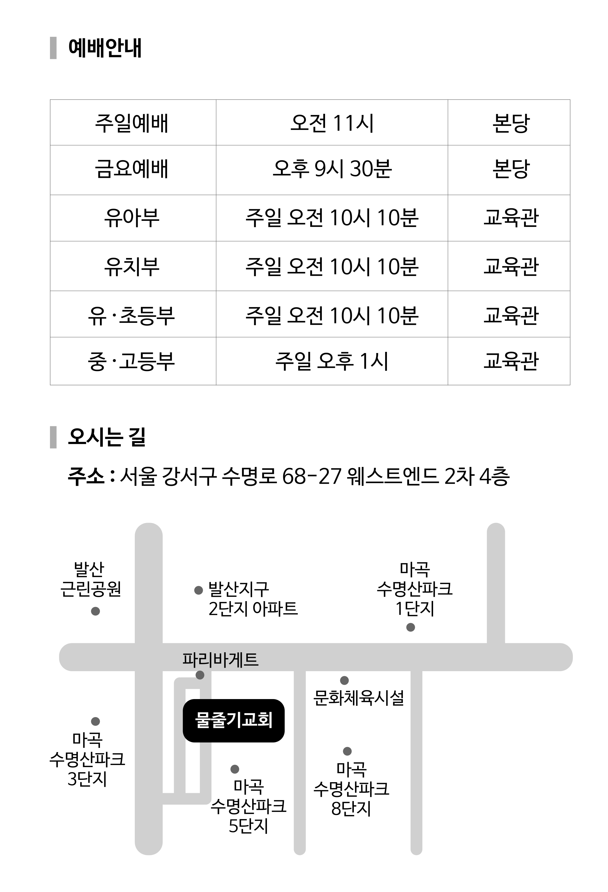

아모스

아모스 강해

조춘숙 목사

물줄기교회 출판부

동영상 설교는 https://vimeo.com/watercourse 또는 YouTube에서 “물줄기교회”를 검색해 주세요.

# 이 책을 읽는 분들께

아모스가 전한 말씀을 이 시대에 전하는 것은 하나님의 은혜라고 생각합니다. 이스라엘 백성들의 죄 때문에 심판을 전하는 아모스의 외침은 지금 나라 간의 전쟁을 재조명하면서 우리들의 죄를 돌아볼 수 있었기 때문입니다.

이스라엘과 이웃 나라들의 죄 때문에 하나님의 맹렬한 심판이 임할 것을 전했던 아모스의 마음은 심판을 받기 전에 회개하라는 간절함이었습니다. 하나님께서는 이스라엘에게 큰 고난을 주시기 전에 아람에 심판을 전하게 하셨고 뒤이어 두로와 에돔, 암몬, 모압 그리고 유다까지 심판이 있을 것이니 회개하라는 말씀을 전하게 하셨습니다. 이렇게 여러 나라에 심판이 임하는 이유는 그들이 지은 죄 때문입니다. 이방 나라들은 하나님을 섬기지 않는다는 핑계라도 댈 수 있지만 유다와 이스라엘은 하나님의 법을 어겼고 우상을 숭배하는 죄를 지었습니다. 다른 나라들의 심판을 보고 들었던 이스라엘은 요나에게 심판의 말씀을 들은 니느웨 백성들처럼 회개했어야 했습니다. 그럼에도 이스라엘은 심판을 전하는 아모스를 조롱하며 괴롭혔습니다.

이스라엘은 하나님이 자신들을 무조건 도와주시는 분이라고 생각하고 있었으므로 아모스가 아무리 그들의 죄를 지적해도 듣지 않았습니다. 자신들이 선민이라는 생각에 사로잡혀 하나님께서 자신들의 원수에게 심판을 내리실 것이라는 잘못된 생각을 하고 있었던 것입니다.

지금 우리는 그런 잘못을 저지르고 있지는 않습니까? 지금 우리나라가 이렇게 잘살고 있는데 설마 전쟁이 일어날까? 나는 교회를 다니고 있으니까 하나님께서 지켜 주실 거야, 매주 교회에 나가서 예배와 헌금을 드리고 날마다 기도하고 있는데 악한 영과 악한 자를 모두 물리쳐 주실 거라고 생각하고 있다면 이스라엘이 선민사상을 가지고 있는 것과 다를 바 없습니다.

이스라엘이 다른 나라들이 심판의 말씀을 듣는 것을 보면서 자신의 일이 아니라고 생각한 것처럼 우리도 우크라이나와 이스라엘의 전쟁을 보면서 남의 일처럼 생각한다면 이스라엘과 유다에 심판이 임한 것처럼 하나님의 진노를 받게 될 것입니다.

이스라엘은 아람, 두로, 에돔, 암몬, 모압, 유다에 심판의 말씀이 전해졌을 때 자신들의 죄를 돌아보고 회개했어야 합니다. 하나님의 진노가 임하실 때까지 죄의 자리에 있지 말고 정직하게 자신의 죄를 고백하고 회개하며 돌이켰다면 하나님께서는 아모스를 통해 전하셨던 심판을 거두셨을 것입니다. 이제 아모스의 심판이 우리를 향한 말씀으로 듣고 이 나라와 민족은 하나님께 회개해야 합니다. 풍요로운 삶을 허락하신 하나님의 은혜를 감사로 드리지 못한 우리들의 죄와 사마리아와 땅끝까지 복음을 전하라고 하신 말씀에 순종하지 못한 죄를 낱낱이 회개한다면 하나님께서 진노를 거두실 것입니다.

심판을 전하는 아모스를 조롱하던 아마샤처럼 하나님의 일을 방해하는 걸림돌이 되지 말고 하나님을 찬양하며 그 뜻에 동참하는 성도가 되기 바랍니다. 말씀을 말씀으로 듣고 선하게 행하는 성도가 되어 사명을 감당하므로 은혜 가운데 살아가는 여러분이 되기를 바랍니다.

저희 물줄기교회는 책을 출판하여 무료로 나누어 드리고 있는데 17번째 강해집을 출판하기까지 헌신한 물줄기교회 성도들에게 감사를 드립니다. 이 책을 받는 분들이 마음을 열고 예수 그리스도를 영접하기를 물줄기교회 성도들은 간절히 기도하고 있습니다.

2024년 2월 물줄기교회 목사 조춘숙

# 1. 서너 가지 죄로 말미암아

아모스 1장 1~15절

<blockquote class="scripture-lead">
1유다 왕 웃시야의 시대 곧 이스라엘 왕 요아스의 아들 여로보암의 시대 지진 전 이년에 드고아 목자 중 아모스가 이스라엘에 대하여 이상으로 받은 말씀이라 2그가 이르되 여호와께서 시온에서부터 부르짖으시며 예루살렘에서부터 소리를 내시리니 목자의 초장이 마르고 갈멜 산 꼭대기가 마르리로다 3여호와께서 이와 같이 말씀하시되 다메섹의 서너 가지 죄로 말미암아 내가 그 벌을 돌이키지 아니하리니 이는 그들이 철 타작기로 타작하듯 길르앗을 압박하였음이라 4내가 하사엘의 집에 불을 보내리니 벤하닷의 궁궐들을 사르리라 5내가 다메섹의 빗장을 꺾으며 아웬 골짜기에서 그 주민들을 끊으며 벧에덴에서 규 잡은 자를 끊으리니 아람 백성이 사로잡혀 기르에 이르리라 여호와께서 말씀하셨느니라 6여호와께서 이와 같이 말씀하시되 가사의 서너 가지 죄로 말미암아 내가 그 벌을 돌이키지 아니하리니 이는 그들이 모든 사로잡은 자를 끌어 에돔에 넘겼음이라 7내가 가사 성에 불을 보내리니 그 궁궐들을 사르리라 8내가 또 아스돗에서 그 주민들과 아스글론에서 규를 잡은 자를 끊고 또 손을 돌이켜 에그론을 치리니 블레셋의 남아 있는 자가 멸망하리라 주 여호와께서 말씀하셨느니라 9여호와께서 이와 같이 말씀하시되 두로의 서너 가지 죄로 말미암아 내가 그 벌을 돌이키지 아니하리니 이는 그들이 그 형제의 계약을 기억하지 아니하고 모든 사로잡은 자를 에돔에 넘겼음이라 10내가 두로 성에 불을 보내리니 그 궁궐들을 사르리라 11여호와께서 이와 같이 말씀하시되 에돔의 서너 가지 죄로 말미암아 내가 그 벌을 돌이키지 아니하리니 이는 그가 칼로 그의 형제를 쫓아가며 긍휼을 버리며 항상 맹렬히 화를 내며 분을 끝없이 품었음이라 12내가 데만에 불을 보내리니 보스라의 궁궐들을 사르리라 13여호와께서 이와 같이 말씀하시되 암몬 자손의 서너 가지 죄로 말미암아 내가 그 벌을 돌이키지 아니하리니 이는 그들이 자기 지경을 넓히고자 하여 길르앗의 아이 밴 여인의 배를 갈랐음이니라 14내가 랍바 성에 불을 놓아 그 궁궐들을 사르되 전쟁의 날에 외침과 회오리바람의 날에 폭풍으로 할 것이며 15그들의 왕은 그 지도자들과 함께 사로잡혀 가리라 여호와께서 말씀하셨느니라
</blockquote>

아모스의 이름은 무거운 짐을 진 자라는 뜻을 가지고 있습니다. 하나님께 부름 받은 선지자의 사명은 아마도 무거운 짐을 진 것처럼 인생이 가볍지 않을 것입니다. 그는 부자들이 가난한 사람들을 착취하자 강하게 책망했기 때문에 사람들은 그를 정의의 선지자라고 불렀습니다. 하나님의 뜻을 전하며 착취하는 사람들에게는 회개하라고 담대하게 외쳤지만 연약한 백성들을 위해서는 간절한 마음으로 기도하는 선지자였습니다.

아모스는 남유다 왕 웃시야와 북이스라엘 왕 여로보암 2세 때 활동했던 선지자인데 같은 시기에 남유다에서는 이사야 선지자가 활동했고 북이스라엘에서는 호세아 선지자가 활동하고 있었습니다. 그는 원래 남유다 드고아 고원에서 목축과 뽕나무를 재배하던 농부였기 때문에 선지자 교육을 받지 못하고 자랐습니다. 하지만 하나님께서 그를 선지자로 세워 주시자 사치하고 무절제한 생활을 했던 사마리아를 향해 엄중히 책망하는 말씀을 전했습니다. 남유다 선지자가 북이스라엘을 향해 심판을 전하는 것은 쉽지 않은 일이지만 아모스는 하나님의 뜻을 알기 때문에 담대하게 선포했습니다. 그는 하나님께서는 불의를 절대로 용서하지 않는다는 것과 정의의 법을 어기면 반드시 심판하신다는 것을 확실하게 전했습니다. 이 때 이스라엘은 여로보암이 다스렸는데 솔로몬 이후 가장 부강한 최고의 전성기를 맞이했으므로 백성들은 풍요롭게 살았습니다. 하맛과 다메섹 두 왕국이 전쟁하는 틈을 타서 남유다와 북이스라엘이 잃었던 땅을 회복하였고 부강한 나라를 이루었기 때문입니다.

아모스 1장 1절

> 유다 왕 웃시야의 시대 곧 이스라엘 왕 요아스의 아들 여로보암의 시대 지진 전 이년에 드고아 목자 중 아모스가 이스라엘에 대하여 이상으로 받은 말씀이라

스가랴 선지자도 여로보암 시대의 지진 전 2년이라고 언급한 것을 보면 상당히 큰 지진이었다는 것을 알 수 있습니다. 지진이 일어나기 2년전에 아모스는 하나님의 심판을 전했고 그 예언은 2년 후에 경고하신 대로 큰 지진이 일어나자 나라마다 고통을 당했습니다. 나라를 빼앗기고 고통을 당했던 남유다와 북이스라엘은 모든 상황이 회복되자 이제는 도리어 이방인들이 행했던 악행을 저질렀습니다.

이스라엘은 강대국의 지배를 받을 때에는 해방만 되면 하나님도 잘 섬기고 나라를 위해서 열심히 살겠다고 다짐했지만 타락하고 말았습니다. 지금 성도들도 이 고난에서 건져 주시면 하나님을 위해서 열심히 살겠다고 약속하지만 응답을 받게 되면 자신의 능력으로 잘 사는 것처럼 교만해지는 것을 볼 수 있습니다.

이스라엘은 전에 지배자들에게 자신들이 당했던 것처럼 가난하고 힘없는 백성들을 핍박하고 강탈했습니다. 하나님께서 회복시켜 주신 것에 대해 감사하기보다는 더 많은 것을 소유하려는 욕심 때문에 결국 그들은 하나님을 떠나고 말았습니다.

아모스 1장 2절

> 그가 이르되 여호와께서 시온에서부터 부르짖으시며 예루살렘에서부터 소리를 내시리니 목자의 초장이 마르고 갈멜산 꼭대기가 마르리로다

시온에서부터 부르짖으며 예루살렘에서부터 소리를 내신다는 말씀은 하나님께서 임재하신 성전에서부터 심판을 시작하시겠다는 말씀입니다. 백성들의 생명을 구하기 위해서 성소를 세우신 하나님께서 이제 그들을 심판하기 위해서 성전에서부터 심판을 시작하겠다고 하셨습니다. 400년이 넘는 시간동안 이스라엘이라는 나라를 만드시고 그 민족을 애굽으로부터 해방시키신 하나님입니다. 그런 하나님께서 사랑하는 백성을 심판하시겠다는 그 마음이 얼마나 아플 것인지 이스라엘은 알아야 합니다. 이스라엘이 하나님을 배반한 죄가 얼마나 크면 그들을 살리기 위해 세운 성소와 백성들을 모두 버리겠다고 선포하셨겠습니까?

갈멜산은 엘리야가 바알과 아세라 선지자 850명과 대결했던 땅입니다. 그 갈멜을 마르게 하겠다는 무서운 저주를 내리신 것을 보면 이스라엘이 용서받지 못할 죄를 졌다는 것을 알 수 있습니다. 하나님께서 이스라엘을 정말 사랑하신다는 것을 알 수 있는 것은 이스라엘을 심판하시기 전에 이방나라를 먼저 심판하셨다는 것입니다. 이렇게 하신 깊은 뜻은 이방나라들이 받는 심판을 보면서 이스라엘이 회개할 수 있는 시간을 주기 위해서입니다. 만약 이스라엘을 이방나라보다 먼저 심판하시면 강대한 나라들이 약해진 이스라엘을 공격할 수 있기 때문에 하나님께서는 주위에 있는 나라들을 먼저 심판하셨습니다. 이런 사랑을 받은 민족인데도 이스라엘은 끝까지 회개하지 않았습니다.

이방나라에 복음을 전해야 하는 이스라엘이 타락해 버리면 복음을 전할 수 없으므로 심판을 통해 회개를 촉구하셨습니다. 이것은 성도들에게 사마리아와 땅 끝까지 복음을 전하라고 명령하신 것과 같은데 만약 성도들이 타락한다면 세상에 복음을 전할 사람이 없으므로 결국 심판을 통해 회개를 촉구하신 것과 같습니다.

아모스 1장 3절

> 여호와께서 이와 같이 말씀하시되 다메섹의 서너 가지 죄로 말미암아 내가 그 벌을 돌이키지 아니하리니 이는 그들이 철 타작기로 타작하듯 길르앗을 압박하였음이라

하나님께서는 심판하시기 전에 사람들이 어떤 죄를 지었는지 알려주셨고 그 죄로 인해 어떻게 심판하실 것인지 미리 경고하셨으며 성취하셨습니다. 아모스를 통해 하나님의 심판을 들은 나라들은 회개와 심판 중에 어떤 것을 선택할 것인지 고민해야 합니다.

첫째로 다메섹은 길르앗을 압박하는 서너 가지 죄를 지었기 때문에 왕과 백성이 사로잡힐 것이라고 하셨습니다. 다메섹 사람들이 철 타작기로 길르앗을 압박했다는 것을 보면 그들이 얼마나 잔인한 사람들인지 알 수 있습니다. 아람의 수도였던 다메섹 사람들은 길르앗 사람들을 쇠가 박힌 채찍으로 고통을 줄 정도로 잔인했기 때문에 길르앗 사람들의 고통은 문자적으로 표현하기 힘들 정도로 악랄했습니다. 여기서 세밀히 살펴야 하는 것은 하나님께서는 곧바로 유다와 이스라엘을 심판하신 것이 아니라 이방나라를 심판하고 나서 남유다와 북이스라엘을 심판하셨다는 것입니다. 유다와 이스라엘에서 먼 나라부터 심판을 시작하신 것은 이들에게 주신 경고인데도 그들이 경고로 듣지 않고 회개하지 않았기 때문에 느부갓네살의 침공에 무너지고 말았습니다.

심판 받은 두 번째와 세 번째 나라는 가사와 두로인데 이들의 죄는 사로잡은 이스라엘백성을 에돔에 노예로 팔고 궁궐을 불사르고 나라를 망하게 했기 때문에 심판하시겠다고 하셨습니다. 가사는 지금 가자지구에 있는 도시입니다. 블레셋이 자행한 범죄는 사회제도를 이용하여 상업적으로 사람들을 팔아 넘긴 것인데 이것을 보신 하나님께서 블레셋의 건물과 왕과 백성들을 완전히 무너뜨리셨습니다. 베니게의 수도인 두로는 포로들을 에돔으로 팔아 넘겼고 나라들끼리 서로 지키겠다고 서명한 조약을 파기시키는 서너 가지의 죄를 지었습니다. 두로가 받은 심판은 B.C 322년에 알렉산더 대왕이 7개월간 두로를 포위하다가 점령한 후에 6천명을 죽였고 2천명이 처형되었으며 3만명이 노예로 팔려갔다고 합니다.

네 번째 에돔은 형제들에게 적대행위를 자행하면서 패배한 형제들을 무자비하게 짓밟고 궁궐을 불사른 서너 가지의 죄를 지었습니다. 이들의 죄를 보신 하나님께서는 데만과 보스라에 불을 내리셨는데 에돔은 B.C 400-300년 경에 아라비아 종족들 가운데 하나인 나밧족속이 에돔을 정복하게 하셔서 큰 고통을 당하게 하셨습니다.

다섯 번째 롯의 작은 딸이 낳은 벤암미의 후손인 암몬은 영토를 확장하기 위해서 방어할 힘이 없는 아이 밴 길르앗 여인과 아이들을 죽이는 악행을 저질렀습니다. 이런 무자비한 암몬은 B.C 734년 앗수르왕 디글랏 빌레셀 3세에게 정복당하여 궁궐이 불타고 왕과 백성들이 사로잡히는 고통을 당했습니다.

여섯 번째 롯의 큰 딸이 낳은 모압의 후손인 모압은 에돔 왕의 무덤을 파헤쳐 왕의 뼈를 불살라 회로 만든 아주 악한 죄를 범하는 등 서너 가지 죄를 지었는데 이런 행동은 비윤리적이고 비인도적인 범죄이기 때문에 심판을 받았습니다. 이런 행동은 이스라엘에게 행한 것은 아니지만 주님께 대한 반역죄입니다. 하나님의 형상을 닮은 인간을 모욕하고 신성 모독을 하였기 때문에 하나님께서는 앗수르왕 디글랏 빌레셀 3세에 의해 모압이 비참하게 멸망 당하게 하셨습니다.

일곱 번째는 유다와 이스라엘인데 하나님의 백성인 남 유다는 여호와의 율법을 무시하고 우상을 숭배하는 죄를 지었습니다. 그리고 이스라엘은 법률의 파기와 성적인 죄악과 우상숭배 등 서너 가지의 죄로 심판을 받았습니다. 분노하신 하나님께서는 심판의 방법으로 B.C 586년 느부갓네살 왕이 궁궐을 파괴하고 왕족들을 살해하며 왕족과 백성들이 바벨론으로 끌려 가는 고통을 당하게 하셨습니다.

궁궐은 성전과 함께 있었기 때문에 유다에게는 아주 큰 심판이었습니다. 이스라엘은 부채를 갚을 수 없는 의인을 은을 받고 노예로 팔아버렸고 신발 한 켤레 값으로 사람을 파는 죄를 지었습니다. 법정은 부자들과 공모하여 옳은 판결을 내리지 않았으므로 그런 행위는 마치 하나님의 백성들을 짓밟는 것과 같습니다. 하나님의 택함 받은 백성이 성전에서 봉사하는 창기나 내연의 처들을 상대로 아버지와 아들이 한 여자와 성관계를 갖는 죄도 지었습니다. 하나님의 백성이 하나님의 거룩한 이름을 모독하는 일을 자행한 것입니다. 그리고 이들이 지은 죄는 또 있는데 가난한 사람들의 목숨과도 같은 맷돌이나 외투를 취하고는 축제 때마다 모든 제단 곁에 이 물품들을 펼쳐 두고 자신의 힘을 자랑했다고 합니다. 이런 행위는 하나님을 조롱하기 때문에 할 수 있는 것이며 이방신을 높이기 위한 우상숭배에 해당하는 죄입니다. 이토록 악한 죄를 지은 이스라엘과 유다를 보신 하나님께서는 그들의 죄를 그냥 두지 않으셨습니다. 하나님의 깊은 사랑을 받았던 이들의 배신은 사랑을 받은 만큼 하나님의 책망을 더 크게 받았을 것입니다.

하나님께서는 특별히 이스라엘을 애굽에서 불러내시고 영적인 지도자 모세도 세워 주셨습니다. 예언자들의 희생을 통해 말씀을 전하게 하셨고 구별된 나실인들이 하나님의 백성으로서 어떻게 살아야 하는지 그들의 삶을 통해 보여주셨습니다. 이런 사랑을 주셨지만 이들은 나실인에게 강제로 술을 먹였고 선지자들에게 예언을 하지 말라고 겁을 주었습니다. 하나님의 절대적인 사랑을 받은 이들이 이런 행동을 서슴없이 할 수 있다는 것이 두렵고 놀랍기만 합니다. 늘 곁에서 보호해 주셨던 하나님을 잊고 우상을 숭배하는 그들의 삶은 심판을 받아 마땅합니다.

유다와 이스라엘이 정직한 신앙을 가져야만 성전이 거룩한 것이며 하나님의 말씀이 소중한 것입니다. 백성들이 타락하면 그 모든 것이 가치가 없어지므로 하나님께서는 그 성전까지 버리셨습니다.

아모스 2장 13절

> 보라 곡식 단을 가득히 실은 수레가 흙을 누름 같이 내가 너희를 누르리니

진노하신 하나님께서는 곡식을 가득 실은 마차가 이스라엘을 내리누르며 갈아버리는 것과 같이 심판하시겠다고 하셨습니다. 하나님께서 말씀하시길 심판이 시작되면 아무리 빨리 달음박질 하는 사람도 도망칠 수 없고 강한 사람도 아무런 힘을 쓸 수 없으며 용사도 자기 목숨을 구할 수 없을 것이라고 하셨습니다. 활을 가진 사람도 설 수 없고 발이 빠른 사람도 피할 수 없으며 말을 타는 사람도 자기 목숨을 구할 수 없고 용사 가운데 그 마음이 굳센 사람도 그 날에는 벌거벗고 도망갈 것이라고 하셨습니다.

그 결과 북이스라엘은 B.C 722년 앗수르의 침공을 받고 포로로 잡혀가면서 완전히 멸망당하고 말았습니다. 그렇게 긴 세월 동안 사랑을 받으며 하나님의 백성으로 살아온 유다와 이스라엘이 버림을 받고 완전히 무너지고 만 것입니다.

아모스 1장 9절

> 여호와께서 이와 같이 말씀 하시되 두로의 서너 가지 죄로 말미암아 내가 그 벌을 돌이키지 아니하리니 이는 그들이 그 형제의 계약을 기억하지 아니하고 모든 사로잡은 자를 에돔에 넘겼음이라

두로와 에돔과 암몬의 죄가 같아서 다시 한번 살펴보고자 합니다. 두로는 베니게의 가장 중요한 항구도시로서 무역 중심지였으므로 사람들이 상당히 부유하게 사는 도시입니다. 다윗과 솔로몬 시대에 두로 왕 히람이 이스라엘과 형제를 맺을 정도로 돈독한 사이였고 서로 돕는 협정을 맺기도 하였습니다. 하나님께서 다윗을 이스라엘의 왕으로 높이 세우신 것을 두로왕 히람이 알고 있었기 때문에 백향목과 목수와 석수를 보내 다윗을 위한 집을 지어 주기도 하였습니다.

다윗이 죽고 솔로몬이 왕이 되었을 때 두로왕에게 성전을 지을 수 있도록 백향목을 보내 달라고 하자 두로왕은 크게 기뻐하며 하나님을 찬양하였고 기꺼이 백향목을 보내주었습니다. 솔로몬과 히람은 서로 상부상조하였고 친목하기로 약조도 하였는데 두로가 이 약조를 깨는 것도 모자라 이스라엘을 에돔에 노예로 팔아 넘겼습니다. 하나님께서 이방나라도 이스라엘과 좋은 관계를 맺었을 때 축복하신 것처럼 이스라엘을 핍박한 나라는 어떤 나라이든 그 죄를 물어 심판하셨습니다. 그래서 두로의 죄를 잊지 않고 심판하신 것입니다.

지금 우리가 살펴본 나라들의 죄를 보면 용서 받지 못할 죄도 있지만 지금도 여전히 일어나고 있는 죄도 있습니다. 사람의 외모를 판단하고 재판을 부당하게 처리하며 가난한 사람을 차별대우 하는 것을 지금도 쉽게 볼 수 있습니다. 사람들은 세금을 속이고 저울을 속여서 부당 이익을 취하는 것을 큰 죄라고 생각하지 않습니다. 하지만 하나님께서는 이런 사소한 문제를 죄라고 말씀하고 계십니다. 사람들이 생각없이 하는 행동이지만 하나님께서는 이런 사소한 문제까지도 큰 죄가 된다고 생각하고 계십니다.

신명기에 보면 일을 시켰으면 품삯을 제대로 주라고 기록하고 있습니다. 품삯을 받지 못한 그들이 만약 울부짖으면 내가 하늘에서 듣고 너희를 벌 주겠다고 하신 것을 보면 하나님께서 사람들의 삶에 관심을 갖고 계신다는 것을 알 수 있습니다. 하나님께서는 유다와 이스라엘 뿐 아니라 전 세계적으로 관심을 갖고 죄를 지을 때마다 심판하시는 것을 보게 됩니다. 하나님께서는 교회에만 계시는 분이 아니라 세상 모든 사람들의 구원을 위해서 일하시는 분이기 때문에 말과 행동을 조심해야 합니다. 자신의 생각안에 하나님을 가두고 하나님의 일을 판단하면 큰 죄가 된다는 것을 명심해야 합니다.

에돔과 암몬은 이스라엘이 강성했을 때는 의형제를 맺었지만 힘을 잃자 핍박하는 악행을 서슴없이 저질렀기 때문에 하나님께서는 약자를 괴롭히는 죄를 용서하지 않았습니다. 지금 이방나라들이 핍박하고 있는 나라는 이스라엘입니다. 이스라엘은 하나님의 백성이므로 이방나라가 괴롭히는 것은 곧 하나님께 죄를 짓는 것입니다. 성도가 죄를 지으면 하나님께서는 세상의 악을 채찍으로 사용하지만 자녀들이 회개하고 나면 채찍이 필요 없기 때문에 그 채찍을 꺾어 버리십니다. 이처럼 하나님의 백성이 약해 보여서 괴롭힌다면 용서받지 못합니다.

그래서 여러분은 하나님께서 자녀를 세우는데 사용하시는 채찍과 막대기가 되지 않도록 늘 진리안에서 자신을 살펴야 합니다. 여러분의 생각이 옳은 것 같아도 그것이 하나님의 뜻과 다를 수 있으므로 굳이 다른 사람을 세우는 채찍으로 사용될 필요가 없다는 것입니다. 과연 아모스의 예언을 듣고 돌이킨 나라가 있었을까요? 하나님께서 불을 보내 궁궐을 사르겠다고 말씀하셨고 홀 잡은 자를 끊겠다고 하셨지만 그들은 선지자의 충고를 듣지 않았습니다. 지금 이들에게 저주를 내리시는 말씀이 여러분은 들리십니까? 하나님의 택함을 받은 우리들은 과연 이들보다 나은 신앙을 가지고 있는지 자신을 돌아보기 바랍니다. 그래도 나는 믿음이 있고 착하기 때문에 다른 사람들보다 죄가 적을 것이라는 생각은 신앙이 무엇인지 아직도 모른다는 증거입니다.

이방나라는 하나님이 어떤 분인지 알지 못하기 때문에 세상의 방법대로 약한 이스라엘을 핍박한 것이고 더 넓은 땅을 차지하기 위해서 이스라엘백성을 죽인 것입니다. 그들은 힘이 없는 이스라엘백성을 은을 받고 팔아 넘겼고 죽이고 빼앗아도 죄의식을 갖지 않았습니다. 하나님의 율법을 알지 못한 이방인이지만 선한 양심을 버렸기 때문에 심판을 받았습니다. 이렇게 인간의 본능대로 살아가는 그들도 심판하시는 하나님인데 택함 받은 이스라엘이 하나님의 뜻을 벗어난 죄를 짓는다면 그 진노는 상상 이상일 것입니다.

그리스도의 보혈로 구원받은 백성들이 하나님의 나라에 소망을 두지 않고 세상사람과 동일하게 욕심과 혈기를 부리고 있다면 하나님께서는 용서하시지 않습니다. 하나님께서 성소에서부터 진노의 음성을 발하시며 모든 초장을 마르게 하시겠다는 저주를 함께 들은 우리는 오늘 이 자리에서 믿음으로 결단해야 합니다. 하나님께서 평안을 주실 때 거룩한 삶을 살아야 하며 정직한 성도에게 보호하실 때 성실한 성도가 되어야 합니다.

여러분은 하나님을 두려워하고 경외하는 성도가 되기를 바랍니다. 전능하신 하나님은 이름을 함부로 부르고 법을 거역해도 되는 세상의 신이 아닙니다. 천지를 창조하시고 사람에게 직접 생령을 불어 넣어 주신 위대하신 창조주이고 구세주입니다. 열국이 당하는 심판을 보면서 돌이키는 성도가 지혜로운 사람입니다. 꼭 매를 맞아야 아프다는 것을 알고 꼭 굶어봐야 가난이 고통스러운 것을 안다면 그는 미련한 사람이고 하나님의 채찍과 막대기가 떠나지 않는 어리석은 사람입니다.

지금 어리석은 자리에 있거든 털고 일어나 하나님의 품으로 겸손히 들어오기 바랍니다. 지금 교만한 자리에 있거든 회개하기 바랍니다. 하나님께서 이 시간 설교를 통해 기회를 주실 때 내가 어떤 약속을 지키지 않았는지 혹시 하나님과 성도에게 교만하지 않았는지 회개하기 바랍니다. 그러면 하나님께서 선지자가 선포한 저주가 임하지 않도록 하실 것이며 항상 품에서 평안을 누리는 지혜로운 성도가 되도록 보호하실 것입니다.

여러분은 거룩하신 하나님 앞에서 평안과 안식을 누리는 거룩한 하나님의 자녀로 살기를 바랍니다.

# 2. 이스라엘을 향한 경고

아모스 2장 6~16절

<blockquote class="scripture-lead">
6여호와께서 이와 같이 말씀하시되 이스라엘의 서너 가지 죄로 말미암아 내가 그 벌을 돌이키지 아니하리니 이는 그들이 은을 받고 의인을 팔며 신 한 켤레를 받고 가난한 자를 팔며 7힘 없는 자의 머리를 티끌 먼지 속에 발로 밟고 연약한 자의 길을 굽게 하며 아버지와 아들이 한 젊은 여인에게 다녀서 내 거룩한 이름을 더럽히며 8모든 제단 옆에서 전당 잡은 옷 위에 누우며 그들의 신전에서 벌금으로 얻은 포도주를 마심이니라 9내가 아모리 사람을 그들 앞에서 멸하였나니 그 키는 백향목 높이와 같고 강하기는 상수리나무 같으나 내가 그 위의 열매와 그 아래의 뿌리를 진멸하였느니라 10내가 너희를 애굽 땅에서 이끌어 내어 사십 년 동안 광야에서 인도하고 아모리 사람의 땅을 너희가 차지하게 하였고 11또 너희 아들 중에서 선지자를, 너희 청년 중에서 나실인을 일으켰나니 이스라엘 자손들아 과연 그렇지 아니하냐 이는 여호와의 말씀이니라 12그러나 너희가 나실 사람으로 포도주를 마시게 하며 또 선지자에게 명령하여 예언하지 말라 하였느니라 13보라 곡식 단을 가득히 실은 수레가 흙을 누름 같이 내가 너희를 누르리니 14빨리 달음박질하는 자도 도망할 수 없으며 강한 자도 자기 힘을 낼 수 없으며 용사도 자기 목숨을 구할 수 없으며 15활을 가진 자도 설 수 없으며 발이 빠른 자도 피할 수 없으며 말 타는 자도 자기 목숨을 구할 수 없고 16용사 가운데 그 마음이 굳센 자도 그 날에는 벌거벗고 도망하리라 여호와의 말씀이니라
</blockquote>

하나님께서는 다메섹, 가사, 두로, 에돔, 그리고 암몬과 모압을 심판하시고 나서 유다와 이스라엘을 향해 그들의 죄를 빠짐없이 말씀하셨습니다. 그리고 타락한 유다와 이스라엘을 향한 심판도 경고하셨습니다. 유다와 이스라엘이 타락한 시기는 그들이 강성한 힘을 가졌을 때였는데 하나님의 법을 어기고 타락하자 하나님께서는 심판의 손을 드셨고 이방나라들은 유다와 이스라엘을 침공하였습니다. 비록 채찍과 막대기로 이방나라를 사용하셨지만 이렇게 세상의 힘으로 하나님의 백성을 핍박하고 살해하는 그들의 죄는 결코 용서받을 수 없는 죄악입니다.

유다와 이스라엘은 이방나라와 본질적으로 다른 데도 불구하고 그들과 동일한 죄를 지었습니다. 하나님께 율법을 받았고 예루살렘에 성전을 가지고 있는 선민이므로 절대로 하나님을 배신해서는 안되는 민족입니다. 이들은 여호와의 율법을 멸시했으며 율례를 지키지 않았고 우상에 미혹되어 하나님을 버렸다는 것은 이방민족이 하나님을 모르는 것과는 전혀 차원이 다른 죄입니다.

남유다는 이방사람들과 세상을 바라보는 관점이 아예 달라야 함에도 불구하고 하나님의 은혜로 잘 살게 되자 조금씩 변질되기 시작하였습니다. 그들은 축복을 당연한 것으로 여기며 세상에 동화된 것입니다. 힘들고 어려웠던 고난에서 벗어나자 처음에는 법을 소중히 여기며 말씀대로 살기 위해서 노력했지만 풍요로운 삶이 계속되자 이방나라 사람들이 했던 악한 죄를 그대로 답습했습니다.

사탄은 사람들이 유혹을 이기지 못하고 선악과를 먹은 것을 본 경험을 가지고 있기 때문에 사람들에게 지속적으로 풍요와 편안을 주면 변질된다는 것을 알고 있었습니다. 그래서 사탄은 하나님의 백성을 실족시키기 위해서 끊임없이 하나님을 버리도록 역사와 문화와 지식을 이용하면서 지금까지 일하고 있습니다. 성도들은 사탄이 소리없이 접근하는 것을 깨닫지 못한 채 세상의 문화를 수용하고 타협하고 있습니다. 이렇게 세상을 버리지 못하고 절충하다 보면 결국 변질되고 맙니다.

하나님의 지혜를 갖지 못하면 비 진리를 판단하지 못하고 자신의 생각을 중심으로 모든 일을 결정하기 때문에 아무 개념 없이 행동하는 자신을 발견하게 될 것입니다. 이것은 남유다 뿐 아니라 북이스라엘도 마찬가지였습니다. 하나님께서는 400년 동안 애굽에서 종살이를 하던 그들을 모세를 통해 이끌어 내셨고 여호수아를 세워 가나안을 정복하도록 하셨습니다. 하나님의 목적은 이스라엘 백성들이 하나님 나라를 전하는 증인의 삶을 살도록 하는 것입니다. 하지만 물질적으로 풍요로워진 이스라엘과 유다는 이방민족의 죄를 답습했으므로 소돔처럼 그들을 심판하실 수밖에 없었습니다.

하나님의 백성들이 은혜를 잊지 않고 감사하는 마음으로 산다면 절대로 축복을 빼앗기지 않습니다. 하지만 감사를 잊거나, 가난한 자를 학대하거나, 형식적인 신앙을 갖거나, 비 인격적인 행동을 하면 하나님의 진노를 받게 될 것입니다. 사람이 은혜를 잊으면 교만하게 되고 그 교만은 사람을 어리석게 만들어 결국 사망에 빠지게 하므로 감사를 잊는 것은 아주 불행한 일입니다.

이스라엘은 솔로몬 이후 가장 부강한 때를 맞이했습니다. 큰 힘을 갖게 되자 권세자들은 더 많은 재물과 권력을 갖기 위해서 가난한 백성을 핍박하기 시작하였습니다.

아모스 2장 6절

> 여호와께서 이와 같이 말씀하시되 이스라엘의 서너가지 죄로 말미암아 내가 그 벌을 돌이키지 아니하리니 이는 그들이 은을 받고 의인을 팔며 신 한 켤레를 받고 가난한 자를 팔며

가난한 동족을 품어야 하는 권세자가 그들을 괴롭힌다는 것은 악한 이방민족보다 더 용서받기 힘든 죄를 짓는 것입니다. 의를 지키기 위해서 정직하게 사는 하나님의 백성을 불의한 자들이 은을 받고 노예로 팔았고 신 한 켤레 값으로 사람을 팔았습니다. 이런 죄는 하나님께 절대로 용서받지 못할 큰 죄입니다. 이런 죄를 유다와 이스라엘이 짓고 있는 것입니다.

의인은 세상과 타협하면 잘 살 수 있다는 것을 알고 있지만 정의롭게 살기 위해서 끝까지 믿음을 버리지 않았습니다. 악한 권세자들에게 동조하지 않으면 불이익을 당할 것을 알면서도 하나님의 법을 거역할 수 없어서 스스로 고난을 선택한 것입니다. 사도바울도 율법을 지키는 바리새인으로 살면 미래가 편안할 것을 알고 있었지만 그는 예수 그리스도를 배신하지 않고 고난을 선택했습니다. 진리를 선택한다면 고난과 핍박을 당할 것을 알지만 복음을 위해서 자신의 목숨을 스스로 버린 것입니다.

의인을 핍박하는 것을 보신 하나님께서는 진노하시며 선지자 아모스에게 불의한 자를 향해 심판을 선포하라고 명령하셨습니다. 악한 권세자는 의인에게 빼앗은 재물로 영원히 편하게 살 것이라고 생각했을 것입니다. 하지만 2년 뒤에 일어난 큰 지진으로 인해 멸망 당한 것을 보면 사람의 욕심과 인생이 얼마나 하찮은 것인지 알 수 있습니다.

하나님의 진노는 절대로 피할 수도 막을 수도 없습니다. 정의롭고 의로운 사람을 은을 받고 팔아 넘기는 권세자는 하나님의 진노로부터 피할 곳이 세상에는 없기 때문입니다. 그들은 가난한 자의 머리에 붙은 티끌을 탐냈고, 겸손한 자의 길을 굽게 하였으며, 아버지와 아들이 한 젊은 창녀에게 다니는 음행의 죄를 짓고도 두려움이 없었습니다.

모세의 율법에 의하면 아버지와 아들이 동일한 여인과 동침하는 것은 그녀가 비록 창기일지라도 근친상간에 해당하는 죄를 진 것이기 때문에 사형에 해당되는 죄라고 하였습니다. 인간 말종이라는 말은 인간이 절대로 해서는 안 되는 행동을 했을 때 붙이는 단어입니다. 땅에 굴러다니는 티끌을 아무 죄의식 없이 밟는 것처럼 가난한 사람들을 아무런 죄의식 없이 짓밟고 선지자와 나실인을 판단하고 핍박하며 아비와 아들이 한 여인과 동침하는 것은 바로 인간 말종이나 하는 행동입니다.

그들이 가난한 사람을 괴롭힐 수 있었던 힘은 오직 돈이었습니다. 돈으로 권세를 갖게 되자 하나님을 전해야 하는 백성들이 악한 이방민족들이 행했던 방법으로 동족을 학대했습니다. 믿음을 지키려는 성도를 넘어뜨리기 위해서 온갖 핍박을 가한 이스라엘의 권세자는 지옥보다 더 무서운 형벌을 받게 될 것입니다. 세상에서 막강한 권력을 갖게 되면 하나님을 섬기는 신앙이 하찮아 보이고 믿음을 지키기 위해서 노력하는 백성이 어리석어 보입니다. 그래서 세상은 믿음의 사람을 존중하지 않으며 성도를 조롱해도 죄의식을 갖지 않습니다. 세상은 성도들이 드는 등불이 빛을 발하지 못하도록 핍박하면서 더 빨리 어둠에 숨는 노력을 합니다. 이렇게 어둠을 끌어안고 있는 세상을 향해 성도들이 등불을 더 높이 들지 않는다면 하나님께서 찾는 귀한 영혼들이 어둠에 묻혀 버릴 것입니다.

사람은 외모를 중요하게 생각하므로 재물과 명예와 권력을 갖게 되면 자신이 다른 사람보다 우위에 있다는 교만한 생각으로 가난한 사람을 함부로 대해도 된다는 어리석은 생각을 합니다. 이 판단의 기준이 바로 자신이기 때문에 하나님께 심판을 받아도 할 말이 없습니다. 자신이 가난해서 핍박을 받았다면 힘을 갖게 되었을 때 더 겸손하게 행동하며 약한 자를 세워주고 도와줘야 하는데 유다와 이스라엘은 하나님께서 원하시는 뜻대로 살지 않았습니다. 죄는 언제나 몸이 먼저 기억하기 때문에 죄는 한번 짓는 것이 어려운 것이지 습관이 되면 돌이키기 어렵습니다.

성도들이 신앙을 지키려는 의지가 있어도 실패하는 원인은 바로 몸이 의지보다 더 강하게 반응하기 때문입니다. 이런 나쁜 습관을 바꾸려면 오랫동안 인내해야 하므로 처음부터 죄를 짓지 않으려는 노력이 필요합니다. 옳은 행실과 선한 인격을 갖추지 못한 사람은 신앙을 지키기 어렵습니다. 성도가 도덕적이고 양심적으로 살아야 하는 것은 결국 올바른 믿음의 행위를 통해 하나님을 드러내야 하기 때문입니다. 도덕적인 양심과 바른 인격이 갖춰진 삶을 살아야만 하나님의 일을 감당할 때 세상으로부터 방해를 받지 않습니다.

정직하고 성실하게 사는 것은 성도들의 기본적인 자세입니다. 사람이 도덕적인 양심과 상식적인 행동과 좋은 인격을 가지고 있다면 하나님을 거부하는 세상에서도 인정을 받을 수 있습니다. 이렇게 기본적으로 잘 만들어진 인격과 함께 말씀과 은혜가 채워진 사람이 바로 하나님께서 원하시는 성도입니다.

출애굽기 22장 26~27절

> 26네가 만일 이웃의 옷을 전당 잡거든 해가 지기 전에 그에게 돌려보내라 27그것이 유일한 옷이라 그것이 그의 알몸을 가릴 옷인즉 그가 무엇을 입고 자겠느냐 그가 내게 부르짖으면 내가 들으리니 나는 자비로운 자임이니라

이스라엘이 하나님을 경외하지 않고 타락하자 가난한 형제의 단 하나밖에 없는 옷을 빼앗아 제단 옆에 깔고 눕는 어이없는 지경에 이르렀습니다. 여호와의 제단에서 이렇게 엄청난 악을 행할 수 있었던 것은 권세자들이 재물의 힘을 믿었기 때문입니다. 그들은 많은 헌금을 할 수 있는 힘을 가졌기 때문에 어느 누구도 감히 그들의 잘못을 지적하지 못했습니다.

거룩한 제단에서 가난한 사람의 옷을 빼앗는 죄를 저지르고 있는데도 제사장조차 그들의 죄를 지적하지 못했던 것입니다. 죄사함을 받는 제단에서 포도주를 마시고 취하는 엄청난 죄를 짓는데도 모두 화인 맞은 심령이 되어 죄를 죄로 여기지 않았습니다. 그들이 하나님의 제단에서 이런 행동을 한 것을 보면 의인에게 신앙을 버리라고 핍박한 것이 사실이라는 것을 알 수 있습니다. 가난한 백성에게 나처럼 하나님을 잘 믿으면 잘 산다고 조롱했을 것입니다.

지금 교인들도 이들과 같은 잘못 된 신앙을 가지고 있습니다. 사업이 잘 되거나 자녀들이 성공하면 자신이 하나님을 잘 믿었기 때문에 복을 받은 것이라고 자랑합니다. 하나님의 은혜를 모두 자신의 공로로 돌리는 죄를 짓고 있습니다. 어떤 분은 하나님께서 자기의 사업을 도와 주시지 않았다면 교회에 나오지 않았을 것이라고 당당하게 말하는 것을 들었습니다. 이런 사람들은 대부분 어려움을 당하거나 감정이 상하면 가장 먼저 하나님을 버리는데 이것은 사후세계에 대한 확신이 없기 때문에 이런 결정을 하는 것입니다. 지금 교회들을 보면 이렇게 거듭나지 못한 사람들이 교회에서 힘을 행사하려고 하고 가난한 성도를 조롱하고 핍박하는 죄를 짓고 있습니다. 그런데 안타까운 것은 그들이 교회를 혼란스럽게 하는데도 성도들은 물론 목회자까지도 그런 행동이 죄이므로 회개해야 한다고 권면하지 못하고 있다는 것입니다.

이스라엘에 죄가 가득하자 양심, 도덕, 신앙이 점점 썩기 시작했고 결국엔 혼합종교를 만들어 내고 말았습니다. 적당히 하나님도 섬기면서 사람들에게 미움을 받지 않도록 우상을 섬기는 척하면 핍박을 받지 않고 살 수 있으므로 지혜롭다고 생각한 것입니다.

여러분, 교회는 세상이 아닙니다. 사람들은 세상이 마지막이라고 생각하기 때문에 자신을 위해서 살고 있지만 교회는 영원한 나라를 준비하는 성도들의 모임이므로 사는 동안 하나님의 법대로 살아야 합니다. 그럼에도 성도들이 거듭나지 못하면 끊임없이 하나님의 인도하심을 의심하고 자신의 생각을 고집하게 됩니다. 이런 태도는 출애굽한 이스라엘 백성들이 하나님을 원망했던 것과 전혀 다르지 않으며 그들을 위해서 자신의 인생을 버린 모세를 조롱했던 것과 다를 바 없습니다. 하나님께서는 사람처럼 필요한 것이 있거나 도움을 청하는 분이 아닙니다. 손이 짧아서 구원하지 못하시는 것도 아니고 귀가 둔해서 듣지 못하는 것도 아닌데 우리의 죄악이 하나님의 역사를 막고 있습니다.

교회들이 세상과 동일한 죄를 짓고 있기 때문에 하나님의 나라가 확장되지 못하고 있습니다. 하나님의 백성이 하나님 나라를 전하는 많은 일을 해야 하는데 백성들의 타락으로 인해 하나님의 아까운 시간을 헛되이 보내고 있습니다. 하나님 나라 백성들이 이방나라와 사마리아와 땅끝까지 복음을 전할 수 있도록 성도들은 언제나 정결한 삶을 살아야 합니다.

아모스 2장 10절

> 내가 너희를 애굽 땅에서 이끌어 내어 사십 년 동안 광야에서 인도하고 아모리 사람의 땅을 너희로 차지하게 하였고

자녀들이 부모에게 순종하지 않으면 부모는 자녀를 올바른 길로 인도하기 위해서 아까운 시간을 허비하게 됩니다. 하나님께서도 이스라엘을 돌이켜야 하기 때문에 끊임없이 말씀하셨습니다. 과거에 어떤 역사를 통해 인도하셨는지 반복적으로 말씀하셔야 했기 때문에 그들을 성장시켜야 하는 그 아까운 시간을 허비하고 계셨습니다. 지금까지 그들에게 수많은 기회를 주셨고 불평하는 그들에게 기적을 보이시며 가나안으로 인도하셨지만 그 모든 은혜를 잊고 이스라엘이 세상사람처럼 살고 있는 것입니다.

저는 백성들의 마음을 돌이키려고 하나님께서 굳이 내가 너희를 이렇게 사랑했고 이런 역사를 행했다고 말씀하시는 그 모습이 안타깝다는 생각을 했습니다. 그들에게 복을 주고 싶어 하시는 아버지의 마음을 보았기 때문입니다.

자녀들이 말씀에 순종하면 부모는 자녀의 과거보다는 아름답게 펼쳐질 미래에 대해서 생각하면서 도울 방법을 찾습니다. 하지만 자녀가 올바른 길을 가지 못하면 현재 일어난 문제를 수습하느라 미래를 바라보기는커녕 그 자리에서 한 걸음도 나가지 못하는 것입니다. 이처럼 성도들이 말씀에 순종하지 않으면 날마다 짓는 죄와 문제를 해결해야 하기 때문에 축복을 주실 여유가 없고 성도들은 축복을 받을 기회가 없습니다. 이렇게 자녀를 사랑하는 마음으로 하나님께서 과거를 회상해 주시며 돌이킬 수 있는 기회를 주셨지만 이스라엘은 듣지 않았습니다. 그 결과 그들은 결국 심판을 받고 말았습니다.

우리도 믿음을 지켜야 영원히 살 수 있다고 간절하게 말씀하시는 하나님의 음성을 듣지 않는다면 두려운 심판을 받게 될 것입니다. 하나님께서는 선지자들이 핍박 받을 것을 아시면서도 말씀을 전하게 하셨고 나실인을 세워 이스라엘이 어떤 삶을 살아야 하는 민족인지 가르쳐 주셨습니다. 하지만 하나님의 사랑을 이렇게 많이 받고도 그들은 나실인에게 포도주를 강제로 마시게 하였고 선지자들에게 예언을 하지 말라고 핍박하였습니다.

나실인은 포도나무의 소산과 독주를 일체 마시지 말아야 하고 부정한 음식을 먹지 말아야 하며 머리도 깎지 않고 시체를 가까이 해서도 안 되는 거룩하게 구별된 사람들입니다. 이런 나실인에게 포도주를 억지로 마시게 하고 선지자들에게 예언하지 말라고 핍박하였습니다. 이것은 나실인과 선지자의 문제를 뛰어 넘어 하나님께 엄청난 반역을 행한 것입니다. 이런 행동은 하나님을 경외하지 않았기 때문에 하나님께서 특별히 세운 나실인과 선지자들에게 악한 행동을 할 수 있었던 것입니다.

이스라엘백성들은 선지자에게 자기들이 듣기 좋은 말만 해 달라고 하였고 자신들이 잘 살 수 있도록 축복만 전하라고 협박하였습니다. 지금도 복음만 선포해야 하는 교회가 세상에서 잘 사는 것이 하나님께 받은 복인 것처럼 기복신앙을 가르쳤기 때문에 성도들이 신앙을 회복하지 못할 정도로 변질되고 말았습니다. 그 증거로 성도들이 예수 그리스도가 누구인지 확실하게 알지 못하고 있으며 진리만 선포하는 교회와 목회자를 부담스러워 하고 있습니다.

하나님의 나라와 회개를 선포하는 교회보다는 부담없이 귀를 즐겁게 하고 세상의 성공을 전하는 교회로 사람들이 몰리고 있습니다. 하지만 성경에는 하나님의 나라와 복음을 전하는 증인과 하나님의 의와 회개와 예수 그리스도만 전하고 있을 뿐 어디에도 사람이 듣기 좋은 세상의 복은 기록되어 있지 않다는 것을 알아야 합니다. 성도들이 하나님의 뜻대로 살 때 그의 믿음을 위해서 문제를 해결해 주시며 하나님 나라를 확신시켜 주는 방법으로 세상을 이용하신 것입니다. 세상이 목적이 아니라 믿음을 세워 주시는 것이 목적입니다.

하나님께서는 타락한 이스라엘에게 곡식 단을 가득 실은 수레가 흙을 누름 같이 내가 너희를 심판하겠다고 하셨습니다. 하나님의 심판이 시작되면 빨리 뛰는 자도 도망칠 수 없고 강한 힘을 가진 자도 힘을 쓸 수 없게 된다는 두려운 말씀입니다. 예를 들어 큰 지진이 나고 쓰나미가 오면 아무리 빨리 뛰어도 피할 수 없고 많은 재산과 권력을 가진 사람도 그대로 망할 수밖에 없습니다. 하나님의 심판도 이처럼 세상 어디에도 숨을 곳이 없을 정도로 순식간에 임하실 것입니다.

하나님께서는 이미 심판을 경고하셨고 그 심판은 분명히 임할 것입니다. 이제는 하나님의 품에서 보호를 받는 사람만 심판을 견딜 수 있습니다. 우리도 기회가 있을 때 돌이키지 않는다면 이스라엘이 당한 심판의 고통을 똑같이 당할 수밖에 없습니다.

하나님께서는 아모스 선지자가 전한 심판의 말씀을 지금 우리도 함께 듣기를 원하고 계십니다. 다른 사람보다 재물과 권력을 조금 더 소유했다고 강한 자가 아닙니다. 재물을 힘으로 삼아 의인을 핍박하지 말고 가난한 자를 멸시하지 말며 진리를 전하는 사람을 막지 말고 믿음으로 살려는 성도를 도와주어야 합니다. 책망과 경고를 받았는데도 돌이키지 않았던 이스라엘은 하나님을 업신여긴 죄로 큰 고난을 당했습니다. 심판이 임하기 전에 이스라엘이 돌이키는 지혜로 회개했다면 하나님께서는 심판을 거두셨을 것입니다.

우리는 연약하기 때문에 세상을 살면서 죄를 지을 수 있습니다. 그러나 하나님을 만난 성도는 하나님께서 무엇을 원하시는지 알고 있으므로 거룩한 삶을 살기 위해서 노력해야 합니다. 하나님께서 유다에게 돌이키라고 말씀하셨음에도 불구하고 회개하지 않고 큰 심판을 받은 것을 본 성도들은 하나님을 두려워해야 하며 회개의 자리를 떠나지 말아야 합니다.

돌이키는 모습을 조금만 보여도 기뻐하시는 하나님이므로 여러분은 하나님의 뜻대로 거룩한 삶을 살기 바랍니다.

# 3. 이스라엘아 이 말씀을 들으라

아모스 3장 1~15절

<blockquote class="scripture-lead">
1이스라엘 자손들아 여호와께서 너희에 대하여 이르시는 이 말씀을 들으라 애굽 땅에서 인도하여 올리신 모든 족속에 대하여 이르시기를 2내가 땅의 모든 족속 가운데 너희만을 알았나니 그러므로 내가 너희 모든 죄악을 너희에게 보응하리라 하셨나니 3두 사람이 뜻이 같지 않은데 어찌 동행하겠으며 4사자가 움킨 것이 없는데 어찌 수풀에서 부르짖겠으며 젊은 사자가 잡은 것이 없는데 어찌 굴에서 소리를 내겠느냐 5덫을 땅에 놓지 않았는데 새가 어찌 거기 치이겠으며 잡힌 것이 없는데 덫이 어찌 땅에서 튀겠느냐 6성읍에서 나팔이 울리는데 백성이 어찌 두려워하지 아니하겠으며 여호와의 행하심이 없는데 재앙이 어찌 성읍에 임하겠느냐 7주 여호와께서는 자기의 비밀을 그 종 선지자들에게 보이지 아니하시고는 결코 행하심이 없으시리라 8사자가 부르짖은즉 누가 두려워하지 아니하겠느냐 주 여호와께서 말씀하신즉 누가 예언하지 아니하겠느냐 9아스돗의 궁궐들과 애굽 땅의 궁궐들에 선포하여 이르기를 너희는 사마리아 산들에 모여 그 성 중에서 얼마나 큰 요란함과 학대함이 있나 보라 하라 10자기 궁궐에서 포학과 겁탈을 쌓는 자들이 바른 일 행할 줄을 모르느니라 여호와의 말씀이니라 11그러므로 주 여호와께서 이와 같이 말씀하시되 이 땅 사면에 대적이 있어 네 힘을 쇠하게 하며 네 궁궐을 약탈하리라 12여호와께서 이와 같이 말씀하시되 목자가 사자 입에서 양의 두 다리나 귀 조각을 건져냄과 같이 사마리아에서 침상 모서리에나 걸상의 방석에 앉은 이스라엘 자손도 건져냄을 입으리라 13주 여호와 만군의 하나님의 말씀이니라 너희는 듣고 야곱의 족속에게 증언하라 14내가 이스라엘의 모든 죄를 보응하는 날에 벧엘의 제단들을 벌하여 그 제단의 뿔들을 꺾어 땅에 떨어뜨리고 15겨울 궁과 여름 궁을 치리니 상아 궁들이 파괴되며 큰 궁들이 무너지리라 여호와의 말씀이니라
</blockquote>

사람의 얼굴에서 감정을 알아내는 연구를 한 폴 에크먼박사는 사람은 300가지가 넘는 감정을 표현 할 수 있다고 발표했습니다. 인간의 표정은 기본적으로 분노, 혐오, 두려움, 슬픔, 기쁨, 놀람 6가지의 기본 감정으로부터 시작한다고 합니다. 이 6가지 감정이 섞이면서 다양한 표정을 연출하는 것입니다. 두려움과 기쁨이 섞이면 필사적인 감정을 표현하게 되고 두려움과 슬픔이 합치면 처참한 표정을 짓게 됩니다. 기쁨과 슬픔이 합쳐지면 옅기는 하지만 희망을 드러내고 기쁨과 놀람이 합치면 경이로운 표정으로 자기의 감정을 드러낸다고 합니다.

사람 마음속에는 이렇게 많은 감정이 숨어있고 그 감정들이 서로 합쳐져서 또 다른 감정을 만들어 내는 것을 보면 사람은 참으로 놀라운 존재입니다. 저마다 독특한 감정에 지배 당하고 있는 사람이 이치에 맞는 행동을 하거나 논리적인 사고를 가지고 살아간다는 것은 그의 안에 있는 성숙한 인격과 이성이 수많은 감정을 다스렸다는 증거입니다. 반대로 감정이 시키는 대로 행동하는 사람도 있습니다.

어려운 문제를 처리하거나 상황에 따라 충동적인 기분에 의해서 행동하는 사람은 많은 실수를 동반할 뿐 아니라 잘못된 인생을 살기도 합니다. 그래서 논리적인 사고를 가지고 이치에 맞는 행동을 하는 사람이 풍부한 감정을 표출하면서 살아간다면 그것보다 멋진 일은 없습니다.

자신의 감정을 솔직하게 표현하면서도 경우 바르고 겸손한 행동을 하는 사람은 누구에게나 인정을 받습니다. 지금 여러분의 마음속에 가장 크게 자리잡고 있는 감정은 무엇입니까? 분노와 혈기가 많은 사람은 이성적으로 감정을 다스리기 힘들기 때문에 감정의 기복이 심하므로 그의 곁에 있는 사람들은 항상 불안합니다. 반대로 이성적으로 자신을 잘 다스리는 사람은 감정을 쉽게 드러내지 않기 때문에 사람들과 어울리지 못하는 단점을 가지고 있습니다.

하나님께서 원하시는 사람은 흔들리지 않는 굳센 믿음과 긍휼히 여기는 온유한 마음과 지혜로운 판단 능력을 가진 성도입니다. 감정을 적절하게 배합하여 인격적이고 논리적이며 풍부한 감성안에서 늘 동일한 모습을 보여준다면 하나님과 사람들에게 인정을 받을 것입니다. 얼굴은 곧 그 사람이기 때문에 그가 지금 무슨 생각을 하는지 그리고 어떻게 살아왔는지 얼굴을 보면 알 수 있습니다. 보이지 않는 감정을 대변하는 것이 곧 그의 얼굴이기 때문에 표정은 제 2의 언어인 셈입니다. 그래서 말을 하지 않아도 인간의 감정은 결국 들킬 수밖에 없습니다.

분노를 숨기고 싶어도 눈이 대신 말해주고 감정을 숨기고 싶어도 얼굴표정이 고스란히 담아내고 있습니다. 하나님께서는 사람들의 마음을 표정에 담도록 창조하신 것입니다.

사람도 얼굴을 보면 그 사람의 상태를 아는데 하물며 인간이 창조주인 하나님을 속인다는 것이 가능한 일이겠습니까? 300가지가 넘는 인간의 감정과 그 감정을 드러내는 얼굴 표정까지 모두 하나님께서 만드셨습니다. 이렇게 완벽한 창조주를 속인다는 자체가 어리석고 악한 것입니다.

사람은 어떤 노력으로도 하나님의 눈을 피할 수 없고 속일 수 없다는 것을 세상사람은 몰라도 성도는 알아야 합니다. 더구나 하나님께서는 자신의 형상을 닮은 사람들을 사랑하시기 때문에 인간을 누구보다 더 잘 알고 계시는 분입니다.

인간이 살아가는데 부족함이 없도록 세상만물을 먼저 창조하셨고 그 후에 인간을 창조하셨습니다. 천지만물은 인간이 살아가는데 필요해서 만드신 것이므로 인간의 죄로 인해 천지만물도 저주를 받을 수밖에 없습니다. 이렇게 넘치는 사랑과 은혜를 받고 누린 자녀들이 하나님을 배반한다면 그것은 인간이 가진 감정 중에 가장 더럽고 추한 욕심을 겉으로 드러낸 것입니다.

사전에 보면 배신은 믿음이나 의를 저버리는 것이고 배반은 믿음과 의리를 저버리고 돌아서는 것이라고 기록하고 있습니다. 배반의 감정에 굴복한 사람은 하나님과 믿음의 형제를 버리는 것뿐만 아니라 은혜 받을 기회가 영원히 사라지는 것입니다. 이런 사람은 진리를 들어도 자기 생각을 절대로 버리지 않기 때문에 사후에 반드시 가야 하는 영원한 천국으로 인도할 방법이 없습니다. 잘못된 길로 가고 있다는 것을 인정하지 않고 관계를 끊어버리기 때문에 그런 사람을 하나님 앞에 세운다는 것은 결코 쉽지 않습니다.

선지자들은 하나님의 특별한 선택을 받은 이스라엘이 하나님을 버리자 마음이 아팠지만 그들이 말씀을 받아들이지 않기에 눈물로 기도하는 수밖에 없었습니다. 이스라엘은 세상의 쾌락을 버리라고 선지자들이 선포하자 하나님의 말씀을 예언하지 말라고 선지자를 핍박했습니다. 우리도 기적의 역사를 경험할 때는 감사하고 기뻐하지만 시간이 지나면 감사했던 마음을 쉽게 버리고 배신의 자리에서 죄의식 없이 살아갑니다. 하나님의 사랑과 은혜를 버리는 것은 순간이기 때문에 늘 조심하지 않는다면 이스라엘과 동일한 죄를 지을 수 있다는 것을 명심해야 합니다.

오늘 하나님께서 여러분에게 육신을 벗고 오라고 하신다면 기쁘게 찬양하며 천국에 갈 수 있는지 자신의 삶을 돌아보기 바랍니다.

마태복음 26장 25절

> 예수를 파는 유다가 대답하여 이르되 랍비여 나는 아니지요 대답하시되 네가 말하였도다 하시니라

가룟 유다는 이미 예수님을 팔 준비를 다 했으면서도 그 마음을 숨긴 채 마지막 만찬자리에 앉아 있었습니다. 자기만 표정관리를 잘하면 예수님과 제자들이 모를 것이라고 생각했기 때문에 태연하게 예수님과 함께 있었던 것입니다. 그러나 예수님은 나와 함께 그릇에 손을 넣는 자가 나를 팔 것이라고 직접적으로 말씀하셨고 인자를 파는 그 사람에게는 화가 있을 것이라고 하시며 배신한 가룟 유다가 당할 심판이 얼마나 큰지 알려 주셨습니다.

물론 예수님께서 십자가를 져야 하는 것은 하나님의 뜻이고 하나님 나라를 선포하기 위해서 세상에 오신 것은 맞지만 예수님을 배신하고 팔아 넘기는 역할을 선택한 것은 바로 가룟 유다 자신입니다. 처음 예수님을 만났을 때 그토록 충성했던 가룟 유다가 은 삼십에 예수님을 팔아야 했던 마음은 무엇일까요? 자기를 제자로 불러 주시고 말씀과 사랑으로 품어 주신 예수님을 배반하는 마음은 과연 어디에서 나온 것일까요? 아마도 예수님이 세상의 왕이 된다면 자신도 큰 힘을 가질 수 있다는 희망을 품었지만 십자가를 지고 죽는다고 말씀하시는 것을 보면서 절망했을 것입니다. 사람은 간절히 원하던 희망이 절망으로 변하면 이렇게 판단력을 잃습니다.

빛 되신 그리스도에게 직접 말씀을 배운 제자이지만 감사가 욕심을 이기지 못하자 사탄에게 마음을 빼앗기고 말았습니다.

누가복음 22장 31~32절

> 31시몬아, 시몬아, 보라 사탄이 너희를 밀 까부르듯 하려고 요구하였으나 32그러나 내가 너를 위하여 네 믿음이 떨어지지 않기를 기도하였노니 너는 돌이킨 후에 네 형제를 굳게 하라

예수님께서 시몬 베드로에게 하신 말씀입니다. “너는 돌이킨 후에”라고 하시며 그가 배신할 것을 미리 말씀해 주셨음에도 불구하고 베드로는 주여 내가 주와 함께 옥에도 죽는 자리에도 가겠다고 확신에 찬 대답을 하였습니다. 그러나 채찍을 맞는 예수님을 보면서 나는 저 사람을 모른다고 저주하며 배신하고 말았습니다. 예수님을 사랑하는 감정이 두려운 감정을 이기지 못해서 예수님을 보면서도 세 번이나 부인한 것입니다.

베드로가 두려운 마음을 이기지 못하고 나는 저 사람을 모른다고 했을 때 그의 행동을 미리 말씀해 주셨던 예수님의 마음은 아팠을 것입니다. 사탄이 베드로를 밀 까부르듯 하려고 모든 상황을 만들었지만 예수님께서 끝까지 베드로의 믿음을 위해서 기도하셨기에 그는 넘어지지 않았습니다. 예수님의 경고를 미리 듣고도 배신한 베드로에게 네가 돌이킨 후에 형제를 도우라는 말씀은 그를 기다려 주시겠다는 사랑의 마음을 전하신 것입니다. 이처럼 이스라엘에게 돌이킬 기회를 주시기 위해서 이방민족을 먼저 심판하신 하나님의 마음은 사랑이었습니다.

아모스 3장 2절

> 내가 땅의 모든 족속 가운데 너희만을 알았나니 그러므로 내가 너희 모든 죄악을 너희에게 보응하리라 하셨나니

아모스는 여호와께서 모든 족속 가운데 너희만 특별한 소유로 삼으신 것을 알고 있느냐고 타락한 이스라엘에게 물어보았습니다. 사랑하는 마음이 크면 배신의 아픔이 더 큰 것처럼 하나님의 사랑을 배신한 이스라엘이 받아야 하는 심판은 클 수밖에 없다고 하였습니다. 하나님께서는 이스라엘을 거룩한 백성으로 만들기 위해서 노력하셨지만 그들은 세상처럼 인간의 본능대로 살았습니다. 그럼에도 하나님께서는 그들이 회개하고 돌이키는 기회를 주시기 위해서 고난도 주셨고 기적도 베푸셨으며 책망도 하셨습니다.

내가 이렇게 사랑하는 마음을 보여주고 간절하게 말하면 돌이키지 않을까? 내가 하늘의 기적을 보여준다면 백성들이 나를 더 사랑하고 믿어주지 않을까 고민하시며 많은 노력을 하셨습니다. 하나님께서 창조주라는 것을 알려주기 위해서 인간의 한계를 뛰어 넘는 기적을 보여주셨고 백성들이 자신의 죄를 회개하도록 선지자를 세워 하나님의 마음도 전하셨습니다. 결국 마지막에는 하나님을 온전히 영접하지 않는 죄인들을 위해서 예수님을 세상에 보내셔서 그들의 죄를 대속하도록 하셨습니다.

이사야 5장 2절

> 땅을 파서 돌을 제하고 극상품 포도나무를 심었도다 그 중에 망대를 세웠고 또 그 안에 술 틀을 팠도다 좋은 포도 맺기를 바랐더니 들포도를 맺었도다

이사야 선지자는 하나님께서 정성을 들여 극상품 포도나무를 심었는데 너희는 들포도를 맺었다고 전하며 유다의 죄를 지적했습니다. 유다와 이스라엘은 하나님의 특별한 사랑을 받았으면서도 세상의 유혹을 뿌리치지 못하고 우상을 숭배하고 말았습니다. 모든 민족 중에 너희만 보인다는 말씀을 이스라엘에게 하시며 그들을 얼마나 사랑하는지 마음을 표현하셨지만 그들은 계명을 어기는 범죄를 저질렀습니다.

하나님의 특별한 사랑을 배반하고 떠난 이스라엘을 향해 아모스는 심판을 전했지만 그들은 이미 쾌락과 교만과 욕심에 사로잡혀 있었기 때문에 말씀을 청종하지 않았습니다. 하나님의 말씀을 듣지 못한 것이 아니라 말씀을 청종하지 않았기 때문에 죄를 지을 수 있었고 그로 인해 심판을 받은 것입니다. 하나님께서는 죄로 인해 이스라엘을 더 이상 품을 수 없었습니다. 그들이 먼저 하나님과의 약속을 일방적으로 어겼기 때문에 이스라엘과 유다는 심판을 받게 된 것입니다. 심판이 임할 것이라는 선지자의 경고를 듣고도 이들은 심판에 대해 관심을 갖지 않았습니다. 그렇다고 이스라엘이 늘 풍요로운 삶을 산 것은 아닙니다. 외적으로부터 심한 고통을 당했고 양식이 부족해서 큰 어려움도 겪었지만 가난이 해결되자 교만해진 것입니다.

하나님께서는 감정에 따라 사람을 심판하고 책망하시는 분이 아니라 천 년을 하루같이 기다리고 인내하시며 사랑과 기회를 주시는 분이기 때문에 한번 심판을 결정하시면 쉽게 거두시지 않습니다. 세상 모든 민족 중에 오직 이스라엘만 택하신 하나님을 그들은 망설임 없이 버렸습니다. 그리고 재물에 눈이 어두워 은을 받고 의인을 팔았으며 신 한 켤레 값을 받고 가난한 백성을 파는 악행을 저질렀습니다.

아모스는 하나님의 심판이 얼마나 무서운지 백성들에게 알려주고 싶었지만 그들은 이미 눈과 귀를 닫고 듣지 않았습니다.

아모스 5장 9절

> 아스돗의 궁궐들과 애굽 땅의 궁궐들에 선포하여 이르기를 너희는 사마리아 산들에 모여 그 성 중에서 얼마나 큰 요란함과 학대함이 있나 보라 하라

아스돗과 애굽 땅에 사는 이방민족의 관점에서도 이스라엘의 범죄는 심각한 것이었습니다. 이스라엘은 가난한 백성을 눈에 보이는 대로 살상하고 겁탈했습니다. 그래서 하나님께서는 이방민족으로 하여금 이스라엘의 죄를 그대로 보응 받게 하겠다고 예언하셨습니다. 아무리 하나님 말씀을 그대로 전하는 선지자라 할지라도 같은 동족인 이스라엘에게 감당할 수 없는 심판을 전하는 것은 쉽지 않은 일입니다. 이스라엘이 받을 심판이 얼마나 무서운 것인가 하면 먹이를 향해 자비없이 달려드는 사자를 만난 양처럼 도망칠 수도 없고 숨을 곳도 없는 공포입니다. 사자의 입에서 죽은 양의 두 다리나 귀 조각을 건져내는 것처럼 처참할 것을 알기에 아모스는 심판을 전하는 것조차 두려웠습니다.

하지만 그들의 귀는 이미 닫혀 있었고 마음은 죄로 덮여 있었기 때문에 아모스가 아무리 심판을 외쳐도 듣지 않았습니다. 어쩌면 자신들의 행동이 심판을 불러올 정도로 악한 것인지 아예 인지하지 못했을 수도 있습니다. 이처럼 예수님께서 마지막 날 재림하시겠다고 말씀하시며 이 세상은 불의 심판을 받게 될 것이라고 하셨지만 유대인은 물론 성도들까지도 심판에 관심이 없기 때문에 자기 마음대로 살고 있습니다. 그럼에도 예수 그리스도의 재림은 반드시 있다는 것을 명심해야 합니다.

목회를 하면서 가장 안타까웠던 부분이 바로 이것입니다.

믿음으로 충만할 때는 겸손했던 사람이 교만해지면 자신의 의를 내세우면서 하나님을 두려워하지 않습니다. 자신이 하나님 일을 판단하고 방해하고 있다는 것을 모르고 있습니다. 하지만 교만할 때 충고하면 더 악하게 변하므로 안타까운 마음만 갖습니다. 모든 판단 자체가 자신이 중심일 때 충고하면 큰 불화가 일어나므로 권면조차 할 수 없습니다.

아마도 이스라엘을 향해 심판을 전하는 아모스의 마음도 이랬을 것입니다. 이스라엘의 심판이 얼마나 무서우면 사마리아와 다메섹에 붙어서 겨우 목숨을 구한 사람들이 축복을 받은 것이라고 하겠습니까? 이스라엘은 이제 겨우 살아남은 사람으로 그 명맥을 유지하게 될 것입니다.

아모스 5장 15절

> 겨울 궁과 여름 궁을 치리니 상아 궁들이 파멸되며 큰 궁들이 무너지리라 여호와의 말씀이니라

이스라엘의 권세자들은 가난한 사람들의 소유를 빼앗아 계절에 따라 여름 궁과 겨울 궁을 짓고 호화롭게 치장한 상아 궁에서 사치하며 좋은 경치와 맛있는 음식을 먹으며 마음껏 쾌락을 즐겼습니다. 이렇게 권력을 남용하면서 빼앗은 재물로 세운 아름다운 궁들은 파괴 될 것이며 악했던 그들은 심판을 통해 고통을 당하게 될 것입니다. 패역한 자들은 패망하고 여호와를 버린 자는 멸망할 것이며 말라버린 상수리나무처럼 그들은 마르고 물 없는 동산같이 고통을 당할 것입니다.

아모스와 같은 시대에 활동했던 이사야는 심판 받는 이스라엘에게 연약한 자를 괴롭히던 자들이 삼오라기가 불에 타는 것처럼 불에 탈 때 그 불을 끌 사람이 없을 것이라고 하였습니다.

사람은 자기가 행한 대로 보응을 받습니다. 의인은 선한 행위를 통해 선한 열매를 받고 악인은 그 손으로 행한 대로 악한 열매로 보응을 받을 것입니다. 이스라엘의 심판이 이방나라보다 더 심한 것은 하나님께서 이스라엘에게 가진 기대가 특별한 것이었고 그들의 신앙에 큰 관심을 가졌기 때문입니다. 이렇게 모든 관심과 사랑을 부어준 백성들이 하나님을 배신했고 가난한 동족을 괴롭히고 살상했으므로 용서 할 수 없었습니다.

사랑했기 때문에 더 용서할 수 없는 것이고 그들을 향한 원대한 목적이 있었기 때문에 배신감이 더 컸던 것입니다. 하지만 하나님께서는 그들에게 아낌없이 사랑을 주셨기 때문에 후회는 없었습니다. 조건없이 사랑을 주었는데도 상대가 배신했다면 사랑을 준 사람의 문제가 아니라 받은 사람의 잘못이기 때문에 아쉬움이 남지 않습니다.

하나님께서는 모든 것을 아낌없이 이스라엘에게 주셨기 때문에 심판을 하시면서도 후회가 없었습니다. 그러나 깊이 생각해 보면 이스라엘에 내리신 심판은 고통이 목적이 아니라 회개가 목적이셨기 때문에 그 심판 또한 사랑입니다. 이렇게 무조건 사랑을 베풀며 상대를 세워주기 위해서 노력한 사람은 배신을 당하더라도 베푼 것으로 인해 배우는 것이 많습니다. 사랑을 주는 방법을 배웠고 베푸는 것이 행복이라는 것을 배웠으며 자신을 사랑하신 하나님의 마음까지 배우게 됩니다. 하나님께서는 배신한 이스라엘을 그래도 살려야 하기 때문에 살리는 방법으로 강한 이방나라를 불러 공격하도록 하셨습니다. 채찍과 막대기로 고통을 줘야만 하나님의 보호하심이 얼마나 감사한 것인지 알 수 있기에 하나님께서는 이스라엘을 단호하게 심판하셨습니다.

여러분은 심판을 선택하신 하나님의 깊은 사랑이 느껴집니까? 우리들이 지금 당하고 있는 고난은 어쩌면 우리를 향한 하나님의 사랑일 수도 있고 죄를 버리라는 진노의 음성일 수도 있습니다. 성도들은 정말로 이스라엘처럼 하나님을 배반하지 않기를 바라며 믿음의 형제를 배신하지 않기를 바랍니다. 배신한 그 자체로 하나님께 상처가 되기 때문입니다.

이스라엘이 하나님께 심판을 받는 이유는 바로 이것입니다. 선지자들의 입을 막은 죄, 나실인에게 술을 먹인 죄, 가난한 사람들을 착취하고 매매한 죄가 하나님께 상달되었기 때문입니다. 성도들은 하나님을 두려워하고 믿음의 형제를 소중하게 생각해야 합니다. 하나님의 심판이 시작되면 그 누구도 피할 곳이 없지만 믿음의 형제들과 함께 한다면 고난 가운데에서도 위로를 받을 수 있기 때문입니다. 심판은 인간이 상상할 수 없을 정도로 무섭고 두렵습니다. 여러분은 어리석은 사람처럼 심판이 없다고 말하지 않기를 바랍니다. 사탄에게 동조하는 악한 자처럼 그리스도의 재림이 없다고 말하지 않기를 바랍니다.

예수님의 재림은 방주에 오르지 않은 사람들에게 임한 홍수처럼 분명하게 다가올 것이며 언제 올지 모르는 도둑처럼 오실 것이므로 영적으로 깨어 있어야 합니다. 전쟁과 지진과 홍수와 가뭄 그리고 전염병 등 종말의 징조를 우리는 날마다 듣고 있으므로 믿음을 지키기 위해서 노력해야 합니다.

성도들은 심판과 재림이 있다는 것을 잊지 말고 오늘을 정직하고 성실하게 그리고 믿음을 지키며 살아 내기 바랍니다. 악한 자의 행동을 따라 하지 말고 선한 마음으로 산다면 하나님께서는 악한 자와 악한 영이 괴롭히지 못하도록 은혜를 베풀어 주실 것입니다. 하나님의 나라가 확장되도록 충성하며 그리스도를 향한 믿음을 지키기 위해서 최선을 다하는 거룩한 성도의 삶을 살기를 간절히 바랍니다.

# 4. 타락한 자들이 받는 심판

아모스 4장 1~13절

<blockquote class="scripture-lead">
1사마리아의 산에 있는 바산의 암소들아 이 말을 들으라 너희는 힘 없는 자를 학대하며 가난한 자를 압제하며 가장에게 이르기를 술을 가져다가 우리로 마시게 하라 하는도다 2주 여호와께서 자기의 거룩함을 두고 맹세하시되 때가 너희에게 이를지라 사람이 갈고리로 너희를 끌어 가며 낚시로 너희의 남은 자들도 그리하리라 3너희가 성 무너진 데를 통하여 각기 앞으로 바로 나가서 하르몬에 던져지리라 여호와의 말씀이니라 4너희는 벧엘에 가서 범죄하며 길갈에 가서 죄를 더하며 아침마다 너희 희생을, 삼일마다 너희 십일조를 드리며 5누룩 넣은 것을 불살라 수은제로 드리며 낙헌제를 소리내어 선포하려무나 이스라엘 자손들아 이것이 너희가 기뻐하는 바니라 주 여호와의 말씀이니라 6또 내가 너희 모든 성읍에서 너희 이를 깨끗하게 하며 너희의 각 처소에서 양식이 떨어지게 하였으나 너희가 내게로 돌아오지 아니하였느니라 여호와의 말씀이니라 7또 추수하기 석 달 전에 내가 너희에게 비를 멈추게 하여 어떤 성읍에는 내리고 어떤 성읍에는 내리지 않게 하였더니 땅 한 부분은 비를 얻고 한 부분은 비를 얻지 못하여 말랐으매 8두 세 성읍 사람이 어떤 성읍으로 비틀거리며 물을 마시러 가서 만족하게 마시지 못하였으나 너희가 내게로 돌아오지 아니하였느니라 여호와의 말씀이니라 9내가 곡식을 마르게 하는 재앙과 깜부기 재앙으로 너희를 쳤으며 팥중이로 너희의 많은 동산과 포도원과 무화과나무와 감람나무를 다 먹게 하였으나 너희가 내게로 돌아오지 아니하였느니라 여호와의 말씀이니라 10내가 너희 중에 전염병 보내기를 애굽에서 한 것처럼 하였으며 칼로 너희 청년들을 죽였으며 너희 말들을 노략하게 하며 너희 진영의 악취로 코를 찌르게 하였으나 너희가 내게로 돌아오지 아니하였느니라 여호와의 말씀이니라 11내가 너희 중의 성읍 무너뜨리기를 하나님인 내가 소돔과 고모라를 무너뜨림 같이 하였으므로 너희가 불붙는 가운데서 빼낸 나무 조각 같이 되었으나 너희가 내게로 돌아오지 아니하였느니라 여호와의 말씀이니라 12그러므로 이스라엘아 내가 이와 같이 네게 행하리라 내가 이것을 네게 행하리니 이스라엘아 네 하나님 만나기를 준비하라 13보라 산들을 지으며 바람을 창조하며 자기 뜻을 사람에게 보이며 아침을 어둡게 하며 땅의 높은 데를 밟는 이는 그의 이름이 만군의 하나님 여호와시니라
</blockquote>

헌법에는 교육, 근로, 납세, 국방의 4가지 기본 의무를 규정하고 있으므로 국민이라면 누구나 지켜야 할 책임이 있습니다. 그 외에 준수해야 할 일반적인 법도 많이 있는데 그 법은 사실 범죄자들의 활동 범위를 줄이기 위해서 만든 법입니다. 기본 양심을 가진 사람은 법이 없어도 선하게 살기 때문에 법을 강화하는 것은 범죄자들 때문입니다. 일반적인 사람들은 법을 위반하지 않았다고 해서 기뻐하거나 행복하다는 생각을 하지는 않습니다. 법과 상관없이 살아가기 때문에 자기 자신에게 집중하며 자신을 채울 수 있는 무엇인가 있어야만 행복하고 안전하다고 느낍니다.

세상사람들이 공허한 마음을 채우기 위해서 만족할 만한 것을 선택한 것은 안타깝게도 재물과 권세와 쾌락입니다. 부족할 것 없는 재벌과 권력을 가진 한 나라의 대통령이 세상을 버리는 이유는 지금까지 자신의 판단이 옳았고 그로 인해 자신을 완벽하게 세워주었다고 생각한 그 모든 것들이 헛되고 헛되다는 것을 알았기 때문입니다. 처음부터 사람이 사는 동안에는 어떤 일도 일어날 수 있다는 것을 알고 세상이 안개처럼 헛되고 헛되다는 사실을 아는 사람은 세상을 위해서 살지 않습니다.

사람들 중에는 이념과 신념과 정의를 실현시키기 위해서 사는 것이 인간으로서 최고의 삶인 것처럼 생각하는 사람도 있습니다. 물론 세상은 이념과 신념과 정의가 한 축을 이루고 있기 때문에 인간의 역사에 필요할 수도 있습니다. 하지만 사람에게 이런 것들이 소중하다고 해도 사람의 판단으로 정해진 이념과 신념과 정의와 같은 것이 몇 년이나 지속된다고 보십니까? 평생 이것을 위해서 살았는데 자신이 틀렸다는 것을 확실하게 깨닫거나 갑자기 인생의 마지막 순간을 맞이했다면 사후에 대한 준비가 전혀 되어 있지 않았던 그 사람이 느끼는 공허함은 아주 클 것입니다.

사람이 관심을 가져야 하는 것은 정해진 인생을 살다가 사후에 과연 어디로 가느냐 하는 것입니다. 유한한 세상을 열심히 쫓다가 죽음의 문턱에 선 사람은 살아온 세월도 허무하겠지만 사후의 캄캄한 미래가 두려워서 절대로 의연할 수 없습니다. 예수 그리스도를 확실하게 알아야만 사후에 자신의 영원한 미래에 관해 두렵지 않으며 이념과 신념도 올바로 세울 수 있습니다.

성도라 할지라도 재물만 좇는 사람은 돈 때문에 하나님의 뜻에서 벗어날 것이고 하나님보다 신념을 좇는 사람은 자신의 생각만 믿다가 하나님과 멀어지게 될 것입니다. 만 왕의 왕 이신 예수 그리스도를 확실하게 알고 살아야만 후회 없는 인생을 살 수 있고 사후 세계에 대한 확고한 믿음이 있어야만 세상에서 만나는 모든 문제를 여유 있게 대처하며 폭 넓은 인생을 살 수 있습니다.

하나님안에서 인생을 보면 재물과 권세 그리고 신념이 자신의 가치를 높여주지 않는다는 것을 알 수 있습니다. 선한 하나님을 만나지 못하면 항상 자신이 우선이기 때문에 세상을 뛰어넘지 못한 자신안에 갇혀 있으므로 죄를 지을 수밖에 없습니다. 사람들은 유명해지거나 재산과 권력을 가지면 죄도 탕감 받은 줄 알고 교만하게 행동하지만 하나님의 긍휼하심을 받지 못하면 심판을 받게 됩니다.

죄는 신발 속에 들어간 작은 돌과 같아서 신발을 벗고 돌을 털어내야만 먼 길을 갈 수 있는 것처럼 죄를 짓고는 선한 길을 갈 수 없습니다. 내 신발속에 있는 돌은 다른 사람들은 알지도 느끼지도 못하지만 본인은 그 작은 돌이 얼마나 불편한지 알고 있습니다. 이것처럼 죄는 인생을 살아가는데 모든 것에 걸림돌이 됩니다.

창조주인 하나님을 믿지 않는 것이 죄입니다. 죄가 여기서부터 시작되므로 세상의 권세를 가지고 있어도 그 사람은 늘 공허하고 불안하며 확신이 없습니다. 그래서 세상의 성공을 거둔다고 해도 어둡고 불안한 마음이 가득하기 때문에 작은 문제만 생겨도 해결하지 못하고 낙심하는 것입니다. 하나님을 믿고 하나님의 법을 지키며 살아야만 험한 세상에서 안전한 곳으로 인도하시는 하나님의 은혜를 입을 수 있습니다.

더 안타까운 것은 하나님이 사랑의 하나님이기 때문에 자신이 어떤 죄를 짓는다고 해도 용서하시는 분이라고 성도들은 생각합니다. 그리고 하나님의 법을 자기안에 두고 적당히 타협하기 때문에 자기 마음대로 살면서 구원을 받았다고 믿고 있습니다. 물론 믿음으로 받는 구원은 하나님의 선물이지만 성도들은 말씀대로 살면서 신실한 신앙을 가져야 구원을 받을 수 있습니다.

아모스 3장 3~5절

> 3두 사람이 뜻이 같지 않은데 어찌 동행하겠으며 4사자가 움킨 것이 없는데 어찌 수풀에서 부르짖겠으며 젊은 사자가 잡은 것이 없는데 어찌 굴에서 소리를 내겠느냐 5덫을 땅에 놓지 않았는데 새가 어찌 거기 치이겠으며 잡힌 것이 없는데 덫이 어찌 땅에서 튀겠느냐

하나님의 진노가 극에 달해서 심판이 시작되면 이스라엘 사람들은 갈고리와 낚시에 끌려가는 것과 같은 고통을 당할 것이라고 말씀하셨습니다. 이 예언은 이스라엘 백성이 처참하게 끌려가는 것으로 성취되었습니다. 이스라엘 백성을 끝까지 품에 안고 보호하셨던 하나님이지만 이스라엘이 회개하기를 거부하자 심판하기로 결심하셨습니다.

사자가 무엇인가 움켜쥔 것을 만족할 때 크게 부르짖는 것처럼 하나님의 진노하신 음성은 이스라엘의 죄로 인해 심판을 거두실 생각이 없다는 뜻이므로 이스라엘은 힘없는 먹이처럼 고통을 당할 수밖에 없습니다.

새는 올무가 없다면 덫에 걸릴 이유가 없습니다. 덫에 걸린 새가 아무리 몸부림을 쳐도 이미 늦은 것처럼 하나님의 심판을 받은 이스라엘이 뒤늦게 후회해도 이미 기회는 사라졌습니다. 이 모든 비유는 이스라엘의 심판이 불가피했다는 것을 말해 주고 있습니다. 하나님께서는 전쟁이 있을 것이라고 경고하셨고 그 전쟁을 통해 그들의 비열하고 악한 삶이 무너질 것이라고 하셨지만 이스라엘은 설마 하는 마음에 재앙을 너무 쉽게 생각했습니다. 하나님께서는 선지자들에게 언제나 계획을 먼저 알려 주셨습니다. 자신의 비밀을 종들에게 알리지 않고는 일하시지 않는다고 말씀하셨고 선지자들이 전한 예언의 말씀들은 수년 혹은 수십년 후에 모두 성취된 것을 성경을 통해 알 수 있습니다.

아모스 4장 4절

> 너희는 벧엘에 가서 범죄하며 길갈에 가서 죄를 더하며 아침마다 너희 희생을, 삼일마다 너희 십일조를 드리며

이스라엘 백성은 모세의 율법에 따라 매 3년마다 십일조를 드리라고 했지만 그들은 삼일마다 십일조를 드렸고 아침마다 벧엘에 가서 제사를 드리는 열심을 보였습니다. 이들이 법을 어기고 이렇게 한 것은 하나님을 이용하여 잘 살아보려는 그릇된 신앙이므로 아무리 그들이 제사를 날마다 드리고 열심히 십일조를 드려도 그것은 죄를 쌓는 악한 행위라고 책망하신 것입니다.

야곱이 믿음으로 돌기둥을 세웠던 벧엘과 백성들이 할례와 유월절을 지킨 길갈은 이제 모두 우상숭배의 중심지가 되고 말았습니다. 그들은 형식적인 신앙으로 열심을 보였지만 하나님께서는 그런 제사를 기뻐하시지 않습니다. 그들은 제사의 형식에 따라 누룩 넣은 떡을 불살라 수은제로 드리기도 했고 낙헌제로 화목제물을 하나님께 드리며 형식적으로는 완벽한 신앙을 보였습니다.

수은제란 은혜가 감사해서 드리는 감사제이며 화목제의 일종입니다. 그들은 제사를 형식대로 잘 드린 것처럼 보였기 때문에 사람들이 볼 때 하나님께 진심을 다해 헌신하는 것처럼 보였을 것입니다. 하지만 이스라엘백성이 율법에 따라 제사를 드린 것처럼 보여도 그들의 행위는 종교적인 위선 행위였습니다. 통회하는 심령과 진실 된 믿음이 없는 제사는 가증스러운 것이므로 크게 책망을 받을 만한 일이었습니다.

예를 들어 자녀가 부모에게 선물을 드렸을 때 감사하는 마음으로 정성껏 준비한 선물을 드리는 자녀와 다른 사람들에게 보이기 위해서 형식적으로 드리는 자녀가 있다면 겉으로는 똑같이 선물을 드린 것처럼 보이지만 부모는 자녀들의 마음이 다르다는 것을 잘 알고 있습니다. 그래서 하나님께서는 야곱이 단을 세운 거룩한 땅 벧엘에서 드리는 형식적인 제사는 죄를 더하는 것이라고 말씀하신 것입니다.

하나님을 경외하는 마음이 아니라 종교적인 열심으로 드리는 제사는 하나님보다 자기 만족을 위한 것이므로 열납 되지 않습니다.

이사야 1장에 하나님께서 유다 백성을 향해 이렇게 책망하셨습니다.

“너희가 나에게 바친 무수한 제물이 나에게 무엇이 유익하겠느냐? 나는 수양의 번제와 살진 짐승의 기름에 배불렀고 나는 제물로 바친 동물의 피를 기뻐하지 않는다”고 하셨습니다.

“너희가 내 앞에 보이러 오니 누가 너희에게 요구하였으며 내 마당만 밟을 뿐이니라 헛된 제물을 다시 가져오지 말라 분향은 나의 가증히 여기는 바요 월삭과 안식일과 대회로 모이는 것도 그러하니 성회와 아울러 악을 행하는 것을 내가 견디지 못하겠다”고 진노하셨습니다.

하나님께서는 진실한 믿음이 없는 형식적인 신앙을 원하시지 않습니다. 믿음으로 드린 과부의 적은 두 렙돈을 받으신 것을 보면 정직한 믿음으로 드리는 제사와 예배와 진정한 사랑을 받기를 원하고 계십니다. 이 세상의 모든 것이 하나님의 것인데 적선하는 것처럼 드리는 예배와 헌금과 헌신은 하나님께 칭찬 받을 수 없는 신앙입니다. 예배와 헌금과 봉사는 성도들의 가장 기본적인 신앙인데 그 기본적인 것까지 형식적으로 한다면 하나님과 올바른 관계를 맺지 못할 것입니다. 세상에서 풍족하게 잘 살기 위해서 하나님을 믿는 척하지 말고 진심으로 하나님을 경외한다면 만물의 창조주인 하나님께서 여러분의 삶과 건강과 자녀를 지켜 주실 것입니다.

아모스 4장 1절

> 사마리아의 산에 있는 바산의 암소들아 이 말을 들으라 너희는 힘없는 자를 학대하며 가난한 자를 압제하며 가장에게 이르기를 술을 가져다가 우리로 마시게 하라 하는도다

바산은 요단강 동편의 헬몬산과 길르앗 산지 사이에 위치한 기름진 땅이기 때문에 목축하기에 매우 좋은 환경을 가졌으므로 살진 소와 양이 생산되는 초장입니다. 하나님께서는 이곳에서 많은 새끼를 낳은 바산의 건강한 암소를 이스라엘로 비유하시며 깊이 사랑하고 아끼셨습니다. 이런 이스라엘이 하나님을 배신한 죄가 얼마나 악한 것인지 예를 들어 말씀하셨는데 남편을 섬겨야 하는 아내가 내가 술을 마시고 싶으니 술을 가져오라고 명령한 것처럼 악한 행동이라고 하셨습니다.

하나님을 섬기는 남편이 술을 가져오라고 명령해도 악한 일입니다. 그런데 이성을 마비시켜서 하나님을 경외하지 못하도록 만드는 술을 아내가 가장에게 가져오라고 시키는 것은 하나님의 법을 어기는 죄 중에 죄입니다.

이스라엘이 이 여인처럼 온전치 못한 정신을 가졌으므로 가난한 사람들을 학대하고 사치와 방종을 일삼고 있다고 말씀하신 것입니다. 이스라엘은 많은 복을 받았는데도 만족하지 못하고 가난한 사람들의 재물을 착취하고 학대하면서 더 호화롭게 살기를 원했습니다. 암소가 새끼를 낳는 것처럼 그들의 악은 악을 낳았고 죄는 죄를 더했으므로 하나님께 용서받을 수 없는 지경에 이르고 말았습니다.

이렇게 욕심을 가지면 더 많은 것을 소유하기 위해서 가난한 사람들을 괴롭히고 핍박하는 죄를 짓게 됩니다. 하나님을 경외해야 하는 백성들이 제사와 십일조를 드리는 것으로 자기의 본분을 다했다고 생각하며 형식적인 신앙으로 단을 더럽히고 있었습니다.

자녀들이 영적으로 망가지는 것을 더 이상 볼 수 없었던 하나님께서는 이스라엘이 앗수르에게 공격 당하는 것을 막아주지 않았습니다. 그리고 앗수르가 이스라엘을 갈고리로 끌고 가듯 학대하는 것을 보시며 그 고난을 통해 이스라엘이 회개하기를 간절히 바라셨습니다. 하나님의 진노를 받은 이스라엘은 가뭄이 들어 마실 물과 양식조차 없게 되었고 결국 추수할 수도 없는 어려움을 당하게 되었습니다. 이런 연단을 받고도 이스라엘이 회개하지 않자 곡식을 마르게 하는 재앙과 깜부기재앙과 팥중이가[송충이의 일종] 동산의 열매를 모두 먹어서 아예 사람이 먹을 양식이 없도록 하셨습니다.

창조주인 하나님께서 심판하시면 사람은 절대로 벗어날 수 없습니다. 하지만 그들은 회개하기는커녕 더욱 완악 해졌습니다. 사람은 고난을 당하다가 조금이라도 견딜 만하면 하나님을 상대로 끝까지 고집을 피우는 어리석은 행동을 합니다. 하지만 사람의 생명과 인생은 하나님께 속해 있으므로 그 뜻에 순종하고 회개하고 돌이켜야 합니다. 그러면 사랑이 많으신 하나님께서는 그의 인생을 도와 주실 것입니다.

여러분, 책망 받을 때는 자신이 틀릴 수도 있다는 생각을 한번쯤 하면서 하나님의 말씀에 자신의 생각을 비춰봐야 합니다. 그래야만 인생이 얼마나 헛된 것인지 깨닫게 되고 자신이 얼마나 미련한지 알 수 있습니다. 아무리 믿음이 충만했던 성도라도 사탄의 유혹에 빠지면 해서는 안되는 악한 말과 행동을 하면서도 전혀 부끄러움을 모릅니다. 이런 행동이 하나님께 얼마나 죄가 되는지 전혀 깨닫지 못하기 때문에 그의 인생은 어두울 수밖에 없습니다.

영적으로 잘못을 빨리 깨닫는 사람이 바로 지혜를 가진 성도입니다. 이런 지혜를 갖기 위해서는 말씀과 신앙을 올바로 배워야 하며 말씀대로 살기 위해서 노력해야만 예수 그리스도안에서 거듭날 수 있습니다.

여러분, 사탄의 지배를 받는 사람들이 얼마나 비열하고 비상식적인 행동을 하는지 영안이 열리면 쉽게 분별할 수 있습니다. 어둠에 사로잡히게 되면 죄에 죄를 더한 이스라엘백성처럼 악하게 살면서도 그것이 잘못된 것이라고 깨닫지 못하기 때문에 하나님과 멀어져도 두려워하지 않습니다. 하나님께서는 이렇게 타락한 이스라엘의 죄를 드러내기 위해서 소돔과 고모라처럼 심판하시겠다고 말씀하셨고 이스라엘이 소중하게 여기는 모든 것을 파괴하셨습니다.

안타까운 것은 불 붙은 화로속에서 타다 남은 나무 조각을 빼낸 것처럼 사랑을 받던 이스라엘이 더럽고 쓸모 없는 나무처럼 되었는데도 강퍅한 마음을 버리지 않았다는 것입니다. 자신들이 아직도 하나님의 택함을 받은 백성이라는 착각을 하고 있었기 때문에 하나님께서는 이스라엘을 심판하지 않을 것이며 책망을 받더라도 곧 회복시켜 주실 것이라는 어리석은 생각을 하고 있었습니다. 그러나 하나님께서는 복음을 전할 수 없을 정도로 타락한 이스라엘에게 더 이상 편안하고 풍요로운 복을 주실 수 없었습니다.

이들은 지금까지 하나님의 백성으로 세워 주기 위해서 은혜를 베풀어 주신 하나님의 노력을 재로 만들어 버린 것입니다. 그들은 하나님의 구원의 열심을 헛된 것으로 만들고 말았습니다. 이스라엘을 온전한 나라로 세우기 위해서 인내하셨던 하나님의 노력은 수포로 돌아갔고 그토록 자녀로 품어주려고 노력하셨던 하나님의 사랑은 버려지고 말았습니다.

아모스 4장 12절

> 그러므로 이스라엘아 내가 이와 같이 네게 행하리라 내가 이것을 네게 행하리니 이스라엘아 네 하나님 만나기를 준비하라

아모스는 이스라엘에게 심판주로 오시는 하나님을 만날 준비를 하라고 경고하였습니다. 하나님의 백성이 사탄이 지배하는 세상에서 사는 것도 고난인데 고난을 더하여 심판을 받는다면 그 고통은 누구라도 견뎌낼 수 없을 것입니다.

하나님께서 이스라엘에게 여러 번 기회를 주시며 돌이키라고 말씀하셨음에도 불구하고 그들은 왜 마지막 심판의 자리까지 가야 했을까요? 아모스가 이렇게 소리 높여 심판을 전할 때 형식적인 신앙을 버리고 진심으로 회개했다면 그들은 고통 당하지 않았을 것입니다. 하나님께서는 심판을 통해 고통을 주는 것이 목적이 아니기 때문에 하나님의 백성들이 말씀을 듣고 돌이킨다면 심판하실 이유가 없습니다.

세상이 주는 고난은 사람과 환경의 도움을 받을 수 있지만 하나님의 심판은 피할 길이 없으므로 기회가 있을 때 회개해야 합니다. 심판이 온다고 전할 때 들었다면 하나님께서는 진노를 거두셨을 것이고 이스라엘은 하나님의 사랑과 은혜를 받는 백성이 되었을 것입니다.

하나님께서는 무조건 심판하시지 않습니다. 항상 먼저 경고하시고 기다리시며 자신의 죄를 돌아볼 수 있게 하십니다. 다양한 환경과 믿음의 형제를 통해 죄의 길로 가지 않도록 붙들어 주시는 분이 하나님입니다.

여러분은 이스라엘의 죄를 보면서 하나님의 마음을 깨닫기 바랍니다. 그리고 아모스 선지자가 이스라엘에게 전하는 말을 자신에게 하신 말씀으로 듣고 돌이킨다면 축복 받는 성도가 될 수 있습니다. 지금 우리에게는 돌이킬 기회가 많이 있습니다. 하나님께서는 여러분이 처한 환경과 믿음의 성도들과 설교를 통해 하나님의 뜻을 전하고 계십니다. 형식적인 신앙을 버리고 진실 된 믿음을 갖기 바랍니다.

아모스가 심판을 내리실 하나님을 만날 준비를 하라고 미리 예언하는 것을 보면 그 징계 수위가 얼마나 심각한지 알 수 있습니다. 최후의 통첩과도 같은 경고를 하시며 고난을 당할 준비를 하라고 하신 하나님의 뜻을 이스라엘이 빨리 깨닫고 회개했다면 얼마나 좋았을까요.

하나님께서는 이스라엘에게 창조주의 위대함을 전하시며 회개하기를 촉구하셨는데 하나님은 산들과 바람을 지으신 창조주이며 자기 뜻을 사람에게 보여주시는 사랑의 하나님이라고 하셨습니다. 아침을 어둡게 하며 땅의 높은 데를 밟는 절대자 그분의 이름은 만군의 하나님 여호와입니다. 이런 절대자 앞에서 더럽고 추한 삶을 살았던 이스라엘 그리고 가난하고 힘이 없는 사람들을 착취했던 권세자들이 받을 심판은 불가피한 것이었습니다.

하나님께서 무섭고 두려운 심판을 거두시지 않는 한 이스라엘은 자신들이 지은 죄의 대가를 받게 될 것입니다. 여러분, 죄는 하나님께서 가장 미워하시기 때문에 인간적인 판단으로 하고 싶은 말과 행동을 하기 전에 다시 한번 하나님의 뜻을 생각할 필요가 있습니다. 하나님의 뜻과 사람의 생각은 전혀 다르기 때문입니다.

이스라엘처럼 주신 선한 기회를 놓치고 후회하지 말고 하나님의 뜻을 살피며 예수 그리스도께서 가신 길을 걷는 지혜로운 성도가 되기를 바랍니다.

# 5. 너희는 나를 찾으라 그리하면 살리라

아모스 5장 4~15절

<blockquote class="scripture-lead">
4여호와께서 이스라엘 족속에게 이와 같이 말씀하시기를 너희는 나를 찾으라 그리하면 살리라 5벧엘을 찾지 말며 길갈로 들어가지 말며 브엘세바로도 나아가지 말라 길갈은 반드시 사로잡히겠고 벧엘은 비참하게 될 것임이라 하셨나니 6너희는 여호와를 찾으라 그리하면 살리라 그렇지 않으면 그가 불 같이 요셉의 집에 임하여 멸하시리니 벧엘에서 그 불들을 끌 자가 없으리라 7정의를 쓴 쑥으로 바꾸며 공의를 땅에 던지는 자들아 8묘성과 삼성을 만드시며 사망의 그늘을 아침으로 바꾸시고 낮을 어두운 밤으로 바꾸시며 바닷물을 불러 지면에 쏟으시는 이를 찾으라 그의 이름은 여호와시니라 9그가 강한 자에게 갑자기 패망이 이르게 하신즉 그 패망이 산성에 미치느니라 10무리가 성문에서 책망하는 자를 미워하며 정직히 말하는 자를 싫어하는도다 11너희가 힘없는 자를 밟고 그에게서 밀의 부당한 세를 거두었은즉 너희가 비록 다듬은 돌로 집을 건축하였으나 거기 거주하지 못할 것이요 아름다운 포도원을 가꾸었으나 그 포도주를 마시지 못하리라 12너희의 허물이 많고 죄악이 무거움을 내가 아노라 너희는 의인을 학대하며 뇌물을 받고 성문에서 가난한 자를 억울하게 하는 자로다 13그러므로 이런 때에 지혜자가 잠잠하나니 이는 악한 때임이니라 14너희는 살려면 선을 구하고 악을 구하지 말지어다 만군의 하나님 여호와께서 너희의 말과 같이 너희와 함께 하시리라 15너희는 악을 미워하고 선을 사랑하며 성문에서 정의를 세울지어다 만군의 하나님 여호와께서 혹시 요셉의 남은 자를 불쌍히 여기시리라
</blockquote>

세상 사람들의 판단 기준은 세상입니다. 만약 저택과 초가집이 불에 타고 있으면 사람들은 저택에만 관심을 둘 뿐 초가집에는 크게 관심을 갖지 않습니다. 크기와 소유에 따라서 사람들의 관심이 다른 것은 사람의 행복 조차도 세상의 잣대로 판단하기 때문입니다. 집의 크기만 다를 뿐 온 가족이 유일하게 쉴 수 있는 공간인 것도 같고 함께 먹고 마시며 정을 나누는 안전한 보금자리라는 것도 같지만 사람들의 생각은 이렇게 다릅니다.

하지만 하나님께서는 눈에 보이는 것이 전부가 아니라고 말씀하시며 보이는 것을 위해서 보이지 않는 것을 소홀히 하고 세상을 위해서 복음을 무시하는 사람들은 심판을 받는다고 하셨습니다.

하나님께 처녀 이스라엘이라고 불릴 만큼 이스라엘은 사랑을 받은 민족이지만 하나님을 경외하지 않았기 때문에 우상을 숭배하는 악한 신앙을 갖게 되었습니다. 이스라엘의 악행을 보신 하나님께서는 보다 못해 심판의 손을 드셨습니다.

아모스 선지자는 하나님의 심판이 임하면 얼마나 고통스러울지 알기 때문에 그 아픔을 애가로 지어 불렀습니다. 예레미야가 애가를 지어서 부른 것처럼 예언자들은 성읍과 백성과 나라가 죽음에 직면했을 때 애가를 지어서 불렀다고 합니다.

아모스 5장 1~3절

> 1이스라엘 족속아 내가 너희에게 대하여 애가로 지은 이 말을 들으라 2처녀 이스라엘이 엎드러졌음이여 다시 일어나지 못하리로다 자기 땅에 던지움이여 일으킬 자가 없으리로다 3주 여호와께서 이와 같이 말씀하시되 이스라엘 중에서 천명이 행군해 나가던 성읍에는 백 명만 남고 백 명이 행군해 나가던 성읍에는 열 명만 남으리라 하셨느니라

하나님의 심판을 무시하고 오직 자신들의 부귀 영화를 위해서 살고 있는 이스라엘을 향해 애가를 지어 부른다는 것은 어쩌면 선지자의 말을 듣기 싫어하는 이스라엘의 입장에서는 어이없는 일인지도 모릅니다. 아쉬울 것 없이 풍족한 자신들에게 너희들이 가진 모든 것은 빼앗기게 될 것이며 먹을 것이 없어서 구걸하게 될 것이라고 하였기 때문입니다. 이처럼 너무 풍족해서 교만해진 세상을 향해 종말을 예언하며 심판과 재림을 전하는 것은 도리어 그들에게 조롱을 받을 수 있습니다. 하지만 사람들이 믿지 않아도 심판은 반드시 임할 것입니다.

하나님께서는 사람들이 높이 쌓은 바벨탑을 한 순간에 부숴버렸고 그들이 한 개의 언어로 하나님을 대항하자 서로 소통할 수 없도록 만국어로 그들을 사방으로 흩어 버리셨습니다. 지금 각 나라가 다른 언어를 사용하고 있는 것은 바로 인간이 돌이킬 수 없는 죄를 하나님께 지었다는 뜻이며 바벨탑이 실제로 존재 했다는 증거입니다. 세상 사람들이 수단과 방법을 가리지 않고 힘을 합친다고 해도 전능하신 하나님을 대항할 수 없습니다. 죽도록 재물을 쌓아도 한 순간에 헛되게 하시는 분이 하나님인데 사람들은 아직도 자신을 위해서 바벨탑을 쌓고 있습니다.

이사야 47장 1절

> 처녀 딸 바벨론이여 내려와서 티끌에 앉으라 딸 갈대아여 보좌가 없어졌으니 땅에 앉으라 네가 다시는 곱고 아리땁다 일컬음을 받지 못할 것임이라

이사야 선지자는 한번도 외적에게 정복을 당해본 적이 없는 강한 바벨론에게 하나님의 심판이 있을 것이라고 전했는데 지금 아모스가 이스라엘을 향해 애가를 지어 부르는 것과 같은 심정이었을 것입니다. 이사야 선지자의 예언대로 바벨론은 멸망했고 백성들은 포로가 되어 끌려가는 수치를 당하게 되었습니다.

하나님께서 바벨론에게 이토록 엄청난 심판을 내리신 이유가 있습니다. 그것은 유다를 회개 시키기 위해서 바벨론을 채찍으로 사용하셨지만 그들은 자신의 힘을 믿고 예루살렘성과 도시를 참혹하게 부수었을 뿐 아니라 인권을 말살하는 잔혹성을 드러내며 하나님의 백성을 학대했기 때문입니다. 바벨론은 유다를 회개시키는 도구로 자신들을 사용하고 계신다는 것을 몰랐지만 워낙 인성이 잔인했기 때문에 그 죄로 심판을 받은 것입니다.

바벨론은 이라크 바그다드 남쪽으로 약 80KM 떨어진 곳에 있습니다. 바벨론 제국은 구 바벨론과 신 바벨론으로 나눌 수 있는데 구 바벨론은 바벨탑이 세워졌던 창세기에 나오며 니므롯이 건설하였습니다. 신 바벨론은 느부갓네살 왕이 통치했으며 구 바벨론에 바벨탑이 세워진 것처럼 신 바벨론에 금 신상이 세워진 것을 보면 악한 영이든 선한 영이든 영적줄기는 그대로 흐르는 것을 볼 수 있습니다.

이 세상에 영원한 것은 없습니다.

지구라는 작은 땅덩이에 수많은 사람이 태어나고 죽기를 반복하면서 같은 자리에 건물을 세우고 부수기를 반복할 뿐 이 세상에 영원한 것은 없습니다. 잠시 왔다가 가는 인생을 살면서 바벨론처럼 잔인하게 약한 사람을 짓밟아도 안되며 힘이 없다고 낙심할 필요도 없습니다. 온 우주를 창조하신 전능자를 믿는 성도들은 연약한 사람에게 사랑과 복음을 전하며 하나님을 영접하도록 하기 위해서 택함을 받았기 때문입니다.

아모스 5장 4절

> 여호와께서 이스라엘 족속에게 이와 같이 말씀하시기를 너희는 나를 찾으라 그리하면 살리라

이스라엘이 하나님의 심판을 받는 것은 명확한 사실이지만 그래도 고난 가운데에서 하나님을 찾는 사람은 살 수 있도록 도와주겠다고 하셨습니다. 돌이키지 못할 정도로 타락한 이스라엘이지만 그들이 어떻게 하면 살 수 있는지 방법을 알려 주셨습니다. 여호와의 이름을 부르면 피할 길이 있다고 가르쳐 주신 것입니다.

이스라엘은 너무 썩었기 때문에 심판을 경고하셨지만 그 가운데에서 하나님을 믿고 견뎌낸 사람들의 생명을 살리려고 하셨습니다. 지금 종말이 가까워 왔을 때 성도들이 살 수 있는 방법이 바로 이것입니다. 예수님께서 두 손과 발에 못이 박히고 채찍과 가시 면류관과 옆구리를 창에 찔리는 고통을 당하면서도 인내하신 것은 죄인을 살리기 위해서 입니다. 하나님께서는 어떤 상황에서도 생명을 살리기 위한 노력을 먼저 하시므로 하나님을 향한 믿음을 가지면 피할 길이 있습니다.

여러분은 지금 하나님보다 세상에 더 가까이 있지는 않습니까? 그렇다면 걸음을 멈추고 하나님께 돌이켜야 합니다. 영원한 세계에 들어가고 싶다면 유한한 이 세상에 연연하지 말고 하나님을 찾고 찾으면 살 수 있습니다.

아모스 5장 5절

> 벧엘을 찾지 말며 길갈로 들어가지 말며 브엘세바로도 나아가지 말라 길갈은 정녕 사로잡히겠고 벧엘은 비참하게 될 것임이라 하셨나니

하나님께서 지명하신 벧엘과 길갈과 브엘세바는 믿음의 사람들이 하나님을 만나서 기쁘시게 했던 장소입니다. 벧엘은 야곱이 하나님께 약속을 새롭게 받은 장소이고 길갈은 이스라엘이 죽으면 죽으리라는 믿음으로 할례를 행했던 장소입니다. 브엘세바는 아브라함과 이삭과 야곱이 모두 머물렀던 믿음의 장소이지만 하나님께서는 그 곳으로 가지 말라는 명령을 내리셨습니다. 이스라엘 백성이라면 벧엘에 가야하고 길갈에서 자신의 믿음을 보여야 하며 브엘세바에서 이삭을 바치러 길을 떠난 아브라함처럼 모든 것이 하나님의 것이라는 결단을 해야 합니다.

그런데 왜 하나님께서 그곳에 가지 말라고 명령하셨을까요? 그 이유는 이스라엘의 형식적인 신앙 때문이었습니다.

믿음 없이 제사를 드리는 그들에게 의식적인 예배만 드릴 것이 아니라 진실한 믿음으로 하나님을 경배하라는 경고였습니다. 벧엘과 길갈과 브엘세바에 가지 말라고 하신 하나님의 진심은 우상으로 더럽혀진 그곳을 깨끗하게 청소하여 믿음으로 제사를 드리고 정직한 십일조를 드리라는 역설적인 표현입니다.

벧엘에서 드리는 형식적인 예배는 가치 없는 예배이고 목숨을 걸고 할례를 행했을지라도 온전한 믿음이 없는 할례는 하나님께서 인정하시지 않는 자기 만족입니다. 그들이 갖고 있는 신앙은 이미 기복신앙이기 때문에 그런 신앙으로 하나님의 이름을 부르지 말라고 하셨습니다. 여러분을 함부로 대하는 사람이 여러분의 이름을 아무리 다정하게 불러도 소름 끼치도록 싫은 것과 같습니다.

지금도 하나님을 온전히 만나지 못한 교인들은 성경말씀을 몰라도 교회만 다니면 신앙이 있다는 착각을 합니다. 이런 신앙을 가지니까 잘못을 하고도 진정한 사과를 하지 않는 것이며 하나님께 온전히 회개하지 못하는 것입니다. 이스라엘처럼 나는 열심히 제사를 드렸고 삼 일에 한번씩 십일조를 드렸으며 죽도록 충성을 했다고 자랑하는 사람들에게 이제는 아무것도 하지 말라고 명령하시는 분이 하나님입니다.

하나님 뜻대로 살지 않으면서 형식적으로 드리는 예배는 그만해야 합니다. 백성들의 당연한 본분을 하지 말라고 말씀하시는 하나님의 마음을 헤아릴 줄 알아야만 하나님을 진심으로 사랑할 수 있습니다. 하나님의 심판을 인간은 절대로 피할 수 없습니다. 하나님의 진노는 하나님만 거두실 수 있으므로 백성들은 하나님께 회개를 드리고 그 진노를 거두시도록 기도해야 합니다.

아모스 5장 14절

> 너희는 살려면 선을 구하고 악을 구하지 말지어다 만군의 하나님 여호와께서 너희의 말과 같이 너희와 함께 하시리라

심판이 임박한 가운데 이스라엘 백성을 모두 살릴 수는 없지만 선을 구하고 악을 버리는 사람에게는 살 수 있는 기회가 주어졌습니다. 사람을 가리지 않고 생명을 빼앗는 전쟁이 일어나면 죽는 사람들이 너무 많아서 사람들이 광장에서 울 것이며 모든 거리에서 슬프다고 소리칠 것이며 농부를 불러서 울음꾼으로 사용할 것이라고 하였습니다. 전쟁이 휩쓸고 간 이스라엘에 울음이 그치지 않는 것은 사자를 피하려고 하다가 곰을 만나는 것과 같고 휴식을 취하려고 손을 벽에 대다가 도사리고 있던 뱀에게 물리는 것처럼 두려운 상황이 지속될 것이라고 하였습니다.

지금까지 이스라엘에서 일어난 전쟁을 보면 하나님은 항상 자기들 편이었기 때문에 감히 하나님의 백성을 공격한 열방은 하나님에 의해 몰살 당할 것이라는 생각을 했을 것입니다. 하지만 이런 생각은 자신들이 지금 얼마나 큰 죄악 가운데 있는지 깨닫지 못하고 있다는 증거입니다. 이스라엘을 위협하던 나라는 큰 재앙을 받았고 자신들은 기적과 같은 역사로 해를 입지 않았기 때문에 전쟁의 경고를 무시했던 것입니다. 그러나 하나님께서는 썩은 이스라엘을 용서하실 수 없었습니다.

지금 우리나라를 보면 수많은 사람들이 동성애를 묵인하고 사탄을 숭배하는 사상으로 가득 찬 문화를 즐기며 썩을 대로 썩어 있습니다. 이렇게 썩었으면서도 우리는 교회를 다니고 있으니까 세상사람보다는 선하다고 생각하며 하나님께서 보호해 주실 것이라고 기대하고 있습니다.

그러나 죄는 경중의 차이가 없습니다. 하나님께서는 죄의 경중을 따지지 않고 죄를 미워하시는 분이므로 심판하실 수밖에 없습니다. 심판 앞에 선 백성중에 하나님을 찾는 사람은 살 수 있다고 하신 것처럼 신실한 믿음을 가진 성도들이 나라와 민족의 구원을 위해서 기도하면 사는 역사가 있을 것입니다.

하나님을 찾으라는 말씀은 하나님의 이름을 소리 높여 부르라는 것이 아니라 나라와 민족과 구원받아야 할 생명을 위해서 간절한 마음으로 일하라는 것입니다. 성도들은 무엇이 우상숭배인지 분명하게 알고 있으면서 세상 사람들도 다 이렇게 산다는 말과 행동을 보인다면 그들이 받는 심판을 같이 받을 수밖에 없습니다. 하나님께서는 더 이상 타락한 이스라엘과 함께 계시지 않습니다. 말씀을 선포하는 사람을 미워하고 힘없는 사람을 밟고 부당한 세를 거둔 이스라엘을 더 이상 보호하시지 않습니다.

이 세상에 선하신 분은 하나님 한 분 밖에 없습니다. 세상사람들이 생각하는 선의 기준은 도덕과 양심이므로 자기의 기준에 따라 선이 달라질 수 있습니다. 그러나 말씀을 중심에 세우면 나 자신이 악이 될 수도 있다는 것을 깨달을 수 있고 선한 분은 하나님밖에 없다는 것을 알게 될 것입니다. 촛불이 바람에 꺼지지 않기 위해서 흔들리는 것이 고난인 것처럼 어두운 세상에서 믿음을 지키려고 노력하는 성도의 삶이 바로 고난입니다. 공의로운 말씀을 지키기 위해서 고난을 당하는 성도는 하나님의 긍휼하심을 받으며 악의 손길이 미치지 못하는 성령의 울타리로 보호를 받습니다.

아모스 5장 18절

> 화 있을진저 여호와의 날을 사모하는 자여 너희가 어찌하여 여호와의 날을 사모하느냐 그 날은 어둠이요 빛이 아니라

성도들은 예수 그리스도께서 오시는 날을 사모해야 합니다. 그 날은 구원의 날이며 어린양과 혼인잔치 하는 날이기 때문입니다. 나팔소리가 천지를 진동할 때 예수님께서 영광 중에 오실 것이며 천사들을 세계만국 모든 곳에 보내어 구원 얻은 성도들을 모을 것입니다. 그러나 이스라엘이 맞이할 여호와의 날은 형식적인 제사를 드리고 가난한 형제의 것을 빼앗아 십일조를 드리며 하나님의 전에서 포도주를 마신 악한 자들이 심판 받는 날입니다. 이렇게 어리석고 미련한 자들이 여호와의 날을 기다리며 받을 축복을 기대하고 있으므로 하나님께서 네가 어떻게 여호와의 날을 사모하며 기다릴 수 있느냐고 진노하셨습니다.

지금도 많은 사람들이 예수 그리스도의 재림을 기다리고 있습니다. 재림을 기다리는 성도는 신실한 신앙으로 연약한 사람을 돕고 복음을 전파하는 증인으로 살아야만 그리스도의 은혜로 천국에 들어갈 수 있습니다. 하나님께서는 진리밖에 있는 사람들에게는 관심이 없다고 여러분에게 여러 번 말씀드렸습니다. 교회 안에서 알곡과 쭉정이를 나누기 때문에 성도들은 정직하고 성실하게 하나님을 경외해야 합니다.

아모스는 하나님의 심판이 얼마나 두렵고 무서운지 알기 때문에 빨리 돌이키라고 간절한 마음으로 외치고 있습니다. 제가 여러분에게 세상을 마음에서 버리라고 말씀드리는 것은 세상이 주는 즐거움을 모르기 때문이 아니라 심판이 그만큼 무섭기 때문입니다. 우리는 모두 천국에 가야 하는 성도이기 때문에 세상의 쾌락보다 하나님의 말씀에 귀를 기울이며 말씀대로 살아야 합니다.

바닷물을 지면에 쏟아 붓는 분의 이름이 여호와라고 하셨습니다. 한 순간에 휩쓸고 가는 홍수를 피할 수 있는 사람이 없는 것처럼 산을 잠기게 하시는 하나님의 심판을 피할 수 있는 사람은 단 한 명도 없습니다. 여호와의 날이 어두운 것은 빛이 없어서 어두운 것이 아니라 자신이 영적 맹인이기 때문에 앞을 볼 수 없는 것입니다. 영적 맹인은 여호와의 날에 영광의 보좌에 앉아 계신 하나님이 보이지 않기 때문에 보좌를 향해 찬양을 드릴 수 없습니다.

여러분, 지금 돌이키지 않는다면 아모스가 전하는 무서운 심판을 그대로 받을 수 있습니다. 권세자가 한 순간에 망하는 것처럼 그들과 함께 심판을 받을 수 있다는 것을 명심하고 지금 믿음을 회복하여 하나님을 섬기기 바랍니다.

아모스 5장 10절

> 무리가 성문에서 책망하는 자를 미워하며 정직히 말하는 자를 싫어하는도다

여러분이 하나님을 멀리하면 진리와 권면이 듣기 싫습니다. 복음을 듣고도 인간의 의를 버리지 않는다면 믿음의 형제가 자신을 위해서 권면해 준 말이 부담스러워서 그를 피할 수 있습니다. 이것은 화인 맞은 심령에게서 나타나는 현상이므로 조심해야 합니다.

이런 심령이 되면 다른 사람들의 죄만 지적할 뿐 자신의 죄는 돌아보지 않는 공통점이 있습니다. 먼저 자신의 죄를 돌아보는 사람이 거듭난 사람이며 성숙한 성도입니다. 마음이 상했을 때 가장 먼저 나타나는 현상은 꿀송이처럼 달았던 말씀이 모두 자신의 죄를 책망하는 말로 들리기 때문에 듣기 싫습니다. 믿음의 형제가 자신을 사랑한다는 것을 알면서도 그를 대적하고 정죄하려는 마음이 생기고 무엇이든 판단하려고 하기 때문에 조심해야 합니다.

아모스 5장 13절

> 그러므로 이런 때에 지혜자가 잠잠하나니 이는 악한 때임이니라

사랑하는 사람을 올바른 길로 인도하기 위해서 간절한 마음으로 권면을 했는데 그가 듣지 않는다면 더 이상 아무 말도 해 줄 수 없습니다. 아모스는 감당하지 못할 심판이 임박하자 회개를 외쳤지만 백성들은 도리어 아모스에게 아무 말도 하지 말라고 핍박했습니다. 아모스는 회개하면 용서 받을 수 있다는 것을 알기에 말씀을 멈출 수 없었지만 그들은 더 이상 들으려고 하지 않았습니다.

선지자가 아예 말씀을 선포하지 않고 잠잠하다면 그것은 백성들을 버렸다는 뜻이므로 만약 늘 권면하던 사람이 잠잠하다면 자신이 잘못한 것은 없는지 자기 신앙을 한번 돌아봐야 합니다. 하나님께서는 심판의 채찍을 들기로 마음을 정하셨고 백성들은 회개할 생각이 아예 없었기 때문에 아모스가 할 수 있는 일은 없었습니다. 이렇게 악한 사람들이 번제와 소제를 드리고 절기와 성회에 참석해도 그것은 참 된 신앙이 아니기 때문에 심판을 받게 될 것입니다.

아모스 5장 23~24절

> 23네 노랫소리를 내 앞에서 그칠지어다 네 비파 소리도 내가 듣지 아니하리라 24오직 정의를 물 같이, 공의를 마르지 않는 강 같이 흐르게 할지어다

이스라엘은 제사를 성대하게 드리기 위하여 찬양대와 각종 악기를 동원해서 예배를 드렸습니다. 전에 다윗이 각종 악기를 동원하여 찬양의 시를 드리며 백성들과 함께 춤을 추며 기쁘게 드렸던 예배 역시 무척 성대했습니다. 겉으로 보기에는 이스라엘과 다윗의 제사가 똑같아 보이지만 자기의 즐거움을 위해서 제사를 드린 이스라엘과 하나님을 기쁘시게 한 다윗의 제사는 전혀 다른 것입니다.

지금 우리가 드리고 있는 예배도 살펴보아야 합니다. 정해진 시간에 교회에 왔지만 다른 생각을 하면서 예배 시간만 채우고 있는 것은 아닌지 만약 그렇다면 그것은 예배를 드린 것이 아닙니다. 하나님께서 너희가 드린 번제나 소제를 받지 아니할 것이고 화목제도 돌아보지 않겠다고 말씀하셨다면 그 예배는 그저 사람들의 모임일 뿐입니다. 정의와 공의가 마르지 않고 선을 베풀어 이웃을 사랑하며 하나님을 높여 드리기 위해 믿음으로 사는 삶이 진정한 예배입니다.

이스라엘과 다윗의 삶은 전혀 달랐는데 생명을 대하는 마음도 달랐고 하나님을 경외하는 마음도 달랐습니다. 아모스가 전한 심판은 진심으로 하나님을 경외하고 진리와 성령으로 예배를 드리며 선한 삶을 사는 성도에게는 전혀 상관없는 말씀입니다. 이렇게 선하게 사는 성도는 하나님께서 세상을 심판하시기로 작정하신 날에 독수리가 날개 아래 새끼를 품는 것처럼 보호하실 것입니다.

마음을 다해 찬양하는 성도와 영원한 나라를 소망하는 성도와 생명을 살리기 위해서 기도하는 성도는 보호 받을 것입니다. 여러분은 하나님을 찾고 찾는 성도가 되어 하나님께 사랑 받는 귀한 성도가 되기 바랍니다.

# 6. 교만한 자들이 받는 심판

아모스 6장 1~14절

<blockquote class="scripture-lead">
1화 있을진저 시온에서 교만한 자와 사마리아 산에서 마음이 든든한 자 곧 백성들의 머리인 지도자들이여 이스라엘 집이 그들을 따르는도다 2너희는 갈레로 건너가 보고 거기에서 큰 하맛으로 가고 또 블레셋 사람의 가드로 내려가라 너희가 이 나라들보다 나으냐 그 영토가 너희 영토보다 넓으냐 3너희는 흉한 날이 멀다 하여 포악한 자리로 가까워지게 하고 4상아 상에 누우며 침상에서 기지개 켜며 양 떼에서 어린 양과 우리에서 송아지를 잡아서 먹고 5비파 소리에 맞추어 노래를 지절거리며 다윗처럼 자기를 위하여 악기를 제조하며 6대접으로 포도주를 마시며 귀한 기름을 몸에 바르면서 요셉의 환난에 대하여는 근심하지 아니하는 자로다 7그러므로 그들이 이제는 사로잡히는 자 중에 앞서 사로잡히리니 기지개 켜는 자의 떠드는 소리가 그치리라 8만군의 하나님 여호와의 말씀이니라 주 여호와가 당신을 두고 맹세하셨노라 내가 야곱의 영광을 싫어하며 그 궁궐들을 미워하므로 이 성읍과 거기에 가득한 것을 원수에게 넘기리라 하셨느니라 9한 집에 열 사람이 남는다 하여도 다 죽을 것이라 10죽은 사람의 친척 곧 그 시체를 불사를 자가 그 뼈를 집 밖으로 가져갈 때에 그 집 깊숙한 곳에 있는 자에게 묻기를 아직 더 있느냐 하면 대답하기를 없다 하리니 그가 또 말하기를 잠잠하라 우리가 여호와의 이름을 부르지 못할 것이라 하리라 11보라 여호와께서 명령하시므로 타격을 받아 큰 집은 갈라지고 작은 집은 터지리라 12말들이 어찌 바위 위에서 달리겠으며 소가 어찌 거기서 밭 갈겠느냐 그런데 너희는 정의를 쓸개로 바꾸며 공의의 열매를 쓴 쑥으로 바꾸며 13허무한 것을 기뻐하며 이르기를 우리는 우리의 힘으로 뿔들을 취하지 아니하였느냐 하는도다 14만군의 하나님 여호와의 말씀이니라 이스라엘 족속아 내가 한 나라를 일으켜 너희를 치리니 그들이 하맛 어귀에서부터 아라바 시내까지 너희를 학대하리라 하셨느니라
</blockquote>

아담으로 인해 죄인으로 태어난 사람들은 살아가면서 누군가의 전도로 그리스도를 영접하고 성도가 됩니다. 그 때부터 하나님의 자녀가 되어 존귀한 자로 살아가는 것입니다. 왕자가 피접을 나왔다고 해서 왕자의 신분이 달라지는 것이 아닌 것처럼 하나님의 택함을 받은 성도들은 세상에서도 하나님의 자녀로서 은혜를 받고 살아갑니다. 그러나 화려한 세상에 마음을 빼앗긴 사람들은 그 은혜를 온전히 감사하지 못해서 아직도 사탄의 유혹에 넘어지고 있습니다.

사탄이 하와에게 선악을 알게 하는 과실을 먹는 날에는 너희 눈이 밝아져 하나님과 같이 된다고 속였습니다. 사탄에게 속은 사람들은 감히 하나님과 동등한 위치에 서서 자신을 높이려는 교만한 죄를 지금도 짓고 있습니다. 하지만 자녀들을 악한 영과 악한 자로부터 보호하기 위해서 성령께서는 늘 동행하시며 지혜를 갖도록 도와주고 계십니다.

성령과 사탄이 근본적으로 다른 것처럼 성도와 세상은 가는 길이 다릅니다. 세상이 전부인 줄 알고 살아가는 사람과 하나님나라가 있다는 것을 믿고 살아가는 사람은 영적인 삶의 질이 전혀 다르다는 것을 알아야 합니다. 그런데 성도가 세상을 의지한다면 실패한 인생을 살게 될 것입니다.

아모스 6장 5절

> 비파에 맞추어 헛된 노래를 지절거리며 다윗처럼 자기를 위하여 악기를 제조하며

찬양과 세상의 노래는 차원이 다름에도 불구하고 찬양사역자들이 사람들을 만족시키기 위해서 노래를 한다면 그는 엄청난 죄를 짓는 것입니다. 목회자는 말씀만 선포해야 하는데 사람들을 만족시키기 위해서 의미 없는 농담을 하고, 세상의 방법으로 성공한 사람들을 예시로 들며 기복신앙을 가르친다면 그는 하나님의 종이 아닙니다.

가수들은 자신의 삶과 만족을 위해서 노래를 부르지만 찬양 사역자들은 성도들이 마음을 활짝 열고 다시 한번 믿음으로 살아보겠다는 다짐을 하도록 도와줘야 하는 사명이 있습니다. 목회자들과 찬양사역자들이 모두 그런 것은 아니겠지만 세상의 방법으로 사람의 감정을 건드리는 것은 찬양이 아니며 설교가 아닙니다. 손을 들고 눈물을 흘리며 찬양하는 사람들을 보면서 자신이 은혜를 준 것처럼 우쭐한 마음을 가진다면 그 사람은 사역자로서 자격이 없습니다. 성도들이 하나님을 경외하며 찬양을 드릴 수 있도록 마음을 열어주고 자신의 삶으로 돌아가서 성령 충만한 믿음으로 살 때 하나님께 인정받는 사역자가 되는 것입니다.

성도들은 큰 소리로 찬양하며 눈물을 흘릴 때는 충만하다고 느낍니다. 하지만 삶으로 돌아갔을 때 다시 화인 맞은 심령처럼 강퍅해 진다면 그 사람은 회개하고 돌이킨 것이 아니라 자신의 감정에 속은 것입니다. 하나님께서는 중심을 보시기 때문에 가식적인 열심은 받지 않습니다. 전능하신 하나님께서는 성도들의 마음을 세밀하게 살피시기 때문에 늘 진실 된 믿음을 보여드려야 합니다.

이스라엘은 각종 악기로 연주하면서 찬양대를 만들었고 많은 사람들을 세워서 보기에 만족할 만한 제사를 드렸습니다. 하지만 그 제사는 세상에서 더 많은 축복을 받으려는 그들의 욕심과 즐거움을 위한 것이었습니다. 이스라엘이 심판을 받은 이유는 자기 자신을 과대평가하고 타인을 무시하며 자신이 옳은 것처럼 제멋대로 행동하면서 거리낌없이 악행을 저질렀기 때문입니다.

이스라엘은 다메섹을 속국으로 삼자 권세자들은 평생 힘들지 않게 살 것이라는 자만에 빠져 게으르고 사치하며 안일하게 살았습니다. 그들이 누리는 풍요로움이 하나님께 받은 복이라는 것을 잊어버리자 세상에서 더 잘 살기 위해서 이방민족이 섬기는 신까지 숭배하게 되었습니다. 하나님께서 너는 나 이외에 다른 신을 섬기지 말라고 하셨고 너는 우상을 만들거나 절하지 말며 섬기지 말라고 하신 말씀을 거역하였습니다.

그들은 하나님께 큰 은혜를 받았음에도 불구하고 하나님을 높여 드리기는커녕 스스로 타락하고 말았습니다. 더욱 안타까운 것은 악한 권세자에게 학대를 당하던 가난한 백성들이 이제는 도리어 그들의 삶을 부러워하며 그들처럼 살기 시작했다는 것입니다. 자신들도 악한 권세자들처럼 잘 살 수만 있다면 언제든지 하나님을 떠나도 상관없다는 생각을 갖게 되었습니다. 전능하신 하나님의 택함을 받은 이스라엘이 세상과 타협하며 악에 물들고 말았습니다.

이스라엘이 은혜를 저버리자 진노하신 하나님께서는 그들을 심판하시겠다고 하셨지만 그들은 선지자를 핍박하였고 하나님을 조롱하는 죄를 저질렀습니다. 하나님의 법대로 화목제물을 드린 것이 아니라 성대한 잔치를 위해서 어린양과 송아지를 죽이는 죄까지 저질렀습니다. 그러면서 그들은 이렇게 시온에서 풍요롭게 사는 것이 만족스럽다고 하였고 사마리아산에 있으면 안전하다고 좋아했습니다.

사마리아 지도자들은 군사적으로나 경제적으로 강성하자 자신들이 강한 나라를 통치하는 대단한 사람이라는 착각에 빠졌습니다. 그러나 그들은 모든 것이 하나님의 은혜라는 것을 잊어서는 안 됩니다. 하나님께서는 그들에게 너희들처럼 한때 자신들이 크다고 여겼던 성읍들이 어떻게 몰락했는지 가서 배우라고 하셨습니다. 갈레로 건너가서 보고 큰 하맛으로 가서 보며 블레셋 사람들의 가드로 내려가서 몰락을 보고 배우라고 하셨습니다.

갈레와 하맛은 북쪽 아람에 위치한 도시인데 이 성읍은 B.C 854-846년 사이에 살마네셀 3세가 출정해 나가 있는 동안 앗수르에 의해서 짓밟히고 말았습니다. 블레셋[팔레스틴]에 있는 가드는 B.C 815년 아람 왕 하자엘에 의해 초토화되었는데 가드는 골리앗을 배출한 도성이기도 합니다.

5절에 헛된 노래를 지절거리며 라는 뜻은 부숴지거나 떨어져 나갔다는 뜻으로 정상적인 상태에서 무너진 모습을 말하고 있습니다. 사람들이 마치 혼수 상태에서 생각 없이 아무 말이나 하는 것과 술주정뱅이가 즉흥적으로 음악을 연주하는 모습과 같은 것입니다.

다윗은 하나님을 경외하면서 온 마음을 다해 연주하고 춤을 추었습니다. 그는 오직 하나님을 사랑했기 때문에 찬양했지만 이들은 하나님을 조롱하듯 술에 취해 난장판을 벌이며 즉흥적으로 연주하였기 때문에 다윗과 같은 믿음이 아닙니다.

진심을 다해 찬양하는 사람과 술을 마시고 자기 흥에 겨워서 노래하는 사람은 절대로 같을 수 없습니다. 이스라엘 사람들은 전능하신 하나님께 제사를 잘못 드리면 그 자리에서 죽을 수도 있다는 것을 알고 있었지만 지금 술에 취한 상태였으므로 자기들이 좋아하는 곡조를 만들어 흥얼거리고 있었습니다. 이렇게 악한 행동을 하고 있는데도 하나님께서 그 자리에서 죽이지 않는 것은 엄청난 심판을 준비하고 계셨기 때문입니다.

성도들이 예배 중에 드리는 찬양은 하나님께서 열납 하시기를 간절히 원하는 마음으로 드려야 합니다. 내가 기분이 좋으면 열심히 부르고 하기 싫으면 부르지 않는 것은 그 주체가 하나님이 아니라 자신이기 때문에 책망을 받을 수 있습니다. 성도들이 환경과 감정에 따라 하나님을 대하는 마음이 달라진다면 그것은 믿음이 아닙니다. 어떤 상황에서도 하나님을 사랑하는 마음이 변하지 않아야만 하나님께서도 그 성도의 인생을 선한 길로 인도하실 것입니다.

성전에서 술을 마시며 자기 멋대로 살았던 사람들이 말하길 다윗도 자신의 즐거움을 위해서 악기를 만들었다고 하면서 그의 신앙을 비하했습니다. 이렇게 말한 이유는 자신들이 쾌락을 즐기기 위해서 악기를 만든 것이 양심에 찔렸기 때문에 하나님께 믿음을 인정받은 다윗과 자신들의 행동을 동일시한 것입니다. 다윗이 악기를 제조하고 하나님께 찬양의 시를 써서 올려드린 것은 자신을 높이기 위한 것이 아닙니다. 그는 모든 악기를 동원하여 하나님의 영광을 찬양하고 싶어서 믿음으로 만든 것인데 이런 다윗을 비하하는 것은 그들이 타락했다는 증거입니다.

그들은 나라가 멸망 당할 위기에 처해 있는데도 전혀 관심을 가지지 않았고 육의 욕망을 채우기 위해서 술을 마셨습니다. 나라를 다스리는 사람들이 나라와 민족을 위해서 일하지 않는다면 비록 선민인 이스라엘이라 할지라도 망할 수밖에 없습니다.

사무엘하 23장 1~2절

> 1이는 다윗의 마지막 말이라 이새의 아들 다윗이 말함이여 높이 세워진 자 야곱의 하나님께로 부터 기름 부음 받은 자 이스라엘의 노래 잘하는 자가 말하노라 2여호와의 영이 나를 통하여 말씀하심이여 그의 말씀이 내 혀에 있도다

다윗의 찬양이 기록되어 있는 시편을 보면 그의 신앙이 얼마나 신실한지 알 수 있습니다. 여호와의 영이 다윗을 통해 말씀하셨다는 것은 그만큼 다윗이 하나님의 뜻을 잘 알고 정직하게 살았다는 뜻이며 다윗이 백성들을 믿음으로 인도하도록 성령께서 역사하셨다는 뜻입니다. 그럼에도 구약에 등장하는 믿음의 사람들과 제자들 그리고 굳건한 반석위에 세워진 성도들의 믿음은 하나님께서 보실 때 특별한 믿음이 아니라 가장 정상적인 신앙입니다.

교회건물을 크게 건축해도 좋고 화려하게 꾸며도 좋으며 좋은 악기를 많이 준비하고 인원이 많은 성가대를 만들어도 좋습니다. 다만 그 신앙이 각종 악기와 사람을 동원해서 하나님께 영광을 드리고 싶어했던 다윗의 신앙과 같아야 한다는 것입니다.

아모스 6장 6절

> 대접으로 포도주를 마시며 귀한 기름을 몸에 바르면서 요셉의 환난을 인하여는 근심하지 아니하는 자로다

대접은 성전에서 제사를 위해 사용하던 대야 즉 성물을 말합니다. 그 성물로 포도주를 마셨다는 것은 그들이 얼마나 하나님을 무시하고 방탕한 생활을 하고 있는지 알 수 있는 대목입니다. 제물그릇을 사용했다면 그들은 지도자나 제사장이었을 것입니다. 하나님을 잘 섬기도록 백성을 가르쳐야 하는 사람들이 앞장서서 하나님을 조롱하고 멸시하는 죄를 짓고 있습니다. 이 대접에는 사람의 죄를 대신하는 동물의 피를 담아야 하는데 성전에서 성물에 술을 담아 마신다는 것은 하나님의 존재 자체를 인정하지 않는 악한 행동입니다.

술을 마시는 사람들은 성경에 술을 먹지 말라는 말씀이 없다고 합니다. 예수님도 이스라엘 사람들도 포도주를 마셨는데 왜 마시지 못하게 하느냐고 합니다. 예수님께서 포도주를 마신 것은 수십 배 희석해서 물 대신 마신 것이고, 술을 마신 사람들은 모두 이성을 잃고 사탄의 도구가 되었다는 것을 성경이 증거하기 때문에 먹지 말라고 하는 것입니다. 그리고 술 취하지 말라는 말씀이 성경에 분명히 기록되어 있습니다. 지금 이런 모습을 보이고 있는 교회와 성도들은 하나님의 심판을 기다리고 있는 이스라엘과 전혀 다를 바 없습니다. 이런 사람들을 깨끗한 영을 가진 천사들이 어떻게 수종 들 수 있으며 하나님께서 이런 사람들에게 어떻게 거룩한 영광을 나눠줄 수 있겠습니까?

타락한 이들은 귀한 기름을 몸에 바르고 쾌락을 즐기느라 요셉의 환난 즉 구원 사역에는 마음을 두지 않았습니다. 지도자들이 백성의 혈세를 받아 비싼 기름을 몸에 바르고 쾌락을 좇으면서 백성들의 신앙에 전혀 관심을 두지 않은 것을 보면 이들은 아모스 선지자가 선포한 심판 역시 두려워하지 않았다는 것을 알 수 있습니다.

출애굽기 30장 37~38절

> 37네가 여호와를 위하여 만들 향은 거룩한 것이니 너희를 위하여는 그 방법대로 만들지 말라 38냄새를 맡으려고 이 같은 것을 만드는 모든 자는 그 백성 중에서 끊어지리라

하나님께서 창조주와 피조물의 관계를 분명하게 하기 위해서 선악과를 먹지 말라고 하신 것처럼 하나님께 드리는 향은 거룩하기 때문에 절대로 너희들이 사사로이 만들지 말라고 하셨고 만든 자는 죽는다고 하셨습니다. 하나님께서 절대로 만들지도 말고 향을 맡지도 말라고 하신 거룩한 기름을 만들어 자기 몸에 발랐다는 것은 아담이 선악과를 먹은 것과 같은 죄이기 때문에 심판을 받을 수 밖에 없습니다.

이스라엘이 이런 행동을 하는 것은 자신이 가진 권세가 대단하다는 생각을 했기 때문이므로 큰 죄를 짓고도 전혀 죄의식이 없었습니다. 이들은 거룩한 성전에서 술을 마시고 거룩한 기름을 몸에 발라도 하나님께서 바로 죽이지 않자 더 심하게 타락했습니다. 세상을 즐기던 이들은 하나님의 심판이 임하는 날 제일 먼저 포로로 잡혀갈 것이며 흥청거리며 부르던 노랫소리는 비명으로 바뀔 것입니다. 그 때는 후회해도 소용이 없고 회개해도 이미 때는 늦습니다. 하나님께서 경고하실 때 듣는 지혜가 있어야만 살 수 있습니다.

미가서 6장 8~9절

8사람아 주께서 선한 것이 무엇임을 네게 보이셨나니 여호와께서 네게 구하시는 것은 오직 정의를 행하며 인자를 사랑하며 겸손하게 네 하나님과 함께 행하는 것이 아니냐 9여호와께서 성읍을 향하여 외쳐 부르시나니 지혜는 주의 이름을 경외함이니라 너희는 매가 예비되었나니 그것을 정하신 이가 누구인지 들을지니라

미가는 백성들에게 어떻게 사는 것이 선한 삶인지 알려주었습니다. 이스라엘에게 원하시는 것은 오직 공의를 행하고 인자를 사랑하며 하나님의 말씀에 순종하는 것입니다. 하나님께 정성을 드리기보다는 하나님께서 원하시는 것을 먼저 행하는 것이 순종이며 믿음입니다. 선하게 살지 않으면서 천천의 수양이나 만만의 강수 같은 기름을 가져온다고 해도 기뻐하지 않을 것이며 자기가 낳은 자식을 불태워 드려도 받지 않겠다고 하셨습니다.

부를 축적한 사람들은 방탕한 생활을 하면서도 헌금을 많이 드리고 제사를 여러 번 드리면 좋은 신앙이라는 생각을 하였습니다. 그러나 헌금과 제사는 하나님께서 인정하실 때 상급이 되는 것입니다. 자기의 만족을 위해서 드리는 제사와 헌금은 하나님께서 받지 않으시기 때문에 스스로 죄를 쌓을 뿐입니다.

하나님께서는 정직한 삶과 진리와 성령으로 드리는 믿음을 받기 때문에 말씀에 순종하지 않는 사람이 드리는 예배와 헌금은 받지 않으십니다. 하나님의 백성은 절대로 믿음과 의리를 저버려서는 안됩니다. 이스라엘의 왕이시며 그들의 보호자인 하나님을 배신한다는 것은 엄청난 죄이기 때문입니다. 하나님과 사람에게 받은 은혜에 감사하지 않는 사람은 축복을 받을 자격이 없습니다. 아모스는 이런 사실을 알고 있었기 때문에 돌이키라고 외친 것입니다.

하나님의 심판이 임하면 상아 궁에서 기지개를 켜며 하루를 편안하게 시작했던 지도자들이 가장 먼저 포로로 끌려가게 될 것이고 그들이 가지고 있던 재산과 가족은 모두 외적의 차지가 될 것입니다. 큰 창고에 잔뜩 쌓아 놓았던 재물을 원수에게 빼앗길 때 그것을 모으기 위해서 노력했던 시간이 허무해서 가슴을 칠 것입니다. 큰 자랑거리였던 궁궐이 불타는 것을 보며 그들이 흘리는 눈물은 그들에게 고통 받았던 사람들의 분노를 자아낼 것입니다.

하나님의 공법과 정의를 쓸개와 인진으로 만든 악인들은 하나님의 진노로 인해 쑥보다 더 쓴 고통속으로 떨어지게 될 것입니다. 그들은 하나님께서 미리 경고하셨음에도 불구하고 죄의 자리에 그대로 남아 있었기 때문에 멸망을 당한 것입니다.

너희가 나를 찾고 찾으면 살 수 있다고 하신 하나님의 약속은 불변하기 때문에 목숨을 다해 믿음으로 거룩하게 산다면 내세는 물론 이 땅에서도 하나님의 은혜안에서 복되게 살 수 있습니다.

이스라엘은 잔인한 성품을 가진 열방으로 인하여 멸망 당하고 말았습니다. 지금까지 누렸던 풍요로운 삶이 자신들이 이룬 것처럼 교만했지만 심판을 받고 나서야 하나님께서 지켜 주셨다는 것을 깨달았을 것입니다. 아모스가 예언한지 2년 후에 큰 지진으로 고난을 당한 것은 하나님께서 주신 1차 경고였습니다. 그러나 지진으로 인해 큰 어려움을 당하고도 깨닫지 못한 그들은 앗수르의 공격으로 멸망하게 되었습니다.

여러분이 지금 누리고 있는 편안한 삶은 모두 하나님의 은혜입니다. 물론 세상에 나가서 열심히 일했겠지만 생명과 환경과 건강을 지켜 주셨기 때문에 지금의 자리를 지킬 수 있는 것입니다. 하나님의 보호하심을 믿고 감사하는 성도는 세상이 아무리 험해도 하나님께서 끝까지 보호하실 것이므로 염려할 것 없습니다. 하지만 교만하게 모든 공을 자기에게 돌리면 사랑의 울타리를 벗겨 내실 것이므로 악한 자와 악한 영의 공격을 그대로 당하게 될 것입니다.

하나님께서 은혜를 거두시는 순간 사탄에게 그대로 노출됩니다. 그 때는 이스라엘처럼 아무리 울어도 소용이 없고 평생에 걸쳐 모은 재산이 불에 타도 도와줄 사람이 없으며 인생을 실패하면 핍박을 받던 사람들이 즐거워할 것입니다.

인간의 교만은 이렇게 하나님의 진노를 부릅니다. 인간의 불의는 의로운 하나님의 오른팔로 심판을 받게 됩니다. 하나님께서 진노하시면 교만한 자는 이렇게 산산조각 나는 하찮은 인생이 되는 것입니다.

죄는 하나님의 은혜가 없으면 탕감 받지 못한다는 것을 알아야 합니다. 여러분은 하나님의 뿔을 높이며 공의와 정의로 통치하시는 하나님께 감사와 찬양으로 영광을 드리기 바랍니다. 여러분은 천사의 수종을 받는 귀한 성도입니다. 지금은 비록 이 땅에서 건강이 연약해질 때도 있고 물질로 어려움을 당할 때도 있지만 성령께서는 늘 여러분과 함께 하시며 도와주고 계십니다.

이렇게 죄로 인해 비참해진 이스라엘의 삶을 보여주시며 죄를 짓지 말라고 우리에게 말씀하셨는데도 성도들이 욕심을 버리지 못해서 하나님을 배신한다면 전능하신 하나님의 보호를 받을 수 없습니다. 성도는 이 세상에서도 평안과 안식을 누려야 하지만 사후에 영광 가운데 계신 예수 그리스도를 만나서 구원받은 성도들과 천사들과 함께 보좌를 향해 찬양하는 복된 삶을 살아야 합니다.

예수 그리스도와 함께 살아갈 천국에는 가난한 사람도 없고 병든 사람도 없으며 우리를 두렵게 할 사탄과 악인도 없습니다. 이렇게 아름다운 곳에 가기 위해서 우리는 요셉의 환난에 대하여 근심하며 믿음으로 복음을 전하는 사명을 감당해야 합니다.

여러분은 심판 받은 이스라엘처럼 유한한 세상에 마음을 두지 말고 영원한 나라를 소망하기 바라며 찬양과 경배로 거룩한 삶을 사는 귀한 성도가 되기 바랍니다.

# 7. 아모스를 핍박하는 아마샤 제사장

아모스 7장 10~17절

<blockquote class="scripture-lead">
10때에 벧엘의 제사장 아마샤가 이스라엘의 왕 여로보암에게 보내어 이르되 이스라엘 족속 중에 아모스가 왕을 모반하나니 그 모든 말을 이 땅이 견딜 수 없나이다 11아모스가 말하기를 여로보암은 칼에 죽겠고 이스라엘은 반드시 사로잡혀 그 땅에서 떠나겠다 하나이다 12아마샤가 또 아모스에게 이르되 선견자야 너는 유다 땅으로 도망하여 가서 거기에서나 떡을 먹으며 거기에서나 예언하고 13다시는 벧엘에서 예언하지 말라 이는 왕의 성소요 나라의 궁궐임이니라 14아모스가 아마샤에게 대답하여 이르되 나는 선지자가 아니며 선지자의 아들도 아니라 나는 목자요 뽕나무를 재배하는 자로서 15양 떼를 따를 때에 여호와께서 나를 데려다가 여호와께서 내게 이르시기를 가서 내 백성 이스라엘에게 예언하라 하셨나니 16이제 너는 여호와의 말씀을 들을지니라 네가 이르기를 이스라엘에 대하여 예언하지 말며 이삭의 집을 향하여 경고하지 말라 하므로 17여호와께서 이와 같이 말씀하시기를 네 아내는 성읍 가운데서 창녀가 될 것이요 네 자녀들은 칼에 엎드러지며 네 땅은 측량하여 나누어질 것이며 너는 더러운 땅에서 죽을 것이요 이스라엘은 반드시 사로잡혀 그의 땅에서 떠나리라 하셨느니라
</blockquote>

사람은 흙으로 만들어진 존재이기 때문에 본능대로 살아갑니다. 누가 가르쳐주지 않아도 두 개의 사과 중에 자연스럽게 큰 것을 선택하고 자신에게 힘이 될 것 같은 사람을 주저없이 선택합니다. 그러나 하나님께서는 이런 인간의 본능대로 살지 말라고 말씀하셨습니다. 외적인 면만 보지 말고 내면을 볼 수 있는 지혜를 가지라고 말씀하시며 썩어질 세상보다는 영원한 나라에 소망을 가지라고 명령 하셨습니다.

아모스가 지금까지 이스라엘에게 선포한 말씀이 바로 이런 것입니다. 하나님께서는 하나님의 법을 부정하는 이스라엘을 책망하셨습니다. 가난한 사람들을 착취하는 악행과 성전에서 술과 음행을 일삼는 위선적인 신앙과 사치와 방종을 일삼는 죄를 책망 하셨습니다. 하지만 그들은 권력자로서 누리는 삶에 만족하고 있었기 때문에 듣지 않았으며 나라가 망하는 시간이 다가오고 있는데도 돌이키지 않았습니다. 그럼에도 하나님께서는 썩은 이스라엘에게 하나님을 찾고 찾으면 살 수 있다고 하시며 구원의 기회를 주셨습니다.

아모스는 백성들에게 앞으로 심판이 임하면 어떤 결과가 있는지 자세하게 전하면서 한 사람이라도 구하기 위해서 노력했습니다. 그는 하나님께서 이스라엘을 하나도 남김없이 모두 파괴해 버리실 것이라고 전하며 연속해서 보여주셨던 환상을 구체적으로 선포했습니다.

여러분, 하나님께서는 한번 정하시면 어떤 것이든 뜻대로 역사하실 수 있는 분이기 때문에 기회를 주실 때 돌이켜야 합니다. 만약 교만해서 자기의 뜻만 주장한다면 큰 슬픔을 당할 수 있으므로 하나님께서 기회를 주실 때 자존심과 의를 버리고 회개해야 할 것입니다.

아모스 7장 2~3절

> 2메뚜기가 땅의 풀을 다 먹은지라 내가 이르되 주 여호와여 청하건대 사하소서 야곱이 미약하오니 어떻게 서리이까 하매 3여호와께서 이에 대하여 뜻을 돌이키셨으므로 이것이 이루어지지 아니하리라 여호와께서 말씀하셨느니라

백성들은 먹을 양식이 없어서 배를 곯고 있는데 권세자들은 자신들의 배를 불릴 곡식을 창고에 잔뜩 쌓아 놓고도 나누어 주지 않았습니다. 부자들이 곡식을 베어간 자리에 풀이 움 돋기 시작하자 메뚜기들이 와서 모두 먹어 버려서 결국 고통을 당하는 것은 가난한 백성들이었습니다. 이것을 환상으로 본 아모스는 권세자들보다 가난한 백성들이 고통을 당하는 것을 보면서 하나님께 가난한 자들을 위해서 심판을 거두어 달라고 간청하였습니다.

아모스가 백성들을 위해 기도하자 하나님께서 심판을 거두어 주셨습니다. 절대로 용서하지 않겠다던 하나님께서 아모스의 기도를 듣고 심판을 거두신 것은 생명을 사랑하는 아모스의 간절한 믿음 때문입니다. 이렇게 생명을 사랑하는 한 사람만 있어도 많은 사람을 살릴 수 있습니다. 자신들을 살리기 위해서 아모스가 기도했기 때문에 심판을 거두신 것도 모르고 백성들은 여전히 죄를 짓고 있었습니다. 가난한 백성들은 부자들처럼 자신들도 잘 살고 싶다는 욕심에 하나님의 법을 어기는 죄를 지었습니다. 하나님께서는 이런 이스라엘의 배신을 다 보고 계셨습니다.

이렇게 부자도 가난한 자도 모두 죄를 짓는다면 나라는 더 썩을 수밖에 없으며 그들은 용서받을 기회를 잃게 될 것입니다. 혹여 악으로 이룬 부를 누리며 잘 사는 세상사람들이 부러운 마음이 든다면 이 세상은 영원한 곳이 아니라는 것과 하나님의 나라를 소망하는 믿음을 가져야만 정당한 방법으로 재물을 모을 수 있습니다.

세상의 모든 것은 잠시 빌려 쓰는 것일 뿐 영원한 것은 없습니다. 성도들이 세상을 향한 헛되고 헛된 욕심을 버리고 영원한 나라를 향해 가고 있는 나그네라는 것을 잊지 않는다면 죄를 짓지 않을 것입니다.

아모스는 첫 번째 환상인 메뚜기재앙에 이어 큰 불이 일어나 바다를 삼키고 육지까지 삼키는 두 번째 환상을 보았습니다. 첫 번째 메뚜기재앙과 마찬가지로 이 땅에 큰 가뭄이 들고 큰 불까지 난다면 땅은 더욱 황폐해질 것이며 연약한 백성들은 양식이 없어서 견뎌내지 못할 것을 알기에 아모스는 다시 한번 더 기도를 드렸습니다. 그러자 하나님께서는 이번에도 아모스의 기도에 응답하셨습니다.

이렇게 연약한 인간의 기도를 들으시고 뜻을 돌이켜 주셨다는 것은 정말 놀라운 기적입니다. 하지만 이스라엘 사람들은 아모스의 헌신에 감사하지 않았고 죄의 자리를 떠나지 않았습니다. 하나님께서 뜻을 돌이키신 것은 모세가 백성들을 구하기 위해서 자신의 이름을 생명책에서 지워 달라고 기도했을 때 진노를 거두신 것처럼 생명을 사랑하는 아모스의 마음을 아셨기 때문입니다. 아모스처럼 하나님의 뜻에 합당한 기도를 드리는 성도가 있다면 믿음의 형제들은 그 감사를 잊지 말고 참된 신앙을 가져야 합니다. 여러분은 하나님을 경외하고 생명을 사랑한 아모스처럼 신실한 성도가 되기를 바랍니다.

아모스 7장 8~9절

> 8여호와께서 내게 이르시되 아모스야 네가 무엇을 보느냐 내가 대답하되 다림줄이니이다 주께서 이르시되 내가 다림줄을 내 백성 이스라엘 가운데 두고 다시는 용서하지 아니하리니 9이삭의 산당들이 황폐되며 이스라엘의 성소들이 파괴될 것이라 내가 일어나 칼로 여로보암의 집을 치리라 하시니라

하나님께서 세 번째 보여주신 환상은 다림줄입니다. 다림줄은 건축자들이 벽을 높이 쌓을 때 곧게 쌓지 않으면 허물어지기 때문에 납덩이를 실에 달아 늘어뜨린 도구를 말합니다. 하나님께서 이스라엘 백성들의 신앙이 곧게 세워졌는지 다림줄을 대어 보셨을 때 곧고 바른 신앙을 가진 사람은 허물어지지 않습니다. 하나님께서는 이스라엘 가운데 다림줄을 설치하시며 신앙이 굽은 이스라엘의 죄악을 드러내신 것은 그들이 핑계대지 못하게 하기 위해서입니다. 이렇게 하신 것은 그들의 죄를 심판하시겠다는 의지를 보이신 것입니다.

아모스는 세 번째 환상을 보고 나서 간절히 기도했지만 이번에는 단호하게 그들의 죄를 용서하지 않겠다고 말씀하셨습니다. 하나님께서 다림줄을 대어보자 이스라엘이 세운 정치와 종교와 법적인 모든 것이 잘못 되어 있었으므로 허물 수밖에 없었습니다. 그들의 죄로 인해 북 이스라엘은 심판을 받을 것이며 벧엘이나 길갈과 같이 제사를 드리던 성소도 모두 무너질 것입니다.

백성들이 당할 고통을 생각하셔서 심판을 거두셨던 하나님께서 이제는 칼로 여로보암[여로보암 2세]의 집을 심판하시기로 작정하셨습니다. 여로보암의 집을 칼로 치겠다는 경고는 여로보암의 아들 스가랴가 사마리아에서 왕이 되었지만 반란을 일으킨 살룸에게 피살됨으로 성취되었습니다. 세가지 환상을 본 아모스는 백성들에게 회개하라고 간곡히 부탁했습니다. 그러나 이스라엘은 예언의 말씀을 듣자 더욱 강퍅해졌고 도리어 아모스에게 예언하지 말라고 협박 하였습니다.

하지만 아모스는 하나님께서 심판을 정하신 것을 알기에 돌이키지 않는 이스라엘이 너무 안타까웠습니다. 하나님께서 작정하고 내리시는 심판이 얼마나 무서운지 알기 때문에 그들에게 핍박을 받더라도 말씀을 선포할 수밖에 없었던 것입니다.

아모스 7장 12~13절

> 12아마샤가 또 아모스에게 이르되 선견자야 너는 유다 땅으로 도망하여 가서 거기에서나 떡을 먹으며 거기에서나 예언하고 13다시는 벧엘에서 예언하지 말라 이는 왕의 성소요 나라의 궁궐임이니라

벧엘의 제사장이며 거짓선지자인 아마샤는 참 된 선지자 아모스에게 예언하지 말라고 협박했습니다. 아모스를 도와 백성들을 회개 시켜야 할 제사장 아마샤가 도리어 선지자의 사역을 방해하고 있는 것입니다. 그의 말은 너는 유다 사람이니까 벧엘에 오지 말고 유다에서 예언하며 밥이나 빌어먹으라고 한 것입니다. 아마샤는 여로보암 왕에게 가서 아모스가 왕은 칼에 죽을 것이고 이스라엘은 포로로 잡혀갈 것이라고 저주하고 있다며 이간질을 했습니다. 자기처럼 권력자들과 친밀한 관계도 없고 학벌도 없는 아모스가 하나님의 말씀을 전한다는 것이 참을 수 없이 자존심이 상했던 것 같습니다.

그는 지금까지 왕과 백성들이 우상을 숭배하는 것을 봤지만 편히 살기 위해서 책망 하지 않았는데 아모스가 회개를 촉구하자 기분이 상했습니다. 하나님을 섬기는 제사장이 말씀을 전하는 아모스를 핍박한 것은 지금 이단들이 진리를 선포하는 교회를 핍박하는 것과 같습니다. 하지만 진리는 사람이 막는다고 해서 막아지는 것이 아닙니다. 진리는 예수 그리스도의 말씀이기 때문에 세상과 사람은 절대로 진리가 선포되는 것을 막을 수 없습니다. 진리는 사마리아와 땅끝까지 선포되어 영혼들을 구원해야만 합니다.

아모스 7장 14~15절

> 14아모스가 아마샤에게 대답하여 이르되 나는 선지자가 아니며 선지자의 아들도 아니라 나는 목자요 뽕나무를 재배하는 자로서 15양 떼를 따를 때에 여호와께서 나를 데려다가 여호와께서 내게 이르시기를 가서 내 백성 이스라엘에게 예언하라 하셨나니

아모스는 아주 담대하게 아마샤에게 말하기를 자기는 교육을 받은 선지자가 아니라 목자이며 뽕나무를 재배하는 사람인데 자신의 의지와 무관하게 소명을 받았기 때문에 심판을 전할 수밖에 없다고 하였습니다. 하지만 아마샤는 하나님께서 직접 부르시고 사명을 주셨다는 말을 듣고도 세상의 힘을 갖지 못한 아모스를 무시했습니다.

하나님의 부르심을 받은 선지자가 말씀을 전하지 못하도록 막는 것은 그를 방해하는 것이 아니라 하나님의 권위에 도전하는 것입니다. 아마샤는 목자인 아모스가 가난하고 힘이 없는 것처럼 보이자 함부로 대하고 있지만 이것이 얼마나 두려운 일인지 알아야 합니다. 하나님께서 아모스를 직접 부르셨다면 그의 형편이 어떠하든 아마샤가 판단할 일이 아니며 그의 생각은 하나님의 역사와 무관한 일입니다. 물론 선지자의 교육을 제대로 받았다면 사람들에게 인정은 받았겠지만 하나님께서 아모스를 통해 일하시는 데는 전혀 문제 될 것이 없습니다.

아마샤가 아모스의 겉모습을 보고 조롱한 것은 아모스를 부르시고 사명을 주신 하나님을 조롱한 것과 같기 때문에 아마샤는 하나님의 심판을 면할 수 없습니다. 그는 자신도 하나님의 일을 하고 있다는 교만한 생각을 했기 때문에 선지자인 아모스를 조롱할 수 있었습니다. 아마샤가 여로보암 왕에게 왕이 죽을 것이라고 아모스가 예언했다고 전한 것은 자신의 자리를 유지하기 위해서 이런 행동을 했겠지만 하나님의 사람을 방해한 죄로 인해 그는 더 큰 심판을 받게 되었습니다.

이런 상황은 모세 때에도 일어났는데, 모세의 희생과 가르침으로 하나님을 만난 고라와 다단과 아비람이 모세를 반역했습니다. 고라가 교만할 수 있었던 것은 어쩌면 모세가 그의 삼촌이었기 때문입니다.

아론의 첫째 아들과 둘째 아들이 여호와를 거역하다가 죽고 셋째 아들이 제사장이 되자 왜 자신은 제사장이 될 수 없냐며 반란을 일으켰습니다. 민수기에 보면 고라의 지지자가 많았는지 그 무리가 250명이나 되었습니다. 그 죄로 인해 이스라엘 모두를 멸하겠다고 진노하셨을 때 모세는 한 사람이 지은 범죄이므로 온 무리에게 진노하시면 안된다고 간청했습니다.

그러자 하나님께서는 마음을 바꾸셔서 이스라엘 백성들에게 고라와 다단과 아비람의 장막에서 떠나라고 하셨습니다. 그리고 그들은 처자와 아이들과 함께 갈라진 땅속에서 죽음을 맞이하고 말았습니다. 하나님께서 택하신 모세의 사역에 방해가 된다면 하나님께서는 그들에게 아마샤가 당한 고난을 주실 수밖에 없습니다.

여러분은 인간적인 판단으로 진리를 전하는 목회자나 하나님의 뜻대로 사명을 감당하는 성도들에게 절대로 걸림돌이 되지 않기를 바랍니다. 그들이 하나님의 일을 하지 못하도록 조롱하고 방해하는 것은 곧 하나님을 대적하는 일이기 때문입니다. 우리 모두는 사망에서 건짐을 받은 부족한 사람들입니다. 아주 조금씩 깎여가며 하나님을 향해 발걸음을 떼고 있기 때문에 서로 협력해야만 사명을 감당할 수 있습니다. 비록 부족해 보이고 가난해 보이고 연약해 보여도 하나님께서 부르셨기 때문에 성도가 되었으므로 자신의 은혜를 나누며 중보기도로 도와준다면 하나님께서 함께 세워 주실 것입니다.

왕의 곁에서 제사장의 권력을 가진 아마샤와 가난하지만 하나님의 부름을 받은 아모스는 분명히 신분차이가 있습니다. 그러나 하나님께서 직접 부르셨다면 세상의 제도로 만들어진 형식적인 신분보다 훨씬 소중한 사람이므로 조롱 받을 이유가 없습니다.

역대하 13장 9절

> 너희가 아론 자손인 여호와의 제사장과 레위 사람들을 쫓아내고 이방백성들의 풍속을 따라 제사장을 삼지 아니하였느냐 누구를 막론하고 어린 수송아지 한 마리와 숫양 일곱 마리를 끌고 와서 장립을 받고자 하는 자마다 허무한 신들의 제사장이 될 수 있도다

북이스라엘왕 여로보암과 유다왕 아비야가 전쟁을 했는데 아비야는 사십만의 군사를 그리고 여로보암은 팔십만의 군사를 데리고 전쟁터에서 만났습니다. 에브라임산에 오른 유다왕 아비야는 이스라엘에게 말하기를 이스라엘이 나라를 따로 건국한 것은 하나님의 언약을 깨뜨리는 행위라고 하였습니다. 여로보암이 북이스라엘을 건국하면서 금송아지를 만들어 단을 세웠는데 그런 행위는 하나님을 버린 패역한 것이라며 비난하였습니다.

여로보암은 아론 자손으로 세워진 제사장과 레위 사람을 모두 북이스라엘에서 쫓아냈습니다. 그러자 제사를 지낼 제사장이 없었기 때문에 어떤 사람이든지 일정한 의식만 거치면 제사장이 될 수 있게 해주겠다고 하였습니다. 여로보암은 자신의 생각대로 수송아지 하나와 숫양 일곱을 가져오기만 하면 아무나 제사장으로 세워주었습니다. 하나님께 직접 부름을 받은 선지자와 아론 가문으로 제사장을 세운 것이 아니라 자기 마음대로 직분을 준 것입니다. 아마샤 역시 이렇게 제사장으로 세워진 사람입니다. 정해진 재물을 바치면 무조건 제사장이 될 수 있었기 때문에 이스라엘은 아마샤를 제사장으로 섬기는 것에 거부감이 없었습니다.

인간이 잘못 만든 법도 권력자들이 강권적으로 시행하면 정상적인 법이 되는 것입니다. 하나님께서 직접 부르신 아모스를 사람에 의해 세워진 아마샤가 말씀을 전하지 말라고 지금 협박하고 있습니다. 아마샤는 자신이 왕의 제사장으로서 권위가 있다고 믿었기에 아모스선지자에게 이스라엘을 떠나라고 명령하였습니다. 하지만 아모스는 자신이 지금 선포하고 있는 말씀은 순전히 하나님께서 명령하신 일이므로 자기 임의대로 행할 수 없다고 분명하게 말했습니다.

하나님께 들은 말씀을 그대로 전한 아모스는 참 선지자입니다. 말씀에 자신의 생각을 보태지 않았고 명령대로 예언했기 때문입니다. 아모스의 사역을 끝까지 방해했던 아마샤는 이스라엘보다 더한 고통을 당하고 말았습니다. 자신의 권세를 빼앗기지 않기 위해서 하나님의 종인 아모스의 사역을 방해했던 아마샤의 집은 아주 비참할 정도로 망하고 말았습니다. 아마샤의 아내는 성읍에서 창녀가 되었고 그의 자녀들은 칼에 엎드러졌으며 아마샤가 가진 많은 땅은 빼앗겼고 그는 죽임을 당했습니다. 하나님께서 선지자들을 직접 부르셔서 예언하신 일들이 모두 이루어진 것을 아마샤도 보았을 텐데 굳이 자기가 나서서 아모스의 사역을 방해하는 것을 보면 너무 안타깝습니다.

잠잠히 이 일이 이루어지는지 본다면 아모스가 정말 하나님께서 부르신 선지자인지 아니면 거짓 선지자인지 알 수 있습니다. 아모스가 심판을 전했을 때 하나님의 말씀으로 듣고 순종했다면 아니 방해하지 않고 잠잠했다면 이렇게까지 비참하게 망하지는 않았을 것입니다.

우리는 교만한 사람들이 하나님의 진노를 어떻게 받는지 아마샤 가족의 불행한 일을 통해 알 수 있습니다. 악한 권세자들이 가난한 사람을 착취할 수 있었던 것은 나라와 백성이 있기 때문입니다. 하나님께서 인내하시며 이스라엘을 기다려 주셨기 때문에 아마샤와 같은 악인도 제사장 흉내를 낼 수 있는 것입니다. 하지만 이스라엘이 앗수르에 의해서 멸망을 당하고 나라를 빼앗기자 왕도 칼에 죽었고 백성들은 포로가 되어 이스라엘을 떠나게 되었습니다. 아마샤처럼 선지자의 사역을 방해한 사람은 포로로 끌려 가지도 못하고 그 자리에서 온 가족이 몰살 당하는 불행한 일을 당하고 말았습니다.

여러분, 하나님의 사역을 방해하지 않기 바랍니다. 아모스처럼 세상적으로 초라하게 보이는 사람도 하나님께서 부르셨다면 하나님께서 하실 것을 믿고 그를 돕는 지혜로운 사람이 되기를 바랍니다. 만약 아모스가 하나님의 심판을 전했는데 그 심판이 이루어지지 않았다면 그것은 아모스가 잘못 들은 것이 아니라 분명 이스라엘이 회개한 것이므로 감사해야 합니다.

아마샤처럼 말씀을 전하는 사람을 판단하고 자신의 생각을 고집하는 것은 어리석은 행동이므로 해서는 안됩니다. 사도 바울 역시 하나님의 부름을 받았음에도 불구하고 사도로 인정하지 않는 사람들 때문에 서신서마다 자신은 예수님의 명령에 따라 그리스도 예수의 사도가 되었다고 기록하는 것을 볼 수 있습니다. 하나님은 인간의 판단 위에서 역사하시는 분이므로 판단하지 말아야 합니다. 물론 은사와 말씀을 가지고 악을 행하는 자들이 분명히 있습니다. 하지만 그것은 그들의 잘못 된 신앙에서 비롯 된 것이지 그런 자들이 있다고 해서 하나님의 역사가 잘못 된 것은 아닙니다.

안타깝게도 아모스가 전한 그 예언들은 모두 이루어졌습니다. 거대한 앗수르가 이스라엘을 정복하였으므로 모든 여인들은 자기를 지킬 수 없는 상태가 되었고 자녀들 또한 전쟁터에 나가서 죽은 아비와 창녀가 된 어미로부터 보호를 받을 수 없게 되었습니다. 아마샤처럼 제사장의 가문이 이런 수모를 당했다면 이스라엘 중에 온전한 가정은 하나도 없을 것입니다.

아모스는 큰 심판 앞에 놓인 이스라엘을 건지기 위해서 안간힘을 썼지만 세상이 인정하지 않는 가난한 선지자였기에 심판을 막을 수 없었습니다. 세상은 겉모습을 보고 판단하기를 좋아하기 때문에 초라한 아모스가 생각하기를 자기가 힘이 있었다면 얼마나 좋았을까 생각도 했을 것입니다.

이스라엘의 회개만이 심판을 막을 수 있었지만 사람이 완악해지면 하나님조차 두려워하지 않기 때문에 돌이키지 않았습니다. 인간의 열심은 교만해질 뿐이므로 하나님도 썩어버린 그들을 버리셨습니다.

여러분은 아모스처럼 정직하게 말씀을 전하면서 믿음직하고 착실한 성도가 되기 바랍니다. 묵묵히 헌신한 아모스를 보호하신 하나님께서 내려 주신 복을 여러분도 받아서 교회와 가정을 지키는 귀한 일꾼이 되기 바랍니다.

# 8. 여호와의 말씀을 듣지 못한 기갈이라

아모스 8장 1~14절

<blockquote class="scripture-lead">
1주 여호와께서 내게 이와 같이 보이셨느니라 보라 여름 과일 한 광주리이니라 2그가 말씀하시되 아모스야 네가 무엇을 보느냐 내가 이르되 여름 과일 한 광주리니이다 하매 여호와께서 내게 이르시되 내 백성 이스라엘의 끝이 이르렀은즉 내가 다시는 그를 용서하지 아니하리니 3그 날에 궁전의 노래가 애곡으로 변할 것이며 곳곳에 시체가 많아서 사람이 잠잠히 그 시체들을 내어버리리라 주 여호와의 말씀이니라 4가난한 자를 삼키며 땅의 힘없는 자를 망하게 하려는 자들아 이 말을 들으라 5너희가 이르기를 월삭이 언제 지나서 우리가 곡식을 팔며 안식일이 언제 지나서 우리가 밀을 내게 할꼬 에바를 작게 하고 세겔을 크게 하여 거짓 저울로 속이며 6은으로 힘없는 자를 사며 신 한 켤레로 가난한 자를 사며 찌꺼기 밀을 팔자 하는도다 7여호와께서 야곱의 영광을 두고 맹세하시되 내가 그들의 모든 행위를 절대로 잊지 아니하리라 하셨나니 8이로 말미암아 땅이 떨지 않겠으며 그 가운데 모든 주민이 애통하지 않겠느냐 온 땅이 강의 넘침 같이 솟아오르며 애굽 강 같이 뛰놀다가 낮아지리라 9주 여호와의 말씀이니라 그 날에 내가 해를 대낮에 지게 하여 백주에 땅을 캄캄하게 하며 10너희 절기를 애통으로, 너희 모든 노래를 애곡으로 변하게 하며 모든 사람에게 굵은 베로 허리를 동이게 하며 모든 머리를 대머리가 되게 하며 독자의 죽음으로 말미암아 애통하듯 하게 하며 결국은 곤고한 날과 같게 하리라 11주 여호와의 말씀이니라 보라 날이 이를지라 내가 기근을 땅에 보내리니 양식이 없어 주림이 아니며 물이 없어 갈함이 아니요 여호와의 말씀을 듣지 못한 기갈이라 12사람이 이 바다에서 저 바다까지, 북쪽에서 동쪽까지 비틀거리며 여호와의 말씀을 구하려고 돌아다녀도 얻지 못하리니 13그 날에 아름다운 처녀와 젊은 남자가 다 갈하여 쓰러지리라 14사마리아의 죄된 우상을 두고 맹세하여 이르기를 단아 네 신들이 살아 있음을 두고 맹세하노라 하거나 브엘세바가 위하는 것이 살아 있음을 두고 맹세하노라 하는 사람은 엎드러지고 다시 일어나지 못하리라
</blockquote>

사람들은 열매가 적당히 익었을 때 수확을 합니다. 만약 그 시기를 놓치면 열매가 땅에 떨어져서 먹을 수 없게 되므로 그 때를 놓치지 않으려고 노력합니다. 열매를 수확해야 하는 시기를 놓친 것은 주인이 게으르거나 다른 일이 바빠서 신경을 쓰지 못했기 때문입니다. 하나님께서는 아모스에게 이렇게 때를 놓쳐서 수확하지 못한 익어버린 여름 과일 한 광주리를 환상으로 보여주셨습니다.

익어버린 여름 과일처럼 이스라엘이 회개의 때를 놓쳤다는 것을 알려주기 위해서 보여주신 것입니다. 이 환상은 죄가 가득한 그들을 버리시겠다는 하나님의 확고한 의지입니다. 하나님께서는 그들에게 여러 번 기회를 주셨습니다. 아모스에게 심판을 전하게 하셨고 아마샤에게 심판이 있다는 것을 듣게 하셨으며 아마샤를 통해 여로보암 왕이 아모스의 말을 듣게 하셨습니다. 그럼에도 이스라엘이 끝까지 거절했기 때문에 하나님께서는 끝물인 여름 과실을 보이시며 때가 이르렀다고 하신 것입니다.

이스라엘이 돌이킬 수 있는 여러 번의 기회를 모두 잃었기 때문에 하나님께서는 다시는 그들을 용서하지 않겠다고 말씀하셨습니다. 그들은 모든 기회를 잃었으므로 이제는 심판을 받게 되었습니다. 만약 제사장 아마샤가 아모스의 말을 듣고 백성들에게 회개를 촉구했다면 이스라엘은 마지막 기회를 붙잡을 수도 있었습니다. 그러나 아마샤는 아모스의 간절한 말을 듣고도 여로보암 왕을 찾아가 아모스가 왕을 배반했다고 이간질하였습니다.

열매가 익은 것을 보면서도 게을렀던 사람처럼 이스라엘은 하나님의 경고를 받아들이지 않았기 때문에 돌이킬 기회를 잃고 말았습니다. 너무 익은 열매는 빠른 속도로 땅에 떨어져 형체도 없이 산산조각 납니다. 이처럼 심판을 집행하기로 작정하는 순간 이스라엘은 회복하기 힘든 나라가 될 것입니다. 아모스의 권위에 도전했던 아마샤는 다림줄의 시험을 통과하지 못하고 비참한 최후를 맞이하고 말았습니다. 충분히 회개할 시간을 받았던 이스라엘과 아마샤는 교만했기 때문에 심판을 대비하지 못했습니다.

심판이 시작되면 궁전의 노래가 애곡으로 변할 것이며 곳곳에 쌓인 시체들을 매장하려고 해도 매장할 땅이나 사람들이 부족할 것입니다. 술에 취한 채 궁전에서 각종 악기를 켜며 즐겁게 불렀던 노래가 이제는 울부짖는 장송곡이 될 것입니다. 한 사람이라도 더 살리기 위해서 여호와의 이름을 찾으면 살 수 있다고 말씀하셨던 하나님께서 이제는 모든 것이 끝났다고 하시며 수많은 시체를 보게 될 것이라고 하셨습니다.

사람들은 왜 기회를 주실 때 돌이키지 않을까요? 긍휼하심을 받아도 사람들은 죄를 회개하지 않는데 하나님께서는 왜 이토록 죄를 용서하기 위해서 인내하는지 안타깝기만 합니다. 여러분은 자신의 믿음에 관심을 갖기 바랍니다. 내가 지금 어떤 믿음으로 살아가고 있는지 관심을 갖지 않으면 가지에서 떨어진 여름 과실처럼 한 순간에 하나님과 멀어질 수 있습니다.

하나님께서는 마지막 심판을 경고하시며 이스라엘이 돌이켜 주기를 바라고 계십니다. 이스라엘을 절대로 용서하지 않겠다는 말씀은 그들을 버리겠다는 것이 아니라 정말 용서하고 싶다는 하나님의 간절한 마음입니다. 궁전의 노래가 애곡으로 변할 것이고 시체가 거리마다 넘쳐날 것이라고 미리 말씀해 주신 것은 심판이 두려우면 빨리 돌이키라는 당부를 하신 것입니다. 하지만 쾌락에 빠진 사람들은 하나님의 권고를 듣지 않았습니다. 당장 심판이 임하면 죽는데도 자신의 의와 생각을 버리지 않았습니다. 자신을 위해서 악기를 만들고 쾌락을 즐기기 위해서 노래했던 그들은 심판의 말씀조차 들리지 않았던 것입니다. 그래서 너무나 슬픈 일이지만 심판은 그대로 성취되었고 우상숭배와 쾌락을 즐기던 이스라엘 사람들은 죽고 말았습니다.

함께 노래를 부르며 즐거움을 나누었던 사람들이 죽자 그들은 현실을 직시했지만 돌이키고 싶어도 이젠 돌아갈 수 없게 되었습니다. 자신들에게 큰 소리로 회개를 외쳤던 아모스와 진노의 음성을 들려주셨던 하나님께서도 잠잠하셨기 때문입니다. 사람들은 두려움과 슬픔에 몸부림치며 이 상황을 어떻게 해야 할지 몰라서 우왕좌왕했지만 하나님께서는 더 이상 그들의 죄를 용서하실 마음이 없기 때문에 기회를 주지 않았습니다.

여러분은 현실이 믿기지 않아서 잠잠할 수밖에 없는 이 사람들과 수많은 시체를 보면서 넋이 나간 이들에게 더 이상 해 줄 말이 없어서 잠잠하신 하나님을 보기 바랍니다. 하나님과 사람들의 이 침묵은 절대로 같지 않기 때문입니다. 그토록 간절하게 회개를 외쳤고 화도 내셨으며 심판도 경고하셨습니다. 책망하고 화를 내는 것은 사랑하는 마음이 있을 때 할 수 있는 것입니다. 그들에게 심판을 알려주셨는데도 돌이키지 않던 사람들이 이제 와서 여호와의 이름을 부르며 우는 것을 보면서 하나님은 입을 다물어 버렸습니다.

아모스 8장 5절

> 너희가 이르기를 월삭이 언제 지나서 우리가 곡식을 팔며 안식일이 언제 지나서 우리로 밀을 내게 할꼬 에바를 작게 하고 세겔을 크게 하여 거짓 저울로 속이며

이스라엘은 월삭과 안식일 등 절기를 법으로 지켰지만 그들은 이런 날들이 다가오는 것이 싫었습니다. 그들이 술을 마시고 쾌락을 즐기기 위해서는 돈이 필요했기 때문에 안식일과 절기에 돈을 벌지 못하는 것을 꺼렸기 때문입니다. 매달 초하루에는 전제와 번제와 소제를 하나님께 드려야 하기 때문에 그 날은 매매와 노동을 법적으로 금했습니다. 그러나 이스라엘은 이렇게 영적으로 깊은 의미가 있는 절기에 관심이 없었고 물질적인 탐심때문에 매달 있는 월삭과 매주 안식일을 지키는 것이 손해를 보는 것 같아서 부담스러웠습니다.

그들은 장사를 못하게 되자 그 손해를 저울을 속이는 것으로 부당 이득을 취했습니다. 월삭에 장사를 하지 못하는 것이 마음이 상했던 이들은 돈을 벌기 위해서라면 거짓 저울을 사용해서라도 이익을 남기려고 하였습니다. 그들은 정해진 물건 값보다 더 적게 주기 위해서 되를 깎았으며 중량을 재는 추를 더 무겁게 하였습니다. 이것은 하나님의 법을 어기는 아주 큰 죄를 짓는 것입니다.

레위기 19장 35~36절

> 35너희는 재판 할 때나 길이나 무게나 양을 잴 때 불의를 행하지 말고 36공평한 저울과 공평한 추와 공평한 에바와 공평한 힌을 사용하라 나는 너희를 인도하여 애굽 땅에서 나오게 한 너희의 하나님 여호와이니라

하나님께서는 출애굽한 이스라엘 백성이 정상적인 삶을 살 수 있도록 율법을 주셨는데 그 율법에는 공평한 추와 에바와 힌을 사용하여 정직한 거래를 하라고 기록되어 있습니다. 그들은 장사를 하면서 질이 나쁜 제품을 팔았는데 흙에 떨어진 작은 가루까지 쓸어 모아 포장해서 팔았다고 합니다. 이런 죄는 가난한 사람들이 겪을 고통을 전혀 고려하지 않은 악한 양심이므로 크게 책망을 받습니다.

자신들은 이렇게 부당 이득을 취하면서도 가난한 사람들이 돈을 갚지 못하면 강제로 노예로 팔아 재산을 늘리기도 했습니다. 먹물은 언제 사용해도 검은색 글씨밖에 쓸 수 없는 것처럼 악인이 하는 모든 행위는 악하다는 것을 알 수 있습니다. 그래서 악인이 열심히 하면 열심히 할수록 죄는 더 쌓일 수밖에 없고 악인이 열심히 생각하면 악한 계획만 세울 뿐입니다.

사람의 생각 자체가 하나님을 중심으로 바뀌지 않는다면 그 사람의 계획과 노력과 행위는 모두 악하기 때문에 감당할 수 없는 죄를 쌓는 것이므로 차라리 노력하지 않는 것이 좋습니다.

요한계시록 18장 13절

> 계피와 향료와 향과 향유와 유향과 포도주와 감람유와 고운 밀가루와 밀이요 소와 양과 말과 수레와 종들과 사람의 영혼들이라

이득을 취할 수만 있다면 무엇이든지 사고 파는 곳이 세상입니다. 이들이 매매하는 것 중에는 제사용품도 있지만 놀랍게도 하나님께서 사랑하시는 사람들의 영혼이 있었습니다. 자신의 성공과 이득을 위해서라면 양심의 가책도 없이 사람의 영혼이라 할지라도 사고 파는 것이 바로 악한 사람입니다. 하나님께서 귀하게 여기시는 사람의 영혼을 어둠에 밀어 넣는 사람들은 하나님께 절대로 용서받지 못합니다. 지금도 세상의 성공을 위해 노력하는 교회들은 영혼구원에 관심을 두기보다는 세상의 인정을 받기 위해서 하나님의 이름을 팔고 있습니다. 이런 죄를 목회자와 성도들이 저지르고 있다는 것은 아주 슬픈 일입니다.

이스라엘은 하나님의 선택을 받은 백성들인데 이런 죄를 짓고 있습니다. 하나님께서 법으로 금지하신 거짓 저울을 사용하고 신 한 켤레 값으로 가난한 사람들을 파는 것은 처음부터 생명의 주인인 하나님께 도전하는 행위입니다. 하나님께서는 이렇게 악한 이스라엘을 심판하시겠다는 결단을 보여주기 위해서 야곱의 영광을 두고 맹세하셨습니다.

야곱의 영광은 산 자의 하나님인 자신을 말하는 것입니다. 우리는 자신보다 더 높은 사람의 이름을 걸고 맹세하지만 하나님께서는 자신보다 높은 분이 없기 때문에 자신의 이름을 걸고 맹세하신 것입니다.

아모스 8장 9절

> 주 여호와의 말씀이니라 그 날에 내가 해를 대낮에 지게 하여 백주에 땅을 캄캄하게 하며

아모스는 지진을 이렇게 표현하고 있습니다. 땅이 흔들리고 모든 주민들이 애통했으며 온 땅이 강의 넘침 같이 솟아오르며 애굽 강 같이 뛰놀다가 낮아지기도 할 것이라고 하였습니다. 우리는 땅이 흔들리고 갈라지면서 수많은 사람들의 생명을 앗아가는 지진을 보았기 때문에 그런 상황이 얼마나 무서운지 잘 알고 있습니다. 이처럼 하나님께서 작정하고 살짝만 건드려도 땅위에 살고 있는 사람들은 절대로 피할 수 없는 고통을 당하게 됩니다.

현 시대를 살고 있는 우리는 9절에 대낮에 해가 지고 백주에 땅이 캄캄해 질 것이라는 말씀이 일식이라는 것을 알고 있습니다. 정오에 태양이 사라지자 환한 대낮이 온통 어두워졌기 때문입니다.

아모스가 이 말을 했을 때 사람들은 어떻게 그런 일이 일어날 수 있느냐고 반문했겠지만 B.C 784년과 B.C 763년에 있었던 일식으로 하나님의 말씀은 성취되었습니다. 지금은 과학으로 밝혀내어 그것이 일식이라고 알고 있지만 그 당시에는 태양이 가려져서 온 세상이 어둠에 휩싸이는 것을 보면서 사람들의 공포는 극에 달했을 것입니다.

지진을 피한 사람들은 열방의 공격을 받아 칼에 죽고 말았습니다. 사랑하는 사람의 죽음을 본 사람들은 통곡할 시간도 없이 곧이어 자신들의 죽음을 맞이했으므로 이스라엘의 심판은 아주 무서운 것이었습니다. 회개하라고 외치던 아모스의 말씀을 들었다면 돌이킬 기회가 있었겠지만 쾌락과 욕심을 버리지 못한 이스라엘은 결국 심판을 받고 말았습니다. 아마도 그들은 심판을 받고 나서야 아모스의 예언이 사실이었다는 것을 알았을 것입니다.

지금 우리는 이들과 정말 다른 신앙을 가지고 있는지 돌아봐야 합니다. 하나님께서 우리에게 끊임없이 믿음을 지켜야 한다고 말씀하셨고 나라와 민족을 위해서 기도하라고 하시지만 이스라엘처럼 살고 있는 것은 아닌지 깊이 회개해야 합니다. 이 땅에 심판이 임한다면 하나님의 눈을 피해 숨을 사람이 있겠습니까? 당장 사는 것이 바빠서 하나님의 경고를 대수롭지 않게 여긴다면 지금 이스라엘이 당하고 있는 고통을 우리도 당할 수 있습니다.

여러분, 아무리 세상을 사는 것이 바쁘고 힘들어도 믿음을 가져야 합니다. 오직 믿음만이 그리스도안에서 구원을 이룰 수 있기 때문에 어떤 것이 우선인지 잊지 않기 바랍니다.

아모스 8장 11절

> 주 여호와의 말씀이니라 보라 날이 이를지라 내가 기근을 땅에 보내리니 양식이 없어 주림이 아니며 물이 없어 갈함이 아니요 여호와의 말씀을 듣지 못한 기갈이라

기근이 들면 마실 물이 없어서 사람이 죽을 수 있는 것처럼 하나님의 말씀을 듣지 못하면 영적으로 말라버릴 것입니다. 진리의 말씀을 듣지 못하는 것은 이렇게 불행한 일입니다. 사탄은 수단과 방법을 가리지 않고 말씀을 듣지 못하도록 세상을 향한 욕심과 불평과 쾌락과 교만한 감정을 갖게 합니다. 그래서 성도는 자기안에 진리의 말씀이 있는지 늘 살펴야만 믿음의 반석위에서 흔들리지 않습니다.

요한복음 6장 63절에 보면 살리는 것은 영이니 육은 무익하니라 내가 너희에게 이른 말은 영이요 생명이라고 하셨습니다. 영적으로 거듭나기 위해서는 반드시 말씀을 듣고 깨달아야 합니다. 사람의 마음은 늘 공허하기 때문에 이스라엘처럼 하나님의 말씀을 듣지 못하는 기갈이 오면 사탄에게 쉽게 굴복할 수 있기 때문입니다.

이스라엘은 더 이상 말씀을 들을 수 없게 되었다는 것도 모른 채 말씀을 찾아 헤맬 것입니다. 하나님을 애타게 불러도 너무 늦어버렸기 때문에 응답하시지 않을 것이므로 그들은 결코 주님의 말씀을 들을 수 없습니다. 이스라엘은 말씀이 필요할 때마다 선지자를 찾아가면 들을 수 있었고 하나님의 뜻을 깨달을 수 있었습니다. 하지만 심판이 시작되자 말씀을 전해줄 선지자도 만날 수 없었고 하나님께서도 침묵하셨으므로 그들의 영혼은 메말라갔습니다.

여러분, 너무 늦기 전에 하나님의 말씀에 집중하기 바랍니다. 하나님께서 원하시는 것은 우리가 예수 그리스도를 알고 믿는 것입니다. 누구든지 예수님으로 인해 실족하지 않는 자는 복이 있다고 하셨고 너희가 이것을 알고 행하면 영생을 얻는다고 하셨습니다. 하나님의 말씀을 알고 그리스도를 믿는 것이 이렇게 큰 축복입니다.

하지만 모든 기회를 놓친 이스라엘은 이 바다에서 저 바다까지, 북쪽에서 동쪽까지 비틀거리며 여호와의 말씀을 구하려고 돌아다녀도 얻지 못할 것이라고 하셨습니다. 진리의 말씀은 찾아다닌다고 해서 얻을 수 있는 것이 아닙니다. 사막에서 물을 구할 수 없는 것처럼 진리의 말씀은 세상에서 쉽게 들을 수 있는 것이 아니기 때문입니다. 오아시스를 만난 것처럼 오직 예수 그리스도께 가야만 갈증을 해결할 수 있으며 무거운 삶의 짐을 내려놓을 수 있습니다.

진리를 안다면 행동과 말이 바뀌어야 합니다. 가던 길을 돌이켜야 하고 생각을 바꾸어야 하며 온 마음을 다해 감사를 회복해야만 심판을 면할 수 있습니다.

이스라엘은 하나님을 열심히 섬기는 척했지만 거짓 저울로 사람을 속인 것을 보면 그들이 온전한 신앙을 갖지 못했다는 것을 알 수 있습니다. 거짓 저울까지 세밀하게 살피시는 하나님께서는 우리의 삶에 깊이 관여하시며 모든 것을 보고 듣고 판단하고 계십니다. 이스라엘은 형식적인 제사를 드렸지만 스스로 신앙이 있다고 생각했습니다. 이렇게 가짜 신앙을 가지면 아무리 말씀을 들어도 마음 판에 새기지 못하므로 결국 화인 맞은 심령이 됩니다.

이스라엘과 성도들은 말씀이 거룩하고 절대 가치가 있다는 것을 인정해야만 영을 분별할 수 있습니다.

이사야 40장 8절

> 풀은 마르고 꽃은 시드나 우리 하나님의 말씀은 영원히 서리라 하라

아무리 예쁜 꽃도 시드는 것처럼 인간의 육체 역시 풀처럼 마르고 꽃처럼 시들겠지만 우리 하나님의 말씀은 영영히 설 것입니다. 육체는 죽더라도 하나님의 말씀은 영원하기 때문입니다. 이렇게 하찮은 인생이 하나님의 은혜를 입고 영원한 생명을 받는다는 것은 아주 놀라운 기적과도 같은 일입니다. 자족하지 못하고 거짓 저울을 만들고 가난한 사람을 노예로 파는 사람들은 하나님께서 멸망의 구덩이에 던져서 영원히 빠져나올 수 없는 고통을 당하게 하실 것입니다.

온 우주만물과 인생의 주인이 하나님이라면 순종해야 합니다. 하나님을 만나지 못한 사람들과 하나님을 만나고도 말씀대로 살지 않는 사람들은 자신이 선택한 길이기에 심판을 받아도 변명할 수 없습니다. 하나님의 백성들은 사마리아에 있는 우상에게 맹세하는 죄를 지었고 단에 있는 금송아지를 섬기는 죄를 지었습니다. 그리고 브엘세바가 위하는 신에게 맹세하기 위해서 가장 멀리 길을 떠난 자들은 모두 엎드러지고 다시 일어나지 못하게 될 것입니다.

하나님의 백성들이 우상을 숭배하는 것은 책망을 받기에 충분합니다. 너는 나 외에는 다른 신들을 네게 두지 말라고 하셨고 너를 위하여 우상이나 어떤 형상도 만들지 말고 절하지 말라고 명령하셨습니다. 우상을 숭배하지 말라는 명령을 받고도 하나님을 배신했던 이스라엘은 뒤늦게 여호와를 찾으며 후회했지만 이미 때는 늦었습니다. 아무리 애타게 하나님의 이름을 불러도 하나님께서는 침묵하셨습니다. 자신들이 지금까지 선지자가 전한 말씀을 듣지 않은 것은 생각하지 못하고 응답하시지 않는 하나님을 원망했을 것입니다. 그들은 다시 한번 기회를 주시면 잘하겠다며 울부짖었을 것입니다. 그러나 이미 기회는 지나갔고 하나님께서는 심판의 손을 드셨습니다.

여러분, 말씀을 쉽게 들을 수 있을 때 심령을 옥토로 만드는 사람이 하나님께서 원하시는 지혜로운 성도입니다. 지금 우리는 말씀을 듣고 싶으면 언제든지 들을 수 있습니다.

아니 말씀이 너무 많아서 골라서 들으며 말씀을 판단하는 죄까지 짓고 있습니다. 이렇게 하나님께서 말씀을 들을 기회를 주실 때 마음과 뜻을 다하여 믿음으로 성장해야 합니다.

하나님 나라에 입성할 때까지 말씀안에서 성화되는 성도가 되어야 합니다. 우리가 하나님을 떠나서는 존재 가치가 없다는 것을 명심한다면 하나님께 더 순종하고 겸손하게 사는 성도가 될 수 있습니다. 여러분은 하나님의 자녀이므로 낮은 자리에서 하나님과 관계를 회복하여 성령께서 주시는 충만한 은혜로 살아가기를 바랍니다.

# 9. 축복의 땅 예수 그리스도

아모스 9장 1~15절

<blockquote class="scripture-lead">
1내가 보니 주께서 제단 곁에 서서 이르시되 기둥 머리를 쳐서 문지방이 움직이게 하며 그것으로 부서져서 무리의 머리에 떨어지게 하라 내가 그 남은 자를 칼로 죽이리니 그 중에서 한 사람도 도망하지 못하며 그 중에서 한 사람도 피하지 못하리라 2그들이 파고 스올로 들어갈지라도 내 손이 거기에서 붙잡아 낼 것이요 하늘로 올라갈지라도 내가 거기에서 붙잡아 내릴 것이며 3갈멜 산 꼭대기에 숨을지라도 내가 거기에서 찾아낼 것이요 내 눈을 피하여 바다 밑에 숨을지라도 내가 거기에서 뱀을 명령하여 물게 할 것이요 4그 원수 앞에 사로잡혀 갈지라도 내가 거기에서 칼을 명령하여 죽이게 할 것이라 내가 그들에게 주목하여 화를 내리고 복을 내리지 아니하리라 하시니라 5주 만군의 여호와는 땅을 만져 녹게 하사 거기 거주하는 자가 애통하게 하시며 그 온 땅이 강의 넘침 같이 솟아 오르며 애굽 강 같이 낮아지게 하시는 이요 6그의 궁전을 하늘에 세우시며 그 궁창의 기초를 땅에 두시며 바닷물을 불러 지면에 쏟으시는 이니 그 이름은 여호와시니라 7여호와의 말씀이니라 이스라엘 자손들아 너희는 내게 구스 족속 같지 아니하냐 내가 이스라엘을 애굽 땅에서, 블레셋 사람을 갑돌에서, 아람 사람을 기르에서 올라오게 하지 아니하였느냐 8보라 주 여호와의 눈이 범죄한 나라를 주목하노니 내가 그것을 지면에서 멸하리라 그러나 야곱의 집은 온전히 멸하지는 아니하리라 여호와의 말씀이니라 9보라 내가 명령하여 이스라엘 족속을 만국 중에서 체질하기를 체로 체질함 같이 하려니와 그 한 알갱이도 땅에 떨어지지 아니하리라 10내 백성 중에서 말하기를 화가 우리에게 미치지 아니하며 이르지 아니하리라 하는 모든 죄인은 칼에 죽으리라 11그 날에 내가 다윗의 무너진 장막을 일으키고 그것들의 틈을 막으며 그 허물어진 것을 일으켜서 옛적과 같이 세우고 12그들이 에돔의 남은 자와 내 이름으로 일컫는 만국을 기업으로 얻게 하리라 이 일을 행하시는 여호와의 말씀이니라 13여호와의 말씀이니라 보라 날이 이를지라 그 때에 파종하는 자가 곡식 추수하는 자의 뒤를 이으며 포도를 밟는 자가 씨 뿌리는 자의 뒤를 이으며 산들은 단 포도주를 흘리며 작은 산들은 녹으리라 14내가 내 백성 이스라엘이 사로잡힌 것을 돌이키리니 그들이 황폐한 성읍을 건축하여 거주하며 포도원들을 가꾸고 그 포도주를 마시며 과원들을 만들고 그 열매를 먹으리라 15내가 그들을 그들의 땅에 심으리니 그들이 내가 준 땅에서 다시 뽑히지 아니하리라 네 하나님 여호와의 말씀이니라
</blockquote>

예술가는 작품을 만들 때 자식을 낳는 것처럼 최선을 다 합니다. 작품이 원하는 대로 마무리되면 하늘을 날아갈 것처럼 기뻐합니다. 처음 작품을 구상하고 완성될 때까지 예술가의 고민을 다 이해할 수 없지만 노력 끝에 탄생한 작품을 보면 숨을 쉬는 것처럼 생동감 있습니다. 이 세상은 하나님께서 심혈을 기울여 만드신 최고의 작품입니다. 하나님의 형상대로 사람을 창조하셨고 그들에게 복을 주시며 하나님의 다른 작품들을 마음대로 사용할 수 있는 권한을 주셨습니다. 그러나 사람들은 하나님의 작품을 함부로 다뤘고 망가뜨려서 자신조차 살수 없는 저주받은 땅으로 만들어 버리고 말았습니다. 저주받은 땅에서는 가시와 엉겅퀴가 났고 깨끗한 물은 썩어버렸으며 하나님을 경외하던 마음은 악한 죄로 가득 찼습니다.

하나님의 창조물을 사람이 망가뜨리자 하나님께서는 더 이상 인내하실 필요를 느끼지 못하셨고 세상을 멸하시기로 작정하셨습니다. 가장 소중하게 여겼던 사람과 세상에 홍수의 심판을 내리시며 그토록 보기에 좋았다고 만족하셨던 창작물을 스스로 폐기시켜 버렸습니다. 하나님의 창조물을 귀하게 여기지 않은 대가는 너무 컸습니다. 노아의 아들들로 인해 번성한 나라마다 자연재해로 인해 사람들은 평안과 안식을 누리지 못하고 있습니다.

하나님께서 주신 은혜에 감사하지 못하면 세상을 동경하게 되고 자신을 더 사랑하므로 욕심을 채우기 위해서 우상을 숭배하는 죄를 짓게 됩니다. 하나님께서는 자신의 영광을 나누어 주기 위해서 사람을 창조하셨고 타락한 사람들을 사망에서 건져 내기 위해서 아들을 십자가에 못박았습니다. 하지만 사람들은 그런 하나님의 희생에 감사하지 않았습니다. 죄가 눈을 가리자 세상을 향한 사람들에게 하나님께서는 결국 진노의 심판을 내리실 수밖에 없었습니다.

아모스 9장 1절

> 내가 보니 주께서 제단 곁에 서서 이르시되 기둥 머리를 쳐서 문지방이 움직이게 하며 그것으로 부서져서 무리의 머리에 떨어지게 하라 내가 그 남은 자를 칼로 죽이리니 그 중에서 한 사람도 도망하지 못하며 그 중에서 한 사람도 피하지 못하리라

하나님의 심판은 성전에서부터 시작되었습니다. 자식처럼 사랑하셨던 이스라엘의 타락은 하나님을 실망시켰기 때문에 그들을 끝까지 쫓아가 죽일 정도로 분노하셨습니다. 이스라엘을 향한 사랑이 얼마나 크면 이토록 분노하셨을까요? 이스라엘이 심판 받은 이 사건을 자세히 보면 배신한 그들을 바로 징계하시지 않고 그들의 죄가 관영 할 때까지 기다리셨다는 것입니다. 이렇게 인내하신 것은 이스라엘을 용서하신 것이 아니라 그들에게 돌이킬 기회를 주신 반면 악인의 죄가 더 쌓일 동안 인내하시며 기다리셨다는 것을 알 수 있습니다.

하나님을 버리고 세상을 택한 자에게 돌아온 것은 심판입니다. 제단 곁에서 기둥머리를 쳐서 문지방을 움직이게 하셨다는 말씀은 지금까지 소중히 여기셨던 성전을 무너뜨리는 것으로 심판이 시작되었다는 것을 알리신 것입니다. 성전의 파멸은 완전한 심판을 말하고 있습니다. 이스라엘은 하나님께서 아름다운 작품을 직접 부수실 때까지 회개하지 않았습니다. 죄에는 경중이 없습니다. 한번 죄를 짓든 열 번 짓든 모두 죄로 보시기 때문에 스스로 이 정도는 괜찮을 것이라는 생각을 버려야 합니다. 하얀 옷에 흙탕물이 많이 튀든 적게 튀든 무조건 세탁해야 하는 것처럼 하나님께서는 죄를 미워하시기 때문에 날마다 회개해야 합니다.

이스라엘을 지목해서 징계하시겠다고 말씀하셨기 때문에 하나님의 눈을 피해 한 사람도 도망칠 수 없고 숨을 수도 없습니다. 설계자가 건물에 대해 상세하게 아는 것처럼 사람은 창조자의 눈을 피해 음부나 하늘로 도망을 간다고 해도 모두 찾아내실 것입니다. 하나님께서는 죄를 책망도 하시지만 말씀에 순종하는 성도를 칭찬하신다는 것도 잊지 말아야 합니다. 죄인이 어느 곳에 숨더라도 찾아내시는 것처럼 신실한 성도의 선행을 잊지 않고 상급을 주시는 분이 하나님입니다.

시편 66편 7절

> 그가 그의 능력으로 영원히 다스리시며 그의 눈으로 나라들을 살피시나니 거역하는 자들은 교만하지 말지어다[셀라]

하나님께서는 큰 능력으로 통치하시는 분입니다. 성도들을 주목하고 계시므로 믿음으로 살기 위해서 노력하는 성도에게 필요를 따라 채워 주시기도 하고 악으로 부터 보호해 주시기도 합니다. 그래서 하나님의 관심아래 있는 성도를 대적하는 것은 아주 어리석은 일인데 이스라엘을 침공했던 나라들이 멸망하는 것을 보면 알 수 있습니다.

우상을 숭배하는 나라들처럼 이스라엘이 죄를 지었을 때 하나님께서는 가차없이 이들도 심판하셨습니다. 이스라엘은 자신들이 어떤 삶을 살았을 때 복을 받았고 어떤 때 책망을 받았는지 생각해 본다면 지금 얼마나 큰 죄를 짓고 있는지 알 수 있을 것입니다.

시편기자가 말하기를 거역하는 자는 교만하지 말라고 한 것은 송아지가 주인 말을 듣지 않고 제 고집대로 완강하게 버티다가 매를 맞는 것처럼 악하게 살면서 설마 심판이 있겠느냐고 스스로 자위하지 말라는 것입니다. 하나님의 뜻을 거역하는 자가 가난한 사람의 것을 빼앗고 만족했다면 그 악행은 용서받지 못합니다. 악인은 하나님께서 한시도 눈을 돌리시지 않고 일거수일투족을 주시하고 계신다는 것을 잊지 말아야 합니다. 사람이 계속 주시하고 있어도 두려운데 하나님께서 한시도 눈을 떼지 않고 보고 계신다는 것은 성실한 사람에게는 축복이 될 수 있지만 악인에게는 화가 될 수 있습니다. 하나님께 선택을 받은 이스라엘은 인류의 구원을 위해서 특별히 선택된 민족이기 때문에 조금만 선하게 살았다면 큰 사랑을 받았을 것입니다.

부모는 자녀의 단점보다 장점을 크게 보기 때문에 조금만 잘해도 부모의 자랑이 되는 것처럼 이스라엘은 하나님의 자랑이 되었을 것입니다. 성도를 향한 하나님의 사랑은 끝이 없기 때문에 때리다가 싸매시고 버렸다가 다시 품으시는 절대적인 사랑입니다. 하나님께서는 그들이 회개해 주기를 끝까지 기다리셨습니다.

전도서 9장 10절

> 네 손이 일을 얻는 대로 힘을 다하여 할지어다 네가 장차 들어갈 스올에는 일이 없고 계획도 없고 지식도 없고 지혜도 없음이니라

고대 히브리인은 하나님께서 계시는 하늘과 사람들이 살고 있는 땅과 사람이 죽어서 들어가는 땅 아래 세 부분으로 나뉘었다고 생각을 했는데 이 중에 땅 아래 부분을 음부라고 하였습니다. 이 음부에서는 일도 없고 계획도 없고 지식도 없고 지혜도 없다고 한 것을 보면 죽으면 모든 것이 끝난다고 생각한 것 같습니다. 음부에서는 아무것도 할 수 없기 때문에 살아 있을 때 하나님께서 주신 말씀과 계획을 실천해야 한다고 생각했습니다.

물론 하나님께서 행위를 보고 구원하시는 것은 아니지만 행동이 선하게 바뀌지 않는 사람은 믿음이 없다고 말할 수도 있습니다. 믿음은 마음으로 믿어 의에 이를 때 믿음의 행위가 자연스럽게 드러나기 때문입니다. 자신의 생각을 버리고 믿음의 형제를 사랑하고 이웃을 사랑하며 많은 사람들이 하나님을 영접할 수 있도록 충성하면서 살아야만 하나님의 자녀로서 사명을 감당하는 것입니다. 이런 성도들이 전쟁이 일어났을 때 나와 내 가족만 안전하면 된다는 생각을 해서는 안되며 우리 가족은 숨을 곳이 있다고 자신해서도 안 됩니다.

하나님께서 말씀하시길 스올로 들어가면 내가 손으로 붙잡아 낼 것이고 하늘로 올라가면 거기서 붙잡아 내릴 것이며 갈멜 산 꼭대기에 숨으면 거기서 찾아낼 것이고 바다 밑에 숨으면 뱀을 명령하여 물게 할 것이라고 하셨기 때문입니다. 다른 사람들의 생명을 대수롭지 않게 보거나 업신여기며 자신과 가족들의 생명만 위하여 사는 사람은 하나님의 눈을 피해 숨을 곳이 없습니다.

이스라엘은 아모스의 경고를 들으면서도 설마 전쟁이 일어나겠으며 그 심판이 우리에게 미치겠느냐고 하면서 믿지 않았습니다. 하지만 전쟁은 일어났고 교만한 말을 한 사람은 모두 죽고 말았습니다. 하나님의 계획은 이렇게 성취되지 않는 것이 없습니다. 사람이 그 말씀을 믿든 믿지 않든 상관없이 하나님의 말씀은 반드시 성취될 것이므로 함부로 말한 사람들은 모두 자기가 한 그 말 때문에 죽게 됩니다. 타락한 지도자와 악한 권세자들을 부러워하던 백성들도 자신들이 지은 죄 때문에 모두 심판을 받고 말았습니다.

아모스 9장 7~8절

> 7여호와의 말씀이니라 이스라엘 자손들아 너희는 내게 구스족속 같지 아니하냐 내가 이스라엘을 애굽 땅에서, 블레셋 사람을 갑돌에서, 아람 사람을 기르에서 올라오게 하지 아니하였느냐 8보라 주 여호와의 눈이 범죄한 나라를 주목하노니 내가 그것을 지면에서 멸하리라 그러나 야곱의 집은 온전히 멸하지는 아니하리라 여호와의 말씀이니라

이스라엘은 강한 이방나라에 의해 완전히 무너졌습니다.

하나님의 말씀을 멸시했던 이스라엘이 죽임을 당하고 포로로 끌려가면서 당한 고통은 말로 표현할 수 없을 만큼 비참한 것이었습니다. 하나님께서는 그렇게 심판하시는 중에도 이스라엘의 남은 자들을 각 나라에서 부르셔서 다시 이스라엘을 회복하는 일을 시작하셨습니다. 이스라엘은 택함을 받은 선민이기 때문에 그들의 죄는 징계하되 궁극적으로 그들과 이방인을 구원하기 위해서 다시 회복시켜 주신 것입니다.

구스인은 함의 후예인데 구스 족속의 검은 피부가 희게 되지 않는 것처럼 이스라엘의 악한 마음이 변하지 않는 것을 보시고 심판하시는 중에도 야곱의 집을 기억하셔서 보존하는 은혜를 베푸신 것입니다. 이것이 하나님의 백성으로 부름을 받은 이스라엘이 받는 특혜입니다. 그들의 죄를 용서할 수 없어서 진노하셨지만 이스라엘을 향한 하나님의 사랑은 변치 않기 때문입니다.

부모는 자녀가 잘못했을 때 책망하고 화를 내지만 마음속으로는 자녀를 어떻게 도와줄 것인지 고민하는 것과 같습니다. 이스라엘을 심판하신 것은 죄를 미워한 것이지 심판이 목적이 아닙니다. 하나님께서는 다윗의 무너진 천막을 일으키고 벌어진 틈을 막으시며 남은 자들이 하나님의 기업을 받도록 역사하셨습니다.

에스겔 37장 19절

> 너는 곧 이르기를 주 여호와께서 이같이 말씀하시기를 내가 에브라임의 손에 있는 바 요셉과 그 짝 이스라엘 지파들의 막대기를 가져다가 유다의 막대기에 붙여서 한 막대기가 되게 한즉 내 손에서 하나가 되리라 하셨다 하고

이제 이스라엘과 유다가 하나로 회복될 것이라는 말씀을 하셨습니다. 다윗에게 네 집과 네 나라가 내 앞에서 영원히 보전되고 네 왕위가 영원히 견고할 것이라고 하신 약속을 버리지 않을 것이라고 말씀하셨습니다. 포로로 끌려가 있던 에스겔에게 이 약속을 확신시켜 주신 것입니다. 12절에 보면 그들이 에돔의 남은 자와 내 이름으로 일컫는 만국을 기업으로 얻게 하겠다고 하셨습니다.

에돔은 이스라엘을 적대하는 모든 나라를 대표합니다. 그런 에돔에게 다윗에게 하신 약속안에서 분깃을 받는 상속자가 될 것이라고 하셨습니다. 이 말씀은 에돔이 이방인인 것처럼 모든 이방인들이 하나님께 속하여 축복을 받게 될 것이라고 말씀하신 것입니다. 하나님께서는 이스라엘을 택하셔서 이방나라들에게 구원을 베풀기를 원하셨고 이방인들이 이스라엘처럼 구원받기를 원하셨습니다.

이사야 9장 6~7절

> 6이는 한 아기가 우리에게 났고 한 아들을 우리에게 주신 바 되었는데 그의 어깨에는 정사를 메었고 그의 이름은 기묘자라, 모사라, 전능하신 하나님이라, 영존하시는 아버지라, 평강의 왕이라 할 것임이라 7그 정사와 평강의 더함이 무궁하며 또 다윗의 왕좌와 그의 나라에 군림하여 그 나라를 굳게 세우고 지금 이후로 영원히 정의와 공의로 그것을 보존하실 것이라 만군의 여호와의 열심이 이를 이루시리라

이사야는 예수 그리스도께서 다윗의 혈통으로 올 것을 예언했습니다. 다윗의 혈통인 메시야가 오셔서 만 백성들에게 구원을 베풀어 주실 것이라고 이사야를 비롯한 모든 선지자들이 동일하게 선포했습니다. 하나님의 깊은 뜻을 알고 있었던 야고보 사도는 예루살렘 회의 때 이방인들이 구원을 받기 위해서 할례를 행하거나 유대인들처럼 살 필요가 없다는 것을 증거로 아모스 9장 11-12절의 말씀을 인용했습니다. 아직 예루살렘이 핍박을 받고 있고 교회가 안정되지 않은 상황에서 야고보는 이방인들이 그리스도의 나라 분깃을 소유하게 될 것이라고 아모스의 말을 인용해서 선포한 것입니다. 이렇게 한 가지도 빠짐없이 성경이 이루어지는 것을 보면 여러분이 예수 그리스도를 믿는 믿음으로 구원을 받는다는 약속 역시 이루어집니다.

심판이 끝난 후 하나님께서 모든 저주를 거두고 이스라엘 땅을 축복하게 되면 이 때부터는 열심히 일한 대가를 받게 될 것이며 철저한 보호를 받고 평화를 누리는 백성이 될 것입니다. 이후에도 이방나라는 계속해서 우상을 숭배하는 죄를 짓겠지만 심판을 통해 고난을 당한 이스라엘은 하나님의 보호가 얼마나 안전한지 알기에 여호와를 잘 섬길 것입니다.

아모스 9장 13절

> 여호와의 말씀이니라 보라 날이 이를지라 그 때에 파종하는 자가 곡식 추수하는 자의 뒤를 이으며 포도를 밟는 자가 씨 뿌리는 자의 뒤를 이으며 산들은 단 포도주를 흘리며 작은 산들은 녹으리라

하나님께 보호받는 이스라엘 땅은 옥토가 되어 밭갈이를 쉴 새 없이 계속할 것이며 산 중턱에 심은 포도나무는 열매가 너무 많이 열려서 포도주를 넘치도록 얻을 것입니다. 심판을 받을 때는 먹을 물과 양식이 없어서 고통을 받았던 이스라엘이 하나님께서 주신 축복으로 인해 모든 것이 풍족하게 되었습니다. 하나님을 경외하면 이렇게 풍족한 삶을 살 수 있는데 세상을 향한 욕심을 버리지 못해서 고난을 당하는 것입니다.

하나님께서 내가 내 백성 이스라엘이 사로잡힌 것을 돌이키겠다고 하신 것은 이스라엘 백성들이 바벨론 포로 생활을 끝내고 그토록 원하던 본향으로 귀환할 것이라는 말씀입니다. 그들은 돌아와서 황폐한 성읍을 건축하고 살 집을 짓고 거대한 성읍도 건축하고 포도원을 가꾸면서 자신들이 심고 거둔 열매를 먹을 것입니다. 사람이 자신이 땀 흘린 대가를 온전히 받는 것처럼 큰 복은 없습니다. 그들은 타국에서 포로생활을 할 때 본향으로 돌아가기만 한다면 하나님을 잘 섬기면서 믿음으로 살겠다고 다짐했을 것입니다. 이스라엘은 이방인들에게 모두 빼앗긴 경험이 있기 때문에 포로생활을 끝내고 돌아와서 온 가족이 함께 기거하고 먹는 것이 얼마나 감사한 일인지 알았을 것입니다.

아모스 9장 15절

> 내가 그들을 그들의 땅에 심으리니 그들이 내가 준 땅에서 다시 뽑히지 아니하리라 네 하나님 여호와의 말씀이니라

이스라엘이 다시는 포로로 잡혀가지 않도록 보호하겠다고 약속하셨습니다. 다시는 다른 나라가 공격하지 못할 것이라고 약속해 주셨으므로 이스라엘은 오직 하나님 여호와의 이름만 의지하며 믿음을 지키면 됩니다.

하나님께서는 교만한 사람은 책망하시지만 회개하고 돌이키면 독수리가 날개 아래 새끼를 품는 것처럼 보호해 주십니다. 이스라엘로 돌아온 남은 자들의 축복은 정말 놀라운 것이었습니다. 하나님께서 때와 장소를 가리지 않고 넘치도록 축복하셨기 때문입니다. 이 축복의 예언은 실제로 성취되었는데 바사 왕 고레스 원년 BC 538년에 고레스왕이 이스라엘의 1차 귀환 조서를 내리면서 BC 537년에 백성들이 예루살렘으로 돌아왔습니다. 바벨론 포로 귀환 후 느헤미야의 지도 아래 예루살렘 성벽을 쌓아 외적의 침입을 막는 힘을 가지게 되었고 백성들은 열심히 일하면서 나라를 지켰습니다.

하나님께서 함께 하시면 무너뜨릴 자가 없고 숨기시면 찾을 자가 없으므로 그리스도안에 있는 여러분은 안전합니다. 심판하실 때는 모두 죽일 것처럼 무섭게 하시다가 때가 되면 백성들을 다시 불러서 품어 주시는 하나님을 여러분은 보았습니다. 하나님께서 정하신 때가 되었을 때 그들을 용서하시며 회복시켜 주시는 하나님의 마음은 과연 무엇일까요?

아모스 선지자를 통해 회개를 촉구하신 하나님의 말씀을 버린 이스라엘이지만 그들은 하나님께서 특별히 부르신 선민입니다. 이스라엘이 하나님의 백성으로 열국을 향해 복음을 전하도록 그들에게 법을 주셨고 모든 열방의 공격을 막아 주셨습니다. 그럼에도 이스라엘이 하나님의 깊은 뜻을 배신하자 무섭게 진노하셨지만 그 자녀들을 버릴 수 없어서 다시 품어 주신 것입니다.

여러분, 자녀는 부모를 버려도 부모는 자녀를 버리지 못합니다. 우리도 자녀들을 무섭게 꾸짖지만 조금 돌이키는 것 같으면 다시 품어주는 것을 보면 하나님의 이런 마음을 이해할 수 있습니다.

하나님께서는 이스라엘이 하나님의 백성으로서 열방을 향해 복음을 전하기를 바라셨고 이스라엘의 전도로 이방인들이 하나님의 백성이 되기를 바라셨습니다. 지금 우리에게 복음을 전해준 사람들이 유대인 사도인 것을 보면 하나님께서 유대인을 통해 온 인류가 구원받기를 원하셨고 성취하셨다는 것을 알 수 있습니다. 예수님께서 유대인으로 세상에 오셨고 유대인인 제자들이 목숨을 걸고 복음을 전했기에 온 세상에 복음이 전해졌으므로 하나님의 뜻이 성취되었습니다. 그들의 헌신으로 이방인인 우리들이 그리스도의 사랑과 희생을 알게 되었고 영원한 나라가 있다는 것도 알게 되었습니다. 이제 그리스도인이 된 우리들이 세상 땅끝까지 복음을 전할 차례입니다.

이스라엘의 죄가 복음을 전하는데 방해가 된 것처럼 성도들의 죄는 하나님 나라를 확장하는데 방해가 되므로 우리는 이스라엘을 보면서 믿음을 지키며 지혜롭게 살아야 합니다.

이제 아모스 강해를 모두 마치고자 합니다. 여러분은 아모스가 하나님의 뜻을 전하기 위해서 노력하는 것도 보았고 심판의 말씀을 듣고도 결국 심판을 받는 이스라엘도 보았습니다. 그리고 현재 실제로 이스라엘의 전쟁이 일어나 이스라엘 뿐 아니라 여러 나라에서 많은 생명이 죽어가는 것도 보고 있습니다. 세상이 더 큰 고난을 당하기 전에 우리는 기회가 있을 때 복음을 전해야 하며 그들에게 하나님의 사랑을 전해야 합니다.

여러분은 이스라엘에게 심판과 회복을 허락하셨던 하나님의 마음을 살피며 하나님께 인정받는 아모스와 같은 성도가 되기 바랍니다. 그리고 생명을 사랑하시는 하나님처럼 생명을 사랑하면서 평화를 주시는 하나님의 선물을 받아 늘 행복한 삶을 살기를 바랍니다.

아모스

아모스 강해

# 판권

아모스

아모스 강해

제1판 발행  2024년 2월

지은이  조춘숙 목사

제작·편집  물줄기교회 출판부

주소  서울 강서구 수명로 68-27 웨스트엔드 2차 문화센터 4층

전화  02-6403-3221

홈페이지  https://vimeo.com/watercourse

전자책 버전 1.0.0

# 교회 안내

