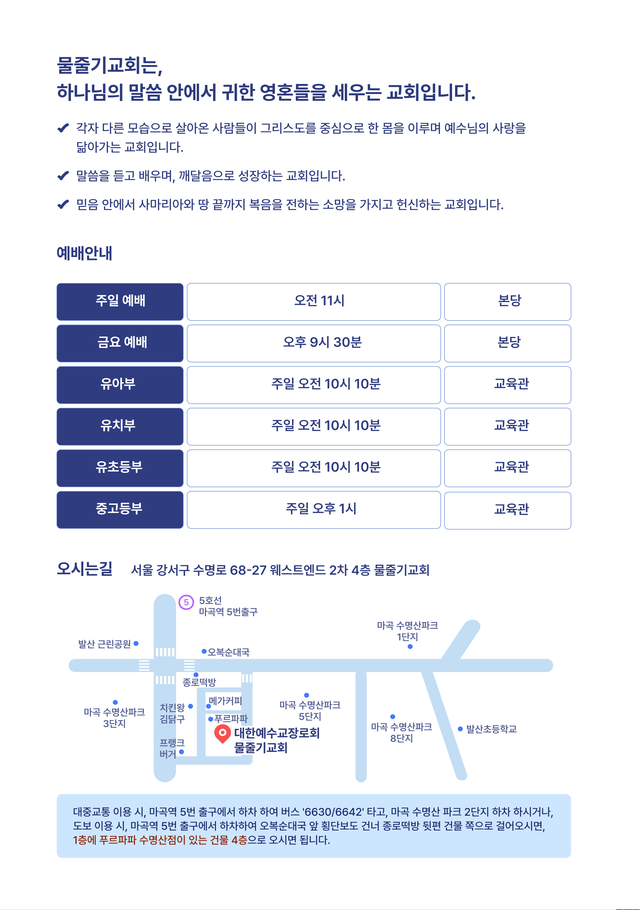

사무엘하

사무엘하 강해

조춘숙 목사

물줄기교회 출판부

동영상 설교는 https://vimeo.com/watercourse 또는 YouTube에서 “물줄기교회”를 검색해 주세요.

# 이 책을 읽는 분들께

지극히 작은 것에 충성한다는 것이 무엇일까요? 하나님께서는 부족한 것이 없으신 분입니다. 그래서 성도들에게 원하시는 것이 없습니다. 믿음으로 살아가는 모습을 보시는 것만으로 만족하시며, 그 삶을 충성이라고 인정해 주시는 분이 바로 하나님입니다. 그렇게 무조건 은혜를 베푸시는 하나님의 마음을 우리는 헤아려드리지 못하고 받은 은혜를 은혜로 여기지 않고, 자기의 것으로 삼기 때문에 작은 것조차 감사하지 못하고, 죄의 자리에 도로 앉는 것입니다.

사무엘하를 강해하면서, 하나님께서 조건 없이 영화로운 자리를 허락해 주셨음에도 불구하고 사람들이 죄를 버리지 못하는 모습을 보면서 안타깝다는 생각을 했습니다. 사람들의 관심을 받지 못하고 자신을 드러낼 자신감도 없는 사울을 이스라엘의 초대 왕으로 불러주셨을 때, 그는 하나님보다 자신이 더 크게 보였기 때문에 교만했고, 악했으며, 더 큰 권력을 갖기 위해서 하나님을 왕의 자리에서 쫓아내었습니다. 그리고, 가족들에게 관심도 받지 못하고 집에서 가장 작은 자로 살았던 다윗을 왕으로 기름 부으시고 높여주셨지만, 다윗은 고난의 세월 속에서 자신을 지켜주시고 생명을 보호하셨던 그 하나님을 쾌락과 바꾸는 죄를 짓고 말았습니다.

거저 받은 은혜를 인간의 죄와 바꾸고 만 것입니다. 사울과 다윗의 처참했던 인생을 기록한 사무엘하를 강해하면서 죄의 삯은 사망이라는 생각을 했습니다. 거저 왕이 되었음에도 아들들과 함께 비참한 최후를 맞이한 사울과, 거저 왕이 되었음에도 스스로 만든 죄의 굴레를 벗어나지 못해서 자녀들의 죽음과 암투 그리고 아들에게 쫓겨 다녀야 하는 비참한 다윗의 삶은 모든 인간들이 만들고 있는 인생이라는 생각을 했습니다.

그럼에도 불구하고, 그 어리석은 인간들의 죄를 용서하시기 위해서, 아라우나 타작마당에서 온전한 번제와 화목제를 드리게 하시고, 기도를 들어주시는 하나님의 마음을 우리는 잊지 말아야 할 것입니다. 여러분은 사랑을 주시기를 즐겨 하시는 하나님, 영혼을 구원하기를 기뻐하시는 하나님, 용서하시기 위해서 자신을 희생하시는 그 하나님을 더 많이 사랑하시기 바랍니다.

사무엘하 강해가 여러분이 하나님께 조금 더 가까이 가는 통로가 되기를 간절히 바라는 마음입니다.

2025년 11월

물줄기교회 목사 조춘숙

2025년 11월 물줄기교회 목사 조춘숙

# 1. 하나님 앞에 선 사람들

사무엘하 1장 17-27절

<blockquote class="scripture-lead">
17다윗이 이 슬픈 노래로 사울과 그의 아들 요나단을 조상하고 18명령하여 그것을 유다 족속에게 가르치라 하였으니 곧 활 노래라 야살의 책에 기록되었으되 19이스라엘아 네 영광이 산 위에서 죽임을 당하였도다 오호라 두 용사가 엎드러졌도다 20이 일을 가드에도 알리지 말며 아스글론 거리에도 전파하지 말지어다 블레셋 사람들의 딸들이 즐거워할까, 할례 받지 못한 자의 딸들이 개가를 부를까 염려로다 21길보아 산들아 너희 위에 이슬과 비가 내리지 아니하며 제물 낼 밭도 없을지어다 거기서 두 용사의 방패가 버린 바 됨이니라 곧 사울의 방패가 기름 부음을 받지 아니함 같이 됨이로다 22죽은 자의 피에서, 용사의 기름에서 요나단의 활이 뒤로 물러가지 아니하였으며 사울의 칼이 헛되이 돌아오지 아니하였도다 23사울과 요나단이 생전에 사랑스럽고 아름다운 자이러니 죽을 때에도 서로 떠나지 아니하였도다 그들은 독수리보다 빠르고 사자보다 강하였도다 24이스라엘 딸들아 사울을 슬퍼하여 울지어다 그가 붉은 옷으로 너희에게 화려하게 입혔고 금 노리개를 너희 옷에 채웠도다 25오호라 두 용사가 전쟁 중에 엎드러졌도다 요나단이 네 산 위에서 죽임을 당하였도다 26내 형 요나단이여 내가 그대를 애통함은 그대는 내게 심히 아름다움이라 그대가 나를 사랑함이 기이하여 여인의 사랑보다 더하였도다 27오호라 두 용사가 엎드러졌으며 싸우는 무기가 망하였도다 하였더라
</blockquote>

사무엘 상의 저자는 사무엘 선지자이며, 사무엘하의 저자는 갓선지자와 나단선지자로 추정하고 있습니다. 기록 연대는 B.C1010-931년경에 기록 된 것으로 보고 있으며 기록 장소는 이스라엘로 추정하고 있습니다.

성경을 통해 하나님께서 주시는 메시지는 생명력이 있기 때문에 인간 자체를 변화시키는 능력을 가지고 있습니다. 빛 되신 예수 그리스도를 화목 제물로 주셨음에도 불구하고 어두운 세상은 그 빛을 영접하기를 거부하므로 어둠 속에서 살아가고 있습니다. 그러나, 성도들은 영적으로 환한 대낮에 하나님께서 어떤 분인지 확실하게 보고 느끼고 깨달으며 살아가고 있습니다. 믿음으로 살면서 하나님께서 주신 구원이 얼마나 소중한 은혜인지 알기에 빛과 어둠을 분별할 수 있는 것입니다.

세상은 하나님께서 죄를 용서하시며 회개의 기회를 주고 계신다는 것을 잘 모르고 있습니다. 사람들의 악한 삶을 보시면서도 쉽게 심판하지 않고 그들이 돌이킬 수 있는 기회를 인생을 통해 주시면서 하나님을 알기를 원하고 계십니다. 이런 하나님의 인내하심이 훗날 심판을 받아도 핑계 댈 수 없게 합니다. 하나님 앞에서는 그 어떤 죄도 숨길 수 없으므로 죄를 짓지 않기 위해서 죽도록 노력해야 합니다.

지금 여러분은 어떤 삶을 살고 있습니까? 여러분의 마음은 무엇으로 채워져 있습니까? 자신이 지금 누구를 두려워하는지 그리고 마음이 무엇으로 채워져 있는지 알아야만 하나님께 더 가까이 나아갈 수 있는 것입니다. 만약 여러분이 세상으로 만족하고 있다면 회개해야 합니다. 왜냐하면 어두운 세상은 한치 앞도 볼 수 없는 곳이므로 인간의 감정과 이익에 따라 말하고 행동하는 것은 소망이 없기 때문입니다. 전능하신 하나님께서는 성도들이 영적인 자녀로 지혜롭고 명철하게 살아가기를 바라고 계십니다. 믿음으로 사는 삶은 분명 어려움이 따르겠지만 그것이 하나님의 뜻대로 사는 믿음이며 영원한 나라에 들어갈 수 있는 조건입니다.

사무엘하 1장은 하나님의 사람을 속이려는 사람과 거짓말에 속지 않는 사람의 대화로 시작합니다. 다윗을 속여서 부귀영화를 얻으려고 했던 아말렉 소년과 하나님의 뜻을 알고 선한 판단을 하는 다윗의 대화는, 사람이 사건을 바라보는 관점에 따라 어떤 결과를 도출하는지 잘 보여주고 있습니다. 아말렉 소년은 다윗이 어떤 신앙으로 하나님과 관계를 맺고 있는지 몰랐으므로 그를 속일 수 있다고 생각했습니다. 사람은 이렇게 자기 수준에서 모든 것을 판단하기 때문에 자신이 가장 지혜롭다는 생각을 합니다. 이 사건이 일어난 시점은 다윗이 자신의 가족과 백성을 강제로 끌고 갔던 아말렉에게 크게 승리한 후 시글락에 머물고 있을 때 일어났습니다. 아말렉은 다윗을 두려워하지 않았기 때문에 시글락을 공격했지만 하나님의 보호를 받고 있는 다윗에게 크게 패하고 말았습니다. 이렇게 하나님의 사람을 공격하는 것은 하나님을 상대로 전쟁을 선포하는 것과 같습니다.

믿음의 사람은 하나님께서 인생과 영혼을 책임지시므로 오직 하나님만 의지하는 믿음의 사람을 속여서도 공격해서도 안 됩니다. 다윗은 믿음으로 살았지만 인생이기 때문에 사울에게 고통을 당한 세월도 있었고 하나님의 뜻을 벗어나 죄를 지은 적도 있었습니다. 그럼에도 그의 믿음을 알고 계신 하나님께서는 다윗을 괴롭히는 아말렉에게 진노하셨고 다윗이 승리하도록 도와주셨습니다. 하나님 자녀가 된다는 것은 이렇게 하나님의 보호를 받으며 사는 것입니다.

하나님께서는 긍휼히 여길 자를 긍휼히 여기시므로 거듭나기 위해 노력하는 다윗의 죄를 용서해 주셨습니다. 세상은 평생 전과기록이 따라 다니며 죄인이라는 것을 증명하지만 하나님께 용서받은 죄는 눈처럼 하얗게 지워지는 것입니다. 여러분이 정확하게 인지해야 하는 것은 하나님께서는 세상 사람이 아무리 인간적이고 경우 바르고 착하게 살아도 그를 지키지 않습니다. 그에게는 하나님께서 주신 참 생명이 없기 때문입니다. 하지만 부족할지라도 참 생명을 품고 있는 성도는 그 생명이 영원까지 이어지도록 눈동자처럼 보호하시며 지켜주고 계십니다.

이 세상이 심판 받는다는 것이 변하지 않는 것처럼 그리스도를 영접한 성도를 향한 하나님의 사랑 역시 변하지 않습니다. 이것을 잊게 되면 아말렉 소년처럼 간교한 꾀를 내는 엄청난 죄를 짓게 될 것입니다. 소년이 왕관과 팔찌를 가지고 온 것을 보면 그가 전쟁터에서 비참하게 죽어가는 사울 곁에 있었던 것이 사실인 것 같습니다. 그 소년은 사울의 죽음을 목격하면서 왜 자신이 사울을 죽인 영웅이 되겠다는 얄팍한 생각을 했을까요?

어떤 사람이든 인생의 기로에 설 수 있는데 그 순간 어떤 판단을 하느냐에 따라서 인생의 결과가 달라집니다. 어떤 문제를 판단할 때 그가 지금까지 어떻게 살아왔는지 무엇을 배웠는지 어떤 사람의 영향을 받았는지에 따라 자신이 알고 있는 지식 그 이상을 생각할 수 없기 때문에 그 사람이 판단하는 결과는 이미 정해져 있습니다. 그래서 평상시 하나님의 말씀대로 사는 훈련을 해야 합니다.

사무엘상 31장 4절

> 그가 무기를 든 자에게 이르되 네 칼을 빼어 그것으로 나를 찌르라 할례 받지 않은 자들이 와서 나를 찌르고 모욕할까 두려워 하노라 하나 무기를 든 자가 심히 두려워하여 감히 행하지 아니하는지라 이에 사울이 자기의 칼을 뽑아서 그 위에 엎드러지매

사울은 율법적인 신앙을 가졌기 때문에 할례 받지 않은 자들 즉 이방인에게 죽임을 당하는 것이 수치라고 생각했습니다. 이방인에게 죽임을 당하는 수치보다 자신이 저지른 죄가 더 엄중 하다는 생각을 하지 못하고 곁에 있던 병사에게 죽여달라고 부탁했습니다. 하지만 병사는 왕을 죽일 수 없어서 스스로 목숨을 끊고 말았습니다.

사울이 이렇게 자살했음에도 불구하고 아말렉 소년은 자기가 사울의 부탁대로 그를 죽였다고 다윗에게 거짓말을 하였습니다. 사울을 죽인 자체로 다윗에게 큰 벌을 받을 것도 모르고 사울을 죽였다는 증거로 왕관과 팔에 거는 고리까지 가지고 와서 더 큰 죄를 쌓았습니다. 소년은 다윗이 어떤 신앙을 가진 사람인지 전혀 알지 못했습니다. 다윗의 원수를 자기가 죽였다고 하면 크게 기뻐할 것이라는 단순한 생각만 하고 이 같은 일을 저지른 것입니다.

다윗은 하나님의 지혜로 선과 악을 판단하기 때문에 쉽게 속지 않습니다. 이 소년의 생각은 보통 사람들이 가질 수 있는 생각입니다. 다윗을 속여서 잘 살고 싶다는 소년의 생각처럼 성도들도 세상에서 잘 사는 것이 복이라는 생각을 하기 때문에 하나님을 속이기 위한 기도와 거짓된 헌신을 하고 있습니다. 이 소년이 하나님을 말씀과 믿음을 통해 만났다면 올바른 신앙을 가졌을 것이므로 이런 어리석은 행동을 하지 않았을 것입니다.

다윗을 통해 얻을 재물이 아니라 자신과 함께 계시는 하나님께 죄가 되는 행동을 하지 않았을 것이므로 생명을 보존할 수 있었을 것입니다. 차라리 솔직하게 사울의 죽음을 보았고 다윗에게 알려줘야 할 것 같아서 왕관과 팔찌를 가지고 왔다고 말했다면 다윗은 사울의 소식을 소상하게 전해준 그에게 감사를 표했을 것이고 상을 내렸을 것입니다.

이 사건을 보면서 사람이 눈앞의 욕심을 버리고 선한 마음으로 세상과 사건을 바라보는 것이 얼마나 어려운 일인지 알 수 있습니다. 부귀영화를 바라면 소년처럼 자신이 하지 않은 일을 부풀려 말할 것이고 상대가 다윗 임에도 뜻을 성취하기 위해서 거짓말도 할 것입니다. 사람들은 세상에서 잘 살고 싶은 욕심에 전능하신 하나님을 이용하려는 죄를 지음으로 영원한 나라에 들어가지 못하고 있습니다.

사무엘하 1장 14절

> 다윗이 저에게 이르되 네가 어찌하여 손을 들어 여호와의 기름 부음 받은 자 죽이기를 두려워하지 아니하였느냐 하고

이것이 바로 소년이 죽어야 하는 이유입니다. 다윗은 사울의 죽음도 애통하지만 하나님께서 기름 부어 세우신 이스라엘의 왕을 이방인이 죽였다는 것에 대해 분노했습니다. 사울을 죽였다는 것은 바로 이스라엘의 진정한 왕이신 하나님께 도전하는 일이며 왕권을 침해하는 일이기 때문입니다.

우리는 여기서 다윗이 문제를 해결할 때 그가 얼마나 하나님의 법대로 냉철하게 판단하는지 볼 수 있습니다. 그는 사람의 감정보다 하나님의 뜻이 먼저였습니다. 사울이 죽었다면 자신에게 득이 됨에도 불구하고 자신의 감정보다는 우선 순위를 정해서 실수없이 처리하고 있기 때문입니다. 문제를 만났을 때 자신의 감정을 완전히 배제시키고 하나님께서 이 사건을 어떻게 보시는지 어떻게 처리해야 하나님께서 원하시는 올바른 결정인지 먼저 생각하는 것은 결코 쉬운 일이 아닙니다. 다윗의 이런 신앙이 하나님께 인정을 받았기 때문에 통일 왕국을 건설하는 위대한 왕이 될 수 있었던 것입니다.

성도들은 하나님께서 어떤 판단과 결정을 원하시는지 알아야 합니다. 교회는 삶의 수준과 지식 정도가 다른 사람들이 모인 곳이기 때문에 생각이 다를 수도 있고 해결하는 방법이 달라서 분쟁이 생길 수 있습니다. 하지만, 다윗이 자신의 판단과 행동을 보고 있는 백성들에게 본을 보이기 위해서 신중하게 행동한 것처럼 성도들은 사람들의 영혼 구원을 위해서 믿음으로 행동해야 합니다. 그래야만 백성들이 다윗을 더욱 존경하고 따를 것이며 하나님과 나라를 위해서 충성하므로 이스라엘이 강하게 성장할 수 있습니다.

사울의 죽음을 가장 기뻐해야 할 사람은 다윗이지만 그는 인간적인 감정을 결코 겉으로 드러내지 않았습니다. 하나님이 정하신 때가 되었기 때문에 새로운 시작을 위해서 큰 걸림돌이 사라지게 하셨다고 믿고 감사하며 기뻐했을 것입니다. 다윗은 쫓겨 다닐 때 사울을 죽일 기회가 여러 번 있었지만 생명의 주인이신 하나님께서 결정하실 때까지 인내하며 기다렸습니다. 사울의 죄가 더 충만해지면 하나님께서 분명히 역사하실 것을 믿었기 때문에 사울을 공격하지 않고 때를 기다렸습니다.

하나님께서 사울을 심판하신 지금 그의 고난이 끝났음에도 불구하고 그는 도리어 아말렉 소년의 거짓말에 속지 않는 냉철한 판단력을 가지고 있었습니다. 성도는 억울해도 하나님께서 악인을 심판 하실 때까지 인내해야 합니다. 그렇다고 해서 다윗이 가만히 당하고만 있었던 것은 아닙니다. 사울을 피해 다니며 백성들을 돌보았고 나라를 지키기 위해서 전쟁을 했으며 매 순간 하나님께 기도와 찬양을 드리며 선한 행동을 보였습니다.

여러분이 분명히 알아야 하는 것은 하나님의 일은 때가 되면 하나님께서 하신다는 것입니다. 성도는 다윗처럼 하나님께서 응답하실 때까지 사명을 감당하면 됩니다. 자신이 문제를 해결해야 한다는 생각을 한다면 또 다른 문제를 만들게 될 것이며 하나님의 은혜를 경험할 수 없습니다. 하나님께서 앞서 일 하시도록 인내할 때 착하고 충성된 종이라는 칭찬을 받을 것이며 다윗처럼 마음에 합한 자라는 칭찬을 받을 것입니다.

레위기 16장 29절

> 너희는 영원히 이 규례를 지킬지니라 일곱째 달 곧 그 달 십 일에 너희는 스스로 괴롭게 하고 아무 일도 하지 말되 본토인이든지 너희 중에 거류하는 거류민이든지 그리하라

하나님께서는 이스라엘안에 사는 외국인들을 차별하지 않으셨습니다. 소년이 자신을 아말렉 사람 곧 외국인의 아들이라고 소개한 것은 이스라엘에 임시로 체류하는 타국인과는 달리 이스라엘에 정착하여 그 사회에 동화된 이방인이기 때문입니다. 이들은 이스라엘 백성과 동일한 대우를 받았고 이스라엘 백성이 드리는 십일조를 분배 받는 특권을 누렸습니다. 그러나 이스라엘 백성처럼 땅을 소유할 수 없었기 때문에 그 나름대로 이방인만 느끼는 어려움이 있었을 것입니다.

소년은 왕에게 사울의 죽음을 알리면 어쩌면 이스라엘 사람처럼 땅을 가질 수 있는 좋은 기회가 될 수도 있다는 생각을 했을지도 모릅니다. 하지만 감정에 충실한 나머지 하나님과 하나님의 사람을 기만하는 큰 죄를 저지르고 만 것입니다.

성도들도 이런 실수를 합니다. 영원한 천국을 소망하며 나그네로 살고 있는 성도들은 신앙을 지키기 위해서 많은 불이익을 당하고 있습니다. 그러자 잘 살고 싶은 마음에 하나님을 떠나거나 말씀을 전하는 사람을 공격하는 어리석은 행동을 합니다. 소년이 나는 이스라엘안에 사는 외국인이라고 떳떳하게 말은 했지만 하나님과 다윗의 신앙을 제대로 이해하지 못했습니다. 이처럼 성도들도 나는 하나님을 믿는다고 말은 하지만 하나님을 제대로 알지 못하기 때문에 성령의 인도하심을 받지 못하고 있습니다.

창조주이신 하나님을 믿는 자녀가 세상사람들과 동일한 행동을 한다는 것은 상황 판단을 제대로 못하고 기름부음 받은 사울 왕을 자신이 죽였다고 거짓말을 하는 어리석은 소년과 같습니다. 물론 사울은 심판 받아야 할 악한 사람입니다. 하지만 심판은 하나님께서 판단하셔야 할 문제이므로 이방인이 자신의 부귀영화를 위해서 사울을 함부로 이용해서는 안 됩니다.

사무엘하 1장 16절

> 다윗이 그에게 이르기를 네 피가 네 머리로 돌아갈지어다 네 입이 네게 대하여 증언하기를 내가 여호와의 기름 부음 받은 자를 죽였노라 함이니라 하였더라

소년은 실제로 사울을 죽이지 않았지만 거짓말을 하는 순간 그 말은 사탄의 도구가 되었고 돌이킬 수 없는 심판의 증거가 되고 말았습니다. 다윗에게 거짓말을 한 순간부터 아무리 자신이 사울을 죽이지 않았다고 변명하면서 잘 살고 싶은 마음에 거짓말을 했다고 소리쳐도 그에게는 심판을 피할 수 있는 기회가 사라졌습니다. 다윗에게 거짓말을 하기 전에 돌이켜야 했습니다. 입에서 나오는 말이 바로 그 사람의 인격을 나타내는 척도가 되기 때문에 말과 행동으로 옮기기 전에 더 깊이 생각해야 합니다.

마태복음 15장 18절

> 입에서 나오는 것들은 마음에서 나오나니 이것이야말로 사람을 더럽게 하느니라

말은 곧 그 사람이므로 그가 말을 했다는 것은 자신의 생각이 옳다고 판단했기 때문에 한 것입니다. 그래서 말을 하기 전에 더 생각하고 또 생각해야 합니다. 사람들은 생각없이 행동하다가 양심에 찔리거나 손해 볼 것 같으면 마음에 없는 말을 했다거나 실수했다며 말을 번복하려고 합니다. 하지만 그 말을 했다는 것은 곧 자신의 수준이 그 정도라는 것을 스스로 드러낸 것이므로 실수라고 해도 이미 늦었습니다. 말과 행동은 좋은 관계를 끊기도 하고 나쁜 관계를 회복시키기도 합니다. 그래서 말을 하기 전에 늘 신중해야 하는 것입니다.

소년은 욕심 때문에 자신이 하지도 않은 일을 했다고 거짓말을 했다가 자신의 말에 의해서 죽음이 결정되고 말았습니다. 만약 그 소년이 말씀을 올바로 가르쳐 주는 지혜로운 사람을 만나서 하나님을 바로 알았다면 이런 죄는 짓지 않았을 것입니다. 정직하게 사는 삶을 배웠다면 다윗을 속이려고 하지 않았을 것이며 거짓말을 하고 싶은 마음이 들었을 때 회개했을 것입니다. 소년이 한 거짓말을 들어보면 그가 어떤 사람인지 알 수 있습니다. 훗날 우리도 하나님을 만났을 때 너는 어떤 말과 행동을 하면서 살았느냐고 물으실 것입니다. 그때는 직고하고 싶지 않아도 여러분의 입술로 낱낱이 고하게 될 것이므로 지금 정직하고 선한 삶을 살아야 합니다.

사무엘하 1장 26절

> 내 형 요나단이여 내가 그대를 애통함은 그대는 내게 심히 아름다움이라 그대가 나를 사랑함이 기이하여 여인의 사랑보다 승하였도다

다윗이 어떻게 사울의 아들 요나단을 잊을 수 있겠습니까? 그는 자신이 왕자이면서도 다윗이 하나님의 택함 받은 사람이라는 것을 인정했고 다윗이 위험할 때마다 구해 주었으며 섬기기를 다한 믿음의 사람이었기 때문입니다. 그 요나단이 사울과 함께 죽었다는 소식을 들은 것입니다. 사울과 요나단 두 사람이 한 자리에서 죽었지만 하나님 앞에 선 두 사람의 사후는 다를 것입니다. 요나단처럼 인생은 하나님의 나라를 향해 가고 있는 나그네 길이라는 것을 알고 믿음으로 산다면 죽어서도 부끄러울 것이 없습니다. 하지만 사울처럼 하나님께서 특별히 왕으로 세워 주셨는데도 욕심과 질투를 버리지 못해서 다윗을 괴롭힌다면 심판을 받을 것입니다.

또한 아말렉 소년처럼 이스라엘에서 하나님의 은혜를 누리고 살았으면서도 참 이스라엘이 되지 못한 사람도 있습니다. 하나님의 백성으로 보호받은 것에 감사하기보다는 눈에 보이는 세상의 복을 원했기 때문에 그는 악인의 자리에서 죽고 말았습니다.

성도들 역시 하나님께서 주시는 은혜를 모두 누리면서 감사보다는 더 큰 욕심을 내다가 스스로 불행에 빠지는 사람도 있습니다. 욕심과 교만은 패망의 선봉이기 때문에 주어진 것에 감사하며 자족하며 은혜를 갚을 줄 아는 지혜가 필요합니다. 다윗의 인생을 보면 언제나 정직하고 선한 삶만 산 것은 아닙니다. 하지만 생명의 하나님을 아는 그의 믿음이, 살아가면서 짓는 죄를 늘 회개하도록 하였고 전능하신 하나님께 용서받도록 하였습니다.

하나님께서는 이렇게 진심으로 회개한 다윗의 죄를 기억하지 않으셨고 다윗이 나라와 백성을 이끌어 갈 수 있도록 도와주셨습니다. 다윗은 사울을 죽였다고 거짓말을 한 소년에게 분노하면서도 이제 자신이 받았던 고난의 고리가 끊어졌다는 것도 실감했을 것입니다. 다윗의 고난은 이제 끝이 났습니다. 하나님만 믿고 끝까지 인내하며 원수에게 복수하지 않았던 그 시간들을 보상받는 순간을 맞이했습니다. 이제 다윗은 하나님께서 상급으로 준비해 주신 왕좌에 올랐습니다. 그는 왕이 되었으므로 세상의 권력에 쫓겨 다니지 않아도 되고 편안하고 풍족한 삶을 살게 될 것입니다.

여러분, 하나님께서 고난을 멈춰 주실 때까지 인내해야 합니다. 원수인 사울이 쫓겨나고 백성들이 자신을 진심으로 왕으로 인정하고 섬기는 그 자리를 만들어 주실 때까지 참고 견뎌내야만 빼앗기지 않는 복을 받을 수 있습니다. 여러분의 미래를 하나님께 맡기고 사울 왕과 원수들이 모두 죽었다는 소식을 들을 때까지 인내하며 믿음의 삶을 살아내기 바랍니다. 억울한 일을 참는 것은 결코 쉽지 않지만 그 고난까지 여러분이 성장하는데 사용하시는 하나님을 믿고 믿음을 지킨다면 하나님께서 영원한 안식처가 되어 주실 것입니다. 여러분이 다윗처럼 하나님만 의지하므로 큰 복을 받는 성도가 되기를 바랍니다.

# 2. 유다 족속의 왕이 된 다윗

사무엘하 2장 1-11절

<blockquote class="scripture-lead">
1그 후에 다윗이 여호와께 여쭈어 아뢰되 내가 유다 한 성읍으로 올라가리이까 여호와께서 이르시되 올라가라 다윗이 아뢰되 어디로 가리이까 이르시되 헤브론으로 갈지니라 2다윗이 그의 두 아내 이스르엘 여인 아히노암과 갈멜 사람 나발의 아내였던 아비가일을 데리고 그리로 올라갈 때에 3또 자기와 함께 한 추종자들과 그들의 가족들을 다윗이 다 데리고 올라가서 헤브론 각 성읍에 살게 하니라 4유다 사람들이 와서 거기서 다윗에게 기름을 부어 유다 족속의 왕으로 삼았더라 어떤 사람이 다윗에게 말하여 이르되 사울을 장사한 사람은 길르앗 야베스 사람들이니이다 하매 5다윗이 길르앗 야베스 사람들에게 전령들을 보내 그들에게 이르되 너희가 너희 주 사울에게 이처럼 은혜를 베풀어 그를 장사하였으니 여호와께 복을 받을지어다 6너희가 이 일을 하였으니 이제 여호와께서 은혜와 진리로 너희에게 베푸시기를 원하고 나도 이 선한 일을 너희에게 갚으리니 7이제 너희는 손을 강하게 하고 담대히 할지어다 너희 주 사울이 죽었고 또 유다 족속이 내게 기름을 부어 그들의 왕으로 삼았음이니라 하니라 8사울의 군사령관 넬의 아들 아브넬이 이미 사울의 아들 이스보셋을 데리고 마하나임으로 건너가 9길르앗과 아술과 이스르엘과 에브라임과 베냐민과 온 이스라엘의 왕으로 삼았더라 10사울의 아들 이스보셋이 이스라엘 왕이 될 때에 나이가 사십 세이며 두 해 동안 왕위에 있으니라 유다 족속은 다윗을 따르니 11다윗이 헤브론에서 유다 족속의 왕이 된 날 수는 칠 년 육 개월이더라
</blockquote>

하나님의 성품을 잘 아는 성도는 작은 일에도 최선을 다해 헌신하는 것을 볼 수 있습니다. 받은 은혜를 감사하며 최선을 다하는 성도를 하나님께서는 축복하시고 그의 삶을 영화롭게 하십니다. 사람들은 자신이 드러나거나 칭찬받는 일이 아니면 하지 않으려고 합니다. 하지만 하나님께서는 모든 성도를 지켜보고 계시기 때문에 성도가 작은 일을 마다하지 않고 충성하는 것을 보시면 그에게 지혜와 물질을 맡기시며 더 큰 일을 하도록 도와주실 것입니다.

누가 복음에 보면 예수님께서 한 예화를 말씀해 주셨습니다. 주인이 왕위를 받기 위해서 길을 떠나기 전에 열명의 종들을 불렀습니다. 그들에게 아무런 조건 없이 한 므나 씩 주면서 돌아올 때까지 장사해 보라고 부탁하였습니다. 이제 종들은 받은 돈으로 장사를 시작하면 됩니다. 원금을 잃으면 안 된다거나 반드시 몇 배의 이익을 남겨야 한다는 조건이 없으므로 종들은 자기의 달란트 대로 장사를 하면 됩니다. 이제 그들은 시장조사를 하면서 자기가 할 수 있는 일을 찾아야 합니다. 그들은 자신이 받은 달란트로 좋아하고 끝까지 할 수 있는 일을 찾는다면 주인이 올 때까지 잘 감당할 수 있을 것입니다.

이처럼 성도들도 남들이 하는 대로 따라 할 것이 아니라 자신의 달란트를 파악해야 합니다. 자신이 좋아하고 잘하는 일을 찾아서 헌신한다면 훨씬 기쁘게 일 할 수 있고 그것을 보신 하나님께서도 지혜와 명철을 주시며 도와주실 것입니다.

왕위를 받고 돌아온 주인에게 한 종은 열 므나를 남겨서 드렸습니다. 어떤 종은 다섯 므나를 남겨서 주인께 드리자 주인은 크게 칭찬하며 열 고을과 다섯 고을을 다스릴 권세를 그들에게 상으로 주었습니다. 그러나, 유독 한 사람만 주인이 준 한 므나를 그대로 드렸습니다. 그는 당신이 엄한 사람인 것을 내가 알기 때문에 한 므나를 그대로 수건에 싸 두었다고 하였습니다. 그는 아주 자랑스럽게 주신 것을 잃지 않기 위해서 수건에 싸서 보관했다고 하자 주인은 예상 밖으로 크게 화를 냈습니다.

물론 성경에는 그 종의 마음이 기록되어 있지 않지만 당당하게 원금을 드린 것을 보면 자신이 무슨 잘못을 했는지 깨닫지 못한 것 같습니다. 주인은 원금을 돌려 달라고 종들에게 돈을 준 것이 아닙니다. 왕의 입장에서 보면 한 므나를 그대로 돌려받았기 때문에 손해 본 것이 없지만 주인의 깊은 뜻을 헤아리지 못하고 자기 마음대로 판단했던 종의 행동은 왕을 멸시한 죄를 지은 것입니다. 주인은 어떤 종이 이익을 많이 남겼는지 그리고 잃었는지 그것에 관심이 있는 것이 아니라 누가 주인에게 순종했는지 보려고 했습니다. 장사하다가 한 므나를 다 잃는다고 해도 말씀대로 충성한 종은 주인에게 책망을 받지 않습니다.

왕에게 순종한 종은 칭찬을 받았고 거역한 종은 저주를 받았습니다. 많이 남긴 종만 칭찬을 받은 것이 아니라 순종한 종이 칭찬받은 것입니다. 성경에는 열 므나와 다섯 므나를 남긴 종들이 칭찬을 받았기 때문에 이익을 남겨야 한다고 생각하겠지만 주인의 뜻은 그런 것이 아닙니다.

예수님은 구원을 완성하신 후 성도들에게 영혼 구원을 위해서 너희들이 받은 은혜를 나누어 주라고 명령하셨습니다. 왕권을 가지고 다시 돌아왔을 때 말씀에 순종하기 위해서 복음을 전한 성도의 이름을 부르겠다고 하신 것입니다. 성도들이 복음을 전했다는 것은 그리스도의 말씀에 순종한 것입니다. 구원은 성도들이 복음을 전했기 때문에 성취되는 것이 아니라 성령께서 전도를 통해 역사하신 것이므로 성도들은 믿고 복음을 전하면 됩니다.

장사를 하다가 한 므나를 잃을 수도 있는 것처럼 순종하는 마음으로 복음을 전했지만 단 한 명의 영혼도 구원하지 못할 수도 있습니다. 그래도 하나님께서는 헌신하는 것을 보시며 이익을 남겼다고 말씀하시기 때문에 순종 자체가 이익을 남기는 것입니다. 말씀을 알고도 복음을 전하는 순종이 없다면 예수 그리스도께서 전능하신 왕으로 오시는 날 크게 책망을 받을 것입니다. 예수님께서는 내가 왕권을 가지고 다시 올 때까지 예루살렘과 온 유대와 사마리아와 땅 끝까지 복음을 전하라고 명령하셨습니다. 이 말씀대로 반드시 왕권을 가지고 다시 오셔서 순종한 성도에게 영원한 생명을 주실 것입니다.

종들이 한 므나를 받은 것처럼 성도들은 복음이라는 한 므나를 받았습니다. 이제 이 한 므나로 어떻게 복음을 전할 것인지 고민해야 합니다. 종들이 시장조사를 한 것처럼 성도들은 상대방의 영적 상태를 보면서 복음을 전하기 위해 노력하면 됩니다.

예수님께서 반드시 몇 배의 이익을 남기라고 말씀하시지 않았으므로 성도들은 자신의 달란트 대로 최선을 다해 복음을 전하면 됩니다. 복음을 전하기 위해서 노력할 때 핍박을 받을 수도 있겠지만 충성한 성도에게는 그 결과에 대해서 책임을 묻지 않으실 것입니다. 하지만 한 므나를 그대로 드린 종처럼 자신의 구원에만 만족하고 다른 사람들에게 복음을 전하지 않는다면 예수 그리스도께 게으른 자라고 크게 책망을 받을 수 있습니다.

예수님께서는 결과보다 과정을 중요하게 생각하시는 분이므로 진리를 전하기 위해서 고민하고 희생하는 신앙을 보여드려야 합니다. 성도들의 영육 간의 부족한 부분은 성령께서 얼마든지 도와 주실 수 있으므로 말씀에 먼저 순종하는 것이 믿음입니다.

사무엘하 2장 1절

> 그 후에 다윗이 여호와께 물어 가로되 내가 유다 한 성으로 올라 가리이까 여호와께서 가라사대 올라가라 다윗이 가로되 어디로 가리이까 가라사대 헤브론으로 갈찌니라

이 기도를 드릴 당시 사울 왕이 죽었는데도 다윗은 자기 마음대로 행동하지 않았습니다. 자신의 거취를 알기 위해서 여호와께 유다로 올라가도 되겠느냐고 여쭈어 보자 여호와께서는 헤브론으로 올라가라고 응답하셨습니다. 하나님 말씀을 거역하고 마음대로 유다를 떠났던 다윗이 이런 기도를 드리는 것을 보면 인생의 결정권을 하나님께 드릴 정도로 고난을 통해 성숙했다는 것을 알 수 있습니다. 이런 것을 보면 하나님께서 주신 고난은 은혜라는 것을 알 수 있습니다.

다윗이 한가지 잊지 말아야 하는 것은, 사무엘상 22장 5절에 하나님께서는 갓 선지자를 통해 다윗에게 유다 땅으로 가라고 명령하셨습니다. 아브라함이 하나님의 뜻을 무시하고 애굽 땅으로 내려갔지만 다시 가나안 땅으로 부르셨던 것처럼 왕으로 기름 부음 받은 다윗에게 어떤 역경이 기다린다고 할지라도 유다 땅으로 돌아가라고 하신 것입니다. 하지만 다윗은 사울 왕을 두려워했기 때문에 유다에 있을 수 없었습니다.

블레셋의 습격을 받은 그일라를 구원하라고 하셨을 때 사무엘상 23장 3절에 보면 우리가 유다에 있기도 두렵거든 하물며 그일라에 가서 블레셋 사람들의 군대를 어떻게 공격하느냐고 두려움을 드러냈습니다. 하나님의 계획은 처음부터 지금까지 변경된 것이 없습니다. 하나님께서는 언제나 다윗에게 좋은 계획을 가지고 인도하십니다. 그러나 다윗이 하나님의 뜻에 순종하지 않았기 때문에 블레셋에게 아내들과 백성들을 빼앗기는 수모를 겪었던 것입니다.

사람은 자신의 판단이 옳다는 생각을 버리지 않기 때문에 마음대로 결정하지만 결국 시간만 허비하고 제자리로 다시 돌아올 수밖에 없습니다. 인생의 주인이 하나님이라는 것을 인정하지 않는다면 먼 길을 돌아 다시 하나님께 도움을 청할 수밖에 없는 것입니다. 유다 땅에 사울 왕이라는 감당하지 못할 걸림돌이 있다고 해도 하나님을 믿고 순종했다면 그는 더 빨리 유다 족속의 왕이 되었을 것입니다.

사람은 언제나 자신이 보고 알고 느끼는 것이 전부라고 생각합니다. 그래서 바늘구멍만한 시야로 전체를 다 아는 것처럼 불순종하고 있습니다. 하나님의 말씀도 옳지만 이번에는 내 생각이 더 옳은 것 같다고 고집을 부리며 하나님께서 예비하신 길보다 자신이 원하는 길이 더 빠를 수도 있다고 교만하게 행동합니다.

하나님께서는 언제나 순종이 먼저라고 말씀하시지만 사람은 세상의 잣대를 들이대며 내 생각과 방법대로 하겠다며 불순종하고 있습니다. 우리는 미래를 알 수 없기 때문에 말씀대로 먼저 순종하면 왜 이것을 하라고 하셨는지 왜 이 길로 가라고 하셨는지 분명하게 알 수 있습니다. 다윗은 사울 왕이 훈련된 군사들과 함께 쫓아다니는 상황에서 유다로 간다면 죽을 수 있다는 두려움이 있었을 것입니다. 하지만 유다로 가라고 하셨을 때 순종했다면 틀림없이 피할 길을 주셨을 것이며 준비하신 하나님의 계획을 더 정확하게 보았을 것입니다. 말씀에 순종하지 않았기 때문에 더 많은 사건을 만나야 했고 블레셋 사람들에게 가족을 빼앗기는 수모까지 당하게 되었습니다.

하나님께서 유다 땅으로 가라고 하신 이유가 분명히 있습니다. 그러나, 그가 불순종하자 하나님은 계획을 드러내지 못하셨고 다윗은 오랫동안 남의 나라를 떠 돌아다녀야 했습니다. 이것은 성도들도 마찬가지므로 순종이 먼저라는 것을 기억하기 바랍니다.

다윗은 아내 아히노암과 아비가일과 백성들을 모두 데리고 헤브론으로 올라가자 유다 족속은 기쁜 마음으로 다윗에게 기름을 부어 왕으로 세우며 환대해 주었습니다. 죄인처럼 쫓겨 다니던 다윗이 드디어 유다의 왕이 된 것입니다. 지난날 아버지의 양을 치던 목동이었을 때 사무엘이 와서 하나님께서 선택한 사람이 바로 자신이라는 믿지 못할 사실을 알려주었습니다. 그리고 아버지와 형들 앞에서 기름 부어 왕으로 세워주었습니다.

하나님께서는 다윗을 선택하셨지만 어린 그를 왕으로 세우기에는 왕국을 다스릴 수 있는 지혜가 없었기 때문에 강한 훈련이 필요했습니다. 하나님은 다윗을 왕으로 세워서 이스라엘과 유다를 통일시킬 계획을 가지고 계셨기 때문에 다윗의 절대적인 지혜와 경험이 필요했습니다. 하나님의 이런 깊은 뜻을 알지 못한 다윗은 죽도록 도망 다니면서 자신이 왜 이런 고난을 당해야 하는지 이해가 되지 않았습니다. 자신을 왕으로 부르셨다면 궁에서 편히 살아야 한다는 인간적인 생각 때문입니다.

그러나 하나님께서는 사람을 선택하실 때 그에게 맡길 사명까지 생각하고 부르시기 때문에 사람의 생각처럼 단순하지 않습니다. 어린 다윗은 깊은 뜻을 헤아릴 수 없기 때문에 불평하지만 하나님은 성장한 다윗을 보고 계시기 때문에 훈련을 멈추지 않습니다. 하나님께서는 고난을 통해 이스라엘과 유다를 다스릴 힘과 지혜가 생긴 성숙한 다윗에게 헤브론으로 올라가라고 다시 명령하셨습니다.

고비마다 하나님께서 자신을 보호하신다는 것을 삶으로 경험한 그는 왕이 되고 나서도 하나님을 의심하지 않았습니다. 사랑으로 백성들을 보살폈고 올바른 통치를 위해서 기도하기를 멈추지 않았으며 작은 죄도 회개하는 충성된 자로 살았습니다.

사무엘하 2장 4절

> 유다 사람들이 와서 거기서 다윗에게 기름을 부어 유다 족속의 왕으로 삼았더라 어떤 사람이 다윗에게 말하여 이르되 사울을 장사한 사람은 길르앗 야베스 사람들이니이다 하매

유다 사람들은 다윗에게 길르앗 야베스 사람들이 사울 왕의 시신을 거두었다고 알려주었습니다. 사울 왕이 블레셋사람들에게 죽임을 당하고 성벽에 못박혀 있다는 소식을 듣자 그들은 목숨을 걸고 사울의 시신을 거두었던 것입니다. 이 말을 들은 다윗은 길르앗 야베스로 사자를 보내어 사울의 시신을 거두어 준 그들의 노고를 칭찬하였고 크게 상을 내렸습니다. 다윗의 귀한 인격이 다시 한번 빛을 발하는 순간입니다.

일반적인 사람들은 자신을 괴롭혔던 사울 왕의 시신을 거두었다면 도리어 책망했을 것입니다. 그러나 다윗은 하나님께서 기름 부으신 왕의 시신이 적들의 성벽에 있는 것이 안타까워서 시신을 거둔 길르앗 사람들에게 상을 내렸습니다. 길르앗 사람들은 상을 받기 위해서 사울의 시신을 거둔 것은 아닙니다. 과거에 암몬이 공격했을 때 사울이 도와주었기 때문에 은혜를 갚기 위해서 목숨을 걸고 적진으로 들어간 것입니다. 이들처럼 받은 은혜를 잊지 않고 갚는 사람들은 언제나 선한 선택을 하기 때문에 칭찬을 받을 수밖에 없습니다. 감사하는 사람은 항상 선한 생각과 행동을 하므로 하나님께서 그들의 안전을 도와주시는 것을 보게 됩니다.

다윗은 비록 원수의 시신을 거두었더라도 은혜를 갚을 줄 아는 길르앗 사람들을 칭찬하는 성숙한 믿음을 가진 사람입니다. 하나님께서 다윗을 사랑하실 수밖에 없는 이런 선한 믿음이 바로 성도들이 가져야 하는 신앙입니다.

저는 길르앗 야베스 사람들과 아말렉 소년을 보면서 이런 생각을 했습니다. 사람은 누구나 선한 의지와 악한 의지를 가지고 있습니다. 둘 중에 어떤 것을 선택하느냐에 따라서 상을 받을 수도 있고 심판을 받을 수도 있으므로 그의 미래가 정해지는 것입니다. 생과 사, 화와 복을 우리 앞에 두셨음으로 그 선택은 매 순간 믿음으로 우리가 [내가] 결정해야 합니다. 하나님께서는 언제나 동일한 말씀과 은혜를 주시지만 사람들이 어떤 선택을 하느냐에 따라서 그가 평안할지 불행할지 결정된다는 것입니다. 그 선택의 결과는 자신이 책임져야 하므로 늘 신중해야 합니다. 차원 높은 지식과 선한 지혜를 가져야 옳은 결정을 할 수 있습니다. 늘 주안에서 더 너그럽고 이타적인 삶을 산다면 그 결과 하나님과 사람들에게 많은 사랑을 받을 것입니다.

그리스도께서 교회의 머리가 되시고 성도들은 지체가 되었습니다. 복음은 다른 사람과 경쟁하는 것이 아니며 상급은 많고 적은 것이 아니므로 사명을 감당하기 위해서 헌신한다면 칭찬 받을 수 있습니다. 하나님께서는 진심으로 하나님을 섬기는 성도를 찾고 계십니다. 칭찬의 조건은 단 하나 하나님의 말씀에 순종하는 것입니다.

주인 뜻을 온전히 파악하지 못해서 한 므나를 그대로 가지고 있었던 사람처럼, 하나님의 뜻을 깨닫지 못하면 받은 은혜를 나누지 않기 때문에 크게 책망을 받게 됩니다. 만약 스스로 판단할 지혜가 없다면 믿음으로 앞선 사람들의 신앙을 보고 따라 하기라도 해야 합니다. 자기의 생각을 고집하며 한 므나를 그대로 가지고 있는 것은 화를 자초하는 것이며 주인의 말씀을 무시하는 행동이기 때문입니다.

다윗이 하나님의 큰 은혜를 받은 것처럼 우리는 예수 그리스도께 큰 은혜를 입었습니다. 그 은혜를 다윗과 길르앗 사람들처럼 잊지 않고 그리스도를 위해서 나누어야 합니다. 이 마지막 때에 말씀을 묵상하고 기도하면서 자신이 어떤 일을 해야 할지 고민한다면 성령께서 도와주실 것입니다. 다윗은 사울 왕의 은혜를 잊지 못한 길르앗 사람들을 품어주었습니다. 사울은 자기에게 충성했던 사람들을 배신했지만 다윗은 그들의 버팀목이 되어 주었고 울타리가 되어 주었습니다. 다윗은 은혜를 갚는 사람들을 축복하는 너그러움을 보여주면서 자연스럽게 백성들의 마음을 얻을 수 있었습니다.

예수님께서도 세상을 위해서 살았던 우리들을 부르셨고 그 죄를 용서하시며 우리가 얼마나 소중한 존재인지 알려 주셨습니다. 사탄의 종이었던 우리를 위해 자신의 생명을 주시며 더 많은 사람들이 그 사랑을 보고 하나님께 돌아오도록 본을 보여 주신 것입니다.

잠언 24장 17-18절

> 17네 원수가 넘어질 때에 즐거워하지 말며 그가 엎드러질 때에 마음에 기뻐하지 말라 18여호와께서 이것을 보시고 기뻐하지 아니하사 그의 진노를 그에게서 옮기실까 두려우니라

여러분을 괴롭히던 원수가 어려움을 당할 때 그것을 보며 기뻐하는 것은 하나님의 성품을 잘 모르고 하는 어리석은 행동입니다. 원수의 고난을 보고 기뻐하는 것은 하나님께서 죄를 얼마나 미워하시는지 깨닫지 못하는 악하고 어리석은 사람이므로 도리어 하나님의 진노를 받을 수 있습니다. 하나님을 아는 선한 사람은 지금 원수가 당하는 고통은 그의 죄 때문이라는 것을 알기에 기뻐하기보다는 더 선하게 살기 위해 노력할 것입니다. 죄의 자리는 누구나 앉을 수 있다는 것을 잊으면 교만해질 수 있습니다.

다윗은 훈련을 마친 군인처럼 모든 면에 자신감을 가지고 임했으며 하나님 앞에서 더욱 겸손하고 성숙한 모습을 보여드렸습니다. 자신을 보호하시기 위해서 사울을 심판하셨다는 생각보다는 사울 왕은 그의 충만한 죄로 죽었다는 생각을 하였습니다. 하나님께서는 자신을 훈련시키기 위한 도구로 사울을 사용하셨을 뿐이므로 그의 죽음을 두고 자기가 기뻐해야 할 일은 아니라는 것입니다. 그에게는 사울을 죽일 기회가 여러 번 있었지만 하나님께서 원하지 않기 때문에 복수하지 않았다는 것을 하나님은 알고 계셨습니다. 하나님께서는 이렇게 사람들의 진심을 알고 계시므로 다윗을 통일 왕국을 다스릴 수 있는 선한 왕으로 만드신 것입니다.

하나님께서는 성도들의 진심을 모두 알고 계십니다. 선한 마음을 감출 수 없는 것처럼 악한 마음도 감출 수 없기 때문에 문제를 대처하는 것을 보면 그 사람의 성품과 인격을 알 수 있습니다. 자신을 다스릴 줄 아는 사람은 감정을 그대로 드러내기 보다는 하나님의 뜻이 무엇인지 생각하면서 선한 행동을 드러냅니다. 기쁠 때나 슬플 때나 자신을 통제하고 조절하는 능력을 갖추어야만 다윗처럼 매 순간 선한 선택을 할 수 있는 것입니다.

여러분을 괴롭힌 원수라 할지라도 그 사람 역시 그리스도께서 구원하고자 십자가를 지신 영혼이라는 것을 알고 복수하고 싶은 마음까지 하나님께 맡기기 바랍니다. 억울함과 분함을 모두 하나님께 맡기고 여러분의 길을 가고 있으면 다윗이 어느 날 사울의 죽음을 들은 것처럼 여러분을 괴롭히던 사람들의 소식을 듣게 하실 것입니다. 그래서 이렇게 지혜로운 성도를 가리켜 잠언 25장 13절에 충성된 사자는 그를 보낸 이에게 마치 추수하는 날에 얼음 냉수 같아서 능히 그 주인의 마음을 시원케 한다고 하였습니다. 아마도 다윗은 하나님을 시원케 해 드린 자녀였을 것입니다. 하나님의 뜻대로 인내하고 겸손하며 충성했던 다윗은 추수하는 날에 얼음 냉수처럼 시원한 자녀였을 것입니다.

여러분은 하나님께 어떤 자녀입니까? 마음 놓고 일을 맡기실 수 있는 자녀입니까? 아니면 맡겨 주시는 일마다 자기의 뜻을 고집하는 답답한 자녀입니까? 여러분은 이사야처럼 저를 보내달라고 간청하는 자녀가 되어야 합니다. 늘 준비하는 마음으로 선한 삶을 살면서 하나님께서 때와 장소를 가리지 않고 마음 놓고 보내실 수 있는 성도가 되기를 바랍니다.

다윗은 고난을 당하면서도 하나님께서 자신을 어떻게 보실지 두려웠습니다. 많은 사람들과 함께 도망 다니는 처지에서도 그들이 존경할 수 있도록 올바른 신앙을 보여주기 위해서 노력했고 말과 행동을 조심했습니다. 통일 왕국을 다스리는 다윗은 쉽게 만들어진 것이 아닙니다. 하나님과 사람들에게 신뢰를 받기 위해서 자신을 쳐서 복종했기 때문에 왕의 자리에서 하나님을 만족하게 해 드릴 수 있었습니다.

여러분도 다윗처럼 하나님의 부름을 받은 성도이기에 선한 말과 행동을 자연스럽게 할 때까지 믿음으로 훈련해야 합니다. 그러면 예수그리스도께서 전능하신 왕으로 오시는 날 충성된 종이라는 칭찬을 들을 수 있을 것입니다. 주님을 언제 어디서 만날지라도 내가 너를 사랑한다는 말씀을 듣고 칭찬 받는 귀한 성도가 되기를 바랍니다.

# 3. 요압의 배신

사무엘하 2장 12-23절

<blockquote class="scripture-lead">
12넬의 아들 아브넬과 사울의 아들 이스보셋의 신복들은 마하나임에서 나와 기브온에 이르고 13스루야의 아들 요압과 다윗의 신복들도 나와 기브온 못 가에서 그들을 만나 함께 앉으니 이는 못 이쪽이요 그는 못 저쪽이라 14아브넬이 요압에게 이르되 원하건대 청년들에게 일어나서 우리 앞에서 겨루게 하자 요압이 이르되 일어나게 하자 하매 15그들이 일어나 그 수대로 나아가니 베냐민과 사울의 아들 이스보셋의 편에 열두 명이요 다윗의 신복 중에 열두 명이라 16각기 상대방의 머리를 잡고 칼로 상대방의 옆구리를 찌르매 일제히 쓰러진지라 그러므로 그 곳을 헬갓 핫수림이라 일컬었으며 기브온에 있더라 17그 날에 싸움이 심히 맹렬하더니 아브넬과 이스라엘 사람들이 다윗의 신복들 앞에서 패하니라 18그 곳에 스루야의 세 아들 요압과 아비새와 아사헬이 있었는데 아사헬의 발은 들노루 같이 빠르더라 19아사헬이 아브넬을 쫓아 달려가되 좌우로 치우치지 않고 아브넬의 뒤를 쫓으니 20아브넬이 뒤를 돌아보며 이르되 아사헬아 너냐 대답하되 나로라 21아브넬이 그에게 이르되 너는 왼쪽으로나 오른쪽으로나 가서 청년 하나를 붙잡아 그의 군복을 빼앗으라 하되 아사헬이 그렇게 하기를 원하지 아니하고 그의 뒤를 쫓으매 22아브넬이 다시 아사헬에게 이르되 너는 나 쫓기를 그치라 내가 너를 쳐서 땅에 엎드러지게 할 까닭이 무엇이냐 그렇게 하면 내가 어떻게 네 형 요압을 대면하겠느냐 하되 23그가 물러가기를 거절하매 아브넬이 창 뒤 끝으로 그의 배를 찌르니 창이 그의 등을 꿰뚫고 나간지라 곧 그 곳에 엎드러져 죽으매 아사헬이 엎드러져 죽은 곳에 이르는 자마다 머물러 섰더라
</blockquote>

배신이라는 단어는 믿음이나 의리를 저버리는 행위를 뜻합니다. 상대방을 전적으로 믿고 관계를 이어갈 때 상대방도 동일한 선상에서 의리를 지켜야 좋은 관계를 이어나갈 수 있습니다. 상대방을 믿고 아낌없이 마음을 주었는데 자신의 이득을 위해서 경우없이 행동하거나 은혜를 배신한다면 그 관계는 끊어질 것입니다. 그러나 서운한 감정과 배신에 의한 분노는 결국 인간의 이성에 의한 판단이기 때문에 상대적일 수밖에 없습니다. 이해 관계가 얽혀있는 감정이므로 누가 옳고 그른 것에 대해서는 철저히 객관적인 판단이 필요합니다. 더구나 가까운 관계에서 느끼는 감정은 더욱 더 상대적일 수밖에 없습니다. 이런 관계는 보편적인 것이 아닌 특정한 관계에 의존하기 때문에 사람이 느끼는 모든 감정이 상대방의 말과 행동에 따라 달라지기 때문입니다.

사람이 사람에게 느끼는 배신감과 서운한 감정은 인간이 하나님을 배신한 것과는 다릅니다. 인간은 판단의 기준이 자신이지만 하나님은 말씀이 기준이기 때문입니다. 하나님께서는 율법을 통해 백성들에게 절대적인 법을 제시하셨고 법대로 살지 않는 것을 죄라고 말씀하셨습니다. 그러므로 상대방에 따라 달라지는 사람의 관계와는 완전히 다른 것입니다.

하나님의 말씀이 법이며 그 법을 어기는 것은 곧 죄입니다. 그러므로 하나님을 배신하는 것은 사망을 의미합니다. 하나님의 법은 영원히 변하지 않으므로 사람들은 하나님께서 정하신 법대로 살아야 합니다. 그러나 사람이 하나님의 법을 지켜내지 못할 것을 아셨기 때문에 율법의 요구를 성취하기 위해서 예수님을 이 땅에 보내셨고 예수님으로 하여금 율 법을 완성하게 하셨습니다. 하나님의 아들이 죄를 대속하셨다는 것을 믿는 사람들이 구원을 받습니다. 이런 하나님의 뜻을 세상에 전하기 위해서 제자들을 부르신 것입니다. 예수님께서는 제자들에게 구원은 율법을 지켜서 받는 것이 아니라 복음을 듣고 예수 그리스도를 영접해야 받는다고 알려주셨습니다. 예수님께서 너희는 나를 누구라 하느냐고 물었을 때 베드로는 주는 그리스도시요 살아계신 하나님의 아들이라고 대답했기 때문에 칭찬을 받았습니다. 사람이 감히 생각할 수 없는 하나님의 놀라운 역사를 베드로가 대답한 것은 성령께서 하나님의 뜻을 알려주신 것이므로 기적과 같은 일입니다.

예수님께서는 베드로의 대답을 듣고 크게 칭찬하신 후에 이제 나는 예루살렘으로 올라가 장로들과 대제사장들과 서기관들에게 죽임을 당하겠지만 제 삼 일에 살아날 것이라는 큰 비밀을 알려 주셨습니다. 진리를 깨닫게 된 베드로와 제자들에게 더 큰 비밀을 알려주고 싶은 마음에 자신이 죄를 대속하실 것과 부활하실 것을 알려주신 것입니다. 그러자 베드로는 예수님을 붙들고 항변하면서 주여 그리 마옵소서 이 일이 결코 주께 미치지 못할 것이라고 말렸습니다. 베드로는 예수님을 무척 사랑하고 있었기 때문에 죽임을 당한다는 말씀을 듣고 고난을 막아야 한다는 생각을 했을 것입니다.

그러자 베드로에게 사탄아 내 뒤로 물러가라 너는 나를 넘어지게 하는 자로다 네가 하나님의 일을 생각하지 아니하고 도리어 사람의 일을 생각한다고 크게 책망하셨습니다. 그는 예수님께서 죽는다는 말씀을 하시자 삼 일만에 다시 산다는 말씀을 들었음에도 불구하고 부활에 관심을 갖지 못하고 하나님의 계획을 막으려는 어리석음을 범하고 말았습니다.

성도들은 인간적인 생각을 버리고 영적으로 성장해야 합니다. 그래야 세상과 사탄이 위협하고 유혹해도 분별할 수 있는 능력이 생깁니다. 만약 베드로가 지금까지 예수님께 배운 말씀을 이해했다면 죽임을 당한 후에 부활할 것이라는 말씀을 정확하게 알아 들었을 것입니다. 베드로는 영적으로 성숙하지 못했기 때문에 매 순간 올바른 판단을 할 수 없었고 예수님의 고난을 자기가 막을 수 있다는 생각을 했습니다. 사람이 분노하고 흥분하면 진리를 알고 있어도 죄 된 말을 쉽게 할 수 있기 때문에 영적으로 성숙하게 판단하는 훈련이 필요 합니다.

사람은 해도 되는 말과 절대로 해서는 안 되는 말이 있습니다. 그것을 분별하지 못하면 예수님께 사탄이라고 책망을 들은 베드로처럼 매 순간 하나님의 계획을 방해하는 판단을 하므로 결국 배신하게 됩니다. 자신이 사탄의 도구가 된 줄도 모르고 믿음이라고 생각하는 것입니다.

그 대표적인 사람이 요압인데 생명을 내어놓고 다윗을 섬긴 사람이 어떻게 다윗을 배신할 수 있었는지 살펴보고자 합니다. 하나님께서 정하신 법으로 요압의 행동을 본다면 그가 변질되는 과정을 쉽게 볼 수 있습니다.

요압은 스루야의 아들로 태어났습니다. 아비새와 요압과 아사헬 삼형제는 전쟁에 나가면 매번 승리하는 큰 용사였기 때문에 다윗은 그 누구보다 조카인 이 세 사람을 사랑했습니다. 요압은 다윗이 왕이 되기 전부터 존경하고 따랐습니다. 훗날 다윗이 인구조사를 한다고 했을 때 그런 선택은 하나님께 죄가 되는 일이라며 말린 것을 보면 다윗을 진심으로 사랑한 것 같습니다. 그토록 다윗이 잘못된 길을 가지 않도록 말렸지만 다윗이 고집을 부리며 인구 조사를 하라고 명령을 내렸을 때 곧바로 순종하기도 했습니다. 다윗이 원하는 일을 할 수 있도록 최선을 다해 인구조사를 하는 신하의 충성심을 보인 것입니다.

요압은 자신의 판단보다는 다윗의 판단을 존중했습니다. 그는 다윗을 위하는 일이라면 적진도 마다하지 않고 뛰어 들어서 다윗에게 승리를 안겨 주었습니다. 그는 훗날 다윗과 이스라엘이 크게 부흥할 수 있도록 에돔과 암몬과 수리아 외에 많은 나라를 점령하는 큰 공을 세우기도 했습니다. 어쩌면 다윗이 통일 왕국을 건국하는데 요압의 공로가 가장 컸다고 해도 과언이 아닙니다. 하나님께서는 다윗에게 충성하는 요압을 사랑하셔서 그가 전쟁에 나가서 큰 승리를 거둘 수 있도록 그의 생명을 보호하셨습니다. 요압을 돕는 것이 바로 다윗을 돕는 것이기 때문에 요압에게 힘과 지혜를 주셨을 것입니다.

이렇게 충성했던 요압이 점점 변질되었는데 그는 자신이 다윗이 왕이 되는데 기여한 바가 크다는 생각을 갖게 되자 권력 또한 탐하게 되었습니다. 다윗을 존경하고 충성한 것도 사실이지만 인간의 의를 드러낸 것입니다. 이것이 복을 받은 사람이 하나님을 배신할 수 있는 가장 위험한 때입니다. 사람들은 자신이 영육간의 성장을 했다는 생각을 하면 하나님과 다윗의 말에 귀를 기울이지 않고 자존심과 고집과 아집을 갖게 됩니다. 처음에는 다윗의 말을 들었지만 자신의 판단이 생기는 순간 다윗을 판단하는 교만을 갖게 되므로 조심해야 합니다. 이렇게 하나님의 뜻대로 사는 다윗과 다른 결정을 하는 것이 배신입니다. 하나님을 향한 다윗의 신앙은 변함이 없기 때문에 요압이 변질된 것입니다. 자신이 목숨을 걸고 전쟁에서 승리 했으므로 다윗이 왕이 될 수 있었다는 교만한 생각 때문에 결국 순종을 버리고 배신을 선택할 수 있었습니다.

요압은 자존감이 높아지자 하나님이 두렵지 않았고 다윗의 의중을 전혀 살피지 않는 악한 사람이 되었습니다. 교만하게 되면 다윗이 가진 권위를 무시하게 되므로 동생의 복수를 위해 살인까지 하는 엄청난 죄를 짓게 되는 것입니다. 베드로가 예수님의 곁에 있으면서도 순간 잘못 판단해서 사탄의 도구가 된 것처럼 요압은 다윗이 순종하는 것을 곁에서 보았고 하나님의 놀라운 역사를 직접 보고도 하나님과 다윗을 배신하고 말았습니다. 요압은 지금까지 진심으로 다윗과 백성을 사랑했고 다윗이 이스라엘 왕이 되도록 목숨을 바쳐서 충성했습니다. 그랬던 요압이 다윗을 버리고 악하게 변해가는 것이 안타까울 뿐입니다.

이처럼 성도들도 진심으로 하나님을 사랑하고 충성하고 있습니다. 하지만 요압처럼 자신이 헌신하고 헌금했기 때문에 교회가 부흥할 수 있었다는 생각을 한다면 사탄의 도구가 될 수 있습니다. 성도들이 헌신하는 것은 하나님과 교회를 위한 것이 아니라 자신의 구원과 성장을 위해서 하는 것이므로 인간의 의를 드러내서는 안됩니다. 충성할 수 있는 건강과 재물 모두 하나님께서 주신 것이기 때문입니다. 하나님께서는 성도들의 헌신을 사용하셔서 일하실 뿐입니다. 하나님께서는 요압이 없어도 다윗을 왕으로 세우실 수 있는 분이고 성도들의 충성이 없어도 교회를 부흥시킬 수 있는 전능하신 분입니다. 다윗이 왕이 되었기 때문에 요압의 충성이 더 빛이 난 것처럼 교회가 성장했기 때문에 성도들의 충성이 더 빛이 난 것입니다.

요압이 끝까지 겸손하게 다윗을 섬겼다면 하나님께서는 요압과 그의 자손들이 평안하게 살 수 있도록 축복하셨을 것입니다. 그는 다윗과 이스라엘을 위해서 인생을 바쳐 헌신했지만 교만이 패망의 선봉이라는 말씀처럼 그의 말년은 아주 비참 했습니다. 교만은 자존적인 판단을 하게 하므로 인간의 의를 버리지 못하게 합니다. 그리고 마지막에는 다윗까지 버리는 어리석은 판단을 하게 합니다.

요압은 영적으로 성숙한 판단을 할 수 없어도 다윗에게 순종했다면 하나님과 다윗을 배신하지 않았을 것입니다. 다윗보다 자신의 판단이 옳다는 생각에 사로잡히자 어둠에서 길을 잃고 악한 선택을 하고 말았습니다. 지금까지 하나님의 계획안에서 모든 일이 이루어졌다는 것을 잊자 그는 다윗이 하나님의 사람이라는 것도 두렵지 않았습니다. 다윗의 권력은 자신이 준 것이며 왕의 자리는 자신이 만들어 주었다는 교만한 생각때문에 다윗조차 무시하는 악한 죄를 지었습니다. 성도들도 요압과 같은 어리석은 판단을 할 수 있습니다. 하나님께서 원하시는 믿음보다는 자신이 드리는 정성에 만족하며 변질 된 헌신을 열심히 드릴 수 있습니다.

하나님의 일은 그리스도를 믿는 것입니다. 믿음은 성도들의 능력이 아니라 생명을 버리신 그리스도의 은혜입니다. 은혜를 잊는 순간 구원까지 자신의 믿음으로 받았다는 교만에 빠지게 될 것이며 멸망할 수 있습니다. 그가 교만하지 않았다면 다윗은 늘 요압에게 감사하며 의지했기 때문에 평안하고 행복한 노후를 보냈을 것입니다. 이것이 좋은 인간관계인데 요압의 교만이 관계를 해치고 말았습니다. 성도들도 그리스도를 믿음으로 사망에서 건짐을 받았습니다. 그 은혜를 지키는 것이 믿음이므로 선한 삶을 통해 구원을 지켜야 합니다. 선한 삶을 살기 위해서는 영적으로 성숙해야 하며 늘 깨어 기도하므로 욕심과 정욕에 마음을 빼앗기지 말아야 합니다.

사무엘하 2장 14절

> 아브넬이 요압에게 이르되 원하건대 청년들에게 일어나서 우리 앞에서 겨루게 하자 요압이 이르되 일어나게 하자 하매

다윗이 유다 왕이 되자 사울의 군사령관 아브넬은 사울의 아들 이스보셋을 마하나임으로 데리고 가서 이스라엘의 왕으로 세웠습니다. 이스라엘은 한반도의 10분의 1밖에 되지 않는 작은 나라인데도 이스라엘과 유다에 각각 왕이 세워지면서 분열되고 말았습니다. 어느 날 요압이 군사들을 데리고 기브온 못 가에 갔을 때 그곳에 아브넬과 이스라엘 군사들이 나와 있었습니다. 아브넬이 신복들로 하여금 서로 겨루게 하자고 요압에게 청하자 양쪽에서 열두 명씩 보내어 전투를 하도록 하였습니다.

아브넬이 요압에게 이런 제안을 한 것은 아마도 비록 쫓겨 다니고 있지만 결코 이스라엘이 약하지 않다는 것을 보여주고 싶었을 것입니다. 군사들은 아군이 죽는 것을 보자 치열한 전투로 번지고 말았습니다. 이 전투에서 요압의 군사들은 아사헬과 19명이 전사했고 아브넬의 군사들은 360명이 전사했습니다. 비록 아브넬에게 동생을 잃었지만 요압의 승리로 끝이 난 것입니다. 전세가 불리하자 아브넬과 그의 군사들은 도망치기 시작하였습니다. 그러자 요압의 동생 아사헬은 아브넬을 죽이기 위해서 쫓아갔습니다. 지금 아브넬이 아사헬에게 쫓겨 도망치는 것처럼 보이지만 실제로는 아브넬이 아사헬보다 훨씬 싸움을 잘하는 사람입니다. 아브넬은 쫓아오는 아사헬에게 나를 쫓지 말고 다른 군사를 쫓는다면 네 체면이 서지 않겠느냐고 달랬습니다. 하지만 아사헬은 유다가 막강한 힘을 가졌고 또 이스라엘이 도망치고 있는 상황에서 돌이킬 마음이 없었습니다.

다윗이 큰 권력을 가진 것은 아사헬과 전혀 상관이 없습니다. 유다가 이 전투에서 승리하는 것 역시 자기와 상관이 없는데도 아사헬은 그 모든 것이 자신의 능력인 것처럼 교만에 빠진 것입니다. 전쟁에서 살아 남는 것도 지혜이고 능력입니다. 뛰어난 아브넬을 쫓아가면 죽을 것이 불 보듯 뻔한 일인데도 아사헬은 이스라엘의 승리를 자신의 능력으로 착각해서 아브넬을 향해 달렸습니다. 그리고, 아브넬의 칼을 피하지 못하고 죽고 말았습니다.

성도들도 대형교회에서 신앙생활을 하거나 직분을 받거나 재물이 많으면 그것을 자신의 믿음으로 착각합니다. 하나님께서는 네가 그리스도를 믿는 믿음이 있느냐고 물어보시는데 사람들은 우리 교회는 성도 수가 많고 목사님이 유명한 사람이며 재물이 많다고 자랑하면서 자신의 믿음과 전혀 상관없는 대답을 합니다. 이런 신앙은 능력과 지혜가 없는 아사헬처럼 영적 전쟁터에서 죽을 수밖에 없습니다. 아사헬이 아브넬을 상대할 수 있는 실력을 갖추고 있어야만 이길 수 있는 것처럼 교회와 직분과 세상의 소유는 자신의 믿음이 아니므로 예수 그리스도를 믿는 성숙한 신앙을 가져야 합니다.

아브넬은 아사헬을 죽이면 어떤 일이 벌어질지 너무나 잘 알고 있기 때문에 그것만은 피하고 싶었습니다. 하지만 미련할 정도로 끝까지 쫓아오는 아사헬을 피할 길이 없어서 그만 죽이고 말았습니다. 이 작은 사건이 요압이 다윗을 쉽게 배신하는 계기가 되었고 다윗이 아끼던 압살롬과 아마사와 아브넬까지 죽이는 죄를 짓게 되었습니다. 사람은 한번 죄를 짓는 것이 힘든 것이지 반복하는 것은 어렵지 않습니다.

요압은 다윗이 생명을 함부로 죽이지 않는 것을 모두 보았습니다. 그럼에도 동생이 죽자 오직 복수 하겠다는 생각 뿐이었습니다. 교만에 붙들리자 요압은 하나님도 다윗도 두렵지 않았습니다. 지금까지 다윗과 백성을 보호하는 것이 자신의 책임인 것처럼 수많은 전쟁에서 최선을 다했습니다. 그의 수고로 이제 모든 고난이 끝났는데 요압은 결국 교만을 버리지 못해서 멸망으로 떨어지고 말았습니다.

자신에게 닥치는 일을 전체적으로 보는 영안이 없으면 요압처럼 복을 누려야 할 때에 스스로 자멸할 수 있습니다. 받은 복이 도리어 사탄의 유혹에 넘어지는 고리가 될 수 있으므로 성도들은 부분적인 것만 보면 안 될 것입니다. 하나님을 믿는다고 하면서도 그릇된 오만과 자존을 가지고 상황을 바라보면 문제를 올바로 보고 판단해야 하는 분별력을 잃게 됩니다. 성도들은 어떤 문제를 만났을 때 말씀을 가지고 이 문제를 어떤 방향에서 어떻게 바라보느냐 하는 것이 중요합니다. 인생이기 때문에 고난을 만날 수밖에 없으므로 문제마다 믿음으로 이겨내는 훈련을 하다 보면 인생 전체를 굳센 믿음으로 포장할 수 있습니다. 이런 신앙으로 살다 보면 자신도 모르게 성장해 있을 것입니다.

성도들은 요압을 거울 삼아 올바른 신앙을 가져야 합니다. 자신의 이익을 위해서 열심히 하는 것은 결국 자신을 영적 맹인으로 만드는 것이기 때문에 사탄의 올가미에 걸릴 수밖에 없습니다. 죄는 뱀과 같습니다. 끝없이 이어지는 긴 뱀처럼 죄는 끊어지지 않고 이어지므로 죄의 자리를 떠나지 않는다면 지금까지 받은 은혜를 모두 잊어 버리고 말 것입니다. 다윗을 왕으로 세우는데 공헌했고 이제 나라를 부강하게 하는 중대한 일이 남았음에도 불구하고 요압은 무모할 정도로 복수를 위해서 매달렸습니다. 원수들이 모두 죽자 다윗을 배신해도 죄책감이 없었고 자신을 암흑의 구덩이에 던져도 후회가 없었습니다.

사무엘하 2장 27절

> 요압이 이르되 하나님이 살아 계심을 두고 맹세 하노니 네가 말하지 아니하였더면 무리가 아침에 각각 다 돌아갔을 것이요 그의 형제를 쫓지 아니하였으리라 하고

요압은 아브넬에게 속았습니다. 아무런 이유 없이 군사들의 생명을 희생시키는 이런 전투는 다윗이라면 아마도 그 제안을 거절했을 것입니다. 하지만 요압은 자신의 힘을 과시하고 싶은 욕심에 하나님과 생명을 사랑하는 다윗의 뜻을 무시하고 아브넬의 제안을 받아들였습니다. 요압이 자신의 능력을 과신하다가 사랑하는 동생을 죽게 만든 것입니다. 이것이 바로 사탄에게 속은 성도들의 모습입니다. 하나님만을 바라봐야 하는 성도들이 자신을 과신하게 되면 교만해져서 하나님 앞에 쌓아 놓은 믿음의 열매를 모두 잃게 됩니다. 요압처럼 다윗이 왕이 되었기 때문에 자신이 힘을 갖게 되었다는 생각은 누구나 할 수 있습니다. 이런 생각이 잘못 되었다는 것이 아니라 끝까지 자신의 의를 버리지 않은 것이 죄입니다. 만약 요압이 권력을 갖게 되었을 때 하나님을 높이고 다윗이 나라를 잘 다스릴 수 있도록 도와주었다면 그는 후세에 이름을 남기는 사람이 되었을 것입니다. 하지만 그의 교만과 불순종이 모든 것을 잃게 만들었습니다. 다른 사람이 억지로 빼앗은 것이 아니라 스스로 받은 복을 버린 것입니다.

성도들도 고난을 당할 때는 하나님께 최선을 다해 헌신하지만 고난이 지나고 평안이 찾아오면 그 동안 억누르고 있던 감정과 혈기와 자랑과 아집을 드러내기 시작합니다. 사람들은 인생 중에 이런 과정을 한번씩 겪게 되는데 이 때 변치 않는 믿음으로 하나님의 뜻대로 살아낸다면 축복은 영원할 것입니다.

여러분은 사탄의 속임에 넘어가 스스로를 인정하지 않기를 바랍니다. 요압의 결정이 다윗의 생각이 아닌 것처럼 여러분의 판단과 결정이 예수 그리스도께서 원하시는 것이 아닐 수 있기 때문입니다. 요압이 다윗을 만나지 못해서 죄를 지은 것 아니며 다윗이 믿음으로 사는 것을 보지 못했기 때문에 자신을 위해서 산 것도 아닙니다.

여러분도 하나님의 나라를 위해 헌신하고 있습니다. 그러나 은혜를 저버리거나 악한 성품을 다스리지 못하면 하나님의 절대적인 보호하심에 자신의 공로를 끼워서 넣게 되므로 요압처럼 죄의 길로 갈 수 있습니다. 하나님의 절대적인 능력과 다윗의 능력을 무시한다면 돌이킬 기회를 놓칠 수 있습니다. 어리석은 자리에서 일어나 지혜로운 자리에 앉아야 하며 악한 마음을 버리고 선한 마음으로 살아가면서 하나님을 경외해야 합니다. 말씀을 알고 진리를 깨달은 여러분은 날마다 회개하며 말씀에 순종하는 삶을 살아서 빼앗기지 않는 평안과 지혜와 복을 받아 누리기를 바랍니다.

# 4. 요압이 지은 죄의 결과

사무엘하 3장 17-27절

<blockquote class="scripture-lead">
17아브넬이 이스라엘 장로들에게 말하여 이르되 너희가 여러 번 다윗을 너희의 임금으로 세우기를 구하였으니 18이제 그대로 하라 여호와께서 이미 다윗에 대하여 말씀하시기를 내가 내 종 다윗의 손으로 내 백성 이스라엘을 구원하여 블레셋 사람의 손과 모든 대적의 손에서 벗어나게 하리라 하셨음이니라 하고 19아브넬이 또 베냐민 사람의 귀에 말하고 아브넬이 이스라엘과 베냐민의 온 집이 선하게 여기는 모든 것을 다윗의 귀에 말하려고 헤브론으로 가니라 20아브넬이 부하 이십 명과 더불어 헤브론에 이르러 다윗에게 나아가니 다윗이 아브넬과 그와 함께 한 사람을 위하여 잔치를 배설하였더라 21아브넬이 다윗에게 말하되 내가 일어나 가서 온 이스라엘 무리를 내 주 왕의 앞에 모아 더불어 언약을 맺게 하고 마음에 원하시는 대로 모든 것을 다스리시게 하리이다 하니 이에 다윗이 아브넬을 보내매 그가 평안히 가니라 22다윗의 신복들과 요압이 적군을 치고 크게 노략한 물건을 가지고 돌아오니 아브넬은 이미 보냄을 받아 평안히 갔고 다윗과 함께 헤브론에 있지 아니한 때라 23요압 및 요압과 함께 한 모든 군사가 돌아오매 어떤 사람이 요압에게 말하여 이르되 넬의 아들 아브넬이 왕에게 왔더니 왕이 보내매 그가 평안히 갔나이다 하니 24요압이 왕에게 나아가 이르되 어찌 하심이니이까 아브넬이 왕에게 나아왔거늘 어찌하여 그를 보내 잘 가게 하셨나이까 25왕도 아시려니와 넬의 아들 아브넬이 온 것은 왕을 속임이라 그가 왕이 출입하는 것을 알고 왕이 하시는 모든 것을 알려 함이니이다 하고 26이에 요압이 다윗에게서 나와 전령들을 보내 아브넬을 쫓아가게 하였더니 시라 우물 가에서 그를 데리고 돌아왔으나 다윗은 알지 못하였더라 27아브넬이 헤브론으로 돌아오매 요압이 더불어 조용히 말하려는 듯이 그를 데리고 성문 안으로 들어가 거기서 배를 찔러 죽이니 이는 자기의 동생 아사헬의 피로 말미암음이더라
</blockquote>

요압은 다윗과 함께 모든 연단을 받은 사람입니다. 사울을 피해 도망 다니면서도 다윗을 왕위에 올리는데 큰 공헌을 했고 그 역시 막강한 힘을 갖게 되었습니다. 다윗의 군대를 통솔하는 군대장관이었기 때문에 그가 나쁜 마음을 갖는다면 나라의 큰 혼란을 야기할 수도 있었습니다. 요압은 자신의 힘을 믿고 다윗의 명령을 어기는 일이 빈번해졌습니다. 왕이 생명을 아낀다는 것을 알면서도 요압은 다윗의 허락도 없이 아브넬과 전투를 하여 많은 군사들을 잃었습니다. 그 와중에 사랑하는 동생 아사헬을 잃은 것입니다. 요압의 삼형제가 전쟁에서 승리할 수 있었던 것은 그들 뒤에 하나님의 도우심이 있었기 때문에 가능한 일이었습니다. 하지만 그들은 모든 공을 자신에게 돌리며 교만해졌음으로 하나님께서는 더 이상 그들을 사용할 수 없었습니다.

다윗은 수많은 연단을 견뎌내고 사울 왕이 없는 헤브론으로 가서 드디어 왕위에 올랐습니다. 자신이 하나님께 사랑을 받은 것처럼 백성을 사랑하는 왕이 된 것입니다. 다윗이 선하고 겸손하게 백성을 통치하는 것을 보면 생명을 소중하게 다루지 않는 요압이 하나님과 다윗에게 얼마나 큰 죄를 지었는지 알 수 있습니다. 이스보셋의 군사들과 의미 없는 전투를 하며 수백명의 생명을 하찮게 여겼던 요압은 자신의 동생 아사헬이 죽자 복수를 위해서 다윗을 배신했습니다. 다윗이라면 군사를 잃을 수 있는 이런 전투는 절대로 하지 않았을 것이며 믿고 의지했던 사람을 배신하지 않았을 것입니다. 요압은 다윗이 하나님의 뜻대로 행하기 위해 노력하는 것을 보았습니다. 하지만, 그는 힘을 갖게 되자 하나님과 다윗을 무시하게 되었고 다윗과 전혀 다른 판단을 하게 되었습니다. 사람의 인격과 믿음 그리고 신앙에 따라 동일한 일을 겪더라도 이렇게 다른 판단을 할 수 있고 그 해석에 따라 다른 인생을 살 수 있습니다.

고난에는 육의 고난과 영적인 고난이 있습니다. 자신의 죄로 받는 고난과 영적인 훈련을 위해서 받는 고난은 사람들이 보기에는 똑같이 어려움을 당하는 것처럼 보입니다. 훈련을 받을 때에는 이 고난이 자신의 죄로 인한 것인지, 아니면 영적으로 성장하기 위한 훈련인지 알 수 없습니다. 하지만 훈련이 끝나면 자신의 죄로 인한 것인지 성장을 위한 훈련인지 스스로 판단할 수 있습니다. 자기 죄로 받는 고난은 죽도록 회개해야만 용서받을 수 있습니다. 회개한다고 해도 영적으로 성장해야 하는 또 다른 출발선에 서야 하기 때문에 고난은 길어질 수밖에 없습니다. 영적인 훈련을 받을 때는 죽을 것처럼 힘들지만 문제를 해결하면서 하나님의 뜻을 깨닫기 때문에 연단이 끝난 후에는 놀랍게 성장해 있는 자신을 발견하게 됩니다.

다윗도 인간적인 의가 생길 때마다 세상적인 판단을 하고 행동하는 죄를 지었습니다. 하나님께서 유다로 가라고 하셨지만 그는 블레셋을 선택했기에 오랜 세월을 돌아야만 했습니다. 다윗이 순종하여 유다로 올라가 이방인의 침략을 막았다면 분명 사울의 괴롭힘은 있었겠지만 더 일찍 연단이 끝났을 것입니다. 유다 땅에서 받는 고난이 블레셋에서 받는 고난보다 더 힘들다고 해도 다윗은 분명 하나님의 뜻을 더 깊이 깨달았을 것입니다. 이렇게 영적 분별을 하지 못하면 하나님께 맡기지 못한 인생의 짐을 지고 더 힘겨운 고난을 당할 수 있습니다.

세상은 누가 더 많은 땅을 차지 하느냐 경쟁하는 전쟁터입니다. 먼지처럼 작은 이 지구에서 수많은 사람들이 땅을 차지하기 위해서 치열하게 경쟁하고 있으며 욕심에 눈이 가려서 영원한 세계를 바라보지 못하고 있습니다. 하지만 영혼의 주인이신 하나님께서 부르시면 손에 움켜쥐고 있던 모든 소유를 세상에 놓고 갈 수밖에 없는 연약한 존재가 바로 사람입니다. 이 사실을 잊게 되면 오직 자신을 위해서 살 것이므로 훗날 돌이킬 수 없는 심판을 받게 됩니다.

요압은 이런 사실을 다윗을 통해서 모두 알고 있었지만 욕심을 이기지 못해서 다윗을 속일 수 있다는 생각까지 했습니다. 다윗과 요압의 이런 작은 생각의 차이가 하나님의 자녀가 되기도 하고 하나님을 떠나 멸망 길에 들어서기도 하는 것입니다. 시간이 지나도 사울의 집과 다윗의 집은 전쟁이 계속되었습니다. 요압의 영적 상태는 온전하지 않았지만 여전히 전쟁에서 승리 했으므로 다윗은 점점 강해졌습니다. 하나님께서는 악한 요압의 능력을 다윗을 위해 사용하신 것입니다. 그래서 성도들은 하나님께서 받으실 만한 믿음으로 헌신해야 합니다. 하나님께서 사랑하시는 그 누군가를 위해 채찍이나 도구로 사용된 후에 요압처럼 버림을 받는다면 그것보다 안타까운 것은 없기 때문입니다.

사람들은 사후에 천국에서 살고 싶은 욕심에 교회를 다니고 있습니다. 그리고, 하나님을 믿으면 무조건 세상에서 잘 살아야 한다는 기복신앙을 가지고 있습니다. 모두 자신이 받을 복을 위해서 하나님을 믿어주고 있는 것입니다. 하지만 이 생각을 버리지 않는다면 아바 아버지를 만날 수 없습니다. 아바 아버지는 율법을 잘 지켜서 만날 수 있는 분이 아니며 내 힘과 정성을 드렸다고 만날 수 있는 분이 아닙니다. 하나님은 그리스도를 믿고 말씀에 순종하는 삶을 살아낼 때 만날 수 있습니다. 인간의 고집과 자존심, 혈기와 소유욕은 예수님의 무덤을 막았던 거대한 돌과 같습니다. 예수님께서는 돌을 치워 주시며 부활이 사실이라고 알려주셨지만 우리가 두려워서 빈 무덤으로 들어가 확인하지 못하고 있습니다.

예수님의 부활을 확신해야만 구원받을 수 있는 것처럼, 하나님께 나아가지 못하도록 막고 있는 인간의 의를 버려야만 어두운 마음에 그리스도의 빛이 들어올 수 있는 것입니다. 다윗은 하나님과 자신을 막고 있는 돌을 과감하게 치운 사람이고, 요압은 그 돌을 끌어안고 어둠에 숨어버린 사람입니다. 어떤 결단을 하느냐에 따라서 삶의 결과가 달라진다는 것을 다윗과 요압의 삶을 통해서 잘 알 수 있습니다.

다윗은 헤브론에서 여섯 명의 아들을 낳았습니다. 그가 왕이 되어 여섯 명의 아들을 낳았다는 것은 나라가 안정되고 부강 해졌다는 뜻입니다. 그의 인생은 험한 가시밭길이었지만 하나님께서 이런 복을 주실 때까지 순종하는 믿음으로 잘 살아낸 것입니다. 고난을 당할 때마다 하나님께서 왜 이런 상황에 처하게 하셨는지 깨닫기 위해서 기도했고 하나님과 함께 할 영원한 나라를 기대했습니다. 하나님께서 다윗에게 고난을 허락하신 것은 성숙한 믿음으로 통일 왕국을 다스리게 하기 위해서였습니다. 초라하고 비참한 상황에서도 하나님의 뜻을 깨닫고 절절하게 기도하는 다윗을 보시며 하나님께서는 더 이상 훈련 시킬 이유가 없기 때문에 고난을 끝내시고 왕으로 세워 주셨습니다.

여러분은 다윗처럼 하나님의 마음에 합한 사람이 되어야 합니다. 한 예로 쓰레기가 가득한 곳에 백합화 한송이가 피어 있다면 사람들은 그 백합이 아까워서 옥토로 옮겨 줄 것입니다. 이렇게 쓰레기처럼 더러운 세상에 믿음의 뿌리를 내리고, 천국의 향기를 내는 백합과 같은 성도를 성령으로 감싸주시고 천사로 보호하시며 부족함 없는 축복을 주시는 것입니다. 백합은 보호받기 위해서 꽃을 피운 것이 아니라 하나님께서 창조하신 대로 심겨진 곳에서 뿌리를 내린 것입니다. 하나님의 뜻대로 꽃을 피웠을 뿐인데 그 백합은 사랑받고 보호받았습니다.

여러분이 하나님의 이런 사랑과 보호를 받기를 바랍니다. 허락하신 자리에서 뿌리를 내려 꽃을 피우고 씨를 맺는 일에 최선을 다한다면 옥토로 옮겨 주시는 것은 하나님께서 하실 것입니다. 하나님의 이런 사랑을 받았던 요압이지만 죄의 자리에서 떠나지 못하자 결국 살인까지 저지르고 말았습니다. 혈기와 욕심을 버리지 못한 가인이 아벨을 살인한 것처럼 요압은 결국 아브넬을 죽이고 말았습니다. 사람들이 하나님과 멀어지는 것은 바로 자신을 심판의 구덩이로 밀어 넣는 것과 같습니다. 세상은 육의 생명을 빼앗아야만 살인이라고 하지만 자신의 영혼이 천국에 들어가지 못하도록 말씀과 멀어지는 것 역시 살인입니다. 하나님께 용서받지 못할 살인죄는 절대로 지어서는 안됩니다.

사무엘하 3장 6절

> 사울의 집과 다윗의 집 사이에 전쟁이 있는 동안에 아브넬이 사울의 집에서 점점 권세를 잡으니라

아브넬은 이스보셋을 왕으로 세우고 이스라엘의 군대 장관이 되었습니다. 아브넬은 왕이 된 이스보셋을 허수아비처럼 생각했기 때문에 겁도 없이 사울의 첩 리스바를 취했습니다. 왕의 첩을 신하가 취한다는 것은 절대로 있을 수 없는 일입니다. 이스보셋은 아브넬에게 네가 어떻게 내 아버지의 아내와 통간할 수 있느냐고 책망했습니다. 그러자, 아브넬은 적반하장으로 내가 너를 다윗으로부터 보호하였고 왕으로 만들어 주었는데 그 공도 모르고 어떻게 나를 책망할 수 있느냐고 대들었습니다. 물론 이스보셋은 아브넬 덕분에 이스라엘의 왕이 될 수 있었고 목숨을 부지할 수 있었습니다. 하지만 신하가 왕에게 할 말은 아니며 아브넬이 이런 말을 하는 것은 하나님을 무시하는 행동입니다.

아브넬은 이스보셋을 협박하던 중에 놀라운 말을 합니다. 여호와께서 다윗을 왕으로 세우시겠다고 하셨는데 내가 하나님의 그 뜻을 이루어 드리지 못하면 하나님께서 나에게 벌을 내리실 것이라고 협박하였습니다. 이 말을 잘 생각해 보면 아브넬은 하나님께서 다윗을 통해 통일 왕국을 이루시겠다는 계획을 알고 있었습니다. 그러면서도 자신의 권력을 위해서 이스보셋을 왕으로 세우는 죄를 지었던 것입니다.

성도들도 하나님께서 구원을 위해서 어떤 계획을 가지고 계시며 증인으로서 어떤 삶을 살아 주기를 원하시는지 모두 알고 있습니다. 알고 있으면서도 자신의 욕심을 채우기 위해서 세상을 왕으로 섬기는 죄를 짓고 있습니다. 이런 생각이 얼마나 악한 것인지 성도들은 알아야 합니다. 아브넬이 사울의 첩을 취하고도 왕을 협박한 것처럼 세상을 위해서 살면서도 하나님께 축복을 달라는 기도를 하고 있기 때문입니다. 물론 이스라엘을 배신한 아브넬 때문에 다윗은 쉽게 나라를 통일시킬 수 있었습니다. 그러나 이스라엘과 유다가 통일 된 것은 다윗에게 약속하신 것을 성취하기 위한 하나님의 계획이지 아브넬 때문에 통일된 것은 아닙니다. 아마 요압에게 살해당하지 않았다면 아브넬은 자신의 수고를 내세우며 다윗에게 더 높은 자리를 원했을 것입니다. 지금도 자신의 공로를 내세우며 축복을 원하는 사람들이 많이 있습니다. 목회자와 성도들이 믿음을 자랑하며 교만해지는 것 역시 하나님의 이름을 팔아 자신의 이익을 취하려는 죄를 짓는 것입니다.

예수님께서 보혈을 흘려 주셨기 때문에 겨우 구원받은 사람들이 부귀영화를 누리기 위해서 하나님의 이름을 팔고 있다면 요압과 아브넬과 전혀 다르지 않습니다. 지금까지 하나님께서 그들을 도와 주셨기 때문에 군대 장관이 되었는데 요압과 아브넬은 자신들의 지혜를 믿고 행동하고 있습니다. 하나님과 다윗과 이스보셋을 하찮게 여기며 매사에 불평하면서 하나님의 일조차 마음대로 판단하고 결정한 것입니다. 성도들이 헌신하는 것은 성령께서 도와 주셔야만 감당할 수 있습니다. 사람이 작정했다고 봉사하거나 기도할 수 있는 것이 아닙니다. 지금 여러분이 힘에 지나도록 충성하고 있다면 그것은 바로 성령께서 도와주고 계신다는 증거입니다.

요압과 아브넬처럼 하나님의 은혜를 자기 것으로 삼는 것은 죄입니다.

하나님께서는 아브넬의 악한 마음을 이용하여 다윗에게 이스라엘을 넘기도록 하셨고 아브넬은 자신의 죄로 요압에게 죽임을 당했습니다. 이것처럼 우리 역시 선한 마음이든 악한 마음이든 하나님께서 사용하시기 때문에 언제나 선한 마음으로 살기 위해서 노력해야 합니다. 아브넬이 선한 사람이라면 요압에게 허무하게 살해 당하도록 보고 계시지 않았을 것입니다. 하나님의 뜻을 알고도 구원받지 못한 아브넬은 얼마나 어리석은 자입니까? 여러분은 허무하게 죽은 아브넬과 같은 인생을 살아서는 안 될 것입니다.

사무엘하 3장 12절

> 아브넬이 자기를 대신하여 전령들을 다윗에게 보내어 이르되 이 땅이 누구의 것이니이까 또 이르되 당신은 나와 더불어 언약을 맺사이다 내 손이 당신을 도와 온 이스라엘이 당신에게 돌아가게 하리이다 하니

아브넬은 다윗에게 사자를 보내어 당신이 나에게 약속만 해 준다면 내가 이스라엘을 넘겨주겠다고 하였습니다. 다윗이 나라를 통일시키기 위해서는 반드시 자기의 힘이 필요할 것이라고 강조하면서 신변을 보장해 달라고 하였습니다. 다윗은 물론 신변을 보장해 준다는 약속을 할 것입니다. 하지만 다윗이 아브넬의 신변을 보장해 준다고 해도 하나님께서 그 생명을 보호해주시지 않으면 악한 자와 악한 영의 공격을 받을 수 있습니다.

아브넬은 다윗이 약속을 하면 안전할 것이라는 생각을 했지만 성령께서 보호하지 않으면 광야 한가운데 서 있는 것과 같은 것입니다. 사람의 계획은 이렇게 헛된 것이며 수백 가지 계획을 세운다고 해도 하나님께서 응답하시지 않으면 이루어지지 않습니다. 아브넬은 이스라엘과 베냐민사람들에게 나라를 다윗에게 넘기겠다고 하자 모두 찬성하며 기뻐했습니다. 기쁜 소식을 아브넬을 통해서 들은 다윗은 피를 흘리지 않고 나라를 통일할 수 있었기 때문에 아브넬을 후하게 대접해서 돌려보냈습니다. 아브넬은 이스라엘을 자신의 힘과 능력으로 다윗에게 넘긴 것처럼 우쭐했지만 이것은 하나님께서 일하고 계신다는 증거로 봐야 합니다. 그래서, 다윗은 하나님께서 일하고 계신 것을 알고 있었기 때문에 아브넬에게 굳이 얼굴을 붉힐 필요가 없었습니다. 다윗이 굳이 얼굴을 붉히지 않아도 그가 악한 사람이라면 하나님께서 심판하실 것을 알기에 그의 생명을 해 할 이유가 없었던 것입니다.

그 때 마침 전쟁에서 대승을 거두고 돌아온 요압은 다윗에게 후한 대접을 받고 아브넬이 돌아갔다는 소식을 듣자 분한 마음을 주체할 수 없었습니다. 자기는 목숨을 걸고 전쟁터에 나갔는데 다윗은 자신의 동생을 죽인 아브넬을 살려 보냈다는 것이 너무 화가 났습니다. 이 때 요압이 조금 더 멀리 보는 영안이 있었다면 얼마나 좋았을까요? 당장 눈앞에 펼쳐진 것만 보지 말고 다윗이 아브넬을 살려 보낸 것은 그럴만한 이유가 있을 것이라고 믿어주었다면 그의 인생도 달라졌을 것입니다. 그러나 요압은 복수하고 싶은 마음에 다윗의 허락도 받지 않고 돌아가던 아브넬을 불러서 죽여버리고 말았습니다. 이처럼 죄는 죄를 부르고 혈기는 살인을 부르는 것입니다.

다윗은 아브넬이 죽은 것을 전혀 몰랐습니다. 하지만 백성들은 다윗이 요압과 결탁하여 이스라엘을 빼앗고 아브넬을 죽였다고 오해하고 있었습니다. 통일 왕국을 다스려야 하는 아주 중요한 시점에 요압이 살인했기 때문에 다윗은 계획했던 모든 일들을 그르칠 수 있었습니다. 그래서 다윗은 자신의 결백을 증명하기 위해서 하루 종일 금식했고 아브넬의 죽음을 슬퍼하며 상여를 따르도록 명령을 하였습니다. 그러자 백성들은 요압이 사사로운 개인 감정으로 아브넬을 죽였다는 것을 믿게 되었고 다윗이 죄가 없다는 것도 알게 되었습니다. 요압 때문에 이런 곤경에 처했음에도 불구하고 다윗은 요압의 죄를 묻지 않고 모든 판단을 하나님께 맡겼습니다.

그런데 한가지 이상한 것은 다윗은 문제를 만날 때마다 일을 확실하게 처리하기 보다는 우유부단하게 모든 일을 덮는 것처럼 행동했습니다. 상대가 아무리 잘못해도 복수하지 않고 늘 용서하기 때문에 우유부단한 성격을 가진 사람처럼 보였습니다. 그러나 다윗처럼 자기가 해결 할 수 있는 능력과 힘이 있는데도 복수심이나 분노를 모두 하나님께 맡기는 것보다 성숙한 신앙은 없습니다.

악한 자는 그대로 악한 것처럼 요압은 다윗의 용서를 받고도 회개하지 않았기 때문에 결국 솔로몬에게 죽임을 당하고 말았습니다. 조카인 요압은 삼촌 다윗에게 돌이킬 기회를 받았지만 죄는 지혜로운 판단을 할 수 없게 만들기 때문에 요압은 돌이키지 않았습니다. 죄의 대가는 하나님의 심판이므로 기회가 있을 때 빨리 돌이키는 지혜가 반드시 필요합니다. 모순되게도 아브넬과 요압의 공로로 다윗은 통일 왕국을 다스리는 왕이 되었습니다.

그들이 만약 심판을 받지 않았다면 다윗에게 이런 말을 했을 것입니다. ‘당신은 우리가 없었다면 나라를 통일 시킬 수 없었고 그 자리에 있을 수 없다’는 교만한 말을 했을 것입니다. 그들의 말은 맞기도 하지만 틀리기도 한 말입니다. 택함을 받은 다윗을 도왔기 때문에 나라를 통일시킬 수 있었지만 그런 다윗을 무시했기 때문에 죽도록 충성했지만 상급이 없기 때문입니다.

하나님께서는 악한 자는 악한 대로 사용하십니다. 그들이 자기의 뜻을 관철시키기 위해서 열심히 노력한다면 그 능력을 사용하셔서 선한 사람을 세우기 위한 하나님의 계획을 성취하실 것입니다. 하나님을 따르며 복을 누리는 다윗이 될 것인지 자신의 의를 버리지 못한 어리석은 요압이 될 것인지 그것은 바로 여러분의 선택입니다. 환경이 그래서 어쩔 수 없었다고 변명하기도 하지만 선택은 환경과 상황과 사람이 정해주는 것이 아니라 바로 여러분의 믿음이 결정하는 것입니다. 그래서 인생길에서 만나는 모든 문제를 어떻게 해석하느냐에 따라서 여러분의 인생이 달라질 수 있습니다.

바로 앞에 있는 것만 보지 말고 더 멀리 넓게 생각하기 바랍니다. 이 사건이 있기까지 여러분이 어떤 결정을 하면서 살아왔는지, 하나님의 말씀을 거역한 것은 없는지, 그리고 지금 자신이 내린 이 결정이 앞으로 어떤 결과를 가져올 것인지 생각해야 합니다. 하나님께서 지금까지 사랑으로 여러분을 지켜주시고, 악인의 공격을 모두 막아 주신 것은 바로 영적으로 성장하기를 원하셨기 때문입니다. 여러분은 하나님 은혜로 통일 왕국을 이룬 다윗처럼 하나님을 의지하며 지혜롭게 판단하며 행복한 삶을 살기 바랍니다.

# 5. 이스보셋의 죽음

사무엘하 4장 4-12절

<blockquote class="scripture-lead">
4사울의 아들 요나단에게 다리 저는 아들 하나가 있었으니 이름은 므비보셋이라 전에 사울과 요나단이 죽은 소식이 이스르엘에서 올 때에 그의 나이가 다섯 살이었는데 그 유모가 안고 도망할 때 급히 도망하다가 아이가 떨어져 절게 되었더라 5브에롯 사람 림몬의 아들 레갑과 바아나가 길을 떠나 볕이 쬘 때 즈음에 이스보셋의 집에 이르니 마침 그가 침상에서 낮잠을 자는지라 6레갑과 그의 형제 바아나가 밀을 가지러 온 체하고 집 가운데로 들어가서 그의 배를 찌르고 도망하였더라 7그들이 집에 들어가니 이스보셋이 침실에서 침상 위에 누워 있는지라 그를 쳐죽이고 목을 베어 그의 머리를 가지고 밤새도록 아라바 길로 가 8헤브론에 이르러 다윗 왕에게 이스보셋의 머리를 드리며 아뢰되 왕의 생명을 해하려 하던 원수 사울의 아들 이스보셋의 머리가 여기 있나이다 여호와께서 오늘 우리 주 되신 왕의 원수를 사울과 그의 자손에게 갚으셨나이다 하니 9다윗이 브에롯 사람 림몬의 아들 레갑과 그의 형제 바아나에게 대답하여 그들에게 이르되 내 생명을 여러 환난 가운데서 건지신 여호와께서 살아 계심을 두고 맹세하노니 10전에 사람이 내게 알리기를 보라 사울이 죽었다 하며 그가 좋은 소식을 전하는 줄로 생각하였어도 내가 그를 잡아 시글락에서 죽여서 그것을 그 소식을 전한 갚음으로 삼았거든 11하물며 악인이 의인을 그의 집 침상 위에서 죽인 것이겠느냐 그런즉 내가 악인의 피흘린 죄를 너희에게 갚아서 너희를 이 땅에서 없이하지 아니하겠느냐 하고 12청년들에게 명령하매 곧 그들을 죽이고 수족을 베어 헤브론 못 가에 매달고 이스보셋의 머리를 가져다가 헤브론에서 아브넬의 무덤에 매장하였더라
</blockquote>

사람들은 사랑하는 사람이 무엇을 좋아하는지 잘 알고 있습니다. 모자람 없이 주기 위해서 최선을 다하는 사람도 있지만 자기 만족을 위해서 상대방의 희생을 강요하는 사람도 있습니다. 사랑은 일방적일 수 없기 때문에 이런 관계는 오래 지속되지 못합니다. 서로 믿고 존중하는 관계는 두 사람의 관계는 물론 더 많은 사람들에게 좋은 영향을 끼칠 수 있습니다. 그러나 서로 존중 받지 못하는 관계는 지속될 수 없을뿐더러 자존감이 낮아질 수밖에 없습니다. 긍정적으로 생각하면 쉽게 해결되는 문제도 관계가 틀어지면 마음을 전할 수 없으므로 사소한 일에도 오해가 생겨서 어려움을 당할 수 있습니다.

인간관계는 결국 말과 행동으로 맺어집니다. 매사에 져주는 것처럼 상대방을 배려하고 품어주는 사람은 보잘것없는 사람이 되는 것이 아니라 너그럽고 배려하는 큰 그릇이 되는 것입니다. 한 사람만 희생하면서 지속적으로 베푸는 관계는 받는 사람이 진심으로 감사할 줄 아는 좋은 성품을 가졌을 때 오래 지속 될 수 있습니다. 그런데 안타깝게도 일방적으로 베푸는 관계는 받는 사람이 받는 것에 익숙하거나 도리어 인색한 경우가 대부분입니다. 이런 사람과의 관계는 시간이 지날수록 소홀해지고 무관심하게 되어 결국 멀어질 수밖에 없습니다.

인간관계는 서로 주고 받을 때 신뢰와 정이 쌓이는 것입니다. 어떤 관계이든 유지하기 위해서는 끊임없는 노력이 필요하며 상대방으로 하여금 신뢰를 갖게 해야만 좋은 관계를 유지할 수 있습니다. 보이지 않는 많은 부분이 단단하게 결속되어야만 좋은 관계가 됩니다. 진심을 전하는 것과 진심을 알아주는 것이 이렇게 중요합니다.

상대방을 이해하고 품어주는 인간관계가 이렇게 중요한 것처럼 성도들이 하나님의 뜻을 알고 올바로 섬기는 것 또한 대단히 중요합니다. 성도들은 하나님의 일방적인 사랑을 받고 있습니다. 조건 없는 사랑을 받는 입장에서 어떻게 감사를 표해야 할지 고민하면서 산다면 하나님께서는 크게 기뻐하실 것입니다.

이스라엘은 하나님께 일방적으로 사랑을 받았다는 것을 알고 있었습니다. 이스라엘을 한 민족으로 만들기 위해서 요셉의 인생을 사용하셨고 출애굽을 위해서 모세의 인생을 사용하셨다는 것을 알고 있었습니다. 광야로 인도하신 후 불기둥과 구름기둥으로 큰 은혜를 베풀어 주셨고 이방인들의 공격을 막아 주시며 보호해 주셨습니다. 많은 선지자와 사사들을 세워서 죄를 회개하도록 기회도 주셨습니다. 백성들이 하나님을 잘 섬겼기 때문에 축복하신 것이 아니라 그들의 하나님이 되시기 위해서 출애굽을 시켰기 때문에 일방적인 사랑을 베푸신 것입니다.

이스라엘 백성들은 하나님의 이런 사랑을 알면서도 세상의 삶을 위해서 하나님을 이용했습니다. 하나님과 관계가 좋을 때 더 순종했다면 많은 복을 받았겠지만 그들은 하나님의 사랑이 당연한 것처럼 생각했음으로 죄를 짓고 말았습니다. 죄를 지을 때마다 선지자를 통해 긍휼을 베풀어 주시며 끊임없이 회개할 기회를 주시는 하나님께 그들은 죄책감이 사라졌습니다. 끊임없는 용서는 결국 심판을 받는다는 것을 잊은 것입니다. 만약 그들이 하나님의 깊은 사랑이 인내라는 것을 깨달았다면 하나님의 진노가 곧 임할 것도 알았을 것입니다. 하나님께서는 끝까지 인내하시지만 돌이킬 희망이 보이지 않으면 물로 씻어 버린 것처럼 있던 흔적까지도 없애 버리시는 아주 무서운 분입니다.

부모들은 자녀들에게 사랑도 주지만 받기도 원합니다. 자녀를 위해서 희생하는 것을 당연하게 여기지만 자녀들이 그 수고를 진심으로 감사할 때 보람과 행복을 느끼는 것입니다. 자녀들이 부모의 희생을 고마워하고 감사와 존경을 표하며 사랑을 돌려드리려고 한다면 자녀를 위한 수고는 도리어 즐거움입니다. 하지만 받는 것을 당연하게 생각하는 자녀는 부모로서 의무를 다하기는 하지만 기쁨과 즐거움과 보람은 없습니다. 이것은 부모와 자녀의 관계뿐 아니라 모든 인간관계에 적용 될 수 있는데 의무로 맺어진 관계는 결코 사랑이 아닙니다. 사랑과 관심과 배려없이 의무적인 관계처럼 의미 없는 것은 없습니다.

이스라엘백성은 하나님을 아버지가 아닌 신으로 대했습니다. 긍휼하심과 기적을 경험했으면서도 인간의 의를 버리지 못해서 자신들이 필요할 때만 이용하는 우상으로 섬긴 것입니다. 하나님께서는 멀리 계신 분이 아닙니다. 이스라엘과 늘 함께 계셨기 때문에 그들이 곤경에 처하면 부르지 않아도 먼저 보호해 주셨고 죄의 길로 가면 책망하셨습니다. 하나님께서는 그들의 아버지가 되기 위해서 노력하신 것입니다. 하지만 이스라엘은 자신만을 위해서 살았습니다. 세상에서 잘 살기 위해서 하나님께 제사를 드렸고 응답을 받고 난 후에는 너무나 쉽게 하나님을 떠나는 죄를 저질렀습니다. 이런 사람은 잠깐 잘 살 수 있겠지만 회개를 반복하는 인생을 살게 됩니다.

사무엘하 22장 44절

> 주께서 또 나를 내 백성의 다툼에서 건지시고 나를 보전 하사 모든 민족의 으뜸으로 삼으셨으니 내가 알지 못하는 백성이 나를 섬기리이다

하나님의 깊은 사랑을 깨닫고 자녀로 산 사람이 바로 다윗입니다. 다윗은 고난 중에도 하나님의 은혜를 잊지 않았고 자신을 향한 하나님의 뜻을 저버리지 않았습니다. 고난 중에서도 하나님께 죄를 짓지 않기 위해서 노력한다는 것은 사탄이 지배하는 세상에서 지켜내기 힘든 신앙입니다. 다윗은 하나님은 하늘과 땅의 주인이시며 처음과 나중 되시는 절대적인 존재라고 믿었습니다. 다윗처럼 하나님을 아바 아버지로 모시고 사는 사람과 자신을 위해서 신으로 섬기는 사람은 신앙의 차원이 다를 것입니다. 이 두 사람은 인생의 목적지와 목표가 다르기 때문에 전혀 다른 인생의 결과를 맞이할 수밖에 없습니다.

자신을 위해서 사는 사람은 하나님의 보호를 받을 수 없어서 사탄에게 무방비로 노출되어 있으므로 아브넬처럼 죽을 수밖에 없습니다. 그러나, 하나님의 존재를 알고 있는 다윗은 굳이 원수를 자기 손으로 죽이지 않아도 그들이 스스로 침몰하는 놀라운 경험을 하게 되었습니다.

사무엘하 4장 1절

> 사울의 아들 이스보셋은 아브넬이 헤브론에서 죽었다 함을 듣고 손의 맥이 풀렸고 온 이스라엘이 놀라니라

이스라엘을 다윗에게 넘기겠다고 협박하며 떠난 아브넬이 헤브론에서 죽었다는 소식을 들은 이스보셋은 무척 놀랐습니다. 사울의 첩을 취하는 죄를 짓고도 당당했던 아브넬이 죽었다는 소식은 이스보셋도 곧 죽을 수도 있다는 경고 같은 것이기 때문입니다. 아브넬이 다윗을 찾아간 것은 이스보셋 입장에서는 절망입니다. 그런데, 그가 살해 당했다는 소식을 듣는 순간 다윗이 너무 큰 사람으로 느껴져 두려움에 사로잡힌 것입니다. 그는 다윗이 아브넬을 죽였다고 생각했으므로 다윗의 공격을 막을 힘이 없는 자신의 처지를 비관했습니다. 그래도 아직은 자신을 지켜주고 있는 두 군장인 바아나와 레갑이 있었기 때문에 이스보셋은 진심으로 그들을 의지하고 있었습니다.

그러나 안타깝게도 이스보셋이 그토록 믿고 의지했던 바아나와 레갑은 이미 그를 배신할 계략을 꾸미고 있었습니다. 이스보셋이 자신들에게 득이 되지 않는다는 생각을 하자 왕을 죽일 기회만 노리고 있었습니다. 그들이 기회를 노리고 있는 줄도 모르고 이스보셋은 낮잠에 빠졌고 바아나와 레갑은 자고 있는 왕을 죽이고 다윗에게 도망갔습니다. 그들이 다윗의 성품을 알았다면 왕을 살해하지 않았을 것입니다. 이스라엘의 군장인 자신들이 빈손으로 간다면 다윗이 만나주지 않을 것이라고 생각 했기에 욕심을 버리지 못한 것입니다. 사울에게 쫓겨 다니면서도 복수하지 않았던 다윗이 어떤 사람인지 조금만 알았다면 이렇게 악한 선택을 하지 않았을 것입니다.

성도들은 하나님께 축복받기 위해서 정성을 드려야 한다고 생각합니다. 그래서, 바아나와 레갑처럼 인간적인 정성을 준비하면서도 그것이 죄라는 생각을 전혀 하지 못하고 있습니다. 하나님께서 어떤 믿음과 충성을 받으시는지 전혀 모른 채 거짓된 충성과 헌신을 드리고 있습니다. 자비한 자에게 주의 자비하심을, 완전한 자에게 주의 완전 하심을, 깨끗한 자에게 주의 깨끗하심을, 사악한 자에게 주의 거스르심을 보이시는 하나님을 만나지 못한 것입니다.

이스보셋의 머리를 다윗에게 가지고 간 것이 죄가 되는 것처럼 믿음 없는 정성과 헌금과 기도와 찬양이 죄가 되는 것입니다. 하나님께서는 예수 그리스도를 영접하고 말씀대로 살면서 정직한 믿음으로 드리는 헌신을 받으십니다. 바아나와 레갑은 이스보셋을 죽였다고 하면 다윗이 좋아할 줄 알았습니다. 하지만 다윗은 죽은 이스보셋의 머리를 원한 것이 아니라 비록 적이라 할지라도 회개하고 돌이킬 기회를 가질 수 있는 살아 있는 사람을 원했습니다.

사람들은 보기 좋게 포장한 신앙을 드리며 복을 달라고 간청하고 있습니다. 죽은 이스보셋의 머리를 드리며 당신이 좋아할 것 같아서 정성껏 준비했으니까 상을 달라고 간청하는 것과 같습니다. 물론 세상은 선물을 주고 받는 사람들의 마음보다 선물의 화려한 포장과 진심이 없으면서도 인사치레를 했다는 형식을 더욱 중요하게 생각합니다. 이런 겉치레가 결국 내용보다는 다 뜯어 버릴 포장에 더 많은 돈과 정성을 쏟고 있지만 하나님께서는 외모보다 중심을 보시는 분입니다. 바아나와 레갑은 이스보셋의 목을 가지고 다윗에게 빨리 가기 위해서 헤브론으로 가는 지름길인 아라바 길을 밤새도록 달렸습니다.

다윗이 어떤 신앙을 가진 사람인지 전혀 인지하지 못했기 때문에 그들은 받을 칭찬과 상을 기대했을 것입니다. 다윗의 원수를 죽였다고 하면 크게 기뻐하며 상을 줄 것을 기대했기에 그들은 헤브론으로 열심히 달렸습니다. 그러나, 다윗의 원수를 죽이는 성과를 올리고도 하나님과 다윗을 멸시한 죄로 그들은 죽임을 당했습니다. 하나님께서는 결과보다는 일을 진행하는 사람들의 마음과 말과 행동에 관심을 갖고 계시는데 그 이유는 과정이 선하면 결과가 선하기 때문입니다. 그래서 교회 일은 빠르게 진행하는 것이 중요한 것이 아니라 선한 사람이 하나님의 방법대로 주도하는 것이 중요한 것입니다.

다윗은 바아나와 레갑이 하나님을 위해서 이스보셋을 죽인 것이 아니라 자신들의 영화를 위해서 죽였다는 것을 잘 알고 있었습니다. 이 두 사람처럼 하나님보다 자신을 위해 사는 사람은 반드시 그 죄의 대가를 받게 될 것입니다.

사무엘하 22장 48-49절

> 48이 하나님이 나를 위하여 보복하시고 민족들이 내게 복종하게 하시며 49나를 원수들에게서 이끌어 내시며 나를 대적하는 자 위에 나를 높이시고 나를 강포한 자에게서 건지시는도다

이스보셋이 죽었다는 것은 다윗에게는 좋은 소식입니다. 하지만 그들이 지름길로 밤새 달려 왔다고 해도 이스보셋을 죽인 이유가 자신들의 욕심을 위한 것이기 때문에 살려둘 수 없었습니다. 악한 자들의 열매는 하나님의 법을 어기는 것이므로 심판을 받게 됩니다. 믿음의 사람은 하나님께서 자신을 위해서 대신 보복하시고 언젠가 원수들이 굴복하게 하시는 분이라는 믿음을 가지고 있습니다. 다윗은 하나님을 경배하는 삶을 살았기 때문에 자기를 대적 위에 높이 세우시고 아무리 강포한 자가 해하려고 해도 막아 주실 것이라는 믿음이 있었습니다.

선수들이 시합에서 제일 먼저 결승선을 통과해도 규정을 제대로 지키지 않으면 실격 당하고 맙니다. 정해진 규정대로 경기하지 않는다면 제일 먼저 결승선을 통과해도 인정받지 못합니다. 성도들의 신앙도 이것과 전혀 다르지 않습니다. 목숨을 다해 헌신 한 것 같아도 하나님께서 정하신 법을 지키지 않는다면 그는 구원을 받을 수 없습니다.

하나님께서 원하시는 것은 종교 생활이 아니라 그리스도를 믿는 것이기 때문입니다. 경기 규칙을 모르고 경기에 임하는 선수는 없습니다. 메달을 따기 위해서 선수들은 경기 규칙을 철저히 숙지합니다. 이렇게 세상에서도 메달을 따기 위해서 규칙을 지키는데 하물며 천국에 가겠다는 하나님의 백성이 법을 몰라서 자기 마음대로 산다는 것은 있을 수 없는 일입니다. 한 개의 메달에 자신의 인생을 걸고 훈련하는 선수처럼 성도들은 구원을 위해서 성경 말씀을 알아야 하며 그 말씀대로 살아내야 합니다.

목회자가 성도들에게 말씀을 가르치는 것은 운동 선수들이 시합에서 실수하지 않도록 반복해서 훈련을 시키는 것과 같습니다. 선수는 훈련 받은 대로 경기에 임해야 메달을 가질 수 있습니다. 아무리 훈련을 많이 해도 경기 규칙을 어기면 훈련은 헛된 것이 되며 원하는 메달을 받을 수 없습니다. 시합의 승패는 온전히 선수에게 달렸습니다. 시상대에 올라 메달을 받는 사람도 선수이고 메달의 영광을 누리는 것도 선수이기 때문에 경기 결과에 대한 책임도 선수가 져야 합니다. 경기의 결과에 대해 남의 핑계를 댈 수 없다는 것입니다.

성도들은 말씀을 정확하게 알지 못하면 거짓 복음을 들어도 판단할 능력이 없으므로 올바른 진리의 길로 갈 수 없습니다. 그래서 성경을 알아야만 진리를 왜곡해서 전하는 목회자를 분별할 수 있습니다. 하나님께 목회자를 잘못 만나서 진리를 듣지 못했다고 하거나 세상이 너무 바빠서 신앙생활을 잘못했다고 변명할 수 없으므로 지금 여러분의 신앙은 여러분이 책임져야 하는 것입니다. 구원은 다른 사람의 신앙이 아니라 본인의 믿음으로 받기 때문입니다.

사무엘하 4장 11절

> 하물며 악인이 의인을 그의 집 침상에서 죽인 것이겠느냐 그런즉 내가 악인의 피 흘린 죄를 너희에게 갚아서 너희를 이 땅에서 없이 하지 아니하겠느냐 하고

다윗은 이스보셋의 머리를 가지고 밤새 달려온 바아나와 레갑에게 어떻게 기름부음을 받은 왕을 그의 침상에서 죽일 수 있느냐고 크게 화를 냈습니다. 그들은 자신들이 옳은 일이라고 생각해서 한 일이었지만 그 판단 자체가 악하기 때문에 죄를 지을 수밖에 없었습니다. 사무엘상에 기록된 말씀이 다윗의 연단이었다면 사무엘하는 다윗의 원수들이 한 명씩 심판 받는 사건입니다. 악한 자들이 자신의 욕심을 채우기 위해서 다윗의 원수들을 죽이는 바람에 다윗은 손에 피를 묻히지 않고 복수할 수 있었습니다. 그러나, 다윗은 자기 대신 복수해 주는 사건이 일어날 때마다 원수들의 죽음을 애통해 하는 것을 볼 수 있습니다. 그들의 욕심으로 득을 보았지만 매번 복수해준 자를 용서하지 않았습니다.

사울의 집이 멸망을 당하고 다윗이 왕이 되고 나서도 하나님께서 다윗에게 이처럼 동일한 사건을 계속해서 보여주시는 이유가 무엇일까요?

그것은 다윗이 살아가면서 하나님을 사랑하고 말씀을 깊이 깨닫는 삶을 산다면 앞으로도 그를 도와 주시겠다는 약속을 하시는 것입니다. 예수님께서 가르쳐주신 기도를 보면 우리가 우리에게 죄 지은 자를 사하여 준 것 같이 우리 죄를 사하여 주시옵고 우리를 시험에 들게 하지 마시옵고 다만 악에서 구해 달라고 하셨습니다. 우리에게 죄 지은 자를 사하여 준 것같이 우리 죄를 사해 달라는 이 기도를 다윗이 실천한 것입니다. 성도가 먼저 죄 지은 자를 용서했을 때 하나님의 용서를 받을 수 있습니다.

다윗처럼 하나님만이 방패와 산성이시며 능력이라는 것을 믿고 있다면 하나님 앞에 서 있는 자신은 개미처럼 작고 보잘것없는 인간이라는 것을 인정할 수 밖에 없습니다. 다윗은 하나님만 용서하실 수 있고 원수들의 생명까지도 하나님의 것이라는 믿음이 있었기 때문에 복수하지 않았습니다. 이런 진실 된 신앙으로 자기에게 죄를 지은 자를 용서한 것이므로 하나님께서 다윗을 위해 직접 사울의 집을 심판하신 것입니다.

어쩌면 다윗은 원수를 용서하겠다는 마음보다는 하나님을 믿고 인내하면 언젠가 하나님께서 복수해 주실 것이라는 믿음이 더 컸을 것입니다. 하나님께서 다윗의 그런 믿음을 보시고 대신 복수해 주신 것을 보면서 성도들도 다윗과 같은 신앙을 가져야 합니다. 사울의 자손들은 모두 죽고 요나단의 아들 므비보셋만 살아 남았습니다. 사울의 집안이 멸족을 당하는데도 므비보셋이 살 수 있었던 것은 하나님께서 다윗과 요나단이 했던 약속을 지켜주셨기 때문입니다.

다윗이 왕으로 택함을 받았다는 것을 알고 있었던 요나단은 다윗이 곤경에 처했을 때 사울 왕의 공격을 막아주었고 그의 목숨을 구해주었습니다. 선하게 살기 위해서 노력했던 요나단의 신앙이 아들 므비보셋을 살린 것입니다. 부모의 신앙이 얼마나 중요한지 요나단을 통해 알 수 있습니다. 여러분의 신앙이 진실 된 믿음인지 아니면 복을 받기 위해서 한 거짓된 믿음인지 그것은 하나님께서 판단하실 것입니다.

여러분, 하나님께 진심으로 충성하거나, 거짓된 마음으로 충성하거나 어떤 삶을 살든 많은 시간과 희생과 노력이 필요 합니다. 어떤 결과를 맞이하든 그만한 시간과 노력이 있어야 한다는 것입니다. 어떻게 살든지 정해진 시간과 노력이 필요하다면 이왕이면 좋은 결과를 얻어야 할 것입니다. 하나님께서는 사울과 다윗을 왕으로 세우셨지만 그들의 끝은 달랐습니다. 그것 역시 사울과 다윗의 선택이었으며 그들이 선택한 결과입니다. 사울은 버려야 할 것을 버리지 못했고 다윗은 하나님께 죄가 되는 것을 단호하게 버렸기 때문에 결과가 선과 악으로 드러난 것입니다.

다윗의 승리로 두 집안의 전쟁은 끝이 났습니다. 다윗은 하나님께서 연단을 끝내실 때까지 믿음으로 견딘 것뿐인데 하나님께서는 위대한 왕으로 세워 주셨습니다. 어쩌면 그는 고난을 당할 때 믿음으로 인내하겠다는 마음보다는 하나님께 죄를 짓지 않기 위해서 견뎌낼 수밖에 없었을 것입니다. 솔직하게 말하면 다윗이 원수를 사랑해서 용서한 것이 아니라 하나님께서 생명의 주인이기 때문에 죽이지 못한 것이라고 생각합니다. 하나님의 성품을 올바로 알면 정직한 믿음을 가질 수 있습니다. 그런 믿음을 가진 다윗을 칭찬하시며 통일 왕국을 선물로 주신 것입니다.

이제 나라도 왕위도 모두 받았음으로 다윗은 하나님의 뜻을 펼치며 백성들을 하나님 앞으로 인도하는 일만 남았습니다. 그 또한 쉬운 일은 아니지만 지금처럼 하나님을 의지하고 나라와 백성을 사랑한다면 그는 하나님과 마음이 합한 지혜로운 왕이 될 것입니다.

여러분도 다윗과 같은 믿음을 가지면 언제나 하나님께 도움을 청할 수도 있고 응답을 받을 수 있으므로 정직하게 인내하는 믿음을 갖기를 바랍니다.

# 6. 축복에 축복을 더하시는 하나님

사무엘하 5장 17-25절

<blockquote class="scripture-lead">
17이스라엘이 다윗에게 기름을 부어 이스라엘 왕으로 삼았다 함을 블레셋 사람들이 듣고 블레셋 사람들이 다윗을 찾으러 다 올라오매 다윗이 듣고 요새로 나가니라 18블레셋 사람들이 이미 이르러 르바임 골짜기에 가득한지라 19다윗이 여호와께 여쭈어 이르되 내가 블레셋 사람에게로 올라가리이까 여호와께서 그들을 내 손에 넘기시겠나이까 하니 여호와께서 다윗에게 말씀하시되 올라가라 내가 반드시 블레셋 사람을 네 손에 넘기리라 하신지라20다윗이 바알브라심에 이르러 거기서 그들을 치고 다윗이 말하되 여호와께서 물을 흩음 같이 내 앞에서 내 대적을 흩으셨다 하므로 그 곳 이름을 바알브라심이라 부르니라 21거기서 블레셋 사람들이 그들의 우상을 버렸으므로 다윗과 그의 부하들이 치우니라 22블레셋 사람들이 다시 올라와서 르바임 골짜기에 가득한지라 23다윗이 여호와께 여쭈니 이르시되 올라가지 말고 그들 뒤로 돌아서 뽕나무 수풀 맞은편에서 그들을 기습하되 24뽕나무 꼭대기에서 걸음 걷는 소리가 들리거든 곧 공격하라 그 때에 여호와가 너보다 앞서 나아가서 블레셋 군대를 치리라 하신지라 25이에 다윗이 여호와의 명령대로 행하여 블레셋 사람을 쳐서 게바에서 게셀까지 이르니라
</blockquote>

성경에 나오는 믿음의 사람들을 보면 평탄한 삶을 산 사람이 그리 많지 않다는 것을 알 수 있습니다. 살다 보면 세상 사람들은 물론 하나님을 믿는 성도들도 생각지도 못한 고난을 당할 수 있습니다. 이 세상은 하나님 나라를 가기 위해 반드시 거쳐가야 하는 길목과 같은 곳이기 때문에 천국에 도착할 때까지 하나님의 법을 잘 지키며 선하게 살아야 합니다. 살면서 만나는 문제를 어떻게 판단하고 어떤 결정을 내리느냐에 따라서 하나님과 멀어지기도 하고 큰 도움을 받기도 합니다.

사람들의 인생은 다양하지만 믿음의 사람들은 모두 하나님과 거룩한 관계를 맺기 위해서 노력하는 것을 볼 수 있습니다. 목숨을 다해 충성하기도 하고 회개의 눈물을 흘리기도 하지만 믿음의 사람들의 중심에는 항상 성령님과 말씀과 믿음이 채워져 있었습니다. 오직 하나님만 바라보며 살아온 믿음의 사람들도 세상에서 살아야 하기 때문에 한결 같은 신앙을 갖지 못할 때도 있습니다. 하지만 어둠 가운데서도 등불이 꺼지지 않도록 노력하는 그들을 하나님께서 보고 돕고 계신다는 것을 믿어야만 인내할 수 있습니다.

다윗은 세상의 왕 사울에게 쫓겨 다니며 극에 달하는 고통을 당하고 있을 때 하나님께 간절히 부르짖으며 이런 기도를 드렸습니다. ‘나의 대적과 나를 치는 자가 너무 많은 것을 본 사람들이 다윗은 하나님께 구원을 받지 못한다고 조롱하고 있습니다. 그러니 여호와여 일어나 나를 구원해 주시고 나의 모든 원수의 뺨을 치고 악인의 이를 꺾어 주시기를 원합니다.’ 다윗의 인간적인 면이 드러나는 기도이지만 우리도 다윗처럼 힘겨워서 넘어지고 쓰러질 때가 있으며 삶이 허무하다는 생각을 할 수도 있습니다. 그러나 하나님의 사람은 그럼에도 불구하고 믿음을 붙들고 견뎌냅니다.

다윗은 자기가 어떤 처지에 있는지 아뢴 후에 ‘천만인이 나를 에워싸고 진 친다 하여도 여호와께서 나를 붙들고 계신다는 것을 알기에 두렵지 않다’고 하였습니다. 세상이 두렵고 고통스러워도 그의 중심에는 하나님의 말씀과 성령 그리고 믿음이 있기 때문에 두려움까지 하나님께 맡긴 것입니다.

세상에서 받는 연단은 끝을 알 수 없기 때문에 정말 고통스럽지만 믿음의 사람은 그것을 통해 하나님과 더 가까워지는 기회를 만듭니다. 고난을 통해 자신의 신앙을 견고하게 다지는 것입니다. 문제를 어떤 관점에서 보느냐에 따라 인생의 방향이 달라지기 때문에 성도는 좀 더 신중하고 지혜롭게 말씀으로 결정하는 훈련을 해야 합니다.

성경에는 다양한 인생이 기록되어 있습니다. 믿음의 사람이 권세를 가진 왕과 총리가 되기도 하고 아브라함과 욥처럼 갑부가 되기도 하며 말씀을 전하다 죽임을 당한 선지자들과 같은 삶을 살기도 합니다. 하나님께서 부르신 자리가 어디이든 사명을 잘 감당한다면 믿음의 사람들은 하나님의 나라에 입성 할 것입니다. 통일 왕국을 다스리며 풍요롭게 살고 있는 다윗이지만 사울에게 쫓겨 다니며 블레셋에서 비굴하게 살 때도 있었습니다. 도망 다니던 중에 백성들이 먹을 것이 없어서 아비가일의 남편인 나발에게 구걸하다가 조롱을 당하기도 했습니다.

사울의 칼날을 피해 적에게 투항하여 침을 흘리고 미친 흉내를 내면서 목숨을 구걸한 적도 있었습니다. 이렇게 힘겨운 삶이었지만 그 시간은 그를 강하게도 약하게도 만들었고 비굴하고 비겁하게도 만들었습니다. 하지만 다윗은 어떤 상황에 처하든 하나님께서 자신에게 관심을 가지고 돕고 계신다는 것을 알기에 그 경험을 통해 지혜를 배웠습니다. 그는 삶이 힘겨울 때마다 자신의 연약함을 아시는 하나님께 부르짖으며 도움을 청했습니다. 늘 하나님 뜻에 합당한 삶을 살기 위해서 노력하는 다윗은 하나님의 울타리를 벗어난 적이 없었습니다. 오랜 세월 사울의 일방적인 공격을 당했지만 결국 믿음을 지켜냈습니다.

다윗은 사울이 죽자 연단이 끝났으므로 헤브론으로 돌아와 안락한 생활을 할 수 있었습니다. 이스라엘은 다윗이 막강한 권력을 갖게 되자 그제야 다윗에게 와서 자신들은 다윗의 혈육이므로 왕으로 섬기겠다고 하며 목숨을 구걸했습니다. 이스라엘 장로들은 다윗에게 기름을 부어 자신들의 왕으로 세웠습니다. 이처럼 하나님께서 주시는 연단을 잘 견뎌내면 그 상급으로 사람 위에 세워 주시고 삶을 영화롭게 하시며 함께 일할 동역자를 허락해 주십니다. 이런 축복을 받기까지 다윗이 받은 연단은 결코 쉽지 않았습니다.

여러분은 누군가에게 괴롭힘을 당할 때 상대를 미워하기 보다는 다윗처럼 아직도 자신이 깎일 것이 있어서 하나님께서 그를 통해 듣기 힘든 말을 듣게 하셨다고 생각하기 바랍니다. 그러면 원수를 사랑하지는 못해도 미워하고 복수하지 않습니다. 다윗은 매 순간 원수를 미워하지 않기 위해서 기도했고, 하나님께서 원하시는 자녀가 되기 위해서 노력했습니다. 이렇게 믿음으로 성숙하면 다윗처럼 방해하는 자보다는 돕는 자를 보내주시고 연단을 끝내 주실 것입니다.

다윗은 30세에 유다 왕이 되어 7년 6개월을 다스렸고 유다와 이스라엘이 통일되었을 때 예루살렘에서 33년간 다스렸습니다. 어떤 나라도 감히 대적하지 못할 큰 힘을 갖게 된 것입니다. 다윗이 받은 또 하나의 축복은 철옹성과 같은 시온 산성입니다. 여부스사람이 살던 예루살렘은 지형이 험하기 때문에 천혜의 요새와 같은 성을 함락시키는 것이 쉽지 않습니다. 고민 끝에 생각해 낸 작전은 여부스사람들 모르게 그들이 사용하고 있는 수구로 부하들을 올려 보내는 것이었습니다. 수구는 하수도나 배수로와 같은 지하통로를 말합니다. 여부스사람들은 예루살렘 남동쪽에 있는 기혼 샘에서 남쪽 저수지로 흘러 들어온 물을 끌어올리기 위해 수직으로 파 놓은 갱도가 있었습니다. 이 갱도를 통해서 군사들을 예루살렘성으로 침투시킨 것입니다.

역대상 11장 6절

> 다윗이 이르되 먼저 여부스사람을 치는 자는 우두머리와 지휘관으로 삼으리라 하였더니 스루야의 아들 요압이 먼저 올라 갔으므로 우두머리가 되었고

다윗은 부하들에게 예루살렘을 정복하는 사람을 지휘관으로 삼겠다고 하자 요압이 가장 먼저 앞장 섰습니다. 그는 용맹한 사람이기 때문에 뛰어난 전략으로 그와 정예부대가 수구를 통해 침투하여 예루살렘성을 정복한 것입니다. 여부스사람들은 천혜의 요새가 정복 당할 수 있다는 생각을 전혀 하지 못했기 때문에 긴장하지 않고 있었습니다. 하지만 다윗은 하나님께서 주신 지혜로 그 땅을 정복했고 성을 더욱 견고하게 쌓았습니다.

그는 지금까지 이룬 모든 것이 자신의 힘이 아니라는 것을 알기 때문에 하나님께 더 큰 지혜를 구했고 응답을 받았습니다. 이제는 어떤 나라도 공격할 수 없는 막강한 나라가 된 것입니다. 다윗이 힘이 없을 때는 무시했던 열방이 지금은 사자를 보내 조공을 바쳤는데, 두로 왕 히람은 화친을 청하며 백향목과 목수와 석수를 보내어 다윗을 위한 궁을 지어 주기도 했습니다. 두로 왕이 이런 행동을 한 것은 다윗이 그만큼 두려운 존재로 비춰졌기 때문에 자신들의 신변을 보장받기 위해서였습니다.

막강한 권력을 가진 자에게 먼저 굴복하는 곳이 세상이므로 성도들은 영육간의 강건 함으로 다윗처럼 자신의 자리를 굳건하게 해야 합니다. 다윗은 어떤 상황에서도 군림하기 위해서 욕심을 부리거나 인정을 받으려는 인간적인 노력을 하지 않았습니다. 하나님을 사랑하면서 규례와 법도를 지키기 위해 노력했고 백성들이 믿음으로 살 수 있도록 도왔을 뿐인데 하나님께서 높여 주신 것입니다. 믿음의 사람은 권력과 능력을 하나님께서 주셨다는 것을 알기 때문에 곁에 있는 사람들을 절대로 무시하거나 하대하지 않습니다. 다윗의 이런 믿음을 보신 하나님께서는 열방으로 하여금 이스라엘을 두려워하도록 만들어 주셨고 스스로 다윗을 섬기게 하셨습니다. 이처럼 말씀에 순종하며 믿음으로 인내하는 사람은 하나님의 절대적인 보호를 받을 수 있습니다.

신명기 6장에 보면 하나님께서 백성들에게 말씀하시길 내가 너희에게 주는 규례와 명령은 너희가 건너가서 얻을 땅 즉 가나안에서 지켜야 하는 법이므로 반드시 지켜야 한다고 하셨습니다. 규례와 명령을 지키면 젖과 꿀이 흐르는 가나안에서 장수의 복과 심히 번성하는 자손의 복을 주시겠다는 약속을 하신 것입니다. 그러나 이런 복을 받기 위해서는 이스라엘이 먼저 해야 할 일이 있습니다. 마음과 성품을 다하고 힘을 다하여 여호와를 사랑해야 하고 말씀을 마음에 새기고 자녀를 부지런히 가르쳐야 하며 집이나 길을 행할 때나 누웠을 때나 일어났을 때 말씀을 강론해야 합니다. 진심으로 말씀에 순종하는 성도에게는 건축하지 않은 크고 아름다운 성읍을 주시겠다는 약속도 하셨습니다. 그리고 백성들이 채우지 않은 아름다운 물건이 가득한 집을 주실 것이고, 파지 않은 우물을 얻게 하시며 심지 않은 포도원과 감람 나무를 얻게 하셔서 배불리 먹는 축복을 주시겠다고 하셨습니다.

물론, 세상에서 잘 살기 위해서 규례와 명령을 지키는 것은 아닙니다.

하지만 규례와 명령을 잘 지키면 하나님께서 이런 복을 주시겠다고 약속 하셨기 때문에 자녀가 된 성도들은 이 복을 전부 받아 누려야 합니다. 이런 축복을 누리기 위해서는 먼저 규례와 명령을 지켜야 하며 축복을 받은 후에는 여호와를 더욱 경외하고 섬기는 믿음을 가져야 합니다. 하나님께 순종하면 아름다운 성과 비옥한 땅을 얻고 돕는 사람을 얻을 것이라는 약속은 지금도 유효합니다.

말씀에 순종한다면 영적인 상급은 물론 세상의 복도 받을 수 있습니다. 믿음만이 하나님의 마음을 움직일 수 있으므로 진실되고 정직한 신앙으로 하나님을 높여드리기 바랍니다. 물론 여러분에게 아무것도 하지 말고 기도만 하라는 것이 아닙니다. 최선을 다해 미래를 준비하고 능력을 개발하기 위해서 노력해야 합니다. 이런 기본적인 노력을 하면서 하나님의 명령에 순종하고 규례에 복종하며 믿음을 지킨다면 여러분이 구하지 않은 복까지 채워주실 것입니다.

사람들은 성령으로 충만하면 고난을 당해도 밝고 당당하게 살아갑니다. 하나님과 동행하는 믿음이 있으면 자존감이 높아지기 때문에 세상의 문제에 빠져서 근심하고 낙심하지 않습니다. 하나님의 복은 세상을 이길 힘을 주시므로 반드시 받아야 합니다. 그런데 하나님의 축복을 받았을 때 주의해야 할 것이 있습니다. 생각하지 못한 많은 복을 받았을 때 신명기 6장 12절의 말씀처럼 여러분은 조심하여 애굽 땅 종 되었던 집에서 인도하여 내신 여호와를 잊지 말아야 한다는 것입니다.

복을 받았을 때 의외로 많은 사람들이 실족하는 것을 보게 됩니다. 감당하지 못할 고난에서 건져 주신 하나님을 잊고 교만 해지기 때문에 받은 복을 자신의 능력으로 이룬 것처럼 하나님을 떠나는 것입니다. 안타깝게도 오랜 시간 인내하며 겨우 받은 복을 감사하지 못하고 불평만 하다가 빼앗기고 마는 것을 가끔 보게 됩니다. 축복하시는 분도 하나님이고 교만한 사람을 책망하시는 분도 하나님입니다. 이렇게 모든 것의 주인이신 하나님을 잊어버리고 자신의 의를 드러내다가 축복을 빼앗기는 것처럼 어리석고 미련한 사람은 없습니다.

애굽에서 종 노릇하던 그들을 인도하여 내신 여호와를 잊고 교만해진 이스라엘 백성을 광야에서 모두 죽이신 하나님의 진노는 곧 영원한 사망입니다. 출애굽 했던 사람들은 자신의 죄로 가나안에 들어가지 못하고 광야에서 모두 죽었습니다. 여러분은 응답 받았을 때 기뻐했던 감사를 잊어서는 안됩니다. 범사에 감사하고 쉬지 않고 기도하며 작은 것에 기뻐할 줄 아는 사람이 하나님 사랑을 받는 것입니다.

하나님의 축복은 빼앗기지 않는 복이기 때문에 레위기 18장 4절 말씀처럼 하나님의 법도를 따르고 규례를 지켜 행해야 하며 믿음이 변하지 않도록 노력해야만 그 복을 계속 누릴 수 있습니다.

사무엘하 5장 12절

> 다윗이 여호와께서 자기를 세우사 이스라엘 왕으로 삼으신 것과 그의 백성 이스라엘을 위하여 그 나라를 높이신 것을 알았더라

다윗은 이스라엘이 홍해를 건넜다는 사실을 믿기 때문에 바다를 가르신 하나님에 대한 확신이 있었습니다. 그는 이스라엘처럼 하나님께서 자신을 보호하시고 많은 기적과 이적을 베푸셨다는 것을 경험을 통해서 알고 있었습니다. 그는 영적으로 섬세하고 예민한 믿음을 가졌기에 고난 중에도 하나님의 사랑과 은혜를 볼 수 있었던 것입니다.

성도는 자신을 위해서 역사하시는 하나님의 은혜를 직접 경험하는 것만큼 행복한 것은 없습니다. 자신을 왕으로 세워주기 위해서 예루살렘성을 정복하게 하신 하나님의 수고를 알고 있었기 때문에 다윗은 하나님을 배신할 수 없었습니다. 여러분도 모든 순간을 하나님께서 함께 하셨다고 고백할 때가 있을 것입니다. 그 때 다윗처럼 고난에서 축복으로 옮겨 주신 그 사랑을 진심으로 감사하며 잊지 않는다면 영원히 빼앗기지 않는 복을 누릴 것입니다.

사무엘하 5장 19절

> 다윗이 여호와께 여쭈어 이르되 내가 블레셋 사람에게로 올라가리이까 여호와께서 그들을 내 손에 넘기시겠나이까 하니 여호와께서 다윗에게 말씀하시되 올라가라 내가 반드시 블레셋 사람을 네 손에 넘기리라 하신지라

여러분은 기도하는 다윗이 보이십니까? 그는 빼앗기지 않는 복을 받았기 때문에 블레셋과 전쟁을 해도 얼마든지 이길 수 있는 힘을 가졌는데도 하나님께 전쟁을 해도 되겠느냐고 기도하고 있습니다. 다윗은 고난을 당할 때나 권력을 가졌을 때나 늘 허락을 구했습니다. 이것은 자신의 생명은 물론 소유까지도 모두 하나님의 것이라고 인정하는 겸손한 신앙을 가졌기 때문입니다.

하나님께서 원하시는 성도가 바로 이런 사람입니다. 지금의 다윗이라면 블레셋군사를 물리치는 것쯤은 문제가 되지 않습니다. 얼마든지 물리칠 수 있음에도 불구하고 다윗은 난공불락인 예루살렘성 안에서 연약한 자처럼 하나님께 도와달라고 기도하고 있습니다. 하나님께서 보실 때 기도하는 다윗이 얼마나 사랑스러웠을까요. 막강한 힘과 권세와 재물을 가졌는데도 하나님을 의지하며 도와달라고 기도하는 다윗에게 무엇을 아끼시겠습니까? 하나님께서는 다윗이 피를 흘리며 싸울 필요가 없도록 다윗보다 앞서 가시며 대적들을 흩어 버리셨습니다.

그는 하나님께서 직접 싸워 주시는 것을 보면서 자신을 도와 대적을 흩으셨다는 뜻으로 바알브라심이라고 하였습니다. 바알브라심은 블레셋에게 승리한 것은 자신의 지략이나 군사력 때문이 아니라 하나님께서 도와 주셨기 때문에 가능했다는 믿음의 고백입니다. 블레셋사람들은 이스라엘이 얼마나 두려웠던지 자신들이 가지고 왔던 우상들을 모두 버리고 후퇴하고 말았습니다. 하지만 그들은 우상까지 버리고 도망친 것이 억울 했는지 군사를 재 정비하여 다시 공격하였습니다. 돌아온 블레셋을 보자 다윗은 이번에도 하나님께 어떻게 해야 하는지 여쭈어 보았습니다.

크게 승리했는데도 또 다시 기도하는 다윗을 보면서 어떻게 이렇게 겸손한 신앙을 가질 수 있는지 놀랍기만 합니다. 이런 신앙을 가졌기 때문에 사울 왕의 끝없는 공격에도 인내할 수 있었고 복수하지 않았기 때문에 하나님의 사랑을 받았을 것입니다.

사무엘하 5장 23-24절

> 23다윗이 여호와께 여쭈니 이르시되 올라가지 말고 그들 뒤로 돌아서 뽕나무 수풀 맞은편에서 그들을 기습하되 24뽕나무 꼭대기에서 걸음 걷는 소리가 들리거든 곧 공격하라 그 때에 여호와가 너보다 앞서 나아가서 블레셋 군대를 치리라 하신지라

이번에는 하나님께서 직접 전쟁에 참여하시겠다는 말씀을 하셨습니다. 뽕나무 꼭대기에서 걸음 걷는 소리가 들리거든 공격하라는 말씀을 들으면서 다윗은 아마도 가슴이 뛰었을 것입니다. 하나님께서 전략을 짜는 것도 놀라운데 자신보다 천사들을 앞서 보내서 블레셋을 공격하겠다는 이 말씀은 인간이 감히 상상할 수 없는 놀라운 일이기 때문입니다.

다윗을 위해서 세상의 전쟁을 하늘의 전쟁으로 만들겠다는 말씀입니다. 다윗을 괴롭히는 나라를 하나님께서 직접 상대하시며 물리치시겠다는 약속은 축복 중의 축복입니다. 하나님께서 천사를 동원 하여 블레셋을 상대하신다면 세상의 그 누구도 다윗을 이길 수 없습니다. 하나님의 말씀에 순종하며 의심하지 않고 인생을 맡기기만 하면 이렇게 놀라운 축복을 받을 수 있는 것입니다.

여러분은 세상을 살아가면서 무엇이 가장 두렵습니까? 사람과 건강과 물질이 여러분을 공격하고 있거든 하나님께 맡기십시오. 믿음으로 기도하는 연약한 여러분에게 응답하실 것입니다. 그리고 하나님께서 앞서 가시며 세상의 근심과 염려를 내가 모두 해결해 줄 것이니 걱정하지 말라고 위로하실 것입니다. 다윗처럼 혈기를 죽이고 생명을 사랑하며 자녀를 말씀으로 가르치고 낮은 자리에서 겸손 하게 산다면 다윗과 같은 축복을 받을 수 있습니다. 다윗이 받은 축복은 특별한 사람들이 받는 것이 아닙니다. 다윗처럼 세상을 향해서 죽은 자로 살면서 하나님의 법을 목숨으로 지키면 여러분도 얼마든지 받을 수 있는 복입니다.

여러분, 우리는 세상을 살면서 고난을 당하고 그로 인해 고통을 받는 것 있을 수 있는 일이지만 하나님께서 계시니 괜찮습니다. 다윗이 경험한 것처럼 천사를 동원 하셔서 여러분의 문제를 하늘의 전쟁으로 만드셔서 해결해 주실 것이기 때문입니다. 내가 할 수 없으니 이 문제는 그 누구도 해결 할 수 없다고 포기하지 말고 어떤 문제이든 의심하지 말고 하나님께서 응답하실 때까지 기도하기 바랍니다. 그럼 절대로 해결 할 수 없는 그 문제의 응답이 눈앞에 보일 것입니다. 하나님께서는 해결하지 못하는 문제가 없으므로 여러분이 끈질기게 기도하고 매달린다면 여러분이 원하는 결과보다 훨씬 더 좋은 결과를 얻게 될 것입니다.

저는 여러분의 인생이 기적을 담는 멋진 그릇이 되기를 바랍니다. 하나님과 함께 하면 여러분의 인생은 기적의 연속일 것이고 하나님을 높여드리는 거룩한 도구가 될 것입니다. 모세가 말하길 너는 마음을 다하고 뜻을 다하고 힘을 다하여 네 하나님 여호와를 사랑하기만 하면 큰 복을 받을 것이라고 하였습니다. 여러분도 다윗처럼 복을 받는 거룩한 성도가 되기 바라며 늘 말씀을 마음에 새기고 믿음으로 살아가는 하나님의 자녀가 되기 바랍니다.

# 7. 베레스 웃사의 죽음

사무엘하 6장 1-11절

<blockquote class="scripture-lead">
1다윗이 이스라엘에서 뽑은 무리 삼만 명을 다시 모으고 2다윗이 일어나 자기와 함께 있는 모든 사람과 더불어 바알레유다로 가서 거기서 하나님의 궤를 메어 오려 하니 그 궤는 그룹들 사이에 좌정하신 만군의 여호와의 이름으로 불리는 것이라 3그들이 하나님의 궤를 새 수레에 싣고 산에 있는 아비나답의 집에서 나오는데 아비나답의 아들 웃사와 아효가 그 새 수레를 모니라 4그들이 산에 있는 아비나답의 집에서 하나님의 궤를 싣고 나올 때에 아효는 궤 앞에서 가고 5다윗과 이스라엘 온 족속은 잣나무로 만든 여러 가지 악기와 수금과 비파와 소고와 양금과 제금으로 여호와 앞에서 연주하더라 6그들이 나곤의 타작 마당에 이르러서는 소들이 뛰므로 웃사가 손을 들어 하나님의 궤를 붙들었더니 7여호와 하나님이 웃사가 잘못함으로 말미암아 진노하사 그를 그 곳에서 치시니 그가 거기 하나님의 궤 곁에서 죽으니라 8여호와께서 웃사를 치시므로 다윗이 분하여 그 곳을 베레스웃사라 부르니 그 이름이 오늘까지 이르니라 9다윗이 그 날에 여호와를 두려워하여 이르되 여호와의 궤가 어찌 내게로 오리요 하고 10다윗이 여호와의 궤를 옮겨 다윗 성 자기에게로 메어 가기를 즐겨하지 아니하고 가드 사람 오벧에돔의 집으로 메어 간지라 11여호와의 궤가 가드 사람 오벧에돔의 집에 석 달을 있었는데 여호와께서 오벧에돔과 그의 온 집에 복을 주시니라
</blockquote>

하나님께서는 블레셋과의 전쟁에서 다윗과 이스라엘이 피를 흘리지 않도록 천사들이 먼저 뽕나무 꼭대기에 결집하도록 하셨습니다. 하나님께서 도와주셔서 다윗은 게바에서부터 게셀까지 많은 땅을 정복하는 대승을 거두게 되었습니다. 천사들이 전쟁에 직접 동참하는 이런 기적을 허락하신 것은 믿음으로 사는 사람은 늘 보호를 받고 있다는 것을 알려 주기 위해서입니다. 믿음으로 하나님의 영광을 드러내면 하늘과 땅을 움직여 너를 도와줄 것이니 그 누구도 두려워하지 말라고 다윗에게 알려주셨습니다.

다윗은 이제 쫓아 다니며 괴롭힐 사람도 없고 들이나 굴에서 자면서 굶을 필요도 없으며 안전한 궁에서 사랑하는 사람들과 편안히 살게 되었습니다. 세상과 사람을 두려워했던 삶이 평안한 삶으로 바뀐 것입니다. 그는 이제 하나님을 왕으로 섬기고 백성을 사랑하면서 편안히 살면 됩니다. 열방은 스스로 다윗에게 굴복했고 어려움을 당할 때마다 하나님께서 먼저 도와 주셨기 때문에 근심이 없었습니다. 그러나 사람들은 고난을 벗어나 편안 해지면 세상을 돌아보는 아주 나쁜 습관을 가지고 있습니다. 사람은 고난을 당하면 벗어나기 위해서 열심히 기도하며 하나님을 의지합니다. 하지만 고난이 지나고 나면 지금 누리는 평안을 당연한 것으로 여기기 때문에 감사보다는 인간적인 욕망을 드러내게 됩니다.

고난을 벗는다는 것은 하나님의 일방적인 은혜이므로 잊으면 안됩니다. 그래서 고난을 당할 때보다 편안할 때 더 조심해야 하는 것입니다. 평안할 때 감사하지 않으면 옳은 판단을 하지 못하기 때문에 하나님께 더 많은 것을 요구하고 원하는 것을 받지 못하면 불행하다는 생각을 합니다. 이런 신앙은 빛으로 나왔다가 다시 굴로 들어가 입구를 돌로 막아버리는 어리석은 행동입니다. 하나님께서 주신 복을 누릴 줄 아는 사람이 지혜로운 것이며 더 큰 복을 받을 수 있는 큰 그릇입니다.

모든 것이 안정되자 다윗은 인간적으로 하나님께 더 잘하고 싶어졌습니다. 그러나 그 열심은 하나님의 뜻대로 행한 것이 아니라 인간적인 정성을 바탕으로 결정한 것입니다. 그는 하나님의 궤를 다윗 성으로 모시고 싶은 생각이 간절했습니다. 어떻게 하면 하나님의 궤를 궁으로 모셔올 수 있을까 생각을 거듭한 끝에 삼 만명의 백성들을 불러 모았습니다.

작은 일에도 기도했던 그가 기도 없이 일을 처리한 것입니다. 인간적으로 보면 자신은 아름다운 성에서 사는데 하나님의 궤가 초라한 성막에 있다는 것이 죄송할 수도 있습니다. 그래서 자신이 사는 궁궐로 궤를 옮기고 싶은 마음을 가질 수 있습니다.

다윗은 새 수레를 만들고 각종 악기로 찬양하며 삼만 명의 백성이 이 화려한 예식을 환영하는 가운데 법궤를 성으로 모셔 오는 계획을 세웠습니다. 이렇게 성대하게 다윗 성으로 법궤를 모셔오면 하나님께서 얼마나 기뻐하실까 생각하니 다윗은 마음이 벅차 올랐습니다. 하나님을 기쁘게 해 드리는 자신이 대견했을 것입니다. 지금까지 다윗은 하나님의 명령과 규례대로 행했기 때문에 나라와 백성이 평안의 복을 받았습니다. 그토록 하나님의 마음을 살폈던 다윗이 자신의 생각대로 모든 것을 판단하며 마음대로 하나님의 일을 결정하고 있는 것입니다. 그가 지금 내가 이렇게 기쁘니 하나님께서도 기뻐하실 것이라는 생각은 철저히 인간적인 판단입니다.

그래서 교회에서도 내가 열심히 하고 있고 내 생각이 옳으니까 마음대로 일을 처리해도 된다는 생각은 버려야 합니다. 일을 추진하기에 앞서 말씀에 비추어 보면서 사람의 생각은 아닌지 먼저 기도하는 것이 옳습니다. 하나님께 정성을 다하는 것이 나쁘다는 것이 아닙니다. 그러나, 언약궤는 하나님의 거룩한 능력과 영광이 임재 하셨기 때문에 백성들이 함부로 가까이 가면 죽는다고 분명히 알려 주셨습니다. 그래서 백성들은 거룩한 법궤를 중심으로 살았던 것입니다.

법궤는 레위인 중에서 고핫 자손들만 어깨에 메고 운반할 수 있음에도 불구하고 하나님께 자신의 정성을 보이고 싶었던 다윗은 새 수레를 준비하여 법궤를 옮기기로 하였습니다. 어쩌면 백성들은 최선을 다하는 다윗을 보면서 감동을 받았을 것입니다. 백성들은 다윗의 충만한 신앙을 닮기를 원했을 것이고 다윗도 자신이 잘하고 있다는 생각에 우쭐했을 것입니다. 법궤가 새 수레로 옮겨지는 것을 보면서 다윗은 하나님께서 얼마나 기뻐하실 지 자기를 얼마나 칭찬하실 지 생각하며 즐거웠습니다. 하나님이 계시지 않는 어둠 속에서 자신의 생각을 듣고 있는 것입니다. 지금까지 자기를 위해서 일하신 하나님을 생각해본다면 하나님은 인간의 정성과 열심을 원하시는 분이 아니라는 것을 깨닫게 될 것입니다. 그리고 자신이 사탄에게 속았다는 것 또한 알 수 있습니다.

인간의 정성은 우상을 향한 악한 마음에서 시작됩니다. 인간의 열심을 절대로 받지 않는다는 것을 경험을 통해 알고 있으면서도 자신의 믿음을 스스로 인정하는 죄를 짓고 말았습니다. 지금 성도들도 하나님을 사랑하기 때문에 한 일이라고 주장하지만 이런 행동은 자신의 열심을 핑계로 삼은 우상숭배일 뿐입니다. 다윗은 하나님을 사랑하는 것처럼 보였지만 법궤를 옮기는 이런 일은 하나님을 자신을 돕는 신으로 생각했기 때문에 할 수 있는 행동입니다. 삼만 명의 사람과 새로 만든 수레와 귀가 아프도록 울리는 악기 소리는 사람들의 마음을 즐겁게 하였습니다. 거룩하신 하나님께서 이 행사를 어떻게 보실지 관심을 두지 않고 자신의 행위에 만족하며 언약궤를 새 수레에 실었습니다. 나라 전체가 얼마나 흥분되고 기쁨에 들떴을지 보이는 듯합니다.

다윗은 정직한 믿음을 가졌을 때 천사가 전투에 참여하는 기적을 보았고 돌멩이 하나로 거대한 골리앗을 쓰러뜨리는 경험도 하였습니다. 그런 다윗이 이제는 자기 방식대로 하나님을 섬기겠다고 나선 것입니다. 고핫 자손들이 있는데도 규례를 어기고 새 수레에 법궤를 실었고 악기와 찬양하는 사람을 법궤 앞에 세우며 도리를 다한 것처럼 즐거워하였습니다.

사무엘하 6장 6절

> 그들이 나곤의 타작 마당에 이르러서는 소들이 뛰므로 웃사가 손을 들어 하나님의 궤를 붙들었더니

나곤의 타작 마당에 이르렀을 때 소들이 뛰기 시작했다고 했는데 뛴다는 말은 ‘소들이 미끄러지다, 걸려 넘어질 뻔 했다‘는 뜻입니다. 소들이 중심을 잃으면서 법궤가 떨어지려고 하자 웃사가 순간적으로 궤를 잡았는데 이것을 보신 하나님께서 진노하시며 웃사를 죽이셨습니다. 이런 상황이라면 누구라도 법궤가 떨어지지 않도록 잡는 것은 당연하지만 하나님께서 원하시는 충성은 그런 것이 아닙니다. 하나님께서 법궤를 옮기는 고핫 자손에게 법궤를 만지거나 들여다보지 말라고 이미 명령하셨습니다. 그런데 웃사가 법궤를 만졌다는 것은 하나님의 명령을 거역하는 아주 큰 죄를 진 것입니다. 그러니까 법궤를 새 수레에 실은 것이 처음부터 잘못 되었다는 것입니다. 처음부터 잘못 된 일을 시작한 다윗이 웃사보다 더 큰 책망을 받아야 하며 죽은 웃사의 자리에 다윗이 있어야 합니다.

웃사는 하나님의 법을 벗어난 다윗의 결정으로 인해 희생된 사람이기 때문입니다. 처음부터 잘못된 이 행사에서는 누구라도 죄를 지을 수밖에 없습니다. 웃사 한 사람의 잘못이 아니라 그 자리에 있는 다윗과 백성들 모두 죄인이라는 것입니다. 하나님이 보실 때 다윗부터 웃사까지 모두 죽어 마땅한 죄인들입니다. 교회가 진리를 선포하지 않는 것은 목회자의 잘못이 가장 크지만 그 자리에서 진리가 아닌 말을 듣는 사람들 또한 책임을 져야 합니다. 그래도 자신은 교회를 다녔기 때문에 책임이 없다고 말하는 것이 잘못된 것처럼 지금 이 행사에 참여한 사람들은 모두 책임이 있습니다.

다윗은 편안해지자 자기 마음대로 결정하는 죄를 지었습니다. 참으로 안타까운 것은 하나님께서는 변치 않는 분이기 때문에 늘 동일하게 역사하심에도 불구하고 사람들은 너무 쉽게 변합니다. 그래서 책망과 칭찬이 반복되는 평탄하지 못한 인생을 살고 있습니다. 여러분은 자신의 의와 뜻을 관철시키기 위해서 어떤 결정을 했습니까? 중심을 보시는 하나님께서는 인간적인 열심과 충성은 받지 않습니다. 만약 다윗처럼 자기를 인정하지 않는다고 분을 낸다면 회개해야 합니다.

다윗은 법궤를 다윗 성에 모시려고 최선을 다했지만 웃사가 죽자 마음을 몰라주는 하나님께 화를 내며 그곳을 베레스 웃사라고 불렀습니다. 자기의 열심을 알아주지 않는다고 화를 내는 다윗의 신앙이 안타깝습니다. 만약 다윗이 열심히 하지 않았다면 이토록 화를 내지 않았을 것입니다. 그는 지금까지 자신을 왕의 자리까지 이끌어 주기 위해서 한시도 눈을 떼지 않고 보호해 주셨던 하나님을 잊고 자신만 보았습니다. 하나님께서 사울을 상대로 싸워 주시고 열방이 굴복하도록 높여 주셨을 때는 그토록 감사했지만 이제 왕이 되고 난 후 하나님을 자기 마음대로 판단하며 그 뜻을 살피지 않았습니다.

다윗은 사람과 악기를 많이 동원하면서 최선을 다한 자신의 열심을 몰라주는 하나님이 서운했습니다. 하지만, 하나님께서는 정해진 법대로 일하시기 때문에 법을 어긴 열심을 충성이라고 칭찬하시지 않습니다. 이런 하나님의 뜻을 모르면 열심히 일했으니 복을 달라고 매달리기도 하고 응답 받지 못하면 하나님을 원망하며 떠나기도 합니다. 인간의 어리석고 악한 생각이 하나님을 도리어 부끄럽게 만드는 것입니다. 하나님께서 언제 법궤가 궁에 있지 않아서 서운하다고 말씀하신 적이 있으며 화려한 궁으로 옮기라고 명령하신 적이 있습니까? 언제부터 새 수레로 법궤를 옮기라고 말씀하셨습니까? 하나님의 명령을 거역한 인간의 열심은 이렇게 죄가 되는 것입니다.

그토록 하나님을 사랑했던 다윗이 하나님께 분노하는 것을 보면서 인간이 가진 믿음과 충성이 얼마나 가치 없는 것인지 알 수 있습니다. 하나님께서 다윗이 만든 새 수레를 책망하신 것은 결국 다윗을 살리기 위한 사랑이었습니다. 그러나 하나님의 울타리를 벗어난 다윗이 분노를 절제하지 못하고 표출한 어이없는 행동은 결국 다윗의 불행으로 끝이 났습니다. 사탄의 유혹에 넘어가면 지금까지 받은 은혜를 모두 잊어버리고 하나님은 물론 함께 믿음을 지켰던 동역자를 함부로 대하는 어리석은 자가 됩니다.

만약 여러분이 다윗과 같은 생각으로 충성했다면 여러분의 영향을 받고 있는 곁에 있는 사람들을 웃사처럼 죽이게 될 것입니다. 다윗은 웃사가 하나님의 진노를 받아 죽는 것을 보자 그제야 법궤를 다윗 성으로 옮기는 것이 두려워졌습니다. 전처럼 겸손했던 다윗이라면 웃사가 죽는 것을 보았을 때 바로 백성들과 함께 옷을 찢으며 머리에 재를 뿌리고 죽도록 회개했을 것입니다. 하지만 그 누구보다 하나님께 사랑을 받았던 다윗은 신앙이 변질되자 자기 마음대로 하나님의 일을 처리하고 말았습니다. 하나님과 관계가 틀어진 다윗은 인간적인 두려움이 엄습했습니다. 궤를 멀리하는 것이 안전하다고 유혹하는 사탄에게 미혹을 당하자 법궤를 버리기로 결정한 것입니다.

이런 행동을 우리들도 서슴없이 하고 있습니다. 자신의 생각이 옳다고 마음대로 행동하다가 책망을 들으면 하나님과 믿음의 사람을 버리는 결정을 하는데 이런 행동은 받은 복을 모두 다 쏟아버리는 어리석은 선택입니다. 그래서 10절에 보면 다윗은 여호와의 궤를 다윗 성으로 가져오지 않고 가드 사람 오벧에돔의 집으로 보냈습니다. 법궤를 오벧에돔에게 보낸 것은 웃사처럼 자기도 재앙을 받을까 봐 두려웠기 때문입니다. 이런 다윗의 행동은 자신만 징계를 받지 않으면 오벧에돔이 해를 당해도 괜찮다는 악한 생각입니다. 사람이 이렇게 변할 수 있다는 것이 참 신기하기만 합니다. 우리가 아는 다윗은 절대로 이런 사람이 아니기 때문입니다. 하나님께서는 긍휼이 많으시기 때문에 다윗이 진심으로 회개했다면 용서하셨을 것입니다. 하지만 다윗은 이 문제를 빨리 해결하기 위해서 오벧에돔의 집으로 법궤를 옮겨 놓고 말았습니다.

다윗의 신앙을 보면서 사람은 한꺼번에 변하는 것이 아니라 사건과 환경을 믿음으로 판단하지 못할 때 아주 조금씩 변하면서 하나님과 멀어진다는 것을 알 수 있습니다. 자신이 고난을 당하는 것은 싫고 오벧에돔이 당하는 것은 상관없다는 태도는 지금까지 자신을 희생하며 생명을 사랑했던 다윗이 아닙니다. 만약 오벧에돔의 집으로 옮긴 법궤가 그 집에 복을 내리지 않고 재앙을 내렸다면 다윗은 자신의 선택이 옳았다는 생각을 했을 것입니다. 사람이 악해지면 자기의 결정이 옳다는 것을 증명하기 위해서 하나님의 일이라 할지라도 실패하길 원하기 때문입니다. 하지만 오벧에돔은 다윗이 강제로 법궤를 맡겼음에도 불구하고 하나님께서 어떤 분인 줄 알기 때문에 기꺼이 순종했고 복을 받았습니다.

오벧에돔은 법궤 때문에 블레셋 사람들이 죽었고 벧세메스 사람들이 큰 재앙을 당했으며 눈앞에서 웃사가 죽는 것을 보았습니다. 그는 평소에 하나님을 진심으로 섬겼기 때문에 모두에게 고난인 이 상황이 기회라는 생각을 했습니다. 법궤를 모신 지 삼 개월 만에 오벧에돔의 집이 엄청난 축복을 받은 것을 보면 그가 평상시 하나님을 잘 섬겼다는 것을 알 수 있습니다. 만약 그가 선한 믿음을 갖지 않았다면 하나님께서 그 가정을 이렇게 축복하시지 않았을 것입니다. 오벧에돔은 문지기이기 때문에 법궤를 가까이 할 기회가 없었습니다. 온 나라가 두려워하는 하나님의 심판이 하나님의 궤를 사모하던 오벧에돔에게는 가까이 모실 수 있는 기회가 된 것입니다.

세상에서 모두 위기라고 말하는 순간이 믿음의 사람에게는 축복을 받을 수 있는 아주 좋은 기회가 될 수 있습니다. 만약 좋은 기회라는 말을 듣는 순간 돈이 생각났다면 여러분의 신앙은 아직 성숙하지 못한 것입니다. 경제가 어렵고 살기 힘들어서 희망이 없는 사람들에게 복음 즉 좋은 소식을 전할 좋을 때라는 말씀을 드린 것입니다. 성도들이 복음을 전하기 위해서 노력한다면 하나님께서는 물질과 건강으로 축복하시며 더 많은 영혼을 구원할 수 있도록 도와주실 것입니다. 이것이 바로 위기를 축복으로 바꾸는 지혜입니다. 세상의 환난이 성도에게 고난이 되는 것은 성도가 영적으로 분별하지 못하고 기회로 만들지 못했기 때문입니다.

지금 법궤를 중심으로 한 사람에게는 축복을 한 사람에게는 진노를 내리며 어떤 믿음이 복을 받는 믿음인지 우리에게 알려주고 계십니다. 이 사건으로 다윗은 상심했고 웃사는 죽었지만 오벧에돔은 후손들까지 축복을 받았다는 것을 여러분은 기억하시기 바랍니다. 오벧에돔처럼 작은 일이라도 하나님의 뜻을 간구하며 충성할 때 하나님께서는 그는 물론 자손들에게 까지 복을 주십니다.

하나님의 축복은 다윗만 받을 수 있는 것이 아닙니다. 어떤 사람이든 말씀대로 살기만 하면 하나님께서는 그에게 하늘의 복을 부어 주시기 때문입니다. 이렇게 정확하게 말씀을 드렸는데도 인간의 의를 버리지 않는다면 아마도 많은 기회를 놓치게 될 것입니다.

역대상 15장 16절

> 다윗이 레위 사람의 어른들에게 명령하여 그의 형제들을 노래하는 자들로 세우고 비파와 수금과 제금 등의 악기를 울려서 즐거운 소리를 크게 내라 하매

다윗은 지난번처럼 실수하지 않기 위해서 새 수레 대신 레위자손들을 모았고 그들의 몸을 성결하게 하였습니다. 인간의 생사는 하나님께 달렸다는 것을 또 다시 깨닫게 된 다윗은 자신의 정성보다는 규례대로 행하려고 노력하였습니다. 다윗이 자신의 잘못을 깨닫고 빨리 돌이킨 것은 지혜가 있기 때문입니다. 잘못을 알고도 돌이키지 않는 것은 웃사가 법을 어기고 법궤를 잡는 것과 같은 행동이며 웃사의 죽음을 보고 분노하던 다윗의 죄와 같은 것입니다.

다윗은 하나님의 말씀을 아는 레위 족속의 어른들에게 부탁하여 믿음이 있는 자들을 노래하는 자로 세우고 악기로 찬양하도록 하였습니다. 자기 기쁨에 들떠서 노래하고 연주하는 것이 아니라 레위자손들로 하여금 하나님께서 받으실 만한 찬양을 올려 드리게 한 것입니다. 이렇게 교회는 믿음이 있고 현명한 자들을 세워서 일을 맡겨야 합니다. 하나님의 일은 교만 하거나 말씀을 모르는 사람 그리고 의가 강한 사람에게 맡기면 모두 죽을 수 있으므로 신중해야 합니다. 믿음으로 성장한 사람들이 겸손하고 정직하게 인내하면서 일을 해야만 많은 생명을 구원할 수 있습니다. 하지만 그들도 한 순간 다윗처럼 변질 될 수 있다는 것을 알고 늘 조심하며 하나님을 두려워하는 마음으로 헌신할 때 죄를 짓지 않습니다.

다윗은 믿음을 회복하고 난 다음 다윗 성으로 향하는 법궤가 너무 기뻐서 옷이 다 벗겨지는 줄도 모르고 춤을 추었습니다. 자기 열심을 인정해 주지 않는다고 분노했던 다윗과 의를 버리고 진심으로 하나님을 섬기는 다윗의 행동을 보면 얼마나 다른지 알 수 있습니다. 자기 생각으로 가득 찼을 때는 누구의 권면도 듣지 않았습니다. 레위 지파 어른들은 항상 다윗의 곁에서 옳은 말을 해 주었지만 다윗은 자신과 생각이 다른 그들을 부르지 않았고 묻지도 않았습니다. 그러나 회개하고 돌이켰을 때 다윗은 가장 먼저 레위 지파 어른들을 찾았고 그들의 도움을 받아 법대로 하나님의 궤를 옮겼습니다. 사람이 겸손할 때와 교만할 때 행동이 이렇게 다른 것입니다.

명령과 규례를 철저하게 지키는 것이 인간의 생각에 미련하게 보일지라도 분명한 것은 명령과 규례를 지키는 것이 지혜라는 것입니다. 다른 사람들보다 조금 늦게 가는 것 같아도 규례대로 행한다면 하나님의 방법으로 가장 빠르고 가장 높은 곳에 세워 주실 것입니다.

여러분, 하나님이 하나님의 방법으로 이끌어 주신다는 것이 얼마나 큰 축복인지 잊지 않기 바랍니다. 교만했던 다윗과 겸손한 다윗을 보면서 여러분은 어떤 생각을 하셨습니까? 불순종과 순종, 교만과 회개는 정말 종이 한 장 차이입니다. 한 순간의 선택을 통해 영생과 영 벌로 갈라진다는 것이 두렵지 않습니까? 혹시 여러분은 세상과 사람의 영향을 받고 있지는 않습니까? 여러분의 신앙을 방해하는 세상과 사람은 악한 영의 영향을 받고 있습니다. 그러니 두려워하지 말고 담대하게 진리의 길로 간다면 하나님께서 인생을 보호하실 것이므로 염려하지 않기 바랍니다.

여러분의 생각과 욕심보다 하나님께서 원하시는 일을 하기 바랍니다. 하나님을 의심하지 말고 굳건한 믿음으로 의지한다면 여러분의 일을 하나님의 일로 만드셔서 도움과 상급을 주실 것입니다. 언제나 하나님께서 원하시는 뜻대로 살아내는 성도가 되기를 바랍니다.

# 8. 자신의 뜻을 버리는 지혜로운 다윗

사무엘하 7장 1-17절

<blockquote class="scripture-lead">
1여호와께서 주위의 모든 원수를 무찌르사 왕으로 궁에 평안히 살게 하신 때에 2왕이 선지자 나단에게 이르되 볼지어다 나는 백향목 궁에 살거늘 하나님의 궤는 휘장 가운데에 있도다 3나단이 왕께 아뢰되 여호와께서 왕과 함께 계시니 마음에 있는 모든 것을 행하소서 하니라 4그 밤에 여호와의 말씀이 나단에게 임하여 이르시되 5가서 내 종 다윗에게 말하기를 여호와께서 이와 같이 말씀하시되 네가 나를 위하여 내가 살 집을 건축하겠느냐 6내가 이스라엘 자손을 애굽에서 인도하여 내던 날부터 오늘까지 집에 살지 아니하고 장막과 성막 안에서 다녔나니 7이스라엘 자손과 더불어 다니는 모든 곳에서 내가 내 백성 이스라엘을 먹이라고 명령한 이스라엘 어느 지파들 가운데 하나에게 내가 말하기를 너희가 어찌하여 나를 위하여 백향목 집을 건축하지 아니하였느냐고 말하였느냐 8그러므로 이제 내 종 다윗에게 이와 같이 말하라 만군의 여호와께서 이와 같이 말씀하시기를 내가 너를 목장 곧 양을 따르는 데에서 데려다가 내 백성 이스라엘의 주권자로 삼고 9네가 가는 모든 곳에서 내가 너와 함께 있어 네 모든 원수를 네 앞에서 멸하였은즉 땅에서 위대한 자들의 이름 같이 네 이름을 위대하게 만들어 주리라 10내가 또 내 백성 이스라엘을 위하여 한 곳을 정하여 그를 심고 그를 거주하게 하고 다시 옮기지 못하게 하며 악한 종류로 전과 같이 그들을 해하지 못하게 하여 11전에 내가 사사에게 명령하여 내 백성 이스라엘을 다스리던 때와 같지 아니하게 하고 너를 모든 원수에게서 벗어나 편히 쉬게 하리라 여호와가 또 네게 이르노니 여호와가 너를 위하여 집을 짓고 12네 수한이 차서 네 조상들과 함께 누울 때에 내가 네 몸에서 날 네 씨를 네 뒤에 세워 그의 나라를 견고하게 하리라 13그는 내 이름을 위하여 집을 건축할 것이요 나는 그의 나라 왕위를 영원히 견고하게 하리라 14나는 그에게 아버지가 되고 그는 내게 아들이 되리니 그가 만일 죄를 범하면 내가 사람의 매와 인생의 채찍으로 징계하려니와 15내가 네 앞에서 물러나게 한 사울에게서 내 은총을 빼앗은 것처럼 그에게서 빼앗지는 아니하리라 16네 집과 네 나라가 내 앞에서 영원히 보전되고 네 왕위가 영원히 견고하리라 하셨다 하라 17나단이 이 모든 말씀들과 이 모든 계시대로 다윗에게 말하니라
</blockquote>

다윗은 하나님의 법궤를 다윗 성으로 모시고 싶은 마음에 새 수레를 준비했지만 웃사를 죽게 하는 큰 사건을 만들고 말았습니다. 자신의 계획대로 진행했지만 그것은 하나님의 뜻이 아니었기 때문에 크게 책망을 받은 다윗은 죽도록 회개하는 지혜를 보여 드렸습니다. 그리고 레위 지파 어른들의 도움으로 법궤를 다윗 성으로 무사히 옮길 수 있었습니다. 다윗이 법궤를 다윗 성으로 옮기려고 한 것은 자신의 왕권을 자랑하기 위해서 시작한 것은 아니지만 인간적인 열심이 있었습니다. 만약 기도하며 신중하게 준비했다면 하나님의 의중을 알 수 있었겠지만 하나님의 법대로 행하지 않은 모든 계획은 실패로 돌아가고 말았습니다.

다윗이 생각하기를 자신은 백향목으로 지은 궁에서 편안하게 살고 있는데 하나님의 법궤는 초라한 성막에 계시는 것이 죄송했습니다. 그래서 하나님을 위한 성전을 건축해서 법궤를 모셔오고 싶다는 마음을 나단에게 전한 것입니다. 여기까지 생각했을 때 다윗의 계획은 아무 문제가 없어 보입니다. 선지자 나단은 다윗이 하나님을 사랑한다는 것을 알고 있었기 때문에 이 계획이 선한 일이라고 생각했습니다. 나단은 다윗을 믿었기 때문에 이렇게 중대한 일을 하나님께 기도하지 않고 무조건 찬성한 것입니다.

선지자들도 인간의 생각에 매이면 하나님의 뜻과 상관없이 판단하기 때문에 쉽게 죄를 지을 수 있습니다. 하나님의 음성을 듣는 선지자도 기도하지 않으면 이런 실수를 하게 됩니다. 선지자도 이런 실수를 하는데 우리가 기도하지 않는 것은 죄입니다. 다윗의 성전 건축은 누가 봐도 하나님의 영광을 드러내는 것처럼 보였기 때문에 나단은 하나님께서도 기뻐하실 것이라고 생각했습니다. 사탄에게 속으면 자신의 생각이 곧 하나님의 뜻이라고 단정 지어 버리는 실수를 하게 되므로 조심해야 합니다.

여러분도 신앙생활을 하면서 이런 실수를 했을 것입니다. 자신이 생각했을 때 합당하고 별 문제가 없어 보이면 하나님께서도 이 계획을 좋아하실 것이라는 판단 하에 나단처럼 주저 없이 행동으로 옮길 때가 있습니다. 그러나 정말 하나님의 법대로 판단하고 결정한 것인지 생각해야 합니다. 하나님의 뜻과 인간의 생각은 전혀 다르기 때문입니다. 여러분은 작은 문제에도 항상 기도하며 범사에 하나님의 뜻대로 행하면서 나단과 같은 실수를 하지 않기 바랍니다.

다윗은 자신만 편안한 것 같아서 초라한 장막에 있는 법궤가 마음에 걸렸을 것입니다. 이런 다윗의 마음을 아시기 때문에 책망보다는 나단을 통해 하나님의 뜻을 자세하게 알려주셨습니다.

사무엘하 7장 5절

> 가서 내 종 다윗에게 말하기를 여호와께서 이와 같이 말씀하시 되 네가 나를 위하여 내가 살 집을 건축 하겠느냐

하나님께서는 사람이 지은 집에 거하시는 분이 아닙니다. 다윗은 하나님께서 회막에 거하신다는 생각을 했기 때문에 법궤를 화려한 궁으로 옮기면 하나님께서 더 영광을 받으실 것이라고 생각했습니다. 하지만 전능하신 하나님께서는 사람이 정해 놓은 공간에 계시지 않습니다.

역대상 17장 4절에 보면 하나님께서는 다윗에게 "너는 내가 거할 집을 건축하지 말라"고 단호하게 말씀하셨습니다. 그리고 나는 이스라엘 자손을 애굽에서 인도하여 내던 날부터 오늘까지 집에 거하지 아니하고 장막과 회막에 거하셨다고 말씀하셨습니다. 성막은 하나님께서 자기 백성과 함께 거하시며 백성들의 통치자 즉 왕이 되신다는 것을 알려주기 위해서 만들게 하신 하늘의 모형입니다. 성막은 실제 하늘의 모형이고 예수 그리스도를 드러내는 모형이며 성령께서 백성들과 함께 하신다는 것을 보여주는 상징이기도 합니다.

다윗이 성전을 웅장하고 화려하게 꾸민다고 해서 하나님께서 거하실 처소가 되는 것이 아닙니다. 하나님께서는 오직 예수 그리스도를 통해 영광을 받으시는 분입니다. 그러므로 사람의 정성으로 영광을 받으신다는 생각을 버려야 합니다. 역대상 22장 8절에 다윗이 성전을 짓지 못하는 이유가 기록되어 있습니다. "너는 전쟁을 하느라 피를 심히 많이 흘린 사람이기 때문에 내 이름을 위하여 전을 건축하지 말라"고 하셨습니다. 다윗이 피를 흘린 이유가 어떠하든 하나님께서 성전을 짓지 말라고 말씀하시면 그것이 곧 법입니다.

백성들과 살기 위해서 어쩔 수 없이 전쟁을 했기 때문에 피를 흘릴 수밖에 없었다고 다윗은 말씀드리고 싶었겠지만 그럼에도 내 이름을 위하여 전을 건축하지 말라고 하시면 순종해야 합니다. 피를 흘렸다는 것은 원하든 원하지 않든 다른 사람들의 생명을 빼앗은 결과이기 때문에 하나님의 거룩한 성전을 짓는데 적합한 사람이 아닙니다.

역대상 22장 9절

> 보라 한 아들이 네게서 나리니 그는 온순한 사람이라 내가 그로 주변 모든 대적에게서 평온을 얻게 하리라 그의 이름을 솔로몬이라 하리니 이는 내가 그의 생전에 평안과 안일함을 이스라엘에게 줄 것임이니라

성전을 짓기를 간절히 소원했던 다윗에게 그의 아들 솔로몬 즉 평강의 사람이 성전을 짓게 하라고 명령하셨습니다. 자신은 충만한 열심으로 성전을 지으려고 했는데 성전을 건축하지 말라는 하나님의 명령은 그에게 충격이었을 것입니다. 다윗은 평생 우리아의 사건 외에는 하나님께 전심으로 충성했습니다. 그런 다윗의 마음을 거절하신 것을 보면 사람이 하나님의 뜻대로 사는 것이 얼마나 힘든 일인지 알 수 있습니다.

다윗은 하나님을 설득하기 위해서, 저는 사울에게 쫓겨 다녔기 때문에 어쩔 수 없었다고 항변할 수도 있었고 백성들이 공격을 당하는데 보고만 있을 수 없는 것 아니냐고 말씀드릴 수도 있었습니다. 그럼에도 다윗은 하나님께서는 피를 흘리지 않은 솔로몬에게 건축을 명하시자 어떤 변명이나 불만을 토로하지 않고 바로 순종했습니다. 이처럼 인생은 자신이 좋아하는 일만 할 수 없습니다. 다윗처럼 인생을 살면서 하기 싫은 일을 해야 할 때도 있습니다. 전쟁 중에도 선하게 살기 위해서 노력했던 다윗에게 성전 건축을 못하게 하시는 것을 보면 하나님 마음에 합한 자로 산다는 것이 얼마나 어려운 일인지 알 수 있습니다.

솔로몬의 이름은 평화라는 뜻으로 평강의 왕 그리스도를 예표합니다. 하나님께서는 대적들을 굴복시키는 강인함과 백성들을 사랑하는 온순한 성격을 가지고 있는 솔로몬이 전을 건축하도록 명령하셨습니다. 하나님께서 어떤 사람을 선택 하는지 여러분은 잘 보기 바랍니다. 다윗은 죽음이 임박했을 때 솔로몬에게 이렇게 유언했습니다. 너는 하나님 여호와의 명령을 지켜 그 길로 행하여 그 법률과 계명과 율례와 증거를 모세의 율법에 기록된 대로 지키라 그리하면 네가 무엇을 하든지 어디로 가든지 형통할 것이라는 유언을 남겼습니다.

다윗이 임종 전에 아들에게 굳이 이런 말을 한 것은 이렇게 살아야만 하나님과 동행할 수 있기 때문입니다. 이것이 다윗이 인생을 살면서 수많은 문제를 풀었던 공식이었기 때문에 간절한 마음으로 전했을 것입니다. 솔로몬은 마음을 다하고 성품을 다하여 여호와 하나님을 섬기기만 하면 지켜 주신다는 말씀을 들었지만 그는 하나님을 떠난 삶을 살고 말았습니다. 화려한 궁궐에서 천명이나 되는 아내들과 자녀들 그리고 굴복하는 열방을 보면서 자신의 힘을 과신하다가 타락하고 만 것입니다.

하나님께서 타락했던 솔로몬을 끝까지 용서하신 이유는 이스라엘 왕위에 오를 사람이 네게서 끊어지지 않게 하겠다는 다윗과의 약속 때문입니다. 결코 다윗의 믿음 때문에 용서하신 것이 아니라는 것입니다. 하나님께서는 솔로몬이 타락했지만 사울처럼 은총을 빼앗지 않았고 다윗의 집과 나라를 하나님 앞에 영원히 보존하겠다는 약속을 지키셨습니다. 이런 절대적인 사랑을 솔로몬과 우리들은 간직하지 못하고 있습니다. 그리고 네 위가 영원히 견고할 것이라는 메시아에 관한 축복도 하셨습니다. 다윗의 후손으로 오실 그리스도를 통해 영원한 축복이 이어질 것이라는 약속을 유대인은 물론 지금 우리도 누리고 있습니다.

나단에게 성전을 건축하지 말라는 하나님의 말씀을 전해 들은 다윗은 자신이 성전을 짓는 것이 욕심이라는 것을 알게 되었습니다. 사람이 하나님을 위한다는 생각과 열심이 반드시 옳은 것이 아니라는 것을 깨닫게 된 것입니다. 시편 22편에 구속의 역사를 성취하기 위해서 십자가를 지시는 상황을 다윗이 정확하게 예언하는 것을 보면 그는 선지자이기 때문에 하나님의 약속대로 자신의 후손으로 오실 그리스도를 만난 것 같습니다. 자신의 바램을 하나님께서 거절하시고 그 성전을 솔로몬이 건축할 것이라는 말을 듣고도 다윗은 슬퍼하기보다는 감사했습니다. 하나님께서 거절하시면 거절하실 이유가 있다는 것을 믿었기 때문입니다.

하나님께 인정받는 사람은 생각부터 다른 것 같습니다. 보통 사람들은 내가 믿음을 지키기 위해서 노력했고 성전건축으로 영광을 드리려고 했는데 왜 건축하지 못하게 하느냐고 불평했을 것입니다. 자기 생각만 고집했기 때문에 이렇게 교만 할 수 있습니다. 하나님께 성전을 짓는데 필요한 물질을 달라는 것도 아니고 화려한 궁에서 나만 편하게 사는 것이 죄송스러워서 성전을 짓겠다고 한 것인데 거절하신 것이 이해가 되지 않아서 낙심했을 것입니다. 하지만 다윗은 하나님의 진심을 아는 지혜로운 사람이었습니다.

성도들도 어떤 상황에서도 절대로 불평을 먼저 해서는 안되며 하나님의 뜻을 깨닫기 위해서 노력해야 합니다. 성도들도 하나님의 일을 열심히 하다가 자기에게 작은 문제가 생기거나 의견 충돌이 있으면 하나님의 일을 모두 중단하고 맙니다. 하나님께서 생각하시는 신앙과 자신의 생각이 얼마나 다른지 생각하지 않고 바로 하나님을 버리는 것입니다. 하지만 아무리 지혜로운 사람도 하나님의 깊은 지혜를 모두 이해할 수 없습니다. 고난 중에도 온전히 하나님의 뜻대로 살았던 다윗과, 지금 자기의 판단대로 모든 것을 결정한 다윗은 완전히 다른 사람입니다.

문제를 바라보는 관점이 이미 변질되었기 때문에 하나님을 위해서 결정했다고 해도 그것은 하나님을 위한 것이 아니라 자기만족을 위한 것입니다. 그러나 다행스러운 것은 교만한 사람들은 만족할 만한 응답을 받지 못하면 하나님을 떠나는 행동을 하는데 다윗은 죽도록 회개했다는 것입니다. 사탄은 성도의 영안을 어둡게 하여 하나님과 다른 결정을 하도록 합니다. 그래서 하나님의 뜻을 알려줘도 끝까지 자신의 생각을 버리지 않고 주장하도록 합니다. 이것이 성도들에게 가장 위험한 순간인데 스스로 선하다고 굳게 믿고 있기 때문에 사탄의 계략에 넘어간 것을 인정하지 않습니다. 그래서 잘못된 것을 고집하고 돌이키려고 하지 않습니다.

이렇게 본다면 다윗은 큰 그릇입니다. 그는 나단의 말을 듣고 곧바로 여호와께 감사기도를 드렸습니다. 하나님의 말씀을 선지자를 통해 들었음에도 불구하고 그는 자신의 뜻을 꺾고 감사와 찬양을 드리는 믿음을 보여드렸습니다. 이런 겸손한 모습은 왕으로서 쉽게 할 수 없는 행동입니다. 만약 왕이 된 다윗이 성전을 건축하는 것이 하나님께 영광을 돌리는 일이라고 고집을 부렸다면 마음대로 성전을 건축할 수 있었습니다. 하지만 다윗은 전지전능하신 하나님의 깊은 뜻을 알기 때문에 자신의 간절한 소망과 계획과 열심을 모두 내려 놓고 말씀에 순종하였습니다.

사무엘하 7장 19절

> 주 여호와여 주께서 이것을 오히려 적게 여기시고 또 종의 집에 있을 먼 장래의 일까지도 말씀 하셨나이다 주 여호와여 이것이 사람의 법이니이다

다윗은 지금까지 하나님께 받은 사랑과 축복이 얼마나 크고 놀라운 것인지 잘 알기에 무조건 순종하였습니다. 목동을 왕으로 세워 주시고 사울 왕처럼 강한 적으로부터 보호해 주셨으며, 하나님의 백성을 다스리는 왕이 되게 하신 것은 하나님의 능력이라는 것을 알고 진심으로 감사했습니다. 그는 왕이 된 후에도 자신이 부족하다는 생각을 늘 했기 때문에 하나님의 책망을 받았지만 진심으로 감사드릴 수 있었습니다. 자신처럼 부족한 사람을 용서하시고 성숙한 신앙을 갖도록 인도하신 하나님이기 때문에 "여호와 하나님이여 주는 광대 하시니 주와 같은 이가 없고 주 외에는 참 신이 없다"고 고백한 것입니다.

여러분도 충만할 때는 진심으로 감사하며 어떻게 나 같은 죄인을 구원하셨느냐고 눈물로 기도했을 것입니다. 아무것도 한 것 없는 죄인을 구원해 주신 하나님의 은혜가 얼마나 감사한지 다른 사람은 몰라도 자신은 알고 있기 때문입니다. 그래서 노래하기를 "어느 나라가 전능하신 하나님의 백성이 될 수 있으며 어느 백성이 애굽과 열국과 그 신들에게서 구속 받은 적이 있느냐"고 찬양을 드렸습니다. 자신의 소원인 성전 건축은 거절하셨지만 후손의 축복을 약속해 주셨기 때문에 다윗은 은혜가 넘친다는 감사를 드린 것입니다. 이런 기도는 자신이 받은 은혜에 대한 감사를 아는 사람만 드릴 수 있습니다.

그렇다면 여러분은 하나님의 은혜를 알고 있습니까? 모든 삶의 영역에서 역사하신 하나님을 만났다면 지금 여러분은 하나님께 감사드리는 믿음 또한 삶에서 드러나야 할 것입니다. 인간의 본성은 아무리 많은 것을 받아도 더 많이 받기를 원하며 누리는 것 보다 훨씬 더 많이 누리기를 원하기 때문에 만족이 없습니다. 받은 은혜를 감사하지 못할 때 사울의 인생을 살게 된다는 것을 명심해야 합니다.

다윗은 하나님의 은혜가 너무 커서 감사의 마음을 표현할 길이 없었습니다. 예수님께서 베드로에게 "네가 나를 사랑하느냐"고 세 번 물으셨을 때, 자신의 마음을 표현할 길이 없어서 내가 주를 사랑하는 줄을 주께서 아실 것이라고 대답했던 것처럼 다윗도 그런 마음이었을 것입니다. 다윗이 찬양을 드리며 기뻐하는 모습을 다른 사람이 볼 때 마치 하나님께서 성전을 지으라고 허락하신 것처럼 보일 수도 있습니다. 하지만 성전 건축을 거절하신 것이 기뻐서 찬양을 드린 것을 안다면 어이없어 할 것입니다.

그러나, 내 기도를 하나님께서 거절 하시든 아니면 허락하시든 하나님의 뜻이 무조건 옳다는 고백은 절대적인 신뢰가 없으면 드릴 수 없는 아름다운 신앙입니다. 성도는 이런 신앙을 바탕으로 하나님과 신뢰를 쌓아야 합니다. 신뢰하는 마음으로 믿고 의지한다면 실족하는 일은 없습니다. 다윗은 아들 솔로몬이 성전을 지을 수 있기 때문에 기뻐한 것이 아닙니다. 자신의 아들이 성전을 건축하기 때문에 자기가 거절을 당해도 괜찮은 것이 아니라, 하나님의 일은 하나님의 때에 하나님이 원하시는 사람을 통해서 일하신다는 것을 알았기에 감사했던 것입니다.

내가 아니면 안 된다는 신앙은 분명히 문제가 있습니다. 어떤 일이든 꼭 내가 해야 하고 내가 계획한 대로 되어야 한다는 생각은 인간적인 고집과 아집입니다. 내가 아니더라도 성전을 짓는 사람을 위해서 필요한 물품을 준비하는 일을 할 수 있다는 것만으로도 기뻐하고 찬양하는 다윗의 신앙이 하나님께 칭찬을 받는 믿음입니다.

다윗은 솔로몬이 성전 건축할 때 필요한 모든 것을 준비해 두었습니다. 비록 자신이 성전을 건축하지 못해도 모든 재료를 준비하는 것 역시 하나님의 일이기 때문에 기쁨으로 헌신할 수 있었습니다. 다윗은 성전을 건축하겠다는 계획을 포기하자 놀랍게도 하나님께서 자기의 후손을 축복하시는 크고 원대 하신 계획을 보여주셨습니다. 충성은 이처럼 하나님의 뜻을 묻고 깨닫고 말씀대로 행하는 것입니다.

사무엘하 7장 6절

> 내가 이스라엘 자손을 애굽에서 인도하여 내던 날부터 오늘까지 집에 살지 아니하고 장막과 성 막에 거하며 다녔나니

다윗은 자신이 아무리 웅장하고 화려한 성전을 짓는다고 해도 하나님께서 거하시지 않으면 소용이 없다는 것을 알았습니다. 하나님께서는 언제나 이스라엘백성과 함께 계신다는 것을 깨닫자 기꺼이 성전건축을 포기한 것입니다. 하늘이 하나님의 보좌이고 땅이 하나님의 발등상이므로 다윗이 성전을 짓는다고 해도 하나님께서는 그 곳에 계실 수 없는 분입니다. 하나님께서는 이스라엘의 왕이 되시려고 한 민족을 애굽에서 이끌어 내신 날부터 지금까지 사람이 만든 집에 거하지 않는 전능하신 왕입니다. 백성들이 광야에 거할 때 장막과 회막에서 백성들을 만나셨고 그들 한 가운데서 불기둥과 구름기둥으로 백성을 보호하시며 하나님께서 어디에 계시는지 알려주셨습니다.

지금은 모든 성도들이 성전이므로 함께 동행하고 계십니다. 하나님이 어디에 계시는지 찾을 필요가 없다는 말씀입니다. 다윗은 그런 하나님을 자신처럼 호화로운 집에서 편히 쉬게 하고 싶은 마음에 성전을 지으려고 했던 것입니다. 자신이 얼마나 하나님을 모르고 있었는지 스스로 부끄러웠을 것입니다. 천 년이 하루 같은 하나님께서 자신이 세상을 떠난 후에도 이스라엘을 다스리시는 영원한 왕이라는 것을 깨닫게 되자 성전을 건축하겠다는 것이 얼마나 어린아이와 같은 생각인지 알았습니다.

그래서 다윗은 모든 욕심을 버리고 겸손한 마음으로 자신의 집과 이스라엘을 하나님께 맡기는 기도를 드렸습니다. 자신의 인생과 미래까지도 하나님의 보호가 없었다면 안개처럼 사라질 수밖에 없다는 것을 확실하게 알았던 것입니다.

여러분은 다윗의 이런 믿음을 보면서 어떤 생각을 하셨습니까? 하나님의 뜻이 아니라고 하시면 어떤 계획이라도 버릴 수 있겠습니까? 아니면, 내가 계획한대로 되지 않으면 분을 내고 응답이 없으면 낙심하면서 하나님과 교회 그리고 믿음의 형제에게 마음을 닫겠습니까? 나단선지자에게 하나님의 뜻을 들었을 때 곧바로 자신의 뜻을 버리고 기뻐했던 다윗과는 달리 내 의견이 거절당했다는 생각에 자존심을 내세우며 헌신을 중단하지는 않았는지 돌아보기 바랍니다.

내 뜻과 다를지라도 하나님의 말씀에 전적으로 동의하며 여러분의 지혜보다 더 깊고 크신 하나님의 뜻에 동참하기 바랍니다. 여러분은 다윗처럼 성전을 지을 충분한 능력이 있다고 해도 하나님께서 하지 말라고 명령하시면 하나님의 뜻을 행할 다음 사람을 위해서 필요한 것을 준비하는 지혜와 믿음과 너그러움이 있어야 합니다. 다윗은 언제나 그랬던 것처럼 자신의 잘못을 지적하시는 하나님을 향해 감사하며 찬양하므로 성숙한 인격을 갖게 되었습니다. 그래서 하나님께서는 다윗과 한 약속을 지키기 위해서 솔로몬이 타락했을 때에도 용서받는 기회를 주셨고 그리스도께서 그의 후손으로 오실 때까지 약속을 지켜 주셨습니다.

여러분은 최선을 다해 세운 계획과 헌신이 하나님의 뜻이 아니라고 거절을 당해도 또 다른 기회를 끊임없이 주시는 하나님께 감사와 찬양을 진심으로 드리는 성도가 되기를 바랍니다. 이런 믿음을 갖는다면 여러분은 하나님의 마음에 남는 성도가 될 것입니다. 불평하지 말고 감사를 드리며 하나님의 곁에 믿음으로 남아 있는 성도가 되기를 바랍니다.

# 9. 하나님을 아는 다윗의 신앙

사무엘하 8장 6-18절

<blockquote class="scripture-lead">
6다윗이 다메섹 아람에 수비대를 두매 아람 사람이 다윗의 종이 되어 조공을 바치니라 다윗이 어디로 가든지 여호와께서 이기게 하시니라 7다윗이 하닷에셀의 신복들이 가진 금 방패를 빼앗아 예루살렘으로 가져오고 8또 다윗 왕이 하닷에셀의 고을 베다와 베로대에서 매우 많은 놋을 빼앗으니라 9하맛 왕 도이가 다윗이 하닷에셀의 온 군대를 쳐서 무찔렀다 함을 듣고 10도이가 그의 아들 요람을 보내 다윗 왕에게 문안하고 축복하게 하니 이는 하닷에셀이 도이와 더불어 전쟁이 있던 터에 다윗이 하닷에셀을 쳐서 무찌름이라 요람이 은 그릇과 금 그릇과 놋 그릇을 가지고 온지라 11다윗 왕이 그것도 여호와께 드리되 그가 정복한 모든 나라에서 얻은 은금 12곧 아람과 모압과 암몬 자손과 블레셋 사람과 아말렉에게서 얻은 것들과 소바 왕 르홉의 아들 하닷에셀에게서 노략한 것과 같이 드리니라 13다윗이 소금 골짜기에서 에돔 사람 만 팔천 명을 쳐죽이고 돌아와서 명성을 떨치니라 14다윗이 에돔에 수비대를 두되 온 에돔에 수비대를 두니 에돔 사람이 다 다윗의 종이 되니라 다윗이 어디로 가든지 여호와께서 이기게 하셨더라 15다윗이 온 이스라엘을 다스려 다윗이 모든 백성에게 정의와 공의를 행할새 16스루야의 아들 요압은 군사령관이 되고 아힐룻의 아들 여호사밧은 사관이 되고
</blockquote>

다윗은 하나님을 잘 섬기고 싶은 마음에 성전 건축을 하겠다고 하였습니다. 하지만 하나님께서는 그 간절한 소원을 정당한 이유로 거절하셨습니다. 성전을 예수님의 보혈로 완성된 것으로 본다면 피를 많이 흘려서 사람을 죽인 다윗은 성전을 지을 자격이 없습니다. 다윗은 거절을 당하고도 진심으로 감사를 드릴 만큼 영적으로 성숙했기 때문에 하나님께서는 자신의 뜻을 정확하게 말씀해 주셨습니다. 그는 전쟁에서 피를 많이 흘렸기 때문에 성전을 건축하지 말라는 말씀을 듣고도 분을 내기는 커녕 더 큰 죄를 짓지 않도록 막아 주신 하나님께 감사를 드렸습니다. 그는 참으로 놀라운 신앙을 가진 사람이며 자신에게 주어진 문제를 모두 하나님의 입장에서 바라보는 탁월한 능력을 가진 성도였습니다. 사람들의 삶의 중심에 하나님께서 계신다는 것을 믿었기 때문에 자기의 판단과 결정이 하나님의 뜻보다 옳을 수 없다고 믿고 순종했습니다.

사람은 자신이 생각할 수 있는 한계에서 판단하지만 조금만 더 겸손하게 멀리 본다면 그 생각이 틀렸다는 것을 알 수 있습니다. 하나님의 영광을 위해서, 충만한 믿음으로 등등 여러 미사여구를 사용하여 자기의 신앙을 자랑하고 싶겠지만 과연 하나님께서도 그렇게 생각하는지 생각해 본다면 그것 역시 죄라는 것을 알 수 있습니다. 하나님과 사람의 생각은 처음부터 출발선이 다르기 때문에 옳은 길을 가고 있는지 성령께 여쭈어 봐야 합니다.

다윗은 주의 말씀은 모두 참 되다고 하면서 진심에서 우러나오는 고백을 드렸습니다. 그리고 이제 주의 종의 집이 영원히 복을 받게 해 달라고 기도하면서 하나님을 전적으로 의지하는 겸손한 믿음을 보여드렸습니다. 너를 대신하여 네 아들 솔로몬이 성전을 짓게 될 것이라는 말씀을 들은 다윗은 아직 태어나지 않은 솔로몬이 성전을 잘 지을 수 있도록 필요한 금과 은 그리고 자재들을 준비하는 선한 모습을 보였습니다. 이런 다윗의 선한 마음을 보신 하나님께서는 다윗이 어려움 없이 많은 자재들을 준비할 수 있도록 그에게 더 큰 힘을 주셨습니다. 우리들은 다윗을 통해 하나님께 복을 받는 방법을 배울 수 있습니다. 하나님께서 자신의 간절한 소원은 거절하셨지만 하나님의 일은 하나님께서 선한 방향으로 인도하신다는 것을 믿었던 다윗은 진심에서 우러나오는 감사와 찬양을 드릴 수 있었습니다.

여러분도 간혹 간절하게 소원을 아뢸 때가 있을 것입니다. 하나님께서는 그 기도를 당장 응답하실 수 있지만 여러분에게 득보다 실이 더 크다고 생각하시면 거절하기도 합니다. 이런 하나님을 이해하지 못하면 기도하면서도 불안하고 분노하며 마음을 닫고 하나님을 떠날 수 있습니다. 우리가 자녀에게 위험한 물건을 주지 않는 것처럼 여러분의 인생에 응답이 전혀 도움이 되지 않는다면 하나님께서는 단호하게 거절하실 것입니다. 그럼에도, 기도를 포기하지 말아야 하는 것은 여러분이 기도한 것조차 잊어버릴 정도로 시간이 지난 후 응답을 주실 때가 있기 때문입니다. 그렇게 하시는 이유는 여러분이 어떤 응답을 받아도 감당할 수 있을 정도로 신앙이 성숙했기 때문에 기도를 기억하고 계셨던 하나님께서 때를 따라 응답하신 것입니다.

하나님의 때와 사람의 때는 이렇게 다릅니다. 거절하시는 것도 거절하실 만한 이유가 있고 바로 응답하시는 것도 응답하실 만한 이유가 있습니다. 우리는 하나님께서 때를 따라 역사하실 것을 믿고 기도하면 됩니다. 이런 믿음은 우선순위를 잘 정하는 지혜와 하나님의 말씀을 이해하는 높은 지식을 가지고 있어야 가능합니다. 이런 신앙은 자신의 의를 버릴 줄 아는 명철한 성도들에게서 볼 수 있는 믿음입니다.

사무엘하 8장 1절

> 그 후에 다윗이 블레셋 사람들을 쳐서 항복을 받고 블레셋 사람들의 손에서 메덱암마를 빼앗으니라

믿음의 사람들이 축복을 받는 것을 성경에서 살펴보고자 합니다. 하나님을 우선순위에 두고 자신의 의를 버릴 때 하나님께서는 그들이 사명을 잘 감당할 수 있도록 물질과 권세를 주시는 것을 볼 수 있습니다. 다윗의 믿음을 축복하신 하나님께서는 그가 성전에 필요한 물품을 준비할 수 있도록 이방 나라와 사람들을 동원하여 돕게 하셨습니다. 자기의 자랑을 위해서 성전 건축을 원한 것이 아니라 하나님을 높여드리고 싶은 것이 다윗의 진심이었기 때문에 도와주신 것입니다.

간절한 소원은 거절하시고 다른 복을 주시는 하나님을 보면서 다윗은 무슨 생각을 했을까요? 하나님은 정직한 신앙과 높은 인격과 순수한 믿음을 받으십니다. 일부러 거룩한 척, 착한 척하라는 것이 아니라 지금 여러분이 있는 자리에서 말씀대로 살기 위해서 인내하고 희생하며 노력하라는 것입니다. 다윗은 지금 당장 이 상황을 이해할 수 없어도 시간이 지나고 나면 사용하실 곳이 있어서 허락하셨다는 것을 깨닫게 될 것입니다. 이 말씀의 뜻을 쉽게 설명하자면 이스라엘이 애굽에서 많은 금은보화를 가지고 나온 이유가 성막을 짓기 위해서 라는 것을 뒤늦게 깨닫는 것을 보면 매 순간 하나님의 뜻을 이해하는 것은 쉽지 않습니다. 그래서 인생을 돌아가지 않기 위해서 매 순간 선하게 살아야 합니다.

430년 동안 애굽에서 종살이를 했던 이스라엘이 출애굽 할 때 애굽 사람들이 내어 주는 금과 은 그리고 많은 보석들을 백성들이 가지고 나가게 하라고 명령을 하셨습니다. 애굽 사람들은 하나님의 명령을 직접 들은 것처럼 자신들이 가지고 있던 금과 은을 출애굽 하는 이스라엘사람들에게 주었습니다. 이스라엘 백성들은 출애굽 당시에는 애굽 사람들이 자신들이 두려워서 금은보화를 주었다고 생각했습니다.

그러나 애굽에서 가져온 각종 보석들로 성막을 짓고 짐승들로 제사를 드리면서 하나님께서 성막을 위해서 미리 준비하셨다는 것을 백성들은 뒤늦게 알 수 있었을 것입니다. 하나님께서는 늘 사람들의 생각을 뛰어 넘는 분이므로 순종해야 합니다. 이것을 보면 하나님께서 성도들에게 주신 세상의 소유는 하나님의 일을 하라고 맡겨 주신 것입니다. 이렇게 하나님의 깊은 뜻을 이해하지 못하면 하나님의 뜻대로 살지 않고 자신을 높이는데 사용하므로 후회하는 인생을 살게 될 것입니다.

태어나지 않은 솔로몬에게 자신의 소원이었던 성전건축을 맡기셨는데도 다윗은 하나님의 결정이 옳다고 믿었습니다. 그러니까, 분명한 이유가 있기 때문에 막으셨다는 생각이 들자 이것 또한 자기에게 복이라는 믿음이 생긴 것입니다. 다윗은 하나님께서 자신을 얼마나 사랑하는지 알고 있었습니다. 자신의 인생이 보호받고 있다는 것을 믿기에 어떤 상황을 만들어 주셔도 겸손할 수 있었습니다. 하나님을 향한 다윗의 신뢰는 담대한 믿음을 갖게 하였고 의심 없는 하늘의 소망을 갖게 하였으며 불안이 없는 평안한 마음을 갖게 하였습니다. 하나님께서는 그런 다윗이 더 강해질 수 있도록 전쟁에서 승리하게 하셨고 백성들을 통치할 수 있도록 더 많은 전리품을 주셨습니다. 자신의 소원은 비록 거절당했지만 후손들까지 축복하시겠다는 말씀을 들으면서 인간의 계획은 한계가 있다는 것을 깨달았습니다. 자신의 계획이 모두 지혜로운 것이 아니며 옳은 것이 아니라는 것을 깨닫자 자기 인생의 모든 결정권을 하나님께 드렸습니다.

성도들은 하나님께서 살아 계신 분이라는 것을 지식으로만 알아서는 안 되며 삶으로 살면서 경험해야 합니다. 믿음을 믿음으로 드러내기 위해서는 말씀에 대한 확신과 하나님의 역사를 기대하며 기다리는 인내가 있어야 합니다. 성도들이 확실하게 알아야 하는 것은 성도는 믿음을 지키기 위해서 세상과 싸우는 것이 아니라는 것입니다. 세상을 향한 욕심을 버리지 못한 자신과의 싸움이 바로 그리스도를 믿는 믿음을 지키는 것이며 하나님의 말씀대로 사는 것입니다. 이것을 아는 성도는 믿음을 지키는 것이 어렵지 않습니다. 살아 계신 하나님께서 여러분을 사랑하고 계신다는 것을 믿기만 하면 여러분이 어떤 것에 최선을 다해야 하는지 스스로 선택할 수 있습니다.

하나님과 세상의 일을 구분할 줄 아는 지혜가 생기면 자신의 선택을 스스로 포기할 수도 있고 미래에 대한 두려움도 이겨낼 수 있습니다. 캄캄한 밤에는 그 길을 많이 다녀본 사람이 길을 잃지 않고 갈 수 있는 것처럼, 하나님의 빛이 없는 세상의 길은 예수 그리스도를 만난 사람이 실족하지 않습니다. 다윗은 그 진리를 이미 알고 있었습니다. 그렇기 때문에 세상의 모든 전쟁을 하나님께 맡긴 것입니다. 사람의 노력으로 세상을 이기려고 한다면 상대의 전술을 알 수 없기 때문에 승리하는 것이 결코 쉽지 않습니다. 이렇게 다윗처럼 하나님께 도움을 받는 전쟁을 해야 합니다. 세상은 빛이 없는 암흑이기 때문에 성도들이 사람의 생각대로 무작정 계획을 세워서 돌진한다면 크게 실패할 수밖에 없습니다. 성령의 인도하심을 받아야 진리의 길을 갈 수 있다는 것을 잊지 않기 바랍니다.

다윗은 블레셋에게 항복을 받았고 모압을 쳐서 조공을 받았습니다. 그리고 소바 왕 하닷에셀을 쳐서 마병 천 칠백명과 보병 이 만명을 사로잡았고 엄청나게 많은 말들을 빼앗았습니다. 다윗의 모든 전쟁은 사람의 전쟁이 아니라 다윗을 사랑하신 하나님의 전쟁이었기 때문에 어떤 나라도 다윗을 이길 수 없었습니다. 세상 전쟁을 하나님의 전쟁으로 만든 것은 다윗의 믿음과 겸손과 인내와 하나님을 향한 신뢰가 있었기 때문입니다. 전쟁에서 이기기 위해 병기를 만드는데 주력한 것이 아니라 하나님께 자신의 패배까지 드렸기 때문에 감히 다윗을 해하지 못하도록 천사를 동원하여 대신 싸워 주신 것입니다.

하나님을 믿는 성도들은 이런 인생을 살아야 합니다. 고난을 벗기 위해서 세상을 의지한다면 고난은 끝이 없습니다. 홍수가 나면 수많은 집과 토지와 나무들이 손을 쓸 여유도 없이 쓸려가는 급박한 상황을 맞이하는 것처럼 하나님의 도움을 받지 못하면 고난의 한 가운데 놓이게 될 것입니다. 인생은 하나님의 도움과 사람의 선한 노력이 있어야만 평안할 수 있습니다. 정말 고난에서 벗어나고 싶다면 하나님께 여러분의 진심을 다윗처럼 드리면서 정직한 믿음으로 인내하는 삶을 살기 바랍니다.

다윗은 주어진 환경에서 자신을 희생하며 최선을 다했습니다. 법안에서 온전한 삶을 살기 위해서 자신을 쳐서 복종했습니다. 그는 여호와께서 자기를 돕고 계신 것을 알고 있었기 때문에 승리의 기세로 적을 치면서도 늘 겸손할 수 있었습니다. 하나님께서는 다윗이 어려움을 당하지 않도록 많은 전리품을 주셨고 그 마음을 아는 다윗은 그 모든 것을 여호와께 다시 드렸습니다. 이렇게 하나님께서 축복하시면 남의 것을 억지로 빼앗지 않아도 많은 부를 축적할 수 있습니다.

사무엘하 8장 14절

> 다윗이 에돔에 수비대를 두되 온 에돔에 수비대를 두니 에돔 사람이 다 다윗의 종이 되니라 다윗이 어디로 가든지 여호와께서 이기게 하셨더라

다윗이 하나님의 이름을 높여드리자 하나님께서는 다윗의 이름을 더 높여 주셨고 큰 권세를 주시며 영화롭게 하셨습니다. 이것이 인자한 하나님의 성품이며 다윗이 받은 은혜입니다. 하나님께서는 이렇게 믿음에 따라 감당하지 못할 복을 주시는 분입니다. 어느 누구도 건드리지 못할 강한 힘과 부를 허락하시고 어디를 가든지 무엇을 하든지 형통하도록 하셨습니다.

솔로몬이 성전을 건축할 때 다윗의 수많은 전리품이 필요했던 것처럼 사망에 빠진 사람들을 거룩한 성전으로 만들기 위해서는 먼저 복음을 전하는 성도들의 희생과 헌신이 필요합니다. 여러분이 세상의 전리품을 많이 소유하고 있다면 그것은 하나님께서 영혼구원을 위해서 맡겨 주셨다는 생각을 해야 합니다. 지혜와 재물과 능력을 흩어 구제함으로 하나님께 영혼들을 인도하는 믿음의 성도가 된다면 하나님께서는 늘 이기도록 도와 주실 것입니다. 성전을 건축할 수 있도록 많은 재물을 준비하신 분도 여호와이고 솔로몬을 통해 성전을 짓게 하신 분도 여호와입니다. 하나님의 일은 항상 하나님께서 하신다는 것을 알고 겸손한 사람은 절대 실패하는 인생을 살지 않습니다.

여러분은 나그네와 같은 인생을 살지만 성령께서 동행하신다는 믿음을 갖는다면 다윗처럼 하나님의 역사하심을 보게 될 것입니다. 다윗은 자신의 인생에서 일어나는 모든 일을 아뢰며 하나님과 같은 뜻을 갖기 위해서 노력했기 때문에 부끄럽지 않은 인생을 살았습니다. 그래서, 그는 받는 것만 즐거워하지 않고 드리는 일에도 열심이었습니다. 다윗은 하나님뿐만 아니라 사람들에게도 베풀기를 망설이지 않았습니다. 인간이기 때문에 자연스럽게 갖게 되는 욕심과 정욕과 생명까지도 하나님께 회개하는 심정으로 살았습니다.

여러분은 하나님께 무엇을 드렸습니까? 무엇이든 하나님께서 받으실 만한 믿음을 함께 드려야 합니다. 그래야만, 여러분의 마음을 받으신 하나님께서 부끄럽지 않도록 여러분의 인생을 영화롭게 하실 것입니다. 그런데 여러분에게 한가지 물어보고 싶은 것은 영원한 생명을 받은 여러분이 하나님께 드릴 것이 있기는 합니까? 여러분이 가진 모든 것은 하나님께서 맡겨 주신 것인데 드릴 때마다 자기 욕심을 버리지 못하고 게을러서 고민하고 있지는 않습니까?

여러분은 혹시 하나님께서 주신다고 했을 때 나는 필요한 만큼 충분히 받아서 누리고 있으니까 안 주셔도 괜찮다고 사양한 적은 있습니까? 아마 다른 사람들보다 더 잘 살고 싶은 마음에 그러지 못했을 것입니다. 드리는 것은 싫고 받는 것만 좋아한다면 텅 빈 심령이 될 것입니다. 하나님과 믿음의 사람에게 받은 것만큼 돌려줄 줄 아는 사람이 하나님의 은혜를 넘치도록 받을 수 있습니다.

우리가 하나님께 드리는 것은 기껏해야 세상의 것이지만 하나님께서 우리에게 주신 것은 돈으로 살 수 없는 영원한 생명입니다. 범사에 감사하는 믿음을 드릴 때 하나님께서는 그 적은 믿음을 받으시고 육의 복은 물론 영원한 생명까지 주시는 우리의 아버지입니다. 여러분에게 부탁하고 싶은 것은 하나님께서 다윗을 아끼신 것처럼 여러분을 아끼고 아까워하는 성도가 되라는 것입니다. 다윗이 너무 귀하고 사랑스러워서 소원을 이루어 주신 것처럼 여러분도 소중한 사람이 되어야 무엇이든 응답 받을 수 있습니다.

사무엘하 8장 15절

> 다윗이 온 이스라엘을 다스려 다윗이 모든 백성에게 정의와 공의를 행할 새

다윗은 큰 권력을 가졌음에도 불구하고 자기 마음대로 나라의 일을 처리하지 않았고 정의와 공의로 다스렸습니다. 세상은 도덕을 기준으로 세워서 착한 것을 선이라고 정의하고 있습니다. 그러나 세상에서 도덕을 지키고 착하게 사는 것은 사람이 살아가는데 가장 기본적인 것입니다. 하나님의 백성이라면 도덕과 착한 행실은 당연히 지켜야 하는 기본이고 더 한걸음 나아가서 성숙한 성도로 살아야 하나님의 자녀입니다. 이런 성숙한 성도의 삶을 살지 않기 때문에 선의 개념을 온전히 이해하지 못하고 인간적으로 착하게 사는 것이 믿음이라는 착각을 하고 있습니다.

하나님께서 말씀하시는 선은 예수그리스도를 믿는 것입니다. 세상 사람들이 말하는 착한 개념과는 다른 것이며 세상과 교회는 전혀 다릅니다. 다윗은 자신의 판단과 결정을 버리고 공과 의 그리고 하나님의 법대로 나라와 백성을 다스렸습니다. 이렇게 말씀대로 통치하는 나라는 부강해질 수밖에 없습니다. 전쟁이 끝나고 다윗은 아브넬을 죽인 요압을 군대장관으로 세웠습니다. 자기 몰래 아브넬을 죽인 요압을 군대장관으로 세울 수 있는 담대함은 이스라엘의 왕이 하나님이라는 믿음 때문에 가능한 것입니다. 사람의 생각으로는 절대로 할 수 없는 결정이지만 하나님께서 요압을 심판하실 것을 알기에 직접 복수하지 않고 그 때를 기다렸습니다. 그리고 하나님께서 자신을 높여 주신 것처럼 함께 고생했던 사람들을 이스라엘의 제사장과 서기관과 대신으로 세워주었습니다. 나라와 다윗을 위해서 목숨을 바쳐 충성한 사람들을 높은 자리에 앉히며 다윗은 이스라엘을 더욱 강한 나라로 만들었습니다.

요압처럼 다윗과 다른 뜻을 가진 사람도 다윗은 합당한 상을 주었습니다. 물론 다윗을 배신한 사람을 높인다는 것은 언제 공격할지 모르기 때문에 상당히 위험한 일입니다. 그러나 신앙의 경험을 통해 하나님의 의를 배운 다윗은 정직인지 배신인지 그것은 하나님께서 판단하실 일이라고 생각했습니다. 정직한 사람은 후손들까지 복을 받았고 배신한 사람은 심판을 받았습니다. 다윗이 배신한 요압을 군대장관으로 세우는 이런 결정을 보면 믿음으로 왕으로서 해야 할 일은 한 것처럼 보입니다. 하지만 다윗의 깊은 마음을 들여다본다면 그가 하나님께 요압을 맡기면서도 인간적으로 얼마나 죽도록 인내하고 있는지 알 수 있습니다.

하나님께서 심판하시는 그 순간까지 기도를 멈추지 않았을 것이며 자신과의 싸움에서 지지 않기 위해서 최선을 다했기 때문에 요압을 심판하시는 하나님을 또 경험할 수 있었을 것입니다. 굳이 자신이 피를 흘리지 않아도 하나님께서 때를 따라 그들을 판단하시고 심판하신다는 것을 아는 믿음이 이렇게 중요한 것입니다. 이처럼 하나님께서는 어둠의 세상에서 변함없이 그리스도를 사랑하고 충성하는 성도를 절대로 버리지 않습니다. 세상의 편안함을 버리고 다윗에게 충성했던 이들을 제사장과 서기관과 대신으로 세우며 그들의 노고를 치하한 것처럼 하나님께서는 그리스도를 위해 헌신하는 성도들에게 영원한 안식과 평안을 주실 것입니다.

여러분은 이렇게 공의로운 하나님의 백성입니다. 여러분의 믿음을 아시는 하나님께서 여러분을 괴롭히는 세상을 직접 상대해 주실 것입니다. 그리고 지혜와 명철로 세상의 전리품을 얻게 하셔서 편안한 삶을 살도록 축복하실 것입니다. 하나님께서 주시는 복은 절대로 빼앗기지 않는 영원한 복입니다. 세상에 마음을 빼앗기지 말고 오직 예수 그리스도만 바라보고 산다면 다윗처럼 늘 곁에 계시는 성령님의 인도하심을 받을 것입니다. 다윗이 넘어지지 않도록 긍휼을 베풀어 주신 하나님께서 여러분의 인생의 길도 평탄하게 하실 것입니다.

여러분이 진심으로 감사할 때 하나님께서는 여러분이 기도하지 않은 계획까지도 솔로몬처럼 받게 하실 것입니다. 진심을 다해 하나님을 사랑하면서 염려하지 말고 의심하지 말며 언제나 축복의 응답을 담을 그릇으로 성장하기 바랍니다.

# 10. 아버지의 믿음으로 축복받은 므비보셋

사무엘하 9장 1-13절

<blockquote class="scripture-lead">
1다윗이 이르되 사울의 집에 아직도 남은 사람이 있느냐 내가 요나단으로 말미암아 그 사람에게 은총을 베풀리라 하니라 2사울의 집에는 종 한 사람이 있으니 그의 이름은 시바라 그를 다윗의 앞으로 부르매 왕이 그에게 말하되 네가 시바냐 하니 이르되 당신의 종이니이다 하니라 3왕이 이르되 사울의 집에 아직도 남은 사람이 없느냐 내가 그 사람에게 하나님의 은총을 베풀고자 하노라 하니 시바가 왕께 아뢰되 요나단의 아들 하나가 있는데 다리 저는 자니이다 하니라 4왕이 그에게 말하되 그가 어디 있느냐 하니 시바가 왕께 아뢰되 로드발 암미엘의 아들 마길의 집에 있나이다 하니라 5다윗 왕이 사람을 보내어 로드발 암미엘의 아들 마길의 집에서 그를 데려오니 6사울의 손자 요나단의 아들 므비보셋이 다윗에게 나아와 그 앞에 엎드려 절하매 다윗이 이르되 므비보셋이여 하니 그가 이르기를 보소서 당신의 종이니이다 7다윗이 그에게 이르되 무서워하지 말라 내가 반드시 네 아버지 요나단으로 말미암아 네게 은총을 베풀리라 내가 네 할아버지 사울의 모든 밭을 다 네게 도로 주겠고 또 너는 항상 내 상에서 떡을 먹을지니라 하니 8그가 절하여 이르되 이 종이 무엇이기에 왕께서 죽은 개 같은 나를 돌아보시나이까 하니라 9왕이 사울의 시종 시바를 불러 그에게 이르되 사울과 그의 온 집에 속한 것은 내가 다 네 주인의 아들에게 주었노니 10너와 네 아들들과 네 종들은 그를 위하여 땅을 갈고 거두어 네 주인의 아들에게 양식을 대주어 먹게 하라 그러나 네 주인의 아들 므비보셋은 항상 내 상에서 떡을 먹으리라 하니라 시바는 아들이 열다섯 명이요 종이 스무 명이라 11시바가 왕께 아뢰되 내 주 왕께서 모든 일을 종에게 명령하신 대로 종이 준행하겠나이다 하니라 므비보셋은 왕자 중 하나처럼 왕의 상에서 먹으니라 12므비보셋에게 어린 아들 하나가 있으니 이름은 미가더라 시바의 집에 사는 자마다 므비보셋의 종이 되니라 13므비보셋이 항상 왕의 상에서 먹으므로 예루살렘에 사니라 그는 두 발을 다 절더라
</blockquote>

어떤 일이 있어도 반드시 지키겠다고 미리 정해 두는 것이 약속입니다. 여러분은 손해가 나더라도 약속을 지키는 편입니까? 아니면 자신의 편리에 의해 쉽게 어기는 편입니까? 약속을 성실히 지킨다면 큰 신뢰를 받을 수 있습니다. 자기의 필요로 인해 약속을 정해 놓고 원하는 것을 상대방으로 하여금 모두 얻었다고 생각했을 때 약속을 쉽게 어기는 사람은 신뢰를 회복하기 어렵습니다. 신뢰를 받는다는 것은 자기 희생과 노력 없이는 절대로 받을 수 없습니다.

만약 여러분이 위급한 상황을 모면하기 위해서 어쩔 수 없이 약속을 했는데 문제가 모두 해결 되었다면 그 약속을 지키기 위해서 자신의 희생이 따르더라도 감수하며 지키겠습니까? 은혜를 반드시 갚겠다고 먼 훗날을 기약했는데 은혜를 베푼 사람이 세상을 떠났다면 둘만 알고 있는 약속을 지키기 위해서 노력하겠습니까? 사람과의 약속이라고 생각한다면 쉽게 어길 수 있겠지만 믿음의 사람은 하나님이 계신다는 것을 알기 때문에 주저없이 약속을 이행할 것입니다. 사람과의 약속을 지킨 사람이 바로 다윗입니다. 그는 가장 어려울 때 자신을 도와주었던 요나단은 세상을 떠나고 없지만 그와 했던 약속을 지키기 위해서 끝까지 최선을 다해 노력했습니다.

다윗은 골리앗을 죽일 정도로 전쟁에 능한 사람입니다. 전쟁에 나가서 크게 승리하고 돌아올 때 백성들이 사울은 천천이고 다윗은 만만이라고 노래하자 사울은 다윗을 크게 질투하였습니다. 사울 왕은 그 날 이후 다윗을 죽이기 위해서 혈안이 되었습니다. 요나단은 다윗이 곤경에 처할 때마다 도와주었습니다. 그는 왕자였지만 다윗을 자기의 생명처럼 사랑하고 아껴주었습니다. 아버지가 다윗을 공격할 때마다 요나단이 나서서 막아주었기 때문에 다윗은 위험한 고비를 무사히 넘길 수 있었습니다.

요나단은 인간적으로 다윗을 좋아했지만 하나님께서 살아 계신 분이라는 것과 다윗을 향한 깊은 뜻을 알고 있었기 때문에 그를 보호했습니다. 다윗은 그런 요나단에게 진심으로 감사하는 마음을 가졌고 반드시 은혜를 갚겠다고 다짐했습니다.

사무엘상 20장 14-15절

> 14너는 내가 사는 날 동안에 여호와의 인자하심을 내게 베풀어서 나를 죽지 않게 할 뿐 아니라 15여호와께서 너 다윗의 대적들을 지면에서 다 끊어 버리신 때에도 너는 네 인자함을 내 집에서 영원히 끊어 버리지 말라 하고

요나단은 하나님께서 사랑하시는 다윗을 사울 왕이 괴롭히는 것이 안타까웠지만 아들의 입장에서 다윗을 돕는 것은 결코 쉽지 않았습니다. 하지만 사울 왕이 다윗을 공격하는 것은 곧 하나님을 배신하는 행위라고 믿었고 다윗은 이 연단이 끝나면 권력을 잡을 것을 알고 있었습니다.

그래서 다윗이 왕위에 오르면 자신의 후손을 살려 달라고 부탁한 것입니다. 다윗은 요나단의 이런 부탁을 반드시 지키겠다고 약속하였습니다.

요나단이 염려한 대로 그는 사울과 함께 전쟁터에서 죽고 말았습니다. 이제 요나단과 한 약속은 다윗 혼자만 아는 비밀이 되었습니다. 요나단은 죽었기 때문에 다윗이 약속을 지키지 않아도 책망할 사람이 없었습니다. 하지만 다윗은 요나단이 없는 지금 자신의 인격과 가치를 하나님께 보여드릴 시험대에 오른 것입니다. 다른 사람에게 인정받기 위해서 억지로 드러내는 행위는 인격이 아닙니다. 다윗처럼 아무도 책망하지 않고 상관하지 않는 이런 상황에서도 하나님께서 보고 계신다는 것을 믿고 스스로 희생하고 나누는 이런 인격이 하나님께 복을 받는 올바른 인격입니다.

사무엘하 9장 1절

> 다윗이 이르되 사울의 집에 아직도 남은 사람이 있느냐 내가 요나단으로 말미암아 그 사람에게 은총을 베풀리라 하니라

다윗은 나라가 안정되자 요나단과 했던 약속을 지키려고 했지만 사울의 집이 망했기 때문에 약속을 이행할 수 없었습니다. 그가 왕이 되었기 때문에 약속을 지키려는 마음을 가진 것은 아닙니다. 다윗은 은혜를 반드시 갚는 인격을 가졌기에 이런 행동을 보인 것입니다. 그래서 사울의 종 시바를 궁으로 불러서 사울의 집에 남은 자가 있느냐고 물었고 요나단의 아들 므비보셋이 살아 있다는 소식을 듣게 되었습니다. 다윗의 부름을 받은 므비보셋은 자신이 사울의 손자이기 때문에 크게 두려웠을 것입니다. 하지만 다윗은 두려워하는 므비보셋을 안심시켜주면서 내가 네 아비 요나단에게 받은 은혜를 너에게 갚으려는 것이라고 위로해 주었습니다. 요나단에게 은혜를 갚는 마음으로 사울의 밭을 그에게 주면서 항상 왕인 자신의 상에서 밥을 먹으라고 은혜를 베풀었습니다.

요나단이 세상에 없는데도 다윗은 약속을 신실하게 지켰습니다. 다윗은 하나님의 이름으로 요나단과 맹세했기 때문에 반드시 이행해야 한다고 생각했고 그 약속을 지켰습니다. 예를 들어 여러분이 저에게 신앙생활을 열심히 하겠다고 약속한다면 그 약속은 저에게 한 것이 아니라 하나님을 의식하고 말한 것이기 때문에 하나님께 드린 약속입니다. 그래서 하나님께서 그 약속을 기억하고 계신다는 것을 잊지 않고 지켜야 합니다. 하지만 제 경험으로는 환경이 편안해질 때 가장 많이 배신하는 것을 보면 사람은 본성이 악하기 때문에 받는 때와 나눌 때 마음이 다른 것 같습니다.

성부 하나님과 성자 예수님께서도 약속을 하셨습니다. 예수님께서 죄인들을 위해 화목 제물이 되었다는 것을 믿는 모든 사람에게 영생을 주시겠다는 약속입니다. 예수님께서는 하나님과의 약속을 지키기 위해서 자신의 생명을 드렸고 그 약속은 지금까지 변함없이 이행되고 있습니다.

하나님께서는 한번 하신 약속은 절대로 변개치 않는 분이기 때문에 수 천 년의 세월이 흘러도 이어지고 있습니다. 므비보셋이 다윗의 은혜를 입을 자격이 없지만 아버지의 헌신으로 은총을 받은 것처럼 죄인인 우리들은 하나님의 은혜를 입을 자격이 없지만 예수님의 희생으로 은총을 받고 있습니다.

다윗이 약속을 지키기 위해서 요나단의 아들을 찾은 것처럼 하나님께서는 예수 그리스도를 믿는 성도를 구원하시기 위해서 지금도 찾고 계십니다. 므비보셋이 요나단의 아들이기 때문에 다윗을 만날 수 있었던 것처럼 성도들은 예수 그리스도의 피 값으로 산 자녀이기 때문에 하나님을 만나 영원한 생명과 복을 누리는 것입니다.

다윗이 사울의 집에 남아 있는 자가 있느냐고 물어 보았을 때, 시바는 요나단의 아들이 하나 있는데 다리를 절고 있다고 하였습니다. 시바가 사울의 종이라면 므비보셋 역시 그의 주인인 데도 그는 므비보셋에 대해 굳이 하지 않아도 되는 약점을 먼저 말하고 있습니다. 다윗은 요나단의 자녀를 찾아서 그들을 돕고 싶은 마음 뿐이었는데 시바는 요나단의 아들이 살아 있다는 기쁜 소식보다는 그의 약점을 말하여 므비보셋이 대단한 존재가 아니라는 것을 은근히 드러냈습니다.

이것이 바로 하나님께서 믿음으로 구원받을 성도를 찾으실 때 사탄이 방해하기 위해서 성도의 단점만 고자질하는 악한 모습입니다. 다윗의 은혜를 받지 못하도록 다리에 장애를 가진 므비보셋을 깎아내리는 것처럼 사탄은 어떻게 해서 든 성도들의 죄만 부각시키려고 합니다. 그러나, 다윗은 므비보셋의 상황이나 능력이 궁금한 것이 아니라 요나단의 아들이라는 것이 중요했습니다. 하나님께서는 여러분의 환경이나 처지를 보고 구원하시는 것이 아니라 그리스도를 믿는 성도이기 때문에 구원하시는 것입니다.

여러분이 아무리 열심히 살아도 세상은 하나님 백성이라는 귀한 신분을 인정하지 않기 때문에 제대로 평가하지 않습니다. 거룩한 빛을 발산하는 성도를 세상의 겉옷으로 덮어서 장애를 드러내려고 노력하는 곳이 바로 세상입니다. 이렇게 빛을 내는 성도들이 세상이 두려워서 세상사람들과 동일한 행동을 한다면 그 모습은 더욱 보기 흉할 것입니다.

므비보셋이 장애가 있다고 시바가 말을 했는데도 다윗은 그 말에 관심을 기울이지 않고 자신이 그토록 사랑했던 요나단의 아들 므비보셋을 만나기를 원했습니다. 사탄이 아무리 성도의 부족한 부분을 고자질 해도 하나님께서는 그 말에 귀를 기울이지 않고 믿음을 가진 성도를 직접 만나기를 원하십니다. 이처럼 예수 그리스도를 믿는 믿음이 바로 축복의 통로인 것입니다. 다윗은 므비보셋에게 절대로 너를 해치지 않을 것이고 네 조부 사울의 밭을 다 네 게 줄 것이니 나를 무서워하지 말라고 하였습니다.

므비보셋은 요나단의 아들이라는 이유만으로 상상 하지도 못한 복을 받게 된 것처럼 성도들도 그리스도 때문에 천국에 들어가는 엄청난 복을 받게 된 것입니다. 므비보셋은 다윗을 만나기 전에 두렵고 우울한 나날을 보냈습니다. 할아버지 사울이 왕으로 있을 때 므비보셋은 그 누구보다 귀하게 대접을 받았지만 다윗이 정권을 잡은 지금 도망자일 뿐이기 때문입니다. 그는 할아버지와 아버지 그리고 삼촌들이 한꺼번에 길보아산에서 전사하는 비운을 맞게 되자 그 소식을 들은 유모가 다섯 살인 므비보셋을 안고 도망가다가 떨어뜨리는 바람에 다리를 저는 장애까지 갖게 되었습니다. 호의 호식하며 살던 왕자가 이제 걷지 못하는 장애를 가진 것입니다. 그런 므비보셋이 다윗에게 용서를 받고 새로운 삶을 살게 되었습니다.

성도들은 그리스도를 영접하기 전에는 사탄이 지배하는 세상에서 그를 왕으로 섬기며 종으로 살았습니다. 그러나 그리스도를 영접한 후 영원한 빛이 있음을 알게 되었고 더 이상 어둠의 세상에서 살 수 없는 하나님의 백성이 되었습니다. 므비보셋이 다윗과 함께 먹고 마시는 축복을 받은 것처럼 예수님의 보혈로 인해 하나님의 은혜 아래서 평안을 누리게 된 것입니다. 하나님의 영광을 누리며 사는 성도들은 더 이상 사탄의 자녀가 아닙니다. 다윗이 므비보셋에게 사울의 밭을 모두 주면서 항상 자신의 상에서 먹으라고 하자 그는 자신은 죽은 개와 같이 비천한 사람인데 왜 자기와 같은 사람을 돌보시느냐고 감격하였습니다. 그 사랑을 받을 자격이 없다는 것을 자신이 더 잘 알기 때문입니다.

우리도 사탄을 주인으로 삼고 세상을 위해서 살아온 죄인이지만 그리스도안에서 용서와 긍휼로 죄의 담을 허물며 구원을 주셨습니다. 이런 은혜를 안다면 더 충성하고 배신하지 말아야 합니다. 다윗은 므비보셋이 좋아하기 보다는 자신을 죽은 개로 비유하는 것을 보면서 사랑이 많았던 요나단을 떠 올렸을 것입니다. 자기를 살리기 위해서 최선을 다했던 요나단의 사랑에 비하면 지금 자기가 베푸는 것은 아무것도 아니기 때문입니다.

여러분은 다윗처럼 원수의 후손을 찾아서 그에게 많은 땅과 재물을 주고 또 자신이 먹는 상에서 함께 먹는 은혜를 베풀 수 있겠습니까? 요나단과 약속을 했다고 해도 인간적으로 생각하면 호시탐탐 자신을 노리며 그 수많은 세월을 들과 굴에서 살도록 만든 사울의 후손에게 아무런 조건 없이 은혜를 베푸는 것은 쉽지 않을 것입니다. 이처럼 독생자를 십자가에 매달아야 했던 하나님께서 사탄의 종으로 살면서 죄를 짓던 사람들을 그리스도만 보시면서 영광을 나누어 주는 것은 결코 쉬운 일이 아닙니다. 그런데도 사람들은 너무나 쉽게 죄를 용서받고 구원을 받은 것을, 자신이 교회에 나오는 결정을 했기 때문에 받을 수 있었다고 생각합니다. 므비보셋은 아버지의 믿음으로 다윗에게 은혜를 받았지만 만약 다윗을 배신하면 죽을 수 있으므로 그는 선한 법을 벗어나면 안 됩니다. 이것처럼 하나님의 조건 없는 사랑을 배반한다면 영 벌에 처해질 수 있으므로 교회만 다닐 것이 아니라 말씀을 알고 신앙생활을 제대로 해야만 구원을 받을 수 있습니다.

누가복음 5장 8절

> 시몬 베드로가 이를 보고 예수의 무릎 아래에 엎드려 이르되 주여 나를 떠나소서 나는 죄인이로소이다 하니

베드로는 예수님의 말씀대로 깊은 곳에 그물을 내렸더니 실제로 그물이 찢어질 정도로 고기가 많이 잡혔습니다. 어부인 베드로가 어떤 생각으로 예수님의 말씀을 듣고 그물을 내렸는지 알 수는 없습니다. 하지만 베드로가 고기를 잡고 난 후에 예수님을 주님이라고 부르며 경외심을 나타낸 것을 보면 마음의 변화가 있는 것이 분명합니다. 예수님을 따르면 그 사회에서 추방될 것을 알면서도 베드로는 모든 것을 버릴 각오를 하고 자신을 죄인이라고 고백한 것입니다.

므비보셋은 자신을 죽은 개라고 표현했고 베드로는 죄인이라고 고백 한 것처럼, 우리들도 보혈이 아니면 구원받을 수 없는 죄인이며 죽은 개처럼 아무 것도 할 수 없는 존재라는 고백을 드려야 합니다. 진심으로 이런 사실을 알고 고백을 해야만 큰 축복을 받아도 교만하지 않고 생을 다하는 날까지 그리스도를 온전히 섬길 수 있습니다. 다윗은 므비보셋을 하찮게 말했던 시바의 말에 전혀 상관하지 않고 너와 네 아들들과 네 종들은 므비보셋을 주인으로 섬기라고 명령하였습니다. 왕의 명령이 떨어지자 시바는 므비보셋의 시중을 들어야 했습니다.

왕의 말은 절대 권력이므로 거역할 수 없는 법입니다. 므비보셋은 다윗 왕을 만나기 전에 고달픈 삶을 살았지만 이제 절대 권력을 가진 다윗 왕이 보호자가 되자 무시하는 사람이 없었습니다. 그리스도를 믿는 성도들은 지금 사탄이 통치하는 세상에서 살고 있습니다. 선한 삶을 살기 위해 노력하는 성도들이 장애를 가진 것처럼 악한 영은 조롱하지만 성령께서 부끄럽지 않도록 돕고 계십니다. 그리고 전능하신 그리스도께서 오시는 날 세상 모든 사람들은 공중으로 들림 받는 성도들을 보면서 부러워하게 될 것입니다.

다윗의 축복을 받기 위해서는 요나단의 아들이어야 한다는 조건이 반드시 붙는 것처럼 하나님의 보호를 받기 위해서는 그리스도를 믿는 믿음을 가져야만 자격이 주어지는 것입니다. 사람들은 육의 생명이 끝나면 그가 누리던 모든 것이 끝나지만 성도들은 이생은 물론 사후에도 영원한 생명을 받아 누리는 복을 받습니다. 원죄를 용서받지 못하고 사탄의 종으로 살던 죄인들이 예수님의 희생으로 용서를 받을 수 있다는 것이 얼마나 놀라운 기적인지 알아야 합니다. 하나님의 은혜가 얼마나 위대한 사랑인지 깨달아야만 사탄이 왕 노릇하는 세상에서 능히 이겨낼 수 있습니다. 성도들은 이렇게 받은 은혜를 갚을 길이 없기 때문에 끝까지 겸손한 마음으로 살아야 합니다.

므비보셋이 왕의 상에서 밥을 먹더라도 그는 장애를 가진 사람일 수밖에 없는 것처럼 성도는 영생을 보장받았지만 세상은 그런 성도를 끝까지 장애를 가진 사람으로 상대할 것입니다. 하나님의 자녀가 되어도 세상이 볼 때는 전혀 변한 게 없지만 성령으로 충만한 성도는 그 자신이 변했기 때문에 두려울 것이 없습니다. 성령께 의지하며 살아간다면 악한 영은 공격하지 못할 것입니다. 다윗의 은혜를 자신의 것으로 믿고 므비보셋이 교만 해진다면 모두 빼앗길 수 있는 것처럼 하나님의 은혜를 자신의 힘으로 삼고 교만하게 산다면 하나님께서 그를 버리실 것입니다.

성도들은 자신이 어둠의 세상과 다르다는 것을 인정하고 늘 성령의 등불로 심령을 밝히기 위해서 노력해야만 은혜를 간직할 수 있습니다. 다윗과의 관계가 틀어지지 않기 위해서 므비보셋이 최대한 겸손하게 산 것처럼, 성도들도 그리스도의 뜻을 벗어나는 순간 사탄의 영역에 들어갈 수밖에 없으므로 늘 하나님을 경배하며 겸손하게 살아야 합니다. 그럼에도 삶이 편안해지면 하나님을 버리는 어리석은 사람들이 있는데 그들은 받은 것을 모두 빼앗길 수 있다는 생각을 하지 않기 때문입니다. 물론 하나님께서 주셨던 세상의 것을 모두 빼앗고 가난하게 하거나 병들게 하신다는 말이 아닙니다.

아버지의 재산을 받은 탕자가 재물을 모두 창기에게 빼앗겼을 때 세상이 그를 짐승을 치는 하찮은 곳으로 보내는 것을 보면 하나님이 심판하지 않아도 하나님과 멀어지는 그 자체로 심판을 받은 것입니다. 아버지 울타리를 벗어나면 단 한 사람도 돌보아 주지 않는 곳이 세상인데 탕자가 아버지에게 받은 재산을 탕진한 것은 아버지를 업신 여기는 악한 행동입니다. 성도들이 하나님 울타리 밖으로 나간다는 것은 캄캄한 밤길에서 들고 있던 등불을 끄는 것과 같으므로 어떤 해를 받을지 알 수 없습니다. 이 어두운 세상에서 하나님보다 더 안전한 곳은 없기 때문에 성도들은 범사에 감사하며 지혜롭고 명철하게 살아야 합니다.

왕의 손자로 태어났지만 다윗을 만날 때까지 고난을 당했던 므비보셋은 아버지 요나단의 믿음과 헌신으로 새 인생을 맞게 되었습니다. 이렇게 아버지의 헌신은 자녀들에게 복이 됩니다. 우리 역시 예수님의 희생이 있었기 때문에 축복을 받았습니다. 하늘의 보좌를 버리고 죽음의 땅으로 내려오신 예수님의 희생으로 아무 공로가 없는 우리들이 복을 누리고 있는 것입니다. 요나단은 비록 죽었지만 그의 아들이 복을 받은 것처럼 예수님의 죽으심으로 우리들이 영원한 복을 누리고 있습니다. 이렇게 다윗은 요나단과 한 약속을 진심을 다해 지켰습니다. 이런 다윗의 좋은 인격과 믿음이 솔로몬이 큰 복을 누리게 한 것입니다.

여러분은 약속을 지키기 위해서 어떤 노력을 하고 있습니까? 다윗처럼 누가 보든 안 보든 약속을 지키는 인격은 하나님의 축복을 가득 담을 수 있는 큰 그릇을 준비하는 것과 같습니다. 여기서 여러분이 잘 구분해야 할 것이 있습니다. 늘 말씀드린 것처럼 육적인 문제와 영적인 문제를 잘 구분해야 합니다. 세상위에서 역사하시는 하나님의 법으로 잘 판단하면서 어떤 것이 선한 일을 하기 위한 우선순위인지 잘 판단하기 바랍니다. 성도에게 세상은 영적 전쟁터이므로 세상이 여러분을 넘어뜨리기 위해서 요구하는 것을 약속이라고 생각하고 행한다면 영적인 부분을 잃을 수 있다는 것을 잊지 말아야 합니다. 세상의 이런 요구가 여러분의 영적 뿌리를 흔들 수 있다고 판단하면 단호하게 거절할 줄도 알아야 합니다. 제가 드리는 말씀을 명확하게 이해하기 힘들어서 혼란스러울 수도 있습니다. 그러나 지금까지 예수그리스도와 사탄, 하나님의 나라와 세상에 관해 많은 설교를 했기 때문에 잘 분별할 줄로 믿습니다.

성도는 육과 영의 문제를 잘 분별하는 명철을 가져야만 하나님의 도움을 받을 수 있고 세상에서 부끄럽지 않은 인생을 살 수 있습니다. 하나님의 깊은 뜻을 이해하기 위해서는 늘 성경 말씀을 읽고 깨달아야 하며 쉬지 말고 기도해야 합니다. 하나님의 이름으로 약속한 요나단에게 끝까지 약속을 지켰던 다윗처럼, 여러분도 그리스도와 믿음의 사람들과 한 약속을 잘 지켜서 다윗처럼 영원한 복을 받기 바랍니다.

# 11. 은혜를 은혜로 받지 못한 하눈

사무엘하 10장 1-14절

<blockquote class="scripture-lead">
1그 후에 암몬 자손의 왕이 죽고 그의 아들 하눈이 대신하여 왕이 되니 2다윗이 이르되 내가 나하스의 아들 하눈에게 은총을 베풀되 그의 아버지가 내게 은총을 베푼 것 같이 하리라 하고 다윗이 그의 신하들을 보내 그의 아버지를 조상하라 하니라 다윗의 신하들이 암몬 자손의 땅에 이르매 3암몬 자손의 관리들이 그들의 주 하눈에게 말하되 왕은 다윗이 조객을 당신에게 보낸 것이 왕의 아버지를 공경함인 줄로 여기시나이까 다윗이 그의 신하들을 당신에게 보내 이 성을 엿보고 탐지하여 함락시키고자 함이 아니니이까 하니 4이에 하눈이 다윗의 신하들을 잡아 그들의 수염 절반을 깎고 그들의 의복의 중동볼기까지 자르고 돌려보내매 5사람들이 이 일을 다윗에게 알리니라 그 사람들이 크게 부끄러워하므로 왕이 그들을 맞으러 보내 이르기를 너희는 수염이 자라기까지 여리고에서 머물다가 돌아오라 하니라 6암몬 자손들이 자기들이 다윗에게 미움이 된 줄 알고 암몬 자손들이 사람을 보내 벧르홉 아람 사람과 소바 아람 사람의 보병 이만 명과 마아가 왕과 그의 사람 천 명과 돕 사람 만 이천 명을 고용한지라 7다윗이 듣고 요압과 용사의 온 무리를 보내매 8암몬 자손은 나와서 성문 어귀에 진을 쳤고 소바와 르홉 아람 사람과 돕과 마아가 사람들은 따로 들에 있더라 9요압이 자기와 맞서 앞뒤에 친 적진을 보고 이스라엘의 선발한 자 중에서 또 엄선하여 아람 사람과 싸우려고 진 치고 10그 백성의 남은 자를 그 아우 아비새의 수하에 맡겨 암몬 자손과 싸우려고 진 치게 하고 11이르되 만일 아람 사람이 나보다 강하면 네가 나를 돕고 만일 암몬 자손이 너보다 강하면 내가 가서 너를 도우리라 12너는 담대하라 우리가 우리 백성과 우리 하나님의 성읍들을 위하여 담대히 하자 여호와께서 선히 여기시는 대로 행하시기를 원하노라 하고 13요압과 그와 함께 한 백성이 아람 사람을 대항하여 싸우려고 나아가니 그들이 그 앞에서 도망하고 14암몬 자손은 아람 사람이 도망함을 보고 그들도 아비새 앞에서 도망하여 성읍으로 들어간지라 요압이 암몬 자손을 떠나 예루살렘으로 돌아가니라
</blockquote>

사람은 은혜를 잘 받는 것도 필요하지만 베푸는 것도 중요합니다. 그리고 더 중요한 것은 받은 은혜를 갚는 좋은 성품을 갖는 것입니다. 좋은 성품을 갖지 못한 사람은 열심히 신앙생활을 하며 노력했던 그 모든 수고들마저 잃을 수 있습니다. 하나님께서 멀리하는 사람은 은혜를 당연한 것으로 여기거나 하나님과 믿음의 사람을 섬기지 않는 어리석은 사람입니다. 이런 사람은 언젠가 배신을 선택하기 때문에 도구로 잠시 사용될 뿐 동역자는 될 수는 없습니다.

세상을 살다 보면 다양한 사람을 만나겠지만 성도들은 말씀으로 잘 판단하여 선한 관계를 맺기 위해서 노력해야 합니다. 어리석은 사람은 지혜가 없기 때문에 영적인 지식과 세상을 올바로 판단하도록 역사하시는 성령의 도움을 받을 수 없습니다. 지혜가 없는 사람들과 어울리면 배울 것이 없어서 성장할 수 없습니다. 부모가 지혜가 없으면 자녀는 세상을 판단하는 기준을 배울 수 없고 목회자가 지혜가 없으면 성도들은 영적 지혜를 배울 수 없습니다. 그래서 지혜를 갖기 위해서는 말씀대로 행하는 노력이 필요 합니다.

선한 말씀의 기준이 없으면 미련한 사람들의 영향을 받게 됩니다. 그래서 자신의 수준을 높여야만 통찰력이 있는 사람들과 관계를 맺을 수 있기 때문에 하나님의 뜻을 깨닫는 지혜를 가져야 합니다. 성도들이 미련한 자리에 머물러 있다면 결국 똑 같은 수준의 사람을 만나게 될 것이므로 영혼을 구원하는 일에 동참할 수 없습니다. 매사에 잘 판단할 수 있는 올바른 지식을 갖추기 위해서는 하나님의 지혜를 받고 행해야 합니다. 이렇게 지혜로운 사람들의 관계는 하나님 안에서 오래 지속될 수 있으며 서로에게 도움을 주기 때문에 함께 성장할 수 있습니다.

겸손한 심령을 가진 사람이 지혜로운 사람과 관계를 맺으면 그리스도의 사랑을 배우게 되므로 선한 인생을 살 수 있습니다. 지혜를 가진 사람 역시 자신을 희생하는 것은 결코 쉽지 않지만 희생의 노력을 통해 그리스도의 희생을 직접 경험하는 은혜를 받게 됩니다. 하나님의 나라를 위해서 헌신하며 그것을 통해 보람을 느끼는 사람과 나눌 줄 모르고 자신만 위해서 사는 사람의 삶은 절대로 같을 수 없습니다. 그래서 사랑을 주는 것도 중요하지만 받는 사람이 사랑을 주는 사람의 희생의 노력까지 헤아리면서 감사하는 마음을 갖는 것이 아주 중요합니다.

사랑을 받는 것을 당연하게 생각하면 결국 성숙하지 못한 인격을 갖게 되므로 반드시 말이나 행동에 진심을 담아서 감사를 표현해야 합니다.

[그림] 하나님 = 믿음 = 좋은 인격[성품] = 거듭남 = 변함[말과 행동과 희생]

하나님과 선한 사람에게 은혜를 갚을 줄 아는 성품을 가질 때 하나님께서는 그의 인생이 아름답고 영화롭도록 도와주실 것입니다. 사랑을 주면서 기쁨을 느끼는 사람은 하나님께서 어떤 마음으로 독생자를 세상에 보내셨는지 그 사랑의 깊이를 깨닫기 때문에 더 지혜로워집니다. 이런 사랑을 받고도 감사하지 못하는 사람은 인생을 넓게 보는 눈이 없기 때문에 늘 자기중심적이므로 인간관계를 깊이 맺을 수 없습니다.

상대가 한두 번 감사를 표하지 않을 때는 어떤 이유가 있을 것이라고 스스로 변명거리를 찾아주면서 기다리지만 그런 일이 반복되면 그 관계는 이어질 수 없습니다. 하나님의 마음도 이와 같습니다. 은혜를 받을 때마다 하나님께 감사를 드리고 기쁘시게 하기 위해서 헌신하는 사람에게는 더 큰 사랑을 주기 위해서 그의 인생을 살피며 부족한 부분을 채워 주십니다. 감사의 표현은 각자 다를 수 있는데 시간적으로 헌신할 수 없는 사람은 헌금을 드릴 수도 있고 물질적 여유가 없는 사람은 시간으로 헌신할 수 있습니다. 어떤 방법으로 헌신하든 그것은 마음을 받으시는 하나님께서 인정하실 것이므로 진실한 마음으로 감사를 드리는 것이 중요합니다. 하지만 자신의 필요에 따라 하나님을 이용한다고 판단하시면 축복의 문을 닫고 그의 기도를 듣지 않습니다. 사람들은 자신의 얄팍한 행동을 아무도 모를 것이라는 잘못된 생각을 가지고 있지만 그렇지 않습니다.

세상은 거미줄처럼 얽혀 있기 때문에 우리도 모르는 사이에 사람들에게 인정을 받기도 하고 미움을 받기도 하며 노력하지 않은 일이 해결되기도 하고 노력을 해도 실패하기도 합니다. 그래서 늘 동일한 마음과 행동으로 성품을 다스리는 것이 필요 합니다. 살다 보면 며칠 전 혹은 몇 년 전에 자신이 한 말과 행동이 부메랑처럼 되돌아와서 복이 되기도 하고 해가 될 때가 있습니다. 이것은 인생이 하루에 끝나는 것이 아니라 죽는 그 순간까지 아니 죽어서도 연결되어 있다는 것을 보여주는 것입니다. 그래서 지금 하는 말과 행동이 여러분의 미래를 결정할 수 있기 때문에 오늘 하루를 올바로 사는 것이 중요합니다.

예수님께서는 죄인들에게 어떤 대가도 바라지 않고 생명을 주셨습니다. 생명을 주신 예수님의 은혜를 우리는 값없이 받았으므로 그 은혜를 은혜로 받는 성숙한 인격을 가지고 산다면 영원한 생명을 받는 더 큰 복을 받을 것입니다. 하지만 지금 성도들은 대가를 지불하는 듯한 신앙생활을 하고 있습니다. 예수님께서 천국에 와 달라고 하신 것처럼 교회를 다녀주고 예배를 드려 주고 봉사를 하면서도 기쁨이 없습니다. 진정한 감사를 모르는 사람들이 보여주는 전형적인 모습입니다. 값없이 주신 은혜를 은혜로 받을 줄 모르고 진정한 감사를 형식적으로 표현하기 때문에 하나님과 온전한 관계를 맺지 못하고 있습니다. 거저 주신 사랑은 하나님의 것이므로 마음대로 주실 수 있지만 받은 우리는 그 사랑을 돌려 드리기 위해서 최선을 다해 헌신해야 합니다. 이것을 아는 거듭난 성도들은 그리스도께서 주신 무조건적인 사랑을 조금이라도 갚기 위해서 자기 곁에 있는 사람들에게 하나님의 사랑을 전하며 자신을 희생하고 있습니다.

성도가 믿음으로 살아갈 때 하나님께서는 악한 자와 악한 영에게 공격을 당하지 않도록 보호하시며 넘치는 복을 허락하십니다. 아무런 수고없이 거저 받은 은혜를 감사하지 못한다면 그 사람에게 축복을 주실 이유가 없습니다. 감사하기만 하면 되고 겸손하게 섬기기만 하면 되는데 교만하고 게을러서 그 작은 일도 하지 못한다면 사랑을 받을 자격이 없습니다.

사무엘하 9장 13절

> 므비보셋이 항상 왕의 상에서 먹으므로 예루살렘에 사니라 그는 두 발을 다 절더라

므비보셋은 두 발에 장애가 있기 때문에 지금까지는 사람들의 조롱을 받았지만 이제는 왕의 보호를 받는 귀한 사람이 되었습니다. 다윗에게 이런 은혜를 입게 된 것은 므비보셋이 요나단의 아들이기 때문입니다. 므비보셋은 거저 받은 이 은혜가 얼마나 감사한 것인지 알았으므로 다윗을 존경하며 진심으로 섬겼습니다. 이것을 본 다윗은 은혜를 당연하게 생각하지 않고 갚기 위해서 노력하는 므비보셋을 끝까지 보살펴 주었습니다.

다윗은 암몬 왕 하눈에게도 똑같은 사랑을 베풀고자 하였습니다. 여러분은 감사를 아는 사람과 감사하지 않는 사람의 말과 행동을 보면서 그들의 인생의 결과가 얼마나 다른 지 깨닫기 바랍니다. 다윗은 요나단에게 받은 사랑을 갚기 위해서 므비보셋을 후대한 것처럼 나하스에게 받은 사랑을 그의 아들 하눈에게 갚으려고 하였습니다. 암몬 왕 나하스가 죽고 그의 아들 하눈이 왕위에 오르자 진심으로 축하하기 위해서 자신의 신하들을 암몬으로 보냈습니다. 하지만 하눈은 다윗이 베푼 은혜를 감사로 받을 줄 모르는 강퍅하고 어리석은 사람이었습니다. 하눈을 비롯해 그의 신하들이 다윗의 좋은 마음을 온전히 받아들이지 않는 것으로 보아 그들은 나하스와 다른 인격을 가진 사람이었습니다.

나하스의 아들 하눈은 아버지와 다윗이 서로 도와주면서 좋은 관계를 맺는 것을 보고 자랐습니다. 그러나, 안타깝게도 하눈 곁에는 지혜로운 신하들이 없었기 때문에 그는 올바른 판단을 하지 못했고 다윗의 사랑을 받아들이지 못했습니다. 그렇다면 지금 여러분에게 지혜로운 신하는 누구 입니까? 일이 생길 때마다 찾아가는 사람이 지혜로운 신하입니까? 아니면 필요할 때마다 이름을 부르면 응답하시는 하나님이 여러분의 신하입니까? 여러분에게 지혜로운 신하는 바로 말씀으로 무장한 여러분의 믿음입니다. 그 믿음이 있다면 받은 은혜에 감사할 줄 아는 지혜가 있을 것이고 그 은혜를 갚기 위한 희생이 있을 것이므로 죄를 반복하지 않을 것입니다. 반짝이는 지혜와 자기희생이 없기 때문에 축복이 이어지지 않는 것입니다.

간사한 방백들이 하눈에게 말하길 다윗은 블레셋과 모압을 처참하게 죽인 사람인데 우리에게 사신을 보냈다는 것은 암몬을 정탐하고 공격하기 위해서 온 것이라고 잘못된 생각을 아뢰었습니다. 이 말을 들은 하눈이 아버지와 다윗의 관계 그리고 지금까지 보았던 다윗의 좋은 성품을 생각했다면 옳은 판단을 했을 것입니다. 왕은 실제로 신하들보다 더 많은 정보를 가질 수 있기 때문에 조금의 지혜만 있어도 신하들의 간언이 틀렸다는 것을 쉽게 알 수 있습니다. 그렇기 때문에 왕은 신하들보다 더 넓게 판단할 수 있는 지혜가 있어야만 나라와 백성을 구할 수 있는 것입니다. 그러나 하눈은 좋은 성품을 갖지 않았기 때문에 다윗의 뜻을 전하러 온 사신의 말도 들어보지 않고 그들을 모욕했습니다.

만약 사신들의 말을 들어보는 마음의 여유가 있었다면 그들을 능멸하지 않았을 것이고 그에 따른 엄청난 고통을 당하지 않아도 되었을 것입니다. 하눈은 다윗의 신하들을 붙잡아 수염 절반을 깎았고 발목까지 내려오는 의복을 엉덩이 윗부분까지 자르는 수모를 주었습니다. 수염을 깎는 것은 사신을 노예로 대하는 수치를 주기 위한 행동이며 의복을 자른 것은 이스라엘과 다윗 왕을 하찮게 여겼다는 뜻입니다. 사신들이 심하게 모욕을 당했다는 보고를 들은 다윗은 분노했습니다. 그리고 사신들이 부끄럽지 않도록 여리고에 머물면서 수염이 자라면 예루살렘으로 들어오라고 배려해 주었습니다.

좋은 관계를 이어 가기 위해서 보낸 사신을 노예처럼 수염을 깎고 옷을 잘라 수치를 준다는 것은 전쟁을 선포하는 것과 같습니다. 은혜를 은혜로 받지 않는 사람들은 꼭 이렇게 쓸데없는 문제를 만듭니다. 조금만 상대방의 마음을 살피면 이어갈 수 있는 관계를 버리고 맙니다. 하나님과 선한 사람은 베푼 사랑을 돌려받을 생각을 하지 않습니다. 다윗은 조건 없는 친절을 베풀었지만 하눈은 그 친절을 배신으로 보답했기 때문에 다윗의 진노를 받게 되었습니다.

다윗은 다윗의 입장에서 은혜를 베풀지만 하눈은 하눈의 입장에서 은혜를 은혜로 알아야 이 관계가 이어질 수 있습니다. 하나님께서는 하나님의 입장에서 십자가를 지시고 영생을 주시지만 우리는 그 희생을 은혜로 알고 감사해야만 구원을 받을 자격이 주어집니다. 다윗은 지금까지 하나님의 사랑이 얼마나 대단하고 안전한지 알기 때문에 하나님께 충성하기 위해서 생명까지 드렸습니다. 그러나 하눈은 다윗은 물론 하나님도 두려워하지 않았고 이 관계가 얼마나 소중한지 깨닫지 못했기 때문에 그 은혜를 짓밟은 것입니다.

부모가 평생 노력해서 쌓아 놓은 관계를 자녀가 잘 이어받는다면 그것보다 좋은 일은 없지만 모든 자녀가 부모의 인격과 믿음을 닮는 것은 아닙니다. 므비보셋처럼 감사할 줄 아는 자녀는 아버지가 쌓은 공을 상급으로 받지만 하눈처럼 미련하고 교만한 자는 좋은 관계까지 모두 끊어버립니다. 자녀들이 복을 받기를 원한다면 자신이 먼저 진실한 믿음과 좋은 인격을 가진 사람으로 살아야 합니다. 그리고 나서 늘 말씀으로 교훈 하며 삶에 모든 문제를 하나님의 뜻대로 풀어 낼 수 있도록 성령께 의지하는 지혜를 가르쳐야 합니다.

예수님께서는 십자가를 통해 하나님의 계획을 성취하셨고 자신의 생명으로 사망을 이기고 부활하셨습니다. 이제 이 사실을 믿는 성도들은 영원한 생명을 거저 받을 것입니다. 그러나 사람들은 안타깝게도 값없이 주신 그리스도의 사랑을 당연하게 여기고 교만하게 살다가 지옥에 떨어지는 심판을 받고 있습니다. 이것을 성경이 증거하고 있는데 성경은 세상사람들의 이야기가 아니라 하나님을 만난 사람들의 이야기이므로 성도들은 성경의 교훈을 잊지 말고 헛된 인생을 살지 말아야 합니다.

성령께서는 어느 시대이든 믿음의 사람을 통해 하나님의 뜻을 알려주셨고 성경을 통해 하나님의 말씀이 인간의 역사에 실제로 드러나고 있다는 것을 정확하게 보여주셨습니다. 그런데도 진리의 길을 가지 못하는 것은 그만큼 사탄의 역사가 강하다는 증거이며 사람들이 은혜를 버리고 자기를 위해 살고 있다는 증거입니다. 실제로 미련한 사람들은 자신의 의를 버리지 못해서 진리 밖으로 나가다가 구원받지 못하는 것을 보게 됩니다.

암몬 왕 하눈보다는 이스라엘 왕 다윗이 훨씬 더 강한 힘을 가졌습니다. 그런 다윗이 은혜를 베풀었는데도 감사하지 않았기 때문에 이제 하눈은 다윗과의 관계가 단절되고 말았습니다. 하눈은 다윗이 보낸 사신들을 모욕하고 나서 생각해 보니까 자기가 얼마나 큰 일을 저질렀는지 알게 되었습니다. 지혜가 있었다면 처음부터 다윗을 그렇게 대하지 않았겠지만 더 최악인 것은 하눈이 자신의 잘못을 깨닫고 한 행동이었습니다. 그는 다윗과 전쟁을 대비하기 위해서 자기를 도와줄 나라와 사람들을 돈을 주고 고용했습니다. 문제를 해결하는 방법만 봐도 그 사람의 수준을 알 수 있습니다. 지혜가 있으면 일을 그르치기 전에 우선순위를 정해서 행동하겠지만 만약 잘못을 했을 때 먼저 자신을 낮추고 처음부터 생각해 봐야 합니다. 그랬다면 하눈은 다윗이 용서할 때까지 잘못을 빌었을 것입니다.

그러나 관계를 해치고 나서 변명하는 것은 설사 관계가 개선된다고 해도 악한 행동과 말은 상대방에게 그대로 남아 있기 때문에 완벽하게 신뢰를 회복하기 힘듭니다. 하눈은 철저하게 세상을 자기 중심적으로 살았기 때문에 지금까지 어느 누구에게도 자기를 희생하며 섬기거나 아량을 베풀어 본적이 없었습니다. 어떤 문제이든 돈으로 해결할 수 있다는 교만한 생각과 권력이 힘이라는 어리석은 생각으로 자기 마음대로 살아온 사람입니다. 그러나 다윗은 넘치는 복을 받고도 하나님께 기도하는 사람이며 원수라 할지라도 복수하지 않았고 소원이 있어도 하나님의 뜻이 아니라면 자신의 계획을 과감하게 버릴 줄 아는 겸손한 사람이었습니다. 그는 받은 은혜는 반드시 갚았고 절대로 잊지 않았습니다.

지금 하눈과 전혀 다른 성품을 가진 사람입니다. 이 두 사람이 전쟁을 한다면 하나님께서 누구를 도와주실 것 같습니까? 만약 하눈을 용서하신다고 해도 그릇이 작은 사람이기 때문에 크신 하나님의 계획과 응답을 담을 수 없어서 스스로 자멸하고 말 것입니다. 하눈과 같은 사람은 다윗과 같이 성숙한 사람을 온전히 이해하지 못하기 때문에 받은 은혜조차 자기 식으로 바꾸어 이해하므로 관계를 유지하기 힘듭니다. 하눈은 하나님께서 주신 선한 지혜가 없기 때문에 자신도 다윗처럼 왕이라는 생각에 부족할 것이 없다고 생각하므로 다윗처럼 이 상황 전체를 보는 눈이 없습니다. 지금 자신이 저지른 일이 얼마나 큰일인지 전혀 인지하지 못한 것입니다.

우리가 하나님의 뜻을 이해하지 못하는 것과 같습니다. 그래서 우리는 성경과 기도를 통해 지혜를 얻어야 하며 삶을 통해 성령의 인도하심을 받아야 합니다. 어리석은 사람은 받은 사랑을 잊어버리고 자기가 베푼 것만 기억하기 때문에 만족보다는 교만과 불평이 많습니다. 이런 사람은 하눈처럼 하나님과 멀어질 수밖에 없습니다.

다윗은 말씀을 중심으로 살았기 때문에 현명하게 행동했습니다. 하눈에게는 즉시 심판을 내렸지만 요압은 악하다는 것을 알면서도 하나님께서 심판하실 때까지 인내하며 기다렸습니다. 요압은 가족이기도 하고 명목상 백성들에게 다윗의 신하로 보였기 때문에 하나님께서 일하실 때까지 때를 기다린 것입니다. 다윗과 하눈은 인생을 바라보는 관점이 이렇게 달랐습니다. 그래서 하눈과 다윗의 전쟁은 눈을 감고 있는 자와 눈을 뜨고 있는 자의 전쟁이기 때문에 절대로 하눈은 다윗을 이길 수 없습니다.

사무엘하 10장 6절

> 암몬 자손들이 자기들이 다윗에게 미움이 된 줄 알고 암몬 자손들이 사람을 보내 벧르홉 아람사람과 소바 아람사람의 보병 이만명과 마아가왕과 그의 사람 천명과 돕 사람 만 이천명을 고용한지라

그 당시 아람은 통일된 나라를 갖지 못했지만 워낙 강한 사람들이었기 때문에 하눈은 여러 도시에서 아람사람들을 돈을 주고 고용했습니다. 군사를 많이 모으면 다윗을 이길 수 있다고 생각 한 것입니다. 그러나 다윗을 세상적으로 상대했기 때문에 그는 패배하고 말았습니다. 요압은 이스라엘에서 선발한 자 중에서 한번 더 엄선하여 아람군대와 싸우도록 하였고 후발대는 아우 아비새에게 맡겼습니다. 아람사람들이 워낙 강했기 때문에 요압과 아비새는 긴장했지만 하나님께서 전쟁을 승리로 이끌어 주실 것을 믿었습니다.

처음부터 하나님을 의지하는 다윗의 군대와 돈을 받고 전쟁터에 나온 아람군대는 상대가 되지 않았습니다. 아람이 크게 패하자 암몬 사람들은 모두 숨어버렸습니다. 아람동맹군이 크게 패하자 이번에는 하닷에셀의 군사령관 소박이 아람의 병사를 모아 이스라엘을 다시 공격하였습니다. 군사령관 소박이 아람동맹군을 다시 모아서 공격한다는 소식을 듣자 이번에는 다윗이 직접 전쟁터로 향했습니다. 다윗은 아람 병거 칠백대와 마병 사만을 죽였고 군대장관 소박까지 죽이는 대승을 거두었습니다. 요압이 쫓아낸 아람군대를 다윗이 나가서 모두 물리친 것입니다. 세상의 전쟁은 사람의 수로 하는 것이 아니라는 것이 입증되었습니다.

요압이 아람을 완전히 물리치지 못했기 때문에 그들이 다시 몰려왔습니다. 이것처럼 사탄의 유혹과 미혹과 욕심을 완벽하게 물리치지 않으면 다시 공격을 당하므로 성도들은 마지막까지 성령을 의지하여 물리쳐야 합니다. 하나님의 사람을 세상의 힘만 믿고 공격하는 것은 어리석은 일입니다. 하나님께서 다윗의 모든 전쟁을 돕고 계셨기 때문에 믿음의 사람을 공격하는 것은 곧 패배를 자처하는 일입니다. 다윗이 어디서 어떤 전쟁을 하든 이기게 하셨던 하나님의 은혜는 지금도 믿음의 사람들이 동일하게 받고 있습니다. 그렇기 때문에 성도들은 세상과 하나님을 떠나게 하는 사람을 두려워하지 말고 다윗처럼 성령께 더욱 의지하며 영적 전쟁을 해야 합니다.

군사령관 소박이 다윗에게 패배하자 하닷에셀에게 속한 모든 왕들은 다윗에게 화친을 청했습니다. 다윗을 치기 위해서 암몬을 도우려고 했던 자신들의 판단이 어리석었다는 것을 깨닫자 다윗에게 굴복한 것입니다. 세상의 힘은 아무리 강해도 하나님께서 손을 들어 흩으시면 파도에 사라지는 모래성과 같습니다. 하눈은 다윗보다 군사들의 수가 훨씬 더 많다는 생각을 했기 때문에 아람 군대가 패배할 것이라는 생각을 전혀 하지 못했습니다. 그러나 전능하신 하나님께서 이스라엘의 왕이며 보호자이기 때문에 다윗을 이길 수 없었던 것입니다.

처음부터 하눈이 다윗이 베푼 은혜를 감사하게 받았다면 이렇게 많은 사람들이 죽지 않았을 것이고 헛된 시간을 버리지 않았을 것입니다. 한 사람의 잘못된 판단이 너무나 많은 사람을 희생시킨 것입니다. 그릇이 작은 사람이 왕이 되면 백성이 고통을 당하고 전체를 보지 못하는 사람이 지도자가 되면 사람들이 평안을 누리지 못합니다. 하나님의 지혜로 현명하게 대처하는 사람이 왕과 지도자와 부모로 세워져야만 사람들이 하나님의 백성이 될 수 있습니다.

여러분은 은혜를 은혜로 알고 감사하는 지혜를 가지고 있습니까? 그리고 받은 은혜를 나누어 줄줄 아는 현명함을 가지고 있습니까? 여러분이 현명한 지혜로 은혜를 진심으로 갚을 줄 아는 인격을 갖추고 있다면 하나님께서는 여러분을 선한 도구로 사용하실 것입니다. 하나님께서 다윗의 겸손한 믿음과 인자한 성품을 보시고 그에게 더 큰 능력과 권세를 주신 것처럼 여러분이 말씀대로 살기 위해서 좋은 성품을 갖는다면 천대까지 축복을 받을 것입니다.

여러분은 다윗처럼 하나님의 은혜를 감사로 갚는 지혜로운 사람이 되어 하나님의 아낌을 받는 성도가 되기를 바랍니다.

# 12. 욕심이 잉태한 즉 죄를 낳고

사무엘하 11장 1-5절

<blockquote class="scripture-lead">
1그 해가 돌아와 왕들이 출전할 때가 되매 다윗이 요압과 그에게 있는 그의 부하들과 온 이스라엘 군대를 보내니 그들이 암몬 자손을 멸하고 랍바를 에워쌌고 다윗은 예루살렘에 그대로 있더라 2다저녁 때에 다윗이 그의 침상에서 일어나 왕궁 옥상에서 거닐다가 그 곳에서 보니 한 여인이 목욕을 하는데 심히 아름다워 보이는지라 3다윗이 사람을 보내 그 여인을 알아보게 하였더니 그가 아뢰되 그는 엘리암의 딸이요 헷 사람 우리아의 아내 밧세바가 아니니이까 하니 4다윗이 전령을 보내어 그 여자를 자기에게로 데려오게 하고 그 여자가 그 부정함을 깨끗하게 하였으므로 더불어 동침하매 그 여자가 자기 집으로 돌아가니라 5그 여인이 임신하매 사람을 보내 다윗에게 말하여 이르되 내가 임신하였나이다 하니라
</blockquote>

사람은 보고 배우는 것도 중요하지만 본 것을 올바로 판단하고 행하는 능력을 갖추는 것이 더 중요합니다. 선한 지식으로 판단하는 사람은 악한 말과 행동을 하지 않으며 비 진리를 따르지 않습니다.

사람을 교육시키는 것도 아주 중요하지만 그 지식으로 거듭난 삶을 살도록 하는 것은 참 많은 시간이 필요합니다. 선한 지식을 가르쳤다고 해도 배운 대로 사는 것은 가르친 사람이 아니라 배운 사람이기 때문에 그 누구도 사람을 완벽하게 가르쳤다고 장담할 수 없습니다. 모든 사람들이 배운 대로 선하게 산다면 악이나 배신이나 예의 없는 행동을 하지 않을 것이며 세상이 이처럼 타락하지는 않을 것입니다. 사람들에게 올바른 지식을 가르치는 것은 최소한의 인간적인 모습을 갖추고 살아가도록 돕기 위해서 입니다.

부모와 스승의 가르침을 실천하지 않으면 그 노고가 소용이 없는 것처럼 하나님께서 선한 말씀을 주셔도 순종하지 않으면 아무 소용이 없습니다. 진리는 그리스도를 믿고 구원 받게 하는 것이 목적이지만 성도가 진리를 깨달아야 사탄의 공격을 능히 막아낼 수 있습니다. 성도들이 선한 양심으로 살기 위해서 노력하는 성숙한 삶은 보이지 않는 하나님을 세상에 보여주는 역할을 합니다.

하나님께서는 이렇게 믿음으로 사는 성도들에게 인간의 본성을 이기는 강한 능력과 지혜와 명철을 주시며 성령으로 충만하게 하셨습니다. 성도들이 아무리 지식과 경험과 지혜를 가졌다고 해도 인간은 높으신 하나님께 이를 수 없기 때문에 늘 겸손한 자세로 살아야 합니다.

성령께 순종하기 위해서 노력하는 성도는 자신도 모르는 사이에 올바른 판단을 할 수 있는 능력을 갖추게 되어 좌로나 우로나 치우치지 않는 인생을 살 수 있습니다. 악한 인간의 본성을 믿음으로 이겨 내기 위해서 인내하며 노력해야만 진리의 길을 벗어나지 않습니다. 그래서 성도들은 성령께서 하시는 말씀에 귀를 기울이면서 이기심을 버리기 위한 노력과 양심적인 행동을 한다면 부끄럽지 않은 인생을 살 수 있습니다.

이렇게 양보하고 베푸는 사람의 곁에는 항상 좋은 관계를 맺는 많은 사람들이 있습니다. 지혜 있는 사람에게 하나님의 말씀을 들을 수 있을 뿐 아니라 진리로 판단하는 능력을 가지고 있기 때문에 도움을 받을 수 있습니다. 이렇게 성장한 성도에게 주어진 책임은 하나님을 만나는 날까지 진리가 무엇인지 삶으로 보여주는 것입니다. 어떤 상황에서도 변하지 말아야 하며 심경의 변화가 생긴다고 해도 믿음으로 이겨 내기 위해서 노력해야 합니다. 믿음은 한번 쓰고 버리는 것이 아니기 때문에 천국에 도착하는 날까지 절대로 놓아서는 안 됩니다. 물론 살면서 좌절하고 낙심하기도 하며 또 다시 회복하기도 하겠지만 모든 문제를 성령께 도움을 청한다면 쉽게 이겨낼 수 있습니다.

다윗은 지금까지 하나님과 연결되어 있는 믿음의 끈을 놓지 않기 위해서 최선을 다했고 다른 사람들의 생명을 구하기 위해서 자신의 생명을 과감히 버리기도 했습니다. 그런 다윗이 사탄의 유혹을 받아들이자 나락으로 떨어지고 말았습니다. 하나님의 말씀대로 살기 위해서 노력할 때에는 그토록 지혜롭고 올바른 판단을 빠르게 했던 다윗이 사탄의 유혹에 넘어지자 거짓과 술수와 악한 감정에 휩싸이고 말았습니다. 그는 신실했을 때나 지금 타락했을 때나 마음이 모두 진심이기 때문에 그 죄를 행동으로 옮기면서도 그것이 하나님의 진노를 받을 것이라는 생각을 전혀 하지 못했습니다.

성도들이 아무리 신실한 믿음을 가지고 있다고 해도 그 믿음을 버리는 것은 한순간이기 때문에 사탄의 역사가 이렇게 무서운 것입니다. 사람들은 죄를 짓게 되면 하나님과 멀어지는 것조차 분별하지 못할 정도로 어둠에 휩싸입니다.

다윗은 모든 전쟁에서 크게 이기고 평안한 시간을 보내고 있었습니다.

하나님께서는 고난 중에도 믿음을 지켰던 다윗을 왕으로 축복하셔서 섬김 받는 자리에 세워 주셨습니다.

성도들이 가장 조심해야 하는 때가 바로 복을 받고 난 직후입니다. 고난을 당할 때는 하나님만 의지하므로 세상을 볼 마음의 여유가 없지만 문제가 해결되고 여유가 생기면 세상으로 눈을 돌립니다. 사람은 고난이 사라지면 자신의 의를 세우는 행동을 하기 쉽습니다. 지금의 이 여유로움이 자신의 믿음이 좋거나 능력이 있기 때문에 주어진 것이라는 생각에 빠지기 때문입니다. 감사를 잃으면 하나님께 응답을 받은 것은 내가 기도했기 때문에 받았고 혹은 자신의 능력으로 성공했다는 생각이 점차 넓어지기 시작합니다. 그러면 감사했던 마음은 사라지고 교만이 그 자리를 차지하게 됩니다.

다윗이 지금 누리는 풍요로운 삶은 하나님의 긍휼하심을 받았기 때문입니다. 물론 다윗이 고난 중에도 기도했기 때문에 긍휼하심을 받을 수 있었습니다. 그러나 지금 하나님의 긍휼하심을 잊어버리고 정욕에 휩싸인 것입니다. 다윗은 주위에 있는 강한 나라들을 정복할 수 있도록 하나님께서 도와 주셨고 왕의 자리를 선물로 받았습니다. 그 모든 것을 마치 자신의 힘으로 이룬 것처럼 다윗이 하나님을 떠나자 그 빈 마음에 죄가 들어왔습니다.

사무엘하 11장 2절

> 저녁 때에 다윗이 그의 침상에서 일어나 왕궁 옥상에서 거닐다가 그 곳에서 보니 한 여인이 목욕을 하는데 심히 아름다워 보이는지라

이스라엘 군사들이 목숨을 걸고 전쟁터에서 전투를 하고 있는 그 때에 다윗은 궁에서 저녁이 돼 서야 침상에서 일어났습니다. 과거에 믿음으로 살던 다윗이라면 절대로 있을 수 없는 일입니다. 다윗은 언제나 군사들의 생명을 위해서 기도하던 사람이었지만 왕이 되자 서서히 충만함을 잃고 말았습니다. 비가 오지 않으면 댐이 크다고 해도 물이 마르거나 썩기 때문에 댐의 역할을 할 수 없습니다. 다윗이 믿음이 있다고 해도 인간적인 생각대로 산다면 곧 썩고 말 것입니다. 그 증거가 바로 다윗이 어떤 여인이 목욕하는 것을 보고 취한 행동입니다. 이스라엘은 집안 마당에 있는 우물에서 보통 목욕을 했으므로 옆집 지붕 위에서 내려다보는 행위는 금기 사항이었습니다. 그런 법이 있음에도 왕이 법을 어기고 있는 것입니다.

요한1서 2장 15-16절

15이 세상이나 세상에 있는 것들을 사랑하지 말라 누구든지 세상을 사랑하면 아버지의 사랑이 그 안에 있지 아니하니 16이는 세상에 있는 모든 것이 육신의 정욕과 안목의 정욕과 이생의 자랑이니 다 아버지께로부터 온 것이 아니요 세상으로부터 온 것이라

그토록 하나님을 경외했던 다윗이 영적으로 나태 해지자 육신의 정욕과 안목의 정욕에 사로잡혔습니다. 성경에는 목욕하고 있는 여인이 심히 아름다워 보였다고 기록하고 있지만 사탄이 그의 영안을 흐리게 했기 때문에 여인이 아름답게 보인 것입니다. 예수님께서 마음에 음욕을 품으면 이미 간음한 것이라고 말씀하신 것처럼 다윗은 그녀를 마음에 두는 순간 죄를 낳고 말았습니다. 죄는 성장하기 때문에 마지막엔 살인으로 끝난다는 것을 알아야 합니다. 어떤 죄든지 회개하지 않으면 그 죄를 감추기 위해서 거짓말을 하게 되고 거짓말을 덮기 위해서 살인하게 됩니다.

다윗이 지금까지 보여드렸던 충성과 믿음이 인간적인 욕심과 정욕 때문에 변질 된 것이 너무 안타깝습니다. 다윗을 넘어뜨리기 위해서 호시탐탐 노렸던 사탄이 승리하는 순간입니다. 그가 한순간에 무너지는 것을 보면서 믿음을 지키는 것이 얼마나 힘들면 겨자씨만한 믿음이라도 가져야 한다고 말씀하셨을까 생각해 보았습니다.

여러분은 바닷가에서 모래로 만든 작품을 보았을 것입니다. 모래로 만드는 작품은 노력에 비해 조금만 바닷물이 닿아도 흔적도 없이 사라져 버리기 때문에 정말 아까운 작품입니다. 성도들의 믿음도 모래 위에 짓는다면 아무리 높게 쌓는다 할지라도 사탄이 조금만 건드리면 보기 흉하게 무너지고 정욕의 바다가 덮치면 형체도 없이 사라지고 맙니다. 그리스도께서 울타리가 되어 보호해 주시지 않으면 오랫동안 신앙의 작품을 만들어도 너무나 쉽게 사라지는 것입니다.

사탄은 성도들의 이런 약점을 잘 알고 있습니다. 성도들이 믿음이 충만할 때는 사탄이 유혹해도 단호하게 거절하는 힘이 있지만 세상을 바라보면 사탄이 원하는 대로 행동하고 맙니다. 성도들이 육신의 정욕과 안목의 정욕과 이생의 자랑에 눈을 돌리기 시작하면 멀리서 잘 보이지도 않는 밧세바를 아름답다고 생각하게 됩니다. 사탄은 잠시 방심하는 그 틈을 놓치지 않고 다윗을 공격한 것입니다. 성령의 울타리가 걷히면 사탄의 공격이 시작되며 성령의 충만함이 사라지면 마음이 어둡다는 생각조차 하지 못하기 때문에 판단 능력을 상실합니다.

다윗도 성령의 불로 밝혔던 믿음이 사라지자 여인만 보였습니다. 다윗처럼 하나님과 마음이 합한 믿음의 사람도 이런 죄를 쉽게 지을 수 있다는 것을 명심하고 조심하기 바랍니다. 신하가 그 여인은 우리아의 아내라고 정확하게 알려주었지만 다윗은 이미 정욕의 노예가 되었기 때문에 밧세바를 데리고 오라고 명령하였습니다. 그는 밧세바와 동침한 후 집으로 돌려보내면서 완전 범죄를 꿈꾸었지만 죄는 반드시 흔적을 남깁니다. 여인은 자신의 몸에 이상이 생겼다는 것을 알고 나서 두려운 마음에 다윗에게 사람을 보내어 임신한 사실을 알렸습니다.

레위기 20장 10절

> 누구든지 남의 아내와 간음하는 자 곧 그의 이웃의 아내와 간음하는 자는 그 간부와 음부를 반드시 죽일지니라

다윗과 밧세바의 죄가 드러나면 그들은 죽어야 합니다. 밧세바는 죽을지도 모른다는 두려움에 임신 사실을 알렸고 다윗은 이 문제를 해결해야 하기 때문에 간계를 꾸미기 시작하였습니다. 다윗은 자신의 죄를 덮기 위해서 아기를 가진 밧세바와 그녀의 남편인 우리아를 강제로 동침 시키려고 하였습니다. 이스라엘과 다윗을 위해 목숨을 바치며 전쟁터에 있었던 우리아는 이런 사실을 전혀 모른 채 다윗의 부름을 받고 궁으로 달려왔습니다. 다윗은 전쟁 상황이 궁금했던 것처럼 우리아에게 요압의 안부와 군사의 안부를 묻고는 집에 가서 편히 쉬라며 왕이 내리는 음식까지 보냈습니다. 지금 다윗은 자신의 죄를 가리기 위해서 우리아를 영웅으로 대접하며 아내와 동침 시키려는 노력을 하고 있는 것입니다. 그러나 우리아는 전쟁터에 있는 언약궤와 군사들을 생각해서 집으로 가지 않고 왕궁 문에서 시위병들과 함께 잠을 청했습니다. 우리아가 밧세바에게 가지 않았다는 소식을 들은 다윗은 당황했습니다. 그를 불러 왜 집에 가서 자지 않았느냐고 묻자 우리아는 언약궤와 이스라엘과 유다가 영채 가운데 유하고 있는데 어떻게 나 혼자 내 집으로 가서 먹고 마시며 내 아내와 동침할 수 있느냐고 하였습니다. 우리아는 정직하고 충성심이 대단한 사람이었습니다. 과거 다윗 같으면 아마도 우리아와 같은 사람을 곁에 두고 의지하며 큰일을 도모했을 것입니다. 하지만 지금은 정직한 믿음을 가진 우리아가 도리어 걸림돌이 되었습니다. 자신이 원하는 일과 쾌락에 빠져 있을 때는 정직하고 믿음이 있는 사람은 자신의 일을 방해하는 존재로 인식합니다.

우리아처럼 나라와 백성을 사랑하는 사람을 적으로 만들어야 하는 다윗의 처지를 생각해보면 죄가 얼마나 무서운지 알 수 있습니다. 다윗은 우리아를 죽여야만 자기가 살 수 있기 때문에 두 번째 간계를 생각했습니다.

사무엘하 11장 13절

> 다윗이 그를 불러서 그로 그 앞에서 먹고 마시고 취하게 하니 저녁 때에 그가 나가서 그의 주의 부하들과 더불어 침상에 눕고 그의 집으로 내려가지 아니하니라

다윗이 자기 죄를 덮기 위해서 정직한 우리아에게 술을 먹여서 밧세바에게 보내려고 애쓰는 모습을 보시며 하나님은 얼마나 안타까워하셨을까요? 우리아는 다윗이 자신의 노고를 치하하는 줄로 알고 감사했을 것입니다. 왕이 주는 술을 마시며 왕이 후덕한 사람이라고 존경했을 것입니다. 하지만 이렇게 충직한 우리아를 마주하고 있는 다윗은 하나님도 우리아도 버릴 수밖에 없는 죄의 한 가운데 있었습니다. 사탄의 조종을 받고 있는 다윗은 살인을 향해 치닫고 말았습니다. 여러분은 이 장면을 한번 상상해 보시기 바랍니다. 우리아가 집으로 돌아가 아내와 동침하기를 간절히 바라던 다윗이 우리아가 또 집으로 가지 않았다는 말을 들었을 때 과연 어떤 마음이었을까요? 아마도 우리아를 죽이면 안된다는 것을 알기에 마음이 끔찍했을 것입니다.

죄는 이렇게 언덕을 구르며 몸집을 불려 나가는 눈덩이와 같은 것입니다. 우리아가 말을 듣지 않자 다윗은 요압에게 편지를 썼습니다. 그 내용은 암몬과 전투를 시작했을 때 우리아를 맨 앞에 세워서 적으로 하여금 우리아를 죽이게 하라는 내용이었습니다. 요압이 동생의 복수를 위해 아브넬을 죽였을 때 다윗은 통곡을 했습니다. 그런 요압에게 이번에는 다윗이 살인을 명하고 있습니다. 이렇게 하나님을 떠나게 되면 악한 자들과 하나로 결탁하게 되는 것입니다.

올바른 신앙으로 요압을 바라보면 그는 살인자이기 때문에 죽어 마땅하지만 다윗은 하나님께 모든 것을 맡기고 때를 기다리고 있었는데 이제 요압에게 살인을 지시하고 있습니다. 아무리 믿음이 있는 사람이라도 죄는 그를 한 순간에 악의 구덩이로 던질 수 있는 힘을 가지고 있기 때문에 조심해야 합니다. 다윗은 자신의 마음에 품은 밧세바라는 죄의 손을 잡고 사탄의 종이 되고 말았습니다. 하나님의 손을 놓은 이상 자신을 통제한다는 것은 어렵습니다. 요압은 아마도 다윗의 편지를 받고 크게 웃으며 비웃었을 것입니다.

사무엘하 11장 17절

> 그 성 사람들이 나와서 요압과 더불어 싸울 때에 다윗의 부하 중 몇 사람이 엎드러지고 헷 사람 우리아도 죽으니라

억울하게 죽은 우리아는 다윗이 아끼는 서른일곱 용사 중 하나입니다. 그가 죽었다는 것은 나라에 엄청난 손실일 뿐 아니라 함께 죽은 부하들 역시 용사들이기 때문에 그들의 죽음은 안타까울 뿐입니다. 그러나 다윗과 요압에게는 부하들의 죽음에 대한 안타까움은 없었습니다. 생명을 살리기 위해서 미친 행동도 마다하지 않았던 다윗이 자신의 죄를 덮기 위해서 하나님을 사랑하는 사람들을 죽인 것입니다. 요압이 보낸 병사가 우리아가 죽었다고 전하자 다윗은 전쟁터에서는 누구나 죽을 수 있다고 위로하면서 우리아가 죽은 일로 걱정하지 말고 더욱 힘써 싸워서 그 성을 함락 시키라고 하였습니다.

물론 칼은 사람을 차별하지 않고 무차별적으로 죽입니다. 하지만 일부러 우리아를 맨 앞에 세워서 죽게 한 것은 명백한 살인입니다. 지금 다윗은 하나님의 진노는 생각하지 않고 자기의 계획이 이루어진 것에 기뻐하고 있습니다. 그토록 지혜롭고 명철했던 다윗이 죄 때문에 선한 판단력을 잃고 자신이 얼마나 하나님을 실망시키고 있는지 깨닫지 못하는 것이 안타깝습니다.

여러분도 다윗과 같은 자리에 앉을 수 있습니다. 죄는 모든 판단력을 잃게 만들기 때문에 자신이 얼마나 비정상적인지 깨닫지 못하므로 큰 죄를 저지르면서도 두려움이 없습니다. 죄에 붙들리면 정직하기보다는 변명으로 일관하며 모든 관계를 해칠 때까지 거짓말을 멈추지 않고 어리석은 행동을 하게 됩니다. 그래서 결국 그가 마지막에 맺는 열매는 모든 것들과 단절입니다.

다윗과 밧세바로 인해 우리아가 죽었다는 소식을 들은 사람들은 어쩌면 위대한 왕이었던 다윗에게 실망하여 하나님을 떠났을 것입니다. 다윗은 우리아만 죽인 것이 아니라 많은 백성들의 영혼을 죽인 것이므로 하나님의 진노는 더 커졌을 것입니다. 다윗이 만약 진심으로 하나님께 회개했다면 당장은 부끄러운 마음은 있겠지만 살인까지는 하지 않았을 것입니다. 그러면 우리아도 죽지 않았을 것이고 다윗에게 실망하여 하나님을 떠나는 사람도 없었을 것이며 요압의 조롱을 받지 않아도 되었을 것입니다.

사무엘하 11장 27절

> 그 장례를 마치매 다윗이 사람을 보내 그를 왕궁으로 데려오니 그가 그의 아내가 되어 그에게 아들을 낳으니라 다윗이 행한 그 일이 여호와 보시기에 악하였더라

우리아가 죽자 다윗은 임신한 밧세바를 궁으로 데려왔습니다. 우리아의 죽음을 슬퍼하고 있는 밧세바를 궁으로 불러들인 다윗의 행동은 악인들의 행동과 같습니다. 하나님께서는 다윗의 이런 악한 죄를 용서하실 수 없기 때문에 태어난 아기가 다윗의 열매가 되도록 축복하실 수 없었습니다.

여러분, 만약 하나님께서 다윗을 진심으로 사랑하셨다면 살인을 저지른 그에게 생명의 열매를 줄 수 없었을 것입니다. 왜냐하면 고통을 통해서 자신의 죄를 돌아보도록 하기 위해서입니다. 하나님께서 허락하지 않는다면 절대로 다윗이 원하는 대로 되지 않습니다. 만약 악하게 사는데도 원하는 대로 일이 해결된다면 그것은 하나님께 아주 버림을 받았다고 믿어도 됩니다.

하나님께서는 마음을 조금만 돌리면 바로 축복하시는 긍휼이 많으신 분이기 때문에 그는 먼저 회개해야 합니다. 밧세바를 궁으로 들이는 것이 급한 것이 아니라 먼저 우리아를 죽인 것을 회개해야 하는 것입니다. 만약 다윗이 죄를 고백하며 악의 길을 돌이켰다면 하나님께서는 그 아들의 생명을 거두시지 않았을지도 모릅니다.

다윗은 인간적인 계획은 성공했지만 영적으로 실패했습니다. 다윗은 우리아가 죽었을 때 모든 일이 순조롭게 해결되고 있다고 생각했겠지만 그 악한 판단으로 인해 큰 고난을 받게 되었습니다. 하나님께서는 다윗을 사랑하시기 때문에 이제 연단을 시작하실 것입니다. 그 채찍이 아프고 고통스러워도 다윗을 하나님의 자녀로 다시 세우기 위해서 반드시 일하실 것입니다. 사람들이 연단이라고 부르는 도구로 아픔을 주실 것이며 사랑의 채찍으로 다윗이 도망칠 수 없도록 고통을 주시며 회개를 촉구하실 것입니다.

지금 여러분은 무엇을 보고 있으며 그것을 어떻게 판단하고 있습니까? 여러분의 판단 기준은 무엇이며 얻은 결과는 하나님의 은혜를 받을 수 있는 선한 것입니까? 여러분은 다윗과 같은 죄를 짓지 않기를 바라며 긍휼이 많으신 하나님의 은혜와 사랑을 받기를 바랍니다.

여러분이 늘 신중하게 판단하고 지혜롭게 살아간다면 하나님께서는 선하게 살아가는 여러분에게 큰 은혜를 넘치도록 채워 주실 것입니다. 언제나 정직한 신앙으로 축복받는 성도가 되기를 바랍니다.

# 13. 여호와의 말씀을 업신여긴 다윗

사무엘하 12장 1-15절

<blockquote class="scripture-lead">
1여호와께서 나단을 다윗에게 보내시니 그가 다윗에게 가서 그에게 이르되 한 성읍에 두 사람이 있는데 한 사람은 부하고 한 사람은 가난하니2그 부한 사람은 양과 소가 심히 많으나 3가난한 사람은 아무것도 없고 자기가 사서 기르는 작은 암양 새끼 한 마리뿐이라 그 암양 새끼는 그와 그의 자식과 함께 자라며 그가 먹는 것을 먹으며 그의 잔으로 마시며 그의 품에 누우므로 그에게는 딸처럼 되었거늘 그 부한 사람은 양과 소가 심히 많으나 4어떤 행인이 그 부자에게 오매 부자가 자기에게 온 행인을 위하여 자기의 양과 소를 아껴 잡지 아니하고 가난한 사람의 양 새끼를 빼앗아다가 자기에게 온 사람을 위하여 잡았나이다 하니 5다윗이 그 사람으로 말미암아 노하여 나단에게 이르되 여호와의 살아 계심을 두고 맹세하노니 이 일을 행한 그 사람은 마땅히 죽을 자 6그가 불쌍히 여기지 아니하고 이런 일을 행하였으니 그 양 새끼를 네 배나 갚아 주어야 하리라 한지라 7나단이 다윗에게 이르되 당신이 그 사람이라 이스라엘의 하나님 여호와께서 이와 같이 이르시기를 내가 너를 이스라엘 왕으로 기름 붓기 위하여 너를 사울의 손에서 구원하고 8네 주인의 집을 네게 주고 네 주인의 아내들을 네 품에 두고 이스라엘과 유다 족속을 네게 맡겼느니라 만일 그것이 부족하였을 것 같으면 내가 네게 이것 저것을 더 주었으리라 9그러한데 어찌하여 네가 여호와의 말씀을 업신여기고 나 보기에 악을 행하였느냐 네가 칼로 헷 사람 우리아를 치되 암몬 자손의 칼로 죽이고 그의 아내를 빼앗아 네 아내로 삼았도다 10이제 네가 나를 업신여기고 헷 사람 우리아의 아내를 빼앗아 네 아내로 삼았은즉 칼이 네 집에서 영원토록 떠나지 아니하리라 하셨고 11여호와께서 또 이와 같이 이르시기를 보라 내가 너와 네 집에 재앙을 일으키고 내가 네 눈앞에서 네 아내를 빼앗아 네 이웃들에게 주리니 그 사람들이 네 아내들과 더불어 백주에 동침하리라 12너는 은밀히 행하였으나 나는 온 이스라엘 앞에서 백주에 이 일을 행하리라 하셨나이다 하니 13다윗이 나단에게 이르되 내가 여호와께 죄를 범하였노라 하매 나단이 다윗에게 말하되 여호와께서도 당신의 죄를 사하셨나니 당신이 죽지 아니하려니와 14이 일로 말미암아 여호와의 원수가 크게 비방할 거리를 얻게 하였으니 당신이 낳은 아이가 반드시 죽으리이다 하고 15나단이 자기 집으로 돌아가니라
</blockquote>

다윗이 요압에게 편지를 보내어 우리아를 죽이라고 명령할 수 있었던 것은 하나님을 두려워하는 마음이 사라졌기 때문입니다. 그가 하나님을 업신여겼기 때문에 암몬 자손의 칼로 우리아를 죽일 수 있었고 그의 처를 빼앗는 죄를 지을 수 있었습니다. 그동안 하나님의 거룩함을 닮기 위해서 노력한 다윗이기 때문에 그가 어떻게 이런 악행을 저지를 수 있는지 이해하기 힘들었습니다. 전능하신 하나님의 은혜로 수많은 기적을 경험했던 다윗이 지금이라도 돌이켜 회개한다면 그는 죄를 용서받을 수 있었을 것입니다. 하지만 욕심을 채우기 위해서 악한 요압과 암몬까지 이용하여 선한 우리아를 죽인 죄는 아무리 하나님의 사랑을 받은 다윗일지라도 크게 책망을 받을 수밖에 없습니다.

밧세바가 다윗의 아내가 된 후에 하나님께서는 나단 선지자를 부르셔서 다윗에게 가서 내가 알려준 말씀을 전하라고 명령하셨습니다. 다윗을 곧바로 책망하시지 않고 나단에게 비유의 말씀을 전하게 하신 것을 보면 어쩌면 다윗에게 한 번의 기회를 더 주신 것인지도 모릅니다. 나단은 하나님의 명령을 받자 곧바로 다윗에게 가서 말씀을 전했습니다.

한 성에 부자와 가난한 사람이 살고 있었는데 부자는 양과 소가 심히 많았고 가난한 사람은 암 양 한 마리밖에 없었기 때문에 그 양을 자식처럼 사랑했다고 하였습니다. 나그네를 대접하는 것이 이스라엘의 법이기 때문에 어느 날 부자 집에 찾아온 행인을 대접해야 하는데 자기가 소유하고 있는 양과 소는 아깝다는 생각이 들었습니다. 그래서 힘없고 가난한 사람의 양을 빼앗아 나그네를 대접했습니다.

나단 선지자의 말을 여기까지 들은 다윗은 분노하며 부자는 죽어 마땅하며 가난한 사람에게 빼앗은 양을 네 배로 갚아 주라는 판결을 내렸습니다. 자신이 부자라는 것을 모르고 믿음이 있는 척한 것입니다.

사람들을 보면 다른 사람들의 행동은 잘 판단하면서 자신도 악한 사람처럼 행동을 하고 있다는 것을 모르고 있습니다. 마치 자신은 다른 사람들의 잘못을 지적해도 되는 것처럼 신기할 정도로 정확하게 판단하지만 자신의 죄는 보지 못하고 있습니다. 자신의 들보와 같은 죄는 보지 못하고 다른 사람의 티만 보았던 다윗은 아무런 죄책감 없이 하나님의 이름으로 맹세했습니다. 아마도 우리아를 죽이고 그의 처를 아내로 맞는 일이 순조로웠기 때문에 자신의 엄청난 죄를 잊었던 것 같습니다. 하지만 사람은 잊어버릴지라도 하나님께서는 잊지 않고 계시므로 다윗의 죄는 사라지지 않습니다.

죄는 회개하지 않으면 그대로 남아 있으므로 반드시 회개해야 하며 하나님의 긍휼하심으로 용서를 받아야 합니다. 하나님께서는 죄를 미워하시므로 다윗을 책망하실 수밖에 없습니다. 다윗은 하나님께서 크게 진노하셨다는 것을 전혀 알지 못한 채 나단에게 가난한 사람의 암 양을 빼앗은 사람을 죽여야 한다고 하였습니다.

신약에 나오는 삭개오는 예수님을 만났을 때 자신의 재산 절반을 가난한 자에게 줄 것이며 만일 다른 사람의 것을 토색한 일이 있으면 사배나 갚겠다고 맹세하였습니다. 이처럼 성도들은 삭개오처럼 죄가 얼마나 무서운지 알고 회개하기 위해서 노력해야 합니다.

하지만 다윗은 자신의 죄를 나단에게 전해 듣고도 이 말씀이 자기에게 주시는 하나님의 경고라는 것조차 깨닫지 못했습니다. 하나님과 멀어지면 다윗처럼 지혜로운 사람도 이렇게 어리석은 사람이 되는 것입니다. 하나님과 나단 선지자는 다윗을 무척 사랑하고 아꼈기 때문에 이 말씀을 듣고 자신이 죄인이라는 것을 깨닫고 회개하기를 바랬습니다. 나단의 말을 다 듣고도 악을 행한 부자가 자신이라는 것을 깨닫지 못한 다윗은 하나님의 이름으로 맹세까지 하면서 그 사람은 죽어야 한다고 했습니다. 그러자 나단은 곧바로 그 사람이 당신이라고 소리치며 지금까지 그에게 복을 주신 이유를 설명해 주었습니다. 내가 너를 이스라엘 왕으로 기름 붓기 위해 사울의 손에서 구원해주었다고 하시며 그가 끝까지 인내하며 믿음을 지켰기 때문에 원수를 물리쳐 주셨다고 하시며 승리한 이유를 설명하셨습니다.

그 다음으로 주신 복은 네 주인의 집을 네 게 주었고 아내들을 네 품에 주었으며 이스라엘과 유다 족속을 네 게 맡겼고 만일 그것이 부족했다면 내가 네가 필요한 많은 것을 더 주었을 것이라고 하셨습니다. 그동안 인내하며 지켜온 믿음의 상을 주신 이유를 설명해 주셨습니다. 믿음을 보시고 축복해 주셨는데 왜 끝까지 믿음을 지키지 못하고 사랑이 많으신 하나님을 업신여기고 악을 행했느냐고 진노하신 것입니다. 이 장면을 보면서 제가 느끼는 것은 다윗에게 이렇게 화를 내시는 하나님의 마음은 분노라고 보기 보다는 다윗을 안타깝게 여기는 연민처럼 보였습니다. 다윗과 함께 많은 사건을 해결하면서 서로 마음을 주고받고 신뢰하며 사랑하던 그 시간들을 그리워하는 하나님의 마음이 느껴졌기 때문입니다. 하나님께서 다윗의 믿음을 통해 이스라엘의 진정한 왕이 되고 싶으셨던 것처럼 지금도 여러분을 통해 하나님만이 진정한 왕이라는 것을 세상에 드러내고 싶으실 것입니다. 하지만 다윗이 인간의 욕망과 정욕에 빠지기 시작하면서 하나님께서는 다윗과 이스라엘에게 버림을 받았습니다.

여러분이 하나님을 멀리 한다면 사탄은 여러분의 믿음을 흔드는 시험을 시작할 것입니다. 세상으로부터 온 안목의 정욕과 이생의 자랑을 갖게 하여 영적으로 혼란스럽게 만들어서 죄의 자리를 떠나지 못하게 할 것입니다. 하나님과 여러분을 연결하는 끈은 오직 그리스도를 영접하는 믿음뿐이라는 것을 잊지 말아야 합니다. 그리스도께 감사하며 성령의 충만한 믿음으로 살아낸다면 사탄이 비집고 들어올 자리가 없기 때문입니다.

사무엘하 12장 9절

> 그러한데 어찌하여 네가 여호와의 말씀을 업신여기고 나 보기에 악을 행하였느냐 네가 칼로 헷 사람 우리아를 치되 암몬 자손의 칼로 죽이고 그의 아내를 빼앗아 네 아내로 삼았도다

창조주 하나님을 피조물이 업신여긴다는 것이 참으로 놀랍습니다. 믿음을 세상의 정욕으로 채우고 선한 사람을 욕심 때문에 죽이며 다른 사람이 받은 복을 세상의 힘으로 강제로 빼앗는 것은 바로 하나님을 업신여길 때 드러나는 행동입니다. 하나님의 책망을 거침없이 쏟아 놓는 나단의 말을 들으면서 다윗이 얼마나 두려웠을지 짐작이 됩니다.

다윗은 지금까지 하나님의 뜻대로 살아왔다고 자부했을 것입니다. 이스라엘의 왕으로 세워질 정도로 믿음을 인정받았고 하나님께 정성껏 제사를 드렸으며 백성들을 사랑했기에 악한 사람이 자신이라는 생각을 하지 못했을 것입니다. 그래서 한 마리밖에 없는 가난한 자의 암 양을 부자가 힘으로 빼앗았다는 말을 들었을 때 부자의 행동이 이해가 되지 않았습니다. 다윗은 정욕에 눈이 어두워 자신이 사탄에게 속고 있다는 생각을 하지 못했기 때문에 이런 말을 할 수 있는 것입니다.

성도들 역시 자신의 정욕과 욕심을 이기지 못해서 죄를 짓는 것이므로 늘 성령께 의지하며 사탄의 공격을 막아낼 준비를 하면서 살아야 합니다. 일어나는 사건들이 모두 다른 사람에게 일어난 일이고 자신과 상관없다는 생각을 한다면 절대로 성장할 수 없습니다. 사람들의 불합리한 판단과 행동을 자신에게 대입하여 혹시 나는 저런 행동을 하지 않는지 돌아보면서 반성한다면 더 빨리 성장할 수도 있고 후회하지 않는 인생을 살 수 있습니다. 사람들이 이것을 하지 않기 때문에 발전이 없는 것입니다.

다윗은 많은 양과 소들을 소유하고 있는데도 자식처럼 아끼는 우리아의 암 양을 빼앗는 것은 절대로 해서는 안 되는 행동입니다. 나단이 책망하기를 그 악한 자가 바로 당신이라는 말을 들었을 때 그는 큰 충격을 받았고 하나님이 너무 두려웠을 것입니다.

사람들은 자신을 늘 후하게 판단하기 때문에 자기가 얼마나 믿음이 없고 악한 사람인지 올바로 보는 눈이 없습니다. 그러면서 다른 사람의 잘못이 조금이라도 보이면 다윗처럼 정의와 도덕의 잣대를 들이대며 자신은 의로운 것처럼 행동합니다. 정말 가증스럽고 가식적인 인격입니다. 그래서 성도는 다른 사람의 작은 죄를 판단하고 정죄하기 보다는 자신의 작은 죄를 크게 보고 회개해야만 선한 신앙을 가질 수 있습니다.

하나님께서는 늘 다윗을 내 마음에 합한 자라고 자랑하셨는데 하나님을 속이기 위해서 거짓말과 살인을 저지르는 다윗을 보며 얼마나 안타까웠을 까요? 여러분도 믿었던 사람에게 배신을 당하면 상처가 더 큰 것처럼 하나님께서도 다윗의 배신이 큰 상처가 되셨을 것입니다. 그래서 하나님께서 직접 심판하시겠다고 하신 것입니다. 하나님께서 직접 심판하시겠다는 말씀은 아주 무서운 말씀입니다. 사람의 계획이 아니기 때문에 빠져 나갈 길이 없기 때문입니다. 하나님께서는 복을 주실 때도 그렇지만 심판하실 때도 사람의 생각과 계획과 차원이 다릅니다. 우리가 생각하는 것보다 몇 단계 앞을 보고 일하시며 한 치 앞도 볼 수 없는 우리와 전혀 다른 방향에서 일을 시작하고 끝맺기 때문에 빨리 무릎 꿇고 회개해야 하며 말씀에 순종해야 합니다.

하나님께서 다윗에게 주신 고난은 이것입니다. 첫째는 우리아를 죽인 칼이 다윗의 집에서 영원히 떠나지 않도록 저주하신 것입니다. 둘째는 우리아의 아내를 빼앗은 것처럼 그의 아내를 빼앗은 이웃이 백주에 사람들이 보는 앞에서 동침할 것이라고 하셨는데 슬프게도 그 이웃은 아들 압살롬이었습니다. 셋째는 다윗과 약속하셨기 때문에 그를 죽이지는 않겠지만 밧세바가 낳은 아들이 대신 죽을 것이라고 하셨습니다. 하나님께서는 그에게 하신 약속을 단 한 가지도 빼지 않고 실행하셨습니다.

다윗은 살인죄와 간음죄를 범했지만 다른 사람들에게 들키지 않았기 때문에 완전 범죄라고 생각했을 것입니다. 그는 늘 하나님께서 자기가 숨 쉬는 것까지 보고 계신다고 고백했지만 사탄에게 사로잡히자 완전 범죄였다며 안도했습니다. 그러나 사람들의 바늘 끝 만한 죄도 보고 계시는 하나님께서는 전지전능하신 위대한 왕입니다. 다윗이 충성하고 믿음으로 인내했을 때는 평안을 주셨지만 이제부터는 연단을 받게 될 것입니다. 지금 하나님께 책망을 받는 사람이 다윗이라는 것도 너무 놀랍지만 그토록 사랑했던 다윗의 죄를 용서하지 않는 하나님을 보면서 하나님이 무섭다는 생각이 들었습니다. 하나님께서는 다윗을 미워하신 것이 아니라 그의 죄를 미워하신 것이며 그 죄를 용서하시기 위해서 다윗에게 고난을 주신 것입니다.

우리아는 아내 밧세바를 목숨처럼 아끼고 사랑했습니다. 하지만 부자인 다윗에게 아내를 빼앗기는 것은 물론 억울한 죽음까지 당해야 했습니다. 물론 그는 이런 사실조차 알지 못하고 죽었지만 알았더라도 그대로 당할 수밖에 없었을 것입니다. 무엇이든 원하는 대로 할 수 있는 다윗과 아내도 지키지 못하고 목숨까지 빼앗겨야 하는 우리아의 이런 사정을 빠짐없이 지켜보고 계신 분이 바로 하나님입니다.

하나님께서 우리의 모든 것을 알고 계신다는 것이 너무 두렵기도 하지만 한편으로는 하나님께서 지켜보고 계신다는 것이 감사한 일이기도 합니다. 여러분이 정직하다면 양을 빼앗겨도 대신 찾아 주실 것이며 억울한 일을 당해도 하나님께서 갚아 주시기 때문입니다. 우리는 하나님과 같이 강력한 보호자가 계시기 때문에 두려울 것 없지만 다윗처럼 악을 품는다면 작은 죄도 다 보응을 받게 될 것입니다. 그래서 하나님의 선한 성품을 아는 사탄은 성도들을 하나님과 멀리 떨어뜨려 놓기 위해서 노력하고 있습니다.

사탄은 다윗이 밧세바를 취하도록 유혹했고 우리아를 죽이도록 했으며 밧세바를 궁으로 들여 아내로 삼도록 영적인 눈과 귀를 막았습니다. 사탄의 유혹을 받아들이면 영적인 판단 능력을 잃게 되므로 하나님께서 보고 계신다는 것도 잊은 채 죄를 지을 수밖에 없습니다. 다윗이 아들을 잃는 이 두려운 사건을 사람들은 회개하는 기회로 삼지 않았고 다윗도 별 수 없는 사람이라고 조롱하며 하나님까지 비웃었습니다. 이런 행동은 바로 사탄의 조종을 받고 있다는 증거입니다. 사탄의 목적은 오직 성도들을 이용하여 하나님의 영광을 땅에 떨어뜨리는 것이므로 성도들은 하나님을 부끄럽게 하는 삶을 살면 안 됩니다.

아담과 하와는 사탄이 유혹했을 때 이미 하나님께 모든 말씀을 들어서 알고 있었기 때문에 유혹을 담대하게 물리칠 수 있었습니다. 하지만 인간의 본성을 이기지 못하고 사탄의 말에 따른 것입니다. 이 때 사탄이 얼마나 하나님을 조롱했을 지 충분히 짐작할 수 있습니다.

세상은 성도들이 믿음으로 사는 삶을 보면서 하나님을 판단합니다. 물론 그들은 하나님을 판단할 자격도 없지만 성도들의 삶이 하나님을 높이기도 하고 부끄럽게도 하므로 조심해야 합니다.

밧세바가 낳은 아들이 죽고 그 집에 칼이 떠나지 않는 불행한 일과 아내를 이웃에게 빼앗긴 어처구니없는 일은 하나님이 하신 일이 아니라 다윗의 죄가 한 일입니다. 성도들이 이 사실을 알아야만 자신의 죄가 얼마나 무서운지 알고 인생의 방향을 정할 수 있습니다. 우리아의 아내인 밧세바가 낳은 아들이 병들자 다윗은 금식하며 밤새도록 땅에 엎드려 하나님께 살려 달라는 기도를 드렸습니다. 그는 이미 죄의 열매를 거두시겠다는 말씀을 들었지만 자기가 죽도록 회개하는 모습을 보시면 혹시 살려 주실 지도 모른다는 마음에 7일을 금식하며 매달린 것입니다. 다윗이 금식하는 것이 안타까웠던 늙은 신하들은 만류했지만 다윗이 듣지 않자 함께 금식으로 도왔습니다. 다윗이 진작 돌이켰다면 이렇게 마지막까지 오지 않았을 것입니다. 7일 만에 아기가 죽자 신하들은 아기가 살아있을 때도 저렇게 간절히 매달렸는데 혹시 아기가 죽었다고 하면 다윗이 쓰러질 것 같아서 소식을 전할 수 없었습니다. 하지만 다윗은 아들이 죽었다는 소식을 듣자 곧 바로 일어나 몸을 씻고 기름을 바르고 의복을 갈아입었습니다. 그리고 나서 여호와의 전에 들어가 하나님께 경배하고 궁으로 돌아와서 음식을 먹었습니다. 아이가 살았을 때는 그렇게 간절하게 울더니 죽은 후에는 어떻게 아무렇지 않게 음식을 먹을 수 있느냐고 신하들은 궁금해서 물었습니다. 그러자 다윗은 아기가 살았을 때는 혹시 여호와께서 나를 불쌍히 여겨 아이를 살려 주 실까 해서 최선을 다했지만 이제는 나에게 돌아올 수 없는 영원한 나라로 갔기 때문에 우는 것은 별 의미가 없다고 하였습니다. 다윗은 이생과 사후를 정확하게 알고 있었던 것입니다.

성도들은 사랑하는 사람들이 세상을 떠나면 그를 위해서 어떤 기도를 해도 전혀 영향을 미칠 수 없다는 것을 알아야 합니다. 부모가 돌아가시고 나서 아무리 상다리가 부서질 정도로 음식을 차려도 죽은 사람들은 절대로 올 수 없기 때문에 살아 계실 때 잘해야 합니다. 살아 계실 때 복음을 전하면서 천국에 갈 기회를 드려야 합니다.

다윗은 죽은 아기 다음으로 솔로몬을 낳은 것이 아니라 시므아와 소밥과 나단을 낳고 솔로몬을 네 번째로 낳았습니다. 하나님께서는 나단을 보내어 솔로몬에게 여호와의 사랑하심을 입은 자라는 뜻을 가진 여디디야라는 이름을 특별히 지어 주셨습니다. 솔로몬의 삶을 보면 실망스럽지만 그를 사랑하신 것은 다윗에게 한 언약을 이루기 위해서 일하신 것 같습니다. 솔로몬과 상관없이 하나님께서는 하나님의 일을 하신 것입니다. 하나님께서 자신의 일을 하시는 것을 보면 우리는 교만할 것도 낙심할 것도 없이 성령께 의지하면서 선하게 살면 되는 것입니다. 눈동자와 같이 살펴 주시는 하나님께서 인생을 주관하시기 때문입니다.

사무엘하 12장 28절

> 이제 왕은 그 백성의 남은 군사를 모아 그 성에 맞서 진 치고 이 성읍을 쳐서 점령하소서 내가 이 성읍을 점령하면 이 성읍이 내 이름으로 일컬음을 받을까 두려워하나이다 하니

요압은 암몬의 랍바에 입성하기 전에 다윗에게 사람을 보내어 내가 성을 점령하면 이 백성들이 내 이름을 높일까 두려우니 왕이 직접 와서 점령하라고 하였습니다. 그러자 다윗은 요압의 말 대로 랍바로 가서 성을 점령을 하였습니다.

지금 이 사건을 보면 요압이 다윗을 존경하는 것처럼 보일 수도 있겠지만 이 사건은 요압의 사악함과 교활함이 잘 드러나 있습니다. 요압은 다윗의 군대 장관이므로 지금까지 그가 전쟁에서 얻은 모든 승리는 다윗의 이름을 높였고 이스라엘을 강하게 하였습니다. 헌데 새삼스럽게 자신의 이름이 높아질까 두렵다는 말을 하고 있습니다. 그는 우리아를 죽이라는 지시를 받고 난 후 다윗의 악함을 보았기 때문에 왕을 와라 가라하며 함부로 대하고 있는 것입니다. 믿음의 사람이 죄에 붙들리면 이렇게 악한 자에게 조롱을 당하게 됩니다. 존경과 신뢰는 한번의 죄로 인해 무너지기 때문에 늘 조심해야 합니다.

세상은 성도들이 죄를 짓기를 바라고 있습니다. 세상 사람들은 성도들에게 술잔을 권하고 음란의 자리로 이끌면서 설마 믿음의 사람들이 내 말을 들을까 하며 처음에는 반신반의합니다. 그러다가 성도가 한번 무너지면 그 때부터는 믿음을 지키지 못한 성도의 믿음을 조롱하면서 그를 사랑하시는 하나님까지 업신여깁니다. 그러니 여러분은 매 순간 사탄이 쉬지 않고 유혹하고 있다는 것을 잊지 말고 믿음을 지키기 바랍니다. 사탄이 예수님을 시험하면서 한번만 실수해 주기를 간절히 바랬던 것처럼 지금도 사탄은 성도들이 실족하기를 바라고 있습니다. 물론 상대는 되지 않지만 성도의 믿음을 두고 사탄은 하나님과 줄다리기를 하고 있습니다.

생명을 보호하시려는 하나님과 생명을 빼앗으려는 사탄을 결정하는 것은 여러분이라는 것을 잊지 않기 바랍니다. 여러분을 사탄의 유혹으로부터 보호하고 계신 하나님을 실망시켜 드리지 말고 단호하게 사탄을 예수그리스도의 이름으로 물리치기 바랍니다.

욥이 그랬던 것처럼 하나님을 사랑하고 존경한다면 죄를 이길 수 있습니다. 믿음으로 요압과 같이 간사한 자를 분별한다면 나단의 말이 다른 사람이 아니라 바로 자신을 향한 하나님의 사랑이라는 것을 깨닫게 될 것입니다.

여러분은 항상 하나님을 경배하고 사랑하며 높여드리는 성도가 되어 빨리 깨닫고 돌이키는 성숙한 신앙을 가지고 살아가기 바랍니다.

# 14. 죄가 죄를 용서할 때

사무엘하 13장 23-33절

<blockquote class="scripture-lead">
23만 이 년 후에 에브라임 곁 바알하솔에서 압살롬이 양 털을 깎는 일이 있으매 압살롬이 왕의 모든 아들을 청하고 24압살롬이 왕께 나아가 말하되 이제 종에게 양 털 깎는 일이 있사오니 청하건대 왕은 신하들을 데리시고 당신의 종과 함께 가사이다 하니 25왕이 압살롬에게 이르되 아니라 내 아들아 이제 우리가 다 갈 것 없다 네게 누를 끼칠까 하노라 하니라 압살롬이 그에게 간청하였으나 그가 가지 아니하고 그에게 복을 비는지라 26압살롬이 이르되 그렇게 하지 아니하시려거든 청하건대 내 형 암논이 우리와 함께 가게 하옵소서 왕이 그에게 이르되 그가 너와 함께 갈 것이 무엇이냐 하되 27압살롬이 간청하매 왕이 암논과 왕의 모든 아들을 그와 함께 그에게 보내니라 28압살롬이 이미 그의 종들에게 명령하여 이르기를 너희는 이제 암논의 마음이 술로 즐거워할 때를 자세히 보다가 내가 너희에게 암논을 치라 하거든 그를 죽이라 두려워하지 말라 내가 너희에게 명령한 것이 아니냐 너희는 담대히 용기를 내라 한지라 29압살롬의 종들이 압살롬의 명령대로 암논에게 행하매 왕의 모든 아들들이 일어나 각기 노새를 타고 도망하니라 30그들이 길에 있을 때에 압살롬이 왕의 모든 아들들을 죽이고 하나도 남기지 아니하였다는 소문이 다윗에게 이르매 31왕이 곧 일어나서 자기의 옷을 찢고 땅에 드러눕고 그의 신하들도 다 옷을 찢고 모셔 선지라 32다윗의 형 시므아의 아들 요나답이 아뢰어 이르되 내 주여 젊은 왕자들이 다 죽임을 당한 줄로 생각하지 마옵소서 오직 암논만 죽었으리이다 그가 압살롬의 누이 다말을 욕되게 한 날부터 압살롬이 결심한 것이니이다 33그러하온즉 내 주 왕이여 왕자들이 다 죽은 줄로 생각하여 상심하지 마옵소서 오직 암논만 죽었으리이다 하니라
</blockquote>

세상은 죄가 충만한 곳입니다. 이런 세상에서 성도들이 죄의 종으로 산다면 당장은 영적으로 부딪히지 않아서 편하다는 생각을 하겠지만 죄는 반드시 사망으로 이어지기 때문에 모양이라도 버려야 합니다.

성경에서 말하는 사망은 영원한 둘째 사망 즉 영 벌을 말하는 것입니다. 영생과 영 벌은 정해진 시간이 없이 영원하다는 공통점이 있습니다.

영생과 영 벌의 또 하나의 공통점은 예수그리스도입니다. 그리스도를 영접하지 않으면 영 벌을 받을 것이고 예수그리스도를 영접한다면 영원한 생명을 받아 누릴 것입니다. 예수님의 보혈로 죄의 종에서 의의 종이 된 성도들은 믿음의 도리를 다하지 않으면 사탄의 공격에서 자유로울 수 없으므로 늘 조심해야 합니다.

다윗처럼 믿음이 충만했던 사람도 잠시 세상으로 눈을 돌렸을 때 죄를 짓는 것을 보면 사탄의 공격이 얼마나 강한 지 알 수 있습니다. 다윗은 밧세바와 있었던 사건이 하나님께 지은 단 한 번의 죄입니다. 그가 믿음을 지키기 위해서 노력했던 많은 세월에 비한다면 어쩌면 아주 작은 실수라고 말할 수 있지만 밧세바 사건을 기점으로 다윗은 완전히 다른 사람이 되었습니다.

하나님께서는 죄를 횟수나 경중으로 따지지 않고 언제나 그 성도가 현재 가지고 있는 믿음을 보시기 때문에 올바른 신앙을 갖기 위해서 노력해야 합니다. 하나님께서는 이스라엘의 왕이 된 다윗이 어떤 믿음을 가지고 있는지에 따라서 이스라엘의 왕이 되실 수도 있고 우상과 같은 신으로 전락할 수도 있습니다. 여러분의 믿음에 따라 하나님께서 여러분의 왕이 되실 수도 있고 세상이 믿는 신중의 하나가 될 수도 있습니다. 하나님을 진심으로 섬기고 경배하지 않는다면 여러분을 통해서 세상 사람을 구원하시려던 계획을 취소할 수밖에 없다는 것입니다.

안타깝게도 밧세바를 향한 다윗의 욕심과 정욕이 하나님을 왕의 자리에서 쫓아냈습니다. 하나님은 진심으로 사랑했던 다윗에게 배신을 당하고 만 것입니다. 그가 하나님을 배신하므로 하나님은 사탄의 조롱거리가 되었고 그 죄에 동참한 많은 영혼들은 지옥으로 떨어졌습니다.

다윗이 저지른 죄는 그의 자녀들의 믿음과 삶에 영향을 미쳤습니다. 다윗은 자녀들이 저지르는 거짓말과 살인을 보면서 타락의 구덩이로 떨어진 자신을 보시며 안타까워하셨을 하나님의 마음을 그제야 조금 이해했을 것입니다.

신명기 17장 17절

> 그에게 아내를 많이 두어 그의 마음이 미혹되게 하지 말 것이며 자기를 위하여 은금을 많이 쌓지 말 것이니라

시대마다 사람들은 자신의 안위를 위해서 정략결혼을 하기도 합니다. 다윗도 화친을 위해서 여러 나라 딸들과 정략결혼을 했습니다. 하나님의 명령을 어기고 자신의 안위를 위해서 많은 처첩을 두자 결국 여인들로 인해 우상이 들어왔고 영적으로 타락하게 되었습니다. 다윗은 밧세바 말고도 더 많은 아내를 맞이하여 자녀를 낳았는데 사탄은 그 자녀들에게 주목했습니다.

사탄은 성도를 공격하기 전에 그가 지금까지 어떤 삶을 살아왔는지 가장 아끼는 세상의 열매가 무엇인지 그리고 무엇을 감추고 싶어 하는지 살피면서 그의 가장 취약한 부분을 공격합니다. 그래서 성도는 사탄에게 허점을 보이지 않도록 성령께 의지해야 합니다. 예를 들어 전쟁을 할 때 북쪽 성벽이 약하다고 판단이 되면 왕은 다른 곳보다 그곳에 군사들을 더 많이 배치할 것입니다. 성도들이 선하게 산다고 해도 연약한 부분이 있기 때문에 성령께서는 사탄의 공격을 막아 주시기 위해서 연약한 부분을 지켜 주십니다.

하지만 다윗은 성령의 도움을 받을 수 없을 정도로 정욕을 탐했습니다. 다윗의 죄로 하나님과 관계가 깨어져 버린 그는 자녀를 안전하게 품을 수 없게 되었기 때문에 자녀들을 향한 사탄의 강한 공격을 막지 못했습니다. 이렇게 부모의 죄는 자녀들에게 큰 영향을 미친다는 것을 알아야 합니다.

사무엘하 13장 1-2절

> 1그 후에 이 일이 있으니라 다윗의 아들 압살롬에게 아름다운 누이가 있으니 이름은 다말이라 다윗의 다른 아들 암논이 그를 사랑하나 2그는 처녀이므로 어찌할 수 없는 줄을 알고 암논이 그의 누이 다말 때문에 울화로 말미암아 병이 되니라

정략결혼은 오직 득실만 따지기 때문에 문제의 소지를 가지고 있는데도 다윗은 여러 나라 공주와 정략결혼을 하였습니다. 압살롬과 다말을 낳은 여인은 그술 사람으로 요단강 상류에 위치하고 있는 작은 독립국의 공주였습니다. 다윗은 더 부강해지기 위해서 많은 나라의 공주들과 결혼했지만 이들은 우상을 숭배하는 사람들이기 때문에 결국 다윗에게 고통을 안겨주었습니다.

압살롬의 이복 형인 암논은 이스르엘 여인 아히노암의 장자입니다. 장자인 암논은 압살롬의 동생인 다말을 사랑하게 되었습니다. 하지만 그것은 진정한 사랑이 아니라 다윗처럼 인간의 정욕으로 이복누이를 탐하는 악한 마음이었습니다. 다말은 지금까지 순결을 소중하게 여기며 공주로서 전혀 손색이 없는 품위와 아름다움을 갖춘 여인입니다. 이런 다말을 원했던 암논의 곁에 요나답이라는 간교한 자가 있었습니다.

요나답은 암논의 고민을 아주 쉽게 해결할 수 있는 방법을 알려주었습니다. 암논이 병이 든 것처럼 누워 있으면 다윗이 병문안을 올 것이니 아무 것도 먹지 못했다고 거짓말을 하여 누이 다말이 손수 먹을 것을 해 주었으면 좋겠다고 간청하라고 시켰습니다. 암논에게 속은 다윗은 실제로 다말에게 오빠가 먹을 수 있도록 떡을 만들어 주라는 명령을 내렸습니다. 아버지의 허락을 받은 암논은 다말과 둘이서 침실에 있으라는 요나답의 계략대로 다말을 보호해 줄 수 있는 사람들을 모두 밖으로 내보냈습니다. 이렇게 연약한 여인을 보호자들로부터 고립시키는 것은 세상의 방법입니다. 하나님께서는 연약한 사람일수록 그를 도와줄 수 있는 보호자와 함께 있도록 하시지만 사탄은 철저하게 고립시켜서 위험에 빠뜨리기 때문입니다.

요나답은 다윗 형 시므아의 아들인데 그는 지혜가 뛰어난 사람입니다.

이렇게 뛰어난 지혜를 안타깝게도 간교한 계책을 세우는데 사용했습니다. 거짓말로 남을 속이고 영혼을 무너뜨릴 악한 궤계를 쓰는 사람들을 보면 상당한 지혜를 가지고 있는 것을 볼 수 있습니다. 그런 지혜를 하나님의 영광을 드러내고 생명을 살리는데 사용했다면 요나답처럼 살인사건의 중심에 서지 않을 것입니다. 그가 암논에게 좀 더 선하고 지혜로운 조언을 했다면 아마도 이렇게 불행한 사건은 일어나지 않았을 것입니다. 그러나 다윗이 밧세바와 간음하지 않았거나 우리아를 죽이지 않았다면 자녀들이 이렇게 불행한 삶을 살지 않았을 것입니다.

어떤 불행이든 씨앗은 반드시 있게 마련입니다. 그 불행의 씨앗이 뿌리를 내리기 전에 모두 솎아내야만 불행이 뿌리를 내리지 못합니다. 다윗이 정욕을 이겨내고 신실한 믿음을 자녀들에게 보여주었다면 그런 아버지의 믿음을 본 암논 역시 다말을 향한 욕정을 이겨 냈을 것입니다. 그리고 요나답처럼 악한 자를 분별할 수 있는 지혜를 가졌을 것입니다. 하지만 다윗의 가정은 사탄이 계획만 세우면 모두 성공할 수 있을 정도로 신앙이 무너지고 말았습니다. 생명을 사랑했던 다윗이었고 그 누구보다 더 하나님의 말씀에 순종했던 다윗이지만 그의 죄는 자녀들의 삶을 모두 무너뜨리고 말았습니다. 밧세바를 탐하고 우리아를 죽이고 그 사건을 수습했던 수많은 시간을 자녀들을 믿음으로 양육하는데 사용했다면 성공적인 인생이었을 것입니다. 이스라엘의 왕으로 백성들에게 존경받았을 것이며 믿음으로 반듯하게 세워진 자녀들과 함께 평안한 삶을 살았을 것입니다.

다윗은 하나님의 심판을 듣고도 회개하지 않았고 가정을 믿음으로 돌보지 않았으며 자녀들의 영적인 상태에 큰 관심을 갖지 않았습니다. 하나님께서는 우리아를 죽인 칼이 다윗의 집을 떠나지 않을 것이라고 말씀하셨는데 그 칼은 인간의 정욕과 안목의 정욕이 만들어 낸 악한 본성으로 만든 칼입니다. 우리아를 죽인 칼이 자신의 집에서 떠나지 않을 것이라고 말씀하셨다면 다윗은 암논의 간청에 대해 더 깊이 생각했어야 합니다. 굳이 이복 여동생인 다말이 손수 만든 음식을 먹여줘야 한다는 이해하지 못할 요청에 대해 긴장하며 세밀히 살펴야 했습니다. 그리고 또 하나 다윗이 우리아의 아내를 빼앗은 것처럼 백주에 그의 아내들을 빼앗길 것이라는 엄청난 말씀도 들었기에 조심해야 합니다.

왕이 아내를 빼앗긴다는 것은 나라가 망하거나 자신의 신변에 큰 문제가 일어난다는 뜻입니다. 그런데도 다윗은 영적으로 무뎌 졌기 때문에 지혜롭지 못했습니다. 암논의 부탁대로 다말이 손수 만든 과자를 가지고 침상으로 오자 그는 강제로 동침하려고 하였지만 다말은 완강하게 거절했습니다. 하지만 다말을 도와줄 사람들이 모두 밖으로 나갔기 때문에 암논을 피할 방법이 없었습니다.

암논은 다말을 결혼상대가 아니라 욕심을 채울 이성으로 보았습니다. 다말을 사랑했다면 아버지께 결혼 허락을 받았겠지만 그는 다말을 사랑한 것이 아니었기 때문에 욕심을 채우고 버린 것입니다.

하나님께서는 자녀들을 훈련시키실 때 고립이라는 방법을 사용하십니다. 영적인 성장에 도움이 되지 않는 인간관계를 끊게 하시고 인간의 의를 세워주는 세상을 버리게 하시며 영적으로 깊은 깨달음을 갖게 하십니다. 하나님의 이런 방법을 사탄이 흉내를 내고 있습니다. 하나님께서는 자녀를 고립시킨 가운데 인내와 순종을 가르치시는 반면, 사탄은 자녀를 고립시켜서 불안과 불만과 쾌락으로 신앙을 무너뜨립니다. 그래서 사탄의 유혹을 받을 때는 말씀을 중심에 두고 잘 판단하면서 절대로 죄를 범해서는 안 됩니다.

사탄의 계략을 분별하는 방법은 하나님의 고립은 자신이 선택할 수 있는 방법이 없는 반면 사탄의 고립은 본인이 언제든지 선택할 수 있습니다. 그것을 잘 분별하는 성도가 하나님의 울타리를 벗어나지 않습니다.

사무엘하 13장 17-18절

> 17그가 부리는 종을 불러 이르되 이 계집을 내게서 이제 내보내고 곧 문빗장을 지르라 하니 18암논의 하인이 그를 끌어내고 곧 문빗장을 지르니라 다말이 채색옷을 입었으니 출가하지 아니한 공주는 이런 옷으로 단장하는 법이라

암논은 지금까지 간절히 원했던 다말을 계집이라고 부르며 함부로 대하면서 종들에게 내어 쫓으라고 명령하였습니다. 욕심이 충족되자 이제 다말이 소중하지 않은 것입니다. 이런 태도는 사탄의 전형적인 모습인데 성도들이 실족할 때까지 세상의 좋은 것을 보여주며 유혹하다가 죄를 붙들면 그 때부터 함부로 다루며 고통과 근심과 비참의 구덩이로 던져 버립니다.

암논은 다말을 그것도 자기 동생을 욕심을 채우는 도구로 전락시켰습니다. 하지만 그는 잠깐의 쾌락을 위한 이 사건 때문에 자신의 소중한 목숨을 잃고 말았습니다. 다말이 힘이 없어서 당한 이 사건을 보면 아버지가 조금만 더 지혜롭게 딸을 배려하는 마음이 있었다면 자식들의 인생은 달라졌을 것입니다. 아버지의 무관심이 딸의 인생을 망쳤고 아들을 살인자로 만들었습니다. 여러분은 가장의 신앙이 얼마나 중요한지 알기 바랍니다.

다말은 정조를 빼앗기기 전에는 아름답게 빛이 났던 여인이었지만 정조를 빼앗기자 빛을 잃었고 어둠에 갇혀 버렸습니다. 이것처럼 사탄도 믿음을 잃은 성도를 아낌없이 버리고 맙니다. 아버지 다윗이 영적으로 충만하지 못하기 때문에 사랑하는 딸의 울타리가 되어주지 못하고 사탄의 조종을 받는 암논에게 내어주었습니다. 다윗은 뛰어난 장수였고 지혜자였으며 선지자인데도 연약한 딸 하나도 지키지 못하는 것을 보면서 죄가 얼마나 무서운지 알기 바랍니다.

죄는 또 다른 죄를 낳는다는 것을 알고 조심해야 합니다. 다윗은 다말이 겁탈당하고 버려졌다는 소식을 들었다면 암논에게 죄를 묻고 대가를 받게 해야만 더 큰 사건을 만들지 않는데 그는 아무런 조치도 취하지 않았습니다. 다말의 친 오빠인 압살롬은 아버지가 암논의 일을 듣고도 화만 낼 뿐 어떤 조치를 취하지 않자 직접 암논을 죽일 계획을 세웠습니다. 다윗은 어쩌면 암논이 자신과 동일한 간음의 죄를 지었기 때문에 암논의 잘못을 책망할 수 없었는지도 모릅니다. 암논이 죽은 사건은 죄가 죄를 용서했기 때문에 더 큰 문제를 만든 슬픈 사건입니다.

혈기를 주체할 수 없었던 압살롬은 암논을 죽일 계획을 세웠습니다. 그는 의심받지 않고 암논을 자기의 집으로 부르기 위해서 아버지 다윗을 이용했습니다. 암논과 압살롬 두 아들이 모두 믿음으로 충만하지 못한 다윗을 이용하는 것을 보면 죄가 얼마나 사람을 어리석게 만드는지 알 수 있습니다. 다윗에게 자기의 집에 양털을 깎는 날에 왕께서 신하들을 데리고 오셔서 축하해 달라고 간청하였습니다. 그 당시에는 어느 집이든 양의 털을 깎는 날에 큰 잔치를 벌였기 때문에 가족들을 초대하는 것은 아주 자연스러운 일이었습니다. 그러나, 다윗은 여기서 또 한 번의 큰 실수를 범하고 맙니다. 압살롬의 초대를 받은 다윗은 나까지 가면 너에게 누를 끼칠까 염려가 된다며 청을 거절을 했습니다. 그러자 압살롬은 그렇다면 아버지 대신 암논 형과 형제들을 보내 달라고 청했습니다. 다윗은 이 때에도 아무 생각 없이 암논에게 다른 아들들과 함께 압살롬의 집에 갔다 오라고 하였습니다. 다말의 친 오빠인 압살롬이 굳이 암논을 꼭 보내 달라고 한 이유를 생각해야 하는데 다윗은 또 생각 없이 암논을 보내고 말았습니다. 압살롬은 암논이 거나하게 술에 취했을 때 죽이라는 명령을 하인들에게 내렸습니다. 다윗의 집에서 간음사건에 이어 성폭행과 살인사건이 일어난 것입니다. 다윗은 다말이 암논에게 억지로 강간당한 것을 누구보다 더 잘 알고 있었고 암논이 다말을 비참하게 버린 것을 알고 있었습니다.

그런데 왜 다말의 고통을 보며 화가 났을 그녀의 오빠인 압살롬에게 암논을 보낼 수 있었는지 정말 이해가 되지 않습니다. 아버지라면 아니 어른이라면 사건 전체를 보고 판단하고 결정해야 하는데 다윗은 이미 그런 지혜를 모두 상실하고 말았습니다. 암논이 죽었다는 소식을 듣자 다윗은 그제야 옷을 찢고 땅에 드러누워 통곡하였습니다. 다윗은 지금까지 항상 일이 생기기 전에 문제를 해결하는 지혜를 가지고 있었고 해결하지 못하는 문제는 하나님의 도움을 받았습니다. 그러나 이제는 영적으로 무디어져 앞을 내다보는 지혜도 없고 하나님께 먼저 기도하던 열심도 사라졌습니다.

성도들도 다윗처럼 성령을 멀리하면 고통의 자리에 앉을 수 있습니다.

그래서 영적으로 늘 지혜롭게 대처하며 살아가야만 하나님과 관계를 회복할 수 있으며 사탄의 공격을 막을 수 있는 것입니다. 하나님과의 관계를 해치면 지혜로운 판단을 할 수 없습니다. 모든 것을 어둠에서 생각하고 판단하기 때문에 그 이상의 것을 생각할 수 없기 때문입니다. 지금까지 여러분이 지혜롭게 판단하고 영적으로 분별할 수 있었던 것은 모두 하나님 은혜 때문입니다. 성령께서 먼저 알려주시고 깨닫게 하셨기 때문에 올바른 판단을 할 수 있었으며 죄의 길로 가지 않을 수 있었습니다.

다윗은 왕자들이 모두 죽은 줄 알고 통곡하고 있었는데 시므아의 아들 요나답이 다른 왕자들은 무사하고 암논만 죽었다고 말해 주었습니다.

요나답은 자기의 계략 때문에 암논이 살해당하는 엄청난 사건이 일어났는데도 자신의 죄가 완벽하게 숨겨졌다고 생각했기 때문에 태연하게 다윗에게 암논의 죽음을 전하고 있습니다. 전에 총명했던 다윗 같으면 요나답의 계략을 찾아냈을 것이고 그 집에서 요나답을 쫓아냈을 것입니다. 하지만 이제는 분별할 능력이 없기 때문에 요나답이 어떤 사람인지 판단하지 못하고 그의 말을 듣고 있습니다.

여러분은 여기서 다윗이 완전범죄를 꿈꾸며 우리아에게 거짓말을 했던 악한 행동을 요나답에게 똑같이 당하고 있는 것을 보고 있습니다. 복과 죄는 부메랑과 같아서 던진 그대로 돌아오기 때문에 여러분이 복을 던질 것인지 아니면 죄를 던질 것인지 잘 생각하며 살아야 합니다.

형을 죽인 압살롬은 자신의 외가로 도망쳐서 삼 년 동안 숨어 있었습니다. 다윗은 졸지에 두 아들을 잃었고 절망하는 딸을 보면서 살게 되었습니다. 그가 밧세바를 봤을 때 자제해야 했고 한번만 더 인내하면서 우리아를 죽이지 않았다면 이렇게 자녀들이 고통을 당하지 않았을 것입니다. 우리도 하나님의 놀라운 은혜로 살고 있지만 끊임없이 사탄의 유혹을 받고 있습니다. 사탄의 유혹을 단호하게 물리칠 때도 있지만 욕심에 흔들릴 때도 있습니다. 충만할 때도 있고 의심할 때도 있으며 기뻐하고 감사할 때도 있지만 더 채워주지 않는 하나님을 원망할 때도 있습니다.

낮은 자리에서도 세상을 능히 이기는 믿음을 가질 때도 있지만 높은 자리에 있으면서도 더 욕심을 갖게 되는 때도 있습니다. 영혼구원을 위해서 자신의 생명을 버릴 때도 있지만 구원을 버리고 욕심을 채우고 싶을 때도 있습니다. 진심으로 자신을 희생하며 은혜를 갚을 때도 있지만 자기의 편안을 위해서 배신할 때도 있습니다. 사람이기 때문에 이길 때도 있고 질 때도 있습니다. 하지만 우리가 명심해야 하는 것은 늘 동일하게 역사하시는 하나님을 더 의지하면서 죄는 모양이라도 버려야 합니다. 그러지 않으면 다윗처럼 자신은 물론 자녀들이 그 고통을 나누어 가질 수 있기 때문입니다. 다윗이 하나님의 말씀에 좀 더 귀를 기울였더라면 하나님을 좀 더 두려워했더라면 그의 자녀들은 이렇게 불행하지 않았을 것입니다.

여러분이 하루를 올바로 산다는 것이 이렇게 중요합니다. 그 하루가 여러분의 삶은 물론 자녀들의 삶에도 영향을 미치기 때문입니다. 믿음으로 하나님을 섬기면 사탄은 절대로 여러분을 속일 수 없습니다.

언제나 말씀으로 지혜롭게 살아서 여러분뿐만 아니라 주위에 있는 모든 영혼들을 돕는 거룩한 성도가 되기 바랍니다.

# 15. 끊어지지 않는 죄의 끈

사무엘하 14장 21-33절

<blockquote class="scripture-lead">
21왕이 요압에게 이르되 내가 이 일을 허락하였으니 가서 청년 압살롬을 데려오라 하니라 22요압이 땅에 엎드려 절하고 왕을 위하여 복을 빌고 요압이 이르되 내 주 왕이여 종의 구함을 왕이 허락하시니 종이 왕 앞에서 은혜 입은 줄을 오늘 아나이다 하고 23요압이 일어나 그술로 가서 압살롬을 데리고 예루살렘으로 오니 24왕이 이르되 그를 그의 집으로 물러가게 하여 내 얼굴을 볼 수 없게 하라 하매 압살롬이 자기 집으로 돌아가고 왕의 얼굴을 보지 못하니라 25온 이스라엘 가운데에서 압살롬 같이 아름다움으로 크게 칭찬 받는 자가 없었으니 그는 발바닥부터 정수리까지 흠이 없음이라 26 그의 머리털이 무거우므로 연말마다 깎았으며 그의 머리 털을 깎을 때에 그것을 달아본즉 그의 머리털이 왕의 저울로 이백 세겔이었더라 27압살롬이 아들 셋과 딸 하나를 낳았는데 딸의 이름은 다말이라 그는 얼굴이 아름다운 여자더라 28압살롬이 이태 동안 예루살렘에 있으되 왕의 얼굴을 보지 못하였으므로 29압살롬이 요압을 왕께 보내려 하여 압살롬이 요압에게 사람을 보내 부르되 그에게 오지 아니하고 또 다시 그에게 보내되 오지 아니하는지라 30압살롬이 자기의 종들에게 이르되 보라 요압의 밭이 내 밭 근처에 있고 거기 보리가 있으니 가서 불을 지르라 하니라 압살롬의 종들이 그 밭에 불을 질렀더니 31요압이 일어나 압살롬의 집으로 가서 그에게 이르되 어찌하여 네 종들이 내 밭에 불을 질렀느냐 하니 32압살롬이 요압에게 대답하되 내가 일찍이 사람을 네게 보내 너를 이리로 오라고 청한 것은 내가 너를 왕께 보내 아뢰게 하기를 어찌하여 내가 그술에서 돌아오게 되었나이까 이 때까지 거기에 있는 것이 내게 나았으리이다 하려 함이로라 이제는 네가 나로 하여금 왕의 얼굴을 볼 수 있게 하라 내가 만일 죄가 있으면 왕이 나를 죽이시는 것이 옳으니라 하는지라 33요압이 왕께 나아가서 그에게 아뢰매 왕이 압살롬을 부르니 그가 왕께 나아가 그 앞에서 얼굴을 땅에 대어 그에게 절하매 왕이 압살롬과 입을 맞추니라
</blockquote>

부모의 사랑을 목숨을 주어도 아깝지 않은 사랑이라고 말하는데 그 사랑이 정말 참 사랑이길 바라는 마음입니다. 다른 자녀보다 내 자녀가 부족할 때 부끄럽거나 화가 난다면 그 사랑은 자녀를 위한 사랑이 아니라 자신을 자랑하고 싶은 마음입니다. 비록 혈연으로 연결되어 있지만 엄밀히 따져보면 내 필요와 자랑을 위해서 자녀를 사랑하는 척하고 있는 것인지도 모릅니다. 물론 일방적으로 희생하는 부모도 있지만 자신을 빛나게 하기 위한 도구로 생각하는 부모도 있기 때문에 이런 관계는 오래 지속되기 힘듭니다.

피를 나눈 가족도 이런데 이해관계로 얽혀 있는 세상은 더 심할 것입니다. 세상은 자신에게 이익이 되면 가까이하고 손해가 되면 멀리하는 곳입니다. 이해관계를 따져서 도움이 되지 않으면 잔인할 만큼 쉽게 배신할 수 있는 곳이기 때문에 항상 조심해야 합니다. 그럼에도 상대를 속여 이득을 취하고 꾀가 많은 사람의 처세술을 배우기 위해서 어리석은 사람들은 그 주위로 몰려들고 있습니다.

세상의 지혜는 어둠에서 시작하기 때문에 영적으로 밝게 보는 눈이 없으면 악인의 길로 갈 수밖에 없습니다. 그래서 성도들이 세상에서 죄 된 행동을 한다면 사람들의 관계는 물론 하나님과의 관계도 해칠 수 있습니다. 성도들이 하나님의 높은 지식을 알고 있다면 하나님과 같은 생각을 하기 위해 노력해야 합니다.

다윗이 악령에 굴복하자 백성을 잘 다스리지 못했고 아버지의 역할도 제대로 감당하지 못했으며 그의 인생은 고난의 연속이었습니다. 영적으로 무감각해지자 하나님을 향한 간절한 마음이 사라졌으므로 사탄의 공격을 방어할 능력과 문제를 판단할 지혜까지 사라지고 말았습니다.

영적으로 무감각한 것처럼 불행한 것은 없습니다. 성도들은 성령께서 자신의 삶을 어디로 인도하는지 늘 살펴야 합니다. 하나님의 뜻이 무엇인지 알기 위해서 쉬지 말고 기도해야 하며 말씀을 깨닫기 위해서 믿음으로 살아내야 합니다. 그러면 영적으로 예민하게 되어 사탄이 접근하는 것을 민감하게 느낄 수 있어서 일의 이치를 말씀의 법에 따라 판정할 수 있게 됩니다. 그동안 지혜롭고 명철했던 다윗이라 할지라도 이렇게 말씀과 멀어지면 자신도 모르는 사이에 어리석은 행동을 하기 때문에 조심해야 합니다.

여러분은 자신이 지혜롭다고 생각하지 않기를 바랍니다. 자신이 다른 사람들보다 지혜롭고 똑똑하다는 생각을 하는 순간 하나님의 뜻을 올바로 파악할 수 없습니다. 다윗도 지금까지 자신이 올바르게 판단을 했고 결정한 모든 일들이 순조롭게 이루어졌다는 생각에 자신이 틀릴 수도 있겠다는 생각을 하지 않았습니다. 그래서 나단선지자가 암 양을 빼앗은 사람이 바로 당신이라고 했을 때 놀랐던 것입니다. 아들을 잃었을 때 회개했지만 이미 그의 영적 상태가 사건을 올바로 인식하지 못할 정도였기 때문에 암논과 다말을 불행하게 만들었고 압살롬을 살인자로 만들었습니다. 그런데도 하나님 앞에 올바로 서지 못하자 일어나는 일들의 전체 상황을 올바로 파악하지 못했고 그로 인해 문제는 계속 일어났습니다.

여러분, 성도들이 하나님의 뜻을 올바로 깨닫고 돌이키려고 노력한다면 죄에서 파생되는 같은 문제를 두 번 겪지 않습니다. 한 번의 경험을 통해 하나님의 뜻을 간파할 수 있고 성령께서 주신 지혜로 사탄의 계략을 물리칠 수 있기 때문입니다. 그렇지만 인간이기에 마음의 고통은 남을 수 있으므로 죄의식을 가질 필요는 없습니다. 삶의 문제들이 신앙을 흔들기 위한 어둠에서 시작되었다는 것을 모르면 깊은 구덩이에서 허우적거릴 수 있습니다. 하지만 경험을 통해 배운 감정과 사건을 해결하는 방법을 잊지 않는다면 같은 문제가 생겼을 때 흔들림 없이 문제를 잘 처리할 수 있습니다. 다윗은 책망할 자를 책망하고 위로할 자를 위로하는 아버지의 모습을 보이지 못했기 때문에 같은 문제들을 계속 만들고 있었습니다.

사무엘하 14장 2절

> 드고아에 사람을 보내 거기서 지혜로운 여인 하나를 데려다가 그에게 이르되 청하건대 너는 상주가 된 것처럼 상복을 입고 기름을 바르지 말고 죽은 사람을 위하여 오래 슬퍼하는 여인 같이 하고

압살롬이 형 암논을 살해한 후 외가로 도망을 가서 삼 년이 흐르자 다윗은 압살롬에 대한 그리움이 커졌습니다. 이 때 아버지로서 혹은 왕의 권한으로 압살롬을 불러서 허심탄회하게 마음을 나누었다면 또 다른 문제를 만들지 않았을 것입니다. 다윗이 올바르게 일 처리를 하지 못하고 우유부단하게 행동하자 그의 마음을 알아챈 요압은 드고아에 사는 지혜로운 여인을 불러서 비유 하나를 가르쳐주며 다윗에게 가서 전하라고 부탁하였습니다. 여인은 요압의 부탁을 받고 다윗을 찾아가 이렇게 말했습니다. "저에게 아들이 둘이 있는데 그들이 들에서 싸움을 했고 아무도 말리는 사람이 없었기 때문에 형이 아우를 쳐서 죽였습니다. 온 족속이 동생을 살인한 큰 아들을 죽여 한다고 하는데 그가 죽으면 저희 집은 상속자가 끊어지는 것이니 왕께서 내 아들을 살려 달라"고 간청을 하였습니다. 여인의 말을 들은 다윗은 자신의 아픔과 너무나 비슷한 상황이었기 때문에 그 마음을 이해할 수 있었으므로 쉽게 도와주겠다고 하였습니다. "절대로 네 큰아들을 건드리지 못하도록 내가 막아 줄 것이니 네 아들을 죽이려는 사람을 나에게 데려오라"고 하였습니다. 다윗의 대답을 들은 여인은 그제야 자신의 속마음을 털어 놓았습니다. "왕께서는 남의 아들은 살인을 했는데도 살려주겠다고 하시면서 왜 당신의 아들 압살롬은 용서하지 않느냐"고 하였습니다. 백성들이 후계자인 압살롬의 귀환을 그토록 기다리는데 당신의 아들은 왜 용서하지 않느냐고 책망하였습니다. 다윗은 여인의 말을 듣고 나서 요압이 꾸민 음모라는 것을 알았지만 영적으로 빛나던 전에 다윗 같으면 여인이 충고하기 전에 알았을 것입니다.

왕인 다윗에게 감히 이런 행동을 요압이 할 수 있었던 것은 그가 다윗을 존경하지 않기 때문입니다. 사울 왕에게 도망을 다니면서 끝까지 믿음을 지켰던 다윗이 아니라 우리아를 죽인 죄인 다윗이기에 함부로 할 수 있었습니다. 그렇다고 해도 요압의 이런 행동은 하나님께서 아직도 다윗을 보살피고 계신다는 것을 모르는 교만한 행동입니다. 하나님과 다윗의 관계가 소원해지기는 했지만 그것은 하나님과 다윗의 문제이므로 요압이 다윗을 함부로 대하는 것은 죄가 됩니다.

요압은 의도적으로 자기의 의중을 여인을 통해 다윗에게 전했습니다. 다윗이 여인의 말을 듣고 흔쾌히 승낙을 하면 자신의 계획이 성공한 것이고 다윗이 분노하면 여인이 책망을 받을 것이기 때문에 그는 다른 방법을 강구하면 된다고 생각했을 것입니다.

하나님께서는 문제가 생겼을 때 나단선지자를 보내셔서 다윗에게 직접 말씀해 주시며 곁에 있는 사람들이 악영향을 받지 않도록 선하게 일을 처리하셨습니다. 하지만, 요압은 다윗을 직접 찾아와서 자신의 생각을 말하지 않고 여인을 이용해서 자기 생각을 대신 전하도록 하였습니다. 이렇게 여인의 뒤에 숨어서 모든 책임을 여인에게 떠넘기고 책임을 지지 않으려는 것은 사탄의 방법입니다. 여러분은 다윗이 지혜롭지 못한 판단과 결정을 하고 가까이 해서는 안 되는 사람들을 곁에 두었을 때 어떤 일이 일어나는지 잘 보기를 바랍니다.

다윗이 성령으로 충만했을 때는 그를 속이려는 사람이 있어도 속지 않았지만 하나님과 멀어지자 그는 모든 것에 속았습니다. 이것은 여러분의 삶에도 적용되는데 여러분이 성령으로 충만하면 사람들은 영적으로 빛이 나는 여러분을 함부로 대하지 못합니다. 영적으로 어두우면 상황을 잘 판단하지 못하기 때문에 속이려는 사람과 업신여기는 사람을 구분하지 못합니다. 성도는 인간의 지혜로 살려고 하지 말고 성령으로 충만한 삶을 산다면 자연스럽게 선한 사람을 구별 할 수 있습니다.

나단선지자와 같이 선한 사람은 다윗으로 하여금 하나님의 뜻을 잘 깨닫고 회개하게 하였으며 하나님께 용서를 받을 수 있도록 도왔습니다.

그러나 요압과 요나답과 같이 악한 사람은 자기의 뜻을 관철시키려고 계략을 꾸미므로 다윗은 곁에 누구를 둘 것인지 지혜롭게 생각해야 합니다. 다윗은 요압이 여인을 통해 간계를 꾸미고 있다는 사실을 알았으므로 더욱 지혜롭게 처리해야 합니다. 그러나 그의 우유부단한 성격으로 인해 압살롬의 반역을 불렀고 간사한 요압이 압살롬을 살해하는 불행을 막지 못했습니다. 솔로몬 대신 왕이 되려고 욕심을 부리던 아도니야의 반역도 막지 못해서 자녀들이 죽이고 죽는 불행을 초래하였습니다. 다윗의 욕심과 정욕과 쾌락의 죄가 가정을 몰락시킨 것입니다.

지금 여러분 곁에는 누가 있습니까? 그 사람은 여러분의 삶에 어떤 영향을 미치고 있습니까? 인생을 선한 길로 인도하는 사람입니까? 아니면 세상의 길로 인도하는 사람입니까? 여러분이 진리의 길로 갈 수 있도록 믿음으로 충고하는 선한 사람이 곁에 있기를 바랍니다. 그 사람의 권면이 듣기에 불편하더라도 올바른 말씀이라면 듣고 행해야만 진리를 벗어나지 않는다는 것을 명심하기 바랍니다.

다윗의 자녀들을 이간질했던 요나답이나 다윗을 이용하여 권력을 잡으려는 요압과 같은 사람들이 여러분의 곁에 있다면 해결하기 힘든 문제는 끊임없이 일어날 것이며 그로 인해 여러분의 인생은 늘 고단할 것입니다. 겉으로 보기에 요압은 다윗을 돕는 좋은 사람처럼 보일 수도 있습니다. 요압은 다윗을 위해 헌신한 것처럼 보이며 나라를 위해서 목숨을 바친 사람처럼 보일 수도 있습니다. 그러나 그는 욕심을 버리지 못했기 때문에 다윗과 선한 일을 도모하지 않았고 죄 짓는 것을 두려워하지 않았습니다. 여러분은 요압과 같은 사람에 속지 말고 하나님께 악한 자와 악한 영이 삶을 방해하지 못하도록 도와 달라고 늘 기도 드리기 바랍니다.

사무엘하 14장 21절

> 왕이 요압에게 이르되 내가 이 일을 허락하였으니 가서 청년 압살롬을 데려오라 하니라

다윗은 자신이 우유부단하여 압살롬이 살인할 수밖에 없는 힘든 상황을 만들어 놓고도 그술로 도망간 압살롬을 삼 년 동안 만나지 않았습니다. 다윗은 압살롬을 데려오라는 여인의 간청이 요압이 꾸민 것을 알면서도 아무런 조치도 없이 압살롬을 데려오라고 하였습니다. 이렇게 아무런 대책 없이 압살롬을 부른 것은 무책임한 행동입니다. 전에 성령으로 충만한 다윗 같으면 압살롬을 만났을 때 어떤 문제가 발생할 수 있을 것인지 백성들은 살인한 압살롬을 어떻게 대할 것인지 면밀히 살펴보고 일을 처리했을 것입니다. 하지만 다윗은 이번에도 전혀 아무런 대책 없이 무작정 요압에게 압살롬을 데려오라고 한 것입니다. 물론 아버지이기 때문에 압살롬이 보고 싶을 수 있겠지만 아버지이기 전에 왕으로서 그리고 하나님 백성으로서 지켜야 할 법이 있습니다. 압살롬이 형을 살인한 죄를 책망 받고 회개를 하지 않은 상태에서 무조건 용서한다면 그는 더 큰 문제를 일으킬 것이기 때문입니다.

압살롬은 아버지가 불러서 요압과 함께 집으로 돌아왔지만 2년 동안 아버지가 만나주지 않자 원망스러웠습니다. 차라리 아버지에게 크게 책망을 받고 자신이 무엇을 잘못했는지 올바로 깨닫고 하나님과 아버지께 돌이키고 싶었을 것입니다. 그러나 다윗은 아무런 조치도 취하지 않았기에 더 큰 일을 만들었습니다. 압살롬은 자식이기 전에 죄인이며 요압은 권력을 잡으려는 야욕을 가진 사람이었는데 다윗은 이 모든 사실을 알면서도 이들에게 아무런 징계도 내리지 않았습니다. 냉정하게 아들의 죄를 지적하지 않았고 그렇다고 아들의 죄를 용서하고 품어준 것도 아니었습니다. 그저 압살롬의 마음에 원망만 쌓이도록 시간만 보냈기 때문에 다윗은 압살롬의 반란에 의해 궁에서 쫓겨났을 뿐 아니라 후궁들을 빼앗기는 수치를 당하게 되었습니다. 단호하게 결단하지 못한 다윗의 신앙이 큰 고난을 가져왔습니다.

성도들은 하나님께서 여러분의 결정을 통해 만들어질 결과에 대해서 칭찬과 책망 중에 어떤 응답을 하실 것인지 늘 생각하며 살아야 합니다. 물론 압살롬은 아들이기 때문에 언제든지 용서할 수 있고 품에 안을 수 있지만 그것을 떠나서 그는 고의로 살인을 저지른 사람입니다. 아들이기 전에 하나님의 법대로 공정하게 처리해야만 백성의 신뢰도 회복하고 압살롬도 제대로 교육할 수 있는 것입니다.

교회도 마찬가지입니다. 세상은 어둠의 영이 지배하는 곳이지만 교회는 성령과 악한 영이 함께 역사하는 곳이기 때문에 문제가 간단하지 않습니다. 그래서 성도들이 영 분별을 해야 하고 믿음의 반석에 서야 합니다. 교회는 무조건 사랑으로 감싸고 무조건 용서해야 한다고 말합니다. 하지만 성경을 보면 죄는 회개해야만 하나님의 긍휼하심으로 용서를 받고 다시 시작할 수 있는 기회를 받는다고 알려주고 있습니다. 마음 아프더라도 더 날카롭게 영적으로 책망하고 하나님의 사랑으로 품어야만 하나님의 백성으로 성장할 수 있습니다. 사탄은 수단과 방법을 가리지 않고 성도를 속이기 위해서 노력하므로 성도들은 성령의 도움을 받아 좌로나 우로나 흔들리지 말아야 합니다.

요즘 현대 교회들은 성도들을 제대로 치리 할 수 없습니다. 교회가 올바로 치리 해야만 성도들이 법을 제대로 배울 수 있는데 사람의 수를 늘리기 위해서 교인을 빼앗는 교회의 병폐로 인해 교인들이 쉽게 교회를 떠날 수 있기 때문에 치리 할 수 없습니다. 교회가 말씀의 법으로 성도를 치리 하고 성도들은 치리를 받고 회개하며 믿음을 회복한다면 기독교는 결코 타락하지 않습니다. 그러나 현실은 교회와 목회자가 사람들의 비위를 맞추어야 하고 치리를 하면 다른 교회로 옮기는 것을 당연하게 여기기 때문에 말씀은 희석되고 교인들은 하나님의 법을 제대로 배우지 못하고 있습니다. 목회자의 권위는 땅에 떨어지고 하나님의 말씀은 세상의 조롱거리가 되고 있는 현실을 돌아볼 때 참으로 안타깝습니다. 이런 상황이 보편화되자 목회자는 말씀보다 세상의 복을 전하는 악순환이 계속되고 있습니다.

다윗은 조금 더 적극적으로 일을 해결해야 했지만 그는 어쩌면 자신의 죄를 돌아보고 회개한 것에 만족하며 가정에 일어난 모든 일들이 자신이 저지른 죄가 아니라는 생각을 했을 것입니다. 암논이 다말을 겁탈하는 죄를 저지른 것이고 다말이 강하게 거부하지 못해서 일어난 일이며 압살롬이 혈기를 주체하지 못해서 살인한 것이므로 자신의 죄라는 생각보다 그들의 죄라는 생각이 있었을 것입니다.

믿음의 사람은 이런 생각 자체가 바로 하나님께 죄가 됩니다. 왜냐하면 영적으로 충만하면 성령께서 지혜를 주시므로 자신에게 이 모든 죄를 살피고 회개하기 때문입니다.

자녀들에게 말씀을 올바로 가르치지 않은 아비의 죄이고 자녀들의 마음을 면밀히 살피지 못한 죄이며 가장으로서 앞을 내다보지 못한 죄라는 것을 알고 하나님께 진심으로 회개하고 신앙을 회복할 수 있습니다. 물론 다윗이 시켜서 암논과 압살롬이 죄를 지은 것은 아니지만 하나님께 자신이 죄인이라는 사실을 인지하지 못했기 때문에 일이 생길 때마다 다른 사람의 탓만 하다가 우유부단한 행동을 하게 된 것입니다. 지금 이 어려운 상황을 남의 탓만 했다는 깨달음을 얻는다면 다윗은 아마도 자신의 신앙이 온전하지 못했기 때문에 일어난 일이라는 것을 깨닫고 깊이 회개했을 것입니다. 하지만 다윗은 자식의 문제이기 때문에 냉정하게 처리하지 못하고 인간적인 생각대로 처리하다가 압살롬을 잃고 말았습니다. 다윗이 만약 나단이 전한 말씀을 잊지 않고 요압과 압살롬을 책망했다면 솔로몬이 반역한 아도니야를 죽이는 불행까지도 막을 수 있었을 것입니다. 늘 앞으로 일어날 일과 사람들의 마음을 알고 일을 처리했던 다윗이 영적 지혜를 잃자 계속해서 일을 만들고 있습니다.

성도들도 평상시에는 믿음으로 잘 살다가 자녀의 문제나 개인적인 문제가 생기면 전혀 생각이 없는 사람처럼 행동하는 것을 보게 됩니다. 저 성도에게 저런 세상적인 면이 있었는지 당황스럽기도 하고 판단력이 저 정도밖에 되지 않았나 실망스러울 정도로 자기 생각을 벗어나지 못한 것을 보게 됩니다. 물론 이런 맹목적인 사랑 때문에 자녀들이 보호받을 수 있겠지만 자신의 생각이 버리지 못하면 하나님께서 내 자녀를 도울 기회조차 막아버리는 잘못도 하게 됩니다.

여러분이 하나님의 말씀을 알고 지혜롭게 판단하지 못하면 쉽게 해결할 수 있는 문제도 큰 문제로 만들기 때문에 영적으로 예민하게 판단해야 합니다. 일어난 문제를 전체적으로 살피면서 두세 걸음 앞서 일의 진행 상태를 체크한다면 실수하지 않습니다.

사무엘하 14장 25절

> 온 이스라엘 가운데에서 압살롬 같이 아름다움으로 크게 칭찬 받는 자가 없었으니 그는 발바닥부터 정수리까지 흠이 없음이라

성경은 요압이 계략을 꾸며서 압살롬을 다윗에게 데리고 온 사건을 나열하다가 갑자기 압살롬의 외모에 대해서 기록하고 있습니다. 압살롬의 머리털이 아름답다는 것과 한군데도 흠이 없다며 그를 칭송하고 있습니다. 굳이 성경에 압살롬의 출중한 외모를 기록한 것은 세상은 성품보다 겉모습에 치중하고 있다는 것을 알려주는 것입니다. 압살롬이 비록 죄인이지만 사람들은 그의 죄보다 겉모습에 관심이 있었기 때문에 살인자인 압살롬을 칭송한 것입니다. 모든 사람이 그토록 칭찬했던 아름다운 머리털 때문에 압살롬이 요압에게 죽게 된 것을 보면 인간의 자랑이 너무 보 잘 것 없다는 생각이 듭니다.

물론 압살롬도 할 말이 많을 것입니다. 동생이 암논에게 강제로 강간을 당했는데 오빠로서 가만히 있는 것이 옳으냐고 항변할 수 있습니다.

세상의 입장에서 보면 분명 억울한 일입니다. 그러나 억울한 감정만 앞세워 복수하면 안 됩니다. 하나님께서 암논을 심판하실 때까지 기다렸다면 원수를 갚아 주시는 것은 물론 압살롬과 다말이 부끄럽지 않은 삶을 살게 하셨을 것입니다.

사울이 다윗을 죽이려고 쫓아다녔지만 다윗이 끝까지 인내했을 때 하나님께서 다윗의 억울함을 풀어주었던 것처럼 압살롬은 암논을 하나님께 맡기고 기다려야 했습니다. 이것이 바로 진정한 용서이며 하나님을 움직이는 힘입니다. 어쩌면 다윗이 생명을 아끼는 착한 사람이라는 것을 사울이 알았기 때문에 다윗을 더 괴롭혔을 것입니다. 사울의 악행을 알면서도 끝까지 인내했던 다윗은 결국 사울이 아들들과 함께 죽는 것을 보았고 그 가정의 몰락도 보았습니다.

살다 보면 선한 사람이 언제나 더 고통을 당하는 것이 사실입니다. 일반 사람들은 훗날을 살피지 않고 자기가 편한 대로 행동하지만 선한 사람은 문제를 만들지 않기 위해서 고통을 감내하기 때문입니다. 다윗이 죄에 붙들리자 하나님께서는 믿음으로 인내하는 것을 좋아하고 죄를 싫어하신다는 것을 자녀들에게 가르쳐 주지 않았습니다. 그토록 지혜롭던 다윗이 하나님과 멀어지자 모든 일을 인간적인 판단과 감정에 의해 처리하므로 실수를 연속해서 저지르게 된 것입니다.

여러분은 다윗을 보고 어리석다고 비판할 것이 아니라 지금 나도 그런 행동을 하고 있는 것은 아닌지 돌아보기 바랍니다. 요압과 같이 간사하고 간교한 사람을 곁에 두지 말고 압살롬처럼 자신의 생각을 벗어나지 못하는 세상적인 사람을 멀리하기 바랍니다.

성도는 세상에서 복음을 전해야 하기 때문에 지혜롭게 판단하는 능력을 가져야만 자신의 믿음과 사랑하는 사람을 지킬 수 있습니다. 성령의 충만한 믿음으로 하나님께서 원하시는 선한 삶을 사는 지혜로운 성도가 되기를 바랍니다.

# 16. 자신의 죄를 돌아본 다윗

사무엘하 15장 24-34절

<blockquote class="scripture-lead">
24보라 사독과 그와 함께 한 모든 레위 사람도 하나님의 언약궤를 메어다가 하나님의 궤를 내려놓고 아비아달도 올라와서 모든 백성이 성에서 나오기를 기다리도다 25왕이 사독에게 이르되 보라 하나님의 궤를 성읍으로 도로 메어 가라 만일 내가 여호와 앞에서 은혜를 입으면 도로 나를 인도하사 내게 그 궤와 그 계신 데를 보이시리라 26그러나 그가 이와 같이 말씀하시기를 내가 너를 기뻐하지 아니한다 하시면 종이 여기 있사오니 선히 여기시는 대로 내게 행하시옵소서 하리라 27왕이 또 제사장 사독에게 이르되 네가 선견자가 아니냐 너는 너희의 두 아들 곧 네 아들 아히마아스와 아비아달의 아들 요나단을 데리고 평안히 성읍으로 돌아가라 28너희에게서 내게 알리는 소식이 올 때까지 내가 광야 나루터에서 기다리리라 하니라 29사독과 아비아달이 하나님의 궤를 예루살렘으로 도로 메어다 놓고 거기 머물러 있으니라 30다윗이 감람 산 길로 올라갈 때에 그의 머리를 그가 가리고 맨발로 울며 가고 그와 함께 가는 모든 백성들도 각각 자기의 머리를 가리고 울며 올라가니라 31어떤 사람이 다윗에게 알리되 압살롬과 함께 모반한 자들 가운데 아히도벨이 있나이다 하니 다윗이 이르되 여호와여 원하옵건대 아히도벨의 모략을 어리석게 하옵소서 하니라 32다윗이 하나님을 경배하는 마루턱에 이를 때에 아렉 사람 후새가 옷을 찢고 흙을 머리에 덮어쓰고 다윗을 맞으러 온지라 33다윗이 그에게 이르되 네가 만일 나와 함께 나아가면 내게 누를 끼치리라 34그러나 네가 만일 성읍으로 돌아가서 압살롬에게 말하기를 왕이여 내가 왕의 종이니이다 전에는 내가 왕의 아버지의 종이었더니 이제는 내가 왕의 종이니이다 하면 네가 나를 위하여 아히도벨의 모략을 패하게 하리라
</blockquote>

사람들은 살면서 생각지도 못한 많은 일들을 만나게 됩니다. 기쁨과 슬픔이 교차하면서 차곡차곡 쌓여가는 세월을 우리는 인생이라고 부르는데 기쁨만 있는 인생도 슬픔만 있는 인생도 없습니다. 수많은 사건 중에 사람에게 배신을 당하는 것처럼 큰 고통은 없습니다. 일방적인 사랑을 받고도 자기 마음대로 관계를 해치는 것은 당하는 하나님이나 사람에게 아주 슬픈 일입니다.

다윗은 아낌없이 사랑을 주었던 아들에게 배신을 당했지만 다행스럽게도 은혜를 잊지 않은 사람들이 다윗 곁에 남아 있었습니다. 아들에게 공격을 당해 궁에서 쫓겨난 다윗은 그동안 가졌던 세상의 권세와 노력과 갈망이 얼마나 헛되고 헛된 것인지 깨닫게 되었습니다. 그는 자식에게 쫓겨난 부끄러운 처지에 놓였지만 어려움에 처하자 도리어 자신의 죄를 돌아보는 기회를 얻게 되었습니다. 이런 것을 보면 믿음의 사람에게 고난은 고통스럽기는 하지만 다시 하나님께 돌이킬 수 있는 축복의 통로인 것 같습니다.

압살롬은 삼 년 만에 외가에서 돌아왔지만 이년이 넘도록 아버지를 만나지 못하고 집에만 있었습니다. 그는 자신을 부르지 않는 아버지의 아픈 마음을 이해하면서 용서 받을 때까지 기다려야 하는데 무시당하고 있다는 생각에 사로잡혔습니다. 그는 아버지께 복수하려는 마음으로 반역을 꾀했습니다. 압살롬은 요압을 협박하여 2년 만에 아버지를 만나는데 성공했습니다. 그가 굳이 아버지를 만나 용서를 받으려고 한 것은 반역을 하기 위해서는 반드시 백성들의 마음을 얻어야 하기 때문입니다.

사무엘하 15장 6절

> 이스라엘 무리 중에 왕께 재판을 청하러 오는 자들마다 압살롬의 행함이 이와 같아서 이스라엘 사람의 마음을 압살롬이 훔치니라

압살롬은 송사하러 오는 사람들을 직접 만나서 위로해주는 척하며 백성들과 친해지려고 노력했습니다. 억울한 사람들의 말을 압살롬이 잘 들어주자 백성들은 압살롬이 좋은 사람이라고 인정했습니다. 그는 백성들이 아버지를 존경한다는 것을 알기에 의도적으로 아버지의 무능함을 전했고 속은 사람들은 다윗을 멀리하기 시작하였습니다. 압살롬의 간사한 마음을 알아채지 못한 사람들은 다윗 때문에 압살롬이 억울하게 도망 다녔다는 생각까지 갖게 되었습니다. 백성을 충분히 포섭했다고 생각한 압살롬은 다윗을 또 다시 속였습니다. 자기가 외가에 있을 때 서원한 것이 있는데 헤브론에 가서 그 서원을 하나님께 갚고 싶다고 하자 다윗은 어떤 서원인지 묻지도 않고 보내 주었습니다. 압살롬은 다윗의 선한 마음을 또 다시 이용한 것입니다. 자신을 무조건 믿어주는 아버지의 마음을 이용해서 사람들을 포섭하였고 이제는 아버지를 왕좌에서 밀어내려는 계획까지 세웠습니다.

사무엘하 15장 10-11절

> 10이에 압살롬이 정탐을 이스라엘 모든 지파 가운데에 두루 보내 이르기를 너희는 나팔 소리를 듣거든 곧 말하기를 압살롬이 헤브론에서 왕이 되었다 하라 하니라 11그 때 청함을 받은 이백 명이 압살롬과 함께 예루살렘에서부터 헤브론으로 내려갔으니 그들은 압살롬이 꾸민 그 모든 일을 알지 못하고 그저 따라가기만 한 사람들이라

압살롬은 아버지를 반역하기 위한 목적으로 헤브론으로 내려갔습니다. 어이없는 것은 다윗의 신하 이백 명이 압살롬의 계획을 눈치 채지 못하고 아무 생각 없이 그를 따랐다는 것입니다. 신하들은 다윗이 어떤 사람인지 알기에 신중하게 행동했어야 합니다. 압살롬이 암논을 죽였고 아버지에게 반감을 갖고 있다는 것을 신하들은 알고 있었지만 아무 생각 없이 압살롬을 도왔습니다. 이렇게 생각 없이 판단하고 행동하는 사람들 때문에 압살롬의 반역이 성공할 수 있었습니다.

이스라엘은 세상의 권력구조를 가진 나라가 아니라 하나님의 말씀으로 다스리는 나라이므로 고위 관직들은 다윗이 어떤 믿음으로 이스라엘을 다스렸는지 모두 알고 있었습니다. 그런데 압살롬의 거짓말에 속아 다윗을 배신하는 자리에 참석한 것입니다.

이와 같이 성도들이 영을 분별하지 못하고 믿음으로 올바른 판단을 하지 못하면 교회가 분열되고 그로 인해 영혼들이 실족할 수 있습니다. 어리석은 사람들이 악한 영에 붙들리면 예수님의 몸 된 교회를 분열시키는 행동을 하게 됩니다. 하나님의 뜻에서 벗어나 본이 되지 못하는 목회자와 직분 자들이 도리어 귀한 영혼들이 구원받지 못하도록 천국 문을 막고 있습니다.

교회는 성령과 사탄의 영이 함께 역사하기 때문에 성도들이 진리로 영을 분별하지 못하면 다른 사람들의 영혼은 물론 자신의 영혼까지 지옥에 떨어뜨리게 됩니다.

훗날 압살롬을 따른 사람들은 사망에 빠졌고 다윗을 따른 사람들은 다시 궁으로 돌아오는 축복을 받는 것을 보면 자신이 머물 자리를 잘 분별하는 것이 얼마나 중요한 일인지 알 수 있습니다. 압살롬은 다윗에게 반감을 가지고 있던 아히도벨과 함께 반역을 꾀했는데 아히도벨은 다윗과 수십 년 동안 전쟁터에서 생사고락을 함께 하며 모사로서 사명을 감당했던 지혜자입니다.

압살롬이 신하 이백 명에게 헤브론으로 가서 제사 드리자고 했을 때 압살롬은 아히도벨도 불러서 이 일에 동참시켰습니다. 이 때 아히도벨이 압살롬이 돌이키도록 지혜롭게 행동 했다면 하나님께서 그를 다윗의 모사로 살도록 도와 주셨을 것입니다. 하지만 아히도벨은 이미 분위기가 압살롬 쪽으로 기울었다는 생각에 압살롬의 모사가 되기로 결심했습니다. 아히도벨이 생각하기를 압살롬은 잘못을 해도 아들이기 때문에 용서받을 수 있겠지만 자신은 용서받지 못한다는 것을 알고 있었습니다. 그래서 아히도벨은 압살롬이 다윗에게 돌아가지 못하도록 아버지의 후궁들과 동침하는 악한 계략을 꾸민 것입니다. 아들이 아버지의 후궁들과 동침한다면 다윗에게는 치욕적인 일이기 때문에 압살롬도 용서받지 못할 것이라는 생각에 사람이 해서는 안 되는 죄를 짓도록 하였습니다.

서운한 마음과 배신은 이렇게 돌이킬 수 없는 죄를 짓게 합니다. 압살롬은 아무리 아버지를 상대로 전쟁을 하고 있지만 아히도벨의 악한 꾀를 들었을 때 해도 되는 일과 하면 안 되는 일을 판단해야 했습니다. 이성적으로 이 문제를 보면 어떤 행동을 취해야 할지 올바로 판단할 수 있었겠지만 그는 이미 죄에 붙들려 판단력을 상실하고 말았습니다.

사무엘하 23장 34절에 보면 마아가사람의 손자 아하스배의 아들 엘리벨렛과 길로 사람 아히도벨의 아들 엘리암이라고 기록하고 있고, 사무엘하 11장 3절에 보면 그 여인은 엘리암의 딸이요 헷사람 우리아의 아내 밧세바라고 기록하고 있습니다.

아히도벨의 아들은 엘리암이고, 엘리암의 딸이 바로 다윗이 취한 밧세바였으며 그 여인의 남편이 우리아입니다. 아히도벨은 밧세바의 할아버지이므로 우리아를 죽인 다윗에게 얼마나 큰 분노의 감정이 있었을지 충분히 이해할 수 있습니다. 아히도벨은 우리아의 죽음과 밧세바의 불행이 억울했겠지만 직접 복수하지 않고 하나님께 맡겼다면 분명 그의 억울함을 풀어 주셨을 것입니다. 우리아를 죽이고 손녀 밧세바를 취한 다윗의 악행은 분명 죄이기 때문에 아히도벨이 복수하지 않았다면 하나님께서 직접 하셨을 것입니다.

하지만, 여러분 복수의 감정을 참는 것이 얼마나 어려운 일인지 아십니까? 자신의 아픔을 하나님께 맡기고 인내하는 것은 결코 쉬운 일이 아닙니다. 그러나 끝까지 견디면서 하나님께서 어떻게 일하시는지 보아야 합니다. 만약 다윗이 이런 아히도벨의 극심한 고통을 알고 그를 위로하면서 용서를 구했다면 이렇게 비극적인 일은 일어나지 않았을 것입니다.

다윗의 우유부단한 성격이 또 한 사람을 악한 길로 몰아넣고 말았습니다. 다윗에게 악감정이 있는 아히도벨을 압살롬은 반역의 도구로 이용했습니다. 다윗은 압살롬이 반역했다는 말을 듣고 그와 전쟁을 하게 되면 많은 백성들이 다칠 수 있다는 판단 하에 궁을 떠나기로 결심하였습니다.

다윗은 여기에서 또 한 번의 큰 실수를 하게 됩니다. 나단선지자를 통해 네 아내들을 백주에 이웃에게 빼앗길 것이라고 분명히 말씀해 주셨는데도 그는 후궁을 궁에 남기는 실수를 하고 말았습니다. 선지자의 말씀을 듣고도 생각 없이 행동하다가 계속 일을 만들고 있습니다. 아히도벨은 자신의 복수를 위해서 백주에 백성들이 보는 앞에서 아버지의 후궁들과 동침하도록 압살롬을 부추겼습니다. 복수심이 극에 달하자 죄가 되는 행동을 서슴없이 하고 있는 것입니다. 사탄에게 마음을 빼앗기면 아버지의 아내를 범할 정도로 인간은 악해 질 수 있으며 그보다 더한 죄도 지을 수 있습니다. 그러나 전세가 역전 되었을 때 군사들에게 압살롬을 죽이지 말아 달라고 부탁하는 다윗을 보면 그가 아들을 얼마나 사랑했는지 알 수 있습니다.

다윗은 아들에게 쫓겨나면서 아마도 하나님을 생각했을 것입니다. 압살롬의 배신으로 아파하는 자신처럼 삶이 편안해지자 쉽게 배신한 자기를 보면서 하나님 아버지도 아프셨을 것이라고 생각했습니다. 아들과 싸울 수 없어서 궁을 떠나는 다윗을 많은 사람들이 따랐습니다. 그들은 손익을 따지지 않고 다윗에게 받은 은혜를 갚기 위해서 편안한 삶을 버리고 목숨을 바칠 각오로 다윗을 따랐습니다. 다윗을 따르는 사람 중에 블레셋 사람 잇대도 있었는데 그는 요압과 아비새처럼 장군이었고 본국인 블레셋 가드에서 대단히 용맹을 떨쳤던 큰 용사였습니다. 다윗에게 은혜를 입고 귀화한 잇대가 육백 명의 군사를 데리고 다윗을 따르겠다고 하자 다윗은 잇대가 곤경에 처할 것을 염려하여 궁에 남으라고 하였습니다. 지금 피난을 떠나는 입장에서 자신의 안전을 지켜 줄 수 있는 사람이지만 그들의 생명을 먼저 생각한 것입니다.

다윗은 이 전쟁이 사람의 의지나 계획대로 되는 것이 아니라 하나님께서 도와 주셔야 끝나는 전쟁이라는 것을 이미 알고 있었습니다. 그래서 큰 힘이 될 수 있는 잇대를 돌려보내는 결단을 내린 것입니다. 하지만 잇대는 자신의 안전을 염려하는 다윗에게 이 전쟁에는 자기의 도움이 반드시 필요하다는 말을 전하며 같이 가겠다고 하였습니다. “여호와와 내 주 왕의 사심으로 맹세하는데 왕께서 어느 곳에 계시든지 그리고 내가 죽든지 살든지 나는 왕과 함께 있겠다”고 하였습니다. 잇대는 지금 다윗을 따라 궁에서 나가면 어쩌면 영원히 돌아오지 못할 수도 있다는 것을 알고 있었지만 다윗을 배신할 수 없었습니다. 다윗이 지금까지 자기와 백성들에게 어떤 은혜를 베풀었는지 알기에 충성을 맹세한 것입니다.

눈앞의 이익과 인간의 감정보다 은혜를 갚기 위해서 자신의 편안함을 포기하는 잇대가 얼마나 성숙한 인격을 가졌는지 알 수 있습니다. 아히도벨은 인간의 본능에 충실했기 때문에 배신했지만 잇대는 하나님께서 다윗과 함께 계신 것을 알기에 망설이지 않았습니다.

잇대가 다윗이 지은 죄를 모를 리 없습니다. 하지만 다윗의 죄는 하나님께서 치리 하실 것이고 자신은 다윗에게 받은 은혜를 갚아야 한다는 믿음으로 다윗과 동행하였습니다. 지금 피를 나눈 아들은 아버지를 버렸고 받은 은혜를 잊지 않고 감사하는 이방인 잇대는 다윗을 지키는 웃지 못할 일이 벌어지고 있습니다.

이런 것을 보면 은혜를 갚는 마음은 교육보다는 인성입니다. 사랑을 많이 받아도 배신하는 가룟 유다가 있는가 하면 이방인인 잇대처럼 은혜를 목숨으로 갚는 사람도 있기 때문입니다. 이처럼 택함을 받은 유대인들은 예수님을 죽였지만 이방인인 성도들은 예수님의 은혜를 알고 섬기는 하나님의 백성이 되었습니다. 그리스도를 중심으로 영원한 나라를 보느냐 아니면 인간이 중심이 되어 세상을 보느냐 차이가 이렇게 엄청난 결과를 초래하는 것입니다.

여러분은 잇대처럼 하나님과 사람에게 사랑을 받았다면 비록 손해를 보는 일이 있더라도 갚을 줄 아는 선한 마음을 갖기 바랍니다.

사무엘하 15장 24절

> 보라 사독과 그와 함께 한 모든 레위 사람도 하나님의 언약궤를 메어다가 하나님의 궤를 내려놓고 아비아달도 올라와서 모든 백성이 성에서 나오기를 기다리도다

사독은 다윗의 왕권을 수호하는데 많은 공을 세운 제사장입니다. 사독은 압살롬이 반역을 꾀하자 아비아달 제사장과 레위사람들과 함께 언약궤를 가지고 궁을 탈출했습니다. 당연히 다윗이 언약궤를 가지고 가야 한다고 생각했기 때문입니다. 하지만 다윗은 사독에게 언약궤를 궁으로 가져가라고 명령했고 그들은 다윗의 명령대로 반란이 끝날 때까지 궁에서 궤를 수호하였습니다. 다윗이 다시 궁으로 돌아올 수 있었던 것은 이렇게 목숨을 걸고 도와주었던 사람들이 곁에 있었기 때문입니다. 다윗은 사독에게 언약궤를 가져가라고 하면서 이렇게 말했습니다. “내가 만일 여호와께 은혜를 얻게 되면 궤를 다시 보게 하실 것이고 만일 나를 기뻐하지 않으시면 어떤 고난이 와도 감당하겠다”고 하였습니다.

이것이 하나님만 의지하는 다윗의 진심이고 믿음입니다. 그는 언약궤를 가졌을 때 승리하는 것이 아니라 하나님께서 자신의 죄를 용서하실 때 비로소 궁으로 돌아올 수 있다는 것을 알고 있었습니다. 만약 다윗이 제사장 사독과 언약궤를 가지고 나갔다면 압살롬과 백성들은 다윗을 두려워했을 것입니다. 그러나 다윗은 자신이 하나님 앞에 바로 서지 않으면 언약궤가 함께 있다고 해도 돌아올 수 없다는 것을 이미 알고 있었습니다.

자신의 죄를 회개한 다윗에게 하나님은 아렉사람 후새를 보내주셨습니다. 다윗이 도망가던 중 감람산에 도착했을 때 다윗의 친구이며 언제나 바른 결정을 하도록 도와주었던 모사 후새가 울면서 다윗을 맞으러 나왔습니다. 다윗은 후새에게 “너는 궁으로 들어가 나를 배신하고 압살롬에게 온 것처럼 속여서 아히도벨의 모략을 방해해 달라”고 부탁하였습니다. 그 당시 아히도벨의 계략은 너무 뛰어나서 하나님의 말씀을 직접 듣는 것처럼 지혜로웠기 때문에 그 계략을 무너뜨리기 위해서는 후새와 같은 모략가가 필요했습니다. 후새가 궁에서 아히도벨의 모략을 듣고 언약궤를 지키고 있던 사독에게 알려주면 사독은 곧바로 다윗에게 전할 것이며 거기에 맞는 전략을 자신이 세우겠다고 하자 후새는 머뭇거리지 않고 궁으로 갔습니다.

이렇게 서로 믿는 동역자가 있다는 것은 분명 축복입니다. 만약 후새가 다윗을 배신하고 왔다고 거짓말을 했을 때 압살롬이 믿어주지 않으면 죽을 수도 있지만 후새는 다윗을 위해서라면 죽음을 두려워할 사람이 아니었습니다. 그는 다윗도 사랑했지만 하나님을 더 많이 사랑했음으로 어떤 상황에서도 하나님의 뜻이 이루어지도록 최선을 다해 사명을 감당했습니다. 후새가 해야 할 일은 단 하나 아히도벨의 계략을 패하게 하는 것입니다. 아히도벨의 성공은 곧 다윗의 죽음이며 이스라엘의 패망이기 때문입니다.

다윗의 짧은 인생을 들여다보면 정말 많은 사건들이 거미줄처럼 얽혀져 있는 것을 보게 됩니다. 다윗이 부족하다는 것을 알면서도 그를 돕는 것이 곧 하나님의 일이라는 믿음으로 돕는 사람이 있는가 하면 다윗의 일방적인 사랑을 받고도 다윗을 도리어 해하려는 사람도 있었습니다.

여러분도 성경을 통해 알겠지만 다윗이 준 사랑은 결국 하나님의 은혜를 나누어 준 것이기 때문에 다윗을 공격하는 것은 결국 하나님을 배신하는 것이므로 하나님께 책망을 받게 됩니다. 그래서 선한 사람을 공격하는 것은 지혜 없는 행동입니다. 여기서 성도들이 알아야 하는 것은 하나님은 다윗이 죄가 없어서 도와 준 것이 아니라 압살롬과 아히도벨이 하나님의 뜻과 어긋나는 악한 죄를 지었기 때문에 그들의 계획을 실패하게 하신 것입니다. 다윗은 이번 전쟁에서 승리한다고 해도 교만할 이유가 없습니다.

출애굽기 20장 16-17절

> 16네 이웃에 대하여 거짓 증거하지 말라 17네 이웃의 집을 탐내지 말라 네 이웃의 아내나 그의 남종이나 그의 여종이나 그의 소나 그의 나귀나 무릇 네 이웃의 소유를 탐내지 말라

압살롬과 아히도벨처럼 다윗에 대해 거짓 증거를 전해서 백성들의 마음을 빼앗으려는 것은 사탄의 술수입니다. 그리고 밧세바를 빼앗는 것처럼 이웃의 집을 탐내고 소유를 탐내는 것은 이웃이 하나님의 은혜로 누리고 있는 평안과 안식 그리고 믿음을 빼앗아 하나님과 멀어지게 하려는 사탄의 술수입니다. 또한 다윗을 공격하고 방해하는 것은 결국 하나님의 역사를 방해하는 것이므로 죄입니다. 엄밀히 말하면 암논의 정욕과 압살롬의 살인은 다윗의 죄는 아닙니다. 아버지로서 자녀를 올바로 키우지 못한 자책이 있을 뿐입니다. 그래서 자신의 분노를 주체하지 못하고 모든 책임을 아버지에게 돌린 압살롬과 그를 따르는 사람들은 하나님께 심판을 받을 수밖에 없습니다.

성도들도 이웃에 대해 거짓 증거 하지 말고 하나님의 일을 감당하는 교회와 성도를 도와서 사명을 잘 감당해야 합니다. 다윗은 압살롬에 쫓기는 고통스러운 이 상황에서 바른 선택을 해야 합니다. 배신의 아픔만 붙들고 있을 것인지 아니면 회개하는 마음으로 새 부대를 준비해서 다시 믿음을 회복할 것인지 결정해야 합니다. 하나님께서는 성숙한 믿음으로 새 부대를 준비하는 사람을 언제나 도와주므로 성도들은 힘을 내어 일어나야 합니다.

다윗이 언약궤를 고집했다면 그는 자신의 죄를 돌아보지 못했을 것입니다. 언약궤보다 하나님의 긍휼하심이 있어야 궁으로 돌아올 수 있다는 믿음이 그를 올바로 서게 하였고 하나님의 도움을 받게 하였습니다. 다윗은 지금까지 고집했던 인간의 생각을 버리고 진심으로 회개하며 생명을 사랑했던 믿음을 회복했기 때문에 궁으로 돌아올 수 있었습니다.

살면서 죄를 지을 수 있고 회개할 수 있으며 또 다시 죄를 지을 수도 있지만 끊임없이 돌이키기 위해서 노력하는 것이 필요합니다. 성도에게는 하나님과 관계를 회복하는 것이 아주 중요합니다.

여러분이 지금 당하는 고난이 높은 산처럼 아득해 보여도 성령께서 함께 하시면 능히 이길 수 있습니다. 다윗의 신앙이 변질되었을 때 압살롬이라는 채찍을 마련하신 것처럼 성도들이 하나님을 떠나 악을 선택한다면 받은 은혜보다 더 큰 고난의 산을 넘어야 한다는 것을 잊지 않기 바랍니다.

다윗은 궁에서 쫓겨나가면서 그 누구도 원망하지 않았습니다. 자신이 당한 고난은 자기의 죄에서 시작되었다는 것을 알기 때문입니다. 상대를 탓하면 피해의식이나 열등의식에 사로잡혀 온전히 문제를 파악할 수 없지만 자신을 돌아보면 죄가 보일 뿐 아니라 하나님께서 피난처라는 것까지 알 수 있습니다. 이것이 회개한 성도의 지혜이며 축복입니다.

언약궤를 돌려보낸 다윗처럼 오직 하나님만 의지한다면 하나님께서는 다윗처럼 여러분을 보호해 주실 것입니다. 다윗이 겸손과 순종을 회복했을 때 다시 왕의 자리로 돌아온 것처럼 여러분은 겸손과 순종하는 마음으로 새 부대를 준비하는 성도가 된다면 거룩하신 하나님의 자녀로 살아갈 수 있습니다. 하나님의 은혜를 쉽게 잊지 않는 자녀가 되어 넘치는 축복을 받기 바랍니다.

# 17. 남의 불행을 즐기는 사람들

사무엘하 16장 5-14절

<blockquote class="scripture-lead">
5다윗 왕이 바후림에 이르매 거기서 사울의 친족 한 사람이 나오니 게라의 아들이요 이름은 시므이라 그가 나오면서 계속하여 저주하고 6또 다윗과 다윗 왕의 모든 신하들을 향하여 돌을 던지니 그 때에 모든 백성과 용사들은 다 왕의 좌우에 있었더라 7시므이가 저주하는 가운데 이와 같이 말하니라 피를 흘린 자여 사악한 자여 가거라 가거라 8사울의 족속의 모든 피를 여호와께서 네게로 돌리셨도다 그를 이어서 네가 왕이 되었으나 여호와께서 나라를 네 아들 압살롬의 손에 넘기셨도다 보라 너는 피를 흘린 자이므로 화를 자초하였느니라 하는지라 9스루야의 아들 아비새가 왕께 여짜오되 이 죽은 개가 어찌 내 주 왕을 저주하리이까 청하건대 내가 건너가서 그의 머리를 베게 하소서 하니 10왕이 이르되 스루야의 아들들아 내가 너희와 무슨 상관이 있느냐 그가 저주하는 것은 여호와께서 그에게 다윗을 저주하라 하심이니 네가 어찌 그리하였느냐 할 자가 누구겠느냐 하고 11또 다윗이 아비새와 모든 신하들에게 이르되 내 몸에서 난 아들도 내 생명을 해하려 하거든 하물며 이 베냐민 사람이랴 여호와께서 그에게 명령하신 것이니 그가 저주하게 버려두라 12혹시 여호와께서 나의 원통함을 감찰하시리니 오늘 그 저주 때문에 여호와께서 선으로 내게 갚아 주시리라 하고 13다윗과 그의 추종자들이 길을 갈 때에 시므이는 산비탈로 따라가면서 저주하고 그를 향하여 돌을 던지며 먼지를 날리더라 14왕과 그와 함께 있는 백성들이 다 피곤하여 한 곳에 이르러 거기서 쉬니라
</blockquote>

제 친구 중에 특이한 성격을 가진 친구가 있습니다. 처음에는 그 친구의 행동이 잘 이해가 되지 않아서 진심을 파악하는데 많은 시간이 걸렸습니다. 제가 어려움을 당할 때마다 최선을 다해서 도와주는 것을 보면서 나라면 저 친구처럼 할 수 있을까 하는 마음에 저도 그 친구가 어려움을 당할 때마다 성심껏 도와주었습니다. 그런데 이해하기 힘든 부분은 제가 힘든 고비를 넘기면 그 친구는 제가 섭섭하게 한 일이 있는 것처럼 갑자기 차갑게 대하는 것입니다. 친구의 성격을 파악하지 못했던 저는 그 때마다 기분을 풀어주려고 노력했지만 제가 어려운 일이 생길 때까지 그 친구와의 관계는 잘 회복되지 않았습니다.

그 때는 제가 가난해서 어려운 문제가 계속 되었기 때문에 이런 이상한 상황이 반복되는 것을 보면서 친구의 성격을 그제야 알게 되었습니다. 물론 지금도 그 친구의 행동을 이해하기 힘들지만 악 감정을 가지고 저를 대하는 것은 아닌 것 같기 때문에 관계를 유지하고 있습니다.

지금 생각해 보면 그 친구보다 제가 조금 더 부족한 삶을 살기를 바란 것 같다는 생각이 듭니다. 어떻게 보면 일반적인 사람들은 이런 감정이 있어도 쉽게 드러내지 않을 뿐이지 이런 마음은 누구나 조금씩 가지고 있을 것입니다. 상대가 누구든 다른 사람이 좋은 일이 생기면 축하하면서도 반면에 스스로 패배의식 때문에 마음이 상할 수 있습니다. 인간적으로 보면 이런 감정은 충분히 이해가 됩니다.

하지만 이런 감정은 아주 악한 인간의 본성에서 나오기 때문에 성도들은 특히 조심해야 합니다. 상대방의 평안이 마치 자신의 불행인 것처럼 시기하고 낙심하는 것은 좋은 성품을 갖지 못했다는 증거이기 때문입니다.

인간의 악한 본성을 그대로 표출했던 가인은 진실 된 믿음을 가졌던 아벨을 죽였으며 에서는 하나님의 자녀가 되기를 원했던 야곱을 시기하다가 하나님과 멀어지고 말았습니다. 그들은 아벨과 야곱이 자기들보다 더 사랑을 받는 것 같다는 어리석은 생각을 했기 때문에 시기와 질투를 주체할 수 없어서 아벨과 야곱을 공격한 것입니다. 그들이 지혜로웠다면 아벨과 야곱처럼 참 된 신앙을 가졌을 것입니다. 아벨과 야곱의 믿음을 가지려고 노력했다면 하나님께서 가인과 에서의 죄도 용서하셨을 것이고 그들의 삶을 인도하셨을 것입니다. 그러나 가인과 에서가 가진 악한 생각은 사탄이 주는 죄의 씨앗이기 때문에 그 죄는 싹을 틔우고 성장하면서 사망의 열매까지 맺었습니다.

사탄은 간교 하므로 성도들은 믿음으로 악한 생각을 물리쳐야 합니다.

물론 사탄이 넣어주는 생각을 이겨낸다는 것은 결코 쉽지 않습니다. 그래도 선한 믿음이 악한 생각을 이길 수 있으므로 하나님을 온전히 의지하며 말씀으로 인내해야 합니다. 예수님께서 마음에 음욕을 품은 것은 간음한 것과 같다고 말씀하신 것은 음욕이 결국 간음까지 이끌어 가기 때문입니다.

자기보다 다른 사람이 더 나은 삶을 살면 마음이 괴롭고 고통스러운 것은 그만큼 영원한 나라에 소망이 없다는 증거입니다. 이렇게 사탄이 주는 마음은 자신을 불행하게 만들며 믿음까지 버리도록 유혹합니다. 성도는 어떤 환경에서도 하나님께서 선한 길로 인도하신다는 것을 믿고 인내하며 감사하는 신앙을 갖기 위해서 노력해야 합니다. 이 믿음이 변치 않는다면 하나님께서는 많은 사람들에게 자랑하기 위해서라도 그를 높이시고 영화롭게 하실 것입니다.

다윗은 압살롬을 피해 자신을 따르는 사람들과 함께 길을 떠났습니다.

피난을 가면서 그는 자신의 불행을 이용하려는 사울의 종 시바와 자신의 불행을 즐기는 시므이 같이 악한 사람들을 만났습니다. 시바는 사울의 종으로서 요나단의 아들 므비보셋을 주인으로 섬기라는 명령을 다윗에게 받은 적이 있습니다. 그는 피난길에 있던 다윗을 위해 두 마리의 나귀에 떡 이 백개와 건포도 백송이와 여름 과일 백 개와 포도주 한 가죽 부대를 싣고 찾아왔습니다. 다윗은 아무 준비도 없이 도망 나온 자신과 백성들에게 먹을 양식을 가지고 온 시바가 반갑고 고마웠습니다. 다윗은 시바가 어떤 마음으로 이런 것을 준비했는지 그 때는 몰랐습니다.

신명기 15장 7절

> 네 하나님 여호와께서 네게 주신 땅 어느 성읍에서든지 가난한 형제가 너와 함께 거주하거든 그 가난한 형제에게 네 마음을 완악하게 하지 말며 네 손을 움켜쥐지 말고

하나님께서는 네 손을 펴서 가난한 형제가 쓸 것을 주라고 하셨습니다. 네가 하나님의 명령을 다 지켜 행하면 순종한 너에게 복을 주실 것이며 너희 중에 가난한 자가 없을 것이라는 약속도 하셨습니다. 성도가 어려운 믿음의 형제에게 은혜를 거저 나누어 준다면 하나님께서는 그 일에 동참한 성도들이 가난하지 않도록 도와주실 것입니다. 물론 사람이 자기 소유를 대가 없이 나누어 준다는 것은 쉽지 않지만 자신도 은혜를 누리면서 상대방의 필요도 채워준다면 하나님께서는 지혜롭다고 칭찬하시며 넘치도록 축복하실 것입니다.

시바는 이런 하나님의 말씀을 알고 있음에도 좋은 성품을 갖지 못했기 때문에 다윗을 돕는 척하며 자신의 욕심을 채우려고 했습니다. 지금 시바가 다윗에게 가지고 나온 양식은 다윗의 힘든 상황을 이용해서 자기가 원하는 것을 얻기 위해서 준비한 것입니다. 이런 사람은 자기만족을 위해서 베풀었기 때문에 자기가 원하는 것을 얻으면 더 이상 상대방과 관계를 주저 없이 끊습니다.

다윗은 전에 므비보셋에게 사울의 전 재산을 주었고 시바에게 그 므비보셋을 주인으로 섬기라고 한 적이 있습니다. 그것이 못 마땅했던 시바는 므비보셋이 다리에 장애가 있어서 다윗을 영접하러 나오지 못한 것을 기회로 삼아 그를 모함하여 전 재산을 빼앗으려는 계획을 세웠습니다. 시바는 다윗에게 므비보셋은 지금 예루살렘에서 다윗의 불행은 곧 사울의 회복이라고 즐거워하고 있다며 어처구니없는 거짓말을 하였습니다. 그는 자기 거짓말이 절대로 들키지 않을 것이란 생각을 했을 것입니다. 시바의 말을 들은 다윗은 은혜를 배신한 므비보셋에게 분노했습니다. 죽어 마땅한 그에게 은혜를 베풀었음에도 불구하고 압살롬의 반역에 동조하고 있다는 사실에 화가 났습니다.

다윗은 시바의 말만 듣고 전 재산을 시바에게 주고 말았습니다. 이렇게 잘못 된 결정을 하면 또 다른 문제를 만들기 때문에 성도들은 확인하고 난 다음 처리해야 다윗과 같은 실수를 하지 않습니다. 그토록 지혜롭던 다윗이 이렇게 감정에 따라 신중하지 못한 결정을 하는 것을 보면 뇌물이 얼마나 사람의 눈을 가리는지 알 수 있습니다. 다윗은 이미 시바가 가지고 온 양식에 마음을 빼앗겼기 때문에 이 상황을 올바로 판단할 지혜가 없었습니다.

아무리 지혜로운 사람이라도 악한 사람이 작정하고 속일 때 하나님께서 지켜 주시지 않는다면 당할 수밖에 없습니다. 시바는 고난을 당한 다윗의 불행과 걷지 못하는 므비보셋의 장애를 이용하여 원하는 것을 강제로 빼앗았습니다. 성도들은 어쩌면 장애를 가진 므비보셋처럼 세상에서 뛰어난 사람이 되지 못할 수도 있고 악한 사람들에게 억울한 일을 당할 수도 있습니다. 시바처럼 약고 악하지 못해서 재물을 지키지 못할 수도 있습니다. 자신에게 상처를 준 세상 사람들이 앞서 달려가는 뒷모습을 보면서 실패한 사람처럼 실망하기도 하고 낙심하기도 합니다. 성도들도 그들처럼 죄를 짓더라도 빨리 달리고 싶은 마음을 가질 수도 있습니다.

하지만, 그들과 가는 목적지가 다르다는 것을 잊지 말아야 합니다. 세상이 끝이라면 얼마든지 죄 된 인생을 살 수 있고 어쩌면 하나님의 지혜를 이용하여 더 악하게 살 수도 있지만 개인 종말 후에 기다리고 계시는 심판 주를 만나야 하기 때문에 시바처럼 살면 안 됩니다.

사무엘하 16장 5절

> 다윗 왕이 바후림에 이르매 거기서 사울의 친족 한 사람이 나오니 게라의 아들이요 이름은 시므이라 그가 나오면서 계속하여 저주하고

다윗의 불행을 즐기는 두 번째 사람은 사울의 친족 시므이입니다. 다윗이 피난길에 올랐을 때 선한 사람들도 만났지만 그를 조롱하고 괴롭히는 시므이 같이 악한 사람도 만났습니다. 여러분도 살다 보면 선한 사람과 악한 사람을 만날 수 있습니다. 그것이 인생이기 때문에 그 때마다 어떻게 처신해야 하는지 잘 생각하면서 옳은 판단을 하기 바랍니다.

시므이는 사울의 근친으로 큰 영향력을 가진 지도급 인사였습니다. 그가 다윗에게 퍼 부은 저주가 얼마나 심했던지 다윗은 어쩌면 하나님께서 나를 불쌍히 여겨 은총을 주실지도 모른다고 말을 했을 정도입니다.

다윗이 권력을 가지고 있을 때에는 한마디도 못하다가 어려움을 당하자 쫓아가면서 괴로울 정도로 저주를 퍼 붓는 것을 보면 그가 다윗의 불행을 즐기고 있다는 것을 알 수 있습니다. 물론 사울의 근친이기 때문에 다윗의 고난은 그의 기쁨일 수 있습니다. 이처럼 세상에서는 너무 당연한 일과 행동이 하나님께는 죄가 됩니다. 성도들이 핍박을 받는 것은 곧 세상이 하나님께 심판을 받는 조건이 되므로 성도들은 세상의 조롱과 멸시를 두려워하지 않아도 됩니다.

시므이는 지금 다윗의 처지만 보고 조롱하고 있습니다. 그가 만약 다윗이 다시 궁으로 돌아와 왕권을 회복할 것을 알았다면 이런 행동을 하지 않았을 것입니다. 인간은 이렇게 한치 앞도 내다보지 못하는 존재입니다. 그래서 생명이신 예수님을 십자가에 못 박을 때 사람들은 예수님이 사망을 이기고 부활하신 후 만 왕의 왕으로 심판 주로 통치하실 것을 몰랐기 때문에 마음껏 조롱하였습니다. 만약 그들이 하나님의 아들이신 예수님이 죄를 대속하기 위해서 오셨다는 것을 알았다면 결코 십자가에 못 박지 않았을 것입니다. 세상은 성도들이 헛된 신을 의지하는 어리석은 사람처럼 보이겠지만 만약 천사들이 수종을 드는 하나님의 자녀라는 것을 알았다면 절대로 비웃거나 조롱하지 못했을 것입니다. 예수 그리스도께서 얼마나 위대하신 분인지 모르기 때문에 성도들을 조롱하고 하찮게 여기는 것입니다. 성도들을 영원한 사망에서 건져 주신 위대하신 구세주를 조롱하고 저주하기를 두려워하지 않고 있습니다. 성도를 조롱하는 것은 곧 하나님을 조롱하는 것이며 하나님을 조롱한 사람은 사탄의 명령을 따르는 것이므로 심판을 받게 됩니다. 구원이 이토록 귀한 것이므로 성도들은 담대하게 복음을 전해야 합니다.

사무엘하 16장 10절

> 왕이 이르되 스루야의 아들들아 내가 너희와 무슨 상관이 있느냐 그가 저주하는 것은 여호와께서 그에게 다윗을 저주하라 하심이니 네가 어찌 그리하였느냐 할 자가 누구겠느냐 하고

시므이가 다윗을 지나치게 저주하자 아비새가 그를 죽이겠다고 하였습니다. 다윗은 아비새를 말리며 시므이가 나를 저주하는 것은 하나님께서 내가 그 말을 들어야 하기 때문에 허락하신 것이라고 하였습니다. 솔직히 이런 말은 아무나 할 수 있는 것이 아닙니다. 감당할 수 없는 큰 고난에 놓였는데 이렇게 지혜로운 판단을 할 수 있다는 것은 다윗의 신앙이 그만큼 성숙하다는 증거입니다. 저주의 말을 듣게 하신 것도 그런 사람을 만나게 하신 것도 모두 하나님의 뜻이기 때문에 다윗은 시므이의 조롱을 감당하려고 노력했습니다. 흔들리지 않기 위해서 노력을 하지만 그래도 다윗은 사람이기 때문에 시므이의 말에 깊은 상처를 받았을 것입니다. 지금 시므이가 정말 중요한 사실을 모르고 있는데 자신의 저주와 조롱이 다윗에게 상처를 줄 수는 있습니다. 하지만 하나님께서 그 저주를 함께 듣고 계시기 때문에 그 저주가 자신에게 돌아와 자신이 화를 입게 된다는 것입니다. 시므이의 저주는 다윗이 잘못한 것이 있어야만 저주가 임하는데 다윗은 강한 믿음으로 무장하고 있기 때문에 시므이의 저주는 결국 시므이 자신이 받았습니다.

이것은 성도들이 중보기도를 했을 때 상대가 축복을 받을 그릇이 없으면 기도를 한 성도에게 그 기도가 돌아와 복이 되는 것과 같은 이치입니다. 그래서 성도들이 믿음을 지키고 있으면 세상과 악인들의 저주는 성도에게 임하지 않습니다.

다윗이 환궁했을 때 시므이는 자신이 했던 행동이 두려워 다윗에게 무릎을 꿇었지만 결국 솔로몬에게 죽임을 당하고 말았습니다. 그래서 처지와 상관없이 선한 성품과 충만한 믿음으로 옳은 행동을 하는 사람이 지혜로운 사람입니다. 상대방을 판단하고 함부로 행동하는 것은 정말 어리석은 사람이며 자기의 판단이 옳다고 믿는 것은 하나님의 쓰임을 받지 못하는 작은 그릇입니다. 하나님께서는 소유가 아니라 믿음으로 사람을 판단하시기 때문에 상대를 쉽게 생각하고 던진 말과 행동은 결국 자기에게 저주로 돌아온다는 것을 알고 조심해야 합니다. 이것을 올바로 아는 사람이 지혜로운 사람이며 자신을 낮추고 겸손하게 행동하는 사람이 하나님의 도움을 받는 성도입니다.

사무엘하 16장 22절

> 이에 사람들이 압살롬을 위하여 옥상에 장막을 치니 압살롬이 온 이스라엘 무리의 눈앞에서 그 아버지의 후궁들과 더불어 동침하니라

압살롬은 아히도벨과 반역하는데 성공했기 때문에 두려울 것이 없었습니다. 그 때 다윗의 부탁을 받은 후새가 압살롬에게 와서 여호와와 백성이 택한 왕과 함께 있기 위해서 돌아왔다고 아부하자 압살롬은 후새를 받아주었습니다. 압살롬은 승리의 기쁨에 취해서 다윗을 배신했다는 후새를 자세히 살피지 않는 실수를 범하고 말았습니다. 아히도벨이 처음으로 낸 계략은 압살롬이 모든 백성들이 보는 앞에서 아버지의 후궁들과 동침하는 것입니다. 원한을 가진 아히도벨은 다윗이 회복하지 못하도록 폐륜 적인 방법을 선택했지만 아들인 압살롬 역시 죄가 되는 행동을 주저 없이 행했습니다. 아히도벨과 압살롬은 다윗에게 아무리 서운한 일이 있어도 하나님을 생각해서 이런 폐륜적인 일을 벌여서는 안 됩니다.

하지만 압살롬은 아히도벨의 계략이 다윗을 무너뜨릴 수 있는 최상의 방법이라고 판단하여 이스라엘 무리가 보는 앞에서 아버지의 후궁들과 동침하였습니다. 어떻게 아들이 아버지의 아내들과 동침할 수 있는지 이해가 되지 않습니다. 아무리 반역에 성공했다고 해도 사람으로서 할 수 있는 행동이 있고 절대로 해서는 안 되는 행동이 있습니다. 그러나 압살롬은 권력을 가질 수만 있다면 무슨 짓이든 할 수 있었습니다. 그 생각 자체가 이미 하나님께 죄가 되기 때문에 그는 왕위에 오래 머물 수 없었습니다.

여러분은 하나님께서 죄를 미워하신다는 것을 꼭 기억하시기 바랍니다. 특정한 사람을 미워하시는 것이 아니라 죄를 미워하시는 것입니다.

그래서 여러분은 지금 한 말과 행동이 죄가 되는 것은 아닌지 매 순간마다 고민해야 합니다. 저는 사람들이 자신이 지금 죄를 짓고 있다는 것을 안다고 생각합니다. 하나님을 모르는 사람도 양심이 있기 때문에 죄를 짓기 전에 망설이고 돌이키는 것을 보면 성도나 세상 사람들이나 죄가 나쁘다는 것을 알고 있지만 유혹을 이기지 못해서 죄를 짓는 것입니다.

죄를 짓는 사람들은 그 죄를 감추기 위해서 더 악하게 변합니다. 하나님과 사람에게 받은 사랑을 알기 때문에 그 죄책감을 버리기 위해서 더 악하게 행동하는 것입니다. 그러나 죄를 짓고 싶을 때 하나님의 심판을 한번쯤 생각해 보기 바랍니다. 사람들이 악한 행동을 하는 것은 선하신 하나님을 향해 나는 심판을 받을 준비가 되어 있으니 심판해 보라고 조롱하는 것과 같습니다. 하나님이 얼마나 무서운 분인지 안다면 이런 행동은 하지 못합니다. 하나님께서 심판의 손을 든다면 그것을 감당할 수 있는 사람은 없기 때문에 빨리 회개해야 합니다. 물론 하나님을 쉽게 생각하기 때문에 그런 행동을 하겠지만 사람들의 생각과 상관없이 하나님께서는 살아 계신 분이고 너무나 무서운 분이기 때문에 빨리 돌이켜야 합니다.

우리는 사무엘 상과 사무엘 하를 통해 어떤 사람이 저주를 받고 어떤 사람이 복을 받는지 배웠습니다. 하나님보다 사람들을 의식했던 사울 왕과 그의 죄에 동참한 많은 사람들은 심판을 받았습니다. 그러나 하나님을 중심으로 살던 다윗과 그의 사람들이 복을 받은 것을 보면 절대로 하나님을 조롱하거나 쉽게 생각하지 말아야 합니다.

지금까지 다윗의 곁에서 모사의 역할을 감당했던 아히도벨은 마음이 변하자 다윗은 물론 하나님까지 배신하는 죄를 짓고 말았습니다. 시므이의 조롱을 받고도 그 저주까지 모두 하나님께 맡겼던 다윗처럼 아히도벨이 복수하고 싶은 마음을 하나님께 맡겼다면 하나님께서는 아히도벨을 다른 방법으로 위로하셨을 것입니다.

여러분이 받을 칭찬과 책망은 이렇게 자신의 믿음으로 결정됩니다. 천국은 가고 싶은데 아히도벨처럼 세상 사람과 전혀 다르지 않은 삶을 산다면 그런 행동 자체가 하나님을 조롱하는 것이므로 하나님께서는 그 영혼을 책임지지 않습니다. 시바와 시므이 그리고 아히도벨은 남의 불행을 기회로 삼아 자기만족을 채우려고 했기 때문에 심판을 받았습니다. 복수는 복수를 낳는 악순환을 가져올 뿐 절대로 도움이 되지 않습니다. 남의 불행을 이용하려는 사람은 그 불행을 대신 당할 뿐입니다. 혹시 여러분 곁에 불행을 당한 사람이 있거든 긍휼히 여기는 마음으로 돕는다면 하나님께서는 여러분을 높여 주시고 영화롭게 하실 것입니다.

천지를 지으신 하나님께서는 모든 것의 주인입니다. 여러분도 다윗처럼 하나님을 의지한다면 저주와 조롱을 들어도 낙심하지 않을 것이며 칭찬을 받아도 교만해지지 않을 것입니다. 아들 압살롬에게 쫓겨나는 엄청난 고통을 당했지만 다윗은 하나님의 손을 붙들고 다시 일어났습니다. 여러분도 현실이 녹록치 않겠지만 사랑과 긍휼이 많으신 하나님을 의지하고 섬긴다면 여러분을 축복하실 것입니다. 상대를 무너뜨리기 위해서 혈기를 내거나 거짓말을 하지 않기 바랍니다. 세상의 이익을 위해서 하나님을 멀리하지 않기를 바랍니다. 그러면 성령께서 여러분의 마음을 아시기 때문에 부끄럽지 않은 삶을 살 수 있도록 도와주실 것입니다.

여러분은 언제나 충만한 삶을 살면서 거룩한 자녀의 축복을 받아 누리기를 바랍니다.

# 18. 압살롬과 아히도벨의 실패

사무엘하 17장 15-23절

<blockquote class="scripture-lead">
15이에 후새가 사독과 아비아달 두 제사장에게 이르되 아히도벨이 압살롬과 이스라엘 장로들에게 이러이러하게 계략을 세웠고 나도 이러이러하게 계략을 세웠으니 16이제 너희는 빨리 사람을 보내 다윗에게 전하기를 오늘밤에 광야 나루터에서 자지 말고 아무쪼록 건너가소서 하라 혹시 왕과 그를 따르는 모든 백성이 몰사할까 하노라 하니라 17그 때에 요나단과 아히마아스가 사람이 볼까 두려워하여 감히 성에 들어가지 못하고 에느로겔 가에 머물고 어떤 여종은 그들에게 나와서 말하고 그들은 가서 다윗 왕에게 알리더니 18한 청년이 그들을 보고 압살롬에게 알린지라 그 두 사람이 빨리 달려서 바후림 어떤 사람의 집으로 들어가서 그의 뜰에 있는 우물 속으로 내려가니 19그 집 여인이 덮을 것을 가져다가 우물 아귀를 덮고 찧은 곡식을 그 위에 널매 전혀 알지 못하더라 20압살롬의 종들이 그 집에 와서 여인에게 묻되 아히마아스와 요나단이 어디 있느냐 하니 여인이 그들에게 이르되 그들이 시내를 건너가더라 하니 그들이 찾아도 만나지 못하고 예루살렘으로 돌아가니라 21그들이 간 후에 두 사람이 우물에서 올라와서 다윗 왕에게 가서 다윗 왕에게 말하여 이르되 당신들은 일어나 빨리 물을 건너가소서 아히도벨이 당신들을 해하려고 이러이러하게 계략을 세웠나이다 22다윗이 일어나 모든 백성과 함께 요단을 건널새 새벽까지 한 사람도 요단을 건너지 못한 자가 없었더라 23 아히도벨이 자기 계략이 시행되지 못함을 보고 나귀에 안장을 지우고 일어나 고향으로 돌아가 자기 집에 이르러 집을 정리하고 스스로 목매어 죽으매 그의 조상의 묘에 장사되니라
</blockquote>

이순신을 만든 사람들이라는 책을 요약본으로 읽었습니다. 저는 이순신 장군이 거북선으로 외적을 물리쳤다는 것만 알고 있었는데 이 책을 보면서 지혜로운 많은 사람들이 거북선과 총과 탄약과 지도를 만들어 이순신을 도왔다는 것을 자세히 알게 되었습니다.

이순신 장군처럼 다윗의 곁에도 많은 동역자들이 있었습니다. 큰일을 도모하는 사람은 언제나 돕는 사람들이 곁에 있는 것을 보게 됩니다. 다윗은 아히도벨의 계략을 무너뜨리기 위해서 궁으로 들어온 후새와 언약궤를 지킨 사독과 잇대와 같이 선한 사람들이 있었기 때문에 승리했습니다. 압살롬의 모사 아히도벨은 압살롬이 다윗의 후궁들과 동침하는 첫 번째 계획이 성공하자 이번에는 다윗을 죽일 두 번째 계획을 세웠습니다. 다윗의 상태를 너무나 잘 알고 있던 아히도벨은 만 이 천명의 군사를 데리고 다윗을 공격하겠다는 계획을 세웠습니다. 이 계획이 실행되었다면 100% 성공할 것이므로 다윗의 미래는 보장받기 힘들었을 것입니다. 이런 것을 보면 아히도벨처럼 다윗을 가장 잘 아는 사람 즉 예수님의 곁에 있던 가룟유다처럼 가장 가까운 사람들이 배신하는 것 같습니다. 예수님과 다윗을 잘 모르는 사람은 사정과 형편을 알 수 없기 때문에 공격하지 못합니다. 예수님과 다윗에게 받은 사랑을 당연한 것으로 생각하면 자신의 목적을 위해서 더 악랄하게 공격할 수 있습니다.

지금까지 아히도벨의 계획대로 반역에 성공한 압살롬은 갑자기 후새의 의견을 들어보고 싶다는 생각이 들었습니다. 압살롬이 이런 생각을 한 것은 하나님께서 다윗을 위한 계획을 실행하셨다는 증거입니다. 아히도벨의 전략을 압살롬으로부터 들은 후새는 완강하게 반대하며 반박하기 시작하였습니다. 후새가 말하길 왕도 아시겠지만 그들은 모두 용사입니다. 지금 저들의 상태는 새끼를 빼앗긴 곰처럼 격분해 있습니다. 더구나 병법에 능한 사람이기 때문에 어떻게 해야 승리 하는지 그 방법을 알고 있으므로 아마도 기습공격을 준비하고 있을 것이라고 하였습니다. 그래서 아히도벨의 계략대로 다윗을 공격했을 때 분명히 기습 공격을 당하여 압살롬의 군대가 패배할 것이라고 간곡하게 설득했습니다. 그러자 압살롬은 후새의 말이 옳다는 생각이 들었습니다. 왜냐하면 사울 왕이 그토록 아버지를 죽이려고 쫓아다녔지만 다윗이 병법에 능해서 결국 죽이지 못했기 때문입니다. 지금 아버지를 따라간 용사들은 모두 전쟁에 능한 사람들이기 때문에 자신의 군대가 패할 수도 있다는 불안한 마음이 생겼습니다.

지금 후새는 아히도벨의 계략을 반대하고 있지만 얼마나 떨렸을 까요? 설득에 실패한다면 자신은 물론 다윗과 백성들은 꼼짝 없이 죽은 목숨이기 때문입니다. 이제 압살롬의 결정에 따라서 다윗은 죽을 수도 있고 살 수도 있는 아주 중대한 기로에 서게 되었습니다. 압살롬이 고민하는 것 같이 보이자 후새는 솔깃한 제안을 했습니다. 적은 숫자로는 다윗을 이길 수 없으니까 단에서부터 브엘세바까지 그러니까 이스라엘 전체를 모아서 왕이 직접 출정을 하라는 것입니다. 만약 이스라엘 군사들을 데리고 출정을 한다면 이슬이 땅에 내림같이 다윗과 그의 백성은 한 사람도 살아남지 못할 것이라고 부추겼습니다. 후새가 듣기 좋은 말로 계속 유혹하자 압살롬은 아히도벨보다 후새의 전략이 훨씬 좋다는 쪽으로 기울었습니다. 후새의 말에 속아서 압살롬이 마음을 바꾸어서 그렇지 아히도벨의 전략이 훨씬 뛰어난 것입니다. 다윗은 군사의 수가 적기도 했지만 아내들과 연약한 백성을 많이 데리고 있었기 때문에 아히도벨이 말한 만 이천 명의 군사로 충분했습니다. 압살롬은 이스라엘을 이끌고 직접 출정을 할 생각으로 기분이 좋아지자 아히도벨이 아무리 옳지 않은 판단이라고 간청을 해도 무시하고 말았습니다. 이렇게 자기가 듣기 좋은 말만 들으려고 하는 사람은 어리석은 사람입니다. 만약 아히도벨의 계략대로 압살롬이 실행했다면 다윗은 크게 곤경에 처했겠지만 하나님께서 일의 형세를 뒤바꿨습니다. 하나님께서는 악인들이 처음부터 계획을 세우지 못하게 하시는 것이 아니라 계획이 실행되지 못하도록 역사하시므로 의인이 보호를 받는 것입니다.

여러분도 살아가면서 얼마든지 악한 사람을 만날 수 있고 괴롭힘을 당할 수도 있습니다. 하지만 하나님을 의지하는 굳센 믿음을 갖는다면 하나님께서 악인의 계획조차 여러분이 모르고 지나가도록 보호해 주실 것입니다.

압살롬이 후새의 말을 들은 것은 하나님께서 다윗을 살리기 위해서 아히도벨의 좋은 계략이 실패하도록 그의 귀를 막아 주셨기 때문입니다.

어떤 인생이든 하나님께서 막을 것은 막아 주시고 세울 것은 세워 주셔야 평안과 안식을 누리며 살 수 있습니다. 우리가 사는 동안 알지 못하고 지나간 사탄의 공격이 얼마나 많았는지 안다면 지금 이렇게 마음대로 살지 않을 것입니다. 우리는 자신이 지혜롭게 모든 일을 판단했기 때문에 평안하게 살고 있다고 생각합니다. 그러나 사탄은 우리보다 훨씬 더 지혜롭기 때문에 사람들의 지혜를 두려워하거나 세운 계획을 스스로 포기하지 않습니다.

겨자씨만한 믿음을 가진 성도를 사랑하시는 하나님께서 사탄의 계획이 수포로 돌아가도록 역사하시므로 지금 안전하게 살고 있는 것입니다.

사탄의 공격을 우리가 그대로 당했다면 지옥과 같은 인생을 살면서 늘 원망과 불평으로 고된 삶을 살고 있을 것입니다. 우리가 진심으로 감사하든지 아니면 그 사랑을 깨닫지 못해서 불평하든지 하나님께서는 변함없는 마음으로 사랑과 은혜를 주고 계십니다. 그 은혜를 늘 깨닫고 감사할 때 다윗처럼 성숙한 신앙을 가질 수 있습니다.

하나님께서 다윗을 보호하시자 그를 죽이려는 모든 계획이 수포로 돌아가고 말았습니다. 여러분도 하나님께 다윗과 같이 절대적인 사랑을 받기 바랍니다.

사무엘하 17장 23절

> 아히도벨이 자기 계략이 시행되지 못함을 보고 나귀에 안장을 지우고 일어나 고향으로 돌아가 자기 집에 이르러 집을 정리하고 스스로 목매어 죽으매 그의 조상의 묘에 장사되니라

아히도벨은 후새가 반론을 제기하며 자신의 계략을 무너뜨리는 것을 보면서 그의 의도를 간파했기 때문에 다윗의 승리를 예감했습니다. 압살롬의 마음을 얻은 후새는 곧바로 사독과 아비아달을 불렀습니다. 그들에게 지금까지의 모든 상황을 설명해 주면서 빨리 다윗에게 사람을 보내어 오늘 밤에 나룻 터에서 자지 말고 요단을 건너가라고 전하라고 하였습니다. 사독은 요나단과 아히마아스를 불러 말을 전했습니다. 그들이 다윗에게 가고 있을 때 마침 그 현장을 본 압살롬의 부하에게 들키고 말았습니다. 부하는 바로 압살롬에게 보고했고 압살롬의 종들이 요나단과 아히마아스를 잡기 위해서 수색을 시작했습니다. 하지만 한 여인의 지혜로 우물에 숨은 그들은 군사들에게 들키지 않고 다윗에게 달려가 후새의 말을 전할 수 있었습니다. 제사장 두 사람이 압살롬의 군사들을 피해 달아났다는 소식을 들었다면 압살롬은 일단 의심해야 하는데 그는 승리에 취해서 무시해 버렸습니다. 이렇게 사람이 자신을 믿는 것처럼 어리석은 것은 없습니다. 성도들도 세상 일이 문제없이 잘 해결된 것 같으면 사탄이 비밀리에 또 다른 일을 벌이고 있다는 것도 모르고 승리에 취해 마음대로 살 것입니다. 그러나 세상의 일은 어둠 가운데서 역사하는 것이기 때문에 영적으로 늘 예민하게 대처해야만 실패하지 않습니다.

압살롬은 전에는 반역을 위해서 치밀한 계획을 세운 사람입니다. 아히도벨의 지혜를 인정했기 때문에 그의 말을 잘 따라주었습니다. 신중하게 백성들에게 접근하여 그들의 말을 들어주었기 때문에 백성의 마음을 얻는데 성공도 했습니다. 하지만 다윗을 궁에서 쫓아내는데 성공하자 승리에 취해서 올바른 판단을 하지 못하고 있습니다. 이런 안일함이 후새의 계략을 파악하지 못하고 모든 것을 한 순간에 무너뜨리는 불행을 초래하고 말았습니다.

다윗은 후새의 부탁대로 밤새 백성과 함께 요단강을 건넜습니다. 아히도벨은 압살롬이 자신의 계략대로 실행했다면 우리아의 원수인 다윗을 잡을 수 있었는데도 후새의 명철한 지략에 밀려서 크게 실패하자 실망하였습니다. 아히도벨은 예지력이 있는 사람이기 때문에 압살롬이 후새의 말을 듣는 것을 보고 이제 자신에게 미래가 없다는 것을 알았습니다.

안타까운 것은 압살롬에게 실망했을 때 스스로 목숨을 끊을 것이 아니라 회개했다면 하나님께서 새로운 인생으로 인도하셨을 것입니다.

사람들은 지옥이 얼마나 무서운 곳인지 알지 못하기 때문에 회개하지 않고 지금의 삶을 이어 나가고 있습니다. 여러분이 정말 천국이 있다는 것을 믿고 있다면 더 나은 믿음의 삶을 살기 위해서 노력합니다. 빨리 회개하고 돌이키는 것이 가장 현명한 방법이며 하나님의 지혜를 받은 귀한 성도의 모습입니다.

압살롬은 지혜로운 모사 아히도벨을 만나고도 영원한 사망에 떨어졌습니다. 그는 다윗을 아버지로 만났기 때문에 하나님을 쉽게 만날 수 있는 특혜를 받은 사람입니다. 더구나 다윗의 특별한 사랑을 받고 있었는데 압살롬은 복수심과 욕심에 매여 결국 하나님께 버림을 받는 불행한 사람이 되었습니다. 아히도벨은 고향으로 돌아가서 자기 집을 정리하고 스스로 삶을 정리하는 선택을 하고 말았습니다.

요즘 사회적으로 생명을 경시하는 것을 보면서 목회자로서 무거운 책임감을 느낍니다. 하나님께서는 이런 불행을 막기 위해서 성도에게 말씀을 맡겨 주셨습니다. 여러분은 전도하는 것을 주저하지 말고 담대하게 복음을 전해야 합니다. 복음 전하는 것을 부끄러워하는 것은 하나님을 부끄러워하는 것과 같기 때문입니다. 그리스도와 함께 살고 있다는 믿음이 있다면 영원한 세계에 대해 전해야 하며 여러분의 삶도 달라져야 합니다. 믿음과 상관없이 살면서 천국만 소망한다면 들어 갈 수 없습니다. 정말 천국을 소망한다면 이 땅에서 믿음으로 잘 살아야 합니다.

지옥은 사람들을 위해서 준비된 곳이 아닙니다. 지옥은 하나님께 반역한 사탄을 심판하기 위해서 만드신 곳인데 사람들이 그리스도를 거부하다가 사탄과 함께 지옥에 가는 것입니다. 사탄은 그것을 알면서도 사람들에게 하나님이 없다고 세뇌시키며 인간이 얼마나 가치 없는 존재인지 인지시키려고 노력하고 있습니다. 사람들은 그 말에 속아서 분별력을 잃고 사탄에게 굴복하고 있습니다. 하지만 여러분은 영적 사명을 감당하기 위해서 믿음을 지키기 바랍니다.

아히도벨은 이제 압살롬은 미래가 없다는 것을 알았습니다. 그래서 자신은 완벽하게 후새에게 실패했고 압살롬 역시 다윗을 공격하려는 이 계획이 실패할 것이라고 단정지었습니다. 여기까지 생각이 미쳤음에도 불구하고 그는 인간의 의가 강했을 뿐 아니라 복수심이 컸기 때문에 돌이키지 않았습니다. 하나님께서 믿음의 사람을 도와주신다는 것을 알았다면 빨리 돌이키는 것이 용서 받을 수 있는 길이지만 그의 마음은 이미 어두워졌기 때문에 사망을 향해 달렸습니다. 아히도벨은 다윗을 미워하는 마음 때문에 하나님을 볼 수 없었습니다. 하나님과 아버지를 배신한 압살롬을 악의 도구로 이용하려고 했지만 이제는 후새에게 속은 그를 사용할 수 없다는 허탈감에 치를 떨었습니다. 자신의 모략을 실패로 돌아가게 한 후새를 보면서도 그는 자신의 죄를 회개하지 않았기 때문에 스스로 삶을 정리했습니다.

여러분 인생을 멀리 보기 바랍니다. 눈앞의 일만 보면 그것이 전부인 것처럼 판단력을 잃기 쉽습니다. 자신의 생각에 매이면 하나님도 사람도 인생도 모두 잃어버릴 수 있습니다. 아히도벨이 지금까지 살아오면서 지혜를 주셨던 하나님을 생각했다면 불행한 일을 당하지 않았을 것입니다.

그가 만약 분하고 억울한 일을 당했을 때 하나님께 돌아가야 한다는 생각을 단 한번이라도 했다면 그의 인생은 달라질 수 있었습니다.

하나님께서는 성도들이 믿음으로 살 때 지혜와 은혜를 주십니다. 믿음으로 살기 위해서 노력하는 성도는 누구나 은혜를 받을 수 있습니다. 하나님께 받은 은혜를 하나님의 것으로 아는 성도는 어떤 상황에서도 보호받을 수 있으며 하나님을 배신하지 않습니다.

성도들이 알아야 하는 것이 있는데 하나님께서는 성도의 신앙이 변질되거나 배신했다고 해서 주신 지혜와 은사를 빼앗지 않습니다. 지혜와 은사를 빼앗는다면 사용할 수 없으니까 더 큰 죄를 짓지 않겠지만 빼앗지 않으니까 그 지혜와 은사를 악한 곳에 사용하게 되어 더 큰 죄를 짓는 것입니다. 그러니까 지혜와 은사가 변질 된 것이 아니라 사람이 악하게 사용하므로 귀한 생명을 지옥으로 이끄는 죄를 짓고 있습니다. 그래서 하나님의 지혜와 은사를 받은 성도들은 조심해야 합니다. 말씀을 중심으로 은사를 사용하지 않으니까 자기의 생각을 하나님의 말씀인 것처럼 전하며 하나님보다 자신을 높이는데 사용하고 있습니다.

어떤 사람이 말하길, 그런 사람들은 사탄이 준 은사를 받았기 때문에 그런 행동을 한다고 말하는 것을 들은 적이 있습니다. 하지만 제 생각은 조금 다릅니다. 물론 그리스도를 영접하지 않고 악하게 사는 사람들도 있습니다. 그러나 성도들은 처음에 하나님께 지혜와 은사를 받았습니다. 하지만 시간이 흐르면서 하나님을 향한 첫 사랑을 잃어버렸고 귀한 은사와 지혜를 자기의 것으로 사용하면서 신앙이 변질 되었을 것입니다.

은사는 방언이나 예언만 말하는 것이 아닙니다. 하나님께서 살아 계심을 믿고 천국을 소망하며 말씀을 전하는 것과 봉사하는 것 그리고 하나님을 위해서 헌신하는 것 모두 은사입니다. 그 은혜를 자기에게 영광으로 돌리는 사람이 바로 어리석은 사람입니다. 그것이 얼마나 큰 죄가 되는지 알지 못하기 때문에 하나님의 말씀이나 은사를 자신을 높이는데 사용하기 때문입니다.

사무엘하 17장 27절

> 다윗이 마하나임에 이르렀을 때에 암몬 족속에게 속한 랍바 사람 나하스의 아들 소비와 로데발 사람 암미엘의 아들 마길과 로글림 길르앗 사람 바르실래가

압살롬은 후새의 말 대로 백성들을 이끌고 요단을 건넜습니다. 진심으로 압살롬을 도와주었던 아히도벨은 고향으로 돌아갔고 지금 그의 주위에는 다윗을 돕는 사람들만 있으므로 그는 이 전쟁에서 패배할 수밖에 없습니다.

자신을 돕는 사람을 구별하지 못하고 올바른 판단을 내리지 못해서 압살롬은 스스로 불행을 자초했습니다. 더구나 하나님의 보호를 받고 있는 다윗을 공격하다가 비참한 최후를 맞이하고 만 것입니다. 압살롬과 백성들의 생명을 보호하기 위해서 스스로 궁을 나왔던 다윗은 가는 곳곳마다 돕는 사람들이 기다리고 있었습니다. 이것을 보면 압살롬과 다윗이 얼마나 다른 인생을 살아왔는지 잘 알 수 있습니다. 다윗이 마하나임에 이르자 전에 다윗의 신하를 조롱했던 하눈의 동생인 소비와 므비보셋을 보호하고 있었던 마길과 다윗을 존경하는 바르실래가 기다리고 있었습니다. 그들은 많은 양식을 가져와 심신이 지친 다윗과 백성들을 위로하였습니다. 그들은 다윗이 힘이 없다는 것을 알면서도 조건 없이 도왔습니다. 다윗이 다시 궁으로 돌아갈 희망도 은혜를 갚을 능력도 없다는 것을 알면서도 이들은 아무런 대가를 바라지 않고 헌신하고 있는 것입니다.

이런 신앙은 다윗보다 하나님을 믿기 때문에 할 수 있는 헌신입니다. 어떤 믿음을 가지고 살아가느냐에 따라서 압살롬이나 아히도벨처럼 살 수도 있고 다윗과 그의 동역자처럼 살 수도 있습니다. 하나님께서는 우리에게 압살롬에게 쫓기는 어려움을 당하더라도 너는 다윗처럼 살아주겠느냐고 물어 보실 것입니다. 그리고 하나님의 사람 다윗을 도울 것인지 아니면 당장 자신의 이익을 위해서 압살롬을 위해서 일할 것인지 묻고 계십니다. 성경을 통해 그들의 인생을 우리에게 보여주시며 하나님께서 지금 누구를 돕고 계시는지 어떤 판단과 행함이 옳은 것인지 알려주고 싶으신 것입니다. 하나님께서는 우리에게 늘 정답을 알려주시지만 우리는 자신의 의를 버리지 않기 때문에 올바른 판단을 하지 못하고 세상 사람처럼 마음대로 살아가고 있습니다.

하나님을 두려워하지 않기에 압살롬과 아히도벨은 다윗을 공격할 수 있었고 후새와 사독은 하나님을 두려워했기에 다윗을 도울 수 있었습니다.

여러분은 사람을 보지 말고 그를 도와주시는 하나님을 보기 바랍니다. 이미 예수님을 통해 세상에는 좁은 길은 생겼으므로 그 길을 걸어가든 아니면 넓은 길로 가든 그것은 여러분의 결정에 달렸습니다. 세상 곳곳에 천국으로 가는 길을 알려주는 이정표가 있고 좁은 길로 인도하는 안내자와 천국이 어떤 곳인지 알려주는 성경책이 있습니다. 성경을 통해 크게 확대된 천국지도까지 우리에게 주셨지만 좁은 길을 버리고 넓은 길로 가는 것은 모두 사람의 결정입니다.

여러분은 어떤 선택을 하겠습니까? 하나님과 아버지를 버리고 세상의 왕이 되고 싶어 하는 압살롬을 따를 것인지 인내하며 하나님의 뜻대로 살려고 노력하는 다윗을 따를 것인지 그것은 여러분이 결정하기 바랍니다. 간절히 부탁드리고 싶은 것은 여러분은 인생의 순간마다 하나님의 뜻을 드러내려고 믿음을 지키는 지혜로운 판단과 결정을 하기 바랍니다.

그 판단과 결정이 천국과 지옥을 정해주기 때문입니다.

누구나 어려운 일을 당하거나 큰 유혹을 받으면 마음이 흔들리는 것은 당연하지만 믿음으로 잘 판단한다면 지혜롭게 결정할 수 있을 것입니다. 인생을 멀리 보면서 세상의 욕심과 정욕을 버리고 하나님의 은사와 지혜로 사명을 감당하시는 성도가 되기를 바랍니다.

# 19. 압살롬의 죽음

사무엘하 18장 9-18절

<blockquote class="scripture-lead">
9압살롬이 다윗의 부하들과 마주치니라 압살롬이 노새를 탔는데 그 노새가 큰 상수리나무 번성한 가지 아래로 지날 때에 압살롬의 머리가 그 상수리나무에 걸리매 그가 공중과 그 땅 사이에 달리고 그가 탔던 노새는 그 아래로 빠져나간지라 10한 사람이 보고 요압에게 알려 이르되 내가 보니 압살롬이 상수리나무에 달렸더이다 하니 11요압이 그 알린 사람에게 이르되 네가 보고 어찌하여 당장에 쳐서 땅에 떨어뜨리지 아니하였느냐 내가 네게 은 열 개와 띠 하나를 주었으리라 하는지라 12그 사람이 요압에게 대답하되 내가 내 손에 은 천 개를 받는다 할지라도 나는 왕의 아들에게 손을 대지 아니하겠나이다 우리가 들었거니와 왕이 당신과 아비새와 잇대에게 명령하여 이르시기를 삼가 누구든지 젊은 압살롬을 해하지 말라 하셨나이다 13아무 일도 왕 앞에는 숨길 수 없나니 내가 만일 거역하여 그의 생명을 해하였더라면 당신도 나를 대적하였으리이다 하니 14요압이 이르되 나는 너와 같이 지체할 수 없다 하고 손에 작은 창 셋을 가지고 가서 상수리나무 가운데서 아직 살아 있는 압살롬의 심장을 찌르니 15요압의 무기를 든 청년 열 명이 압살롬을 에워싸고 쳐죽이니라 16요압이 나팔을 불어 백성들에게 그치게 하니 그들이 이스라엘을 추격하지 아니하고 돌아오니라 17그들이 압살롬을 옮겨다가 수풀 가운데 큰 구멍에 그를 던지고 그 위에 매우 큰 돌무더기를 쌓으니라 온 이스라엘 무리가 각기 장막으로 도망하니라 18압살롬이 살았을 때에 자기를 위하여 한 비석을 마련하여 세웠으니 이는 그가 자기 이름을 전할 아들이 내게 없다고 말하였음이더라 그러므로 자기 이름을 기념하여 그 비석에 이름을 붙였으며 그 비석이 왕의 골짜기에 있고 이제까지 그것을 압살롬의 기념비라 일컫더라
</blockquote>

압살롬의 이름은 아버지 하나님은 평화라는 뜻입니다. 그는 이런 이름을 가지고도 하나님과 아버지와 화평하지 못했습니다. 은혜 안에서 평안을 끼치는 사람이 되라는 간절한 마음으로 아버지가 이름을 지어주었지만 그는 이름대로 살지 못했습니다.

저도 열 명이 넘는 아기들에게 이름을 지어주었습니다. 아기들이 하나님과 사람들에게 평생 사랑 받고 살기를 바라는 마음으로 진심을 다하여 밤새 기도하며 이름을 지었습니다. 아기들이 성장하는 것을 보면서 아프면 더 아픈 마음으로 기도하고 행복한 미소를 지으면 저에게 좋은 일이 생긴 것처럼 기뻐했습니다.

다윗이 압살롬의 이름을 아버지 하나님은 평화라고 지은 것은 그만큼 압살롬을 사랑했다는 증거입니다. 압살롬이 늘 하나님과 함께 하며 평안한 인생을 살기를 바라는 마음에서 압살롬이라고 지어 주었을 것입니다.

발바닥부터 정수리까지 책잡을 곳이 없을 만큼 잘 생긴 압살롬이 복수심과 욕심에 사로잡혀 아버지를 공격하는 것을 보면서 다윗은 마음이 아팠을 것입니다. 특별히 사랑했던 아들이 조금 더 아버지를 믿고 의논했다면 다윗은 기꺼이 도와주었겠지만 압살롬은 아버지를 판단했을 뿐 어떤 일도 상의하지 않았습니다.

사람은 누구나 선이든 악이든 선택해야 할 기로에 서게 됩니다. 여러분은 인생 중에 반드시 선택해야 하는 이런 때를 위해서 선을 분별할 줄 아는 지혜를 갖기 바랍니다.

압살롬은 이복 형 암논에게 자기 여동생 다말이 성폭행을 당하기 전에는 편안한 삶을 살았습니다. 하지만 감당하기 힘든 문제를 만나자 그는 지혜롭게 해결하지 못하고 한 순간 악한 영의 지배를 받고 말았습니다. 형편없이 망가져서 우는 여동생을 보면 화도 나겠지만 조금 침착한 마음으로 하나님께 맡기거나 아버지와 상의했다면 더 좋은 방법으로 해결했을 것입니다. 그러나 감정을 추스르지 못하고 자기가 직접 복수를 해야 한다는 생각에 매이자 그는 서서히 판단력을 잃었고 반역을 꿈꾸게 되었습니다. 사람은 한 순간에 망가지지 않기 때문에 마음이 서서히 어두워질 때 하나님을 찾고 찾아야만 빛으로 나올 수 있습니다.

헤브론에서 사람들이 압살롬이 왕이 되었다고 나팔을 불며 환호했을 때 그는 선악을 분별할 수 있는 상태가 아니었기 때문에 영원히 돌아오지 못할 강을 넘고 말았습니다. 압살롬은 아버지의 후궁들과 동침하면서 어쩌면 아버지를 완벽하게 쫓아내기 위해서는 이런 방법이 최선이라는 생각을 했을 것입니다. 사람이 판단력을 잃으면 이렇게 자신을 통제할 힘이 사라지고 맙니다. 아버지를 존경하고 따를 때 압살롬은 아버지의 후궁을 겁탈하는 이런 악행을 생각지도 못했습니다. 그러나 악한 아히도벨의 계략에 인간으로서 해서는 안 되는 죄를 짓고도 그는 왕이 되기 위해서는 어쩔 수 없는 일이라고 생각했을 것입니다. 결국 그가 저지른 죄로 인해 하나님과 화평할 수 없었으며 다시는 아버지 다윗에게 돌아갈 수 없게 되었습니다. 하나님과 높은 담을 쌓은 압살롬이 다윗을 공격하기 위해서 궁을 나섰던 이 때가 그의 마지막 길이 되었습니다. 이스라엘 백성들 앞에서 힘을 과시하려고 했던 압살롬은 하나님을 의지하는 다윗을 절대로 이길 수 없다는 것을 곧 알게 됩니다. 그리고 하나님과 화평이 깨졌을 때 하나님께 받는 진노의 심판이 얼마나 무서운지 마지막 순간이 되어서야 알았습니다. 만약 압살롬이 서운한 마음을 하나님께 아뢰었다면 사람의 서운한 감정을 이용해서 사람의 인생을 밑바닥까지 끌어내리는 사탄의 도구가 되지 않았을 것입니다.

다윗이 위대한 왕이며 믿음의 사람이라고 하지만 그도 실수하는 부분이 분명히 있습니다. 그러나 압살롬은 아버지의 삶을 통해 하나님을 만났고 배웠기 때문에 다윗의 연약한 부분을 감싸주었다면 훨씬 좋은 결말을 맺었을 것이며 생명을 잃는 불행한 일은 일어나지 않았을 것입니다. 자신을 그토록 사랑했던 아버지를 공격했던 압살롬은 마지막 순간에 회개할 시간조차 없이 죽고 말았습니다. 이것이 바로 하나님의 진노인데 배신하고 돌이키지 않는 사람은 돌이킬 기회 없이 큰 책망을 받게 되므로 성도들은 특별히 조심해야 합니다.

사무엘하 18장 5절

> 왕이 요압과 아비새와 잇대에게 명령하여 이르되 나를 위하여 젊은 압살롬을 너그러이 대우하라 하니 왕이 압살롬을 위하여 모든 군지휘관에게 명령할 때에 백성들이 다 들으니라

다윗은 출정하는 요압과 아비새와 잇대 장군에게 압살롬이 잘못하기는 했지만 그래도 나를 생각해서 그를 살려 달라고 부탁했습니다. 아버지를 죽이려고 혈안이 되어 있는 아들과 그런 아들을 용서한 아버지의 전쟁은 이미 승패가 결정된 것입니다.

지금은 자녀를 해치는 부모들이 있다는 말을 듣지만 정상적인 부모라면 자녀를 죽이기 위해서 최선을 다하지 않습니다. 다윗이 압살롬을 살리기 위해서 최선을 다하는 이 와중에도 살인의 기회를 놓치지 않는 요압의 악함을 보게 됩니다. 요압은 압살롬처럼 군사를 동원해서 다윗을 공격하지 않았을 뿐 다윗을 괴롭히기 위해서 늘 기회를 엿보고 있었습니다. 그는 다윗이 어떤 마음으로 압살롬을 살려 달라고 부탁하는지 알고 있었지만 자기에게 큰 이득이 없다는 생각이 들자 다윗의 간곡한 부탁을 외면하고 압살롬을 죽이고 말았습니다.

이처럼 성경은 끊임없이 사람들의 선과 악함을 솔직하게 보여주며 하나님의 뜻이 무엇인지 선한 선택을 할 수 있도록 기회를 주고 있습니다. 압살롬은 다윗의 아들이기 때문에 다른 사람보다 돌이킬 수 있는 기회가 많았지만 그는 번번이 악한 길을 선택했습니다. 아버지 신앙을 흉내라도 냈다면 이렇게 최악의 상황을 맞이하지 않았을 것입니다.

사람들이 선과 악을 선택하는 것은 자유지만 그 선택으로 인한 결과 역시 자신이 책임져야 하기 때문에 신중하게 판단하고 결정해야 합니다.

압살롬은 이미 혈기와 존속살해와 반역과 욕심에 매여 마음이 어두워져 귀를 닫아 버렸기 때문에 누가 권면 한다고 해도 돌이키기에는 이미 늦었습니다. 다윗은 직접 전쟁터에 나가려고 했지만 장군들이 극구 말리자 군사들을 셋으로 나누어 요압과 아비새와 잇대를 군대장관으로 세웠습니다. 그는 이 세 사람에게 아들을 살려 달라고 간곡히 부탁했습니다. 장군들에게 간곡하게 부탁하는 말을 함께 들은 백성들은 아들과 전쟁을 해야 하는 다윗의 마음을 이해했을 것입니다. 장군들은 압살롬을 죽이지 않고 다윗에게 데리고 와야 했지만 요압은 자기 마음대로 압살롬을 죽이고 말았습니다.

사무엘하 18장 8절

> 그 땅에서 사면으로 퍼져 싸웠으므로 그 날에 수풀에서 죽은 자가 칼에 죽은 자보다 많았더라

양쪽 군사들은 에브라임 수풀 근처에서 전투를 벌였습니다. 이스라엘 군사들은 이 지형을 제대로 알지 못했기 때문에 수풀에서 이만 명가량의 군사들이 싸워 보지도 못하고 죽고 말았습니다. 칼보다 수풀에서 죽은 자가 많다는 것은 다윗 군사를 피해 도망가던 압살롬 군사들이 수풀 속에 있는 구덩이나 벼랑을 발견하지 못하고 죽은 사람이 많다는 뜻입니다. 만약 압살롬의 군사 이만 명이 다윗의 군사들과 맞붙어 싸웠다면 다윗은 크게 패배했을 것입니다. 하지만 하나님께서 다윗을 이기게 하시는 방법으로 수풀 속에 있는 구덩이나 벼랑을 사용하셨기 때문에 다윗은 위기를 넘기게 되었습니다. 이것이 바로 다윗의 생명을 보호하시는 하나님의 전략입니다.

압살롬은 다윗의 군사와 마주치자 놀라서 노새를 타고 도망하던 중 평상시 그의 자랑이었던 머리카락이 상수리나무에 걸리고 말았습니다. 공중에 매달려 있는 그를 버리고 노새가 도망치자 그는 인생의 최대 위기를 맞이하게 되었습니다. 압살롬은 자신을 스스로 보호할 수 없는 처지가 되었습니다. 감히 아버지이자 믿음의 사람을 죽이려고 했던 압살롬은 이제 나무에 매달린 채 자신을 위해서 아무것도 할 수 없는 나약한 존재가 되고 말았습니다. 그가 하나님을 위해서 일하다가 이런 고난을 당했다면 하나님께서는 돕는 자를 보내어 살려 주셨을 것입니다. 하나님을 의지하는 성도가 이렇게 아무것도 할 수 없는 상황을 맞이하면 하나님께서 직접 일하시기 때문입니다.

압살롬이 상수리나무에 매달려 있는 것을 본 요압의 부하는 곧바로 요압에게 이 상황을 보고했습니다. 보고를 들은 요압은 다윗이 그토록 간절히 부탁했음에도 불구하고 소년에게 왜 당장 압살롬을 쳐서 죽이지 않았느냐고 호통을 쳤습니다. 그러자 소년은 지금 당신이 나에게 은 천개를 준다고 해도 나는 왕의 명령을 거역하지 않을 것이며 왕의 아들에게 손을 대지 않겠다고 하였습니다. 소년은 자신이 요압의 부하이지만 왕의 명령이 먼저라고 생각한 것입니다. 소년의 이런 판단과 결정은 성도들이 배워야 할 점입니다. 성도에게는 사람의 명령보다 하나님의 말씀이 항상 먼저이기 때문에 우선순위를 잘 정해서 행동해야 합니다.

세상의 권력과 명예를 가진 사람이라고 해도 그것이 하나님의 말씀을 벗어났다면 절대로 행동으로 옮겨서는 안 됩니다. 성도가 더 단단한 믿음을 갖기 위해서는 그들보다 진리를 더 확실하게 알고 있어야 하며 말씀에 순종하는 삶을 살아야만 분별할 수 있습니다. 그래야만 거짓목회자와 이단을 구분 할 수 있으며 하나님의 절대적인 도움을 받을 수 있습니다.

소년이 압살롬을 죽이지 못하겠다고 하자 요압은 지체하지 않고 작은 창을 가지고 가서 압살롬의 심장을 찔렀습니다. 기회주의자인 요압은 압살롬이 이스라엘의 왕이 될 힘을 가졌다고 판단했을 때는 다윗을 협박해서 압살롬을 예루살렘으로 데리고 왔습니다. 하지만 이제 상수리나무에 매달린 압살롬이 자기에게 전혀 도움이 되지 않자 망설일 것도 없이 죽인 것입니다. 다윗으로부터 많은 혜택을 누렸지만 그는 다윗을 배신했습니다. 그리고 압살롬을 통해 큰 권력을 가지려고 했지만 생각대로 되지 않자 압살롬을 버린 것입니다. 이렇게 이기적인 사람은 자신을 위해서만 행동하기 때문에 세상에서 잘 되는 것처럼 보일 때도 있지만 그런 사람의 선택은 모두 악이기 때문에 그의 마지막은 불행입니다.

다윗이 압살롬을 살려 달라고 부탁하기도 했고 이미 모든 힘을 잃고 나무에 매달려 있는 압살롬을 굳이 죽여야 할 이유가 없었습니다. 왕의 명령을 거역하면서까지 자신이 나서서 압살롬을 죽일 필요가 없었지만 이런 행동은 결국 하나님의 책망을 받게 됩니다. 압살롬이 죽고 사는 것은 생명의 주인 이신 하나님께서 결정하실 일이며 다윗이 왕으로서 판단해서 결정 할 일입니다. 그런데도 요압은 무방비 상태로 매달려 있는 압살롬을 죽였습니다. 만약 요압이 압살롬을 살려서 다윗에게 데리고 왔다고 해도 그는 반역자이기 때문에 살 수 없습니다. 굳이 압살롬을 죽이지 말고 다윗에게 맡겼다면 요압은 하나님께 죄를 짓지 않았을 것이고 백성들은 다윗을 잘 섬기는 요압을 존경했을 것입니다. 요압은 돌이킬 수 있는 기회를 인간적인 욕심 때문에 망치고 말았습니다. 하나님께서 하실 일을 요압이 먼저 판단하고 행동함으로써 하나님의 영광과 긍휼하심이 얼마나 큰지 백성들에게 알려 줄 기회를 막고 말았습니다.

성도들도 이런 잘못을 합니다. 하나님께서 하실 일이 있고 사람이 할 일이 따로 있는데 자신의 생각을 하나님의 뜻과 혼동하여 죄를 짓고 있습니다. 요압처럼 자기가 판단하고 세상과 전혀 다르지 않은 죄를 짓는다면 하나님께서는 절대로 용서하지 않으실 것입니다.

요압은 압살롬을 창으로 찔렀는데도 숨이 끊어지지 않자 부하들에게 찌르라고 하여 이 죄에 동참하도록 하였습니다. 앞선 자가 어떤 행동을 하느냐에 따라서 이렇게 많은 사람들이 동일한 죄를 지을 수 있다는 것을 명심하고 늘 조심해야 합니다. 대통령과 위정자 그리고 목회자와 가장이 어떤 결정을 하느냐에 따라서 주위에 있는 사람들이 선한 열매를 맺을 수도 있고 죄에 동참할 수도 있으므로 앞선 사람들은 늘 믿음의 본을 보여야 합니다.

사무엘하 18장 18절

> 압살롬이 살았을 때에 자기를 위하여 한 비석을 마련하여 세웠으니 이는 그가 자기 이름을 전할 아들이 내게 없다고 말하였음이더라 그러므로 자기 이름을 기념하여 그 비석에 이름을 붙였으며 그 비석이 왕의 골짜기에 있고 이제까지 그것을 압살롬의 기념비라 일컫더라

압살롬에게는 아들이 셋이 있었는데 모두 일찍 죽었는지 아니면 압살롬처럼 뛰어나지 못해서 아들이 없다고 했는지 확실하지 않습니다. 하지만 압살롬은 자기의 이름을 후대에 전하고 싶은 마음에 스스로 비석을 만들었습니다. 자신의 이름을 알리고 싶어서 만든 비석이 이제 압살롬의 죽음을 알리는 수치스러운 비석이 되어 그의 죄를 드러내는 역할을 하고 있습니다. 압살롬은 자신의 명예를 드러내고 싶은 과도한 욕심을 버리지 못해서 자신을 스스로 실패한 인생으로 몰아갔습니다. 아버지를 쫓아내고 그의 후궁들을 범하는 죄를 지으면서도 자신의 이름을 알리기 위해서 기념비를 미리 만들어 놓았다는 것은 하나님을 전혀 두려워하지 않았다는 것을 보여줍니다.

어떤 인간이든 죽음에 도전해서 이긴 사람은 없습니다. 명예를 쌓고 재물을 모으고 세상이 두려워할 권세를 가졌다고 해도 죽음 앞에 무릎을 꿇고 마는 것이 인생입니다.

인간이 하나님을 이길 수 없다는 증거가 바로 죽음입니다. 그것은 하나님께서 정하신 법이므로 모든 사람은 생명의 주인 되시는 하나님께서 정하신 때에 세상을 떠날 수밖에 없습니다. 사람들은 자기 힘으로 죽음을 이기기 위해서 건강에 좋다는 것을 구해서 먹기도 하지만 하나님께서 그 생명을 거두시면 모두 소용없는 노력입니다. 수많은 사람들이 죽지 않기 위해서 여러가지 방법을 사용했지만 지금까지 살아남은 사람은 없습니다.

가장 현명한 것은 죽음을 이기고 부활하신 분이 누구인지 아는 것입니다. 그리고 영원한 죽음을 이길 수 있는 방법은 사망을 이기고 부활하신 그리스도를 믿는 것입니다. 사람들은 압살롬처럼 죽은 다음 자신의 무덤을 화려하게 꾸미기 위해서 넓은 땅을 마련하고 비싼 대리석으로 무덤을 꾸미며 잔디를 심어 오가는 사람들이 볼 수 있게 만들고 있습니다. 그것이 무슨 소용이 있겠습니까? 죽은 다음 비석을 금으로 만들어 세운다 한들 무슨 소용이 있습니까? 압살롬처럼 비석에 자신의 공적을 과장되게 써서 후대에 알린 들 그것이 자신에게 무슨 도움이 되겠습니까?

분명한 것은 사람들은 죽음을 준비해야 한다는 것입니다. 그것이 육신의 죽음이든 둘째 사망이든 반드시 준비해야 합니다. 그런데 더욱 중요한 것은 사후세계는 지금 어떤 믿음을 가지고 살고 있느냐 하는 것에 따라 결정됩니다. 전기 줄에 나란히 앉아 있던 새들도 날아가는 방향에 따라서 다시는 만날 수 없는 것처럼 인생이라는 전기 줄에 앉아 있을 때는 모두 똑같아 보이지만 그리스도를 중심으로 천국과 지옥으로 갈라집니다. 세상은 본향으로 가기 위해서 잠시 지나가는 나그네 길입니다. 압살롬처럼 권력에 욕심이 생기거든 인생의 마지막에 만날 죽음을 생각하며 잠깐의 욕심을 내려놓기 바랍니다. 욕심 때문에 천국에 들어가지 못한다면 너무 불행하기 때문입니다.

압살롬은 아버지의 눈물을 뒤로한 채 아름다운 육체도, 부질없는 욕심도, 웃고 울던 시간도, 그를 따르던 사람과 소유도 모두 이 세상에 놓고 흙으로 돌아가고 말았습니다. 이렇게 인생이 허무하다는 것을 깨닫지 못하면 압살롬과 함께 영원한 사망에 빠지게 될 것입니다. 다윗의 관심이 압살롬의 생명이었던 것처럼 주님의 관심은 오직 구원받아야 할 여러분의 생명입니다. 우리가 살아 있다는 것은 아직 기회가 있다는 뜻입니다. 돌이킬 기회도, 다시 회복할 기회도, 용서하고 용서받을 기회도 아직 우리에게 남아 있습니다.

다윗은 압살롬을 살리기 위해서 노력했지만 압살롬은 선한 길에서 너무 멀리 갔기 때문에 돌아올 수 없었습니다. 아버지를 배신한 압살롬과 기회를 이용하여 살인을 저지른 요압은 돌이킬 기회를 놓치고 영원한 사망에 빠지고 말았습니다. 이제 아들의 죽음을 슬퍼하는 다윗만 남아 있습니다. 자신이 잘못 살았기 때문에 암논과 압살롬이 죽었다고 자책했을 것입니다. 자기가 더 품었다면 자녀를 살릴 수 있었을 것이라고 울었을 것입니다. 물론 압살롬과 요압이 큰 죄를 지었지만 다윗에게도 잘못은 있습니다. 밧세바를 취하지 않았다면 그리고 다말을 암논의 방에 홀로 남겨두지 않았다면, 압살롬이 억울한 마음을 갖지 않도록 암논을 책망했다면 큰일은 어느 정도 막을 수 있었기 때문입니다. 압살롬에게 다윗이 조금만 더 관심을 가졌다면 압살롬은 아히도벨에게 속지 않았을 것이고 아버지의 후궁을 범하는 최악의 상황은 막을 수 있었을 것입니다.

여러분이 오늘 하루를 믿음으로 산다는 것이 얼마나 중요한지 알겠습니까? 다윗이 죄를 짓고 믿음을 멀리했을 때 하나님과 멀어지는 안타까운 일이 생겼고 요압은 다윗을 더욱 업신여겼으며 사탄은 다윗의 가정을 마음대로 파괴했습니다. 하나님을 떠났던 그 잠깐 사이에 아들들을 죽음으로 몰아넣었고 딸을 불행하게 만들었습니다. 잘못을 깨닫고 돌이켰지만 죄의 흔적은 그를 평생 괴롭힌 것입니다.

여러분의 가정은 하나님의 은혜 아래 있습니까? 여러분은 분노와 혈기 그리고 생명과 미래를 성령께 맡기고 평안 합니까? 지금 여러분의 신앙이 자신의 미래와 자손들의 미래를 결정한다는 것을 알고 말씀에 순종하는 삶을 살기 바랍니다. 사후에 만날 하나님을 생각하며 오늘 하루를 정직하고 진실된 믿음을 지키는 거룩한 성도가 되기를 바랍니다.

# 20. 믿음의 사람 바르실래

사무엘하 19장 16-40절

<blockquote class="scripture-lead">
16바후림에 있는 베냐민 사람 게라의 아들 시므이가 급히 유다 사람과 함께 다윗 왕을 맞으러 내려올 때에 17베냐민 사람 천 명이 그와 함께 하고 사울 집안의 종 시바도 그의 아들 열다섯과 종 스무 명과 더불어 그와 함께 하여 요단 강을 밟고 건너 왕 앞으로 나아오니라 18왕의 가족을 건너가게 하며 왕이 좋게 여기는 대로 쓰게 하려 하여 나룻배로 건너가니 왕이 요단을 건너가게 할 때에 게라의 아들 시므이가 왕 앞에 엎드려 19왕께 아뢰되 내 주여 원하건대 내게 죄를 돌리지 마옵소서 내 주 왕께서 예루살렘에서 나오시던 날에 종의 패역한 일을 기억하지 마시오며 왕의 마음에 두지 마옵소서 20왕의 종 내가 범죄한 줄 아옵기에 오늘 요셉의 온 족속 중 내가 먼저 내려와서 내 주 왕을 영접하나이다 하니 21스루야의 아들 아비새가 대답하여 이르되 시므이가 여호와의 기름 부으신 자를 저주하였으니 그로 말미암아 죽어야 마땅하지 아니하니이까 하니라 22다윗이 이르되 스루야의 아들들아 내가 너희와 무슨 상관이 있기에 너희가 오늘 나의 원수가 되느냐 오늘 어찌하여 이스라엘 가운데에서 사람을 죽이겠느냐 내가 오늘 이스라엘의 왕이 된 것을 내가 알지 못하리요 하고 23왕이 시므이에게 이르되 네가 죽지 아니하리라 하고 그에게 맹세하니라 24사울의 손자 므비보셋이 내려와 왕을 맞으니 그는 왕이 떠난 날부터 평안히 돌아오는 날까지 그의 발을 맵시 내지 아니하며 그의 수염을 깎지 아니하며 옷을 빨지 아니하였더라 25예루살렘에서 와서 왕을 맞을 때에 왕이 그에게 물어 이르되 므비보셋이여 네가 어찌하여 나와 함께 가지 아니하였더냐 하니 26대답하되 내 주 왕이여 왕의 종인 나는 다리를 절므로 내 나귀에 안장을 지워 그 위에 타고 왕과 함께 가려 하였더니 내 종이 나를 속이고 27종인 나를 내 주 왕께 모함하였나이다 내 주 왕께서는 하나님의 사자와 같으시니 왕의 처분대로 하옵소서 28내 아버지의 온 집이 내 주 왕 앞에서는 다만 죽을 사람이 되지 아니하였나이까 그러나 종을 왕의 상에서 음식 먹는 자 가운데에 두셨사오니 내게 아직 무슨 공의가 있어서 다시 왕께 부르짖을 수 있사오리이까 하니라 29왕이 그에게 이르되 네가 어찌하여 또 네 일을 말하느냐 내가 이르노니 너는 시바와 밭을 나누라 하니 30므비보셋이 왕께 아뢰되 내 주 왕께서 평안히 왕궁에 돌아오시게 되었으니 그로 그 전부를 차지하게 하옵소서 하니라 31길르앗 사람 바르실래가 왕이 요단을 건너가게 하려고 로글림에서 내려와 함께 요단에 이르니 32바르실래는 매우 늙어 나이가 팔십 세라 그는 큰 부자이므로 왕이 마하나임에 머물 때에 그가 왕을 공궤하였더라 33왕이 바르실래에게 이르되 너는 나와 함께 건너가자 예루살렘에서 내가 너를 공궤하리라 34바르실래가 왕께 아뢰되 내 생명의 날이 얼마나 있사옵겠기에 어찌 왕과 함께 예루살렘으로 올라가리이까 35내 나이가 이제 팔십 세라 어떻게 좋고 흉한 것을 분간할 수 있사오며 음식의 맛을 알 수 있사오리이까 이 종이 어떻게 다시 노래하는 남자나 여인의 소리를 알아들을 수 있사오리이까 어찌하여 종이 내 주 왕께 아직도 누를 끼치리이까 36당신의 종은 왕을 모시고 요단을 건너려는 것뿐이거늘 왕께서 어찌하여 이같은 상으로 내게 갚으려 하시나이까 37청하건대 당신의 종을 돌려보내옵소서 내가 내 고향 부모의 묘 곁에서 죽으려 하나이다 그러나 왕의 종 김함이 여기 있사오니 청하건대 그가 내 주 왕과 함께 건너가게 하시옵고 왕의 처분대로 그에게 베푸소서 하니라 38왕이 대답하되 김함이 나와 함께 건너가리니 나는 네가 좋아하는 대로 그에게 베풀겠고 또 네가 내게 구하는 것은 다 너를 위하여 시행하리라 하니라 39백성이 다 요단을 건너매 왕도 건너가서 왕이 바르실래에게 입을 맞추고 그에게 복을 비니 그가 자기 곳으로 돌아가니라 40왕이 길갈로 건너오고 김함도 함께 건너오니 온 유다 백성과 이스라엘 백성의 절반이나 왕과 함께 건너니라
</blockquote>

우편에 선 사람은 우측이 선이라고 하고 좌편에 선 사람은 좌측이 선이라고 주장하는 세상을 보면 자신의 생각과 지식과 소유가 있는 곳이 선이라고 주장하는 것 같습니다. 그러니까 세상은 올바른 선의 기준이 없다는 뜻입니다.

하와가 사탄의 유혹에 넘어가 선악과를 먹었을 때 하와에게는 그것이 선한 선택이며 에서에게는 장자 권을 빼앗은 야곱이 악이었을 것입니다. 하나님이 어떤 분인지 알면 지금 자신이 어느 편에 서 있는지 확실하게 알 수 있는데 사람들은 자기를 중심에 놓고 생각하기 때문에 자신이 선하다는 생각을 합니다. 압살롬이 죽었다는 소식을 들은 다윗은 비록 자기에게 반역한 아들이지만 그의 죽음은 무척 고통스러웠습니다. 장군들에게 압살롬을 살려 달라고 당부했지만 다윗의 간절한 바램은 너무나 쉽게 버려지고 말았습니다.

지금 요압은 자신에게 도움이 되지 않는 압살롬을 살려 둘 이유가 없기 때문에 살인하고도 죄의식이 없었습니다. 하지만 다윗의 입장에서는 압살롬을 살려서 다시 회개할 수 있는 기회를 주는 것이 선이라고 생각했습니다. 요압이 배신할 때마다 다윗이 용서하지 않았다면 그는 벌써 죽은 목숨이지만 그는 도리어 압살롬을 용서하지 않았습니다.

주인이 은혜를 베풀어주어서 빚을 전부 탕감 받은 사람이 자기에게 백 데나리온 빚진 사람에게 빚을 독촉하며 옥에 가두어 버렸습니다. 그것을 본 주인은 크게 노하며 탕감해 준 빚을 모두 갚으라고 하였습니다.

[데나리온과 달란트는 신약시대의 화폐 단위입니다. 1데나리온은 무게가 약 4g인 로마의 은화로 군인이나 품꾼의 하루 품삯에 해당하는 액수입니다]

이것처럼 요압은 다윗에게 수많은 용서를 받고도 압살롬을 용서하지 못했으므로 그것을 보신 하나님께서는 요압을 심판하셨습니다.

다윗은 아버지의 심정으로 자신을 배신한 아들이라도 살아있기를 바랬지만 요압은 자기 마음대로 압살롬을 죽이고 말았습니다. 요압이 용서하지 않았기 때문에 하나님께서도 그를 용서하지 않았습니다. 요압은 전쟁에서 크게 승리했는데도 다윗 왕이 기뻐하기 보다는 아들의 죽음을 슬퍼하고 있다는 말을 듣자 화가 났습니다. 다윗의 상처에 전혀 관심이 없었던 요압은 다윗에게 따져 묻기를 그럼 압살롬이 승리하고 우리가 패배했으면 좋겠느냐고 물었습니다. 그러면서 지금 왕이 슬퍼하는 것은 목숨을 걸고 싸운 우리를 부끄럽게 하는 것이니 당장 밖으로 나가서 부하들을 칭찬하라고 하였습니다. 만약 지금 왕이 그들을 위로하지 않는다면 앞으로 한 사람도 왕을 따르지 않을 것이며 평생 당해보지 못한 화를 당할 것이라고 협박하였습니다. 그 말은 자신이 그렇게 만들겠다는 의지를 보인 것입니다. 조카인 자신을 아무 조건 없이 사랑해준 다윗에게 자기 말을 듣지 않으면 평생 후회할 일이 생길 것이라는 협박을 하고 있습니다. 이런 말은 신하가 왕에게 할 말은 절대로 아닐 것입니다.

물론 다윗은 전쟁에서 승리한 것이 당연히 기뻤지만 아들이 하나님을 대적하다가 죽은 것이 불쌍했습니다. 하나님께서도 감사를 모르는 사람들에 의해 예수님이 죽임을 당했을 때 아버지로서 마음이 아프셨을 것입니다. 물론 하나님과 다윗이 같을 수는 없지만 아들을 잃고 아픈 마음을 말씀 드리는 것입니다.

하나님께서도 압살롬처럼 반역한 우리들을 끝까지 사랑하셨습니다. 죄의 자리에서 죽어가는 압살롬의 이름을 애타게 불렀던 다윗처럼 회개하고 돌아오라고 한 사람 한 사람의 이름을 애타게 부르고 계십니다. 하나님의 자녀는 사탄의 유혹을 떨쳐버리고 하나님께 돌아가야 합니다. 하지만 사탄은 하나님께서 사랑하고 아끼시는 영혼들을 영원한 사망으로 몰아넣기 위해서 노력하고 있습니다. 그래서 하나님의 일을 방해하고 영혼구원을 방해하는 사람은 사탄에게 동조하는 죄를 짓고 있는 것입니다.

하나님께서는 그리스도의 보혈로 구원을 받은 성도를 기뻐하시며 성도가 드리는 충성과 헌신에 대해서 많은 관심을 갖고 계십니다. 반면에 구원받지 못한 압살롬을 슬퍼하던 다윗처럼 구원받지 못한 영혼들을 보시며 안타까워하십니다. 이런 하나님의 마음을 이해하지 못하고 왜 나에게 세상에서 잘 살도록 돕지 않느냐고 불평한다면 요압과 압살롬처럼 죄를 짓게 됩니다. 천국과 지옥에 가는 것은 하나님의 뜻대로 사느냐 아니면 세상의 뜻대로 사느냐 하는 것에 달렸으므로 끝까지 말씀에 순종하는 노력이 필요합니다. 물론 반역한 압살롬을 물리쳤기 때문에 다행스럽고 기쁜 일입니다. 그러나 다윗의 고통을 헤아리지 않고 승리의 기쁨만 고집하는 요압의 행동은 땅 끝까지 복음을 전해야 하는 성도들이 전도에는 관심이 없고 세상의 복만 구하는 것과 같습니다.

요압이 왕의 간절한 부탁을 거절하고 압살롬을 해친 것은 하나님과 다윗의 뜻을 거역하는 옳지 못한 처사이기 때문에 심판을 받았습니다. 만 왕의 왕께서 우리들에게 영혼을 구원하라고 부탁하셨으므로 성도들은 복음을 전하기 위해서 최선을 다해야 합니다.

사무엘하 19장 13절

> 너희는 또 아마사에게 이르기를 너는 내 골육이 아니냐 네가 요압을 이어서 항상 내 앞에서 지휘관이 되지 아니하면 하나님이 내게 벌 위에 벌을 내리시기를 바라노라 하셨다 하라 하여

다윗은 압살롬의 군장이었던 아마사를 요압을 대신하여 군사령관으로 세우는 파격적인 인사를 단행했습니다. 요압은 자기 대신 압살롬 군대 사령관이었던 아마사를 세운다는 것이 이해가 되지 않았습니다. 다윗은 항상 하나님께서 주신 지혜로 일할 사람을 세웠기 때문에 아마사가 사령관으로 적합하다는 생각을 했습니다. 요압이 아무리 전쟁에 능하다고 해도 나라와 다윗을 위해서 충성하는 것이 아니라 자신의 욕심 때문에 일하고 있으므로 그를 세울 수 없었습니다.

다윗은 요압 때문에 다시 궁으로 돌아갈 수 있는 것은 사실입니다. 하지만 요압의 간교함이 도를 넘었고 아브넬과 압살롬을 죽인 것이 사실이기 때문에 요압을 군대장관으로 세우지 않았습니다. 나라를 안정되게 하기 위해서는 요압이 아무리 능력이 있어도 하나님의 뜻을 벗어난 사람을 세울 수 없었습니다. 사람의 능력은 작은 도구에 불과하므로 다윗의 말에 순종하는 사람을 세워야만 다윗이 나라를 다스리며 하나님의 일을 할 수 있습니다. 자기를 위해서 권력을 탐하고 다윗의 명령에 순종하지 않는 요압보다는 비록 반역한 압살롬을 도왔던 사령관이지만 그의 인품이나 순종하는 신앙을 보았을 때 아마사가 적합하다는 판단을 했을 것입니다. 아마사는 압살롬을 끝까지 배신하지 않는 충성심을 보였기 때문에 다윗은 압살롬을 따르던 백성들을 하나로 모으기 위해서 아마사가 필요했습니다.

냉정하게 말하면 우리 모두는 사탄을 위해서 일했던 아마사입니다. 죽어 마땅한 죄를 지었지만 다윗에게 용서를 받고 다시 충성할 기회를 얻은 것처럼, 우리도 하나님께 큰 죄인이지만 예수님의 대속으로 용서를 받고 충성할 기회를 받았습니다. 수많은 기회를 받고도 요압은 돌이키지 않았기 때문에 하나님과 다윗에게 버림을 받았습니다. 이처럼 예수님의 희생과 하나님의 용서를 받았음에도 불구하고 돌이키지 않는 사람은 하나님께서 사용하시지 않습니다.

요한복음 18장 25절

> 시몬 베드로가 서서 불을 쬐더니 사람들이 묻되 너도 그 제자 중 하나가 아니냐 베드로가 부인하여 이르되 나는 아니라 하니

베드로는 사람들이 제자인 것을 알아보자 두려운 마음에 세 번이나 저주까지 하면서 극구 부인하였습니다. 죽음이 너무 두려운 나머지 메시아인 예수님을 부인한 것입니다. 거창하게 메시아를 부인했다고 베드로를 책망하기 전에 인간적으로 자신을 3년 동안 영적으로 키워준 예수님을 보면서 나는 저 사람을 모른다고 부인했다는 것 자체가 인격을 갖추지 못했다는 증거입니다. 그가 좋은 인격을 갖춘 사람이라면 절대로 할 수 없는 행동입니다.

다윗은 요압에게 사랑과 기회를 끊임없이 주었지만 배신당했습니다. 요압은 삼촌 다윗이 준 인간적인 사랑을 하찮게 여겼기 때문에 다윗은 온전한 인격을 갖추지 못한 요압을 버릴 수밖에 없었습니다. 사랑을 베푸는 사람은 돌려받을 생각 없이 무조건 베풀어야 하고 받는 사람은 작은 은혜라도 잊지 말고 깊이 감사하는 마음을 가져야만 그 관계는 끝까지 아름답게 지속될 수 있습니다. 이런 관계를 지속하기 위해서는 서로 좋은 인격을 갖추고 있어야 합니다.

신앙도 마찬가지인데 지금의 삶이 어떠하든 하나님의 은혜를 잊지 않고 감사하는 마음을 갖는다면 감히 하나님을 원망하거나 교만한 죄를 절대로 짓지 않을 것입니다.

여러분은 사후에 들어갈 천국에 대한 확신을 가지고 계십니까? 정말 천국에 들어갈 수 있다는 확신이 있습니까? 여러분이 지금 하나님께서 원하시는 삶을 살고 있는지 묻고 있습니다. 주여 주여 하는 자마다 다 천국에 들어오지 못한다고 말씀하신 것을 보면 진리 안에서 행함이 없는 고백은 그저 공중에 흩어지는 세상의 말과 전혀 다르지 않다는 말씀입니다.

다윗이 세운 아마사를 또 죽인 요압을 보면 온전한 인격을 갖추지 못한 악한 사람은 아무리 많은 사랑과 회개의 기회를 주어도 돌이키지 않는다는 것을 알 수 있습니다.

여러분, 참 된 믿음은 온전한 인격과 성품이 뒷받침이 되어야 오래 지속될 수 있다는 것을 잊지 않기 바랍니다.

사무엘하 19장 19절

> 왕께 아뢰되 내 주여 원하건대 내게 죄를 돌리지 마옵소서 내 주 왕께서 예루살렘에서 나오시던 날에 종의 패역한 일을 기억하지 마시오며 왕의 마음에 두지 마옵소서

환궁하는 다윗을 마중 나온 시므이는 전에 자신이 다윗을 저주했던 말과 행동을 마음에 두지 말고 살려 달라고 간청 하였습니다. 다윗의 피난길을 따라가며 저주했던 그가 다윗이 환궁하자 두려운 나머지 베냐민 사람 일 천명을 데리고 나와서 살려 달라고 빌었습니다. 지금 시므이의 행동을 보면 진심으로 회개하는 것이 아니라는 것을 알 수 있는데 자기 혼자 나오면 쉽게 죽일 수 있다는 계산을 했기 때문에 천명을 데리고 나온 것입니다. 이런 세상의 계산법은 믿음의 사람에게는 통하지 않는데 한명이나 천명이나 죄인은 죄인일 뿐이기 때문입니다. 정말 자기의 죄를 안다면 죽을 각오를 하고 혼자 나와서 용서를 빌어야 합니다.

다윗은 시므이의 속마음을 이미 알고 있었지만 자기가 직접 심판하기 보다는 솔로몬에게 시므이를 절대로 용서하지 말라고 유언하였습니다. 다윗이 이렇게 한 것은 악인은 용서를 받아도 동일한 죄를 반복하기 때문에 솔로몬에게 맡기면서 그에게 한 번의 기회를 더 준 것입니다.

시므이처럼 변하지 않는 사람이 있는데 그는 아비새입니다. 그는 시므이가 처음 다윗을 저주했을 때 자기가 처단하겠다고 분노했었는데 지금 용서를 비는 시므이를 또 다시 죽이겠다며 나섰습니다. 아비새는 이런 상황이 생길 때마다 다윗처럼 그를 죽일 수 있는 힘이 자기에게 있지만 하나님께 맡기고 참는다는 말을 해야만 합니다. 다윗의 믿음을 곁에서 보면서도 아비새는 말씀으로 거듭나지 못했기 때문에 늘 동일한 행동을 하며 혈기를 부리고 있습니다. 자신을 쳐서 복종하는 노력을 하지 않으면 아비새처럼 아무리 다윗 곁에서 오랜 시간 있어도 변하지 않는다는 것을 알 수 있습니다.

하나님의 사랑을 가르쳐 주고 말씀대로 삶을 사는 방법은 목회자가 알려줄 수 있지만 지금까지 가지고 있던 헌 부대를 버려야 하는 것은 말씀을 들은 여러분이 해야 하는 일입니다. 시므이는 다윗의 힘에 눌려 억지로 용서를 빌고 있지만 그의 마음은 조금도 변하지 않았기 때문에 솔로몬에 의해 죽임을 당하고 말았습니다.

사무엘하 19장 32절

> 바르실래는 매우 늙어 나이가 팔십 세라 그는 큰 부자이므로 왕이 마하나임에 머물 때에 그가 왕을 공궤하였더라

외모로 사람을 판단하고 조롱하는 것은 어리석은 행동입니다. 바르실래처럼 다윗이 어려움에 처했을 때나 왕의 권세를 가졌을 때나 동일하게 섬기는 사람이 지혜로운 사람이며 복 받는 사람입니다.

피난길에 있는 다윗을 자기가 돈이 있다고 공궤 할 수 있는 것이 아닙니다. 만약 다윗을 도왔다는 말을 압살롬이 듣는다면 죽을 수 있기 때문입니다. 하지만 바르실래는 하나님께서 세우신 왕을 분별할 줄 아는 지혜가 있었고 다윗을 섬기는 것은 곧 하나님을 섬기는 것이라는 믿음이 있었습니다. 그는 하나님을 중심에 모시고 겸손하고 정직한 삶을 살았기 때문에 다윗의 초라한 외모로 그를 판단하는 죄를 범하지 않았습니다. 바르실래는 기도하는 사람이었기 때문에 하나님께서 다윗을 얼마나 사랑하고 계시는지 알고 있었고 다윗을 섬기는 것이 곧 하나님을 섬기는 것이라는 믿음이 있었습니다.

세상은 역사를 주관하시는 하나님을 알아보는 눈이 없기 때문에 예수님과 다윗과 성도를 향해 돌을 던질 수 있습니다. 하지만 바르실래처럼 심령이 가난한 자를 돕는 것은 하나님나라를 간절히 소망하는 믿음이 있기 때문에 헌신할 수 있는 것입니다.

왕궁에서 쫓겨난 다윗이 조롱을 받은 것처럼 보좌를 유보하시고 세상에 오신 예수님께서도 죄인들의 조롱을 받으셨습니다. 이처럼 성도들도 어둠의 세상에서는 환영을 받지 못한다는 것을 알아야만 다윗처럼 인내하고 용서할 수 있는 힘을 가질 수 있는 것입니다. 믿음의 사람 다윗을 도와준 바르실래를 하나님께서 축복하신 것처럼 믿음의 사람이 일할 수 있도록 돕는 사람을 하나님께서 축복하실 것이며 칭찬하실 것입니다. 바르실래는 다윗이 하나님의 사람이라는 것을 알기 때문에 가진 재물로 섬겼을 뿐인데 하나님께서는 다윗을 통해 그의 후손까지 축복하셨습니다.

이런 믿음은 하루 아침에 만들어지는 것이 아닙니다. 늘 만나는 문제들을 믿음으로 지혜롭게 해결하면서 성숙한 신앙을 가져야만 다윗이 어려움을 당했을 때 사랑을 베풀 수 있는 것입니다.

다윗은 환궁하는 길에 만난 바르실래에게 그 동안 자신을 공 궤 해 준 노고를 치하하며 그의 노후를 편안하게 섬기겠다고 하면서 함께 예루살렘 궁으로 가자고 청했습니다. 이제 바르실래에게 부귀와 영화를 누릴 수 있는 좋은 기회가 왔습니다. 하지만 바르실래는 자기는 나이가 많으니까 이대로 고향에서 살겠다고 하면서 다윗의 청을 정중하게 거절하였습니다. 그는 어디에서 살든 하나님의 은혜로 평안을 누리고 있기 때문에 굳이 욕심을 낼 필요가 없었습니다.

세상은 더 큰 쾌락을 찾아다니고, 세상의 딸들이 유혹하는 소리를 듣고 싶어 하며 더 넓은 땅을 소유해서 사람들의 섬김을 받기 원합니다. 이렇게 자신만을 위해서 살기 때문에 요압처럼 인간의 의가 강해지기도 하고 아비새처럼 매번 자신의 생각을 고집하기도 합니다. 바르실래처럼 자기에게 맡겨진 사명만 잘 감당하면 되는데 요압처럼 압살롬을 죽이고 다윗을 협박하기도 하며 아비새처럼 자신의 의견을 관철시키기 위해서 노력을 하고 있습니다. 그러나 바르실래는 늘 겸손했고 영적인 귀와 눈을 열어 하나님의 말씀에 집중하는 삶을 선택했습니다. 그는 세상이 부질없다는 것을 알고 있었고 하나님과 함께 하는 삶이 소중하다는 것을 믿고 있었습니다.

여러분도 하나님께 복을 받기 원하거든 먼저 여러분이 주안에서 인간의 의를 버리고 하나님의 뜻이 무엇인지 찾아야 합니다. 그러면 여러분이 기도하지 못한 것까지 채워 주실 것이며 해결할 수 없는 문제까지 해결해 주실 것입니다.

바르실래는 자신이 서야 할 자리와 서지 말아야 할 자리를 잘 알고 있었으므로 늙은 자신보다는 아들이 다윗의 곁에서 많은 것을 배우고 하나님의 일을 감당할 수 있도록 아들 김함을 부탁했습니다.

열왕기상 2장 7절

> 마땅히 길르앗 바르실래의 아들들에게 은총을 베풀어 그들이 네 상에서 먹는 자 중에 참여하게 하라 내가 네 형 압살롬의 낯을 피하여 도망할 때에 그들이 내게 나왔느니라

다윗은 솔로몬에게 바르실래 아들들에게 은총을 베풀어 달라고 하였습니다. 아들에게 쫓겨나 도망 다니는 처지에 놓인 자신을 바르실래가 도와주었기 때문에 그 사랑을 죽는 순간까지 잊지 못한 것입니다.

사람은 가장 힘들 때 받은 사랑을 잊지 못하는데 이런 사랑을 받고도 감사하지 않는 사람은 그 어떤 은혜를 받아도 감사할 줄 모릅니다. 하나님께서는 이런 사람이 악하다고 말씀하시며 크게 책망하십니다. 은혜를 베푸는 사람은 감사를 돌려받겠다는 생각보다는 도움을 준 사람이 잘 살아가기를 바랄 뿐입니다. 그래서 사랑을 베푸는 사람들은 바르실래와 같이 선해야 하며 은혜를 받는 사람은 다윗처럼 감사를 잊지 않는다면 그 관계는 영원할 것이며 하나님 안에서 하나가 되는 축복을 받을 것입니다.

바르실래의 아들들은 아버지의 헌신으로 큰 복을 받게 되었습니다. 아무리 작은 헌신이라도 반드시 상급을 주시는 하나님처럼 다윗도 바르실래에게 넘치도록 은혜를 베풀었습니다. 그리스도께서 기꺼이 화목제물이 되어 주셨기 때문에 우리가 하나님나라에 들어갈 수 있게 된 것처럼 바르실래의 희생과 헌신으로 아들 김함이 예루살렘궁으로 들어가게 되었습니다.

저는 여러분 모두 다윗과 바르실래처럼 선한 사람이 되기를 원합니다. 바르실래처럼 하나님을 사랑하는 마음으로 헌신하고 받은 은혜를 잊지 않고 감사한다면 여러분의 인생은 성령님의 보호를 받을 것입니다. 바르실래는 선한 씨를 가졌기 때문에 영생의 열매를 낳았고 시므이는 악한 씨를 가졌기에 사망의 열매를 낳았습니다. 믿음에 따라서 이렇게 열매도 다르고 받는 복도 다르며 사후에 가는 곳도 달라집니다.

여러분도 바르실래처럼 하나님께 복을 받는 믿음의 사람이 되기를 바라며 선한 행실로 그리스도를 드러내는 거룩한 성도가 되기를 바랍니다.

# 21. 인간의 끝없는 욕심

사무엘하 20장 14-22절

<blockquote class="scripture-lead">
14세바가 이스라엘 모든 지파 가운데 두루 다녀서 아벨과 벧마아가와 베림 온 땅에 이르니 그 무리도 다 모여 그를 따르더라 15이에 그들이 벧마아가 아벨로 가서 세바를 에우고 그 성읍을 향한 지역 언덕 위에 토성을 쌓고 요압과 함께 한 모든 백성이 성벽을 쳐서 헐고자 하더니 16그 성읍에서 지혜로운 여인 한 사람이 외쳐 이르되 들을지어다 들을지어다 청하건대 너희는 요압에게 이르기를 이리로 가까이 오라 내가 네게 말하려 하노라 한다 하라 17요압이 그 여인에게 가까이 가니 여인이 이르되 당신이 요압이니이까 하니 대답하되 그러하다 하니라 여인이 그에게 이르되 여종의 말을 들으소서 하니 대답하되 내가 들으리라 하니라 18여인이 말하여 이르되 옛 사람들이 흔히 말하기를 아벨에게 가서 물을 것이라 하고 그 일을 끝내었나이다 19나는 이스라엘의 화평하고 충성된 자 중 하나이거늘 당신이 이스라엘 가운데 어머니 같은 성을 멸하고자 하시는도다 어찌하여 당신이 여호와의 기업을 삼키고자 하시나이까 하니 20요압이 대답하여 이르되 결단코 그렇지 아니하다 결단코 그렇지 아니하다 삼키거나 멸하거나 하려 함이 아니니 21그 일이 그러한 것이 아니니라 에브라임 산지 사람 비그리의 아들 그의 이름을 세바라 하는 자가 손을 들어 왕 다윗을 대적하였나니 너희가 그만 내주면 내가 이 성벽에서 떠나가리라 하니라 여인이 요압에게 이르되 그의 머리를 성벽에서 당신에게 내어던지리이다 하고 22이에 여인이 그의 지혜를 가지고 모든 백성에게 나아가매 그들이 비그리의 아들 세바의 머리를 베어 요압에게 던진지라 이에 요압이 나팔을 불매 무리가 흩어져 성읍에서 물러나 각기 장막으로 돌아가고 요압은 예루살렘으로 돌아와 왕에게 나아가니라
</blockquote>

하나님께서는 압살롬과 바르실래의 사건을 통해 사람들의 악함과 선함을 드러내시며 성도들이 올바른 판단을 할 수 있도록 가르치고 계십니다. 다윗을 통해 선한 역사하고 보여주셨지만 사람들은 욕심을 위해서 쉴 새 없이 죄를 저지르고 있습니다.

회개를 올바르게 하는 것도 말씀을 알아야만 할 수 있습니다. 말씀을 아는 사람은 자신을 쳐서 복종시키는 노력이 반드시 필요합니다. 그러나 사람들은 당장 눈에 보이는 이익을 쫓기 때문에 끝없이 자신을 위해서 살고 있습니다.

다윗은 압살롬과의 전쟁을 끝내고 궁으로 돌아오고 있었습니다. 다윗이 고난을 당할 때는 돕지 않던 사람들이 이제 압살롬을 이기고 궁으로 돌아온다고 하자 서로 다윗에게 잘 보이기 위해서 다투고 있었습니다. 이스라엘 사람들은 유다 사람들이 자기들보다 먼저 요단을 건너서 다윗을 만나자 자신들이 받을 상급을 가로챘다고 분노했습니다. 이스라엘이 진심으로 다윗에게 사죄하려는 마음을 가졌다면 누가 먼저 다윗을 만났느냐 하는 것은 중요하지 않습니다. 다윗의 입장에서는 이스라엘이나 유다 사람들은 자신을 배신한 원수일 뿐인데 그들은 누가 더 크냐 하는 문제를 놓고 다투고 있었습니다. 다윗이 고난을 당할 때 돕지 않던 사람들이 이런 문제를 가지고 다툰다는 것은 부끄러운 행동입니다. 다윗에게 미안한 마음을 가졌다면 누가 먼저 다윗을 배웅했고 누가 높은 자리를 차지할 것인지 다툴 것이 아니라 잠잠히 나라와 다윗을 위해서 헌신하는 것이 옳은 태도일 것입니다.

하나님께서 세우신 왕을 버리고 권력을 잡은 것 같은 압살롬을 지지했던 사람들입니다. 영적 분별력이 없는 그들은 다윗에게 진심으로 용서를 구하기보다는 누가 권력을 잡을 것인지 그 것에만 관심을 가지고 있었습니다. 하나님의 역사 전체를 보지 못하는 이들은 이권다툼에만 관심이 있었던 것입니다.

성도들이 세상과 하나님 나라를 정확하게 구분하지 못하면 욕심을 갖게 되고 어떤 것이 거룩한 일인지 판단하지 못하게 됩니다. 그리고 하나님께서 계획하고 계신 큰 그림을 보지 못합니다. 나무만 보지 말고 숲을 봐야 하는 것처럼 인생을 인도하시는 하나님을 본다면 지금 있는 자리에서 자신이 무엇을 해야 하는지 알 수 있습니다. 지금 하나님의 말씀대로 마지막 날을 향해 달리고 있는 세상을 보고 판단할 수 있다면 영적으로 성장할 수 있으며 하나님의 때를 위해서 준비할 수 있습니다.

큰 고난을 겪고 입성하는 다윗 곁에는 불평하는 이스라엘과 유다가 함께 있는 것처럼 천국으로 가는 길에는 순종하는 성도와 불순종하는 성도가 함께 있습니다. 성령께서 역사하시고 앞선 자들이 믿음의 본을 보여도 본인이 거듭나지 않으면 세상과 교회를 넘나드는 쭉정이로 살아가게 됩니다. 하나님의 입김 한번이면 날아가 버릴 쭉정이는 알곡과 마지막 날까지 함께 있었다는 것을 잊지 않기 바랍니다. 쭉정이는 뜨거운 태양과 탈곡의 고난과 알곡을 골라내는 주인의 매서운 눈까지 알곡과 같은 자리에서 긴 시간을 보냈지만 결국 버려질 것입니다.

여러분은 알곡입니까? 아니면 쭉정이 입니까? 함께 교회를 다니고 예배를 드리고 헌신했는데 하나님께서 쭉정이라고 버리신다면 그 인생이 너무나 허무하고 안타깝지 않습니까? 물론 그 결정은 하나님께서 하시겠지만 자신이 알곡인지 쭉정이인지 본인은 알고 있습니다. 자신이 꽉 찬 알곡이 아니라고 생각한다면 지금 부터라도 긍휼을 베푸시는 하나님께 회개하며 알곡이 될 수 있도록 노력해야 합니다.

마태복음 20장에 보면 세베대의 어머니가 등장합니다. 그녀는 예수님께 나의 두 아들을 주의 나라에서 하나는 주의 우편에 하나는 주의 좌편에 앉게 해 달라고 간청하였습니다. 예수님이 세상의 왕이 되시는 줄 알고 욕심이 생긴 것입니다. 이 여인의 부탁을 들으신 예수님께서는 지금 이 여인은 자신이 무슨 말을 하고 있는지 모른다고 하셨습니다. 그리고 세베대의 아들들에게 "내가 마시려는 잔을 너희가 마실 수 있겠느냐"고 묻자 그들은 마실 수 있다고 자신 있게 대답했습니다. 자신들이 지금 얼마나 좁고 험한 길을 가겠다고 대답한 것인지 모르기 때문에 다른 사람들보다 더 높은 자리를 차지할 수 있다는 생각에 기뻤던 것입니다. 이렇게 영적인 것과 육적인 것을 분별하지 못하면 예수님께 직접 말씀을 듣고 배워도 알곡으로 성장하지 못합니다. 예수님의 좌우편에 앉기 위해서는 먼저 인간이 감당하지 못할 고난을 받는다는 말씀이셨지만 이들은 영적 분별력이 없기 때문에 예수님께서 마시는 십자가의 잔을 마실 수 있다고 하였습니다.

예수님께서 마시는 잔을 함께 마시기 위해서는 하나님 나라에 소망을 가지고 가장 낮은 자리에서 사람들을 섬겨야 하며 자신의 생명을 많은 사람들의 구원을 위해서 드리는 희생을 해야 합니다. 하지만 세베대의 아내는 아들들이 다른 사람보다 더 높은 자리에 올라 출세하기를 바랐기 때문에 자기 아들들이 고난의 잔을 마신다는 뜻이 무엇인지 몰랐습니다. 지금 야고보와 요한은 이미 하나님의 은혜로 성도가 되었습니다. 예수님의 제자가 되었음에도 불구하고 하나님의 섭리를 제대로 깨닫지 못했기 때문에 세상의 출세를 원했습니다.

예수님께서 낮은 자리까지 내려가신 것처럼 다윗은 자신을 배신했던 유다족속을 용서하고 함께 요단을 건넜습니다. 유다는 다윗이 자신들을 용서했다는 것을 알고 감사했지만 더 큰 상급을 원했던 이스라엘은 다윗을 버리고 말았습니다. 하나님의 역사를 보는 눈이 없으면 하나님의 사람인 다윗을 만나고도 스스로 그 기회를 버리고 맙니다.

이스라엘이 아무 잘못도 없는 다윗에게 불평하기 시작하자 사탄은 그 자리에 있던 불량배 세바를 악의 도구로 사용하였습니다. 이렇게 잠시 방심하면 사탄의 도구가 될 수 있다는 것을 명심해야 합니다. 이 때 세바라는 사람이 나타나 나팔을 불며 우리는 다윗과 나눌 분깃이 없다고 선동하자 이스라엘은 다윗을 버리고 각자의 장막으로 돌아갔습니다. 그들이 세바의 말을 따르는 것은 곧 하나님과 다윗을 버린 것입니다. 하지만 유다는 끝까지 다윗을 배신하지 않고 동행하였습니다. 안타깝게도 이스라엘과 유다는 똑같이 용서를 받았지만 한 쪽은 배신을 택했고 한 쪽은 섬김을 택했습니다.

그들을 보면서 어떤 선택을 하느냐에 따라서 가는 길이 달라진다는 것을 알 수 있습니다. 우리도 이스라엘과 유다처럼 하나님을 배신도 했고 또 용서를 받았다는 것을 잊지 않는다면 용서받은 자의 자세로 살아갈 수 있습니다. 세상에는 세바처럼 악의 길로 인도하는 사람들이 너무 많습니다. 그래서 확고한 신앙을 갖지 않는다면 세바의 말에 속아 진리를 버리는 어리석은 자가 될 수도 있습니다.

여러분은 유다 지파처럼 한번 정한 마음을 끝까지 지키기 바랍니다. 불평하는 이스라엘처럼 감사하는 마음을 잃게 된다면 결국 다윗의 적이 되어 심판 받은 세바의 동역자가 될 수 있기 때문입니다.

이스라엘 사람들이 욕심을 부리지 않고 하나님께 신뢰받는 다윗을 따랐다면 그들은 원하는 상급을 받았을 것입니다. 다윗은 세바의 반란을 아주 심각하게 받아들였습니다. 세바와 전쟁을 하게 되면 어쩔 수 없이 이스라엘과 전쟁을 해야 하므로 나라가 큰 혼란에 빠질 수 있기 때문입니다. 다윗은 군대 장관으로 세운 아마사에게 세바를 잡으라고 명령을 내렸는데 아마사가 제대로 수행하지 못하고 말았습니다. 그러자 요압의 동생 아비새에게 세바가 성읍으로 들어와 숨기 전에 잡아오라고 명령을 내렸습니다. 다윗이 세바를 잡는 중요한 일을 요압에게 명령하지 않은 것을 보면 요압은 공을 세울수록 교만해지기 때문입니다. 만약 요압이 진심으로 하나님과 다윗에게 충성했다면 그로 하여금 나라를 지키게 했을 것입니다. 얼마든지 다윗과 좋은 관계를 맺을 수 있었는데도 인간적인 욕심을 버리지 않는 요압을 보면서 영적으로 올바른 판단을 한다는 것이 얼마나 중요한지 알 수 있습니다.

사무엘하 20장 10절

> 아마사가 요압의 손에 있는 칼은 주의하지 아니한지라 요압이 칼로 그의 배를 찌르매 그의 창자가 땅에 쏟아지니 그를 다시 치지 아니하여도 죽으니라 요압과 그의 동생 아비새가 비그리의 아들 세바를 뒤쫓을새

다윗이 아마사 대신 아비새에게 세바를 잡으라고 명령했지만 요압은 다윗의 뜻을 거스리고 아비새와 함께 세바를 잡으러 갔습니다. 요압은 어쩌면 아마사를 죽이는 것이 자신의 출세를 막는 모든 걸림돌을 치울 수 있는 좋은 기회라고 생각했을 것입니다. 이스라엘의 군대 장관이었던 아브넬과 다윗의 아들 압살롬을 죽인 요압은 자기 대신 군대 장관이 된 아마사를 죽이는 것쯤 은 아무 문제도 되지 않았습니다. 그는 다윗이 두렵지 않기 때문에 이런 악한 행동을 할 수 있었습니다. 이런 행동이 죄를 쌓는다는 생각을 하지 않았던 것입니다. 요압을 의심하지 않았던 아마사는 그를 반갑게 맞았고 아마사에게 다가간 요압은 질투심을 이기지 못하고 또 살인을 저지르고 말았습니다.

사무엘하 20장 23절

> 요압은 이스라엘 온 군대의 지휘관이 되고 여호야다의 아들 브나야는 그렛 사람과 블렛 사람의 지휘관이 되고

요압은 왕이 세운 아마사를 제거한 후 군대장관이 되었습니다. 여러분은 여기서 의문이 생기지 않습니까? 다윗은 왜 자신의 명령을 몇 번이나 거역한 요압을 군대장관으로 세웠느냐 하는 것입니다.

저는 이것이 너무 이해가 되지 않았습니다. 물론 처음에는 요압과 함께 우리아를 죽이는 죄를 지었기 때문에 요압에게 끌려 다닐 수도 있다고 생각했습니다. 하지만 지금은 강한 힘을 가진 왕입니다. 그렇다면 요압이 왕의 명령에 불복종하고 생명을 함부로 죽인 죄를 물어 요압을 제거해도 됩니다. 그러나 다윗은 번번이 그를 군대장관으로 세우고 있습니다.

이것은 영적으로 깊이 있는 다윗의 믿음과 지혜와 인내 때문입니다. 영적인 지도자는 능력과 필요에 따라 적재적소에 사람을 세우는 지혜를 가져야 하며 그들을 통솔하고 통제할 수 있는 능력이 있어야 합니다. 지금 다윗은 요압을 통제할 능력이 있었고 이스라엘과 유다를 하나로 묶고 바로 세워야 하는 긴박한 상황에서 요압의 능력이 필요했습니다. 그를 당장 쳐내고 싶었겠지만 나라의 안정이 먼저이기에 참았을 것입니다. 요압의 악행을 몰라서 세운 것이 아니라 다윗이 그를 통제할 수 있는 능력이 있기 때문에 그를 세워도 다윗에게는 문제가 되지 않았습니다. 아직은 그가 필요했기 때문에 이스라엘을 지키기 위해서 요압의 재능과 능력을 사용한 것뿐입니다. 물론 다윗에게 이용을 당한 요압이 이 사실을 알았다면 분한 마음을 가졌겠지만 죽도록 나라와 다윗을 위해서 일하고도 선하게 변하지 않은 요압은 다윗의 믿음의 형제가 되지 못했습니다. 다윗이 악한 요압을 다시 군대장관으로 세우고 나라를 위해서 전쟁터로 내 보내는 것은 다윗이 미련한 것이 아니라 강하고 지혜롭기 때문입니다.

교회에서 하나님의 일을 감당하는 직분자들도 마찬가지입니다. 하나님의 일을 할 때 하나님의 뜻과 사람의 생각을 올바로 구분하지 못하면 알곡이 될 수도 있고 쭉정이가 될 수도 있습니다. 여러분이 교회에서 헌신하는 것이 하나님의 뜻과 같이 선하다면 알곡일 것이고 요압처럼 자신의 주장을 굽히지 않고 마음대로 행동한다면 결국 쭉정이가 될 것입니다.

요압은 군대 장관이라는 막중한 자리에서 하나님과 다윗을 배신하는 악을 저질렀기 때문에 큰 심판을 받았습니다. 다윗의 곁에서 선한 그의 삶을 보고도 그는 거듭나지 못했기 때문에 결국 하나님의 진노를 받게 된 것입니다.

교회에서 직분을 받는 것은 아주 큰 책임이 따릅니다. 목사, 장로, 권사, 안수집사, 집사를 받고도 초신자처럼 행동한다면 하나님께 받는 징계가 훨씬 크기 때문입니다. 아무 것도 모르고 죄를 짓는 것과 알면서 짓는 것은 전혀 다른 문제입니다.

가룟 유다는 하나님께서 처음부터 사탄의 도구로 부르신 사람이 아닙니다. 그는 다른 사람보다 더 복을 많이 받은 사람이지만 말씀과 일치된 삶을 살지 않았고 자기의 십자가를 지지 않았기 때문에 특혜를 받고도 지옥에 떨어졌습니다. 여러분이 말씀을 아무리 많이 배워도 그 말씀을 믿음의 행위로 드러내지 않으면 하나님께서는 불순종했다고 말씀하십니다. 교회에서 헌신할 때 그 믿음이 진심이면 행위는 선하게 드러납니다.

자신의 의를 내려놓고 하나님을 높이기 위해서 선한 믿음의 행위를 드러낸 성도는 연약한 성도들의 본이 되기 때문에 하나님께서는 그를 천국으로 인도하실 것입니다.

요압은 전쟁터에서 승리했지만 자신을 높이기 위한 교만을 가졌기 때문에 뛰어난 능력을 가졌으면서도 결국 솔로몬에 의해서 죽임을 당했습니다. 여러분도 다윗처럼 악인은 하나님의 때에 직접 치리 하신다는 것을 믿고 분노하지 않기를 바랍니다. 다윗이 자신의 아들을 죽이고 장군들을 죽인 요압을 하나님의 나라를 세우는 도구로만 사용하는 것을 보면 그의 시야가 얼마나 넓은지 그리고 그의 믿음과 인내가 얼마나 대단한지 놀랍기만 합니다. 하나님의 용서를 받고도 배신하는 사람들을 바로 심판하시지 않고 그대로 두신 것은 누군가의 채찍으로 사용하시기 위해서입니다. 그들의 악한 행동이 선한 성도들이 회개하는 도구가 될 수 있기 때문에 하나님께서는 때가 될 때까지 그 자리에 그대로 두십니다. 이것을 깨닫지 못한 사람들은 내가 충성했고 헌신했기 때문에 복을 받았다고 하지만 그것은 어리석은 말입니다. 채찍은 자녀들이 바로 서면 꺾어버리는 도구이므로 여러분은 남을 세우는 도구로 사용되지 않도록 조심하시기 바랍니다.

여러분은 이렇게 사용 되고 버려지는 요압이 되겠습니까? 아니면 냉철한 판단과 충만한 믿음으로 죽도록 인내하면서 하나님의 나라를 위해 사람들을 적절하게 사용할 줄 아는 다윗이 되겠습니까? 다윗이 되기 위해서는 죽을 만큼 인내해야 하는 믿음이 있어야 합니다.

아마도 요압은 자신이 지혜롭고 능력이 있는 사람이라고 생각했기 때문에 다윗이 절대로 자기를 버릴 수 없다는 생각을 했을 것입니다. 자신이 다윗을 협박해도 늘 군대 장관으로 세우는 것은 자신이 뛰어난 용사이기 때문이라는 생각을 하겠지만 이것은 하나님을 무시하는 행동입니다. 자신의 뜻을 관철시키기 위해서 어떤 행동이라도 할 수 있었던 요압은 아마사를 죽였는데도 군대 장관이 된 것 같지만 이미 틀어진 길의 끝에서 기다리고 있는 솔로몬을 곧 만나게 될 것입니다.

그 누구보다 더 많은 죄를 지었지만 다른 사람보다 더 많이 용서를 받았던 요압은 끝까지 다윗을 배신하는 길을 택했습니다. 가룟 유다가 배신할 것을 아시면서도 그를 끝까지 곁에 두셨던 것처럼 다윗은 하나님께서 심판하실 때까지 요압을 곁에 두었습니다. 여러분이 알아야 하는 것은 하나님께서 처음부터 가룟 유다를 배신하는 자로 택하셔서 예수님을 십자가에 못 박은 것이 아닙니다. 예수님을 은 30에 팔 자가 있다고 미리 예언하셨는데 가룟 유다가 스스로 그 자리에 앉아서 성경말씀대로 예수님을 파는 죄를 지은 것입니다.

교회에서도 자신의 능력을 스스로 인정하는 사람은 교만해집니다. 자기의 판단이 옳다는 생각은 결국 이기심에서 나온 것이기 때문에 영혼구원에 도움이 되지 않으므로 조심해야 합니다. 사람들은 세상의 방법을 그대로 교회에 적용하려고 하지만 세상과 교회는 목적지가 다르고 지향하는 바가 다르기 때문에 세상의 지식과 경험으로는 교회 일을 할 수 없다는 것을 꼭 명심하기 바랍니다.

요압은 다윗을 대적한 세바가 숨어있던 아벨 성을 에워싸고 성벽을 헐고 있을 때 그 성읍에 사는 지혜로운 여인이 요압을 불렀습니다. 성벽을 무너뜨리고 있는 요압에게 여인은 "이 아벨 성은 예부터 믿음으로 온전한 성읍이며 우리는 다윗에게 충성하고 있으며 축복받은 여호와의 기업"이라고 하였습니다. 아벨 성은 이름처럼 하나님을 잘 섬기는 성읍이었습니다. 이렇게 평화스러운 성읍에 세바가 숨어들었고 그를 잡기 위해서 요압이 무자비하게 아벨 성을 파괴하고 있었던 것입니다. 요압은 세바를 잡기 위해서 믿음을 지키고 있는 아벨 성을 파괴하려고 하였습니다. 다른 사람들의 고통을 헤아리지 않고 자기 목적만 달성하면 된다는 생각을 하고 있었던 것입니다.

요압이 세상적인 방법으로 성을 무자비하게 무너뜨리자 지혜로운 여인은 사람들의 생명을 보호하기 위해서 세바를 내어주겠다고 제의했습니다. 여인은 지금 이 문제의 핵심이 무엇인지 정확하게 파악하고 있었기 때문에 요압이 원하는 것에 쉽게 접근할 수 있었습니다. 지금 요압은 목적을 위해서 무조건 성읍을 부수고 있지만 생명을 소중히 여긴 여인은 다른 사람들을 살리기 위해서 세바를 내어준 것입니다. 영적인 지혜가 있으면 이렇게 간단하게 해결할 수 있는 문제를 세상의 힘과 지혜로 해결하려고 하면 하나님께서 사랑하시는 아벨 성을 무너뜨리는 잘못을 저지르게 됩니다. 여인은 세바를 죽여 그의 머리를 요압에게 던지자 요압은 목적을 달성했기 때문에 세바의 머리를 가지고 예루살렘으로 돌아갔습니다. 요압은 자신의 자랑인 전리품만 있으면 만족할 수 있는 사람입니다.

우리는 여기서 여인의 지혜를 배워야 합니다. 자신의 뜻을 관철시키기 위해서 노력했던 요압은 사람들의 생명을 아끼지 않았지만 백성들의 생명과 하나님의 이름을 더럽히지 않으려는 여인의 지혜는 많은 생명을 살렸기 때문입니다. 교회와 가정에 세바가 숨어 들어왔을 때 여러분은 말씀으로 빠르게 판단하여 그 죄를 쫓아내는 지혜를 가져야 합니다. 그러기 위해서는 진리의 말씀을 확실하게 알고 있어야 하고 말씀을 중심으로 살아내는 담대한 믿음이 있어야 합니다.

여러분은 다윗처럼 선한 뜻을 이루기 위해서 악한 요압을 사용할 수 있는 뱀 같은 지혜와 용기와 인내를 갖기 바랍니다. 그리고 아벨 성을 지켜낸 여인의 슬기를 배워서 비둘기처럼 선한 성도가 되어 하나님께 알곡이라는 칭찬과 함께 영원한 상급을 받는 성도가 되기를 바랍니다.

# 22. 죄는 모양이라도 버리라

사무엘하 21장 1-14절

<blockquote class="scripture-lead">
1다윗의 시대에 해를 거듭하여 삼 년 기근이 있으므로 다윗이 여호와 앞에 간구하매 여호와께서 이르시되 이는 사울과 피를 흘린 그의 집으로 말미암음이니 그가 기브온 사람을 죽였음이니라 하시니라 2기브온 사람은 이스라엘 족속이 아니요 그들은 아모리 사람 중에서 남은 자라 이스라엘 족속들이 전에 그들에게 맹세하였거늘 사울이 이스라엘과 유다 족속을 위하여 열심이 있으므로 그들을 죽이고자 하였더라 이에 왕이 기브온 사람을 불러 그들에게 물으니라 3다윗이 그들에게 묻되 내가 너희를 위하여 어떻게 하랴 내가 어떻게 속죄하여야 너희가 여호와의 기업을 위하여 복을 빌겠느냐 하니 4기브온 사람이 그에게 대답하되 사울과 그의 집과 우리 사이의 문제는 은금에 있지 아니하오며 이스라엘 가운데에서 사람을 죽이는 문제도 우리에게 있지 아니하니이다 하니라 왕이 이르되 너희가 말하는 대로 시행하리라 5그들이 왕께 아뢰되 우리를 학살하였고 또 우리를 멸하여 이스라엘 영토 내에 머물지 못하게 하려고 모해한 사람의 6자손 일곱 사람을 우리에게 내주소서 여호와께서 택하신 사울의 고을 기브아에서 우리가 그들을 여호와 앞에서 목 매어 달겠나이다 하니 왕이 이르되 내가 내주리라 하니라 7그러나 다윗과 사울의 아들 요나단 사이에 서로 여호와를 두고 맹세한 것이 있으므로 왕이 사울의 손자 요나단의 아들 므비보셋은 아끼고 8왕이 이에 아야의 딸 리스바에게서 난 자 곧 사울의 두 아들 알모니와 므비보셋과 사울의 딸 메랍에게서 난 자 곧 므홀랏 사람 바르실래의 아들 아드리엘의 다섯 아들을 붙잡아 9그들을 기브온 사람의 손에 넘기니 기브온 사람이 그들을 산 위에서 여호와 앞에 목 매어 달매 그들 일곱 사람이 동시에 죽으니 죽은 때는 곡식 베는 첫날 곧 보리를 베기 시작하는 때더라 10아야의 딸 리스바가 굵은 베를 가져다가 자기를 위하여 바위 위에 펴고 곡식 베기 시작할 때부터 하늘에서 비가 시체에 쏟아지기까지 그 시체에 낮에는 공중의 새가 앉지 못하게 하고 밤에는 들짐승이 범하지 못하게 한지라 11이에 아야의 딸 사울의 첩 리스바가 행한 일이 다윗에게 알려지매 12다윗이 가서 사울의 뼈와 그의 아들 요나단의 뼈를 길르앗 야베스 사람에게서 가져가니 이는 전에 블레셋 사람들이 사울을 길보아에서 죽여 블레셋 사람들이 벧산 거리에 매단 것을 그들이 가만히 가져온 것이라 13다윗이 그 곳에서 사울의 뼈와 그의 아들 요나단의 뼈를 가지고 올라오매 사람들이 그 달려 죽은 자들의 뼈를 거두어다가 14사울과 그의 아들 요나단의 뼈와 함께 베냐민 땅 셀라에서 그의 아버지 기스의 묘에 장사하되 모두 왕의 명령을 따라 행하니라 그 후에야 하나님이 그 땅을 위한 기도를 들으시니라
</blockquote>

하나님께서는 지금도 세상을 심판하실 증거를 모으고 계십니다. 하나님을 두려워하지 않는 인간의 악한 속성을 아시기 때문에 회개하지 않는 자들이 마지막 날 변명하지 못하도록 하기 위해서입니다. 인류의 역사를 통해 보면 세상은 심판을 받아야 할 충분한 죄의 증거가 차고 넘칩니다. 그럼에도 계속해서 증거를 찾고 계신다는 것은 아무도 핑계 대지 못하도록 마지막 날까지 인내하고 계신다는 뜻입니다. 심판주가 되시는 그리스도께서는 세상이 심판 받을 만한 충분한 죄를 다 모으셨지만 하나님께서 정하신 그 날을 기다리고 계십니다. 그 동안 사람들에게 돌이킬 기회를 여러 번 주셨지만 사람들은 더욱 악해졌고 간사 해져서 죄를 쌓고 있습니다. 바벨탑을 쌓는 것처럼 세상은 하나님의 진노에 대해서 관심이 없지만 죄가 관영 하면 한꺼번에 진노를 쏟아 부을 것입니다.

하나님께서 심판을 시작하시면 어둠속에서 행했던 죄들이 환한 대낮에 드러나는 것처럼 누구나 볼 수 있습니다. 그 때는 변명하고 싶어도 자신의 의지대로 되지 않습니다. 만 왕의 왕 앞에 서면 거짓말을 하고 싶어도 유리 벽 뒤에 숨은 것처럼 악한 모습 그대로 드러나며 혀가 진실만을 말할 것이므로 숨길 수 없습니다. 이렇게 심판의 날이 반드시 온다고 외쳐도 사람들은 시집가고 장가가며 땅을 사고 쾌락을 즐기면서 세상만 바라보고 있습니다. 확실하지 않은 미래보다 세상의 재물과 정욕과 쾌락이 자신을 만족시켜 주기 때문에 죄를 짓는 것을 두려워하지 않습니다. 하지만 그리스도께서 말씀하신 대로 하나님께서 정하신 그 날은 반드시 올 것이며 믿음에 따라 심판을 받게 될 것입니다. 이렇게 심판이 있을 것을 미리 알고 살아가는 성도들이 구원의 반열에 오르지 못한다면 그것보다 안타까운 일은 없습니다.

이사야 13장 13절

> 그러므로 나 만군의 여호와가 분하여 맹렬히 노하는 날에 하늘을 진동시키며 땅을 흔들어 그 자리에서 떠나게 하리니

세상은 하나님의 진노가 임하시는 날, 땅이 흔들리고 하늘이 진동하는 엄청난 재앙을 받게 됩니다. 엄청난 하나님의 진노가 시작되면 그 어떤 사람도 온전히 설 수 없습니다. 그래서 하나님은 사람들에게 어떻게 살아야 하는지 미리 알려주셨습니다. 믿음의 사람에게는 영생을 약속하셨고 죄가 관영한 세상과 사람에게는 심판을 말씀하시며 선한 판단과 결정을 하라고 알려주셨습니다.

요한계시록 6장 15-16절

> 15땅의 임금들과 왕족들과 장군들과 부자들과 강한 자들과 모든 종과 자유인이 굴과 산들의 바위 틈에 숨어 16산들과 바위에게 말하되 우리 위에 떨어져 보좌에 앉으신 이의 얼굴에서와 그 어린 양의 진노에서 우리를 가리라

하나님의 진노가 얼마나 무서우면 피조물인 산들과 바위에게 보좌에 앉으신 이의 얼굴과 어린 양의 진노에서 자신을 숨겨 달라고 울부짖었겠습니까? 지금 하나님의 진노가 두려운 사람들은 이 세상의 모든 계층의 사람이며 예수 그리스도를 영접하지 않은 사람들입니다. 그들은 평상시 바위를 깎아 우상을 만들어서 소원을 빌었던 사람들입니다. 그러나 두려운 심판이 시작되면 바늘 끝만한 피할 곳도 없기 때문에 이들은 절대로 살아남을 수 없습니다. 이렇게 살려 달라고 부르짖기 전에 그리스도를 영접할 충분한 기회가 있었지만 그들은 그리스도의 말씀을 멸시했고 심판도 믿지 않았으며 세상이 영원할 것처럼 교만하게 살았습니다. 이런 말씀을 드리면 협박하는 것처럼 들리겠지만 심판은 제 생각대로 전하는 것이 아니라 성경에 기록되어 있는 말씀이기 때문에 심각하게 받아들여야 합니다.

땅의 임금과 왕족들은 권력과 물질만 있으면 세상에서 얼마든지 편하게 살수 있다는 생각을 하기 때문에 복음에 무관심 했습니다. 그래서 마지막 때에는 하나님 나라를 전하는 성도가 자신들의 평안을 해친다는 생각에 복음을 전하지 못하도록 잔인하게 핍박할 것입니다. 세상은 자기 유익을 해치거나 생각지 못한 고난을 당하게 되면 그 핑계를 하나님과 교회에 돌립니다. 영적인 싸움을 하는 세상에서는 이런 것이 아주 자연스러운 일이므로 성도들은 분노할 필요가 없습니다. 사탄은 사람들이 고난의 모든 핑계를 하나님께 돌리도록 만들어서 복음을 듣지 못하도록 일하고 있습니다. 자신의 어려움을 하나님이나 누군가에게 돌려서 자기의 잘못이 아니라는 핑계를 대기 때문에 당장은 편할 수 있지만 결국 죄를 쌓는 행동입니다. 성도들이 영적으로 성숙하지 못하면 경제가 흔들리고 나라들이 전쟁을 하고 기후변화로 고통을 당하고 전염병과 지진 등으로 어려움을 당하는 것이 이미 성경에 모두 예언되어 있는데도 올바른 판단을 못할 수도 있습니다.

여러분, 성경에는 앞으로 이런 일로 인해 더 큰 어려움에 직면할 것이라고 기록되어 있습니다. 현재 세상이 성경대로 정말 흘러가고 있는데도 영적으로 둔해서 분별하지 못한다면 사탄과 함께 불 못에 빠질 수 있습니다. 세상 사람은 교회 밖에 있는 사람들만 말하는 것이 아닙니다. 하나님을 믿지 않는 사람들은 물론이고 교회에 다니지만 마음이 언제나 세상으로 가득 찬 사람들도 포함하고 있습니다. 그래서 주여 주여 하는 자마다 다 천국에 들어가는 것이 아니라고 말씀하셨습니다. 세상은 예수님을 십자가에서 죽였고 그리스도의 은혜에 감사하는 성도들을 멸시하고 핍박하기를 주저하지 않았습니다. 이런 모든 죄가 바로 심판의 증거가 되는 것입니다. 하나님을 배신하는 것을 두려워하지 않고 자신의 배를 불리기 위해서 산 사람들이 산과 바위를 향해 자기 위로 떨어져서 빨리 죽게 해 달라는 것을 보면 마지막 날의 재앙이 얼마나 무서운지 알 수 있습니다.

어린양의 진노의 날에 심판대 앞에 자신 있게 설 수 있는 사람은 없습니다. 여러분은 맑은 하늘과 아름다운 자연을 보면 절대로 이런 심판의 말씀이 실감나지 않을 것입니다. 하지만 그 날 하늘이 두루마리처럼 말리는 것을 보면 성경이 정말 그대로 이루어졌다는 고백을 자신도 모르게 할 것입니다. 하나님의 약속을 어긴 사람들은 어린 양의 피난처에서 보호 받을 수 없기 때문에 심판의 불을 그대로 받습니다. 그래서 우리는 지금 살아 있을 때 그리스도를 영접해야 합니다. 심판의 날이 임하기 전에 믿음으로 피난처 되시는 예수 그리스도의 날개 아래 숨는다면 아무도 그 성도를 해칠 수 없습니다. 성도들은 심판과 상관없이 평안과 안식을 누릴 하나님의 자녀이기 때문에 지금 우리가 가지고 있는 믿음이 소중한 것입니다.

사무엘하 21장 1절

> 다윗의 시대에 해를 거듭하여 삼 년 기근이 있으므로 다윗이 여호와 앞에 간구하매 여호와께서 이르시되 이는 사울과 피를 흘린 그의 집으로 말미암음이니 그가 기브온 사람을 죽였음이니라 하시니라

이스라엘은 하나님께서 때를 따라 비를 내려 주셨기 때문에 어려움 없이 농사를 지을 수 있었는데 삼 년 동안 비가 내리지 않자 다윗은 무엇인가 잘못되었다는 생각을 하게 되었습니다. 비가 내리지 않는 이유를 하나님께 여쭈어 보자 "사울이 기브온 사람들을 억울하게 죽인 것"때문이라고 알려주셨습니다. 기브온은 이스라엘이 아니라 아모리 족속 중에 남은 자입니다. 아모리 족속은 일반적으로 수리아와 팔레스틴 지역을 대표하는 족속인데 가나안 땅에 있는 이방 민족을 통칭하는 것입니다. 사울 왕이 기브온 사람들을 죽이고 하나님의 진노를 받았던 이 사건을 자세히 알아보기 위해서는 여호수아 시대로 올라가야 합니다. 이방민족인 그들이 어떻게 이스라엘과 함께 거하게 되었는지 알아야 하기 때문입니다.

여호수아 9장에 보면 기브온 사람들은 여호수아와 이스라엘이 여리고 성과 아이성을 정복했다는 소식을 듣고 너무 두려웠습니다. 그래서 그들은 살기 위해서 여호수아를 속이기로 하였습니다. 이스라엘이 가나안 전쟁에서 계속 승리를 거두자 두려운 마음에 이스라엘을 속여서 라도 살고 싶었던 것입니다. 그들은 이스라엘과 화친하기 위해서 아주 먼 곳에서 온 것처럼 자신들의 모양새를 허름하게 꾸몄습니다. 여호수아에게는 여호와의 명성과 애굽에서 행하신 기적을 듣고 먼 지방에서 이스라엘을 영접하러 왔다고 거짓말을 하였습니다. 그러자 여호수아는 하나님께 여쭈어 보지도 않고 그들에게 살려주겠다는 약속을 하였습니다. 물론 삼 일 후에 그들이 근처에 거주하는 기브온 족속이라는 것을 알게 되었지만 이미 여호와의 이름으로 살려주겠다고 맹세했기 때문에 이들을 죽일 수 없었습니다. 하나님의 이름으로 맹세한 것은 반드시 지켜야 하기 때문입니다.

이스라엘은 하나님의 이름으로 맹세했다면 손해가 되더라도 반드시 지켜야 하는 것이 법입니다. 기브온 사람들이 여호수아를 속이기 위해서 거짓말을 한 것은 하나님께서 전능하신 분이라는 것을 믿었기 때문이므로 하나님의 긍휼하심을 받을 수 있었습니다. 여호수아가 속았다는 것은 하나님께서 그들을 용서하신 증거이기도 합니다. 하나님의 은혜를 받은 기브온 사람들은 제단을 위해서 나무를 패고 물을 긷는 자가 되었으므로 이스라엘처럼 하나님의 백성이 되었습니다. 놀랍게도 가나안 사람이 하나님께 용서를 받은 것입니다.

하나님께서는 이렇게 이방인이라 할지라도 하나님의 백성으로 살기를 원하는 사람은 누구든지 보호하십니다. 이렇게 하나님의 용서를 받은 기브온 사람들을 타락한 이스라엘사람들에게 잘 보이기 위해서 사울이 죽였다는 것은 하나님의 이름을 더럽히고 그 은혜를 무시한 행동으로 엄청난 죄를 범한 것입니다. 믿음의 사람을 구원하시겠다는 약속은 이스라엘과 이방인에게 모두 해당되는 말씀인데 사울이 일방적으로 하나님의 백성을 해치고 말았습니다. 사울은 이스라엘 사람들의 마음을 흡족하게 해주기 위해서 하나님의 언약을 무시했고 기브온 사람을 죽이고도 죄의식이 없었습니다. 하지만 사울의 죄를 기억하고 계셨던 하나님께서는 기브온 사람을 죽인 대가로 삼 년 기근을 내리셨습니다. 하나님께서는 자기 백성을 사랑하시기 때문에 세상이 선한 백성을 괴롭힌 죄를 반드시 묻고 심판하십니다.

다윗은 사울의 죄를 하나님께 듣고 나서 기브온 사람들에게 내가 어떻게 해 주면 되겠느냐고 묻자 그들은 사울의 자손 일곱 명을 우리에게 내어주면 자기들이 직접 복수하겠다고 하였습니다. 그러자 다윗은 요나단의 아들 므비보셋을 제외한 사울의 자손 일곱 명을 붙잡아 기브온 사람들에게 넘기자 그들이 직접 목을 매달았습니다. 기브온이 사울의 후손에게 억울함을 풀자 기근이 그쳤습니다. 죄는 이렇게 대가가 있기 때문에 혹시 시간이 지났더라도 자신의 죄가 생각나거든 반드시 회개해야 합니다.

사울의 죄로 그 자손들은 생명을 잃었지만 요나단의 아들 므비보셋이 제외된 것을 보면 부모의 신앙이 얼마나 중요한지 알 수 있습니다. 그래서 오늘 우리가 잘 살아야만 믿음의 후손들이 큰 고난을 만났을 때 피할 길이 있는 것입니다. 물론 사울의 자손들이 믿음으로 살았다면 므비보셋처럼 피할 길을 주셨겠지만 그들도 사울의 길을 따랐기 때문에 심판을 받았을 것입니다. 하나님의 심판은 다른 사람의 죄 때문이 아니라 결국 자신의 죄로 죽기 때문에 사울의 자손 일곱명은 사울과 다를 바 없이 살았을 것입니다.

사울의 자녀 중에 일곱 형제가 기브온의 피 값을 대신하자 기근이 멈추면서 하늘에서 비가 내렸고 삼 년 동안의 기근이 끝이 났습니다. 기브온 족속을 괴롭혔던 사울의 죄가 심판을 받고 나서 하나님의 진노가 멈춘 것입니다. 이 사건처럼 성도들을 핍박했던 세상은 자신들의 죄로 인해 큰 심판을 받게 될 것이며 성도들은 환난에서 건짐을 받아 예수 그리스도의 신부가 될 것입니다. 하나님의 언약을 받은 성도들을 함부로 대한다면 사울의 자손들처럼 영원한 죽음을 맞이한다는 것을 알아야 합니다. 성도들이 하나님께 받은 약속은 이렇게 놀라운 축복이므로 그리스도를 진심으로 믿고 굳건한 반석위에 서야 합니다.

기브온 사람들이 비록 여호수아를 속였다고 해도 하나님을 향한 소망이기 때문에 하나님께서는 그들을 끝까지 보호하셨습니다. 하나님께서는 한번 맺은 약속은 변치 않고 영원히 지켜 주시는 분입니다. 그럼에도 하늘과 땅을 통치하시는 하나님의 보호를 받는 성도들이 이 사랑을 버리고 하나님과 세상을 저울질한다면 세상이 심판을 받을 때 같이 받는다는 것을 잊지 않기 바랍니다.

기브온의 억울함을 사울의 자손 일곱 명으로 풀었다는 것은 일곱은 완전수이기 때문에 하나님의 성도를 괴롭힌 사람들은 결국 죽는다는 뜻입니다. 사울 왕도 처음에는 하나님께서 세운 왕이지만 그의 믿음이 변질되자 하나님의 원수가 되고 말았습니다. 세상을 따라 믿음이 변하는 사람은 자기의 죄로 구원 밖으로 떨어질 수 있습니다. 사람들은 자신이 지은 죄를 너무나 쉽게 잊어버립니다. 하지만 사람은 잊어버려도 하나님께서는 회개하지 않은 죄를 기억하고 계시기 때문에 육의 생명이 다하기 전에 반드시 돌이켜야 합니다.

여러분, 어떤 사람은 교회를 다니면서 한 번 구원을 받으면 그 다음에 어떤 죄를 짓는다고 해도 그 구원은 취소되지 않는다는 말을 합니다. 여러분의 생각도 그렇습니까? 그렇다면 가룟 유다는 예수님께 직접 부름을 받았고 제자가 되어 많은 헌신을 했는데 왜 사탄의 영역에서 죽음을 맞이했을까요? 그런 말은 예수 그리스도를 너무 쉽게 생각하는 인간적인 생각입니다. 여러분이 살아 있는 한 사탄의 유혹에 빠지지 않기 위해서 노력해야 하며 그리스도의 이름으로 담대하게 사탄을 물리치는 신앙을 가져야 합니다.

전능하신 하나님과 예수 그리스도 그리고 성령께서는 우리가 가히 상상하지 못할 영광과 능력과 권세를 가지신 분입니다. 작은 머리로 하나님을 판단하다가 마지막 날 어둠의 골짜기로 떨어진다면 그 때는 기회가 없기 때문에 후회해도 소용이 없습니다. 우리가 구원을 받는 기회는 지금 살아서 숨을 쉬고 있는 이 때 뿐입니다. 지금 돌이키고 회개하며 하나님의 뜻을 살펴 진리의 길로 가야만 그 두려운 마지막 날 그리스도의 날개 아래서 평안을 누릴 수 있습니다.

기브온 사람들이 억울하게 죽은 것을 잊지 않고 계시다가 다윗이 왕이 된 후에 사울의 집을 심판하신 것을 보면 하나님께서 죄를 얼마나 미워하는지 알 수 있습니다. 사울이 기브온 사람을 죽였을 때 그 자리에서 당장 심판하시지 않고 기다렸다가 다윗이 왕이 되자 정당한 방법으로 그 집을 심판하셨습니다. 지금 세상이 죄를 짓는 것을 보면서도 인내하시는 것은 정하신 때가 될 때까지 기다리는 것이며 그 날 진노를 한꺼번에 쏟으실 것입니다.

그래서 저는 여러분에게 이런 말씀을 드리고 싶습니다. 사탄의 유혹을 받았을 때 혹시라도 어떤 선택을 해야 할지 갈등이 된다면 마지막 심판의 날을 한번만 생각해 보기 바랍니다. 지금 이 판단과 감정이 옳은 지 한번만 생각하면 죄를 짓지 않습니다. 유혹에 흔들리는 자신을 객관적으로 바라보면서 이 선택이 과연 여러분을 어떤 자리에 세울 것인지 고민하기 바랍니다. 그러면 여러분은 아주 쉽게 결정할 수 있습니다. 그리고 또 한 가지는 하나님께 회개하면서 용서받길 원했던 간절함과 용서를 받았을 때 기쁘고 평안했던 그 마음을 잊지 말아야 합니다. 그런 경험이 있어야만 죄를 짓고 난 다음에 따라오는 고통과 후회가 얼마나 힘든지 알기 때문에 죄를 멀리하는 결단을 할 수 있습니다. 여러분이 제가 한 말을 잊지 않는다면 신앙생활을 하는데 아주 큰 도움을 받을 수 있습니다.

사무엘하 21장 15절

> 블레셋 사람이 다시 이스라엘을 치거늘 다윗이 그의 부하들과 함께 내려가서 블레셋 사람과 싸우더니 다윗이 피곤하매

하나님께서 삼 년 만에 비를 내려 주시자 겨우 평안을 되찾았는데 이번에는 블레셋이 이스라엘을 공격했습니다. 다윗은 블레셋을 막기 위해서 출정했지만 칼을 들고 싸우기에는 나이가 많아서 쉽게 지쳐버렸습니다. 그 때 거인 족의 아들 중에 한 명이 다윗을 죽이려고 하자 위험을 감지한 아비새가 다윗을 도와 장대한 그를 죽이는 용맹함을 보였습니다.

부하 엘하난은 골리앗의 아우 라흐미를 죽이는 놀라운 성과를 거두었는데 이것을 보면 이젠 다윗이 전쟁터에 나오지 않아도 걱정이 없습니다. 만약 다윗이 전쟁터에서 죽기라도 한다면 이스라엘의 등불이 꺼지는 것이니 전장은 자신들에게 맡기고 궁에 있으라고 간청했습니다. 부하들은 다윗을 진심으로 아꼈기 때문에 궁에 있기를 원했습니다. 부하들은 다윗이 비록 늙었지만 하나님께서 택하신 왕이기 때문에 다윗과 같이 지혜로운 지도자가 살아 있기를 원했습니다. 늙은 다윗도 자신을 아껴주는 사람들이 곁에 있는 것이 감사했을 것입니다. 믿음으로 무장한 용맹한 부하들이 있기 때문에 이젠 이스라엘과 다윗은 안전할 수 있습니다. 다윗과 군사들이 서로 위하는 선한 모습을 보신 하나님께서는 용사들이 승리를 거둘 수 있도록 힘과 용기를 주셨습니다.

세상은 골리앗과 라흐미처럼 장대한 자들이 지배하는 곳입니다. 성도들은 강한 세상과 맞서서 영적 전투를 하고 있지만 세상을 지배하는 사탄의 상대가 되지 않기 때문에 하나님의 도움이 절실합니다. 성도는 세상과 사탄을 상대로 일대 일로 맞붙어 싸울 수 없습니다. 하나님께서는 다윗이 의지할 때마다 천군 천사를 동원해서 이기게 하신 것처럼 영적 전쟁을 하는 여러분을 도와주실 것입니다. 세상이 볼 때는 연약한 성도 혼자 싸우는 것처럼 보일 수도 있습니다. 그러나 라흐미를 상대할 수 있도록 능력을 주신 것처럼 하나님 나라를 위해서 최선을 다하는 믿음의 용사들에게 하늘의 능력을 주십니다. 여러분이 이렇게 하나님의 백성으로 축복을 받기 위해서는 죄는 모양이라도 버려야 합니다. 하나님께 선한 길로 가는 성도의 모습을 보여드린다면 천군천사로 호위하시며 사탄이 가까이 하지 못하도록 품어 주실 것입니다.

여러분은 하나님의 특별한 사랑을 받은 성도입니다. 성도라는 이름이 부끄럽지 않도록 믿음을 드러내기 바랍니다. 죄와 비슷한 모든 악을 멀리 하기 위해서 노력할 때 하나님께서는 특별히 아끼는 여러분에게 놀라운 능력과 은혜를 주실 것입니다.

# 23. 하나님께 드리는 다윗의 찬양

사무엘하 22장 1-17절

<blockquote class="scripture-lead">
1여호와께서 다윗을 모든 원수의 손과 사울의 손에서 구원하신 그 날에 다윗이 이 노래의 말씀으로 여호와께 아뢰어 2이르되 여호와는 나의 반석이시요 나의 요새시요 나를 위하여 나를 건지시는 자시오 3내가 피할 나의 반석의 하나님이시요 나의 방패시요 나의 구원의 뿔이시요 나의 높은 망대시요 그에게 피할 나의 피난처시요 나의 구원자시라 나를 폭력에서 구원하셨도다 4내가 찬송 받으실 여호와께 아뢰리니 내 원수들에게서 구원을 받으리로다 5사망의 물결이 나를 에우고 불의의 창수가 나를 두렵게 하였으며 6스올의 줄이 나를 두르고 사망의 올무가 내게 이르렀도다 7내가 환난 중에서 여호와께 아뢰며 나의 하나님께 아뢰었더니 그가 그의 성전에서 내 소리를 들으심이여 나의 부르짖음이 그의 귀에 들렸도다 8이에 땅이 진동하고 떨며 하늘의 기초가 요동하고 흔들렸으니 그의 진노로 말미암음이로다 9그의 코에서 연기가 오르고 입에서 불이 나와 사름이여 그 불에 숯이 피었도다 10그가 또 하늘을 드리우고 강림하시니 그의 발 아래는 어두캄캄하였도다 11그룹을 타고 날으심이여 바람 날개 위에 나타나셨도다 12그가 흑암 곧 모인 물과 공중의 빽빽한 구름으로 둘린 장막을 삼으심이여 13그 앞에 있는 광채로 말미암아 숯불이 피었도다 14여호와께서 하늘에서 우렛소리를 내시며 지존하신 자가 음성을 내심이여 15화살을 날려 그들을 흩으시며 번개로 무찌르셨도다 16이럴 때에 여호와의 꾸지람과 콧김으로 말미암아 물 밑이 드러나고 세상의 기초가 나타났도다 17그가 위에서 손을 내미사 나를 붙드심이여 많은 물에서 나를 건져내셨도다
</blockquote>

어떤 인생이든 평안할 때가 있는가 하면 곤고할 때도 있습니다. 기쁠 때가 있는가 하면 고통스럽고 괴로울 때도 있습니다. 다 이루었다 싶으면 한 순간에 무너지는 것이 인생이고 움켜쥐던 것을 다 놓고 포기하려고 할 때 생각지도 않게 세워지는 것이 인생입니다.

이렇게 아무것도 할 수 없는 인생들에게 예수님께서는 내가 너희를 위하여 처소를 예비하러 갔다가 반드시 다시 돌아와서 너희를 나에게로 영접하여 나 있는 곳에 너희도 있게 하겠다고 약속하셨습니다. 세상 일이 아무리 힘들더라도 마음에 근심하지 말고 약속을 붙들고 열심히 믿음을 지켜야 한다는 소망을 주신 것입니다. 그리고 성령께서는 우리들과 함께 하시며 세상의 짐을 십자가 앞에 내려놓도록 삶의 무게를 모두 감당해 주고 계십니다.

다윗은 이런 하나님의 광대하심과 깊은 사랑에 감격했습니다. 자신을 축복받는 자녀로 만들어 주기 위해서 어떤 상황에서도 동일하게 인도해 주신 것을 경험했기 때문입니다. 그는 하나님을 사랑하며 열심히 살아왔다고 생각했지만 세월의 마지막 언덕에서 지금까지의 인생을 뒤돌아보자 한 번도 자신의 의지로 믿음을 지킨 적이 없었다는 것을 깨달았습니다. 하나님께서 긍휼을 베풀어 주셨기 때문에 용서할 수 있었고 포기하지 않고 자기를 보호해 주셨기 때문에 원수로부터 안전할 수 있었습니다. 음부의 줄을 두르고 사망의 올무가 임했지만 하나님께서 함께 계셨기 때문에 사울의 집요한 괴롭힘을 능히 이겨낼 수 있었습니다.

이런 시험을 이겨 내기 위해서는 많은 인내가 필요합니다. 여러분, 사탄의 영을 받은 사람의 집요함은 선한 사람이 감당하기 힘듭니다. 그들은 하나님을 두려워하지 않기 때문에 상식 이하의 행동을 하므로 고통을 당하는 쪽은 언제나 선한 사람입니다. 사탄은 성도를 실족시키기 위해서 일하기 때문에 두 배로 힘이 듭니다. 선한 사람은 하나님께 죄도 짓지 말아야 하고 사탄도 믿음으로 이겨내야 하며 또 다른 사람들에게 본이 되어야 하는 이중고를 겪을 수밖에 없습니다. 이런 사실을 하나님께서도 아시지만 그럼에도 불구하고 성도들이 사탄의 시험을 이겨 주기를 바라며 지혜롭게 승리하기를 바라고 계십니다. 성도들의 힘든 마음을 몰라서 이런 환경에 그대로 두시는 것이 아닙니다. 아담이 선악과를 먹으라는 사탄의 유혹을 받을 것을 아시면서도 아담의 의지로 죄를 이겨 주기를 바라셨던 것처럼 여러분이 하나님을 사랑하는 마음으로 죄를 이겨 주기를 바라고 계십니다.

다윗은 지금까지 살아오면서 어떤 문제를 만나든 간절히 기도를 드렸고 응답을 받았습니다. 위험에 처했던 매 순간 기도를 통해 기적을 경험할 수 있었습니다. 굳센 믿음이 없으면 경험할 수 없는 기적입니다. 사울을 피해 다닐 때 그 시간들이 얼마나 힘이 들었으면 사망의 물결이 나를 넘어뜨리려고 사방으로 빙 둘러싸고 불의의 홍수가 나를 두렵게 한다고 기도했겠습니까? 사냥꾼이 덫으로 짐승을 잡는 것처럼 악한 영에 사로잡힌 사울에게는 다윗이 그저 사냥감이었을 뿐입니다. 다윗이 아무리 도망을 다녀도 세상의 왕인 사울이 쫓고 있기 때문에 다윗은 피할 곳이 없었습니다.

여러분도 숨을 쉴 수 없을 정도로 고난을 당한 적이 있었을 것입니다. 문제를 해결할 방법이 없어서 전전긍긍하며 펑펑 울기도 했을 것입니다.

사방을 둘러봐도 도와줄 사람도 없고 아침이 밝아오는 것이 두려워 어디론가 숨어버리고 싶을 때도 있었을 것입니다. 환한 대낮에 길거리에 버려진 것처럼 강렬한 태양을 그대로 맞으며 주저앉을 때도 있었을 것이며 사람들의 조롱도 받았을 것입니다. 누가 내 편인지, 적 인지도 알 수 없는 상황에서 절망하고 낙심하며 자신의 생명조차 귀하다는 생각을 하지 못한 적도 있었을 것입니다. 이렇게 세상의 왕인 사탄이 작정하고 공격 하면 여러분의 힘으로는 절대로 막아낼 수 없습니다.

지금 여러분이 평안하다는 생각을 하고 있다면 그것은 온전히 성령께서 울타리가 되어 보호하고 계시기 때문입니다. 세상의 왕 사탄을 상대하며 이길 수 있는 분은 오직 성령뿐입니다. 여러분이 성령께 온전히 의지하지 않는다면 울타리가 없는 곳에 홀로 서 있는 새끼 양처럼 사탄의 공격을 당할 수밖에 없다는 것을 잊지 않기 바랍니다.

다윗은 자기가 살 수 있는 길은 오직 성령의 은혜뿐이라는 것을 알고 있었기 때문에 하나님을 높여 찬양했습니다. 어둠을 빛으로 밝히시고 죽음을 생명으로 밝히시며 세상의 괴롭힘을 지혜로 이겨낼 수 있게 하신 분은 오직 하나님뿐이라고 찬양하였습니다. 믿음으로 사는 성도를 괴롭히는 세상과 사탄을 향한 하나님의 진노는 그들이 절대로 넘을 수 없는 높은 산성이기에 성도에게는 피난처가 되십니다. 이렇게 다윗처럼 하나님의 위대함을 깊이 깨닫는 것은 큰 축복입니다. 다윗처럼 하나님께서 보호해 주신다면 사탄은 감히 다윗을 공격하려는 계략을 꾸미지 못할 것입니다.

다윗을 괴롭히던 사울과 그 집은 하나님께 심판을 받았습니다. 하나님께서는 사울과 그 집을 심판하실 때 인자하신 얼굴을 가리고 격렬한 진노로 그들의 생명을 거두셨습니다. 순식간에 사울은 자신과 아들들이 함께 죽는 운명을 맞이했습니다. 결과만 보면 사울이 처음부터 악한 사람처럼 보이겠지만 그 역시 하나님께서 세워 주신 왕입니다. 하나님께서 직접 그의 이름을 불러 주실 때 사울은 부끄러워하며 숨었던 때도 있었습니다. 그런 순수함을 버리고 교만해지기 시작한 것은 왕이 된 후입니다. 절대적인 권력과 넘쳐나는 물질을 갖게 되었고 사람들이 높여주자 그는 하나님보다 세상을 보기 시작했습니다. 부족함 없이 원하던 것을 다 가졌다고 생각하자 하나님보다 세상에 집착했고 겸손했던 마음이 교만 해졌습니다. 비록 변질된 신앙을 가졌지만 하나님께서는 사울에게도 끊임없이 돌이킬 기회를 주셨습니다.

하지만 교만한 생각이 그를 패망의 길로 이끌었습니다. 에덴동산에서 뱀이 여자에게 선악과를 먹으면 너희 눈이 밝아져 하나님과 같이 되어 선악을 분별하게 된다고 했던 말처럼 사울 왕은 악한 영의 조종을 받자 자신의 판단이 모두 옳다는 생각을 했습니다. 그는 사탄이 주는 선악과를 먹은 것입니다. 여러분은 자신의 지혜를 믿지 않기를 바랍니다. 사람이 지혜롭다고 해도 그 지혜가 얼마나 뛰어날 것이며 올바른 판단을 한다고 해도 하나님보다 옳은 판단을 할 수 없습니다. 그 모든 생각은 패망의 길로 가게 하는 교만입니다. 사울 왕도 하나님께서 기회를 주실 때 돌이켰다면 다른 인생을 살 수 있었겠지만 그는 자신을 높여줄 것 같은 세상의 넓은 길을 택했습니다.

세상이 받을 하나님의 심판은 악인에게는 큰 두려움이 됩니다. 하지만 하나님의 심판이 성도에게는 도리어 피난처가 될 것이므로 이 사실을 한 순간도 잊지 말고 하나님을 의지하시기 바랍니다.

사무엘하 22장 17-18절

> 17그가 위에서 손을 내미사 나를 붙드심이여 많은 물에서 나를 건져내셨도다 18나를 강한 원수와 미워하는 자에게서 건지셨음이여 그들은 나보다 강했기 때문이로다

세상은 성도들에게 두려운 존재인 것은 분명합니다. 그러나 하나님께서 성도들을 늘 눈동자처럼 보호하고 계시기 때문에 그들에게 공격을 당할 때마다 직접 건져 주셨습니다. 모세는 나일강에 버려진 것처럼 보이지만 하나님께서 애굽 공주를 통해 물에서 건져 주신 것처럼 성도들이 쉴새없이 흐르는 세상의 흙탕물에 휩쓸리지 않도록 두 손 가득 안아 주십니다. 다윗은 하나님의 이런 깊은 사랑을 알고 있었기 때문에 여호와의 손으로 자기를 구원해 주셨다고 찬양하였습니다.

사무엘하 22장 21-23절

> 21여호와께서 내 공의를 따라 상 주시며 내 손의 깨끗함을 따라 갚으셨으니 22이는 내가 여호와의 도를 지키고 악을 행함으로 내 하나님을 떠나지 아니하였으며 23그의 모든 법도를 내 앞에 두고 그의 규례를 버리지 아니하였음이로다

다윗은 하나님을 의심하지 않고 신실한 믿음을 가졌기 때문에 공의롭게 살 수 있었습니다. 이런 신뢰가 다윗으로 하여금 여호와의 도를 지키고 모든 법도와 규례를 지킬 수 있게 하였습니다. 하나님의 은혜를 참 된 은혜로 아는 다윗을 보신 하나님께서는 크게 기뻐하시며 순종하는 그에게 복을 주셨습니다. 우리도 자녀들을 먹이고 입히고 보호하지만 그 사랑을 당연한 것으로 여기지 않고 감사하는 자녀에게 도리어 감사를 느끼는 것과 같습니다.

진심으로 감사하는 자녀는 주는 것이 아깝지 않습니다. 하지만 은혜를 받고도 부모에게 감사할 줄 모르는 자녀는 줄수록 악해지기 때문에 주는 것이 망설여지는 것처럼 하나님의 마음도 그렇습니다. 사람들은 문제가 해결 되면 운이 좋았다 거나 자기가 잘해서 해결 되었다는 어리석은 말을 하지만 하나님의 은혜는 결코 행운이 아닙니다. 순전 하고 의롭게 살기 위해서 노력하면 하나님께서는 그 마음을 겸손한 믿음으로 보시고 상을 주시기 때문입니다.

사울은 자기 믿음을 자랑하기 위해서 백성들 앞에서 제사를 지냈지만 하나님은 중심을 보시기 때문에 믿음이 없는 가식적인 행위에 속지 않습니다. 만약 사울이 거짓으로 드린 제사를 믿음으로 인정하셨다면 보이지 않는 곳에서 충성한 칠천 인의 믿음은 헛된 것입니다. 사울과 같은 실수를 성도들도 하는데 힘든 일이 생겼을 때나 원하는 것이 있을 때 자신의 복을 위해서 드리는 예배는 이미 하나님의 영광을 위한 것이 아니기 때문에 거짓입니다. 여러분이 여기서 오해하지 말아야 할 것은 우리는 때와 장소를 가리지 말고 하나님께 경배를 드려야 합니다. 하지만 하나님보다 자신을 위한 예배를 드리지 말라는 것입니다. 다윗처럼 자기 의를 버리고 하나님께 엎드려 하나님을 찾고 찾는다면 만나주실 것입니다. 하지만 사울처럼 세상의 영화를 위해서 하나님을 이용하려는 사랑이 없는 가식적인 신앙은 반드시 책망을 받을 것입니다. 여러분의 믿음은 하나님께서 판단하실 것이므로 여러분은 성도의 자리에서 하나님의 이름을 높이기 위한 경배를 드리기 바랍니다.

사무엘하 22장 26절

> 자비한 자에게는 주의 자비하심을 나타내시며 완전한 자에게는 주의 완전하심을 보이시며

하나님께서는 자비를 행한 자에게는 자비하심을 나타내시고 완전한 자에게는 완전하심을 보이시며 깨끗한 자에게는 주의 깨끗하심을 보이십니다. 성도들은 하나님께서 어떤 분인지 알고 신앙생활을 해야 합니다. 하나님의 자비하시고 완전하심 때문에 성도들이 아무도 모르게 헌신하는 것도 상급을 주시는 것처럼 사특한 자들이 몰래 죄를 짓는 것 역시 모두 아시고 반드시 심판하실 것입니다. 다윗이 이렇게 진실한 믿음을 가지고 있었기 때문에 사울의 공격을 받으면서도 끝까지 인내할 수 있었습니다. 하나님께서는 경건한 사랑을 품은 다윗에게 주님의 자비를 나타내셨습니다. 그가 주를 의뢰하고 죄를 멀리 하려고 노력할 때마다 완전함을 보이시며 죄에 빠지지 않도록 도와 주셨습니다.

자비하신 주님께서 인간의 몸을 입고 이 땅에 오셔서 자기 몸에 죄를 정하시고 부활하셨기 때문에 성도들이 이런 은혜를 누리게 된 것입니다.

그리스도께서 활짝 열어 놓은 천국에는 성령으로 인침을 받은 성도들 외에는 아무나 들어갈 수 없습니다. 천국은 어린양의 보좌로부터 생명수가 흐르고 강 좌우에는 생명나무가 있으며 다시는 저주가 없고 밤이 없으며 등불과 햇빛이 필요 없는 아름다운 곳입니다. 하나님 한 분만으로 완벽한 곳입니다. 이런 하나님 나라를 보장받은 성도들이 이 세상 욕심 때문에 천국을 포기하는 어리석은 선택을 한다면 얼마나 안타까운 일이겠습니까? 육의 생명이 끝나고 영혼과 육체가 분리되는 순간 눈앞에 펼쳐지는 천국 혹은 지옥으로 가게 될 것입니다. 그 때는 어떤 선택도 할 수 없기 때문에 다윗처럼 기회가 있을 때 돌이켜야 합니다.

여러분, 우리가 복음을 전할 수 있는 기회는 살아 있을 때뿐입니다. 세상 사람들은 죽은 사람들을 위해서 제사를 지내고 복을 빌지만 성도는 사후세계가 있다는 것을 알기 때문에 살아 있는 사람들의 구원을 위해서 복음을 전해야 합니다. 부모와 자식으로 만났거나 어떤 관계로 만났든 그 모든 관계는 이 세상에서 맺어진 것이며 목숨이 끊어지는 순간 그 관계도 끝이 납니다. 그 관계는 살아있는 사람의 기억 속에만 존재할 뿐입니다. 어쩌면 제가 드리는 말씀이 잔인하게 들릴 수 있습니다. 하지만 성도들은 이 사실을 명심해서 살아 있을 때 곁에 있는 사람에게 더 많은 사랑을 주고 그의 구원을 위해서 노력해야 합니다. 세상을 떠난 사람을 깊이 사랑해도 해 줄 수 있는 것이 없으므로 지금 곁에서 살아있는 사람에게 더 잘하기 바랍니다.

다윗은 사특한 자에게는 주의 거스리심을 보이신다고 하였습니다. 여기서 사특한 자는 하나님의 뜻에서 벗어나 왜곡되고 삐뚤어진 생각이나 행동을 하는 사람들을 말합니다. 그리스도의 길로 바로 가지 못하고 성령의 인도하심을 벗어나 좌로나 우로나 삐뚤어진 길을 가는 사람과 말씀대로 살지 못하고 자신의 생각대로 사는 사람들은 주의 진노를 받습니다. 이런 사람들에게는 하나님의 거스리심을 나타내실 것인데 이 말씀은 역겨움을 느낄 정도로 거칠게 대하신다는 뜻입니다. 자신의 삶도 바르게 세우지 못하는 사람들이 하나님의 거스리심을 받는다면 그 인생은 회복할 수 없는 절망입니다.

사무엘하 22장 29절

> 여호와여 주는 나의 등불이시니 여호와께서 나의 어둠을 밝히시리이다

하나님은 다윗에게는 영원히 꺼지지 않는 등불입니다. 아무리 어두운 세상이라도 등불을 가진 성도는 넘어지지 않습니다. 여러분이 사탄을 대적할 힘이 없을지라도 올곧게 걷기 위해서 노력하면 하나님께서는 인생을 온전하게 세워 주실 힘이 있기 때문에 염려 없습니다.

다윗은 인생이 마음대로 되지 않는다는 것을 알고 있습니다. 그렇기 때문에 하나님께서 회복시켜 주실 때까지 비굴할 만큼 생명을 구걸한 적도 있었습니다. 자기에게 감당하지 못할 시험을 주신 것은 자신이 하나님 백성으로 부끄럽지 않도록 깎고 다듬는 과정이라는 것을 알기에 견뎌냈습니다. 고난을 주신 것은 욕심을 그만 멈추라는 하나님의 음성이며 네 마음대로 살면 결국 사탄의 종이 될 것이니 돌이키라는 엄중한 책망입니다. 자녀를 구원하고자 베푸는 사랑이 고난이었다는 것을 깨닫자 다윗은 진심으로 하나님을 높이고 찬양할 수 있었습니다.

성도는 다윗이 깨달은 여기까지 성장해야 합니다. 소원을 성취하기 위해서 하나님 앞에 서는 것이 아니라 그 분이 아버지이기 때문에 조건 없이 경배해야 하는 것입니다.

사무엘하 22장 32절

> 여호와 외에 누가 하나님이며 우리 하나님 외에 누가 반석이냐

다윗이 자랑하듯이 하나님 외에는 의지할 분이 없다고 말하는 것을 보면 그가 얼마나 하나님을 진실 되게 만났는지 알 수 있습니다. 여러분이 지금 가장 의지하는 것은 무엇입니까? 이것만 있으면 나는 충분히 살아갈 수 있다고 생각하는 것이 무엇입니까?

다윗은 하나님께서 자신의 모든 인생을 주관하셨다고 고백하고 있습니다. 걸음을 넓게 하셔서 발이 미끄러지지 않게 하셨고 원수를 쫓을 때 전쟁에서 승리 할 수 있도록 능력을 주셔서 원수를 굴복시켜 주셨다고 하나님을 찬양하였습니다. 자기의 원수들을 도망가게 하신 분도 하나님이고 자신을 미워하는 모든 자를 끊어 버린 분도 하나님이기 때문에 다윗은 하나님을 위해서라면 세상을 미련 없이 버릴 수 있었습니다. 사람은 세상에서 의지할 수 있는 한 사람만 있어도 무섭지 않은데 전능하신 하나님께서 원하는 것을 주시고 자신을 조롱하고 미워했던 사람들을 무릎 꿇게 해 주셨을 때 다윗은 얼마나 행복했을까요? 다윗의 이런 고백은 직접 믿음으로 살아보지 않고는 알 수 없습니다. 하나님의 역사를 직접 경험하지 않고는 할 수 없는 고백입니다.

여러분도 잘 알고 있겠지만 믿음생활을 잘 하는 사람은 신기할 정도로 얼굴에서 빛이 납니다. 그 빛은 심령에서 뿜어져 나오기 때문에 세상의 빛과 달라서 외모를 꾸미지 않아도 정말 아름답다는 생각을 하게 합니다. 영적인 충만함이 사람이 보기에도 이렇게 예쁜데 하나님나라에 들어갈 때 햇빛보다 더 강한 영광의 빛을 받는 성도는 얼마나 아름답겠습니까? 이런 축복을 보장 받은 성도가 세상을 살아갈 수 있도록 하나님께서는 방해물과 원수들을 모두 다 제거해 주실 것이므로 염려하지 않기 바랍니다.

사무엘하 22장 51절

> 여호와께서 그의 왕에게 큰 구원을 주시며 기름 부음 받은 자에게 인자를 베푸심이여 영원하도록 다윗과 그 후손에게로다 하였더라

예수님께서는 예언하신 대로 다윗의 후손으로 오셨습니다. 하나님의 큰 구원과 인자하심은 다윗의 후손인 예수님께서 대속의 역사를 성취하신 것으로 온전해졌습니다. 놀라운 하나님의 비밀을 깨달은 다윗은 자기 인생의 모든 순간에 하나님께서 함께 하셨다는 것을 알게 되었습니다. 되돌아보니 죄를 짓지 못하도록 막으셨던 하나님이 보였고 가시 위에 누워있는 것처럼 고통을 당하는 순간에도 함께 아파하던 하나님이 보였습니다. 지금 다윗의 곁에서 언제나 돕고 계신 전능하신 분이 바로 여러분이 믿고 있는 하나님입니다. 여러분이 어려울 때나 슬플 때 그리고 기쁠 때 모든 순간에 하나님을 의지한다면 하나님께서는 아름다운 천국에서 영생을 누릴 수 있도록 축복하실 것입니다.

여러분은 하나님께서 동행하고 계신다는 것을 믿고 있습니까? 여러분 곁에 계신 하나님은 어떤 얼굴을 하고 계십니까? 분명한 것은 세월은 굽이굽이 흘러가면서 인생을 여러 가지 색으로 칠하며 여러분이 어떤 삶을 살았는지 한눈에 알아 볼 수 있게 한다는 것입니다. 그림이 모두 끝이 나야만 훌훌 털고 세상을 떠날 것이므로 지금 고난을 만났다고 낙심할 것도 없고 성공했다고 교만할 것도 없습니다. 중요한 것은 인생이 끝났을 때 마지막 자리가 어디인가 하는 것입니다. 여러분, 생을 마쳤을 때 그 마지막 자리는 하나님과 함께 있는 천국이어야 합니다.

다윗처럼 하나님께서 살아 계심을 믿고 열심히 살아야 합니다. 하나님께서 인생을 돕고 계신다는 것을 믿어야 하고 예수 그리스도 외에 어떤 이름으로도 구원받을 수 없다는 것을 믿어야 합니다. 여러분은 늘 충만한 믿음으로 감사를 잃지 않는 성도가 되기를 바랍니다.

# 24. 하나님께 감사하는 인생

사무엘하 23장 1-13절

<blockquote class="scripture-lead">
1이는 다윗의 마지막 말이라 이새의 아들 다윗이 말함이여 높이 세워진 자, 야곱의 하나님께로부터 기름 부음 받은 자, 이스라엘의 노래 잘 하는 자가 말하노라 2여호와의 영이 나를 통하여 말씀하심이여 그의 말씀이 내 혀에 있도다 3이스라엘의 하나님이 말씀하시며 이스라엘의 반석이 내게 이르시기를 사람을 공의로 다스리는 자, 하나님을 경외함으로 다스리는 자여 4그는 돋는 해의 아침 빛 같고 구름 없는 아침 같고 비 내린 후의 광선으로 땅에서 움이 돋는 새 풀 같으니라 하시도다 5내 집이 하나님 앞에 이같지 아니하냐 하나님이 나와 더불어 영원한 언약을 세우사 만사에 구비하고 견고하게 하셨으니 나의 모든 구원과 나의 모든 소원을 어찌 이루지 아니하시랴 6그러나 사악한 자는 다 내버려질 가시나무 같으니 이는 손으로 잡을 수 없음이로다 7그것들을 만지는 자는 철과 창자루를 가져야 하리니 그것들이 당장에 불살리리로다 하니라
</blockquote>

8다윗의 용사들의 이름은 이러하니라 다그몬 사람 요셉밧세벳이라고도 하고 에센 사람 아디노라고도 하는 자는 군지휘관의 두목이라 그가 단번에 팔백 명을 쳐죽였더라 9그 다음은 아호아 사람 도대의 아들 엘르아살이니 다윗과 함께 한 세 용사 중의 한 사람이라 블레셋 사람들이 싸우려고 거기에 모이매 이스라엘 사람들이 물러간지라 세 용사가 싸움을 돋우고 10그가 나가서 손이 피곤하여 그의 손이 칼에 붙기까지 블레셋 사람을 치니라 그 날에 여호와께서 크게 이기게 하셨으므로 백성들은 돌아와 그의 뒤를 따라가며 노략할 뿐이었더라 11그 다음은 하랄 사람 아게의 아들 삼마라 블레셋 사람들이 사기가 올라 거기 녹두나무가 가득한 한쪽 밭에 모이매 백성들은 블레셋 사람들 앞에서 도망하되

12그는 그 밭 가운데 서서 막아 블레셋 사람들을 친지라 여호와께서 큰 구원을 이루시니라 13또 삼십 두목 중 세 사람이 곡식 벨 때에 아둘람 굴에 내려가 다윗에게 나아갔는데 때에 블레셋 사람의 한 무리가 르바임 골짜기에 진 쳤더라

다윗은 사람의 말로는 하나님의 위대함과 공의를 찬양할 수 없다는 것을 알고 있었지만 언제나 진심을 다해 경배 드렸습니다. 인생의 마지막 순간에 지금까지 자신을 지켜 주신 하나님을 찬양하는 것처럼 아름다운 모습은 없습니다. 다윗은 자신을 표현하기를 높이 세워진 자 야곱의 하나님께 기름 부음 받은 자 이스라엘의 노래를 잘하는 자라고 하였습니다. 이렇게 말한 것은 다윗이 교만하기 때문이 아닙니다.

자신을 이렇게 소개한 것을 보면 부끄럽지 않은 인생을 살기 위해서 노력했고 그 노력을 하나님이 인정하셨다는 것을 알고 있기 때문입니다. 여호와의 영이 나를 통해 말씀하고 계시며 그의 말씀이 자기 혀에 있다는 고백은 자기가 뛰어난 사람이기 때문에 왕이 된 것이 아니라 성령께서 자신의 믿음을 도구로 사용하셨다는 것을 알고 있다는 고백입니다.

다윗은 이스라엘의 진정한 왕은 하나님이라고 높여 드렸습니다. 수많은 일을 당하는 중에 언제나 깊이를 가늠할 수 없는 사랑으로 하나님께서 도와주신다는 것을 알았기에 늘 감사드렸습니다. 그러나 어려움을 당할 때마다 기적을 베풀어 주시는 사랑이 반복되자 다윗은 자신도 모르게 넘치는 은혜는 감사를 잊게 했고 평안은 당연하다는 생각이 들었습니다. 그러자 밧세바를 강제로 취하고도 요압과 악을 도모하면서 우리아를 죽이는 죄를 지을 수 있었습니다. 하나님과 마음이 합한 다윗은 끝까지 죽으면 죽으리라는 믿음을 버리고 자기 쾌락에 빠져 이런 죄를 지었던 것입니다. 하나님의 은혜를 당연한 것으로 여기고 자기 멋대로 살았던 다윗은 인생의 끝에 오자 그제야 그 모든 것이 부질없다는 생각을 했습니다. 인간적인 욕망과 욕심 그리고 왕으로서 누린 영화가 부질없다는 것을 세상을 떠나야 하는 시점에서 깨닫자 인생 모든 순간에 함께 하셨던 하나님이 보였습니다.

사람은 마지막 순간을 맞이하면 더 솔직해지고 진실해집니다. 세상의 것을 한 가지도 가지고 갈 수 없는 죽음을 앞두고 있다면 그 짧은 시간에 많은 생각을 하게 됩니다. 살아온 세월을 돌아보면서 후회와 아쉬움이 남는 사람도 있지만 이젠 더 이상 힘들지 않아도 된다는 후련한 마음을 가진 사람도 있습니다. 하나님께 더 잘했으면 하는 후회로 가슴 저리는 사람도 있고 이젠 평안한 안식에 들어갈 준비가 됐다고 기도하는 사람도 있습니다. 여러분은 인생의 마지막 언덕에서 세상을 향해 마지막 인사를 하라고 한다면 가장 먼저 어떤 말을 하겠습니까? 그리고 가장 후회되는 일과 하지 못한 일은 무엇입니까? 지금부터 생각한다면 마지막 순간에 후회가 적을 것입니다.

다윗은 솔로몬을 하나님의 명령대로 왕위에 세웠지만 더 이상 그를 도울 수 없기 때문에 믿음으로 더 강건하게 세워주지 못한 것을 가장 후회했을 것입니다. 그래서 다윗은 하나님의 나라와 자신이 받은 사랑과 선한 자와 악한 자가 받는 상급과 심판에 대해서 마지막으로 유언을 남겼습니다. 그 마음이 얼마나 간절했을 지 느껴집니다.

요한복음에 보면 십자가에서 마지막 순간을 맞이하신 예수님께서 제자 요한에게 자신의 어머니 마리아를 부탁하는 장면이 있습니다. 예수님께서 세상을 떠나는 마지막 순간에 어머니를 잘 부탁한다고 말씀하시자 요한은 곧바로 자기 집으로 마리아를 모셨습니다. 요한이 예수님의 부탁을 받았다고 해도 대속의 역사를 이해하지 못했다면 무조건 순종하지 않았을 것입니다. 예수님께서는 죄인들의 죄를 대속하기 위해서 성 육신 하셨지만 하나님의 왕국을 이 땅에 세우기 위해서 오신 분입니다. 하나님 계획을 모두 성취하기 위해서 성경에 예언된 대로 때를 따라 일하셨고 목숨까지 주셨지만 사람들은 한 사람도 그 일에 동참하지 않았습니다. 그럼에도 성부 하나님께서 계획하시고 성자 하나님께서 성취하셨으며 성령 하나님께서 마지막 날까지 일하셨습니다.

다윗의 죽음은 그 한 사람의 종말에 불과하지만 하나님께서 정하신 마지막 날은 이 세계와 인류의 종말이 될 것입니다. 이 엄청난 역사를 위해서 마리아를 사용하여 성육신 하셨습니다. 물론 마리아가 거절했다면 하나님께서는 믿음으로 준비한 또 다른 사람을 부르셨겠지만 마리아는 믿음과 헌신으로 하나님의 명령에 순종하였습니다. 이렇게 귀한 사명을 감당한 마리아를 제자 요한에게 부탁하신 것은 마리아가 평안하고 안전한 삶을 살기를 바라셨기 때문입니다. 그녀가 죽음을 각오하고 충성했다는 것을 알기에 예수님도 그녀를 보호하고 싶으셨던 것입니다. 사람들이 던지는 돌에 맞아 죽을 수 있는데도 예수님을 낳아 기른 마리아의 믿음은 하나님의 축복을 받을 충분한 자격이 있습니다. 자기의 자리에서 사명을 감당하는 것이 이렇게 중요한 것입니다. 복은 사람이 원해서 받는 것이 아니라 자기 사명을 잘 감당했을 때 하나님께서 일방적으로 주시는 것이 바로 은혜이며 복입니다.

다윗도 죽음의 문턱에서 솔로몬에게 하나님만 반석이시며 공의로 사람을 다스리시는 분이라고 간곡하게 말해 주었습니다. 더 이상 솔로몬이 책망 받고 돌이킬 기회를 줄 시간이 자기에게 없기 때문에 그는 안타깝고 애절했을 것입니다. 자녀의 영혼을 깊이 사랑한다면 그 아픔은 더욱 클 수밖에 없습니다. 다윗의 이런 마음을 이해하고 23장을 읽는다면 하나님의 은혜 안에 있는 것이 얼마나 큰 축복인지 알 수 있으며 언약밖에 있는 것이 얼마나 두렵고 무서운 일인지 알 수 있습니다. 하나님의 언약이 영원하다는 것을 믿고 다윗의 말을 들으면 하나님의 나라가 얼마나 아름다운 나라인지 그리고 하나님을 거역하는 사악한 자들이 받는 형벌이 얼마나 무서운지 알 수 있습니다. 마지막 순간에 하나님의 깊은 사랑을 깨달은 다윗은 자기가 특별한 존재였다는 것을 깨달았고 인생의 순간마다 함께 계셨던 하나님을 발견하면서 자기 인생이 얼마나 복된 인생이었는지 진심으로 노래할 수 있었습니다.

사무엘하 23장 2절

> 여호와의 영이 나를 통하여 말씀하심이여 그의 말씀이 내 혀에 있도다

하나님의 말씀이 자기의 혀에 있다고 말한 것은 지금까지 자기가 한 말과 행동은 자기 뜻이 아니라 하나님의 뜻이었다고 한 것입니다. 하나님께서 어떤 뜻과 계획을 가지고 역사 하는지 가장 잘 알고 계시는 성령께서 자신에게 직접 계시하셨다는 것을 다윗은 깨달았습니다. 하나님께서는 이렇게 믿음의 사람을 통해 직접 계시하십니다. 사람을 공의로 다스리시는 예수 그리스도께서는 돋는 해의 아침 빛 같고 구름 없는 아침 같으며 비 내린 후의 광선으로 땅에서 움이 돋는 새 풀 같다고 다윗은 노래했습니다. 그리고 메시아가 통치하시는 나라는 흑 암의 고통과 죄악이 없기 때문에 근심과 걱정이 없는 나라이며 그 곳은 구름 없는 아침 같으며 비가 내려 촉촉한 땅에서 따스한 햇빛을 받으며 움이 돋는 새 풀 같이 생명이 넘치는 아름다운 곳이라고 하였습니다. 그리스도를 믿는 성도들이 아름답고 행복한 삶을 영원히 산다는 것을 아는 다윗은 기쁨으로 노래하고 있습니다. 이렇게 아름다운 세계에서 살아갈 성도들이 이 세상에서의 삶을 정직하고 깨끗하고 거룩하게 살아야 하는 것은 당연한 일입니다. 우리는 모두 뜨거운 태양이 없고 밤이 없으며 하나님의 영광이 가득한 천국에 갈 하나님의 자녀이므로 지금 성도답게 살아야 합니다.

사무엘하 23장 6-7절

> 6그러나 사악한 자는 다 내버려질 가시나무 같으니 이는 손으로 잡을 수 없음이로다 7그것들을 만지는 자는 철과 창자루를 가져야 하리니 그것들이 당장에 불살리리로다 하니라

하나님께서 통치하시는 아름다운 나라를 소망하지 않고 하나님의 언약을 믿지 않으며 오직 자신의 의와 세상만 바라보는 자는 가시나무처럼 쓸모없다고 하였습니다. 사탄과 결탁하여 하나님께 반역하는 사람들은 욕심과 정욕과 불만으로 가득 차 있습니다. 하나님께서는 죄를 절대로 용서하지 않기 때문에 그 몸을 덮고 있는 가시는 성도를 괴롭힐 뿐이므로 철 연장으로 잘라 불에 던질 것입니다. 가시는 가까이 가기만 해도 상처를 입힐 수 있습니다. 그래서 하나님께서는 그 가시나무가 성도들을 괴롭히지 못하도록 잘게 잘라 불에 던지실 것이므로 그 고통은 상상할 수도 없습니다. 하나님의 진노를 교회 밖에 있는 사람들만 받는다고 생각해서는 안 됩니다. 교회를 다니면서 은혜를 누리고 있지만 하나님보다 자신이 항상 우선인 사람들도 징계의 대상이 되기 때문입니다.

에스겔 28장 24절

> 이스라엘 족속에게는 그 사방에서 그들을 멸시하는 자 중에 찌르는 가시와 아프게 하는 가시가 다시는 없으리니 내가 주 여호와인 줄을 그들이 알리라

하나님께서는 이스라엘의 회복을 말씀하셨습니다. 하나님의 백성을 끊임없이 괴롭힌 이방 나라를 가시라고 하시며 그들이 더 이상 이스라엘을 괴롭히지 못하도록 심판을 내리실 것이라고 하셨습니다. 이처럼 메시아의 나라가 도래하면 가시를 곧게 세우고 교회를 괴롭혔던 사악한 자들은 모두 지옥 불에 던져집니다. 사악한 자들이 받는 불의 심판을 직접 본 것처럼 성도들은 심각하게 그 사실을 인지해야 합니다. 요즘 성도들조차 천국과 지옥 그리고 죄와 심판에 대해 설교하면 듣기 불편하다고 말합니다. 하지만 성경이 전하는 것은 오직 예수 그리스도를 믿음으로 구원을 받는다는 것이며 그리스도의 왕국을 이 땅에 세우실 것이라는 말씀입니다. 사람들은 화려한 세상에 마음을 빼앗겼기 때문에 마지막 날 나팔소리를 듣게 될 것과 공중에서 그리스도를 영접한다는 것을 잊고 살아갑니다. 그러나 하나님의 영원하신 언약을 아는 성도는 그 날이 반드시 온다는 것을 알기에 날마다 준비하는 마음으로 살 것입니다.

다윗은 자신과 이스라엘이 받은 축복은 결코 사람의 힘으로 이룬 것이 아니라는 고백을 하였습니다. 그리고 자기와 함께 하나님과 나라와 민족을 위해서 충성한 용사들이 있었기 때문에 부강한 나라가 되었다고 진심으로 감사하였습니다. 사도 바울이 목숨을 걸고 충성했던 동역자들의 이름을 기록한 것처럼 다윗은 충성한 용사들의 이름을 감사하는 마음으로 기록한 것입니다.

사무엘하 23장 17절

> 이르되 여호와여 내가 나를 위하여 결단코 이런 일을 하지 아니하리이다 이는 목숨을 걸고 갔던 사람들의 피가 아니니이까 하고 마시기를 즐겨하지 아니하니라 세 용사가 이런 일을 행하였더라

다윗은 자식을 자랑하는 부모처럼 용사들의 충성을 자세하게 기록했습니다. 그들이 나라와 왕을 얼마나 사랑하는지 그리고 어려운 상황에서도 여호와의 전능하심을 드러내기 위해서 얼마나 열심히 싸웠는지 자랑하였습니다. 그러다가 갑자기 블레셋이 점령한 베들레헴 성문 곁에 있는 우물물을 마시고 싶어 했던 자신의 잘못에 대해서 기록하고 있습니다. 다윗은 블레셋과의 치열한 전투에서 심신이 피곤한 상태였기 때문에 고향의 물을 마시고 싶었습니다. 그는 베들레헴에서 늘 시원한 우물물을 마음 놓고 마셨던 것이 생각나서 무심코 그 물을 마시고 싶다고 말했습니다. 다윗이 성문 곁 우물물을 간절히 원하고 있다는 말을 들은 세 용사는 블레셋 진영을 돌파해서 우물물을 길어 가지고 왔습니다. 다윗을 너무 사랑했기에 이들은 목숨을 버릴 각오로 충성한 것입니다. 하지만 부하들이 피를 흘리며 길어온 물을 다윗은 마실 수가 없어서 하나님께 부어드리며 회개하였습니다. 이것은 물이 아니라 자기들의 생명을 돌보지 않았던 부하들의 피라고 하면서 다시는 결단코 이런 일을 하지 않겠다고 회개하였습니다. 세 용사는 블레셋 군사들의 경비가 철통같았지만 사랑하는 다윗 왕이 간절히 원하는 것을 주고 싶었습니다. 그래서 죽음을 각오하고 우물을 향해 달리던 와중에 피를 흘렸으므로 다윗은 이런 자신의 잘못을 회개한 것입니다.

모든 생명은 하나님의 것이므로 개인의 욕망을 위해서 피를 흘리게 해서는 안 된다는 것을 다윗은 알고 있었습니다. 하나님께서 생명을 아끼신다는 것을 알고 다윗의 회개를 듣는다면 그가 얼마나 자기중심적인 잘못 된 행동을 했는지 알 수 있습니다.

우리도 무심코 하는 말 때문에 다른 사람들이 고통을 받을 때가 있습니다. 특히 지도자는 더욱 조심해야 하는데 지도자가 잘못 판단하고 결정해도 그 말을 들은 사람들은 행동으로 옮길 수밖에 없기 때문에 생명을 해칠 수 있습니다.

다윗이 간절히 원했든 무심코 던진 말이든 그가 왕이기 때문에 세 용사는 목숨을 걸고 베들레헴으로 향한 것입니다. 만약 어린 병사가 그 물이 먹고 싶다고 했다면 세 용사는 목숨을 걸고 우물을 향해 달리지 않았기 때문입니다. 물론 용사들이 다윗을 사랑했기 때문에 취한 행동이지만 다윗은 자신의 잘못된 판단을 즉시 회개할 줄 아는 지혜로운 사람이었습니다. 용사들이 피를 흘리며 떠온 물을 도저히 마실 수 없어서 다윗은 즉시 하나님께 부어드렸습니다. 다윗은 무심코 행한 일이 생명을 빼앗는 죄라는 것을 깨닫고는 곧바로 회개하고 돌이키는 참 된 성도의 모습을 보였습니다.

사람은 누구나 죄를 지을 수 있습니다. 하지만 성령께서 깨닫게 하시면 바로 돌이키는 이런 모습을 보여야만 하나님께 용서를 받을 수 있습니다. 성도들도 과거에 세상에서 먹었던 물을 잊지 못할 때가 있습니다.

세상에서 했던 말과 행동 그리고 세상적인 쾌락을 잊지 못하면 무심코 그 때를 회상하기도 하고 행동으로 옮기기도 합니다. 예수님께선 마음으로 음란한 생각만 해도 간음이라고 죄의 기준을 정확하게 말씀하셨으므로 죄를 짓지 않도록 긴장해야 합니다. 그리스도를 중심에 두지 못한 상태에서 다른 대상을 중심에 두고 비롯되는 모든 행위는 죄입니다. 성도들이 영적으로 큰 그릇이 되지 못하면 그것으로 인해 또 누군가는 다윗 부하들처럼 피를 흘릴 수 있다는 것을 잊지 말아야 합니다. 다윗이 믿음으로 자리를 지킬 때 이스라엘은 건재할 수 있었습니다.

가정에서도 부모나 자녀가 잘못된 신앙과 인격을 가지고 있으면 가족들이 고통을 당할 수 있다는 것을 꼭 기억해야 합니다. 내 자녀이지만 하나님께서 잠시 맡겨 주신 하나님의 자녀이기 때문에 자기감정대로 말하고 행동 한다면 죄가 됩니다. 부모가 당연하게 자신을 보살펴야 한다는 생각을 하면 하나님의 깊은 사랑을 깨달을 수 없으므로 부모를 진심으로 공경해야 합니다.

하나님을 두려워했던 다윗이 곧바로 회개한 것처럼 여러분도 자신의 말과 행동이 죄가 되는 것은 아닌지 그로 인해 곁에 있는 사람들이 고통을 당하고 있는 것은 아닌지 돌아보는 좋은 신앙과 인격을 가져야 합니다. 부족한 신앙과 인격을 가진 사람이 교회와 가정에 있으면 평안과 안식을 해치지만 본인은 자신이 잘못하고 있는 것을 잘 모릅니다. 자신의 판단이 늘 옳다고 생각하지만 언젠가 하나님의 은혜로 자신의 죄를 깨닫게 되면 회개하는데 큰 고통이 따를 것입니다.

하나님 앞에 죄가 없는 사람들은 없습니다. 거룩하시고 완전하신 하나님은 죄를 미워하시기 때문에 자신의 죄를 돌아보고 회개하는데 게으르지 말아야 합니다. 다윗이 굳이 이 사건을 부하들을 칭찬하는 중간에 기록한 것은 우물물을 찾던 자신이 부하들에게 너무 부끄럽기도 하고 하나님께 큰 죄가 되기 때문에 아마도 잊혀 지지 않아서 기록했을 것입니다. 죄는 시간이 지날수록 더욱 선명하게 생각이 나며 회개를 해도 후회로 남기 때문에 매 순간 판단을 잘해야 합니다.

지금 여러분은 교회에서 혹은 세상에서 어떤 일을 하고 있습니까? 지금 하고 있는 일이 공의로우신 하나님을 더 높여드리고 복음을 많은 사람들에게 전하는데 도움이 되기를 바랍니다.

여러분은 다윗처럼 하나님의 부름을 받는 마지막 순간에 자신을 어떻게 소개하겠습니까? 다윗은 하나님께서 세워 주신 자, 야곱의 하나님께 로부터 기름 부음 받은 자, 이스라엘의 노래를 잘 하는 자 즉 말씀을 잘 전하는 자라고 자신을 소개했습니다. 다윗처럼 지난날을 회상하면서 내가 하나님의 얼굴을 뵐 때가 되니까 그 때 그 일이 너무 죄송했다고 생각이 날 만한 사건이 있습니까? 그 때 그런 행동을 하지 않았다면 더 좋은 믿음을 보여드릴 수 있었을 텐데 후회하는 일들이 있습니까? 아니면 곁에 있는 사람들이 피를 흘리는 고통을 당하는데도 이기적인 생각으로 시원한 우물물만 기다리고 있는 것은 아닌지 돌아보기 바랍니다.

하나님의 뜻보다 자기를 중심으로 살아간다면 용사들의 피를 보면서도 우물물을 시원하게 마실 수밖에 없습니다. 여러분은 영적으로 늘 예민한 성도가 되기를 바랍니다. 여호와의 영이 다윗을 통해 말씀하신 것처럼 여러분은 하나님의 말씀을 온전히 전하는 자로 사용되기 바랍니다.

하나님의 뜻을 온전히 아는 성도는 다윗처럼 지난날을 돌아보고 생각할 줄 아는 지혜를 하나님께 받습니다. 하나님께서는 사랑하는 성도가 거룩한 모습으로 천국에 들어오길 바라시기 때문에 회개하고 또 회개할 수 있도록 성령 충만을 허락하시는 것입니다. 물론 용사들은 다윗을 향한 충성심에서 우물로 달렸겠지만 그 사랑을 보신 하나님께서는 다윗을 위해서 충성한 그 용사들에게 큰 복을 주셨습니다. 교회도 하나님께서 목회자를 세워 이끌어 가시지만 그 목회자를 돕는 성도들과 성도들 간의 선한 관계를 통해 하나님의 나라를 확장하십니다. 선한 믿음으로 헌신하는 성도들을 보신 하나님께서는 성도들이 사탄의 공격을 받지 않고 평안할 수 있도록 보호해 주십니다.

여러분은 하나님의 얼굴을 뵙기 전에 자신이 살아온 인생을 자손들에게 자신 있게 전할 수 있는 믿음을 갖기 바랍니다. 너희들은 나처럼 살기를 바란다는 유언과 함께 나를 통해 역사하신 하나님께 순종하는 삶을 살라고 부탁할 수 있어야 합니다. 여러분은 하나님께서 나를 높여 주셨고 영화롭게 하셨으며 말씀을 잘 전할 수 있도록 도와 주셨다고 자신 있게 고백하기를 바랍니다. 그리고 여호와의 영을 통해 곁에 있는 사람들을 살릴 수 있는 복을 나에게 주셨다고 웃으며 고백하면서 다윗처럼 하나님의 품에 안겨 평안과 안식을 누리는 거룩한 성도가 되기를 바랍니다.

# 25. 끝까지 용서하시는 하나님

사무엘하 24장 18-25절

<blockquote class="scripture-lead">
18이 날에 갓이 다윗에게 이르러 그에게 아뢰되 올라가서 여부스 사람 아라우나의 타작 마당에서 여호와를 위하여 제단을 쌓으소서 하매 19다윗이 여호와께서 명령하신 바 갓의 말대로 올라가니라 20아라우나가 바라보다가 왕과 그의 부하들이 자기를 향하여 건너옴을 보고 나가서 왕 앞에서 얼굴을 땅에 대고 절하며 21이르되 어찌하여 내 주 왕께서 종에게 임하시나이까 하니 다윗이 이르되 네게서 타작 마당을 사서 여호와께 제단을 쌓아 백성에게 내리는 재앙을 그치게 하려 함이라 하는지라 22아라우나가 다윗에게 아뢰되 원하건대 내 주 왕은 좋게 여기시는 대로 취하여 드리소서 번제에 대하여는 소가 있고 땔 나무에 대하여는 마당질 하는 도구와 소의 멍에가 있나이다 23왕이여 아라우나가 이것을 다 왕께 드리나이다 하고 또 왕께 아뢰되 왕의 하나님 여호와께서 왕을 기쁘게 받으시기를 원하나이다 24왕이 아라우나에게 이르되 그렇지 아니하다 내가 값을 주고 네게서 사리라 값 없이는 내 하나님 여호와께 번제를 드리지 아니하리라 하고 다윗이 은 오십 세겔로 타작 마당과 소를 사고 25그 곳에서 여호와를 위하여 제단을 쌓고 번제와 화목제를 드렸더니 이에 여호와께서 그 땅을 위한 기도를 들으시매 이스라엘에게 내리는 재앙이 그쳤더라
</blockquote>

사무엘하 강해 마지막 설교입니다. 사무엘상부터 사무엘하 까지 강해하면서 느낀 것은 사람은 끊임없이 죄를 짓고 하나님께서는 그런 사람들의 본성을 아시면서도 긍휼을 베풀어 용서하신다는 것입니다. 사람들은 선악을 알게 하는 과실을 먹는 죄를 짓고 난 후 오늘날까지 하나님의 사랑을 악용하고 있습니다. 하나님께서는 선하신 뜻을 분명하게 알려주셨지만 사람들은 자기의 생각을 버리지 않고 마음대로 살아가고 있기 때문입니다. 알파와 오메가가 되시는 예수님께서는 사람들에게 구원의 기회를 주기 위해서 스스로 화목제물이 되셨습니다. 하나님의 용서는 오직 예수님의 보혈로만 받을 수 있기 때문에 그리스도께서 스스로 십자가를 지신 것입니다. 아름다운 천국에서 영원한 생명을 누리며 복 된 삶을 살기를 원하셨지만 사람들은 그 사랑과 은혜를 배신하고 영생을 포기하고 있습니다.

우리 앞에 두신 화와 복 중에 사람들은 언제나 화를 선택하고 있습니다. 24장에는 인구조사를 강행하는 다윗과 하나님께서 진노하실 것을 염려하며 말리고 있는 요압이 등장하고 있습니다. 이 두 사람이 하는 행동은 우리가 알던 다윗과 요압의 모습이 아닙니다. 늘 하나님의 뜻대로 살았던 다윗은 편안한 삶을 누리게 되자 그 모든 복을 하나님께서 주셨다는 것을 잊고 자기의 힘을 과시하기 위해서 인구조사를 강행했습니다.

그런데 지금까지 악하게 살던 요압은 다윗이 인구조사를 하겠다고 하자 왕께서 원하면 하나님께서 백배의 축복을 주셨는데 왜 죄를 짓느냐고 도리어 말리고 있습니다. 바벨론을 내려다보며 자신의 힘을 과시했던 느브갓네살처럼 다윗은 자기가 다스리는 이 나라가 얼마나 큰 힘을 가졌는지 알고 싶었습니다. 사람은 이렇게 자기를 중심에 세우면 이런 교만한 행동을 쉽게 합니다. 신앙을 지킬 때는 겸손 하려고 노력했지만 하나님을 향한 감사를 잊자 사탄이 곧바로 다윗의 마음을 사로잡았습니다. 다윗은 자신을 인정하는 어리석은 자가 되고 만 것입니다.

그런데 예상 외로 다윗을 막아서는 사람이 바로 요압이었습니다. 그는 언제나 자신을 과시하고 더 큰 권력을 갖기 위해서 악행을 저질렀던 사람인데 지금은 다윗의 판단이 잘못 되었다고 막고 있습니다. 요압이 다윗의 죄를 막는 이 상황에서도 칭찬 받지 못하고 결국 자기 죄 가운데 죽은 것을 보면 지금 다윗에게 한 충고가 진심이 아닌 것 같습니다. 다윗을 보면서 당신도 나와 별반 다르지 않다는 비웃음일 수 있습니다. 아니면 옳은 판단을 했음에도 자신의 죄를 보지 못한 죄일 수도 있습니다. 그는 자기 눈에 있는 들보는 보지 못하고 다른 사람의 눈에 있는 티만 탓하며 비판과 정죄만 하고 있습니다. 이 두 사람의 결과를 보면 다윗은 예수님의 조상이 되고 요압은 솔로몬에게 죽임을 당했습니다. 이것을 보면 누구나 살면서 죄를 지을 수 있지만 하나님이 두려워 회개하는 사람이 용서 받는다는 것을 알 수 있습니다.

역대상 21장에도 이 사건이 기록되어 있는데 사탄이 이스라엘을 대적하고 다윗을 격동하여 이스라엘을 계수하게 했다고 기록하고 있습니다. 다윗의 믿음이 흔들리는 빈틈을 보이자 사탄은 곧바로 공격했고 그 계략에 속아서 인구조사를 했다는 것입니다. 역대상의 저자 에스라는 오랜 세월 포로로 살면서 하나님의 백성이라는 자긍심이 사라진 이스라엘에게 왕조의 탁월한 능력과 정통성을 부각하기 위해서 다윗이 전쟁에서 승리한 것만 기록하였습니다. 그런 에스라가 다윗의 죄를 굳이 기록한 것은 아주 큰 의미가 있습니다. 에스라가 이스라엘에게 알려주고 싶었던 것은 승승장구하는 다윗도 하나님의 은혜가 아니면 사탄에게 속을 수 있다는 것을 알려준 것입니다. 마음대로 인구조사를 한 이 사건을 보면 하나님께서는 변함없이 올바른 길로 인도하시지만 사람은 세상에서 무엇인가 가졌다고 생각되면 사탄의 계략에 속아 죄를 짓는다는 것을 알 수 있습니다.

하나님께서는 이 한 사건으로 세 가지의 일을 하셨습니다. 첫째는 다윗을 배신하고 세바를 따랐던 이스라엘을 심판하셨습니다. 둘째는 다윗이 드린 제사를 받으시고 그를 용서하셨습니다. 셋째는 제사를 드린 타작마당에 솔로몬으로 하여금 성전을 세우도록 하셨습니다. 하나님께서는 언제나 한 가지 사건으로 여러 가지 일을 하시기 때문에 그 한 가지만 보게 되면 많은 것을 배우지 못합니다.

다윗이 인구조사를 하라고 명령을 내리자 요압은 하나님께서 얼마든지 나라를 부강하게 해 주실 텐데 왜 이런 일을 하느냐고 그의 잘못에 대해 충언 하였습니다. 지금 다윗의 잘못 된 결정은 지금까지 요압이 했던 행동입니다. 이 사건을 계기로 자신의 죄를 돌아보았다면 요압은 거듭났을 것입니다. 하지만 그는 자신을 돌아보지 않았고 다윗을 책망하는데 집중했습니다. 하나님께서 요압에게 다윗의 죄를 볼 수 있게 하신 것은 그에게 회개할 수 있는 기회를 주신 것이고 회개하고 돌이키라는 뜻입니다. 하지만 자신의 죄를 돌아보지 못하고 다윗을 책망하는데 그쳤습니다.

이렇게 자신의 신앙을 살피지 못하고 상대방만 판단하고 비판하는 사람은 절대로 성장할 수 없습니다. 교회를 다니면서 교회와 성도를 비판하고 판단하는 것은 잘하는데 자신은 말씀대로 살지 못하는 요압과 같은 사람이 있을 수 있습니다. 다른 성도를 판단하기 전에 자기를 돌아보고 낮은 자리에서 겸손하게 행한다면 하나님께 칭찬을 받을 것입니다.

이방인들이 인구조사를 하는 것은 주로 과세와 징병을 목적으로 실시되었기 때문에 이스라엘이 인구 조사 하는 것과는 의미가 다릅니다. 이스라엘은 하나님께서 다스리는 나라이기 때문에 명령이 있을 때만 인구조사를 할 수 있습니다. 군사가 적다고 전쟁에 실패하는 것이 아니므로 다윗의 지금 행동은 하나님을 배제한 교만입니다. 요압을 비롯한 군대장관들은 인구조사를 모두 반대했지만 이미 사탄의 영에 사로잡힌 다윗은 돌이킬 마음이 없었습니다. 인구조사는 결국 10달에 걸쳐 실시되었습니다.

다윗의 이런 교만은 느부갓네살이 왕궁 지붕에서 바벨론을 내려다보며 이 큰 바벨론은 내 능력과 권세로 건설한 것이므로 이것들이 내 위엄의 영광을 나타낼 것이라고 말했던 것과 전혀 다르지 않습니다. 하나님께서는 느부갓네살에게 네가 하나님을 경배하지 않으면 들짐승처럼 풀을 먹게 된다고 꿈을 통해 분명하게 알려 주셨습니다. 그런데도 그는 바벨론을 내려다보며 이 모든 것이 내 영광이라고 자랑하다가 말씀처럼 짐승의 삶을 살게 되었습니다.

다윗은 사울에게 오랜 시간 쫓겨 다녔고 자녀들이 서로 칼부림하는 것도 보았으며 압살롬이 반역으로 죽는 등 고통의 연속이었지만 하나님의 은혜가 있었기 때문에 여기까지 올 수 있었습니다. 그런 다윗이 지금 사탄이 격동하자 하나님보다 자신을 높이 세우는 불신앙을 드러내고 말았습니다. 하나님께서는 다윗의 불신앙을 도구로 다윗을 배신한 세바와 그에게 동조했던 이스라엘을 심판하는 기회로 삼았습니다.

하나님께서는 타락한 이스라엘을 심판하실 때를 기다리셨는데 지금 다윗의 불신앙을 심판의 도구로 사용하신 것입니다. 지은 죄는 이렇게 때를 따라 반드시 보응을 받는다는 것을 잊지 않기 바랍니다. 하나님께서는 다윗의 교만을 사용하셔서 다윗과 이스라엘을 책망하셨고 요압에게는 자신의 죄를 돌아볼 수 있는 기회를 주셨습니다. 이렇게 한 사건으로 여러 사람을 치리하는 것이 하나님의 지혜입니다.

선과 악을 선택하는 것은 자유지만 그 책임은 본인이 져야 하므로 결정하기 전에 신중을 기해야 합니다. 민수기 1장 2절에 보면 하나님께서 모세에게 이스라엘을 계수하라고 명령하시는 장면이 있습니다. 모세에게 인구조사를 하라고 명령하신 것은 이스라엘 백성의 수를 세어 회막을 중심으로 배치하도록 하기 위해서입니다. 교만해진 다윗이 인구조사 한 것과는 아주 다른 차원입니다. 다윗의 행동은 하나님을 인정하지 않은 죄이므로 진노하신 하나님께서는 갓선지자에게 다윗에게 가서 세 가지 중에 어떤 심판을 받을 것인지 고르라고 명령하셨습니다. 그 세 가지는 칠 년 기근과 다윗이 석 달 동안 대적에게 쫓기는 것과 여호와의 칼 곧 온역이 사흘 동안 이스라엘 땅에 유행하며 여호와의 사자가 이스라엘 온 지경을 멸하는 것이었습니다. 세 가지 중에 고르라고 말씀하셨지만 하나님의 심판은 그 어떤 것도 쉬운 것이 없습니다. 칠년 기근을 선택한다면 백성들 전체가 고난을 당할 것이고 왕인 자신이 원수에게 석 달을 쫓겨 다닌다는 것은 곧 나라를 빼앗겼다는 증거입니다. 온역을 선택한다면 이것 역시 많은 백성들이 죽을 것입니다. 어떤 심판을 선택하든 백성들이 죽을 수밖에 없는 상황입니다. 생각 끝에 다윗은 하나님께서 긍휼을 베푸신다면 곧바로 그칠 수 있는 온역을 선택한 다음 간절하게 회개기도를 드렸습니다. 하나님의 진노는 진심으로 회개하는 것 밖에 없다는 것을 아는 다윗은 하나님께 한번만 용서해 달라고 간구했습니다. 그는 인구조사를 열 달 동안 했으므로 조사를 말리는 요압의 말을 조금 더 깊이 생각했다면 얼마든지 그 중간에 돌이킬 수 있는 기회가 있었습니다. 조금만 더 일찍 결단하고 돌이켰다면 이런 일을 당하지 않아도 되고 이렇게 엄청난 후회를 하지 않아도 됩니다. 지혜가 없으면 멀리 보지 못하기 때문에 언제나 후회할 일을 합니다.

여러분은 하나님께서 주신 지혜로 판단하고 결정하기 바랍니다. 그래야만 이 짧은 인생에 죄를 멀리할 수 있고 하나님의 얼굴을 뵈었을 때 머뭇거리지 않고 그 품에 안길 수 있습니다.

사무엘하 24장 15절

> 이에 여호와께서 그 아침부터 정하신 때까지 전염병을 이스라엘에게 내리시니 단에서부터 브엘세바까지 백성의 죽은 자가 칠만 명이라

하나님께서 심판하시자 칠만 명의 사람들이 죽고 말았습니다. 하나님께서 보호해 주시지 않으면 인간은 이렇게 나약한 존재입니다. 숨 쉬고 먹고 마시며 사랑하는 사람들과 행복한 시간을 보내는 것이 자신의 능력인 것처럼 살고 있지만 하나님의 보호가 있었기에 가능한 일입니다. 하나님께서 은혜의 울타리를 벗기면 세상에 널려 있는 불 뱀들이 순식간에 몰려드는데 사람들은 그 불 뱀을 피할 길이 없습니다. 다윗은 자신이 저지른 죄 때문에 백성들이 죽어가는 것을 보면서 온 힘을 다해 회개를 드렸습니다. 백성들은 살려 주시고 자기와 자기 집을 멸해 달라는 다윗의 기도가 진심이라는 것을 아시는 하나님께서는 용서의 마음으로 전염병을 그치게 하셨습니다. 갓 선지자는 다윗에게 여부스 사람 아라우나의 타작마당에서 여호와께 단을 쌓고 제사를 드리라고 하였습니다. 아라우나는 천사가 칼을 들고 예루살렘을 심판하는 것을 직접 눈으로 보았기 때문에 너무 무서워서 아들 네 명과 숨어 있었습니다. 그때 마침 다윗이 제사 드리려고 올라왔고 다윗을 본 아라우나는 번 제 드릴 소와 땔 나무를 거저 드리고 싶다고 했지만 다윗은 거절하였습니다. 아라우나가 진심으로 헌신하려고 했던 것은 하나님의 심판을 직접 눈으로 보았기 때문입니다. 다윗은 아라우나의 헌신을 받을 수도 있었지만 하나님께 드리는 제사를 값없이 드리기를 원하지 않았기 때문에 값을 모두 치르고 그 타작마당에서 제사를 드렸습니다.

이렇게 성도들도 자기의 재물과 능력과 시간을 드리며 하나님께 직접 헌신해야 하는 것입니다. 다윗과 백성이 마음을 다해 번 제와 화목 제를 드렸을 때 하늘로부터 불이 내렸고 천사들은 하나님의 명령대로 심판의 칼을 거두었습니다. 이로써 이스라엘백성을 죽음으로 몰아넣었던 온역이 그쳤습니다. 이 때부터 다윗은 아라우나의 타작마당에서 제사를 드렸습니다. 이 타작 마당은 창세기22장에 나오는 모리아 산이며 아브라함이 이삭을 제물로 바쳤던 곳입니다. 하나님의 진노는 이렇게 진심이 담긴 회개로 용서를 받았습니다.

지금 전 세계에 퍼진 코로나 역시 성도들은 그동안 하나님의 말씀대로 살지 못한 책임감을 가지고 회개해야 합니다. 선한 믿음으로 본을 보이지 못한 죄와 세상 사람들과 전혀 구별할 수 없는 삶을 산 것에 대해 회개해야 합니다. 성도들은 정치를 비판하고 사람들을 정죄하기 전에 자신은 과연 나라와 민족을 위해서 진심으로 기도했는지 돌아봐야 합니다.

자신이 속한 나라와 민족을 위해서 기도하는 것은 당연한데 진노하신 하나님께서는 세상이 아니라 성도들에게 책임을 묻기 때문입니다. 우상을 숭배하던 이 나라에 선교사들의 순교를 통해 영적인 큰 부흥을 허락하셨지만 술과 음란과 재물과 우상에 눈이 어두워 하나님을 버린 이 나라에 하나님의 진노가 임하실 것입니다. 그렇다고 교회 때문에 이 땅에 고난이 찾아온 것은 아닙니다. 제가 말씀 드리는 것은 이 땅에 고난이 임한 것을 보고 성도들은 책임감을 가지고 거룩하신 하나님께 먼저 회개해야 한다는 말씀입니다.

다윗은 번 제와 화목 제를 드림으로 예수 그리스도만이 죄를 대속할 수 있음을 보여주었고 피의 제사만이 하나님의 용서를 받을 수 있음을 보여주었습니다. 우리는 하나님과 마음이 합한 다윗도 결국 죄인이라는 것을 알았습니다. 그리고 우리가 요압처럼 끊임없이 죄를 지어도 영혼을 사랑하시는 하나님께서는 끝까지 회개하는 자를 용서하시는 것도 보았습니다. 우리는 하나님께서 보호해주시지 않으면 언제든지 사탄의 유혹에 넘어질 수밖에 없고 세상의 힘에 주저앉을 수밖에 없는 죄인들입니다. 긴 세월을 다윗과 요압이 함께 살았지만 서로 다른 생각과 판단을 했기 때문에 다른 길을 갔고 사후에도 다른 곳으로 갔습니다. 하지만 우리는 함께 하나님을 경배하고 서로 사랑하면서 좁은 길을 같이 가도록 도와줘야 합니다. 우리도 다윗처럼 믿음의 반석 위에 섰다 가도 요압과 같은 죄를 지을 수 있기 때문에 늘 긴장하면서 서로를 위해 기도해야 합니다.

요압은 하나님을 머리로는 알고 있지만 결국 세상의 유혹을 버리지 못해서 죽임을 당하고 말았습니다. 그는 다윗에게 하나님의 뜻을 거스르지 말라고 권면하는 지혜를 보이기도 했지만 정작 자신의 삶은 엉망이었습니다. 분명한 것은 다윗과 요압은 같은 죄를 지었다는 것입니다. 하지만 지금까지 살아온 세월이 그 사람을 만들었고 좋은 경험과 나쁜 경험을 하게 만들었으므로 다윗과 요압은 회개하는 마음이 달랐습니다.

다윗은 하나님께서 높여 주셨을 때 세상을 다스리는 왕이 되었습니다. 그리고 자신을 섬기는 백성들이 있었고 부러울 것 없을 정도로 많은 재물과 권력을 갖게 되었습니다. 그런데 그 축복이 도리어 불행의 씨가 된 것입니다. 안타까운 것은 하나님께서 은혜의 손을 거두신 순간 그가 가진 소유는 다윗의 것이 아니었습니다. 자신을 섬겼던 나라와 백성마저도 그가 다스릴 수 없었습니다. 한 나라의 왕으로서 세상 부러울 것이 없는 재물과 권세를 가졌지만 하나님께서 심판 하시자 그의 것은 하나도 없었습니다. 지금 백성들이 죽어가고 있는데도 다윗이 할 수 있는 일은 한 가지도 없었습니다. 그래서 다윗은 간절한 마음으로 제사를 드렸고 결국 자신은 하나님을 떠나서 아무것도 할 수 없는 존재라는 것을 깨달았습니다.

진심으로 죄를 깨닫자 하나님께서는 말씀하신 대로 그를 예수님의 조상이 되게 하셨고 하나님의 긍휼하심으로 영생을 받게 되었습니다. 그러나 요압은 자신의 의를 버리지 못하여 솔로몬의 칼에 죽고 말았습니다. 요압은 다윗의 악한 계획을 저지하는 지혜를 보였지만 진심으로 회개하지 않았기 때문에 용서를 받을 수 없었고 결국 영원한 사망에 떨어졌습니다.

말씀을 지식으로만 알고 있으면 천국으로 가는 길을 알 수 없습니다. 지도를 가지고 있어도 그 길을 가 보지 않으면 알 수 없는 것처럼 성경을 가졌다고 해도 천국에 갈 수 있는 것이 아닙니다. 진리의 말씀을 삶으로 산 사람만이 영생으로 이어지는 지혜를 가질 수 있기 때문에 여러분에게 삶으로 살아내라고 부탁하는 것입니다. 하나님을 믿고 깨닫고 실천하는 행함이 없다면 결국 요압의 자리에 앉을 수밖에 없습니다. 이렇게 사망에 갇혀 있는 사람들을 위해서 예수님께서 죽어 주셨기 때문에 여러분이 진리의 말씀대로 살아 봐야만 감사할 수 있는 것입니다.

저는 목회를 하면서 느낀 것이 있습니다. 그것은 하나님을 잘 믿기 위해서 성도들이 반드시 갖추어야 하는 것이 있는데 그것은 말씀을 잘 알아야 하는 것은 물론 좋은 인격을 가져야 한다는 것입니다. 좋은 인격은 가졌는데 말씀을 모르면 예수 그리스도를 만날 수 없고 말씀은 많이 아는데 좋은 인격을 갖추지 못하면 사람들이 그 말을 듣지 않으므로 하나님의 도구가 될 수 없습니다. 말씀과 좋은 인격을 가지면 하나님께서는 그 성도를 높이실 것이고 영화롭게 하실 것이므로 세상이 부러워하는 하늘의 복을 누릴 수 있습니다. 성도의 삶을 살지 않는 사람이 세상의 권세를 갖게 되면 그 권세를 다윗처럼 자신을 위해서 사용할 것이므로 하나님께 징계를 받게 됩니다. 인격을 잘 갖췄기 때문에 사람들에게 존경을 받지만 말씀을 모르면 사람들을 하나님께 인도할 수 없기 때문에 하나님 나라에는 쓸모가 없습니다. 제가 지금 드린 말씀은 여러분이 구원과 상급을 받는데 정말 중요한 말씀이기 때문에 꼭 기억하기 바랍니다.

여러분이 어떤 선택을 하든 하나님께서는 무조건 사랑하시겠지만 그 모든 결과는 여러분이 책임져야 합니다. 지금까지 여러분은 많은 설교를 들었기 때문에 하나님께서 여러분에게 원하시는 것이 무엇인지 알고 있을 것입니다.

저는 여러분이 비둘기처럼 순전했던 다윗의 믿음과 뱀처럼 지혜로웠던 다윗의 지혜를 가진 거룩한 성도가 되기를 바랍니다. 그래야만 전능하신 하나님께서 세상 끝 날까지 보호해 주실 것입니다. 믿음으로 하나님을 섬기고 선한 양심으로 사람들을 대하는 성도가 될 때 하나님께서는 다윗을 사랑하신 것처럼 사랑하실 것입니다. 오직 하나님의 나라를 위하여 복음을 전하므로 많은 사람들이 하나님의 백성이 될 수 있도록 헌신하는 성도가 되기를 바랍니다.

사무엘하

죄의 삯은 사망이라

# 판권

사무엘하

사무엘하 강해

제1판 발행  2025년 11월

지은이  조춘숙 목사

제작·편집  물줄기교회 출판부

주소  서울 강서구 수명로 68-27 웨스트엔드 2차 문화센터 4층

전화  02-6403-3221

홈페이지  https://vimeo.com/watercourse

전자책 버전 1.0.0

# 교회 안내

